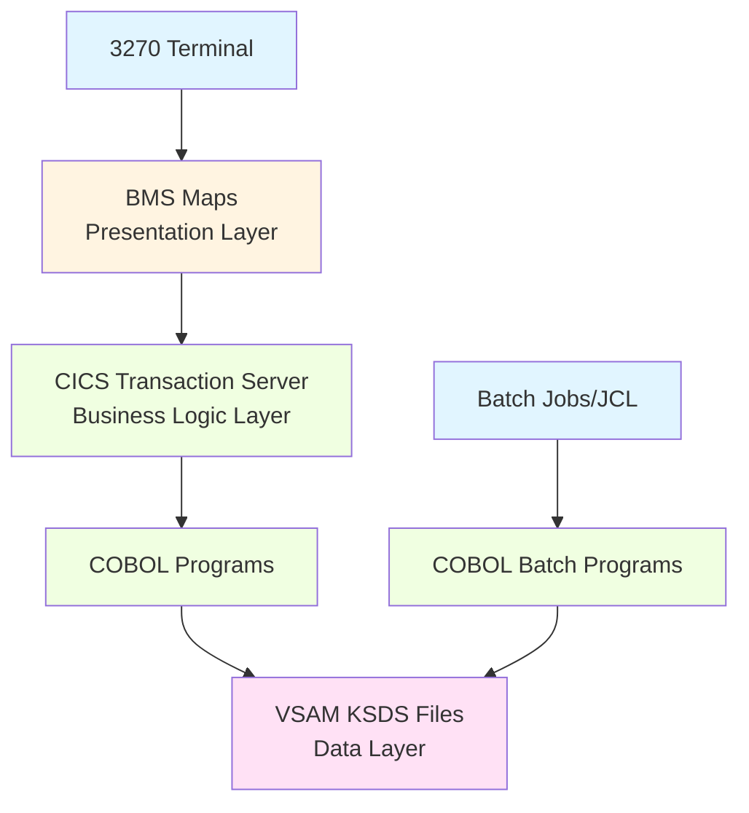
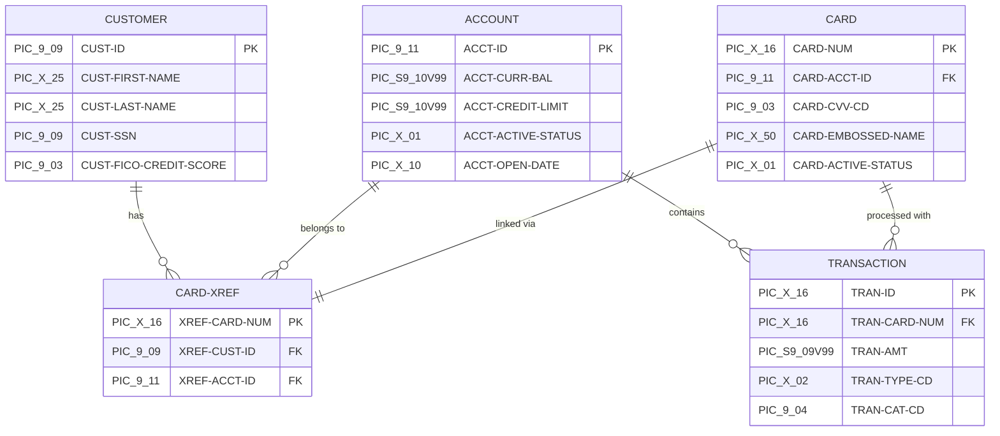
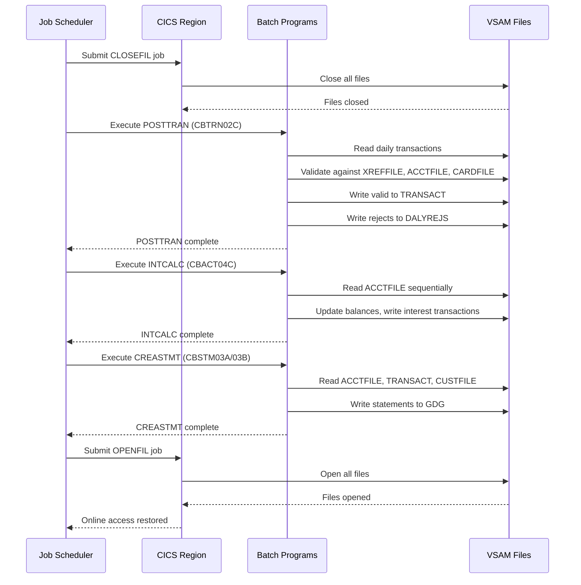
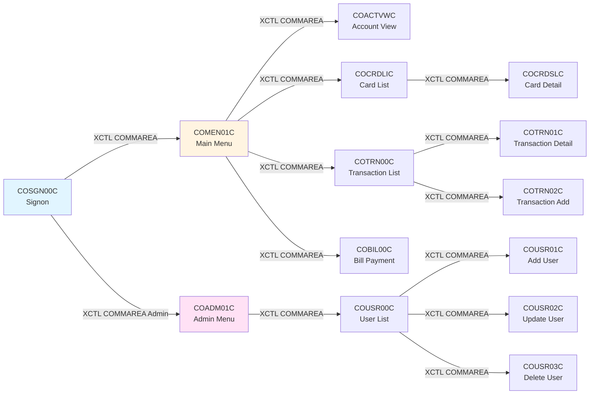
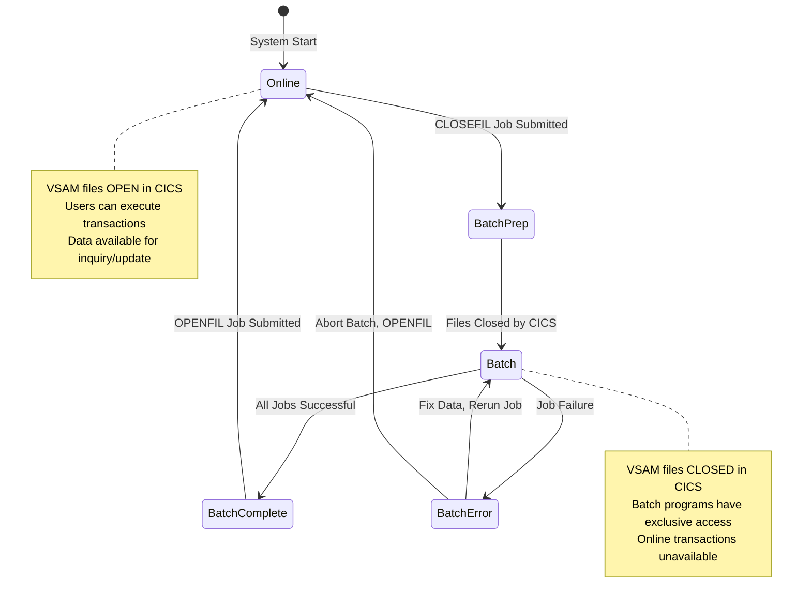

# CardDemo - Mainframe Credit Card Management Application

## Table of Contents

- [1. Project Overview](#1-project-overview)
  - [1.1 Mission and Purpose](#11-mission-and-purpose)
  - [1.2 Key Features](#12-key-features)
  - [1.3 Target Audience](#13-target-audience)
- [2. Architecture](#2-architecture)
  - [2.1 High-Level Architecture](#21-high-level-architecture)
  - [2.2 Core Components](#22-core-components)
  - [2.3 Architectural Patterns](#23-architectural-patterns)
  - [2.4 Technology Stack](#24-technology-stack)
- [3. Directory Structure](#3-directory-structure)
  - [3.1 Repository Organization](#31-repository-organization)
  - [3.2 Source Code Directories](#32-source-code-directories)
  - [3.3 Data and Configuration](#33-data-and-configuration)
- [4. Data Models](#4-data-models)
  - [4.1 Entity Overview](#41-entity-overview)
  - [4.2 Account Entity](#42-account-entity)
  - [4.3 Card Entity](#43-card-entity)
  - [4.4 Customer Entity](#44-customer-entity)
  - [4.5 Transaction Entity](#45-transaction-entity)
  - [4.6 Cross-Reference Entity](#46-cross-reference-entity)
  - [4.7 Entity Relationships](#47-entity-relationships)
- [5. Key Dependencies](#5-key-dependencies)
  - [5.1 Core Technologies](#51-core-technologies)
  - [5.2 IBM Mainframe Software](#52-ibm-mainframe-software)
  - [5.3 AWS Mainframe Modernization](#53-aws-mainframe-modernization)
- [6. Configuration](#6-configuration)
  - [6.1 Dataset Configuration](#61-dataset-configuration)
  - [6.2 VSAM File Definitions](#62-vsam-file-definitions)
  - [6.3 CICS Resource Definitions](#63-cics-resource-definitions)
- [7. Build & Deployment](#7-build--deployment)
  - [7.1 Prerequisites](#71-prerequisites)
  - [7.2 Installation Steps](#72-installation-steps)
  - [7.3 CICS Resource Installation](#73-cics-resource-installation)
  - [7.4 Verification](#74-verification)
- [8. Integration Points](#8-integration-points)
  - [8.1 CICS Transaction Catalog](#81-cics-transaction-catalog)
  - [8.2 Batch Job Inventory](#82-batch-job-inventory)
  - [8.3 VSAM File Interfaces](#83-vsam-file-interfaces)
  - [8.4 External Systems](#84-external-systems)
  - [8.5 Inter-Program Communication](#85-inter-program-communication)
- [9. Development Workflow](#9-development-workflow)
  - [9.1 Environment Setup](#91-environment-setup)
  - [9.2 Code Modification](#92-code-modification)
  - [9.3 Testing Procedures](#93-testing-procedures)
  - [9.4 Debugging Techniques](#94-debugging-techniques)
- [10. Operational Procedures](#10-operational-procedures)
  - [10.1 Daily Operations](#101-daily-operations)
  - [10.2 Batch Processing Cycle](#102-batch-processing-cycle)
  - [10.3 Monitoring and Maintenance](#103-monitoring-and-maintenance)
- [11. Additional Resources](#11-additional-resources)
- [12. Support and Community](#12-support-and-community)

---

## 1. Project Overview

### 1.1 Mission and Purpose

CardDemo is a comprehensive mainframe credit card management application designed and developed by AWS to test and showcase mainframe migration and modernization technologies. This reference application serves as a realistic, production-quality codebase that demonstrates typical mainframe development patterns, architectural decisions, and integration approaches used in enterprise financial services systems.

The application is intentionally built with diverse coding styles and patterns to provide comprehensive scenarios for analysis, transformation, and migration tooling used in mainframe modernization initiatives. CardDemo supports use cases including discovery and assessment, code transformation, performance testing, service enablement, service extraction, test creation, and test harness development.

As an AWS Mainframe Modernization reference application, CardDemo bridges traditional mainframe technology stacks with modern cloud-native architectures, enabling organizations to evaluate rehost, replatform, and refactor strategies for their legacy systems.

### 1.2 Key Features

CardDemo implements a complete credit card management system with the following functional capabilities:

- **Account Management** - Create, view, update, and manage customer credit card accounts with balance tracking, credit limits, and account status controls
- **Card Management** - Issue, activate, view, and update credit cards with support for multiple cards per account and card lifecycle management
- **Customer Management** - Maintain customer demographic information, contact details, and relationships to accounts and cards
- **Transaction Processing** - Enter, validate, and process credit card transactions with real-time authorization checks and balance updates
- **Batch Transaction Posting** - Automated posting of daily transactions with validation, reject handling, and balance calculations
- **Interest Calculation** - Periodic interest computation based on account balances and configured interest rates
- **Statement Generation** - Automated production of transaction statements in both text and HTML formats with archival to GDG datasets
- **Bill Payment** - Two-phase payment processing with balance updates and transaction recording
- **Report Generation** - Asynchronous report submission through transient data queues with JCL-based batch execution
- **User Administration** - Complete user lifecycle management including add, update, delete, and role-based access control
- **Security and Authentication** - Password-based authentication with user type validation and session management through COMMAREA

### 1.3 Target Audience

This technical specification is designed for multiple stakeholder groups involved in mainframe application development, maintenance, and modernization:

- **Developers** - Software engineers working with COBOL, CICS, and VSAM who need to understand program structure, data flows, and integration patterns
- **Architects** - Technical architects evaluating system design, component interactions, and modernization strategies for mainframe applications
- **Operators** - System operators and administrators responsible for deploying, configuring, and maintaining the CardDemo application in z/OS environments
- **Modernization Engineers** - Specialists using AWS Mainframe Modernization services to analyze, transform, or migrate mainframe applications to cloud platforms
- **Quality Assurance** - Test engineers who need to understand functional workflows, data models, and validation rules for test case development
- **Project Stakeholders** - Managers and decision-makers seeking to understand application capabilities, technical complexity, and modernization readiness

---

## 2. Architecture

### 2.1 High-Level Architecture

CardDemo follows a classic three-tier mainframe architecture pattern that separates presentation, business logic, and data persistence concerns. This architectural approach provides clear boundaries between system layers, enables independent scaling of components, and supports both online and batch processing modes within a unified codebase.

The architecture is designed around IBM CICS Transaction Server as the online transaction processing middleware, with COBOL programs implementing business logic and VSAM KSDS files providing persistent data storage. The presentation layer uses Basic Mapping Support (BMS) to define 3270 terminal interfaces with attribute-based field control and navigation.



### 2.2 Core Components

The CardDemo application is composed of four primary component categories, each serving distinct functional and operational roles within the system:

**Presentation Layer - BMS Maps and 3270 Terminals**

The presentation layer consists of BMS map sources that define 24x80 character-based screen layouts for 3270 terminal emulation. Maps are authored with LANG=COBOL, MODE=INOUT, STORAGE=AUTO, and TIOAPFX=YES settings, generating AI (input) and AO (output) copybooks that COBOL programs use for screen I/O operations. Visual attributes control field protection, intensity, highlighting, color, and numeric formatting. The BMS macro processor generates mapsets that CICS installs as presentation resources, creating a binary interface contract between programs and terminal displays.

Source location: app/bms/ directory with DFHMSD/DFHMDI/DFHMDF macro definitions

**Business Logic Layer - CICS and COBOL Programs**

The business logic layer implements application functionality through COBOL programs executing within CICS transaction server. Online programs (CO*.cbl naming pattern) handle pseudo-conversational transaction flows using EXEC CICS commands for terminal I/O (RECEIVE MAP, SEND MAP), file operations (READ, WRITE, REWRITE, DELETE), browse operations (STARTBR, READNEXT, READPREV, ENDBR), and program control (XCTL, RETURN). Batch programs (CB*.cbl naming pattern) perform sequential file processing, validation, calculation, and report generation using standard COBOL file I/O. Programs share data structures through copybooks and communicate session state via the CARDDEMO-COMMAREA structure.

Source location: app/cbl/ directory with 22 COBOL programs (13 online, 9 batch)

**Data Layer - VSAM KSDS Files**

The data layer uses VSAM Key-Sequenced Data Sets (KSDS) to store master files and transactional data with direct keyed access and sequential browse capabilities. Each KSDS cluster is defined with primary key fields, control interval sizes (CISIZE), buffer specifications, and shareoption settings. Online programs access VSAM files through EXEC CICS FILE commands with automatic record locking and RESP/RESP2 error handling. Batch programs use standard COBOL FD definitions with file status checking. The system supports alternate indexes for secondary key access patterns, such as the CXACAIX alternate index on the transaction file for account-based queries.

Key files: ACCTFILE (accounts), CARDFILE (cards), CUSTFILE (customers), TRANSACT (transactions), XREFFILE (cross-references), USRSEC (security), TCATBAL (category balances), DISCGRP (disclosure groups), TRANTYPE (transaction types), TRANCATG (transaction categories)

**Shared Data Structures - Copybooks**

Copybooks define record layouts, inter-program communication structures, and reusable code snippets that establish interface contracts across the application. Record layout copybooks (CVACT01Y, CVACT02Y, CVCUS01Y, CVTRA05Y, etc.) define master file structures with PIC clauses, REDEFINES, and OCCURS specifications. The CARDDEMO-COMMAREA copybook (COCOM01Y) defines session state passed between programs via EXEC CICS XCTL commands. Utility copybooks (CSUTLDTC, CSSETATY, CSSTRPFY) provide date/time conversion, attribute setting, and string parsing functions. BMS-generated copybooks (app/cpy-bms/) define AI/AO structures for terminal I/O.

Source location: app/cpy/ directory with 30+ copybooks and app/cpy-bms/ with 17 generated copybooks

### 2.3 Architectural Patterns

CardDemo demonstrates several key mainframe architectural patterns that are common in enterprise transaction processing systems:

**Pseudo-Conversational Processing**

CICS online programs follow the pseudo-conversational programming model where each program execution represents a single conversation turn with the terminal user. Programs execute, send a map to the terminal, and terminate with EXEC CICS RETURN TRANSID(next-trans), releasing all resources and task storage. When the user presses ENTER or a function key, CICS starts a new task instance that receives the terminal input and processes the next conversation turn. This pattern maximizes system throughput by avoiding task wait states and enables horizontal scaling of CICS regions.

**COMMAREA-Based State Management**

Session state is maintained across pseudo-conversational turns through the CARDDEMO-COMMAREA structure (COCOM01Y copybook). This communication area contains user identification, authentication status, navigation context (FROM-TRANID, TO-TRANID), and business entity identifiers (customer ID, account ID, card number). Programs receive COMMAREA via DFHCOMMAREA on entry and pass updated COMMAREA to the next program via EXEC CICS XCTL COMMAREA() or RETURN COMMAREA(). This pattern eliminates the need for temporary storage queues or database state tables for simple navigation flows.

Source: app/cpy/COCOM01Y.cpy defining CARDDEMO-COMMAREA structure

**Cross-Reference Pattern**

The application uses a dedicated cross-reference file (XREFFILE) to manage many-to-many relationships between customers, accounts, and cards. The CARD-XREF-RECORD structure (CVACT03Y copybook) contains XREF-CARD-NUM as the primary key with XREF-CUST-ID and XREF-ACCT-ID as payload fields. Programs perform XREFFILE lookups to navigate between entity identifiers without embedding foreign keys in multiple master files. This pattern centralizes relationship management and simplifies referential integrity maintenance.

Source: app/cpy/CVACT03Y.cpy and programs such as COCRDLIC.cbl, COCRDSLC.cbl

**Batch-Online Coordination**

The application coordinates batch processing windows with online transaction availability through CLOSEFIL and OPENFIL jobs. Before batch processing begins, CLOSEFIL (using IEFBR14) signals CICS to close shared VSAM files. Batch programs then gain exclusive access for sequential processing, validation, and update operations. After batch completion, OPENFIL signals CICS to reopen files for online access. This pattern prevents file contention and ensures data consistency during batch update cycles.

Source: Job sequences documented in existing README.md batch inventory

**BMS AI/AO Pattern**

BMS map generation creates paired copybooks with AI (Attention Identifier input) and AO (output) structures. The AI copybook defines input fields with length and attribute bytes that programs use with EXEC CICS RECEIVE MAP. The AO copybook defines output fields with attribute bytes (suffix C, P, H, V) and data fields (suffix O) that programs use with EXEC CICS SEND MAP. Programs manipulate attribute bytes to control field protection, intensity, color, and highlighting dynamically. This pattern separates logical field values from presentation attributes.

Source: app/cpy-bms/ directory with 17 generated copybook pairs

### 2.4 Technology Stack

CardDemo is built on a comprehensive IBM mainframe technology stack with dependencies on z/OS operating system services, CICS transaction middleware, COBOL programming language, and VSAM file management.

| Technology | Version | Purpose | Modernization Target |
|-----------|---------|---------|---------------------|
| Enterprise COBOL | COBOL-85+ | Business logic programming language for online and batch programs | Micro Focus COBOL (rehost) or Java (refactor via Blu Age) |
| CICS Transaction Server | 5.x+ compatible | Online transaction processing middleware providing terminal I/O, file access, program control, and task management | Micro Focus Enterprise Server (rehost) or microservices (refactor) |
| VSAM / DFSMS | z/OS component | Key-sequenced datasets (KSDS) for persistent data storage with direct and sequential access | Relational databases (Db2, PostgreSQL) or NoSQL (DynamoDB) |
| JCL / JES | z/OS component | Job Control Language for batch job orchestration and dataset management | AWS Batch or Step Functions (refactor) |
| BMS | CICS component | Basic Mapping Support for 3270 screen definitions and terminal I/O | Web UI (refactor to HTML/React/Angular) or API (service extraction) |
| IDCAMS | DFSMS component | VSAM dataset management utility for define, delete, repro, listcat operations | Cloud-native data migration tools |
| Language Environment | V2.x+ | Runtime services for date/time utilities, condition handling, and callable services | Cloud runtime (JVM, .NET, Node.js depending on target) |
| RACF | Optional | Security and access control for dataset and transaction authorization | AWS IAM and Secrets Manager (refactor) |

---

## 3. Directory Structure

### 3.1 Repository Organization

The CardDemo repository follows a well-organized structure that separates source code, data fixtures, documentation, and sample resources into distinct directory hierarchies. This organization supports clear separation of concerns and simplifies navigation for developers, operators, and tooling.

```
carddemo/
├── app/                  # Application source code and data
│   ├── bms/             # BMS map sources (3270 screen definitions)
│   ├── cbl/             # COBOL programs (online and batch)
│   ├── cpy/             # Copybooks (record layouts and utilities)
│   ├── cpy-bms/         # Generated BMS copybooks (AI/AO structures)
│   ├── data/            # Test data fixtures (ASCII format)
│   └── catlg/           # VSAM catalog metadata (LISTCAT output)
├── diagrams/            # Architecture and flow diagrams (PNG images)
├── samples/             # Sample JCL for compilation and deployment
├── CONTRIBUTING.md      # Contribution guidelines
├── CODE_OF_CONDUCT.md   # Community code of conduct
├── LICENSE              # Apache 2.0 license
└── README.md            # This technical specification
```

### 3.2 Source Code Directories

**app/bms - BMS Map Sources**

Contains DFHMSD/DFHMDI/DFHMDF BMS macro definitions that generate 3270 screen layouts and COBOL copybooks. Maps define 24x80 character screens with field positioning, attribute specifications (ASKIP, PROT, UNPROT, NUM, BRT, IC), color coding (BLUE, YELLOW, TURQUOISE, GREEN, RED), and numeric formatting (PICIN, PICOUT, JUSTIFY, ZERO). Each BMS source file generates a mapset that CICS installs as a presentation resource plus AI/AO copybooks for program I/O.

Key naming convention: Map names match program names (COSGN00, COMEN01, COACTVW, COACTUP, COCRDLI, etc.)

Build requirement: BMS macro processing must occur before COBOL compilation to generate required copybooks

Source reference: app/bms/ directory

**app/cbl - COBOL Programs**

Contains 22 COBOL source programs implementing online transaction handlers and batch processing logic:

- **Online programs (CO prefix)** - CICS transaction handlers using EXEC CICS commands for pseudo-conversational terminal I/O, file access, and program control. Programs follow numbered paragraph structure, use DFHCOMMAREA for input, implement SEND/RECEIVE MAP logic, and perform XCTL for navigation.

Key online programs: COSGN00C (authentication), COMEN01C (main menu), COADM01C (admin menu), COACTVWC (account view), COACTUPC (account update), COCRDLIC (card list), COCRDSLC (card detail), COCRDUPC (card update), COTRN00C/01C/02C (transaction functions), COBIL00C (bill payment), CORPT00C (reports), COUSR00C-03C (user administration)

- **Batch programs (CB prefix)** - Sequential file processors using standard COBOL FD definitions, file status checking, and mainframe utility patterns. Programs implement validation logic, calculation algorithms, and report generation.

Key batch programs: CBTRN02C (transaction posting with four-phase validation), CBACT04C (interest calculation), CBSTM03A/03B (statement generation with dual output formats), CBACT01C-03C (account batch operations), CBTRN01C/03C (transaction batch operations), CBCUS01C (customer operations)

Build requirement: Programs require copybook dependencies from app/cpy/ and app/cpy-bms/ directories

Source reference: app/cbl/ directory

**app/cpy - Copybooks**

Contains 30+ COBOL copybooks defining record layouts, communication structures, and utility modules:

- **Master file layouts** - CVACT01Y (ACCOUNT-RECORD, 300 bytes), CVACT02Y (CARD-RECORD, 150 bytes), CVCUS01Y (CUSTOMER-RECORD, 500 bytes) defining primary entity structures with PIC clauses and field specifications

- **Transaction layouts** - CVTRA05Y (TRAN-RECORD for online transactions, 350 bytes), CVTRA06Y (daily transaction format), CVTRA01Y through CVTRA04Y (category balances, disclosure groups, transaction types, transaction categories)

- **Cross-reference layout** - CVACT03Y (CARD-XREF-RECORD, 50 bytes) managing customer-account-card relationships

- **Communication area** - COCOM01Y (CARDDEMO-COMMAREA) defining session state structure passed between programs via XCTL

- **Utility modules** - CSUTLDTC (date/time conversion wrappers), CSSETATY (attribute setting), CSSTRPFY (string parsing), CUSTREC (customer structure)

Usage: Programs include copybooks via COPY statement, creating compile-time dependencies

Source reference: app/cpy/ directory

**app/cpy-bms - Generated BMS Copybooks**

Contains 17 COBOL copybooks automatically generated by BMS macro processing. Each BMS map generates an AI (input) and AO (output) copybook pair following a consistent structure:

- **AI copybooks** - Define input data structures with COMP fields for length/attribute followed by character buffers (PIC X) for field values. Programs use AI structures with EXEC CICS RECEIVE MAP INTO().

- **AO copybooks** - Define output data structures with attribute control fields (suffix C, P, H, V for cursor, protection, highlighting, validation) and output buffer fields (suffix O). Programs populate AO attribute fields with DFHBMSCA values and data fields with display content, then EXEC CICS SEND MAP FROM().

Pattern: 12-byte FILLER header, REDEFINES overlays for flat and structured views

Dependency: These copybooks are generated artifacts - do not modify directly, regenerate from app/bms/ sources

Source reference: app/cpy-bms/ directory

### 3.3 Data and Configuration

**app/data - Test Data Fixtures**

Contains ASCII test data files with fixed-width, headerless record formats that match copybook layouts:

- acctdata.txt - Account master test data (CVACT01Y layout, 300 bytes per record)
- carddata.txt - Card master test data (CVACT02Y layout, 150 bytes per record)
- custdata.txt - Customer master test data (CVCUS01Y layout, 500 bytes per record)
- cardxref.txt - Cross-reference test data (CVACT03Y layout, 50 bytes per record)
- dailytran.txt - Daily transaction test data (CVTRA06Y layout, 350 bytes per record)
- discgrp.txt - Disclosure group data (CVTRA02Y layout, 50 bytes)
- trantype.txt - Transaction type codes (CVTRA03Y layout, 60 bytes)
- trancatg.txt - Transaction category codes (CVTRA04Y layout, 60 bytes)
- tcatbal.txt - Transaction category balances (CVTRA01Y layout, 50 bytes)

Usage: Upload these files to mainframe datasets using binary transfer mode, then execute initialization JCL jobs (ACCTFILE, CARDFILE, CUSTFILE, etc.) to load data into VSAM KSDS files

Source reference: app/data/ directory

**app/catlg - VSAM Catalog Metadata**

Contains LISTCAT.txt, an IDCAMS LISTCAT output file providing VSAM catalog metadata for forensic analysis and migration planning. The file includes cluster definitions, DATA/INDEX component associations, extent information (CISIZE, key length, VOLSER), shareoption settings, and record count statistics. This metadata supports automated migration tooling that needs to understand VSAM file organization without accessing live mainframe systems.

Usage: Reference for dataset specifications, key field definitions, and performance tuning parameters

Source reference: app/catlg/LISTCAT.txt

**diagrams/ - Visual Documentation**

Contains PNG image files showing application flows, screen layouts, and user journeys:

- Application-Flow-User.png - User function workflow diagram
- Application-Flow-Admin.png - Admin function workflow diagram
- Signon-Screen.png - Screenshot of CC00 signon screen
- Main-Menu.png - Screenshot of CM00 main menu
- Admin-Menu.png - Screenshot of CA00 admin menu

Usage: Referenced throughout this README for visual representation of system flows

**samples/ - Sample JCL**

Contains sample Job Control Language (JCL) scripts demonstrating compilation procedures, dataset allocation, and resource definition patterns for mainframe environments. These samples help developers craft JCL appropriate for their mainframe shop floor standards.

Usage: Templates for compilation JCL, link-edit procedures, and CICS resource definition

---

## 4. Data Models

### 4.1 Entity Overview

CardDemo implements a normalized relational data model using VSAM KSDS files to represent five core entities and their relationships. The data model supports account-based credit card management with customer demographics, card inventory, transaction history, and cross-reference navigation. Each entity is defined through a COBOL copybook that specifies field names, data types, lengths, and record structure.

The five primary entities are:

- **Account** - Credit card accounts with balance, limits, and lifecycle dates
- **Card** - Physical/virtual cards linked to accounts with activation status
- **Customer** - Customer demographic and contact information
- **Transaction** - Credit card transaction records with merchant details
- **Cross-Reference** - Mapping between customers, accounts, and cards

### 4.2 Account Entity

The Account entity represents credit card accounts with financial balances, credit limits, and temporal lifecycle attributes. Accounts are the central financial entity in the system, tracking current balance, available credit, cycle-to-date activity, and relationship to disclosure groups.

**Record Layout:** ACCOUNT-RECORD defined in CVACT01Y copybook (300 bytes)

| Field Name | Data Type | Length | Description |
|-----------|-----------|--------|-------------|
| ACCT-ID | PIC 9(11) | 11 digits | Primary key - unique account identifier |
| ACCT-ACTIVE-STATUS | PIC X(01) | 1 character | Account status flag (Y/N) |
| ACCT-CURR-BAL | PIC S9(10)V99 | 12 bytes | Current account balance (signed, 2 decimal places) |
| ACCT-CREDIT-LIMIT | PIC S9(10)V99 | 12 bytes | Maximum credit limit |
| ACCT-CASH-CREDIT-LIMIT | PIC S9(10)V99 | 12 bytes | Cash advance limit |
| ACCT-OPEN-DATE | PIC X(10) | 10 characters | Account opening date (YYYY-MM-DD) |
| ACCT-EXPIRAION-DATE | PIC X(10) | 10 characters | Account expiration date |
| ACCT-REISSUE-DATE | PIC X(10) | 10 characters | Last reissue date |
| ACCT-CURR-CYC-CREDIT | PIC S9(10)V99 | 12 bytes | Current cycle credit total |
| ACCT-CURR-CYC-DEBIT | PIC S9(10)V99 | 12 bytes | Current cycle debit total |
| ACCT-ADDR-ZIP | PIC X(10) | 10 characters | Account billing ZIP code |
| ACCT-GROUP-ID | PIC X(10) | 10 characters | Disclosure group identifier |
| FILLER | PIC X(178) | 178 bytes | Reserved for future use |

**VSAM File:** ACCTFILE (KSDS keyed on ACCT-ID)

**Access Patterns:**
- Direct read by ACCT-ID for account inquiries (COACTVWC, COACTUPC)
- Update for balance changes and account modifications (COACTUPC, CBTRN02C, CBACT04C)
- Sequential scan for batch processing (CBACT04C interest calculation, CBSTM03A statement generation)

Source: app/cpy/CVACT01Y.cpy

### 4.3 Card Entity

The Card entity represents physical or virtual credit cards issued to customers and linked to accounts. Cards contain card number, CVV, embossed name, expiration date, and activation status. Multiple cards can be associated with a single account through the cross-reference file.

**Record Layout:** CARD-RECORD defined in CVACT02Y copybook (150 bytes)

| Field Name | Data Type | Length | Description |
|-----------|-----------|--------|-------------|
| CARD-NUM | PIC X(16) | 16 characters | Primary key - credit card number (PAN) |
| CARD-ACCT-ID | PIC 9(11) | 11 digits | Foreign key to ACCTFILE |
| CARD-CVV-CD | PIC 9(03) | 3 digits | Card verification value (CVV/CVV2) |
| CARD-EMBOSSED-NAME | PIC X(50) | 50 characters | Name embossed on card |
| CARD-EXPIRAION-DATE | PIC X(10) | 10 characters | Card expiration date (YYYY-MM-DD) |
| CARD-ACTIVE-STATUS | PIC X(01) | 1 character | Card activation status (Y/N) |
| FILLER | PIC X(59) | 59 bytes | Reserved for future use |

**VSAM File:** CARDFILE (KSDS keyed on CARD-NUM)

**Access Patterns:**
- Direct read by CARD-NUM for card detail display (COCRDSLC, COCRDUPC)
- Update for card activation and modification (COCRDUPC)
- Browse via XREFFILE to list cards by account (COCRDLIC)
- Validation lookup during transaction entry (COTRN02C)

Source: app/cpy/CVACT02Y.cpy

### 4.4 Customer Entity

The Customer entity stores demographic information, contact details, and identity verification data for cardholders. Customers can have multiple accounts and cards, with relationships managed through the cross-reference file.

**Record Layout:** CUSTOMER-RECORD defined in CVCUS01Y copybook (500 bytes)

| Field Name | Data Type | Length | Description |
|-----------|-----------|--------|-------------|
| CUST-ID | PIC 9(09) | 9 digits | Primary key - unique customer identifier |
| CUST-FIRST-NAME | PIC X(25) | 25 characters | Customer first name |
| CUST-MIDDLE-NAME | PIC X(25) | 25 characters | Customer middle name |
| CUST-LAST-NAME | PIC X(25) | 25 characters | Customer last name |
| CUST-ADDR-LINE-1 | PIC X(50) | 50 characters | Address line 1 |
| CUST-ADDR-LINE-2 | PIC X(50) | 50 characters | Address line 2 |
| CUST-ADDR-LINE-3 | PIC X(50) | 50 characters | Address line 3 |
| CUST-ADDR-STATE-CD | PIC X(02) | 2 characters | State code |
| CUST-ADDR-COUNTRY-CD | PIC X(03) | 3 characters | Country code |
| CUST-ADDR-ZIP | PIC X(10) | 10 characters | ZIP/postal code |
| CUST-PHONE-NUM-1 | PIC X(15) | 15 characters | Primary phone number |
| CUST-PHONE-NUM-2 | PIC X(15) | 15 characters | Secondary phone number |
| CUST-SSN | PIC 9(09) | 9 digits | Social Security Number (PII) |
| CUST-GOVT-ISSUED-ID | PIC X(20) | 20 characters | Government ID (PII) |
| CUST-DOB-YYYY-MM-DD | PIC X(10) | 10 characters | Date of birth (YYYY-MM-DD) |
| CUST-EFT-ACCOUNT-ID | PIC X(10) | 10 characters | EFT account identifier |
| CUST-PRI-CARD-HOLDER-IND | PIC X(01) | 1 character | Primary cardholder indicator |
| CUST-FICO-CREDIT-SCORE | PIC 9(03) | 3 digits | FICO credit score |
| FILLER | PIC X(168) | 168 bytes | Reserved for future use |

**VSAM File:** CUSTFILE (KSDS keyed on CUST-ID)

**Access Patterns:**
- Direct read by CUST-ID for customer inquiries
- Lookup via XREFFILE to retrieve customer from card or account
- Sequential scan for batch reporting

**Security Note:** Contains PII (SSN, government ID) requiring access controls and audit logging

Source: app/cpy/CVCUS01Y.cpy

### 4.5 Transaction Entity

The Transaction entity records credit card transactions with merchant information, transaction amounts, type/category codes, and processing timestamps. Transactions are entered online (COTRN02C) and posted in batch (CBTRN02C) with validation against account limits and card expiration.

**Record Layout:** TRAN-RECORD defined in CVTRA05Y copybook (350 bytes)

| Field Name | Data Type | Length | Description |
|-----------|-----------|--------|-------------|
| TRAN-ID | PIC X(16) | 16 characters | Primary key - unique transaction identifier |
| TRAN-TYPE-CD | PIC X(02) | 2 characters | Transaction type code (reference TRANTYPE) |
| TRAN-CAT-CD | PIC 9(04) | 4 digits | Transaction category code (reference TRANCATG) |
| TRAN-SOURCE | PIC X(10) | 10 characters | Transaction source system |
| TRAN-DESC | PIC X(100) | 100 characters | Transaction description |
| TRAN-AMT | PIC S9(09)V99 | 11 bytes | Transaction amount (signed, 2 decimal places) |
| TRAN-MERCHANT-ID | PIC 9(09) | 9 digits | Merchant identifier |
| TRAN-MERCHANT-NAME | PIC X(50) | 50 characters | Merchant name |
| TRAN-MERCHANT-CITY | PIC X(50) | 50 characters | Merchant city |
| TRAN-MERCHANT-ZIP | PIC X(10) | 10 characters | Merchant ZIP code |
| TRAN-CARD-NUM | PIC X(16) | 16 characters | Card number (foreign key to CARDFILE) |
| TRAN-ORIG-TS | PIC X(26) | 26 characters | Original transaction timestamp |
| TRAN-PROC-TS | PIC X(26) | 26 characters | Processing timestamp |
| FILLER | PIC X(20) | 20 bytes | Reserved for future use |

**VSAM Files:**
- TRANSACT (KSDS keyed on TRAN-ID) - Primary transaction file
- CXACAIX (AIX with alternate key on card/account) - Enables browsing transactions by account

**Access Patterns:**
- Insert new transactions via COTRN02C (online entry)
- Direct read by TRAN-ID for transaction detail (COTRN01C)
- Browse by account using CXACAIX alternate index (COTRN00C transaction list)
- Sequential scan during batch posting (CBTRN02C) and statement generation (CBSTM03A)

Source: app/cpy/CVTRA05Y.cpy

### 4.6 Cross-Reference Entity

The Cross-Reference entity implements a many-to-many relationship between customers, accounts, and cards. This entity enables navigation from any identifier (customer ID, account ID, or card number) to the related entities without embedding foreign keys in multiple master files.

**Record Layout:** CARD-XREF-RECORD defined in CVACT03Y copybook (50 bytes)

| Field Name | Data Type | Length | Description |
|-----------|-----------|--------|-------------|
| XREF-CARD-NUM | PIC X(16) | 16 characters | Primary key - card number |
| XREF-CUST-ID | PIC 9(09) | 9 digits | Customer identifier (links to CUSTFILE) |
| XREF-ACCT-ID | PIC 9(11) | 11 digits | Account identifier (links to ACCTFILE) |
| FILLER | PIC X(14) | 14 bytes | Reserved for future use |

**VSAM File:** XREFFILE (KSDS keyed on XREF-CARD-NUM)

**Access Patterns:**
- Direct read by card number to retrieve associated customer and account IDs
- Sequential browse to list all cards for a customer or account
- Lookup during transaction processing to validate card-account-customer relationships

Source: app/cpy/CVACT03Y.cpy

### 4.7 Entity Relationships

The CardDemo data model implements a hub-and-spoke relationship pattern with the Cross-Reference entity serving as the central integration point between customers, accounts, and cards. This design supports flexible cardinality (one customer with multiple accounts, one account with multiple cards) and simplifies referential integrity management.



**Relationship Rules:**

- One CUSTOMER can have multiple ACCOUNT relationships (via CARD-XREF)
- One ACCOUNT can have multiple CARD instances (one-to-many)
- One CARD is linked to exactly one ACCOUNT and one CUSTOMER (via CARD-XREF)
- One ACCOUNT can have multiple TRANSACTION records (one-to-many)
- One CARD can process multiple TRANSACTION records (one-to-many)

**Referential Integrity:**

The application enforces referential integrity through validation logic in COBOL programs rather than database constraints:

- CBTRN02C validates TRAN-CARD-NUM exists in XREFFILE before posting transactions
- CBTRN02C validates linked ACCT-ID exists in ACCTFILE with active status
- COCRDUPC validates CARD-ACCT-ID exists in ACCTFILE before card updates
- Delete operations are not implemented to preserve transaction history and audit trail

---

## 5. Key Dependencies

### 5.1 Core Technologies

CardDemo depends on IBM mainframe technology components that provide the runtime environment, development tooling, and middleware services required for online transaction processing and batch job execution.

| Technology | Version Requirement | Purpose in CardDemo |
|-----------|-------------------|-------------------|
| Enterprise COBOL for z/OS | COBOL-85 or later | Programming language for all business logic implementation (22 programs in app/cbl/) |
| IBM CICS Transaction Server | V5.x or later | Online transaction processing middleware providing terminal I/O, file management, program control, and task management services |
| z/OS Operating System | V2.4 or later | Base operating system providing JCL, JES job scheduling, VSAM file system, and system services |
| VSAM (Virtual Storage Access Method) | DFSMS component | Persistent data storage using key-sequenced datasets (KSDS) for master files and transaction data |
| JCL (Job Control Language) | z/OS JES2/JES3 | Batch job orchestration for dataset management, program execution, and file operations |
| BMS (Basic Mapping Support) | CICS component | 3270 terminal screen definition and I/O management for presentation layer |
| IDCAMS | DFSMS component | VSAM dataset utilities for DEFINE, DELETE, REPRO, LISTCAT, and BLDINDEX operations |

### 5.2 IBM Mainframe Software

**z/OS Language Environment**

The Language Environment (LE) provides runtime services that COBOL programs depend on for date/time operations, condition handling, and callable services. CardDemo uses LE services through:

- CSUTLDTC copybook wrapping CEE date/time APIs for date format conversion and validation
- CEE3ABD for controlled abend processing with return code specification
- Storage management and runtime initialization services

Version: V2.x or later compatible with COBOL compiler

**CICS Transaction Server Components**

CICS provides multiple integrated services that CardDemo programs invoke through EXEC CICS API commands:

- **Terminal Control** - RECEIVE MAP, SEND MAP for BMS screen I/O
- **File Control** - READ, WRITE, REWRITE, DELETE, STARTBR, READNEXT, READPREV, ENDBR for VSAM access
- **Program Control** - XCTL, LINK, RETURN for program navigation and pseudo-conversational flow
- **Transient Data Control** - WRITEQ TD for TDQ-based report submission (CORPT00C)
- **Task Control** - EXEC CICS RETURN TRANSID for pseudo-conversational restart
- **Temporary Storage** - Not currently used but available for future enhancements

Configuration: Requires CICS region with CARDDEMO group containing PROGRAM, TRANSACTION, MAPSET, FILE definitions

**RACF (Resource Access Control Facility)**

Optional security component for:

- Dataset access authorization (read/write/update/delete permissions)
- Transaction-level security (ATTACHSEC, RESSEC settings)
- User authentication (alternative to USRSEC file-based authentication)

CardDemo includes file-based security (USRSEC file) and can integrate with RACF for enterprise security requirements.

### 5.3 AWS Mainframe Modernization

CardDemo is designed as a reference application for AWS Mainframe Modernization service, supporting both rehost and refactor patterns for cloud migration.

**Rehost Pattern - Micro Focus Enterprise Server**

AWS Mainframe Modernization Rehost pattern uses Micro Focus Enterprise Server to run COBOL and CICS applications on Linux x86 instances:

- Micro Focus COBOL compiler translates Enterprise COBOL programs to x86 native code
- Micro Focus Enterprise Server provides CICS API compatibility
- VSAM files map to EBCDIC-encoded indexed files or relational database tables
- BMS maps render through terminal emulation or web-enabled presentation layer

Rehost approach preserves source code with minimal changes, focusing on runtime environment substitution.

**Refactor Pattern - Blu Age**

AWS Mainframe Modernization Refactor pattern uses Blu Age automated transformation to convert COBOL to Java:

- COBOL programs transform to Java classes with equivalent business logic
- CICS commands transform to Spring Boot service calls
- VSAM files transform to JPA entities with relational database persistence
- BMS maps transform to REST APIs or web UI components (Angular/React)

Refactor approach modernizes architecture, technology stack, and often decompose monoliths into microservices.

**AWS Services Integration**

Modernized CardDemo deployments typically integrate with AWS services:

- **Amazon RDS or DynamoDB** - Replace VSAM KSDS files with managed database services
- **AWS Batch or Step Functions** - Replace JCL-orchestrated batch jobs with cloud-native workflows
- **Application Load Balancer + API Gateway** - Replace 3270 terminal access with web or API interfaces
- **Amazon S3** - Replace GDG datasets for statement archival
- **AWS Secrets Manager** - Replace USRSEC file with centralized credential management
- **Amazon CloudWatch** - Add observability for metrics, logs, and traces

---

## 6. Configuration

### 6.1 Dataset Configuration

CardDemo follows IBM mainframe dataset naming conventions using a High Level Qualifier (HLQ) to group all application datasets under a common prefix. The HLQ pattern supports environment separation (development, test, production) and simplifies dataset management through consistent naming.

**HLQ Naming Convention**

The recommended HLQ format is: `<HLQ>.CARDDEMO.<DATASET-TYPE>`

Example with AWS.M2 as HLQ:

| Dataset Name | Record Format | Record Length | Purpose |
|--------------|---------------|---------------|---------|
| AWS.M2.CARDDEMO.JCL | FB (Fixed Block) | 80 | Job Control Language scripts |
| AWS.M2.CARDDEMO.PROC | FB | 80 | Cataloged procedures |
| AWS.M2.CARDDEMO.CBL | FB | 80 | COBOL source code (app/cbl/) |
| AWS.M2.CARDDEMO.CPY | FB | 80 | Copybook source (app/cpy/) |
| AWS.M2.CARDDEMO.BMS | FB | 80 | BMS map source (app/bms/) |
| AWS.M2.CARDDEMO.LOADLIB | U (Undefined) | varies | Compiled load modules |

**Sequential File Datasets for Data Upload**

During initial installation, ASCII test data files upload to sequential datasets:

| Dataset Name | Copybook Layout | Record Format | Record Length | Source File |
|--------------|-----------------|---------------|---------------|-------------|
| AWS.M2.CARDDEMO.USRSEC.PS | CSUSR01Y | FB | 80 | Inline in DUSRSECJ job |
| AWS.M2.CARDDEMO.ACCTDATA.PS | CVACT01Y | FB | 300 | acctdata.txt |
| AWS.M2.CARDDEMO.CARDDATA.PS | CVACT02Y | FB | 150 | carddata.txt |
| AWS.M2.CARDDEMO.CUSTDATA.PS | CVCUS01Y | FB | 500 | custdata.txt |
| AWS.M2.CARDDEMO.CARDXREF.PS | CVACT03Y | FB | 50 | cardxref.txt |
| AWS.M2.CARDDEMO.DALYTRAN.PS | CVTRA06Y | FB | 350 | dailytran.txt |
| AWS.M2.CARDDEMO.DISCGRP.PS | CVTRA02Y | FB | 50 | discgrp.txt |
| AWS.M2.CARDDEMO.TRANCATG.PS | CVTRA04Y | FB | 60 | trancatg.txt |
| AWS.M2.CARDDEMO.TRANTYPE.PS | CVTRA03Y | FB | 60 | trantype.txt |
| AWS.M2.CARDDEMO.TCATBALF.PS | CVTRA01Y | FB | 50 | tcatbal.txt |

### 6.2 VSAM File Definitions

CardDemo uses VSAM Key-Sequenced Data Sets (KSDS) for persistent storage with primary key access and sequential browse capabilities. Each KSDS cluster consists of a DATA component and an INDEX component managed by DFSMS.

**VSAM KSDS Specifications**

| VSAM File | DD Name | Key Field | Key Offset | Key Length | Record Length | CISIZE | Description |
|-----------|---------|-----------|------------|------------|---------------|--------|-------------|
| ACCTDAT | ACCTFILE | ACCT-ID | 0 | 11 | 300 | 4096 | Account master file |
| CARDDAT | CARDFILE | CARD-NUM | 0 | 16 | 150 | 4096 | Card master file |
| CUSTDAT | CUSTFILE | CUST-ID | 0 | 9 | 500 | 4096 | Customer master file |
| CARDAIX | XREFFILE | XREF-CARD-NUM | 0 | 16 | 50 | 2048 | Card cross-reference |
| TRANSACT | TRANSACT | TRAN-ID | 0 | 16 | 350 | 8192 | Transaction file |
| USRSEC | USRSEC | USER-ID | 0 | 8 | 80 | 2048 | User security file |
| TCATBALF | TCATBAL | Category key | 0 | varies | 50 | 2048 | Transaction category balances |
| DISCGRP | DISCGRP | Group key | 0 | varies | 50 | 2048 | Disclosure groups |
| TRANTYPE | TRANTYPE | Type key | 0 | varies | 60 | 2048 | Transaction types |
| TRANCATG | TRANCATG | Category key | 0 | varies | 60 | 2048 | Transaction categories |

**Alternate Index Definitions**

| AIX Name | Base Cluster | Alternate Key Field | Purpose |
|----------|--------------|-------------------|---------|
| CXACAIX | TRANSACT | Account ID + Card Num | Browse transactions by account for statement generation and account inquiry |

**VSAM Initialization Sequence**

JCL jobs execute in order to allocate VSAM clusters and load initial data:

1. CLOSEFIL - Closes files in CICS (IEFBR14)
2. DUSRSECJ - Defines and loads USRSEC with default users (ADMIN001, USER0001)
3. ACCTFILE - Defines ACCTDAT and loads from ACCTDATA.PS
4. CARDFILE - Defines CARDDAT and loads from CARDDATA.PS
5. CUSTFILE - Defines CUSTDAT and loads from CUSTDATA.PS
6. XREFFILE - Defines CARDAIX and loads from CARDXREF.PS
7. TRANFILE - Defines TRANSACT and loads from DALYTRAN.PS.INIT
8. DISCGRP - Defines DISCGRP and loads from DISCGRP.PS
9. TCATBALF - Defines TCATBALF and loads from TCATBALF.PS
10. TRANCATG - Defines TRANCATG and loads from TRANCATG.PS
11. TRANTYPE - Defines TRANTYPE and loads from TRANTYPE.PS
12. TRANIDX - Builds alternate index CXACAIX on TRANSACT
13. OPENFIL - Makes files available to CICS (IEFBR14)

### 6.3 CICS Resource Definitions

CardDemo requires comprehensive CICS resource definitions in the CARDDEMO group for programs, transactions, mapsets, and files. Resources can be defined using DFHCSDUP (batch CSD utility) or CEDA (online resource definition transaction).

**PROGRAM Definitions**

All COBOL programs require PROGRAM resource definitions with these key attributes:

```
DEFINE PROGRAM(program-name) GROUP(CARDDEMO)
  DESCRIPTION(function description)
  LANGUAGE(COBOL)
  DATALOCATION(ANY)
  EXECKEY(USER)
  CONCURRENCY(QUASIRENT)
```

Key programs: COSGN00C, COMEN01C, COADM01C, COACTVWC, COACTUPC, COCRDLIC, COCRDSLC, COCRDUPC, COTRN00C, COTRN01C, COTRN02C, COBIL00C, CORPT00C, COUSR00C, COUSR01C, COUSR02C, COUSR03C (online) plus batch programs if needed for testing

**TRANSACTION Definitions**

Transaction IDs must map to entry point programs:

```
DEFINE TRANSACTION(trans-id) GROUP(CARDDEMO)
  PROGRAM(program-name)
  DESCRIPTION(transaction description)
  TASKDATALOC(ANY)
  TWASIZE(0)
```

Key transactions: CC00 (signon), CM00 (main menu), CA00 (admin menu), CAVW (account view), CAUP (account update), CCLI (card list), CCDL (card detail), CCUP (card update), CT00 (transaction list), CT01 (transaction view), CT02 (transaction add), CB00 (bill payment), CR00 (reports), CU00-CU03 (user admin)

**MAPSET Definitions**

BMS mapsets generated from app/bms/ sources require MAPSET definitions:

```
DEFINE MAPSET(mapset-name) GROUP(CARDDEMO)
  DESCRIPTION(map description)
  RESIDENT(NO)
  USAGE(NORMAL)
```

Key mapsets: COSGN00, COMEN01, COADM01, COACTVW, COACTUP, COCRDLI, COCRDSL, COCRDUP, COTRN00, COTRN01, COTRN02, COBIL00, CORPT00, COUSR00, COUSR01, COUSR02, COUSR03

**FILE Definitions**

VSAM datasets require FILE definitions for CICS access:

```
DEFINE FILE(file-ddname) GROUP(CARDDEMO)
  DESCRIPTION(file description)
  DSNAME(dataset-name)
  STATUS(ENABLED)
  OPENTIME(FIRSTREF)
  DISPOSITION(SHR)
  LSRPOOLID(1)
  STRINGS(3)
  READINTEG(UNCOMMITTED)
  ADD(YES) BROWSE(YES) DELETE(YES) READ(YES) UPDATE(YES)
```

Key file DD names: ACCTFILE, CARDFILE, CUSTFILE, XREFFILE, TRANSACT, USRSEC, TCATBAL, DISCGRP, TRANTYPE, TRANCATG, CXACAIX (alternate index path)

**Installation Commands**

After defining resources, install them to make them active:

```
CEDA INSTALL GROUP(CARDDEMO)
```

For individual resource updates:

```
CEDA INSTALL TRANSACTION(CC00) GROUP(CARDDEMO)
CEDA INSTALL PROGRAM(COSGN00C) GROUP(CARDDEMO)
CEDA INSTALL FILE(ACCTFILE) GROUP(CARDDEMO)
CECI LOAD PROG(COSGN00C)
CEMT SET PROG(COSGN00C) NEWCOPY
```

---

## 7. Build & Deployment

### 7.1 Prerequisites

**Mainframe Environment Requirements**

- z/OS operating system V2.4 or later with active JES2 or JES3 subsystem
- CICS Transaction Server V5.x or later with configured CICS region
- Enterprise COBOL compiler for z/OS with COBOL-85 or later support
- VSAM/DFSMS with authority to define and manage KSDS clusters
- BMS macro processor integrated with CICS installation
- IDCAMS utility for VSAM dataset management
- TSO/ISPF or equivalent mainframe editor for source code management
- Sufficient storage allocation authority for creating datasets and load libraries

**User Authority Requirements**

- READ authority to clone/download repository source files
- CREATE authority for allocating sequential and VSAM datasets
- UPDATE authority for loading data into VSAM files
- CICS administrator authority for defining programs, transactions, mapsets, and files
- JES job submission authority for running compilation and initialization jobs

**Development Tools**

- 3270 terminal emulator for online testing (Personal Communications, Vista TN3270, etc.)
- File transfer utility supporting binary mode for EBCDIC data transfer
- JCL editor for customizing compilation and job scripts
- CICS CEDA transaction access for resource definition
- CEDF transaction access for debugging online programs

### 7.2 Installation Steps

**Step 1: Clone Repository**

Clone the CardDemo repository to your local development environment:

```
git clone https://github.com/aws-samples/aws-mainframe-modernization-carddemo.git
cd aws-mainframe-modernization-carddemo
```

**Step 2: Create Mainframe Datasets**

Allocate datasets on the mainframe using your chosen HLQ (example uses AWS.M2):

```
//ALLOCATE JOB
//ALLOC01 EXEC PGM=IEFBR14
//CBL      DD DSN=AWS.M2.CARDDEMO.CBL,DISP=(NEW,CATLG),
//            SPACE=(TRK,(50,10)),RECFM=FB,LRECL=80
//CPY      DD DSN=AWS.M2.CARDDEMO.CPY,DISP=(NEW,CATLG),
//            SPACE=(TRK,(20,5)),RECFM=FB,LRECL=80
//BMS      DD DSN=AWS.M2.CARDDEMO.BMS,DISP=(NEW,CATLG),
//            SPACE=(TRK,(20,5)),RECFM=FB,LRECL=80
```

**Step 3: Upload Source Code**

Upload application source folders from the repository to mainframe datasets using your file transfer tool in ASCII-to-EBCDIC mode:

- app/bms/* → AWS.M2.CARDDEMO.BMS
- app/cbl/* → AWS.M2.CARDDEMO.CBL
- app/cpy/* → AWS.M2.CARDDEMO.CPY

**Step 4: Upload Test Data**

Upload ASCII test data files to sequential datasets using binary transfer mode:

- app/data/acctdata.txt → AWS.M2.CARDDEMO.ACCTDATA.PS
- app/data/carddata.txt → AWS.M2.CARDDEMO.CARDDATA.PS
- app/data/custdata.txt → AWS.M2.CARDDEMO.CUSTDATA.PS
- app/data/cardxref.txt → AWS.M2.CARDDEMO.CARDXREF.PS
- app/data/dailytran.txt → AWS.M2.CARDDEMO.DALYTRAN.PS
- app/data/discgrp.txt → AWS.M2.CARDDEMO.DISCGRP.PS
- app/data/trancatg.txt → AWS.M2.CARDDEMO.TRANCATG.PS
- app/data/trantype.txt → AWS.M2.CARDDEMO.TRANTYPE.PS
- app/data/tcatbal.txt → AWS.M2.CARDDEMO.TCATBALF.PS

**Step 5: Compile BMS Maps**

Process BMS map sources through the BMS macro processor to generate mapsets and copybooks. This step is critical and must occur before COBOL compilation.

**Step 6: Compile COBOL Programs**

Compile all COBOL programs from AWS.M2.CARDDEMO.CBL into load modules in AWS.M2.CARDDEMO.LOADLIB. Use your mainframe shop's standard compilation procedures. Sample JCL templates are available in the samples/ directory.

Key compilation considerations:
- Include copybook library (AWS.M2.CARDDEMO.CPY) in SYSLIB concatenation
- Include generated BMS copybooks (app/cpy-bms/) in SYSLIB concatenation
- Use CICS translator or integrated COBOL compiler with CICS option
- Link-edit with CICS stub library

**Step 7: Initialize VSAM Files**

Execute VSAM initialization jobs in the specified order to allocate clusters and load initial data:

| Sequence | Job Name | Description |
|----------|----------|-------------|
| 1 | DUSRSECJ | Sets up user security VSAM file with default users (ADMIN001/PASSWORD, USER0001/PASSWORD) |
| 2 | CLOSEFIL | Closes VSAM files in CICS to enable batch allocation |
| 3 | ACCTFILE | Defines and loads account master file from ACCTDATA.PS |
| 4 | CARDFILE | Defines and loads card master file from CARDDATA.PS |
| 5 | CUSTFILE | Defines and loads customer master file from CUSTDATA.PS |
| 6 | XREFFILE | Defines and loads cross-reference file from CARDXREF.PS |
| 7 | TRANFILE | Defines and loads transaction file initialization record |
| 8 | DISCGRP | Defines and loads disclosure group file from DISCGRP.PS |
| 9 | TCATBALF | Defines and loads transaction category balance file from TCATBALF.PS |
| 10 | TRANCATG | Defines and loads transaction category file from TRANCATG.PS |
| 11 | TRANTYPE | Defines and loads transaction type file from TRANTYPE.PS |
| 12 | TRANIDX | Defines alternate index CXACAIX on transaction file |
| 13 | DEFGDGB | Defines GDG base for statement archival |
| 14 | OPENFIL | Makes files available to CICS for online access |

Edit each JCL job to replace HLQ placeholders with your environment's HLQ before submission.

### 7.3 CICS Resource Installation

CardDemo provides two approaches for installing CICS resources: DFHCSDUP batch utility (preferred) or CEDA online transaction (manual). Both methods define programs, transactions, mapsets, and files in the CARDDEMO group.

**Approach 1: DFHCSDUP Batch Utility (Preferred)**

The preferred method uses DFHCSDUP to install resources from a CSD definition file provided in the CSD folder:

```
//DFHCSDUP JOB
//CSDUP    EXEC PGM=DFHCSDUP
//STEPLIB  DD DSN=CICS.SDFHLOAD,DISP=SHR
//DFHCSD   DD DSN=CICS.DFHCSD,DISP=SHR
//SYSPRINT DD SYSOUT=*
//SYSIN    DD DSN=AWS.M2.CARDDEMO.CSD,DISP=SHR
```

Advantages: Repeatable, version-controlled, supports CI/CD pipelines, batch execution

**Approach 2: CEDA Transaction (Manual)**

Alternative method uses CEDA online transaction to define resources interactively:

```
DEFINE GROUP(CARDDEMO) DESCRIPTION(CardDemo Application Resources)

DEFINE PROGRAM(COSGN00C) GROUP(CARDDEMO) LANGUAGE(COBOL) DATALOCATION(ANY)
DEFINE TRANSACTION(CC00) GROUP(CARDDEMO) PROGRAM(COSGN00C) TASKDATALOC(ANY)
DEFINE MAPSET(COSGN00) GROUP(CARDDEMO)
DEFINE FILE(ACCTFILE) GROUP(CARDDEMO) DSNAME(AWS.M2.CARDDEMO.ACCTDAT)

INSTALL GROUP(CARDDEMO)
```

Advantages: Immediate feedback, exploratory development, quick prototyping

**Resource Installation Verification**

After defining resources, verify installation:

```
CEDA VIEW GROUP(CARDDEMO)
CEMT INQUIRE PROGRAM(COSGN00C)
CEMT INQUIRE TRANSACTION(CC00)
CEMT INQUIRE FILE(ACCTFILE)
```

Confirm that programs, transactions, mapsets, and files show ENABLED status.

### 7.4 Verification

**Online Function Verification**

1. Start 3270 terminal emulator and connect to CICS region
2. Clear screen and enter transaction ID: CC00
3. Verify signon screen displays with CardDemo branding
4. Enter userid ADMIN001 with password PASSWORD
5. Verify main menu displays with user functions option
6. Navigate through account view (CAVW), card list (CCLI), transaction list (CT00) to confirm file access
7. Log out and re-test with USER0001/PASSWORD credentials

**Batch Function Verification**

Execute a test batch cycle to verify batch programs and file access:

```
1. Submit CLOSEFIL job - verify RC=0
2. Submit POSTTRAN job - verify RC=0 and review DALYREJS for rejects
3. Submit INTCALC job - verify RC=0 and check interest transactions created
4. Submit CREASTMT job - verify RC=0 and review generated statements
5. Submit OPENFIL job - verify RC=0
6. Return to online testing to confirm files reopened successfully
```

**Common Verification Issues**

- **AEIS abend (COSGN00C not found)** - Program not defined or installed in CICS, check PROGRAM definition
- **AEIP abend (ACCTFILE not found)** - File not defined or not opened, check FILE definition and OPENFIL execution
- **File status 93 (file not available)** - VSAM file not allocated or wrong dataset name in FILE definition
- **AEI7 abend (COMMAREA length mismatch)** - COMMAREA size inconsistent between programs, recompile all programs with same COCOM01Y copybook
- **Map processing error** - BMS mapset not installed or wrong mapset name, check MAPSET definition and BMS compilation

**Troubleshooting Commands**

```
CEMT INQUIRE TASK                    # Check active tasks and transaction status
CEMT INQUIRE PROGRAM(program-name)   # Verify program definition and load status
CEMT INQUIRE FILE(file-ddname)       # Check file status (OPEN/CLOSED/ENABLED)
CEMT SET FILE(file-ddname) OPEN      # Open file if closed
CEMT SET PROG(program-name) NEWCOPY  # Refresh program after recompile
CEDF transaction-id                  # Start transaction with EDF debugging
```

---

## 8. Integration Points

### 8.1 CICS Transaction Catalog

CardDemo implements 20 online CICS transactions that provide terminal-based user interfaces for credit card management functions. Each transaction maps to a COBOL program and associated BMS map, creating a cohesive integration layer between presentation and business logic.

| Transaction ID | Program | BMS Map | Function | User Type | Workflow Description |
|---------------|---------|---------|----------|-----------|---------------------|
| CC00 | COSGN00C | COSGN00 | Sign On | All | Authenticates user credentials against USRSEC file, validates password, determines user type (Admin/User), populates COMMAREA with user context, routes to appropriate menu (CM00 or CA00) |
| CM00 | COMEN01C | COMEN01 | Main Menu | User | Displays user function menu with options for account management, card management, transactions, bill payment, and reports. Accepts option selection and transfers control via XCTL to selected function program |
| CA00 | COADM01C | COADM01 | Admin Menu | Admin | Displays administrative menu with user management options. Routes to user list, add, update, or delete functions based on selection |
| CAVW | COACTVWC | COACTVW | Account View | User | Accepts account ID input, reads ACCTFILE, formats account details including balance, credit limit, and dates. Uses CSUTLDTC for date formatting |
| CAUP | COACTUPC | COACTUP | Account Update | User | Retrieves account record, displays editable fields, validates changes, writes updated record to ACCTFILE with optimistic locking |
| CCLI | COCRDLIC | COCRDLI | Card List | User | Accepts account ID, uses XREFFILE to retrieve all cards linked to account, formats multi-page card list with STARTBR/READNEXT browse, supports pagination |
| CCDL | COCRDSLC | COCRDSL | Card Detail | User | Accepts card number, reads CARDFILE for card details and XREFFILE for customer linkage, displays comprehensive card information |
| CCUP | COCRDUPC | COCRDUP | Card Update | User | Retrieves card record, allows modification of embossed name, expiration date, and active status. Validates account linkage, writes update to CARDFILE |
| CT00 | COTRN00C | COTRN00 | Transaction List | User | Accepts account ID or card number, uses CXACAIX alternate index to browse transactions, displays paginated transaction list with amounts, merchants, dates |
| CT01 | COTRN01C | COTRN01 | Transaction Detail | User | Accepts transaction ID, reads TRANSACT file, displays complete transaction details including merchant information, amounts, type/category codes |
| CT02 | COTRN02C | COTRN02 | Transaction Add | User | Accepts transaction input fields (card number, amount, type, category, merchant details), generates unique transaction ID, validates card and account, writes new transaction to TRANSACT file |
| CR00 | CORPT00C | CORPT00 | Report Request | User | Accepts report parameters, generates JCL for batch report execution, writes JCL to TDQ (Transient Data Queue) for asynchronous job submission |
| CB00 | COBIL00C | COBIL00 | Bill Payment | User | Implements two-phase bill payment: accepts payment amount, validates against account balance, creates payment transaction, updates account balance, commits changes with transaction recording |
| CU00 | COUSR00C | COUSR00 | List Users | Admin | Reads USRSEC file sequentially, displays paginated user list with user IDs, types, and status. Supports user selection for detail/update |
| CU01 | COUSR01C | COUSR01 | Add User | Admin | Accepts new user details (user ID, password, first/last name, user type), validates uniqueness, writes new record to USRSEC file |
| CU02 | COUSR02C | COUSR02 | Update User | Admin | Retrieves user record from USRSEC, allows modification of user details and status, validates changes, writes update to USRSEC |
| CU03 | COUSR03C | COUSR03 | Delete User | Admin | Accepts user ID for deletion, confirms deletion, removes user record from USRSEC file with validation to prevent self-deletion |

Source: Consolidated from existing README transaction inventory and program analysis in app/cbl/

### 8.2 Batch Job Inventory

CardDemo implements 15 batch jobs that execute sequential file processing, transaction validation, calculation, and report generation. Batch jobs coordinate with online processing through CLOSEFIL/OPENFIL job sequences that manage VSAM file access.

| Job Name | Program | Input Files | Output Files | Processing Logic | Execution Frequency |
|----------|---------|-------------|--------------|------------------|-------------------|
| DUSRSECJ | IEBGENER | Inline JCL | USRSEC (VSAM) | Initializes user security file with default users ADMIN001 and USER0001 with PASSWORD credentials. Required for authentication | Initial setup only |
| CLOSEFIL | IEFBR14 | None | None | Signals CICS to close all VSAM files, enabling exclusive batch access. Uses IEFBR14 dummy program | Before batch window |
| ACCTFILE | IDCAMS | ACCTDATA.PS | ACCTDAT (VSAM) | Defines ACCTDAT KSDS cluster and loads account master data from sequential file using IDCAMS REPRO. Deletes/defines cluster on each run | Initial setup and refresh |
| CARDFILE | IDCAMS | CARDDATA.PS | CARDDAT (VSAM) | Defines CARDDAT KSDS and loads card master data. Establishes card inventory with account linkages | Initial setup and refresh |
| CUSTFILE | IDCAMS | CUSTDATA.PS | CUSTDAT (VSAM) | Defines CUSTDAT KSDS and loads customer demographic data including PII fields | Initial setup and refresh |
| XREFFILE | IDCAMS | CARDXREF.PS | CARDAIX (VSAM) | Defines cross-reference KSDS and loads customer-account-card relationships. Critical for navigation queries | Initial setup and refresh |
| TRANFILE | IDCAMS | DALYTRAN.PS.INIT | TRANSACT (VSAM) | Defines TRANSACT KSDS and loads initialization record with low-values. Prepares transaction file for online entry | Initial setup only |
| DISCGRP | IDCAMS | DISCGRP.PS | DISCGRP (VSAM) | Loads disclosure group reference data defining account groupings | Initial setup and refresh |
| TCATBALF | IDCAMS | TCATBALF.PS | TCATBAL (VSAM) | Initializes transaction category balance file for category-level balance tracking | Initial setup and refresh |
| TRANCATG | IDCAMS | TRANCATG.PS | TRANCATG (VSAM) | Loads transaction category codes and descriptions used for transaction classification | Initial setup and refresh |
| TRANTYPE | IDCAMS | TRANTYPE.PS | TRANTYPE (VSAM) | Loads transaction type codes (debit/credit) used in transaction processing | Initial setup and refresh |
| POSTTRAN | CBTRN02C | DALYTRAN.PS, XREFFILE, ACCTFILE, CARDFILE | TRANSACT, DALYREJS | Four-phase validation and posting: (1) XREF validation - verify card exists, (2) Account validation - verify account active, (3) Credit limit check - verify available credit, (4) Expiry check - verify card not expired. Posts valid transactions, writes rejects with reason codes to DALYREJS | Daily batch cycle |
| TRANIDX | IDCAMS | TRANSACT | CXACAIX (AIX) | Builds alternate index CXACAIX on TRANSACT file with alternate key on account ID and card number. Enables account-based transaction queries | After TRANFILE/POSTTRAN |
| INTCALC | CBACT04C | ACCTFILE | ACCTFILE, TRANSACT | Calculates interest on account balances based on configured interest rates. Updates account balances, creates interest transactions in TRANSACT file | Monthly or billing cycle |
| CREASTMT | CBSTM03A, CBSTM03B | ACCTFILE, TRANSACT, CUSTFILE | Statement reports (text + HTML), GDG archive | Generates customer statements with transaction details. CBSTM03A controls statement loop, CBSTM03B wraps file I/O. Produces dual-format output (text and HTML) archived to GDG datasets | Monthly or billing cycle |
| TRANBKP | IDCAMS | TRANSACT | TRANSACT.BACKUP | Backs up transaction master file using IDCAMS REPRO. Creates recovery point before major batch processing | Before POSTTRAN |
| COMBTRAN | SORT | TRANSACT, DALYTRAN.PS | Combined transaction file | Merges system-generated transactions with daily transaction feed using SORT utility. Consolidates transaction sources | Daily batch cycle |
| DEFGDGB | IDCAMS | None | GDG base definition | Defines Generation Data Group base for statement archival. Configures retention (number of generations) and scratch options | Initial setup only |
| OPENFIL | IEFBR14 | None | None | Signals CICS to reopen all VSAM files, restoring online access after batch processing. Uses IEFBR14 dummy program | After batch window |

**Batch Processing Sequence Diagram**



Source: Enhanced from existing README batch inventory with program analysis from app/cbl/

### 8.3 VSAM File Interfaces

CardDemo programs access VSAM files through two distinct interfaces: EXEC CICS FILE commands for online programs and standard COBOL FD definitions for batch programs. Both interfaces share common VSAM datasets but use different access mechanisms.

**Online VSAM Access via EXEC CICS**

Online programs use EXEC CICS FILE commands with automatic record locking and RESP/RESP2 error handling:

```
EXEC CICS READ DATASET('ACCTFILE') INTO(ACCOUNT-RECORD) RIDFLD(WS-ACCOUNT-ID) END-EXEC
```

Access patterns: Direct keyed access, sequential browse (STARTBR/READNEXT/READPREV/ENDBR), update with REWRITE, insert with WRITE, delete with DELETE

Error handling: RESP/RESP2 codes checked after each EXEC CICS command (NOTFND, DUPREC, IOERR, etc.)

**Batch VSAM Access via COBOL FD**

Batch programs use standard COBOL file I/O with FD definitions and file status checking:

```
FD  ACCTFILE-FILE.
01  ACCTFILE-RECORD PIC X(300).
```

Access patterns: Sequential processing (OPEN INPUT/OUTPUT, READ, WRITE, CLOSE), random access (READ KEY), file status checking (00 = success, 10 = end of file, 23 = record not found, 93 = file not available)

### 8.4 External Systems

CardDemo defines clear external system integration boundaries for terminal access, transaction feeds, and future integration patterns:

**3270 Terminal Integration**

Primary presentation interface uses 3270 terminal protocol with BMS-defined screens. Terminal emulators connect to CICS region TN3270 listener, initiate transactions with 4-character transaction IDs, interact through BMS maps with attribute-controlled fields.

Integration pattern: Synchronous request-response with pseudo-conversational flow

**Transaction Feed Integration**

Daily transaction file (DALYTRAN.PS) represents external transaction feed from merchant processing systems or card networks. Feed format matches CVTRA06Y copybook layout (350-byte records) with transaction details, merchant information, and authorization codes.

Integration pattern: Batch file drop processed by POSTTRAN job

**Future Integration Points (Roadmap)**

- **Database Integration** - Planned integration with Db2 relational database and IMS hierarchical database as alternatives to VSAM
- **File Transfer Integration** - Planned FTP/SFTP interfaces for automated file exchange with external systems
- **Message Queue Integration** - Planned MQ Series integration for asynchronous transaction processing
- **API Integration** - Planned exposure of transactions as REST APIs or SOAP web services for distributed application integration

Source: Existing README roadmap section

### 8.5 Inter-Program Communication

CardDemo online programs communicate session state and navigation context through the CARDDEMO-COMMAREA structure defined in COCOM01Y copybook. This communication area passes between programs via EXEC CICS XCTL commands, enabling pseudo-conversational state management without temporary storage or database persistence.

**COMMAREA Structure Overview**

The CARDDEMO-COMMAREA contains five logical sections:

- **General Information** - Navigation context (FROM-TRANID, TO-TRANID, FROM-PROGRAM, TO-PROGRAM), user authentication (USER-ID, USER-TYPE with ADMIN/USER indicators), program context (ENTER/REENTER flags)
- **Customer Information** - Customer identifier and name fields for display context
- **Account Information** - Account identifier and status for transaction context
- **Card Information** - Card number for card-specific operations
- **Additional Information** - Last map and mapset names for screen refresh operations

Source: app/cpy/COCOM01Y.cpy

**Program Navigation Flow**



**XCTL Transfer Pattern**

Programs use EXEC CICS XCTL to transfer control while preserving COMMAREA:

```
EXEC CICS XCTL PROGRAM('COMEN01C') COMMAREA(CARDDEMO-COMMAREA) END-EXEC
```

This pattern enables efficient pseudo-conversational processing by passing session state forward through the conversation without database writes or temporary storage queue usage.

---

## 9. Development Workflow

### 9.1 Environment Setup

**Mainframe Access Configuration**

Developers require TSO/ISPF access or equivalent mainframe development environment with the following capabilities:

- TSO logon credentials with appropriate security authorizations
- Dataset allocation authority under project HLQ (AWS.M2.CARDDEMO.* or equivalent)
- ISPF editor access for source code modification (EDIT, VIEW, BROWSE commands)
- JES job submission authority (SUB command)
- CICS region access for online testing and resource management

**Development Dataset Structure**

Create personal development datasets following HLQ convention:

- &HLQ..DEV.CBL - Personal COBOL source library
- &HLQ..DEV.CPY - Personal copybook library
- &HLQ..DEV.BMS - Personal BMS map source library
- &HLQ..DEV.LOADLIB - Personal load module library

**Workstation Tools**

- 3270 terminal emulator (Personal Communications, Vista TN3270, X3270) configured with CICS region connection
- File transfer utility (IND$FILE, FTP client) for uploading/downloading source files
- Local code editor with COBOL syntax highlighting for offline editing (VS Code with COBOL extension, Micro Focus COBOL IDE)
- Git client for version control if using local repository clones

### 9.2 Code Modification

**Editing COBOL Programs**

Using TSO/ISPF editor:

```
TSO EDIT 'AWS.M2.CARDDEMO.CBL(COSGN00C)' 
```

Make modifications following existing code patterns:
- Maintain numbered paragraph structure (1000-PARAGRAPH-NAME)
- Follow EXEC CICS command conventions with END-EXEC terminator
- Use consistent indentation and COBOL column formatting (7-11 for margin A/B)
- Update copybook COPY statements if adding new data structures
- Preserve RESP/RESP2 error handling patterns

**Editing BMS Maps**

Modify BMS map sources to change screen layouts:

```
TSO EDIT 'AWS.M2.CARDDEMO.BMS(COSGN00)'
```

Update DFHMDF field definitions for positioning, length, attributes:
- Change POS=(line,column) for field location
- Modify LENGTH for field size
- Adjust ATTRB=(ASKIP,PROT,UNPROT,NUM,BRT,IC) for field behavior
- Update PICOUT/PICIN for numeric formatting

After BMS changes, regenerate mapsets and copybooks through BMS macro processing before COBOL compilation.

**Editing Copybooks**

Modify copybook definitions with caution as they affect multiple programs:

```
TSO EDIT 'AWS.M2.CARDDEMO.CPY(CVACT01Y)'
```

Copybook changes require:
- Impact analysis to identify all programs including the copybook
- Coordinated recompilation of all dependent programs
- Testing to verify record layout compatibility with VSAM files
- Documentation of changes for other developers

**Compilation Process**

Compile modified programs using shop-standard compilation JCL. Sample compilation JCL structure:

```
//COMPILE JOB
//CICS EXEC PGM=IGYCRCTL (COBOL compiler with CICS translator)
//SYSLIB DD DSN=AWS.M2.CARDDEMO.CPY,DISP=SHR (copybook library)
//       DD DSN=AWS.M2.CARDDEMO.BMS.COPYBOOK,DISP=SHR (BMS copybooks)
//SYSIN DD DSN=AWS.M2.CARDDEMO.CBL(COSGN00C),DISP=SHR
//SYSLIN DD DSN=&&LOADSET,DISP=(MOD,PASS)
//LKED EXEC PGM=IEWL (linkage editor)
//SYSLIB DD DSN=CICS.SDFHLOAD,DISP=SHR (CICS stub library)
//SYSLMOD DD DSN=AWS.M2.CARDDEMO.LOADLIB(COSGN00C),DISP=SHR
```

### 9.3 Testing Procedures

**Online Program Testing**

1. Deploy compiled load module to CICS load library
2. Define or update CICS PROGRAM resource if new program
3. Execute NEWCOPY to load new program version:
   ```
   CEMT SET PROG(COSGN00C) NEWCOPY
   ```
4. Start 3270 terminal session
5. Clear screen and enter transaction ID
6. Execute test scenarios with valid and invalid inputs
7. Verify expected screens, data updates, and error messages
8. Check CICS logs for abends or error messages

**CEDF Transaction Debugging**

Use CEDF (Execution Diagnostic Facility) for step-by-step program debugging:

```
CEDF CC00
```

CEDF capabilities:
- Intercept EXEC CICS commands before/after execution
- Inspect COMMAREA and working storage contents
- View RESP/RESP2 codes from file operations
- Step through program execution with breakpoints
- Examine BMS map input/output areas

**CECI Command-Level Interpreter**

Use CECI to test CICS commands interactively:

```
CECI READ DATASET('ACCTFILE') INTO(&RECORD) RIDFLD(&KEY)
CECI INQUIRE FILE(ACCTFILE)
CECI LOAD PROG(COSGN00C)
```

CECI enables rapid prototyping and validation of file operations without program compilation.

**Batch Program Testing**

1. Create test input files with controlled data scenarios
2. Submit batch job with test parameters
3. Monitor JES job log for completion code (CC 0000 = success)
4. Review SYSOUT datasets for program messages and statistics
5. Verify output files contain expected results
6. Check file status codes and error handling logic
7. Validate VSAM file updates using IDCAMS PRINT or online inquiry

### 9.4 Debugging Techniques

**File Status Checking**

COBOL file I/O operations set FILE-STATUS variable after each operation. Common file status codes:

- 00 - Successful operation
- 10 - End of file reached
- 23 - Record not found (READ with KEY)
- 93 - File not available (not opened or wrong DD name)
- 94 - Sequential read with no prior OPEN
- 97 - File already open (duplicate OPEN)

Always check FILE-STATUS after OPEN, READ, WRITE, REWRITE, DELETE, CLOSE operations.

**RESP/RESP2 Error Handling**

EXEC CICS commands return RESP (response code) and RESP2 (reason code) values:

```
EXEC CICS READ ... RESP(WS-RESP) RESP2(WS-RESP2) END-EXEC
IF WS-RESP NOT = DFHRESP(NORMAL)
   EVALUATE WS-RESP
      WHEN DFHRESP(NOTFND) ... (record not found)
      WHEN DFHRESP(DUPREC) ... (duplicate record)
      WHEN DFHRESP(IOERR) ... (I/O error)
```

Always check RESP after file operations, map I/O, and program control commands.

**Dump Analysis**

For program abends, analyze CICS transaction dumps:

- Locate program name and offset of failing instruction
- Examine working storage section for variable values
- Review COMMAREA contents for session state
- Check file control blocks for file operation status
- Trace execution flow through paragraph names in procedure division

**Common Debugging Scenarios**

- **AEIS abend (program not found)** - Program not defined in CICS or load module missing from load library
- **AEIP abend (file not found)** - FILE resource not defined or dataset not allocated
- **AEI7 abend (COMMAREA mismatch)** - COMMAREA length inconsistency between calling and called programs
- **ASRA abend (0C4/0C7)** - Storage protection violation or data exception, usually from invalid data reference or numeric operation on non-numeric data
- **Map processing failure** - MAPFAIL condition from unexpected terminal input or missing map fields

---

## 10. Operational Procedures

### 10.1 Daily Operations

**Online System Monitoring**

Operators monitor CICS region health and CardDemo transaction activity:

- Check CICS region status with CEMT INQUIRE SYSTEM
- Monitor active tasks with CEMT INQUIRE TASK
- Review file status (OPEN/CLOSED) with CEMT INQUIRE FILE
- Check transaction response times and throughput
- Monitor for abend conditions and error messages in CICS logs
- Verify user authentication success rates (track failed signon attempts)

**File Management**

Maintain VSAM file availability and integrity:

- Verify all CardDemo files show OPEN and ENABLED status
- Monitor file extent usage and add secondary extents if approaching capacity
- Check VSAM catalog for file integrity (no catalog errors or lost clusters)
- Perform file backups before major processing (use TRANBKP or equivalent IDCAMS REPRO jobs)
- Close files before batch processing window (CLOSEFIL job)
- Reopen files after batch completion (OPENFIL job)

**User Administration**

Manage user accounts through CICS admin functions or batch updates:

- Create new users with CU01 transaction (requires ADMIN user type)
- Update user information, passwords, or status with CU02 transaction
- Deactivate or delete user accounts with CU03 transaction
- Review user list with CU00 transaction
- Reset passwords on request (requires USRSEC file update or admin transaction)
- Monitor for locked or inactive accounts

### 10.2 Batch Processing Cycle

CardDemo batch processing follows a coordinated cycle that requires careful sequencing and coordination with online availability:

**Batch Window Preparation**

1. Notify online users of impending system downtime
2. Wait for active CICS transactions to complete
3. Submit CLOSEFIL job to signal CICS to close VSAM files
4. Verify CICS has released file locks (CEMT INQUIRE FILE shows CLOSED)
5. Proceed with batch job execution only after successful CLOSEFIL

**Core Batch Execution Sequence**

| Sequence | Job | Dependencies | Success Criteria | Failure Recovery |
|----------|-----|--------------|------------------|------------------|
| 1 | TRANBKP | TRANSACT file accessible | RC=0000, backup dataset created | Investigate file status, retry job |
| 2 | POSTTRAN | DALYTRAN.PS loaded, XREFFILE/ACCTFILE/CARDFILE available | RC=0000, transactions posted, DALYREJS reviewed | Review reject file for validation failures, correct data, rerun |
| 3 | INTCALC | ACCTFILE available, POSTTRAN complete | RC=0000, interest transactions created | Check account balance consistency, investigate calculation logic |
| 4 | CREASTMT | ACCTFILE/TRANSACT/CUSTFILE available, INTCALC complete | RC=0000, statement GDG created | Verify GDG definition, check file access, rerun if necessary |
| 5 | COMBTRAN | TRANSACT and daily transaction files available | RC=0000, combined file created | Review SORT control cards, check input file formats |
| 6 | TRANIDX | TRANSACT file available and updated | RC=0000, CXACAIX rebuilt | BLDINDEX errors indicate data corruption or key conflicts |

**Batch Window Closure**

1. Verify all batch jobs completed successfully (check JES job logs for RC=0000)
2. Review DALYREJS reject file and resolve data quality issues
3. Submit OPENFIL job to signal CICS to reopen VSAM files
4. Verify CICS has reopened files (CEMT INQUIRE FILE shows OPEN)
5. Test online access with sample transactions (CC00 signon, account inquiry)
6. Notify users that system is available for online processing

**Batch-Online Coordination State Diagram**



**Restart and Recovery Procedures**

- **Job Failure During Batch Window** - Investigate failure cause (file status, data validation, system error), correct underlying issue, restart failed job and subsequent dependent jobs
- **CLOSEFIL Failure** - Check CICS status, verify file definitions, manually close files with CEMT SET FILE(filespec) CLOSED, retry CLOSEFIL
- **OPENFIL Failure** - Check VSAM catalog integrity, verify dataset names match FILE definitions, manually open files with CEMT SET FILE(filespec) OPEN
- **Partial Transaction Posting** - Review DALYREJS for reject records, correct data quality issues, reprocess rejected transactions through POSTTRAN
- **Statement Generation Failure** - Verify GDG definition, check file access, ensure ACCTFILE/TRANSACT/CUSTFILE consistency, rerun CREASTMT

### 10.3 Monitoring and Maintenance

**VSAM File Reorganization**

Periodic VSAM file reorganization maintains performance:

- Monitor VSAM catalog for file extent fragmentation
- Check CISIZE and CA split statistics with LISTCAT
- Schedule reorganization during extended batch windows
- Use IDCAMS REPRO to copy active records to new cluster, deleting/defining original cluster

**CICS Resource Management**

Maintain CICS resource definitions:

- Review program definitions for obsolete programs
- Update transaction definitions for changed routing
- Adjust file definitions (STRINGS, LSRPOOL) based on workload
- Install new programs and maps with proper NEWCOPY procedures
- Remove old resources to reduce CICS region overhead

**Performance Monitoring**

Track application performance metrics:

- Transaction response times (target sub-second for inquiry transactions)
- File I/O rates and contention (monitor STRINGS exhaustion)
- Batch job elapsed times (establish baselines for comparison)
- Database hit ratios for file access patterns
- Terminal wait times and user experience feedback

**Capacity Planning**

Monitor resource utilization trends:

- VSAM file growth rates (ACCTFILE, CARDFILE, TRANSACT)
- CICS region storage utilization (DSA, EDSA, ERDSA)
- Batch window duration and job execution times
- Peak online transaction volume (concurrent users, transactions per second)
- Disk space allocation for datasets and GDG generations

**Security and Audit**

Maintain security controls:

- Review USRSEC file for unauthorized access attempts
- Monitor CICS security violations (transaction and file access)
- Audit user administration activities (add/update/delete operations)
- Rotate passwords for system accounts (ADMIN001, application IDs)
- Review VSAM file access patterns for anomalies

---

## 11. Additional Resources

**Technical Specification**

For comprehensive architectural analysis, design decisions, implementation considerations, and detailed technical documentation, refer to the complete Technical Specification document covering:

- Executive Summary and System Overview (Section 1)
- Scope and Requirements (Section 2)
- Technology Stack Analysis (Section 3)
- System Architecture (Section 5)
- Component Details (Section 6)
- User Interface Architecture (Section 7)
- Security Considerations (Section 8)
- Infrastructure Architecture (Section 9)
- Deployment Architecture (Section 10)

**Architecture Diagrams**

Visual documentation available in the diagrams/ directory:

- [User Application Flow](./diagrams/Application-Flow-User.png) - User function navigation and workflow
- [Admin Application Flow](./diagrams/Application-Flow-Admin.png) - Administrative function navigation and workflow
- [Signon Screen](./diagrams/Signon-Screen.png) - CC00 authentication screen layout
- [Main Menu](./diagrams/Main-Menu.png) - CM00 user menu with function options
- [Admin Menu](./diagrams/Admin-Menu.png) - CA00 administrative menu

**Sample JCL**

Sample Job Control Language scripts for compilation, dataset allocation, and resource definition are available in the samples/ directory. These templates demonstrate:

- COBOL program compilation procedures
- BMS map assembly and link-edit steps
- VSAM dataset allocation patterns
- CICS resource definition syntax
- Batch job orchestration examples

**Contributing Guidelines**

We welcome contributions to enhance CardDemo as a mainframe modernization resource. Please review:

- [Contributing Guidelines](./CONTRIBUTING.md) - Contribution workflow, pull request process, coding standards
- [Code of Conduct](./CODE_OF_CONDUCT.md) - Amazon Open Source Code of Conduct for respectful community engagement

Contribution opportunities include:

- Adding new functions or features that demonstrate mainframe patterns
- Enhancing documentation with additional examples or explanations
- Creating test cases and test data scenarios
- Providing migration tooling or transformation scripts
- Documenting modernization patterns and best practices

**License**

CardDemo is released under the Apache License 2.0, enabling broad usage for commercial and non-commercial purposes. See [LICENSE](./LICENSE) file for complete license text and terms.

---

## 12. Support and Community

**Issue Tracking and Support**

For questions, issues, or improvement requests:

- Review existing issues in the [GitHub issue tracker](https://github.com/aws-samples/aws-mainframe-modernization-carddemo/issues)
- Open a new issue describing your question or problem with relevant details:
  - Environment information (z/OS version, CICS version, COBOL compiler)
  - Steps to reproduce for issues
  - Expected vs actual behavior
  - Error messages or symptoms
  - Code snippets or configuration samples
- Tag issues appropriately (bug, enhancement, question, documentation)

**Community Contributions**

CardDemo benefits from community contributions and feedback:

- Fork the repository to your GitHub account
- Create feature branches for your enhancements
- Submit pull requests with clear descriptions of changes
- Follow the contribution guidelines in CONTRIBUTING.md
- Participate in code reviews and discussions
- Share your modernization experiences and patterns

**Roadmap and Future Development**

The CardDemo project continues to evolve with planned features and enhancements:

**Planned Features**

- **Database Integration** - Integration with Db2 relational database as alternative to VSAM, demonstrating SQL embedded in COBOL programs and IMS hierarchical database demonstrating DL/I calls in COBOL
- **File Transfer Integration** - FTP and SFTP integration patterns for automated file exchange with external systems
- **Message Queue Integration** - IBM MQ Series integration demonstrating asynchronous messaging patterns
- **Web Services Exposure** - REST API or SOAP web service wrappers exposing CardDemo transactions for distributed application integration
- **Modernization Patterns** - Additional code patterns demonstrating modernization scenarios, refactoring examples, and cloud-native integration

**Project Status**

CardDemo is an active reference application maintained by AWS with ongoing enhancements and community contributions. The application demonstrates production-quality mainframe development patterns while intentionally including diverse coding styles to provide comprehensive transformation scenarios.

**Contact and Resources**

- GitHub Repository: https://github.com/aws-samples/aws-mainframe-modernization-carddemo
- AWS Mainframe Modernization: https://aws.amazon.com/mainframe-modernization/
- Issue Tracker: https://github.com/aws-samples/aws-mainframe-modernization-carddemo/issues

---

**Document Version:** CardDemo Technical Specification README v2.0  
**Last Updated:** 2024  
**Maintained By:** AWS Mainframe Modernization Team  

This comprehensive technical specification provides architectural guidance, operational procedures, and development workflows for the CardDemo mainframe credit card management application. For detailed technical analysis, refer to the complete Technical Specification document.
