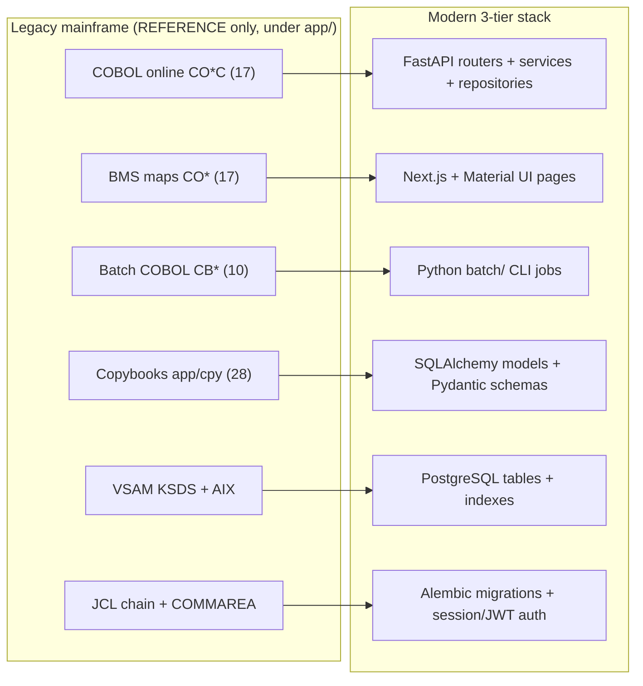

# CardDemo — Modernized Credit Card Application

> A modern re-platform of the mainframe **CardDemo** demo — the same credit-card
> business domain (accounts, cards, transactions, bill pay, reporting, and user
> administration), migrated from COBOL/CICS/VSAM/BMS/JCL to a Python + TypeScript
> three-tier web stack, with **every business rule preserved exactly**.

The legacy mainframe implementation is retained **unchanged** under [`app/`](#legacy-reference)
as a reference and golden-master parity source. It is **not built or run** by the
modern stack — see [Legacy Reference](#legacy-reference).

---

## Table of Contents

- [Overview](#overview)
- [Architecture](#architecture)
- [Technology Stack & Prerequisites](#technology-stack--prerequisites)
- [Repository Structure](#repository-structure)
- [Quick Start (Docker Compose)](#quick-start-docker-compose)
- [Local Development Setup](#local-development-setup)
- [Database Migrations & Seed Data](#database-migrations--seed-data)
- [Running the Batch Chain](#running-the-batch-chain)
- [Application Inventory & API Route Mapping](#application-inventory--api-route-mapping)
- [Testing](#testing)
- [Configuration](#configuration)
- [Demo Credentials](#demo-credentials)
- [Legacy Reference](#legacy-reference)
- [Documentation](#documentation)
- [Support](#support)
- [Contributing](#contributing)
- [License](#license)
- [Code of Conduct](#code-of-conduct)

---

## Overview

CardDemo is a credit-card management application. It lets regular users manage
**accounts**, **credit cards**, **transactions**, **bill payments**, and
**transaction reports**, and lets administrators manage **users**.

This repository contains a full technology-stack migration of that application
from a legacy IBM mainframe (COBOL online + batch programs, CICS transaction
management, VSAM storage, BMS 3270 screens, and JCL job orchestration) to a
modern three-tier web stack. The migration is faithful: interest calculation,
transaction-posting validations, cross-reference integrity, bill-payment credit
checks, pagination limits, and role-based access are all reproduced **1:1** from
the original programs.

Two behaviour-preserving guarantees underpin the port:

- **Exact decimal arithmetic.** Every monetary and rate value is stored as
  PostgreSQL `NUMERIC` and computed with Python `Decimal` — **never** floating
  point — so currency math matches the mainframe byte-for-byte.
- **Preserved business rules.** Interest (`balance × rate ÷ 1200`, truncated),
  posting validations (reason codes `100`–`103` and `109`), available-credit
  (`credit limit − current balance`), the browse limit of **≤ 7 cards per page**,
  and **admin-only** user administration (`user_type = 'A'`) are ported without
  behavioural change.

---

## Architecture

The modern application is organized as three tiers plus a batch package:

- **Backend — Python FastAPI REST API.** A layered service
  (`routers → services → repositories → models/schemas → core`) built on
  **async SQLAlchemy 2.0** with **Alembic** migrations. Routers stay thin and
  delegate to services; services hold the ported COBOL business logic;
  repositories encapsulate all database access.
- **Frontend — Next.js (App Router) + Material UI (MUI).** A single-page web
  application redesigned per **Material Design 3** — a responsive redesign, not a
  pixel-for-pixel reproduction of the 80×24 terminal screens.
- **Database — PostgreSQL 17.** Replaces VSAM KSDS and its alternate indexes.
  Primary keys map from KSDS keys, alternate indexes become `UNIQUE`/secondary
  indexes, and cross-reference relationships become **foreign-key constraints**.
- **Batch — Python CLI package (`batch/`).** Reimplements the JCL batch chain as
  idempotent, re-runnable jobs invoked through a Typer command-line interface,
  preserving the legacy job sequence and reconcilable outputs.

### Migration mapping

| Legacy (mainframe) | Modern (target) |
| :----------------- | :-------------- |
| COBOL online programs `CO*C` | FastAPI router + service + repository clusters |
| BMS mapsets `CO*` | Next.js / MUI page components |
| Batch COBOL `CB*` | `batch/jobs/*.py` modules (Typer CLI) |
| Copybooks `app/cpy/*.cpy` | SQLAlchemy models + Pydantic schemas |
| VSAM KSDS + alternate indexes | PostgreSQL tables + PK / UNIQUE / secondary indexes |
| CICS `COMMAREA` identity | Server-side session / JWT claims (dependency-injected) |
| JCL job chain | `batch/orchestration/batch_chain.py` (same order) |

### Migration flow



---

## Technology Stack & Prerequisites

Install the following before building. Exact pins live in
[`backend/requirements.txt`](backend/requirements.txt),
[`backend/pyproject.toml`](backend/pyproject.toml), and
[`frontend/package.json`](frontend/package.json).

### Backend

| Component | Version | Purpose |
| :-------- | :------ | :------ |
| Python | 3.13 | Backend runtime |
| FastAPI | 0.136.x | Async REST framework (OpenAPI 3.1) |
| Uvicorn | 0.34.x (`uvicorn[standard]`) | ASGI server |
| Pydantic | 2.x | Request/response validation |
| pydantic-settings | 2.x | Typed configuration from environment variables |
| SQLAlchemy | 2.0.x (`[asyncio]`) | ORM + async engine |
| Alembic | 1.14 | Versioned schema migrations |
| asyncpg | 0.30.x | Async PostgreSQL driver (app runtime) |
| psycopg2-binary | 2.9.x | Sync PostgreSQL driver (Alembic + loaders) |
| passlib[bcrypt] | 1.7.x | Password hashing (bcrypt — the implemented scheme) |
| PyJWT | 2.x | JWT tokens (session-based auth is the baseline) |
| reportlab + Jinja2 | 4.5.x / 3.1.x | PDF / HTML statement + report generation |
| pytest + pytest-asyncio + httpx | 9.x / 1.x / 0.28.x | Unit, integration, and golden-master tests |

### Frontend

| Component | Version | Purpose |
| :-------- | :------ | :------ |
| Node.js | 20+ (LTS) | Frontend runtime |
| Next.js | 16.x | React framework (App Router) |
| React + React DOM | 19.x | UI runtime |
| `@mui/material` | 9.x | Material UI component library |
| `@mui/material-nextjs` | 9.x | MUI SSR integration for the App Router |
| `@mui/icons-material` | 9.x | MUI icon set |
| `@emotion/react` + `@emotion/styled` | 11.x | MUI styling engine (peer dependencies) |
| axios | 1.x | HTTP client |
| TypeScript | 5.x | Static typing |

### Database & tooling

- **PostgreSQL 17** — the target datastore (VSAM replacement).
- **Docker + Docker Compose** — for the one-command development environment.

> **Note on the batch CLI.** The batch package is an installable distribution
> (`carddemo-batch`, see [`batch/pyproject.toml`](batch/pyproject.toml)) that
> additionally uses **Typer** (0.27.0) on top of **Click** (8.4.2). Typer and
> Click are `batch/` dependencies, not backend service dependencies. They were
> upgraded as a coordinated pair (QA finding N-04): Click 8.1.8 carried a
> vulnerable `click.edit` and sits below the ≥ 8.3.3 security floor, while Click
> ≥ 8.2 changed `Parameter.make_metavar()` (which crashed Typer 0.15.1's
> `--help`), so Click cannot be bumped alone. Typer 0.27.0 uses the new
> signature and renders `--help` cleanly with Click 8.4.2, which still satisfies
> uvicorn's `click>=7.0`.

---

## Repository Structure

The target trees (`backend/`, `frontend/`, `batch/`, `docs/`) and root
configuration are added **alongside** the untouched legacy `app/` tree.

```text
/ (repo root)
├── app/                         LEGACY — mainframe COBOL/CICS/VSAM/BMS/JCL (REFERENCE only, unchanged)
├── backend/                     FastAPI service
│   ├── app/
│   │   ├── main.py              Application factory (create_application) + async lifespan
│   │   ├── api/v1/              Thin routers (auth, menu, accounts, cards, transactions, …)
│   │   ├── services/            Business logic, 1:1 with the COBOL online programs
│   │   ├── repositories/        Data access, 1:1 with the former VSAM files
│   │   ├── models/              SQLAlchemy ORM models (one per table) ← record copybooks
│   │   ├── schemas/             Pydantic request/response DTOs ← record + screen copybooks
│   │   ├── core/                config, security, exceptions, dependencies (DI providers)
│   │   ├── db/                  Async engine + session + declarative Base
│   │   └── utils/               date_utils, decimal_utils (zoned-decimal decode), validators
│   ├── alembic/                 Migration environment
│   │   └── versions/            0001_initial_schema … 0007 (seven migrations)
│   ├── tests/                   Unit + integration + golden-master parity tests
│   ├── pyproject.toml           PEP 621 manifest (dependency pins)
│   ├── requirements.txt         pip manifest (dependency pins)
│   ├── alembic.ini              Alembic config (DB URL injected from the environment)
│   ├── Dockerfile               Backend container image
│   └── .env.example             Environment template (copy to .env — gitignored)
├── frontend/                    Next.js + Material UI single-page app
│   ├── src/
│   │   ├── app/                 App Router: layout.tsx, theme.ts, and one page.tsx per BMS map (17)
│   │   ├── components/          Reusable MUI components (AppShell, DataTable, FormField, …)
│   │   ├── lib/                 apiClient.ts (axios + auth interceptor), auth.ts
│   │   └── types/               TypeScript interfaces ← backend schemas
│   ├── __tests__/               Component / integration tests per screen
│   ├── package.json             Dependency pins + scripts
│   ├── tsconfig.json            TypeScript config
│   ├── next.config.js           Next.js config
│   ├── Dockerfile               Frontend container image
│   └── .env.local.example       Environment template (copy to .env.local — gitignored)
├── batch/                       Python CLI batch package
│   ├── cli.py                   Typer entrypoint (python -m batch.cli)
│   ├── jobs/                    1:1 with the batch COBOL programs (posting, interest, statements, reports)
│   ├── loaders/                 Seed loaders ← app/data (accounts, cards, customers, xref, …)
│   ├── orchestration/           batch_chain.py — preserves the legacy CLOSEFIL → … → OPENFIL order
│   └── tests/                   Batch parity tests
├── docs/                        Architecture & API reference (Markdown)
├── docker-compose.yml           postgres:17 + backend + frontend topology
├── .gitignore
├── README.md                    This file
├── LICENSE                      Apache 2.0
├── NOTICE
├── CONTRIBUTING.md
├── CODE_OF_CONDUCT.md
├── diagrams/                    Legacy flow/screen images (REFERENCE only)
└── samples/                     Legacy runtime & compile samples (REFERENCE only)
```

---

## Quick Start (Docker Compose)

The root [`docker-compose.yml`](docker-compose.yml) provisions PostgreSQL 17 plus
the backend and frontend services.

1. Copy the environment templates and edit the secrets they contain:

   ```bash
   cp backend/.env.example backend/.env
   cp frontend/.env.local.example frontend/.env.local
   # Then edit backend/.env and set a strong SECRET_KEY, e.g.:
   #   python -c "import secrets; print(secrets.token_urlsafe(48))"
   ```

2. Build and start the full stack. The backend and frontend services run under
   the `full` Compose profile, so pass `--profile full`:

   ```bash
   docker compose --profile full up --build
   ```

   To bring up **only** PostgreSQL (for local backend/frontend development), use
   the default profile:

   ```bash
   docker compose up -d db
   ```

3. Open the running services:

   | Service | URL |
   | :------ | :-- |
   | Frontend (web app) | http://localhost:3000 |
   | Backend REST API | http://localhost:8000 |
   | Interactive API docs (Swagger / OpenAPI) | http://localhost:8000/docs |
   | PostgreSQL | `localhost:5432` |

The backend waits for PostgreSQL to report healthy before starting. Apply
migrations and seed data as described in
[Database Migrations & Seed Data](#database-migrations--seed-data).

> **Secrets come from the environment only.** The `.env` / `.env.local` files are
> gitignored and must never be committed. Never place a real secret value in this
> repository — see [Configuration](#configuration).

> **Parallel environments.** To run isolated stacks side by side, override the
> host port and project name, e.g.
> `POSTGRES_HOST_PORT=5433 COMPOSE_PROJECT_NAME=carddemo-2 docker compose up -d db`.

---

## Local Development Setup

Run PostgreSQL first (`docker compose up -d db`), or point `DATABASE_URL` at any
reachable PostgreSQL 17 instance.

### Backend

```bash
cd backend
python3.13 -m venv .venv
source .venv/bin/activate
pip install -r requirements.txt
cp .env.example .env          # then edit the secret (SECRET_KEY, …)
uvicorn app.main:app --reload
```

The API is served at http://localhost:8000 with interactive docs at
http://localhost:8000/docs.

### Frontend

```bash
cd frontend
npm install
cp .env.local.example .env.local   # NEXT_PUBLIC_API_URL points at the backend origin
npm run dev
```

The web app is served at http://localhost:3000. `NEXT_PUBLIC_API_URL`
(default `http://localhost:8000`) tells the browser the backend ORIGIN; the
axios client (`src/lib/apiClient.ts`) appends `/api/v1` to it.

### Batch

Install the batch package alongside the backend it imports (one command, from
the repository root). This registers the `carddemo-batch` console script and
makes `python -m batch.cli` runnable from anywhere:

```bash
pip install -e ./backend -e ./batch
```

The batch CLI needs only `SYNC_DATABASE_URL` (read from `backend/.env` by
`batch/config.py`); it does **not** require the backend-only `SECRET_KEY`.
Explore the command-line interface either way:

```bash
python -m batch.cli --help      # module form
carddemo-batch --help           # installed console-script form (equivalent)
```

> The batch package imports the backend `app` tree, so the backend must be
> importable. `pip install -e ./backend -e ./batch` handles this; if you have
> not installed the packages, running `python -m batch.cli` from the repository
> root also works via a bundled path shim (`batch/__init__.py`) that puts the
> sibling `backend/` directory on `sys.path`.

---

## Database Migrations & Seed Data

The schema comprises **10 tables** (users, accounts, customers, cards, card
cross-reference, transactions, transaction-category balances, disclosure groups,
transaction types, transaction categories) with primary keys, unique constraints,
secondary indexes, and foreign keys.

1. Ensure PostgreSQL 17 is reachable via `SYNC_DATABASE_URL` — Alembic and the
   batch loaders use the sync (psycopg2) DSN, while the app runtime uses the
   async `DATABASE_URL` (see [Configuration](#configuration)).
2. Apply migrations with Alembic. Use **either** the host command **or** the
   containerized command below — both apply the same seven migrations
   (`0001`–`0007`):

   **Host (local development):** run from `backend/`, where the sibling
   repo-root `app/data` is on disk and resolved automatically:

   ```bash
   cd backend
   alembic upgrade head
   ```

   **Docker Compose (containerized):** the `backend` service mounts `app/data`
   read-only and sets `CARDDEMO_ASCII_DIR` / `CARDDEMO_EBCDIC_DIR`, so `run`
   inherits both and seeds all 10 tables with no extra flags:

   ```bash
   docker compose --profile full run --rm backend alembic upgrade head
   ```

   - `0001_initial_schema` creates the 10 tables plus their PK / UNIQUE / index
     definitions.
   - `0002_seed_data` seeds reference and sample data sourced from
     `app/data/ASCII/*.txt` (and the EBCDIC-only `USRSEC` user dataset). The seed
     loader locates the data via `CARDDEMO_ASCII_DIR` / `CARDDEMO_EBCDIC_DIR`
     when set, else the repo-root `app/data`, else the container mount at
     `/app/data`.

3. Alternatively (or to reload individual datasets), run the batch loaders under
   [`batch/loaders/`](batch/loaders). They load accounts, cards, customers, the
   card cross-reference, transactions, disclosure groups, transaction categories,
   transaction types, and transaction-category balances.

> **User seed hashing.** The user-security seed (`init_users`) **hashes** every
> password with bcrypt (the legacy `USRSEC` dataset exists only in EBCDIC and
> stored plaintext). Plaintext passwords are never stored or returned — see
> [Demo Credentials](#demo-credentials).

---

## Running the Batch Chain

The batch chain is orchestrated by
[`batch/orchestration/batch_chain.py`](batch/orchestration/batch_chain.py) and
invoked through the Typer CLI. The job order is **preserved exactly** from the
legacy JCL sequence:

```text
CLOSEFIL → ACCTFILE → CARDFILE → XREFFILE → CUSTFILE → TRANBKP → DISCGRP →
TCATBALF → TRANTYPE → DUSRSECJ → POSTTRAN → INTCALC → TRANBKP → COMBTRAN →
CREASTMT → TRANIDX → OPENFIL
```

`CLOSEFIL` and `OPENFIL` — originally `IEFBR14` no-ops that quiesced and re-enabled
the CICS files — become **no-op guard steps**. Jobs are designed to be
**idempotent and re-runnable** within a database transaction: loaders upsert,
posting skips transactions already posted, and interest accrual is keyed to the
accounting month so re-running within the same month does not double-accrue.

The following table maps each legacy step to the modern module that implements it
and to its legacy COBOL/JCL source (REFERENCE).

| # | Legacy step | Purpose | Modern implementation | Legacy source |
| -: | :---------- | :------ | :-------------------- | :------------ |
| 1 | CLOSEFIL | Quiesce files (guard) | `batch/orchestration/batch_chain.py` (no-op) | `CLOSEFIL.jcl` (IEFBR14) |
| 2 | ACCTFILE | Refresh Account master | `batch/loaders/load_accounts.py` | `ACCTFILE.jcl` (IDCAMS) |
| 3 | CARDFILE | Refresh Card master | `batch/loaders/load_cards.py` | `CARDFILE.jcl` (IDCAMS) |
| 4 | XREFFILE | Load card/account/customer cross-reference | `batch/loaders/load_xref.py` | `XREFFILE.jcl` (IDCAMS) |
| 5 | CUSTFILE | Refresh Customer master | `batch/loaders/load_customers.py` | `CUSTFILE.jcl` (IDCAMS) |
| 6 | TRANBKP | Refresh/seed Transaction master | `batch/jobs/backup_tran.py` | `TRANBKP.jcl` (IDCAMS) |
| 7 | DISCGRP | Load Disclosure Groups | `batch/loaders/load_disclosure_groups.py` | `DISCGRP.jcl` (IDCAMS) |
| 8 | TCATBALF | Refresh Transaction Category Balance | `batch/loaders/load_tcatbal.py` | `TCATBALF.jcl` (IDCAMS) |
| 9 | TRANTYPE | Load Transaction Types | `batch/loaders/load_tran_types.py` | `TRANTYPE.jcl` (IDCAMS) |
| 10 | DUSRSECJ | Initialize user security (passwords hashed) | `batch/loaders/init_users.py` | `DUSRSECJ.jcl` + `USRSEC.PS` |
| 11 | POSTTRAN | Post daily transactions (codes 100–103, 109) | `batch/jobs/post_transactions.py` | `CBTRN02C` + `POSTTRAN.jcl` |
| 12 | INTCALC | Interest calculation (`balance × rate ÷ 1200`, truncated) | `batch/jobs/interest_calc.py` | `CBACT04C` + `INTCALC.jcl` |
| 13 | TRANBKP | Backup Transaction database | `batch/jobs/backup_tran.py` | `TRANBKP.jcl` (IDCAMS) |
| 14 | COMBTRAN | Combine system + daily transactions | `batch/jobs/combine_tran.py` | `COMBTRAN.jcl` + `REPROCT.ctl` (SORT) |
| 15 | CREASTMT | Produce statements (CSV + PDF) | `batch/jobs/statement_gen.py` | `CBSTM03A` + `CBSTM03B` + `CREASTMT.jcl` |
| 16 | TRANIDX | Define transaction alternate index | Alembic index / migration | `TRANIDX.jcl` (IDCAMS AIX) |
| 17 | OPENFIL | Re-enable files (guard) | `batch/orchestration/batch_chain.py` (no-op) | `OPENFIL.jcl` (IEFBR14) |

Additional standalone reporting jobs port the remaining batch COBOL programs:
`print_account.py` (`CBACT01C`), `print_card.py` (`CBACT02C`), `print_xref.py`
(`CBACT03C`), `print_customer.py` (`CBCUS01C`), `read_daily_tran.py` (`CBTRN01C`),
and `tran_detail_report.py` (`CBTRN03C`).

---

## Application Inventory & API Route Mapping

Each of the 17 legacy online screens maps 1:1 to a modern REST endpoint and a
frontend route. The table below traces every legacy transaction, BMS map, and
COBOL program to its modern counterpart.

| Legacy Tx | BMS Map | COBOL Program | Function | REST Endpoint | Frontend Route |
| :-------- | :------ | :------------ | :------- | :------------ | :------------- |
| CC00 | COSGN00 | COSGN00C | Signon | `POST /auth/login` | `/signon` |
| CM00 | COMEN01 | COMEN01C | Main Menu | `GET /menu` | `/menu` |
| CA00 | COADM01 | COADM01C | Admin Menu | `GET /admin/menu` | `/admin` |
| CAVW | COACTVW | COACTVWC | Account View | `GET /accounts/{acctId}` | `/accounts/view` |
| CAUP | COACTUP | COACTUPC | Account Update | `PUT /accounts/{acctId}` | `/accounts/update` |
| CCLI | COCRDLI | COCRDLIC | Card List (≤ 7/page) | `GET /cards` | `/cards` |
| CCDL | COCRDSL | COCRDSLC | Card View | `GET /cards/{cardNum}` | `/cards/view` |
| CCUP | COCRDUP | COCRDUPC | Card Update | `PUT /cards/{cardNum}` | `/cards/update` |
| CT00 | COTRN00 | COTRN00C | Transaction List | `GET /transactions` | `/transactions` |
| CT01 | COTRN01 | COTRN01C | Transaction View | `GET /transactions/{tranId}` | `/transactions/view` |
| CT02 | COTRN02 | COTRN02C | Transaction Add | `POST /transactions` | `/transactions/add` |
| CR00 | CORPT00 | CORPT00C | Transaction Reports | `GET /reports/transactions` | `/reports` |
| CB00 | COBIL00 | COBIL00C | Bill Payment | `POST /billpay` | `/billpay` |
| CU00 | COUSR00 | COUSR00C | List Users (admin) | `GET /admin/users` | `/users` |
| CU01 | COUSR01 | COUSR01C | Add User (admin) | `POST /admin/users` | `/users/add` |
| CU02 | COUSR02 | COUSR02C | Update User (admin) | `PUT /admin/users/{userId}` | `/users/update` |
| CU03 | COUSR03 | COUSR03C | Delete User (admin) | `DELETE /admin/users/{userId}` | `/users/delete` |

**Endpoint prefix.** All endpoints are mounted under the API v1 prefix
(`/api/v1`, configurable via `API_V1_PREFIX`); for example `POST /auth/login` is
served at `POST /api/v1/auth/login`.

**Admin gating.** The admin menu and all user-administration screens and endpoints
are restricted to administrators (`user_type = 'A'`) and enforced on **both** the
client and the server.

---

## Testing

| Tier | Command | Coverage |
| :--- | :------ | :------- |
| Backend | `cd backend && pytest` | Unit tests per service (mirroring each COBOL PROCEDURE DIVISION path) + integration and golden-master parity tests against `app/data` |
| Batch | `pytest batch/tests` | Batch job parity tests |
| Frontend | `cd frontend && npm test` | Component / integration tests per screen |

**Golden-master parity.** The parity tests reconcile modern outputs
**field-for-field** against the legacy outputs for the sample data under
`app/data`. This is how the port validates that it preserves the original
business behaviour for that sample data set.

---

## Configuration

All configuration is read from environment variables (no secret is ever hardcoded
or committed). Copy the templates and edit the values locally:

- Backend: [`backend/.env.example`](backend/.env.example) → `backend/.env`
- Frontend: [`frontend/.env.local.example`](frontend/.env.local.example) → `frontend/.env.local`

Key backend variables:

| Variable | Purpose |
| :------- | :------ |
| `DATABASE_URL` | Async PostgreSQL DSN (`postgresql+asyncpg://…`) used by the app runtime |
| `SYNC_DATABASE_URL` | Sync PostgreSQL DSN (`postgresql+psycopg2://…`) used by Alembic and loaders |
| `SECRET_KEY` | Single signing key for the session cookie and JWT alike (set a strong value ≥32 chars; never commit it) |
| `AUTH_MODE` | Authentication strategy: `session` (baseline) or `jwt` |
| `ALGORITHM` | JWT signing algorithm, used when `AUTH_MODE=jwt` (default `HS256`) |
| `ACCESS_TOKEN_EXPIRE_MINUTES` | Session / access-token lifetime in minutes |
| `SESSION_COOKIE_NAME` | Server-side session cookie name (default `carddemo_session`) |
| `BCRYPT_ROUNDS` | bcrypt work factor (password-hashing cost) |
| `LOGIN_MAX_ATTEMPTS` | Consecutive failed sign-ons per (user id, client IP) before lockout (default `5`) |
| `LOGIN_LOCKOUT_SECONDS` | Lockout window in seconds after `LOGIN_MAX_ATTEMPTS` failures (default `900`) |
| `API_V1_PREFIX` | REST API mount prefix (default `/api/v1`) |
| `BACKEND_CORS_ORIGINS` | Comma-separated list of allowed frontend origins |
| `ENVIRONMENT` | Runtime environment (e.g. `development`) |

Key frontend variables:

| Variable | Purpose |
| :------- | :------ |
| `NEXT_PUBLIC_API_URL` | Browser-facing backend ORIGIN, no path (default `http://localhost:8000`); the axios client appends `/api/v1` |

> **Never print or commit a real secret.** Generate strong values locally, e.g.
> `python -c "import secrets; print(secrets.token_urlsafe(48))"`, and keep them in
> your gitignored `.env` / `.env.local` files only.

---

## Demo Credentials

The seed data provides two demo accounts:

| User ID | Role | Password |
| :------ | :--- | :------- |
| `ADMIN001` | Administrator | `PASSWORD` |
| `USER0001` | Regular user | `PASSWORD` |

These are **non-production seed accounts only**. Their passwords are stored
**hashed** (bcrypt) at rest — never in plaintext — and they must never be
treated as real credentials or hardcoded anywhere in application code. Change or
remove them before any non-demo use.

---

## Legacy Reference

The [`app/`](app) directory holds the **original mainframe implementation**
(COBOL online and batch programs, CICS definitions, VSAM layouts, BMS maps,
copybooks, and JCL). It is preserved **unchanged** for traceability and
golden-master parity, and is **not built or run** by the modern stack. Do not
modify `app/`.

Each modern module carries a comment referencing its originating COBOL program,
copybook, or BMS map, so the lineage from mainframe source to modern
implementation stays traceable end to end.

The [`diagrams/`](diagrams) and [`samples/`](samples) directories are likewise
legacy reference material (flow/screen images and mainframe compile samples) and
are **not part of the modern build**.

---

## Documentation

Architecture notes and the API reference live under [`docs/`](docs). The backend
also serves interactive, always-current OpenAPI documentation at
http://localhost:8000/docs while it is running.

---

## Support

If you have questions or requests for improvement, please open an issue in the
repository.

---

## Contributing

Contributions are welcome. Please read [`CONTRIBUTING.md`](CONTRIBUTING.md) before
opening issues or pull requests, and follow the [Code of Conduct](#code-of-conduct).

---

## License

This project is released under the **Apache 2.0 License**. See
[`LICENSE`](LICENSE) for the full text and [`NOTICE`](NOTICE) for attribution
notices.

---

## Code of Conduct

All participants are expected to abide by the project
[`CODE_OF_CONDUCT.md`](CODE_OF_CONDUCT.md).
