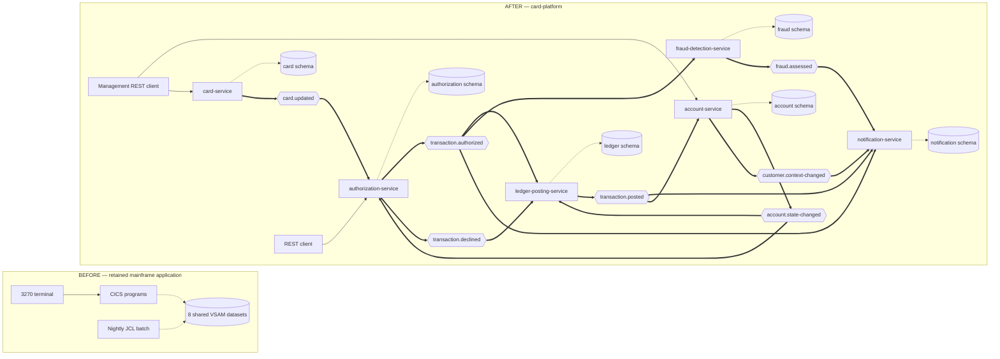

## CardDemo -- Mainframe CardDemo Application

- [CardDemo -- Mainframe CardDemo Application](#carddemo----mainframe-card-demo-application)
- [Description](#description)
- [Technologies used](#technologies-used)
- [Modernized card platform](#modernized-card-platform)
- [Installation on the mainframe](#installation-on-the-mainframe)
- [Application Details](#application-details)
  - [User Functions](#user-functions)
  - [Admin Functions](#admin-functions)
  - [Application Inventory](#application-inventory)
    - [**Online**](#online)
    - [**Batch**](#batch)
  - [Application Screens](#application-screens)
    - [**Signon Screen**](#signon-screen)
    - [**Main Menu**](#main-menu)
    - [**Admin Menu**](#admin-menu)
- [Support](#support)
- [Roadmap](#roadmap)
- [Contributing](#contributing)
- [License](#license)
- [Project status](#project-status)

<br/>

## Description
CardDemo is a Mainframe application designed and developed to test and showcase AWS and partner technology for mainframe migration and modernization use-cases such as discovery, migration, modernization, performance test, augmentation, service enablement, service extraction, test creation, test harness, etc.

Note that the intent of this application is to provide mainframe coding scenarios to excercise analysis, transformation and migration tooling. So, the coding style is not uniform across the application

<br/>

## Technologies used
1. COBOL
2. CICS
3. VSAM
4. JCL
5. RACF

<br/>

## Modernized card platform

The `card-platform/` directory reimplements the card-authorization path as six event-driven services, written in Java 25 on Spring Boot 4.1.0 over Apache Kafka and PostgreSQL. Each service deploys on its own and owns a private PostgreSQL schema no other service reads. The services reproduce the documented behaviour of the Common Business Oriented Language (COBOL) programs under `app/`. Nothing under `app/`, `diagrams/` or `samples/` changed, and no service calls the mainframe at runtime.

A client calls one Representational State Transfer (REST) endpoint, `POST /authorizations`, which only `authorization-service` serves. A decided request persists one decision and publishes exactly one outcome event. An approval publishes `TransactionAuthorized` and a decline publishes `TransactionDeclined`, each keyed on the account the cross-reference resolved. A card that resolves no such account is refused before a decision, so it writes nothing and publishes nothing.

`authorization-service` is the only service that writes the decision. The `ledger-posting-service`, `fraud-detection-service` and `notification-service` each consume the authorized event in their own consumer group. None of the three calls another, and none of them blocks the authorization response.

Each row below names the source work a service took over. The programs sit under `app/cbl/` and the batch jobs under `app/jcl/`.

| Service | Replaces |
| :--- | :--- |
| `authorization-service` | The authorization decision: the validation rules of `CBTRN02C` and the request contract of `COTRN02C` |
| `ledger-posting-service` | The `POSTTRAN` posting job, run once per event instead of once per night |
| `fraud-detection-service` | Nothing. A capability the COBOL source never had |
| `notification-service` | The cardholder-facing tail of `CBSTM03A` |
| `account-service` | `COACTVWC` and `COACTUPC`, plus the billing-cycle reset from `CBACT04C` |
| `card-service` | `COCRDLIC`, `COCRDSLC` and `COCRDUPC` |

Interest calculation and full statement generation stay as scheduled batch work, and neither is migrated.

**Running the platform needs a laptop, not a mainframe.** The z/OS instructions below cover the mainframe application and remain accurate. For the platform, start with the onboarding guide:

- [card-platform/docs/onboarding.md](card-platform/docs/onboarding.md) takes a clean machine to a running platform, and lists the pitfalls that cost time during the build.
- [card-platform/README.md](card-platform/README.md) maps the platform: its modules, endpoints, events and consumer groups.
- [card-platform/docker-compose.yml](card-platform/docker-compose.yml) defines the eight demo containers: the six services, one Kafka broker and one PostgreSQL instance.
- [card-platform/docs/architecture-before-after.md](card-platform/docs/architecture-before-after.md) holds the full-size before and after views.
- [card-platform/docs/decision-log.md](card-platform/docs/decision-log.md) records why each choice was made, what else was considered, and what risk it carries.
- [card-platform/docs/business-rule-flags.md](card-platform/docs/business-rule-flags.md) lists every COBOL business rule that reads as ambiguous, undocumented or inconsistent, with the file and line to open.
- [card-platform/docs/equivalence-results.md](card-platform/docs/equivalence-results.md) reports parity against the original logic, measured with the nine fixtures under `app/data/ASCII/`.
- [card-platform/docs/suggested-next-tasks.md](card-platform/docs/suggested-next-tasks.md) collects work found during the migration and left out of scope.

Figure 1 pairs the two states. The BEFORE group shows Customer Information Control System (CICS) programs and Job Control Language (JCL) jobs sharing eight Virtual Storage Access Method (VSAM) datasets. The AFTER group shows all six services, each reading and writing only its own schema. One decision event reaches the three independent consumers.

The two supporting services publish only when their own state changes, which keeps the replicas the decision reads current, and no service calls another over HTTP. The full-size pair lives in [card-platform/docs/architecture-before-after.md](card-platform/docs/architecture-before-after.md), with every consumer group and every outbox relay named.

**Figure 1 — CardDemo Before and After: Shared VSAM Datasets and a Nightly Batch Window Become One Decision Event, Three Independent Consumers and Six Private Schemas**



Legend for Figure 1:

- Plain arrow: a synchronous call, from a terminal or from a client. The authorization client and the management client are separate callers, and neither service calls the other.
- Thick arrow: an asynchronous Kafka publish or consume.
- Dotted arrow: a read or a write of stored data. In the AFTER group every dotted arrow ends at the schema its own service owns, and no service reads another's.
- Rectangle: a program, a batch job or a service. Cylinder: stored data. Hexagon: a Kafka topic.
- The three consumers of `transaction.authorized` are joined by no arrow, because none calls another and none blocks the authorization response.
- `account-service` and `card-service` publish only when their own state changes, and the decision path consumes those events into replicas it owns rather than calling either service. Every synchronous arrow in the AFTER group runs from a client to a service: the authorization client reaches `authorization-service`, and the management client reaches `account-service` and `card-service`. No service calls another synchronously.
- No arrow crosses from the BEFORE group to the AFTER group, because no service calls the mainframe.

<br/>

## Installation on the mainframe 

To install this repository on the mainframe please follow the following steps

1. Clone this repository to your local development environment

2. Create datasets on the mainframe  hold the code
   * It is recommended to group them under a High Level Qualifier (HLQ)for all your datasets. 
   * Upload the following application source folders from the main branch of git repository on to your mainframe
      using $INDFILE or your preferred upload tool.
   * If you have used AWS.M2 as your HLQ, you should end up with the below code structure on the mainframe
   
      | HLQ    | Name          | Format | Length |
      | :----- | :------------ | :----- | -----: |
      | AWS.M2 | CARDDEMO.JCL  | FB     |     80 |
      | AWS.M2 | CARDDEMO.PROC | FB     |     80 |
      | AWS.M2 | CARDDEMO.CBL  | FB     |     80 |
      | AWS.M2 | CARDDEMO.CPY  | FB     |     80 |
      | AWS.M2 | CARDDEMO.BMS  | FB     |     80 |
      
3. Use data for testing using either of the below approaches

   ** Use the supplied sample data**
   
      * Upload the sample data provided in the main/-/data/EBCDIC/ folder to the mainframe. Ensure that you use transfer mode binary

         | Dataset name                      | Name                                             | Copybook (Layout) | Format | Length | Name of equivalent ascii file |
         | :---------------------------------| :----------------------------------------------- | :-----            | :----- | -----: | :---------------------------- |
         | AWS.M2.CARDDEMO.USRSEC.PS         | User Security file                               | CSUSR01Y          | FB     |     80 | See DEFUSR01.jcl (inline)     |
         | AWS.M2.CARDDEMO.ACCTDATA.PS       | Account Data                                     | CVACT01Y          | FB     |    300 | acctdata.txt                  |
         | AWS.M2.CARDDEMO.CARDDATA.PS       | Card Data                                        | CVACT02Y          | FB     |    150 | carddata.txt                  |
         | AWS.M2.CARDDEMO.CUSTDATA.PS       | Customer Data                                    | CVCUS01Y          | FB     |    500 | custdata.txt                  |
         | AWS.M2.CARDDEMO.CARDXREF.PS       | Customer Account Card Cross reference            | CVACT03Y          | FB     |     50 | cardxref.txt                  |
         | AWS.M2.CARDDEMO.DALYTRAN.PS.INIT  | Transaction database initialization record       | CVTRA06Y          | FB     |    350 | 1 record (low-values ending with 00000100)|
         | AWS.M2.CARDDEMO.DALYTRAN.PS       | Transaction data which has to go through posting | CVTRA06Y          | FB     |    350 | dailytran.txt                 |
         | AWS.M2.CARDDEMO.TRANSACT.VSAM.KSDS| Transaction data entered online                  | CVTRA05Y          | FB     |    350 | not applicable                |
         | AWS.M2.CARDDEMO.DISCGRP.PS        | Disclosure Groups                                | CVTRA02Y          | FB     |     50 | discgrp.txt                   |
         | AWS.M2.CARDDEMO.TRANCATG.PS       | Transaction Category Types                       | CVTRA04Y          | FB     |     60 | trancatg.txt                  |
         | AWS.M2.CARDDEMO.TRANTYPE.PS       | Transaction Types                                | CVTRA03Y          | FB     |     60 | trantype.txt                  |
         | AWS.M2.CARDDEMO.TCATBALF.PS       | Transaction Category Balance                     | CVTRA01Y          | FB     |     50 | tcatbal.txt                   |

      * Execute the following JCLs in order

         | Jobname  | What it does                                        |
         | :------- | :-------------------------------------------------- |
         | DUSRSECJ | Sets up user security vsam file                     |
         | CLOSEFIL | Closes files opened by CICS                         |
         | ACCTFILE | Loads Account database using sample data            |
         | CARDFILE | Loads Card database with credit card sample data    |
         | CUSTFILE | Creates customer database                           |
         | XREFFILE | Loads Customer Card account cross reference to VSAM |
         | TRANFILE | Copies initial Trasaction file  to VSAM             |
         | DISCGRP  | Copies initial Disclosure Group file  to VSAM       |
         | TCATBALF | Copies initial TCATBALF file  to VSAM               |
         | TRANCATG | Copies initial transaction category file  to VSAM   |
         | TRANTYPE | Copies initial transaction type file                |
         | OPENFIL  | Makes files available to CICS                       |
         | DEFGDGB  | Defines GDG Base                                    |


4. Compile the Programs. 
   
   You should use the compile process followed by your mainframe shopfloor
   
   We have however provided some sample JCLs in the samples folder in git to help you craft the JCL   

5. Create resources in the CARDDEMO group in CICS
   
   You have 2 options
   
   Be sure to edit the HLQs in the below documents as required before you do the definition
   
   * (Preferred) . Use the DFHCSDUP JCL that the resources required by the application

      The resources required are in the CSD file provided in the CSD folder
       
      * Group CARDDEMO
      * Mapsets
      * Transactions
      * Maps
      * Files
      
   * Use the CEDA transaction to execute the commands in the above listing
   
      * Define group 
         ```shell
         DEFINE LIBRARY(COM2DOLL) GROUP(CARDDEMO) DSNAME01(&HLQ..LOADLIB)
         ```
      * Define Mapsets, Maps , Programs and Files
      
         Sample CEDA commands
         
         ```shell
         DEF PROGRAM(COCRDLIC) GROUP(CARDDEMO)
         DEF MAPSET(COCRDLI) GROUP(CARDDEMO)
         DEFINE PROGRAM(COSGN00C) GROUP(CARDDEMO) DA(ANY) TRANSID(CC00) DESCRIPTION(LOGIN)
         DEFINE TRANSACTION(CC00) GROUP(CARDDEMO) PROGRAM(COSGN00C) TASKDATAL(ANY)
         ```

   * Install /Load the online resources to your CICS region

      ```shell
      CEDA INSTALL TRANS(CCLI) GROUP(CARDDEMO)
      CEDA INSTALL FILE(CARDDAT) GROUP(CARDDEMO)
      CECI LOAD PROG(COCRDUP)
      CECI LOAD PROG(COCRDUPC)
      ```

   * Execute a NEWCOPY of mapsets and maps
      ```shell
      CEMT SET PROG(COCRDUP) NEWCOPY
      CEMT SET PROG(COCRDUPC) NEWCOPY  
      ```
6. Enjoy the demo

   * For online functions : Start the CardDemo application using the CC00 transaction
     - Enter userid ADMIN001 and the initially configured password PASSWORD to manage users
     - Enter userid USER0001 and the initially configured password PASSWORD to access back office functions
   * For batch            : See the instructions for running full batch below.

## Running full batch 
   
  * Execute the following JCLs in order

    | Jobname  | What it does                                        |
    | :------- | :-------------------------------------------------- |
    | CLOSEFIL | Closes files opened by CICS                         |
    | ACCTFILE | Loads Account database using sample data            |
    | CARDFILE | Loads Card database with credit card sample data    |
    | XREFFILE | Loads Customer Card account cross reference to VSAM |
    | CUSTFILE | Creates customer database                           |
    | TRANBKP  | Creates Transaction database                        |
    | DISCGRP  | Copies initial disclosure Group file  to VSAM       |
    | TCATBALF | Copies initial TCATBALF file  to VSAM               |
    | TRANTYPE | Copies initial transaction type file                |
    | DUSRSECJ | Sets up user security vsam file                     |
    | POSTTRAN | Core processing job                                 |
    | INTCALC  | Run interest calculations                           |
    | TRANBKP  | Backup Transaction database                         |
    | COMBTRAN | Combine system transactions with daily ones         |
    | CREASTMT | Produce transaction statement                       | 	
    | TRANIDX  | Define alternate index on transaction file          |
    | OPENFIL  | Makes files available to CICS                       |
<br/>

## Application Details 
The CardDemo is a Credit Card management application, built primarily using COBOL programming language. The application has various functions that allows users to manage Account, Credit card, Transaction and Bill payment. 

There are 2 types of users:
* Regular User
* Admin User

The Regular user can perform the user functions and the Admin users can only perform Admin functions.

<br/>

### User Functions


<br/>

### Admin Functions


<br/>

### Application Inventory

#### **Online**

| Transaction |      | BMS Map | Program  | Function            |
| :---------- | :--- | :------ | :------- | :------------------ |
| CC00        |      | COSGN00 | COSGN00C | Signon Screen       |
| CM00        |      | COMEN01 | COMEN01C | Main Menu           |
|             | CAVW | COACTVW | COACTVWC | Account View        |
|             | CAUP | COACTUP | COACTUPC | Account Update      |
|             | CCLI | COCRDLI | COCRDLIC | Credit Card List    |
|             | CCDL | COCRDSL | COCRDSLC | Credit Card View    |
|             | CCUP | COCRDUP | COCRDUPC | Credit Card Update  |
|             | CT00 | COTRN00 | COTRN00C | Transaction List    |
|             | CT01 | COTRN01 | COTRN01C | Transaction View    |
|             | CT02 | COTRN02 | COTRN02C | Transaction Add     |
|             | CR00 | CORPT00 | CORPT00C | Transaction Reports |
|             | CB00 | COBIL00 | COBIL00C | Bill Payment        |
| CA00        |      | COADM01 | COADM01C | Admin Menu          |
|             | CU00 | COUSR00 | COUSR00C | List Users          |
|             | CU01 | COUSR01 | COUSR01C | Add User            |
|             | CU02 | COUSR02 | COUSR02C | Update User         |
|             | CU03 | COUSR03 | COUSR03C | Delete User         |

#### **Batch**

| Job      | Program  | Function                                   |
| :------- | :------- | :----------------------------------------- |
| DUSRSECJ | IEBGENER | Initial Load of User security file         |
| DEFGDGB  | IDCAMS   | Setup GDG Bases                            | 
| ACCTFILE | IDCAMS   | Refresh Account Master                     |
| CARDFILE | IDCAMS   | Refresh Card Master                        |
| CUSTFILE | IDCAMS   | Refresh Customer Master                    |
| DISCGRP  | IDCAMS   | Load Disclosure Group File                 |
| TRANFILE | IDCAMS   | Load Transaction Master file               |
| TRANCATG | IDCAMS   | Load Transaction category types            |
| TRANTYPE | IDCAMS   | Load Transaction type file                 |
| XREFFILE | IDCAMS   | Account, Card and Customer cross reference |
| CLOSEFIL | IEFBR14  | Close VSAM files in CICS                   |
| TCATBALF | IDCAMS   | Refresh Transaction Category Balance       |
| TRANBKP  | IDCAMS   | Refresh Transaction Master                 |
| POSTTRAN | CBTRN02C | Transaction processing job                 |
| TRANIDX  | IDCAMS   | Define AIX for transaction file            |
| OPENFIL  | IEFBR14  | Open files in CICS                         |
| INTCALC  | CBACT04C | Run interest calculations                  |
| COMBTRAN | SORT     | Combine transaction files                  |
| CREASTMT | CBSTM03A | Produce transaction statement              |

<br/>

### Application Screens

#### **Signon Screen**


#### **Main Menu**


#### **Admin Menu**


<br/>

## Support

If you have questions or requests for improvement please raise an issue in the repository.

<br/>

## Roadmap

The following features are planned for upcoming releases

1. More database types

   1. Relational Database usage : Db2 
   
   2. Hierachical database calls : IMS

2. Integration

   * ftp, sftp
   
   * Message queue integration
   
   * Exposure of transactions for distributed application integration

<br/>

## Contributing

We are looking forward to receiving contributions and enhancements to this initial codebase from the mainframe code base

Feel free to raise issues, create code and raise merge requests for enhancements so that we can build out this application as a resource for programmers wanting to understand and modernize their mainframes.

<br/>

## License

This is intended to be a community resource and it is released under the Apache 2.0 license.

<br/>

## Project status

We are planning a v2 of this application in Q1 2023.

Watch this space for updates

<br/>


