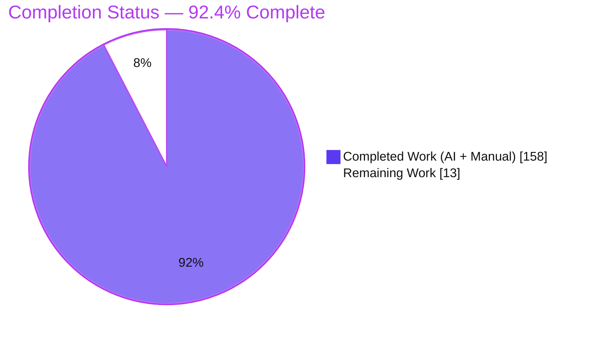
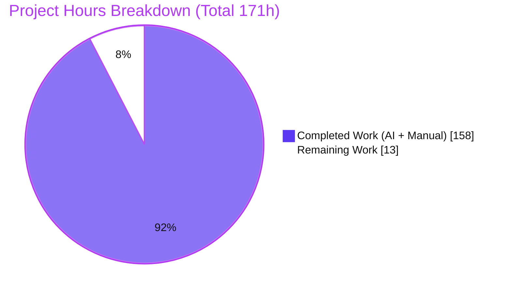
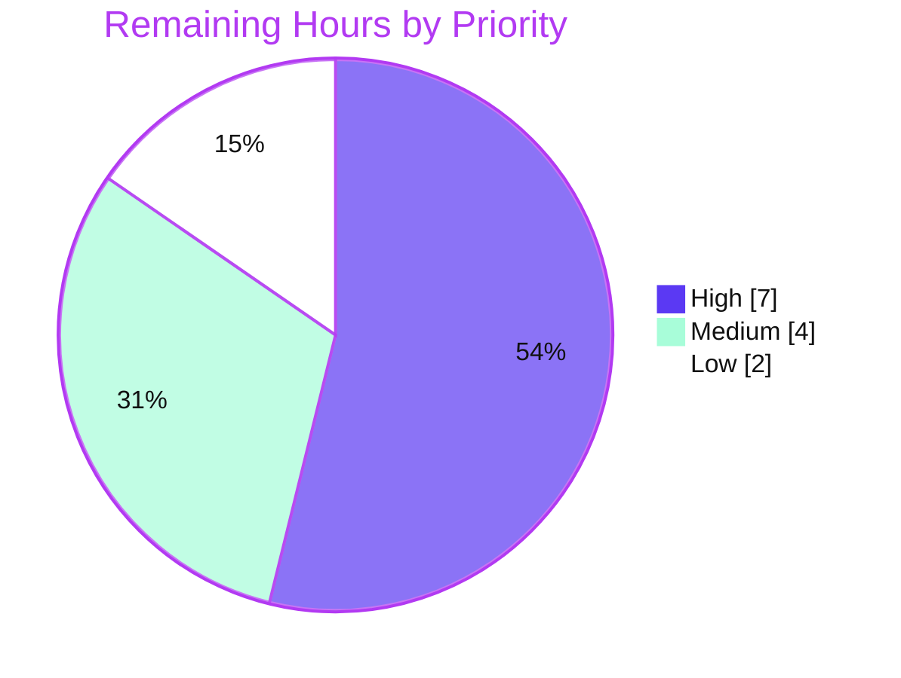

# Blitzy Project Guide — CBACT04C → Java 21 Interest-Calculation Migration

> **Module:** `modernized/interest-calculation/` · **Artifact:** `com.blitzy.carddemo:interest-calculation:1.0.0`
> **Change set:** 31 paths added, `+7,479 / −0` lines against `main` — 30 under `modernized/`, `app/` byte-untouched. Resolve the current tip with `git rev-parse HEAD`.
> **Assessment scope:** Agent Action Plan (AAP) deliverables + standard path-to-production activities only.

---

# 1. Executive Summary

## 1.1 Project Overview

This project migrates the COBOL batch program **CBACT04C** — the monthly interest job run by `INTCALC.jcl` — into a self-contained **Java 21 + Maven** module at `modernized/interest-calculation/`, giving the engineers who maintain the CardDemo estate a JVM-native, test-anchored equivalent of the legacy job. The port is behaviour-preserving: identical interest amounts, interest-transaction records and updated account balances, including truncation and sign. The technical surface is deliberately narrow — JDK plus JUnit only, with no framework, database, network or configuration.

## 1.2 Completion Status



| Metric | Hours |
|---|---:|
| **Total Hours** | **171** |
| Completed Hours (AI + Manual) | 158 |
| &nbsp;&nbsp;• AI (autonomous) | 157 |
| &nbsp;&nbsp;• Manual (human, to date) | 1 |
| **Remaining Hours** | **13** |
| **Percent Complete** | **92.4%** |

> AAP-scoped hours only: `158 / (158 + 13) = 158 / 171 = 92.4%`.

## 1.3 Key Accomplishments

- ✅ Full CBACT04C port — 16 main classes across `model`, `io`, `support`, `service` and the CLI.
- ✅ Interest truncated to cents on `BigDecimal` (scale 2, `RoundingMode.DOWN`), never rounded.
- ✅ Overpunch zoned-decimal codec and fixed-width framing (50 / 36 / 300 / 50 / 350 / 300 bytes).
- ✅ All 18 business rules ported, each citing its originating CBACT04C line.
- ✅ 91 of 91 JUnit 5 tests pass offline, including a byte-exact end-to-end golden master.
- ✅ Updated-accounts output byte-identical to expectation; transactions match on every deterministic byte.
- ✅ Output integrity — colliding output paths are refused, and a failed driver open leaves no artifact.
- ✅ Zero runtime dependencies — the 39,022-byte jar runs on a bare JDK; `app/` is untouched.

## 1.4 Critical Unresolved Issues

**8 of the 55 tracked scope items are open:** the four caveats below, plus four standard human path-to-production activities priced in §2.2 (peer review, online build verification, PR merge, CI/CD decision). None is a defect in delivered behaviour.

| Issue | Impact | Owner | ETA |
|---|---|---|---|
| Three output-integrity behaviours (driver-open ordering, physical-alias rejection, handle-bound output locks) have no CBACT04C counterpart and await human acceptance — §5.2 R1 | Medium: failure paths only; every correct invocation is byte-identical | Product owner + reviewing engineer | HT-4 (1h) |
| Those same three behaviours have **no automated regression coverage** — they live in `main()` and the writers' open sequence, which no test exercises — §5.2 R4 | Medium: a future refactor could silently reintroduce two exit-0 corruption paths | Engineer | HT-2 (3h) |
| BR-12's end-of-driver account update is locked by exactly **one** test method; the golden fixtures are byte-neutral for it — §5.2 R5 | Medium: weakening `br12_finalUpdateAtEof` would leave the rule silently unprotected | Reviewing engineer | With HT-1 (4h) |
| Card numbers, balances and account ids are written to plaintext flat files with default permissions — §6 S1 | Medium: faithful to the COBOL job; permissions and retention are a deployment concern | Platform / DevOps | Deployment design |

## 1.5 Access Issues

| System/Resource | Type of Access | Issue Description | Resolution Status | Owner |
|---|---|---|---|---|
| Maven Central | Dependency download | Every build to date resolved `junit-jupiter` 5.13.4 and the three build plugins **offline** from a warmed local Maven repository; a first resolution over the network has not been exercised. Against an empty local repository, `mvn -o clean test` exits 1 with "Cannot access central … in offline mode". | Open — covered by HT-3 | DevOps |

> No repository-permission, credential or third-party-API issue exists: the module reads no environment variable, secret or configuration file, opens no network port, and needs no database or container.

## 1.6 Recommended Next Steps

1. **[High]** Peer-review the fidelity-critical logic — truncating arithmetic, overpunch codec, fixed-width framing, account-break loop (HT-1, 4h).
2. **[High]** Add three JUnit cases covering driver-open ordering, physical-alias rejection and the handle-claim collision (HT-2, 3h).
3. **[Medium]** Decide whether to accept or revert the three output-integrity behaviours (HT-4, 1h).
4. **[Medium]** Verify a fresh build that resolves dependencies from Maven Central (HT-3, 2h).
5. **[Medium]** Review and merge the additive change set to `main` (HT-5, 1h).

---

# 2. Project Hours Breakdown

## 2.1 Completed Work Detail

Each row traces to a specific AAP deliverable. Hours are estimated from implemented functionality with size and complexity as proxies; the LOC figures quoted are current measurements (`find src/main/java -name '*.java' | xargs wc -l` → **4,278**; the same over `src/test/java` → **2,099**).

| Component | Hours | Description |
|---|---:|---|
| Source reverse-engineering & migration analysis | 10 | CBACT04C topology mapping (5 files, 12 paragraphs), field-level copybook mapping, 18-rule extraction, and the decimal / overpunch / sign decisions (AAP §0.6). |
| Maven build & module scaffolding | 3 | `pom.xml` (Java 21 release, `junit-jupiter` 5.13.4 test-scope, compiler 3.15.0 / surefire 3.5.6 / jar 3.4.2, `Main-Class` manifest), `.gitattributes`, Standard Directory Layout. |
| Domain model layer (5 classes) | 9 | One record class per copybook — `Account`, `CardXref`, `DisclosureGroup`, `TransactionCategoryBalance`, `TransactionRecord` (613 LOC). |
| `ZonedDecimal` overpunch codec | 11 | Highest-risk unit: overpunch zoned-decimal ↔ `BigDecimal` scale-2 codec with the full sign map and implied-decimal handling (292 LOC). |
| `CobolArithmetic` + `Db2TimestampSupplier` | 8 | Truncating interest arithmetic (÷1200, scale 2, `DOWN`) and the injectable 26-character DB2 timestamp seam (304 LOC). |
| Fixed-width I/O layer (6 classes) | 38 | `FixedWidthCodec`, `TransactionCategoryBalanceReader`, `CardXrefRepository`, `AccountRepository` (keyed read + balance rewrite + 300-byte emit), `DisclosureGroupRepository` (rate lookup + `DEFAULT` fallback), `TransactionWriter` (350-byte) — 2,116 LOC. |
| `InterestCalculationService` | 14 | Pure ported account-break loop: first-time guard, per-account accumulator reset, rate-based write guard, end-of-driver final update (369 LOC). |
| `InterestCalculator` CLI | 8 | `main(String[])` 7-argument contract mirroring the INTCALC DD list, orchestration, abend semantics, argument validation (584 LOC). |
| JUnit 5 test suite (5 classes) | 28 | 49 test methods → 91 executed invocations: golden master, per-rule service tests, codec and arithmetic vectors, rate-lookup paths (2,099 LOC). |
| Golden fixtures + expected-output derivation | 5 | Byte-identical fixture copies plus the SHA-256-anchored expected interest-transactions and updated-accounts files. |
| Verification of the delivered port | 10 | End-to-end byte-exactness against the expected outputs, packaged-CLI exercise of the exit contract and adversarial argument handling, and offline build gating. |
| BR-12 final-account-update decision ratified | 1 | **Manual (human) hour.** The reviewing engineer approved the documented end-of-driver update (`app/cbl/CBACT04C.cbl:L219-220`) as delivered; recorded in §1.4, §5.2 R6 and §6 T1. |
| BR-12 decision record in the module artifacts | 3 | The ratified decision, its rationale and a do-not-revert instruction written into `service/InterestCalculationService.java` (update site + `process` and `updateAccount` javadoc), the module `README.md`, a CLI cross-reference, and the status document. |
| BR-12 regression lock strengthened | 2 | `br12_finalUpdateAtEof` extended in place with a multi-account scenario that drives non-zero interest over non-zero cycle fields and asserts the persisted 300-byte record; scope notes added to `br03b_emptyDriverNoUpdate` and the golden master. |
| Output-integrity & driver-open hardening | 8 | Driver `open()` ported to the `L182` position; three-layer physical-identity output guard (lexical → canonical symlink-chain key → `isSameFile`); exclusive whole-file claim taken on each output handle before truncation, across `InterestCalculator`, `TransactionCategoryBalanceReader`, `TransactionWriter` and `AccountRepository`. |
| **Total Completed** | **158** | **= Completed Hours in §1.2 (157 AI + 1 manual)** |

## 2.2 Remaining Work Detail

Every row is human work. No AAP code deliverable is missing.

| Category | Hours | Priority |
|---|---:|---|
| Peer code review of the migration's fidelity-critical financial logic (HT-1) | 4 | High |
| JUnit regression coverage for the three output-integrity behaviours (HT-2, closes §5.2 R4) | 3 | High |
| Fresh / online-network build verification against Maven Central (HT-3) | 2 | Medium |
| Accept-or-revert decision on the output-integrity behaviours (HT-4, closes §5.2 R1–R3) | 1 | Medium |
| PR review & merge to `main` (HT-5) | 1 | Medium |
| CI/CD integration decision (HT-6; the AAP deliberately excluded configuration changes) | 2 | Low |
| **Total Remaining** | **13** | **= Remaining Hours in §1.2 & the §7 pie** |

## 2.3 Hours Reconciliation

- Completed (§2.1) **158** + Remaining (§2.2) **13** = **171** Total, matching §1.2. ✔
- Remaining **13** is identical in §1.2, the §2.2 total and the §7 pie chart. ✔
- Priority rollup: High 7 + Medium 4 + Low 2 = **13**. ✔
- Completion = `158 / 171 = 92.4%`, used verbatim in §1.2, §7 and §8.
- Movement since the previous assessment (171h total, up from 154h): the reviewing engineer's 1h sign-off moved from remaining to completed-manual, 13h of further work was delivered (the decision record, the strengthened regression lock and the output-integrity hardening), and 4h of newly identified human work was added (regression coverage 3h, accept-or-revert decision 1h).

---

# 3. Test Results

Every figure below was observed by running `mvn -o -B clean test` in `modernized/interest-calculation` on OpenJDK 21.0.11 / Maven 3.9.9: **BUILD SUCCESS**, `Tests run: 91, Failures: 0, Errors: 0, Skipped: 0`, zero build warnings. The per-class split was read from the console *and* from the Surefire XML output written under `target/`, which carries 91 `<testcase>` elements with no `<failure>`, `<error>` or `<skipped>` child. Framework: **JUnit 5 (Jupiter) 5.13.4** under **maven-surefire-plugin 3.5.6**.

| Area / Category | Framework | Tests | Passed | Failed | Coverage | What This Proves |
|---|---|---:|---:|---:|---|---|
| Zoned-decimal codec — `support/ZonedDecimalTest` | JUnit 5 | 49 | 49 | 0 | Not instrumented | Signed COBOL display fields decode and re-encode byte-for-byte, including the overpunch sign map, the implied `V99` point and stored negative zero. |
| Truncating interest arithmetic — `support/CobolArithmeticTest` | JUnit 5 | 17 | 17 | 0 | Not instrumented | Monthly interest truncates to cents rather than rounding — for both signs and at exact-half remainders, where rounding would differ. |
| Business-rule service loop — `service/InterestCalculationServiceTest` | JUnit 5 | 20 | 20 | 0 | Not instrumented | Account break, first-time guard, per-account accumulator reset, rate-based write guard, transaction field construction, fatal abends and the end-of-driver final update all behave as the source specifies. |
| Rate lookup & fallback — `io/DisclosureGroupRepositoryTest` | JUnit 5 | 4 | 4 | 0 | Not instrumented | A composite group + type + category key resolves the annual rate, and an unknown group falls back to the `DEFAULT` group instead of failing. |
| End-to-end characterization — `golden/InterestCalculationGoldenMasterTest` | JUnit 5 | 1 | 1 | 0 | Not instrumented | The whole job reproduces both output files byte-for-byte from the in-repo fixtures under an injected fixed timestamp, anchored by two SHA-256 digests. |
| **Total** | **JUnit 5** | **91** | **91** | **0** | **Not instrumented** | 49 test methods → 91 invocations; 18 of 18 business rules covered. |

**Coverage instrumentation.** `pom.xml` binds no coverage plugin — JaCoCo, Checkstyle, SpotBugs and PMD are all absent, deliberately, to honour the AAP's JDK-plus-JUnit-only constraint. No line-coverage percentage therefore exists, and none is estimated here. Behavioural coverage is evidenced instead by 18 of 18 business rules mapped to executed tests and by the byte-exact golden master.

### Not Covered

- **The three output-integrity behaviours have no test at all.** Driver-open ordering (`io/TransactionCategoryBalanceReader.open()`), physical-alias rejection (`InterestCalculator.findDuplicateOutputPaths` / `physicalOutputKey`) and the handle-bound output claim (`io/TransactionWriter`, `io/AccountRepository.writeUpdatedAccounts`) are exercised only by command-line invocation. The alias guard in particular runs inside `main()`, which no test calls. **Before release, add the three cases in HT-2** — an unopenable `args[0]` must abend leaving no transactions file; two outputs that resolve to one physical file must exit 2 creating nothing; and a post-validation retarget must abend rather than interleave 300- and 350-byte records.
- **BR-12 has a single automated detector.** All 50 shipped driver records carry `TRAN-CAT-BAL` of `0.00` over already-zero cycle fields, so the golden master's byte comparison is neutral to the end-of-driver account update and passes with or without it. Only `InterestCalculationServiceTest.br12_finalUpdateAtEof` — which seeds non-zero interest and non-zero cycle fields for the last account — detects its removal. **A reviewer must not weaken that method's seed data.**
- **Account-side value semantics are not locked by the golden master.** Because every fixture balance is zero, the 300-byte comparison locks record geometry and field preservation but not the posting arithmetic; that is locked by `br11_postTotalAndZeroCycleFields` and `br12_finalUpdateAtEof` with non-zero data.
- **Documentation is guarded by no test.** The module `README.md` quotes measured figures (record widths, jar size, digests) that no build step re-checks, so they drift silently if the code changes.
- **Cross-JDK and cross-platform behaviour is untested.** The suite has been run only on OpenJDK 21.0.11 on Linux; the advisory file locking used by the output guard is filesystem-dependent.

---

# 4. Runtime Validation and UI Verification

The packaged jar was built and driven end to end against the in-repo `app/data/ASCII` fixtures with PARM-DATE `2022071800`, outputs written outside the repository. Status key: ✅ Operational · ⚠ Partial · ❌ Failing.

- ✅ **Build & package** — `mvn -o -B package` → BUILD SUCCESS; `target/interest-calculation-1.0.0.jar` is 39,022 bytes with 32 entries, 17 classes and zero third-party or JUnit entries; manifest carries `Main-Class: com.blitzy.carddemo.interest.InterestCalculator` and `Build-Jdk-Spec: 21`.
- ✅ **Job execution** — the documented 7-argument invocation exits 0 and prints exactly `START OF EXECUTION OF PROGRAM CBACT04C` and `END OF EXECUTION OF PROGRAM CBACT04C`, with nothing on stderr.
- ✅ **Output geometry** — updated-accounts is 50 records × 300 bytes (15,050 B); interest-transactions is 50 records × 350 bytes (17,550 B); every line measures its exact width.
- ✅ **Updated accounts** — byte-identical (`cmp`) to both `src/test/resources/expected/updated-accounts.txt` and `app/data/ASCII/acctdata.txt`, SHA-256 `c2a97b6a32dc4a87a7aafdf7f72e6712e560412d30b00c5526cca80fc9dfd260`.
- ✅ **Interest transactions** — 800 bytes differ from the expected file and every one falls inside the two 26-character DB2 timestamp fields (in-record offsets 281–325, all within `[278,330)`); masking those fields makes the buffers byte-identical. `TRAN-ORIG-TS` equals `TRAN-PROC-TS` in 50 of 50 records, and TRAN-IDs run `2022071800000001` … `2022071800000050`.
- ✅ **End-of-driver final update (BR-12)** — driven with a modified driver that gives the last account a non-zero balance: account `00000000050` moved from `00000004920{` (492.00) to `00000005170{` (517.00), posting `25.00` = truncate(2000.03 × 15.00 ÷ 1200), with both cycle-field slices zeroed and a matching 25.00 transaction emitted. The rate resolved through the `DEFAULT` group fallback.
- ✅ **Exit contract** — 0, 6 or 8 arguments exit 2 with a usage block; two outputs resolving to one physical file exit 2; a missing or unreadable input exits 1 with `ABENDING PROGRAM` and `ERROR OPENING TRANSACTION CATEGORY BALANCE: <path>`, leaving **zero** artifacts behind.
- ✅ **Output-collision refusal** — twin symlinks to one target and two hard links to one inode are both refused with exit 2; the ghost target is never created and the hard-linked file's content survives untouched.
- ✅ **Supported edge paths** — the in-place ACCTFILE rewrite (`args[2] == args[5]`) exits 0 reproducing the canonical digest; an empty driver exits 0 with a 0-byte transactions file and a full 15,050-byte accounts file; a repeat run replaces rather than appends, with the accounts digest stable.
- ⚠ **Timestamp field** — differs between runs by design: the CLI binds a wall-clock supplier while the tests inject a fixed one. Faithful to `FUNCTION CURRENT-DATE` and isolated behind `Db2TimestampSupplier`.

**Not exercised at runtime.** On a fatal abend the module emits no updated-accounts file at all, whereas the mainframe job — which opens ACCTFILE `I-O` — would already have persisted the rewrites of accounts completed before the abend; that partial-persistence path does not exist here and was therefore never observed (see §6 O1). Nothing else was left undriven: there is no UI, HTTP endpoint, database, message queue or external service in this module, so no browser or API verification applies — the only observable surfaces are the command-line contract and the two output files, and both were driven above. An `env -i` run confirms no environment variable or configuration file is read.

---

# 5. Compliance and Quality Review

## 5.1 Compliance Matrix

Each AAP deliverable and governing constraint, with the state it stands in now.

| AAP Deliverable / Constraint | Benchmark | Status | Progress | Evidence |
|---|---|:--:|:--:|---|
| Functional equivalence — identical interest, transactions and balances including rounding and sign | Byte-exact output | ✅ Pass | 100% | Accounts output `cmp`-identical to the expected file and to `app/data/ASCII/acctdata.txt`; transactions identical outside the two timestamp fields. |
| Decimal fidelity — truncation, since the source `COMPUTE` carries no `ROUNDED` | `BigDecimal` scale 2, `RoundingMode.DOWN`, ÷1200 | ✅ Pass | 100% | `support/CobolArithmetic.java`; 17 boundary vectors incl. exact-half and negative cases. |
| Fixed-width framing and overpunch zoned decimal | 50 / 36 / 300 / 50 / 350 / 300 bytes; codec round-trip | ✅ Pass | 100% | `io/FixedWidthCodec.java`, `support/ZonedDecimal.java`; 49 codec tests; every emitted line measured at its exact width. |
| Asymmetric error handling — abend vs `DEFAULT` fallback | Rule parity with the source | ✅ Pass | 100% | `io/DisclosureGroupRepository.java` fallback; account / xref / default-group abend tests; runtime exit 1 with `ABENDING PROGRAM`. |
| ACCTFILE is the only mutated file; TCATBAL is read-only | Follow the source, not the narrative | ✅ Pass | 100% | Accounts rewritten to `args[5]`; the driver is opened read-only and its input digest is unchanged after a run. |
| Determinism by injection — one seam only | Single injectable dependency | ✅ Pass | 100% | `support/Db2TimestampSupplier.java`; the golden master injects a fixed timestamp, nothing else is abstracted. |
| Behaviour traceability — every migrated rule cites its origin | Source-line citations | ✅ Pass | 100% | All 21 Java files reference CBACT04C; 111 line citations in the service and 75 in the CLI (`grep -oE '\bL[0-9]+'`); BR-18 traces to the copybook `PIC` layouts and the ASCII fixtures. |
| Standalone deliverable — JDK plus JUnit only | Zero compile/runtime dependencies | ✅ Pass | 100% | `junit-jupiter` 5.13.4 at test scope only; the 39,022-byte jar holds no third-party entry and runs on a bare JDK. |
| Additive isolation — original sources untouched | Diff discipline | ✅ Pass | 100% | 31 paths, all status `A`, `+7,479/−0`; 30 under `modernized/`; `git diff origin/main...HEAD -- app/` is empty. The one path outside the module is sanctioned — §5.2 R8. |
| Fees remain a no-op, as `1400-COMPUTE-FEES` is | Faithful stub | ✅ Pass | 100% | Only interest transactions (category `0005`) are emitted; no fee record or side effect exists. |
| Self-contained tests and production-ready code | `mvn test` on in-repo fixtures; no placeholders | ✅ Pass | 100% | All four fixture copies are byte-identical to their originals; 91/91 offline. Zero `TODO`/`FIXME`/`HACK`/`TBD`, zero empty catch blocks, zero hardcoded credentials or endpoints. |
| Minimal-change discipline | Only what the migration requires | ⚠ Partial | 90% | Three output-integrity behaviours have no CBACT04C counterpart and await human acceptance — §5.2 R1–R3. |

## 5.2 AAP and Rule Divergences and Gaps

| What the AAP/Rule Required | What Was Delivered Instead | Why It Diverged | Impact | Remediation |
|---|---|---|---|---|
| **R1** §0.7 "implement only the logic present in CBACT04C" | A driver `OPEN` status check, a physical-identity output guard and exclusive locks on both output handles | The mainframe gets the separate-output guarantee structurally from separate DD statements; the CLI takes free-form paths | Failure paths only; two otherwise-silent corruption paths abend | Accept, or revert and accept those paths back — HT-4 |
| **R2** The AAP file plan specifies `newBufferedWriter(..., CREATE, WRITE, TRUNCATE_EXISTING)` for `TransactionWriter` | `CREATE + WRITE`, then an exclusive claim, then explicit `truncate(0)` | `TRUNCATE_EXISTING` truncates at open, before a collision can be detected | None for any non-colliding run | None unless R1 is rejected |
| **R3** No rule governed the driver's file type or diagnostic wording | `args[0]` must be a regular file; the open diagnostic and one deep-alias exit code differ from a strict port | Side effects of R1's open-before-write ordering and unbounded alias resolution | A piped driver must be materialised first | Document, or revert with R1 |
| **R4** §0.6.3 maps every rule to a covering test | No JUnit method covers the three R1 behaviours | The executed test count was held at 91 for this change | A refactor could silently reintroduce the corruption paths | Add three JUnit cases — HT-2 (3h) |
| **R5** §0.6.3 lists BR-12's covering tests as "ServiceTest + GoldenMaster" | Only the service test detects BR-12's removal | Every shipped fixture balance is `0.00`, so the golden bytes cannot move | BR-12 rests on one test method | Preserve its non-zero seed data; optionally add a non-zero fixture |
| **R6** §0.1.1 functional equivalence with the executed source | The port executes the source's unreachable `ELSE` at `L219-220`, posting the last account | §0.6.3 BR-12 specifies it and the reviewing engineer ratified it — **Sanctioned** | Byte-neutral for the shipped fixtures | None — do not "correct" it |
| **R7** §0.7 minimal change and §0.4.4 "no existing files are modified" | Already-delivered files carry ratification prose and stronger assertions — **Sanctioned** | The reviewing engineer's instruction to ratify the documented decision | Zero executable change | None |
| **R8** §0.2.1/§0.4.1/§0.4.3 confine every path to `modernized/interest-calculation/` | The project status document sits outside it — **Sanctioned** | The ratified decision is recorded in that document | One of 31 added paths | None |

**R1 — output-integrity behaviours with no COBOL counterpart.** AAP §0.7 forbids implementing anything CBACT04C does not. `io/TransactionCategoryBalanceReader.open()` performs a real open plus a regular-file assertion at the `L182` position; `InterestCalculator.findDuplicateOutputPaths` compares the two outputs lexically, then by a canonical key that walks the final-component symlink chain to its end, then with `Files.isSameFile`; and `io/TransactionWriter` and `io/AccountRepository.writeUpdatedAccounts` each claim an exclusive whole-file lock before truncating. Without those guards, two paths resolving to one physical file yield a 54-line mixed-width file at exit 0 — the state a revert would restore. Every correct invocation is byte-identical either way. Decide whether to keep the three behaviours (HT-4).

**R2 — writer open mode.** The AAP-derived file plan prescribes `Files.newBufferedWriter(..., CREATE, WRITE, TRUNCATE_EXISTING)`. `io/TransactionWriter` instead opens `CREATE + WRITE` on a channel, takes `tryLock()`, then calls `truncate(0)` and layers its buffered writer over the same channel; `io/AccountRepository.writeUpdatedAccounts` follows the same sequence. The reason is ordering: `TRUNCATE_EXISTING` destroys the target's contents at open, which would let a refused writer wipe the other output's bytes before the collision surfaces. Observable behaviour for any non-colliding run is identical — the file is still fully replaced, never appended. No action is required unless R1 is rejected.

**R3 — driver file type, diagnostic text and one exit code.** Three smaller consequences follow from R1. `args[0]` must be a regular file, so a FIFO or process-substitution driver is refused at open — a caller streaming the driver through a pipe must materialise it first. The missing-driver diagnostic is the source-faithful `ERROR OPENING TRANSACTION CATEGORY BALANCE` (`app/cbl/CBACT04C.cbl:L245`) rather than a read-time message. And an output alias reached through 41 or more symlink hops exits 2 from the guard rather than 1 from the operating system. All three refuse the run and create nothing, so no correct invocation is affected. Document them in the operations runbook, or revert them together with R1.

**R4 — no regression coverage for the R1 behaviours.** AAP §0.6.3 maps each rule to a covering test, and these three behaviours have none: the suite stands at exactly 91 invocations, and the alias guard lives in `main()`, which no test calls. The reason is scope — the executed count was deliberately held at 91 for this change, so every figure quoted in the module documentation stays exact. The behaviours are consequently locked only by command-line invocation, which nothing re-runs. A future refactor of the writer open sequence could silently reintroduce two exit-0 corruption paths without a single red test. HT-2 adds the three cases in 3 hours; treat it as release-gating.

**R5 — BR-12 has one detector, not two.** AAP §0.6.3 credits both the service suite and the golden master with covering BR-12. The golden master cannot: all 50 shipped driver records carry `TRAN-CAT-BAL` of `0.00` over already-zero cycle fields, so the rewritten master is byte-identical whether or not the end-of-driver update fires — with the update removed the golden test still passes while 10 of the 20 service tests fail. `InterestCalculationServiceTest.br12_finalUpdateAtEof` is the sole detector, and it works because it seeds non-zero interest over non-zero cycle fields for the last account. Reviewers must not reduce that seed data; adding a non-zero-balance fixture would give a second detector.

**R6 — the port executes COBOL's unreachable branch (Sanctioned).** `app/cbl/CBACT04C.cbl:L219-220` holds `ELSE PERFORM 1050-UPDATE-ACCOUNT`, the else-branch of a `PERFORM UNTIL END-OF-FILE = 'Y'` loop. Because `PERFORM UNTIL` is test-before, that branch never executes on the mainframe, so a strict-execution port would leave the last account in driver order unposted. The Java service posts it, guarded by the first-time flag (`WS-FIRST-TIME`, `L195-199`) so an empty driver is a no-op. AAP §0.6.3 BR-12 and the §0.1.2 pipeline specify this, and the reviewing engineer ratified it as delivered. It is byte-neutral for the shipped fixtures. Do not "correct" it; the rationale is recorded at the update site.

**R7 — ratification prose in already-delivered files (Sanctioned).** AAP §0.7 requires minimal change and §0.4.4 states that no existing file is modified. Recording the reviewing engineer's sign-off necessarily reached already-delivered artifacts: the decision record and the `process` / `updateAccount` javadoc in `service/InterestCalculationService.java`, a behaviour note in the module `README.md`, a cross-reference in `InterestCalculator.java`, and stronger assertions inside `br12_finalUpdateAtEof`. The instruction was explicit, so this is sanctioned rather than scope creep, and it carries zero executable change — comment-stripped sources and compiled bytecode are both identical across it. Nothing is required of the reader.

**R8 — one path outside the module (Sanctioned).** AAP §0.2.1, §0.4.1 and §0.4.3 confine every created path to `modernized/interest-calculation/`. The project status document at `blitzy/documentation/Project Guide.md` sits outside it and is the only one of the 31 added paths not under the module. The reason is that the ratified decision is recorded in that document, so recording the sign-off there was the only way to make it durable; the reviewing engineer's instruction covers it. Impact is confined to the change set's shape — no source, build file, fixture or expected output outside the module was touched, and `app/` remains byte-untouched.

**User-specified rules.** No user rules govern this project, so no rule divergence is possible. The AAP's own §0.7 constraints stand in their place, and all hold with evidence: `app/**` byte-unchanged, `pom.xml` and `.gitattributes` unchanged, no dependency added, no environment variable, secret or configuration file introduced, tests self-contained and runnable offline, and every migrated rule carrying its source-line citation.

---

# 6. Risk Assessment

Forward-looking exposure only — what could still go wrong in production.

| Risk | Category | Severity | Probability | Mitigation | Status |
|---|---|:--:|:--:|---|---|
| **T1** — BR-12's end-of-driver account update is detected by exactly one test method; the shipped fixtures are byte-neutral for it, so the golden master cannot catch its removal. | Technical | Medium | Low | `br12_finalUpdateAtEof` seeds non-zero interest over non-zero cycle fields and asserts the persisted 300-byte record; the limitation is stated in that test, in the golden master's own messages and at the update site in `service/InterestCalculationService.java`. Reviewers must not reduce the seed data. | Mitigated — documented (§5.2 R5) |
| **T2** — The three output-integrity behaviours have no automated regression coverage, so a refactor of the writer open sequence could silently reintroduce two exit-0 corruption paths. | Technical | Medium | Medium | Add the three JUnit cases in HT-2 (3h) and treat them as release-gating. | Open (§2.2, §5.2 R4) |
| **T3** — Characterization breadth: one 50-record fixture set in which every driver balance is `0.00`, plus wall-clock timestamps that differ between runs. | Technical | Low | Low | The fixtures still exercise all three rate paths (normal, `DEFAULT` fallback, `ZEROAPR`), and the per-rule tests drive non-zero, negative and exact-half vectors. Timestamp non-determinism is faithful to `FUNCTION CURRENT-DATE` and isolated behind the injectable supplier. | Mitigated / by design |
| **S1** — Card numbers, balances and account identifiers are written to plaintext flat files with default filesystem permissions. | Security | Medium | Low | Faithful to the COBOL job, which the minimal-change constraint requires; file permissions, output-directory placement and retention must be set by the deployment environment. | Open — operational |
| **S2** — Attack surface of dependencies and of untrusted input. | Security | Low | Low | One test-scope library (`junit-jupiter` 5.13.4) and zero runtime dependencies — the jar resolves to `java.base` only. Records are length- and overpunch-validated with a fatal abend on bad data; arguments never reach a shell, and path-traversal, shell-metacharacter and injection-shaped arguments are treated as literal filenames. | Mitigated |
| **O1** — On a fatal abend no updated-accounts file is emitted, whereas the mainframe job would already have persisted the rewrites of accounts completed before the abend. | Operational | Low | Low | Follows the AAP design, which models the rewrite as a post-run 300-byte writer, and is arguably safer since no partially-updated master can exist. Batch orchestration must treat a non-zero exit as "no output produced". | Accepted — by design |
| **O2** — Every build so far resolved dependencies offline from a warmed local repository, and observability is limited to two banners plus abend diagnostics. | Operational | Low | Low | Run HT-3 (2h) to verify resolution from Maven Central. Richer logging is barred by the minimal-change constraint; the exit code plus stderr diagnostic is the operational signal. | Open — path to production |
| **I1** — Nothing runs the 91-test suite automatically on change, and the 7-argument contract mirrors the INTCALC DD list positionally. | Integration | Low | Medium | HT-6 decides on pipeline wiring (2h). Argument misordering fails fast with an exact record-width diagnostic rather than producing a wrong result, and the contract is documented in the module README. | Open — path to production |

> Two further items are accepted rather than tracked as risks: roughly 37 `javadoc -Xdoclint:all` notices (record-component `@param` omissions in `model/Account` and `model/TransactionRecord`, method `@param` gaps in `support/ZonedDecimal`, one literal-brace inline-tag error in `io/AccountRepository`, plus test default constructors) — no javadoc plugin is bound, so the build never surfaces them; and the module `README.md`'s measured figures, which no build step re-checks.

---

# 7. Visual Project Status

**Project hours breakdown** (Completed = Dark Blue `#5B39F3`, Remaining = White `#FFFFFF`):



**Remaining work by priority** (High 7h · Medium 4h · Low 2h = 13h):



**Remaining hours by category** (from §2.2):

| Category | Hours |
|---|---:|
| Peer code review | 4 |
| Regression coverage for the output-integrity behaviours | 3 |
| Fresh / online build verification | 2 |
| CI/CD integration decision | 2 |
| Accept-or-revert decision | 1 |
| PR review & merge | 1 |
| **Total** | **13** |

> **Integrity check:** the "Remaining Work" slice (13) equals the §1.2 Remaining Hours, the §2.2 Hours total and this category table. The completed slice (158) equals the §2.1 total, and 158 + 13 = 171. ✔

---

# 8. Summary and Recommendations

**What was delivered and verified.** The CBACT04C interest-calculation job now exists as a standalone Java 21 Maven module. All 16 main classes and 5 test classes named in the AAP are present and compile cleanly at `--release 21`; the offline suite runs **91 of 91 green**; and the packaged 39,022-byte jar reproduces the expected updated-accounts file **byte for byte** while matching interest-transactions on every byte outside the two wall-clock timestamp fields. All 18 business rules are ported with source-line citations, and each is covered by an executed test. Beyond the arithmetic, the command-line contract was driven end to end: the exit codes, the abend diagnostics, the in-place account-master rewrite, the empty-driver path and the repeat-run overwrite all behave as documented, and the end-of-driver final account update was observed posting a non-zero interest total to the last account in driver order.

**Completion.** Measured strictly against AAP scope plus standard path-to-production activities, the project is **92.4% complete** — 158 hours delivered of 171 total, with 13 hours outstanding. Of the 55 tracked scope items, 47 are complete, 2 are partially complete and 6 are human activities not yet started. The figure is a little lower than the previous assessment because 4 hours of genuinely new human work were identified — regression coverage for the output-integrity behaviours and a decision on whether to keep them — even as 13 hours of further work were delivered.

**Remaining gaps.** No code deliverable is missing. The 13 remaining hours are peer review of the fidelity-critical financial logic (4h), three JUnit cases covering behaviours that only command-line invocation currently exercises (3h), a fresh build resolving dependencies over the network (2h), a decision on the three output-integrity behaviours (1h), PR review and merge (1h), and a CI/CD wiring decision (2h). Two caveats travel with the code and deserve a reviewer's attention: BR-12's end-of-driver update has a single automated detector because the shipped fixtures are byte-neutral for it, and the output-collision guard lives in `main()` where no test reaches it.

**Critical path to production.** Peer review (HT-1) and the regression cases (HT-2) can run in parallel; the accept-or-revert decision on the output-integrity behaviours (HT-4) then unblocks PR merge (HT-5). Online build verification (HT-3) can happen at any point, and the CI/CD decision (HT-6) can follow the merge. Success looks like a green `mvn clean test` reporting 91 of 91 on a machine that resolves dependencies from Maven Central, a byte-identical accounts output, three new tests standing guard over the output-integrity behaviours, and a merged change set in which `app/` is still untouched.

**Production readiness.** **Ready for human review and merge.** The module is functionally complete, faithful to the source's decimal and sign behaviour, and self-contained enough to run on a bare JDK with no environment variable, secret, service or network dependency. The prerequisites to production are the review, the decision and the coverage items above, plus deployment-side handling of the plaintext card and balance data the job writes — a property inherited from the COBOL original rather than introduced here.

| Assessment | Value |
|---|---|
| AAP-scoped completion | 92.4% (158h of 171h) |
| Scope items complete / partial / not started | 47 / 2 / 6 |
| Tests passing | 91 / 91 |
| Remaining effort | 13 h (human, of which 3 h is test code) |
| Confidence | High — byte-exact outputs, all 18 rules covered, every command re-run and observed |

---

# 9. Development Guide

Every command below was executed and its output observed on OpenJDK 21.0.11 with Apache Maven 3.9.9.

## 9.1 System Prerequisites

- **JDK 21 (LTS)** — verify with `java -version`; observed `openjdk version "21.0.11"`. Java 21 is mandatory: `pom.xml` pins `maven.compiler.release=21`.
- **Apache Maven 3.9.x** — verify with `mvn -version`; observed `Apache Maven 3.9.9`.
- **OS** — any Linux, macOS or Windows host with the JDK on `PATH`. No database, container, message broker or network service is required.
- **Disk** — under 100 MB for the module, its build output and the local Maven cache entries it needs.
- `unzip` is not required anywhere; the jar manifest can be read with the JDK's own `jar` tool or with the Python one-liner in Appendix F.

## 9.2 Environment Setup

Nothing to configure. The module reads no environment variable, no secret and no configuration file — an `env -i` run reproduces the same output digest. All work happens in the module directory:

```bash
cd modernized/interest-calculation
```

## 9.3 Dependency Installation

`junit-jupiter` 5.13.4 and the three build plugins resolve automatically on the first build. On a machine with network access, omit the `-o` (offline) flag so Maven can populate the local repository from Maven Central:

```bash
mvn -B clean test      ## first build on a fresh machine — populates the local Maven repository
mvn -o -B clean test   ## offline thereafter — requires a populated local Maven repository
```

Expected on either path: `BUILD SUCCESS` with `Tests run: 91, Failures: 0, Errors: 0, Skipped: 0`.

## 9.4 Build and Run Sequence

Run each step from `modernized/interest-calculation`.

1. **Compile only** — 16 source files, `javac [debug release 21]`, `BUILD SUCCESS`:

```bash
mvn -o -B clean compile
```

2. **Run the full test suite** — `BUILD SUCCESS`, `Tests run: 91, Failures: 0, Errors: 0, Skipped: 0`:

```bash
mvn -o -B clean test
```

3. **Package the executable jar** — produces `target/interest-calculation-1.0.0.jar` (39,022 bytes) whose manifest carries `Main-Class: com.blitzy.carddemo.interest.InterestCalculator` and `Build-Jdk-Spec: 21`:

```bash
mvn -o -B package
```

4. **Run the job** against the in-repo ASCII fixtures using the 7-argument contract. Write the outputs to an **existing directory outside the repository** — the module never creates directories, and the repository carries no `.gitignore`:

```bash
mkdir -p "$HOME/interest-out"
java -jar target/interest-calculation-1.0.0.jar \
  ../../app/data/ASCII/tcatbal.txt \
  ../../app/data/ASCII/cardxref.txt \
  ../../app/data/ASCII/acctdata.txt \
  ../../app/data/ASCII/discgrp.txt \
  "$HOME/interest-out/interest-transactions.txt" \
  "$HOME/interest-out/updated-accounts.txt" \
  2022071800
```

Exit code 0; stdout is exactly the two CBACT04C banners.

5. **Restore a pristine tree** — never commit `target/`:

```bash
mvn -o -B clean
```

**Argument contract** (mirrors the INTCALC DD-to-dataset mapping):

| Arg | Meaning | Notes |
|---|---|---|
| `args[0]` | tcatbal input — the sequential driver | read-only, 50-byte records; must be a regular file |
| `args[1]` | cardxref input | read-only, 36 significant bytes per record |
| `args[2]` | acctdata input — the account master | read-only source, 300-byte records |
| `args[3]` | discgrp input | read-only, 50-byte records |
| `args[4]` | interest-transactions output | 350-byte records |
| `args[5]` | updated-accounts output | 300-byte records; may equal `args[2]` for an in-place rewrite |
| `args[6]` | PARM-DATE | `PIC X(10)`, e.g. `2022071800`; short values are space-padded, long values truncated to the leftmost 10 characters |

## 9.5 Verification Steps

```bash
awk '{print length}' "$HOME/interest-out/updated-accounts.txt" | sort -u        ## -> 300
awk '{print length}' "$HOME/interest-out/interest-transactions.txt" | sort -u   ## -> 350

wc -l "$HOME/interest-out/updated-accounts.txt" "$HOME/interest-out/interest-transactions.txt"   ## -> 50 each
wc -c "$HOME/interest-out/interest-transactions.txt" "$HOME/interest-out/updated-accounts.txt"   ## -> 17550 / 15050

cmp "$HOME/interest-out/updated-accounts.txt" src/test/resources/expected/updated-accounts.txt \
  && echo "ACCOUNTS: byte-identical"

sha256sum "$HOME/interest-out/updated-accounts.txt"
```

The accounts digest is `c2a97b6a32dc4a87a7aafdf7f72e6712e560412d30b00c5526cca80fc9dfd260` and the file is byte-identical to the expected golden output. Interest-transactions match everywhere except the two 26-character DB2 timestamps at in-record offsets `[278,330)`, which carry the current wall-clock time by design; the tests inject a fixed timestamp and assert byte-exactness across the whole record.

## 9.6 Example Usage and Expected Output

```text
$ java -jar target/interest-calculation-1.0.0.jar <4 inputs> <2 outputs> 2022071800
START OF EXECUTION OF PROGRAM CBACT04C
END OF EXECUTION OF PROGRAM CBACT04C
$ echo $?
0
$ wc -c interest-transactions.txt updated-accounts.txt
17550 interest-transactions.txt
15050 updated-accounts.txt
```

Nothing is written to stderr on a successful run, and the two banners are the whole of stdout.

## 9.7 Troubleshooting

| Symptom | Cause | Resolution |
|---|---|---|
| `BUILD FAILURE` — "Cannot access central … in offline mode and the artifact … has not been downloaded from it before" | `-o` used before the local Maven repository holds the dependencies | Run once without `-o` to fetch from Maven Central, then `-o` works. |
| Exit code **2**, usage block printed | Wrong argument count — anything other than 7 | Supply exactly 7 arguments in the order shown in §9.4. |
| Exit code **2**, "must be different files, but both resolve to …" | The two output paths resolve to one physical file — including via a symlinked parent, twin symlinks or two hard links | Give the outputs genuinely distinct destinations. Nothing is created or truncated when this fires. |
| Exit code **1** with `ABENDING PROGRAM` and `ERROR OPENING TRANSACTION CATEGORY BALANCE` | `args[0]` is missing, is a directory, is blank, or is not a regular file | Point `args[0]` at an existing 50-byte-record driver file. No output artifact is left behind. |
| Exit code **1** with a record-width message, e.g. "expected 300 chars but was 50" | Input arguments supplied in the wrong order, or a malformed record | Check the argument order in §9.4 and the record widths in Appendix C. |
| Exit code **1**, "Failed to open TRANSACT output file" | The output directory does not exist, or the output path is itself a directory | Create the parent directory first; the module never creates directories. |
| Exit code **1**, "same physical file as another output of this run" | The two outputs collided at the filesystem level after path validation | Give the outputs distinct destinations; the colliding file is left as a single clean 350-byte-record file rather than interleaved. |
| Timestamp bytes differ from the expected golden file | The CLI binds a wall-clock timestamp supplier | Expected by design — see §9.5. Determinism is a test-only concern. |
| `target/` shows as untracked in `git status` | Build output is not git-ignored — the repository carries no `.gitignore` | Run `mvn -o -B clean` to restore a pristine tree; never stage `target/`. |
| A piped or process-substituted driver is refused | `args[0]` must be a regular file | Materialise the driver to a real file first. |

---

# 10. Appendices

## A. Command Reference

All commands run from `modernized/interest-calculation` unless stated otherwise.

| Purpose | Command |
|---|---|
| Verify toolchain | `java -version` ; `mvn -version` |
| Compile main sources | `mvn -o -B clean compile` |
| Run the full suite (offline) | `mvn -o -B clean test` |
| Run the full suite (first build, online) | `mvn -B clean test` |
| Run one test class | `mvn -o -B test -Dtest=InterestCalculationGoldenMasterTest` |
| Build the executable jar | `mvn -o -B package` |
| Execute the batch job | `java -jar target/interest-calculation-1.0.0.jar <tcatbal> <cardxref> <acctdata> <discgrp> <txn-out> <acct-out> <PARM-DATE>` |
| Clean build output | `mvn -o -B clean` |
| Confirm the reference sources are untouched | `git diff --stat origin/main...HEAD -- app/` (empty) |
| List the change set | `git diff --name-status origin/main...HEAD` (31 paths, all `A`) |

## B. Port Reference

Not applicable. The deliverable is a headless batch job with a `main(String[] args)` entry point; it opens no socket, binds no port and makes no network call. Its only external surfaces are the seven command-line arguments and the two output files.

## C. Key File Locations

| Path | Role |
|---|---|
| `modernized/interest-calculation/pom.xml` | Maven build — Java 21, JUnit 5 test scope, `Main-Class` manifest |
| `modernized/interest-calculation/README.md` | Prerequisites, build/test/package/run instructions, argument contract, exit codes |
| `…/src/main/java/com/blitzy/carddemo/interest/InterestCalculator.java` | CLI entry point and orchestration (584 lines) |
| `…/interest/service/InterestCalculationService.java` | Ported business logic, account-break loop (369 lines) |
| `…/interest/support/ZonedDecimal.java` | Overpunch zoned-decimal ↔ `BigDecimal` codec (292 lines) |
| `…/interest/support/CobolArithmetic.java` | Truncating interest formula, scale 2 `RoundingMode.DOWN` |
| `…/interest/support/Db2TimestampSupplier.java` | Injectable 26-character DB2 timestamp |
| `…/interest/io/` | Fixed-width readers, writers and repositories (6 classes, 2,116 lines) |
| `…/interest/model/` | One immutable model class per copybook (5 classes, 613 lines) |
| `…/src/test/java/com/blitzy/carddemo/interest/` | 5 test classes, 49 test methods, 91 invocations (2,099 lines) |
| `…/src/test/resources/fixtures/` | Byte-identical copies of the four ASCII inputs |
| `…/src/test/resources/expected/` | Golden expected interest-transactions and updated-accounts |
| `app/cbl/CBACT04C.cbl` | Authoritative COBOL source (652 lines), read-only reference |
| `app/cpy/CVTRA01Y.cpy`, `CVACT03Y.cpy`, `CVTRA02Y.cpy`, `CVACT01Y.cpy`, `CVTRA05Y.cpy` | The five copybook record contracts (50/50/50/300/350 bytes) |
| `app/jcl/INTCALC.jcl` | DD-to-dataset mapping and `PARM-DATE='2022071800'` |
| `app/data/ASCII/tcatbal.txt`, `cardxref.txt`, `acctdata.txt`, `discgrp.txt` | Fixture inputs — 50 / 50 / 50 / 51 records |

## D. Technology Versions

| Component | Version | Scope |
|---|---|---|
| OpenJDK | 21.0.11 (LTS) | runtime and compile target (`maven.compiler.release=21`) |
| Apache Maven | 3.9.9 | build |
| `org.junit.jupiter:junit-jupiter` | 5.13.4 | test only |
| `maven-compiler-plugin` | 3.15.0 | build |
| `maven-surefire-plugin` | 3.5.6 | build |
| `maven-jar-plugin` | 3.4.2 | build |
| Module artifact | `com.blitzy.carddemo:interest-calculation:1.0.0` | 39,022-byte jar, 32 entries, 17 classes |

The packaged jar has zero compile and zero runtime dependencies — it contains no third-party or JUnit entries and runs on a bare JDK.

## E. Environment Variable Reference

None. The module defines, reads and requires no environment variable, secret or external configuration file; every input arrives as a command-line argument. `JAVA_HOME` is only relevant to the surrounding toolchain, not to the module.

## F. Developer Tools Guide

| Task | Tool and invocation |
|---|---|
| Confirm record widths | `awk '{print length}' <file> \| sort -u` → single value 300 or 350 |
| Confirm record counts | `wc -l <file>` → 50 |
| Byte-compare against a golden file | `cmp <actual> src/test/resources/expected/updated-accounts.txt` |
| Confirm the canonical digest | `sha256sum <actual>` |
| Inspect the jar manifest (no `unzip` needed) | `python3 -c "import zipfile;print(zipfile.ZipFile('target/interest-calculation-1.0.0.jar').read('META-INF/MANIFEST.MF').decode())"` or `jar tf target/interest-calculation-1.0.0.jar` |
| Isolate timestamp-only differences | compare with the two 26-character fields at in-record offsets `[278,330)` masked out |
| Confirm a pristine working tree | `git status --porcelain --untracked-files=all` → no output |
| Strict compiler gate | `mvn -o -B clean compile` — 16 sources, zero warnings |

## G. Glossary

| Term | Meaning |
|---|---|
| **Overpunch sign** | The COBOL convention that stores a signed number's sign in the trailing byte: `{` = +0, `A`–`I` = +1…+9, `}` = −0, `J`–`R` = −1…−9. Decoded by `ZonedDecimal`. |
| **Zoned decimal (USAGE DISPLAY)** | A numeric stored as ASCII digits with an implied (unstored) decimal point — `S9(9)V99` occupies 11 bytes and means cents. CBACT04C uses no COMP-3 and no REDEFINES. |
| **Truncation** | The interest `COMPUTE` carries no `ROUNDED` clause, so COBOL discards fractional cents. The port uses `setScale(2, RoundingMode.DOWN)`. |
| **Golden master (characterization) test** | A test that pins byte-exact expected outputs for the shipped fixtures so any behavioural drift in the port fails the build. |
| **PARM-DATE** | The 10-character job parameter (`2022071800` in INTCALC) used as the leading 10 characters of every generated `TRAN-ID`. |
| **Abend** | The COBOL fatal-termination path (`CALL 'CEE3ABD'`). In the port it becomes a thrown runtime exception surfaced as a non-zero exit code. |
| **DEFAULT fallback** | When a disclosure group is not found, the lookup is retried against group `DEFAULT`; only a missing DEFAULT row is fatal. |
| **Account break** | The driver is read sequentially; a change of account id closes the previous account (posting accrued interest) and loads the next. |
| **REWRITE / updated-accounts output** | The COBOL job reopens ACCTFILE I-O and rewrites account records; the port emits an equivalent 300-byte updated-accounts file. |
| **BR-nn** | A business rule extracted from the source. BR-01…BR-17 each cite a CBACT04C paragraph and line; BR-18 traces to the copybook `PIC` layouts plus the `app/data/ASCII` fixtures. |
| **TCATBAL / XREFFILE / ACCTFILE / DISCGRP / TRANSACT** | The five logical files of the original job, mapped one-to-one onto the CLI argument contract in §9.4. |
