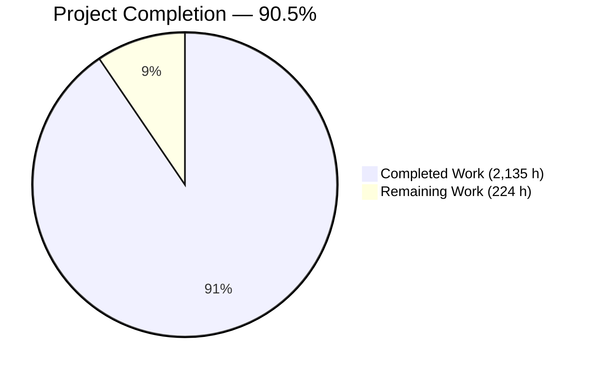
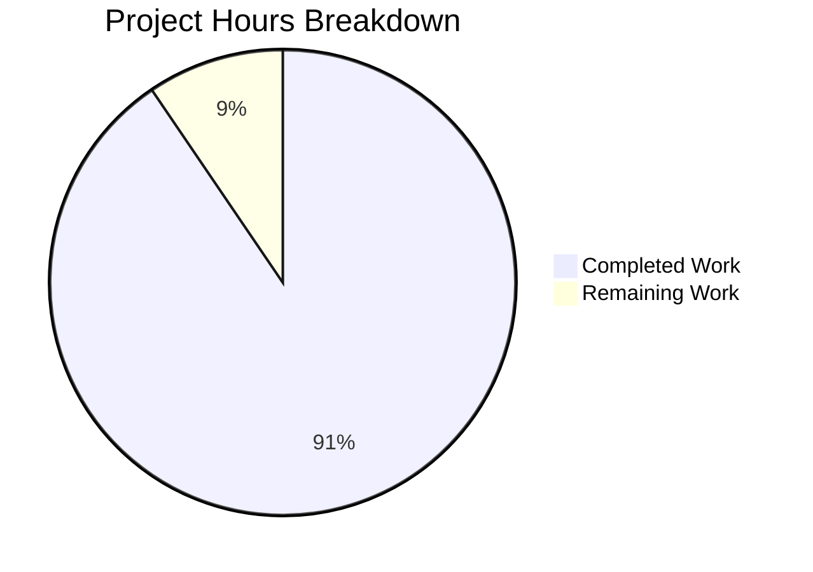
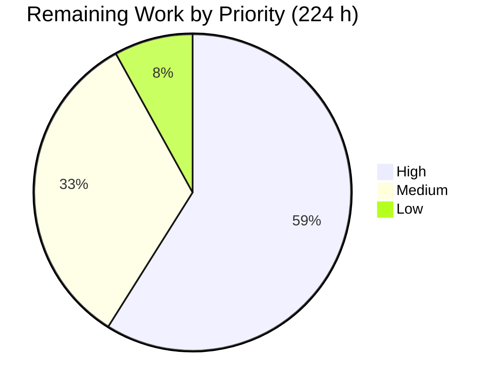
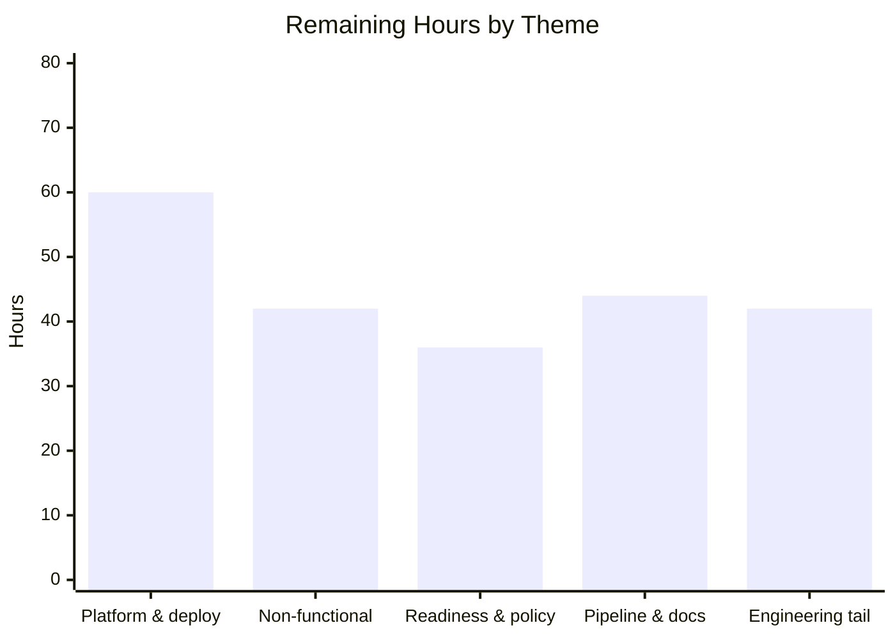

# 1. Executive Summary

## 1.1 Project Overview

CardDemo, an IBM z/OS credit-card management application built from COBOL, CICS, VSAM, 3270 screens and JCL, now also exists as a cloud-native system in this same repository. Twenty-eight COBOL programs are re-expressed as ten Spring Boot 4.1 services on Java 21, the VSAM data sets as an eighteen-table PostgreSQL schema, the seventeen screens as a React 19 application, and the JCL streams as Spring Batch jobs. The legacy tree is untouched and remains the reference. The business value is escaping mainframe lock-in without changing a financial outcome.

## 1.2 Completion Status



Chart colours: Completed = Dark Blue `#5B39F3`, Remaining = White `#FFFFFF`.

| Metric | Value |
|---|---|
| **Total Hours** | **2,359 h** |
| **Completed Hours (AI + Manual)** | **2,135 h** (AI 2,135 h + Manual 0 h) |
| **Remaining Hours** | **224 h** |
| **Percent Complete** | **90.5%** |

Scope covers the migration itself plus the standard path to production: 2,135 / (2,135 + 224) = 90.5%.

## 1.3 Key Accomplishments

- All 28 legacy programs re-expressed across ten services and a React application, the legacy sources left byte-identical as the reference.
- All 17 screens reproduced at cell-exact map geometry, with function-key semantics, screen wording and password masking preserved.
- VSAM data sets migrated to 18 tables with 12 foreign keys, 25 indexes and field-level AES-256-GCM encryption for personal data.
- Financial fidelity held: COBOL truncation in the interest calculation, the exact reject codes and 430-byte reject record, 16-digit identifiers.
- Concurrency contract held: a stale write is refused with the original wording, and account and customer rows commit together.
- Eleven Spring Batch jobs replace the JCL streams, restart-safe and durable, each reaching a completed state.
- Observability proven live: correlated JSON logs, cross-service traces, 11 of 11 scrape targets, 29 dashboard panels, 11 alert rules.
- 3,012 automated tests pass — 1,767 unit, 265 integration against real PostgreSQL and Redis, 980 frontend — zero failures.

## 1.4 Critical Unresolved Issues

| Issue | Impact | Owner | ETA |
|---|---|---|---|
| Kubernetes deployment has never been exercised against a live control plane | Cluster-only behaviour — volume binding, probe wiring, quality-of-service class, configuration precedence, scheduled-job deadlines, ingress TLS — is unproven; the Compose stack exercises the same images, commands and limits | Platform engineering | 24 h |
| Batch timing at production volume is not established | The four-hour completion gate cannot be signed off from fixture-sized runs | Performance engineering | 16 h |
| Sign-on, user creation and user update exceed the 200 ms 95th-percentile target under a burst of 150 arrivals in 15 seconds | Password hashing dominates the response; a work-factor policy or a scaling decision is needed before the target is met or formally relaxed | Performance / Security | 20 h |
| Alerts reach no receiver and point-in-time recovery is not enabled | Incidents page nobody, and the recovery point is the last database dump | Operations | 24 h |
| Production secrets are not bound to a managed store | Locally generated credentials must be replaced and rotated before any shared deployment | Platform engineering | 12 h |
| Four security-policy questions are open: full card-number display, last-administrator guard, card-list scoping by principal, transaction-classification lookup | Each is faithful legacy behaviour that a modern control set would change; release needs an explicit decision on each | Product / Security | 16 h |
| Documentation blocks exceed the conciseness this project's own rules require — 943 blocks over 500 characters | A rule-compliance gap with no behavioural effect; format, structure and accuracy all hold | Engineering | 24 h |

## 1.5 Access Issues

| System/Resource | Type of Access | Issue Description | Resolution Status | Owner |
|---|---|---|---|---|
| Kubernetes control plane | Namespace apply / admin | No cluster is reachable from the build environment, so the 33 manifests are validated by client-side schema checking and policy scanning only | Open | Platform engineering |
| Managed secret store | Credential provisioning | A local, ignored environment file holds the generated secrets; no production secret manager is bound | Open | Platform engineering |
| Container registry | Push | Images build and run locally; no registry is configured for publication | Open | Platform engineering |
| Alert delivery endpoint | Receiver configuration | The rule set evaluates and exposes alert state, but the scrape configuration states in-file that no dispatcher is attached | Open | Operations |
| Legacy z/OS baseline | Measurement | The memory-footprint and batch-window baselines exist only on the mainframe and cannot be measured from this environment | Open | Application owner |
| Repository, PostgreSQL, Redis, Prometheus, Grafana, Jaeger | Read / write / administer | Full access confirmed; every one was exercised directly | No issue | — |

## 1.6 Recommended Next Steps

1. **[High]** Deploy to a real Kubernetes namespace and re-run the verification set against it.
2. **[High]** Close the two open non-functional gates: a sustained 150-user load profile, and a batch rehearsal at production volume.
3. **[High]** Bind production secrets, enable write-ahead-log archiving with a rehearsed restore, and attach an alert receiver.
4. **[Medium]** Settle the four security-policy questions, each of which is deliberate legacy behaviour rather than an oversight.
5. **[Medium]** Run the documentation conciseness pass and stand up a delivery pipeline that enforces the recorded vulnerability-exception expiry.

# 2. Project Hours Breakdown

## 2.1 Completed Work Detail

| Component | Hours | Description |
|---|---|---|
| Online transaction services | 420 | Seventeen CICS programs re-expressed as 19 REST controllers over 33 endpoints and their service layers: sign-on, role-gated menus, account view and update, card list/detail/update, transaction inquiry and add, bill payment, report request and administrator user CRUD |
| Batch job suite | 230 | Ten batch programs and 29 JCL streams re-expressed as 11 Spring Batch jobs with chunk readers, validating processors, reject writers, restart-safe identifier allocation and atomic output publication |
| Relational data layer | 150 | Eleven record layouts as 14 JPA classes with composite-key identity, 29 repositories replacing keyed reads and alternate-index browses, and an 18-table schema with 12 foreign keys, 25 indexes and 4 sequences |
| Database migrations and seed data | 60 | Ten Flyway migrations covering schema, reference and fixture seed from the legacy fixed-width fixtures, batch metadata, optimistic-lock columns, an identifier character-set constraint and credential locking |
| Field-level encryption and data masking | 40 | AES-256-GCM converter with an enveloped ciphertext format, fail-fast key validation, a migration that encrypts seeded personal data idempotently, and server-side masking of national identifiers, government identifiers and account references |
| Session and transaction semantics | 70 | The COMMAREA replaced by a Redis-backed session context with an authentication filter and revocation index, transactional boundaries around multi-row updates, and `@Version` optimistic locking with aggregate version advance |
| Security | 90 | Per-service filter chains, a delegating password encoder, role derivation from the legacy user-type field, cross-site-request-forgery protection, hardened response headers, per-caller rate limits, sign-on lockout, session-identifier rotation and security audit logging |
| Error contract | 40 | A single JSON envelope across ten status codes including container-level rejections, reproducing the original first-error-only precedence and carrying the original screen wording on every constraint |
| React single-page application | 210 | Seventeen screens with a shared terminal shell, absolute row-and-column geometry derived from each map field's declared position and length, function-key and attention-identifier semantics, the input-inhibited indicator, REST client, routing and per-route code splitting |
| Date and legacy-format utilities | 45 | The date-validation service re-expressed with strict resolution, the Lillian day count and the original feedback categories, plus the 26-character timestamp, fixed-width text and edited-numeric output helpers |
| Observability | 85 | Structured JSON logging with correlation identifiers propagated onto batch and asynchronous threads, OpenTelemetry tracing, health/readiness/liveness groups including datastore and warm-up indicators, a scrape endpoint, 11 alert rules and a 29-panel dashboard |
| Automated test suite | 400 | 1,767 unit tests, 265 integration tests across 44 classes running against real PostgreSQL and Redis containers, and 980 frontend tests across 40 suites |
| Build, containerization and orchestration | 130 | Twenty-one Maven modules, the frontend toolchain, 12 container images with an unprivileged web tier and digest-pinned bases, a 15-service Compose stack with health gating and database role provisioning, and 33 Kubernetes manifests |
| Governance documentation | 75 | A decision log of 58 sections and 1,360 rows with a current-state register, a traceability matrix of 1,210 rows covering every legacy artefact in both directions and enforced by a committed test, and a 1,402-line target README whose command blocks were re-executed |
| Performance and security validation | 90 | A committed load harness covering 26 endpoints, per-request CPU and heap measurement with an enforced memory ceiling, and dependency, image and package scanning driven to zero critical findings |
| **Total** | **2,135** | Matches Completed Hours in Section 1.2 |

## 2.2 Remaining Work Detail

| Category | Hours | Priority |
|---|---|---|
| Kubernetes deployment validation on a live cluster | 24 | High |
| Sustained-load validation and the sign-on latency decision | 20 | High |
| Batch rehearsal at production volume against the four-hour window | 16 | High |
| Production secret management and credential rotation | 12 | High |
| Backup and point-in-time recovery enablement with a rehearsed restore | 12 | High |
| Security-policy decisions: card-number display, last-administrator guard, card-list scoping, transaction-classification lookup | 16 | High |
| Production deployment runbook: DNS, TLS termination and first-administrator provisioning | 12 | High |
| Production readiness review and user acceptance across the 17 screen workflows | 20 | High |
| Documentation conciseness pass across the Java sources | 24 | Medium |
| Delivery pipeline with vulnerability-exception expiry enforcement | 20 | Medium |
| Alert delivery and monitoring-tier completeness | 12 | Medium |
| Memory-envelope sign-off against the legacy baseline | 6 | Medium |
| Datastore-outage status mapping and outage-path completion | 6 | Medium |
| Daily transaction feed provisioning for a fresh deployment | 6 | Medium |
| Batch launch API migration ahead of the next major release | 8 | Low |
| Frontend accessibility decision and per-route stylesheet splitting | 10 | Low |
| **Total** | **224** | High 132 · Medium 74 · Low 18 |

## 2.3 Hours Reconciliation

| Check | Calculation | Result |
|---|---|---|
| Completed hours | Sum of Section 2.1 | 2,135 h |
| Remaining hours | Sum of Section 2.2 | 224 h |
| Total project hours | 2,135 + 224 | 2,359 h |
| Percent complete | 2,135 ÷ 2,359 × 100 | 90.5% |
| Remaining by priority | 132 + 74 + 18 | 224 h |

Every hour above traces to a specific migration deliverable or to a standard path-to-production activity for those deliverables. Confidence is high on the completed figures, which rest on measured code, executed tests and a running stack, and high on the platform items, which are well-understood work. Confidence is medium on the batch-rehearsal and sustained-load figures, because the production volume and the target environment are not yet known; both assume a rehearsal against representative data rather than a full capacity programme.

# 3. Test Results

Every figure below was produced by executing the suites in this repository at the current head: `mvn -B test` for the unit tier, `mvn -B verify` for the integration tier against real PostgreSQL and Redis containers, and `npm test -- --ci` for the frontend. Counts are read from the generated Surefire, Failsafe, JaCoCo and Jest reports.

| Area / Category | Framework | Tests | Passed | Failed | Coverage | What This Proves |
|---|---|---|---|---|---|---|
| Shared domain, DTOs, date and crypto utilities | JUnit 5 (+ Testcontainers) | 677 | 677 | 0 | 50.1% lines / 67.4% instructions | Record layouts, composite keys, decimal scale, strict date resolution and the encryption envelope behave as the copybooks define them |
| Authentication, session and user administration | JUnit 5 (+ Testcontainers) | 218 | 218 | 0 | 72.9% / 87.0% lines | Credentials verify against hashed storage, role and landing transaction follow the legacy user-type field, sessions survive service hops and are revoked on change, and administrator-only routes refuse a standard user |
| Account view and update | JUnit 5 (+ Testcontainers) | 201 | 201 | 0 | 86.9% lines | The full field-edit sequence rejects in the original order with the original wording, a stale write is refused and changes nothing, and account and customer rows commit together |
| Card list, detail and update | JUnit 5 (+ Testcontainers) | 158 | 158 | 0 | 89.1% lines | Seven rows per page tile the whole file with no duplicate or gap, edge-of-file wording appears at its own condition, the verification value is never returned, and concurrent updates yield exactly one winner |
| Transaction inquiry, add and bill payment | JUnit 5 (+ Testcontainers) | 338 | 338 | 0 | 79.2% / 71.7% lines | Identifiers are 16-digit and unique under contention, amount and width edits reject as the original does, available credit is limit minus balance, and a payment posts exactly one row |
| Batch jobs | JUnit 5 (+ Testcontainers) | 195 | 195 | 0 | 60.5% lines | Interest truncates as COBOL does with the default-group fallback, reject codes and the 430-byte reject record match the original conditions, and restart resumes without double-posting |
| Reporting and gateway routing | JUnit 5 (+ Testcontainers) | 245 | 245 | 0 | 87.1% / 82.5% lines | Statement and report output holds its fixed line widths, requests hand off asynchronously with the original acknowledgement wording, and role-gated routing reaches the right service |
| React screens | Jest + React Testing Library | 980 | 980 | 0 | 97.3% lines / 89.5% branches | All 17 screens render their map fields, function keys dispatch the typed value once per press, and error and information lines carry the original wording |

**Totals: 3,012 tests, 3,012 passed, 0 failed, 0 errors** — 1,767 unit and 265 integration across the backend, 980 across the frontend. Aggregate coverage is 65.5% of lines in the unit tier and 41.3% in the integration tier, with the frontend enforcing thresholds of 95/85/88/95. One test is skipped by design: it asserts behaviour on a read-only path that cannot hold for a privileged process.

**Not covered by any test.** These capabilities are delivered but no automated test exercises them, and a human should confirm each before release:

- **Kubernetes runtime behaviour.** The 33 manifests are schema-validated and policy-scanned, but nothing applies them: volume binding, read-only root filesystems, probe wiring, quality-of-service class, configuration-source precedence, scheduled-job deadlines and concurrency policy, and ingress TLS termination are all unexercised. The Compose stack exercises the same images, commands and resource limits.
- **Sustained concurrency and production-volume batch timing.** The load harness covers 26 endpoints and the jobs run against a 50-account, 300-record fixture; no test asserts a sustained 150-user profile or the four-hour batch window at real volume.
- **Memory footprint against the legacy baseline.** No test can compare a container against a mainframe region; the delivered substitute is an enforced absolute ceiling.
- **Five of the eleven alert rules.** Their metric families are present and the rules load, but no test drives a condition that fires them, and nothing verifies delivery because no receiver is attached.
- **Datastore-outage paths.** The already-committed-response branch of the outage filter is covered by unit tests only; the difference between a database failure and a session-store failure is not asserted anywhere.
- **Recovery from write-ahead logs.** A full dump-and-restore cycle is exercised; point-in-time recovery is not enabled, so no test covers it.

# 4. Runtime Validation & UI Verification

The whole system was started from an empty database and driven through the browser and the gateway. Every line below records what was seen on that running stack.

- ✅ **Start-up and schema** — `docker compose up -d` brought 14 containers to 13 healthy in 64 seconds; the ten migrations applied once and all succeeded, producing 18 tables, 12 foreign keys and 25 indexes with a pristine seed of 50 customers, accounts, cards and cross-references, 300 transactions, 300 feed records and 10 users. Zero error-level log lines across all nine services.
- ✅ **Authentication and session** — administrator sign-on returned the user type and its landing transaction in 0.57 seconds on a cold stack; a wrong password returned the original wording; the session rides an `HttpOnly`, `SameSite=Strict` cookie backed by Redis and is rebuilt on each downstream service.
- ✅ **Menu navigation** — the administrator and standard menus rendered their 4 and 10 options carrying the original target program names and the copybook's 35-character padding; a standard user is refused the administration routes.
- ✅ **Account inquiry and update** — full customer and account detail returned in 0.33 seconds with the national identifier, government identifier and account reference masked before they leave the service, and the version token exposed; a stale update was refused with the original conflict wording and left the row untouched.
- ✅ **Card list paging** — exactly seven rows on each page; forward paging to page three and back to page two returned an identical page two, with no card duplicated or missed and the verification value never present in any response.
- ✅ **Transaction inquiry and bill payment** — a ten-row browse returned ascending 16-digit identifiers with signed amounts, and bill payment required confirmation before posting.
- ✅ **Batch execution** — jobs launched asynchronously and reached a completed state, with 102 chunk operations for a single execution visible in both traces and dashboard metrics.
- ✅ **Terminal emulation** — screens render at cell-exact geometry with no horizontal overflow and no page scrolling at 1280×800 and at 375×667, the function-key legend stays in view at both sizes, the input-inhibited indicator appears while a request is outstanding, and the journey produced zero console errors.
- ✅ **Observability** — 11 of 11 scrape targets up, 29 dashboard panels rendering live series with a 0% error rate and an 88 ms global 95th percentile, 11 alert rules loaded in 6 groups with none firing, and traces of 21 and 126 spans each crossing a service boundary with the session store visible inside both participants.
- ⚠ **Kubernetes runtime** — the 33 manifests pass schema validation and policy scanning but have not been applied to a live control plane, so volume binding, probe wiring, quality-of-service class, configuration precedence, scheduled-job deadlines and ingress TLS termination remain unexercised at runtime.

**Never exercised at runtime:** production TLS and ingress termination, alert delivery to a receiver, and recovery from write-ahead logs. The monitoring tier itself carries one gap — its metrics container is the only one in the stack without a health probe, so a failure there would still be reported as running.

# 5. Compliance & Quality Review

## 5.1 Compliance Matrix

Repository hygiene holds throughout: the ignore rules cover both the Java and the Node target (`.gitignore`, 271 lines, with an explicit section retaining the legacy sources), and nothing ignored is tracked.

| Deliverable | Benchmark | Status | Evidence | Progress |
|---|---|---|---|---|
| Online transaction coverage — 17 programs | Every transaction reachable with equivalent behaviour | ✅ Pass | 19 controllers over 33 endpoints; each screen's flow exercised end to end | 100% |
| Batch coverage — 10 programs, 29 job streams, 2 procedures | Processing order and reject handling preserved | ✅ Pass | 11 jobs, each reaching a completed state; posting, interest and statement generation cover the three program-invoking streams | 100% |
| Data model and referential integrity | Keys, relationships and field semantics preserved, integrity declarative | ✅ Pass | 18 tables, 12 foreign keys, 25 indexes, 4 sequences (`carddemo-common/src/main/resources/db/migration/V1__create_schema.sql`); orphan inserts refused | 100% |
| Financial precision | No change to decimal precision, rounding or calculation order | ✅ Pass | `NUMERIC(p,s)` columns bound to `BigDecimal`; interest divides by 1200 at scale 2 (`batch-service/.../service/InterestCalculationService.java:82,151`) | 100% |
| Transaction atomicity and concurrency | Multi-row updates in one unit of work; original locking contract | ✅ Pass | `@Version` optimistic locking; a stale write is refused with the original wording and the account and customer rows commit together | 100% |
| Presentation fidelity — 17 screens | Field labels, layout semantics and function-key actions preserved | ✅ Pass | Absolute row and column placement derived from each map field's declared position and length; attention-identifier semantics and the input-inhibited indicator preserved | 100% |
| Security model | Hashed credentials, role authorities replacing the legacy user file | ✅ Pass | Delegating encoder with a `{bcrypt}` prefix; user-type `A`/`U` mapped to administrator and user authorities (`auth-service/.../security/UserDetailsServiceImpl.java:44-84`) | 100% |
| Spec-literal fidelity | Exact identifiers and byte-identical observable output | ⚠ Partial | The misspelled expiry identifiers survive in 50 files and the session condition names are verbatim; a small enumerated set of output departures is recorded in 5.2 | 95% |
| Explainability | Decision log plus a bidirectional traceability matrix at full coverage | ✅ Pass | `docs/decision-log.md` (58 sections, 1,360 rows) and `docs/traceability-matrix.md` covering 28/28 programs, 28/28 copybooks, 17/17 maps, 29/29 job streams and 2/2 procedures, enforced by `carddemo-common/src/test/java/com/carddemo/common/packaging/GovernanceDocumentationTest.java` | 100% |
| Observability | Structured logs, distributed tracing, metrics, health checks, dashboard | ✅ Pass | Verified on the running stack: correlation-carrying JSON logs, cross-service traces, 11 of 11 scrape targets, 29 live dashboard panels, 11 alert rules | 100% |
| Documentation style | reStructuredText field markers, concise | ⚠ Partial | 5,072 of 5,721 blocks carry the field markers and no block uses a foreign tag style, but 943 exceed 500 characters | 70% |
| Non-functional targets | 200 ms 95th percentile, four-hour batch window, memory envelope, 150 concurrent users, zero data loss | ⚠ Partial | 26 endpoints inside the latency budget and no data loss under restart or restore; three password-hashing endpoints exceed under burst, and the window and memory gates cannot be measured here | 60% |

## 5.2 AAP & Rule Divergences and Gaps

| What the AAP/Rule Required | What Was Delivered Instead | Why It Diverged | Impact | Remediation |
|---|---|---|---|---|
| Interest rounded at scale 2 with half-up rounding | Division at scale 2 with `RoundingMode.DOWN` | The source truncates; half-up would change posted amounts | Amounts match the mainframe; the plan's wording does not match the plan's own source citation | None required — correct the specification text |
| A 26-character timestamp in `YYYY-MM-DD-HH.MM.SS.mmmmmm` form | `YYYY-MM-DD HH:MM:SS.mmmmmm` — one blank, colon-separated time | Every legacy producer and the shipped feed fixture use the blank-and-colon form | Wire and file formats match what downstream consumers already receive | None required — confirm with feed consumers |
| Migrations owned per service under each service's own resources | One consolidated migration set owned by a single service; the rest validate | Per-service ownership is circular: every service maps the whole model and validates against it at start-up | One writer, nine validators; ordering is deterministic | None required — keep the single-owner rule when adding a service |
| Seeded logins usable straight from the documented quickstart | Seeded credentials replaced by a sentinel until an operator opts in | Shipping working credentials in a public repository is an unacceptable default | The historic demonstration password no longer signs on | Covered by the deployment runbook task |
| 95th percentile under 200 ms; memory growth under 10% | 26 endpoints inside budget; three password-hashing endpoints exceed under burst; an absolute memory ceiling instead of a delta | Password hashing is deliberately expensive; the memory baseline exists only on the mainframe | Two acceptance gates cannot be signed off as written | Load profile, latency decision and memory sign-off |
| Documentation blocks kept concise | Correct format and structure, but 943 blocks over 500 characters | Evidence prose accumulated in the code rather than in the decision log | No behavioural effect; a rule-compliance gap | Conciseness pass across the Java sources |
| Behaviour preserved without enhancement | Four legacy behaviours retained that a modern control set would change | The plan forbids business-logic enhancement; each would be an enhancement | Card numbers displayed in full, administration can be locked out, list scope is not principal-bound, classification is unvalidated | Security-policy decisions |
| Byte-identical observable output | Seven narrow output departures, each documented in the decision log | Validation gaps, error-contract consistency and layout constraints each forced a small change | Each is caller-visible, but none changes a financial result | Accept during the readiness review |

**Interest rounding.** The plan's special-analysis section quotes `COMPUTE WS-MONTHLY-INT = (TRAN-CAT-BAL * DIS-INT-RATE) / 1200` and then prescribes half-up rounding at scale 2. COBOL's fixed-scale `COMPUTE` without a `ROUNDED` clause truncates, so the delivered calculation divides at scale 2 with `RoundingMode.DOWN` (`batch-service/src/main/java/com/carddemo/batch/service/InterestCalculationService.java:151`, divisor at line 82). Fixture-driven tests in the batch module show half-up would post different amounts on several category balances. The delivered behaviour is the one that matches the mainframe, so the divergence is in the specification text rather than in the code; nothing needs changing beyond correcting that text.

**Timestamp form.** The plan's data-type rules describe the 26-character timestamp as `YYYY-MM-DD-HH.MM.SS.mmmmmm`. The legacy producers and the shipped daily-transaction fixture all emit one blank between date and time and colon separators inside it, and `carddemo-common/src/main/java/com/carddemo/common/util/LegacyTimestamp.java:31` documents and implements that form. Because this string reaches transaction records, statements and the reject file, matching the real producers matters more than matching the plan's prose. Anyone integrating a downstream consumer should confirm which form they read, but no code change is indicated.

**Migration ownership.** The plan places Flyway migrations under each owning service. Every service maps the full eleven-entity model and validates its schema at start-up, so per-service ownership would require each service to migrate tables another service owns — a circular arrangement. The delivered set lives once in `carddemo-common/src/main/resources/db/migration/` (nine SQL migrations plus one Java migration, `common/migration/SeededPiiEncryptionMigration.java`), applied by the batch service alone while the other nine validate. A fresh database reaches ten applied migrations, all successful, in one pass. Keep the single-owner rule when adding a service.

**Seeded credentials.** The plan and the legacy documentation describe signing on with a fixed demonstration password. `V10__lock_seeded_credentials.sql` replaces the ten seeded hashes with a sentinel that matches no input, and `auth-service/src/main/java/com/carddemo/auth/security/SeedCredentialProvisioner.java:50` re-hashes them at start-up only when the operator sets both the enabling flag and a password of at most eight characters. Verified directly: the historic password returns 401 for all ten identifiers, and an operator-supplied password signs on. The target README states the variable is a prerequisite rather than an option, and the Kubernetes configuration leaves the flag off, so a real deployment creates its first administrator through the user service.

**Non-functional gates.** Two of the plan's acceptance gates cannot be met as written. The memory gate is expressed as a percentage increase over a mainframe region that cannot be measured from a container host; the substitute is an enforced absolute ceiling of one gibibyte per service with a published method and measured utilisation between 45% and 60%. The latency gate is met on all 26 measured endpoints except sign-on, user creation and user update, where deliberate password-hashing cost of roughly 73 milliseconds per verification dominates once 150 sign-ons arrive inside fifteen seconds. Both need an owner decision: accept the substitute, or fund a work-factor and scaling exercise.

**Documentation conciseness.** The project's own rules ask for reStructuredText docstrings that state purpose, output and parameters without verbosity. Format and structure comply — 5,072 of 5,721 blocks carry the field markers, none uses a foreign tag style, and there are no acceptance-criteria comments — but 943 blocks exceed 500 characters and 289 exceed 1,000, spread over 396 files, because evidence and rationale accumulated beside the code instead of in the decision log. There is no behavioural effect. The trim must be line-based rather than pattern-based: thirteen files contain a comment-opening sequence inside a string literal.

**Legacy-parity retentions.** Four behaviours were kept because changing them would be the business-logic enhancement the plan forbids. Full sixteen-digit card numbers render on the card and transaction screens and are returned by their APIs, faithfully to the original maps. Deleting the last administrator is permitted, as in the original program, and leaves no in-application route back. The card list is not scoped to the signed-on principal, because the original filter has no user-type branch. Transaction type and category are accepted without a reference lookup, again as the original does, so a bad classification surfaces later as a failed category report. Each is a policy question for the owner.

**Observable-output departures.** Seven narrow departures from byte-identical output are recorded in the decision log. One validation message has no mainframe counterpart (`card-service/src/main/java/com/carddemo/card/service/CardService.java:179`) because the original edits month and year but never validates the day. A card update with no changes answers 400 carrying the original wording rather than a silent success (`CardService.java:169`). Unauthenticated, forbidden and rate-limited responses carry the shared error envelope instead of empty bodies. The information line renders directly above the error line rather than at its declared map row. The category-balance fixture seeds fifty rows, matching its source file rather than the plan's stated hundred. Statement generation takes only the two file parameters its job stream carries. Alerting and backup tooling exceed the plan's observability scope.

# 6. Risk Assessment

These are forward-looking exposures for the running system, not a history of the build.

| Risk | Category | Severity | Probability | Mitigation | Status |
|---|---|---|---|---|---|
| Kubernetes runtime behaviour is unverified — the manifests have never met a control plane | Operational | High | Medium | Apply the 33 manifests to a namespace and re-run the verification set; the Compose stack already exercises the same images, commands, resource limits and init containers, so the residual unknowns are scheduler- and volume-level | Open |
| Sign-on latency exceeds the 200 ms target when 150 sign-ons arrive inside fifteen seconds | Technical | Medium | High | Password-hashing cost of roughly 73 ms per verification is deliberate and irreducible at the current work factor; either tune it against a fresh threat model or scale the authentication service horizontally — every other endpoint sits inside the budget | Open |
| Batch completion at production volume is unproven against the four-hour window | Technical | High | Medium | Jobs are chunk-oriented, restart-safe and finish in seconds against the fixture; rehearse with representative feed volumes and record the window before the first production cycle | Open |
| Full sixteen-digit card numbers are rendered on screen and returned by the card and transaction APIs | Security | High | Medium | Faithful to the original maps, so masking is a policy change rather than a fix; it is a contained change in the card projection and list item once the owner accepts the departure from identical output | Accepted pending owner decision |
| Secrets live in a local environment file, and four vulnerability exceptions carry an expiry that nothing enforces | Security | High | Medium | Bind a managed secret store and rotate every credential and per-service database role before any shared deployment; enforce the recorded exception expiry in the delivery pipeline | Open |
| Alerts reach no receiver and the recovery point is the last database dump | Operational | High | Medium | Eleven rules evaluate and a full dump-and-restore cycle is proven; attach a receiver, then enable write-ahead-log archiving and rehearse a point-in-time restore | Open |
| Transaction type and category are accepted without a reference lookup, and outage responses differ by datastore — 500 for the database, 503 for the session store | Integration | Medium | Medium | Both behaviours are inherited: the original program performs no classification lookup. Add a validating lookup and map the database failure to 503 if the owner accepts the behaviour change | Open |
| Deleting the last administrator locks user administration out with no in-application recovery | Security | Medium | Low | Matches the original program, which has neither a last-administrator nor a self-deletion guard; provision a break-glass administrator outside the application or add the guard before go-live | Accepted pending owner decision |

# 7. Visual Project Status

**Overall progress — 90.5% of the migration and path-to-production scope is complete.**



Colour key: **Completed Work = Dark Blue `#5B39F3`** · **Remaining Work = White `#FFFFFF`**. Section headings and accents use Violet-Black `#B23AF2`; highlights use Mint `#A8FDD9`.

**Remaining work by priority — 224 hours.**



**Remaining work by theme.**



Themes map onto Section 2.2 as follows: **Platform and deploy** 60 h (cluster validation 24, secrets 12, backup and recovery 12, runbook 12); **Non-functional** 42 h (sustained load and latency decision 20, batch rehearsal 16, memory sign-off 6); **Readiness and policy** 36 h (readiness review and acceptance 20, security-policy decisions 16); **Pipeline and documentation** 44 h (delivery pipeline 20, documentation conciseness 24); **Engineering tail** 42 h (alert delivery and monitoring probe 12, outage mapping 6, feed provisioning 6, launch API migration 8, accessibility and stylesheet splitting 10). Total 60 + 42 + 36 + 44 + 42 = 224 h, identical to the Section 2.2 total and to the Remaining Hours in Section 1.2.

# 8. Summary & Recommendations

The migration is functionally complete and verified. All 28 COBOL programs now exist as ten Spring Boot 4.1 services on Java 21 and a React 19 single-page application, the VSAM data sets as an eighteen-table PostgreSQL schema with declarative referential integrity, and the JCL streams as eleven Spring Batch jobs. The legacy tree was not touched: every one of the 688 files added to this branch is new, so the COBOL, copybooks, maps and job streams remain available as the reference against which every transformation can be checked. Against the migration and path-to-production scope, the project stands at **90.5% complete — 2,135 hours delivered of 2,359 total, with 224 hours remaining**.

What has been proven, rather than merely built, is worth stating precisely. The full stack starts from an empty database in about a minute, applies its ten migrations once, and serves a seeded fixture of fifty customers, accounts, cards and cross-references with three hundred transactions. Sign-on returns the correct role and landing transaction; account inquiry returns masked personal data with a version token; a stale account update is refused with the original conflict wording and changes nothing; card paging returns exactly seven rows per page and tiles the file without duplicate or gap; bill payment insists on confirmation; batch jobs launch and complete. The seventeen screens render at cell-exact map geometry with no overflow at both desktop and phone widths, and produced no console errors. Observability is live rather than configured: correlation-carrying JSON logs, traces that visibly cross service boundaries, eleven of eleven scrape targets up, twenty-nine dashboard panels with data, eleven alert rules loaded. Three thousand and twelve automated tests pass with zero failures.

The remaining work is dominated by the one environment this system has never met and the two acceptance gates that cannot be measured from here. The Kubernetes manifests are schema-valid and policy-clean but unapplied, so volume binding, probe wiring, quality-of-service class and ingress termination are unexercised; production secrets are not yet bound to a managed store; alerts evaluate but reach no receiver; and recovery is bounded by the last dump because write-ahead-log archiving is off. Separately, the four-hour batch window and the memory-growth ceiling are expressed against a mainframe baseline that no longer exists in reach, and sign-on latency exceeds its budget under a burst because password hashing is deliberately expensive. None of these is a code defect; all four are decisions and platform work.

The critical path to production is therefore short and mostly operational: deploy to a real namespace and re-run the verification set; rehearse the batch cycle at production volume and take a decision on sign-on latency; bind secrets, enable point-in-time recovery and attach an alert receiver; then settle four security-policy questions that are open precisely because the delivered behaviour is faithful to the original — full card-number display, the absent last-administrator guard, an unscoped card list and unvalidated transaction classification. Success can be measured concretely: the verification set passing against the cluster, a recorded batch window inside four hours, a rehearsed restore, and an explicit accept-or-change decision recorded against each policy question and each observable-output departure.

**Production readiness assessment: ready for a staging deployment now, not yet ready for production cut-over.** The application tier is the strongest part of the delivery — behaviour is faithful, tested and observable, with no placeholder code anywhere in the tree and no unresolved failure in any suite. The gap is entirely in the operational envelope around it. With the eight high-priority items closed, roughly 132 hours of work, this system can carry production traffic; the remaining 92 hours of medium and low priority work improves pipeline discipline, documentation and long-term maintainability rather than gating release.

# 9. Development Guide

Every command below was executed in this repository and produced the stated result. Run them from the repository root unless a step says otherwise.

## 9.1 System Prerequisites

| Requirement | Version used | Notes |
|---|---|---|
| JDK | Eclipse Temurin 21.0.12+8 | Java 21 is the language and runtime level for all ten services |
| Apache Maven | 3.9.16 | Builds the 21-module reactor |
| Node.js / npm | 22.23.2 / 11.18.0 | The frontend accepts Node 22.12 or later; the container image builds on Node 24 |
| Docker Engine + Compose | 29.7.0 + v5.3.1 | Required for the integration test tier and the local stack |
| Disk / memory | ~4 GB free, 10 GB RAM | Fifteen containers with a one-gibibyte ceiling per service |

```bash
java -version && mvn -v | head -1 && node -v && npm -v && docker info --format '{{.ServerVersion}}'
```

## 9.2 Environment Setup

The stack refuses to start without its secrets, and names the missing variable when one is absent, so create the environment file first.

```bash
cp .env.example .env
chmod 600 .env

# Database and session store
printf 'POSTGRES_PASSWORD=%s\n' "$(openssl rand -base64 24)" >> .env
printf 'REDIS_PASSWORD=%s\n'    "$(openssl rand -base64 24)" >> .env

# Field-level encryption key — must be a Base64-encoded 32-byte value
printf 'CARDDEMO_PII_KEY=%s\n'  "$(openssl rand -base64 32)" >> .env

# Demonstration logins: at most 8 characters, matching the legacy password width
printf 'CARDDEMO_SEED_CREDENTIALS_ENABLED=true\n' >> .env
printf 'CARDDEMO_SEED_USER_PASSWORD=%s\n' "$(LC_ALL=C tr -dc 'A-Z0-9' < /dev/urandom | head -c 8)" >> .env
```

Edit `.env` afterwards so each key appears once. The template lists all nineteen variables with an explanation of each; the eight per-service database passwords, the monitoring principal and the dashboard administrator credentials are all required.

## 9.3 Build

```bash
# Backend: 21 modules, skipping tests for a fast first pass
mvn -B clean install -DskipTests

# Frontend
cd frontend && npm ci && npm run build && cd ..
```

Expected: `BUILD SUCCESS` with 11 reactor artifacts, and a `frontend/dist` bundle. A warm dependency cache completes the backend build in well under a minute.

## 9.4 Test

```bash
mvn -B test                     # unit tier — 1,767 tests, 0 failures, 1 skipped by design
mvn -B verify                   # integration tier — 265 tests across 44 classes, needs Docker
cd frontend
npx tsc --noEmit                # type check
npm test -- --ci                # 40 suites, 980 tests, coverage thresholds enforced
npm run lint
cd ..
```

The unit tier starts no containers; the integration tier starts PostgreSQL and Redis per test class, so run `docker info` first. Coverage reports land in each module's `target/site/jacoco` and `target/site/jacoco-it`, and in `frontend/coverage`.

## 9.5 Run the Stack

Build the jars before the images: eight of the nine service images copy `target/*.jar`.

```bash
export CARDDEMO_IMAGE_VERSION=1.0.0
export CARDDEMO_IMAGE_REVISION=$(git rev-parse HEAD)
export CARDDEMO_IMAGE_CREATED=$(date -u +%Y-%m-%dT%H:%M:%SZ)

docker compose up -d --build                                   # database, session store, 9 services, monitoring
docker compose --profile frontend up -d --build frontend        # the single-page application

docker compose ps                                              # expect 14 containers, 13 healthy
```

Start-up from an empty database takes about a minute. The metrics container is the only one without a health probe, so it reports as running rather than healthy — that is a known gap, not a failure.

## 9.6 Verification

```bash
# 1. Gateway health — expect {"groups":["liveness","readiness"],"status":"UP"}
curl -s http://localhost:8080/actuator/health

# 2. Every service reports its own health, readiness and liveness
for s in auth user account card transaction billpay reporting batch; do
  docker compose exec -T ${s}-service wget -qO- http://localhost:8080/actuator/health/readiness; echo " <- ${s}-service"
done

# 3. Schema and seed census
docker compose exec -T -e PGPASSWORD="$POSTGRES_PASSWORD" postgres \
  psql -U carddemo_owner -d carddemo -c \
  "select version, description, success from flyway_schema_history order by installed_rank;"
# expect 10 rows, every success = t

# 4. Scrape targets — expect 11 targets, all up
curl -s 'http://127.0.0.1:9090/api/v1/targets?state=active' | grep -o '"health":"up"' | wc -l

# 5. Application shell and a deep link — both 200
curl -s -o /dev/null -w '%{http_code}\n' http://localhost:3000/
curl -s -o /dev/null -w '%{http_code}\n' http://localhost:3000/accounts
```

Reachable surfaces: the application at `http://localhost:3000`, the gateway at `http://localhost:8080`, metrics at `http://127.0.0.1:9090`, dashboards at `http://127.0.0.1:3001`, traces at `http://127.0.0.1:16686`. The database and session store are deliberately not published to the host.

## 9.7 Example Usage

```bash
# Sign on — administrators land on CA00, standard users on CM00
curl -s -c cookies.txt -X POST http://localhost:8080/auth/signon \
  -H 'Content-Type: application/json' \
  -d "{\"userId\":\"ADMIN001\",\"password\":\"$CARDDEMO_SEED_USER_PASSWORD\"}"
# {"userId":"ADMIN001","userType":"A","redirectTarget":"CA00"}

# Account inquiry — personal data is masked before it leaves the service
curl -s -b cookies.txt http://localhost:8080/accounts/00000000001
# {... "acctCurrBal":"194.00","acctCreditLimit":"2020.00","acctExpiraionDate":"2025-05-20",
#      "custSsn":"***-**-3888","version":0}

# Card list — exactly seven rows per page, no verification value returned
curl -s -b cookies.txt 'http://localhost:8080/cards?page=1'

# Transaction browse
curl -s -b cookies.txt http://localhost:8080/transactions

# Batch: list the jobs, launch one, then read its execution
curl -s -b cookies.txt http://localhost:8080/batch/jobs
XSRF=$(awk '/XSRF-TOKEN/ {print $7}' cookies.txt)
curl -s -b cookies.txt -H "X-XSRF-TOKEN: $XSRF" -X POST \
  http://localhost:8080/batch/jobs/cardReadJob
# 202 {"jobName":"cardReadJob","jobExecutionId":3,"status":"STARTING",...}
curl -s -b cookies.txt http://localhost:8080/batch/jobs/executions/3
# {"jobName":"cardReadJob","jobExecutionId":3,"status":"COMPLETED","exitCode":"COMPLETED"}
```

Writes require the cross-site-request-forgery token: read the `XSRF-TOKEN` cookie and send it back as the `X-XSRF-TOKEN` header. Every error response carries the same nine-member envelope — `status`, `error`, `errorCode`, `message`, `fieldErrors`, `path`, `timestamp`, `correlationId` and `traceId` — so a failure can be traced straight to its log line.

## 9.8 Troubleshooting

- **Compose exits naming a variable.** Required secrets are guarded, for example `set CARDDEMO_SEED_USER_PASSWORD in .env (at most 8 characters)`. Add the named variable to `.env`.
- **Every seeded login returns 401.** Seeded credentials are locked until an operator opts in. Set `CARDDEMO_SEED_CREDENTIALS_ENABLED=true` and an eight-character `CARDDEMO_SEED_USER_PASSWORD`, then restart the authentication service. The historic demonstration password does not work by design.
- **A service exits immediately at start-up.** The encryption key is validated eagerly: `CARDDEMO_PII_KEY` must be a Base64-encoded 32-byte value. Regenerate it with `openssl rand -base64 32`.
- **`psql` reports "no password supplied".** Loopback trust is disabled; pass the password, as in `docker compose exec -T -e PGPASSWORD="$POSTGRES_PASSWORD" postgres psql -U carddemo_owner -d carddemo`.
- **`redis-cli` reports `NOAUTH`.** Authenticate: `docker compose exec -T redis redis-cli -a "$REDIS_PASSWORD" --no-auth-warning DBSIZE`.
- **`mvn -B verify` fails starting containers.** The integration tier needs a working Docker daemon; check `docker info` and free disk space.
- **An image starts without your latest code.** Rebuild the jars first, then `docker compose up -d --build`.
- **A write returns 403.** The token header is missing or stale; re-read the cookie after signing on.
- **Ports 3000 or 8080 already bound.** Only those two publish on all interfaces; stop the conflicting process or override the mapping.
- **Reset everything.** `docker compose --profile frontend down -v` removes the containers and volumes, so the next start re-applies the migrations and restores a pristine seed.

# 10. Appendices

## A. Command Reference

| Purpose | Command |
|---|---|
| Build the backend | `mvn -B clean install -DskipTests` |
| Build with the full suite | `mvn -B clean install` |
| Unit tier | `mvn -B test` |
| Integration tier | `mvn -B verify` |
| Single module | `mvn -B -pl account-service -am test` |
| Frontend install / build | `cd frontend && npm ci && npm run build` |
| Frontend tests / types / lint | `npm test -- --ci` · `npx tsc --noEmit` · `npm run lint` |
| Start the stack | `docker compose up -d --build` |
| Start the application shell | `docker compose --profile frontend up -d --build frontend` |
| Container status | `docker compose ps` |
| Follow one service | `docker compose logs -f account-service` |
| Database shell | `docker compose exec -T -e PGPASSWORD="$POSTGRES_PASSWORD" postgres psql -U carddemo_owner -d carddemo` |
| Session store | `docker compose exec -T redis redis-cli -a "$REDIS_PASSWORD" --no-auth-warning DBSIZE` |
| Live sessions | `... redis-cli -a "$REDIS_PASSWORD" --no-auth-warning --scan --pattern 'carddemo:session:*'` |
| Load profile | `k6 run perf/carddemo-online-load.js` |
| Manifest check | `kubectl create --dry-run=client -f k8s/ -o name` |
| Tear down with volumes | `docker compose --profile frontend down -v` |

## B. Port Reference

| Surface | Host binding | Container port | Notes |
|---|---|---|---|
| Single-page application | `0.0.0.0:3000` | 8080 | Unprivileged web tier, per-request upstream resolution |
| API gateway | `0.0.0.0:8080` | 8080 | The only application entry point |
| Nine services | not published | 8080 | Reachable inside the Compose network and through the gateway |
| Metrics | `127.0.0.1:9090` | 9090 | Loopback only |
| Dashboards | `127.0.0.1:3001` | 3000 | Loopback only; anonymous access disabled |
| Traces | `127.0.0.1:16686` | 16686 | Ingest on 4317/4318 inside the network |
| PostgreSQL | not published | 5432 | Reachable only inside the network |
| Redis | not published | 6379 | Reachable only inside the network |

## C. Key File Locations

| Area | Path |
|---|---|
| Reactor root and modules | `pom.xml` (21 module descriptors) |
| Shared domain, DTOs, utilities, security, crypto | `carddemo-common/src/main/java/com/carddemo/common/` |
| Services | `auth-service/`, `user-service/`, `account-service/`, `card-service/`, `transaction-service/`, `billpay-service/`, `reporting-service/`, `batch-service/`, `api-gateway/` |
| Schema and seed migrations | `carddemo-common/src/main/resources/db/migration/` (nine SQL, one Java) |
| Application screens | `frontend/src/pages/` (17), shell in `frontend/src/components/`, geometry in `frontend/src/bmsGrid.css` |
| Local stack | `docker-compose.yml`, `.env.example`, `db/init/` |
| Monitoring | `observability/prometheus.yml`, `alert-rules.yml`, `grafana-dashboard.json`, `jaeger-config.yaml` |
| Kubernetes | `k8s/` (33 manifests) |
| Load harness | `perf/carddemo-online-load.js` |
| Governance | `docs/decision-log.md`, `docs/traceability-matrix.md`, `README-target.md` |
| Legacy reference | `app/cbl/` (28 programs), `app/cpy/` (28 copybooks), `app/bms/` (17 maps), `app/jcl/` (29 streams), `app/proc/` (2 procedures), `app/data/ASCII/` (fixtures) |

## D. Technology Versions

| Component | Version |
|---|---|
| Java runtime | Eclipse Temurin 21.0.12+8 |
| Spring Boot / Framework | 4.1.0 / 7.0.8 |
| Spring Cloud (gateway) | 2025.1.2 release train |
| Hibernate | 7.4.1 |
| Flyway | 12.4.0 |
| PostgreSQL / JDBC driver | 18 / 42.7.13 |
| Redis | 8 (digest-pinned) |
| React / build tooling | 19 with Vite and TypeScript |
| Web tier base image | nginx 1.29-alpine |
| Metrics / dashboards / traces | Prometheus 3.13.2 · Grafana 13.1.3 · Jaeger 2.20.0 (all digest-pinned) |
| Build tooling | Maven 3.9.16 · Node 22.23.2 locally, Node 24 in the image |

## E. Environment Variable Reference

| Variable | Purpose |
|---|---|
| `POSTGRES_USER`, `POSTGRES_PASSWORD`, `POSTGRES_DB` | Owning role and database created at first start |
| `CARDDEMO_AUTH_DB_PASSWORD` … `CARDDEMO_BATCH_DB_PASSWORD` | Eight least-privilege per-service database roles |
| `REDIS_PASSWORD` | Session store authentication |
| `CARDDEMO_PII_KEY` | Base64-encoded 32-byte field-encryption key; validated at start-up |
| `CARDDEMO_SEED_CREDENTIALS_ENABLED` | Opt-in that makes the seeded logins usable; off by default and off in the cluster configuration |
| `CARDDEMO_SEED_USER_PASSWORD` | Password applied to the ten seeded logins, at most eight characters |
| `CARDDEMO_COOKIE_SECURE` | Marks the session cookie secure; enable behind TLS |
| `MONITORING_PASSWORD` | Principal the metrics scraper uses against each service |
| `GRAFANA_ADMIN_USER`, `GRAFANA_ADMIN_PASSWORD` | Dashboard administrator; there is no default credential |
| `CARDDEMO_IMAGE_VERSION`, `CARDDEMO_IMAGE_REVISION`, `CARDDEMO_IMAGE_CREATED` | Image labels applied at build time |

## F. Developer Tools Guide

- **Reading a request end to end.** Every response carries `X-Correlation-Id`; the same value appears in each service's JSON log line alongside the trace and span identifiers, and the trace view shows the gateway span with the downstream service span nested inside it.
- **Watching a batch job.** Launch it through the gateway, then poll `GET /batch/jobs/executions/{id}`; step and chunk counts also surface as dashboard metrics, and reject output is published atomically under the batch output volume.
- **Working on one screen.** `cd frontend && npm run dev` serves the application with hot reload; each screen's field positions come from the corresponding map file, so compare against `app/bms/` when a field looks misplaced.
- **Checking behaviour against the original.** `docs/traceability-matrix.md` maps every legacy construct to its implementation and back, so a question about any COBOL paragraph resolves to a file and line; `docs/decision-log.md` explains anything that was decided rather than translated.
- **Testing one class quickly.** `mvn -B -pl card-service test -Dtest=CardServiceTest` for the unit tier, `-Dit.test=CardViewUpdateIT` with `verify` for the integration tier.

## G. Glossary

| Term | Meaning |
|---|---|
| BMS map / mapset | The 3270 screen definition; field position and length in the map drive the screen geometry in the application |
| COMMAREA | The storage area CICS carried between screen interactions; replaced by a session context held in Redis |
| Pseudo-conversational | The CICS pattern of ending a transaction between screens; replaced by stateless requests plus session state |
| VSAM KSDS / alternate index | The keyed file and its secondary access path; replaced by a table primary key and a secondary index |
| COMP-3 | Packed-decimal storage for money; mapped to `BigDecimal` over `NUMERIC(p,s)` at the same scale |
| Attention identifier (AID) | The key that submitted a screen — Enter, F3, F7, F8; preserved in the request contract |
| Operator information area | The 3270 status row; shows the input-inhibited indicator while a request is outstanding |
| Transaction identifier | The four-character CICS code shown on each screen: `CC00` sign-on, `CM00` main menu, `CA00` administrator menu, `CAVW`/`CAUP` account view and update, `CCLI`/`CCDL`/`CCUP` card list, detail and update, `CT00`/`CT01`/`CT02` transaction list, view and add, `CB00` bill payment, `CR00` reports, `CU00`–`CU03` user administration |
| Reject code | The validation verdict written with a rejected feed record: 100 unknown card, 101 unknown account, 102 over limit, 103 received after expiry |
| Lillian day count | The day number the legacy date service returned; retained by the date utility for equivalence |
| Generation data group | The mainframe versioned-dataset backup mechanism; replaced by database backup and recovery |
