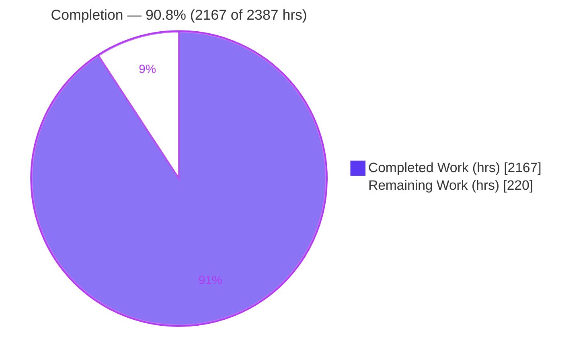
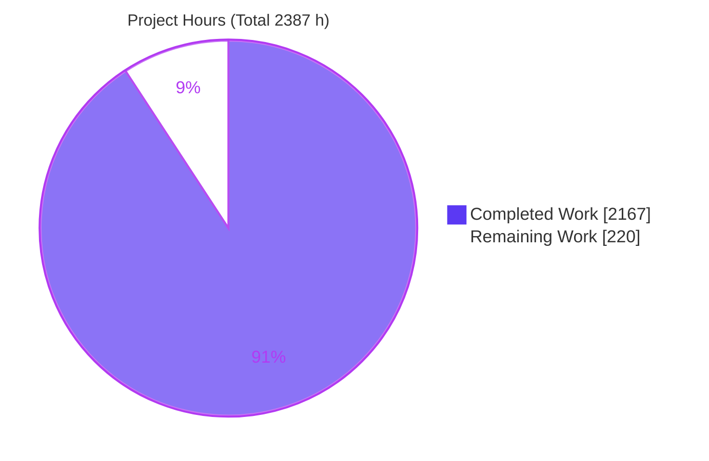
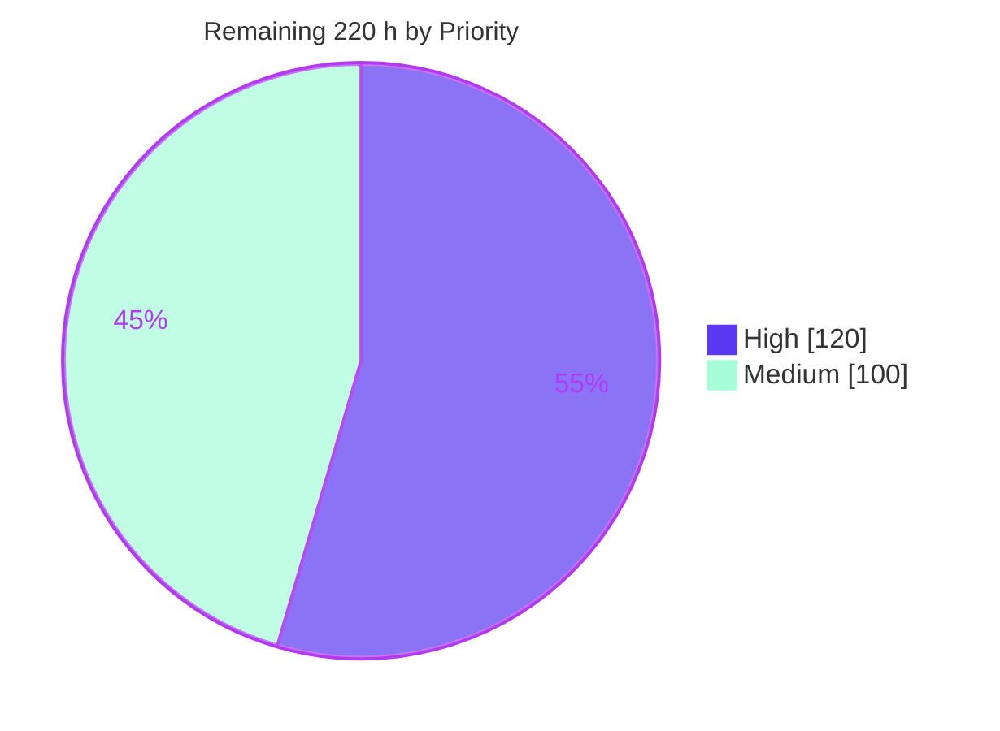

# Blitzy Project Guide — AWS CardDemo COBOL → Java 25 / Spring Boot Migration

> **Brand legend:** <span style="color:#5B39F3">■ Dark Blue `#5B39F3` = Completed / AI Work</span> &nbsp;|&nbsp; <span style="background:#FFFFFF;border:1px solid #B23AF2">□ White `#FFFFFF` = Remaining / Not Completed</span>. Headings/accents use Violet-Black `#B23AF2`; soft highlights use Mint `#A8FDD9`.

---

## 1. Executive Summary

### 1.1 Project Overview

This project migrates the **AWS CardDemo** credit-card management application from its IBM z/OS mainframe stack (COBOL, CICS, VSAM, JCL, BMS, RACF) to a modern **Java 25 LTS + Spring Boot 3.5.16** layered application within the **same repository**, preserving 100% of existing business behavior with zero functional regressions. Target users are the bank operations and administration staff who use the online screens (account, card, transaction, bill-pay, reporting, user administration) and the scheduled batch cycle (transaction posting, interest calculation, statements, reports). The technical scope re-expresses the three-tier z/OS architecture as web → service → repository → PostgreSQL, with JCL re-expressed as Spring Batch. Original COBOL is retained read-only under `legacy/` for traceability.

### 1.2 Completion Status



| Metric | Value |
|--------|-------|
| **Total Hours** | **2,387 h** |
| Completed Hours (AI + Manual) | **2,167 h** (2,167 h AI autonomous + 0 h manual) |
| Remaining Hours | **220 h** |
| **Percent Complete** | **90.8 %** |

> Completion is computed per PA1 (AAP-scoped hours only): `2167 / (2167 + 220) = 90.78% ≈ 90.8%`. All AAP-specified autonomous deliverables are complete and validated; the remaining 220 h is human path-to-production work (Section 2.2).

### 1.3 Key Accomplishments

- ✅ **Complete stack migration:** 28 COBOL programs, 28 copybooks, 17 BMS maps, 29 JCL jobs → 127 Java main files (63.9K LOC) across domain, repository, service, web, batch, security, config, exception, and util layers.
- ✅ **Decimal fidelity preserved:** monetary fields use `java.math.BigDecimal` with per-statement `RoundingMode` (28 truncation sites mirroring COBOL `COMPUTE` without `ROUNDED`); no floating-point for money.
- ✅ **All 18 CICS transaction ids** mapped to controller routes; `COMMAREA` (`COCOM01Y`) → session-scoped `CardDemoContext` preserving pseudo-conversational semantics.
- ✅ **VSAM → PostgreSQL:** one table per VSAM file, primary/composite keys and alternate indexes preserved as secondary indexes + Spring Data derived queries; Flyway migrations V0–V4.
- ✅ **JCL → Spring Batch:** 12 business jobs as chunk-oriented (reader/processor/writer) steps; `SORT` → Java `Comparator`/`ORDER BY`.
- ✅ **Security migration:** RACF + app signon → Spring Security `UserDetailsService` with `ROLE_ADMIN`/`ROLE_USER`; role-based post-login routing parity; **no hardcoded credentials** (env-driven).
- ✅ **Quality gates all passed:** zero-warning build, **1,465 tests 100% pass**, **90.83% coverage**, OWASP zero unsuppressed HIGH/CRITICAL, healthy runtime.
- ✅ **Rule-mandated deliverables:** 100% bidirectional traceability matrix (528 paragraphs), decision log, onboarding guide, Mermaid before/after architecture, observability stack + Grafana dashboard, reveal.js executive deck (+ canonical theme created).

### 1.4 Critical Unresolved Issues

There are **no issues blocking build validation or local runtime** — all five autonomous validation gates passed with zero source fixes required. The items below are release-readiness gaps (not defects) that require human action before a production cutover.

| Issue | Impact | Owner | ETA |
|-------|--------|-------|-----|
| Business-logic parity not yet human-signed-off | Cannot certify 100% functional parity for a financial system without human review + UAT | Migration lead / Business SME | 72 h + 40 h UAT |
| Byte-level flat-file parity unverified vs EBCDIC source-of-truth | `DALYTRAN`/`DALYREJS` output must match legacy byte-for-byte before feeds are cut over | Batch/Data engineer | Part of 40 h UAT |
| Spring Boot 3.5.16 at OSS end-of-life (2026-06-30) | No future upstream CVE patches on the 3.5 branch | Platform engineer | 24 h |
| Cleartext password comparison (parity-preserved) | Weak credential storage; acceptable only until hardened | Security engineer | 12 h |

### 1.5 Access Issues

**No blocking access issues identified.** Validation completed end-to-end locally; the git working tree is clean and committed.

| System/Resource | Type of Access | Issue Description | Resolution Status | Owner |
|-----------------|----------------|-------------------|-------------------|-------|
| Maven Central | Outbound HTTPS (build) | First dependency resolution + Maven wrapper download require internet; offline cache now complete | Resolved (cached) | Platform engineer |
| OWASP NVD data feed | Outbound HTTPS (CVE gate) | `./mvnw clean verify` OWASP scan requires **online** mode; `./mvnw -o verify` silently skips it | Operational note — CI must run online | DevOps |
| Real mainframe / EBCDIC oracle | Read access to production extracts | Not available in the local environment; needed for parity UAT cross-check | Open (by design — local validation) | Business SME |

### 1.6 Recommended Next Steps

1. **[High]** Conduct human code review and business-logic parity sign-off of the 271 generated files against the 528 COBOL paragraphs (72 h).
2. **[High]** Execute mainframe-parity UAT: byte-level flat-file and decimal/interest edge-case validation against the 12 EBCDIC source datasets (40 h).
3. **[High]** Externalize secrets for non-local environments (vault/CI wiring; rotate the seed credential) (8 h).
4. **[Medium]** Stand up CI/CD (`.github/workflows`) running build + tests + coverage + **online** OWASP, then provision production infrastructure and staging (64 h combined).
5. **[Medium]** Plan the Spring Boot 4.x upgrade (EOL mitigation) and BCrypt password hardening (36 h combined).

---

## 2. Project Hours Breakdown

### 2.1 Completed Work Detail

Hours are anchored to actual per-package LOC at complexity-adjusted rates (parity-preserving migration), plus verified tests, documentation, tooling, and QA cycles. Each row traces to AAP deliverables.

| Component | Hours | Description |
|-----------|-------|-------------|
| Domain entities + repositories | 94 | 10 JPA entities (`BigDecimal` fidelity, composite keys) + 10 Spring Data repositories; alternate indexes → derived queries (`findByCardNum`, etc.) |
| DTOs, session context & screen forms/reports | 190 | 31 DTOs incl. `CardDemoContext` (COMMAREA), 17 screen forms, report/statement models, menu options, constants/enums |
| Online services (17) | 500 | Paragraph-preserving CICS business logic (e.g., `AccountUpdateService` 5,008 LOC, `CardUpdateService`, `CardListService`, `TransactionAddService`) |
| Web controllers (9) | 134 | All 18 CICS transaction ids; session read/write, PF-key/`XCTL`-redirect routing, validation |
| Spring Batch jobs (12 + infra) | 153 | Posting, interest, statement, account/card/xref prints, customer load, backup, report, combine, category-balance, admin + batch infrastructure |
| Cross-cutting (security/config/exception/util) | 146 | Spring Security stack, 5 `@Configuration` classes, 7-type `FILE STATUS`/`EIBRESP` exception hierarchy, decimal/date/fixed-width utilities |
| Automated test suite | 588 | 1,465 tests (JUnit 5 unit + Testcontainers integration + parity oracles), 50.4K test LOC, 90.83% coverage |
| Presentation & DB resources | 82 | 17 Thymeleaf screens (24×80 BMS contract), Flyway V0–V4, `application.yml` + dev/test profiles, `logback-spring.xml` |
| Rule-mandated documentation | 134 | Decision log, 100% traceability matrix (528 paragraphs), onboarding, operation inventory, architecture (Mermaid before/after), README update |
| Observability dashboard + executive deck | 48 | Grafana dashboard JSON, reveal.js 16-slide deck + canonical `blitzy-reveal-theme.css` (created) + init |
| Build & tooling | 38 | Maven `pom.xml` (BOM, JaCoCo, OWASP, `--release 25`), wrapper 3.9.9, 27 documented CVE suppressions, `legacy/` move + `.gitattributes` (EBCDIC) |
| QA / validation / debugging cycles | 60 | Iterative remediation across 30 commits (49 code-review + 27 QA + security/batch findings resolved) |
| **Total Completed** | **2,167** | **Matches Completed Hours in Section 1.2** |

### 2.2 Remaining Work Detail

All remaining work is human path-to-production; each item traces to an AAP quality rule (§0.7) or a standard production-readiness need.

| Category | Hours | Priority |
|----------|-------|----------|
| Human code review & business-logic parity sign-off (271 files / 63.9K LOC vs 528 paragraphs) | 72 | High |
| Mainframe-parity UAT (byte-level `DALYTRAN`/`DALYREJS`, EBCDIC collation, decimal edge cases) | 40 | High |
| Externalized secrets for non-local envs (vault/CI wiring; rotate seed credential) | 8 | High |
| Production infrastructure & deployment (container image, managed PostgreSQL, orchestration/runbook, prod monitoring wiring) | 32 | Medium |
| Spring Boot 3.5.16 → 4.x EOL upgrade (re-run gates, re-scan OWASP) | 24 | Medium |
| CI/CD pipeline (`.github/workflows`: build + test + coverage + online OWASP + artifact publish) | 16 | Medium |
| Staging environment bring-up + externalized-config validation | 16 | Medium |
| Password hashing (BCrypt) migration + rollout strategy | 12 | Medium |
| **Total Remaining** | **220** | **High = 120 h, Medium = 100 h** |

> **Integrity:** Section 2.1 (2,167 h) + Section 2.2 (220 h) = **2,387 h** = Total Hours (Section 1.2). Section 2.2 sum (220 h) = Section 1.2 Remaining = Section 7 pie "Remaining Work".

### 2.3 Basis of Estimate

Completed hours are LOC-anchored (e.g., online services at ~46 LOC/h reflecting paragraph-by-paragraph parity work; tests at ~85 LOC/h; DTOs at ~78 LOC/h) and cross-checked against PA2 category guidance. The total (~2,167 h ≈ one engineer-year) is consistent with the scale of translating 28 COBOL programs / 528 paragraphs into 63.9K main + 50.4K test LOC plus 180 KB of rule-mandated documentation. Confidence: **High** for the completed autonomous work (validated by passing gates); **Medium** for remaining human-effort estimates (review depth and UAT scope depend on organizational rigor).

---

## 3. Test Results

All tests below originate from **Blitzy's autonomous validation logs** for this project (Surefire/Failsafe XML reports and JaCoCo output in `target/`).

| Test Category | Framework | Total Tests | Passed | Failed | Coverage % | Notes |
|---------------|-----------|-------------|--------|--------|-----------|-------|
| Unit | JUnit 5 + Mockito + AssertJ (Surefire, 92 classes) | 1,101 | 1,101 | 0 | — | Domain, service, dto, util, web, exception, security, config |
| Integration | Testcontainers `postgres:18-alpine` (Failsafe, 50 classes) | 364 | 364 | 0 | — | Repositories, batch jobs, web MVC, Flyway, security; includes intentional negative-path job-failure assertion |
| **Combined** | **JaCoCo (line coverage)** | **1,465** | **1,465** | **0** | **90.83 %** | 10,176 / 11,203 lines; **0 skipped / 0 blocked**; gate ≥80 % met |

- **Pass rate:** 100 % (1,465 / 1,465). **Skipped/blocked:** 0.
- **Coverage:** 90.83 % line coverage — the JaCoCo report states all coverage checks met.
- One integration log line shows a `FAILED` batch-job status: this is an **intentional negative-path assertion** in `TransactionBackupJobConfigIT` (asserts `BatchStatus.FAILED` on an induced `IOException`) — the test itself passes.

---

## 4. Runtime Validation & UI Verification

Verified by booting `target/carddemo-1.0.0.jar` against a fresh cold-start PostgreSQL database.

**Application health**
- ✅ **Operational** — Application starts in ~6.8 s; embedded Tomcat on `:8080`.
- ✅ **Operational** — Flyway applied all migrations V0–V4 from scratch (validated + applied) with seed data (10 users, 50 accounts/cards/customers).
- ✅ **Operational** — Actuator `/actuator/health`, `/health/readiness`, `/health/liveness` all return `200 UP`.
- ✅ **Operational** — Graceful shutdown confirmed; **zero ERROR-level log entries** during the run.

**UI & security (BMS screen contract)**
- ✅ **Operational** — `GET /` → `302` → `/signon` renders the `COSGN00` sign-on screen.
- ✅ **Operational** — Form login `ADMIN001` → `302` → `/admin/menu` (`COADM01`), matching COBOL `COSGN00C` → `COADM01C` role-based routing.
- ✅ **Operational** — 17 Thymeleaf screens present and mapped to all 18 CICS transaction ids; PF-key/back navigation preserved.

**Observability & API integration**
- ✅ **Operational** — `/actuator/prometheus` secured (`ROLE_ADMIN`) returns `200` with ~135 KB of real metrics; unauthenticated access fails closed (`302`).
- ✅ **Operational** — Structured JSON (ECS) logging with correlation IDs (Micrometer Tracing / Brave) active.
- ⚠ **Partial** — Grafana dashboard is delivered as a template; wiring to a production Prometheus + alerting is part of remaining infrastructure work.

---

## 5. Compliance & Quality Review

Cross-mapping AAP quality rules (§0.7) to observed outcomes.

| AAP Deliverable / Rule | Benchmark | Status | Progress | Evidence / Notes |
|------------------------|-----------|--------|----------|------------------|
| 100 % business-logic parity | Zero functional regressions | ⚠ Pending human sign-off | ▰▰▰▰▰▰▰▰▰▱ | Control flow + traceability preserved; parity tests present; awaits human/UAT certification |
| External interface contracts identical | Byte/behavior identical; no new interfaces | ✅ Pass (no new interfaces) | ▰▰▰▰▰▰▰▰▰▱ | `FixedWidthRecordMapper` preserves 350B/430B layouts; MQ/REST/SOAP correctly **not** added; byte-parity needs UAT |
| No hardcoded credentials | Env/vault only | ✅ Pass | ▰▰▰▰▰▰▰▰▰▰ | `application.yml` binds `SPRING_DATASOURCE_*` and `CARDDEMO_SEED_PASSWORD` (no default) |
| No feature expansion | Behavior-preserving only | ✅ Pass | ▰▰▰▰▰▰▰▰▰▰ | No new screens/reports/jobs; V2-roadmap items excluded |
| Retain COBOL under `/legacy` | Read-only preservation | ✅ Pass | ▰▰▰▰▰▰▰▰▰▰ | 148 files moved (git R100 renames); untouched |
| Zero-warning build | `-Xlint:all` + `failOnWarning` | ✅ Pass | ▰▰▰▰▰▰▰▰▰▰ | `--release 25`; JVM Unsafe warnings silenced via `.mvn/jvm.config` |
| ≥80 % line coverage | JaCoCo gate | ✅ Pass (90.83 %) | ▰▰▰▰▰▰▰▰▰▰ | 10,176 / 11,203 lines |
| OWASP zero critical/high CVEs | `failBuildOnCVSS=7` | ✅ Pass | ▰▰▰▰▰▰▰▰▰▰ | dependency-check 12.2.2 online; 27 documented suppressions (build/test-only transitives, C-03) |
| 100 % traceability | Bidirectional, no gaps | ✅ Pass | ▰▰▰▰▰▰▰▰▰▰ | 528 paragraphs mapped; 120/123 constructs implemented; 3 documented non-migrations |
| Observability from day one | Logging + tracing + metrics + health + dashboard | ✅ Pass | ▰▰▰▰▰▰▰▰▰▰ | Actuator + Micrometer + Prometheus + Grafana template |
| Explainability / Visual / Onboarding / Exec deck | Rule-mandated artifacts | ✅ Pass | ▰▰▰▰▰▰▰▰▰▰ | Decision log, matrix, architecture, onboarding, reveal.js deck + theme all present |

---

## 6. Risk Assessment

| Risk | Category | Severity | Probability | Mitigation | Status |
|------|----------|----------|-------------|------------|--------|
| Spring Boot 3.5.16 branch at OSS EOL (2026-06-30) — no future CVE patches | Technical | High | High | Upgrade to 4.1.x (24 h); interim OWASP gate + 27 suppressions | Open / Documented |
| Per-statement decimal rounding (`DOWN` vs `HALF_UP`) may diverge on untested inputs | Technical | Medium | Low | 28 truncation sites verified; parity tests; mainframe UAT | Mitigated (residual) |
| 90.83 % coverage leaves ~9 % lines unexercised | Technical | Low | Medium | Human review targets uncovered branches | Acceptable (exceeds gate) |
| Cleartext password comparison preserved for parity | Security | High | Medium | BCrypt migration (12 h); documented deliberate parity decision | Documented / Deferred |
| Secrets externalization for non-local environments | Security | Medium | Medium | Env-driven now (no hardcoded creds); vault wiring (8 h) | Partially mitigated |
| `./mvnw -o verify` silently skips OWASP CVE scan | Security | Medium | Medium | CI must run online `clean verify`; documented in README/onboarding | Documented |
| 27 OWASP suppressions need periodic re-review | Security | Low | Low | Periodic review; each documented under decision C-03 | Documented |
| No CI/CD pipeline (`.github/workflows` absent) | Operational | Medium | High | Add pipeline (16 h) | Open (flagged §0.7) |
| No production monitoring/alerting wiring beyond local | Operational | Medium | Medium | Dashboard + endpoints delivered; wire to prod during infra setup | Partially delivered |
| No HA/DR / production infrastructure | Operational | Medium | High | Provision prod infra (32 h) | Open (out of AAP scope) |
| Flat-file byte parity unverified vs 12 EBCDIC datasets | Integration | High | Medium | `FixedWidthRecordMapper` + parity tests; UAT (40 h) | Partially mitigated |
| EBCDIC/ASCII collation divergence in observable `SORT` order | Integration | Medium | Low | PostgreSQL `C`/`POSIX` collation validated vs ASCII fixtures | Mitigated |
| No running mainframe to cross-check end-to-end behavior | Integration | Medium | Medium | UAT with business sign-off against production extracts | Open (by design) |

**Summary:** 13 risks — 3 High-severity (Spring Boot EOL, cleartext password, flat-file byte parity), 8 Medium, 2 Low. The three High-severity risks map directly onto the High-priority remaining-work items and the flagged upgrade/hardening next-tasks.

---

## 7. Visual Project Status

**Project hours breakdown** (Completed = Dark Blue `#5B39F3`, Remaining = White `#FFFFFF`):



**Remaining work by priority** (High vs Medium, summing to the 220 h remaining):



**Remaining hours per category (Section 2.2):**

| Category | Hours | Bar |
|----------|-------|-----|
| Code review & parity sign-off | 72 | ▰▰▰▰▰▰▰▰▰ |
| Mainframe-parity UAT | 40 | ▰▰▰▰▰ |
| Production infra & deployment | 32 | ▰▰▰▰ |
| Spring Boot 4.x upgrade | 24 | ▰▰▰ |
| CI/CD pipeline | 16 | ▰▰ |
| Staging bring-up | 16 | ▰▰ |
| BCrypt password hashing | 12 | ▰▱ |
| Externalized secrets | 8 | ▰ |
| **Total** | **220** | |

> **Integrity:** "Remaining Work" = **220 h** = Section 1.2 Remaining = Section 2.2 total.

---

## 8. Summary & Recommendations

**Achievements.** The migration is **90.8 % complete** on an AAP-scoped basis (2,167 of 2,387 hours). Every AAP-specified autonomous deliverable is implemented, compiles with zero warnings, and passes its quality gate: 1,465 tests at 100 % pass, 90.83 % line coverage, zero unsuppressed HIGH/CRITICAL CVEs, and a healthy validated runtime with role-based security and observability. The COBOL semantics that matter most for a financial system — decimal fidelity, record layouts, key/index semantics, pseudo-conversational state, and error-path behavior — are faithfully reproduced, and 100 % bidirectional traceability is documented.

**Remaining gaps (220 h).** What remains is inherently human path-to-production work that cannot be self-certified autonomously: business-logic parity review and UAT against the mainframe oracle (112 h), secrets externalization (8 h), and standard productionization — CI/CD, infrastructure, staging, the Spring Boot 4.x EOL upgrade, and BCrypt hardening (100 h).

**Critical path to production.** (1) Human parity review → (2) mainframe-parity UAT with business sign-off → (3) externalize secrets and stand up CI/CD → (4) provision infrastructure/staging → (5) schedule the Spring Boot 4.x upgrade and password hardening.

**Success metrics for cutover.** Byte-identical `DALYTRAN`/`DALYREJS` output vs the EBCDIC oracle; identical interest/statement figures for a representative billing cycle; green CI with online OWASP; and a documented rollback plan.

**Production-readiness assessment.** **Code-complete and locally production-grade; not yet production-certified.** The application is ready for staging and formal UAT now; final go-live is gated on the human review, parity certification, and infrastructure work above.

| Metric | Value |
|--------|-------|
| AAP-scoped completion | 90.8 % |
| Completed / Remaining / Total hours | 2,167 / 220 / 2,387 |
| Tests (pass rate) | 1,465 (100 %) |
| Line coverage | 90.83 % |
| High / Medium remaining | 120 h / 100 h |

---

## 9. Development Guide

> All commands are verified against this repository (`README.md` L158–267, `docs/onboarding.md` L53–295) and the live toolchain. Use the Maven Wrapper `./mvnw` (Windows: `mvnw.cmd`) — no separate Maven install is required.

### 9.1 System Prerequisites

- **JDK 25 LTS** (verified: Temurin `25.0.3`). Check: `java -version`.
- **Maven Wrapper 3.9.9** (bundled; pinned via `.mvn/wrapper/maven-wrapper.properties`). Check: `./mvnw -v`.
- **PostgreSQL 16+** (verified: `18.4`, cluster online on `:5432`).
- **Docker** (verified: `28.5.2`) — required only for Testcontainers integration tests.
- **`unzip`** — needed on the *first* `./mvnw` run on minimal images (`apt-get install -y unzip`).
- **Internet access** — for the first dependency resolution and the **online** OWASP CVE gate.

### 9.2 Environment Setup

```bash
# Database (one-time): create role + database
createuser carddemo
createdb   carddemo -O carddemo

# Required environment variables (externalized secrets — no hardcoded credentials)
export SPRING_DATASOURCE_URL="jdbc:postgresql://localhost:5432/carddemo"
export SPRING_DATASOURCE_USERNAME="carddemo"
export SPRING_DATASOURCE_PASSWORD="<your-db-password>"
export CARDDEMO_SEED_PASSWORD="<seed-user-password>"   # REQUIRED before first migration/run/verify
```

> The `V2` reference-data seed migration **fails closed** if `CARDDEMO_SEED_PASSWORD` is unset. Flyway applies migrations V0–V4 automatically on first startup / first `verify`.

### 9.3 Dependency Installation & Build

```bash
# Compile + package (skips tests); --release 25, zero-warning build
./mvnw -DskipTests package
# → produces target/carddemo-1.0.0.jar
```

### 9.4 Full Quality Pipeline (tests + gates)

```bash
# Unit + Testcontainers integration + parity tests, JaCoCo >=80% gate, and ONLINE OWASP CVE gate
./mvnw clean verify        # requires Docker (Testcontainers) and internet (OWASP)

# Unit tests only
./mvnw test
```

> ⚠ **Do not rely on `./mvnw -o verify` for the CVE gate** — in offline mode the OWASP scan is **silently skipped**. Run `./mvnw clean verify` online (as CI must).

### 9.5 Application Startup

```bash
# Online web app (default profile); Tomcat on :8080
./mvnw spring-boot:run
#   or:  java -jar target/carddemo-1.0.0.jar

# Dev profile
./mvnw spring-boot:run -Dspring-boot.run.profiles=dev
```

Batch jobs do **not** run on web startup (`spring.batch.job.enabled=false`). Launch a job by running the packaged jar in non-web mode and selecting the job by name, passing its parameters as `name=value` arguments (see `README.md` §batch).

### 9.6 Verification

```bash
curl -s http://localhost:8080/actuator/health        # → {"status":"UP"}
curl -s -o /dev/null -w "%{http_code}\n" http://localhost:8080/   # → 302 (redirects to /signon, COSGN00)
```

Then browse to `http://localhost:8080/` and sign on (e.g., admin user → `/admin/menu`; regular user → main menu).

### 9.7 Example Usage

- **Online (admin):** sign on as an admin user → Admin menu → user administration (`CU00`–`CU03`).
- **Online (user):** sign on as a regular user → Main menu → account view (`CAVW`), card list (`CCLI`), add transaction (`CT02`), bill pay (`CB00`), submit report (`CR00`).
- **Batch:** post daily transactions (PostTransactionJob), monthly interest (InterestCalcJob — processing date passed as a JobParameter), statement generation (StatementJob).

### 9.8 Troubleshooting

| Symptom | Cause | Resolution |
|---------|-------|-----------|
| `unzip: command not found` on first `./mvnw` | Wrapper unpacks Maven 3.9.9 zip | `apt-get install -y unzip` |
| `V2` seed migration fails closed | `CARDDEMO_SEED_PASSWORD` unset | Export it before first migration/run/verify |
| Integration tests fail to start | Docker daemon not running | Start Docker (Testcontainers pulls `postgres:18-alpine`) |
| OWASP "passes" instantly | Ran offline (`-o`) → scan skipped | Run `./mvnw clean verify` online |
| Port 8080 in use | Another process bound | Set `server.port` (e.g., `--server.port=8081`) |
| `sun.misc.Unsafe` JVM warnings | Missing wrapper JVM args | Ensure `.mvn/jvm.config` is present |

---

## 10. Appendices

### A. Command Reference

| Command | Purpose |
|---------|---------|
| `./mvnw -v` | Verify wrapper (Maven 3.9.9) + JDK 25 |
| `./mvnw -DskipTests package` | Build the jar (zero-warning, `--release 25`) |
| `./mvnw test` | Unit tests only |
| `./mvnw clean verify` | Full pipeline: unit + IT + coverage + **online** OWASP |
| `./mvnw spring-boot:run` | Run the online web app (`:8080`) |
| `java -jar target/carddemo-1.0.0.jar` | Run the packaged app |
| `curl http://localhost:8080/actuator/health` | Health check (`UP`) |

### B. Port Reference

| Port | Service |
|------|---------|
| 8080 | Spring Boot / embedded Tomcat (web + Actuator) |
| 5432 | PostgreSQL |

### C. Key File Locations

| Path | Purpose |
|------|---------|
| `pom.xml` | Maven build (Spring Boot 3.5.16 parent BOM, JaCoCo, OWASP, `--release 25`) |
| `mvnw`, `.mvn/wrapper/` | Maven Wrapper (pinned 3.9.9) + `jvm.config` |
| `src/main/resources/application.yml` (+ `-dev`, `-test`) | Environment-driven configuration |
| `src/main/resources/db/migration/` | Flyway V0–V4 (schema, seed, indexes) |
| `src/main/resources/templates/` | 17 Thymeleaf BMS screens + fragments |
| `src/main/java/com/aws/carddemo/` | Application code (domain, repository, service, web, batch, security, config, exception, util) |
| `legacy/` | Retained COBOL/JCL/BMS/CPY/CSD/data (read-only) |
| `docs/` | Decision log, traceability matrix, onboarding, architecture, operation inventory |
| `observability/grafana-dashboard.json` | Grafana dashboard template |
| `blitzy-deck/index.html` | reveal.js executive deck (+ `references/blitzy-reveal-theme.css`) |

### D. Technology Versions

| Technology | Version |
|------------|---------|
| Java (Temurin) | 25.0.3 LTS |
| Spring Boot (parent BOM) | 3.5.16 |
| Maven (wrapper) | 3.9.9 |
| PostgreSQL | 18.4 (floor: 16) |
| PostgreSQL JDBC driver | 42.7.13 |
| JaCoCo plugin | 0.8.15 |
| OWASP dependency-check plugin | 12.2.2 |
| Docker | 28.5.2 |

### E. Environment Variable Reference

| Variable | Required | Purpose |
|----------|----------|---------|
| `SPRING_DATASOURCE_URL` | Yes | JDBC URL to PostgreSQL |
| `SPRING_DATASOURCE_USERNAME` | Yes | DB user |
| `SPRING_DATASOURCE_PASSWORD` | Yes | DB password (never hardcoded) |
| `CARDDEMO_SEED_PASSWORD` | Yes (before first migration/run/verify) | Seed-user password for the `V2` reference-data migration; **no default** |

### F. Developer Tools Guide

- **Build/test:** Maven Wrapper (`./mvnw`) — Surefire (unit), Failsafe (integration), JaCoCo (coverage gate), OWASP dependency-check (CVE gate).
- **Runtime introspection:** Spring Boot Actuator (`/actuator/health`, `/health/readiness`, `/health/liveness`, `/actuator/prometheus`).
- **Observability:** Micrometer Tracing (Brave) with correlation IDs; structured JSON (ECS) logging via `logback-spring.xml`; Prometheus scrape → Grafana dashboard template.
- **DB migrations:** Flyway (auto-applied on startup / `verify`).
- **Integration testing:** Testcontainers (`postgres:18-alpine`) — requires a running Docker daemon.

### G. Glossary

| Term | Meaning |
|------|---------|
| **BMS** | Basic Mapping Support — 3270 screen definitions (→ Thymeleaf templates) |
| **CICS** | Online transaction monitor (→ Spring MVC controllers/services) |
| **COMMAREA** | CICS communication area carrying pseudo-conversational state (→ session `CardDemoContext`) |
| **COMP-3 / `S9(n)V99`** | Packed-decimal COBOL numeric (→ `BigDecimal` with fixed scale) |
| **JCL** | Job Control Language — batch orchestration (→ Spring Batch jobs) |
| **KSDS / VSAM** | Keyed VSAM datasets (→ PostgreSQL tables with preserved keys) |
| **RACF** | Mainframe security (→ Spring Security roles) |
| **Alternate index (AIX)** | Secondary VSAM access path (→ DB secondary index + derived query) |
| **PF-key** | 3270 program-function key (→ preserved screen action, e.g., PF3 = back) |
| **Tran id** | CICS transaction identifier (→ controller route; 18 in total) |