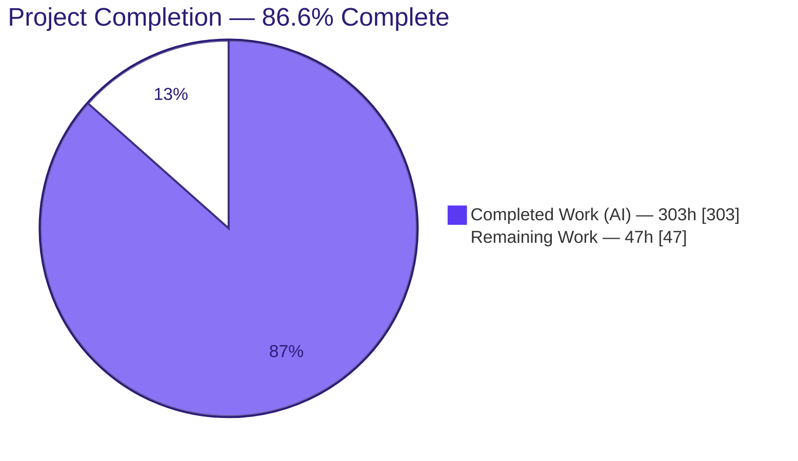
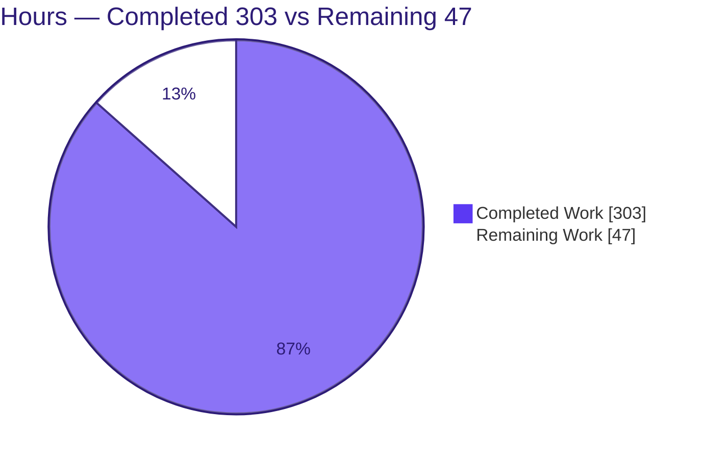
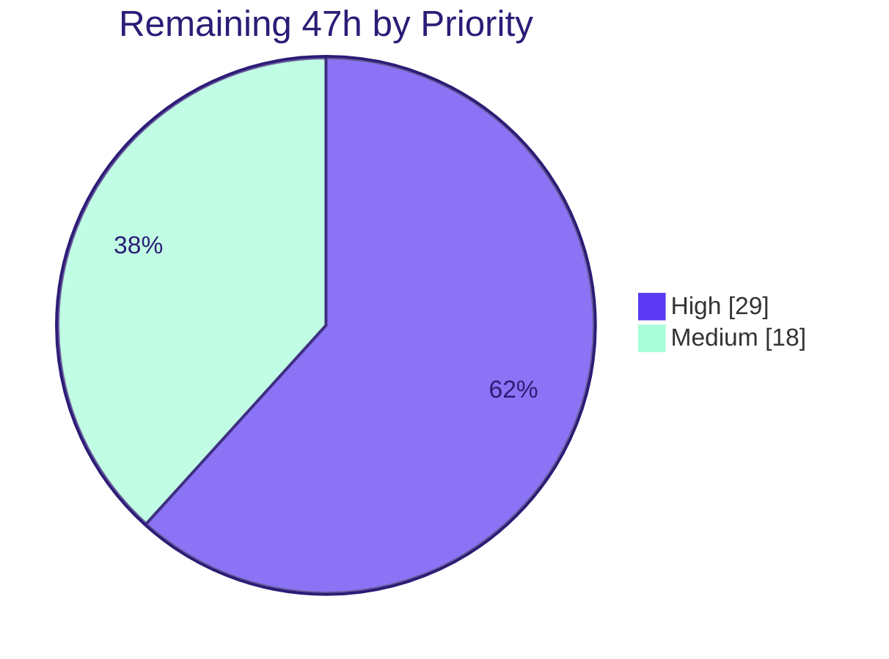

# Blitzy Project Guide — CardDemo REST/JSON API Layer

> **Project:** AWS CardDemo (`blitzy-public-samples/aws-carddemo-blitzy`) — net-new, read-only REST/JSON API layer over base CICS Web Support
> **Branch:** `blitzy-5eb92b6b-1331-47aa-a6ca-883122813a02` · **HEAD:** `e55c4960` · **Base:** `93ebec71` (Initial Commit)
> **Brand key:** <span style="color:#5B39F3">■</span> Completed / AI Work = Dark Blue `#5B39F3` · □ Remaining = White `#FFFFFF` · Headings = Violet-Black `#B23AF2` · Highlight = Mint `#A8FDD9`

---

## 1. Executive Summary

### 1.1 Project Overview

This project delivers a net-new, **read-only REST/JSON API layer** for the AWS CardDemo z/OS mainframe application (COBOL/CICS/VSAM), exposing seven core inquiry functions under the versioned base path `/carddemo/api/v1` using **base CICS Web Support only** (no licensed middleware). It gives distributed, off-mainframe consumers a documented, versioned programmatic contract for data previously reachable only through 3270 green screens, advancing the repository's roadmap goal of exposing transactions for distributed integration. The work is strictly **additive** and **read-only**: zero edits to existing executable COBOL/BMS/CSD/JCL, all VSAM access via `READ`/`STARTBR`, with PAN masked, CVV excluded, and customer PII minimized.

### 1.2 Completion Status

The project is **86.6% complete** on an AAP-scoped, hours-based basis. All authoring deliverables (COBOL programs, copybooks, CICS resources, JCL, OpenAPI contract, tests, and documentation) are complete, committed, and statically validated green. The remaining 47 hours are exclusively **mainframe path-to-production** activities (compile/link, CSD install, CICS Web Support enablement, and runtime integration testing) that physically require a licensed z/OS + CICS TS environment and cannot be executed on the Linux validation container.



| Metric | Value |
|---|---|
| **Total Hours** | **350** |
| Completed Hours (AI + Manual) | 303 (303 AI · 0 Manual) |
| Remaining Hours | 47 |
| **Percent Complete** | **86.6%** |

> Completion % = Completed ÷ (Completed + Remaining) = 303 ÷ 350 = **86.6%**. Scope is the Agent Action Plan (AAP) deliverables plus the standard path-to-production activities required to deploy them. Items the AAP explicitly declares out of scope (TLS, RACF, OAuth, pagination, write paths, new indexes, caching) are **excluded** from this denominator and tracked separately as a hardening backlog.

### 1.3 Key Accomplishments

- ✅ **All 7 API endpoints authored** with a front-door router (`COAPIRTR`, 2,913 LOC), an authentication/token service (`COAPISEC`), five read-only inquiry services, and a self-contained JSON serializer (`COJSONUC`).
- ✅ **OpenAPI 3.0.3 contract** (`app/api/openapi.yaml`, 965 lines) covering all seven exact AAP paths with a uniform `data`/`error` envelope and `bearerAuth` security scheme — validated by `openapi-spec-validator` and a **102/102** contract test.
- ✅ **Security controls verified in code:** CVV never serialized, PAN masked to last-4, SSN/government-id minimized, monetary signed-decimal scaling, and channel/container transport for oversized transaction lists.
- ✅ **Additive-only mandate upheld:** 57 files added, only `README.md` modified (additively); all 12 out-of-scope reference files (record layouts, reference programs, existing CSD/JCL) verified **byte-for-byte unchanged**.
- ✅ **CICS resources & build automation:** `CARDDEMOAPI.CSD` (group `CDEMOAPI`, isolated from the untouched `CARDDEMO` group) plus 5 JCL jobs (compile/link, CSD install, rollback, test build, test run); CSD-vs-JCL drift check passes (139 == 139).
- ✅ **Three user-specified deliverables complete:** decision log (54 decisions + forward traceability matrix), 846-line onboarding guide, and a 16-slide reveal.js executive deck (live-validated in Chrome: 3/3 Mermaid, 35/35 Lucide, zero console errors).
- ✅ **Comprehensive test suite:** 7 COBOL driver programs + Python/shell harness (contract test, response-security validator, boundary-fixture generator, CSD-drift checker) with 10 deterministic boundary fixtures (sha256-verified).

### 1.4 Critical Unresolved Issues

There are **no unresolved code defects** in scope. The items below are environmental gates — work that is fully authored but cannot be *executed* until it reaches a mainframe. They are "critical" only in the sense that production cannot proceed without a human performing them on z/OS.

| Issue | Impact | Owner | ETA |
|---|---|---|---|
| API programs not yet compiled by the target IBM Enterprise COBOL 6.3 + CICS translator | Load modules do not yet exist in the region; runtime behavior unverified on target | Mainframe Developer | 0.5 day |
| `CARDDEMOAPI` CSD group not yet installed (DFHCSDUP/CEDA) | CICS resources (listener, URIMAP, alias, programs) not yet defined | Mainframe Developer / Sysprog | 0.5 day |
| CICS Web Support / TCP-IP not yet enabled (SIT `TCPIP=YES`, listener port) | No HTTP endpoint is reachable until enabled | Systems Programmer | 0.5 day |
| COBOL unit-test drivers not yet compiled/executed on the region | Volume, token-lifecycle, and channel cases not yet runtime-proven | Mainframe Developer | 1 day |
| No live end-to-end HTTP smoke test performed | First production traffic is unproven against the real region | Mainframe Developer / QA | 1.5 days |

### 1.5 Access Issues

| System/Resource | Type of Access | Issue Description | Resolution Status | Owner |
|---|---|---|---|---|
| z/OS LPAR + CICS TS 5.6 region | Build & runtime environment | Not available in the Linux validation container; required for compile, CSD install, CWS enablement, and runtime tests | **Open** — environmental (by design) | Systems Programmer |
| IBM Enterprise COBOL 6.3 + CICS translator/binder | Licensed compiler toolchain | Not installable/licensable on Linux and no internet access in the sandbox | **Open** — environmental (by design) | Mainframe Developer |
| VSAM datasets (`ACCTDAT`, `CARDDAT`, `CCXREF`, `CUSTDAT`, `TRANSACT`, `USRSEC`) + AIX | Read-only data access | Live datasets reside on the mainframe; only ASCII fixtures are present in-repo | **Open** — environmental (by design) | Mainframe Developer |
| Listener TCP port (placeholder `3001`) | Network/port allocation | Port is an install-time placeholder that a systems programmer must confirm is free and approved | **Open** — awaiting site assignment | Systems Programmer |

> All access issues are **environmental and expected** for a mainframe deliverable validated on a Linux container. None indicates a repository-permission or credential defect in the delivered work.

### 1.6 Recommended Next Steps

1. **[High]** Compile & link the 8 API programs on z/OS — submit `app/jcl/APIBUILD.jcl`, resolve any translator/copybook/LE diagnostics, and `NEWCOPY` the load modules.
2. **[High]** Install CICS resources — submit `app/jcl/APICSDIN.jcl` (DFHCSDUP) and `CEDA INSTALL GROUP(CDEMOAPI)`; then coordinate CICS Web Support / TCP-IP enablement (`TCPIP=YES`, open `TCPIPSERVICE(CDAPISVC)`).
3. **[High]** Compile & run the COBOL unit-test drivers — `APITSTB.jcl` → load boundary fixtures → `APITSTR.jcl`; triage any assertion failures.
4. **[Medium]** Execute the live HTTP integration & smoke suite — point `run-api-tests.sh` at the region and verify all seven endpoints, error paths, masking, and the channel/container transaction list end-to-end.
5. **[Medium]** Finalize deployment configuration & sign-off — apply site substitutions (port/HLQ/dataset names), rehearse rollback (`APICSDRB.jcl`), and complete the change-management runbook and stakeholder review.

---

## 2. Project Hours Breakdown

### 2.1 Completed Work Detail

All completed work is autonomous AI engineering. Each component traces to an AAP requirement or user-specified rule.

| Component | Hours | Description |
|---|---:|---|
| HTTP/JSON Router — `COAPIRTR` | 40 | Front door: `WEB RECEIVE`/`SEND`, method/route parse, token gate, `LINK` dispatch, JSON (de)serialize orchestration, uniform error envelope, HTTP status map, security headers (2,913 LOC; 25/25 balanced `EXEC CICS`). |
| Authentication & Token Service — `COAPISEC` | 20 | `USRSEC` credential read (mirrors `COSGN00C`), short-lived opaque bearer token mint/validate via `MAIN` TSQ registry, 15-min TTL, fail-closed collision handling (803 LOC). |
| Inquiry Services — `COACSVCC`, `COCUSVCC`, `COCRSVCC`, `COXRSVCC` | 36 | Four read-only VSAM single-record services (account, customer, card, cross-reference); PAN masking, CVV exclusion, SSN/govt-id minimization (866 LOC combined). |
| Transaction Service — `COTRSVCC` | 20 | Single-transaction read + per-account list via xref→card→`TRAN-CARD-NUM` filter; `STARTBR`/`READNEXT`/`ENDBR`; channel/container transport for oversized lists (790 LOC). |
| JSON Serializer Subprogram — `COJSONUC` | 16 | Self-contained COBOL serializer: signed implied-decimal→JSON scaling, string escaping (624 LOC; `cobc -fsyntax-only` clean). |
| API Contracts & Copybooks — `COAPICOM` + 7 | 10 | Commarea/channel contract, token layout, uniform error envelope, and per-service request/response layouts (8 copybooks). |
| OpenAPI 3.0 Specification | 14 | Authoritative contract for 7 endpoints, schemas, error envelope, `bearerAuth` (965 LOC); spec-valid + 102/102 contract test. |
| CICS Resource Definitions — `CARDDEMOAPI.CSD` | 8 | `TCPIPSERVICE`, `URIMAP`, alias transaction, 14 `PROGRAM` defs, read-only file `ADD`s; drift-checked (139 == 139). |
| Build & Install JCL (5 jobs) | 12 | `APIBUILD` (compile/link via BUILDONL, HLQ=AWS.M2), `APICSDIN` (DFHCSDUP install), `APICSDRB` (rollback), `APITSTB`/`APITSTR` (test build/run). |
| COBOL Test Drivers (7) | 24 | Per-service assertion drivers + runner: `TSTAUTH`, `TSTACCT`, `TSTCUST`, `TSTCARD`, `TSTXREF`, `TSTTRAN`, `TSTRUNR` (2,461 LOC). |
| Python/Shell Test Harness & Fixtures | 32 | OpenAPI contract test (1,185 LOC), `run-api-tests.sh` (1,021 LOC), response-security validator, boundary-fixture generator, CSD-drift checker, 10 sha256-verified fixtures. |
| Decision Log (Explainability rule) | 10 | 54 decisions with 4-column rationale/risk tables + forward traceability matrix (`docs/decision-log.md`). |
| Onboarding Guide (Continued-Dev rule) | 12 | 846-line setup/domain/pitfalls/extend guide (`docs/onboarding-api.md`). |
| Executive Presentation (reveal.js rule) | 16 | 16-slide branded deck, Mermaid + Lucide, live-validated in Chrome (`docs/executive-summary.html`). |
| README Integration | 3 | +126 additive lines: endpoint table, install, Flow-1/2 usage, error contract, security notes. |
| QA, Hardening & Re-Validation | 30 | 39 code-review + 12 QA findings resolved across 23 commits; static/security/contract re-validation. |
| **Total Completed** | **303** | |

### 2.2 Remaining Work Detail

Every remaining item is a mainframe path-to-production activity that requires a live z/OS + CICS environment.

| Category | Hours | Priority |
|---|---:|---|
| Mainframe compile & link — 8 programs (`APIBUILD`); resolve translator/copybook-SYSLIB/LE diagnostics; verify bind; `NEWCOPY` | 10 | High |
| CSD DEFINE/INSTALL — `CARDDEMOAPI` group (`APICSDIN` DFHCSDUP + `CEDA INSTALL`) + resource verification | 4 | High |
| CICS Web Support / TCP-IP enablement — SIT `TCPIP=YES`, open `TCPIPSERVICE(CDAPISVC)`, bind `URIMAP`/alias, confirm port | 5 | High |
| COBOL driver compile + unit-test execution — `APITSTB`/`APITSTR`, clone VSAM + AIX, `TSTRUNR`, triage | 10 | High |
| Live HTTP runtime integration & smoke testing — all 7 endpoints end-to-end, error paths, masking, channel/container list | 12 | Medium |
| Deployment config & production sign-off — site substitutions (port/HLQ/dataset), rollback rehearsal, runbook, review | 6 | Medium |
| **Total Remaining** | **47** | |

### 2.3 Basis of Estimate

Hours are estimated using the PA2 framework with lines-of-code and CICS/COBOL complexity as proxies, expressed as **human-engineering-equivalent** effort (not agent wall-clock). Development ≈ 176h, testing ≈ 56h (32% of dev — consistent with the 30–40% guideline), documentation ≈ 41h, and QA/hardening ≈ 30h. **Confidence:** High for completed authoring (statically validated) and for the enumerated deployment tasks; Medium on runtime-integration hours, which carry the inherent uncertainty of code that has not yet executed on the target platform. `2.1 (303) + 2.2 (47) = 350` = Total Hours in Section 1.2.

---

## 3. Test Results

All results below originate from Blitzy's autonomous validation logs and were independently re-run first-hand during this assessment on the Linux validation container. Because this is a mainframe application, tests split into a **Linux-runnable plane** (executed and green) and a **mainframe-only plane** (authored, ready, deferred to the target environment).

| Test Category | Framework | Total Tests | Passed | Failed | Coverage % | Notes |
|---|---|---:|---:|---:|---:|---|
| API Contract (schema/example) | Custom Python (`jsonschema` Draft-07) | 102 | 102 | 0 | 100% (7/7 endpoints + error envelope) | `RELEASE_MODE=1` strict gate; includes negative/rejection cases |
| OpenAPI Spec Validation | `openapi-spec-validator` + `yamllint` | 2 | 2 | 0 | n/a | Spec is valid OpenAPI 3.0.3; lint clean |
| Response Security Gate | Custom Python (`validate-response.py`) | 2 | 2 | 0 | n/a | Valid masked-PAN body accepted; raw-PAN body correctly **rejected** (`^\*{12}\d{4}$`) |
| Boundary Fixtures Integrity | Custom Python + sha256 | 10 | 10 | 0 | n/a | 50/51-card & 500/501-record boundaries; byte-identical regeneration (deterministic) |
| CSD Drift | Shell (`check-csd-drift.sh`) | 1 | 1 | 0 | n/a | `CARDDEMOAPI.CSD` == `APICSDIN.jcl` inline DFHCSDUP (139 == 139) |
| Static — Python compile | `py_compile` | 3 | 3 | 0 | n/a | All 3 Python tools compile |
| Static — Shell syntax | `bash -n` | 3 | 3 | 0 | n/a | All 3 shell scripts parse |
| Static — COBOL syntax | GnuCOBOL 3.2 `-fsyntax-only` | 1 | 1 | 0 | n/a | `COJSONUC` (pure COBOL subprogram) exit 0 |
| Static — COBOL structure | Custom analysis | 8 | 8 | 0 | n/a | 4 DIVISIONs each; `EXEC CICS`/`END-EXEC` balanced; PROGRAM-IDs match; zero stubs/TODO |
| Executive Deck (runtime) | Chrome DevTools (live) | 1 | 1 | 0 | n/a | 16 sections; 3/3 Mermaid + 35/35 Lucide rendered; zero console errors |
| **CICS COBOL unit-test drivers** | z/OS CICS region | 7 | — | — | Authored | **Deferred (mainframe-only):** 7 drivers ready; execute via `APITSTB`/`APITSTR` on the region |
| **Live HTTP end-to-end** | `run-api-tests.sh` (curl) | — | — | — | Authored | **Deferred (mainframe-only):** harness ready; run against the live region |

**Linux-runnable totals: 133 checks executed, 133 passed, 0 failed.** The two deferred rows are fully authored and gated behind the mainframe environment (see Sections 2.2 and 9).

---

## 4. Runtime Validation & UI Verification

**Runtime health (Linux plane):**
- ✅ **Operational** — OpenAPI contract test harness (102/102) and all static/security gates run green in the shipped `.venv`.
- ✅ **Operational** — Executive presentation renders fully in Chrome (reveal.js ready, 16 slides, all diagrams/icons, zero console errors).

**API runtime (mainframe plane):**
- ⚠ **Partial (authored, not yet executed)** — The 7 CICS COBOL programs and the HTTP request/response path are fully implemented and statically validated, but no live request has traversed router → service → VSAM → JSON on a real region. Runtime verification is the primary remaining task (Sections 2.2, 6).
- ⚠ **Partial** — Channel/container transaction-list transport and signed-decimal scaling are contract-tested against example bodies but not yet proven on live packed VSAM data.

**UI verification:**
- ✅ **Operational** — The only runnable UI artifact is `docs/executive-summary.html`. It was verified live: 16 `<section>` slides, hero-gradient title, architecture Mermaid diagram, every slide carrying a non-text visual, zero emoji, CDN pins reveal.js 5.1.0 / Mermaid 11.4.0 / Lucide 0.460.0. Screenshots and screen recordings are archived under `blitzy/screenshots` and `blitzy/screen_recordings`.
- ➖ **Not applicable** — The API itself has no end-user UI; the 3270/BMS terminal layer is explicitly out of scope and untouched. The developer-facing surface is the OpenAPI contract.

---

## 5. Compliance & Quality Review

AAP mandates cross-mapped to delivered evidence and validation status.

| AAP Mandate / Benchmark | Requirement | Status | Evidence |
|---|---|---|---|
| Additive-only, backward compatible | Zero edits to existing executable source | ✅ Pass | 57 files added, only `README.md` modified; 12 reference files byte-unchanged |
| Read-only data access | `READ`/`STARTBR`/`READNEXT`/`ENDBR` only; no write verbs | ✅ Pass | Static scan: no `WRITE`/`REWRITE`/`DELETE` in service programs |
| CVV never serialized | `CARD-CVV-CD` excluded everywhere | ✅ Pass | `COAPCRDY.cpy` omits CVV; comment documents exclusion |
| PAN masked to last-4 | `CARD-NUM`/`TRAN-CARD-NUM` masked | ✅ Pass | `COCRSVCC` masking; `CARD-NUM-MASKED`; raw-PAN response rejected by security gate |
| Customer PII minimized | SSN + govt-id masked; EFT omitted | ✅ Pass | `COAPCUSY.cpy` `CUST-SSN-MASKED`/`CUST-GOVT-ID-MASKED` last-4 |
| 7 endpoints, exact paths | All AAP paths under `/carddemo/api/v1` | ✅ Pass | `openapi.yaml` 7/7 paths; router dispatch |
| Uniform error contract | Single `data`/`error` envelope + fixed HTTP status map | ✅ Pass | Contract test covers 200/400/401/404/500 + error envelope enum |
| Base CICS Web Support only | `TCPIPSERVICE`→`URIMAP`→alias→router, in-region | ✅ Pass | `CARDDEMOAPI.CSD`; no external gateway |
| Large-payload transport | Channel/container for transaction list | ✅ Pass | `COTRSVCC` channel `CDEMOAPILISTCH` |
| 8-character member naming | Mainframe naming honored | ✅ Pass | All new members ≤ 8 chars |
| Explainability rule | Decision log with rationale/risk | ✅ Pass | `docs/decision-log.md` — 54 decisions + traceability matrix |
| Onboarding rule | Clean-env-to-running guide | ✅ Pass | `docs/onboarding-api.md` (846 lines) + README subsection |
| Executive Presentation rule | 12–18 slides, Blitzy brand, verified | ✅ Pass | `docs/executive-summary.html` — 16 slides, live-validated |
| Target-platform compilation | Compiled by IBM Enterprise COBOL + CICS translator | ⚠ Deferred | Statically validated; mainframe compile is Section 2.2 High task |
| Runtime execution proof | Live end-to-end request verified | ⚠ Deferred | Harness ready; requires live CICS region |

**Fixes applied during autonomous validation:** 39 code-review findings and 12 QA findings resolved across 23 commits (uniform error contract, xref-swap test, driver coverage, transaction-service hardening F50–F60, anti-MIME-sniffing header, monetary-as-quoted-string serialization, deck responsive-table & contrast fixes, decision-log/onboarding accuracy corrections). **Outstanding in-scope items:** none — all remaining items are the deferred mainframe path-to-production activities above.

---

## 6. Risk Assessment

| Risk | Category | Severity | Probability | Mitigation | Status |
|---|---|---|---|---|---|
| Code never compiled by target IBM Enterprise COBOL 6.3 + CICS translator (copybook SYSLIB, translator opts, LE unverified) | Technical | Medium | Medium | `APIBUILD` models the proven `CICCMP`; `NODYNAM`+`NOLET` binder guard fails unresolved `COJSONUC` (RC≥8); build documented in onboarding | Open (mainframe step) |
| Zero runtime execution — no live request has traversed router→service→VSAM→JSON | Technical | High | Medium | 102/102 contract test; COBOL drivers + boundary fixtures ready; live smoke suite prepared | Open |
| Transaction list fixed cap of 50 (ODO table) → truncated partial list for large accounts | Technical | Low-Med | Medium | Deterministic `truncated='Y'` + HTTP 200; documented in OpenAPI; pagination is a follow-up | Mitigated by design |
| Binder `RC=4` (benign duplicate `DFHEILID`) relies on `COND=(4,LT)` never yet executed | Technical | Low | Low | Documented in decision log; `NOLET` turns genuine unresolved into RC≥8 | Open (verify at build) |
| Cleartext HTTP listener — `SSL(NO)`/`AUTHENTICATE(NO)` | Security | High (if exposed) | Low | `IPADDRESS(127.0.0.1)` loopback-only bind; TLS/keyring is a documented follow-up | Accepted for increment |
| Full 16-digit PAN in request URL path (`/cards`, `/xref`) — could reach proxy/access logs if exposed | Security | Med-High | Low | Loopback bind + `CONFDATA(YES)`/`DUMP(NO)`/`TRACE(NO)`/`CEDF(NO)` + no-PAN logging; response bodies mask PAN; PAN-redacting proxy is a follow-up | Accepted with mitigation |
| Region-local `MAIN`-TSQ token (vanishes on restart; not sysplex-wide; opaque, not signed) | Security | Low-Med | Medium | 15-min TTL, fail-closed collision, `EXPIRYINT(20 min)` reaping; signed/federated tokens are follow-ups | Accepted for increment |
| No RACF resource/command security (`RESSEC(NO)`/`CMDSEC(NO)`) | Security | Medium | Low | App-level enforcement: strictly read-only verbs (verified) + token gate; RACF is a documented follow-up | Accepted for increment |
| CICS Web Support / TCP-IP enablement requires sysprog; port 3001 is a placeholder | Operational | Medium | Medium | Onboarding documents SIT/port steps; operator confirms a free/approved port | Open |
| No live smoke test / health check yet — first production traffic unproven | Operational | Medium | Medium | `run-api-tests.sh` + curl flows ready to execute immediately post-deploy | Open |
| Minimal observability — `requestId`-only console logging; no metrics/alerting | Operational | Low-Med | Medium | `requestId` correlation on every response; monitoring integration is a follow-up | Open (follow-up) |
| VSAM read-path availability — env name/AIX drift could fail file opens | Integration | Medium | Low | CSD `ADD` references existing definitions; drift-checked (139 == 139) | Open (verify at install) |
| Channel/container (`CDEMOAPILISTCH`) large-payload path never exercised at runtime | Integration | Medium | Low-Med | Boundary fixtures (50/51 records) + driver coverage; verify at runtime | Open |
| Transaction filtering strategy (app-level filter over timestamp-keyed AIX; no by-account index) — performance on large `TRANSACT` unproven | Integration | Medium | Medium | Documented design decision; `WS-MAX-SCAN` ceiling yields deterministic 500; new AIX is out of scope | Accepted with mitigation |
| Signed implied-decimal→JSON scaling unproven on live packed data | Integration | Low-Med | Low | `COJSONUC` `cobc`-clean; contract test + drivers cover scaling | Open (verify at runtime) |

**Overall risk posture:** Low-to-Moderate. The dominant residual risk is simply that the code has not yet executed on the target platform — an inherent property of validating a mainframe deliverable off-platform, not a code-quality signal. Every security trade-off is deliberate, loopback-isolated, and explicitly logged with a production follow-up path.

---

## 7. Visual Project Status

**Project hours breakdown** (Completed = Dark Blue `#5B39F3`; Remaining = White `#FFFFFF`):



**Remaining hours by priority** (High = 29h across 4 tasks; Medium = 18h across 2 tasks):



**Remaining hours by category** (sums to 47h — matches Sections 1.2 and 2.2):

| Category | Hours | Priority |
|---|---:|---|
| Mainframe compile & link | 10 | High |
| COBOL driver compile + unit-test | 10 | High |
| CICS Web Support / TCP-IP enablement | 5 | High |
| CSD DEFINE/INSTALL | 4 | High |
| Live HTTP integration & smoke testing | 12 | Medium |
| Deployment config & sign-off | 6 | Medium |
| **Total** | **47** | |

---

## 8. Summary & Recommendations

**Achievements.** The CardDemo REST/JSON API layer is **86.6% complete** and, within the AAP's additive/read-only boundary, functionally complete at the source level. Sixteen thousand lines across 57 new files deliver seven endpoints, a hardened router, an authoritative OpenAPI contract, a comprehensive test suite, and all three user-specified deliverables — with every security control (CVV exclusion, PAN masking, PII minimization) verified in code and every out-of-scope reference file provably untouched.

**Remaining gaps.** The outstanding 47 hours are entirely **mainframe path-to-production**: compile/link, CSD install, CICS Web Support enablement, driver unit-test execution, live HTTP integration testing, and deployment sign-off. These cannot be performed on the Linux validation container and are the natural handoff to a mainframe engineer.

**Critical path to production.** (1) Compile & link on z/OS → (2) install the CSD group and enable CICS Web Support / TCP-IP → (3) run the COBOL drivers → (4) run the live HTTP smoke suite → (5) configure the site, rehearse rollback, and obtain sign-off. Realistic elapsed time for one mainframe developer with sysprog support: **≈ 1 week** (47 focused hours).

**Success metrics for go-live.** Clean compile (RC ≤ 4) and successful bind for all 8 programs; `CEDA INSTALL GROUP(CDEMOAPI)` with all resources `INSTALLED`; all 7 COBOL drivers pass; `run-api-tests.sh` green against the region (correct 200/400/401/404/500, PAN masked, CVV/SSN absent, empty-list 200, oversized list via channel/container with the `truncated` flag honored).

**Production-readiness assessment.** **Code-complete and release-candidate quality; not yet production-deployed.** The delivered work is mature (24 commits, multiple QA/code-review rounds) with zero known in-scope defects. Recommended posture: proceed to mainframe build and staged runtime validation. Before *external* exposure, schedule the documented hardening backlog — TLS/keyring, RACF resource/command security, OAuth/OIDC or a PAN-redacting fronting gateway, true pagination, and observability — none of which is part of this AAP's scope but all of which are prerequisites for internet-facing production use.

---

## 9. Development Guide

CardDemo's API layer spans two planes. **Plane A (Linux workstation/CI)** is where you author code and run static/contract validation — fully reproducible in this repository. **Plane B (z/OS + CICS TS 5.6)** is where you build, install, and run the API — the human path-to-production.

### 9.1 System Prerequisites

**Plane A — Linux/CI (verified on this host):**
- Python 3.13, `pip` 25.3
- GnuCOBOL 3.2 (`cobc`) — optional, for pure-COBOL syntax checks only
- Google Chrome — to view/validate the executive deck
- Git 2.51+

**Plane B — Mainframe (documented; not on the Linux host):**
- IBM Enterprise COBOL 6.3 + CICS TS 5.6 translator and binder
- z/OS with JES, IDCAMS, SDSF; authority to run `DFHCSDUP`, `CEDA`, `CEMT`
- VSAM datasets (`ACCTDAT`, `CARDDAT`, `CCXREF`, `CUSTDAT`, `TRANSACT`, `USRSEC`) + AIX available read-only
- CICS region with `TCPIP=YES` and an approved listener port

### 9.2 Environment Setup & Dependency Installation (Plane A)

The repository **ships a pre-provisioned, working `.venv`** (recommended, verified):

```bash
cd /path/to/aws-carddemo-blitzy
source .venv/bin/activate
python -c "import yaml, jsonschema, referencing, attrs, rpds; print('deps OK')"
```

On a fresh machine **with internet access**, recreate it from pinned requirements:

```bash
python3 -m venv .venv
source .venv/bin/activate
pip install -r app/test/api/requirements-test.txt   # PyYAML 6.0.3, jsonschema 4.26.0, referencing 0.37.0, ...
```

> **Troubleshooting (offline):** `python3 -m venv` fails on `ensurepip` without network access. In an offline environment, use the shipped `.venv` instead of recreating it.

### 9.3 Verification Sequence (Plane A — all steps green)

Run from the repository root with the venv activated:

```bash
# 1. OpenAPI structural validation
python -c "from openapi_spec_validator import validate_spec; import yaml; \
validate_spec(yaml.safe_load(open('app/api/openapi.yaml'))); print('openapi VALID')"

# 2. OpenAPI contract test — strict release gate  (expect: checks=102 passed=102 failed=0)
RELEASE_MODE=1 python app/test/api/openapi-contract-test.py | tail -1

# 3. CSD drift check  (expect: PASS, member=139 jcl=139)
bash app/test/api/check-csd-drift.sh | grep -E "PASS|compared"

# 4. Boundary fixtures integrity  (expect: 10 lines of "sha256 match")
bash app/test/api/prepare-boundary-fixtures.sh --verify | grep -c "sha256 match"

# 5. Response security gate — raw PAN must be rejected
python app/test/api/validate-response.py --spec app/api/openapi.yaml \
  --path '/cards/{cardNum}' --method get --status 200 \
  --body <captured-response-file> --release

# 6. Static checks
python -m py_compile app/test/api/*.py         # Python tools
bash -n app/test/api/run-api-tests.sh           # shell syntax
cobc -fsyntax-only app/cbl/COJSONUC.cbl         # pure COBOL subprogram (exit 0)
```

> **COBOL note:** the API sources are **fixed-format**. Use `cobc -fsyntax-only <file>` (do **not** add `-free`, which misreads column-7 comments). Only `COJSONUC` is pure COBOL; the seven CICS programs require the mainframe translator and will not compile under GnuCOBOL — this is expected (the shipped reference program `COSGN00C.cbl` fails identically).

To view the executive deck:

```bash
google-chrome --no-sandbox docs/executive-summary.html   # 16 slides; Mermaid + Lucide render; zero console errors
```

### 9.4 Mainframe Build & Deploy Sequence (Plane B — ordered)

```text
1) Compile & link      : submit app/jcl/APIBUILD.jcl
                         (COJSONUC built first into LOADLIB; COAPIRTR built last, autocalls COJSONUC;
                          NEWCOPY COND=(4,LT) admits benign RC=4, NOLET fails a genuine unresolved ref)
2) Install CSD group   : submit app/jcl/APICSDIN.jcl (DFHCSDUP) ; then  CEDA INSTALL GROUP(CDEMOAPI)
3) Enable CWS / TCP-IP  : confirm SIT TCPIP=YES ; open TCPIPSERVICE(CDAPISVC) on an approved port
                          (3001 is a placeholder) ; verify URIMAP(CDAPIURI) /carddemo/api/v1/* + alias CAPI
4) Unit tests           : submit app/jcl/APITSTB.jcl ; load app/test/api/load-boundary-fixtures.jcl ;
                          submit app/jcl/APITSTR.jcl (drives TSTAUTH/ACCT/CUST/CARD/XREF/TRAN via TSTRUNR)
5) Live smoke tests     : API_HOST=<host> API_PORT=<port> app/test/api/run-api-tests.sh
   Rollback (if needed)  : submit app/jcl/APICSDRB.jcl (removes the CDEMOAPI group)
```

### 9.5 Example Usage (matches AAP Flow-1 & Flow-2)

```bash
# Flow 1 — authenticated account inquiry
curl -s -X POST "http://<cics-host>:<port>/carddemo/api/v1/signon" \
     -H "Content-Type: application/json" \
     -d '{"userId":"USER0001","password":"<password>"}'
# → { "data": { "token": "<opaque-bearer-token>", "userId": "USER0001", "userType": "U", "expiresAt": "..." } }

curl -s "http://<cics-host>:<port>/carddemo/api/v1/accounts/<acctId>" \
     -H "Authorization: Bearer <opaque-bearer-token>"

# Flow 2 — card → transactions drill-down
curl -s "http://<cics-host>:<port>/carddemo/api/v1/xref/<cardNum>" \
     -H "Authorization: Bearer <opaque-bearer-token>"          # → account id + customer id
curl -s "http://<cics-host>:<port>/carddemo/api/v1/accounts/<acctId>/transactions" \
     -H "Authorization: Bearer <opaque-bearer-token>"          # → transaction list (data envelope)
```

### 9.6 Common Errors & Resolutions

- **`error: externally-managed-environment` on `pip install`** → activate the shipped `.venv` (`source .venv/bin/activate`) rather than installing into system Python.
- **`ensurepip` failure creating a venv** → offline environment; use the shipped `.venv`.
- **`cobc` syntax errors on comment lines** → you passed `-free`; remove it — the sources are fixed-format.
- **Contract test reports a missing dependency** → run without `RELEASE_MODE` for a graceful skip, or install `requirements-test.txt`; use `RELEASE_MODE=1` only for the strict gate.
- **Bind returns `RC=4`** → benign (duplicate `DFHEILID` from `COJSONUC` autocall); `COND=(4,LT)` admits it. Only `RC≥8` indicates a genuine unresolved reference.
- **`run-api-tests.sh` refuses to send** → it is SSRF-guarded; `API_HOST`/`API_PORT` must resolve to the intended region.
- **Port 3001 in use / not approved** → 3001 is an install-time placeholder; set the CSD `PORTNUMBER` and `API_PORT` to your site-assigned port.

---

## 10. Appendices

### Appendix A — Command Reference

| Command | Purpose |
|---|---|
| `source .venv/bin/activate` | Activate the shipped Python test environment |
| `RELEASE_MODE=1 python app/test/api/openapi-contract-test.py` | Strict OpenAPI contract test (102 checks) |
| `bash app/test/api/check-csd-drift.sh` | Verify CSD member == install JCL (139==139) |
| `bash app/test/api/prepare-boundary-fixtures.sh --verify` | Verify 10 boundary fixtures by sha256 |
| `python app/test/api/validate-response.py …` | Validate one response body; reject raw PAN |
| `cobc -fsyntax-only app/cbl/COJSONUC.cbl` | Syntax-check the pure-COBOL serializer |
| `submit app/jcl/APIBUILD.jcl` | (z/OS) Compile & link the 8 API programs |
| `submit app/jcl/APICSDIN.jcl` + `CEDA INSTALL GROUP(CDEMOAPI)` | (z/OS) Install CICS resources |
| `submit app/jcl/APITSTB.jcl` / `APITSTR.jcl` | (z/OS) Build & run COBOL unit-test drivers |
| `API_HOST=… API_PORT=… app/test/api/run-api-tests.sh` | (z/OS) Live HTTP smoke suite |
| `submit app/jcl/APICSDRB.jcl` | (z/OS) Roll back the CDEMOAPI CSD group |

### Appendix B — Port Reference

| Port | Resource | Notes |
|---|---|---|
| `3001` (placeholder) | `TCPIPSERVICE(CDAPISVC)` | `IPADDRESS(127.0.0.1)` loopback, `PROTOCOL(HTTP)`, `SSL(NO)`, `AUTHENTICATE(NO)`; operator must confirm/assign an approved port |

### Appendix C — Key File Locations

| Path | Contents |
|---|---|
| `app/cbl/COAPIRTR.cbl` | HTTP/JSON front-door router |
| `app/cbl/COAPISEC.cbl` | Authentication & bearer-token service |
| `app/cbl/CO{AC,CU,CR,XR,TR}SVCC.cbl` | Account/Customer/Card/Xref/Transaction inquiry services |
| `app/cbl/COJSONUC.cbl` | Self-contained JSON serializer subprogram |
| `app/cpy/COAPICOM.cpy`, `COAP*Y.cpy` | API contract, token, error envelope + per-service layouts |
| `app/api/openapi.yaml` | OpenAPI 3.0.3 contract (authoritative) |
| `app/csd/CARDDEMOAPI.CSD` | CICS resource group `CDEMOAPI` |
| `app/jcl/API{BUILD,CSDIN,CSDRB,TSTB,TSTR}.jcl` | Build, install, rollback, test-build, test-run |
| `app/test/api/` | COBOL drivers, Python/shell harness, fixtures |
| `docs/decision-log.md` | Explainability decision log + traceability matrix |
| `docs/onboarding-api.md` | Onboarding & continued-development guide |
| `docs/executive-summary.html` | reveal.js executive presentation |

### Appendix D — Technology Versions

| Component | Version |
|---|---|
| Python (validation plane) | 3.13 |
| PyYAML / jsonschema / referencing | 6.0.3 / 4.26.0 / 0.37.0 |
| GnuCOBOL (syntax-check only) | 3.2.0 |
| OpenAPI specification | 3.0.3 |
| Target compiler / TP monitor | IBM Enterprise COBOL 6.3 / CICS TS 5.6 |
| reveal.js / Mermaid / Lucide (deck CDN pins) | 5.1.0 / 11.4.0 / 0.460.0 |

### Appendix E — Environment Variable Reference

| Variable | Default | Purpose |
|---|---|---|
| `RELEASE_MODE` | `0` | `1` turns graceful test skips into hard failures (strict gate) |
| `API_SCHEME` | `http` | Scheme for the live smoke suite |
| `API_HOST` | `localhost` | CICS Web Support host for `run-api-tests.sh` |
| `API_PORT` | `3001` | Listener port (must match the CSD definition) |

### Appendix F — Developer Tools Guide

| Tool | Role |
|---|---|
| `openapi-contract-test.py` | Validates representative responses for all 7 endpoints + error envelope against the spec |
| `validate-response.py` | Validates a single captured response; enforces the masked-PAN pattern (rejects raw PAN) |
| `gen-boundary-fixtures.py` | Deterministically generates 50/51-card and 500/501-record boundary fixtures |
| `check-csd-drift.sh` | Ensures `CARDDEMOAPI.CSD` and the inline DFHCSDUP in `APICSDIN.jcl` stay identical |
| `run-api-tests.sh` | SSRF-guarded live HTTP smoke suite (curl) for a running region |

### Appendix G — Glossary

| Term | Meaning |
|---|---|
| CWS | CICS Web Support — in-region HTTP listener (`TCPIPSERVICE`/`URIMAP`/alias) |
| CSD | CICS System Definition — resource-definition dataset managed by `DFHCSDUP`/`CEDA` |
| VSAM | Virtual Storage Access Method — the KSDS files backing CardDemo data |
| AIX | Alternate Index — secondary VSAM access path |
| KSDS | Key-Sequenced Data Set |
| PAN | Primary Account Number (card number); masked to last-4 in all responses |
| TSQ | Temporary Storage Queue — `MAIN` TSQ backs the bearer-token registry |
| COMMAREA / Channel-Container | CICS inter-program data passing; channel/container used for oversized transaction lists |
| ODO | `OCCURS DEPENDING ON` — bounded table (transaction list capped at 50) |
| BMS | Basic Mapping Support — the 3270 terminal UI layer (out of scope, untouched) |

---

*Generated by the Blitzy Platform. Completion percentage (86.6%) reflects AAP-scoped deliverables plus standard path-to-production activities; explicitly out-of-scope hardening (TLS, RACF, OAuth, pagination, caching) is tracked as a separate backlog and excluded from the completion denominator.*