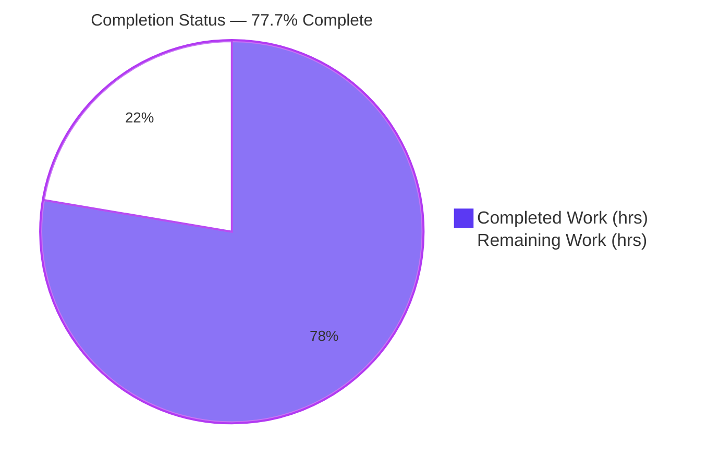
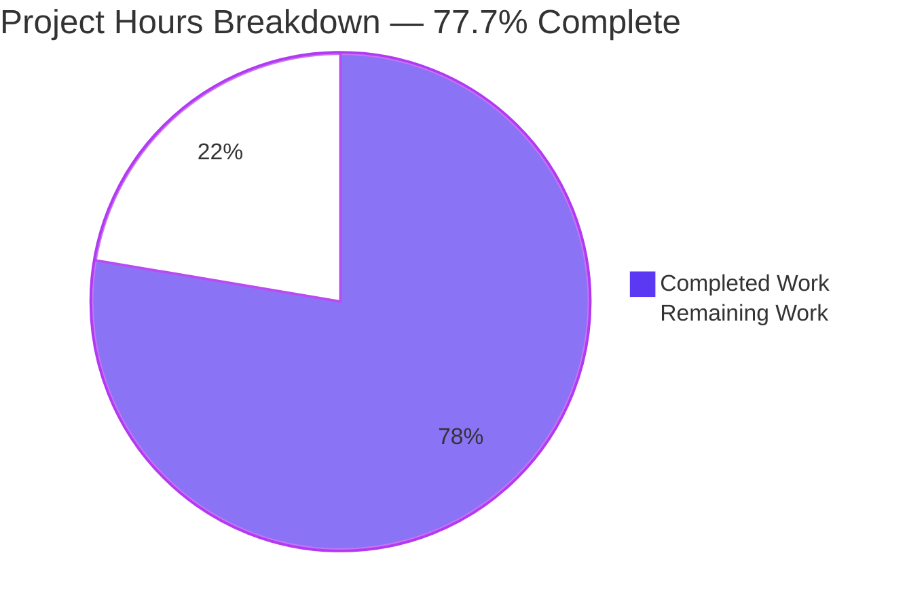
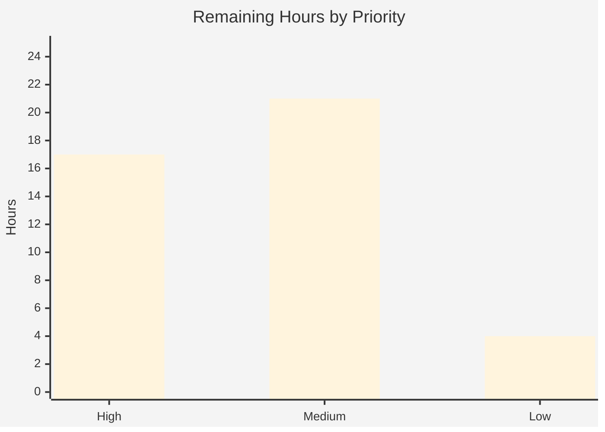

# Blitzy Project Guide — Account Management Service (Feature F-003)

> **Project:** CardDemo modernization — Account Management vertical slice
> **Migration:** COBOL / CICS / VSAM → Java 17 / Spring Boot 3.5.16 / Spring Data JPA / PostgreSQL
> **Module:** `account-service/`
> **Branch:** `blitzy-968ceb22-a2fe-4323-84ae-2d42315d4a1b` · **HEAD:** `ba013222`
> **Brand legend:** <span style="color:#5B39F3">■</span> Completed / AI Work = **Dark Blue `#5B39F3`** · <span style="color:#B23AF2">■</span> Remaining / Not Completed = **White `#FFFFFF`**

---

## 1. Executive Summary

### 1.1 Project Overview

This project migrates the Account Management vertical slice (Feature F-003) of the AWS CardDemo application — the *account inquiry* and *account update* capabilities — from a legacy COBOL/CICS/VSAM mainframe implementation to a standalone Java 17 / Spring Boot 3.5.16 REST service backed by PostgreSQL. It reproduces the exact business behavior of legacy programs `COACTVWC` (view, transaction `CAVW`) and `COACTUPC` (update, transaction `CAUP`), replacing 3270 screens with a JSON contract and the 300-byte VSAM `ACCTFILE` record with a relational `accounts` table. Target users are internal API consumers and downstream modernization teams. The slice establishes a repeatable, reference-quality pattern for subsequent CardDemo migration slices while leaving the legacy tree untouched.

### 1.2 Completion Status

The project is **77.7% complete** measured against AAP-scoped and path-to-production work. All AAP code deliverables are implemented, tested, and validated; the remaining 42 hours are entirely path-to-production activities and one stakeholder sign-off.



| Metric | Value |
|--------|-------|
| **Total Hours** | **188** |
| **Completed Hours (AI + Manual)** | **146** |
| **Remaining Hours** | **42** |
| **Percent Complete** | **77.7%** |

> Formula: 146 completed ÷ (146 completed + 42 remaining) = 146 ÷ 188 = **77.66% → 77.7%**

### 1.3 Key Accomplishments

- ✅ **Two REST endpoints delivered** — `GET /api/v1/accounts/{accountId}` and `PUT /api/v1/accounts/{accountId}` reproducing legacy `CAVW`/`CAUP` behavior.
- ✅ **Clean layered architecture** — Controller → Service → Repository → Entity with DTO boundary, mapper, and centralized exception handling.
- ✅ **Relational persistence** — 300-byte VSAM record migrated to `accounts` table; zero-padded `VARCHAR(11)` primary key preserves join-compatibility with COBOL card/cross-reference records.
- ✅ **Exact-precision monetary handling** — `BigDecimal` scale-2 / `NUMERIC(12,2)` throughout; zero `float`/`double` in the money path.
- ✅ **Full legacy-parity validation** — Y/N status, signed-decimal range ±9,999,999,999.99, strict `java.time` date rules with year 1900–2099 guard.
- ✅ **Optimistic concurrency** — JPA `@Version` maps stale-version detection to HTTP 409.
- ✅ **Flyway migrations** — V1 DDL + V2 seed decoding all 50 legacy records from zoned-decimal-with-overpunch encoding.
- ✅ **Security hardening** — parameterized JPA/JPQL, no sensitive data in logs, security response headers, CVE-remediating dependency overrides.
- ✅ **180/180 automated tests pass** — 159 unit + 21 Testcontainers integration; zero failures.
- ✅ **Legacy tree untouched** — 0 COBOL/copybook/BMS/JCL files modified (Minimal Change Clause honored).

### 1.4 Critical Unresolved Issues

> These are **production-launch gating** items — none are code defects or compilation blockers. The module compiles, tests, and runs cleanly today.

| Issue | Impact | Owner | ETA |
|-------|--------|-------|-----|
| Encryption-at-rest is a documented posture, not module-enforced | Sensitive financial data unprotected until managed DB provisioned | Platform / DBA | 6h (with R1) |
| No authentication/authorization layer (by-design POC) | API open; must be fronted before external exposure | Security / Platform | 5h (R3) |
| No provisioned production database or externalized secrets | Cannot deploy to production; creds currently defaulted | Platform / DevOps | 6h + 4h (R1, R2) |
| Stakeholder sign-off pending: `group_id` read-only tightening (§0.7.2) & Spring Boot 3.5.16 EOL forward path | Intentional behavioral deviation + framework past OSS EOL 2026-06-30 | Product / Architecture | 2h (R4) |

### 1.5 Access Issues

Autonomous validation encountered **no blocking access issues** — the repository, Maven Central (pre-warmed `~/.m2`), and the Docker daemon were all available, enabling full dependency resolution, compilation, unit tests, and Testcontainers integration tests. The items below are access provisions required for **production deployment**, not blockers encountered during validation.

| System/Resource | Type of Access | Issue Description | Resolution Status | Owner |
|-----------------|----------------|-------------------|-------------------|-------|
| Amazon RDS PostgreSQL | Database provisioning + network | No production database instance exists yet | Pending (R1) | Platform / DBA |
| AWS Secrets Manager / SSM | Read secrets at runtime | Datasource credentials not yet externalized | Pending (R2) | DevOps |
| AWS KMS | Key management for encryption-at-rest | Encryption relies on managed DB configuration | Pending (R1) | Security / Platform |
| Container registry (ECR/registry) | Push/pull image | No pipeline publishes the container image yet | Pending (R5, R6) | DevOps |
| API gateway / IdP (OAuth2/mTLS) | Configure authn/authz | No auth layer configured for the endpoints | Pending (R3) | Security |

### 1.6 Recommended Next Steps

1. **[High]** Provision managed PostgreSQL (Amazon RDS) with encryption-at-rest (AWS KMS), run Flyway V1+V2, and verify the 50 seeded rows and CHECK constraint. *(R1 — 6h)*
2. **[High]** Externalize datasource credentials to AWS Secrets Manager/SSM and wire `SPRING_DATASOURCE_*`. *(R2 — 4h)*
3. **[High]** Complete a production security review and front the API with authentication/authorization (API gateway / OAuth2 / mTLS) plus TLS ingress. *(R3 — 5h)*
4. **[High]** Obtain stakeholder sign-off on the `group_id` read-only tightening (§0.7.2) and the Spring Boot 3.5.16 EOL forward path. *(R4 — 2h)*
5. **[Medium]** Stand up a CI/CD pipeline (`mvn verify` with Docker-in-Docker), build/publish the image, and add deployment manifests + observability. *(R5–R7 — 21h)*

---

## 2. Project Hours Breakdown

### 2.1 Completed Work Detail

Every completed component traces to an AAP requirement. The Hours column totals to the Completed Hours in Section 1.2.

| Component | Hours | Description |
|-----------|-------|-------------|
| Build & container infrastructure | 8 | `pom.xml` (Spring Boot parent 3.5.16, Java 17, CVE-remediating overrides), multi-stage `Dockerfile`, `.dockerignore` |
| Bootstrap & configuration profiles | 6 | `AccountServiceApplication`, `application.yml` / `-docker.yml` / `-test.yml` (datasource, JPA `ddl-auto=validate`, Flyway, actuator, sanitized logging) |
| Domain entity & repository | 9 | `Account` `@Entity` (12 fields + `@Version`), `AccountRepository` (`JpaRepository<Account,String>`) |
| Database migrations | 10 | `V1__create_accounts_table.sql` (DDL + `CHECK ^[0-9]{11}$`), `V2__seed_accounts.sql` (50-row zoned-decimal-with-overpunch decode) |
| DTOs & mapper | 12 | `AccountResponse`, `AccountUpdateRequest` (omits `accountId`/`groupId`), `AccountMapper` (`+ZZZ,ZZZ,ZZZ.99` currency, ISO dates) |
| Validation layer | 14 | `AccountValidator` — Y/N status, signed-decimal range/scale, strict `java.time` dates + year 1900–2099 guard (native `CSUTLDTC` reimplementation) |
| Service layer | 8 | `AccountService` `@Transactional` read/validate/update, id path/body agreement, immutability enforcement |
| REST controller | 6 | `AccountController` — `GET`/`PUT`, status mapping 200/400/404/409 |
| Exception handling | 9 | `GlobalExceptionHandler` (`@RestControllerAdvice`), `ApiError`, `AccountNotFoundException`, `ValidationException` |
| Security & operational hardening | 12 | `SecurityHeadersFilter`, `RequestBodySizeLimitFilter`, `SchemaIntegrityValidator`, `ApiErrorController`, `OpenApiConfig` |
| Unit tests | 18 | 159 tests across `AccountValidatorTest`, `AccountControllerTest`, `AccountMapperTest`, `AccountServiceTest`, `SchemaIntegrityValidatorTest` |
| Integration tests | 16 | 21 Testcontainers tests (`AccountApiIntegrationTest`) incl. 50-row seed-parity oracle + concurrency (repo & HTTP) |
| Documentation | 4 | `README.md` (451 lines): build/run/API usage |
| QA / code-review hardening cycles | 14 | 50+ findings resolved across 4+ autonomous review rounds |
| **Total Completed** | **146** | |

### 2.2 Remaining Work Detail

Each remaining category traces to a path-to-production need or a stakeholder decision. The Hours column totals to the Remaining Hours in Section 1.2. These map 1:1 to human tasks HT-1…HT-8.

| Category | Hours | Priority |
|----------|-------|----------|
| Provision managed PostgreSQL (RDS) + encryption-at-rest (KMS) + run Flyway V1+V2 + verify 50 rows/CHECK (R1) | 6 | High |
| Externalize datasource credentials to AWS Secrets Manager/SSM; wire `SPRING_DATASOURCE_*` (R2) | 4 | High |
| Production security review; front API with authn/authz (API gateway/OAuth2/mTLS) + TLS ingress (R3) | 5 | High |
| Stakeholder sign-off: `group_id` read-only tightening (§0.7.2) & Spring Boot 3.5.16 EOL forward path (R4) | 2 | High |
| CI/CD pipeline (`mvn verify` with Docker-in-Docker for 21 ITs; build + publish image; deploy) (R5) | 10 | Medium |
| Publish container image to registry + deployment manifests (K8s/ECS, wire actuator probes) (R6) | 6 | Medium |
| Production observability (log aggregation, Micrometer→Prometheus/CloudWatch, dashboards + alerts) (R7) | 5 | Medium |
| Load / performance test confirming ≤2s response target under concurrency (R8) | 4 | Low |
| **Total Remaining** | **42** | |

**Priority distribution:** High = 17h · Medium = 21h · Low = 4h · **Total = 42h**

### 2.3 Reconciliation

| Bucket | Hours |
|--------|-------|
| Completed (Section 2.1) | 146 |
| Remaining (Section 2.2) | 42 |
| **Total Project Hours** | **188** |
| **Percent Complete** | 146 ÷ 188 = **77.7%** |

Cross-section integrity: Section 2.1 (146) + Section 2.2 (42) = 188 = Total Hours in Section 1.2. Remaining (42) is identical in Sections 1.2, 2.2, and the Section 7 pie chart.

---

## 3. Test Results

All results below originate from Blitzy's autonomous validation logs — Maven **Surefire** (unit) and **Failsafe** (integration, real PostgreSQL via Testcontainers) reports captured during the final validation run. Totals: **180 tests, 180 passed, 0 failed, 0 errors, 0 skipped.**

| Test Category | Framework | Total Tests | Passed | Failed | Coverage % | Notes |
|---------------|-----------|-------------|--------|--------|-----------|-------|
| Unit — Validation | JUnit 5 (Surefire) | 106 | 106 | 0 | Full rule matrix | `AccountValidatorTest`: Y/N status; money ±9,999,999,999.99 scale-2 boundaries/over-range/wrong-scale; month 01–12; day-valid-for-month; leap-year 29-Feb (2000/2024 accept, 2023/1900 reject); year 1900–2099; 11-digit id |
| Unit — Controller | JUnit 5 + MockMvc (`@WebMvcTest`) | 30 | 30 | 0 | Status + JSON shape | `AccountControllerTest`: 200/400/404/409/405 status codes and JSON body shape |
| Unit — Mapper | JUnit 5 (Surefire) | 9 | 9 | 0 | Formatting parity | `AccountMapperTest`: currency `+ZZZ,ZZZ,ZZZ.99` & ISO date parity |
| Unit — Service | JUnit 5 + Mockito | 8 | 8 | 0 | Branch coverage | `AccountServiceTest`: found / not-found / conflict / path-body mismatch |
| Unit — Schema | JUnit 5 (Surefire) | 6 | 6 | 0 | DDL drift | `SchemaIntegrityValidatorTest`: NUMERIC(12,2)/BIGINT/DDL drift checks |
| Integration — API | JUnit 5 + Testcontainers (Failsafe) | 21 | 21 | 0 | AAP §0.6.5 traceability | `AccountApiIntegrationTest`: GET 200 seed-parity/scale-2/ISO; GET 404; PUT 400 no-mutation; PUT stale-version 409; PUT 200 version-increment; control-char/oversized-body→400; DB CHECK non-numeric id; 50-row seed-parity oracle; concurrent repo & HTTP optimistic-lock; log hygiene; OpenAPI completeness; security headers; actuator readiness+liveness |
| **Total** | **JUnit 5 / Surefire + Failsafe** | **180** | **180** | **0** | — | 0 skipped, 0 blocked |

---

## 4. Runtime Validation & UI Verification

Exercised live against a fresh isolated PostgreSQL during autonomous validation (shared DB left intact). Status legend: ✅ Operational · ⚠ Partial · ❌ Failing.

**Application lifecycle**
- ✅ Boots in ~5s; clean shutdown; **0 ERROR/SEVERE log lines**
- ✅ Flyway applies V1 + V2 from an empty database
- ✅ Hibernate `ddl-auto=validate` passes — no schema drift

**API endpoints**
- ✅ `GET /api/v1/accounts/00000000001` → **200**: zero-padded id, `currentBalance` 194.00 (plain decimal), ISO dates, `addressZip` "A000000000" preserved, `version` 0
- ✅ `GET` unknown id → **404** with legacy-parity message (CICS Resp/Reas codes dropped)
- ✅ `PUT` invalid payload → **400** with field message, no mutation
- ✅ `PUT` stale `version` → **409** "Record updated by another user - please retry"
- ✅ `PUT` happy path → **200**, `version` → 1, change persisted (verified via re-GET)

**Operational endpoints**
- ✅ `GET /actuator/health` + `/health/readiness` + `/health/liveness` = **UP**
- ✅ OpenAPI 3.0.1 `/v3/api-docs` → **200** (GET + PUT documented)
- ✅ Swagger UI `/swagger-ui/index.html` → **200**

**Persistence layer**
- ✅ 50 seeded rows; zero-padded ids; `NUMERIC(12,2)` money; `DATE` columns; `address_zip` preserved
- ✅ `ck_accounts_account_id_numeric` CHECK constraint present and enforced

**UI Verification**
- ⚠ Not applicable — the 3270 BMS terminal layer is fully retired and no replacement graphical/web UI is in scope for this slice. The "interface" is the REST/JSON contract, documented interactively via Swagger UI (verified operational above).

---

## 5. Compliance & Quality Review

AAP deliverables cross-mapped to Blitzy quality/compliance benchmarks. Fixes applied during autonomous validation are noted; all listed items passed.

| # | AAP Deliverable / Benchmark | Status | Evidence / Notes |
|---|------------------------------|--------|------------------|
| 1 | GET endpoint reproduces `COACTVWC`/`CAVW` read-by-key | ✅ Pass | `AccountController#getAccount`; integration GET 200/404 |
| 2 | PUT endpoint reproduces `COACTUPC`/`CAUP` edit/validate/lock/rewrite | ✅ Pass | `AccountController#updateAccount`; integration PUT 200/400/409 |
| 3 | 300-byte VSAM record → relational `accounts` table | ✅ Pass | `Account` entity + V1 DDL; 12 fields + `@Version` |
| 4 | `ACCT-ADDR-ZIP` preserved (AAP-flagged omission) | ✅ Pass | `address_zip VARCHAR(10)`; runtime shows "A000000000" |
| 5 | `FILLER` dropped; `EXPIRAION` typo corrected | ✅ Pass | Entity has no filler; `expiration_date` column |
| 6 | Account id = zero-padded `VARCHAR(11)` PK | ✅ Pass | PK + `CHECK (account_id ~ '^[0-9]{11}$')` |
| 7 | Exact-precision money (`BigDecimal`/`NUMERIC(12,2)`, no float/double) | ✅ Pass | Float/double scan = **0 matches** in money path; plain-decimal serialization |
| 8 | Money range ±9,999,999,999.99, scale 2 | ✅ Pass | `AccountValidator` boundary + over-range + wrong-scale tests |
| 9 | Strict date validation + year 1900–2099 (native reimpl.) | ✅ Pass | `ResolverStyle.STRICT` + year guard; leap-year tests |
| 10 | Optimistic concurrency `@Version` → HTTP 409 | ✅ Pass | Concurrent repo & HTTP tests; exact conflict message |
| 11 | `accountId` & `groupId` read-only (§0.7.2 tightening) | ⚠ Pass (sign-off pending) | Both omitted from `AccountUpdateRequest`; awaiting stakeholder confirmation (R4) |
| 12 | Error semantics 404 / 409 / 400 | ✅ Pass | `GlobalExceptionHandler`; `ApiError` JSON (no Whitelabel) |
| 13 | Flyway owns schema; Hibernate `ddl-auto=validate` | ✅ Pass | V1+V2 applied; no drift; `SchemaIntegrityValidator` |
| 14 | Security: parameterized queries, no sensitive data in logs | ✅ Pass | JPA/JPQL bound params; 0 log leaks verified |
| 15 | Dependency CVEs remediated | ✅ Pass | Overrides: springdoc 2.8.17, tomcat 10.1.57, jackson-databind 2.21.5, postgresql 42.7.12, logback 1.5.38, commons-lang3 3.18.0, swagger-ui 5.32.8, commons-compress 1.27.1 |
| 16 | Legacy `app/` tree unchanged (Minimal Change Clause) | ✅ Pass | `git diff` = 0 legacy files changed |

---

## 6. Risk Assessment

Risks categorized per technical / security / operational / integration. Severity and probability are qualitative; "→Rn" links a risk to its remediating remaining task in Section 2.2.

| # | Risk | Category | Severity | Probability | Mitigation | Status |
|---|------|----------|----------|-------------|------------|--------|
| T1 | Spring Boot 3.5.16 past OSS EOL (2026-06-30) | Technical | Medium | High | Migrate to 4.1.x (Java-17 compatible) or obtain commercial support; requires sign-off | Open →R4 |
| T2 | Schema drift between Flyway DDL and entity | Technical | Low | Low | `ddl-auto=validate` + `SchemaIntegrityValidator` fail-fast at startup | Mitigated |
| T3 | ≤2s response target not load-tested | Technical | Low | Low | Add load/performance test under concurrency | Open →R8 |
| S1 | Encryption-at-rest is documented posture, not module-enforced | Security | High | Medium | Rely on RDS encryption-at-rest (AWS KMS) when DB is provisioned | Open →R1 |
| S2 | No authentication/authorization on endpoints | Security | High | Medium | Front with API gateway / OAuth2 / mTLS (by-design POC gap) | Open →R3 |
| S3 | Datasource credentials via env/defaults | Security | Medium | Medium | Externalize to AWS Secrets Manager/SSM | Open →R2 |
| S4 | SQL injection / dependency CVEs / log leakage | Security | Low | Low | SQLi eliminated by construction (bound params); CVEs remediated; log hygiene verified | Mitigated ✅ |
| O1 | No CI/CD pipeline | Operational | Medium | High | Build `mvn verify` (Docker-in-Docker) + deploy pipeline | Open →R5 |
| O2 | No production observability beyond actuator | Operational | Medium | Medium | Log aggregation + Micrometer→Prometheus/CloudWatch + alerts | Open →R7 |
| O3 | No provisioned production database | Operational | Medium | High | Provision managed PostgreSQL (RDS) | Open →R1 |
| I1 | Integration tests require a Docker daemon | Integration | Low | Medium | Provide Docker-in-Docker in CI | Open →R5 |
| I2 | Real Amazon RDS never exercised | Integration | Low | Low | Smoke-test against provisioned RDS | Open →R1 |
| I3 | `account_id` join-compat with COBOL card/xref not cross-module tested | Integration | Low | Low | `VARCHAR(11)` + CHECK preserves key; cross-module test deferred | Deferred |
| I4 | `group_id` read-only tightening needs sign-off | Integration | Low | Low | Stakeholder confirmation of intentional deviation | Open →R4 |

---

## 7. Visual Project Status

**Project hours breakdown** — Completed (`#5B39F3`) vs Remaining (`#FFFFFF`):



**Remaining hours by priority** (from Section 2.2):



| Priority | Hours | Share of Remaining |
|----------|-------|--------------------|
| High | 17 | 40.5% |
| Medium | 21 | 50.0% |
| Low | 4 | 9.5% |
| **Total** | **42** | **100%** |

> Integrity: "Remaining Work" = **42** here equals Remaining Hours in Section 1.2 and the sum of the Section 2.2 Hours column.

---

## 8. Summary & Recommendations

**Achievements.** The Account Management vertical slice (F-003) has been fully migrated from COBOL/CICS/VSAM to an idiomatic Java 17 / Spring Boot 3.5.16 REST service. Both endpoints reproduce legacy behavior exactly, all business rules (status domain, monetary precision and range, strict date validity, field immutability, optimistic concurrency) are enforced in a testable service layer, and the 300-byte VSAM record is faithfully represented as a relational entity — including the AAP-flagged `ACCT-ADDR-ZIP` field. The legacy tree remains byte-for-byte pristine.

**Quality posture.** The module is **77.7% complete** and production-ready at the code level: **180/180 automated tests pass** (159 unit + 21 Testcontainers integration), compilation is warning-free under `-Xlint:all`, live runtime is clean, and dependency CVEs are remediated via explicit overrides. Final validation required **zero source modifications** — the module was already complete and correct.

**Remaining gaps & critical path.** The remaining **42 hours** are entirely path-to-production, not code defects. The critical path to production is: (1) provision managed PostgreSQL with encryption-at-rest and externalize secrets; (2) front the API with authentication/authorization and TLS; (3) obtain stakeholder sign-off on the intentional `group_id` read-only tightening and the Spring Boot 3.5.16 EOL forward path; (4) stand up CI/CD, image publishing, deployment manifests, and production observability; (5) confirm the ≤2s performance target under load.

**Success metrics.** Behavioral parity verified against the 50-record seed oracle; error semantics (404/409/400) confirmed; concurrency conflict detection validated at both repository and HTTP layers; schema integrity guarded at startup.

**Production readiness assessment.** **Code-complete and validated; not yet production-deployed.** Recommend proceeding with the High-priority path-to-production tasks (R1–R4, 17h) as the immediate next sprint, followed by the Medium-priority deployment/observability tasks (R5–R7, 21h) and the Low-priority load test (R8, 4h).

| Dimension | Status |
|-----------|--------|
| AAP code deliverables | ✅ Complete (100%) |
| Automated tests | ✅ 180/180 pass |
| Runtime validation | ✅ Clean |
| Path-to-production | ⚠ 42h remaining |
| Overall (AAP-scoped) | **77.7% complete** |

---

## 9. Development Guide

### 9.1 System Prerequisites

| Requirement | Version | Notes |
|-------------|---------|-------|
| JDK | Java 17 (LTS) | Compile & runtime baseline (Spring Boot 3.x minimum). Validated with OpenJDK 17.0.19 |
| Apache Maven | 3.9.x | Validated with 3.9.9; `spring-boot-maven-plugin` version managed by parent |
| PostgreSQL | 16 or 17 | Aligned with Amazon RDS PostgreSQL target |
| Docker | Engine 20.10+ | **Required only for the 21 Testcontainers integration tests** |
| OS | Linux/macOS/WSL2 | Any JDK-17-capable platform |

### 9.2 Environment Setup

The service reads its datasource from environment variables (with local defaults). Three Spring profiles exist: `default` (local), `docker` (container — **requires** env vars, fail-fast, no defaults), and `test` (Testcontainers).

```bash
# Local development defaults (used if unset)
export SPRING_DATASOURCE_URL="jdbc:postgresql://localhost:5432/carddemo"
export SPRING_DATASOURCE_USERNAME="carddemo"
export SPRING_DATASOURCE_PASSWORD="carddemo"

# Optional: start a local PostgreSQL quickly
docker run -d --name carddemo-pg \
  -e POSTGRES_DB=carddemo \
  -e POSTGRES_USER=carddemo \
  -e POSTGRES_PASSWORD=carddemo \
  -p 5432:5432 postgres:17-alpine
```

### 9.3 Dependency Installation

```bash
# Load Java 17 onto PATH (container helper) and enter the module
source /etc/profile.d/java_home.sh
cd account-service

# Resolve dependencies (offline against a pre-warmed ~/.m2; drop -o if online)
mvn -o -B -ntp validate        # verified this session: BUILD SUCCESS (~0.25s)
```

### 9.4 Build & Test

```bash
cd account-service

# Compile (verified this session: BUILD SUCCESS ~1.8s)
mvn -o -B -ntp clean compile

# Full verification: compile + 159 unit + 21 integration tests (Docker required for ITs)
mvn -B -ntp clean verify

# Package an executable jar (skips ITs)
mvn -B -ntp package
# → target/account-service-0.0.1-SNAPSHOT.jar
```

### 9.5 Application Startup

```bash
cd account-service

# Option A — run the packaged jar (uses local datasource defaults)
java -jar target/account-service-0.0.1-SNAPSHOT.jar

# Option B — run via Maven
mvn spring-boot:run

# Option C — Docker (docker profile REQUIRES datasource env vars)
docker build -t account-service:local .
docker run -p 8080:8080 \
  -e SPRING_PROFILES_ACTIVE=docker \
  -e SPRING_DATASOURCE_URL="jdbc:postgresql://host.docker.internal:5432/carddemo" \
  -e SPRING_DATASOURCE_USERNAME="carddemo" \
  -e SPRING_DATASOURCE_PASSWORD="carddemo" \
  account-service:local
```

The application listens on **port 8080** and boots in ~5s; Flyway applies migrations `V1` and `V2` automatically on first start.

### 9.6 Verification Steps

```bash
# Health (expect {"status":"UP"})
curl -s http://localhost:8080/actuator/health

# Fetch a seeded account (expect HTTP 200)
curl -s http://localhost:8080/api/v1/accounts/00000000001

# OpenAPI docs (expect HTTP 200)
curl -s http://localhost:8080/v3/api-docs | head -c 200
# Swagger UI in a browser: http://localhost:8080/swagger-ui/index.html
```

Expected `GET /api/v1/accounts/00000000001` response (abridged):

```json
{
  "accountId": "00000000001",
  "activeStatus": "Y",
  "currentBalance": "194.00",
  "openDate": "2014-11-20",
  "addressZip": "A000000000",
  "version": 0
}
```

### 9.7 Example Usage

```bash
# Update an account — supply the version last read (optimistic concurrency)
curl -s -X PUT http://localhost:8080/api/v1/accounts/00000000001 \
  -H "Content-Type: application/json" \
  -d '{
        "activeStatus": "Y",
        "currentBalance": "195.00",
        "creditLimit": "5000.00",
        "cashCreditLimit": "1000.00",
        "openDate": "2014-11-20",
        "expirationDate": "2025-11-20",
        "reissueDate": "2022-11-20",
        "currentCycleCredit": "0.00",
        "currentCycleDebit": "0.00",
        "addressZip": "A000000000",
        "version": 0
      }'
# → 200 OK, version increments to 1. Re-submitting version 0 → 409 Conflict.
```

### 9.8 Troubleshooting

| Symptom | Likely Cause | Resolution |
|---------|--------------|------------|
| `relation "accounts" does not exist` | Flyway did not run / wrong DB | Confirm datasource points at the target DB; check startup log for Flyway `V1`/`V2` |
| Startup fails with schema-validation error | Hibernate `ddl-auto=validate` detected drift | Ensure Flyway migrations applied; do not hand-edit the schema |
| Integration tests error: cannot connect to Docker | Docker daemon not running | Start Docker; ITs use Testcontainers (`postgres:17-alpine`) |
| Container exits immediately on `docker` profile | Datasource env vars unset (fail-fast by design) | Provide `SPRING_DATASOURCE_URL/USERNAME/PASSWORD` |
| `GET /api/v1/accounts/00000000000` → 404/400 | All-zeros id rejected by CHECK / not seeded | Use a valid seeded id, e.g. `00000000001` |
| `PUT` returns 409 unexpectedly | Stale `version` in request body | Re-`GET` the account and resubmit with the current `version` |

---

## 10. Appendices

### Appendix A — Command Reference

| Command | Purpose |
|---------|---------|
| `source /etc/profile.d/java_home.sh` | Put Java 17 on PATH (container) |
| `mvn -o -B -ntp validate` | Offline dependency/validation check |
| `mvn -o -B -ntp clean compile` | Compile main sources |
| `mvn -B -ntp clean verify` | Compile + 159 unit + 21 integration tests (Docker required) |
| `mvn -B -ntp package` | Build executable jar |
| `java -jar target/account-service-0.0.1-SNAPSHOT.jar` | Run the service |
| `mvn spring-boot:run` | Run via Maven |
| `docker build -t account-service:local .` | Build container image |

### Appendix B — Port Reference

| Port | Service | Notes |
|------|---------|-------|
| 8080 | HTTP (REST API, actuator, Swagger UI) | `EXPOSE 8080` in Dockerfile |
| 5432 | PostgreSQL | Datasource target (local or RDS) |

### Appendix C — Key File Locations

| Path | Role |
|------|------|
| `account-service/pom.xml` | Maven module (parent 3.5.16, Java 17, CVE overrides) |
| `account-service/Dockerfile` | Multi-stage build → `eclipse-temurin:17-jre` |
| `.../domain/Account.java` | `@Entity` (12 fields + `@Version`) |
| `.../repository/AccountRepository.java` | `JpaRepository<Account, String>` |
| `.../service/AccountService.java` | `@Transactional` read/validate/update |
| `.../service/AccountValidator.java` | Legacy edit-rule parity |
| `.../controller/AccountController.java` | `GET`/`PUT` endpoints |
| `.../mapper/AccountMapper.java` | Entity↔DTO + currency/date formatting |
| `.../dto/AccountResponse.java`, `AccountUpdateRequest.java` | Read model / editable-fields DTO |
| `.../exception/GlobalExceptionHandler.java`, `ApiError.java` | Centralized 400/404/409 handling |
| `.../resources/db/migration/V1__create_accounts_table.sql` | Table DDL + CHECK |
| `.../resources/db/migration/V2__seed_accounts.sql` | 50-row seed (zoned-decimal decode) |
| `.../resources/application.yml` (+ `-docker.yml`, `-test.yml`) | Configuration profiles |
| `account-service/README.md` | Module build/run/API docs (451 lines) |

### Appendix D — Technology Versions

| Component | Version |
|-----------|---------|
| Java (OpenJDK) | 17.0.19 |
| Apache Maven | 3.9.9 |
| Spring Boot (parent) | 3.5.16 |
| springdoc-openapi (webmvc-ui/api/common) | 2.8.17 |
| Flyway (core + database-postgresql) | 11.7.2 |
| Testcontainers (`org.testcontainers:postgresql`) | 1.21.4 |
| Testcontainers DB image | `postgres:17-alpine` |
| jackson-databind (override) | 2.21.5 |
| tomcat-embed-core (override) | 10.1.57 |
| logback-classic (override) | 1.5.38 |
| postgresql JDBC (override) | 42.7.12 |
| commons-lang3 / commons-compress / swagger-ui (overrides) | 3.18.0 / 1.27.1 / 5.32.8 |
| Docker builder / runtime images | `maven:3.9-eclipse-temurin-17` / `eclipse-temurin:17-jre` |

### Appendix E — Environment Variable Reference

| Variable | Default (local) | Required in `docker` profile |
|----------|-----------------|------------------------------|
| `SPRING_DATASOURCE_URL` | `jdbc:postgresql://localhost:5432/carddemo` | Yes (no default) |
| `SPRING_DATASOURCE_USERNAME` | `carddemo` | Yes (no default) |
| `SPRING_DATASOURCE_PASSWORD` | `carddemo` | Yes (no default) |
| `SPRING_PROFILES_ACTIVE` | `default` | Set to `docker` in container |

### Appendix F — Developer Tools Guide

| Tool | Endpoint / Usage |
|------|------------------|
| Actuator health | `GET /actuator/health` (+ `/readiness`, `/liveness`) |
| OpenAPI spec | `GET /v3/api-docs` (OpenAPI 3.0.1) |
| Swagger UI | `GET /swagger-ui/index.html` |
| Surefire reports | `account-service/target/surefire-reports/` (unit) |
| Failsafe reports | `account-service/target/failsafe-reports/` (integration) |

### Appendix G — Glossary

| Term | Definition |
|------|------------|
| VSAM | Virtual Storage Access Method — IBM mainframe file storage; source `ACCTFILE` was a KSDS |
| KSDS | Key-Sequenced Data Set — VSAM organization keyed here on the 11-digit account id |
| COBOL | Common Business-Oriented Language — the legacy implementation language |
| CICS | Customer Information Control System — mainframe transaction monitor hosting `CAVW`/`CAUP` |
| BMS | Basic Mapping Support — 3270 screen definitions (`COACTVW.bms`, `COACTUP.bms`), now retired |
| COMMAREA | CICS communication area carrying pseudo-conversational state (discarded for stateless HTTP) |
| Copybook | Reusable COBOL data-layout include (e.g., `CVACT01Y.cpy` = 300-byte account record) |
| Zoned decimal (overpunch) | `USAGE DISPLAY` numeric encoding where the sign is punched onto the trailing byte; decoded by the V2 seed loader |
| Optimistic locking / `@Version` | Concurrency strategy detecting stale writes via a version column → HTTP 409 |
| Flyway | Versioned database migration tool applying `V1`/`V2` at startup |
| Testcontainers | Library launching disposable Docker containers (PostgreSQL) for integration tests |
| DTO | Data Transfer Object — API boundary type distinct from the persisted entity |
