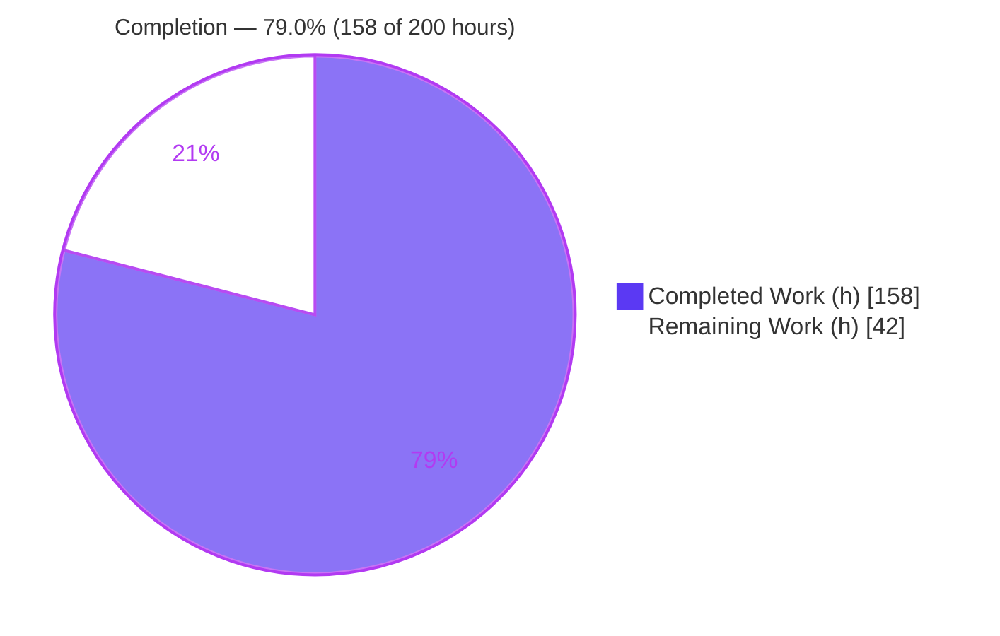
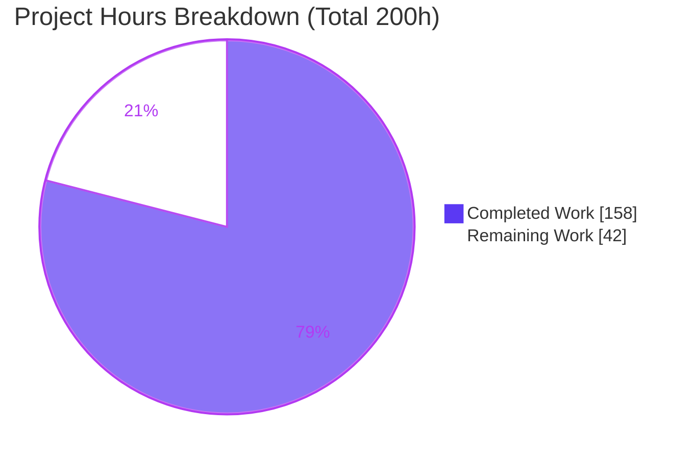
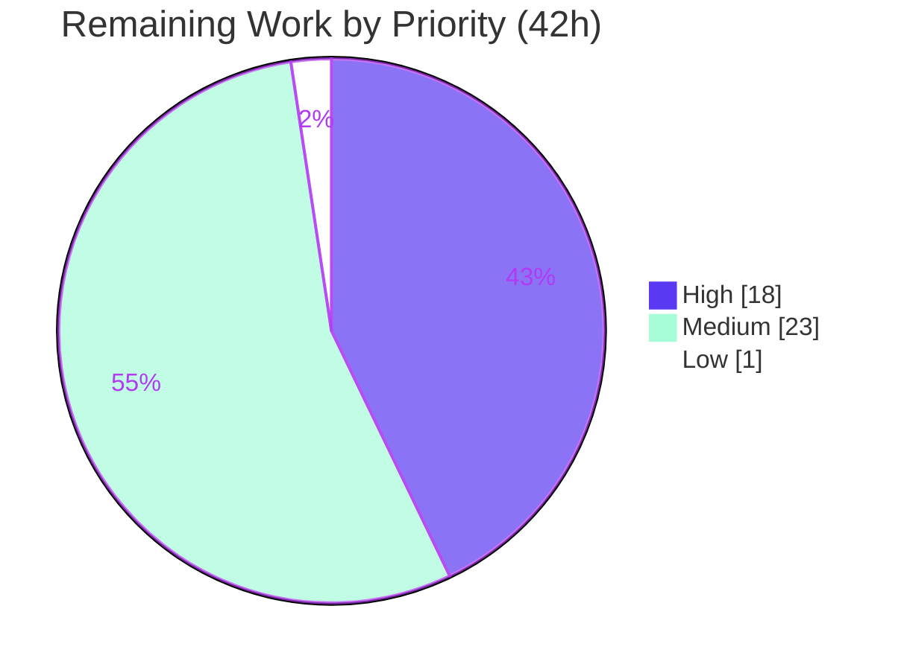

# Blitzy Project Guide — account-service (Feature F-003)

> **Legacy → Modern migration:** COBOL/CICS/VSAM Account Management slice → Java 17 / Spring Boot 3.5.16 REST service on PostgreSQL
> **Branch:** `blitzy-968ceb22-a2fe-4323-84ae-2d42315d4a1b` · **HEAD:** `06a32ed2` · **Module:** `account-service/`
> **Brand color legend:** ■ Completed / AI Work = **Dark Blue `#5B39F3`** · □ Remaining / Not Completed = **White `#FFFFFF`**

---

## 1. Executive Summary

### 1.1 Project Overview

This project migrates the **Account Management vertical slice (Feature F-003)** — the account *inquiry* and *account update* capabilities — from the legacy AWS CardDemo COBOL/CICS/VSAM stack to a standalone **Java 17 / Spring Boot 3.5.16** REST service backed by **PostgreSQL**. It faithfully reproduces the behavior of the legacy view program `COACTVWC` (transaction CAVW) and update program `COACTUPC` (transaction CAUP): read-by-key retrieval, field/date/monetary validation, record locking, and rewrite. The service targets application modernization teams as a reference-quality pattern for subsequent CardDemo slices. It is delivered as an isolated Maven module (`account-service/`) sibling to the untouched legacy `app/` tree, so no COBOL, BMS, JCL, or CICS artifact is modified.

### 1.2 Completion Status



| Metric | Value |
|--------|-------|
| **Total Hours** | **200** |
| Completed Hours (AI + Manual) | 158 (158 AI autonomous + 0 manual) |
| Remaining Hours | 42 |
| **Percent Complete** | **79.0%** |

> Completion % = Completed Hours ÷ Total Hours = 158 ÷ 200 = **79.0%** (AAP-scoped + path-to-production universe only). All AAP-scoped application code is 100% delivered, tested, and runtime-validated; the remaining 42 hours are exclusively path-to-production activities requiring cloud credentials and a target environment.

### 1.3 Key Accomplishments

- ✅ **Both endpoints delivered** — `GET /api/v1/accounts/{accountId}` and `PUT /api/v1/accounts/{accountId}` reproduce CAVW / CAUP behavior including 404 / 400 / 409 semantics.
- ✅ **Relational persistence** — 300-byte VSAM `ACCTFILE` record mapped to the `accounts` table (13 columns + `@Version`); zero-padded `VARCHAR(11)` primary key with an 11-digit `CHECK` constraint; `address_zip` preserved; `FILLER` dropped.
- ✅ **Data migration** — Flyway `V1` DDL and `V2` seed of all 50 records, decoded from zoned-decimal-with-overpunch (§0.6.2) with exact `NUMERIC(12,2)` precision.
- ✅ **Full business-rule parity** — Y/N status, `BigDecimal` money (±9,999,999,999.99, scale 2, no float/double), strict `java.time` date validation (leap-year + 1900–2099 window), 11-digit id domain.
- ✅ **Optimistic concurrency** — JPA `@Version` → HTTP 409 with the exact message "Record updated by another user - please retry".
- ✅ **Security hardening (§0.6.6)** — parameterized queries, no sensitive data in logs, security-headers and request-body-size filters, schema-integrity validator.
- ✅ **183/183 automated tests pass** — 159 unit/web-slice + 24 integration/performance (Testcontainers), zero skipped.
- ✅ **Runtime validated** — jar boots in 4.3 s, Flyway applies 2 migrations, `/actuator/health` UP; performance p95 well under the ≤ 2 s SLA (GET 108–113 ms, PUT 134–149 ms).
- ✅ **Clean build** — `mvn clean verify` BUILD SUCCESS with zero errors and zero warnings; legacy `app/` tree unchanged.

### 1.4 Critical Unresolved Issues

There are **no unresolved defects** in the delivered code. Every item below is a standard path-to-production gap (not a code defect) that requires a target environment and/or credentials Blitzy cannot access autonomously.

| Issue | Impact | Owner | ETA |
|-------|--------|-------|-----|
| No API authentication/authorization or TLS ingress | Endpoints are open; legacy CICS sign-on is not reproduced in this slice | Platform / Security | 1 day |
| Encryption-at-rest depends on unprovisioned managed DB (RDS/KMS) | Sensitive financial data would be plaintext if deployed to a non-encrypted store | Platform / DBA | 1 day |
| Database credentials use dev defaults (`carddemo`/`carddemo`) via env fallback | Must be externalized to a secrets manager before any non-local deploy | Platform | 0.5 day |
| `group_id` read-only tightening awaits stakeholder confirmation (§0.7.2) | Intentional deviation from legacy BMS `UNPROT`; needs product sign-off | Product Owner | 0.5 day |

### 1.5 Access Issues

| System / Resource | Type of Access | Issue Description | Resolution Status | Owner |
|-------------------|----------------|-------------------|-------------------|-------|
| Managed PostgreSQL (Amazon RDS) | Cloud provisioning / IAM | No target DB instance or KMS key available in the autonomous environment | Open — human provisioning required | Platform / DBA |
| Secrets manager (AWS Secrets Manager / Vault) | Credential store | No secrets backend to hold production DB credentials | Open — human setup required | Platform |
| Container registry (e.g., ECR) & deploy target (k8s/ECS) | Push / deploy | No registry credentials or cluster access | Open — human setup required | DevOps |
| CI/CD system | Pipeline configuration | No pipeline credentials/integration in the autonomous environment | Open — human setup required | DevOps |

> Local development and the full automated test suite (including Testcontainers integration/performance tests) run without any of the above — the Docker daemon is available and was used to validate all 183 tests.

### 1.6 Recommended Next Steps

1. **[High]** Provision managed PostgreSQL (RDS) with encryption-at-rest (KMS) and automated backups; apply Flyway `V1`/`V2` (HT-1).
2. **[High]** Externalize database credentials to a secrets manager, replacing the dev defaults (HT-2).
3. **[High]** Front the service with authentication/authorization and TLS ingress (API gateway / OAuth2 / mTLS) (HT-3).
4. **[Medium]** Stand up CI/CD (build → test → dependency & image scan → gated deploy) and publish the container image to a registry with environment manifests (HT-4, HT-5).
5. **[Medium]** Complete a production security review/scan sign-off and wire observability, then deploy to staging for smoke/UAT (HT-6, HT-7, HT-8).

---

## 2. Project Hours Breakdown

### 2.1 Completed Work Detail

Each completed component traces to a specific AAP requirement. Column total = **158 hours** (= Completed Hours in §1.2).

| Component | Hours | Description |
|-----------|------:|-------------|
| Maven module, build & container setup | 10 | `pom.xml` (parent Spring Boot 3.5.16, Java 17), multi-stage `Dockerfile`, `.dockerignore`, `AccountServiceApplication`, `OpenApiConfig`, `README.md`; dependency curation + security overrides [AAP §0.3.1, §0.5.1] |
| Domain entity & schema DDL | 12 | `Account` `@Entity` (13 columns + `@Version`), `AccountRepository`, `V1__create_accounts_table.sql` (PK + `CHECK` 11-digit) [AAP §0.3.1, §0.6.1] |
| Data migration & 50-row seed | 10 | `V2__seed_accounts.sql`; zoned-decimal-with-overpunch decode to exact `NUMERIC(12,2)`; zero-padded ids preserved [AAP §0.6.2] |
| Business-rule validator | 16 | `AccountValidator`: Y/N, signed money range/scale, strict `java.time` dates, leap-year, year 1900–2099, 11-digit id [AAP §0.6.3, §0.6.5] |
| Service layer & optimistic concurrency | 14 | `AccountService`: `@Transactional` read/validate/update, `@Version` stale-check → 409, id/path authority, immutability [AAP §0.6.4, §0.3.3] |
| Controller, DTOs & mapper | 14 | `AccountController` (GET/PUT), `AccountResponse`, `AccountUpdateRequest` (11 editable fields), `AccountMapper` currency/date formatting parity [AAP §0.3.1, §0.3.3] |
| Centralized error handling | 10 | `GlobalExceptionHandler` (400/404/409), `ApiError`, `AccountNotFoundException`, `ValidationException`; legacy-parity messages [AAP §0.7.1, §0.6.4] |
| Security hardening (§0.6.6) | 12 | `SecurityHeadersFilter`, `RequestBodySizeLimitFilter`, `ApiErrorController`, `SchemaIntegrityValidator`; parameterized queries; log hygiene [AAP §0.6.6] |
| Runtime configuration & profiles | 6 | `application.yml` / `application-docker.yml` / `application-test.yml`: Flyway, JPA `validate`, actuator health, sanitized logging [AAP §0.3.1] |
| Unit & web-slice test suite (159 tests) | 24 | `AccountValidatorTest` (106), `AccountControllerTest` (30), `AccountMapperTest` (9), `AccountServiceTest` (8), `SchemaIntegrityValidatorTest` (6) [AAP §0.6.5] |
| Integration & performance test suite (24 tests) | 18 | `AccountApiIntegrationTest` (22) + `AccountPerformanceTest` (2), Testcontainers `postgres:17-alpine`, ≤ 2 s SLA assertions [AAP §0.6.5, §0.7.1] |
| Code-review, QA remediation & final validation | 12 | Three documented review rounds (19 + 16 + 15 findings) + QA acceptance gate + Refine PR finalization |
| **Total** | **158** | |

### 2.2 Remaining Work Detail

Every remaining category is a **path-to-production** activity (no AAP application code is outstanding). Column total = **42 hours** (= Remaining Hours in §1.2 and §7). Grouped by priority.

| Category | Hours | Priority |
|----------|------:|----------|
| Provision managed PostgreSQL (RDS) + encryption-at-rest (KMS) + backups + apply Flyway (HT-1) | 6 | High |
| Externalize DB credentials to a secrets manager (HT-2) | 4 | High |
| API authentication/authorization + TLS ingress (HT-3) | 8 | High |
| CI/CD pipeline: build/test/scan/publish (HT-4) | 6 | Medium |
| Container registry + environment deployment manifests (HT-5) | 5 | Medium |
| Production security review + dependency/image scan sign-off (HT-6) | 5 | Medium |
| Observability wiring to real infrastructure (HT-7) | 4 | Medium |
| Staging deployment + smoke/UAT + pool tuning + load test (HT-8) | 3 | Medium |
| Stakeholder confirmation of `group_id` read-only tightening §0.7.2 (HT-9) | 1 | Low |
| **Total** | **42** | High 18 · Medium 23 · Low 1 |

### 2.3 Hours Summary

| Bucket | Hours | % of Total |
|--------|------:|-----------:|
| Completed (§2.1) | 158 | 79.0% |
| Remaining (§2.2) | 42 | 21.0% |
| **Total Project** | **200** | **100%** |

> Integrity: §2.1 (158) + §2.2 (42) = 200 = Total in §1.2. Remaining (42) is identical in §1.2, §2.2, and the §7 pie chart.

---

## 3. Test Results

All figures below originate from Blitzy's autonomous validation logs (`mvn clean verify` → BUILD SUCCESS): Surefire and Failsafe reports under `account-service/target/`. Grand total **183 tests, 100% pass, 0 skipped / 0 disabled / 0 flakes**.

| Test Category | Framework | Total Tests | Passed | Failed | Coverage % | Notes |
|---------------|-----------|------------:|-------:|-------:|-----------:|-------|
| Unit — Validation rules | JUnit 5 (Surefire) | 106 | 106 | 0 | Every rule (valid + invalid) | `AccountValidatorTest`: Y/N, money range/scale, strict dates, leap-year, year window, id |
| Unit — Service logic | JUnit 5 + Mockito | 8 | 8 | 0 | Found / not-found / conflict / immutability | `AccountServiceTest` |
| Unit — Mapper | JUnit 5 | 9 | 9 | 0 | Currency `+ZZZ,ZZZ,ZZZ.99` + ISO date parity | `AccountMapperTest` |
| Unit — Schema integrity | JUnit 5 | 6 | 6 | 0 | Entity↔DDL column/type checks | `SchemaIntegrityValidatorTest` |
| Web slice — Controller | `@WebMvcTest` + MockMvc | 30 | 30 | 0 | Status codes + JSON shape | `AccountControllerTest` |
| Integration — API | `@SpringBootTest` + Testcontainers | 22 | 22 | 0 | Happy / 404 / 400 / 409 / seed parity / immutability | `AccountApiIntegrationTest` (`postgres:17-alpine`) |
| Performance | Testcontainers + concurrency harness | 2 | 2 | 0 | GET p95 108–113 ms, PUT 134–149 ms (≤ 2000 ms) | `AccountPerformanceTest` (60 GET / 50 PUT concurrent) |
| **Total** | — | **183** | **183** | **0** | — | 159 Surefire + 24 Failsafe |

---

## 4. Runtime Validation & UI Verification

Runtime validation was performed against a live PostgreSQL (`postgres:17-alpine`) using the executable fat jar. There is no graphical UI in this slice (the 3270/BMS layer is retired); the "interface" is the REST/JSON contract, documented via springdoc Swagger UI.

**Application health & startup**
- ✅ **Operational** — Boots in ~4.3 s on port 8080 (Spring Boot 3.5.16 fat jar).
- ✅ **Operational** — Flyway "Successfully validated 2 migrations" (schema at V2, up to date).
- ✅ **Operational** — `GET /actuator/health` → `{"status":"UP"}` (200).

**API behavior (parity with legacy CAVW / CAUP)**
- ✅ **Operational** — `GET /api/v1/accounts/00000000001` → 200 with full 13-field JSON (scale-2 currency in plain notation, ISO dates, `addressZip` preserved).
- ✅ **Operational** — `GET` unknown id → 404 (legacy NOTFND parity).
- ✅ **Operational** — `PUT` valid → 200 with `@Version` increment.
- ✅ **Operational** — `PUT` stale `version` → 409 "Record updated by another user - please retry".
- ✅ **Operational** — `PUT` `activeStatus='X'` → 400; `PUT` `2023-02-29` → 400 (strict `java.time` date validation).
- ✅ **Operational** — `PUT` tampering `accountId`/`groupId` → 200 but those fields unchanged; no phantom row created (immutability by design).
- ✅ **Operational** — All-zeros id `00000000000` rejected 400 (non-zero 11-digit key check).

**API documentation & schema**
- ✅ **Operational** — `GET /v3/api-docs` → 200; Swagger UI at `/swagger-ui.html` (springdoc 2.8.17).
- ✅ **Operational** — DB `CHECK` constraint `ck_accounts_account_id_numeric` present (11-digit key domain).

**Performance**
- ✅ **Operational** — p95 well within the ≤ 2 s SLA: GET 108–113 ms, PUT 134–149 ms across independent runs.

**Production runtime concerns (not yet wired)**
- ⚠ **Partial** — Observability limited to `/actuator/health`; log aggregation, metrics dashboards, alerts, and tracing are not yet connected to infrastructure (HT-7).
- ❌ **Failing/absent** — No API authentication/authorization or TLS termination in front of the service (HT-3).

---

## 5. Compliance & Quality Review

Cross-map of AAP deliverables to quality/compliance benchmarks. All application-code items are complete; fixes were applied autonomously across three code-review rounds and a QA gate.

| AAP Deliverable / Benchmark | Requirement | Status | Evidence / Notes |
|-----------------------------|-------------|--------|------------------|
| GET endpoint (CAVW parity) | Read-by-key + 404 | ✅ Pass | `AccountController#getAccount`; integration + controller tests |
| PUT endpoint (CAUP parity) | Edit/validate/lock/rewrite; 400/404/409 | ✅ Pass | `AccountController#updateAccount`; integration tests |
| Field parity (300-byte record) | 12 fields incl. `address_zip`; `FILLER` dropped | ✅ Pass | `Account` entity + `V1` DDL (13 cols with `@Version`) |
| Identifier type decision (§0.6.1) | Zero-padded `VARCHAR(11)` + 11-digit CHECK | ✅ Pass | `Account.accountId`; `ck_accounts_account_id_numeric` |
| Monetary precision (§0.6.2) | `BigDecimal`/`NUMERIC(12,2)`, no float/double | ✅ Pass | Entity + validator + mapper; Jackson plain-decimal |
| Date validation (§0.6.3) | Strict `java.time`, leap-year, 1900–2099 | ✅ Pass | `AccountValidator`; 106 validator tests |
| Optimistic concurrency (§0.6.4) | `@Version` → 409 + exact message | ✅ Pass | `AccountService` + `GlobalExceptionHandler` |
| Read-only `accountId` | Immutable | ✅ Pass | Omitted from `AccountUpdateRequest`; runtime-verified |
| Read-only `groupId` (§0.7.2) | Tightened vs legacy `UNPROT` | ✅ Pass (code) / ⏳ sign-off | Implemented; awaits stakeholder confirmation (HT-9) |
| Error semantics | 404/400/409 + structured `ApiError` | ✅ Pass | `@RestControllerAdvice`; controller/integration tests |
| Security — parameterized queries (§0.6.6) | No string-concatenated SQL | ✅ Pass | Spring Data JPA / JPQL bound params |
| Security — no sensitive data in logs (§0.6.6) | Mask account no./balances | ✅ Pass | Sanitized logging; log-hygiene test |
| Security — encryption at rest (§0.6.6) | KMS-managed | ⏳ Infra | Code-ready; requires RDS/KMS (HT-1) |
| Standalone operability | Own build/run/migrate/test | ✅ Pass | `mvn verify` 183/183; jar boots independently |
| Performance (≤ 2 s) | Both operations | ✅ Pass | p95 108–149 ms |
| Minimal Change Clause | Legacy tree untouched | ✅ Pass | `git diff app/` empty |
| Build quality | Zero errors/warnings | ✅ Pass | `mvn clean verify` BUILD SUCCESS |

---

## 6. Risk Assessment

| Risk | Category | Severity | Probability | Mitigation | Status |
|------|----------|----------|-------------|------------|--------|
| T1 — Spring Boot 3.5.16 reached open-source EOL (2026-06-30) | Technical | Medium | High | Planned upgrade window to 4.1.x (Java-17 compatible); dependencies pinned with security overrides | Accepted / Documented (§0.7.2) |
| T2 — Untuned HikariCP pool; only micro p95 test (no load/soak) | Technical | Medium | Medium | Load/soak test and pool tuning during staging (HT-8) | Open |
| T3 — Schema drift detected only at startup (`ddl-auto=validate`) | Technical | Low | Low | Flyway owns schema; validate fails fast on mismatch | Mitigated |
| S1 — No API authentication/authorization (endpoints open) | Security | High | High | API gateway + OAuth2/mTLS + TLS ingress (HT-3) | Open |
| S2 — Encryption-at-rest is an infra assumption, not yet provisioned | Security | High | Medium | Enable RDS encryption / KMS before prod (HT-1) | Open |
| S3 — DB credentials use dev defaults via env fallback | Security | High | High (if unaddressed) | Externalize to secrets manager (HT-2) | Open |
| O1 — No CI/CD (manual build/deploy) | Operational | Medium | Medium | Establish pipeline with gates (HT-4) | Open |
| O2 — Observability limited to `/actuator/health` | Operational | Medium | Medium | Wire logs/metrics/alerts/tracing (HT-7) | Open |
| O3 — No backup/DR for the new datastore | Operational | Medium | Low | Enable RDS automated backups/PITR (part of HT-1) | Open |
| I1 — `VARCHAR(11)` join-compat with still-COBOL CARDFILE/XREFFILE untested vs live files | Integration | Low–Medium | Low | Cross-file reconciliation when those slices migrate | Deferred |
| I2 — `group_id` read-only deviates from legacy BMS `UNPROT`; upstream updates silently no-op | Integration | Low | Low | Stakeholder confirmation (HT-9) | Open |
| I3 — 50-row POC seed only; full VSAM→PG ETL is a separate effort | Integration | Medium | Medium (for cutover) | Build full ETL + reconciliation beyond POC | Deferred / Out-of-scope this slice |

---

## 7. Visual Project Status

**Hours breakdown** (Completed = Dark Blue `#5B39F3`, Remaining = White `#FFFFFF`):



**Remaining hours by priority** (all 42 remaining hours are path-to-production):



**Remaining hours per category (Section 2.2)**

| Category (HT) | Hours | Bar |
|---------------|------:|-----|
| API authN/authZ + TLS (HT-3) | 8 | ████████ |
| RDS + encryption (HT-1) | 6 | ██████ |
| CI/CD pipeline (HT-4) | 6 | ██████ |
| Registry + deploy (HT-5) | 5 | █████ |
| Security review/sign-off (HT-6) | 5 | █████ |
| Secrets management (HT-2) | 4 | ████ |
| Observability (HT-7) | 4 | ████ |
| Staging + UAT (HT-8) | 3 | ███ |
| `group_id` sign-off (HT-9) | 1 | █ |
| **Total** | **42** | |

> Integrity: §7 "Remaining Work" (42) = §1.2 Remaining (42) = §2.2 total (42). §7 "Completed Work" (158) = §1.2 Completed (158).

---

## 8. Summary & Recommendations

**Achievements.** The account-service module delivers a complete, behavior-faithful migration of the CardDemo Account Management slice (F-003). All AAP-scoped application code — both endpoints, the relational schema and data migration, every legacy business rule, optimistic concurrency, error semantics, and the three intentional security deviations — is implemented, exercised by **183/183 passing tests**, and validated at runtime against live PostgreSQL. The build is clean (zero errors/warnings), performance is well within the ≤ 2 s SLA, and the legacy COBOL tree is untouched.

**Completion.** The project is **79.0% complete** (158 of 200 hours). This figure reflects the AAP-scoped-plus-path-to-production work universe: 100% of the application code is done, and the remaining **42 hours (21.0%)** are exclusively deployment/operations activities that require cloud credentials and a target environment Blitzy cannot access autonomously.

**Critical path to production.** (1) Provision managed PostgreSQL with encryption-at-rest and externalize credentials → (2) add authentication/authorization and TLS in front of the service → (3) establish CI/CD and publish the container image → (4) security sign-off, observability, and staging/UAT. The single non-infrastructure item is a product-owner confirmation of the `group_id` read-only tightening (§0.7.2, 1 h).

**Success metrics.** Behavioral parity verified (status codes, messages, formatting, immutability, concurrency); exact monetary precision (no float/double); strict date validation; performance p95 108–149 ms.

**Production readiness assessment.** The code is **production-ready**; the *deployment* is not yet productionized. With the High-priority items (18 h) addressed, the service is deployable to a secured environment; the full 42 hours brings it to a fully operationalized production posture.

| Assessment Dimension | Status |
|----------------------|--------|
| Functional completeness (AAP) | ✅ 100% of code delivered |
| Test coverage & pass rate | ✅ 183/183 (0 skipped) |
| Runtime validation | ✅ Verified against live PostgreSQL |
| Build & dependency health | ✅ Zero errors/warnings |
| Deployment readiness | ⏳ 42 h path-to-production remaining |
| Overall completion | **79.0%** |

---

## 9. Development Guide

### 9.1 System Prerequisites

| Tool | Version (verified) | Notes |
|------|--------------------|-------|
| Java (JDK) | 17 (validated 17.0.19) | `JAVA_HOME=/usr/lib/jvm/java-17-openjdk-amd64` |
| Apache Maven | 3.9.9 | No Maven wrapper is present — use the system `mvn` |
| Docker | 28.5.2 (daemon running) | Required for integration/performance tests (Testcontainers) and optional local DB |
| PostgreSQL | 16 or 17 | Local via Docker `postgres:17-alpine` (matches the Testcontainers tag) |

### 9.2 Environment Setup

```bash
# From the repository root
cd account-service

# Ensure Java 17 is active
export JAVA_HOME=/usr/lib/jvm/java-17-openjdk-amd64
java -version    # expect: openjdk version "17..."
```

Start a local PostgreSQL that matches the application defaults (Flyway will create/seed the schema on first boot):

```bash
docker run -d --name carddemo-postgres \
  -e POSTGRES_DB=carddemo \
  -e POSTGRES_USER=carddemo \
  -e POSTGRES_PASSWORD=carddemo \
  -p 5432:5432 \
  postgres:17-alpine
```

Default datasource (overridable via environment variables):

| Property | Env var | Default |
|----------|---------|---------|
| URL | `SPRING_DATASOURCE_URL` | `jdbc:postgresql://localhost:5432/carddemo` |
| Username | `SPRING_DATASOURCE_USERNAME` | `carddemo` |
| Password | `SPRING_DATASOURCE_PASSWORD` | `carddemo` |
| HTTP port | `SERVER_PORT` | `8080` |

### 9.3 Dependency Installation & Build

```bash
# Resolve dependencies + compile (offline-friendly)
mvn -B clean compile

# Unit + web-slice tests only (NO Docker required) — 159 tests
mvn -B test

# Full verification incl. integration + performance (Docker REQUIRED) — 183 tests
mvn -B clean verify

# Build the executable jar
mvn -B clean package    # -> target/account-service-0.0.1-SNAPSHOT.jar
```

Expected: `BUILD SUCCESS`; Surefire `Tests run: 159, Failures: 0, Errors: 0, Skipped: 0`; Failsafe `Tests run: 24, Failures: 0, Errors: 0, Skipped: 0`.

### 9.4 Application Startup

```bash
# Ensure carddemo-postgres is running (see 9.2), then:
java -jar target/account-service-0.0.1-SNAPSHOT.jar
# Boots on http://localhost:8080 ; Flyway applies V1 + V2 on first start
```

Container image (multi-stage build → `eclipse-temurin:17-jre`, runs as non-root, exposes 8080):

```bash
docker build -t account-service:local ./account-service

docker run --rm -p 8080:8080 \
  -e SPRING_PROFILES_ACTIVE=docker \
  -e SPRING_DATASOURCE_URL=jdbc:postgresql://host.docker.internal:5432/carddemo \
  -e SPRING_DATASOURCE_USERNAME=carddemo \
  -e SPRING_DATASOURCE_PASSWORD=carddemo \
  account-service:local
```

> Note: the `docker` profile (`application-docker.yml`) has **no datasource defaults** — the three `SPRING_DATASOURCE_*` env vars are mandatory.

### 9.5 Verification Steps

```bash
# Health
curl -s http://localhost:8080/actuator/health          # {"status":"UP"}

# Retrieve a seeded account (expect 200 + 13-field JSON)
curl -s http://localhost:8080/api/v1/accounts/00000000001 | python3 -m json.tool

# Not found (expect 404)
curl -s -o /dev/null -w "%{http_code}\n" http://localhost:8080/api/v1/accounts/99999999999

# OpenAPI docs (expect 200)
curl -s -o /dev/null -w "%{http_code}\n" http://localhost:8080/v3/api-docs
# Swagger UI: http://localhost:8080/swagger-ui.html
```

### 9.6 Example Usage — Update (PUT)

```bash
# 1) Read current state to obtain the current `version`
curl -s http://localhost:8080/api/v1/accounts/00000000001 | python3 -m json.tool

# 2) Update editable fields (send the version you just read)
curl -s -X PUT http://localhost:8080/api/v1/accounts/00000000001 \
  -H 'Content-Type: application/json' \
  -d '{
        "activeStatus": "Y",
        "currentBalance": "1000.00",
        "creditLimit": "5000.00",
        "cashCreditLimit": "2000.00",
        "openDate": "2014-11-20",
        "expirationDate": "2027-11-20",
        "reissueDate": "2024-11-20",
        "currentCycleCredit": "0.00",
        "currentCycleDebit": "0.00",
        "addressZip": "A000000000",
        "version": 0
      }' | python3 -m json.tool
# Success -> 200 with incremented version; stale version -> 409;
# invalid field/date -> 400. Note: accountId & groupId are NOT accepted in the body.
```

### 9.7 Troubleshooting

| Symptom | Likely Cause | Resolution |
|---------|--------------|------------|
| App exits at startup with a Flyway/schema validation error | Entity ↔ migration drift (`ddl-auto=validate`) | Fix or add a Flyway migration so the DB schema matches the entity; never let Hibernate own the schema |
| Startup fails within ~3 s with a connection error | PostgreSQL not reachable (HikariCP `connection-timeout=3000ms`) | Ensure `carddemo-postgres` is running and `SPRING_DATASOURCE_URL` is correct |
| `mvn verify` fails at the integration phase | Docker daemon not available for Testcontainers | Start Docker; re-run `mvn -B verify` (image `postgres:17-alpine`) |
| `PUT` returns 409 | Stale `version` (record changed by another writer) | Re-read the account, resubmit with the current `version` |
| `PUT` returns 400 for a valid-looking date | Strict date rule (e.g., `2023-02-29`, or year outside 1900–2099) | Send a valid calendar date within the allowed year window |
| Wrong Java version at build | `JAVA_HOME` points to non-17 JDK | `export JAVA_HOME=/usr/lib/jvm/java-17-openjdk-amd64` |

---

## 10. Appendices

### A. Command Reference

| Purpose | Command |
|---------|---------|
| Compile | `mvn -B clean compile` |
| Unit + slice tests (no Docker) | `mvn -B test` |
| Full verify (Docker) | `mvn -B clean verify` |
| Build jar | `mvn -B clean package` |
| Run jar | `java -jar target/account-service-0.0.1-SNAPSHOT.jar` |
| Build image | `docker build -t account-service:local ./account-service` |
| Local DB | `docker run -d --name carddemo-postgres -e POSTGRES_DB=carddemo -e POSTGRES_USER=carddemo -e POSTGRES_PASSWORD=carddemo -p 5432:5432 postgres:17-alpine` |
| Health check | `curl -s http://localhost:8080/actuator/health` |

### B. Port Reference

| Port | Service | Notes |
|------|---------|-------|
| 8080 | account-service HTTP | `server.port` (override `SERVER_PORT`); Docker `EXPOSE 8080` |
| 5432 | PostgreSQL | Local dev DB / RDS target |

### C. Key File Locations

| Path | Purpose |
|------|---------|
| `account-service/pom.xml` | Maven build (Spring Boot 3.5.16 parent, Java 17) |
| `account-service/Dockerfile` | Multi-stage build → `eclipse-temurin:17-jre` |
| `.../domain/Account.java` | `@Entity` (13 columns + `@Version`) |
| `.../service/AccountService.java` | Read/validate/update + optimistic locking |
| `.../service/AccountValidator.java` | Y/N, money, strict date rules |
| `.../controller/AccountController.java` | `GET`/`PUT` `/api/v1/accounts/{accountId}` |
| `.../exception/GlobalExceptionHandler.java` | 400 / 404 / 409 mapping |
| `.../resources/application.yml` | Datasource, JPA, Flyway, actuator |
| `.../resources/db/migration/V1__create_accounts_table.sql` | Schema DDL + `CHECK` |
| `.../resources/db/migration/V2__seed_accounts.sql` | 50-row seed |

### D. Technology Versions

| Component | Version |
|-----------|---------|
| Java (JDK) | 17 |
| Spring Boot (parent) | 3.5.16 |
| springdoc-openapi | 2.8.17 |
| Flyway | 11.7.2 (`flyway-core` + `flyway-database-postgresql`) |
| PostgreSQL JDBC | 42.7.12 |
| Testcontainers | 1.21.4 (`postgres:17-alpine`) |
| Security overrides | tomcat 10.1.57 · jackson-databind 2.21.5 · logback-core 1.5.38 · commons-compress 1.27.1 · commons-lang3 3.18.0 · swagger-ui 5.32.8 |

### E. Environment Variable Reference

| Variable | Default (default profile) | Required (docker profile) |
|----------|---------------------------|---------------------------|
| `SPRING_DATASOURCE_URL` | `jdbc:postgresql://localhost:5432/carddemo` | Yes (no default) |
| `SPRING_DATASOURCE_USERNAME` | `carddemo` | Yes (no default) |
| `SPRING_DATASOURCE_PASSWORD` | `carddemo` | Yes (no default) |
| `SPRING_PROFILES_ACTIVE` | (default) | set to `docker` in containers |
| `SERVER_PORT` | `8080` | optional |

### F. Developer Tools Guide

- **Swagger UI:** `http://localhost:8080/swagger-ui.html` — interactive endpoint exploration.
- **OpenAPI JSON:** `http://localhost:8080/v3/api-docs`.
- **Actuator:** `http://localhost:8080/actuator/health` (only the health endpoint is exposed; readiness group includes DB).
- **Testcontainers:** integration/performance tests spin up disposable `postgres:17-alpine`; requires a running Docker daemon.

### G. Glossary

| Term | Meaning |
|------|---------|
| CAVW / CAUP | Legacy CICS transaction ids for account view / update |
| `COACTVWC` / `COACTUPC` | Legacy COBOL view / update programs (behavioral source) |
| `ACCTFILE` | Legacy 300-byte VSAM KSDS account record (`CVACT01Y.cpy`) |
| Overpunch | Zoned-decimal sign encoding on the trailing byte (decoded in `V2`) |
| Optimistic locking | `@Version`-based concurrency; stale version → HTTP 409 |
| Path-to-production | Deployment/ops activities beyond application code (the 42 remaining hours) |
| Minimal Change Clause | Constraint that the legacy `app/` tree is not modified |

---

*Numerical integrity confirmed: §2.1 (158) + §2.2 (42) = 200 = Total (§1.2). Remaining = 42 across §1.2, §2.2, §7. Completion = 158 ÷ 200 = 79.0% across §1.2, §7, §8. All 183 tests originate from Blitzy's autonomous validation logs. Colors: Completed `#5B39F3`, Remaining `#FFFFFF`.*