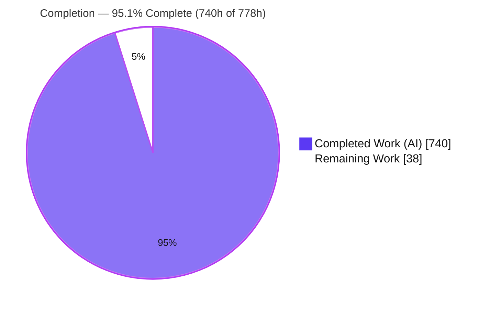
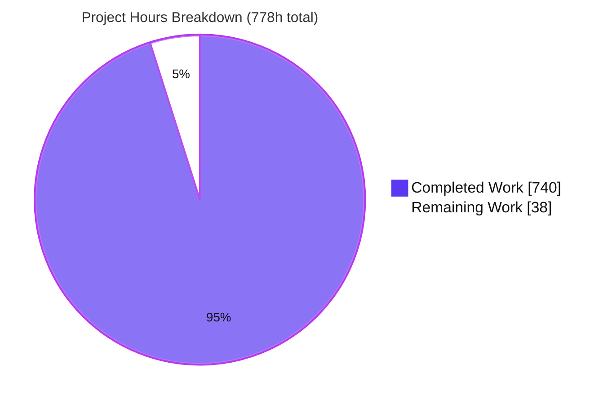
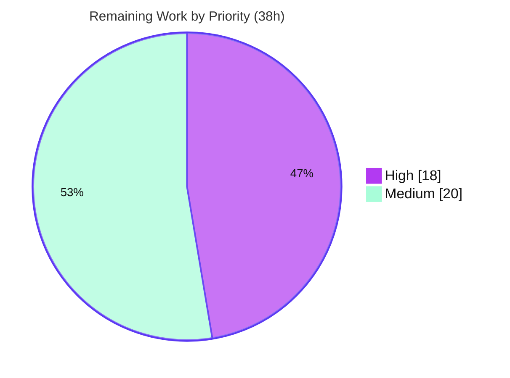

# Blitzy Project Guide — AWS CardDemo: COBOL → Java 25 / Spring Boot 3.5 Migration

> **Brand legend** — In every chart and status indicator: **Completed / AI Work = Dark Blue `#5B39F3`**, **Remaining / Not Completed = White `#FFFFFF`**, headings/accents = Violet-Black `#B23AF2`, highlights = Mint `#A8FDD9`.

---

## 1. Executive Summary

### 1.1 Project Overview

This project migrates **AWS CardDemo** — a z/OS COBOL / CICS / VSAM / JCL / BMS credit-card management system — to a modern **Java 25 LTS + Spring Boot 3.5.15** layered application, in the **same repository**, with the original COBOL assets retained read-only under `/legacy`. Copybooks become JPA entities/DTOs, VSAM files become PostgreSQL tables via Spring Data JPA, COBOL paragraphs become service methods preserving perform order, JCL becomes Spring Batch jobs, and 17 BMS/CICS transactions become Spring MVC controllers with Thymeleaf screens. The acceptance bar is **100% behavioral parity with zero functional regression**, enforced through decimal-fidelity arithmetic, golden-file parity tests, and a 100% paragraph→method traceability matrix. Target users are card operations/administration staff who previously used 3270 terminals.

### 1.2 Completion Status



| Metric | Value |
|---|---|
| **Total Hours** | **778 h** |
| **Completed Hours (AI + Manual)** | **740 h** (740 AI / 0 manual) |
| **Remaining Hours** | **38 h** |
| **Percent Complete** | **95.1 %** (740 ÷ 778) |

> Completion is computed using AAP-scoped hours only (PA1): `Completion % = Completed ÷ (Completed + Remaining) = 740 ÷ 778 = 95.1%`. Every completed hour traces to an AAP deliverable; every remaining hour is path-to-production.

### 1.3 Key Accomplishments

- ✅ **Complete domain model** — 11 JPA entities + 3 composite-key IDs from copybooks; **all** monetary/rate fields use `BigDecimal` (zero `float`/`double`).
- ✅ **Persistence layer** — 11 Spring Data JPA repositories; Flyway `V1__schema.sql` (incl. the **3 VSAM alternate indexes** from `LISTCAT`) and `V2__seed_reference_data.sql`.
- ✅ **Online tier** — 17 CICS transactions → 17 controllers + 17 services (+ `BaseScreenController`), 17 screen DTOs, 18 Thymeleaf templates; COMMAREA navigation, AID/PF-key handling, and `ADMIN`/`USER` role gating preserved.
- ✅ **Batch tier** — 11 Spring Batch jobs + 10 services + `FileIoService`; interest truncation parity `(bal*rate)/1200` with `RoundingMode.DOWN`; 430-byte `DALYREJS` reject writer; JCL params → `JobParameters`.
- ✅ **Security hardening** — Spring Security + BCrypt, externalized credentials, role gating, session-id rotation (CWE-384); clear-text password field and default credentials eliminated.
- ✅ **Quality gates green** — zero-warning build (`-Werror`), **1330/1330 tests pass**, **92.01% line coverage** (≥80% gate), Spotless 272/272 clean, **100% paragraph→method** traceability matrix (840 lines).
- ✅ **Build & CI** — Maven (Java 25 / Spring Boot 3.5.15), Maven wrapper, Dockerfile, docker-compose (PostgreSQL 16), GitHub Actions CI with JaCoCo and OWASP dependency-check gates.
- ✅ **Legacy preserved** — 148 COBOL/JCL/BMS files relocated read-only under `/legacy`; no source deleted.

### 1.4 Critical Unresolved Issues

| Issue | Impact | Owner | ETA |
|---|---|---|---|
| OWASP dependency-check never executed against live NVD (offline opt-out) | Cannot confirm the AAP "zero critical/high CVE" gate; potential transitive CVEs unverified | Security / DevOps | 0.5 day |
| Production secrets not yet in a vault; default seed identities (`ADMIN001`/`USER0001`) not rotated | Insecure if deployed as-is with default/blank credentials | DevOps / Security | 0.5 day |
| No production deployment / CD pipeline or managed PostgreSQL | Application cannot reach production without infra + deploy automation | DevOps / Platform | 1.5–2 days |
| Behavioral-parity UAT against production-representative data not yet performed | Final parity sign-off pending despite green golden-file tests | QA / Business | 1 day |

> These are **path-to-production** items, not defects in delivered code. All AAP code deliverables are complete and validated.

### 1.5 Access Issues

| System / Resource | Type of Access | Issue Description | Resolution Status | Owner |
|---|---|---|---|---|
| NVD (National Vulnerability Database) | API key | OWASP dependency-check requires an `NVD_API_KEY` repository secret to run the online scan; absent in the autonomous environment | Open — set repo secret | DevOps |
| Production PostgreSQL | Database credentials/host | No managed production instance/credentials provisioned (dev uses docker-compose only) | Open — provision instance | Platform |
| Secrets manager / vault | Credential store | Production secret store for `SPRING_DATASOURCE_*`, `CARDDEMO_ADMIN_PASSWORD`, `CARDDEMO_USER_PASSWORD` not yet configured | Open — configure vault | DevOps |
| Container registry / deploy target | Push/deploy permissions | No registry or deployment environment wired for CD | Open — provision CD target | Platform |

> No access issues blocked autonomous build/test validation — the full suite ran offline against Testcontainers PostgreSQL with a complete local `.m2` cache.

### 1.6 Recommended Next Steps

1. **[High]** Set the `NVD_API_KEY` CI secret and run `./mvnw clean verify -DnvdApiKey=$NVD_API_KEY`; triage and remediate any critical/high CVEs (the gate fails on CVSS ≥ 7).
2. **[High]** Wire production secrets into a vault/secrets-manager and rotate the default seed identities to strong, unique credentials.
3. **[High]** Perform final human code review and behavioral-parity sign-off (spot-check the traceability matrix, golden-file diffs, and decimal/truncation behavior).
4. **[Medium]** Provision and harden production PostgreSQL 16+ (TLS, backups) and build the CD/deployment pipeline + batch scheduling.
5. **[Medium]** Execute UAT and golden-file parity acceptance against production-representative data.

---

## 2. Project Hours Breakdown

### 2.1 Completed Work Detail

| Component | Hours | Description |
|---|---:|---|
| Build & CI/CD scaffolding | 32 | `pom.xml` (Java 25, Spring Boot 3.5.15), Maven wrapper, `Dockerfile`, `docker-compose.yml` (PostgreSQL 16), `.gitignore`, GitHub Actions `ci.yml` with JaCoCo + OWASP + Spotless gates |
| Domain model — entities & composite keys | 40 | 11 JPA entities + 3 composite-key IDs from copybooks; `BigDecimal` decimal fidelity; fixed-width column semantics |
| Persistence — JPA repositories | 24 | 11 Spring Data repositories + `UserListProjection`; alternate-index/paginated queries |
| Database schema & seed (Flyway) | 24 | `V1__schema.sql` (DDL, PKs, 3 VSAM alternate indexes) + `V2__seed_reference_data.sql` |
| Online controllers | 80 | 17 transaction controllers + `BaseScreenController`; COMMAREA navigation, AID/PF-key handling, role gating |
| Online business services | 96 | 17 services preserving COBOL paragraph perform-order control flow |
| Screen DTOs & Thymeleaf UI | 56 | 17 screen DTOs, 18 templates, `CardDemoCommarea`, `CardWorkArea` (REDEFINES accessors) |
| Spring Batch jobs & services | 120 | 11 job configs + 10 services + `FileIoService`; truncation parity, 430-byte reject writer, `JobParameters` |
| Security hardening | 28 | `SecurityConfig`, `SecuritySeeder`, BCrypt, externalized creds, role gating, session-id rotation |
| Exception handling | 16 | 6 typed exceptions; FILE STATUS/RESP mapping; `@ControllerAdvice` global handler |
| Utilities & formatting | 28 | `CobolStringUtils`, `DateValidationService` (CSUTLDTC), `NumberFormatter`, `Messages`, `LookupCodes`, `MenuOptions` |
| Infrastructure config | 12 | `DataSourceConfig`, `BatchConfig`, `JacksonConfig` |
| Test suite | 160 | 139 test classes / 1330 tests — unit, WebMvc slices, Testcontainers integration, Spring Batch, golden-file parity (92.01% coverage) |
| Documentation | 24 | `README.md` migration update + 840-line `docs/traceability-matrix.md` (100% paragraph→method) |
| **Total Completed** | **740** | **= Completed Hours in Section 1.2** |

### 2.2 Remaining Work Detail

| Category | Hours | Priority |
|---|---:|---|
| OWASP dependency-check NVD online scan & CVE remediation | 6 | High |
| Final human code review & behavioral-parity sign-off | 8 | High |
| Production secrets management & credential rotation | 4 | High |
| Production PostgreSQL provisioning & backups | 6 | Medium |
| Deployment / CD pipeline & batch scheduling | 8 | Medium |
| UAT & golden-file parity acceptance vs production data | 6 | Medium |
| **Total Remaining** | **38** | **= Remaining Hours in Section 1.2 & Section 7** |

> **Optional (post-launch, 0 h in scope):** extended Actuator dashboards/alerting, closing the residual ~8% coverage gap (already exceeds the 80% gate at 92.01%), and further performance/caching tuning. Excluded from the 38 h to preserve cross-section integrity.

### 2.3 Hours Reconciliation

| Check | Result |
|---|---|
| Section 2.1 total | 740 h |
| Section 2.2 total | 38 h |
| 2.1 + 2.2 | **778 h = Total Project Hours (Section 1.2)** ✅ |
| Remaining (1.2 = 2.2 = 7) | **38 h identical** ✅ |
| Completion % | 740 ÷ 778 = **95.1 %** ✅ |

---

## 3. Test Results

All tests below originate from Blitzy's autonomous validation logs — re-confirmed on disk from `target/surefire-reports` (137 class reports summing to **1330** tests) and `target/site/jacoco/jacoco.csv` (line coverage **7202/7827 = 92.01%**). Final authoritative run: `./mvnw -o clean verify`.

| Test Category | Framework | Total Tests | Passed | Failed | Coverage % | Notes |
|---|---|---:|---:|---:|---:|---|
| Unit | JUnit 5 (Jupiter) + Mockito + AssertJ | 453 | 453 | 0 | — | Service/util/domain logic, COBOL-faithful arithmetic & string handling (24 classes) |
| Web / Controller slice | Spring MVC Test (`@WebMvcTest`) | 114 | 114 | 0 | — | Controller routing, CSRF, role gating, screen request/response contracts (21 classes) |
| Integration | Testcontainers PostgreSQL 16 + `@SpringBootTest` / `@DataJpaTest` + Flyway | 746 | 746 | 0 | — | End-to-end repository/service/web against real PostgreSQL; golden-file parity (81 classes) |
| Spring Batch | `spring-batch-test` (`JobLauncherTestUtils`) | 17 | 17 | 0 | — | All 11 jobs launch → COMPLETED against real PostgreSQL (11 classes) |
| **Total** | **JUnit 5 platform** | **1330** | **1330** | **0** | **92.01% (line, aggregate)** | **0 skipped; 137 classes; JaCoCo gate ≥80% met** |

**Key validation facts**
- 100% pass rate: **1330 passed, 0 failed, 0 errors, 0 skipped** (no `@Disabled`/`assume` skips).
- Integration tests genuinely executed against real Testcontainers PostgreSQL 16 (Testcontainers 1.21.4 + Ryuk; Flyway V1+V2 applied).
- Aggregate JaCoCo line coverage **92.01%** (7202 covered / 625 missed / 7827 total); coverage is measured project-wide rather than per test category.

---

## 4. Runtime Validation & UI Verification

Validated via the boot jar (61 MB) started against branch PostgreSQL 16; startup ≈ 4.7 s.

**Application bootstrap**
- ✅ HikariCP connection pool (`CardDemoHikariPool`) — Operational
- ✅ Flyway migrate/validate (V1 schema + V2 seed) — Operational
- ✅ Hibernate / JPA — Operational
- ✅ Spring Security filter chain + `SecuritySeeder` (idempotent) — Operational
- ✅ Embedded Tomcat on `:8080` — Operational

**Online tier (CICS parity)**
- ✅ Sign-on screen renders (Thymeleaf + CSRF) — Operational
- ✅ Authentication + role routing: admin → `/admin` (COADM01C / `CA00`), user → `/menu` (COMEN01C / `CM00`) — Operational
- ✅ Role gating: `USER` → `/admin` & `/user-list` = **403**; anonymous → `/menu` = **401** — Operational
- ✅ DB-backed screens: user-list paginated over **5014** users; account-view (`CAVW`) — Operational
- ✅ COBOL-faithful behaviors: password upper-casing before BCrypt, `PASSWD PIC X(8)` length limit, pseudo-conversational error redisplay, session-id rotation (CWE-384) — Operational

**Batch tier (JCL parity)**
- ✅ All 11 jobs launch → COMPLETED in integration tests against real PostgreSQL (0 failures): `accountExtract`, `cardExtract`, `categoryBalanceReport`, `customerExtract`, `dailyTransactionPost`, `interestCalculation`, `statementGeneration`, `transactionCombine`, `transactionPosting`, `transactionReport`, `xrefExtract` — Operational
- ✅ All batch beans wire into the production application context — Operational

**API integration**
- ⚠ External upstream/downstream integration & live batch scheduling — **Partial** (validated against golden-file fixtures; production integration/UAT pending — see Section 6 I1/I2)

---

## 5. Compliance & Quality Review

Cross-mapping AAP deliverables/gates to Blitzy quality benchmarks. Fixes applied during the autonomous build are noted; the matrix reflects the final HEAD (`14591164`).

| Deliverable / Gate | Benchmark | Status | Progress | Notes |
|---|---|---|---|---|
| Behavioral parity (28 COBOL programs) | 100% parity, zero regression | ✅ Pass | ▰▰▰▰▰ | Golden-file parity tests + 100% paragraph→method traceability |
| Decimal fidelity (§0.6.1) | `BigDecimal`, no float/double | ✅ Pass | ▰▰▰▰▰ | 0 float/double in domain; truncation `(bal*rate)/1200` `RoundingMode.DOWN` |
| VSAM→PG keys & alt indexes (§0.6.2) | 3 alternate indexes preserved | ✅ Pass | ▰▰▰▰▰ | `ix_card_acct_id`, `ix_card_xref_acct_id`, `ix_transaction_proc_ts` w/ LISTCAT refs |
| FILE STATUS → exceptions (§0.6.4) | Status-to-exception parity | ✅ Pass | ▰▰▰▰▰ | Typed hierarchy + `@ControllerAdvice`; upsert on `'00' OR '23'` |
| Pseudo-conversational nav & role gating (§0.6.5) | COMMAREA + ADMIN/USER | ✅ Pass | ▰▰▰▰▰ | `hasRole` + `@PreAuthorize` defense-in-depth |
| Credential hygiene (§0.6.6) | Hashed + externalized, no hardcoding | ✅ Pass | ▰▰▰▰▰ | BCrypt; env-driven `CARDDEMO_*_PASSWORD`; default rotation is path-to-prod |
| Zero-warning build | Clean compile, no warnings | ✅ Pass | ▰▰▰▰▰ | `-Werror -Xlint:all,-processing`; BUILD SUCCESS |
| Test coverage ≥80% line | JaCoCo gate | ✅ Pass | ▰▰▰▰▰ | **92.01%** (7202/7827) |
| Code style | Spotless google-java-format | ✅ Pass | ▰▰▰▰▰ | 272/272 files clean |
| 100% paragraph traceability | `docs/traceability-matrix.md` | ✅ Pass | ▰▰▰▰▰ | 840 lines, every paragraph → method |
| Same-repo migration, legacy retained | Read-only `/legacy` | ✅ Pass | ▰▰▰▰▰ | 148 files relocated; untouched |
| Licensing | Apache-2.0 compatible | ✅ Pass | ▰▰▰▰▰ | LICENSE/NOTICE unchanged |
| **OWASP zero critical/high CVE** | Dependency-check gate | ⚠ **Partial** | ▰▰▰▰▱ | Gate wired (`failBuildOnCVSS=7`, NVD cache) but **not executed** offline — run with `NVD_API_KEY` |

---

## 6. Risk Assessment

| Risk | Category | Severity | Probability | Mitigation | Status |
|---|---|---|---|---|---|
| T1 — Behavioral-parity edge cases across 28 COBOL programs | Technical | Medium | Low | 1330 tests + golden-file parity + 100% traceability + UAT | Mitigated (residual to UAT) |
| T2 — Coverage gap ~8% (625/7827 lines) | Technical | Low | Low | Targeted tests for uncovered branches | Accepted (exceeds 80% at 92.01%) |
| T3 — Decimal truncation extreme-value edge cases | Technical | Medium | Low | `BigDecimal` scale + `RoundingMode.DOWN` tests | Mitigated |
| S1 — OWASP zero-CVE gate unverified (offline opt-out) | Security | **High** | Medium | Run with `NVD_API_KEY` in CI; triage/remediate | **Open** |
| S2 — Production secrets not in vault (env vars only) | Security | Medium | Medium | Integrate secrets manager/vault | Open |
| S3 — Default seed identities `ADMIN001`/`USER0001` | Security | Medium | Medium | Set strong `CARDDEMO_*_PASSWORD`; rotate in prod | Open |
| O1 — No CD/deployment pipeline (CI builds+tests only) | Operational | Medium | High | Add CD stage (registry push + deploy) | Open |
| O2 — No Actuator/health/metrics endpoints | Operational | Low-Med | Medium | Add `spring-boot-starter-actuator` + monitoring | Open |
| O3 — Prod PostgreSQL provisioning + backups absent | Operational | Medium | High | Provision managed PG, backups, run Flyway | Open |
| I1 — UAT/parity acceptance vs live upstream/downstream pending | Integration | Medium | Low | Formal UAT + golden-file acceptance vs prod data | Open |
| I2 — Prod batch scheduling/triggering not wired | Integration | Low-Med | Medium | Wire scheduler (cron/orchestrator) | Open |

> All open risks map to the 38 h path-to-production bucket; none indicates an incomplete AAP code deliverable. Highest priority: **S1 (OWASP)**.

---

## 7. Visual Project Status

**Project hours — Completed vs Remaining** (Completed = Dark Blue `#5B39F3`, Remaining = White `#FFFFFF`)



**Remaining 38 h by priority** (High vs Medium; Low = 0 h)



**Remaining hours per category (Section 2.2)**

| Category | Hours | Bar |
|---|---:|---|
| Deployment / CD pipeline & batch scheduling | 8 | ▰▰▰▰▰▰▰▰ |
| Final code review & parity sign-off | 8 | ▰▰▰▰▰▰▰▰ |
| OWASP NVD scan & CVE remediation | 6 | ▰▰▰▰▰▰ |
| Production PostgreSQL provisioning & backups | 6 | ▰▰▰▰▰▰ |
| UAT & golden-file parity acceptance | 6 | ▰▰▰▰▰▰ |
| Production secrets & credential rotation | 4 | ▰▰▰▰ |
| **Total** | **38** | — |

> **Integrity:** the pie "Remaining Work" = 38 = Section 1.2 Remaining = Section 2.2 sum.

---

## 8. Summary & Recommendations

**Achievements.** The AWS CardDemo mainframe application has been fully re-expressed as a layered Java 25 / Spring Boot 3.5.15 service in the same repository. Every AAP code deliverable is complete and validated: 11 entities + repositories, Flyway schema/seed with the 3 VSAM alternate indexes, 17 online controller/service pairs with COMMAREA navigation and role gating, 11 Spring Batch jobs with decimal-truncation parity and a 430-byte reject writer, BCrypt-based security with externalized credentials, a typed exception hierarchy, and an 840-line 100% paragraph→method traceability matrix. The build is zero-warning, **1330/1330 tests pass** with **92.01% line coverage**, Spotless is clean, and the runtime — online flows and all 11 batch jobs — has been exercised against real PostgreSQL.

**Remaining gaps (38 h).** Work outstanding is exclusively **path-to-production**: executing the OWASP dependency-check against live NVD data (the one wired-but-unverified AAP gate), production secrets/vault wiring and credential rotation, production PostgreSQL provisioning, a CD/deployment pipeline with batch scheduling, and UAT plus final human parity sign-off.

**Critical path to production.** (1) Run OWASP with an `NVD_API_KEY` and remediate any critical/high CVEs → (2) wire secrets/vault and rotate seed credentials → (3) provision production PostgreSQL → (4) build CD + scheduling → (5) UAT/parity acceptance → (6) human code-review sign-off.

**Success metrics.** Zero-warning build ✅ · ≥80% coverage ✅ (92.01%) · 1330/1330 tests ✅ · 100% traceability ✅ · OWASP zero-CVE ⚠ (pending live run) · 100% behavioral parity ✅ (pending UAT confirmation).

**Production-readiness assessment.** The codebase is **95.1% complete** and functionally production-ready; it is **not yet release-ready** until the OWASP scan is verified, production infrastructure/secrets are provisioned, and human sign-off is obtained. Recommended posture: proceed to a staging deployment immediately while completing the 38 h of path-to-production tasks. Estimated remaining effort: **≈ 1 week** for one engineer.

| Metric | Value |
|---|---|
| AAP-scoped completion | **95.1%** |
| Completed / Remaining / Total | 740 h / 38 h / 778 h |
| Tests | 1330 passed, 0 failed (92.01% line coverage) |
| Open high-severity risks | 1 (S1 — OWASP) |

---

## 9. Development Guide

### 9.1 System Prerequisites

| Requirement | Version | Notes |
|---|---|---|
| JDK | **25 (LTS)** | OpenJDK/Temurin 25; verified OpenJDK 25.0.3 |
| Maven | 3.9+ | No local install required — use the bundled `./mvnw` (3.9.11) |
| Docker + Compose | 28.x / Compose v2+ | For PostgreSQL (and Testcontainers) |
| PostgreSQL | 16+ | Provided via `docker-compose.yml` (override with `POSTGRES_VERSION`) |
| OS | Linux/macOS/WSL2 | 8 GB RAM recommended for the full test suite |

### 9.2 Environment Setup

```bash
# 1) Point JAVA_HOME at JDK 25 (or source the provided profile script)
export JAVA_HOME=/usr/lib/jvm/java-25-openjdk-amd64
# alternatively: source /etc/profile.d/carddemo-build.sh

# 2) Application configuration is fully environment-driven (src/main/resources/application.yml):
#    SPRING_DATASOURCE_URL       (default jdbc:postgresql://db:5432/carddemo)
#    SPRING_DATASOURCE_USERNAME  (default carddemo)
#    SPRING_DATASOURCE_PASSWORD  (default carddemo)
#    CARDDEMO_ADMIN_PASSWORD     (seed password for ADMIN001 — set a strong value)
#    CARDDEMO_USER_PASSWORD      (seed password for USER0001 — set a strong value)
#    Server listens on :8080
```

### 9.3 Dependency Installation

```bash
# The local Maven (~/.m2) cache is offline-complete; the build needs no internet.
./mvnw -o dependency:resolve dependency:resolve-plugins -DincludeScope=test
```

### 9.4 Application Startup

```bash
# 1) Start PostgreSQL 16 (host port 5432; override with CARDDEMO_PG_PORT)
docker compose up -d

# 2) Full verification: compile + 1330 tests + JaCoCo (>=80%) + Spotless
#    (offline: append -Ddependency-check.skip=true to opt out of only the OWASP gate)
./mvnw -o clean verify -Ddependency-check.skip=true

# 3) Build the runnable boot jar
./mvnw -o clean package -DskipTests          # -> target/carddemo-0.0.1-SNAPSHOT.jar (~61 MB)

# 4) Run the application on :8080
SPRING_DATASOURCE_URL=jdbc:postgresql://localhost:5432/carddemo \
SPRING_DATASOURCE_USERNAME=carddemo \
SPRING_DATASOURCE_PASSWORD=carddemo \
CARDDEMO_ADMIN_PASSWORD=<admin_pw> \
CARDDEMO_USER_PASSWORD=<user_pw> \
java -jar target/carddemo-0.0.1-SNAPSHOT.jar
# Equivalent for development: ./mvnw spring-boot:run
```

### 9.5 Verification Steps

```bash
# Confirm tooling
java -version            # OpenJDK 25.0.3
./mvnw -o -version       # Apache Maven 3.9.11 (Java 25)
docker compose ps        # 'db' healthy on 5432

# Confirm the app is up (expect HTTP 200/302 to the sign-on screen)
curl -s -o /dev/null -w "%{http_code}\n" http://localhost:8080/
```

Expected: Flyway applies V1+V2, Hibernate initializes, the sign-on page renders (Thymeleaf + CSRF), and `SecuritySeeder` ensures `ADMIN001`/`USER0001` exist.

### 9.6 Example Usage

- **Sign on** with `ADMIN001` (admin) or `USER0001` (user) using the configured passwords. Passwords are upper-cased and limited to 8 characters (COBOL `PASSWD PIC X(8)` parity).
- **Admin** routes to `/admin` (admin menu `CA00`) with user management `CU00`–`CU03`; **user** routes to `/menu` (`CM00`) for account/card/transaction/bill/report screens.
- **Batch jobs** (Spring Batch) cover all 11 JCL equivalents — e.g., `transactionPosting`, `interestCalculation`, `statementGeneration`, `transactionReport`.

### 9.7 Troubleshooting

| Symptom | Resolution |
|---|---|
| `JAVA_HOME` not set / wrong Java | `export JAVA_HOME=/usr/lib/jvm/java-25-openjdk-amd64` (or `source /etc/profile.d/carddemo-build.sh`) |
| Port 5432 already in use | `export CARDDEMO_PG_PORT=<free_port>` before `docker compose up -d` (container stays on 5432 internally) |
| OWASP gate fails offline | Append `-Ddependency-check.skip=true`; in CI run `-DnvdApiKey=$NVD_API_KEY` instead |
| Sign-on rejects valid-looking password | Password must be ≤ 8 chars and is auto-upper-cased (COBOL parity) |
| App can't reach DB | Verify `SPRING_DATASOURCE_URL` host (`localhost` for `java -jar`, `db` inside compose network) |

---

## 10. Appendices

### A. Command Reference

| Command | Purpose |
|---|---|
| `docker compose up -d` | Start PostgreSQL 16 |
| `./mvnw -o clean verify` | Compile + 1330 tests + JaCoCo + Spotless |
| `./mvnw -o clean package -DskipTests` | Build boot jar |
| `./mvnw spring-boot:run` | Run app (dev) |
| `./mvnw clean verify -DnvdApiKey=$NVD_API_KEY` | Full verify including OWASP (CI) |
| `java -jar target/carddemo-0.0.1-SNAPSHOT.jar` | Run boot jar |

### B. Port Reference

| Port | Service |
|---|---|
| 8080 | Spring Boot HTTP (Tomcat) |
| 5432 | PostgreSQL (host; override `CARDDEMO_PG_PORT`) |

### C. Key File Locations

| Path | Purpose |
|---|---|
| `pom.xml` | Maven build (Java 25, Spring Boot 3.5.15, JaCoCo/Spotless/OWASP) |
| `src/main/java/com/aws/carddemo/` | Application (domain, dto, repository, service, web, batch, config, exception, util) |
| `src/main/resources/application.yml` | Configuration (datasource, JPA, batch, security) |
| `src/main/resources/db/migration/V1__schema.sql`, `V2__seed_reference_data.sql` | Flyway DDL + seed |
| `src/main/resources/templates/` | 18 Thymeleaf screens |
| `src/test/java/`, `src/test/resources/golden/` | Tests + golden-file parity fixtures |
| `.github/workflows/ci.yml` | CI (build, test, JaCoCo, OWASP) |
| `docs/traceability-matrix.md` | 100% paragraph→method matrix (840 lines) |
| `legacy/app/` | Original COBOL/JCL/BMS (read-only, 148 files) |

### D. Technology Versions

| Technology | Version |
|---|---|
| Java (OpenJDK) | 25.0.3 (LTS) |
| Spring Boot | 3.5.15 |
| Maven (wrapper) | 3.9.11 |
| PostgreSQL | 16 (override to 17/18) |
| Testcontainers | 1.21.4 |
| Docker / Compose | 28.5.2 / v2 |
| Build artifact | `carddemo-0.0.1-SNAPSHOT.jar` (~61 MB) |

### E. Environment Variable Reference

| Variable | Default | Purpose |
|---|---|---|
| `SPRING_DATASOURCE_URL` | `jdbc:postgresql://db:5432/carddemo` | JDBC URL |
| `SPRING_DATASOURCE_USERNAME` | `carddemo` | DB user |
| `SPRING_DATASOURCE_PASSWORD` | `carddemo` | DB password |
| `CARDDEMO_ADMIN_PASSWORD` | _(blank)_ | Seed password for `ADMIN001` |
| `CARDDEMO_USER_PASSWORD` | _(blank)_ | Seed password for `USER0001` |
| `POSTGRES_VERSION` | `16` | PostgreSQL image tag |
| `CARDDEMO_PG_PORT` | `5432` | Host port for PostgreSQL |
| `NVD_API_KEY` | _(CI secret)_ | Authenticated NVD key for OWASP gate |

### F. Developer Tools Guide

| Tool | Usage |
|---|---|
| JaCoCo | Coverage gate ≥80% (achieved 92.01%); report at `target/site/jacoco/` |
| Spotless | google-java-format; `./mvnw spotless:check` / `spotless:apply` |
| OWASP dependency-check | CVE gate `failBuildOnCVSS=7`, bound to `verify`; needs `NVD_API_KEY` |
| Flyway | Schema versioning (V1 schema, V2 seed); validated at startup |
| Testcontainers | Real PostgreSQL 16 for integration/batch tests (requires Docker) |

### G. Glossary

| Term | Meaning |
|---|---|
| AAP | Agent Action Plan — the authoritative project requirements |
| BMS | Basic Mapping Support — 3270 screen definitions (→ Thymeleaf views) |
| COMMAREA | CICS communication area — pseudo-conversational state (→ session/nav DTO) |
| VSAM / KSDS | Mainframe indexed file storage (→ PostgreSQL tables via JPA) |
| JCL / PROC | Job Control Language / procedures (→ Spring Batch jobs) |
| Golden-file parity | Comparing Java output against captured expected COBOL output |
| Alternate index | Secondary VSAM access path (→ PostgreSQL secondary index) |
| Truncation parity | COBOL no-`ROUNDED` arithmetic reproduced via `BigDecimal` + `RoundingMode.DOWN` |
| CWE-384 | Session fixation weakness — mitigated via session-id rotation |