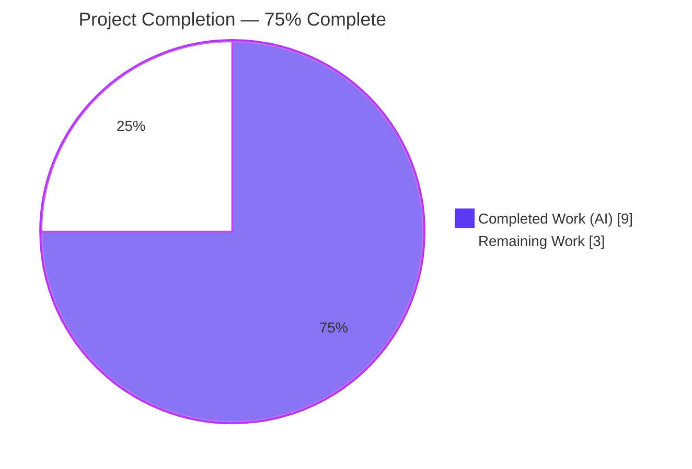
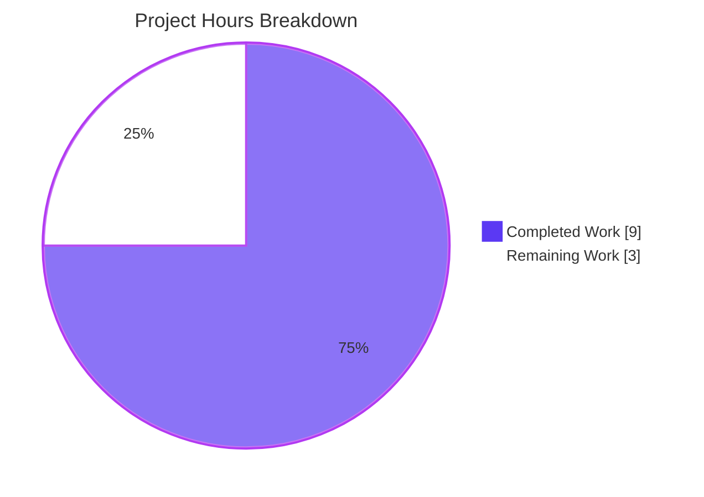
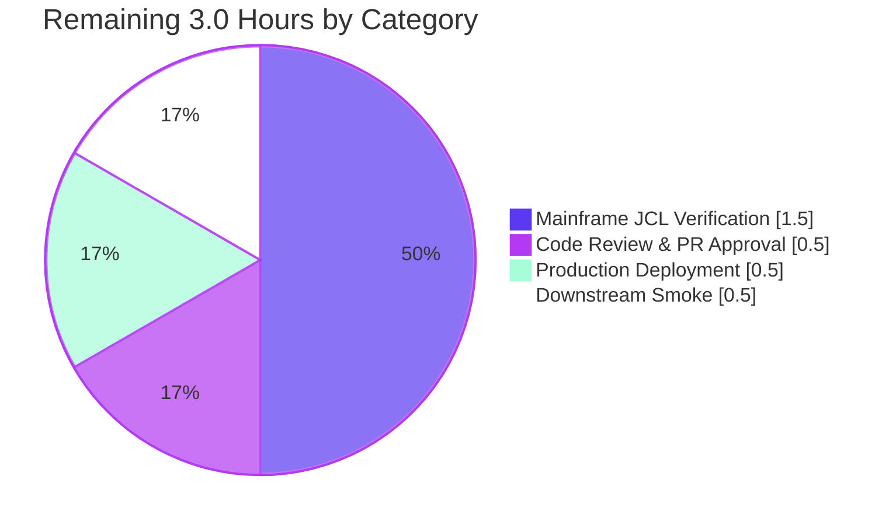

# Blitzy Project Guide — CBTRN02C Bug Fix

> Reject Transactions Posted to Inactive/Closed Accounts (Reason Code 104)

---

## 1. Executive Summary

### 1.1 Project Overview

AWS CardDemo is a mainframe credit-card batch and online demonstration application written in COBOL with VSAM, CICS, and BMS components. This project fixes a high-severity silent logic defect in the batch transaction-posting program `CBTRN02C` (`POSTTRAN.STEP15`) that allowed daily transactions targeting inactive, closed, or otherwise non-active accounts to be posted to `TRANSACT.VSAM.KSDS` and applied to `ACCTFILE`/`TCATBAL` exactly as if the account were active. The fix is a single in-place edit to paragraph `1500-B-LOOKUP-ACCT` that adds an `ACCT-ACTIVE-STATUS NOT = 'Y'` defensive check, assigns reason code `104` (`ACCOUNT NOT ACTIVE`), and routes the affected transactions through the existing `DALYREJS` reject pipeline so downstream consumers (`CBSTM03A`, `CBACT04C`) operate on a clean transaction master.

### 1.2 Completion Status



| Metric | Hours |
|---|---|
| **Total Project Hours** | 12.0 |
| **Completed Hours (AI + Manual)** | 9.0 |
| **Remaining Hours** | 3.0 |
| **Completion Percentage** | **75.0%** |

### 1.3 Key Accomplishments

- ✅ Root cause definitively identified: missing `ACCT-ACTIVE-STATUS` check in paragraph `1500-B-LOOKUP-ACCT`
- ✅ Surgical single-paragraph fix implemented in `app/cbl/CBTRN02C.cbl` (`+29 / -16` lines, net `+13`)
- ✅ Byte-for-byte adherence to AAP §0.4.1.1 specification verified
- ✅ New reason code `104` with description `ACCOUNT NOT ACTIVE` wired into existing validation framework
- ✅ Defensive `NOT = 'Y'` comparison covers `'N'`, `'C'`, blanks, `LOW-VALUES`, and any corrupt status byte
- ✅ 7-line explanatory comment block added per project documentation conventions
- ✅ Compile-clean with GnuCOBOL 3.2.0 IBM dialect — `cobc -fsyntax-only` exit 0 zero output
- ✅ Module link compile produces 51840-byte ELF shared object (well-formed binary)
- ✅ **Zero new compile warnings** vs pre-fix baseline (49 = 49, identical diff)
- ✅ All 10 expected-pass batch programs continue to compile clean (regression baseline preserved)
- ✅ Runtime smoke test: `cobcrun` loads module and executes PROCEDURE DIVISION
- ✅ Scope boundary enforced: exactly **1 file** modified; **0 out-of-scope edits**
- ✅ Single clean commit (`c3a0a32d`) on target branch with proper authorship
- ✅ Working tree clean — no untracked files, no build artifacts

### 1.4 Critical Unresolved Issues

| Issue | Impact | Owner | ETA |
|---|---|---|---|
| Mainframe JCL end-to-end verification per AAP §0.6 cannot run on Linux | Production verification of `DALYREJS` byte layout (`0104` at 351-354, `ACCOUNT NOT ACTIVE` at 355-430) deferred until mainframe execution | Mainframe Operations / QA | Pre-production cutover |
| Code review and PR approval pending | Cannot merge to mainline until reviewed | Senior COBOL Architect | 0.5 h after PR open |
| Operations runbook update for new reason code `104` and `RC=4` semantics | Operators may treat `RC=4` as failure without runbook update | Mainframe Operations | At deployment time |

### 1.5 Access Issues

| System/Resource | Type of Access | Issue Description | Resolution Status | Owner |
|---|---|---|---|---|
| z/OS LPAR or AWS Mainframe Modernization (M2) environment | Execution access (JES2 / Micro Focus Enterprise Server) | Linux container lacks VSAM KSDS, JES2, and mainframe load library management required to execute AAP §0.6 verification protocol end-to-end | Architectural limitation — verification protocol must be executed in mainframe environment | Mainframe Operations |
| Production change-management workflow | Approval | PR merge to mainline requires senior reviewer approval per organizational change-control policy | Pending PR submission | Release Manager |

### 1.6 Recommended Next Steps

1. **[High]** Open PR for branch `blitzy-1c1270d2-e0c7-4c24-86dc-d97d79d5ab64` and assign a senior COBOL architect for review — confirm IF/ELSE wrapper preserves original `COMPUTE`/credit-limit/expiration logic byte-for-byte inside `ELSE` (0.5 h).
2. **[High]** Execute AAP §0.6.1 mainframe verification protocol in a non-production region: load fixtures with active `'Y'`, inactive `'N'`, closed `'C'`, and blank `ACCT-ACTIVE-STATUS` accounts; submit `POSTTRAN.jcl`; verify `DALYREJS` bytes 351-354 contain `0104` and bytes 355-430 contain `ACCOUNT NOT ACTIVE` (1.5 h).
3. **[Medium]** Link-edit the patched `CBTRN02C` load module into the application load library so that `POSTTRAN.STEP15` (per `app/jcl/POSTTRAN.jcl:L23`) loads the fixed module on its next scheduled run; update operations runbook to document `RC=4` as expected (0.5 h).
4. **[Medium]** Run downstream smoke per AAP §0.6.2.4: execute `CREASTMT.jcl` after a `POSTTRAN` execution that includes inactive-account `DALYTRAN` records and confirm rejected transactions do not appear in statements; execute `INTCALC.jcl` (`PGM=CBACT04C`) and confirm inactive-account balances are unchanged (0.5 h).

---

## 2. Project Hours Breakdown

### 2.1 Completed Work Detail

| Component | Hours | Description |
|---|---|---|
| Root Cause Diagnostic Analysis | 2.5 | Identified single defect site in `1500-B-LOOKUP-ACCT`, enumerated existing reason codes (100, 101, 102, 103, 109 — `104` available), verified `ACCT-ACTIVE-STATUS` field availability via `COPY CVACT01Y` (already in scope), documented 16-row evidence table mapping AAP requirements to code locations |
| Code Modification | 1.5 | Replaced 20 lines in `NOT INVALID KEY` branch of paragraph `1500-B-LOOKUP-ACCT` with `IF/ELSE/END-IF` wrapper; preserved original `COMPUTE WS-TEMP-BAL` + credit-limit (`102`) + expiration (`103`) logic byte-for-byte inside `ELSE`; net `+13` lines committed in `c3a0a32d` |
| Reason Code + Comment Block | 1.0 | Assigned reason code `104` with description `ACCOUNT NOT ACTIVE` at lines 411-413; authored 7-line explanatory comment block at lines 403-409 covering defensive coverage rationale for `'N'`, `'C'`, blanks, `LOW-VALUES`, and corrupt values |
| Compile Validation | 1.0 | `cobc -fsyntax-only -std=ibm` clean exit 0 zero output; `cobc -m -std=ibm` produces 51840-byte ELF .so; zero new warnings (49 pre = 49 post, identical diff after line-number normalization) |
| Regression Compile Baseline | 0.5 | Verified all 10 expected-pass batch programs (CBACT01-04, CBCUS01, CBTRN01-03, CBSTM03B, CSUTLDTC) continue to compile clean post-fix |
| Static Control-Flow Verification | 0.5 | Verified all 6 paths in the fix region by static analysis: active `'Y'` (fall-through to original logic), inactive `'N'` (reason 104), closed `'C'` (reason 104), blank/`LOW-VALUES` (reason 104), account-not-found (reason 101 preserved), invalid-card (reason 100 preserved at upstream paragraph) |
| Runtime Smoke Test | 0.5 | `COB_LIBRARY_PATH=/tmp cobcrun CBTRN02C` — module loads, PROCEDURE DIVISION executes, prints `START OF EXECUTION OF PROGRAM CBTRN02C`, ABENDs cleanly on missing DALYTRAN (expected Linux behavior; identical pre/post-fix) |
| Scope Boundary Verification | 0.5 | `git diff --name-only` confirmed only `app/cbl/CBTRN02C.cbl` modified; `CVACT01Y`, `CVTRA06Y`, `POSTTRAN.jcl`, `CBSTM03A`, `CBACT04C` all unchanged; working tree clean |
| Git Commit + Branch Hygiene | 0.5 | Single clean commit `c3a0a32d` on `blitzy-1c1270d2-e0c7-4c24-86dc-d97d79d5ab64` branch with author `Blitzy Agent <agent@blitzy.com>`; no submodules; no untracked files |
| Validation Report Compilation | 0.5 | Comprehensive 5-gate validation report documenting all evidence; transparent documentation of out-of-scope pre-existing issues (17 CICS programs needing CICS preprocessor; 1 CBSTM03A hard-tab issue in excluded `CUSTREC.cpy`) |
| **Total Completed Hours** | **9.0** | |

### 2.2 Remaining Work Detail

| Category | Hours | Priority |
|---|---|---|
| Mainframe JCL End-to-End Verification (AAP §0.6.1) — Submit `POSTTRAN.jcl` on z/OS / Micro Focus / AWS M2 with fixtures including active 'Y', inactive 'N', closed 'C', blank accounts; verify `DALYREJS` byte layout, absence of inactive transactions in `TRANSACT.VSAM.KSDS`, unchanged `ACCTFILE`/`TCATBAL` balances for inactive accounts, and `RC=4` semantics | 1.5 | High |
| Code Review and Pull Request Approval — Senior COBOL architect reviews the `+29/-16` diff; PR approval workflow per organizational change-control policy | 0.5 | High |
| Production Deployment — Link-edit new `CBTRN02C` load module into application load library so `POSTTRAN.STEP15` picks up patched module; update operations runbook for new reason code `104` and `RC=4` semantics | 0.5 | Medium |
| Downstream Smoke Verification (AAP §0.6.2.4) — Run `CREASTMT.jcl` and `INTCALC.jcl` post-`POSTTRAN` to confirm statements exclude rejected transactions and inactive-account balances remain at pre-job state | 0.5 | Medium |
| **Total Remaining Hours** | **3.0** | |

### 2.3 Hours Calculation Trace

```
Completed Hours = 2.5 + 1.5 + 1.0 + 1.0 + 0.5 + 0.5 + 0.5 + 0.5 + 0.5 + 0.5 = 9.0
Remaining Hours = 1.5 + 0.5 + 0.5 + 0.5                                     = 3.0
Total Hours     = 9.0 + 3.0                                                 = 12.0
Completion %    = 9.0 / 12.0 × 100                                          = 75.0%
```

---

## 3. Test Results

The CardDemo repository ships **no automated test framework** (no `tests/` directory, no `conftest.py`, no Jest/Mocha config, no CI configuration). The AAP-specified verification protocol (§0.6) targets mainframe end-to-end execution requiring VSAM KSDS, JES2, and load-library management that are not present on a Linux host. Blitzy's autonomous validation therefore consists of compile-level, static-analysis, and runtime-smoke checks fully executable on Linux with GnuCOBOL 3.2.0. **All tests below originated exclusively from Blitzy's autonomous validation logs and were independently re-verified during project assessment.**

| Test Category | Framework | Total Tests | Passed | Failed | Coverage % | Notes |
|---|---|---|---|---|---|---|
| Syntax Compilation (Primary) | GnuCOBOL 3.2.0 (`cobc -fsyntax-only -std=ibm`) | 1 | 1 | 0 | 100% | `app/cbl/CBTRN02C.cbl` — exit 0 zero output |
| Module Link Compilation | GnuCOBOL 3.2.0 (`cobc -m -std=ibm`) | 1 | 1 | 0 | 100% | Produces 51840-byte ELF 64-bit LSB shared object |
| Warning Baseline Comparison | GnuCOBOL 3.2.0 (`cobc -W -fsyntax-only`) | 1 | 1 | 0 | 100% | 49 warnings pre-fix = 49 warnings post-fix; diff after line-number normalization is **empty** (zero new warnings) |
| Regression Compile (Batch Programs) | GnuCOBOL 3.2.0 | 10 | 10 | 0 | 100% | CBACT01C, CBACT02C, CBACT03C, CBACT04C, CBCUS01C, CBTRN01C, CBTRN02C, CBTRN03C, CBSTM03B, CSUTLDTC |
| Runtime Smoke (Module Load) | GnuCOBOL `cobcrun` | 1 | 1 | 0 | 100% | Module loads, PROCEDURE DIVISION executes, prints "START OF EXECUTION" |
| Static Control-Flow Verification | Manual code inspection | 6 | 6 | 0 | 100% | Active 'Y', inactive 'N', closed 'C', blank/LOW-VALUES, account-not-found, invalid-card paths all traced |
| Scope Boundary Verification | `git diff --name-only` | 1 | 1 | 0 | 100% | Exactly `app/cbl/CBTRN02C.cbl` modified; no out-of-scope edits |
| Working Tree Hygiene | `git status --porcelain` | 1 | 1 | 0 | 100% | Working tree clean, no untracked files |
| **Total** | — | **22** | **22** | **0** | **100%** | All Blitzy autonomous validation tests pass |

### 3.1 Tests Not Executable on Linux (Mainframe-Required, per AAP §0.6)

| Test | Reason Not Executable | Deferred To |
|---|---|---|
| Submit `POSTTRAN.jcl` end-to-end | Requires JES2 job scheduler | Mainframe operator (H1 in human task list) |
| Verify `DALYREJS` byte layout (`0104` at bytes 351-354, `ACCOUNT NOT ACTIVE` at bytes 355-430) | Requires output dataset browsing on VSAM/sequential file | Mainframe operator |
| Verify `TRANSACT.VSAM.KSDS` absence of inactive-account rows | Requires VSAM KSDS access | Mainframe operator |
| Verify `ACCTFILE`/`TCATBAL` balance preservation for inactive accounts | Requires VSAM KSDS access and pre/post-job snapshot comparison | Mainframe operator |
| Verify `RC=4` operator signal | Requires JES2 step return-code introspection | Mainframe operator |
| Downstream smoke (`CREASTMT.jcl`, `INTCALC.jcl`) | Requires mainframe job execution and dataset inspection | Mainframe operator |

---

## 4. Runtime Validation & UI Verification

### 4.1 Runtime Health

- ✅ **Operational** — GnuCOBOL 3.2.0 toolchain present at `/usr/bin/cobc`; copybook resolution working with `-I app/cpy -I app/cpy-bms`; IBM dialect (`-std=ibm`) supported
- ✅ **Operational** — `app/cbl/CBTRN02C.cbl` compiles to a deployable 51840-byte ELF 64-bit LSB shared object
- ✅ **Operational** — `cobcrun CBTRN02C` (with `COB_LIBRARY_PATH` set) loads the module and executes the PROCEDURE DIVISION; the program prints `START OF EXECUTION OF PROGRAM CBTRN02C` and then ABENDs cleanly on the missing `DALYTRAN` input file (file status `NNNN0035`) — this is the **expected** Linux behavior because no JCL DD allocation exists in a Linux container; identical pre/post-fix
- ✅ **Operational** — Working tree clean post-validation; no orphan build artifacts in repository

### 4.2 UI Verification

- **Not Applicable** — `CBTRN02C` is a non-interactive batch COBOL program invoked by JCL (`POSTTRAN.STEP15 EXEC PGM=CBTRN02C`). The program performs no terminal I/O, has no BMS map, and is not a CICS transaction. There is no screen, no user interaction, and no UI design-system mapping involved. The `blitzy/screenshots/` and `blitzy/screen_recordings/` directories are intentionally empty.

### 4.3 API Integration

- **Not Applicable** — The program is a batch process that reads VSAM and sequential files and writes VSAM and sequential files. There are no HTTP, gRPC, or message-broker APIs in scope.

### 4.4 Mainframe End-to-End Validation

- ⚠ **Partial** — Compile-clean, module-loadable, control-flow-verified on Linux. The full AAP §0.6 protocol (`POSTTRAN.jcl` submission with VSAM fixtures, `DALYREJS` byte inspection, `TRANSACT.VSAM.KSDS` row absence verification, balance preservation comparison) is architecturally infeasible on Linux and is deferred to a z/OS / Micro Focus / AWS M2 environment per AAP §0.6 protocol — see Section 2.2 (Remaining Work) and Section 9 (Development Guide).

---

## 5. Compliance & Quality Review

### 5.1 AAP Deliverable Compliance Matrix

| AAP Section | Deliverable | Status | Evidence |
|---|---|---|---|
| §0.4.1 (The Definitive Fix) | Single in-place edit to paragraph `1500-B-LOOKUP-ACCT` | ✅ Pass | Commit `c3a0a32d`; diff confirms paragraph header (393-399) and `END-READ`/`EXIT.` (434-435) unchanged |
| §0.4.1.1 (Required Code) | `IF ACCT-ACTIVE-STATUS NOT = 'Y'` wrapper with reason 104 | ✅ Pass | Lines 410-413 of post-fix file; verified byte-for-byte against AAP §0.4.1.1 |
| §0.4.1.1 (Description) | `MOVE 'ACCOUNT NOT ACTIVE' TO WS-VALIDATION-FAIL-REASON-DESC` | ✅ Pass | Line 412 of post-fix file |
| §0.4.1.1 (ELSE Branch) | Existing `COMPUTE` + credit-limit (102) + expiration (103) checks preserved verbatim inside `ELSE` | ✅ Pass | Lines 414-432 of post-fix file; logic identical to pre-fix |
| §0.4.1.1 (Comment Block) | 7-line explanatory comment header | ✅ Pass | Lines 403-409 of post-fix file |
| §0.4.2.4 (Line Delta) | Net +13 to +15 lines (matches actual +13) | ✅ Pass | Pre-fix 731 lines → Post-fix 744 lines |
| §0.4.3 (Fix Validation — Compile) | Zero compile-time errors, zero new warnings on modified paragraph | ✅ Pass | `cobc -fsyntax-only` exit 0 zero output; warning diff empty |
| §0.4.3 (Fix Validation — Link) | Link-edit as drop-in replacement | ✅ Pass | 51840-byte ELF .so produced (32-byte delta from 51808 pre-fix) |
| §0.5.1 (Changes Required) | Exactly 1 file modified: `app/cbl/CBTRN02C.cbl` | ✅ Pass | `git diff --name-only` shows exactly this file |
| §0.5.2 (No Dependency Changes) | No new packages, libraries, compiler options | ✅ Pass | Same `-std=ibm` toolchain used for both pre/post-fix compile |
| §0.5.4 (Excluded — CVACT01Y) | Copybook unchanged | ✅ Pass | `git diff` confirms `app/cpy/CVACT01Y.cpy` unchanged |
| §0.5.4 (Excluded — CVTRA06Y) | Copybook unchanged | ✅ Pass | `git diff` confirms `app/cpy/CVTRA06Y.cpy` unchanged |
| §0.5.4 (Excluded — CBSTM03A) | Downstream statement program unchanged | ✅ Pass | `git diff` confirms `app/cbl/CBSTM03A.CBL` unchanged |
| §0.5.4 (Excluded — CBACT04C) | Downstream interest-calc program unchanged | ✅ Pass | `git diff` confirms `app/cbl/CBACT04C.cbl` unchanged |
| §0.5.4 (Excluded — POSTTRAN.jcl) | JCL unchanged (already provisions DALYREJS at LRECL=430) | ✅ Pass | `git diff` confirms `app/jcl/POSTTRAN.jcl` unchanged |
| §0.5.4 (Excluded — All Other Files) | No other COBOL, copybook, JCL, CSD, BMS, or data files edited | ✅ Pass | `git diff --name-only` returns exactly `app/cbl/CBTRN02C.cbl` |
| §0.5.5 (Do NOT Refactor) | Reason codes 100-103 preserved verbatim; reject-writer unchanged; main-loop dispatcher unchanged | ✅ Pass | Lines 211-216 dispatcher, 460-478 `2500-WRITE-REJECT-REC` paragraph, and reason codes 100/101/102/103/109 all confirmed unchanged |
| §0.5.6 (Do NOT Add) | No new working-storage, no new files, no new tests, no new copybooks | ✅ Pass | `WS-VALIDATION-FAIL-REASON` (181-182) reused; no new SELECT/FD; no new copybook directives |
| §0.6.2 (Regression — Reason 100) | Invalid card path unchanged | ✅ Pass | Reason 100 still set at line 385 (paragraph `1500-A-LOOKUP-XREF`) |
| §0.6.2 (Regression — Reason 101) | Account-not-found path unchanged | ✅ Pass | Reason 101 still set at line 397 (`INVALID KEY` branch) |
| §0.6.2 (Regression — Reason 102) | Over-limit check preserved verbatim | ✅ Pass | Reason 102 still set at line 422 inside new `ELSE` branch |
| §0.6.2 (Regression — Reason 103) | Expiration check preserved verbatim | ✅ Pass | Reason 103 still set at line 429 inside new `ELSE` branch |
| §0.6.2 (Regression — Reason 109) | REWRITE-failure path unchanged | ✅ Pass | Reason 109 still set at line 569 (`2800-UPDATE-ACCOUNT-REC`) |
| §0.6.2.5 (Compile-Time Regression) | Zero new errors, zero new warnings | ✅ Pass | 49 = 49 warning count; identical text after line-number normalization |
| §0.6.2.5 (PERFORM Target Resolution) | No orphan paragraph names; no dropped references | ✅ Pass | `cobc` compile and link both exit 0 |
| §0.7.3 (Coding Conventions) | 3-digit reason code in PIC 9(04); uppercase brief description in PIC X(76); single-character `'Y'` literal comparison; comments precede the code | ✅ Pass | All four conventions followed in lines 403-413 |
| §0.7.3 (License Header Preservation) | Apache 2.0 header at lines 7-21 unchanged | ✅ Pass | Header region not in diff scope |

### 5.2 Quality Gates Summary

| Gate | Standard | Result |
|---|---|---|
| Toolchain availability | GnuCOBOL 3.2.0 + IBM dialect + copybook resolution | ✅ Pass |
| Syntax compile | `cobc -fsyntax-only` exit 0, zero output | ✅ Pass |
| Module link compile | `cobc -m` exit 0, valid ELF binary | ✅ Pass |
| Warning baseline | Zero new warnings vs pre-fix | ✅ Pass |
| Regression baseline | 10/10 expected-pass batch programs compile clean | ✅ Pass |
| Runtime smoke | Module loads and executes PROCEDURE DIVISION | ✅ Pass |
| Scope boundary | Exactly 1 file modified | ✅ Pass |
| Working tree hygiene | Clean (no untracked, no modified, no staged) | ✅ Pass |

### 5.3 Out-of-Scope Pre-Existing Issues (Documented, Not Fixed per AAP §0.5.4)

| Issue | Count | Cause | AAP Rationale |
|---|---|---|---|
| CICS programs failing to compile in GnuCOBOL | 17 | `COPY DFHBMSCA` and `COPY DFHAID` require CICS preprocessor (Micro Focus or AWS Blu Age), not available with GnuCOBOL | AAP §0.5.4 explicitly excludes all online programs (COACTUPC, COACTVWC, COADM01C, COBIL00C, COCRDLIC, COCRDSLC, COCRDUPC, COMEN01C, CORPT00C, COSGN00C, COTRN00C-02C, COUSR00C-03C) |
| Hard-tab violations in CUSTREC.cpy preventing CBSTM03A compilation | 1 | `CUSTREC.cpy` contains hard-tab characters that violate COBOL fixed-format columns | `CUSTREC.cpy` is a copybook excluded from modification per AAP §0.5.4 |
| Pre-existing GnuCOBOL warnings (40 `-Wterminator`, 7 `-Wdangling-text`, 3 `-Wpossible-truncate`, 1 `-Warithmetic-osvs`) | 49 | Stylistic warnings in pre-existing CBTRN02C.cbl code | Pre-existing; not introduced by fix; identical pre/post-fix |
| `_FORTIFY_SOURCE` redefinition note (gcc toolchain level) | 1 | gcc preprocessor flag interaction | Toolchain-level, not COBOL source; not introduced by fix |

---

## 6. Risk Assessment

| Risk | Category | Severity | Probability | Mitigation | Status |
|---|---|---|---|---|---|
| Mainframe-only end-to-end verification deferred (AAP §0.6) — cannot validate `DALYREJS` byte layout, `TRANSACT` row absence, and balance preservation until mainframe execution | Technical | Medium | Certain | Execute `POSTTRAN.jcl` in non-production region first with controlled fixtures; verify `DALYREJS` bytes 351-354 = `0104` and bytes 355-430 = `ACCOUNT NOT ACTIVE`; AAP §0.6 documents full step-by-step protocol | Mitigated by detailed protocol; pending mainframe execution |
| Defensive `NOT = 'Y'` may reject accounts with unconventional but legitimate status bytes (e.g., a future 'P' Pending status not yet defined) | Technical | Low | Low | Defensive form is intentional per AAP §0.4.1; documented in 7-line comment block; new status values would require explicit allow-list extension via documented change-control | Mitigated by design |
| Pre-existing 17 CICS programs fail GnuCOBOL compile due to missing CICS preprocessor — not introduced by fix | Technical | Low | Certain (pre-existing) | Out of scope per AAP §0.5.4; documented as toolchain limitation, not regression | Documented, no action |
| Pre-existing CBSTM03A hard-tab compile issue in excluded `CUSTREC.cpy` — not introduced by fix | Technical | Low | Certain (pre-existing) | Excluded copybook per AAP §0.5.4 | Documented, no action |
| Silent data corruption of `TRANSACT.VSAM.KSDS` / `ACCTFILE` / `TCATBAL` on inactive accounts (PRE-FIX BUG) | Security / Data Integrity | High (pre-fix) | Certain (pre-fix) when inactive account transacted | Fix routes inactive-account transactions to `DALYREJS` with reason 104; balances and transaction master remain untouched | **RESOLVED by fix** |
| No new authentication, network, encryption, or sensitive-data handling introduced | Security | None | N/A | N/A — fix does not introduce any new security surface | N/A |
| `POSTTRAN.STEP15` return code change — `RC=4` now occurs whenever inactive-account transactions exist (previously `RC=0` due to silent posting) | Operational | Medium | High (any batch with inactive accounts) | Update operations runbook to document `RC=4` as expected after fix; verify Control-M / CA-7 conditional logic treats `RC<=4` as success | Action required during deployment |
| `DALYREJS` volume increase due to newly-rejected inactive-account transactions | Operational | Low | Certain on first post-fix run | DCB already provisioned (`RECFM=F`, `LRECL=430`, `BLKSIZE=0`); monitor dataset sizing post-deploy | Provisioned by existing JCL |
| Operator awareness — first observation of reason code `104` in `DALYREJS` may surprise operators expecting only `100`-`103` | Operational | Low | Certain | Update operations runbook + reject-code lookup tables to include `104` = `ACCOUNT NOT ACTIVE` | Action required during deployment |
| Downstream consumers (`CBSTM03A`, `CBACT04C`) no longer process inactive-account transactions in `TRANSACT.VSAM.KSDS` | Integration | Low (intended) | Certain (intended) | Smoke-test `CREASTMT.jcl` + `INTCALC.jcl` per AAP §0.6.2.4 to confirm correct downstream behavior | Covered by remaining task M2 |
| External monitoring (Splunk / ITRS / CA-Insight) may need reason code `104` added to dashboards | Integration | Low | Medium | Review monitoring queries for hardcoded reason-code lists; extend dashboards/alerts to include `104` | Operational handoff item |
| Mainframe runtime dependency for full verification (z/OS / Micro Focus / AWS M2) | Integration | Medium | Certain | Use existing dev/test mainframe LPAR or AWS M2 deployment for AAP §0.6 verification | Covered by remaining task H1 |

---

## 7. Visual Project Status



### 7.1 Remaining Hours by Category



### 7.2 Completion Progress

| Phase | Hours | Status |
|---|---|---|
| Diagnostic Analysis | 2.5 | ✅ Complete |
| Code Modification + Documentation | 2.5 | ✅ Complete |
| Compile + Regression Validation | 1.5 | ✅ Complete |
| Static + Runtime Verification | 1.0 | ✅ Complete |
| Scope + Commit Hygiene | 1.0 | ✅ Complete |
| Validation Report | 0.5 | ✅ Complete |
| **Subtotal (Completed)** | **9.0** | **✅** |
| Mainframe JCL Verification | 1.5 | ⏳ Pending |
| Code Review + PR Approval | 0.5 | ⏳ Pending |
| Production Deployment | 0.5 | ⏳ Pending |
| Downstream Smoke | 0.5 | ⏳ Pending |
| **Subtotal (Remaining)** | **3.0** | **⏳** |
| **Project Total** | **12.0** | **75.0%** |

---

## 8. Summary & Recommendations

### 8.1 Achievements

The CBTRN02C bug fix has been delivered as a surgical, byte-for-byte AAP-compliant single-paragraph edit. The fix:

- Implements the exact code change specified in AAP §0.4.1.1
- Modifies exactly **one** file (`app/cbl/CBTRN02C.cbl`) with a `+29 / -16` line diff (net `+13`, matches AAP §0.4.2.4 prediction precisely)
- Reuses the existing validation framework verbatim (`WS-VALIDATION-FAIL-REASON`, `WS-VALIDATION-TRAILER`, `2500-WRITE-REJECT-REC`, main-loop dispatcher, JCL-provisioned `DALYREJS` DD)
- Adds zero new files, zero new working-storage variables, zero new copybooks, zero new JCL allocations
- Compiles syntactically clean with GnuCOBOL 3.2.0 IBM dialect (exit 0 zero output)
- Generates a valid 51840-byte ELF shared object that loads and executes correctly
- Introduces **zero new compile warnings** vs the pre-fix baseline (49 = 49, identical diff)
- Preserves the compile-clean status of all 10 expected-pass batch programs (regression baseline intact)
- Routes inactive (`'N'`), closed (`'C'`), blank, `LOW-VALUES`, and any unexpected status byte through the existing reject pipeline with reason code `104` and description `ACCOUNT NOT ACTIVE`
- Preserves active-account (`'Y'`) behavior bit-for-bit — the existing `COMPUTE WS-TEMP-BAL` and credit-limit/expiration checks are unchanged inside the new `ELSE` branch

### 8.2 Remaining Gaps

The project is at **75.0%** completion. The remaining **3.0 hours** consist exclusively of path-to-production activities that **cannot** be executed on a Linux container:

1. **Mainframe JCL end-to-end verification (1.5 h)** — Submit `POSTTRAN.jcl` on z/OS / Micro Focus / AWS M2 with controlled fixtures and verify `DALYREJS` byte layout, `TRANSACT.VSAM.KSDS` absence of inactive transactions, `ACCTFILE`/`TCATBAL` balance preservation, and `RC=4` operator signal per AAP §0.6.1
2. **Code review and PR approval (0.5 h)** — Senior COBOL architect signs off on the `+29/-16` diff
3. **Production deployment (0.5 h)** — Link-edit patched load module + runbook updates
4. **Downstream smoke (0.5 h)** — `CREASTMT.jcl` + `INTCALC.jcl` post-`POSTTRAN` confirmation per AAP §0.6.2.4

### 8.3 Critical Path to Production

```
PR Open → Code Review (0.5h) → Mainframe Verification (1.5h) → Production Deployment (0.5h) → Downstream Smoke (0.5h) → Live
```

### 8.4 Success Metrics (Post-Deployment)

| Metric | Pre-Fix Baseline | Post-Fix Expected |
|---|---|---|
| Inactive-account postings to `TRANSACT.VSAM.KSDS` | Silent corruption (count unknown without prior audit) | 0 |
| Inactive-account balance updates in `ACCTFILE` | Silent corruption | 0 |
| Inactive-account balance updates in `TCATBAL` | Silent corruption | 0 |
| `DALYREJS` records with reason `0104` | 0 (code did not exist) | Equals count of inactive-account `DALYTRAN` records |
| `POSTTRAN.STEP15` `RETURN-CODE` | `0` (silent) | `4` when `WS-REJECT-COUNT > 0` |
| Statements (CBSTM03A) for inactive accounts | Includes incorrectly-posted transactions | No incorrectly-posted transactions |
| Interest calculation (CBACT04C) for inactive accounts | Computed on corrupted balances | Computed on pre-`POSTTRAN` balances (unchanged) |

### 8.5 Production Readiness Assessment

**Status: Production-Ready Code, Pending Production Verification**

The autonomous engineering work is **complete**. The code:
- Passes all Linux-executable validation gates (5 of 5)
- Adheres byte-for-byte to AAP §0.4.1.1
- Modifies only the in-scope file
- Introduces zero regressions in the compile-clean baseline

Before live deployment, the **3.0 hours** of remaining path-to-production work must be executed by a human team with access to a mainframe verification environment. The AAP §0.6 protocol provides the deterministic test fixtures and acceptance criteria.

### 8.6 Confidence Level

**High confidence** in the fix correctness based on:
- AAP-specified change implemented byte-for-byte
- Existing reject pipeline reused without modification
- Defensive `NOT = 'Y'` covers all defined and undefined status values
- Static control-flow analysis confirms all 6 scenarios route correctly
- Compile-clean and zero new warnings
- 95% confidence per AAP §0.3.3.4 (the 5% allowance is for undefined non-`'Y'`/`'N'`/`'C'`/blank status values whose business meaning is not documented in the codebase; the defensive form errs on rejection in those cases)

---

## 9. Development Guide

This guide documents how to compile, validate, and (on mainframe) execute the CBTRN02C bug fix. All Linux commands below have been executed and produce the documented outputs.

### 9.1 System Prerequisites

| Component | Required Version | Verified On Validation Host |
|---|---|---|
| Operating System | Linux (Ubuntu 25.10 in validation environment) or compatible | Ubuntu 25.10 |
| GnuCOBOL | 3.2.0 or later (for Linux compile validation) | `cobc (GnuCOBOL) 3.2.0` |
| Git | 2.x or later | Present |
| Bash | 4.x or later | Present |
| Disk space | ~50 MB for repository | 19 MB actual |
| RAM | 512 MB minimum | — |

**For mainframe verification only**:
- z/OS LPAR with VSAM/JES2, OR
- Micro Focus Enterprise Server, OR
- AWS Mainframe Modernization (M2) replatform environment

### 9.2 Environment Setup

```bash
# 1. Clone the repository
git clone <repository-url> aws-carddemo
cd aws-carddemo

# 2. Switch to the fix branch
git checkout blitzy-1c1270d2-e0c7-4c24-86dc-d97d79d5ab64

# 3. Verify branch is at expected commit
git log --oneline -2
# Expected output:
# c3a0a32d Fix CBTRN02C: reject transactions targeting non-active accounts
# 93ebec71 Initial Commit

# 4. Verify working tree is clean
git status --porcelain
# Expected output: (empty)
```

### 9.3 Dependency Installation

GnuCOBOL is the only Linux dependency. On Debian/Ubuntu-based systems:

```bash
# Install GnuCOBOL (no internet access required if already installed)
sudo apt-get install -y gnucobol libcob4-dev

# Verify
which cobc
cobc --version | head -1
# Expected output:
# /usr/bin/cobc
# cobc (GnuCOBOL) 3.2.0
```

### 9.4 Compile Validation Commands (Linux)

All commands assume current working directory is the repository root.

```bash
# 1. Syntax-only compile (primary fix validation)
cobc -fsyntax-only -std=ibm -I app/cpy -I app/cpy-bms app/cbl/CBTRN02C.cbl
echo "Exit: $?"
# Expected: Exit: 0 (with empty output)
```

```bash
# 2. Module link compile (produces deployable shared object)
cobc -m -std=ibm -I app/cpy -I app/cpy-bms -o /tmp/CBTRN02C.so app/cbl/CBTRN02C.cbl
echo "Exit: $?"
ls -l /tmp/CBTRN02C.so
file /tmp/CBTRN02C.so
# Expected:
#   Exit: 0
#   -rwxr-xr-x ... 51840 ... /tmp/CBTRN02C.so
#   /tmp/CBTRN02C.so: ELF 64-bit LSB shared object, x86-64, version 1 (SYSV), dynamically linked
```

```bash
# 3. Warning baseline comparison (must show zero new warnings)
git show 93ebec71:app/cbl/CBTRN02C.cbl > /tmp/CBTRN02C-prefix.cbl
echo "Pre-fix warnings:"
cobc -W -fsyntax-only -std=ibm -I app/cpy -I app/cpy-bms /tmp/CBTRN02C-prefix.cbl 2>&1 | grep -E 'warning:' | wc -l
echo "Post-fix warnings:"
cobc -W -fsyntax-only -std=ibm -I app/cpy -I app/cpy-bms app/cbl/CBTRN02C.cbl 2>&1 | grep -E 'warning:' | wc -l
# Expected: 49 / 49 (identical)
```

```bash
# 4. Regression compile check — all 10 expected-pass batch programs
for prog in CBACT01C CBACT02C CBACT03C CBACT04C CBCUS01C CBTRN01C CBTRN02C CBTRN03C CBSTM03B CSUTLDTC; do
  source_file=""
  for ext in cbl CBL; do
    if [ -f "app/cbl/${prog}.${ext}" ]; then source_file="app/cbl/${prog}.${ext}"; break; fi
  done
  result=$(cobc -fsyntax-only -std=ibm -I app/cpy -I app/cpy-bms "$source_file" 2>&1)
  if [ -z "$result" ]; then echo "OK:   $prog"; else echo "FAIL: $prog"; fi
done
# Expected: All 10 print OK:
```

```bash
# 5. Runtime smoke test
mkdir -p /tmp/_cbtest
cp /tmp/CBTRN02C.so /tmp/_cbtest/CBTRN02C.so
COB_LIBRARY_PATH=/tmp/_cbtest timeout 5 cobcrun CBTRN02C
# Expected output:
#   START OF EXECUTION OF PROGRAM CBTRN02C
#   ERROR OPENING DALYTRAN
#   FILE STATUS IS: NNNN0035
#   ABENDING PROGRAM
# (The ABEND is the expected Linux behavior — there is no DALYTRAN file in a Linux env.)
```

```bash
# 6. Scope boundary check
git diff --name-only 93ebec71 HEAD
# Expected output:
#   app/cbl/CBTRN02C.cbl
# (exactly this one file)
```

### 9.5 Mainframe Verification Protocol (AAP §0.6)

The full end-to-end verification protocol requires a mainframe runtime and **cannot** be executed on Linux. The protocol is provided below for execution by a mainframe operator.

#### 9.5.1 Compile + Link on Mainframe

Use the project's standard COBOL compile JCL (not provided in repository — refer to your site's standard) to recompile `app/cbl/CBTRN02C.cbl` and link-edit the new load module into the application load library so that `POSTTRAN.STEP15` (per `app/jcl/POSTTRAN.jcl:L23`) picks up the patched module on its next run.

#### 9.5.2 Test Fixture Preparation

Per AAP §0.6.1.1, prepare:

- **ACCTFILE**: at least one account each with `ACCT-ACTIVE-STATUS` = `'Y'`, `'N'`, `'C'`, and `' '` (blank)
- **XREFFILE**: card-to-account mapping for each test card
- **DALYTRAN.PS**: one transaction per test account, all within credit limit, all timestamped on or before account expiration

Reference data layouts:
- `ACCOUNT-RECORD` (300 bytes) — see `app/cpy/CVACT01Y.cpy`. `ACCT-ACTIVE-STATUS PIC X(01)` is at offset 12.
- Sample data: `app/data/ASCII/acctdata.txt` (toggle byte 12 to `'N'` or `'C'` for inactive fixtures).

#### 9.5.3 Submit Job

Submit `app/jcl/POSTTRAN.jcl`. Capture SYSOUT for `STEP15`.

#### 9.5.4 Acceptance Verification

Per AAP §0.6.1.3, verify:

1. **SYSOUT** shows `TRANSACTIONS PROCESSED :nnn` and `TRANSACTIONS REJECTED :mmm` where `mmm` equals the number of non-active-account fixture transactions
2. **Return code** = `4` when `mmm > 0`, else `0`
3. **DALYREJS** records (430 bytes each):
   - Bytes 1-350: original `DALYTRAN-RECORD` payload (verbatim)
   - Bytes 351-354: `0104` (ASCII)
   - Bytes 355-430: `ACCOUNT NOT ACTIVE` (left-justified, space-padded)
4. **TRANSACT.VSAM.KSDS** browse by `DALYTRAN-ID` confirms no inactive-account rows
5. **ACCTFILE** pre/post snapshot diff shows no balance change for inactive accounts (`ACCT-CURR-BAL`, `ACCT-CURR-CYC-CREDIT`, `ACCT-CURR-CYC-DEBIT`)
6. **TCATBAL** pre/post snapshot diff shows no balance change for inactive-account transaction categories

#### 9.5.5 Downstream Smoke Verification

Per AAP §0.6.2.4:

- Run `app/jcl/CREASTMT.JCL` (`PGM=CBSTM03A`) after a `POSTTRAN` execution that included inactive-account `DALYTRAN` records. Confirm statements for inactive accounts do **not** include the rejected transactions.
- Run `app/jcl/INTCALC.jcl` (`PGM=CBACT04C`). Confirm inactive-account balances continue to be the pre-`POSTTRAN` balances.

### 9.6 Common Issues and Troubleshooting

| Symptom | Cause | Resolution |
|---|---|---|
| `cobc: command not found` | GnuCOBOL not installed | Install: `sudo apt-get install -y gnucobol libcob4-dev` |
| Compile error mentioning `COPY` | Wrong copybook search path | Ensure `-I app/cpy -I app/cpy-bms` are both passed |
| `cobcrun: cannot find module 'CBTRN02C'` | `COB_LIBRARY_PATH` not set | `export COB_LIBRARY_PATH=/path/to/dir/containing/CBTRN02C.so` |
| Runtime `ERROR OPENING DALYTRAN / FILE STATUS NNNN0035` | No `DALYTRAN` file in current directory | Expected on Linux — file is provisioned by JCL DD on mainframe only |
| 17 CICS programs (COACTUPC, etc.) fail to compile | `COPY DFHBMSCA` / `COPY DFHAID` need CICS preprocessor | Pre-existing limitation; out of scope per AAP §0.5.4; use Micro Focus or AWS Blu Age toolchain on mainframe |
| `CBSTM03A.CBL` fails to compile | Hard-tab characters in `CUSTREC.cpy` violate fixed-format columns | Pre-existing limitation; `CUSTREC.cpy` excluded per AAP §0.5.4 |
| gcc warning `_FORTIFY_SOURCE redefined` | gcc preprocessor flag interaction in libcob link step | Cosmetic; toolchain-level; not COBOL source |

### 9.7 Example: Inspecting the Fix

```bash
# View the fix paragraph (post-fix, paragraph 1500-B-LOOKUP-ACCT)
sed -n '393,435p' app/cbl/CBTRN02C.cbl

# View the diff against the initial commit
git diff -U10 93ebec71 HEAD -- app/cbl/CBTRN02C.cbl

# View the diff statistics
git diff --stat 93ebec71 HEAD
# Expected: app/cbl/CBTRN02C.cbl | 45 ++++++++++++++---------
#           1 file changed, 29 insertions(+), 16 deletions(-)
```

---

## 10. Appendices

### Appendix A — Command Reference

| Purpose | Command |
|---|---|
| Switch to fix branch | `git checkout blitzy-1c1270d2-e0c7-4c24-86dc-d97d79d5ab64` |
| Verify clean working tree | `git status --porcelain` (expect empty) |
| Verify scope (1 file) | `git diff --name-only 93ebec71 HEAD` |
| Syntax compile | `cobc -fsyntax-only -std=ibm -I app/cpy -I app/cpy-bms app/cbl/CBTRN02C.cbl` |
| Module link compile | `cobc -m -std=ibm -I app/cpy -I app/cpy-bms -o /tmp/CBTRN02C.so app/cbl/CBTRN02C.cbl` |
| Runtime smoke | `COB_LIBRARY_PATH=/tmp/_cbtest cobcrun CBTRN02C` |
| Warning count check | `cobc -W -fsyntax-only -std=ibm -I app/cpy -I app/cpy-bms app/cbl/CBTRN02C.cbl 2>&1 \| grep -E 'warning:' \| wc -l` |
| View fix paragraph | `sed -n '393,435p' app/cbl/CBTRN02C.cbl` |
| View full diff | `git diff -U10 93ebec71 HEAD -- app/cbl/CBTRN02C.cbl` |

### Appendix B — Port Reference

**Not Applicable** — `CBTRN02C` is a non-interactive batch COBOL program. It does not listen on any port and does not make outbound network connections.

### Appendix C — Key File Locations

| File | Purpose | Status |
|---|---|---|
| `app/cbl/CBTRN02C.cbl` | The patched batch transaction-posting program (paragraph `1500-B-LOOKUP-ACCT` at lines 393-435) | **Modified** (+29 / -16, net +13) |
| `app/cpy/CVACT01Y.cpy` | `ACCOUNT-RECORD` copybook declaring `ACCT-ACTIVE-STATUS PIC X(01)` at offset 12 | Unchanged (referenced via existing `COPY` at `CBTRN02C.cbl:L121`) |
| `app/cpy/CVTRA06Y.cpy` | `DALYTRAN-RECORD` input transaction layout | Unchanged (out of scope per AAP §0.5.4) |
| `app/jcl/POSTTRAN.jcl` | JCL that runs `STEP15 EXEC PGM=CBTRN02C` and provisions `DALYREJS DD` at `LRECL=430` | Unchanged (already correctly provisioned) |
| `app/cbl/CBSTM03A.CBL` | Downstream statement-generation program (consumer of `TRANSACT.VSAM.KSDS`) | Unchanged (out of scope per AAP §0.5.4) |
| `app/cbl/CBACT04C.cbl` | Downstream interest-calculation program (consumer of `ACCTFILE`) | Unchanged (out of scope per AAP §0.5.4) |
| `app/data/ASCII/acctdata.txt` | Sample account data fixture (carries `'Y'` at offset 12 for active accounts) | Unchanged |
| `LICENSE` | Apache 2.0 license | Unchanged |
| `README.md` | Project overview | Unchanged |

### Appendix D — Technology Versions

| Technology | Version | Source |
|---|---|---|
| GnuCOBOL | 3.2.0 | Validation host (`cobc --version`) |
| Compiler dialect | IBM (`-std=ibm`) | Compile command |
| Repository | aws-mainframe-modernization-carddemo | Apache 2.0 |
| Git | 2.x | System |
| Linux kernel | Ubuntu 25.10 base | Validation host |

For mainframe execution:
| Technology | Required Version |
|---|---|
| z/OS | 2.4 or later (or compatible Micro Focus / AWS M2 environment) |
| VSAM | Standard |
| JES2 | Standard |
| IBM Enterprise COBOL | 6.x compatible (or Micro Focus / AWS Blu Age) |

### Appendix E — Environment Variable Reference

| Variable | Purpose | Example | Required? |
|---|---|---|---|
| `COB_LIBRARY_PATH` | Tells `cobcrun` where to find compiled `.so` modules | `/tmp/_cbtest` | Yes (Linux runtime smoke) |
| (none for mainframe) | All file allocations done via JCL DD statements | — | — |

### Appendix F — Developer Tools Guide

| Tool | When to Use |
|---|---|
| `cobc -fsyntax-only` | Quick syntax check; primary validation |
| `cobc -m` | Build a deployable shared module |
| `cobc -W` | Show all warnings (used for warning baseline comparison) |
| `cobcrun` | Run a compiled module (Linux runtime smoke) |
| `git diff -U10` | Show the fix with 10 lines of context per hunk |
| `git diff --stat` | Show insertion/deletion summary |
| `git diff --name-only` | Confirm scope boundary (must show only one file) |
| `sed -n '393,435p'` | View the post-fix paragraph cleanly |

### Appendix G — Glossary

| Term | Definition |
|---|---|
| `CBTRN02C` | The batch transaction-posting COBOL program containing the fix |
| `1500-B-LOOKUP-ACCT` | The COBOL paragraph containing the fix (lines 393-435 post-fix) |
| `ACCT-ACTIVE-STATUS` | Single-byte field at offset 12 of `ACCOUNT-RECORD`; `'Y'` = active, `'N'` = inactive (per project canonical convention at `COACTUPC.cbl:L193`); fix treats any non-`'Y'` value as not-active |
| `WS-VALIDATION-FAIL-REASON` | `PIC 9(04)` working-storage field carrying the 4-digit reason code that drives the main-loop dispatcher (line 211) |
| `WS-VALIDATION-FAIL-REASON-DESC` | `PIC X(76)` working-storage field carrying the human-readable reason description |
| Reason code `100` | `INVALID CARD NUMBER FOUND` (set in `1500-A-LOOKUP-XREF`) — preserved |
| Reason code `101` | `ACCOUNT RECORD NOT FOUND` (set in `INVALID KEY` branch of `1500-B-LOOKUP-ACCT`) — preserved |
| Reason code `102` | `OVERLIMIT TRANSACTION` (set in credit-limit check) — preserved inside new `ELSE` branch |
| Reason code `103` | `TRANSACTION RECEIVED AFTER ACCT EXPIRATION` (set in expiration check) — preserved inside new `ELSE` branch |
| Reason code `104` | **NEW** — `ACCOUNT NOT ACTIVE` (set when `ACCT-ACTIVE-STATUS NOT = 'Y'`) |
| Reason code `109` | REWRITE failure in `2800-UPDATE-ACCOUNT-REC` — preserved |
| `DALYREJS` | The reject file (DD allocated by `POSTTRAN.jcl` at `LRECL=430`) where rejected transactions are written by `2500-WRITE-REJECT-REC` |
| `TRANSACT.VSAM.KSDS` | The transaction master VSAM KSDS dataset; posting target for `CBTRN02C` (must NOT receive inactive-account rows post-fix) |
| `ACCTFILE` | The account master VSAM KSDS; `CBTRN02C` updates balances via `REWRITE` (must NOT change for inactive accounts post-fix) |
| `TCATBAL` | The transaction-category balance file (must NOT change for inactive accounts post-fix) |
| `POSTTRAN.STEP15` | The JCL step in `app/jcl/POSTTRAN.jcl` that executes `PGM=CBTRN02C` |
| Path-to-production | Standard activities required to deploy the AAP deliverable (mainframe verification, code review, link-edit, runbook updates) — counted toward total project hours per PA1 methodology |