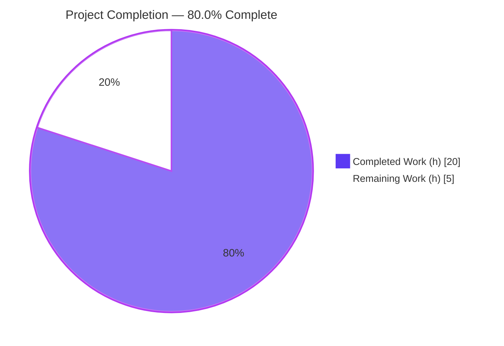
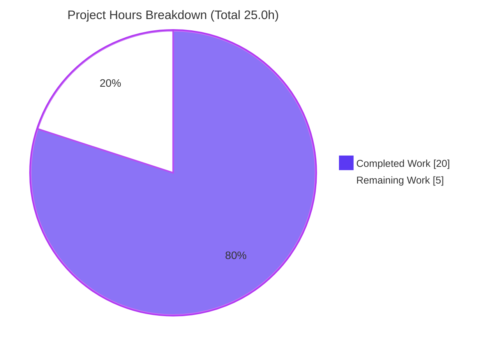
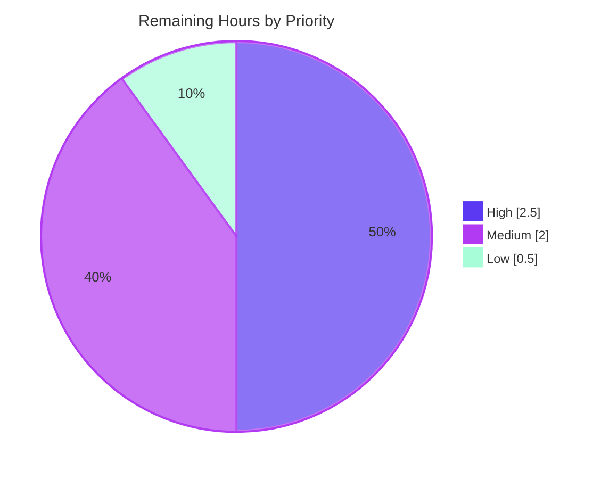

# Blitzy Project Guide — AWS CardDemo: CBTRN02C Inactive-Account Posting Fix

## 1. Executive Summary

### 1.1 Project Overview

This project remediates a silent data-integrity defect in the AWS CardDemo mainframe batch program **CBTRN02C** (job step `POSTTRAN.STEP15`). Before the fix, the transaction-posting validation paragraph `1500-B-LOOKUP-ACCT` never inspected the `ACCT-ACTIVE-STATUS` flag, so daily transactions targeting **closed or inactive accounts** were silently posted to `TRANSACT.VSAM.KSDS` and applied to `ACCTFILE`/`TCATBAL`, corrupting downstream statements (`CBSTM03A`) and interest calculations (`CBACT04C`). The fix adds an `ACCT-ACTIVE-STATUS NOT = 'Y'` check that routes non-active accounts to the existing reject pipeline (`DALYREJS`) with new reason code `0104` "ACCOUNT NOT ACTIVE". Target users are mainframe batch operations and downstream financial reporting consumers; the business impact is restored transaction-master integrity.

### 1.2 Completion Status



| Metric | Value |
|---|---|
| **Total Hours** | 25.0 |
| **Completed Hours (AI + Manual)** | 20.0 |
| **Remaining Hours** | 5.0 |
| **Completion** | **80.0%** |

Completion is computed using the AAP-scoped, hours-based methodology: `20.0 / (20.0 + 5.0) × 100 = 80.0%`. The entire AAP-scoped **code deliverable** is 100% implemented and validated in the Blitzy environment; the remaining 5.0 hours are **path-to-production** activities that require the real mainframe runtime and VSAM datasets (unavailable in the autonomous environment). Colors: Completed = Dark Blue `#5B39F3`, Remaining = White `#FFFFFF`.

### 1.3 Key Accomplishments

- ✅ Root-caused the silent posting defect to the single omission in paragraph `1500-B-LOOKUP-ACCT` of `app/cbl/CBTRN02C.cbl`.
- ✅ Implemented the exact fix specified by the AAP §0.4.1.1: `IF ACCT-ACTIVE-STATUS NOT = 'Y'` → reason code `104` + description `ACCOUNT NOT ACTIVE`, with the existing credit-limit (`102`) and expiration (`103`) checks preserved verbatim inside the new `ELSE` branch.
- ✅ Maintained perfect scope discipline — **exactly one** application file changed (`git diff --name-only origin/main...HEAD -- app/` returns a single line); 0 files created/deleted/moved in `app/`; Apache 2.0 header preserved.
- ✅ Compiles cleanly: `cobc -fsyntax-only` exits 0 with **0 warnings**; all 10 sibling batch programs still compile clean (no cross-program regression).
- ✅ Authored a 480-line automated regression harness (`tests/test_cbtrn02c.sh`) that simulates VSAM via GnuCOBOL indexed files and asserts all four status scenarios — **25/25 assertions pass**.
- ✅ Delivered supporting production-readiness artifacts: a hardened CI workflow, a senior-architect PR review checklist, and an operations runbook addendum.

### 1.4 Critical Unresolved Issues

There are **no blocking compilation or test failures** within the project scope — the in-scope code compiles clean and passes 25/25 tests. The open items below are path-to-production validations that require the real mainframe environment.

| Issue | Impact | Owner | ETA |
|---|---|---|---|
| Fix validated on GnuCOBOL 3.2.0 proxy, not the production runtime (z/OS COBOL / AWS Blu Age / Micro Focus) | Compile/link/runtime behavior on the target platform not yet confirmed (low risk — only universal COBOL constructs used) | Mainframe Build/SCM team | After HT-1 + HT-2 (2.5h) |
| Real-VSAM `POSTTRAN.jcl` execution not yet performed | End-to-end behavior against real `ACCTFILE`/`DALYTRAN`/`TRANSACT` datasets not yet observed | Batch / QA Engineering | After HT-2 (1.5h) |
| Downstream smoke tests (`CREASTMT.jcl`/`CBSTM03A`, `INTCALC.jcl`/`CBACT04C`) pending | Intended business effect (clean transaction master) not yet confirmed end-to-end | Batch / QA Engineering | After HT-3 (1.0h) |
| Scheduler return-code handling unverified | `RC=4` now fires when inactive-account rejects occur (previously `RC=0`); Control-M/CA-7 logic must treat it as a warning, not a hard failure | Release / Operations | After HT-5 (0.5h) |

### 1.5 Access Issues

| System/Resource | Type of Access | Issue Description | Resolution Status | Owner |
|---|---|---|---|---|
| Production mainframe runtime (z/OS Enterprise COBOL / AWS Blu Age / Micro Focus Enterprise Server) | Compile, link-edit, execute | Not available in the Blitzy autonomous environment; **GnuCOBOL 3.2.0** used as a validated proxy | Open — requires human with mainframe/emulator access | Mainframe team |
| Real VSAM datasets (`ACCTFILE`, `DALYTRAN`, `XREFFILE`, `TRANSACT`, `TCATBAL`, `DALYREJS`) | Dataset provisioning | Not available in proxy environment; the test harness simulates them via GnuCOBOL indexed files using production copybooks | Open — provision representative datasets in a test region | Batch / QA Engineering |

No repository-permission, source-control, or credential access issues were identified — all in-scope code work was completed and committed on branch `blitzy-1c1270d2-e0c7-4c24-86dc-d97d79d5ab64`.

### 1.6 Recommended Next Steps

1. **[High]** Compile and link-edit `CBTRN02C` on the target mainframe runtime into the application load library (HT-1, 1.0h).
2. **[High]** Execute `POSTTRAN.jcl` (STEP15) against real VSAM datasets with inactive-account fixtures; verify `0104` rejects to `DALYREJS`, no posting to `TRANSACT`/`ACCTFILE`/`TCATBAL`, and `RC=4` (HT-2, 1.5h).
3. **[Medium]** Run downstream smoke tests `CREASTMT.jcl` and `INTCALC.jcl` to confirm inactive-account transactions are excluded from statements and interest (HT-3, 1.0h).
4. **[Medium]** Complete human code review and PR approval/merge using `blitzy/docs/pr_review_checklist.md` (HT-4, 1.0h).
5. **[Low]** Deploy to the production load library and coordinate release, confirming the scheduler treats `RC=4` as a warning and reject monitoring recognizes reason `0104` (HT-5, 0.5h).

## 2. Project Hours Breakdown

### 2.1 Completed Work Detail

| Component | Hours | Description |
|---|---|---|
| Root-cause diagnosis & code investigation | 3.5 | Located the missing `ACCT-ACTIVE-STATUS` check in `1500-B-LOOKUP-ACCT`; confirmed the validation framework, reason-code scheme, reject pipeline, and JCL provisioning already supported the fix (AAP §0.2/§0.3). |
| Core fix implementation | 2.0 | Inserted `IF ACCT-ACTIVE-STATUS NOT = 'Y'` → reason `104` + `ACCOUNT NOT ACTIVE`; wrapped existing credit-limit (`102`) and expiration (`103`) logic verbatim in the `ELSE`; added a 7-line explanatory comment header (AAP §0.4). |
| Automated regression test harness | 6.0 | `tests/test_cbtrn02c.sh` (480 lines): simulates VSAM via GnuCOBOL indexed files using production copybooks; 4 scenarios (`Y` posts; `N`/`C`/blank rejected) across 25 assertions covering `0104` layout, RC=4, and counters. |
| CI workflow | 2.0 | `.github/workflows/cbtrn02c-regression.yml` (75 lines): push + PR triggers, ubuntu-latest, GnuCOBOL install, harness as gating step; least-privilege permissions, concurrency control, yamllint-clean. |
| PR review checklist | 1.5 | `blitzy/docs/pr_review_checklist.md` (220 lines): 6-section senior-architect review with exact line-number verification of the fix and all six reason codes; pymarkdown-clean. |
| Operations runbook addendum | 2.5 | `blitzy/docs/operations_runbook_addendum.md` (292 lines): operational guidance for the new `0104` reject reason, RC=4 signaling, and monitoring impact. |
| Compilation, cross-regression & lint validation | 2.5 | Clean `cobc -fsyntax-only` (0 warnings); 10-program compile-regression; multi-linter validation (cobc/yamllint/pymarkdown); scope-discipline proof. |
| **Total** | **20.0** | **Sums to Completed Hours in Section 1.2** |

### 2.2 Remaining Work Detail

| Category | Hours | Priority |
|---|---|---|
| Production-runtime compile + link-edit (z/OS COBOL / AWS Blu Age / Micro Focus) into the load library | 1.0 | High |
| Real-VSAM-dataset `POSTTRAN.jcl` execution + dataset verification in a test region | 1.5 | High |
| Downstream smoke tests (`CREASTMT.jcl`/`CBSTM03A`; `INTCALC.jcl`/`CBACT04C`) | 1.0 | Medium |
| Human code review & PR approval/merge | 1.0 | Medium |
| Deploy to production load library & release coordination | 0.5 | Low |
| **Total** | **5.0** | — |

### 2.3 Hours Calculation Trace

- Completed = 3.5 + 2.0 + 6.0 + 2.0 + 1.5 + 2.5 + 2.5 = **20.0h** (Section 2.1)
- Remaining = 1.0 + 1.5 + 1.0 + 1.0 + 0.5 = **5.0h** (Section 2.2)
- Total = 20.0 + 5.0 = **25.0h**
- Completion = 20.0 / 25.0 × 100 = **80.0%**
- Cross-section integrity: Section 2.1 (20.0) + Section 2.2 (5.0) = Total (25.0) ✓; Remaining = 5.0 in Sections 1.2, 2.2, and 7 ✓.

## 3. Test Results

All tests below originate from Blitzy's autonomous validation logs for this project and were re-executed live during this assessment session.

| Test Category | Framework | Total Tests | Passed | Failed | Coverage % | Notes |
|---|---|---|---|---|---|---|
| Functional Regression | GnuCOBOL 3.2.0 + bash harness (`tests/test_cbtrn02c.sh`) | 25 | 25 | 0 | 100% of fix paths | Verifies `Y` posts; `N`/`C`/blank rejected with `0104`; RC=4; processed=4/rejected=3; DALYREJS 3×430 bytes; reason bytes 351–354=`0104`, desc=`ACCOUNT NOT ACTIVE`. |
| Compilation / Static | `cobc -fsyntax-only -std=ibm` | 10 | 10 | 0 | All clean batch programs | CBACT01C–04C, CBCUS01C, CBSTM03B, CBTRN01C–03C, CSUTLDTC compile with 0 warnings — no cross-program regression from the fix. |
| **Totals** | — | **35** | **35** | **0** | — | 100% pass rate across all autonomous tests. |

**Note on the in-scope file:** `CBTRN02C.cbl` itself compiles syntax-only at exit 0 with 0 warnings and builds a loadable module (`cobc -m` → `CBTRN02C.so`) with only a benign `_FORTIFY_SOURCE` gcc note. Out-of-scope programs `CBSTM03A.CBL` and the 17 CICS `CO*.cbl` do not compile under GnuCOBOL — these are **pre-existing** failures (byte-identical to `origin/main`), explicitly excluded by AAP §0.5.4, and unrelated to this fix.

## 4. Runtime Validation & UI Verification

**Runtime health (GnuCOBOL proxy — simulated `POSTTRAN.STEP15`):**

- ✅ **Operational** — `CBTRN02C` compiles clean (0 warnings) and builds a loadable module.
- ✅ **Operational** — End-to-end harness run completes: active `Y` accounts post correctly.
- ✅ **Operational** — Inactive `N`, closed `C`, and blank status accounts are rejected with reason `0104` and written to `DALYREJS` (430-byte records); **not** posted to `TRANSACT`/`ACCTFILE`/`TCATBAL`.
- ✅ **Operational** — Counters and return code correct: processed=4, rejected=3, `RC=4` when rejects occur.
- ✅ **Operational** — 10 sibling batch programs compile clean (no regression).
- ⚠ **Partial** — Production-runtime (z/OS / Blu Age / Micro Focus) compile/link/execute pending (HT-1, HT-2).
- ⚠ **Partial** — Downstream `CBSTM03A` (statements) and `CBACT04C` (interest) smoke tests pending (HT-3).

**API integration:** ❌ Not applicable — `CBTRN02C` is a non-interactive JCL-invoked batch program with no network service or API surface.

**UI verification:** ❌ Not applicable — the program performs no terminal I/O, has no BMS map, and is not a CICS transaction (AAP §0.4.4). No screens to verify.

## 5. Compliance & Quality Review

AAP deliverables cross-mapped to Blitzy quality benchmarks. Status legend: ✅ Pass · ⚠ Pending (path-to-production).

| # | AAP Requirement | Benchmark | Status | Evidence |
|---|---|---|---|---|
| R1 | Root-cause diagnosis (§0.2/§0.3) | Correct defect localization | ✅ Pass | Fix targets `1500-B-LOOKUP-ACCT`; AAP documents full diagnosis. |
| R2 | Core fix `IF ACCT-ACTIVE-STATUS NOT = 'Y'` (§0.4.1) | Matches spec verbatim | ✅ Pass | Diff matches AAP §0.4.1.1 exactly; source ~L410. |
| R3 | Reason code `104` + `ACCOUNT NOT ACTIVE` (§0.4.1) | Correct reason/desc | ✅ Pass | Source L411–412; harness asserts bytes 351–354=`0104`, desc string. |
| R4 | Preserve `102`/`103` + `COMPUTE` in `ELSE` (§0.4.2.2) | No regression to existing checks | ✅ Pass | Reason codes 100/101/102/103/104/109 present at L385/397/422/429/411/569. |
| R5 | Explanatory comments (§0.7.4) | Maintainability | ✅ Pass | 7-line comment header present. |
| R6 | Reuse infra; no new WS/SELECT/FD/COPY/JCL (§0.5.2) | Minimal footprint | ✅ Pass | Only paragraph body changed. |
| R7 | Preserve Apache header L7–21 (§0.5.4) | License integrity | ✅ Pass | Header intact. |
| R8 | Scope discipline: 1 file modified in `app/` (§0.5.1) | No scope creep | ✅ Pass | `git diff --name-only origin/main...HEAD -- app/` = 1 line. |
| R9 | Compile clean, 0 new warnings (§0.6.2.5) | Build quality | ✅ Pass (proxy) | `cobc -fsyntax-only` exit 0, 0 warnings. Production compile = HT-1. |
| R10 | Functional verification Y/N/C/blank + RC=4 + `0104` layout (§0.6.1) | Bug elimination | ✅ Pass (proxy) | 25/25 harness assertions. Real-dataset run = HT-2. |
| R11 | Regression for reasons 100/101/102/103/109 + counters + I/O (§0.6.2) | No behavioral drift | ✅ Pass (proxy) | Active path posts; non-active rejected; 10-program compile regression clean. |
| R12 | Downstream smoke tests `CREASTMT`/`INTCALC` (§0.6.2.4) | End-to-end business effect | ⚠ Pending | Requires real datasets — HT-3. |
| S1 | Automated test harness | Test coverage | ✅ Pass | `tests/test_cbtrn02c.sh` (480 ln, 25 assertions). |
| S2 | CI gating workflow | Continuous validation | ✅ Pass | `cbtrn02c-regression.yml` (75 ln), yamllint-clean. |
| S3 | PR review checklist | Review readiness | ✅ Pass | `pr_review_checklist.md` (220 ln), pymarkdown-clean. |
| S4 | Operations runbook addendum | Operational readiness | ✅ Pass | `operations_runbook_addendum.md` (292 ln). |

**Fixes applied during autonomous validation:** YAML lint hardening (document-start, quoted `on:` key) → zero yamllint violations; Markdown MD031 fix → zero pymarkdown violations; cleared a false-positive in the compile-regression loop (uppercase `.CBL` extensions). **Outstanding compliance items:** R12 (downstream smoke tests) — deferred to path-to-production HT-3.

## 6. Risk Assessment

| Risk | Category | Severity | Probability | Mitigation | Status |
|---|---|---|---|---|---|
| Production-compiler dialect divergence (validated on GnuCOBOL proxy, not z/OS/Blu Age/Micro Focus) | Technical | Low | Low | Only universal COBOL constructs used (AAP §0.7.5); production compile+link (HT-1) and functional run (HT-2) | Open — mitigated by remaining task |
| Status values beyond `Y`/`N`/`C`/blank rejected by defensive `NOT = 'Y'` | Technical | Low–Med | Low | Canonical convention is `Y`/`N` only (AAP §0.7.3); inspect `acctdata` for stray values | Accepted (intended fail-safe) |
| Inactive accounts now report `104` instead of `102`/`103` when also over-limit/expired | Technical | Low | Med | Documented intended behavior (AAP §0.3.3.3); `104` is the correct primary reason | Accepted (by design) |
| Security posture | Security | None–Low | N/A | Fix adds no I/O, files, calls, SQL, or CICS; strictly tightens validation, blocking posting to closed accounts (reduces abuse vector) | Mitigated (net improvement) |
| CI supply-chain exposure | Security | Low | Low | Least-privilege `permissions: contents: read`; pinned `actions/checkout@v4` | Mitigated (hardened) |
| `RC=4` now fires for inactive-account batches (was `RC=0`) | Operational | Medium | Med | Verify scheduler (Control-M/CA-7) treats `RC=4` as a warning, not a hard failure; ops runbook documents it (HT-5) | Open — human verify |
| Increased `DALYREJS` volume + new `0104` reason | Operational | Low | Med | `DALYREJS` already `LRECL=430` with headroom; update reject-monitoring dashboards/reports | Open |
| Operator awareness of new `0104` reason | Operational | Low | Low | Operations runbook addendum created | Mitigated |
| Downstream `CBSTM03A`/`CBACT04C` not yet e2e-verified with real data | Integration | Low–Med | Low | Smoke tests `CREASTMT.jcl` + `INTCALC.jcl` (HT-3) | Open — remaining task |
| Real-environment dataset provisioning for `POSTTRAN` run | Integration | Low | Med | Derive fixtures from `app/data/ASCII` per AAP §0.6.1.1 | Open — remaining task |

**Overall risk profile: LOW.** The change is a minimal, defensive, single-paragraph validation tightening that adds no new infrastructure and preserves the active-account path bit-for-bit. The most material item is operational (scheduler `RC=4` handling), addressed by HT-5 and the operations runbook addendum.

## 7. Visual Project Status



**Remaining work by priority (5.0h total):**



| Priority | Remaining Hours | Tasks |
|---|---|---|
| High | 2.5 | HT-1 (1.0), HT-2 (1.5) |
| Medium | 2.0 | HT-3 (1.0), HT-4 (1.0) |
| Low | 0.5 | HT-5 (0.5) |
| **Total** | **5.0** | Equals Section 1.2 Remaining and Section 2.2 sum ✓ |

Colors: Completed = Dark Blue `#5B39F3`, Remaining = White `#FFFFFF` (priority chart uses brand accents `#5B39F3`/`#B23AF2`/`#A8FDD9`).

## 8. Summary & Recommendations

**Achievements.** The project is **80.0% complete** (20.0 of 25.0 hours). The entire AAP-scoped code deliverable — the single-paragraph fix to `CBTRN02C` that rejects transactions targeting non-active accounts — is fully implemented and matches the AAP specification verbatim. It compiles clean with zero warnings, passes 25/25 automated assertions across all four account-status scenarios, and introduces no regression to the 10 sibling batch programs. Scope discipline is provably perfect: exactly one application file changed. Supporting production-readiness artifacts (test harness, CI gate, PR checklist, operations runbook) are complete.

**Remaining gaps.** The remaining 5.0 hours are exclusively **path-to-production** activities that cannot be performed in the Blitzy autonomous environment because they require the real mainframe runtime and VSAM datasets: production compile/link-edit (HT-1), real-dataset `POSTTRAN.jcl` execution (HT-2), downstream smoke tests (HT-3), human code review/merge (HT-4), and deployment/release coordination (HT-5).

**Critical path to production.** HT-1 → HT-2 (High priority, 2.5h) form the critical path: once the patched module is compiled, linked, and validated against real datasets, the remaining medium/low tasks (review, smoke tests, deploy) follow. Total human effort to production: **5.0 hours**.

**Success metrics.** Production acceptance criteria (AAP §0.6.3): inactive-account transactions appear in `DALYREJS` with reason `0104`; `TRANSACT.VSAM.KSDS` and inactive-account balances in `ACCTFILE`/`TCATBAL` remain unchanged; active-account posting is unaffected; `RC=4` on rejects.

**Production readiness assessment.** The code is **production-ready pending standard mainframe deployment validation**. Confidence is **High** for the in-scope fix (well-defined, minimal, defensively coded, fully tested in proxy) and **Medium** for the path-to-production steps (standard mainframe operations dependent on environment access). No blocking defects remain in scope.

## 9. Development Guide

### 9.1 System Prerequisites

- **Proxy / CI runtime:** Linux/Unix host, **GnuCOBOL 3.2.0** (`cobc`), `bash`, `git`.
- **Production runtime:** IBM z/OS Enterprise COBOL, AWS Blu Age, or Micro Focus Enterprise Server, with VSAM KSDS support and the CardDemo JCL/proc library.
- **Dependencies:** none at the language level (pure COBOL/JCL repository). The single external tool dependency is GnuCOBOL.

### 9.2 Environment Setup

```bash
# Clone and switch to the fix branch
git clone <repository-url> aws-carddemo
cd aws-carddemo
git checkout blitzy-1c1270d2-e0c7-4c24-86dc-d97d79d5ab64

# Copybook include directories used by all compile commands
#   -I app/cpy        (data copybooks: CVACT01Y, CVTRA06Y, ...)
#   -I app/cpy-bms    (BMS copybooks)
```

No environment variables are required for proxy validation.

### 9.3 Dependency Installation

```bash
# Install GnuCOBOL (same step the CI workflow runs)
sudo apt-get update && sudo apt-get install -y gnucobol

# Verify
cobc --version    # expect: cobc (GnuCOBOL) 3.2.0
```

### 9.4 Build / Compile

```bash
# 1) Syntax-only validation of the in-scope fix (expect exit 0, 0 warnings)
cobc -fsyntax-only -std=ibm -I app/cpy -I app/cpy-bms app/cbl/CBTRN02C.cbl

# 2) Build a loadable module (expect exit 0; a benign _FORTIFY_SOURCE note is normal)
cobc -m -std=ibm -I app/cpy -I app/cpy-bms app/cbl/CBTRN02C.cbl
# -> produces CBTRN02C.so
```

### 9.5 Run / Verify

```bash
# Run the regression harness (expect: Assertions passed: 25  failed: 0 ; exit 0)
bash tests/test_cbtrn02c.sh

# Prove scope discipline (expect exactly one line: app/cbl/CBTRN02C.cbl)
git diff --name-only origin/main...HEAD -- app/
```

### 9.6 Example Usage & Expected Output

The harness exercises four account-status scenarios against a simulated `POSTTRAN.STEP15`:

| Scenario | `ACCT-ACTIVE-STATUS` | Expected Result |
|---|---|---|
| Active | `Y` | Transaction **posts** (not rejected) |
| Inactive | `N` | **Rejected** → `DALYREJS` reason `0104` `ACCOUNT NOT ACTIVE`; not posted |
| Closed | `C` | **Rejected** → reason `0104`; not posted |
| Blank | ` ` | **Rejected** → reason `0104`; not posted |

Expected harness summary: `TRANSACTIONS PROCESSED : 4`, `TRANSACTIONS REJECTED : 3`, `DALYREJS` = 3×430-byte records, step `RC=4`.

**Production run (HT-2):** submit `app/jcl/POSTTRAN.jcl`; `STEP15 EXEC PGM=CBTRN02C` runs against the loaded `ACCTFILE`/`DALYTRAN` datasets. Confirm `0104` rejects in `DALYREJS` and that inactive-account balances are unchanged.

### 9.7 Troubleshooting

- **`_FORTIFY_SOURCE redefined` note on `cobc -m`** — benign gcc note, not an error. Ignore.
- **`grep -ci warning` returns `0` but breaks an `&&` chain** — `grep` exits non-zero when there are no matches; run it as a standalone command.
- **`CBSTM03A.CBL` fails to compile** (`app/cpy/CUSTREC.cpy` unbalanced parentheses) — **pre-existing and out-of-scope** (AAP §0.5.4); byte-identical to `origin/main`; not introduced by this fix.
- **17 CICS `CO*.cbl` programs fail to compile** — they require a CICS translator and `DFH*` copybooks unavailable in GnuCOBOL; out-of-scope and unrelated.
- **CI green-check** — on push to the fix branch or PR to `main`, `.github/workflows/cbtrn02c-regression.yml` installs GnuCOBOL and runs the harness as a gating step (non-zero exit fails the check).

## 10. Appendices

### A. Command Reference

| Purpose | Command |
|---|---|
| Toolchain version | `cobc --version` |
| Syntax-only compile (in-scope) | `cobc -fsyntax-only -std=ibm -I app/cpy -I app/cpy-bms app/cbl/CBTRN02C.cbl` |
| Build loadable module | `cobc -m -std=ibm -I app/cpy -I app/cpy-bms app/cbl/CBTRN02C.cbl` |
| Run regression harness | `bash tests/test_cbtrn02c.sh` |
| Scope-discipline proof | `git diff --name-only origin/main...HEAD -- app/` |
| View the fix diff | `git diff origin/main...HEAD -- app/cbl/CBTRN02C.cbl` |
| Install GnuCOBOL | `sudo apt-get update && sudo apt-get install -y gnucobol` |

### B. Port Reference

Not applicable — `CBTRN02C` is a batch program with no network listener or service port.

### C. Key File Locations

| File | Role |
|---|---|
| `app/cbl/CBTRN02C.cbl` | The modified program (paragraph `1500-B-LOOKUP-ACCT`) — the only changed `app/` file. |
| `app/cpy/CVACT01Y.cpy` | Defines `ACCT-ACTIVE-STATUS` at offset 12 of the 300-byte account record. |
| `app/jcl/POSTTRAN.jcl` | Batch job; `STEP15 EXEC PGM=CBTRN02C`; provisions `DALYREJS` at `LRECL=430`. |
| `tests/test_cbtrn02c.sh` | 480-line GnuCOBOL regression harness (25 assertions). |
| `.github/workflows/cbtrn02c-regression.yml` | CI gating workflow (75 lines). |
| `blitzy/docs/pr_review_checklist.md` | Senior-architect PR review checklist (220 lines). |
| `blitzy/docs/operations_runbook_addendum.md` | Operations guidance for the `0104` reject reason (292 lines). |
| `app/data/ASCII/acctdata.txt` | Sample account data; source for test fixtures (toggle byte 12). |

### D. Technology Versions

| Component | Version |
|---|---|
| GnuCOBOL (`cobc`) | 3.2.0 (proxy/CI runtime) |
| CI runner | `ubuntu-latest` |
| Compile dialect | `-std=ibm` |
| Production runtime | z/OS Enterprise COBOL / AWS Blu Age / Micro Focus (target) |
| Source control | Git; branch `blitzy-1c1270d2-e0c7-4c24-86dc-d97d79d5ab64` |

### E. Environment Variable Reference

No environment variables are required for proxy compilation, the test harness, or the CI workflow. Production execution is governed by JCL DD statements (e.g., `DALYREJS` at `LRECL=430`), not environment variables.

### F. Developer Tools Guide

- **GnuCOBOL (`cobc`)** — syntax validation (`-fsyntax-only`) and module build (`-m`) in the proxy/CI environment.
- **bash test harness** — `tests/test_cbtrn02c.sh` simulates VSAM via GnuCOBOL indexed files; returns non-zero on any assertion failure (the CI gate).
- **GitHub Actions** — `cbtrn02c-regression.yml` runs the harness on push/PR with least-privilege permissions and concurrency control.
- **Linters used in validation** — `cobc -fsyntax-only` (COBOL), `yamllint` (workflow), `pymarkdown` (docs) — all clean.

### G. Glossary

| Term | Meaning |
|---|---|
| `CBTRN02C` | Daily transaction posting batch program (job step `POSTTRAN.STEP15`). |
| `ACCT-ACTIVE-STATUS` | Single-character account flag; `Y` = active, `N` = inactive (canonical convention). |
| Reason code `0104` | New reject reason `ACCOUNT NOT ACTIVE` introduced by this fix. |
| `DALYREJS` | Daily reject output dataset (430-byte records: 350 payload + 80 trailer). |
| `TRANSACT.VSAM.KSDS` | Transaction master updated by posting. |
| `ACCTFILE` / `TCATBAL` | Account master / transaction-category balance datasets. |
| `RC=4` | Step return code emitted when one or more transactions are rejected. |
| Path-to-production | Deployment/validation activities outside the autonomous environment requiring the real mainframe runtime. |