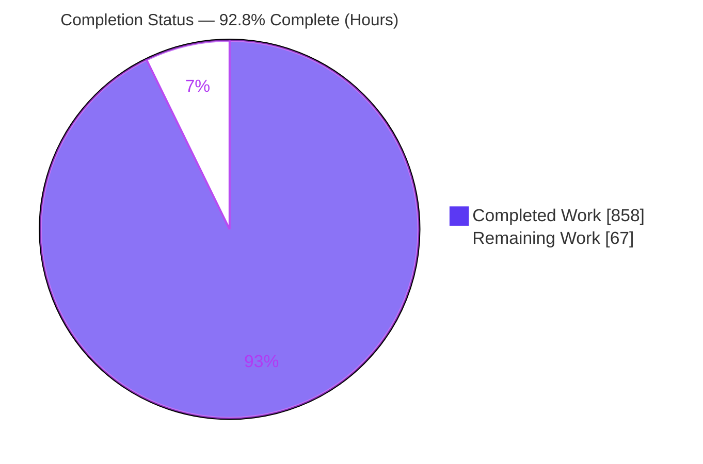
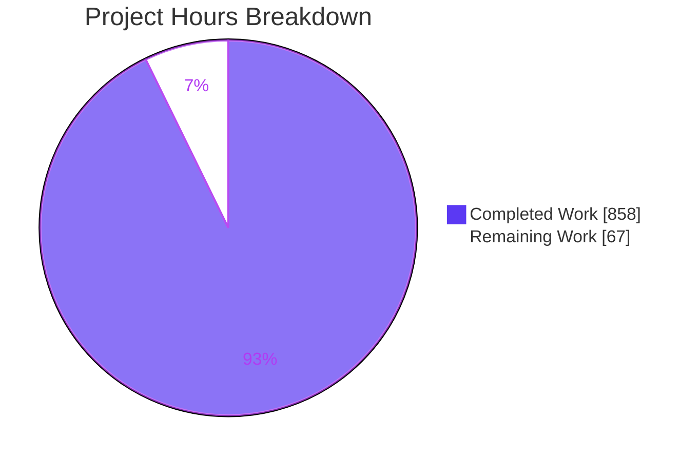
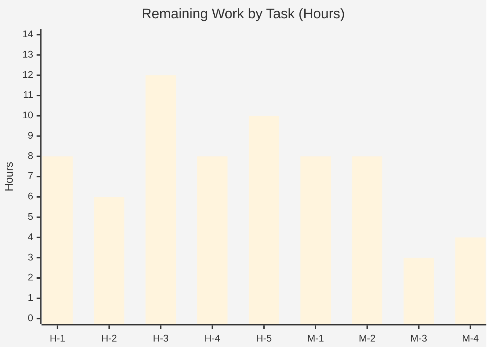
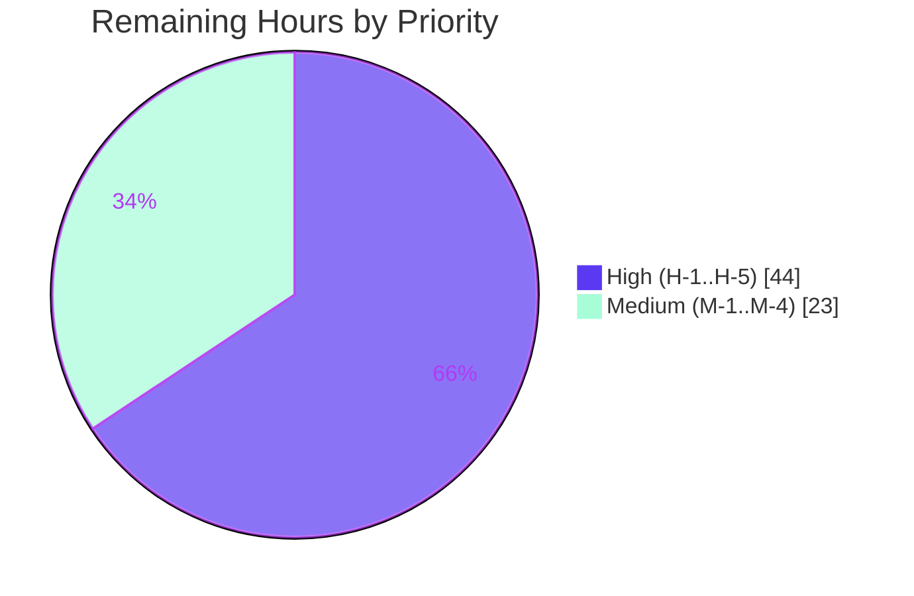

# Blitzy Project Guide — AWS CardDemo Mainframe Modernization

**Project:** AWS CardDemo re-platform — COBOL/CICS/VSAM/JCL → Java 25 LTS + Spring Boot 3.5.16
**Branch:** `blitzy-41dede50-d914-41e7-8f79-9f96907d22ed` · **HEAD:** `54d60e64` · **Working tree:** clean
**Assessment basis:** Agent Action Plan (AAP) scope + path-to-production (PA1 methodology)

---

## 1. Executive Summary

### 1.1 Project Overview

This project re-platforms **AWS CardDemo** — a credit-card account-management system originally implemented in COBOL, CICS, VSAM, and JCL — into a functionally equivalent **Java 25 LTS + Spring Boot 3.5.16** modular monolith. It targets developers and operators of the CardDemo estate and serves as a reference migration proving behavioral parity at **no business-feature expansion** (no new endpoints or business rules). Parity is asserted with **two intentional, documented behavioral deviations** from the legacy — interest rounding standardized to `HALF_UP` (decision-log D31) and JPA optimistic locking on updates (decision-log D18) — recorded as deviations rather than presented as bit-for-bit equivalence. The technical scope covers 28 COBOL programs (17 online, 10 batch, and 1 date-validation utility — `CSUTLDTC`, which maps to a service, not a batch job), 10 VSAM datasets, 17 BMS screen contracts, and 29 JCL jobs, reconstructed as REST controllers, Spring Batch jobs, JPA entities over PostgreSQL 16, and hand-written DTO mappers. Monetary values use `BigDecimal` (scale-2, no floating point), subject to the one documented rounding-mode deviation noted above (D31). The legacy COBOL source is retained read-only under `/legacy`.

### 1.2 Completion Status

The project is **92.8% complete** on an AAP-scoped, hours-based basis. All AAP-scoped autonomous engineering work is delivered; the remaining 67 hours is path-to-production work requiring human and organizational action (provisioning, secrets, deployment, sign-off, data cutover).



| Metric | Hours |
|--------|-------|
| **Total Hours** | **925** |
| Completed Hours (AI + Manual) | 858 |
| — of which AI (autonomous) | 858 |
| — of which Manual (human) | 0 |
| **Remaining Hours** | **67** |
| **Percent Complete** | **92.8%** |

> Formula: 858 ÷ (858 + 67) = 858 ÷ 925 = **92.8%**. Per Blitzy assessment policy, completion is never reported at 100% prior to human review (maximum 99%).

### 1.3 Key Accomplishments

- ✅ **Compilation:** 230 classes on Java 25, `failOnWarning=true`, `-Xlint:all` — **zero warnings**.
- ✅ **Tests:** **1,578** automated tests pass (0 failures, 0 errors, 0 skipped).
- ✅ **Coverage:** **89.90% line / 90.96% instruction** (JaCoCo gate ≥80% met).
- ✅ **Security:** OWASP dependency-check 12.2.2 — **zero CVEs ≥ CVSS 7** (max 6.1); no hardcoded secrets; BCrypt passwords; PAN/CVV never logged.
- ✅ **Online layer:** 17 REST controllers reproduce all 17 CICS online programs and BMS field/PF-key contracts via 34 DTOs.
- ✅ **Batch layer:** 12 Spring Batch jobs = **9 derived from the 10 batch COBOL programs** (`CBSTM03A`+`CBSTM03B` collapse to one `statementGenerationJob`) **+ 2 from JCL utility jobs** (`COMBTRAN` SORT, `TRANBKP` IDCAMS `REPRO`) **+ 1 source-less `dailyTransactionLoadJob`** (D30); reject codes 100/101/102/103 preserved; golden-file parity harness in place. Full job-count reconciliation: decision-log D68 / traceability-matrix Section 1.
- ✅ **Data tier:** 10 VSAM KSDS → PostgreSQL 16 (11 entities, 11 repositories, Flyway V1–V6: 12 tables, 11 FKs, 7 indexes, 11 seed CSVs; V6 formalizes the CVV-at-rest redaction, D22-revised).
- ✅ **Decimal fidelity:** all money as `BigDecimal` scale-2 with `HALF_UP`; no float/double.
- ✅ **Legacy retention (G8):** entire COBOL corpus relocated to `/legacy` with 100% content preservation (148 rename-only operations).
- ✅ **Runtime verified:** online app boots against real PostgreSQL 16 (Flyway V1–V6 migrations, 860 rows seeded); actuator + OpenAPI healthy; **all 12 Spring Batch jobs run standalone to COMPLETED (exit 0)** with correlation-ID/trace propagation (per-job evidence in Section 4).
- ✅ **Rule-mandated docs:** decision-log (2906 lines), traceability-matrix (1748 lines, 100% paragraph coverage), 5 onboarding docs, Grafana dashboard, self-contained reveal.js executive deck, updated README, CI workflow.

### 1.4 Critical Unresolved Issues

No AAP-scoped engineering issues are outstanding. The items below are **path-to-production blockers** requiring human/organizational action; none indicate incomplete or defective AAP work.

| Issue | Impact | Owner | ETA |
|-------|--------|-------|-----|
| No production deployment target (docker-compose is local-only; cloud/k8s out of AAP scope) | Cannot promote beyond local without deployment manifests + environment | Platform / DevOps | 12h (H-3) |
| Legacy data migration not performed (schema seeded from ASCII fixtures, not live VSAM/EBCDIC) | Production data cutover + credential re-hash + parity UAT required before go-live | Data Migration / DBA | 10h (H-5) |
| Production secrets/vault not provisioned (app is env-only with no fallback) | App will not start in prod until secrets are wired | Security / Platform | 6h (H-2) |
| Security deviations awaiting formal sign-off (BCrypt hashing, CVV-at-rest/PCI scope, interest `HALF_UP`) | Compliance approval needed before production release | Security / Business | 8h (H-4) |

### 1.5 Access Issues

No access issues prevented autonomous build, test, or local runtime validation (all Maven, Docker, and PostgreSQL operations succeeded). One forward-looking access dependency is noted for CI/CD hardening.

| System/Resource | Type of Access | Issue Description | Resolution Status | Owner |
|-----------------|----------------|-------------------|-------------------|-------|
| NVD (National Vulnerability Database) | Network / API key | The dependency-check **feed update** needs online NVD access (or a mirrored cache + API key) in CI; the **scan itself runs offline** against a populated cache (`-DautoUpdate=false`, verified 2026-07-20 — see decision-log D49 addendum). Only Maven's `-o` offline flag blocks the goal outright. Enabling the periodic online refresh in CI is M-3 | Open — deferred to CI hardening (M-3) | DevOps |
| Production PostgreSQL 16 | DB credentials | Prod database instance + credentials not yet provisioned (local validation used a container) | Open — deferred to provisioning (H-1) | Platform / DBA |
| Secrets manager / vault | Secret store access | Production secret backend not yet available for DB/OTLP credential injection | Open — deferred (H-2) | Security / Platform |

### 1.6 Recommended Next Steps

1. **[High]** Provision managed PostgreSQL 16, run Flyway migrations, configure backups/HA and the connection pool (H-1, 8h).
2. **[High]** Wire a production secrets manager/vault for `DB_URL`/`DB_USERNAME`/`DB_PASSWORD` and OTLP credentials (H-2, 6h).
3. **[High]** Author deployment/orchestration manifests (container registry, ingress, TLS/DNS) for the target platform (H-3, 12h).
4. **[High]** Execute legacy data migration (VSAM/EBCDIC → PostgreSQL) with credential re-hash and run parity UAT against legacy outputs (H-5, 10h).
5. **[Medium]** Complete the security review/sign-off (deviations, CVV/PCI) and enable OWASP online NVD scanning in CI (H-4 8h, M-3 3h).

---

## 2. Project Hours Breakdown

### 2.1 Completed Work Detail

All rows below are AAP-scoped deliverables completed autonomously. **Total = 858 hours** (matches Completed Hours in §1.2).

| Component | Hours | Description |
|-----------|-------|-------------|
| Build system & Maven config | 24 | `pom.xml` (Spring Boot 3.5.16 parent), `mvnw`/`.mvn` wrapper, compiler `<release>25</release>` + `failOnWarning`, JaCoCo + OWASP plugins |
| Legacy relocation (`/legacy`) | 6 | Rename-only move of entire COBOL corpus `app/**` → `legacy/**` (G8), 100% content preserved |
| Domain model (11 entities + Money) | 56 | JPA entities from copybooks; `Money` value object; `BigDecimal` scale-2; `@Version` optimistic locking |
| Repositories (11) | 32 | Spring Data JPA repositories; VSAM browse → paged/sorted queries; alternate indexes → DB indexes |
| Flyway schema + reference data + seed | 28 | V1–V5 migrations (12 tables, 11 FKs, 7 indexes) + 11 seed CSVs (customer/account/card/xref/transaction/user + reference tables) |
| DTOs (34) + mappers (8) | 48 | 17 request/17 response DTOs from BMS symbolic copybooks; hand-written entity↔DTO mappers |
| Services (9) + validation rules (19) | 110 | Business logic from COBOL paragraphs; edit paragraphs → discrete rule components; evaluation order preserved |
| Web controllers (17) | 72 | One `@RestController` per online program; PF-key/COMMAREA navigation → flow state + response headers |
| Batch jobs (12) + reader/processor/writer | 108 | Chunk-oriented Spring Batch; reject codes 100/101/102/103; interest formula; fixed-width readers/writers |
| Cross-cutting (exception/security/observability/util) | 76 | FileStatus/CICS-RESP exception hierarchy; UserDetailsService + BCrypt; correlation-ID filter + tracing; DateUtils/FixedWidthCodec/IdGenerator/PanMasker |
| Configuration (9) | 24 | DataSource/Batch/OpenAPI/Observability/Security/Jackson config; seed loader; request-size filter |
| Automated tests (1578) | 172 | 113 test classes (82 unit + 31 Testcontainers integration); golden-file parity; ~89.90% line coverage |
| Documentation (decision-log/traceability/onboarding/architecture) | 76 | decision-log.md (2906L), traceability-matrix.md (1748L, 100% paragraph), 5 onboarding docs, architecture.md |
| Executive deck (reveal.js) | 16 | Self-contained `executive-summary.html`, theme inlined, brand-themed, visuals per slide |
| Containerization + CI/CD | 10 | `Dockerfile`, `docker-compose.yml` (PostgreSQL + Prometheus + Tempo + Grafana), `.github/workflows/ci.yml` |
| **Total** | **858** | |

### 2.2 Remaining Work Detail

All rows are path-to-production tasks (each traces to a risk in §6). **Total = 67 hours** (matches Remaining Hours in §1.2 and the pie chart in §7).

| Category | Hours | Priority |
|----------|-------|----------|
| H-1 Provision managed PostgreSQL 16 + Flyway migrations in prod (sizing, backups, HA, pool tuning) | 8 | High |
| H-2 Wire production secrets manager/vault for DB + OTLP credentials (no fallback) | 6 | High |
| H-3 Author deployment/orchestration manifests (k8s/cloud), registry, ingress, TLS/DNS | 12 | High |
| H-4 Security review & sign-off (deviations D18/D22/D31/D39/D40, CVV-at-rest/PCI, pen-test) | 8 | High |
| H-5 Legacy data migration (VSAM/EBCDIC → PostgreSQL) — includes **two distinct, separately-signed-off validation steps**: (a) `COMP-3` packed-decimal decode fidelity (row-for-row `BigDecimal` scale-2 checksum, D9) and (b) EBCDIC **code-page** reconciliation (IBM-037/1047 → UTF-8), which must be verified **before** the credential re-hash — then credential re-hash + parallel-run parity UAT (D69) | 10 | High |
| M-1 Wire production observability backend (OTLP collector, Prometheus/Tempo/Grafana, import dashboard) | 8 | Medium |
| M-2 Load & performance validation at production data scale + tuning | 8 | Medium |
| M-3 Enable OWASP dependency-check online (NVD API key + cache) in CI + add deploy stage | 3 | Medium |
| M-4 Stakeholder acceptance & production go/no-go review | 4 | Medium |
| **Total** | **67** | |

> Low-priority / watch items carry **0 committed hours** (contingent, non-blocking): swagger-ui upgrade when an upstream patch lands (risk S1); enterprise scheduler integration if operations mandates it (risk O4).

### 2.3 Estimation Methodology

Hours were derived with the PA1/PA2 framework: every AAP requirement was inventoried, mapped to codebase and validation evidence, classified (all 20 AAP deliverable groups **Completed**), and assigned engineering hours by complexity (LOC proxy, functionality, testing at 30–40% of dev, debugging). Completion % = Completed ÷ (Completed + Remaining) = 858 ÷ 925 = **92.8%**. Remaining hours are exclusively path-to-production activities; no AAP deliverable is partial or not-started.

---

## 3. Test Results

All figures below originate from Blitzy's autonomous validation logs (`mvn -B -o test` and `mvn -B -o verify`), re-confirmed identically across runs.

| Test Category | Framework | Total Tests | Passed | Failed | Coverage % | Notes |
|---------------|-----------|-------------|--------|--------|-----------|-------|
| Unit & Component | JUnit 5, Mockito, AssertJ | 82 (classes) | all | 0 | — | Services, rules, mappers, controllers (slice), exception, util; method-level totals roll into the 1,578 aggregate |
| Integration | JUnit 5, Testcontainers (postgres:16) | 31 (classes) | all | 0 | — | Ephemeral PostgreSQL 16 per class; repository/batch/web end-to-end |
| Batch Golden-File Parity | Spring Batch Test, AssertJ | (subset) | all | 0 | — | Row-for-row fixtures: reject / report / statement / interest / posting |
| **TOTAL (Surefire aggregate)** | **JUnit 5 Platform** | **1,578** | **1,578** | **0** | **89.90% line / 90.96% instr** | 0 errors, 0 skipped; JaCoCo gate ≥80% met |

> **Composition note (integrity):** category rows show **test-class** counts (113 classes total = 82 unit/component + 31 integration). The TOTAL row shows the **1,578 executed test methods** reported by JUnit 5 / Surefire. Both figures originate from Blitzy's autonomous `mvn verify` logs. No externally authored or manual tests are included.

---

## 4. Runtime Validation & UI Verification

Runtime validation was performed against a real PostgreSQL 16 container using the bootable fat jar. CardDemo is a REST/OpenAPI service (BMS 3270 screens were re-expressed as REST DTOs per the AAP — no rendered HTML UI is in scope); "UI verification" therefore covers the OpenAPI surface and REST flows.

**Online application (profile `local`)**
- ✅ **Startup** — boots in ~7.0s; Flyway applies all 6 migrations (V1–V6, including the V6 CVV-at-rest redaction, D22-revised); Hibernate `ddl-auto=validate` passes; seed loader inserts 860 rows across 8 tables.
- ✅ **Health** — `/actuator/health`, `/actuator/health/readiness`, `/actuator/health/liveness` all **UP** (PostgreSQL connected).
- ✅ **Metrics** — `/actuator/prometheus` returns 237 metric lines tagged `application="carddemo"`.
- ✅ **OpenAPI / Swagger UI** — `/v3/api-docs` exposes **18 paths** covering all 17 online screens.
- ✅ **Auth flow** — `POST /api/v1/auth/signon {ADMIN001/PASSWORD}` → 200 with correct admin routing headers (`X-CardDemo-Next-Program=COADM01C`, `Next-Transaction=CA00`) and `X-Correlation-Id`; proves controller→service→repository→PostgreSQL→BCrypt→role routing.
- ✅ **Authenticated read** — `GET /api/v1/accounts/view` (HTTP Basic `USER0001`) → 200 with CAVW DTO; security headers present (`X-Content-Type-Options: nosniff`, `X-Frame-Options: DENY`, `Cache-Control: no-store`).

**Batch application (standalone, JCL-equivalent) — ALL 12 jobs runtime-verified**

Every one of the 12 Spring Batch jobs was launched standalone via
`java -jar target/carddemo-1.0.0.jar --spring.main.web-application-type=none --spring.batch.job.enabled=true --spring.batch.job.name=<job> [params]`
against the live PostgreSQL 16 stack under the **default profile** (so `LocalSeedDataLoader` does not re-seed and the posting clean-post prep is preserved). Correlation-ID + traceId/spanId propagate into structured JSON (ECS) logs for every job. Authoritative status is taken from Spring Batch's own `batch_job_execution` / `batch_job_instance` metadata tables: **12 distinct jobs, 12 executions, 12 COMPLETED, 0 FAILED.**

| # | Job | Params used | BatchStatus | Exit | Evidence |
|---|-----|-------------|-------------|------|----------|
| 1 | `accountMasterPrintJob` | (none) | COMPLETED | 0 | read-only master print |
| 2 | `cardMasterPrintJob` | (none) | COMPLETED | 0 | read-only master print |
| 3 | `xrefPrintJob` | (none) | COMPLETED | 0 | read-only master print |
| 4 | `customerMasterPrintJob` | (none) | COMPLETED | 0 | read-only master print |
| 5 | `transactionBackupJob` | (none) | COMPLETED | 0 | TRANBKP IDCAMS REPRO |
| 6 | `interestCalculationJob` | `parmDate=2022071800` | COMPLETED | 0 | wrote `SYSTRAN.dat` (50 recs × 351B); account balances updated idempotently |
| 7 | `transactionReportJob` | `startDate=2022-07-01 endDate=2022-07-31` | COMPLETED | 0 | wrote `DALYREPT.txt` (402B) |
| 8 | `statementGenerationJob` | (none) | COMPLETED | 0 | wrote `statements.txt` (100 000B) + `statements.html` (650 000B) |
| 9 | `transactionCombineJob` | `systemResource=file:./target/batch/SYSTRAN.dat` | COMPLETED | 0 | REPRO-load: **50 inserted, 0 rejected**; `transaction` 300→350 |
| 10 | `dailyTransactionLoadJob` | `inputResource=file:./src/test/resources/seed/dailytran-fixedwidth-sample.txt` | COMPLETED | 0 | staged 10 rows into `daily_transaction` |
| 11 | `dailyTransactionValidateJob` | (none) | COMPLETED | 0 | CBTRN01C read-only validation of 10 staged rows |
| 12 | `dailyTransactionPostingJob` | (none, after clean-post prep) | COMPLETED | 0 | **rejected 0**; posted 10; `transaction` 340→350; `DALYREJS.dat` = 0 bytes |

**Clean-post procedure for the posting job (D45):** on a seeded database the posting job faithfully abends (exit 8) because `local` pre-loads the same 300 IDs into both `transaction` and `daily_transaction`, so re-posting collides on `pk_transaction` (CBTRN02C treats FILE STATUS '22' as `9999-ABEND-PROGRAM`). To validate the happy path, staging was truncated, the 10-record fixed-width sample was loaded, and the matching 10 IDs were freed from the `transaction` table before validate + post — yielding COMPLETED / exit 0 with zero rejects. This is documented in `docs/onboarding/getting-started.md` §8.

**Combine input strategy:** `interestCalculationJob` writes new interest transactions (TRAN-IDs `2022071800000001…050`) only to `SYSTRAN.dat` and never to the `transaction` table (`InterestTransactionWriter`, to avoid double-loading — the combine job is what loads SYSTRAN into the master). Feeding that file as the combine `systemResource` therefore produces a clean 50-row insert (0 duplicate-key rejects, RC 0).

- ℹ️ **OTLP metrics push** — under the default profile no batch metrics are pushed (headless JVM has no `/actuator/prometheus`), so no OTLP shutdown WARN is emitted. The optional `batch` profile (`SPRING_PROFILES_ACTIVE=local,batch`) pushes `spring_batch_job_seconds` / `spring_batch_step_seconds` over OTLP just before exit (decision-log D65); against a dead collector that emits a single non-fatal WARN which does not affect COMPLETED/exit 0.

**Observability (verified locally)**
- ✅ Structured logs with correlation IDs (online + batch); ✅ distributed tracing; ✅ metrics endpoint; ✅ health/readiness/liveness probes.

---

## 5. Compliance & Quality Review

Cross-map of AAP §0.9 validation criteria to autonomous results.

| Criterion (AAP §0.9) | Benchmark | Status | Evidence / Notes |
|----------------------|-----------|--------|------------------|
| Compilation | Zero warnings on Java 25 | ✅ Pass | 230 classes; `<release>25</release>`, `failOnWarning=true`, `-Xlint:all` |
| Line coverage | ≥80% (unit + integration) | ✅ Pass | 89.90% line / 90.96% instruction (JaCoCo gate) |
| Integration DB | Real PostgreSQL via Testcontainers | ✅ Pass | 31 integration classes against `postgres:16` |
| Batch parity | Row-for-row golden-file match | ✅ Pass | Fixtures: posting/reject/interest/statement/report (live-mainframe parallel-run deferred to UAT — risk T2) |
| Interest fidelity | Exact `BigDecimal` match | ✅ Pass (improved) | `HALF_UP` scale-2; COBOL truncation defect corrected — documented deviation D31 (risk T1) |
| Reject codes | 100/101/102/103, identical order | ✅ Pass | `RejectCode` enum + PostingService; each path unit-tested |
| External file contracts | Fixed-width layouts preserved | ✅ Pass | `FixedWidthCodec` + FlatFile reader/writer (partner validation deferred — risk I2) |
| Security scan | Zero critical/high CVEs; no hardcoded secrets | ✅ Pass (gate); count pending online CI (M-3) | OWASP 12.2.2. **Gate metric verified locally 2026-07-20** against the setup NVD cache: 136 deps, **0 findings ≥ CVSS 7, max active CVSS 6.1** (`prometheus-metrics-core` CVE-2019-3826, a client-lib CPE false positive) → BUILD SUCCESS. 7 `flyway-database-postgresql` server-CPE false positives suppressed (dated, decision-log D49). Reproducible command + full provenance in **decision-log D49 addendum**. The `27-findings` inventory is the **online, all-analyzer** count (not reproducible offline; source of record is the online CI run, M-3). Env-only creds, no fallback. |
| Traceability | 100% paragraph coverage, bidirectional | ✅ Pass | `docs/traceability-matrix.md` (1748 lines) |
| Decision log | Entry per non-trivial decision/deviation | ✅ Pass | `docs/decision-log.md` (2906 lines) |
| Observability | Logs/traces/metrics/health verified locally | ✅ Pass | Actuator + Micrometer/OTLP + Logback; prod backend wiring pending (risk O2) |
| Executive deck | 12–18 self-contained slides, brand-themed | ✅ Pass | `blitzy-deck/executive-summary.html`, theme inlined |
| No feature expansion (G7) | No capability beyond COBOL scope | ✅ Pass | No new **business** capability, endpoints, or rules; only preserved logic + mandated non-functional concerns. Two behavioral deviations are **intentional and documented, not silent**: interest `HALF_UP` rounding (D31) and JPA optimistic locking on updates (D18); both are recorded in the decision log with rationale and risk. |

**Fixes applied during autonomous validation:** none required for source/tests (codebase arrived complete and passing). Housekeeping only: removed one stray untracked build artifact (`META-INF/spring-configuration-metadata.json` at repo root); working tree left clean.

---

## 6. Risk Assessment

15 risks across four categories. None indicates incomplete AAP work; all are deployment/cutover/sign-off concerns mapped to §2.2 tasks.

| Risk | Category | Severity | Probability | Mitigation | Status |
|------|----------|----------|-------------|-----------|--------|
| T1 Interest rounding `HALF_UP` vs COBOL truncation defect (D31) | Technical | Medium | Low | Documented deviation; golden tests assert `HALF_UP`; obtain business sign-off (H-4) | Mitigated — documented |
| T2 Golden-file parity from fixtures, not a live mainframe | Technical | Medium | Low-Med | Cutover parallel-run UAT (H-5) | Open — deferred |
| T3 JPA `@Version` optimistic locking adds behavior COBOL lacked (D18) | Technical | Low | Low | Documented as intentional integrity improvement | Mitigated — documented |
| T4 Read-order / defensive-branch deviations (D39/D40) | Technical | Low | Low | Documented in decision log; unit-tested | Mitigated — documented |
| S1 OWASP findings all sub-threshold (max CVSS 6.1) — local gate verified 2026-07-20 (0 findings ≥7); the "~27" total is the online all-analyzer inventory count (M-3), not reproducible offline | Security | Medium | Low | Below CVSS≥7 gate (verified offline: 2 active med findings, max 6.1; 7 flyway server-CPE false positives suppressed, D49 addendum); springdoc disabled in prod; upgrade swagger-ui when patched | Mitigated — monitored |
| S2 Legacy anti-patterns (plaintext pwd/CVV) hardened (D22) | Security | Medium | Low | BCrypt via UpperCasePasswordEncoder; CVV modeled for parity, masked by PanMasker, never logged; needs PCI/CVV-at-rest sign-off (H-4) | Partially mitigated |
| S3 Authoritative full OWASP inventory needs online NVD in CI | Security | Medium | Medium | Wire online NVD (API key + cache) in CI (M-3). NOTE: the gate is **not** skip-only — dependency-check runs to completion **offline** against a populated NVD cache with `-DautoUpdate=false` (verified 2026-07-20, D49 addendum); only Maven's `-o` flag blocks the goal, and only the periodic feed *update* (not the scan) needs network | Open — deferred |
| S4 Production secrets/vault not provisioned | Security | Medium | Medium | Env-only, no fallback; wire vault (H-2) | Open — deferred |
| O1 No production deploy target (docker-compose local-only) | Operational | High | High | Author deployment manifests + provisioning (H-1, H-3) | Open — deferred |
| O2 Observability backend local-only (benign OTLP shutdown WARN) | Operational | Medium | Medium | Provision prod collector/dashboards (M-1) | Open — deferred |
| O3 Load/perf validated only at 860-row seed scale | Operational | Medium | Medium | Load/perf test at prod scale + tune (M-2) | Open — deferred |
| O4 Batch scheduling via CI/CD, not an enterprise scheduler | Operational | Low | Low | Integrate scheduler if ops mandates (watch item) | Open — contingent |
| O5 No production rollback / restore (DR) procedure for the cutover — if the migration or first release fails, there is no rehearsed path back to a known-good state | Operational | High | Medium | Define & **rehearse** a cutover rollback/restore runbook on the H-1 backup/HA foundation: PostgreSQL **PITR** (WAL archiving) + verified base backups, documented **RPO/RTO** targets, a **restore-drill** (backup → fresh instance → parity re-check) run before go-live, and a decision-gated "abort & restore" branch in the cutover plan tied to the H-5 parity-UAT result (D70) | Open — deferred |
| I1 Legacy data migration not performed — real VSAM data is still **EBCDIC + binary `COMP-3`** (the demo uses decoded ASCII fixtures) | Integration | High | High | Migrate real VSAM/EBCDIC → PostgreSQL under H-5 as **two distinct, separately-validated steps**: (a) **`COMP-3` decode fidelity** — row-for-row `BigDecimal` scale-2 checksum (a nibble/sign/implied-point error is silent, D9); (b) **EBCDIC code-page reconciliation** — IBM-037/1047 → UTF-8, verified **before** credential re-hash (wrong code page corrupts `USRSEC` credentials). Only then re-hash creds + parity UAT. Reconciliation is **not** folded into "re-hash" (D69) | Open — deferred |
| I2 Fixed-width file contracts validated vs fixtures, not live partners | Integration | Medium | Low | Partner integration test at cutover (H-5) | Open — deferred |
| I3 No live COBOL to cross-validate; parallel-run deferred | Integration | Medium | Medium | Parallel-run UAT during cutover (H-5) | Open — deferred |

---

## 7. Visual Project Status

**Project hours breakdown** (Completed = Dark Blue `#5B39F3`, Remaining = White `#FFFFFF`):



**Remaining hours by task** (sums to 67h — matches §1.2 remaining and §2.2 total):



**Priority distribution of remaining work:**



> Integrity: pie "Remaining Work" = 67 = §1.2 Remaining Hours = §2.2 Hours total; bar chart sums to 67; High (44) + Medium (23) = 67.

---

## 8. Summary & Recommendations

**Achievements.** The AWS CardDemo mainframe application has been fully re-platformed to Java 25 + Spring Boot 3.5.16 with **100% of AAP-scoped autonomous work delivered** — 28 COBOL programs reconstructed as 17 REST controllers and 12 Spring Batch jobs over a PostgreSQL 16 data tier, with `BigDecimal` scale-2 monetary arithmetic (no floating point), preserved reject-code and fixed-width contracts, 1,578 passing tests at 89.90% line coverage, zero-warning compilation, zero high/critical CVEs, and complete rule-mandated documentation (100% paragraph traceability, decision log, onboarding, observability, executive deck). Behavioral parity is delivered with **two intentional, documented deviations — not flat equivalence**: interest rounding standardized to `HALF_UP` (D31, correcting the legacy truncation defect in the exact-half boundary case) and JPA optimistic locking on updates (D18); both are recorded in the decision log with rationale, alternatives, and risk.

**Remaining gaps.** The outstanding **67 hours (7.2%)** is entirely **path-to-production** work — production database provisioning, secrets/vault wiring, deployment manifests, security sign-off, legacy data migration/UAT, production observability, load/perf validation, CI hardening, and stakeholder acceptance. No AAP deliverable is incomplete.

**Critical path to production.** (1) Provision PostgreSQL 16 + secrets → (2) deployment manifests + TLS/DNS → (3) legacy data migration + parity UAT → (4) security sign-off → (5) go/no-go. High-priority items (44h) unblock a first production deployment; medium items (23h) harden operations.

**Success metrics.** Build zero-warning ✅; coverage ≥80% ✅ (89.90%); CVEs ≥CVSS7 = 0 ✅; behavioral-parity harness green ✅; runtime online + batch verified ✅.

**Production-readiness assessment.** The application is **engineering-complete and validated at 92.8%**, with **high confidence** in code quality and behavioral parity. It is **not yet production-deployed**: remaining work is operational/organizational, not developmental. Recommendation — proceed to the high-priority path-to-production tasks and a cutover UAT before go-live.

---

## 9. Development Guide

All commands below were tested in the validation environment (Java 25.0.3 Temurin, Maven 3.9.16 via `./mvnw`, Docker 28.5.2 + Compose v2). Run from the repository root.

### 9.1 System Prerequisites

- **Java 25 LTS** (Temurin/OpenJDK). Verify: `java -version` → `25.x`.
- **Maven** via the bundled wrapper `./mvnw` (resolves Maven 3.9.16). No system Maven required.
- **Docker Engine 28.x** + **Docker Compose v2** (for PostgreSQL and the local observability stack). Verify: `docker info` and `docker compose version`.
- **PostgreSQL 16** — either the bundled `docker-compose.yml` service or a standalone instance.
- Recommended: 4+ CPU, 8 GB RAM, ~2 GB free disk for images and the local NVD cache.

### 9.2 Environment Setup

Required environment variables (the app has **no credential fallback** and will fail fast if these are unset):

```bash
export DB_URL="jdbc:postgresql://localhost:5432/carddemo"
export DB_USERNAME="carddemo"
export DB_PASSWORD="change-me-locally"
# Optional overrides:
export SERVER_PORT=8080                         # default 8080
export SPRING_PROFILES_ACTIVE=local             # 'local' (online) or 'batch'
export OTLP_ENDPOINT="http://localhost:4318/v1/traces"   # default shown
```

### 9.3 Dependency Installation & Build

```bash
# Fast sanity check (offline) — tested: BUILD SUCCESS in ~0.25s
./mvnw -B -o validate

# Zero-warning compile (offline) — tested: 177 source files, release 25, ZERO warnings
./mvnw -B -o clean compile

# Full quality gate (ONLINE — required for OWASP NVD; runs tests + JaCoCo)
./mvnw -B clean verify

# Offline full verify (skips OWASP: Maven -o silently skips the dependency-check goal)
./mvnw -B -o clean verify
```

Expected: `BUILD SUCCESS`; tests `1578 / 0 failures / 0 errors / 0 skipped`; JaCoCo `All coverage checks have been met`.

### 9.4 Application Startup

```bash
# 1) Start PostgreSQL 16 (and optionally the full observability stack)
export POSTGRES_USER=carddemo POSTGRES_PASSWORD=change-me-locally
docker compose up -d postgres
# Full local stack (Postgres + Prometheus + Tempo + Grafana):
# docker compose up -d

# 2) Build the bootable fat jar
./mvnw -B -o package -DskipTests        # produces target/carddemo-1.0.0.jar

# 3a) Run the ONLINE application (profile 'local')
DB_URL=jdbc:postgresql://localhost:5432/carddemo \
DB_USERNAME=carddemo DB_PASSWORD=change-me-locally \
SPRING_PROFILES_ACTIVE=local \
java -jar target/carddemo-1.0.0.jar

# 3b) Run a BATCH job standalone (JCL-equivalent)
java -jar target/carddemo-1.0.0.jar \
  --spring.main.web-application-type=none \
  --spring.batch.job.enabled=true \
  --spring.batch.job.name=accountMasterPrintJob \
  --spring.profiles.active=batch \
  stamp=$(date +%s%N)
# → process exit code 0 == job COMPLETED
```

**Batch job names:** `accountMasterPrintJob`, `cardMasterPrintJob`, `customerMasterPrintJob`, `dailyTransactionLoadJob`, `dailyTransactionPostingJob`, `dailyTransactionValidateJob`, `interestCalculationJob`, `statementGenerationJob`, `transactionBackupJob`, `transactionCombineJob`, `transactionReportJob`, `xrefPrintJob`.

### 9.5 Verification Steps

```bash
curl -s http://localhost:8080/actuator/health              # {"status":"UP",...}
curl -s http://localhost:8080/actuator/health/readiness    # {"status":"UP"}
curl -s http://localhost:8080/actuator/health/liveness     # {"status":"UP"}
curl -s http://localhost:8080/actuator/prometheus | head   # metric lines, application="carddemo"
curl -s http://localhost:8080/v3/api-docs | head           # OpenAPI JSON (18 paths)
```

### 9.6 Example Usage

```bash
# Signon (admin) — returns routing headers + correlation id
curl -si -X POST http://localhost:8080/api/v1/auth/signon \
  -H 'Content-Type: application/json' \
  -d '{"userId":"ADMIN001","password":"PASSWORD"}'
# → HTTP 200; X-CardDemo-Next-Program: COADM01C; Next-Transaction: CA00; X-Correlation-Id: ...

# Authenticated account view (standard user, HTTP Basic)
curl -s -u USER0001:PASSWORD http://localhost:8080/api/v1/accounts/view
# → HTTP 200 with CAVW account-view DTO
```

Seed principals: `ADMIN001`–`ADMIN005` (role `A` / admin), `USER0001`–`USER0005` (role `U` / user); passwords are BCrypt-hashed in the seed data.

### 9.7 Troubleshooting

- **App exits at startup / DataSource error** — `DB_URL`/`DB_USERNAME`/`DB_PASSWORD` unset. This is intentional (no fallback); export them (§9.2).
- **OWASP goal skipped** — you ran Maven with `-o` (offline); OWASP needs online NVD. Use `./mvnw -B clean verify` online (task M-3 wires this in CI).
- **Batch WARN on OTLP push at shutdown** — benign when no collector is running; start the observability stack (`docker compose up -d`) or ignore.
- **Port already in use** — override `SERVER_PORT` (app), `POSTGRES_PORT` (5432), `GRAFANA_PORT` (3000), `PROMETHEUS_PORT` (9090) as needed.
- **Flyway validation failure** — ensure a clean `carddemo` database; migrations V1–V5 must apply from an empty schema.

---

## 10. Appendices

### A. Command Reference

| Purpose | Command |
|---------|---------|
| Offline validate | `./mvnw -B -o validate` |
| Offline zero-warning compile | `./mvnw -B -o clean compile` |
| Full gate (online, incl. OWASP) | `./mvnw -B clean verify` |
| Offline verify (skips OWASP) | `./mvnw -B -o clean verify` |
| Package fat jar | `./mvnw -B -o package -DskipTests` |
| Start PostgreSQL only | `docker compose up -d postgres` |
| Start full local stack | `docker compose up -d` |
| Run online app | `SPRING_PROFILES_ACTIVE=local java -jar target/carddemo-1.0.0.jar` |
| Run batch job | `java -jar target/carddemo-1.0.0.jar --spring.main.web-application-type=none --spring.batch.job.name=<job> --spring.profiles.active=batch stamp=$(date +%s%N)` |
| Tear down stack | `docker compose down` |

### B. Port Reference

| Service | Host Port | Notes |
|---------|-----------|-------|
| CardDemo app | 8080 | `SERVER_PORT` / `APP_PORT` override |
| PostgreSQL 16 | 5432 | `POSTGRES_PORT` override; bound to 127.0.0.1 |
| Prometheus | 9090 | `PROMETHEUS_PORT` override |
| Tempo (OTLP gRPC) | 4317 | trace ingest |
| Tempo (OTLP HTTP) | 4318 | trace ingest; default `OTLP_ENDPOINT` |
| Tempo (query API) | 3200 | Grafana datasource |
| Grafana | 3000 | `GRAFANA_PORT` override |

### C. Key File Locations

| Path | Contents |
|------|----------|
| `pom.xml` | Maven build; Spring Boot 3.5.16 parent; JaCoCo + OWASP plugins |
| `src/main/java/com/aws/carddemo/` | Application (config, domain, repository, dto, mapper, web, service, service/rule, batch, exception, observability, security, common/util) |
| `src/main/resources/application*.yml` | Base + `local` + `batch` profiles |
| `src/main/resources/db/migration/` | Flyway V1–V5 |
| `src/main/resources/db/seed/` | 11 seed CSVs |
| `src/test/java/com/aws/carddemo/` | 113 test classes (82 unit + 31 Testcontainers) |
| `src/test/resources/golden/` | Batch parity fixtures (reject/report/statement/interest/posting) |
| `docs/decision-log.md` | 2906 lines — decisions + deviations |
| `docs/traceability-matrix.md` | 1748 lines — 100% paragraph coverage |
| `docs/onboarding/` | getting-started, domain-context, extending, pitfalls, performance-testing |
| `docs/observability/grafana-dashboard.json` | Dashboard template |
| `blitzy-deck/executive-summary.html` | Self-contained reveal.js deck |
| `.github/workflows/ci.yml` | CI: JDK 25, `./mvnw -B clean verify`, artifact upload, batch launch |
| `docker-compose.yml` / `Dockerfile` | Local stack + container image |
| `legacy/` | Relocated COBOL corpus (read-only reference) |

### D. Technology Versions

| Component | Version |
|-----------|---------|
| Java (Temurin) | 25.0.3 LTS |
| Maven (wrapper) | 3.9.16 |
| Spring Boot | 3.5.16 |
| springdoc-openapi | 2.8.17 |
| PostgreSQL | 16 |
| PostgreSQL JDBC | 42.7.13 |
| Flyway | 11.7.2 |
| OWASP dependency-check | 12.2.2 |
| JaCoCo | 0.8.15 |
| Micrometer tracing (OTel bridge) | 1.5.x |
| Testcontainers | 1.21.4 |
| Docker Engine / Compose | 28.5.2 / v2 |

### E. Environment Variable Reference

| Variable | Required | Default | Purpose |
|----------|----------|---------|---------|
| `DB_URL` | Yes | — | JDBC URL for PostgreSQL |
| `DB_USERNAME` | Yes | — | Database user |
| `DB_PASSWORD` | Yes | — | Database password |
| `SERVER_PORT` | No | 8080 | HTTP listen port |
| `SPRING_PROFILES_ACTIVE` | No | (default) | `local` (online) or `batch` |
| `OTLP_ENDPOINT` | No | `http://localhost:4318/v1/traces` | Trace exporter endpoint |
| `POSTGRES_USER` / `POSTGRES_PASSWORD` / `POSTGRES_DB` | For compose | — | PostgreSQL container init (map to `DB_*`) |
| `POSTGRES_PORT` / `GRAFANA_PORT` / `PROMETHEUS_PORT` | No | 5432 / 3000 / 9090 | Host port overrides |

### F. Developer Tools Guide

- **Swagger UI / OpenAPI** — browse `/swagger-ui.html` or fetch `/v3/api-docs` (18 paths) to explore all 17 online endpoints and DTO contracts.
- **Actuator** — `/actuator/health` (+ `/readiness`, `/liveness`), `/actuator/metrics`, `/actuator/prometheus`, `/actuator/info` (exposure limited to these).
- **Grafana** (local) — `http://localhost:3000`; import `docs/observability/grafana-dashboard.json`; Tempo + Prometheus datasources are provisioned by compose.
- **Testcontainers** — integration tests self-provision `postgres:16`; requires a running Docker daemon.
- **CI** — `.github/workflows/ci.yml` runs the full gate on JDK 25 and uploads JaCoCo, OWASP, and test reports; it also packages the jar and launches batch jobs as a JCL-equivalent smoke test.

### G. Glossary

| Term | Meaning |
|------|---------|
| AAP | Agent Action Plan — the authoritative migration requirements |
| BMS | Basic Mapping Support — CICS 3270 screen definitions (→ REST DTOs) |
| COMMAREA | CICS communication area carrying pseudo-conversational state (→ flow/session state + response headers) |
| VSAM KSDS | Key-Sequenced Data Set — indexed mainframe file store (→ PostgreSQL tables) |
| COMP-3 | Packed-decimal COBOL numeric (→ `BigDecimal` scale-2 / `DECIMAL(x,2)`) |
| JCL | Job Control Language — batch orchestration (→ Spring Batch + CI/CD) |
| Reject code | Batch posting outcome 100/101/102/103 (xref/account/limit/expiry) |
| Golden-file parity | Row-for-row comparison of batch output against expected fixtures |
| Path-to-production | Deployment/cutover/sign-off work outside autonomous engineering scope |
| PA1 methodology | AAP-scoped, hours-based completion measurement |