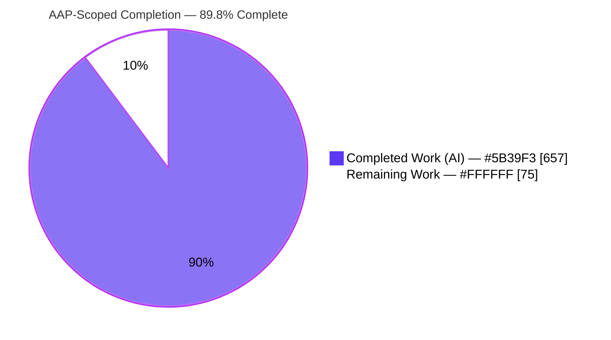
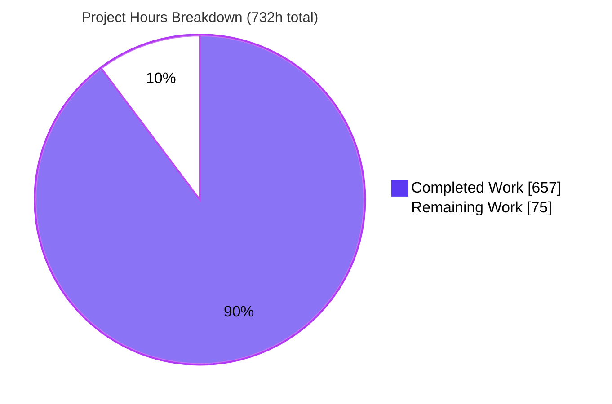
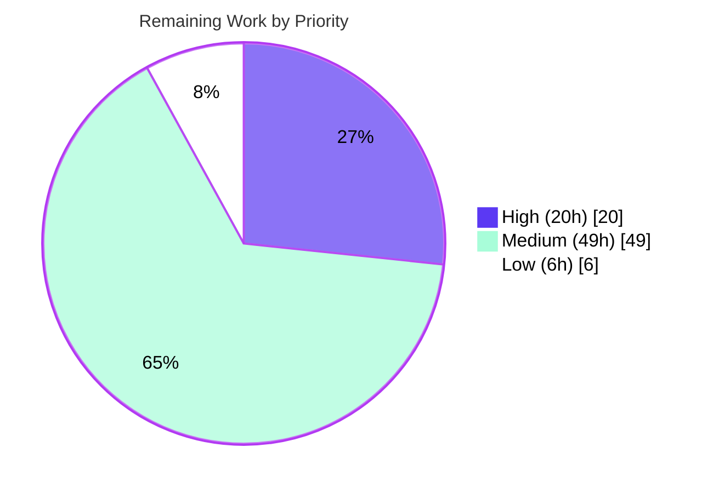

# Blitzy Project Guide — AWS CardDemo: COBOL → Java 25 / Spring Boot 3.5 Migration

> **AAP-Scoped Completion: 89.8%** &nbsp;•&nbsp; **657h completed / 732h total / 75h remaining**
> Brand legend — <span style="color:#5B39F3">**Completed / AI Work = Dark Blue `#5B39F3`**</span> &nbsp;|&nbsp; **Remaining = White `#FFFFFF`**

---

## 1. Executive Summary

### 1.1 Project Overview
AWS CardDemo — a z/OS COBOL / CICS / VSAM / JCL / BMS credit-card management system (28 COBOL programs, 28 copybooks, 17 BMS screens, 29 JCL members) — has been migrated to a layered **Java 25 LTS + Spring Boot 3.5.15** service with **100% behavioral parity** as the acceptance bar. Copybooks became JPA entities/DTOs, VSAM files became PostgreSQL tables via Spring Data JPA, COBOL paragraphs became control-flow-preserving service methods, JCL became Spring Batch jobs, and BMS screens became Thymeleaf views. The legacy COBOL is retained read-only under `/legacy`. Target users are card-operations staff (online transactions) and batch operations (posting, interest, statements, reports). Business impact: removes mainframe dependency while preserving every business rule and decimal-exact calculation.

### 1.2 Completion Status



| Metric | Hours |
|---|---|
| **Total Project Hours** | **732** |
| Completed Hours (AI: 657 + Manual: 0) | **657** |
| Remaining Hours | **75** |
| **Percent Complete** | **89.8%** |

> Completion formula (PA1, AAP-scoped + path-to-production only): `657 / (657 + 75) = 657 / 732 = 89.75% → 89.8%`. All completed hours are autonomous AI work; no manual hours were logged this engagement.

### 1.3 Key Accomplishments
- ✅ **Full migration delivered** — 134 main Java files (≈45,867 LOC) implementing every AAP layer: 11 entities + 3 composite IDs, 27 DTOs, 12 repositories, 17 online services, 10 batch services, 18 controllers, 17 Thymeleaf screens, 6 config / 6 exception / 6 util classes.
- ✅ **1332 tests pass** (0 failures, 0 errors, 0 skipped) across 140 test files (≈38,513 LOC).
- ✅ **JaCoCo line coverage 92.06%** (7,250 / 7,875) — well above the ≥80% gate; method 97.65%, class 99.22%.
- ✅ **Zero-warning build** under `-Werror -Xlint:all,-processing` on Java 25; Spotless (googleJavaFormat) clean.
- ✅ **Decimal & arithmetic parity** — all monetary/rate fields are `BigDecimal` (0 `float`/`double` field declarations); interest uses `RoundingMode.DOWN` at scale 2 with the `/1200` divisor (no `ROUNDED`).
- ✅ **VSAM key/index parity** — Flyway schema encodes the 3 alternate indexes (`card_acct_id`, `xref_acct_id`, `transaction.proc_ts`) from the LISTCAT catalog.
- ✅ **Security hardened** — Spring Security + BCrypt; clear-text password field and default credentials replaced with hashed, externalized credentials; session-id rotation on sign-on.
- ✅ **100% paragraph→method traceability matrix** (`docs/traceability-matrix.md`, 840 lines / 617 rows) + golden-file parity tests.
- ✅ **Path-to-production wired** — gated OWASP CI, GHCR CD pipeline, prod-gated batch scheduling, Terraform RDS, and AWS Secrets Manager prod profile.
- ✅ **Runnable artifact** — `target/carddemo-0.0.1-SNAPSHOT.jar`; full Spring context loads under Testcontainers PostgreSQL.
- ✅ **Legacy retained read-only** under `/legacy` (148 COBOL/JCL/BMS/data files), enforced by a dedicated CI job.

### 1.4 Critical Unresolved Issues
| Issue | Impact | Owner | ETA |
|---|---|---|---|
| OWASP dependency-check gate never executed against live NVD | Unknown critical/high CVE posture; release security sign-off blocked | DevSecOps | 0.5 day |
| `terraform apply` not run; prod RDS not provisioned | No production datastore; cannot deploy | Platform/Infra | 1 day |
| Prod-profile secret loading not exercised vs real AWS Secrets Manager | Risk of startup/credential misconfiguration at first deploy | Platform/Infra | 0.5 day |
| Production master-data ETL not built (only reference data seeded) | Cannot cut over real account/customer/card/transaction data | Data Eng | 2 days |
| No live end-to-end UI/runtime verification on a deployed environment | Parity confirmed only via slice/integration tests, not a running deploy | QA | 1 day |

> These are **path-to-production gaps requiring live infrastructure/credentials**, not defects in the delivered code. The autonomous build is green on the committed state.

### 1.5 Access Issues
| System/Resource | Type of Access | Issue Description | Resolution Status | Owner |
|---|---|---|---|---|
| NVD (NIST vuln DB) | API key (`NVD_API_KEY`) | OWASP gate needs an authenticated key; anonymous NVD is HTTP-429 rate-limited, so the gate could not run in-sandbox | Pending — add repo secret; CI is already wired to consume it | DevSecOps |
| AWS account (RDS, Secrets Manager, IAM) | Cloud credentials + `terraform` binary | Not available in the sandbox, so Terraform was validated structurally but not applied | Pending — provide deploy-time AWS access | Platform/Infra |
| Container registry (GHCR → ECR) | Registry credentials | CD targets GHCR via `GITHUB_TOKEN`; ECR swap is documented but needs AWS registry creds | Pending — configure at deploy time | Platform/Infra |

### 1.6 Recommended Next Steps
1. **[High]** Add the `NVD_API_KEY` repository secret and run CI so the OWASP gate (`failBuildOnCVSS=7`) executes to completion; triage/suppress findings.
2. **[High]** `terraform apply` the `infra/` stack in a non-prod account, then populate AWS Secrets Manager (`carddemo/prod/db`) and verify the prod profile boots and Flyway migrates.
3. **[High]** Deploy the image and perform end-to-end smoke + UI verification (sign-on, role-gated menus, account/card/transaction screens, one batch run).
4. **[Medium]** Build and run the production master-data migration ETL with reconciliation counts; author container-orchestration manifests (ECS/K8s/Helm).
5. **[Medium]** Complete the human parity acceptance sign-off using the traceability matrix and stand up monitoring/alerting.

---

## 2. Project Hours Breakdown

### 2.1 Completed Work Detail
| Component | Hours | Description |
|---|---|---|
| Build, CI & Project Scaffolding | 18 | `pom.xml` (Spring Boot 3.5.15 BOM, Java 25, JaCoCo/OWASP/Spotless/Flyway plugins), Maven wrapper, `Dockerfile`, `docker-compose.yml`, `.gitignore` |
| Legacy Asset Retention | 6 | Relocated 148 COBOL/JCL/BMS/CSD/data files to read-only `/legacy`; CI enforcement job |
| Domain Model & Composite Keys | 28 | 11 JPA entities + 3 composite-key types from copybooks; `BigDecimal` decimal fidelity, fixed-width semantics |
| DTO Layer | 30 | `CardDemoCommarea`, `CardWorkArea`, 17 screen DTOs, 8 report DTOs (field lengths, AID/PF-key, REDEFINES accessors) |
| Persistence: Repositories + Flyway | 32 | 12 Spring Data JPA repositories; `V1__schema.sql` (PKs + 3 VSAM alternate indexes) + `V2__seed_reference_data.sql` |
| Online Services | 110 | 17 services translating CICS programs with preserved perform-order control flow, role gating, COMMAREA navigation |
| Web Controllers + Thymeleaf Screens | 86 | 18 controllers + 17 screen templates + fragments; PF-key/AID routing, validation, success/error feedback |
| Batch Layer | 130 | 10 batch services + 11 jobs (posting, interest `/1200` truncation, statements, reports, extracts) + readers/processors/writers + reject-file writer |
| Cross-cutting: Config / Exceptions / Utilities | 46 | DataSource/Batch/Security/Jackson config; FILE STATUS→typed exception hierarchy + `@ControllerAdvice`; date-validation & numeric/report formatters |
| Security Hardening | 22 | Spring Security, BCrypt, credential externalization, session-fixation fix, admin route gating |
| Automated Test Suite | 96 | 1332 tests / 140 files: unit + Mockito service + WebMvc slice + Testcontainers integration + golden-file parity; JaCoCo wiring |
| Documentation & Traceability Matrix | 24 | README (Java build/run/structure), `docs/traceability-matrix.md` (100% paragraph→method), infra README |
| Path-to-Production Additions (D2–D8) | 29 | Gated OWASP CI, GHCR CD, prod-gated `BatchSchedulingConfig`, Terraform RDS stack, Spring Cloud AWS Secrets Manager dep + autoconfig fix, `application-prod.yml` |
| **Total Completed** | **657** | |

### 2.2 Remaining Work Detail
| Category | Hours | Priority |
|---|---|---|
| Execute OWASP dependency-check in CI with `NVD_API_KEY`; triage/suppress CVEs | 4 | High |
| `terraform apply`: provision AWS RDS PostgreSQL 16; validate TLS connectivity + Flyway migrate | 6 | High |
| Populate AWS Secrets Manager + verify prod-profile secret loading end-to-end | 4 | High |
| Production runtime smoke test + UI verification on a deployed environment | 6 | High |
| Container-orchestration manifests (ECS task def / Kubernetes / Helm) | 12 | Medium |
| Production master-data migration ETL (account/customer/card/transaction from VSAM extracts) | 16 | Medium |
| GHCR → ECR image registry swap configuration | 3 | Medium |
| Human parity acceptance review / sign-off (traceability + spot-check) | 12 | Medium |
| Monitoring / observability + alerting (CloudWatch dashboards & alarms) | 6 | Medium |
| Load / performance testing in a prod-like environment | 6 | Low |
| **Total Remaining** | **75** | |

### 2.3 Total Hours Reconciliation & Methodology
| Bucket | Hours |
|---|---|
| Section 2.1 — Completed | 657 |
| Section 2.2 — Remaining | 75 |
| **Total Project (Section 1.2)** | **732** |

- **Methodology (PA1/PA2):** Completion is measured strictly over AAP-scoped deliverables plus standard path-to-production activities. `Completion % = Completed / (Completed + Remaining) = 657 / 732 = 89.75% → 89.8%`.
- **Integrity:** `2.1 (657) + 2.2 (75) = 732`; the **75h remaining** value is identical in Sections 1.2, 2.2, and 7.
- **Priority split of remaining:** High **20h**, Medium **49h**, Low **6h** = **75h**.

---

## 3. Test Results
All figures originate from Blitzy's autonomous validation run (`./mvnw -B clean verify`), captured in `target/surefire-reports/` (138 result files) and `target/site/jacoco/`.

| Test Category | Framework | Total Tests | Passed | Failed | Coverage % | Notes |
|---|---|---|---|---|---|---|
| Domain / DTO / Util / Exception Unit | JUnit 5 + AssertJ | 439 | 439 | 0 | — | Entity, DTO, formatter, date-validation, exception parity |
| Service Unit (online + batch) | JUnit 5 + Mockito | 595 | 595 | 0 | — | Control-flow & business-rule parity (online 503 / batch 92) |
| Web Controller Slice | Spring `MockMvc` (`@WebMvcTest`) | 120 | 120 | 0 | — | Routing, role gating, response contracts for all screens |
| Batch Job Config / Step Integration | Spring Batch Test + Testcontainers | 87 | 87 | 0 | — | 11 job configs, combine/sort + category-balance steps |
| Repository Integration | Spring Data JPA + Testcontainers PostgreSQL | 55 | 55 | 0 | — | CRUD, key semantics, alternate-index queries |
| Config & Security | Spring Boot Test / Mockito | 32 | 32 | 0 | — | DataSource/Batch/Security/Jackson + scheduling config |
| Application Context Load | Spring Boot Test + Testcontainers | 4 | 4 | 0 | — | Full context boots under the test profile |
| **Totals** | — | **1332** | **1332** | **0** | **92.06% (line, aggregate)** | 0 skipped; JaCoCo line 92.06%, instruction 92.51%, method 97.65%, branch 74.03% |

- **Golden-file parity:** `InterestCalculationGoldenParityTest` and `TransactionCombineSortParityTest` assert Java output byte/semantic-equality against 19 golden fixtures (statements, reports, reject files, sorted output).
- **Integrity note:** Coverage is reported at the project (aggregate) level by JaCoCo; per-category coverage rolls up into the 92.06% line figure. All tests above are from Blitzy's autonomous logs.

---

## 4. Runtime Validation & UI Verification

**Build & Runtime**
- ✅ **Operational** — `./mvnw -B clean verify` → BUILD SUCCESS, zero warnings (`-Werror -Xlint:all,-processing`).
- ✅ **Operational** — 1332/1332 tests green; full Spring context loads under the test profile via Testcontainers PostgreSQL.
- ✅ **Operational** — Runnable fat jar produced (`target/carddemo-0.0.1-SNAPSHOT.jar`, 74 MB); default profile runnable via `docker compose up -d db` + `./mvnw spring-boot:run`.
- ✅ **Operational** — Flyway `V1`/`V2` migrate cleanly against Testcontainers PostgreSQL 16 (`ddl-auto=validate`).

**UI Verification (server-side Thymeleaf, 17 screens)**
- ✅ **Operational** — 120 `MockMvc` controller-slice tests assert view names, model attributes, role gating, and response contracts for sign-on, menus, account/card/transaction, bill-pay, report, and user-management screens.
- ⚠ **Partial** — Live end-to-end browser verification on a *deployed* environment is not yet performed (covered by remaining task H4); fidelity is currently asserted through slice + integration tests against the BMS field contracts.

**API / Integration Outcomes**
- ✅ **Operational** — Repository integration tests exercise real PostgreSQL (Testcontainers) including alternate-index lookups and composite keys.
- ⚠ **Partial** — Prod profile (AWS Secrets Manager + RDS) validated by design (ConfigData SPI inspection + hermetic suite) but **not** exercised against live AWS.
- ❌ **Failing/Not-run** — OWASP dependency-check gate not executed against live NVD in-sandbox (wired in CI; remaining task H1).

---

## 5. Compliance & Quality Review
Cross-mapping AAP quality gates and parity constraints to status, with fixes applied during autonomous validation.

| AAP Requirement / Gate | Benchmark | Status | Progress |
|---|---|---|---|
| Zero-warning build | `-Werror -Xlint:all,-processing` + Spotless | ✅ Pass | 100% |
| Line coverage ≥ 80% | JaCoCo line ratio | ✅ Pass — 92.06% | 100% |
| OWASP dependency-check — zero critical/high | `failBuildOnCVSS=7` | ⚠ Wired, not executed | 80% (gate configured in CI; needs NVD key run) |
| 100% paragraph traceability | `docs/traceability-matrix.md` | ✅ Pass — 840 lines / 617 rows | 100% |
| Decimal fidelity (`BigDecimal`, no float/double) | All monetary/rate fields | ✅ Pass — 0 float/double fields | 100% |
| Truncation/rounding parity | `RoundingMode.DOWN`, scale 2, `/1200` | ✅ Pass | 100% |
| VSAM key & alternate-index parity | 3 alternate indexes from LISTCAT | ✅ Pass | 100% |
| FILE STATUS → typed exceptions | Exception hierarchy + `@ControllerAdvice` | ✅ Pass | 100% |
| Security: BCrypt + no hardcoded secrets | Hashed, externalized credentials | ✅ Pass | 100% |
| Local-only validation (Testcontainers) | No mainframe required | ✅ Pass | 100% |
| Legacy retained read-only under `/legacy` | Not modified/deleted | ✅ Pass — CI-enforced | 100% |
| Licensing | Apache 2.0; compatible deps | ✅ Pass | 100% |

**Fixes applied during autonomous validation (from commit history):** OWASP CI gate hardening + CEEDAYS date parity + PII-redaction in logs (CWE-532) + zero-skipped-tests; session-id rotation on sign-on (SEC-001 / CWE-384); account-update optimistic locking + graceful monetary-field validation; list-pagination OOM + batch-memory + HikariCP tuning; visual-fidelity and accessibility fixes on BMS screens.

**Outstanding compliance item:** OWASP gate execution against live NVD (remaining task H1).

---

## 6. Risk Assessment
| Risk | Category | Severity | Probability | Mitigation | Status |
|---|---|---|---|---|---|
| Branch coverage 74.03% vs line 92.06% — complex batch/exception branches under-tested | Technical | Medium | Medium | Add targeted edge-case tests on posting/interest/reject branches before cutover | Open |
| Parity validated only vs golden fixtures + units (local-only), not live mainframe | Technical | Medium | Low–Med | Parallel-run comparison during cutover + human parity sign-off | Mitigated |
| Java 25 + Spring Boot 3.5.x is a very new runtime combination | Technical | Low | Low | Pinned Spring Boot BOM; full green suite on Java 25 | Mitigated |
| OWASP gate not executed against live NVD — unknown critical/high CVEs | Security | High | Low–Med | Run gated CI scan with `NVD_API_KEY`; remediate/suppress before release | Open |
| Prod secret loading unexercised vs real AWS Secrets Manager | Security | Medium | Low | Validate in a non-prod AWS account first; ConfigData SPI design proven | Open |
| No app-layer encryption-at-rest / MFA | Security | Low | N/A | Out of AAP scope (v2); RDS storage encryption enabled in Terraform | Accepted |
| No monitoring / observability / alerting configured | Operational | Medium | Medium | Add CloudWatch dashboards + alarms before go-live | Open |
| No container-orchestration manifests; deployment topology undefined | Operational | Medium | Medium | Author ECS/K8s/Helm manifests with health checks + secret wiring | Open |
| In-app `@Scheduled` batch may double-run if horizontally scaled | Operational | Medium | Low–Med | Run scheduler on a single instance or add a distributed lock (e.g., ShedLock) | Open |
| `terraform apply` not run — real RDS VPC/subnet/SG integration unverified | Integration | Medium | Medium | Apply in non-prod first; validate connectivity and SSL enforcement | Open |
| Production master-data ETL not built (only reference data seeded) | Integration | High | Medium | Build ETL + reconciliation counts before cutover | Open |
| GHCR → ECR registry swap documented but not configured | Integration | Low | Low | Parameterize registry/credentials in CD | Open |

---

## 7. Visual Project Status

**Project Hours — Completed vs Remaining** (Completed `#5B39F3`, Remaining `#FFFFFF`)


**Remaining Work by Priority** (75h total)


**Remaining Hours by Category (bar view)**
| Category | Hours | Bar |
|---|---:|---|
| Production master-data ETL | 16 | ████████████████ |
| Orchestration manifests (ECS/K8s/Helm) | 12 | ████████████ |
| Human parity acceptance sign-off | 12 | ████████████ |
| `terraform apply` provision RDS | 6 | ██████ |
| Prod smoke + UI verification | 6 | ██████ |
| Monitoring / observability | 6 | ██████ |
| Load / performance testing | 6 | ██████ |
| Execute OWASP gate in CI | 4 | ████ |
| Secrets Manager + verify loading | 4 | ████ |
| GHCR → ECR registry swap | 3 | ███ |
| **Total** | **75** | |

> **Integrity:** "Remaining Work" = **75h** matches Section 1.2 (Remaining Hours) and the Section 2.2 hours sum exactly.

---

## 8. Summary & Recommendations

**Achievements.** The AWS CardDemo mainframe application has been fully migrated to a layered Java 25 / Spring Boot 3.5.15 service. Every AAP deliverable category is present and validated: the complete domain model, persistence layer with VSAM-faithful keys/indexes, all 17 online transactions, all 11 batch jobs, the typed exception hierarchy, security hardening, and a 100% paragraph→method traceability matrix. The autonomous build is green — **1332/1332 tests pass**, **line coverage is 92.06%**, the build is warning-free, and a runnable jar is produced.

**Remaining gaps.** The project is **89.8% complete** (657h of 732h). The outstanding **75h** is exclusively human/environment-gated path-to-production work that cannot be performed in the sandbox: executing the OWASP gate against the live NVD, provisioning AWS RDS via Terraform, populating and verifying AWS Secrets Manager, deploying for end-to-end smoke/UI verification, authoring orchestration manifests, building the production master-data ETL, completing the parity sign-off, and standing up monitoring.

**Critical path to production.** (1) Run the OWASP gate in CI with `NVD_API_KEY` and clear findings → (2) `terraform apply` RDS + populate Secrets Manager + verify prod boot → (3) deploy and smoke/UI-verify → (4) run master-data ETL with reconciliation → (5) parity sign-off + monitoring. High-priority items total **20h**; the full remaining set is **75h**.

**Success metrics.** Behavioral parity (golden-file + unit/integration tests green), ≥80% line coverage (achieved 92.06%), zero-warning build (achieved), and zero critical/high CVEs (pending CI execution).

**Production-readiness assessment.** **Code-complete and validated; not yet deployed.** The software is ready for a non-prod deploy today; first production go-live is gated on the High-priority items above plus the master-data ETL and parity sign-off. Recommended confidence: **High** for the delivered build, **Medium** for first-deploy timeline pending live AWS/NVD access.

---

## 9. Development Guide

### 9.1 System Prerequisites
- **JDK 25 (LTS)** — verified: OpenJDK/Temurin `25.0.3`. (`release 25` is required; older JDKs will fail to compile.)
- **Maven 3.9+** — a pinned wrapper (`mvnw`, Maven `3.9.11`) is bundled; no system Maven needed.
- **Docker 24+ with Compose v2** — verified: Docker `28.5.2`, Compose `v5.1.4` (provides PostgreSQL 16 locally and runs Testcontainers).
- **PostgreSQL 16** — provided via Docker; no separate install required.
- OS: Linux/macOS/WSL2; ≈4 GB free RAM for the test suite (Testcontainers).

### 9.2 Environment Setup
```bash
# 1) Clone and enter the repository
git clone <repo-url> && cd aws-carddemo

# 2) Start a local PostgreSQL 16 (Flyway owns the schema; ddl-auto=validate)
docker compose up -d db

# 3) (Optional) Override defaults via environment variables — defaults work out of the box:
export SPRING_DATASOURCE_URL="jdbc:postgresql://localhost:5432/carddemo"
export SPRING_DATASOURCE_USERNAME="carddemo"
export SPRING_DATASOURCE_PASSWORD="carddemo"
```

### 9.3 Dependency Installation & Build
```bash
# Build + run all tests + coverage locally.
# NOTE: OWASP dependency-check needs an NVD API key; skip it locally (it is enforced in CI).
./mvnw -B clean verify -Ddependency-check.skip=true
# Expected: BUILD SUCCESS · Tests run: 1332, Failures: 0, Errors: 0, Skipped: 0
# Expected: JaCoCo "All coverage checks have been met" (line 92.06%)

# Gated release/CI build (runs the OWASP gate):
#   ./mvnw -B clean verify -DnvdApiKey=<YOUR_NVD_API_KEY>
```

### 9.4 Application Startup
```bash
# Option A — run from source against the local DB (default profile):
./mvnw spring-boot:run
#   App listens on http://localhost:8080

# Option B — run the packaged jar:
java -jar target/carddemo-0.0.1-SNAPSHOT.jar

# Option C — full stack (app + db) in containers:
docker compose --profile full up -d
```

### 9.5 Verification Steps
```bash
# DB health (should report "accepting connections"):
docker compose exec db pg_isready -U carddemo -d carddemo

# App is up — open the sign-on screen:
curl -s -o /dev/null -w "%{http_code}\n" http://localhost:8080/   # expect 200/302 to sign-on
```
- Browse to `http://localhost:8080` → CardDemo sign-on screen.
- Sign in with a seeded user (default identities `ADMIN001` / `USER0001`; passwords are externalized/hashed — set them via `CARDDEMO_ADMIN_PASSWORD` / `CARDDEMO_USER_PASSWORD`).
- Admin users reach the admin menu (user management `CU00`–`CU03`); standard users reach the main menu (account/card/transaction/bill-pay/report).

### 9.6 Example Usage
- **Online:** Sign on → Main Menu → Account View (`CAVW`) to read an account; Transaction Add (`CT02`) to post a transaction; Report (`CR00`) to trigger a batch report.
- **Batch (dev):** Jobs are defined as Spring Batch jobs. In production they are launched by `BatchSchedulingConfig` (`@Scheduled`, enabled only when `carddemo.batch.scheduling.enabled=true`). Locally, drive a job through its job-config/test harness or enable the scheduling flag in a dev profile.

### 9.7 Troubleshooting
| Symptom | Cause | Resolution |
|---|---|---|
| Build hangs/fails on the OWASP step locally | No `NVD_API_KEY`; anonymous NVD is rate-limited (HTTP 429) | Use `-Ddependency-check.skip=true` locally; the gate runs in CI with the secret |
| `Flyway validate` / connection errors at startup | DB not ready | `docker compose up -d db` and wait for `pg_isready` before starting the app |
| Compilation errors about the language level | Wrong JDK | Use JDK 25 (`java -version` → `25.x`) |
| Prod profile fails to start | Missing AWS Secrets Manager secret/region | The `prod` profile requires `carddemo/prod/db` in Secrets Manager + AWS region/credentials; not for local use |

---

## 10. Appendices

### A. Command Reference
| Purpose | Command |
|---|---|
| Local build + test + coverage | `./mvnw -B clean verify -Ddependency-check.skip=true` |
| Gated CI/release build | `./mvnw -B clean verify -DnvdApiKey=<KEY>` |
| Run app (dev) | `./mvnw spring-boot:run` |
| Run app (jar) | `java -jar target/carddemo-0.0.1-SNAPSHOT.jar` |
| Start DB only | `docker compose up -d db` |
| Full stack (app + db) | `docker compose --profile full up -d` |
| Validate compose file | `docker compose config` |
| DB health check | `docker compose exec db pg_isready -U carddemo -d carddemo` |
| Maven/Java versions | `./mvnw -version` |

### B. Port Reference
| Service | Port | Notes |
|---|---|---|
| Spring Boot app | 8080 | `server.port` (HTTP, Thymeleaf UI) |
| PostgreSQL | 5432 | docker-compose `db` service (image `postgres:16`) |

### C. Key File Locations
| Area | Path |
|---|---|
| Application entry point | `src/main/java/com/aws/carddemo/CardDemoApplication.java` |
| Domain entities / composite IDs | `src/main/java/com/aws/carddemo/domain/`, `.../domain/id/` |
| DTOs (commarea, screen, report) | `src/main/java/com/aws/carddemo/dto/` |
| Repositories | `src/main/java/com/aws/carddemo/repository/` |
| Online services / controllers | `.../service/online/`, `.../web/` |
| Batch services / jobs | `.../service/batch/`, `.../batch/{config,reader,processor,writer}/` |
| Config / exceptions / utils | `.../config/`, `.../exception/`, `.../util/` |
| Flyway migrations | `src/main/resources/db/migration/V1__schema.sql`, `V2__seed_reference_data.sql` |
| Thymeleaf screens | `src/main/resources/templates/` |
| App config | `src/main/resources/application.yml`, `application-test.yml`, `application-prod.yml` |
| Tests | `src/test/java/com/aws/carddemo/`, golden fixtures under `src/test/resources/golden/` |
| CI/CD | `.github/workflows/ci.yml`, `.github/workflows/cd.yml` |
| Infrastructure (Terraform) | `infra/*.tf`, `infra/terraform.tfvars.example` |
| Traceability matrix | `docs/traceability-matrix.md` |
| Legacy COBOL (read-only) | `legacy/app/{cbl,cpy,cpy-bms,bms,jcl,proc,ctl,csd,catlg,data}` |

### D. Technology Versions
| Technology | Version |
|---|---|
| Java (Temurin) | 25.0.3 LTS (`release 25`) |
| Spring Boot (parent BOM) | 3.5.15 |
| Maven (wrapper) | 3.9.11 |
| PostgreSQL | 16 (Docker; 17/18 supported via `POSTGRES_VERSION`) |
| Spring Data JPA / Spring Batch / Spring Security | Spring Boot 3.5.15 BOM-managed |
| Flyway | BOM-managed (core + flyway-database-postgresql) |
| Testcontainers | BOM-managed |
| JaCoCo | line gate `jacoco.line.coverage.min=0.80` (achieved 92.06%) |
| OWASP dependency-check | `failBuildOnCVSS=7` (CI-gated) |
| Spotless | googleJavaFormat |
| Spring Cloud AWS (Secrets Manager) | dependencies BOM 3.4.2 (prod profile) |
| Docker / Compose | 28.5.2 / v5.1.4 |

### E. Environment Variable Reference
| Variable | Profile | Purpose / Default |
|---|---|---|
| `SPRING_DATASOURCE_URL` | default | JDBC URL (default `jdbc:postgresql://db:5432/carddemo`) |
| `SPRING_DATASOURCE_USERNAME` | default | DB user (default `carddemo`) |
| `SPRING_DATASOURCE_PASSWORD` | default | DB password (default `carddemo` for local) |
| `CARDDEMO_ADMIN_PASSWORD` | default | Seed admin password (externalized; BCrypt-hashed at seed) |
| `CARDDEMO_USER_PASSWORD` | default | Seed standard-user password (externalized) |
| `POSTGRES_VERSION` | compose | PostgreSQL image tag (default `16`) |
| `CARDDEMO_DB_SECRET_NAME` | prod | Secrets Manager secret name (default `carddemo/prod/db`) |
| `NVD_API_KEY` | CI | NVD API key for the OWASP dependency-check gate |

> Prod credentials/datasource are supplied by AWS Secrets Manager via `spring.config.import: aws-secretsmanager:...`; no secrets are committed.

### F. Developer Tools Guide
- **JaCoCo report:** `target/site/jacoco/index.html` (line 92.06%).
- **Surefire test reports:** `target/surefire-reports/` (138 result files; 1332 tests).
- **OWASP report (CI):** uploaded as the `owasp-dependency-check-report` artifact in CI.
- **Spotless:** `./mvnw spotless:check` (verify) / `spotless:apply` (format).
- **CI pipeline (`ci.yml`):** Build, Test & Quality Gates job (`./mvnw -B clean verify -DnvdApiKey=...`) + a `/legacy` read-only enforcement job.
- **CD pipeline (`cd.yml`):** triggers on green CI on `main` (or manual dispatch); builds the multi-stage image and pushes to GHCR (`latest` + short-sha).
- **Terraform (`infra/`):** `terraform init && terraform plan && terraform apply` (deploy-time, requires AWS credentials).

### G. Glossary
| Term | Meaning |
|---|---|
| AAP | Agent Action Plan — the authoritative migration specification |
| BMS | Basic Mapping Support — 3270 screen definitions (→ Thymeleaf views) |
| COMMAREA | CICS communication area carrying pseudo-conversational state (→ session/navigation DTO) |
| VSAM KSDS | Key-Sequenced Data Set (→ PostgreSQL table with PK/indexes) |
| Alternate Index | VSAM secondary key path (→ secondary DB index, e.g. `card_acct_id`) |
| JCL | Job Control Language batch scripts (→ Spring Batch jobs) |
| FILE STATUS | COBOL 2-byte I/O status code (→ typed exception hierarchy) |
| Golden-file parity | Byte/semantic comparison of Java output vs expected COBOL output |
| Truncation parity | COBOL `COMPUTE` without `ROUNDED` → `BigDecimal` `RoundingMode.DOWN` |
| `ddl-auto=validate` | Hibernate validates against the Flyway-owned schema; never mutates it |