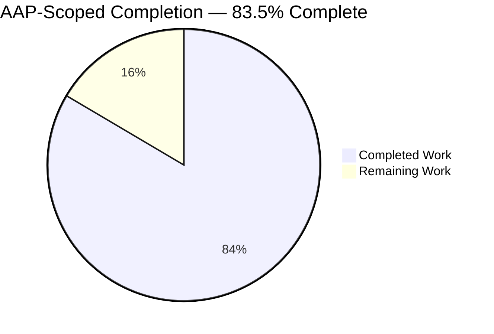
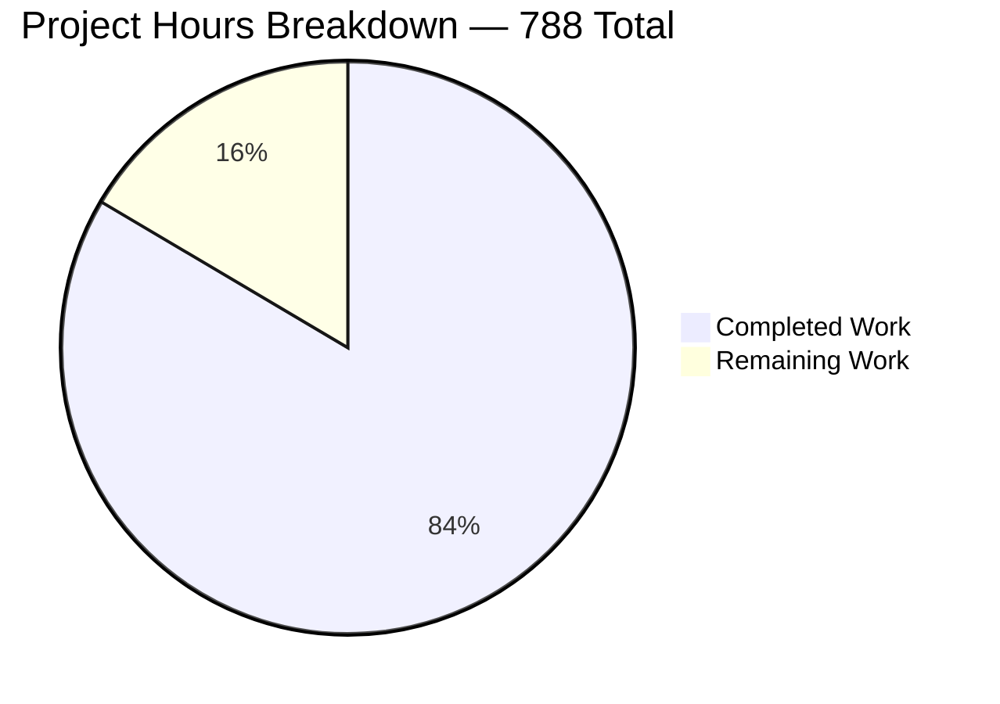
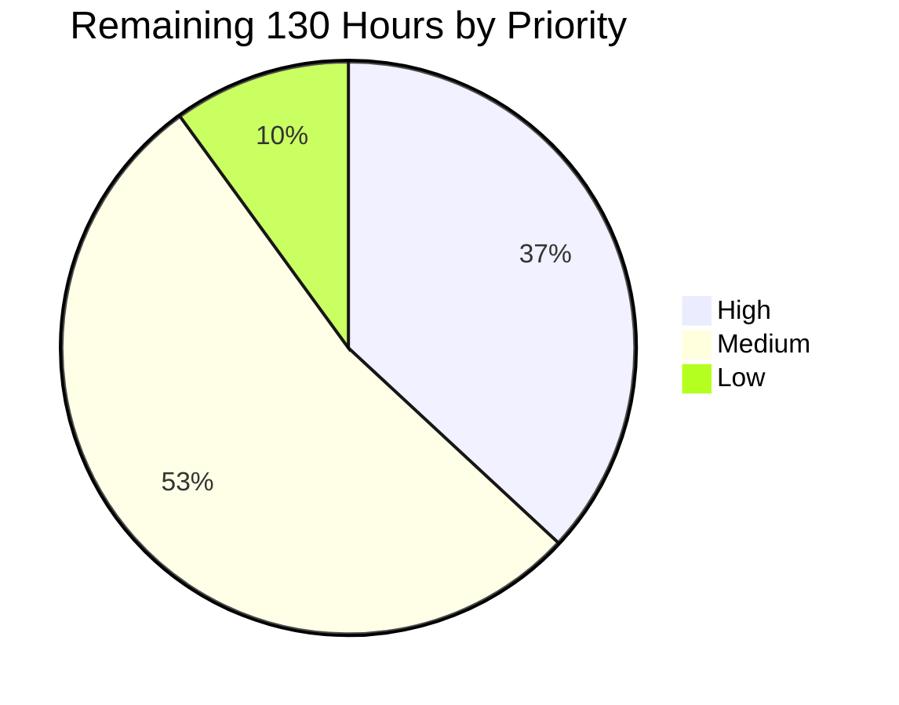

# 1. Executive Summary

## 1.1 Project Overview

AWS CardDemo's card-processing behaviour has been forward-engineered from COBOL running as CICS online transactions and JCL batch jobs over VSAM files into six independently deployable, event-driven microservices under `card-platform/`. One synchronous authorization call now produces exactly one domain event, and three independent services consume it without touching each other. The platform runs on Java 25 and Spring Boot 4.1.0 over Apache Kafka, with a private PostgreSQL schema per service. A parity suite reading CardDemo's own sample data holds every monetary rule to the original COBOL behaviour. It is written for the team that will operate this platform and the stakeholders deciding whether to deploy it.

## 1.2 Completion Status



Chart colours: **Completed = Dark Blue `#5B39F3`**, **Remaining = White `#FFFFFF`**.

| Metric | Value |
| :--- | :--- |
| **Total Hours** | **788** |
| Completed Hours (AI + Manual) | 658 (658 autonomous + 0 manual) |
| Remaining Hours | 130 |
| **Percent Complete** | **83.5%** |

Calculation: 658 completed ÷ (658 completed + 130 remaining) = 658 ÷ 788 = **83.5%**. The figure counts only work the Agent Action Plan scopes plus the standard activities required to put that work into production.

## 1.3 Key Accomplishments

- One authorization call produces exactly one event through a transactional outbox, with zero unpublished rows.
- Three independent consumers act on that event: ledger posting, fraud detection, cardholder notification.
- No service depends on another; a forbidden import fails to compile.
- All four COBOL decline rules reproduce their codes and verbatim texts, including the overlimit precision limit.
- Every monetary computation truncates toward zero; no other rounding mode exists.
- Six private schemas replace eight shared VSAM datasets, with idempotency markers in every consumer.
- 7,413 tests pass, including 229 COBOL parity cases over CardDemo's own fixtures.
- Ten documents, a bidirectional traceability matrix and a sixteen-slide deck ship with the code.

## 1.4 Critical Unresolved Issues

| Issue | Impact | Owner | ETA |
| :--- | :--- | :--- | :--- |
| Deployment manifests have never been applied to a cluster | Scheduling, volume binding and the encrypted storage class are unproven | Platform engineering | 10 h |
| No encryption at rest for the database volume, its backups, or the two schemas holding a card number | A disk or backup image taken from a demo deployment is readable | Platform engineering | 10 h |
| The card verification value is stored in clear text | Three digits per card sit unprotected at rest; they reach no event, log or response, and that non-emission is asserted by test | Security owner | 4 h |
| Four of the ten pipeline stages have never executed on a hosted runner | A security or supply-chain stage could fail on first use for an environmental reason | Build owner | 6 h |
| A reason-0100 decline carries no account identifier and keys on the transaction identifier | Those events are not co-partitioned with the cardholder's other events, and a consumer requiring an account must tolerate null | Integration owner | 6 h |
| Idempotency markers are permanent in all six services | Those tables grow with event volume and no setting bounds them | Data owner | 6 h |
| Twenty-eight dated base-image exceptions expire on 2026-11-30 | The supply-chain stage fails closed after that date | Security owner | 4 h |
| No data-subject export or erasure workflow exists as code | A subject request is discharged by a seven-step operator procedure | Compliance owner | 16 h |

## 1.5 Access Issues

| System/Resource | Type of Access | Issue Description | Resolution Status | Owner |
| :--- | :--- | :--- | :--- | :--- |
| Kubernetes cluster | Deployment target | No cluster is reachable from the build environment, so the eleven manifests and the encryption overlay are render-verified and validated object by object rather than applied | Open — needs a cluster | Platform engineering |
| Hosted pipeline runner | Continuous integration | The workflow has never executed on a runner, and static analysis has produced no report in this environment | Open — needs one full run | Build owner |
| Container image registry | Image publication | No registry is configured, so images stay local and the manifests deliberately refuse a pull | Open — needs a registry and a signing key | Platform engineering |
| Broker administrative interface | Operational inspection | Consumer group offsets cannot be read from inside the broker container here; consumption is observed through each service's own counters and its database rows instead | Workaround in place and sufficient | Platform engineering |

Everything required to build, test and run the platform is present and was exercised: the toolchain, the dependency mirror, the container runtime and all five pinned images.

## 1.6 Recommended Next Steps

1. **[High]** Apply the manifests to a real cluster and confirm the scheduling, volume binding and encrypted storage class a render cannot prove.
2. **[High]** Settle the two card-data decisions together: encryption at rest, and whether the card verification value is dropped or encrypted.
3. **[High]** Run the pipeline once on a hosted runner so its four security and supply-chain stages report for the first time.
4. **[High]** Confirm downstream that a reason-0100 decline may carry a null account and key on the transaction identifier.
5. **[Medium]** Publish, sign and digest-pin the six service images before any shared deployment.

# 2. Project Hours Breakdown

## 2.1 Completed Work Detail

| Component | Hours | Description |
| :--- | ---: | :--- |
| Platform build foundation and dependency governance | 14 | Maven aggregator plus nine module descriptors; enforcer rules pinning the language level, the build tool range, the inter-service dependency ban and transitive security floors (`card-platform/pom.xml`) |
| Event contract library and schema compatibility gate | 40 | Shared envelope, immutable event records, validating serialization on both ends, and fourteen JSON Schema documents over nine event types with a build-failing backward-compatibility test (`card-platform/libs/event-contracts/`) |
| COBOL compatibility library | 36 | Truncating fixed-point arithmetic, picture-clause scale constants, tolerant numeric parsing, date validation preserving the source tolerance, card masking, and three reference-data classes carrying 788 copybook literals (`card-platform/libs/cobol-compat/`) |
| Authorization service | 64 | The one synchronous surface: four decline rule objects, transactional outbox and relay, sole writer of the decision, twenty-four schema migrations (`card-platform/services/authorization-service/`) |
| Ledger posting service | 48 | Per-event posting arithmetic, category-balance upsert, reject recorder and balance projection, replacing the nightly batch window (`card-platform/services/ledger-posting-service/`) |
| Fraud detection service | 38 | Net-new risk assessment with three rule objects and a durable velocity window, consuming asynchronously only (`card-platform/services/fraud-detection-service/`) |
| Notification service | 40 | Card-keyed statement read model, plain-text and markup renderers, four consumers, terminal in the flow (`card-platform/services/notification-service/`) |
| Account and customer service | 58 | Account and customer reads and updates, an eleven-validator edit library, field-level compare-and-swap, and the billing-cycle-close operation (`card-platform/services/account-service/`) |
| Card service | 42 | Card list with the source's page size and lookahead, detail and update, tokenized identifiers and masked responses (`card-platform/services/card-service/`) |
| COBOL equivalence suite and platform contract guards | 56 | Width-tolerant fixture loader, offset-driven copybook parser, nine parity classes, fourteen expected-result oracles, the three-consumer flow test, and the contract guards holding documents, deck, manifests and API surface to the build (`card-platform/equivalence-tests/`) |
| Decision log and bidirectional traceability matrix | 30 | 1,090 decision rows and 1,281 traceability rows mapping every source construct to a target or a documented exclusion (`card-platform/docs/decision-log.md`, `card-platform/docs/traceability-matrix.md`) |
| Architecture, event-flow and data-model documentation | 18 | Paired before and after views, per-event publish and consume paths, and per-service entity relationships across twelve Mermaid figures (`card-platform/docs/architecture-before-after.md`, `event-flow.md`, `data-model.md`) |
| Onboarding, next-task register and service guides | 26 | Clean-machine-to-running-platform guide, a 72-task register in 22 groups, the platform map, six service guides and the new root guide section (`card-platform/docs/onboarding.md`, `suggested-next-tasks.md`) |
| Executive presentation | 20 | Self-contained sixteen-slide deck with three Mermaid figures, twenty icons and the full inline theme (`card-platform/presentation/executive-summary.html`) |
| Prose validation report | 12 | Twenty-six scored targets with a principle-by-principle scorecard and published digests (`card-platform/docs/prose-validation.md`) |
| Business-rule register and equivalence results | 14 | Sixty-six flagged source rules with file and line citations, and the fixture-by-fixture parity record (`card-platform/docs/business-rule-flags.md`, `equivalence-results.md`) |
| Container images and local demo orchestration | 22 | Six identical multi-stage image definitions on a non-root user, an eight-container Compose topology, the documented environment template and the bootstrap and credential scripts (`card-platform/docker-compose.yml`, `card-platform/scripts/`) |
| Kubernetes deployment manifests | 16 | Namespace, broker, database, six deployments and services, configuration and secret templates, an encrypted-storage overlay and an image-loading procedure (`card-platform/deploy/`) |
| Continuous integration pipeline | 24 | Ten fail-closed stages covering compilation, secret scanning, static analysis, unit, integration and equivalence tests, schema compatibility, supply chain, container builds and provenance (`.github/workflows/ci.yml`) |
| Observability instrumentation | 14 | Fourteen metric families per service covering events consumed, processing latency and failure counts, plus structured JSON logging and health and readiness groups |
| Authentication, authorization and data-exposure controls | 26 | Role-scoped HTTP Basic on every business route, a first-party request control on state changes, request throttling, card tokenization, payload masking and log redaction |
| **Total** | **658** | |

## 2.2 Remaining Work Detail

| Category | Hours | Priority |
| :--- | ---: | :--- |
| Apply the deployment manifests to a real cluster and confirm scheduling, volume binding and the encrypted storage class | 10 | High |
| Publish, sign and digest-pin the six service images, then add an admission policy that verifies the signature | 12 | High |
| Choose and apply encryption at rest for the database volume, its backups and the two card-bearing schemas | 10 | High |
| Run the pipeline once on a hosted runner and read the four security and supply-chain stage logs | 6 | High |
| Decide whether to drop or encrypt the card verification value, then run the prepared migration | 4 | High |
| Confirm downstream that a reason-0100 decline may carry a null account and key on the transaction identifier | 6 | High |
| Implement data-subject export and erasure across the five stores holding subject data | 16 | Medium |
| Design and build a compensating path for an authorization whose posting exhausts its retries | 12 | Medium |
| Write the operational run-book, set alert thresholds and build a dashboard over the metric families | 10 | Medium |
| Add an authenticated TLS profile to the local stack | 8 | Medium |
| Choose a retention and archival strategy for the permanent idempotency markers | 6 | Medium |
| Decide whether the sample data or the source's own validation rules are authoritative, then re-seed or amend | 5 | Medium |
| Review the twenty-eight dated base-image exceptions before they expire and re-pin as needed | 4 | Medium |
| Review and sign off the documented divergences, including the published source censuses and the repository footprint | 4 | Medium |
| Decide whether the two reproduced source defects stay reproduced or get corrected | 4 | Medium |
| Adopt a coverage tool and measure line and branch coverage | 6 | Low |
| Widen or truncate the two reservation exposure columns | 3 | Low |
| Move the demo migration overlay below the migration series, or enable out-of-order for that profile | 2 | Low |
| Permit and then make the root guide anchor correction, and republish its digest | 1.5 | Low |
| Delete the contradictory paragraph from the authorization request description | 0.5 | Low |
| **Total** | **130** | High 48 · Medium 69 · Low 13 |

## 2.3 Reconciliation

| Check | Result |
| :--- | :--- |
| Section 2.1 total | 658 h |
| Section 2.2 total | 130 h |
| 2.1 + 2.2 | 788 h — equals Total Hours in Section 1.2 |
| Remaining hours in 1.2, 2.2 and Section 7 | 130 h in all three |
| Completion | 658 ÷ 788 = 83.5% |

Every completed row traces to a named Agent Action Plan deliverable or to a standard path-to-production activity for those deliverables. Every remaining row traces to a plan requirement still open or to a gap between a working demonstration and a deployable service. Confidence is high on the six services, both shared libraries and the equivalence suite, because each is exercised by tests whose results were observed. Confidence is moderate on the cluster, registry and pipeline items, whose effort depends on infrastructure not present here.

# 3. Test Results

Every figure below comes from one full `mvn -B clean verify` run of the delivered tree: BUILD SUCCESS across all ten reactor projects in 9 minutes 3 seconds, with zero `[WARNING]` and zero `[ERROR]` lines. The platform's own count oracle, `card-platform/scripts/check-published-test-counts.sh`, was run against the same build and agrees with every figure the repository publishes.

| Area / Category | Framework | Tests | Passed | Failed | Coverage | What This Proves |
| :--- | :--- | ---: | ---: | ---: | :--- | :--- |
| Authorization decision and single-event publication | JUnit 5 + Testcontainers | 933 | 933 | 0 | Not measured | Four decline rules short-circuit in source order and one call commits one decision with one outbox row |
| Event fan-out to three independent consumers | JUnit 5 + Testcontainers | 2,347 | 2,347 | 0 | Not measured | Ledger, fraud and notification each act on the authorization event alone, with duplicate delivery absorbed |
| Account, customer and card query and update surface | JUnit 5 + Testcontainers | 2,844 | 2,844 | 0 | Not measured | The source's edit library, compare-and-swap, cycle close and lookahead paging behave as the COBOL specifies |
| Event contracts and schema compatibility | JUnit 5 | 337 | 337 | 0 | Not measured | A schema change that would break an existing consumer fails the build |
| COBOL fixed-point, parsing, date and masking primitives | JUnit 5 | 130 | 130 | 0 | Not measured | Money truncates toward zero, tolerant parsing matches the source, and the card verification value never reaches output |
| COBOL equivalence parity over CardDemo's own fixtures | JUnit 5 + Failsafe (9 classes) | 229 | 229 | 0 | Not measured | Posting, all four decline reasons, interest rate rules, bill payment, truncation and verbatim messages match the documented source behaviour |
| One-call three-consumer flow, end to end | JUnit 5 + Testcontainers | 4 | 4 | 0 | Not measured | Each consumer's application context holds no sibling consumer, asserted once per consumer |
| Platform contract guards (documents, deck, manifests, API surface, supply chain) | JUnit 5 | 589 | 589 | 0 | Not measured | Published counts, digests, links, manifest structure and rationale placement cannot drift from the code |
| **Total** | | **7,413** | **7,413** | **0** | | 6,810 unit and 603 integration cases, zero skipped |

**Not Covered**

- **Line and branch coverage are not measured anywhere.** No coverage agent is configured in any of the ten build descriptors. Sensitivity is instead evidenced by planted-defect probes, but a human should adopt a coverage tool before treating any module as fully exercised.
- **The Kubernetes manifests are not exercised as a running deployment.** The base and the encryption overlay each render twenty-nine objects and every object passes client-side validation, but nothing was ever created on a cluster, so scheduling, persistent-volume binding and the encrypted storage class taking effect are untested. Test these on a real cluster before deploying.
- **Four of the ten pipeline stages have never executed.** Secret scanning, static analysis, supply chain and provenance were each exercised locally at their pinned versions, but the workflow has not run on a hosted runner and static analysis has produced no report. Run the pipeline once and read those four logs.
- **The reserved card-destruction migration has no file.** Only a contract test asserts its reserved version; nothing executes it. Write and test it before relying on the documented destruction procedure.
- **Decline reason 0103 is not reachable against the seeded data**, because the demo overlay extends every account expiry. The reason is proven by the parity oracle rather than by a live call; exercise it against unextended data if a live demonstration matters.
- **The cycle-exposure reservation columns are not driven to their ceiling.** Reaching it needs roughly eleven maximum-amount approvals inside one fifteen-minute window, which no test constructs.
- **Consumer group lag is not read from the broker.** Consumption and dead-letter depth are evidenced by each service's own counters and by the rows its consumers wrote; add broker-side offset inspection where an operator needs it.

# 4. Runtime Validation & UI Verification

The eight-container stack was started with `card-platform/scripts/start-demo.sh` and reached all-healthy in about seventy seconds. Every line below was observed against that running stack.

- ✅ **Start-up** — Six images built, eight containers healthy: the broker, the database and all six services. Health answers `UP` anonymously on management ports 9081 through 9086, with both the liveness and readiness groups `UP`.
- ✅ **Authentication and authorization** — Business routes require HTTP Basic and answer `401` anonymously. Metrics answer `401` anonymously and `200` for the monitoring identity. A state-changing request without the first-party request header is refused `403`; with it, `200`.
- ✅ **Authorization approval** — `POST /authorizations` with the first fixture card returned `200` with transaction `0000001000000003`, account `00000000050`, approved. Exactly one decision row and exactly one published outbox row keyed on the account. Zero unpublished rows in the whole table.
- ✅ **Authorization decline** — A large amount returned `200` with reason `0102 OVERLIMIT TRANSACTION` and published a declined event keyed on the account. An unresolved card returned `422` with reason `0100 INVALID CARD NUMBER FOUND`.
- ✅ **Ledger posting** — From that one event the ledger wrote the transaction at `504.77` and moved the projection to `current_balance 1556.05`, `cycle_credit 1064.05` — penny-exact against the source arithmetic. A reject row was written for the declined transaction.
- ✅ **Fraud detection** — From the same event, and never in the response path, an assessment was written with a risk score and a flag.
- ✅ **Notification** — From the same flow, one statement row and four notification-log rows. `GET /notifications/{cardToken}` returns the card-keyed read model with the card number masked to `************5740`, its transaction count and its total.
- ✅ **Consumer independence and idempotency** — Exactly three consumer groups read the authorization topic out of eleven groups in total, and every consumer schema carries its processed-event markers. Across every service: zero failures and zero dead letters.
- ✅ **Query surface** — Account, customer, balance, fraud-assessment, card list and card detail all answer `200`; a card list without its account filter answers `400` with the published text; card responses carry only masked numbers.
- ⚠ **Deployment manifests** — Render-verified only. Base and overlay each produce twenty-nine objects that pass client-side validation, and the overlay adds the encrypted storage class to both claims, but no object was ever created because no cluster is reachable here.

**Never exercised at runtime**

The Kubernetes manifests have never been applied, so no pod was scheduled, no volume was bound and no storage class took effect. The four security and supply-chain pipeline stages have never run on a hosted runner. The reserved card-destruction migration has no file and nothing executes it. There is no user interface in this platform by design — the source's 3270 screens have no counterpart, and the only synchronous surface is REST — so no interface verification applies. The one HTML artefact, the executive deck, is a presentation for people rather than an application screen; it renders its sixteen slides, three diagrams and twenty icons with no console output.

# 5. Compliance & Quality Review

## 5.1 Compliance Matrix

| Deliverable / Benchmark | Requirement | Verified Status | Evidence |
| :--- | :--- | :--- | :--- |
| One event per authorization | Exactly one event per synchronous call, published through an outbox | ✅ Pass | One decision row, one published outbox row, zero unpublished rows, observed live |
| At least three independent consumers | Three services consume that event with no coupling | ✅ Pass | Three consumer groups on the authorization topic; each context holds no sibling consumer |
| No synchronous coupling between consumers | A forbidden dependency must not compile | ✅ Pass | Every service declares only the two shared libraries; an enforcer rule bans the rest (`card-platform/pom.xml`) |
| Database per service | No shared store | ✅ Pass | Six databases, one private schema each, no cross-schema read |
| Idempotency in every consumer | Duplicate delivery must not double-process | ✅ Pass | Processed-event markers in all six services, written with the side effect |
| Versioned, schema-defined events | Backward compatibility enforced, not conventional | ✅ Pass | Fourteen JSON Schema documents over nine event types; a compatibility test fails the build |
| Equivalence with the source business logic | Identical results for account, card, transaction and interest rules | ✅ Pass | 229 parity cases over CardDemo's own fixtures, citing COBOL line ranges |
| Truncating monetary arithmetic | Never round; the source has no rounding phrase | ✅ Pass | `RoundingMode.DOWN` is the only rounding mode anywhere in the tree |
| Observability | Structured logs plus events consumed, latency and failure count | ✅ Pass | Fourteen metric families per service, all three named families live |
| Original COBOL source unmodified | Nothing under the legacy trees may change | ✅ Pass | Zero changed files under `app/`, `diagrams/` or `samples/`; the root guide is additive only |
| Runnable end to end in a demo environment | One command to a working stack | ✅ Pass | Eight containers healthy, the full fan-out exercised through it |
| Rules 1–5 deliverables | Decision log and traceability, Mermaid before and after, onboarding and next tasks, executive deck, prose validation | ✅ Pass | 1,090 decision rows, 1,281 traceability rows, twelve diagrams, a 72-task register, sixteen slides at the exact pinned versions, twenty-six prose targets all clean |

## 5.2 AAP & Rule Divergences and Gaps

| # | What the AAP/Rule Required | What Was Delivered Instead | Why It Diverged | Impact | Remediation |
| :-- | :--- | :--- | :--- | :--- | :--- |
| 1 | A declined event carries transaction, account and reason, and the envelope's aggregate is always the account and always the message key | A reason-0100 decline carries a null account and keys on the sixteen-character transaction identifier, under a dedicated schema version | An unresolved card has no account to name, and inventing a sentinel would put a false value on a partition a real cardholder owns | Those events are not co-partitioned with the cardholder's other events; a consumer requiring an account must tolerate null on this one reason | Confirm downstream, or commission an account-less decline stream (6 h) |
| 2 | The plan's target-state figure draws the authorization rules reading the account and card services synchronously | The rules read local replicas kept current by account and card events; no service holds an HTTP client | The event-fed replica removes the last synchronous hop from the decision path | None adverse — the no-coupling requirement is met more strongly than drawn | None. Confirm the replica model is the intended reading |
| 3 | Supporting services publish only when a state change occurs | The account service also publishes after consuming a posted transaction | A posting rewrites the account record in the source, so it is a state change; the plan's own field-provenance chain requires the account, the rule and the cycle close to move together | None adverse — this is what keeps the overlimit rule correct | None. Recorded in the decision log |
| 4 | The card verification value is persisted and never emitted; payment-card controls beyond masking are out of scope | The column is retained in clear text under a formal exception naming its controls | Three plan sections mandate persisting it, and removing the column would break the card seed load and the parity fixtures | Three digits per card sit unprotected at rest, seeded with synthetic data only | Decide between dropping and encrypting; the migration is drafted (4 h) |
| 5 | Every existing section of the root guide is preserved verbatim | One table-of-contents anchor in the legacy guide still does not resolve | The fragment predates this work, the plan freezes that region, and a published digest enforces the freeze | One dead link of 536 in the legacy guide; no platform link is affected | Permit the change, make a byte-precise edit, republish the digest (1.5 h) |
| 6 | The plan states twenty-six flagged business rules, nineteen transactions, nineteen programs and sixteen mapsets | The register holds sixty-six entries; the published census reads eighteen transactions, eighteen programs, seventeen mapsets and eight files | Each figure was measured from the source rather than copied from the plan, and the plan directs that the source governs where the two disagree | Documentation only; the register, the deck and the platform guide agree with each other and with the source | Confirm the measured figures supersede the plan's prose (part of a 4 h review) |
| 7 | Two files change outside the platform directory, and the pipeline builds, tests and packages | Four files change outside it, and the pipeline runs ten fail-closed stages | The extra two are a commit-pinned composite action and a static-analysis query configuration; the extra stages implement security requirements the plan does not describe but does not forbid | The footprint and pipeline are wider than described; every added stage fails closed, so a green run says more than before | Confirm the footprint and stage set (part of a 4 h review) |
| 8 | Additive behaviour must be declared, and source defects reproduced rather than silently fixed | Correlation travels in message headers rather than a sixth envelope field; a database sequence replaces the identifier race; a reject code the source ignored is now an observable failure; the deck reflows below its fixed stage and leaves diagram labels in the library's own typeface | Each is a declared addition or a deliberate visibility choice, taken where reproducing the source exactly would reproduce silence or break another requirement | None adverse; all four are recorded with their reasoning | Confirm the reproduced defects stay reproduced (4 h) and correct one contradictory contract paragraph (0.5 h) |

**1 — A decline with no account.** An unresolved card fails the cross-reference lookup before any account is resolved, so the platform has nothing truthful to put in the account field. It answers `422` with reason `0100` and its verbatim text, and publishes a declined event under schema version 2 in which the aggregate is the transaction identifier. Verified live: the refusal returned `{"accountId":null,"declineReasonCode":"0100"}` and the outbox row carried `aggregateId` equal to the transaction. The alternative — a sentinel account — would write a false value onto a partition a real cardholder owns. Decide whether every consumer tolerates a null account and a transaction-keyed partition for this one reason; if any must see these refusals ordered with the cardholder's other events, that needs its own topic and key strategy, which is a contract change.

**2 — Replicas instead of synchronous reads.** The plan's target diagram shows the authorization service calling the account and card services over HTTP while a decision is in flight. The delivered service reads its own `card_xref` and `account_credit_snapshot` tables, refreshed by the account-state and card-updated events, and no service in the platform holds an HTTP client at all. The effect is that the decision path touches nothing it does not own, which satisfies the "must not block the authorization response" requirement more strongly than the drawing does. The trade is replica freshness: a decision uses the account state as of the last consumed event. Confirm that reading is intended; the reasoning is in the decision log.

**3 — The account service publishes on posting.** The plan describes the supporting services as publishing only on a state change. The account service also publishes after consuming a posted transaction, because in the source a posting rewrites the account record — it is a state change, not a read. The plan's own field-provenance chain makes this necessary: the account entity, the overlimit rule and the cycle-close operation all read the same cycle accumulators, so the account record has to receive the posted amount for the rule to stay correct. No synchronous call is added and no consumer learns about another. Nothing to do beyond noting that the plan's wording is narrower than its own data model.

**4 — A clear-text verification value.** Three plan sections require the card verification value to be persisted and never emitted, and place payment-card controls beyond masking out of scope. The column therefore remains in the card schema in clear text, with three compensating properties asserted by test rather than claimed: it reaches no event, no log and no API response. The seeded values are synthetic fixture data. Removing the column would break the card seed load and the parity fixtures that read it, which is why it survived. A human owns the choice between dropping the column and encrypting it; the destruction migration is drafted and the follow-up register names every file either answer touches.

**5 — One dead link that may not be fixed.** The legacy guide's first table-of-contents entry points at a slug its own heading does not produce. The fix is one character, and it was deliberately not made: the plan requires every existing section of that guide preserved verbatim, a published digest enforces the freeze, and the broken fragment is present in the repository's first commit, so it predates this work entirely. Placing a substitute anchor inside the newly added section was considered and rejected as worse than a dead link, because it would resolve and land the reader in the wrong document. Of 536 local links, 535 resolve and the single failure is this frozen line. Closing it means permitting the change first, then a byte-precise edit — that file is carriage-return terminated throughout — and republishing the digest.

**6 — Measured counts against planned counts.** Three published figures differ from the plan's prose: the flagged-rule register holds sixty-six entries where the plan states twenty-six, the resource census reads eighteen transactions, eighteen programs, seventeen mapsets and eight files where the plan states nineteen, nineteen, sixteen and eight, and the copybook buckets split nine and five rather than eight and six. Each delivered figure was measured from the source directly, and the plan itself directs that where the specification and the source disagree the source governs. The register grew because the plan's constraint to flag any ambiguous rule keeps applying as more are surfaced, and its identifiers are never renumbered because other documents cite entries by number. Nothing behavioural depends on any of it; confirm the measured figures supersede the prose.

**7 — A wider footprint and a longer pipeline.** The plan enumerates exactly two files outside the platform directory. Four changed: the workflow and the root guide as planned, plus a commit-pinned composite build action and a static-analysis query configuration, both under `.github/`. The pipeline also runs ten stages where the plan describes building, testing and packaging; the extra four cover secret scanning, static analysis, supply chain and provenance. Neither addition alters application behaviour, and every added stage fails closed, so a green pipeline is a stronger statement than the planned one rather than a weaker one. The decision is whether the wider footprint and stage set are wanted before the pipeline runs on paid infrastructure.

**8 — Declared additions and deliberate visibility.** Four smaller departures share one shape: reproducing the plan or the source exactly would have cost something the requirements value more. Correlation identifiers travel in two message headers and the logging context rather than a sixth envelope field, because the plan fixes the envelope at five fields and headers leave all fourteen schemas untouched. A database sequence replaces the source's browse-backwards identifier allocation, which is a read-modify-write race. A reject code the source assigns and then never inspects is now a real consumer failure that reaches the dead-letter topic, because reproducing it faithfully would reproduce silence. And the deck reflows one slide at a time below the point where its fixed stage can no longer fit, and leaves diagram labels in the diagram library's own typeface, because overriding it moves the glyph widths the shapes were measured for. Confirm the reproduced source defects — the refund sign convention and the overlimit precision narrowing — stay reproduced, and delete one contradictory paragraph from the authorization request description.

# 6. Risk Assessment

These are forward-looking risks: what could still go wrong once this platform is deployed and operated. Each carries the mitigation already in place.

| Risk | Category | Severity | Probability | Mitigation | Status |
| :--- | :--- | :--- | :--- | :--- | :--- |
| The deployment manifests have never been applied, so scheduling, persistent-volume binding and the encrypted storage class taking effect are unproven | Technical | High | Medium | Base and overlay each render twenty-nine objects; every object passes client-side validation; two containment tests hold the overlay's structure on every build | Open |
| No encryption at rest for the database volume, its backups, or the two schemas holding a card number | Security | High | Medium | The cluster overlay supplies an encrypted storage class for both claims; the local stack binds to loopback only and holds synthetic fixtures | Open |
| The card verification value sits in clear text in the card schema | Security | High | Low | It reaches no event, no log and no API response, and each of those properties is asserted by test rather than claimed; seeded values are synthetic; a destruction migration is drafted | Accepted pending an owner decision |
| Refusals under reason 0100 are not co-partitioned with a cardholder's other events, so a consumer that requires an account under-reads them | Integration | Medium | Medium | The refusals are durable in the authorization tables and the `422` response carries the reason and its verbatim text; the posture is published in the equivalence results | Open |
| Four pipeline stages have never executed on a hosted runner, and static analysis has produced no report | Integration | Medium | Medium | Every tool version, digest and threshold was exercised locally at its pinned version, and every stage fails closed, so a first-run problem is loud rather than silent | Open |
| Idempotency markers are permanent, so those tables grow with event volume and no setting bounds them | Operational | Medium | High | Deliberate: a marker that expires before the side effect it guards is no guard, and the balance arithmetic is not idempotent by key. Rows are narrow and indexed | Accepted, needs an archival strategy |
| Twenty-eight dated base-image exceptions expire on 2026-11-30, after which the supply-chain stage fails | Security | Medium | High | Each exception is package-scoped and dated rather than blanket, and the pinned broker and database versions are matched to the client library on purpose | Open with a known date |
| An authorization whose posting exhausts its retries has no compensating path, and no run-book or alert threshold sits over the metric surface | Operational | Medium | Low | Dead-letter routing captures the message with its failure metadata; failure and dead-letter counters are live on every service; health and readiness answer on six management ports | Open |

The final row also carries the smaller residual items: the local stack's traffic is unencrypted between processes on one machine, the service images are unsigned and their tags mutable, a developer who pulls a new migration after running the demo meets an ordering refusal until the volumes are cleared, line coverage is unmeasured, the reservation exposure columns could overflow under a sustained burst on one account, and the sample data carries values the source's own edit rules refuse.

# 7. Visual Project Status

### Overall Progress



Slice colours: **Completed Work = Dark Blue `#5B39F3`**, **Remaining Work = White `#FFFFFF`**.

### Remaining Work by Priority



### Remaining Hours by Category

| Category | Hours | Share |
| :--- | ---: | :--- |
| Deployment, images and cluster validation | 32 | ████████████ 25% |
| Data protection and subject rights | 30 | ███████████ 23% |
| Resilience and operations | 22 | ████████ 17% |
| Contract and decision confirmations | 24 | █████████ 18% |
| Local transport hardening | 8 | ███ 6% |
| Test tooling and small corrections | 14 | █████ 11% |
| **Total** | **130** | **100%** |

### Delivered Scope at a Glance

| Dimension | Delivered |
| :--- | ---: |
| Maven modules building green | 10 |
| Services, each owning a private schema | 6 |
| Event types under versioned schemas | 9 |
| Schema migrations | 81 |
| Automated tests passing | 7,413 |
| COBOL parity cases | 229 |
| Authored documents and the executive deck | 11 |

# 8. Summary & Recommendations

The card-processing behaviour of AWS CardDemo now exists as six event-driven services beside the original COBOL, which was not touched. The acceptance test the requirement set out is met and was watched happening: one `POST /authorizations` produced exactly one decision row and exactly one event, and ledger posting, fraud detection and cardholder notification each acted on that event independently. None of the three can reach another — every service declares only the two shared libraries, so a forbidden import fails to compile rather than failing review. Eight shared VSAM datasets became six private database schemas, and the nightly posting window became a consumer that runs per event. Against the Agent Action Plan's scope plus the standard work of putting it into production, the project is **83.5% complete: 658 hours delivered of 788 total, with 130 remaining.**

Correctness against the original was treated as the contract rather than an aspiration, and it holds where it is hardest to see. Money truncates toward zero at every arithmetic site because the source carries no rounding phrase anywhere; `RoundingMode.DOWN` is the only rounding mode in the tree, so a future contributor cannot quietly introduce half-up. All four decline reasons reproduce their codes and their verbatim texts, and a synthetic case reaches the overlimit precision limit that the sample data never does. Interest calculation was verified without being migrated, exactly as scoped: the rate rules and the default-group fallback are proven while the batch program stays where it is. 7,413 tests pass with zero failures, 229 of them comparing this platform against documented COBOL behaviour over CardDemo's own fixture files.

What remains is almost entirely the distance between a demonstration that works and a service someone can operate. The manifests render and validate but have never been applied, so scheduling, volume binding and the encrypted storage class are unproven. Four of the ten pipeline stages have never run on a hosted runner. The images are not published, signed or pinned by digest. Nothing is encrypted at rest, and the card verification value sits in clear text under an exception the plan itself mandates — it reaches no event, log or response, and that is asserted by test rather than merely claimed, but a human still owns the choice between dropping the column and encrypting it. A subject request is currently discharged by an operator following seven steps rather than by code. None of these is a defect in what was built; each is an owner decision, or a piece of infrastructure this environment does not have.

Three things deserve a decision rather than an engineer. The first is the reason-0100 decline, which carries no account and keys on the transaction identifier because an unresolved card has no account to name — every consumer needs to tolerate that, or those refusals need their own stream. The second is the pair of source defects this platform reproduces on purpose, the refund sign convention and the overlimit precision narrowing, both flagged and both waiting on an owner to say whether parity or correctness wins. The third is the set of measured figures that differ from the plan's prose, where the source was taken as authoritative and the difference published rather than hidden.

**Production readiness: ready for a controlled pilot, not yet for unattended production.** The functional and correctness bar is met and evidenced; the operational bar is not. The critical path is short and ordered: apply the manifests to a real cluster, run the pipeline once end to end, settle the two card-data questions together, then publish and sign the images. That is roughly forty-eight hours of high-priority work. Success afterwards is measurable in the platform's own terms — consumer failure and dead-letter counters staying at zero under real traffic, the parity suite staying green on every build, and the count and digest guards continuing to fail the build the moment a published figure drifts from the code.

# 9. Development Guide

Every command below was run in this repository and produced the result described. All paths are relative to the repository root unless a command changes directory.

### System Prerequisites

| Tool | Version exercised | Why |
| :--- | :--- | :--- |
| Eclipse Temurin OpenJDK | 25.0.4+7 | Compiles and runs all ten reactor projects at release 25. The build refuses anything else |
| Apache Maven | 3.9.16 | Builds the reactor. The enforcer refuses Maven 4 and untested 3.9 patches |
| Docker Engine | 29.7.0 | Runs the demo stack and the container-backed tests |
| Docker Compose | v5.3.1 | Starts the broker, the database and the six services |
| OpenSSL | 3.5.3 | Generates the local passwords and the card-token key |
| curl | 8.14.1 | Reads health endpoints and sends every request below |
| git | 2.51.0 | Clone, and the ignore rules the scripts rely on |

No standalone Kustomize is required; the renderer embedded in `kubectl` is enough. No mainframe, COBOL compiler or emulator is needed or permitted — the services read the documented behaviour of the COBOL, never the mainframe.

```bash
java -version          # openjdk version "25.0.4" ... Temurin-25.0.4+7
mvn -v | head -1       # Apache Maven 3.9.16
docker --version       # Docker version 29.7.0
docker compose version # Docker Compose version v5.3.1
```

### Environment Setup

The environment file and the demo logins are generated, never committed. Both are git-ignored and both are written with owner-only permissions.

```bash
cd card-platform
mvn -B -q package -DskipTests     # needed first: the generator reads a crypto library from the local repository
scripts/generate-env.sh           # writes .env (136 assignments) and .demo-credentials (four logins)
ls -l .env .demo-credentials      # both -rw-------
```

Four demo identities are produced, each with one role: `admin001` administrator, `acquirer1` the acquiring network that submits authorizations, `user0001` a cardholder, `monitor01` monitoring. Read one when you need it:

```bash
cd card-platform
export ACQUIRER_PASSWORD=$(grep -E '^acquirer1=' .demo-credentials | cut -d= -f2)
export ADMIN_PASSWORD=$(grep -E '^admin001=' .demo-credentials | cut -d= -f2)
export MONITOR_PASSWORD=$(grep -E '^monitor01=' .demo-credentials | cut -d= -f2)
```

### Build and Test

```bash
cd card-platform
mvn -B clean verify
```

Expected: `BUILD SUCCESS`, ten reactor projects, about nine minutes, **6,810 unit and 603 integration cases with zero failures, zero errors and zero skips**, and no `[WARNING]` lines. Docker must be running — the integration and parity suites start real database and broker containers.

`mvn test` alone will **not** prove parity. Unit execution excludes the nine `*EquivalenceTest` classes and the integration phase runs them, so only `verify` compares this platform against the COBOL. Confirm the published figures against your own build:

```bash
cd card-platform
scripts/check-published-test-counts.sh
```

That prints `Every published test count matches this build: 6810 Surefire and 603 Failsafe cases across 9 modules.` and exits 0.

### Application Startup

```bash
cd card-platform
scripts/start-demo.sh        # builds six images, then starts eight containers
```

The script preflights its own prerequisites before it changes anything. It reaches eight healthy containers in about seventy seconds once the images exist, longer on the first run while they build. Stop and discard state with:

```bash
cd card-platform
docker compose down --volumes
```

### Verification Steps

```bash
# Step one: every service is up. Health is anonymous by design
for port in 9081 9082 9083 9084 9085 9086; do
  printf '%s %s\n' "$port" "$(curl -fsS http://localhost:${port}/actuator/health | head -c 40)"
done
# each line reports "status":"UP"

# Step two: the probe groups a scheduler would use
curl -fsS http://localhost:9081/actuator/health/readiness
curl -fsS http://localhost:9081/actuator/health/liveness

# Step three: metrics are not anonymous
curl -s -o /dev/null -w '%{http_code}\n' http://localhost:9081/actuator/metrics                        # 401
curl -s -o /dev/null -w '%{http_code}\n' -u "monitor01:${MONITOR_PASSWORD}" \
     http://localhost:9081/actuator/metrics                                                            # 200

# Step four: a state change needs the first-party request header
curl -s -o /dev/null -w '%{http_code}\n' -X POST -u "admin001:${ADMIN_PASSWORD}" \
     -H 'Content-Type: application/json' -d '{}' \
     http://localhost:8085/accounts/00000000050/cycle-close                                            # 403
curl -s -o /dev/null -w '%{http_code}\n' -X POST -u "admin001:${ADMIN_PASSWORD}" \
     -H 'X-CardDemo-Request: local' -H 'Content-Type: application/json' -d '{}' \
     http://localhost:8085/accounts/00000000050/cycle-close                                            # 200
```

### Example Usage

Authorize one transaction and watch three services react to the single event it produces.

```bash
cd card-platform
CARD_NUMBER=$(sed -n '1s/^\(.\{16\}\).*/\1/p' ../app/data/ASCII/cardxref.txt)
CAPTURED_AT="$(date -u +'%Y-%m-%d %H:%M:%S').000000"
PROCESSED_AT="$(date -u +'%Y-%m-%d-%H.%M.%S').000000"

curl -sS -X POST http://localhost:8081/authorizations \
  -u "acquirer1:${ACQUIRER_PASSWORD}" \
  -H 'X-CardDemo-Request: local' \
  -H 'Content-Type: application/json' \
  -d "{\"cardNumber\":\"${CARD_NUMBER}\",
       \"transactionTypeCode\":\"01\",
       \"transactionCategoryCode\":\"0001\",
       \"source\":\"POS TERM\",
       \"description\":\"Local purchase\",
       \"amount\":\"+00000504.77\",
       \"merchantId\":\"800000000\",
       \"merchantName\":\"Abshire-Lowe\",
       \"merchantCity\":\"North Enoshaven\",
       \"merchantZip\":\"72112\",
       \"originTimestamp\":\"${CAPTURED_AT}\",
       \"processingTimestamp\":\"${PROCESSED_AT}\"}"
```

Response — a transaction identifier from a database sequence, the account the card resolved to, and the decision:

```json
{"transactionId":"0000001000000003","accountId":"00000000050","approved":true,
 "declineReasonCode":null,"declineReasonDescription":null}
```

The amount uses the source's signed picture form. Raise it past the credit limit and the same call answers `200` with `"declineReasonCode":"0102"` and `"OVERLIMIT TRANSACTION"` — a decline is expected traffic, not an error. Send a card the cross-reference does not hold and it answers `422` with `"0100"` and `"INVALID CARD NUMBER FOUND"`.

Read what the three consumers did with that one event:

```bash
curl -s -u "admin001:${ADMIN_PASSWORD}" http://localhost:8082/balances/00000000050
curl -s -u "admin001:${ADMIN_PASSWORD}" http://localhost:8083/fraud-assessments/0000001000000003
curl -s -u "admin001:${ADMIN_PASSWORD}" http://localhost:8085/accounts/00000000050
curl -s -u "admin001:${ADMIN_PASSWORD}" 'http://localhost:8086/cards?accountId=00000000050'
```

The card list returns masked numbers only — `"cardNumber":"************5740"` — while the decision itself ran on the full sixteen digits. Card-keyed routes take a sixty-four character lower-case hexadecimal token as a path variable, not a card number:

```bash
cd card-platform
CARD_TOKEN=$(docker exec -e PGPASSWORD="$(grep -E '^POSTGRES_PASSWORD=' .env | cut -d= -f2)" \
  card-platform-postgres psql -U carddemo -d carddemo_notification -tAc \
  "select card_token from notification_service.statement_transaction limit 1" | tr -d '[:space:]')

curl -s -u "admin001:${ADMIN_PASSWORD}" http://localhost:8084/notifications/${CARD_TOKEN}
```

That returns the card-keyed read model, masked: `{"cardNumber":"************5740","transactionCount":4,"totalAmount":"1064.05","transactions":[...]}`.

Read the fan-out from the services' own counters — this is the observability surface the requirement asked for:

```bash
for port in 9081 9082 9083 9084; do
  curl -s -u "monitor01:${MONITOR_PASSWORD}" \
    "http://localhost:${port}/actuator/metrics" | tr ',' '\n' | grep -oE 'carddemo\.[a-z.]*events\.consumed'
done
```

### Troubleshooting

- **`mvn test` passes but parity is unproven.** Unit execution excludes the nine `*EquivalenceTest` classes. Run `mvn -B clean verify`.
- **Integration tests fail to start containers.** Docker must be running and able to pull or find `postgres:18.4` and `apache/kafka:4.2.1` locally. Check `docker info` first.
- **A new module compiles at the wrong language level.** Set both the version property and the compiler release in its descriptor. The enforcer admits release 25 only, which closes the trap, but a module that sets neither inherits a default that is not 25.
- **Everything starts declining after a while.** The billing-cycle accumulators never reset by themselves. `POST /accounts/{id}/cycle-close` with the first-party header zeroes them, reproducing the only source code that does so.
- **A monetary result is a cent out.** Every computation must truncate toward zero. `RoundingMode.DOWN` is the only rounding mode in the tree; introducing half-up anywhere breaks parity silently, and the truncation suite exists to catch it.
- **A timestamp comparison fails on every record.** The processing timestamp carries two significant fractional digits followed by four fixed zeros. Truncate to hundredths before comparing.
- **A request returns `403` when the caller clearly has permission.** State-changing requests require the `X-CardDemo-Request` header. Business routes require HTTP Basic; health does not; metrics do.
- **A route returns `400` for a card number.** Card-keyed routes take the sixty-four character token, not the card number.
- **Flyway refuses to start after pulling changes.** A migration added below the demo overlay version numbers out of order against a volume that already ran the demo. `docker compose down --volumes` clears it; a fresh clone is unaffected.
- **An unhealthy service takes longer to detect than expected.** Detection lands near 176 seconds rather than the 120 the interval arithmetic suggests, because each failing probe spends its own time on top of the interval. Lower the interval, not just the retry count.
- **Running two stacks at once.** Move `CLONE_INDEX` **and** all fourteen host ports **and** the `GROUP_*` consumer group names. `CLONE_INDEX` moves no port on its own. Container-backed tests need none of this — they bind ephemeral ports.

# 10. Appendices

## A. Command Reference

| Purpose | Command | Directory |
| :--- | :--- | :--- |
| Full build, all tests, parity proof | `mvn -B clean verify` | `card-platform` |
| Compile and package without tests | `mvn -B -q package -DskipTests` | `card-platform` |
| One module and its dependencies | `mvn -B -am -pl services/authorization-service verify` | `card-platform` |
| Generate the environment file and demo logins | `scripts/generate-env.sh` | `card-platform` |
| Confirm published test counts against your build | `scripts/check-published-test-counts.sh` | `card-platform` |
| Review the deck's content-delivery advisories | `scripts/check-cdn-advisories.sh` | `card-platform` |
| Start the eight-container stack | `scripts/start-demo.sh` | `card-platform` |
| Stop and discard all state | `docker compose down --volumes` | `card-platform` |
| Container status | `docker compose ps` | `card-platform` |
| Follow one service's logs | `docker compose logs -f authorization-service` | `card-platform` |
| Validate the Compose topology | `docker compose config --quiet` | `card-platform` |
| Render the base manifests | `kubectl kustomize deploy/k8s` | `card-platform` |
| Render the encrypted-storage overlay | `kubectl kustomize deploy/overlays/encrypted-storage` | `card-platform` |
| Load local images for a cluster | `deploy/k8s/load-images.sh` | `card-platform` |
| Open a database session | `docker exec -it -e PGPASSWORD="$(grep -E '^POSTGRES_PASSWORD=' .env \| cut -d= -f2)" card-platform-postgres psql -U carddemo -d carddemo_authorization` | `card-platform` |

## B. Port Reference

| Port | Service | Purpose | Binding |
| ---: | :--- | :--- | :--- |
| 8081 | authorization-service | The one synchronous business surface | 127.0.0.1 |
| 8082 | ledger-posting-service | Balance queries | 127.0.0.1 |
| 8083 | fraud-detection-service | Assessment queries | 127.0.0.1 |
| 8084 | notification-service | Cardholder alert history | 127.0.0.1 |
| 8085 | account-service | Accounts, customers, billing-cycle close | 127.0.0.1 |
| 8086 | card-service | Card list, detail, update | 127.0.0.1 |
| 9081–9086 | all six services | Health, readiness, liveness and metrics, in service order | 127.0.0.1 |
| 5432 | postgres | Six private databases | 127.0.0.1 |
| 9092 | kafka | Event backbone | 127.0.0.1 |

Containers listen on 8080 for business traffic and 9080 for management traffic; the numbers above are the published host ports. Nothing binds to a routable interface.

## C. Key File Locations

| Path | What it holds |
| :--- | :--- |
| `card-platform/pom.xml` | Aggregator, dependency management, and the enforcer rules that ban an inter-service dependency |
| `card-platform/libs/event-contracts/src/main/resources/schemas/` | Fourteen JSON Schema documents over nine event types |
| `card-platform/libs/cobol-compat/src/main/java/com/carddemo/cobol/` | Truncating arithmetic, picture-clause scales, tolerant parsing, date validation, masking |
| `card-platform/services/authorization-service/src/main/java/com/carddemo/authorization/domain/rules/` | The four decline rules, one class per reason code |
| `card-platform/services/*/src/main/resources/db/migration/` | Eighty-one schema migrations, versioned per service |
| `card-platform/services/*/src/main/resources/openapi.yaml` | Six hand-written API descriptions |
| `card-platform/equivalence-tests/src/test/java/com/carddemo/equivalence/` | Nine parity classes, the fixture loader, the copybook parser and the platform contract guards |
| `card-platform/equivalence-tests/src/test/resources/expected/` | Fourteen expected-result oracles |
| `card-platform/docs/` | Ten authored documents including the decision log and the traceability matrix |
| `card-platform/presentation/executive-summary.html` | The sixteen-slide executive deck |
| `card-platform/deploy/k8s/`, `card-platform/deploy/overlays/` | Eleven manifests, the kustomization, and the encrypted-storage overlay |
| `card-platform/scripts/` | Bootstrap, environment generation and published-figure guards |
| `.github/workflows/ci.yml` | The ten-stage pipeline |
| `app/`, `diagrams/`, `samples/` | The original COBOL, JCL, copybooks and fixtures. Read-only authorities; unchanged |

## D. Technology Versions

| Component | Version |
| :--- | :--- |
| Java (Eclipse Temurin OpenJDK) | 25.0.4+7, every class at release 25 |
| Spring Boot | 4.1.0, imported as a bill of materials |
| Apache Maven | 3.9.16 |
| Apache Kafka client and broker | 4.2.1, deliberately matched |
| PostgreSQL | 18.4 |
| Flyway | 12.4.0 |
| Hibernate | 7.4.1.Final |
| JUnit Jupiter | 6.0.3 |
| Testcontainers | 2.0.5 |
| Micrometer with Prometheus exposition | 1.17.0 |
| JSON Schema validator | 3.0.6 (one of only two hand-pinned dependencies) |
| Structured log encoder | 9.0 (the other) |
| reveal.js / Mermaid / Lucide, in the deck | 5.1.0 / 11.4.0 / 0.460.0 |

## E. Environment Variable Reference

`card-platform/.env.example` documents every variable with a safe default; `scripts/generate-env.sh` produces the working `card-platform/.env` with 136 assignments. The groups that matter:

| Group | Example keys | Purpose |
| :--- | :--- | :--- |
| Database | `POSTGRES_USER`, `POSTGRES_PASSWORD`, per-service database and role names | One database and one role per service |
| Broker | `SPRING_KAFKA_BOOTSTRAP_SERVERS` | `kafka:9092` inside the network; the same name is the value a cluster configuration must supply |
| Topics | `TOPIC_TRANSACTION_AUTHORIZED`, `TOPIC_TRANSACTION_POSTED`, `TOPIC_FRAUD_ASSESSED`, `TOPIC_ACCOUNT_STATE_CHANGED`, dead-letter counterparts | Every topic name is configuration, not a literal |
| Consumer groups | `GROUP_LEDGER_POSTING`, `GROUP_FRAUD_DETECTION`, `GROUP_NOTIFICATION_AUTHORIZED`, and seven more | Eleven groups; exactly three read the authorization topic |
| Identities | Bcrypt hashes for the four demo logins | The plaintext lives only in `card-platform/.demo-credentials` |
| Card tokenization | The token-derivation key | Two services refuse to start on the published default, so the generator replaces it |
| Parallel stacks | `CLONE_INDEX` | Moves project and volume names. Host ports and group names must be moved separately |

Both generated files are git-ignored and written owner-only. Neither may be committed.

## F. Developer Tools Guide

| Task | How |
| :--- | :--- |
| Add a decline rule | Add one class implementing the rule interface in the authorization service's `rules` package. The chain discovers it; nothing else changes. The reason code is part of the wire contract, so its schema and tests move with it |
| Add a consumer of an existing event | Create a new module or listener with its own consumer group and its own processed-event table. The producer does not change — that is the extensibility claim, and the fraud service is its worked example |
| Change a monetary field's scale | Change the picture-clause constant in the shared library. The entity, the migration, the schema and the parser all read it, so they cannot drift apart |
| Verify parity after a change | `mvn -B clean verify`. The nine parity classes run in the integration phase and compare against the checked-in oracles |
| Inspect one service's state | Open a session against that service's own database; no service reads another's schema |
| Watch the fan-out live | Read `carddemo.*.events.consumed`, `*.processing.latency` and `*.failures` from each management port with the monitoring identity |
| Understand a design choice | `card-platform/docs/decision-log.md`. Rationale lives there and never in code comments |
| Trace a COBOL construct to its target | `card-platform/docs/traceability-matrix.md`, mapped in both directions with no gaps |
| See a flagged source rule | `card-platform/docs/business-rule-flags.md`, each item citing a file and line |
| Pick up scoped follow-on work | `card-platform/docs/suggested-next-tasks.md`, 72 tasks in 22 groups |

## G. Glossary

| Term | Meaning here |
| :--- | :--- |
| CICS | The mainframe transaction monitor that hosted the original online programs |
| JCL | Job Control Language; the original batch scheduling and dataset definition |
| VSAM | The original indexed file store, shared by every program |
| Copybook | A COBOL record layout, textually included; each became an entity, a migration and schema fields |
| Picture clause | A COBOL field's type, width and decimal position; the origin of every column width and scale here |
| Truncation toward zero | Discarding excess decimal digits without rounding. The source's behaviour, and the only rounding mode in this platform |
| Transactional outbox | Writing the domain change and the event row in one local transaction, then publishing from that table |
| Idempotent consumer | A consumer that records each event identifier it has processed and writes that marker with its side effect |
| Dead-letter topic | Where a message goes when retries are exhausted, carrying enough metadata to diagnose it |
| Aggregate identifier | The envelope field used as the message key, so events for one account stay ordered |
| Decline reason code | One of the four source reject codes — 0100, 0101, 0102, 0103 — with the source's verbatim description |
| Cycle accumulators | The billing-cycle credit and debit totals the overlimit rule reads and the cycle-close operation zeroes |
| Equivalence test | A test comparing this platform against documented COBOL behaviour over CardDemo's own sample data |
| Card token | A sixty-four character lower-case hexadecimal identifier standing in for a card number on card-keyed routes |
| First-party request header | `X-CardDemo-Request`, required on state-changing calls; its absence is refused |
