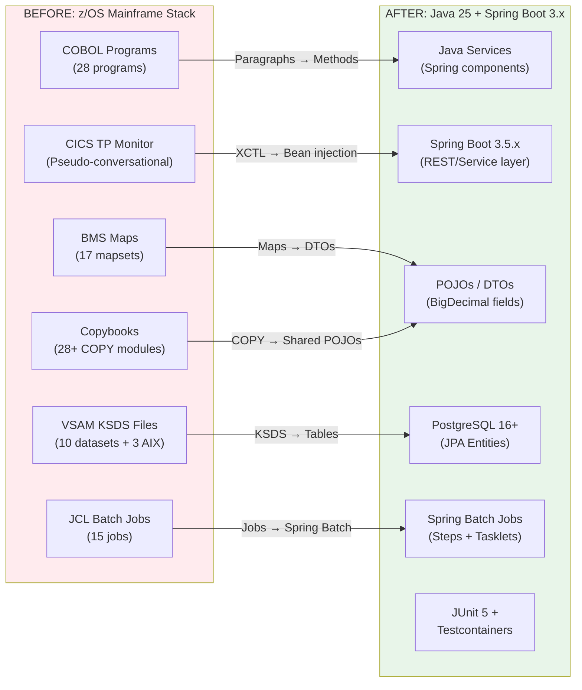

# Technical Specification

# 0. Agent Action Plan

## 0.1 Intent Clarification


### 0.1.1 Core Refactoring Objective

Based on the prompt, the Blitzy platform understands that the refactoring objective is to perform a **complete technology stack migration** of the AWS CardDemo mainframe application from COBOL/CICS/VSAM/JCL to a modern Java 25 LTS + Spring Boot 3.x stack with **100% business logic parity and zero behavioral regressions**.

- **Refactoring Type:** Full tech stack migration (COBOL → Java, VSAM → PostgreSQL, CICS → Spring Boot, JCL → Spring Batch + CI/CD)
- **Target Repository:** Same repository — the migrated Java application will be created alongside the original COBOL source, which is explicitly retained under `/legacy` for traceability
- **Behavioral Constraint:** Every COBOL paragraph, section, file operation, validation rule, batch flow, and online transaction must be faithfully reproduced in Java with identical semantics — no feature expansion, no feature omission

**Refactoring Goals (Enhanced Clarity):**

- Translate all 28 COBOL programs (18 online CICS + 10 batch) into Java services, controllers, and Spring Batch jobs preserving the existing control flow and business logic
- Convert all VSAM KSDS datasets (10 master/transaction/reference files + 3 alternate indexes) into PostgreSQL 16+ relational tables with JPA entities using `BigDecimal` for all decimal/monetary fields
- Map all 28+ COBOL copybooks into shared Java POJOs, DTOs, and record layout classes preserving exact field names, sizes, and validation semantics
- Translate 17 BMS map presentation contracts into data contracts (request/response DTOs) suitable for a headless service layer
- Convert JCL batch orchestration (CLOSEFIL → POSTTRAN → INTCALC → COMBTRAN → CREASTMT → OPENFIL) into Spring Batch jobs with equivalent step sequencing and conditional logic
- Preserve external interface contracts: daily transaction feed (350-byte fixed-width DALYTRAN), reject output (DALYREJS), statement generation (plain text + HTML), and TDQ-based batch job submission semantics
- Achieve ≥80% line coverage (unit + integration) using JUnit 5 and Testcontainers
- Pass OWASP dependency-check with zero critical/high CVEs
- Compile with zero warnings under Java 25
- Deliver a 100% COBOL-paragraph-to-Java-method traceability matrix

**Implicit Requirements Surfaced:**

- The COMMAREA-based session state management (1024-byte `CARDDEMO-COMMAREA` defined in `COCOM01Y.cpy`) must be translated into an equivalent session/context propagation mechanism
- Optimistic locking patterns (READ UPDATE → REWRITE) in CICS must be mapped to JPA `@Version`-based optimistic locking or equivalent
- VSAM file-status two-byte codes must be mapped to Java exception handling with equivalent error semantics
- The pseudo-conversational CICS model must be preserved as stateless service endpoints
- PII fields (CUST-SSN, CARD-CVV-CD, SEC-USR-PWD) require secure handling — passwords must be hashed (not plaintext as in legacy), environment variables or vault for credentials
- The 88-level condition names used for role-based authorization (`CDEMO-USER-TYPE-ADMIN VALUE 'A'`) must be mapped to Java enums or Spring Security role annotations
- BMS map field validation (numeric checks, date validation, length enforcement) must be reproduced in Java bean validation annotations or service-layer validation
- Fixed-width ASCII test fixture files (9 files in `app/data/ASCII/`) must be parsed and loaded as database seed data with byte-exact fidelity

### 0.1.2 Technical Interpretation

This refactoring translates to the following technical transformation strategy:

**Architecture Transformation:**



**Layer-by-Layer Transformation Rules:**

| COBOL Construct | Java Target | Transformation Rule |
|----------------|-------------|-------------------|
| DATA DIVISION fields | POJO fields with `BigDecimal` | No floating-point for `PIC S9(n)V99 COMP-3`; use `BigDecimal` with exact scale |
| PARAGRAPH / SECTION | Service/component methods | Preserve numbered paragraph control flow as method call chains |
| COPY / REPLACE | Shared DTOs / modules | Each copybook becomes a shared Java class in a `common` package |
| FILE SECTION (FD) | Spring Data JPA repositories | Each VSAM KSDS becomes a JPA `@Entity` + `JpaRepository` |
| SORT / MERGE | `Comparator`-based Java sort | Identical key semantics using `Comparator.comparing()` chains |
| CALL (subroutine) | Method invocation / Spring bean injection | `CALL 'CBSTM03B'` → `@Autowired Cbstm03bService` method call |
| JCL jobs | Spring Batch `Job` + CI/CD pipeline | Each JCL job becomes a `@Bean Job` with `Step` definitions |
| FILE STATUS codes | Mapped exception handling | Two-byte status → custom `FileStatusException` hierarchy |
| EXEC CICS READ/WRITE | JPA `findById()` / `save()` | VSAM keyed access → JPA repository methods |
| EXEC CICS STARTBR/READNEXT | JPA query with pagination | Browse operations → Spring Data paging/sorting queries |
| COMMAREA | Session context DTO / Spring-managed bean | 1024-byte structure → `CardDemoContext` request-scoped bean |
| DFHBMSCA attributes | Validation annotations | BMS field attributes → `@NotNull`, `@Size`, `@Pattern` |
| 88-level conditions | Java enums | `88 CDEMO-USER-TYPE-ADMIN VALUE 'A'` → `UserType.ADMIN` |
| VSAM alternate indexes | JPA `@Index` + custom queries | AIX access paths → `@Query` methods on repositories |
| COMP-3 packed decimal | `BigDecimal` | Exact decimal arithmetic with configurable `RoundingMode` |


## 0.2 Source Analysis


### 0.2.1 Comprehensive Source File Discovery

The CardDemo repository contains 102 source artifacts organized across six directories under `app/`. Every file listed below is confirmed present and at UNCHANGED status.

**Current Structure Mapping:**

```
CardDemo Repository (root)
├── README.md                    (Project documentation, 325 lines)
├── LICENSE                      (Apache 2.0)
├── CODE_OF_CONDUCT.md           (Community governance)
├── CONTRIBUTING.md              (Contribution guidelines)
└── app/
    ├── bms/                     (17 BMS map source files)
    │   ├── COACTUP.bms          (Account Update screen map)
    │   ├── COACTVW.bms          (Account View screen map)
    │   ├── COADM01.bms          (Admin Menu screen map)
    │   ├── COBIL00.bms          (Bill Payment screen map)
    │   ├── COCRDLI.bms          (Credit Card List screen map)
    │   ├── COCRDSL.bms          (Credit Card View/Detail screen map)
    │   ├── COCRDUP.bms          (Credit Card Update screen map)
    │   ├── COMEN01.bms          (Main Menu screen map)
    │   ├── CORPT00.bms          (Reports screen map)
    │   ├── COSGN00.bms          (Sign-on screen map)
    │   ├── COTRN00.bms          (Transaction List screen map)
    │   ├── COTRN01.bms          (Transaction View screen map)
    │   ├── COTRN02.bms          (Transaction Add screen map)
    │   ├── COUSR00.bms          (User List screen map)
    │   ├── COUSR01.bms          (User Add screen map)
    │   ├── COUSR02.bms          (User Update screen map)
    │   └── COUSR03.bms          (User Delete screen map)
    ├── cbl/                     (28 COBOL source programs)
    │   ├── CBACT01C.cbl         (Batch: Account refresh)
    │   ├── CBACT02C.cbl         (Batch: Account processing)
    │   ├── CBACT03C.cbl         (Batch: Additional account operations)
    │   ├── CBACT04C.cbl         (Batch: Interest calculation)
    │   ├── CBCUS01C.cbl         (Batch: Customer file management)
    │   ├── CBSTM03A.CBL         (Batch: Statement generation engine)
    │   ├── CBSTM03B.CBL         (Batch: Statement I/O subroutine)
    │   ├── CBTRN01C.cbl         (Batch: Transaction utilities)
    │   ├── CBTRN02C.cbl         (Batch: Daily transaction posting with validation)
    │   ├── CBTRN03C.cbl         (Batch: Transaction processing)
    │   ├── COACTUPC.cbl         (Online: Account Update - CICS)
    │   ├── COACTVWC.cbl         (Online: Account View - CICS)
    │   ├── COADM01C.cbl         (Online: Admin Menu - CICS)
    │   ├── COBIL00C.cbl         (Online: Bill Payment - CICS)
    │   ├── COCRDLIC.cbl         (Online: Credit Card List - CICS)
    │   ├── COCRDSLC.cbl         (Online: Credit Card Detail/Selection - CICS)
    │   ├── COCRDUPC.cbl         (Online: Credit Card Update - CICS)
    │   ├── COMEN01C.cbl         (Online: Main Menu Router - CICS)
    │   ├── CORPT00C.cbl         (Online: Transaction Reports - CICS)
    │   ├── COSGN00C.cbl         (Online: Sign-on Authentication - CICS)
    │   ├── COTRN00C.cbl         (Online: Transaction List - CICS)
    │   ├── COTRN01C.cbl         (Online: Transaction View - CICS)
    │   ├── COTRN02C.cbl         (Online: Transaction Add - CICS)
    │   ├── COUSR00C.cbl         (Online: User List - CICS admin)
    │   ├── COUSR01C.cbl         (Online: User Add - CICS admin)
    │   ├── COUSR02C.cbl         (Online: User Update - CICS admin)
    │   ├── COUSR03C.cbl         (Online: User Delete - CICS admin)
    │   └── CSUTLDTC.cbl         (Shared: Date conversion utility)
    ├── cpy/                     (28 COBOL copybooks)
    │   ├── COADM02Y.cpy         (Admin menu field definitions)
    │   ├── COCOM01Y.cpy         (CARDDEMO-COMMAREA, 1024 bytes — master session context)
    │   ├── COMEN02Y.cpy         (Main menu definitions)
    │   ├── COSTM01.cpy          (Statement record layout)
    │   ├── COTTL01Y.cpy         (Title/header line layout)
    │   ├── CSDAT01Y.cpy         (Date field structure)
    │   ├── CSLKPCDY.cpy         (Lookup code table structures)
    │   ├── CSMSG01Y.cpy         (Message area definitions)
    │   ├── CSMSG02Y.cpy         (Extended message definitions)
    │   ├── CSSETATY.cpy         (Screen attribute setting utility)
    │   ├── CSSTRPFY.cpy         (String processing / strip utility)
    │   ├── CSUSR01Y.cpy         (User security record — SEC-USR-ID PK, plaintext PWD)
    │   ├── CSUTLDPY.cpy         (Utility parameter definitions)
    │   ├── CSUTLDWY.cpy         (Date utility working storage)
    │   ├── CUSTREC.cpy          (Customer record layout — alternate)
    │   ├── CVACT01Y.cpy         (Account record layout — 300 bytes, 11-byte ACCT-ID PK)
    │   ├── CVACT02Y.cpy         (Card data record — 150 bytes, 16-byte CARD-NUM PK)
    │   ├── CVACT03Y.cpy         (Card cross-reference — 50 bytes, junction)
    │   ├── CVCRD01Y.cpy         (Credit card display structure)
    │   ├── CVCUS01Y.cpy         (Customer record — 500 bytes, 9-byte CUST-ID PK)
    │   ├── CVTRA01Y.cpy         (Transaction display fields)
    │   ├── CVTRA02Y.cpy         (Transaction detail fields)
    │   ├── CVTRA03Y.cpy         (Transaction list fields)
    │   ├── CVTRA04Y.cpy         (Transaction report fields)
    │   ├── CVTRA05Y.cpy         (Transaction master record — 350 bytes)
    │   ├── CVTRA06Y.cpy         (Daily transaction record — DALYTRAN)
    │   ├── CVTRA07Y.cpy         (Transaction category balance record)
    │   └── UNUSED1Y.cpy         (Placeholder — not referenced)
    ├── cpy-bms/                 (17 BMS COBOL copybooks — AI/AO two-view pattern)
    │   ├── COACTUP.cpy          (Account Update BMS data structure)
    │   ├── COACTVW.cpy          (Account View BMS data structure)
    │   ├── COADM01.cpy          (Admin Menu BMS data structure)
    │   ├── COBIL00.cpy          (Bill Payment BMS data structure)
    │   ├── COCRDLI.cpy          (Credit Card List BMS data structure)
    │   ├── COCRDSL.cpy          (Credit Card Detail BMS data structure)
    │   ├── COCRDUP.cpy          (Credit Card Update BMS data structure)
    │   ├── COMEN01.cpy          (Main Menu BMS data structure)
    │   ├── CORPT00.cpy          (Reports BMS data structure)
    │   ├── COSGN00.cpy          (Sign-on BMS data structure)
    │   ├── COTRN00.cpy          (Transaction List BMS data structure)
    │   ├── COTRN01.cpy          (Transaction View BMS data structure)
    │   ├── COTRN02.cpy          (Transaction Add BMS data structure)
    │   ├── COUSR00.cpy          (User List BMS data structure)
    │   ├── COUSR01.cpy          (User Add BMS data structure)
    │   ├── COUSR02.cpy          (User Update BMS data structure)
    │   └── COUSR03.cpy          (User Delete BMS data structure)
    ├── catlg/
    │   └── LISTCAT.txt          (IDCAMS catalog snapshot — 209 objects)
    └── data/
        └── ASCII/               (9 fixed-width test fixture files)
            ├── acctdata.txt     (50 account records, 300 chars each)
            ├── carddata.txt     (50 card records, 150 chars each)
            ├── cardxref.txt     (50 cross-reference records, 34 chars each)
            ├── custdata.txt     (50 customer records, 500 chars each)
            ├── dailytran.txt    (Daily transaction records, ~220 chars each)
            ├── discgrp.txt      (3 blocks × 17 lines — discount groups)
            ├── tcatbal.txt      (50 transaction category balance records, 50 chars)
            ├── trancatg.txt     (18 transaction category records)
            └── trantype.txt     (7 transaction type records)
```

### 0.2.2 Source Artifact Summary

| Category | Count | Location | Purpose |
|----------|-------|----------|---------|
| Online CICS programs | 18 | `app/cbl/CO*.cbl` | Interactive transactions via pseudo-conversational CICS |
| Batch programs | 10 | `app/cbl/CB*.cbl, CBSTM03*.CBL` | JCL-scheduled processing (posting, interest, statements) |
| Shared utility | 1 | `app/cbl/CSUTLDTC.cbl` | Date conversion called by multiple programs |
| Data copybooks | 28 | `app/cpy/*.cpy` | Record layouts, COMMAREA, validation utilities |
| BMS copybooks | 17 | `app/cpy-bms/*.cpy` | Screen I/O data structures (AI/AO two-view pattern) |
| BMS map sources | 17 | `app/bms/*.bms` | 3270 screen definitions (DFHMSD/DFHMDI/DFHMDF) |
| Test data fixtures | 9 | `app/data/ASCII/*.txt` | Fixed-width seed data for all VSAM datasets |
| Catalog metadata | 1 | `app/catlg/LISTCAT.txt` | VSAM catalog snapshot with CI/CA sizes and RKP data |
| Root documentation | 4 | `*.md, LICENSE` | README, LICENSE, COC, CONTRIBUTING |
| **Total** | **105** | | |

### 0.2.3 VSAM-to-Entity Data Model Inventory

| VSAM Dataset | Copybook | Record Length | Primary Key | Key Length | Alternate Indexes | Remarks |
|-------------|----------|--------------|-------------|-----------|-------------------|---------|
| ACCTDATA | CVACT01Y | 300 bytes | ACCT-ID | 11 bytes | None | COMP-3 monetary fields |
| CARDDATA | CVACT02Y | 150 bytes | CARD-NUM | 16 bytes | AIX: CARD-ACCT-ID (pos 16, len 11) | Card-to-account lookup |
| CARDXREF | CVACT03Y | 50 bytes | XREF-CARD-NUM | 16 bytes | AIX: XREF-ACCT-ID (pos 25, len 11) | Junction table |
| CUSTDATA | CVCUS01Y | 500 bytes | CUST-ID | 9 bytes | None | PII: SSN, govt ID |
| TRANSACT | CVTRA05Y | 350 bytes | TRAN-ID | variable | AIX: TRAN-ORIG-TS (pos 304, len 26) | Chronological index |
| DALYTRAN | CVTRA06Y | ~220 bytes | N/A (sequential) | N/A | None | Daily feed input |
| USRSEC | CSUSR01Y | 80 bytes | SEC-USR-ID | 8 bytes | None | Plaintext passwords |
| TRANTYPE | (inline) | ~50 bytes | TRAN-TYPE | 2 bytes | None | 7 records reference |
| TRANCATG | (inline) | ~50 bytes | TRAN-CAT | 4 bytes | None | 18 categories |
| TCATBALF | CVTRA07Y | 50 bytes | Composite | variable | None | Category balances |

### 0.2.4 Online Transaction Flow Inventory

| Transaction | BMS Map | COBOL Program | Function | User Role |
|------------|---------|---------------|----------|-----------|
| CC00 | COSGN00 | COSGN00C | User sign-on / authentication | All |
| CM00 | COMEN01 | COMEN01C | Main menu routing | All |
| CA00 | COADM01 | COADM01C | Admin menu | Admin only |
| CAVW | COACTVW | COACTVWC | Account view (read-only) | All |
| CAUP | COACTUP | COACTUPC | Account update (read-write) | All |
| CCLI | COCRDLI | COCRDLIC | Credit card list/search | All |
| CCDL | COCRDSL | COCRDSLC | Credit card detail/selection | All |
| CCUP | COCRDUP | COCRDUPC | Credit card update | All |
| CT00 | COTRN00 | COTRN00C | Transaction list/search | All |
| CT01 | COTRN01 | COTRN01C | Transaction detail view | All |
| CT02 | COTRN02 | COTRN02C | Transaction add (new entry) | All |
| CR00 | CORPT00 | CORPT00C | Transaction reports menu | All |
| CB00 | COBIL00 | COBIL00C | Bill payment processing | All |
| CU00 | COUSR00 | COUSR00C | User list management | Admin only |
| CU01 | COUSR01 | COUSR01C | User add | Admin only |
| CU02 | COUSR02 | COUSR02C | User update | Admin only |
| CU03 | COUSR03 | COUSR03C | User delete | Admin only |

### 0.2.5 Batch Job Inventory

| JCL Job | COBOL Program | Function | Trigger | Input | Output |
|---------|---------------|----------|---------|-------|--------|
| POSTTRAN | CBTRN02C | Daily transaction posting | Scheduled | DALYTRAN | TRANSACT (updated), DALYREJS |
| INTCALC | CBACT04C | Interest calculation | Post-POSTTRAN | ACCTDATA | ACCTDATA (updated) |
| COMBTRAN | N/A (SORT) | Combine/sort transactions | Post-INTCALC | TRANSACT | Sorted TRANSACT |
| CREASTMT | CBSTM03A/B | Statement generation | Post-COMBTRAN | TRANSACT, ACCTDATA | Statement files (text + HTML) |
| CLOSEFIL | N/A (IDCAMS) | Close CICS files for batch | Pre-batch window | N/A | CICS DFHFC TYPE=CLOSE |
| OPENFIL | N/A (IDCAMS) | Re-open CICS files | Post-batch window | N/A | CICS DFHFC TYPE=OPEN |
| ACCTFILE | CBACT01C | Account master refresh | On-demand | Seed data | ACCTDATA |
| CUSTFILE | CBCUS01C | Customer file load | On-demand | Seed data | CUSTDATA |
| TRANFILE | CBTRN01C | Transaction file load | On-demand | Seed data | TRANSACT |
| DEFGDGB | N/A (IDCAMS) | Define GDG base entries | Setup | JCL params | GDG catalog entries |


## 0.3 Scope Boundaries


### 0.3.1 Exhaustively In Scope

**Source-to-Target Code Transformations:**

- `app/cbl/*.cbl` — All 28 COBOL programs → Java service classes, batch job steps, controllers
- `app/cbl/*.CBL` — Both uppercase-extension batch programs (CBSTM03A.CBL, CBSTM03B.CBL) → Spring Batch job and I/O service
- `app/cpy/*.cpy` — All 28 copybooks → Java POJOs, DTOs, enums, and shared record layout classes
- `app/cpy-bms/*.cpy` — All 17 BMS data structure copybooks → Request/Response DTOs with validation
- `app/bms/*.bms` — All 17 BMS map sources → DTO contracts preserving field names and positions (for headless service layer)

**Database Migration Artifacts:**

- `app/data/ASCII/*.txt` — All 9 fixed-width test data files → SQL seed scripts and Flyway migration data
- `app/catlg/LISTCAT.txt` — VSAM catalog metadata → PostgreSQL DDL schema (tables, indexes, constraints)
- VSAM KSDS (10 datasets) → PostgreSQL tables with JPA entities
- VSAM AIX (3 alternate indexes) → PostgreSQL secondary indexes and composite queries
- GDG definitions → PostgreSQL table partitioning or archival strategy

**Spring Batch Job Definitions:**

- JCL CLOSEFIL/OPENFIL → Not applicable in Java (no file-close semantics); replaced by database connection management
- JCL POSTTRAN → Spring Batch `Job` with `ItemReader` → `ItemProcessor` → `ItemWriter` steps
- JCL INTCALC → Spring Batch `Job` with account iteration and interest computation
- JCL COMBTRAN → Java `Comparator`-based sort step preserving COBOL SORT key semantics
- JCL CREASTMT → Spring Batch multi-step `Job` for statement generation (CBSTM03A main + CBSTM03B I/O)
- JCL DEFGDGB, DUSRSECJ, seed jobs → Flyway migration scripts + Spring Boot `CommandLineRunner` seed loaders

**Test Coverage (≥80% line coverage):**

- `src/test/java/**/*Test.java` — JUnit 5 unit tests for every service, repository, and DTO
- `src/test/java/**/*IntegrationTest.java` — Integration tests using Testcontainers (PostgreSQL 16+)
- `src/test/java/**/*BatchTest.java` — Spring Batch job integration tests with Testcontainers
- `src/test/resources/fixtures/**` — Transformed test fixtures from `app/data/ASCII/*.txt`

**Configuration and Build:**

- `pom.xml` — Maven project with Spring Boot 3.5.x parent, all dependencies
- `src/main/resources/application.yml` — Spring Boot configuration (datasource, batch, logging)
- `src/main/resources/application-test.yml` — Test profile with Testcontainers config
- `src/main/resources/db/migration/*.sql` — Flyway schema migration scripts
- `src/main/resources/db/seed/*.sql` — Flyway seed data scripts
- `.mvn/` — Maven wrapper for reproducible builds

**Security and Quality Gates:**

- OWASP dependency-check Maven plugin configuration — zero critical/high CVEs
- JaCoCo Maven plugin for coverage enforcement (≥80% line coverage)
- Maven Compiler plugin configured for Java 25 with `-Xlint:all -Werror` (zero warnings)
- Spring Security configuration for role-based access (Admin vs. Regular user)

**Documentation and Onboarding:**

- `README.md` — Updated with Java project setup, build, and run instructions
- `docs/` — Architecture diagrams, decision log, traceability matrix, executive summary
- `docs/decision-log.md` — Markdown table of all non-trivial implementation decisions
- `docs/traceability-matrix.md` — 100% COBOL-paragraph-to-Java-method mapping
- `docs/onboarding.md` — New developer setup guide (clean machine → running application)
- `docs/slides/` — reveal.js executive presentation artifact

**Observability:**

- Structured logging with correlation IDs (Spring Boot Actuator + SLF4J/Logback)
- Health/readiness endpoints (`/actuator/health`, `/actuator/readiness`)
- Metrics endpoint (`/actuator/metrics`, `/actuator/prometheus`)
- Dashboard template (Grafana JSON or equivalent)
- Distributed tracing configuration (Micrometer Tracing)

**Legacy Preservation:**

- `legacy/` — Complete copy of original COBOL source tree (`app/bms/`, `app/cbl/`, `app/cpy/`, `app/cpy-bms/`, `app/catlg/`, `app/data/`) retained for reference and traceability

### 0.3.2 Explicitly Out of Scope

- **No feature expansion** — The Java application must not add any functionality beyond what the COBOL application provides. No new screens, no new reports, no new batch jobs, no new data fields
- **No UI framework** — BMS 3270 maps are translated to service-layer DTOs only; no React, Angular, or other frontend UI will be built as part of this migration. The service layer is headless
- **No production/staging deployment** — All validation must run locally; no production, staging, or running COBOL environment is required
- **No COBOL runtime** — The migrated application does not require a COBOL compiler, CICS runtime, or VSAM subsystem to build or test
- **No MQ integration implementation** — While external interface contracts must remain identical in design, the actual MQ middleware integration is out of scope (contracts are preserved as interface definitions)
- **No cloud-native decomposition** — This migration targets a single Spring Boot application (modular monolith), not microservices decomposition; the Phase 4–6 modernization roadmap from the tech spec is deferred
- **No data migration tooling** — ETL pipelines to migrate production VSAM data to PostgreSQL are out of scope; only seed-data-based schema initialization is included
- **No RACF integration** — z/OS RACF security is replaced by Spring Security; no integration with mainframe security subsystems
- **No performance tuning** — SLA targets from the tech spec (<3s online, <2s auth, 2–4hr batch window) are noted but not contractually enforced in this migration
- **No GDG replication** — GDG (Generation Data Group) backup semantics are simplified to PostgreSQL table snapshots or audit columns rather than multi-generation cycling


## 0.4 Target Design


### 0.4.1 Refactored Structure Planning

The target Java 25 + Spring Boot 3.5.x project follows a layered modular-monolith architecture that maps cleanly to the COBOL source structure while applying modern Java conventions.

```
Target:
cardemo-java/
├── pom.xml                                    (Maven build with Spring Boot 3.5.x parent)
├── .mvn/
│   └── wrapper/
│       ├── maven-wrapper.jar
│       └── maven-wrapper.properties
├── mvnw                                       (Maven wrapper script — Linux/macOS)
├── mvnw.cmd                                   (Maven wrapper script — Windows)
├── src/
│   ├── main/
│   │   ├── java/
│   │   │   └── com/
│   │   │       └── cardemo/
│   │   │           ├── CardDemoApplication.java               (Spring Boot main entry point)
│   │   │           ├── common/
│   │   │           │   ├── context/
│   │   │           │   │   └── CardDemoContext.java            (← COCOM01Y.cpy COMMAREA)
│   │   │           │   ├── dto/
│   │   │           │   │   ├── AccountRecord.java             (← CVACT01Y.cpy)
│   │   │           │   │   ├── CardRecord.java                (← CVACT02Y.cpy)
│   │   │           │   │   ├── CardXrefRecord.java            (← CVACT03Y.cpy)
│   │   │           │   │   ├── CustomerRecord.java            (← CVCUS01Y.cpy / CUSTREC.cpy)
│   │   │           │   │   ├── TransactionRecord.java         (← CVTRA05Y.cpy)
│   │   │           │   │   ├── DailyTransactionRecord.java    (← CVTRA06Y.cpy)
│   │   │           │   │   ├── CategoryBalanceRecord.java     (← CVTRA07Y.cpy)
│   │   │           │   │   ├── UserSecurityRecord.java        (← CSUSR01Y.cpy)
│   │   │           │   │   ├── StatementRecord.java           (← COSTM01.cpy)
│   │   │           │   │   ├── CreditCardDisplay.java         (← CVCRD01Y.cpy)
│   │   │           │   │   ├── TransactionDisplay.java        (← CVTRA01Y.cpy)
│   │   │           │   │   ├── TransactionDetail.java         (← CVTRA02Y.cpy)
│   │   │           │   │   ├── TransactionListItem.java       (← CVTRA03Y.cpy)
│   │   │           │   │   └── TransactionReportItem.java     (← CVTRA04Y.cpy)
│   │   │           │   ├── enums/
│   │   │           │   │   ├── UserType.java                  (← 88-level ADMIN/USER)
│   │   │           │   │   ├── TransactionType.java           (← TRANTYPE reference data)
│   │   │           │   │   ├── TransactionCategory.java       (← TRANCATG reference data)
│   │   │           │   │   └── FileStatusCode.java            (← VSAM file status mapping)
│   │   │           │   ├── exception/
│   │   │           │   │   ├── CardDemoException.java         (Base exception)
│   │   │           │   │   ├── FileStatusException.java       (← VSAM file status errors)
│   │   │           │   │   ├── RecordNotFoundException.java   (← STATUS '23')
│   │   │           │   │   ├── DuplicateRecordException.java  (← STATUS '22')
│   │   │           │   │   ├── AuthenticationException.java   (← Sign-on failures)
│   │   │           │   │   └── ValidationException.java       (← Field validation errors)
│   │   │           │   ├── util/
│   │   │           │   │   ├── DateConversionUtil.java        (← CSUTLDTC.cbl)
│   │   │           │   │   ├── StringProcessingUtil.java      (← CSSTRPFY.cpy)
│   │   │           │   │   ├── AttributeUtil.java             (← CSSETATY.cpy)
│   │   │           │   │   └── LookupCodeUtil.java            (← CSLKPCDY.cpy)
│   │   │           │   ├── validation/
│   │   │           │   │   └── FieldValidator.java            (← CSUTLDPY.cpy validation logic)
│   │   │           │   └── message/
│   │   │           │       ├── MessageConstants.java          (← CSMSG01Y.cpy)
│   │   │           │       └── ExtendedMessage.java           (← CSMSG02Y.cpy)
│   │   │           ├── config/
│   │   │           │   ├── SecurityConfig.java                (Spring Security — role-based)
│   │   │           │   ├── BatchConfig.java                   (Spring Batch infrastructure)
│   │   │           │   ├── JpaConfig.java                     (JPA/Hibernate settings)
│   │   │           │   ├── ObservabilityConfig.java           (Micrometer, tracing, metrics)
│   │   │           │   └── AppProperties.java                 (Custom config properties)
│   │   │           ├── entity/
│   │   │           │   ├── Account.java                       (← ACCTDATA VSAM)
│   │   │           │   ├── Card.java                          (← CARDDATA VSAM)
│   │   │           │   ├── CardXref.java                      (← CARDXREF VSAM)
│   │   │           │   ├── Customer.java                      (← CUSTDATA VSAM)
│   │   │           │   ├── Transaction.java                   (← TRANSACT VSAM)
│   │   │           │   ├── DailyTransaction.java              (← DALYTRAN VSAM)
│   │   │           │   ├── UserSecurity.java                  (← USRSEC VSAM)
│   │   │           │   ├── TransactionTypeRef.java            (← TRANTYPE reference)
│   │   │           │   ├── TransactionCategoryRef.java        (← TRANCATG reference)
│   │   │           │   ├── DiscountGroup.java                 (← DISCGRP reference)
│   │   │           │   └── CategoryBalance.java               (← TCATBALF VSAM)
│   │   │           ├── repository/
│   │   │           │   ├── AccountRepository.java
│   │   │           │   ├── CardRepository.java
│   │   │           │   ├── CardXrefRepository.java
│   │   │           │   ├── CustomerRepository.java
│   │   │           │   ├── TransactionRepository.java
│   │   │           │   ├── DailyTransactionRepository.java
│   │   │           │   ├── UserSecurityRepository.java
│   │   │           │   ├── TransactionTypeRefRepository.java
│   │   │           │   ├── TransactionCategoryRefRepository.java
│   │   │           │   ├── DiscountGroupRepository.java
│   │   │           │   └── CategoryBalanceRepository.java
│   │   │           ├── service/
│   │   │           │   ├── online/
│   │   │           │   │   ├── SignonService.java             (← COSGN00C.cbl)
│   │   │           │   │   ├── MainMenuService.java           (← COMEN01C.cbl)
│   │   │           │   │   ├── AdminMenuService.java          (← COADM01C.cbl)
│   │   │           │   │   ├── AccountViewService.java        (← COACTVWC.cbl)
│   │   │           │   │   ├── AccountUpdateService.java      (← COACTUPC.cbl)
│   │   │           │   │   ├── CreditCardListService.java     (← COCRDLIC.cbl)
│   │   │           │   │   ├── CreditCardDetailService.java   (← COCRDSLC.cbl)
│   │   │           │   │   ├── CreditCardUpdateService.java   (← COCRDUPC.cbl)
│   │   │           │   │   ├── TransactionListService.java    (← COTRN00C.cbl)
│   │   │           │   │   ├── TransactionViewService.java    (← COTRN01C.cbl)
│   │   │           │   │   ├── TransactionAddService.java     (← COTRN02C.cbl)
│   │   │           │   │   ├── ReportService.java             (← CORPT00C.cbl)
│   │   │           │   │   ├── BillPaymentService.java        (← COBIL00C.cbl)
│   │   │           │   │   ├── UserListService.java           (← COUSR00C.cbl)
│   │   │           │   │   ├── UserAddService.java            (← COUSR01C.cbl)
│   │   │           │   │   ├── UserUpdateService.java         (← COUSR02C.cbl)
│   │   │           │   │   └── UserDeleteService.java         (← COUSR03C.cbl)
│   │   │           │   └── batch/
│   │   │           │       ├── AccountRefreshService.java     (← CBACT01C.cbl)
│   │   │           │       ├── AccountProcessingService.java  (← CBACT02C.cbl)
│   │   │           │       ├── AccountOperationsService.java  (← CBACT03C.cbl)
│   │   │           │       ├── InterestCalculationService.java(← CBACT04C.cbl)
│   │   │           │       ├── CustomerFileService.java       (← CBCUS01C.cbl)
│   │   │           │       ├── TransactionUtilService.java    (← CBTRN01C.cbl)
│   │   │           │       ├── DailyPostingService.java       (← CBTRN02C.cbl)
│   │   │           │       ├── TransactionProcessService.java (← CBTRN03C.cbl)
│   │   │           │       ├── StatementEngineService.java    (← CBSTM03A.CBL)
│   │   │           │       └── StatementIoService.java        (← CBSTM03B.CBL)
│   │   │           ├── batch/
│   │   │           │   ├── job/
│   │   │           │   │   ├── DailyPostingJobConfig.java     (← JCL POSTTRAN)
│   │   │           │   │   ├── InterestCalcJobConfig.java     (← JCL INTCALC)
│   │   │           │   │   ├── TransactionSortJobConfig.java  (← JCL COMBTRAN)
│   │   │           │   │   ├── StatementGenJobConfig.java     (← JCL CREASTMT)
│   │   │           │   │   ├── AccountLoadJobConfig.java      (← JCL ACCTFILE)
│   │   │           │   │   ├── CustomerLoadJobConfig.java     (← JCL CUSTFILE)
│   │   │           │   │   └── TransactionLoadJobConfig.java  (← JCL TRANFILE)
│   │   │           │   ├── reader/
│   │   │           │   │   ├── FixedWidthFileReader.java      (Generic fixed-width parser)
│   │   │           │   │   └── DailyTransactionReader.java    (DALYTRAN-specific reader)
│   │   │           │   ├── processor/
│   │   │           │   │   ├── TransactionPostingProcessor.java (Validation: codes 100-103)
│   │   │           │   │   ├── InterestCalculationProcessor.java
│   │   │           │   │   └── StatementProcessor.java
│   │   │           │   └── writer/
│   │   │           │       ├── RejectFileWriter.java          (DALYREJS output)
│   │   │           │       └── StatementFileWriter.java       (Text + HTML output)
│   │   │           └── controller/
│   │   │               ├── AuthController.java                (Sign-on REST endpoint)
│   │   │               ├── AccountController.java             (Account view/update)
│   │   │               ├── CardController.java                (Card list/detail/update)
│   │   │               ├── TransactionController.java         (Transaction list/view/add)
│   │   │               ├── ReportController.java              (Reports)
│   │   │               ├── BillPaymentController.java         (Bill payment)
│   │   │               └── UserAdminController.java           (User CRUD — admin only)
│   │   └── resources/
│   │       ├── application.yml                                (Main configuration)
│   │       ├── application-test.yml                           (Test profile)
│   │       ├── application-local.yml                          (Local dev profile)
│   │       ├── logback-spring.xml                             (Structured logging config)
│   │       └── db/
│   │           ├── migration/
│   │           │   ├── V1__create_schema.sql                  (All tables, indexes, constraints)
│   │           │   └── V2__create_indexes.sql                 (AIX-equivalent secondary indexes)
│   │           └── seed/
│   │               └── V100__seed_data.sql                    (Parsed from app/data/ASCII/*.txt)
│   └── test/
│       ├── java/
│       │   └── com/
│       │       └── cardemo/
│       │           ├── CardDemoApplicationTest.java            (Context load test)
│       │           ├── service/
│       │           │   ├── online/
│       │           │   │   ├── SignonServiceTest.java
│       │           │   │   ├── AccountViewServiceTest.java
│       │           │   │   ├── AccountUpdateServiceTest.java
│       │           │   │   ├── CreditCardListServiceTest.java
│       │           │   │   ├── CreditCardDetailServiceTest.java
│       │           │   │   ├── CreditCardUpdateServiceTest.java
│       │           │   │   ├── TransactionListServiceTest.java
│       │           │   │   ├── TransactionViewServiceTest.java
│       │           │   │   ├── TransactionAddServiceTest.java
│       │           │   │   ├── ReportServiceTest.java
│       │           │   │   ├── BillPaymentServiceTest.java
│       │           │   │   ├── UserListServiceTest.java
│       │           │   │   ├── UserAddServiceTest.java
│       │           │   │   ├── UserUpdateServiceTest.java
│       │           │   │   ├── UserDeleteServiceTest.java
│       │           │   │   ├── MainMenuServiceTest.java
│       │           │   │   └── AdminMenuServiceTest.java
│       │           │   └── batch/
│       │           │       ├── DailyPostingServiceTest.java
│       │           │       ├── InterestCalculationServiceTest.java
│       │           │       ├── StatementEngineServiceTest.java
│       │           │       └── AccountRefreshServiceTest.java
│       │           ├── batch/
│       │           │   ├── DailyPostingJobIntegrationTest.java
│       │           │   ├── InterestCalcJobIntegrationTest.java
│       │           │   ├── StatementGenJobIntegrationTest.java
│       │           │   └── TransactionSortJobIntegrationTest.java
│       │           ├── repository/
│       │           │   ├── AccountRepositoryTest.java
│       │           │   ├── CardRepositoryTest.java
│       │           │   ├── CustomerRepositoryTest.java
│       │           │   ├── TransactionRepositoryTest.java
│       │           │   └── UserSecurityRepositoryTest.java
│       │           ├── controller/
│       │           │   ├── AuthControllerTest.java
│       │           │   ├── AccountControllerTest.java
│       │           │   ├── CardControllerTest.java
│       │           │   ├── TransactionControllerTest.java
│       │           │   └── UserAdminControllerTest.java
│       │           └── common/
│       │               ├── util/
│       │               │   └── DateConversionUtilTest.java
│       │               └── validation/
│       │                   └── FieldValidatorTest.java
│       └── resources/
│           ├── application-test.yml
│           └── fixtures/
│               ├── acctdata.txt                               (Copied from app/data/ASCII/)
│               ├── carddata.txt
│               ├── cardxref.txt
│               ├── custdata.txt
│               ├── dailytran.txt
│               ├── discgrp.txt
│               ├── tcatbal.txt
│               ├── trancatg.txt
│               └── trantype.txt
├── docs/
│   ├── architecture/
│   │   └── diagrams.md                                        (Mermaid before/after views)
│   ├── decision-log.md                                        (Non-trivial decision table)
│   ├── traceability-matrix.md                                 (100% paragraph mapping)
│   ├── onboarding.md                                          (Setup → running application)
│   └── slides/
│       └── executive-summary.html                             (reveal.js presentation)
└── legacy/
    └── app/                                                   (Complete original COBOL tree)
        ├── bms/                                               (17 BMS map sources)
        ├── cbl/                                               (28 COBOL programs)
        ├── cpy/                                               (28 copybooks)
        ├── cpy-bms/                                           (17 BMS copybooks)
        ├── catlg/                                             (LISTCAT.txt)
        └── data/                                              (ASCII test fixtures)
```

### 0.4.2 Web Search Research Conducted

- **Java 25 LTS** — Released September 16, 2025 with 18 JEPs. Key features relevant to this migration: Module Import Declarations (JEP 511), Compact Source Files (JEP 512), Flexible Constructor Bodies (JEP 513), improved virtual thread support (no pinning in `synchronized` blocks), AOT method profiling for faster startup, and enhanced pattern matching. Oracle provides at least 8 years of premier support.

- **Spring Boot 3.5.11** — Latest stable 3.x release (February 19, 2026). Built on Spring Framework 6.x with Jakarta EE 10 namespace (`jakarta.*`). Supports Java 25. Includes structured logging, enhanced Testcontainers integration, improved observability with Micrometer, and virtual thread auto-configuration.

- **Testcontainers 2.0.2** — Latest Java release with PostgreSQL module. All modules now prefixed with `testcontainers-` (e.g., `org.testcontainers:testcontainers-postgresql`). Supports `postgres:16-alpine` Docker images natively.

- **OWASP dependency-check-maven 12.1.0** — Latest stable release for Maven dependency vulnerability scanning. Supports `failBuildOnCVSS` configuration for build-gate enforcement.

- **COBOL-to-Java migration best practices** — Domain-driven decomposition of COBOL paragraphs into service methods; BigDecimal for all COMP-3 packed decimal fields; preserving COBOL control flow as method chains rather than refactoring prematurely; fixed-width file parsing with exact byte-position readers; batch-to-Spring-Batch mapping with chunk-oriented processing.

### 0.4.3 Design Pattern Applications

| Pattern | Application | COBOL Analog |
|---------|------------|--------------|
| **Repository Pattern** | `AccountRepository`, `CardRepository`, etc. — Spring Data JPA interfaces abstracting all data access | VSAM READ/WRITE/REWRITE/DELETE/STARTBR/READNEXT |
| **Service Layer** | `online/*.Service` and `batch/*.Service` — one service per COBOL program encapsulating all business logic paragraphs | COBOL PROCEDURE DIVISION paragraphs |
| **DTO / Value Object** | `common/dto/*.java` — immutable record layouts matching COBOL copybook field definitions | COPY statement record structures |
| **Session Context** | `CardDemoContext` — request-scoped bean carrying user state | COMMAREA 1024-byte session structure |
| **Strategy Pattern** | `TransactionPostingProcessor` with validation strategy chain (codes 100–103) | EVALUATE/IF chains in CBTRN02C |
| **Template Method** | `FixedWidthFileReader` — abstract base for parsing different record layouts | FD definitions with varying record sizes |
| **Factory Pattern** | Entity/DTO factories for constructing records from fixed-width input | MOVE statements populating record fields |
| **Exception Hierarchy** | `FileStatusException` → `RecordNotFoundException`, `DuplicateRecordException` | Two-byte VSAM FILE STATUS codes (00, 22, 23, 35, etc.) |
| **Enum-based State** | `UserType.ADMIN`, `UserType.USER` — typed role constants | 88-level condition names |
| **Chunk Processing** | Spring Batch `ItemReader` → `ItemProcessor` → `ItemWriter` pipeline | JCL STEP → COBOL PERFORM UNTIL EOF loops |
| **Optimistic Locking** | JPA `@Version` on entities that undergo concurrent updates | EXEC CICS READ UPDATE → REWRITE pattern |
| **Dependency Injection** | `@Autowired` service injection replacing COBOL `CALL` statements | `CALL 'CBSTM03B' USING WS-PARM` |


## 0.5 Transformation Mapping


### 0.5.1 File-by-File Transformation Plan

The entire migration is executed in **ONE phase**. Every target file is mapped to its COBOL source. The transformation modes used are:

- **CREATE** — New Java file created from a COBOL source; the source provides business logic, record layout, or structure to be faithfully translated
- **REFERENCE** — The COBOL source serves as a reference pattern to inform the Java implementation, but is not directly translated line-by-line
- **UPDATE** — Existing file is modified in place (applies only to root documentation files that already exist in the repo)

**Build and Configuration Files:**

| Target File | Transformation | Source File(s) | Key Changes |
|------------|---------------|----------------|-------------|
| `pom.xml` | CREATE | `app/catlg/LISTCAT.txt` (metadata reference) | Maven POM with Spring Boot 3.5.x parent, all Java/Spring dependencies, plugins (JaCoCo, OWASP, compiler) |
| `.mvn/wrapper/maven-wrapper.properties` | CREATE | N/A | Maven wrapper for reproducible builds |
| `mvnw` | CREATE | N/A | Maven wrapper shell script |
| `mvnw.cmd` | CREATE | N/A | Maven wrapper Windows script |
| `src/main/resources/application.yml` | CREATE | N/A | Spring Boot config: datasource, batch, actuator, logging |
| `src/main/resources/application-test.yml` | CREATE | N/A | Test profile with Testcontainers PostgreSQL config |
| `src/main/resources/application-local.yml` | CREATE | N/A | Local dev profile with H2 fallback or local PG settings |
| `src/main/resources/logback-spring.xml` | CREATE | N/A | Structured logging with correlation IDs, JSON format |

**Entry Point:**

| Target File | Transformation | Source File(s) | Key Changes |
|------------|---------------|----------------|-------------|
| `src/main/java/com/cardemo/CardDemoApplication.java` | CREATE | N/A | `@SpringBootApplication` main class with `@EnableBatchProcessing` |

**Configuration Classes:**

| Target File | Transformation | Source File(s) | Key Changes |
|------------|---------------|----------------|-------------|
| `src/main/java/com/cardemo/config/SecurityConfig.java` | CREATE | `app/cbl/COSGN00C.cbl`, `app/cpy/CSUSR01Y.cpy` | Spring Security config: role-based auth (ADMIN/USER), BCrypt password encoding |
| `src/main/java/com/cardemo/config/BatchConfig.java` | CREATE | N/A (JCL job structure reference) | Spring Batch infrastructure: `JobRepository`, `JobLauncher`, transaction manager |
| `src/main/java/com/cardemo/config/JpaConfig.java` | CREATE | `app/catlg/LISTCAT.txt` | JPA/Hibernate config: naming strategy, DDL mode, dialect |
| `src/main/java/com/cardemo/config/ObservabilityConfig.java` | CREATE | N/A | Micrometer tracing, metrics endpoint, health indicators |
| `src/main/java/com/cardemo/config/AppProperties.java` | CREATE | N/A | `@ConfigurationProperties` for custom app settings |

**COMMAREA and Context (← COCOM01Y.cpy):**

| Target File | Transformation | Source File(s) | Key Changes |
|------------|---------------|----------------|-------------|
| `src/main/java/com/cardemo/common/context/CardDemoContext.java` | CREATE | `app/cpy/COCOM01Y.cpy` | Request-scoped bean mirroring 1024-byte COMMAREA fields (user ID, type, current program, transaction flags, return info) |

**Entity Classes (← VSAM datasets via copybooks):**

| Target File | Transformation | Source File(s) | Key Changes |
|------------|---------------|----------------|-------------|
| `src/main/java/com/cardemo/entity/Account.java` | CREATE | `app/cpy/CVACT01Y.cpy` | JPA entity: 300-byte record → `BigDecimal` for COMP-3 monetary fields, `@Id` on ACCT-ID, `@Version` for optimistic locking |
| `src/main/java/com/cardemo/entity/Card.java` | CREATE | `app/cpy/CVACT02Y.cpy` | JPA entity: 150-byte record → 16-char CARD-NUM PK, `@Index` on CARD-ACCT-ID (AIX equivalent) |
| `src/main/java/com/cardemo/entity/CardXref.java` | CREATE | `app/cpy/CVACT03Y.cpy` | JPA entity: 50-byte junction → composite references, `@Index` on XREF-ACCT-ID (AIX equivalent) |
| `src/main/java/com/cardemo/entity/Customer.java` | CREATE | `app/cpy/CVCUS01Y.cpy`, `app/cpy/CUSTREC.cpy` | JPA entity: 500-byte record → PII fields annotated for secure handling (SSN, govt ID) |
| `src/main/java/com/cardemo/entity/Transaction.java` | CREATE | `app/cpy/CVTRA05Y.cpy` | JPA entity: 350-byte record → timestamp-based AIX as `@Index` on `origTimestamp` |
| `src/main/java/com/cardemo/entity/DailyTransaction.java` | CREATE | `app/cpy/CVTRA06Y.cpy` | JPA entity: daily feed staging table for batch posting |
| `src/main/java/com/cardemo/entity/UserSecurity.java` | CREATE | `app/cpy/CSUSR01Y.cpy` | JPA entity: 80-byte record → BCrypt hashed password (replacing plaintext), enum `UserType` |
| `src/main/java/com/cardemo/entity/TransactionTypeRef.java` | CREATE | `app/data/ASCII/trantype.txt` | JPA entity: 7 reference records, 2-byte type code PK |
| `src/main/java/com/cardemo/entity/TransactionCategoryRef.java` | CREATE | `app/data/ASCII/trancatg.txt` | JPA entity: 18 category records, 4-byte category code PK |
| `src/main/java/com/cardemo/entity/DiscountGroup.java` | CREATE | `app/data/ASCII/discgrp.txt` | JPA entity: 51 discount group records |
| `src/main/java/com/cardemo/entity/CategoryBalance.java` | CREATE | `app/cpy/CVTRA07Y.cpy` | JPA entity: category-level balance aggregation |

**Repository Interfaces:**

| Target File | Transformation | Source File(s) | Key Changes |
|------------|---------------|----------------|-------------|
| `src/main/java/com/cardemo/repository/AccountRepository.java` | CREATE | `app/cbl/COACTVWC.cbl`, `app/cbl/COACTUPC.cbl` | `JpaRepository<Account, String>` with custom queries for browse/update patterns |
| `src/main/java/com/cardemo/repository/CardRepository.java` | CREATE | `app/cbl/COCRDLIC.cbl`, `app/cbl/COCRDSLC.cbl` | Includes `findByAccountId()` (AIX equivalent) |
| `src/main/java/com/cardemo/repository/CardXrefRepository.java` | CREATE | `app/cbl/COCRDLIC.cbl` | Includes `findByAccountId()` (AIX equivalent) |
| `src/main/java/com/cardemo/repository/CustomerRepository.java` | CREATE | `app/cbl/CBCUS01C.cbl` | `JpaRepository<Customer, String>` |
| `src/main/java/com/cardemo/repository/TransactionRepository.java` | CREATE | `app/cbl/COTRN00C.cbl`, `app/cbl/CBTRN02C.cbl` | Paginated queries, `findByOrigTimestampBetween()` (AIX), browse-last for ID generation |
| `src/main/java/com/cardemo/repository/DailyTransactionRepository.java` | CREATE | `app/cbl/CBTRN02C.cbl` | Batch staging table access |
| `src/main/java/com/cardemo/repository/UserSecurityRepository.java` | CREATE | `app/cbl/COSGN00C.cbl`, `app/cbl/COUSR00C.cbl` | Auth lookup + admin CRUD queries |
| `src/main/java/com/cardemo/repository/TransactionTypeRefRepository.java` | CREATE | `app/data/ASCII/trantype.txt` | Reference data lookup |
| `src/main/java/com/cardemo/repository/TransactionCategoryRefRepository.java` | CREATE | `app/data/ASCII/trancatg.txt` | Reference data lookup |
| `src/main/java/com/cardemo/repository/DiscountGroupRepository.java` | CREATE | `app/data/ASCII/discgrp.txt` | Reference data lookup |
| `src/main/java/com/cardemo/repository/CategoryBalanceRepository.java` | CREATE | `app/cpy/CVTRA07Y.cpy` | Category-level balance queries |

**Online Service Classes (← CICS programs):**

| Target File | Transformation | Source File(s) | Key Changes |
|------------|---------------|----------------|-------------|
| `src/main/java/com/cardemo/service/online/SignonService.java` | CREATE | `app/cbl/COSGN00C.cbl` | Auth logic: user lookup, password verification (BCrypt), role determination, session init |
| `src/main/java/com/cardemo/service/online/MainMenuService.java` | CREATE | `app/cbl/COMEN01C.cbl` | Menu routing: role-based option filtering (Admin sees admin menu, User sees user menu) |
| `src/main/java/com/cardemo/service/online/AdminMenuService.java` | CREATE | `app/cbl/COADM01C.cbl` | Admin-only menu with user management navigation |
| `src/main/java/com/cardemo/service/online/AccountViewService.java` | CREATE | `app/cbl/COACTVWC.cbl` | Account read with card cross-reference join, display formatting |
| `src/main/java/com/cardemo/service/online/AccountUpdateService.java` | CREATE | `app/cbl/COACTUPC.cbl` | Account update with optimistic locking, field validation |
| `src/main/java/com/cardemo/service/online/CreditCardListService.java` | CREATE | `app/cbl/COCRDLIC.cbl` | Paginated card list with STARTBR/READNEXT → JPA pagination |
| `src/main/java/com/cardemo/service/online/CreditCardDetailService.java` | CREATE | `app/cbl/COCRDSLC.cbl` | Card detail view with cross-reference lookup |
| `src/main/java/com/cardemo/service/online/CreditCardUpdateService.java` | CREATE | `app/cbl/COCRDUPC.cbl` | Card update with READ UPDATE → REWRITE → optimistic locking |
| `src/main/java/com/cardemo/service/online/TransactionListService.java` | CREATE | `app/cbl/COTRN00C.cbl` | Transaction browse with pagination, date range filtering |
| `src/main/java/com/cardemo/service/online/TransactionViewService.java` | CREATE | `app/cbl/COTRN01C.cbl` | Single transaction detail view |
| `src/main/java/com/cardemo/service/online/TransactionAddService.java` | CREATE | `app/cbl/COTRN02C.cbl` | Transaction creation: ID generation (browse-last), validation, write |
| `src/main/java/com/cardemo/service/online/ReportService.java` | CREATE | `app/cbl/CORPT00C.cbl` | Report menu and report generation trigger |
| `src/main/java/com/cardemo/service/online/BillPaymentService.java` | CREATE | `app/cbl/COBIL00C.cbl` | Bill payment processing with account balance update |
| `src/main/java/com/cardemo/service/online/UserListService.java` | CREATE | `app/cbl/COUSR00C.cbl` | Admin: paginated user list |
| `src/main/java/com/cardemo/service/online/UserAddService.java` | CREATE | `app/cbl/COUSR01C.cbl` | Admin: user creation with password hashing |
| `src/main/java/com/cardemo/service/online/UserUpdateService.java` | CREATE | `app/cbl/COUSR02C.cbl` | Admin: user update |
| `src/main/java/com/cardemo/service/online/UserDeleteService.java` | CREATE | `app/cbl/COUSR03C.cbl` | Admin: user deletion |

**Batch Service Classes (← Batch COBOL programs):**

| Target File | Transformation | Source File(s) | Key Changes |
|------------|---------------|----------------|-------------|
| `src/main/java/com/cardemo/service/batch/AccountRefreshService.java` | CREATE | `app/cbl/CBACT01C.cbl` | Account master refresh logic |
| `src/main/java/com/cardemo/service/batch/AccountProcessingService.java` | CREATE | `app/cbl/CBACT02C.cbl` | Account processing logic |
| `src/main/java/com/cardemo/service/batch/AccountOperationsService.java` | CREATE | `app/cbl/CBACT03C.cbl` | Additional account operations |
| `src/main/java/com/cardemo/service/batch/InterestCalculationService.java` | CREATE | `app/cbl/CBACT04C.cbl` | Interest calc: iterate accounts, compute using `BigDecimal`, update balances |
| `src/main/java/com/cardemo/service/batch/CustomerFileService.java` | CREATE | `app/cbl/CBCUS01C.cbl` | Customer file management |
| `src/main/java/com/cardemo/service/batch/TransactionUtilService.java` | CREATE | `app/cbl/CBTRN01C.cbl` | Transaction file utilities |
| `src/main/java/com/cardemo/service/batch/DailyPostingService.java` | CREATE | `app/cbl/CBTRN02C.cbl` | Validation (reject codes 100–103), XREF lookup, account lookup, credit limit, expiry check |
| `src/main/java/com/cardemo/service/batch/TransactionProcessService.java` | CREATE | `app/cbl/CBTRN03C.cbl` | Transaction processing |
| `src/main/java/com/cardemo/service/batch/StatementEngineService.java` | CREATE | `app/cbl/CBSTM03A.CBL` | Statement generation main engine |
| `src/main/java/com/cardemo/service/batch/StatementIoService.java` | CREATE | `app/cbl/CBSTM03B.CBL` | Statement I/O subroutine (← CALL target) |

**Spring Batch Job Configurations (← JCL jobs):**

| Target File | Transformation | Source File(s) | Key Changes |
|------------|---------------|----------------|-------------|
| `src/main/java/com/cardemo/batch/job/DailyPostingJobConfig.java` | CREATE | `app/cbl/CBTRN02C.cbl` | `@Bean Job dailyPostingJob`: Reader(DALYTRAN) → Processor(validate) → Writer(TRANSACT+DALYREJS) |
| `src/main/java/com/cardemo/batch/job/InterestCalcJobConfig.java` | CREATE | `app/cbl/CBACT04C.cbl` | `@Bean Job interestCalcJob`: Read all accounts → compute interest → update balance |
| `src/main/java/com/cardemo/batch/job/TransactionSortJobConfig.java` | CREATE | N/A (JCL SORT) | `@Bean Job transactionSortJob`: Read → sort by COBOL SORT keys → rewrite |
| `src/main/java/com/cardemo/batch/job/StatementGenJobConfig.java` | CREATE | `app/cbl/CBSTM03A.CBL`, `app/cbl/CBSTM03B.CBL` | `@Bean Job statementGenJob`: Multi-step (account iteration → transaction aggregation → output) |
| `src/main/java/com/cardemo/batch/job/AccountLoadJobConfig.java` | CREATE | `app/cbl/CBACT01C.cbl` | Seed data loader: parse `acctdata.txt` → INSERT accounts |
| `src/main/java/com/cardemo/batch/job/CustomerLoadJobConfig.java` | CREATE | `app/cbl/CBCUS01C.cbl` | Seed data loader: parse `custdata.txt` → INSERT customers |
| `src/main/java/com/cardemo/batch/job/TransactionLoadJobConfig.java` | CREATE | `app/cbl/CBTRN01C.cbl` | Seed data loader: parse transaction data → INSERT transactions |

**Batch Infrastructure:**

| Target File | Transformation | Source File(s) | Key Changes |
|------------|---------------|----------------|-------------|
| `src/main/java/com/cardemo/batch/reader/FixedWidthFileReader.java` | CREATE | `app/data/ASCII/*.txt` (format reference) | Generic fixed-width parser with configurable column specifications per record type |
| `src/main/java/com/cardemo/batch/reader/DailyTransactionReader.java` | CREATE | `app/cpy/CVTRA06Y.cpy` | DALYTRAN-specific `ItemReader` with 220-byte record parsing |
| `src/main/java/com/cardemo/batch/processor/TransactionPostingProcessor.java` | CREATE | `app/cbl/CBTRN02C.cbl` | Validation logic: reject codes 100 (XREF missing), 101 (account missing), 102 (credit limit), 103 (expired) |
| `src/main/java/com/cardemo/batch/processor/InterestCalculationProcessor.java` | CREATE | `app/cbl/CBACT04C.cbl` | Interest calculation using `BigDecimal` with COBOL-equivalent rounding |
| `src/main/java/com/cardemo/batch/processor/StatementProcessor.java` | CREATE | `app/cbl/CBSTM03A.CBL` | Statement aggregation and formatting |
| `src/main/java/com/cardemo/batch/writer/RejectFileWriter.java` | CREATE | `app/cbl/CBTRN02C.cbl` | DALYREJS output writer with reject code and original record |
| `src/main/java/com/cardemo/batch/writer/StatementFileWriter.java` | CREATE | `app/cbl/CBSTM03B.CBL` | Text + HTML statement output |

**REST Controllers:**

| Target File | Transformation | Source File(s) | Key Changes |
|------------|---------------|----------------|-------------|
| `src/main/java/com/cardemo/controller/AuthController.java` | CREATE | `app/cbl/COSGN00C.cbl` | POST `/api/auth/login`, POST `/api/auth/logout` |
| `src/main/java/com/cardemo/controller/AccountController.java` | CREATE | `app/cbl/COACTVWC.cbl`, `app/cbl/COACTUPC.cbl` | GET/PUT `/api/accounts/{id}` |
| `src/main/java/com/cardemo/controller/CardController.java` | CREATE | `app/cbl/COCRDLIC.cbl`, `app/cbl/COCRDSLC.cbl`, `app/cbl/COCRDUPC.cbl` | GET `/api/cards`, GET/PUT `/api/cards/{num}` |
| `src/main/java/com/cardemo/controller/TransactionController.java` | CREATE | `app/cbl/COTRN00C.cbl`, `app/cbl/COTRN01C.cbl`, `app/cbl/COTRN02C.cbl` | GET `/api/transactions`, GET/POST `/api/transactions/{id}` |
| `src/main/java/com/cardemo/controller/ReportController.java` | CREATE | `app/cbl/CORPT00C.cbl` | GET/POST `/api/reports` |
| `src/main/java/com/cardemo/controller/BillPaymentController.java` | CREATE | `app/cbl/COBIL00C.cbl` | POST `/api/billing/pay` |
| `src/main/java/com/cardemo/controller/UserAdminController.java` | CREATE | `app/cbl/COUSR00C.cbl` through `app/cbl/COUSR03C.cbl` | CRUD `/api/admin/users` — admin-only |

**Shared Utility Classes (← Utility copybooks):**

| Target File | Transformation | Source File(s) | Key Changes |
|------------|---------------|----------------|-------------|
| `src/main/java/com/cardemo/common/util/DateConversionUtil.java` | CREATE | `app/cbl/CSUTLDTC.cbl`, `app/cpy/CSDAT01Y.cpy`, `app/cpy/CSUTLDWY.cpy` | CCYYMMDD ↔ MM/DD/YYYY ↔ ISO-8601 conversions |
| `src/main/java/com/cardemo/common/util/StringProcessingUtil.java` | CREATE | `app/cpy/CSSTRPFY.cpy` | String strip, pad, and transform utilities |
| `src/main/java/com/cardemo/common/util/AttributeUtil.java` | CREATE | `app/cpy/CSSETATY.cpy` | Screen attribute mapping (preserved as validation-state helpers) |
| `src/main/java/com/cardemo/common/util/LookupCodeUtil.java` | CREATE | `app/cpy/CSLKPCDY.cpy` | Code table lookup utility |
| `src/main/java/com/cardemo/common/validation/FieldValidator.java` | CREATE | `app/cpy/CSUTLDPY.cpy` | Numeric, date, length field validation replicating COBOL checks |

**DTO and Enum Classes (← Copybooks):**

| Target File | Transformation | Source File(s) | Key Changes |
|------------|---------------|----------------|-------------|
| `src/main/java/com/cardemo/common/dto/AccountRecord.java` | CREATE | `app/cpy/CVACT01Y.cpy` | All fields with `BigDecimal` for COMP-3 |
| `src/main/java/com/cardemo/common/dto/CardRecord.java` | CREATE | `app/cpy/CVACT02Y.cpy` | Card fields preserving 16-char card number |
| `src/main/java/com/cardemo/common/dto/CardXrefRecord.java` | CREATE | `app/cpy/CVACT03Y.cpy` | Cross-reference junction fields |
| `src/main/java/com/cardemo/common/dto/CustomerRecord.java` | CREATE | `app/cpy/CVCUS01Y.cpy`, `app/cpy/CUSTREC.cpy` | Customer fields with PII annotation |
| `src/main/java/com/cardemo/common/dto/TransactionRecord.java` | CREATE | `app/cpy/CVTRA05Y.cpy` | Transaction master fields, ISO-8601 timestamp |
| `src/main/java/com/cardemo/common/dto/DailyTransactionRecord.java` | CREATE | `app/cpy/CVTRA06Y.cpy` | Daily feed input record |
| `src/main/java/com/cardemo/common/dto/CategoryBalanceRecord.java` | CREATE | `app/cpy/CVTRA07Y.cpy` | Category balance fields |
| `src/main/java/com/cardemo/common/dto/UserSecurityRecord.java` | CREATE | `app/cpy/CSUSR01Y.cpy` | User security fields (password masked) |
| `src/main/java/com/cardemo/common/dto/StatementRecord.java` | CREATE | `app/cpy/COSTM01.cpy` | Statement output record layout |
| `src/main/java/com/cardemo/common/dto/CreditCardDisplay.java` | CREATE | `app/cpy/CVCRD01Y.cpy` | Display-formatted card data |
| `src/main/java/com/cardemo/common/dto/TransactionDisplay.java` | CREATE | `app/cpy/CVTRA01Y.cpy` | Display-formatted transaction |
| `src/main/java/com/cardemo/common/dto/TransactionDetail.java` | CREATE | `app/cpy/CVTRA02Y.cpy` | Transaction detail fields |
| `src/main/java/com/cardemo/common/dto/TransactionListItem.java` | CREATE | `app/cpy/CVTRA03Y.cpy` | Transaction list item fields |
| `src/main/java/com/cardemo/common/dto/TransactionReportItem.java` | CREATE | `app/cpy/CVTRA04Y.cpy` | Report-formatted transaction |
| `src/main/java/com/cardemo/common/enums/UserType.java` | CREATE | `app/cpy/COCOM01Y.cpy` | `ADMIN('A')`, `USER('U')` — from 88-level conditions |
| `src/main/java/com/cardemo/common/enums/TransactionType.java` | CREATE | `app/data/ASCII/trantype.txt` | 7 transaction types as enum constants |
| `src/main/java/com/cardemo/common/enums/TransactionCategory.java` | CREATE | `app/data/ASCII/trancatg.txt` | 18 transaction categories as enum constants |
| `src/main/java/com/cardemo/common/enums/FileStatusCode.java` | CREATE | N/A (VSAM status code reference) | VSAM file status → exception mapping enum |
| `src/main/java/com/cardemo/common/exception/*.java` (6 classes) | CREATE | N/A (exception hierarchy) | Base + 5 specific exception types |
| `src/main/java/com/cardemo/common/message/MessageConstants.java` | CREATE | `app/cpy/CSMSG01Y.cpy` | System message strings |
| `src/main/java/com/cardemo/common/message/ExtendedMessage.java` | CREATE | `app/cpy/CSMSG02Y.cpy` | Extended message structures |

**Database Migrations:**

| Target File | Transformation | Source File(s) | Key Changes |
|------------|---------------|----------------|-------------|
| `src/main/resources/db/migration/V1__create_schema.sql` | CREATE | `app/cpy/CV*.cpy`, `app/cpy/CSUSR01Y.cpy`, `app/catlg/LISTCAT.txt` | CREATE TABLE for all 11 entities with proper types, PKs, constraints |
| `src/main/resources/db/migration/V2__create_indexes.sql` | CREATE | `app/catlg/LISTCAT.txt` (AIX definitions) | Secondary indexes matching VSAM AIX definitions |
| `src/main/resources/db/seed/V100__seed_data.sql` | CREATE | `app/data/ASCII/*.txt` (all 9 files) | INSERT statements parsed from fixed-width test fixtures |

**Documentation and Presentation:**

| Target File | Transformation | Source File(s) | Key Changes |
|------------|---------------|----------------|-------------|
| `README.md` | UPDATE | `README.md` | Add Java project build/run instructions alongside existing COBOL docs |
| `docs/architecture/diagrams.md` | CREATE | N/A | Before/after Mermaid architecture diagrams |
| `docs/decision-log.md` | CREATE | N/A | Non-trivial decision table (Markdown) |
| `docs/traceability-matrix.md` | CREATE | All `app/cbl/*.cbl` | 100% COBOL paragraph → Java method mapping |
| `docs/onboarding.md` | CREATE | N/A | Clean-machine-to-running-app developer guide |
| `docs/slides/executive-summary.html` | CREATE | N/A | reveal.js executive presentation |

**Legacy Preservation:**

| Target File | Transformation | Source File(s) | Key Changes |
|------------|---------------|----------------|-------------|
| `legacy/app/bms/*.bms` | CREATE | `app/bms/*.bms` | Copy of all 17 BMS maps |
| `legacy/app/cbl/*.cbl` | CREATE | `app/cbl/*.cbl` | Copy of all 28 COBOL programs |
| `legacy/app/cbl/*.CBL` | CREATE | `app/cbl/*.CBL` | Copy of 2 uppercase-extension programs |
| `legacy/app/cpy/*.cpy` | CREATE | `app/cpy/*.cpy` | Copy of all 28 copybooks |
| `legacy/app/cpy-bms/*.cpy` | CREATE | `app/cpy-bms/*.cpy` | Copy of all 17 BMS copybooks |
| `legacy/app/catlg/LISTCAT.txt` | CREATE | `app/catlg/LISTCAT.txt` | Copy of VSAM catalog |
| `legacy/app/data/ASCII/*.txt` | CREATE | `app/data/ASCII/*.txt` | Copy of all 9 test fixtures |

**Test Files:**

| Target File | Transformation | Source File(s) | Key Changes |
|------------|---------------|----------------|-------------|
| `src/test/java/com/cardemo/CardDemoApplicationTest.java` | CREATE | N/A | Spring context load verification |
| `src/test/java/com/cardemo/service/online/*ServiceTest.java` (17 files) | CREATE | Corresponding `app/cbl/CO*.cbl` | Unit tests for each online service, testing every paragraph's logic |
| `src/test/java/com/cardemo/service/batch/*ServiceTest.java` (4+ files) | CREATE | Corresponding `app/cbl/CB*.cbl` | Unit tests for key batch services |
| `src/test/java/com/cardemo/batch/*IntegrationTest.java` (4 files) | CREATE | Corresponding JCL job logic | Spring Batch integration tests with Testcontainers PostgreSQL |
| `src/test/java/com/cardemo/repository/*RepositoryTest.java` (5 files) | CREATE | Corresponding entity/copybook | JPA repository tests with Testcontainers |
| `src/test/java/com/cardemo/controller/*ControllerTest.java` (5 files) | CREATE | Corresponding controller | MockMvc / WebTestClient controller tests |
| `src/test/java/com/cardemo/common/util/DateConversionUtilTest.java` | CREATE | `app/cbl/CSUTLDTC.cbl` | Date conversion parity tests |
| `src/test/java/com/cardemo/common/validation/FieldValidatorTest.java` | CREATE | `app/cpy/CSUTLDPY.cpy` | Validation rule parity tests |
| `src/test/resources/application-test.yml` | CREATE | N/A | Testcontainers config for test profile |
| `src/test/resources/fixtures/*.txt` (9 files) | CREATE | `app/data/ASCII/*.txt` | Copy of all test fixture files for test data loading |

### 0.5.2 Cross-File Dependencies

**Import Transformation Rules:**

| Pattern | Old Import (COBOL) | New Import (Java) |
|---------|-------------------|-------------------|
| Record access | `COPY CVACT01Y` in FD | `import com.cardemo.entity.Account;` |
| COMMAREA | `COPY COCOM01Y` in WORKING-STORAGE | `import com.cardemo.common.context.CardDemoContext;` |
| Date utility | `CALL 'CSUTLDTC' USING WS-DATE-PARMS` | `@Autowired DateConversionUtil dateUtil;` |
| Subroutine call | `CALL 'CBSTM03B' USING WS-PARM` | `@Autowired StatementIoService statementIo;` |
| BMS map data | `COPY COSGN00 IN BMS-SOURCE` | `import com.cardemo.common.dto.*;` (field-mapped DTOs) |
| Message area | `COPY CSMSG01Y` | `import com.cardemo.common.message.MessageConstants;` |
| Validation | `COPY CSUTLDPY` | `import com.cardemo.common.validation.FieldValidator;` |

### 0.5.3 One-Phase Execution

The entire refactor is executed by Blitzy in **ONE phase**. All files listed in section 0.5.1 — including entity classes, repositories, services (online + batch), batch jobs, controllers, configuration, database migrations, test classes, documentation, and legacy preservation — are delivered together in a single cohesive implementation. There is no phased rollout, no incremental delivery, and no deferred components.


## 0.6 Dependency Inventory


### 0.6.1 Key Private and Public Packages

All versions listed below are verified against the latest available releases as of March 2026. The project has no existing dependency manifest — all dependencies are new for this migration.

**Core Runtime and Framework Dependencies:**

| Registry | Package | Version | Purpose |
|----------|---------|---------|---------|
| Oracle JDK / OpenJDK | Java SE | 25 (LTS) | Runtime — Released September 16, 2025. Latest LTS with 8-year support. Module imports, flexible constructors, pattern matching, virtual threads |
| Maven Central | `org.springframework.boot:spring-boot-starter-parent` | 3.5.11 | Spring Boot parent POM — latest stable 3.x release (February 19, 2026), manages transitive dependency versions |
| Maven Central | `org.springframework.boot:spring-boot-starter-web` | 3.5.11 | Embedded Tomcat, Spring MVC REST controllers, JSON serialization |
| Maven Central | `org.springframework.boot:spring-boot-starter-data-jpa` | 3.5.11 | Spring Data JPA with Hibernate 6.x ORM, repository abstraction |
| Maven Central | `org.springframework.boot:spring-boot-starter-batch` | 3.5.11 | Spring Batch for JCL → batch job migration (chunk-oriented processing) |
| Maven Central | `org.springframework.boot:spring-boot-starter-security` | 3.5.11 | Spring Security for role-based auth (Admin / User), BCrypt password encoding |
| Maven Central | `org.springframework.boot:spring-boot-starter-validation` | 3.5.11 | Jakarta Bean Validation (Hibernate Validator) for DTO field validation |
| Maven Central | `org.springframework.boot:spring-boot-starter-actuator` | 3.5.11 | Health checks, metrics, info endpoints for observability |

**Database Dependencies:**

| Registry | Package | Version | Purpose |
|----------|---------|---------|---------|
| Maven Central | `org.postgresql:postgresql` | 42.7.5 | PostgreSQL JDBC driver for PostgreSQL 16+ |
| Maven Central | `org.flywaydb:flyway-core` | 10.22.0 | Database schema migration — VSAM schema → SQL DDL |
| Maven Central | `org.flywaydb:flyway-database-postgresql` | 10.22.0 | Flyway PostgreSQL dialect support |

**Observability Dependencies:**

| Registry | Package | Version | Purpose |
|----------|---------|---------|---------|
| Maven Central | `io.micrometer:micrometer-tracing-bridge-otel` | 1.4.3 | Distributed tracing via OpenTelemetry bridge |
| Maven Central | `io.micrometer:micrometer-registry-prometheus` | 1.14.4 | Prometheus metrics export for dashboard integration |
| Maven Central | `net.logstash.logback:logstash-logback-encoder` | 8.0 | Structured JSON logging with correlation IDs |

**Testing Dependencies:**

| Registry | Package | Version | Purpose |
|----------|---------|---------|---------|
| Maven Central | `org.springframework.boot:spring-boot-starter-test` | 3.5.11 | JUnit 5, Mockito, AssertJ, Spring Test (test scope) |
| Maven Central | `org.springframework.batch:spring-batch-test` | 5.2.3 | Spring Batch testing utilities (test scope) |
| Maven Central | `org.springframework.security:spring-security-test` | 6.4.4 | Security test utilities for auth-related tests (test scope) |
| Maven Central | `org.testcontainers:testcontainers-postgresql` | 2.0.2 | Testcontainers PostgreSQL module for integration tests (test scope) |
| Maven Central | `org.testcontainers:testcontainers-junit-jupiter` | 2.0.2 | Testcontainers JUnit 5 integration (test scope) |

**Build Plugins:**

| Registry | Plugin | Version | Purpose |
|----------|--------|---------|---------|
| Maven Central | `org.apache.maven.plugins:maven-compiler-plugin` | 3.13.0 | Java 25 compilation with `-Xlint:all -Werror` (zero warnings) |
| Maven Central | `org.jacoco:jacoco-maven-plugin` | 0.8.12 | Code coverage enforcement — ≥80% line coverage gate |
| Maven Central | `org.owasp:dependency-check-maven` | 12.1.0 | OWASP vulnerability scanning — zero critical/high CVEs gate |
| Maven Central | `org.apache.maven.plugins:maven-surefire-plugin` | 3.5.2 | Unit test execution with JUnit 5 |
| Maven Central | `org.apache.maven.plugins:maven-failsafe-plugin` | 3.5.2 | Integration test execution |
| Maven Central | `org.springframework.boot:spring-boot-maven-plugin` | 3.5.11 | Executable JAR packaging, build-info generation |

**Build Tool:**

| Registry | Tool | Version | Purpose |
|----------|------|---------|---------|
| Apache | Maven | 3.9.9 | Build tool — via Maven Wrapper (mvnw) for reproducible builds |

### 0.6.2 Dependency Updates — Import Refactoring

Since this is a greenfield Java project migrating from COBOL, there are no existing Java imports to update. However, the COBOL `COPY` statement references must be mapped to Java imports systematically:

**COPY-to-Import Mapping Rules:**

| COBOL Pattern | Java Import Target | Applies To |
|--------------|-------------------|------------|
| `COPY CVACT01Y` | `com.cardemo.entity.Account` / `com.cardemo.common.dto.AccountRecord` | All programs accessing ACCTDATA |
| `COPY CVACT02Y` | `com.cardemo.entity.Card` / `com.cardemo.common.dto.CardRecord` | All programs accessing CARDDATA |
| `COPY CVACT03Y` | `com.cardemo.entity.CardXref` / `com.cardemo.common.dto.CardXrefRecord` | All programs accessing CARDXREF |
| `COPY CVCUS01Y` / `COPY CUSTREC` | `com.cardemo.entity.Customer` / `com.cardemo.common.dto.CustomerRecord` | All programs accessing CUSTDATA |
| `COPY CVTRA05Y` | `com.cardemo.entity.Transaction` / `com.cardemo.common.dto.TransactionRecord` | All programs accessing TRANSACT |
| `COPY CVTRA06Y` | `com.cardemo.entity.DailyTransaction` / `com.cardemo.common.dto.DailyTransactionRecord` | Batch programs processing DALYTRAN |
| `COPY CSUSR01Y` | `com.cardemo.entity.UserSecurity` / `com.cardemo.common.dto.UserSecurityRecord` | Sign-on, user admin programs |
| `COPY COCOM01Y` | `com.cardemo.common.context.CardDemoContext` | All online CICS programs |
| `COPY CSMSG01Y` / `COPY CSMSG02Y` | `com.cardemo.common.message.MessageConstants` / `ExtendedMessage` | Programs using message areas |
| `COPY CSDAT01Y` / `COPY CSUTLDWY` | `com.cardemo.common.util.DateConversionUtil` | Programs with date handling |
| `COPY CSSTRPFY` | `com.cardemo.common.util.StringProcessingUtil` | Programs with string manipulation |
| `COPY CSSETATY` | `com.cardemo.common.util.AttributeUtil` | Programs setting screen attributes |
| `COPY CSLKPCDY` | `com.cardemo.common.util.LookupCodeUtil` | Programs doing code lookups |
| `COPY <map> IN BMS-SOURCE` | `com.cardemo.common.dto.*` (screen-specific DTOs) | All online programs with BMS I/O |

### 0.6.3 External Reference Updates

| File Pattern | Updates Required |
|-------------|-----------------|
| `pom.xml` | All dependency declarations, plugin configurations, profiles |
| `src/main/resources/application*.yml` | DataSource URL (`${DB_URL}`), credentials (`${DB_USERNAME}`, `${DB_PASSWORD}`), batch config, actuator exposure |
| `src/main/resources/logback-spring.xml` | Structured logging format, correlation ID MDC config |
| `src/main/resources/db/migration/*.sql` | DDL matching entity definitions |
| `README.md` | Build commands (`./mvnw clean verify`), prerequisites, startup instructions |
| `docs/onboarding.md` | Complete developer onboarding from clean machine |
| `docs/decision-log.md` | All non-trivial architectural decisions |
| `docs/traceability-matrix.md` | 100% paragraph-to-method mapping |


## 0.7 Refactoring Rules


### 0.7.1 User-Specified Refactoring Rules

The following rules are explicitly stated in the user's requirements and are **non-negotiable constraints** for the migration:

- **100% business logic parity** — Zero behavioral regressions. Every COBOL paragraph must produce identical outputs for identical inputs when translated to Java. The migrated application must be functionally indistinguishable from the COBOL original.

- **External interface contracts must remain identical** — MQ message formats, file record layouts, batch trigger semantics, and output file formats (DALYREJS, statements) must be byte-compatible where applicable. Any consuming system that reads CardDemo outputs must work without modification.

- **No hardcoded credentials** — All database credentials, API keys, and secrets must be externalized via environment variables or vault integration. The `application.yml` must reference `${DB_URL}`, `${DB_USERNAME}`, `${DB_PASSWORD}` placeholders.

- **No feature expansion** — The Java application must not add new business features, new screens, new reports, new data fields, or new batch processes beyond what exists in the COBOL source. The migration scope is strictly parity.

- **Retain COBOL source under `/legacy`** — The original `app/` tree (28 programs, 28 copybooks, 17 BMS maps, 17 BMS copybooks, 9 data files, catalog) must be preserved at `legacy/app/` for reference and audit traceability.

- **All validation must run locally** — No production, staging, or running COBOL environment is required. The build, tests, and quality gates must all pass using only local tooling (JUnit 5, Testcontainers, Maven).

- **Build must compile with zero warnings** — The Maven Compiler plugin must be configured with `-Xlint:all -Werror` to enforce zero-warning compilation under Java 25.

- **≥80% line coverage** — JaCoCo must enforce a minimum 80% line coverage threshold across unit and integration tests. Build fails if coverage drops below this threshold.

- **OWASP dependency-check** — Zero critical/high CVEs allowed. The `dependency-check-maven` plugin must be configured with `failBuildOnCVSS` set to 7 (CVSS ≥ 7.0 = high/critical).

- **Mapping traceability matrix: 100% of COBOL paragraphs mapped** — Every PARAGRAPH and SECTION in every COBOL program must have a corresponding entry in `docs/traceability-matrix.md` mapping it to a specific Java method. No gaps, no "to be determined" entries.

### 0.7.2 COBOL-to-Java Mapping Rules

These are the explicit transformation rules provided by the user, forming the core translation contract:

| COBOL Construct | Java Target | Rule |
|----------------|-------------|------|
| DATA DIVISION | POJOs with `BigDecimal` | No floating-point for decimal fields. All `PIC S9(n)V99 COMP-3` fields become `BigDecimal` with exact scale matching the COBOL decimal places |
| PARAGRAPH / SECTION | Service/component methods | Preserve control flow. Each numbered paragraph becomes a named method. `PERFORM` chains → method call sequences |
| COPY / REPLACE | Shared DTOs/modules | Each copybook maps to a reusable Java class in `com.cardemo.common.dto` or `com.cardemo.entity` |
| FILE SECTION | Spring Data repositories or file I/O services | VSAM KSDS → JPA `@Entity` + `JpaRepository`. Sequential files → `ItemReader`/`ItemWriter`. Record layouts preserved exactly |
| SORT / MERGE | Java sort with identical key semantics | `Collections.sort()` or `Comparator.comparing()` chains matching COBOL SORT ASCENDING/DESCENDING KEY specifications |
| CALL | Method invocation or Spring bean injection | `CALL 'progname' USING data-area` → `@Autowired` service injection. Data passing preserved via method parameters |
| JCL | Spring Batch jobs + CI/CD pipeline | Each JCL JOB → Spring Batch `@Bean Job`. JCL STEPs → Batch `Step` definitions. COND codes → `@StepScope` conditionals |
| FILE STATUS codes | Mapped exception handling | Two-byte codes → custom exception hierarchy. `00`=success, `22`=duplicate, `23`=not found, `35`=file not available |

### 0.7.3 Special Instructions and Constraints

**User Implementation Rules:**

- **Visual Architecture Documentation** — All visual documentation must use Mermaid diagrams. Migration requires before/after architecture views. Every diagram must have a descriptive title and legend. Both current (COBOL/CICS/VSAM) and target (Java/Spring Boot/PostgreSQL) states must be shown.

- **Observability** — Ship observability with the initial implementation. Every deliverable must include: structured logging with correlation IDs, distributed tracing across service boundaries (Micrometer Tracing), a metrics endpoint (Prometheus), health/readiness checks (Spring Actuator), and a dashboard template. All observability must work in the local development environment.

- **Explainability** — Every non-trivial implementation decision must be documented with rationale in `docs/decision-log.md` as a Markdown table: what was decided, alternatives, rationale, risks. A bidirectional traceability matrix must map source constructs to target implementations with 100% coverage and no gaps. Any deviation from literal requirements must have an explicit decision-log entry.

- **Executive Presentation** — Every deliverable must include an executive summary as a reveal.js HTML artifact at `docs/slides/executive-summary.html`. Target audience is non-technical leadership. Cover what was done, why, architectural changes, risks and mitigations, and onboarding path. Embed Mermaid diagrams directly. Every slide must include at least one visual element.

- **Onboarding and Continued Development** — Every deliverable must include up-to-date onboarding documentation at `docs/onboarding.md` enabling a new developer to go from clean machine to running, modifiable application without asking questions. Must cover setup, domain context, common pitfalls, and suggested next tasks (improvements discovered but out of scope).

### 0.7.4 Data Integrity Constraints

- All monetary calculations must use `BigDecimal` with `RoundingMode.HALF_UP` (matching COBOL default rounding) and a scale matching the COBOL PIC clause decimal positions (typically 2 decimal places for `V99`)
- Transaction ID generation must replicate the COBOL browse-last technique: read the last transaction by key, increment, and assign — translated to a PostgreSQL `SELECT MAX(tran_id)` or sequence-based approach
- Timestamps must preserve ISO-8601 extended format with microsecond precision: `YYYY-MM-DD-HH.MM.SS.mmmmmm` (26 characters) matching `TRAN-ORIG-TS`
- Date conversions must handle all COBOL date formats: `CCYYMMDD` (internal), `MM/DD/YYYY` (display), and the ISO-8601 timestamp format
- The 4 batch validation reject codes must produce identical rejection behavior: 100 (XREF not found), 101 (account not found), 102 (credit limit exceeded), 103 (account expired)
- PII fields (CUST-SSN, CUST-GOVT-ISSUED-ID, CARD-CVV-CD) must be marked with appropriate annotations for sensitive data handling
- Passwords must transition from plaintext (`SEC-USR-PWD`) to BCrypt-hashed storage while preserving the authentication flow. The seed data must hash the original plaintext passwords during loading


## 0.8 References


### 0.8.1 Repository Files and Folders Searched

The following files and folders were explored during the analysis phase to derive all conclusions in this Agent Action Plan:

**Root-Level Files:**

| File | Path | Summary |
|------|------|---------|
| README.md | `README.md` | 325-line project documentation covering CardDemo architecture, technology stack, dataset inventory, JCL job sequences, application inventory (18 online programs, 16 batch jobs), user credentials, and installation approaches |
| LICENSE | `LICENSE` | Apache 2.0 license |
| CODE_OF_CONDUCT.md | `CODE_OF_CONDUCT.md` | Community governance document |
| CONTRIBUTING.md | `CONTRIBUTING.md` | Contribution guidelines |

**Folders Explored:**

| Folder Path | Contents | Exploration Depth |
|------------|----------|------------------|
| `(root)` | 4 files + `app/` folder | Level 0 — complete |
| `app/` | 6 subdirectories (bms, catlg, cbl, cpy, cpy-bms, data) | Level 1 — complete |
| `app/bms/` | 17 BMS map source files | Level 2 — complete, all children enumerated |
| `app/cbl/` | 28 COBOL source programs (18 online + 10 batch) | Level 2 — complete, all children enumerated with summaries |
| `app/cpy/` | 28 COBOL copybooks | Level 2 — complete, all children enumerated with summaries |
| `app/cpy-bms/` | 17 BMS COBOL copybooks (AI/AO two-view pattern) | Level 2 — complete, all children enumerated |
| `app/catlg/` | 1 file (LISTCAT.txt) | Level 2 — complete |
| `app/data/` | 1 subdirectory (ASCII) | Level 2 — complete |
| `app/data/ASCII/` | 9 fixed-width test fixture files | Level 3 — complete, all children enumerated with record-level detail |

**Total artifacts discovered and cataloged: 105 files across 9 directories.**

### 0.8.2 Technical Specification Sections Retrieved

| Section | Heading | Key Information Extracted |
|---------|---------|-------------------------|
| 1.1 | Executive Summary | CardDemo is an AWS open-source mainframe sample app (Apache 2.0, Q4 2022) for migration/modernization tooling validation. Credit Card Management System with CICS online + JCL batch. Two personas: Admin and Regular users. |
| 3.2 | Programming Languages | Enterprise COBOL for z/OS analysis: 18 online CICS programs, 10 batch programs, 1 shared utility. Complete program-to-function mapping. COBOL features inventory (PIC, COMP-3, REDEFINES, 88-level, COPY, PERFORM, EXEC CICS). JCL job details. |
| 5.1 | High-Level Architecture | Three-tier architecture: BMS (presentation) → COBOL/CICS (business logic) → VSAM (data). Five architectural principles. Detailed data flows for auth, inquiry, transaction entry, batch posting, statement generation. Transformation analogs (CICS→Spring Boot, VSAM→RDS, BMS→UI, JCL→Step Functions). |
| 6.1 | Core Services Architecture | Confirmed monolithic mainframe architecture — no microservices, SOA, or distributed systems. All 28 programs in single CICS region. XCTL + 1024-byte COMMAREA communication. Future modernization roadmap phases noted but deferred. |
| 6.2 | Database Design | Complete VSAM database design: 10 KSDS files, 3 AIX, GDG backups. Full entity schemas with field-level detail (CUSTOMER 500B, ACCOUNT 300B, CARD 150B, XREF 50B, TRANSACTION 350B, USRSEC 80B). Validation rules, PII fields, CI sizes, access patterns. |

### 0.8.3 Web Research Conducted

| Search Topic | Key Findings | Applied To |
|-------------|-------------|------------|
| Java 25 LTS availability and features | Released September 16, 2025. 18 JEPs. LTS with 8-year Oracle support. Key features: Module Import Declarations (JEP 511), Compact Source Files (JEP 512), Flexible Constructor Bodies (JEP 513), virtual thread improvements, AOT method profiling, pattern matching | Runtime selection, `pom.xml` compiler settings |
| Spring Boot 3.5.x latest stable version | 3.5.11 released February 19, 2026 (latest 3.x patch). Built on Spring Framework 6.x, Jakarta EE 10. Supports Java 25. Structured logging, Testcontainers integration, Micrometer observability | Framework version in `pom.xml`, dependency BOM |
| Testcontainers PostgreSQL latest version | 2.0.2 for Java. Module artifact now `org.testcontainers:testcontainers-postgresql`. Supports `postgres:16-alpine` Docker images | Test infrastructure, integration test setup |
| OWASP dependency-check Maven plugin | 12.1.0 (stable). Supports `failBuildOnCVSS` for build gates. Apache 2.0 licensed. Ties to Maven `verify` phase | Security quality gate configuration |

### 0.8.4 Attachments and External Resources

No Figma screens, external attachments, or design asset URLs were provided for this project.

**User-Provided Implementation Rules (5 rules applied):**

| Rule Name | Impact on Plan |
|-----------|---------------|
| Visual Architecture Documentation | Before/after Mermaid architecture diagrams required in `docs/architecture/diagrams.md` |
| Observability | Structured logging, tracing, metrics, health checks, dashboard template required from initial delivery |
| Explainability | Decision log (`docs/decision-log.md`) and bidirectional traceability matrix (`docs/traceability-matrix.md`) required with 100% coverage |
| Executive Presentation | reveal.js HTML artifact at `docs/slides/executive-summary.html` targeting non-technical leadership |
| Onboarding and Continued Development | `docs/onboarding.md` enabling clean-machine-to-running-app setup, domain context, pitfalls, and suggested next tasks |


