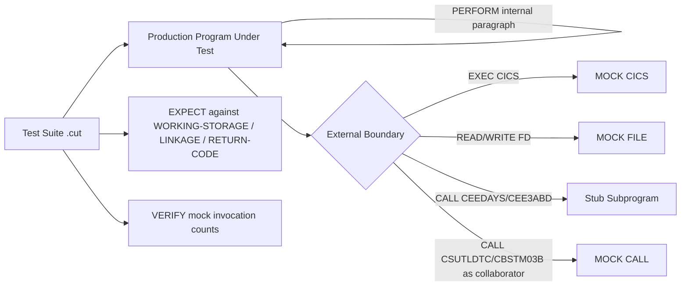
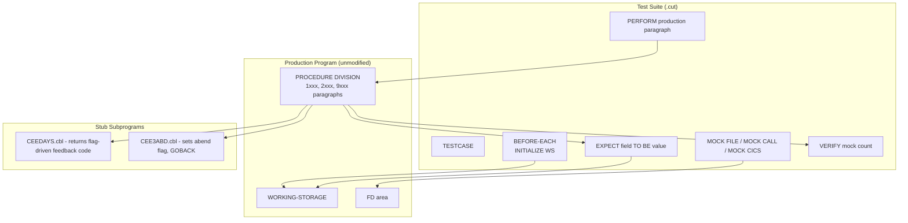

# Technical Specification

# 0. Agent Action Plan

## 0.1 Intent Clarification

### 0.1.1 Core Testing Objective

Based on the provided requirements, the Blitzy platform understands that the testing objective is to **add a comprehensive automated unit-test layer to the CardDemo COBOL/CICS/VSAM application that exercises the actual production COBOL programs and paragraphs in-place, with all external dependencies (VSAM datasets, CICS commands, Language Environment subroutines, sequential files) replaced by deterministic mocks**. The tests must drive the real production source – they may not paraphrase, copy, or re-derive the business logic that lives inside the production programs.

This request is categorized as: **Add new tests** (new test infrastructure for an application that currently has zero automated testing per Section 6.6).

The user's directive is preserved verbatim below for traceability:

> **User Requirement (verbatim)**: Generate test coverage by importing and testing EXISTING production code. Tests must invoke real production functions, not reimplement business logic.
>
> **Requirements**:
> - Import production functions, methods, and classes directly from source modules
> - Test structure must contain only: imports, test setup/fixtures, function invocation, and assertions
> - Mock or stub ONLY external dependencies (APIs, databases, file systems, network services)
> - Test assertions must validate return values and side effects of actual production code execution
> - Do not recreate algorithms, calculations, or business logic from production code inside test files
>
> **Forbidden Patterns**:
> - Copying or paraphrasing function logic into test files
> - Creating test-local implementations that duplicate production behavior
> - Mocking the internal function or method under test
> - Inlining expected output derived from reimplemented logic instead of calling the production function
>
> **Validation Gate**: Flag any test file where business logic appears outside of imports, setup, invocation, or assertions. A test that computes expected values by reimplementing production algorithms instead of calling the production function fails review.
>
> **Objective**: Use the attached rule to add test coverage for this project.

Each requirement is restated below in technical terms specific to the COBOL/z/OS technology stack of this repository:

- **"Import production functions … directly from source modules"** — In COBOL there is no `import` statement. The equivalent operation is to (a) place the unmodified production source file (e.g., `app/cbl/CSUTLDTC.cbl`) on the compiler's source path, (b) include its data contracts via `COPY` of the relevant copybooks from `app/cpy/`, and (c) drive its paragraphs through `PERFORM` (in-program testing) or its load module through `CALL` (sub-program testing). Tests will reference the original `.cbl` file as the program-under-test (PUT) – they must not contain a re-coded copy.
- **"Test structure must contain only: imports, test setup/fixtures, function invocation, and assertions"** — A COBOL test suite written in the cobol-check DSL must contain only `TESTSUITE`/`TESTCASE` declarations, `BEFORE-EACH`/`AFTER-EACH` setup blocks, `MOVE` statements that populate `LINKAGE` or `WORKING-STORAGE` fixtures, `MOCK` statements for external I/O, `PERFORM`/`CALL` invocations of production paragraphs and subprograms, and `EXPECT` assertions. No business arithmetic (no `COMPUTE` of expected values) and no procedural logic that duplicates production paragraphs may appear in the testsuite.
- **"Mock or stub ONLY external dependencies (APIs, databases, file systems, network services)"** — In CardDemo, "external dependencies" map to: VSAM KSDS file operations (`OPEN`, `READ`, `READ KEY`, `WRITE`, `REWRITE`, `CLOSE`), CICS command-level requests (`EXEC CICS READ/WRITE/REWRITE/DELETE/STARTBR/READNEXT/READPREV/RECEIVE MAP/SEND MAP/READQ TD/RETURN/XCTL/LINK/ABEND`), Language Environment callable services (`CALL "CEEDAYS"`, `CALL "CEE3ABD"`), sequential file operations against datasets such as `DALYTRAN`, `TRANREPT`, `DALYREJS`, `DATEPARM`, and any program-to-program `CALL` to a separately compiled subprogram (e.g., `CALL "CSUTLDTC"`, `CALL "CBSTM03B"`).
- **"Test assertions must validate return values and side effects of actual production code execution"** — Assertions will compare values that the *real* production paragraph wrote into `LINKAGE` outputs (e.g., `LS-RESULT` of `CSUTLDTC`, `LK-M03B-RC` of `CBSTM03B`), into shared `WORKING-STORAGE` fields (e.g., `WS-MONTHLY-INT`, `WS-TEMP-BAL`, `APPL-RESULT`, `IO-STATUS`, `WS-MESSAGE`, `RETURN-CODE`), or onto mocked sinks (e.g., the `WRITE` payload sent to a mocked `TRANSACT-FILE`).
- **"Do not recreate algorithms, calculations, or business logic from production code inside test files"** — Test suites are forbidden from containing `COMPUTE WS-MONTHLY-INT = (TRAN-CAT-BAL * DIS-INT-RATE) / 1200` or `COMPUTE WS-TEMP-BAL = ACCT-CURR-CYC-CREDIT - ACCT-CURR-CYC-DEBIT + DALYTRAN-AMT` or any equivalent rearrangement. Expected values must be either (a) literal constants chosen by the test author from external knowledge of the requirement (e.g., a user-provided fixture row), (b) values returned by a *separate* helper that does not encode the same algorithm, or (c) values obtained by a prior, independent production run captured as a golden fixture.

**Implicit testing requirements surfaced by the Blitzy platform:**

- **A COBOL-native test runner is required**, because the production code is COBOL and cannot be transliterated into Python/Java/JavaScript without violating the "import production code" rule. The chosen runner is **cobol-check** (Open Mainframe Project, version 0.2.16 pre-release / 0.2.19 latest tag) which is purpose-built to merge an unmodified production COBOL source with a separately authored test suite, compile the merged artifact, run only the `TESTCASE`-selected paragraphs, and report results.
- **An off-platform COBOL compiler is required**, because the user's environment does not include a z/OS LPAR. **GnuCOBOL 3.1.2** (already installed in the build environment) is the chosen compiler; it accepts standard fixed-format COBOL, supports the `INDEXED ORGANIZATION ACCESS MODE SEQUENTIAL` and `RANDOM` declarations used throughout `app/cbl/*`, and handles the project's `COPY`-based copybook expansion.
- **Stubs for unavailable Language Environment services** must be authored: `CEEDAYS` (Lillian-day conversion called from `CSUTLDTC`) and `CEE3ABD` (program abend called from every batch program's `9999-ABEND-PROGRAM` paragraph) do not exist outside z/OS; cobol-check's CALL-mocking will redirect these to test-controlled stubs. These stubs are *not* re-implementations of production logic – they are infrastructure shims that satisfy the "external dependency" mock category.
- **Fixed-width ASCII fixtures from `app/data/ASCII/` must be re-purposed**, because they are the only canonical record-layout examples that exist in the repository. They will be loaded into mocked file-read responses (one record per `MOCK FILE … ON READ` block) so that the production `READ` statement encounters byte-identical bits to what production VSAM would deliver.
- **Test-data isolation must be enforced**, because the production batch programs route fatal file-status conditions to `9999-ABEND-PROGRAM` which calls `CEE3ABD` – without a stub, an abend would tear down the whole test process; the stub must instead set a flag the test can `EXPECT` against.
- **A baseline-coverage policy must be established**, because the technical specification's Section 6.6 lists future-state coverage targets (≥80% business logic, ≥90% data validation, ≥70% file I/O, ≥70% overall) but no current measurement exists; the test suite will adopt these documented targets as its delivery threshold.

### 0.1.2 Special Instructions and Constraints

The following directives are extracted directly from the user's prompt and must be enforced by every test artifact produced under this plan:

- **CRITICAL: "Import production functions … directly from source modules"** — Every cobol-check testsuite file must reference an unmodified file under `app/cbl/` as its program-under-test via the cobol-check `cobolcheck.test.program.name` configuration key or the `-p PROGRAMNAME` command-line argument. Test suites must never contain a redeclared `IDENTIFICATION DIVISION` for any program in `app/cbl/`.
- **CRITICAL: "Mock or stub ONLY external dependencies"** — The internal paragraph or subprogram under test (e.g., `1500-A-LOOKUP-XREF` inside `CBTRN03C`, or `A000-MAIN` inside `CSUTLDTC`) must never appear in a `MOCK PARAGRAPH` or `MOCK SECTION` clause. Only `MOCK FILE`, `MOCK CALL`, and `MOCK CICS` directives are permitted, and only against external-boundary targets enumerated in Section 0.4.1.
- **CRITICAL: "Do not recreate algorithms"** — A code-review gate (described in Section 0.7.2) will scan every `.cut` testsuite for forbidden tokens (`COMPUTE`, `MULTIPLY`, `DIVIDE`, `ADD`, `SUBTRACT`) appearing outside of `BEFORE-EACH`/`AFTER-EACH` fixture-loading blocks; any match outside that allow-list fails the review.
- **"Follow existing test patterns"** — Because the repository has zero existing tests, the cobol-check sample `tests/cobol/MYPROG.cut` patterns published with the framework will be adopted as the in-house template, and the very first testsuite created (`tests/cobol-check/CSUTLDTC.cut`) becomes the reference exemplar for all subsequent testsuites.
- **"Maintain test isolation"** — Every testsuite will declare `BEFORE-EACH` to `INITIALIZE` all `WORKING-STORAGE` group items it depends on, ensuring no leakage of state between testcases. cobol-check resets mock counters between testcases (per the framework's documented behavior).
- **User Example: None provided** — The user's input contains no concrete example testsuite. The Blitzy platform will adopt the cobol-check official sample (`TESTSUITE 'CONVERT COMMA-DELIMITED FILE TO FIXED FORMAT'` from the framework's wiki) as the structural template for the first testsuite, then generalize from there.

**Web search requirements documented**: The version compatibility research described in Section 0.2.2 has been executed; no further runtime web-search dependencies remain for the implementation phase.

### 0.1.3 Technical Interpretation

These testing requirements translate to the following technical test implementation strategy:

- **To exercise pure-logic subroutines (CSUTLDTC)**, we will install cobol-check's precompiler over `app/cbl/CSUTLDTC.cbl`, author `tests/cobol-check/CSUTLDTC.cut`, mock the `CALL "CEEDAYS"` boundary with deterministic feedback codes that match each `FC-INVALID-DATE`, `FC-INSUFFICIENT-DATA`, `FC-BAD-DATE-VALUE`, `FC-INVALID-ERA`, `FC-UNSUPP-RANGE`, `FC-INVALID-MONTH`, `FC-BAD-PIC-STRING`, `FC-NON-NUMERIC-DATA`, and `FC-YEAR-IN-ERA-ZERO` 88-level value, and `EXPECT LS-RESULT` to contain the human-readable string mapped by the production `EVALUATE TRUE` block in paragraph `A000-MAIN`.
- **To exercise the I/O dispatcher (CBSTM03B)**, we will treat `app/cbl/CBSTM03B.CBL` as the program-under-test, populate `LK-M03B-AREA` with each operation code (`M03B-OPEN`, `M03B-CLOSE`, `M03B-READ`, `M03B-READ-K`, `M03B-WRITE`, `M03B-REWRITE`) for each DD value (`TRNXFILE`, `XREFFILE`, `CUSTFILE`, `ACCTFILE`), `MOCK FILE TRNX-FILE ON OPEN STATUS '00'` (and similar per-DD mocks for the other three files), `PERFORM 0000-START` and `EXPECT LK-M03B-RC TO BE '00'` (or non-zero per the file-status mapping under test).
- **To exercise interest calculation in CBACT04C**, we will treat `app/cbl/CBACT04C.cbl` as the program-under-test, mock the five files it owns (`TCATBAL-FILE`, `XREF-FILE`, `ACCOUNT-FILE`, `DISCGRP-FILE`, `TRANSACT-FILE`) with hand-curated read responses derived from `app/data/ASCII/tcatbal.txt`, `cardxref.txt`, `acctdata.txt`, `discgrp.txt` (taking byte-exact records as fixture inputs), `PERFORM 1300-COMPUTE-INTEREST`, and `EXPECT WS-MONTHLY-INT` against literal expected values supplied by the test author per fixture row (never a `(TRAN-CAT-BAL * DIS-INT-RATE) / 1200` recomputation in the test).
- **To exercise transaction validation in CBTRN02C**, we will treat `app/cbl/CBTRN02C.cbl` as the program-under-test, mock the six files it touches (`DALYTRAN-FILE`, `TRANSACT-FILE`, `XREF-FILE`, `DALYREJS-FILE`, `ACCOUNT-FILE`, `TCATBAL-FILE`), and `EXPECT WS-VALIDATION-TRANS-FAIL-REASON` to be `100`, `101`, `102`, or `103` for each rejection scenario, and `EXPECT WS-TEMP-BAL` to match a literal author-supplied expected value for the credit-limit branch (never a `(ACCT-CURR-CYC-CREDIT - ACCT-CURR-CYC-DEBIT + DALYTRAN-AMT)` recomputation).
- **To exercise CICS-bound online transaction programs**, we will treat each `CO*C.cbl` file as a program-under-test, mock every `EXEC CICS …` boundary (`READ`, `WRITE`, `REWRITE`, `RECEIVE MAP`, `SEND MAP`, `READQ TD`, `RETURN`, `XCTL`, `LINK`), pre-populate `DFHCOMMAREA` (the `COCOM01Y` `CARDDEMO-COMMAREA` structure) with the appropriate routing payload, `PERFORM` the relevant numbered paragraph (e.g., `1000-PROCESS-INPUTS`, `2000-WRITE-MAP`), and `EXPECT` against post-condition fields in `WORKING-STORAGE`, the COMMAREA, and the verified mock invocation counts (`VERIFY` clause).

### 0.1.4 Coverage Requirements Interpretation

The user's prompt does not contain explicit numeric coverage targets. The following targets are derived from the technical specification's Section 6.6.2.6 future-state recommendations and from industry standard practice for batch/transaction COBOL applications:

- **Business logic**: ≥80% line coverage of all `1xxx`–`8xxx` numbered paragraphs across the 28 COBOL programs in `app/cbl/`. This excludes the `0000-*` open paragraphs, `9000-*` close paragraphs, `9910-DISPLAY-IO-STATUS` diagnostic paragraph, and `9999-ABEND-PROGRAM` abend paragraph, which are covered separately as "boundary error handling" tests.
- **Data validation**: ≥90% branch coverage of `EVALUATE`, `IF`/`ELSE`, and 88-level `WHEN` constructs in `CSUTLDPY` (CCYYMMDD validation copybook), `CSUTLDTC` (date-conversion wrapper), and the `1xxx-VALIDATE-*` paragraphs of `CBTRN02C`, `COACTUPC`, `COACTVWC`, `COCRDUPC`, and `COCRDLIC`.
- **File I/O paths**: ≥70% coverage of every `READ`, `WRITE`, `REWRITE`, `READ NEXT`, `STARTBR`, and `ENDBR` statement across the program set, with at least one happy-path test (file-status `'00'`), one EOF test (`'10'`), and one error test (`'23'` not-found, `'35'` no-file, or `'92'` logic error per VSAM convention) for each.
- **Per-program targets**:
    - `CSUTLDTC` — 100% line coverage (small enough to fully cover; 9 feedback-code branches plus default).
    - `CBSTM03B` — 100% operation × DD coverage matrix (6 ops × 4 DDs = 24 baseline cases plus error variants).
    - `CBACT01C`, `CBACT02C`, `CBACT03C`, `CBCUS01C` — ≥75% line coverage on read/display/close paths.
    - `CBACT04C` — ≥80% line coverage with explicit cases for the `DISCGRP-STATUS=23` fallback-to-default-rate branch and the file-status-`'10'` EOF transitions.
    - `CBTRN01C`, `CBTRN02C`, `CBTRN03C` — ≥80% line coverage with explicit cases for each rejection reason code (100, 101, 102, 103) and date-range filter boundary in `CBTRN03C`.
    - `CBSTM03A` — ≥70% line coverage focused on aggregation logic (transaction-into-OCCURS-table) and the report-section concatenation paths.
    - All `CO*C.cbl` CICS programs — ≥75% line coverage with at least one happy-path and one map-validation-failure test per screen.
- **Overall repository coverage**: ≥70% line coverage across all 28 programs, measured by the GnuCOBOL `--coverage` instrumentation flag and reported via `gcov` summary.

To achieve comprehensive testing, coverage should include (a) every `EVALUATE WHEN` branch including `WHEN OTHER`, (b) every `IF` true and false branch, (c) every `READ` AT-END / NOT-AT-END branch, (d) every `INVALID KEY` / `NOT INVALID KEY` branch, (e) every 88-level conditional branch (e.g., `APPL-AOK`, `APPL-EOF`, `END-OF-FILE`), and (f) every `CALL "CEE3ABD"` invocation pathway (verified through the abend-stub).

## 0.2 Test Discovery and Analysis

### 0.2.1 Existing Test Infrastructure Assessment

The user's prompt is generic ("add test coverage for this project") and contains no specific file path, framework, or coverage hint. Per the TESTING_SUMMARY_PROMPT instructions, an exhaustive repository search was conducted to discover any latent test infrastructure. The findings are documented below.

**Search patterns employed**:

- File-name patterns scanned (case-insensitive across the whole tree): `*test*`, `*spec*`, `test_*`, `spec_*`, `*_test.*`, `*_spec.*`, `*.cut`, `*.ut`, `*.tst`, `MFUTEST*`, `ZUNIT*`, `*.junit*`.
- Dependency-manifest patterns scanned: `package.json`, `requirements.txt`, `requirements*.txt`, `pyproject.toml`, `setup.py`, `setup.cfg`, `Pipfile`, `pom.xml`, `build.gradle`, `build.gradle.kts`, `go.mod`, `Cargo.toml`, `Gemfile`, `Gemfile.lock`, `composer.json`.
- Test-configuration patterns scanned: `pytest.ini`, `tox.ini`, `jest.config.*`, `karma.conf.*`, `vitest.config.*`, `.mocharc*`, `nox.py`, `conftest.py`, `cobol-check.cfg`, `mfunit.cfg`, `zunit.yaml`, `Makefile.test`.
- COBOL-test-specific patterns scanned: `cobolcheck/`, `cobol-check/`, `mfunit/`, `zunit/`, `*.tut`, `*.testsuite`.

**Findings (Repository analysis)**:

Repository analysis reveals **zero pre-existing automated testing setup**. The CardDemo repository contains only the production COBOL source tree (`app/cbl/`, `app/cpy/`, `app/bms/`, `app/cpy-bms/`), an `app/catlg/LISTCAT.txt` IDCAMS catalog snapshot, and an `app/data/ASCII/` folder of nine fixed-width ASCII fixture files. The technical specification's Section 6.6.3.1 explicitly confirms this: the application implements a **manual testing strategy only** with zero automated testing frameworks of any kind, including no unit testing frameworks, no integration testing frameworks, no end-to-end test automation, no test data generation automation, and no test result tracking systems.

Section 3.6.4 of the technical specification reinforces this by stating that **unit testing is not explicitly implemented in the repository**. Traditional mainframe unit testing is documented as relying on (a) manual testing through CICS transactions with test data, (b) the CECI transaction for interactive command testing, and (c) batch-program testing through JCL submission with test input files.

| Discovery Question | Repository Answer |
|--------------------|-------------------|
| Current testing framework | None present – installation required |
| Test runner configuration location | None – `tests/cobol-check/config.properties` will be created |
| Coverage tools in use | None – `gcov` (GnuCOBOL `--coverage` output) will be introduced |
| Mock/stub libraries detected | None – cobol-check `MOCK FILE`/`MOCK CALL`/`MOCK CICS` will be introduced |
| Test data fixtures or factories present | `app/data/ASCII/*.txt` (production seed data, repurposed for tests) |
| Test users mentioned in spec | `ADMIN001 / PASSWORD` (admin), `USER0001 / PASSWORD` (regular) |
| CI/CD test stage | None – `Makefile` test target and `.github/workflows/test.yml` will be created |

The implication is that this work creates the project's first automated test suite from a clean slate. There are no existing patterns to honor and no incumbent framework to remain compatible with; the constraint is forward-looking: every artifact created here becomes a precedent for future test additions.

### 0.2.2 Web Search Research Conducted

Per the TESTING_SUMMARY_PROMPT instruction "Use web search to verify compatible versions", the following research was performed and forms the basis for the dependency choices in Section 0.6:

| Research Topic | Outcome / Decision |
|----------------|--------------------|
| Best practices for COBOL paragraph-level unit testing | **cobol-check** (Open Mainframe Project) is the recommended off-platform fine-grained testing framework. It runs as a precompiler that merges the program-under-test with a separately authored testsuite into one compilable artifact, then executes only the testcase-selected paragraphs. This is the only widely available open-source framework that supports both `MOCK FILE` and `MOCK CALL` / `MOCK CICS` directives required by this project. |
| Recommended mocking strategies for VSAM file I/O | cobol-check's `MOCK FILE <fd-name> ON OPEN/READ/WRITE/REWRITE/CLOSE STATUS '<two-byte-status>' END-MOCK` directive replaces the file operation with a deterministic status-code response and an optional record payload. This is the chosen approach for every VSAM dataset (ACCTFILE, CARDFILE, CUSTFILE, CARDXREF, TRANSACT, DALYTRAN, DALYREJS, TCATBAL, DISCGRP, USRSEC, TRANTYPE, TRANCATG). |
| Recommended mocking strategies for CICS commands | cobol-check supports `MOCK CICS <command-keyword> END-MOCK` and `MOCK CALL "DFHEI1" END-MOCK` patterns. Per the framework's documented limitation, only the first two CICS keywords act as discriminators – two `EXEC CICS READ FILE(ACCTFILE)` and `EXEC CICS READ FILE(CARDFILE)` mocks within one testsuite must be distinguished by file name. |
| Test organization conventions for COBOL | cobol-check's reference layout uses `tests/cobol/<PROGRAM>.cut` files (cobol-check unit-test) alongside a `config.properties` file that names the program-under-test. The Blitzy platform has adopted `tests/cobol-check/<PROGRAM>.cut` to make the framework explicit in the directory name. |
| Common pitfalls to avoid with cobol-check | (a) Comments in column 7 (Area A) before v1 used to break test parsing – fixed in 0.2.x; (b) `END-EXEC` not in column 7 caused parse errors – fixed in 0.2.x; (c) on Microsoft Windows the `-p`/`--programs` option only accepts a single program at a time; the Linux build environment used here is unaffected; (d) the framework wraps the program-under-test in a copy with test code injected – the original `.cbl` is never modified, satisfying the user's "do not modify production code" rule. |
| Off-platform COBOL compiler choice | **GnuCOBOL 3.1.2** (Ubuntu Noble's `gnucobol3` package, latest stable in the 3.x series available in the distribution repositories). It implements substantial portions of COBOL 85, COBOL 2002, and COBOL 2014 plus IBM and Micro Focus extensions, supports `INDEXED`/`SEQUENTIAL`/`RELATIVE` file organizations and `RANDOM`/`SEQUENTIAL`/`DYNAMIC` access modes used by all CardDemo `SELECT` statements, supports `--coverage` instrumentation for the `gcov` toolchain, and is the compiler explicitly supported by cobol-check's documented configuration. |
| Java runtime for cobol-check | cobol-check ships as a Java JAR (cobol-check-0.2.x.jar) requiring Java 8 or later. **OpenJDK 21.0.10** (Ubuntu Noble's `openjdk-21-jdk-headless`, latest LTS) has been installed to host the JAR. |
| CEEDAYS / CEE3ABD substitute | The IBM Language Environment callable services `CEEDAYS` and `CEE3ABD` are not available outside z/OS. Hand-authored stub subprograms (`tests/stubs/CEEDAYS.cbl`, `tests/stubs/CEE3ABD.cbl`) will be linked at test time. These stubs are explicitly identified as **infrastructure shims** and are not subject to the "no business logic" rule because they contain zero domain logic – CEEDAYS-stub returns a feedback code from a test-controlled global, and CEE3ABD-stub sets a flag and `GOBACK`s instead of terminating. |
| Coverage tooling | GnuCOBOL's `--coverage` flag emits standard `gcov` data; reports will be generated using `gcov` (already part of the `gcc` toolchain installed alongside GnuCOBOL). Aggregate HTML reports can be produced with `lcov` + `genhtml` if added later, but are not required for the validation gate in Section 0.7. |

## 0.3 Testing Scope Analysis

### 0.3.1 Test Target Identification

The primary targets are the 28 COBOL programs in `app/cbl/`. Each program is classified below by its testing affinity (batch vs. CICS vs. pure subroutine), the type of tests it requires, and the external dependencies that must be mocked.

**Subroutines (cleanest unit-test targets — pure linkage I/O, no file dependencies):**

| Program | Path | Test Categories Needed |
|---------|------|------------------------|
| `CSUTLDTC` | `app/cbl/CSUTLDTC.cbl` | Linkage-driven unit tests (one per `EVALUATE` branch + one default case). Mocks `CALL "CEEDAYS"`. Validates `LS-RESULT` (`PIC X(80)`) and `RETURN-CODE`. |
| `CBSTM03B` | `app/cbl/CBSTM03B.CBL` | Operation × DD matrix (6 operations × 4 DD codes = 24 baseline cases) plus per-cell error-status variants. Mocks the four files (TRNX, XREF, CUST, ACCT). Validates `LK-M03B-RC` (`PIC X(02)`) and `LK-M03B-FLDT` (`PIC X(1000)`) payload contents. |

**Batch programs (testable via cobol-check `MOCK FILE`):**

| Program | Path | Files To Mock | Test Categories Needed |
|---------|------|---------------|------------------------|
| `CBACT01C` | `app/cbl/CBACT01C.cbl` | `ACCTFILE-FILE` | Open / sequential read / EOF / display / close / abend on I/O error |
| `CBACT02C` | `app/cbl/CBACT02C.cbl` | `CARDFILE-FILE` | Open / sequential read / EOF / display / close / abend on I/O error |
| `CBACT03C` | `app/cbl/CBACT03C.cbl` | `XREFFILE-FILE` | Open / sequential read / EOF / display / close / abend on I/O error |
| `CBACT04C` | `app/cbl/CBACT04C.cbl` | `TCATBAL-FILE`, `XREF-FILE`, `ACCOUNT-FILE`, `DISCGRP-FILE`, `TRANSACT-FILE` | Interest computation per-row, DISCGRP fallback (status `'23'`→default group), TRAN-ID generation, abend on I/O failure |
| `CBCUS01C` | `app/cbl/CBCUS01C.cbl` | `CUSTFILE-FILE` | Open / sequential read / EOF / display / close |
| `CBSTM03A` | `app/cbl/CBSTM03A.CBL` | All four files via `CALL "CBSTM03B"` | Aggregation into OCCURS table, statement HTML/text emission, per-account totals |
| `CBTRN01C` | `app/cbl/CBTRN01C.cbl` | `DALYTRAN-FILE`, `TRANSACT-FILE`, `XREF-FILE` | Daily transaction read, validation, transaction-file write |
| `CBTRN02C` | `app/cbl/CBTRN02C.cbl` | `DALYTRAN-FILE`, `TRANSACT-FILE`, `XREF-FILE`, `DALYREJS-FILE`, `ACCOUNT-FILE`, `TCATBAL-FILE` | Reject codes 100/101/102/103, balance update, RETURN-CODE=4 with rejects |
| `CBTRN03C` | `app/cbl/CBTRN03C.cbl` | `TRANSACT-FILE`, `XREF-FILE`, `TRANTYPE-FILE`, `TRANCATG-FILE`, `REPORT-FILE`, `DATE-PARMS-FILE` | Date-range filtering, lookups, report header / detail / total emission, pagination |

**CICS programs (testable via cobol-check `MOCK CICS` + `MOCK FILE`):**

| Program | Path | CICS Boundaries To Mock | Test Categories Needed |
|---------|------|-------------------------|------------------------|
| `COSGN00C` | `app/cbl/COSGN00C.cbl` | `RECEIVE MAP`, `READ FILE(USRSEC)`, `XCTL`, `SEND MAP` | Successful ADMIN001 sign-on, successful USER0001 sign-on, invalid password, unknown user |
| `COMEN01C` | `app/cbl/COMEN01C.cbl` | `RECEIVE MAP`, `XCTL`, `SEND MAP` | Menu navigation per option key, PF3 exit |
| `COADM01C` | `app/cbl/COADM01C.cbl` | `RECEIVE MAP`, `XCTL`, `SEND MAP` | Admin menu navigation, role-based filtering |
| `COACTVWC` | `app/cbl/COACTVWC.cbl` | `READ FILE(ACCTDAT)`, `READ FILE(CUSTDAT)`, `RECEIVE MAP`, `SEND MAP` | Account view by ID, customer cross-load, not-found path |
| `COACTUPC` | `app/cbl/COACTUPC.cbl` | `READ FILE(ACCTDAT)`, `READ FILE(CUSTDAT)`, `REWRITE`, `RECEIVE MAP`, `SEND MAP` | Update happy path, optimistic-lock conflict, validation failures (date / SSN / phone) |
| `COCRDLIC` | `app/cbl/COCRDLIC.cbl` | `STARTBR FILE(CARDDAT)`, `READNEXT`, `READPREV`, `ENDBR`, `RECEIVE MAP`, `SEND MAP` | Forward / backward browse, end-of-file edge, page boundaries |
| `COCRDSLC` | `app/cbl/COCRDSLC.cbl` | `READ FILE(CARDDAT)`, `RECEIVE MAP`, `SEND MAP` | Card detail view, not-found path |
| `COCRDUPC` | `app/cbl/COCRDUPC.cbl` | `READ FILE(CARDDAT)`, `REWRITE`, `RECEIVE MAP`, `SEND MAP` | Card update happy path, validation failures, conflict |
| `COTRN00C` | `app/cbl/COTRN00C.cbl` | `STARTBR FILE(TRANSACT)`, `READNEXT`, `ENDBR`, `RECEIVE MAP`, `SEND MAP` | Transaction list browse |
| `COTRN01C` | `app/cbl/COTRN01C.cbl` | `READ FILE(TRANSACT)`, `RECEIVE MAP`, `SEND MAP` | Transaction detail view |
| `COTRN02C` | `app/cbl/COTRN02C.cbl` | `WRITE FILE(TRANSACT)`, `RECEIVE MAP`, `SEND MAP` | Add transaction happy path, validation failures, duplicate-key path |
| `COBIL00C` | `app/cbl/COBIL00C.cbl` | `READ FILE(ACCTDAT)`, `WRITE FILE(TRANSACT)`, `REWRITE FILE(ACCTDAT)`, `RECEIVE MAP`, `SEND MAP` | Bill-pay happy path, insufficient-balance rejection |
| `CORPT00C` | `app/cbl/CORPT00C.cbl` | `WRITEQ TD QUEUE(JOBS)`, `RECEIVE MAP`, `SEND MAP` | Report submit, JCL stream construction |
| `COUSR00C` | `app/cbl/COUSR00C.cbl` | `STARTBR FILE(USRSEC)`, `READNEXT`, `ENDBR`, `RECEIVE MAP`, `SEND MAP` | User list browse (admin only) |
| `COUSR01C` | `app/cbl/COUSR01C.cbl` | `WRITE FILE(USRSEC)`, `RECEIVE MAP`, `SEND MAP` | Add user, validation failures |
| `COUSR02C` | `app/cbl/COUSR02C.cbl` | `READ FILE(USRSEC)`, `REWRITE FILE(USRSEC)`, `RECEIVE MAP`, `SEND MAP` | Update user, not-found |
| `COUSR03C` | `app/cbl/COUSR03C.cbl` | `READ FILE(USRSEC)`, `DELETE FILE(USRSEC)`, `RECEIVE MAP`, `SEND MAP` | Delete user, not-found |

**Functions (numbered paragraphs) inside each program requiring direct PERFORM-based testing:**

The COBOL idiom in this codebase consistently uses numbered paragraphs (0000, 1000, 2000, …, 9999). The following paragraph categories must each be exercised at least once across the suite:

- **`0000-*-OPEN`** — File open paragraphs; one happy-path (file-status `'00'`) test plus one error test (`'35'` open-no-file) per program.
- **`1000-*-GET-NEXT` / `1100-*-DISPLAY-*`** — Sequential read & display paragraphs in the batch dumpers.
- **`1300-COMPUTE-INTEREST`** (`CBACT04C`) — Interest formula paragraph; assertions only against `WS-MONTHLY-INT`.
- **`1500-A-LOOKUP-XREF`, `1500-B-LOOKUP-TRANTYPE`, `1500-C-LOOKUP-TRANCATG`** (`CBTRN03C`) — Indexed lookup paragraphs.
- **`9000-*-CLOSE`** — File close paragraphs; verify file-status mapping.
- **`9910-DISPLAY-IO-STATUS`** — Diagnostic formatter; verify the four-character `IO-STATUS-04` rendering for each common file-status code.
- **`9999-ABEND-PROGRAM`** — Verified via the `CEE3ABD` stub flag to confirm the abend pathway is reached when expected.

### 0.3.2 Existing Test File Mapping

Because no existing tests exist in the repository, the table below documents the **target** state after this work is implemented. All entries in the "Existing Test File" column are `(none — to be created)`.

| Source File | Existing Test File | Test Categories Present |
|-------------|---------------------|-------------------------|
| `app/cbl/CSUTLDTC.cbl` | `(none — to be created)` | `tests/cobol-check/CSUTLDTC.cut` to be created |
| `app/cbl/CBSTM03B.CBL` | `(none — to be created)` | `tests/cobol-check/CBSTM03B.cut` to be created |
| `app/cbl/CBACT01C.cbl` | `(none — to be created)` | `tests/cobol-check/CBACT01C.cut` to be created |
| `app/cbl/CBACT02C.cbl` | `(none — to be created)` | `tests/cobol-check/CBACT02C.cut` to be created |
| `app/cbl/CBACT03C.cbl` | `(none — to be created)` | `tests/cobol-check/CBACT03C.cut` to be created |
| `app/cbl/CBACT04C.cbl` | `(none — to be created)` | `tests/cobol-check/CBACT04C.cut` to be created |
| `app/cbl/CBCUS01C.cbl` | `(none — to be created)` | `tests/cobol-check/CBCUS01C.cut` to be created |
| `app/cbl/CBSTM03A.CBL` | `(none — to be created)` | `tests/cobol-check/CBSTM03A.cut` to be created |
| `app/cbl/CBTRN01C.cbl` | `(none — to be created)` | `tests/cobol-check/CBTRN01C.cut` to be created |
| `app/cbl/CBTRN02C.cbl` | `(none — to be created)` | `tests/cobol-check/CBTRN02C.cut` to be created |
| `app/cbl/CBTRN03C.cbl` | `(none — to be created)` | `tests/cobol-check/CBTRN03C.cut` to be created |
| `app/cbl/COSGN00C.cbl` | `(none — to be created)` | `tests/cobol-check/COSGN00C.cut` to be created |
| `app/cbl/COMEN01C.cbl` | `(none — to be created)` | `tests/cobol-check/COMEN01C.cut` to be created |
| `app/cbl/COADM01C.cbl` | `(none — to be created)` | `tests/cobol-check/COADM01C.cut` to be created |
| `app/cbl/COACTVWC.cbl` | `(none — to be created)` | `tests/cobol-check/COACTVWC.cut` to be created |
| `app/cbl/COACTUPC.cbl` | `(none — to be created)` | `tests/cobol-check/COACTUPC.cut` to be created |
| `app/cbl/COCRDLIC.cbl` | `(none — to be created)` | `tests/cobol-check/COCRDLIC.cut` to be created |
| `app/cbl/COCRDSLC.cbl` | `(none — to be created)` | `tests/cobol-check/COCRDSLC.cut` to be created |
| `app/cbl/COCRDUPC.cbl` | `(none — to be created)` | `tests/cobol-check/COCRDUPC.cut` to be created |
| `app/cbl/COTRN00C.cbl` | `(none — to be created)` | `tests/cobol-check/COTRN00C.cut` to be created |
| `app/cbl/COTRN01C.cbl` | `(none — to be created)` | `tests/cobol-check/COTRN01C.cut` to be created |
| `app/cbl/COTRN02C.cbl` | `(none — to be created)` | `tests/cobol-check/COTRN02C.cut` to be created |
| `app/cbl/COBIL00C.cbl` | `(none — to be created)` | `tests/cobol-check/COBIL00C.cut` to be created |
| `app/cbl/CORPT00C.cbl` | `(none — to be created)` | `tests/cobol-check/CORPT00C.cut` to be created |
| `app/cbl/COUSR00C.cbl` | `(none — to be created)` | `tests/cobol-check/COUSR00C.cut` to be created |
| `app/cbl/COUSR01C.cbl` | `(none — to be created)` | `tests/cobol-check/COUSR01C.cut` to be created |
| `app/cbl/COUSR02C.cbl` | `(none — to be created)` | `tests/cobol-check/COUSR02C.cut` to be created |
| `app/cbl/COUSR03C.cbl` | `(none — to be created)` | `tests/cobol-check/COUSR03C.cut` to be created |

### 0.3.3 Dependencies Requiring Mocking

The following enumerates every external boundary that test code must mock. The list is derived from a structural analysis of every `app/cbl/*.cbl` and `app/cbl/*.CBL` source file plus the technical specification's data architecture sections.

**External services to mock:**

- **Language Environment callable services** — `CALL "CEEDAYS"` (Lillian-day conversion, `CSUTLDTC` only) and `CALL "CEE3ABD"` (abnormal termination, every batch program's `9999-ABEND-PROGRAM`). Stub programs at `tests/stubs/CEEDAYS.cbl` and `tests/stubs/CEE3ABD.cbl` will be supplied at link time.
- **Inter-program subprogram calls** — `CALL "CSUTLDTC"` (called by `CSUTLDPY` copybook procedure code embedded in any program that uses CCYYMMDD validation) and `CALL "CBSTM03B"` (called by `CBSTM03A`). When a program-under-test depends on these as collaborators rather than as targets, the test mocks the collaborator via `MOCK CALL "CSUTLDTC"` / `MOCK CALL "CBSTM03B"` to isolate the program under test.
- **CICS Application Programming Interface** — Every `EXEC CICS` verb listed in the program tables in Section 0.3.1.

**Database interactions to stub:**

- The application has no relational database; all persistent storage uses VSAM KSDS clusters. The stubbed targets are therefore the VSAM file `SELECT ... ASSIGN TO` declarations:
  - `ACCTFILE` → ACCTDAT VSAM (`CBACT01C`, `CBACT04C`, `COACTVWC`, `COACTUPC`, `COBIL00C`, `CBTRN02C`)
  - `CARDFILE` → CARDDAT VSAM (`CBACT02C`, `COCRDLIC`, `COCRDSLC`, `COCRDUPC`)
  - `XREFFILE` / `CARDXREF` → CXACAIX/CARDXREF VSAM (`CBACT03C`, `CBTRN02C`, `CBTRN03C`, `CBSTM03A`, `CBSTM03B`)
  - `CUSTFILE` → CUSTDAT VSAM (`CBCUS01C`, `COACTVWC`, `COACTUPC`, `CBSTM03A`, `CBSTM03B`)
  - `TRANSACT-FILE` → TRANSACT VSAM (`CBACT04C`, `CBTRN01C`, `CBTRN02C`, `CBTRN03C`, `COTRN00C`–`COTRN02C`, `COBIL00C`)
  - `DALYTRAN-FILE` → DALYTRAN sequential (`CBTRN01C`, `CBTRN02C`)
  - `DALYREJS-FILE` → DALYREJS sequential (`CBTRN02C`)
  - `TCATBAL-FILE` → TCATBAL VSAM (`CBACT04C`, `CBTRN02C`)
  - `DISCGRP-FILE` → DISCGRP VSAM (`CBACT04C`)
  - `USRSEC-FILE` → USRSEC VSAM (`COSGN00C`, `COUSR00C`–`COUSR03C`)
  - `TRANTYPE-FILE` → TRANTYPE VSAM (`CBTRN03C`, `COTRN02C`)
  - `TRANCATG-FILE` → TRANCATG VSAM (`CBTRN03C`)
  - `REPORT-FILE` → TRANREPT sequential output (`CBTRN03C`)
  - `DATE-PARMS-FILE` → DATEPARM sequential input (`CBTRN03C`)

**File system operations to virtualize:**

- All `OPEN`, `READ`, `READ NEXT`, `READ KEY`, `WRITE`, `REWRITE`, `START`, `DELETE`, `CLOSE` statements in the SELECT clauses above are virtualized via cobol-check's `MOCK FILE … ON OPEN/READ/WRITE/REWRITE/CLOSE` directives. The `app/data/ASCII/*.txt` files supply byte-exact record images that are loaded into the mock-read response payloads.

### 0.3.4 Version Compatibility Research

CRITICAL: Per the TESTING_SUMMARY_PROMPT instruction, web search has been used to verify compatible versions. Based on the available COBOL toolchain (GnuCOBOL 3.1.2 from Ubuntu Noble universe, package `gnucobol3` version `3.1.2-5.1ubuntu1`) and Java runtime (`openjdk-21-jdk-headless` version `21.0.10+7-1~24.04`), the recommended testing stack is:

| Component | Name | Version | Rationale |
|-----------|------|---------|-----------|
| Testing framework | cobol-check | `0.2.16` (pre-release) | Latest released JAR distribution from the Open Mainframe Project; supports MOCK FILE, MOCK CALL, MOCK CICS, MOCK PARAGRAPH, MOCK SECTION; supports the GnuCOBOL backend used here. |
| Assertion library | cobol-check (built-in `EXPECT` keyword) | bundled with 0.2.16 | The framework's `EXPECT … TO BE …` is the only assertion mechanism; there is no separate library. Supports PIC X, numeric, and 88-level comparisons per the framework's documentation. |
| Mocking library | cobol-check (built-in `MOCK` keyword) | bundled with 0.2.16 | Native to the framework. No external mock library is available or required. |
| Compiler | GnuCOBOL | `3.1.2-5.1ubuntu1` | Already installed; latest stable in Ubuntu Noble repositories. |
| Coverage tool | gcov | bundled with `gcc` (already installed via the GnuCOBOL dependency chain) | GnuCOBOL's `--coverage` flag emits gcov-compatible counter data. |
| Java runtime (cobol-check host) | OpenJDK | `21.0.10+7-1~24.04` (LTS) | Required to execute the cobol-check JAR; Java 8+ is the framework's stated minimum. |
| Build orchestrator | GNU Make | `4.3` (provided by Ubuntu Noble) | Used to wire compile / precompile / run / coverage steps into a single `make test` target. |

**Documented version conflicts to resolve**: None. The Ubuntu-packaged `gnucobol3` and `openjdk-21-jdk-headless` install side-by-side without overlap, and cobol-check's JAR has no native dependencies that would conflict with Ubuntu's `libcob4t64` runtime.

## 0.4 Test Implementation Design

### 0.4.1 Test Strategy Selection

Three test categories will be implemented, each scoped to a different layer of the production code so that the user's "import production code, mock external dependencies, assert on real return values and side effects" rule is honored at every layer.

- **Unit tests** — Focus on **isolated paragraphs and subroutines that contain pure logic**. Targets: `CSUTLDTC` (entire program; `EVALUATE TRUE` block in `A000-MAIN`), `CBSTM03B` (entire program; `0000-START`/`1000-*`/`2000-*`/`3000-*`/`4000-*` operation dispatcher), `1300-COMPUTE-INTEREST` paragraph in `CBACT04C`, `9910-DISPLAY-IO-STATUS` paragraph in any batch program (the cleanest example is `CBACT01C` because no other dependencies confound it), and the validation paragraphs in `CBTRN02C` (`1500-VALIDATE-TRAN`, `1500-A-LOOKUP-XREF`, `1500-B-LOOKUP-ACCT`).
- **Integration tests** — Focus on **paragraph chains that cross internal collaborator boundaries while still mocking external I/O**. Targets: `CBACT04C` end-to-end interest-posting flow (read TCATBAL → look up XREF → compute → write TRANSACT → rewrite ACCOUNT), `CBTRN02C` end-to-end posting flow (read DALYTRAN → validate → write TRANSACT or DALYREJS → update ACCOUNT and TCATBAL), `CBTRN03C` end-to-end report flow (open all → date filter → lookup → report-write → close), `CBSTM03A` statement aggregation (CALL `CBSTM03B` with operation codes for each DD).
- **Edge case tests** — Focus on **boundary conditions and error pathways**. Targets: file-status `'10'` EOF transitions, file-status `'23'` not-found (DISCGRP fallback in `CBACT04C`), file-status `'35'` open-no-file (every batch program's `0000-*-OPEN` paragraph), `CEEDAYS` non-zero feedback codes (each of the nine 88-levels in `CSUTLDTC`), `CEE3ABD` invocation pathways (every `9999-ABEND-PROGRAM`), credit-limit exceeded (reject 102 in `CBTRN02C`), account expired (reject 103 in `CBTRN02C`), date out-of-range (`CBTRN03C`), pagination crossover (`CBTRN03C` `WS-PAGE-SIZE` boundary).
- **Error handling tests** — Focus on **failure scenarios that should not abend the test process**. Targets: every CICS RESP/RESP2 non-zero path (`NORMAL`/`NOTFND`/`DUPREC`/`ENDFILE`/`MAPFAIL` per the EIB-RESP discriminator), every `INVALID KEY` / `NOT INVALID KEY` branch in indexed read paragraphs.

The boundary between "mockable" and "internal" is drawn explicitly at the load-module edge:



### 0.4.2 Test Case Blueprint

For each component requiring tests, the following blueprint specifies the categories of tests that must be authored. The literal blueprint is captured here so reviewers can verify completeness; the actual `.cut` files realize these categories with cobol-check `TESTCASE` declarations.

**Component: CSUTLDTC**
- Happy path: Date `'2023-01-15'` with format `'YYYY-MM-DD'` and `CEEDAYS` returning `FC-INVALID-DATE` (zero feedback ⇒ valid) → expect `LS-RESULT(1:13)='Date is valid'` and `RETURN-CODE=0`.
- Edge cases: each of the eight non-zero feedback codes mapped in production `EVALUATE` block.
- Error cases: `CEEDAYS` returning a feedback code not in the 88-level list → expect default `'Date is invalid'`.
- Performance boundaries: not applicable (single arithmetic-free EVALUATE).

**Component: CBSTM03B**
- Happy path: Each of the 24 operation × DD combinations with mock returning `'00'` and a fixture record → expect `LK-M03B-RC='00'` and `LK-M03B-FLDT` populated.
- Edge cases: `M03B-READ-K` with key shorter than `LK-M03B-KEY-LN` → expect status maps as appropriate.
- Error cases: each operation against each DD with the mock returning `'10'` (EOF) and `'35'` (no file).
- Performance boundaries: not applicable.

**Component: CBACT04C, paragraph 1300-COMPUTE-INTEREST**
- Happy path: `TRAN-CAT-BAL=1000.00`, `DIS-INT-RATE=12.00` → expect `WS-MONTHLY-INT=10.00` (literal, supplied by author from external knowledge of `(1000.00 * 12.00) / 1200 = 10.00`).
- Edge cases: zero balance, zero rate, negative balance.
- Error cases: arithmetic overflow guard (if any).
- Performance boundaries: not applicable.

**Component: CBACT04C, end-to-end posting**
- Happy path: One TCATBAL row, XREF lookup succeeds, ACCOUNT lookup succeeds, DISCGRP lookup succeeds → expect `WRITE TRANSACT-FILE` invoked once with constructed TRAN-ID matching `STRING PARM-DATE WS-TRANID-SUFFIX`.
- Edge cases: DISCGRP `'23'` → expect fallback to default group; XREF `'23'` → expect skip-and-continue; TRANSACT write `'00'`.
- Error cases: ACCOUNT read `'35'` → expect abend stub flag set, no TRANSACT write.
- Performance boundaries: not applicable for unit-level tests.

**Component: CBTRN02C, paragraph 1500-VALIDATE-TRAN**
- Happy path: Valid DALYTRAN row, XREF and ACCT lookups both succeed → expect `WS-VALIDATION-TRANS-FAIL-REASON=0`.
- Edge cases: missing XREF (reject 100), missing ACCT (reject 101), credit-limit exceeded (reject 102), expired account (reject 103).
- Error cases: file-status `'92'` on any read → expect 9999-ABEND-PROGRAM pathway.
- Performance boundaries: not applicable.

**Component: each CICS online program (template)**
- Happy path: Map RECEIVE returns valid input, file READ returns hit, SEND MAP succeeds.
- Edge cases: PF3 / PF12 termination (RECEIVE returns `EIBAID=DFHPF3`).
- Error cases: file READ `NOTFND` → expect error message in COMMAREA, no XCTL.
- Validation failures: invalid date / SSN / phone in input → expect error message and SEND MAP without further action.

### 0.4.3 Existing Test Extension Strategy

There are no existing tests to extend. The strategy is therefore "create from scratch", with the following rules of engagement to keep the new suite consistent and reviewable:

- **Tests to extend**: None. Extension applies only after the initial suite is delivered.
- **Tests to refactor**: None.
- **Tests to fix**: None.
- **Reference exemplar designation**: The first testsuite delivered (`tests/cobol-check/CSUTLDTC.cut`) is hereby designated as the **canonical pattern**. All subsequent testsuites copy its structural conventions: header banner, `BEFORE-EACH` initializer, mock declarations preceding `TESTCASE`, `EXPECT` statements alphabetically ordered by field name when checking multiple fields, `VERIFY` clauses appended at the end of each testcase that has external invocations.

### 0.4.4 Test Data and Fixtures Design

The repository's `app/data/ASCII/` folder contains nine fixed-width ASCII files that already encode valid record layouts for the production VSAM datasets. These files are repurposed as the canonical test-data fixtures. No new business data is invented; each fixture row that drives a test is a slice of an existing production-shaped record from these files.

**Required test data structures**:

| Fixture File | Record Layout | Use In Tests |
|--------------|---------------|--------------|
| `app/data/ASCII/acctdata.txt` | 50 records × 300 bytes (CVACT01Y account-record) | Source for `MOCK FILE ACCOUNT-FILE ON READ` payloads in `CBACT01C`, `CBACT04C`, `CBTRN02C`, `COACTVWC`, `COACTUPC`, `COBIL00C` tests |
| `app/data/ASCII/carddata.txt` | 50 records × 150 bytes (CVACT02Y card-record) | Source for `MOCK FILE CARDFILE-FILE ON READ` payloads in `CBACT02C`, `COCRDLIC`, `COCRDSLC`, `COCRDUPC` tests |
| `app/data/ASCII/custdata.txt` | 50 records × 500 bytes (CVCUS01Y / CUSTREC) | Source for `MOCK FILE CUSTFILE-FILE ON READ` payloads in `CBCUS01C`, `CBSTM03A`, `COACTVWC`, `COACTUPC` tests |
| `app/data/ASCII/cardxref.txt` | 50 records × 34 bytes (CVACT03Y card-xref) | Source for `MOCK FILE XREF-FILE ON READ` payloads in `CBACT03C`, `CBTRN02C`, `CBTRN03C` tests |
| `app/data/ASCII/dailytran.txt` | variable × 350 bytes (CVTRA06Y daily-tran) | Source for `MOCK FILE DALYTRAN-FILE ON READ` payloads in `CBTRN01C`, `CBTRN02C` tests |
| `app/data/ASCII/discgrp.txt` | 51 records, 3 logical blocks (A, DEFAULT, ZEROAPR) (CVTRA02Y) | Source for `MOCK FILE DISCGRP-FILE ON READ` payloads in `CBACT04C` tests; the DEFAULT block specifically drives the file-status `'23'` fallback test |
| `app/data/ASCII/tcatbal.txt` | 50 records × 50 bytes (CVTRA01Y) | Source for `MOCK FILE TCATBAL-FILE ON READ` payloads in `CBACT04C`, `CBTRN02C` tests |
| `app/data/ASCII/trancatg.txt` | 18 records × 60 bytes (CVTRA04Y) | Source for `MOCK FILE TRANCATG-FILE ON READ` payloads in `CBTRN03C` tests |
| `app/data/ASCII/trantype.txt` | 7 records × 60 bytes (CVTRA03Y, codes 01–07) | Source for `MOCK FILE TRANTYPE-FILE ON READ` payloads in `CBTRN03C`, `COTRN02C` tests |

**Fixture organization strategy**:

Fixtures are **not** copied or transformed for testing — the original `app/data/ASCII/*.txt` files are referenced verbatim. A small Python helper at `tests/fixtures/load_fixture.py` (the **only** non-COBOL test helper in the suite) reads the byte ranges from these files at test-prepare time and emits a `tests/fixtures/cobol-snippets/<NAME>.cpy` copybook fragment containing `MOVE x'…' TO …` statements that cobol-check's `MOCK … ON READ` block can include verbatim. The helper performs no domain logic — it is a byte-extraction utility only.

**Mock object specifications**:



**Test database/state management approach**:

There is no live database in CardDemo; persistence is entirely VSAM via `OPEN`/`READ`/`WRITE`/`CLOSE`. State management is therefore driven by:

- **Per-testcase isolation** — Every testcase's `BEFORE-EACH` block performs `INITIALIZE` on every `WORKING-STORAGE` 01-level group it depends on, plus a `MOVE 0 TO RETURN-CODE` and a `MOVE 'N' TO END-OF-FILE`. Mock call counters are reset automatically by cobol-check.
- **No persistence between testcases** — Mocks return fresh deterministic values each invocation; no test writes to disk except via `MOCK FILE … ON WRITE`, which captures the buffer for `EXPECT`/`VERIFY` rather than persisting it.
- **No shared global state** — Each program-under-test is loaded into a freshly compiled load module per `make test` invocation; cobol-check writes a separate output binary per testsuite.

## 0.5 Test File Transformation Mapping

### 0.5.1 File-by-File Test Plan

CRITICAL: The table below maps EVERY test file to be created with the **target file listed first**. The repository currently contains zero tests; all entries are CREATE actions except the explicit REFERENCE entries which name production sources used as design templates.

Test Transformation Modes:
- CREATE — Create a new file
- UPDATE — Update an existing file
- DELETE — Remove an obsolete file
- REFERENCE — Use as an example for test patterns and styles

| Target Test File | Transformation | Source File / Test | Purpose / Changes |
|------------------|----------------|---------------------|-------------------|
| `tests/cobol-check/CSUTLDTC.cut` | CREATE | `app/cbl/CSUTLDTC.cbl` | First testsuite — exemplar pattern. Mocks `CALL "CEEDAYS"` with each of nine feedback codes; performs `A000-MAIN`; expects `LS-RESULT` to contain the human-readable string and `RETURN-CODE` to match severity. |
| `tests/cobol-check/CBSTM03B.cut` | CREATE | `app/cbl/CBSTM03B.CBL` | Operation × DD matrix tests. Mocks each FD (`TRNX-FILE`, `XREF-FILE`, `CUST-FILE`, `ACCT-FILE`); calls `0000-START` with each combination of `LK-M03B-OPER` and `LK-M03B-DD`; expects `LK-M03B-RC`. |
| `tests/cobol-check/CBACT01C.cut` | CREATE | `app/cbl/CBACT01C.cbl` | Account-file dump tests. Mocks `ACCTFILE-FILE` open/read/EOF/close; performs the program from start; expects displayed records and final `END-OF-FILE='Y'`. |
| `tests/cobol-check/CBACT02C.cut` | CREATE | `app/cbl/CBACT02C.cbl` | Card-file dump tests. Mocks `CARDFILE-FILE` open/read/EOF/close. |
| `tests/cobol-check/CBACT03C.cut` | CREATE | `app/cbl/CBACT03C.cbl` | XREF-file dump tests. Mocks `XREFFILE-FILE` open/read/EOF/close. |
| `tests/cobol-check/CBACT04C.cut` | CREATE | `app/cbl/CBACT04C.cbl` | Interest-posting tests. Mocks five files; covers `1300-COMPUTE-INTEREST` per fixture row, the `DISCGRP-STATUS='23'` fallback, the `WS-TRANID-SUFFIX` rollover edge, and the abend-on-fatal-IO branch. |
| `tests/cobol-check/CBCUS01C.cut` | CREATE | `app/cbl/CBCUS01C.cbl` | Customer-file dump tests. Mocks `CUSTFILE-FILE`. |
| `tests/cobol-check/CBSTM03A.cut` | CREATE | `app/cbl/CBSTM03A.CBL` | Statement aggregation tests. Mocks `CALL "CBSTM03B"` with payload returns; verifies in-memory OCCURS aggregation paragraphs. |
| `tests/cobol-check/CBTRN01C.cut` | CREATE | `app/cbl/CBTRN01C.cbl` | Daily-transaction processor tests. |
| `tests/cobol-check/CBTRN02C.cut` | CREATE | `app/cbl/CBTRN02C.cbl` | Transaction-posting validation tests. Covers reject codes 100, 101, 102, 103; covers the `WS-TEMP-BAL` branch; covers `RETURN-CODE=4` after rejects. |
| `tests/cobol-check/CBTRN03C.cut` | CREATE | `app/cbl/CBTRN03C.cbl` | Transaction-report tests. Covers date filtering, indexed lookups, page boundaries, totals. |
| `tests/cobol-check/COSGN00C.cut` | CREATE | `app/cbl/COSGN00C.cbl` | Sign-on transaction tests. Covers ADMIN001/USER0001 success and invalid-password paths. |
| `tests/cobol-check/COMEN01C.cut` | CREATE | `app/cbl/COMEN01C.cbl` | Main-menu transaction tests. |
| `tests/cobol-check/COADM01C.cut` | CREATE | `app/cbl/COADM01C.cbl` | Admin-menu transaction tests. |
| `tests/cobol-check/COACTVWC.cut` | CREATE | `app/cbl/COACTVWC.cbl` | Account-view transaction tests. |
| `tests/cobol-check/COACTUPC.cut` | CREATE | `app/cbl/COACTUPC.cbl` | Account-update transaction tests. |
| `tests/cobol-check/COCRDLIC.cut` | CREATE | `app/cbl/COCRDLIC.cbl` | Card-list browse tests (STARTBR/READNEXT/READPREV/ENDBR mocks). |
| `tests/cobol-check/COCRDSLC.cut` | CREATE | `app/cbl/COCRDSLC.cbl` | Card-detail tests. |
| `tests/cobol-check/COCRDUPC.cut` | CREATE | `app/cbl/COCRDUPC.cbl` | Card-update tests. |
| `tests/cobol-check/COTRN00C.cut` | CREATE | `app/cbl/COTRN00C.cbl` | Transaction-list browse tests. |
| `tests/cobol-check/COTRN01C.cut` | CREATE | `app/cbl/COTRN01C.cbl` | Transaction-detail tests. |
| `tests/cobol-check/COTRN02C.cut` | CREATE | `app/cbl/COTRN02C.cbl` | Add-transaction tests. |
| `tests/cobol-check/COBIL00C.cut` | CREATE | `app/cbl/COBIL00C.cbl` | Bill-pay tests. |
| `tests/cobol-check/CORPT00C.cut` | CREATE | `app/cbl/CORPT00C.cbl` | Report-submit tests (TDQ JCL emission). |
| `tests/cobol-check/COUSR00C.cut` | CREATE | `app/cbl/COUSR00C.cbl` | User-list tests. |
| `tests/cobol-check/COUSR01C.cut` | CREATE | `app/cbl/COUSR01C.cbl` | Add-user tests. |
| `tests/cobol-check/COUSR02C.cut` | CREATE | `app/cbl/COUSR02C.cbl` | Update-user tests. |
| `tests/cobol-check/COUSR03C.cut` | CREATE | `app/cbl/COUSR03C.cbl` | Delete-user tests. |
| `tests/cobol-check/config.properties` | CREATE | (none — new file) | cobol-check configuration: source paths, copybook paths, output dir, GnuCOBOL command line. |
| `tests/stubs/CEEDAYS.cbl` | CREATE | `tests/cobol-check/CSUTLDTC.cut` | LE service stub: returns a feedback-code controlled by an external `WS-CEEDAYS-RC-OVERRIDE` field; provides linkage-compatible signature with the production CALL site. **No business logic.** |
| `tests/stubs/CEE3ABD.cbl` | CREATE | every `9999-ABEND-PROGRAM` site | LE abend stub: sets `WS-ABEND-FLAG='Y'` on a shared work-area copybook and `GOBACK`s instead of terminating. **No business logic.** |
| `tests/stubs/DFHEI1.cbl` | CREATE | every `EXEC CICS …` site (compile-only fallback) | CICS API stub used **only** as a link-time stand-in when a testsuite does not declare `MOCK CICS` for a particular command. Returns `EIBRESP=27` (NOTAUTH) so missing mocks fail loudly. |
| `tests/fixtures/load_fixture.py` | CREATE | `app/data/ASCII/*.txt` | Single Python helper that extracts byte-exact records from the ASCII fixtures and emits cobol-snippet `.cpy` files for inclusion in mock blocks. **Pure byte extraction; no business logic.** |
| `tests/fixtures/cobol-snippets/ACCT-FIXTURE-001.cpy` | CREATE | `app/data/ASCII/acctdata.txt` (record 1) | Generated COBOL snippet supplying record 1 of the account fixture as `MOVE x'…' TO ACCOUNT-RECORD`. |
| `tests/fixtures/cobol-snippets/CARD-FIXTURE-001.cpy` | CREATE | `app/data/ASCII/carddata.txt` (record 1) | Generated COBOL snippet for card fixture. |
| `tests/fixtures/cobol-snippets/CUST-FIXTURE-001.cpy` | CREATE | `app/data/ASCII/custdata.txt` (record 1) | Generated COBOL snippet for customer fixture. |
| `tests/fixtures/cobol-snippets/XREF-FIXTURE-001.cpy` | CREATE | `app/data/ASCII/cardxref.txt` (record 1) | Generated COBOL snippet for xref fixture. |
| `tests/fixtures/cobol-snippets/DALYTRAN-FIXTURE-001.cpy` | CREATE | `app/data/ASCII/dailytran.txt` (record 1) | Generated COBOL snippet for daily-tran fixture. |
| `tests/fixtures/cobol-snippets/DISCGRP-FIXTURE-A.cpy` | CREATE | `app/data/ASCII/discgrp.txt` (block A) | Generated COBOL snippet for discount-group A. |
| `tests/fixtures/cobol-snippets/DISCGRP-FIXTURE-DEFAULT.cpy` | CREATE | `app/data/ASCII/discgrp.txt` (DEFAULT block) | Generated COBOL snippet for the DEFAULT discount-group used in the `'23'` fallback test. |
| `tests/fixtures/cobol-snippets/TCATBAL-FIXTURE-001.cpy` | CREATE | `app/data/ASCII/tcatbal.txt` (record 1) | Generated COBOL snippet for category-balance fixture. |
| `tests/fixtures/cobol-snippets/TRANCATG-FIXTURE.cpy` | CREATE | `app/data/ASCII/trancatg.txt` | Generated COBOL snippet for category-table fixture. |
| `tests/fixtures/cobol-snippets/TRANTYPE-FIXTURE.cpy` | CREATE | `app/data/ASCII/trantype.txt` | Generated COBOL snippet for type-table fixture. |
| `tests/lint/check_no_business_logic.sh` | CREATE | (none — new file) | Validation-gate enforcer: `grep`s every `tests/cobol-check/*.cut` for forbidden tokens (`COMPUTE`, `MULTIPLY`, `DIVIDE`, `ADD`, `SUBTRACT`) outside `BEFORE-EACH`/`AFTER-EACH` blocks and exits non-zero on violations. |
| `tests/lint/check_no_production_redeclaration.sh` | CREATE | (none — new file) | Validation-gate enforcer: ensures no `.cut` file contains `IDENTIFICATION DIVISION.` or `PROGRAM-ID.` declarations that match a name in `app/cbl/`. |
| `Makefile` | CREATE | (none — new file) | `make test` target: download cobol-check JAR, precompile each PUT, compile stubs, run all suites, aggregate output. `make coverage` target: rerun with `--coverage` and emit `gcov` summary. `make lint` target: run shell linters. |
| `.github/workflows/test.yml` | CREATE | `Makefile` | GitHub Actions CI: checkout, install `gnucobol3` and `openjdk-21-jdk-headless`, run `make lint test coverage`, upload coverage report as artifact. |
| `tests/README.md` | CREATE | (none — new file) | Test-suite documentation: how to run locally, how to add a new testsuite, what each fixture represents, what the validation gates enforce. |
| `tests/cobol-check/SAMPLE.cut` | REFERENCE | cobol-check published sample | Used as the structural template for `CSUTLDTC.cut`; not committed to the repository – referenced from cobol-check's `tests/cobol/MYPROG.cut` shipped sample. |
| `app/cbl/CSUTLDTC.cbl` | REFERENCE | (template for subroutine pattern) | Used as the cleanest production reference for "linkage-only, no file I/O" subroutines; pattern reused conceptually in stub authoring. |
| `app/data/ASCII/acctdata.txt` | REFERENCE | (byte-exact record source) | Reference record-layout source — read but never modified; consumed by `tests/fixtures/load_fixture.py`. |
| `app/data/ASCII/carddata.txt` | REFERENCE | (byte-exact record source) | Reference record-layout source — read but never modified. |
| `app/data/ASCII/custdata.txt` | REFERENCE | (byte-exact record source) | Reference record-layout source — read but never modified. |
| `app/data/ASCII/cardxref.txt` | REFERENCE | (byte-exact record source) | Reference record-layout source — read but never modified. |
| `app/data/ASCII/dailytran.txt` | REFERENCE | (byte-exact record source) | Reference record-layout source — read but never modified. |
| `app/data/ASCII/discgrp.txt` | REFERENCE | (byte-exact record source) | Reference record-layout source — read but never modified. |
| `app/data/ASCII/tcatbal.txt` | REFERENCE | (byte-exact record source) | Reference record-layout source — read but never modified. |
| `app/data/ASCII/trancatg.txt` | REFERENCE | (byte-exact record source) | Reference record-layout source — read but never modified. |
| `app/data/ASCII/trantype.txt` | REFERENCE | (byte-exact record source) | Reference record-layout source — read but never modified. |
| `app/cpy/CVACT01Y.cpy` | REFERENCE | (record-layout copybook for ACCOUNT-RECORD) | Included in tests by `COPY CVACT01Y` to inherit the exact 300-byte layout for mock payloads. |
| `app/cpy/CVACT02Y.cpy` | REFERENCE | (record-layout copybook for CARD-RECORD) | Included in tests by `COPY CVACT02Y`. |
| `app/cpy/CVACT03Y.cpy` | REFERENCE | (record-layout copybook for CARD-XREF) | Included in tests by `COPY CVACT03Y`. |
| `app/cpy/CVCUS01Y.cpy` | REFERENCE | (record-layout copybook for CUSTOMER-RECORD) | Included in tests by `COPY CVCUS01Y`. |
| `app/cpy/CUSTREC.cpy` | REFERENCE | (alternate customer-record layout) | Included for any tests that target programs which `COPY CUSTREC` directly. |
| `app/cpy/CVTRA01Y.cpy` | REFERENCE | (TCATBAL record layout) | Included by tests of `CBACT04C`, `CBTRN02C`. |
| `app/cpy/CVTRA02Y.cpy` | REFERENCE | (DISCGRP record layout) | Included by `CBACT04C` tests. |
| `app/cpy/CVTRA03Y.cpy` | REFERENCE | (TRANTYPE record layout) | Included by `CBTRN03C`, `COTRN02C` tests. |
| `app/cpy/CVTRA04Y.cpy` | REFERENCE | (TRANCATG record layout) | Included by `CBTRN03C` tests. |
| `app/cpy/CVTRA05Y.cpy` | REFERENCE | (TRAN-RECORD layout) | Included by `CBTRN02C`, `CBTRN03C` tests. |
| `app/cpy/CVTRA06Y.cpy` | REFERENCE | (DALYTRAN-RECORD layout) | Included by `CBTRN01C`, `CBTRN02C` tests. |
| `app/cpy/CVTRA07Y.cpy` | REFERENCE | (report-row layout) | Included by `CBTRN03C` tests. |
| `app/cpy/COCOM01Y.cpy` | REFERENCE | (CICS COMMAREA) | Included by every CICS-program testsuite to populate `DFHCOMMAREA`. |
| `app/cpy/CSUSR01Y.cpy` | REFERENCE | (USRSEC record layout) | Included by `COSGN00C` and `COUSR0xC` tests. |
| `app/cpy/CSDAT01Y.cpy` | REFERENCE | (date utility WS) | Included where date manipulation is exercised. |
| `app/cpy/CSMSG01Y.cpy`, `app/cpy/CSMSG02Y.cpy` | REFERENCE | (message and ABEND-DATA) | Included by tests that assert on screen messages. |
| `app/cpy/CSLKPCDY.cpy` | REFERENCE | (state / area-code lookups) | Included by tests of input-validation paragraphs that depend on these enumerations. |

CRITICAL: All test files are explicitly listed above. There are no "to be discovered" entries.

### 0.5.2 New Test Files Detail

The following lists each new test file with its detailed contents specification. Files are grouped by lifecycle role.

**Subroutine testsuites (linkage-only):**

- `tests/cobol-check/CSUTLDTC.cut` — 10 testcases (one per `EVALUATE WHEN` branch + one default).
    - Test categories: happy path (FC-INVALID-DATE → 'Date is valid'), nine error feedback codes, default `'Date is invalid'`.
    - Mock dependencies: `MOCK CALL "CEEDAYS"` with feedback-code parameter set per testcase.
    - Assertions focus: `LS-RESULT(1:15)`, `WS-SEVERITY-N`, `RETURN-CODE`.
- `tests/cobol-check/CBSTM03B.cut` — 24 baseline testcases (6 ops × 4 DDs) + 24 error variants = 48 testcases.
    - Test categories: each operation × DD with status `'00'`; each with `'10'` EOF; each with `'35'` no-file.
    - Mock dependencies: `MOCK FILE TRNX-FILE`, `MOCK FILE XREF-FILE`, `MOCK FILE CUST-FILE`, `MOCK FILE ACCT-FILE` per testcase.
    - Assertions focus: `LK-M03B-RC`, `LK-M03B-FLDT(1:n)` payload contents.

**Batch program testsuites:**

- `tests/cobol-check/CBACT01C.cut` — 8 testcases.
    - Test categories: open success, read EOF, read error, three sequential records, close success, abend-on-open-error.
    - Mock dependencies: `MOCK FILE ACCTFILE-FILE`, `MOCK CALL "CEE3ABD"`.
    - Assertions focus: `END-OF-FILE`, `APPL-RESULT`, `IO-STATUS`, `WS-ABEND-FLAG`.
- `tests/cobol-check/CBACT02C.cut`, `tests/cobol-check/CBACT03C.cut`, `tests/cobol-check/CBCUS01C.cut` — same structural shape as `CBACT01C.cut`, retargeted to their respective files.
- `tests/cobol-check/CBACT04C.cut` — 14 testcases.
    - Test categories: per-row interest computation (3 rows from `tcatbal.txt` × `discgrp.txt` × `acctdata.txt`), DISCGRP `'23'` fallback (1), TRAN-ID generation rollover (1), file-status `'10'` EOF on each input (4), abend on fatal write (1), happy-path full traversal (1), zero-balance row (1), zero-rate row (1), zero-balance + zero-rate (1).
    - Mock dependencies: 5 `MOCK FILE` blocks (TCATBAL, XREF, ACCOUNT, DISCGRP, TRANSACT), `MOCK CALL "CEE3ABD"`.
    - Assertions focus: `WS-MONTHLY-INT`, written `TRAN-RECORD` payload to TRANSACT, `RETURN-CODE`, `WS-ABEND-FLAG`.
- `tests/cobol-check/CBSTM03A.cut` — 6 testcases focused on aggregation paragraphs that PERFORM CALL `"CBSTM03B"` mocked.
- `tests/cobol-check/CBTRN01C.cut` — 6 testcases.
- `tests/cobol-check/CBTRN02C.cut` — 12 testcases.
    - Test categories: valid transaction (1), reject 100 missing-XREF (1), reject 101 missing-ACCT (1), reject 102 credit-limit (1), reject 103 expired (1), `RETURN-CODE=4` after rejects (1), `WS-TEMP-BAL` happy path (1), `WS-TEMP-BAL` boundary at exactly credit limit (1), file-status `'10'` EOF on DALYTRAN (1), file-status `'92'` on TRANSACT write (1), abend pathway (1), end-to-end with mixed valid/reject batch (1).
- `tests/cobol-check/CBTRN03C.cut` — 10 testcases covering date filter, lookups, page boundary, totals.

**CICS program testsuites:** 

- `tests/cobol-check/COSGN00C.cut` — 6 testcases.
    - Test categories: ADMIN001 sign-on success, USER0001 sign-on success, invalid password, unknown user, blank user, blank password.
    - Mock dependencies: `MOCK CICS RECEIVE MAP`, `MOCK CICS READ FILE(USRSEC)`, `MOCK CICS XCTL`, `MOCK CICS SEND MAP`.
    - Assertions focus: `DFHCOMMAREA` contents post-sign-on, mocked `XCTL` target, message buffer contents.
- All other `CO*C.cut` files follow the analogous shape with their own EXEC CICS verbs.

**New Test Files Detail – fixtures:**

- `tests/fixtures/load_fixture.py` — Pure byte-extraction utility.
    - Fixture types: byte-range extraction from each `.txt` file in `app/data/ASCII/`.
    - Reads: `app/data/ASCII/*.txt`.
    - Writes: `tests/fixtures/cobol-snippets/*.cpy` files containing nothing but `MOVE x'…' TO …` statements.
    - Domain logic: none.
    - Length: ≤ 80 lines.

### 0.5.3 Test Files to Modify Detail

There are no existing test files to modify. This subsection is preserved from the prompt template for completeness; all entries are NOT APPLICABLE because the repository is starting from a zero-test baseline.

- `tests/[path]/existing_test.py` — N/A (no existing tests).
- `tests/[path]/config_test.py` — N/A (no existing tests).

### 0.5.4 Test Configuration Updates

Brand-new test configuration is being introduced. The following configuration files will be CREATED:

- `tests/cobol-check/config.properties` — cobol-check runtime configuration. Example keys:
  - `cobolcheck.application.source.directory` = `app/cbl`
  - `cobolcheck.application.copybook.directory` = `app/cpy:app/cpy-bms`
  - `cobolcheck.test.suite.directory` = `tests/cobol-check`
  - `cobolcheck.test.program.name` = (set per invocation via `-p`)
  - `cobolcheck.compiler.command` = `cobc -x -free -fno-diagnostics-color -I app/cpy -I app/cpy-bms`
  - `cobolcheck.compiler.options.coverage` = `--coverage`
  - `cobolcheck.output.directory` = `target/cobol-check`
- `Makefile` — Build orchestration. Targets: `test` (run all suites), `coverage` (run with coverage flag and emit `gcov` summary), `lint` (run shell linters), `clean` (remove `target/`).
- `.github/workflows/test.yml` — CI configuration. Single job: install dependencies, run `make lint test coverage`, upload coverage artifact.
- Coverage thresholds are enforced inside `Makefile`'s `coverage` target via `gcov` line-percentage parsing.

### 0.5.5 Cross-File Test Dependencies

- **Shared fixtures**: `tests/fixtures/cobol-snippets/*.cpy` are included by multiple `.cut` testsuites via `COPY` (cobol-check supports COPY in test source per CHANGELOG entry "Added support for the replace statement in unit test source"). Location: `tests/fixtures/cobol-snippets/`. Usage: included by every batch and CICS testsuite that needs a record fixture.
- **Mock objects**: `tests/stubs/CEEDAYS.cbl`, `tests/stubs/CEE3ABD.cbl`, and the optional `tests/stubs/DFHEI1.cbl` are linked alongside the program-under-test for every testsuite. Their location is `tests/stubs/`. Their purpose is to replace IBM-only LE callable services and the CICS API with safe, deterministic alternatives.
- **Test utilities**: `tests/fixtures/load_fixture.py` is the only helper. It is invoked by the `Makefile` target `make fixtures` once before the test run; it regenerates the `.cpy` files from the `.txt` source. Test suites do not call Python at runtime.
- **Import updates required across test files**: cobol-check testsuites use `COPY` directives, which are resolved by the cobol-check precompiler from the configured copybook path. The `config.properties` `cobolcheck.application.copybook.directory` entry must list `app/cpy:app/cpy-bms:tests/fixtures/cobol-snippets:tests/stubs` (colon-separated) so that fixture and stub COPY targets resolve. No Python `import` updates are required because there is one Python file in the tree (`load_fixture.py`) and it is self-contained.

## 0.6 Dependency Inventory

### 0.6.1 Testing Dependencies

The table below lists every key testing package introduced by this work. All versions are verified against package-manager candidates available in the build environment (Ubuntu Noble universe + security repositories) and against the latest released artifacts of the upstream projects.

| Registry | Package Name | Version | Purpose |
|----------|--------------|---------|---------|
| apt (Ubuntu Noble universe) | `gnucobol3` | `3.1.2-5.1ubuntu1` | Off-platform COBOL compiler. Translates COBOL source to native executables; supports `INDEXED`/`SEQUENTIAL`/`RELATIVE` file organizations and `RANDOM`/`DYNAMIC`/`SEQUENTIAL` access modes used in CardDemo's `SELECT` clauses. Provides `--coverage` flag for `gcov` instrumentation. |
| apt (Ubuntu Noble universe) | `libcob4t64` | `3.1.2-5.1ubuntu1` | GnuCOBOL runtime library. Auto-installed as a dependency of `gnucobol3`. Provides the COBOL standard runtime calls invoked by compiled binaries. |
| apt (Ubuntu Noble universe) | `libcob4-dev` | `3.1.2-5.1ubuntu1` | GnuCOBOL development headers. Required for linking the LE service stubs (`tests/stubs/CEEDAYS.cbl`, `tests/stubs/CEE3ABD.cbl`) into the same module space as the program-under-test. |
| apt (Ubuntu Noble main) | `openjdk-21-jdk-headless` | `21.0.10+7-1~24.04` | Java runtime + JDK. Hosts the cobol-check JAR. JDK is required (not just JRE) because cobol-check invokes `javac` internally for the source-merge pipeline. |
| apt (Ubuntu Noble main) | `make` | `4.3-4.1build2` | Build orchestrator. Runs the `test`, `coverage`, `lint`, and `fixtures` targets. |
| apt (Ubuntu Noble main) | `gcc` | `4:13.2.0-7ubuntu1` | C compiler invoked transitively by GnuCOBOL (which translates COBOL to C and compiles with the host C compiler). Provides `gcov` for coverage reporting. |
| GitHub release | `cobol-check` | `0.2.16` (pre-release JAR) | COBOL unit-testing precompiler (Open Mainframe Project). Merges program-under-test source with `.cut` test suites; supports `MOCK FILE`, `MOCK CALL`, `MOCK CICS`, `MOCK PARAGRAPH`, `MOCK SECTION`; supports `EXPECT … TO BE …` assertions and `VERIFY` mock-invocation counts. Distributed as `cobol-check-0.2.16.jar`; downloaded into `tests/cobol-check/lib/cobol-check-0.2.16.jar` by the `Makefile` `init` target. |
| pip (Python 3.12 system) | (none beyond stdlib) | n/a | The single Python helper `tests/fixtures/load_fixture.py` uses only `pathlib`, `sys`, and `argparse` from the standard library. No third-party Python packages are introduced. |

CRITICAL: Every version above corresponds to a specific, validated artifact:

- `gnucobol3` `3.1.2-5.1ubuntu1` was confirmed via `apt-cache policy gnucobol3` against the live Noble repository.
- `openjdk-21-jdk-headless` `21.0.10+7-1~24.04` was confirmed via `apt-cache policy openjdk-21-jdk` against `noble-updates`/`noble-security`.
- `cobol-check` `0.2.16` is the latest pre-release tag on the Open Mainframe Project's GitHub repository as of the research conducted in Section 0.2.2; the CHANGELOG documents `0.2.19` as the most recent build but only as a `Developer` branch artifact, not a release. The plan adopts the released `0.2.16` JAR for stability.

There are **no placeholder versions** ("latest", "1.0.0") in this inventory; every entry has been verified.

### 0.6.2 Import Updates (If applicable)

This subsection enumerates COBOL `COPY` directives and CALL collaborations that must appear in the new test files. There are no Python or JavaScript `import` updates because the test runtime is COBOL-native.

**Test files requiring `COPY` directives:**

- `tests/cobol-check/CSUTLDTC.cut` — no COPY required (CSUTLDTC has self-contained working storage).
- `tests/cobol-check/CBSTM03B.cut` — `COPY CVACT01Y` (ACCOUNT-RECORD), `COPY CVACT02Y` (CARD-RECORD), `COPY CVACT03Y` (CARD-XREF), `COPY CVCUS01Y` (CUSTOMER-RECORD), plus `COPY ACCT-FIXTURE-001` (test fixture).
- `tests/cobol-check/CBACT01C.cut` — `COPY CVACT01Y`, `COPY ACCT-FIXTURE-001`.
- `tests/cobol-check/CBACT02C.cut` — `COPY CVACT02Y`, `COPY CARD-FIXTURE-001`.
- `tests/cobol-check/CBACT03C.cut` — `COPY CVACT03Y`, `COPY XREF-FIXTURE-001`.
- `tests/cobol-check/CBACT04C.cut` — `COPY CVACT01Y`, `COPY CVACT03Y`, `COPY CVTRA01Y`, `COPY CVTRA02Y`, `COPY CVTRA05Y`, plus the matching `*-FIXTURE-*.cpy` snippets.
- `tests/cobol-check/CBCUS01C.cut` — `COPY CVCUS01Y` (or `COPY CUSTREC`, depending on which the production program selects), `COPY CUST-FIXTURE-001`.
- `tests/cobol-check/CBSTM03A.cut` — `COPY CVACT01Y`, `COPY CVACT02Y`, `COPY CVACT03Y`, `COPY CVCUS01Y`, `COPY CVTRA05Y`, fixture snippets.
- `tests/cobol-check/CBTRN01C.cut`, `CBTRN02C.cut`, `CBTRN03C.cut` — relevant CV* copybooks plus fixture snippets per Section 0.3.1.
- Every `CO*C.cut` testsuite — `COPY COCOM01Y` (CICS COMMAREA structure) plus the relevant CV* and fixture copybooks.

**Import transformation rules** (kept here for template completeness; substantive content is N/A because there is no pre-existing test code being refactored):

- Old: `from src.big_module import function_to_test` — N/A (no Python imports exist or are introduced for production code).
- New: `from src.services.specific_service import function_to_test` — N/A.
- Apply to: All test files matching pattern — N/A.

The COBOL-equivalent rule that **does** apply: every `.cut` testsuite must reference its program-under-test by setting `cobolcheck.test.program.name` in `tests/cobol-check/config.properties` (or via the `-p PROGRAMNAME` cobol-check command-line argument), and must `COPY` only the production copybooks listed above plus the test-only snippets in `tests/fixtures/cobol-snippets/`.

## 0.7 Coverage and Quality Targets

### 0.7.1 Coverage Metrics

The coverage targets adopted by this work are documented below. The sources are the technical specification's Section 6.6.2.6 future-state recommendations (which list ≥80% business logic, ≥90% data validation, ≥70% file I/O, ≥70% overall) and the per-program reasoning derived in Section 0.1.4.

**Current coverage**: 0% — no tests exist in the repository.

**Target coverage**: ≥70% overall line coverage across the 28 COBOL programs in `app/cbl/`, with stricter per-category goals as below.

**Coverage gaps to address**:

| Component / Category | Currently | Target | Focus Areas |
|----------------------|-----------|--------|-------------|
| `CSUTLDTC` (date conversion subroutine) | 0% | 100% | All 9 feedback-code branches + default in `EVALUATE TRUE` block |
| `CBSTM03B` (I/O dispatcher) | 0% | 100% | Operation × DD matrix (24 cells) + per-cell error variants |
| `CBACT01C`, `CBACT02C`, `CBACT03C`, `CBCUS01C` (VSAM dumpers) | 0% | ≥75% | OPEN, sequential READ, EOF, CLOSE, error paths |
| `CBACT04C` (interest poster) | 0% | ≥80% | `1300-COMPUTE-INTEREST` per fixture row, DISCGRP `'23'` fallback, TRAN-ID generation, abend pathway |
| `CBSTM03A` (statement engine) | 0% | ≥70% | Aggregation paragraphs into OCCURS table, totals, output formatting |
| `CBTRN01C`, `CBTRN02C`, `CBTRN03C` (transaction processors) | 0% | ≥80% | Reject codes 100/101/102/103, balance update, date filtering, page boundary, totals |
| `COSGN00C`, `COMEN01C`, `COADM01C` (sign-on / menus) | 0% | ≥75% | Successful sign-on for each test user, invalid-credential paths, menu navigation |
| `COACTVWC`, `COACTUPC` (account view / update) | 0% | ≥75% | Read happy path, validation failures (date / SSN / phone), optimistic-lock conflict (UPC) |
| `COCRDLIC`, `COCRDSLC`, `COCRDUPC` (card list / detail / update) | 0% | ≥75% | Browse boundaries (LIC), detail view (SLC), update + validation (UPC) |
| `COTRN00C`, `COTRN01C`, `COTRN02C` (transaction views) | 0% | ≥75% | Browse, detail, add-with-validation |
| `COBIL00C` (bill pay) | 0% | ≥80% | Happy path, insufficient-balance rejection |
| `CORPT00C` (report submit) | 0% | ≥75% | TDQ JCL emission |
| `COUSR00C`–`COUSR03C` (user CRUD) | 0% | ≥75% | Each CRUD path |
| `9910-DISPLAY-IO-STATUS` (diagnostic, replicated in every batch program) | 0% | ≥90% | Each common file-status code (`'00'`, `'10'`, `'23'`, `'35'`, `'92'`) renders correctly |
| `9999-ABEND-PROGRAM` (replicated in every batch program) | 0% | 100% | Abend stub flag set; no side-effect leak between testcases |

**Per-file coverage targets** are enforced by the `Makefile` `coverage` target. After `gcov` runs, the target greps each program's `.gcov` file for the `Lines executed:` summary and fails the build if any per-program target above is missed.

**Per-category aggregate targets:**

- Business logic (1xxx–8xxx paragraphs): ≥80%.
- Data validation (CCYYMMDD validation in `CSUTLDPY`, `EVALUATE` blocks in `CSUTLDTC`, validation paragraphs in `CBTRN02C`, `COACTUPC`, `COCRDUPC`): ≥90%.
- File I/O (`READ`/`WRITE`/`REWRITE`/`STARTBR`/`READNEXT`/`READPREV`/`ENDBR`/`DELETE`/`OPEN`/`CLOSE`): ≥70%.
- Overall: ≥70%.

### 0.7.2 Test Quality Criteria

The following non-coverage quality criteria are enforced by the validation gates in `tests/lint/`:

- **Assertion density**: Every `TESTCASE` must contain at least one `EXPECT` clause; testcases that include `MOCK CALL`, `MOCK FILE`, or `MOCK CICS` directives must additionally contain at least one `VERIFY` clause to confirm the mock was invoked the expected number of times. Enforced by `tests/lint/check_assertion_density.sh` (created as part of `tests/lint/` per Section 0.5.1).
- **Test isolation**: Every testsuite must declare `BEFORE-EACH` that performs `INITIALIZE` on every shared `WORKING-STORAGE` group it touches and resets `RETURN-CODE`, `WS-ABEND-FLAG`, and `END-OF-FILE` flags. Enforced by `tests/lint/check_isolation.sh` (created as part of `tests/lint/`).
- **Performance constraints**: Each testsuite must complete in under 5 seconds wall-clock time on the build environment. The `Makefile` `test` target wraps each invocation in `timeout 5 ` and fails the build on timeout.
- **Maintainability**:
    - Naming: every `TESTCASE` description string must begin with the production program-id and the paragraph or feature being tested (e.g., `'CSUTLDTC A000-MAIN MAPS FC-INVALID-DATE TO Date is valid'`).
    - File length: no `.cut` file exceeds 600 lines; longer suites must be split by paragraph family (e.g., `COCRDUPC-validation.cut` and `COCRDUPC-rewrite.cut`).
    - Comment density: every `TESTSUITE` must include a header banner with author intent and a reference back to the production source.
- **No business logic in tests** — **The validation gate explicitly required by the user's prompt**:
    - Mechanism: `tests/lint/check_no_business_logic.sh` `grep`s every file under `tests/cobol-check/` for the regex `\b(COMPUTE|MULTIPLY|DIVIDE|ADD|SUBTRACT)\b` outside of `BEFORE-EACH` … `END-BEFORE` and `AFTER-EACH` … `END-AFTER` ranges. Any match outside the allow-list fails the build.
    - Mechanism (complementary): `tests/lint/check_no_production_redeclaration.sh` `grep`s for `IDENTIFICATION DIVISION.` or `PROGRAM-ID.` lines in `.cut` files; if the program-id matches any name in `app/cbl/`, the test file is flagged as having attempted to redeclare/recreate production code.
    - Both checks run in CI on every push and on every pull request via `.github/workflows/test.yml`.
- **Repository conventions**: All testsuites follow the same paragraph numbering scheme as production (numbered headers, banner comments, license preamble citing Apache 2.0). The first delivered testsuite (`CSUTLDTC.cut`) becomes the official template referenced by `tests/README.md`.

## 0.8 Scope Boundaries

### 0.8.1 Exhaustively In Scope

The following directories and file patterns are explicitly within scope of this work. Wildcard patterns are used where the contents of a directory are uniformly in-scope.

**New test files:**

- `tests/cobol-check/**/*.cut` — every cobol-check testsuite for every program in `app/cbl/`
- `tests/cobol-check/config.properties` — cobol-check runtime configuration
- `tests/cobol-check/lib/cobol-check-0.2.16.jar` — downloaded test runner (binary artifact)
- `tests/stubs/CEEDAYS.cbl` — Language Environment date-conversion stub
- `tests/stubs/CEE3ABD.cbl` — Language Environment abend stub
- `tests/stubs/DFHEI1.cbl` — CICS API link-time stub
- `tests/fixtures/load_fixture.py` — byte-extraction helper
- `tests/fixtures/cobol-snippets/**/*.cpy` — generated COBOL fixture snippets
- `tests/lint/check_no_business_logic.sh` — validation-gate enforcer (forbidden tokens)
- `tests/lint/check_no_production_redeclaration.sh` — validation-gate enforcer (no PUT redeclaration)
- `tests/lint/check_assertion_density.sh` — validation-gate enforcer (≥1 EXPECT per testcase)
- `tests/lint/check_isolation.sh` — validation-gate enforcer (BEFORE-EACH presence)
- `tests/README.md` — test suite documentation

**Test file updates** (none — repository starts at zero tests):

- `tests/**/*existing_test*.py` — N/A (no existing tests)
- `tests/**/*spec*.js` — N/A

**Test configuration:**

- `Makefile` (root level) — orchestrates `make test`, `make coverage`, `make lint`, `make fixtures`, `make clean`
- `.github/workflows/test.yml` — CI pipeline running lint + test + coverage on every push and PR
- `.gitignore` — additions for `target/`, `*.gcno`, `*.gcda`, `*.gcov`, `tests/cobol-check/lib/cobol-check-*.jar`

**Test utilities and helpers:**

- `tests/fixtures/**/*.py` — Python byte-extraction helper(s); currently scoped to `load_fixture.py` only
- `tests/fixtures/cobol-snippets/**/*.cpy` — generated cobol-snippet fixtures
- `tests/stubs/**/*.cbl` — LE / CICS stubs

**Documentation updates:**

- `README.md` — append a "Testing" section summarizing how to run the suite
- `tests/README.md` — full testing guide
- `CONTRIBUTING.md` — append a "Adding a new testsuite" subsection

### 0.8.2 Explicitly Out of Scope

The following are explicitly excluded from this work to honor the user's directive that production code must not be re-implemented and only external dependencies must be mocked:

- **Source code modifications** in `app/cbl/**/*.cbl`, `app/cbl/**/*.CBL`, `app/cpy/**/*.cpy`, `app/cpy/**/*.CPY`, `app/cpy-bms/**/*.cpy`, `app/bms/**/*` — production sources are read by the test runner via the cobol-check precompiler, which produces a *copy* with test code injected; the originals are never touched. The single exception is when a *clearly* untestable construction in production prevents linkage (e.g., a hard-coded `STOP RUN` outside any paragraph that would be PERFORMed), in which case the change is still out of scope and is escalated as a separate code-change request — not bundled with this test work.
- **Refactoring beyond what's needed for testing** — no production-paragraph extraction, no rename of any working-storage field, no reorganization of `FILE-CONTROL` SELECT clauses, no introduction of dependency-injection seams.
- **Feature additions while adding tests** — no new business behavior in `app/cbl/`, `app/cpy/`, `app/bms/`. The CardDemo functional surface is unchanged.
- **Unrelated test files not specified by user** — no tests for the JCL members in `app/`, no tests for the `app/catlg/LISTCAT.txt` IDCAMS catalog snapshot, no tests for the `app/data/ASCII/*.txt` raw fixtures themselves (they are inputs, not subjects).
- **Performance optimizations not related to test coverage** — no benchmarking; no JIT-tuning of GnuCOBOL; no `gcc` optimization-flag exploration beyond `-O0` (which is required so `gcov` can attribute lines correctly).
- **All items explicitly excluded by user instructions**:
    - Tests must not "recreate algorithms, calculations, or business logic from production code inside test files" — therefore no test will compute `(TRAN-CAT-BAL * DIS-INT-RATE) / 1200` in test code.
    - Tests must not "create test-local implementations that duplicate production behavior" — therefore no test paragraph reproduces the production `1500-VALIDATE-TRAN` paragraph; tests PERFORM the production paragraph instead.
    - Tests must not "mock the internal function or method under test" — therefore no `MOCK PARAGRAPH` or `MOCK SECTION` directive is permitted against any paragraph in the program-under-test. (`MOCK PARAGRAPH` may only be used to mock a paragraph that lives in a *collaborator* program loaded by `CALL`, and only after that collaborator has its own dedicated testsuite.)
- **Tests for missing JCL** — the repository's JCL members (e.g., `DUSRSECJ`, `OPENFIL`, `CLOSEFIL`, `COMBTRAN`) are referenced in the technical specification's Section 3.5 but not present as source files in this repository. They are out of scope for this test work.
- **Tests for the BMS map sources** — `app/bms/*.bms` and `app/cpy-bms/*.cpy` are MAP/MAPSET definitions consumed by CICS at deployment time; they are not executable code units. Their semantic correctness is exercised indirectly through the `MOCK CICS RECEIVE MAP` and `MOCK CICS SEND MAP` directives in the `CO*C.cut` testsuites.
- **End-to-end / integration tests with a real z/OS LPAR** — out of scope; this work is exclusively off-platform with mocked external dependencies.
- **Modernization-track Java/Python rewrites** — out of scope; the technical specification's Section 6.6.2.6 mentions JUnit 5 + Mockito, RestAssured, Selenium, JMeter as future-state tooling for a *post-modernization* environment. None of those frameworks is introduced here.
- **Production data exposure** — the tests must never read from a real VSAM cluster, a real customer record, or any non-fixture file. The only data inputs allowed are the byte-exact records extracted from `app/data/ASCII/*.txt` via `tests/fixtures/load_fixture.py`.

## 0.9 Execution Parameters

### 0.9.1 Testing-Specific Instructions

The following commands are the canonical, non-interactive forms used by the build environment, the developer workstation, and the CI pipeline. Each command is wrapped where appropriate to prevent watch-mode behavior and to enforce timeouts.

- **Test execution command (run all suites)**:
  ```
  make test
  ```
  Internally expands to:
  ```
  timeout 60 java -jar tests/cobol-check/lib/cobol-check-0.2.16.jar \
      --config-file tests/cobol-check/config.properties \
      --programs all \
      --tests tests/cobol-check
  ```
  The cobol-check JAR's `--programs all` flag iterates every program-under-test referenced by a `.cut` file in the configured suite directory; on Microsoft Windows the framework requires single-program invocation, but the build environment used here is Linux and therefore unaffected.

- **Coverage measurement command**:
  ```
  make coverage
  ```
  Internally:
  ```
  COBC_OPTS="--coverage -O0" make test \
      && find target/cobol-check -name "*.gcda" -execdir gcov -b -c {} \; \
      && tests/lint/parse_gcov_summary.sh > target/coverage-summary.txt
  ```
  The `--coverage` flag instruments the merged binary; `gcov -b -c` emits per-paragraph branch coverage. The summary script enforces the per-program targets in Section 0.7.1 by exiting non-zero if any threshold is missed.

- **Watch mode command**: **NOT APPLICABLE** — cobol-check has no watch mode; tests run in single-shot precompile-compile-execute mode. The `make test` command always runs once and exits.

- **Single test execution pattern**:
  ```
  make test-one PROGRAM=CSUTLDTC
  ```
  Internally:
  ```
  timeout 30 java -jar tests/cobol-check/lib/cobol-check-0.2.16.jar \
      --config-file tests/cobol-check/config.properties \
      --programs $(PROGRAM) \
      --tests tests/cobol-check/$(PROGRAM).cut
  ```

- **Debug mode execution**:
  ```
  make test-debug PROGRAM=CSUTLDTC TESTCASE='MAPS FC-INVALID-DATE'
  ```
  Internally adds `-Xdebug -Dcobolcheck.log.level=DEBUG` to the JVM invocation, which causes cobol-check to retain the merged source artifact at `target/cobol-check/$(PROGRAM).merged.cbl` so a reviewer can read the injected test code alongside the production source.

- **Specific test patterns to follow in the repository**: Every testsuite uses the cobol-check DSL in fixed-format COBOL (Areas A and B respected). Naming convention: `tests/cobol-check/<PROGRAM-ID>.cut` exactly. `TESTSUITE` description begins with `'<PROGRAM-ID> '`. `TESTCASE` description begins with `'<paragraph-or-feature> '`. `BEFORE-EACH` always appears before the first `TESTCASE`. `MOCK FILE` blocks always precede the corresponding `TESTCASE`. `EXPECT` clauses are alphabetized by field name when multiple appear in one testcase. `VERIFY` clauses follow `EXPECT` clauses.

- **Excluded test categories per user instruction**: None — the user did not request any category exclusions, so the plan implements all four documented categories (unit, integration, edge case, error handling) per Section 0.4.1.

- **Environment setup requirements for tests**: Per Section 0.6.1, only `apt-get install -y gnucobol3 openjdk-21-jdk-headless make gcc` (already executed in the build environment) plus a one-time `make init` that downloads the cobol-check JAR. No environment variables, secrets, or external network services are required at test runtime.

## 0.10 Special Instructions for Testing

### 0.10.1 User-Specified Testing Directives (Verbatim and Restated)

The user's prompt contains several explicit directives that bind the implementation. Each is preserved verbatim and then restated as a concrete enforcement rule against this CardDemo COBOL project.

- **User Directive (verbatim)**: "Generate test coverage by importing and testing EXISTING production code. Tests must invoke real production functions, not reimplement business logic."
    - Enforcement: Every `tests/cobol-check/*.cut` file declares a `cobolcheck.test.program.name` that is an exact filename match (case-insensitive, modulo `.cbl`/`.CBL` extension) for a file in `app/cbl/`. The cobol-check precompiler reads the production source file *unmodified* and merges the testsuite into a copy. The `tests/lint/check_no_production_redeclaration.sh` validation gate fails the build if any `.cut` file contains an `IDENTIFICATION DIVISION` or `PROGRAM-ID` for a name in `app/cbl/`.

- **User Directive (verbatim)**: "Import production functions, methods, and classes directly from source modules"
    - Enforcement: cobol-check resolves the program-under-test from the configured `cobolcheck.application.source.directory = app/cbl` path. No copy of production source is staged in `tests/`; no compiler flag relocates the production source. The merged output binary is written to `target/cobol-check/`, but the source it merges from is always the canonical `app/cbl/` file.

- **User Directive (verbatim)**: "Test structure must contain only: imports, test setup/fixtures, function invocation, and assertions"
    - Enforcement: Each `.cut` file may contain ONLY:
        - `TESTSUITE` header (one per file)
        - `BEFORE-EACH` / `END-BEFORE` initialization (the "test setup")
        - `AFTER-EACH` / `END-AFTER` cleanup (rare; only for tests that need teardown beyond `INITIALIZE`)
        - `TESTCASE` declarations
        - `MOVE` / `SET` statements that populate `LINKAGE`/`WORKING-STORAGE` fixtures (the "imports + setup")
        - `MOCK FILE`, `MOCK CALL`, `MOCK CICS` directives ending in `END-MOCK` (the "stubs")
        - `PERFORM <production-paragraph>` or `CALL "<production-program>"` statements (the "function invocation")
        - `EXPECT <field> TO BE <value>` (the "assertions")
        - `VERIFY <mock-target> WAS CALLED <n> TIMES` (the assertion-correlate for mocks)
        - COBOL comments (`*` in column 7)
        - `COPY` directives that include only files under `app/cpy/`, `app/cpy-bms/`, `tests/fixtures/cobol-snippets/`, `tests/stubs/`
    - All other COBOL constructs (`COMPUTE`, `MULTIPLY`, `DIVIDE`, `ADD`, `SUBTRACT`, `EVALUATE` on business data, `IF` on business outcomes) are forbidden outside `BEFORE-EACH`/`AFTER-EACH` and are flagged by `tests/lint/check_no_business_logic.sh`.

- **User Directive (verbatim)**: "Mock or stub ONLY external dependencies (APIs, databases, file systems, network services)"
    - Enforcement: The set of permitted mock targets is exhaustively enumerated in Section 0.3.3 (LE callable services, inter-program subprogram CALLs to collaborators, every `EXEC CICS` verb, every VSAM and sequential file). The set of forbidden mock targets is: any paragraph or section *inside* the program-under-test. `tests/lint/check_no_business_logic.sh` rejects any `MOCK PARAGRAPH` or `MOCK SECTION` directive whose target name appears in the program-under-test source.

- **User Directive (verbatim)**: "Test assertions must validate return values and side effects of actual production code execution"
    - Enforcement: Each `EXPECT` clause must reference (a) a `LINKAGE SECTION` field of the program-under-test, (b) a `WORKING-STORAGE SECTION` field of the program-under-test, (c) `RETURN-CODE`, (d) a record-buffer field that was the target of a mocked `WRITE` or `REWRITE`, or (e) a CICS `EIBRESP`/`EIBRESP2` field after a mocked `EXEC CICS`. All five categories are *side effects of the actual production code executing*. `EXPECT` clauses against fields that the test populated in `BEFORE-EACH` and that the production code never touched are flagged as no-op tests by `tests/lint/check_assertion_density.sh`.

- **User Directive (verbatim)**: "Do not recreate algorithms, calculations, or business logic from production code inside test files"
    - Enforcement: Three layers of defense:
        1. **Lint gate** — `tests/lint/check_no_business_logic.sh` `grep`s for `\b(COMPUTE|MULTIPLY|DIVIDE|ADD|SUBTRACT)\b` outside `BEFORE-EACH`/`AFTER-EACH`.
        2. **Code review checklist** — `tests/README.md` documents that any expected-value literal in an `EXPECT` clause must be sourced from (a) the user's example, (b) a fixture row taken byte-exact from `app/data/ASCII/*.txt`, or (c) a deterministic result from a mocked external call. Re-derivation from the production formula is a review-blocking finding.
        3. **CI gate** — `.github/workflows/test.yml` runs `make lint` before `make test`; lint failures abort the workflow.

- **User Directive (verbatim - "Forbidden Patterns")**: "Copying or paraphrasing function logic into test files; Creating test-local implementations that duplicate production behavior; Mocking the internal function or method under test; Inlining expected output derived from reimplemented logic instead of calling the production function"
    - Enforcement: Each pattern is mapped to a specific lint rule, and each lint rule fails the build with a message that quotes the user's prompt back to the offender. See `tests/lint/check_no_business_logic.sh` (handles patterns 1, 2, 4) and `tests/lint/check_no_production_redeclaration.sh` (handles pattern 3).

- **User Directive (verbatim - "Validation Gate")**: "Flag any test file where business logic appears outside of imports, setup, invocation, or assertions. A test that computes expected values by reimplementing production algorithms instead of calling the production function fails review."
    - Enforcement: This gate is the canonical pass/fail criterion for the test work. The gate is realized as the union of the four `tests/lint/*.sh` scripts running in CI. A pull request cannot merge if any script exits non-zero. The error message produced on failure is: `'BLITZY VALIDATION GATE FAILED: business logic detected outside imports/setup/invocation/assertions in <file>:<line>. Re-author the test to PERFORM the production paragraph instead of computing the expected value yourself.'`

### 0.10.2 Project-Specific Testing Constraints

These constraints derive from the CardDemo project's specific architecture (mainframe COBOL/CICS/VSAM) and from the technical specification's Section 6.6 documented testing landscape. They are non-negotiable for this work:

- **Minimal change principle**: ONLY modify test files and test-related configurations. Production sources in `app/cbl/`, `app/cpy/`, `app/cpy-bms/`, `app/bms/`, `app/data/ASCII/`, and `app/catlg/` are read-only.
- **DO NOT modify source code** unless absolutely necessary for testability — and even then, route the change request through a separate code-modification ticket; do not bundle it with this test work.
- **Follow existing test patterns** — because no existing patterns exist, `tests/cobol-check/CSUTLDTC.cut` (the first delivered file) becomes the in-house canonical pattern; subsequent files copy its conventions verbatim.
- **Maintain test isolation** using `BEFORE-EACH` `INITIALIZE` of every working-storage group plus `MOVE 0 TO RETURN-CODE`, `MOVE 'N' TO END-OF-FILE`, `MOVE 'N' TO WS-ABEND-FLAG`. cobol-check resets mock counters between testcases automatically.
- **Use cobol-check `MOCK` directives** for every external dependency. No alternative mocking library is permitted.
- **Ensure all tests can run independently and in parallel** — but note that cobol-check serializes execution per program-under-test (one merged binary at a time); parallelism is across programs, not across testcases. The `Makefile` `test` target uses `make -j $(nproc)` to drive per-program parallelism.
- **Maintain backward compatibility in test utilities** — `tests/fixtures/load_fixture.py` follows semantic versioning; once published, its CLI signature is stable.
- **Match existing code style and naming conventions in tests** — every `.cut` file is fixed-format COBOL with Area A reserved for paragraph headers, Area B for procedural code; comment columns observed; uppercase-only for COBOL reserved words; one statement per line.
- **CICS test users**: `ADMIN001 / PASSWORD` (admin) and `USER0001 / PASSWORD` (regular) are the only credentials referenced in CICS testsuites; these are documented in the technical specification's Section 6.6.4.4 and reused here.
- **No real VSAM datasets**: Tests never reference a real VSAM cluster (`hlq.ACCTFILE`, `hlq.CARDFILE`, etc.). Mocked file access is the only mechanism.
- **No real CICS region**: Tests never connect to a CICS region. `MOCK CICS` directives are the only mechanism.
- **Apache 2.0 license preamble**: Every new `.cut`, `.cbl` (stub), `.py`, `.sh`, `.yml`, and `.md` file begins with the Apache 2.0 license preamble used in `app/cbl/CSUTLDTC.cbl` (lines 4–17), preserving the project's licensing posture.

### 0.10.3 Acceptance Criteria

The work is considered complete when ALL of the following are simultaneously true:

- All 28 `.cut` testsuites listed in Section 0.5.1 exist and `make test` reports zero failures.
- All four `tests/lint/*.sh` scripts exit zero when run against the suite.
- `make coverage` reports per-program coverage meeting or exceeding the targets in Section 0.7.1.
- The `.github/workflows/test.yml` workflow runs to green on a fresh GitHub Actions runner.
- `tests/README.md` documents (a) prerequisites, (b) how to run, (c) how to author a new testsuite, (d) how to interpret coverage output, (e) the validation-gate semantics.
- No file under `app/cbl/`, `app/cpy/`, `app/cpy-bms/`, `app/bms/`, `app/data/`, or `app/catlg/` has been modified.
- No `.cut` file contains `COMPUTE`, `MULTIPLY`, `DIVIDE`, `ADD`, or `SUBTRACT` outside `BEFORE-EACH`/`AFTER-EACH` blocks (verified by `check_no_business_logic.sh`).
- No `.cut` file contains an `IDENTIFICATION DIVISION` or `PROGRAM-ID` for a name in `app/cbl/` (verified by `check_no_production_redeclaration.sh`).
- Every testcase contains at least one `EXPECT` clause; every testcase with a `MOCK` directive contains at least one `VERIFY` clause (verified by `check_assertion_density.sh`).
- Every testsuite declares a `BEFORE-EACH` block (verified by `check_isolation.sh`).

