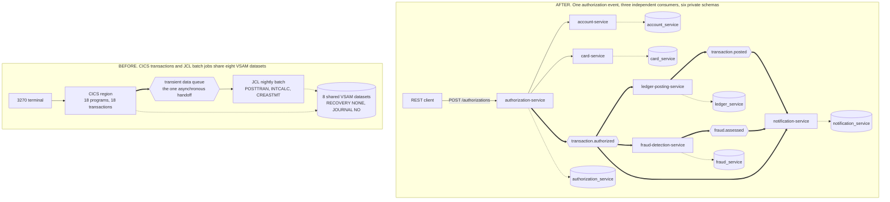
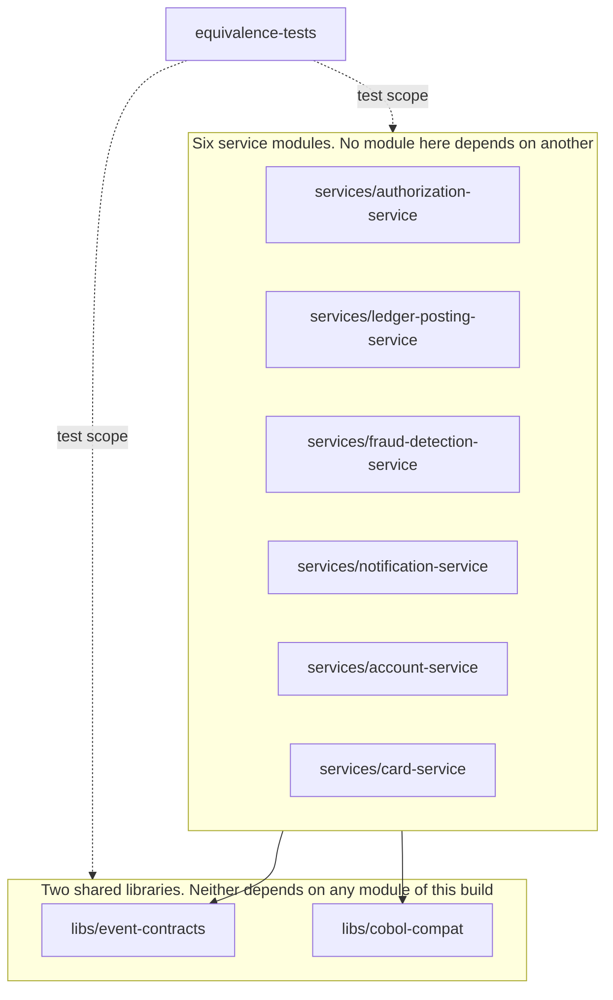

## CardDemo Card Platform

- [CardDemo Card Platform](#carddemo-card-platform)
- [What this directory contains](#what-this-directory-contains)
- [Quickstart](#quickstart)
- [Repository map](#repository-map)
- [Architecture before and after](#architecture-before-and-after)
- [Module graph and the no-coupling boundary](#module-graph-and-the-no-coupling-boundary)
- [The six services](#the-six-services)
- [Event contracts](#event-contracts)
- [Equivalence testing and documentation index](#equivalence-testing-and-documentation-index)

<br/>

## What this directory contains

This directory holds six independently deployable services, written in Java 25 on Spring Boot 4.1.0. The services exchange events over Apache Kafka, and each one owns a private PostgreSQL schema that no other service reads. Together they reimplement the documented behaviour of the COBOL application under `app/`, and none of them calls the mainframe at runtime. Nothing under `app/`, `diagrams/`, or `samples/` changes.

Every choice made here, together with the alternatives rejected and the risks accepted, is recorded in [docs/decision-log.md](docs/decision-log.md). This file covers what the platform is and where each piece sits.

<br/>

## Quickstart

Install these exact versions:

1. OpenJDK 25, from Adoptium
2. Apache Maven 3.9.16
3. Docker, with Compose v2

The stack pulls two images, `postgres:18.4` and `apache/kafka:4.2.1`, and builds one image per service.

Run three commands from this directory:

```shell
cp .env.example .env
mvn -f pom.xml verify
docker compose up -d --build
```

`POST /authorizations` is the one synchronous entry point on the platform. The authorization service answers on host port 8081:

```shell
curl -sS -X POST http://localhost:8081/authorizations \
  -H 'Content-Type: application/json' \
  -d '{"cardNumber":"0500024453765740",
       "transactionTypeCode":"01",
       "transactionCategoryCode":"0001",
       "amount":"+00000100.00",
       "merchantId":"000012345",
       "originTimestamp":"2026-01-15 10:30:00.000000"}'
```

One call publishes one event, and three services read it. Watch all three topics with a console consumer:

```shell
docker compose exec kafka /opt/kafka/bin/kafka-console-consumer.sh \
  --bootstrap-server kafka:29092 --from-beginning \
  --include 'transaction.authorized|transaction.posted|fraud.assessed'
```

One pitfall belongs here because it fails in silence. Every module descriptor declares `<java.version>25</java.version>`. The Spring Boot parent defaults that property, and the compiler release, to 17. A module that omits the override compiles at release 17 with no warning and no failure, so keep the property when you add a module.

Two extension points carry the design:

- Adding a consumer needs no change to the producer. Subscribe to the topic, join a new consumer group, and record the identifier of every event you process.
- Adding a decline rule means adding one class that implements the rule interface. The COBOL marks that seam itself, with the comment `* ADD MORE VALIDATIONS HERE` at `app/cbl/CBTRN02C.cbl:L377`.

Setup detail, domain context, five measured pitfalls, and the longer extension guide live in [docs/onboarding.md](docs/onboarding.md). Work found during the migration and left for later is listed in [docs/suggested-next-tasks.md](docs/suggested-next-tasks.md).

<br/>

## Repository map

```text
card-platform/
├── pom.xml                       Maven aggregator. Nine modules, language level 25, enforced module boundaries
├── README.md                     This file. The map of the platform
├── docker-compose.yml            The demo stack. One broker, one database instance, six services
├── .env.example                  Every environment variable, each with a working demo default
├── docs/                         Decision log, traceability matrix, architecture, data model, onboarding, flagged rules
├── presentation/                 Executive summary as one self-contained HTML file
├── libs/
│   ├── event-contracts/          Event types, the shared envelope, JSON Schema documents, validating serialization
│   └── cobol-compat/             Fixed-point arithmetic, tolerant numeric parsing, date validation, masking, reference data
├── services/
│   ├── authorization-service/    The one synchronous entry point. Applies the four decline rules
│   ├── ledger-posting-service/   Balance and category balance maintenance, one event at a time
│   ├── fraud-detection-service/  Risk scoring. A new capability with no COBOL ancestor
│   ├── notification-service/     Cardholder alerting over a read model keyed by card and transaction
│   ├── account-service/          Account and customer read and update, plus billing cycle close
│   └── card-service/             Card list, card detail and card update
├── equivalence-tests/            Fixture loader, copybook parser, and the equivalence suite
└── deploy/k8s/                   Namespace, broker, database, and one Deployment and Service per service
```

Every service module has the same shape: `pom.xml`, `Dockerfile`, `README.md`, `src/main/java`, `src/main/resources/application.yml`, `src/main/resources/db/migration`, and `src/test/java`.

<br/>

## Architecture before and after

Figure 1 puts the two states side by side. On the left, Customer Information Control System (CICS) transactions and Job Control Language (JCL) batch jobs share eight Virtual Storage Access Method (VSAM) datasets. `app/csd/CARDDEMO.CSD` marks all eight `RECOVERY(NONE)` and `JOURNAL(NO)`. On the right, one authorization call publishes one event, three services consume it, and six private schemas replace the eight shared datasets.

**Figure 1 — CardDemo Before and After: Eight Shared VSAM Datasets and a Nightly Batch Window Become One Event with Three Independent Consumers**



Legend for Figure 1:

- Plain arrow: a synchronous Representational State Transfer (REST) call, or terminal input and output.
- Thick arrow: an asynchronous publish or consume, so the two sides run independently.
- Dotted arrow: direct access to stored data.
- Hexagon: a queue on the left, a Kafka topic on the right. Every Kafka message carries the account identifier as its key.
- Cylinder: stored data. On the left, one dataset group serves every program. On the right, each schema belongs to exactly one service.
- No arrow joins `ledger-posting-service`, `fraud-detection-service` and `notification-service`. The absence is the requirement, not an omission.

The same two states at full size, with the component-by-component correspondence, are in [docs/architecture-before-after.md](docs/architecture-before-after.md).

<br/>

## Module graph and the no-coupling boundary

Nine Maven modules build in one pass. The dependency direction runs one way:

```text
libs/event-contracts  <-- depends on nothing internal
libs/cobol-compat     <-- depends on nothing internal
services/*            <-- depend on both libs, and on NO other service
equivalence-tests     <-- depends on everything (test scope only)
```

Figure 2 draws that direction as a graph.

**Figure 2 — Maven Module Graph: the Build Boundary That Makes Inter-Service Coupling a Compilation Failure**



Legend for Figure 2:

- Solid arrow: a compile dependency. The module at the tail cannot build without the module at the head.
- Dotted arrow labelled test scope: a dependency the equivalence suite uses in tests only. No service ships it.
- Box: a group of modules. The six service modules share one box, and no arrow runs between any two of them.

A developer who writes an import from the ledger service into the fraud service gets a compilation failure. `maven-enforcer-plugin` reports the banned dependency as a named build error. The boundary carries a requirement stated at the outset: "Fraud detection, ledger posting, and notification services must not call each other or block the authorization response path."

`equivalence-tests` is a module of the aggregator rather than a folder bolted on at the end, because the equivalence suite has to run on every build.

<br/>

## The six services

| Service | Role | Synchronous surface | Events produced | Events consumed | COBOL provenance |
| :--- | :--- | :--- | :--- | :--- | :--- |
| `authorization-service` | The only synchronous entry point, and the sole writer of the authorization decision. Applies four decline rules | `POST /authorizations`, port 8081 | `TransactionAuthorized`, `TransactionDeclined` | none | `app/cbl/CBTRN02C.cbl` decline rules, `app/cbl/COTRN02C.cbl` request contract, `app/cbl/COSGN00C.cbl` signon |
| `ledger-posting-service` | Reproduces the batch posting arithmetic once per event | balance queries, port 8082 | `TransactionPosted` | `TransactionAuthorized` | `app/cbl/CBTRN02C.cbl`, `app/jcl/POSTTRAN.jcl` |
| `fraud-detection-service` | Scores risk. Never sits in the authorization response path | assessment queries, port 8083 | `FraudFlagged`, `FraudCleared` | `TransactionAuthorized` | none, a new capability with zero COBOL provenance |
| `notification-service` | Alerts a cardholder over a read model keyed by card and transaction | notification history, port 8084 | none | `TransactionAuthorized`, `TransactionPosted`, `FraudFlagged`, `FraudCleared` | `app/cbl/CBSTM03A.CBL` lines 86 to 159, `app/cpy/COSTM01.CPY`, `app/jcl/CREASTMT.JCL` |
| `account-service` | Account and customer read and update, plus `POST /accounts/{id}/cycle-close` | account and customer endpoints, port 8085 | `AccountStateChanged` | none | `app/cbl/COACTVWC.cbl`, `app/cbl/COACTUPC.cbl`, `app/cbl/CBACT04C.cbl` lines 353 to 354 |
| `card-service` | Card list, card detail and card update | card endpoints, port 8086 | `CardStateChanged` | none | `app/cbl/COCRDLIC.cbl`, `app/cbl/COCRDSLC.cbl`, `app/cbl/COCRDUPC.cbl` |

Four facts about that table are worth stating plainly:

- The three consumers of `transaction.authorized` are ledger posting, fraud detection and notification. Each joins its own consumer group, so each receives every event.
- The account and card services publish only when a record changes. A read publishes nothing.
- `fraud-detection-service` has no COBOL ancestor. No fraud module exists under `app/`, and a search for one returned nothing, so every rule in that service is new.
- `authorization-service` has no single source program either. `COPAUA0C` and transaction `CP00`, both named in the original brief, exist nowhere under `app/`. Its decision logic is synthesised from the three programs named above, and [docs/traceability-matrix.md](docs/traceability-matrix.md) declares the synthesis.

<br/>

## Event contracts

Five event types travel between the services: `TransactionAuthorized`, `TransactionDeclined`, `TransactionPosted`, `FraudFlagged` and `FraudCleared`. The account and card services add `AccountStateChanged` and `CardStateChanged`. Each payload has a JavaScript Object Notation (JSON) Schema document, Draft 2020-12, under `libs/event-contracts/src/main/resources/schemas/`. Serialization validates a payload on publish and deserialization validates it again on consume, so a malformed event reaches neither a topic nor a consumer.

Every event carries the same envelope:

| Field | What it holds |
| :--- | :--- |
| `eventId` | Identifier of this event. Every consumer records it, so a duplicate delivery changes nothing |
| `eventType` | Name of the event type. A listener reading a shared topic routes on it |
| `schemaVersion` | Contract version, matching the `-v1` suffix of the schema document |
| `occurredAt` | Moment the producer wrote the event, in Coordinated Universal Time |
| `aggregateId` | The eleven-digit account identifier, and the Kafka message key |

Two conventions carry weight, because changing either one breaks correctness:

- **`aggregateId` is always the account identifier and always the Kafka message key.** Kafka keeps order within a partition and nowhere else, and the ledger must not reorder the balance updates of one account.
- **Money travels as a decimal string, never as a JSON number.** Most parsers turn a JSON number into a double, which returns binary floating point to a system whose correctness rests on fixed-point arithmetic. Each schema constrains an amount with the pattern `^-?\d{1,9}\.\d{2}$`.

Adding a property to a schema is safe. Removing one, or tightening one, breaks a consumer that already reads the topic. `EventSchemaContractTest` in [libs/event-contracts/](libs/event-contracts/) locks the required set of every document, and it fails the build on such a change.

<br/>

## Equivalence testing and documentation index

The equivalence suite reads the nine fixed-width fixtures under `app/data/ASCII/` and compares service output against results derived from the documented COBOL rules. `dailytran.txt` carries 300 records of 350 bytes each and drives the posting comparison. The mainframe is never called, so every comparison runs from data checked into this repository. The suite lives in [equivalence-tests/](equivalence-tests/) and Failsafe runs it during `mvn verify`, while [docs/equivalence-results.md](docs/equivalence-results.md) records the outcome.

One rule matters more than the rest: **all monetary arithmetic truncates toward zero and never rounds.** The `ROUNDED` phrase appears zero times in the 28 programs under `app/cbl`, so every `BigDecimal` operation pins `RoundingMode.DOWN`. `CobolDecimal` in [libs/cobol-compat/](libs/cobol-compat/) is the single place that decision is made, and no helper there accepts a rounding mode. `HALF_UP` is the reflexive Java choice and it is wrong here, because a changed cent is a parity failure.

| Document | What it covers |
| :--- | :--- |
| [docs/onboarding.md](docs/onboarding.md) | Clean machine to a running platform: setup, domain context, pitfalls, how to extend |
| [docs/suggested-next-tasks.md](docs/suggested-next-tasks.md) | Improvements found during the migration that fell outside scope |
| [docs/decision-log.md](docs/decision-log.md) | Every non-trivial decision, with alternatives, reasons and risks |
| [docs/traceability-matrix.md](docs/traceability-matrix.md) | Each COBOL program and copybook mapped to a target or to a stated exclusion |
| [docs/architecture-before-after.md](docs/architecture-before-after.md) | The paired before and after views at full size |
| [docs/event-flow.md](docs/event-flow.md) | The publish and consume path of every event |
| [docs/data-model.md](docs/data-model.md) | Copybook field to PostgreSQL column, service by service |
| [docs/business-rule-flags.md](docs/business-rule-flags.md) | The 26 COBOL rules flagged as ambiguous, undocumented or inconsistent, with citations |
| [docs/equivalence-results.md](docs/equivalence-results.md) | Fixture by fixture comparison results |
| [docs/prose-validation.md](docs/prose-validation.md) | Writing review of every document authored here |
| [presentation/executive-summary.html](presentation/executive-summary.html) | Executive summary, one self-contained HTML file |
| [deploy/k8s/](deploy/k8s/) | Manifests that run the same stack on Kubernetes |

<br/>
