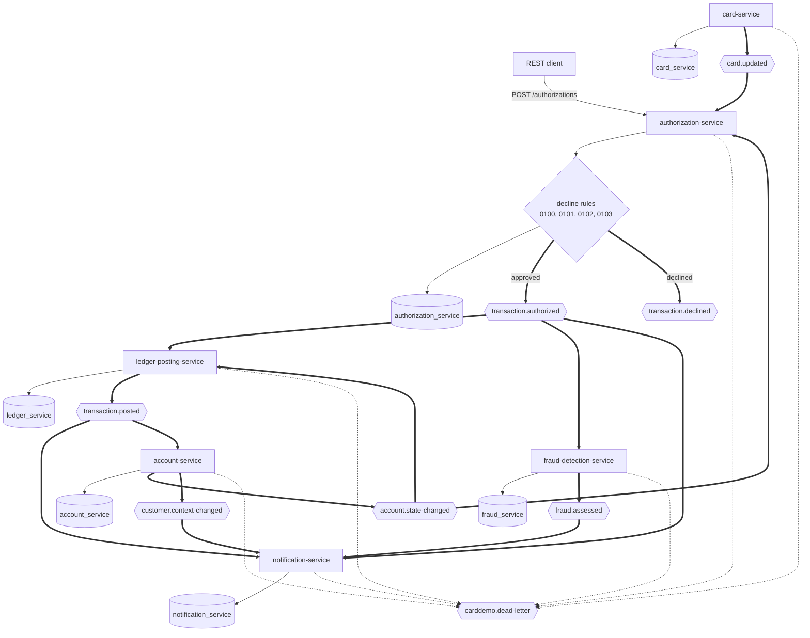
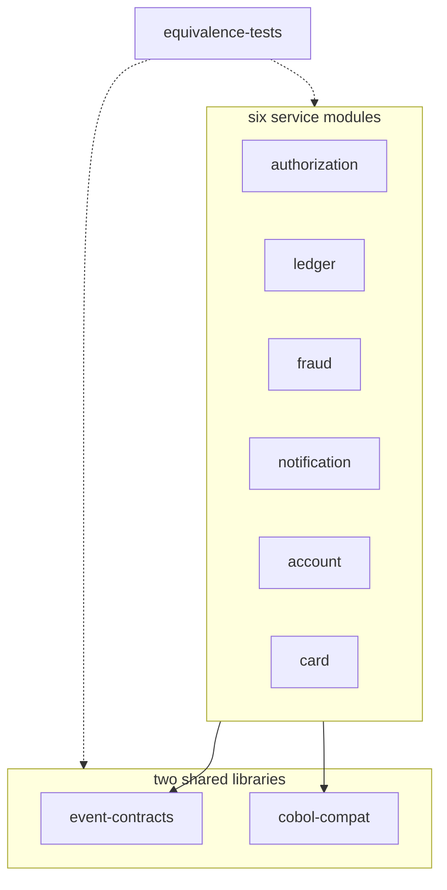

## CardDemo Card Platform

- [Overview](#overview)
- [Delivered capability](#delivered-capability)
- [Quickstart](#quickstart)
- [Security and transport](#security-and-transport)
- [Repository map](#repository-map)
- [Runtime architecture](#runtime-architecture)
- [Module boundary](#module-boundary)
- [Services and APIs](#services-and-apis)
- [Events and consumer groups](#events-and-consumer-groups)
- [Equivalence](#equivalence)
- [Documentation](#documentation)

<br/>

## Overview

This directory contains six independently deployable Java 25 services on Spring Boot 4.1.0. Kafka carries service events, and one PostgreSQL instance hosts six private databases and schemas.

The platform forward-engineers documented CardDemo behavior without calling the mainframe at runtime. Files under `app/`, `diagrams/`, and `samples/` remain reference inputs and are not modified.

The architecture has one synchronous authorization entry point. Ledger posting, fraud detection, and notification processing run asynchronously without direct service calls between consumers.

<br/>

## Delivered capability

The Maven aggregator contains nine child modules and builds ten reactor projects, including the parent. The full source, contract, integration, and equivalence lifecycle runs through `mvn verify`.

| Capability | Delivered implementation |
| :--- | :--- |
| Authorization | Four source-derived decline rules, one response, and one outcome event for each authenticated, parseable request that reaches an authorization decision |
| Posting | Transaction, category-balance, account-balance, account-state replica, feed-reject, outbox, and duplicate-delivery handling |
| Fraud | Three net-new risk rules, persisted assessments, and flagged or cleared events |
| Notification | Authorized-transaction, posted-transaction, fraud, and customer-context consumers, private read models, two renderers, alert-attempt metadata, and history API |
| Account | Account and customer reads, coordinated update, source-compatible conflict check, cycle close, and state-change publication |
| Card | Seven-row cursor browse, card detail, ordered update, and state-change publication |
| Contracts | Thirteen JSON Schema Draft 2020-12 documents, validating serialization, validating deserialization, and compatibility tests |
| Persistence | Flyway-owned schemas, fixture-backed seeds, Jakarta Persistence validation, outboxes, and processed-event guards |
| Operations | Structured JSON logs, health and metrics endpoints, terminal dead-letter routes for spent records and abandoned outbox rows, Docker Compose, and Kubernetes manifests |
| Equivalence | Posting, authorization, bill payment, interest rules, validation, identifier, fixture, card-seed, and decimal comparisons |

Eleven listeners are present:

- authorization consumes `AccountStateChanged` under `authorization-account-state`, keeping `account_credit_snapshot` current;
- authorization consumes `CardUpdated` under `authorization-card-updated`, which refreshes the observation timestamp on the matching `card_xref` rows and writes no mapping field;
- ledger consumes authorized transactions under `ledger-posting` and posts them;
- ledger consumes declined transactions under `ledger-reject` and writes the 430-byte reject row of `app/cbl/CBTRN02C.cbl:L446-L465`;
- ledger consumes `AccountStateChanged` under `ledger-account-state`, which bootstraps and refreshes `account_balance_projection`;
- fraud consumes authorized transactions under `fraud-detection`;
- notification consumes authorized transactions under `notification-authorized`;
- notification consumes posted transactions under `notification-posted`;
- notification consumes fraud assessments under `notification-fraud`;
- notification consumes `CustomerContextChanged` under `notification-customer` to keep renderer context current;
- account consumes posted transactions under `account-posted`, which carries the posted amount back onto the account record.

Ledger, fraud, and notification are therefore three independent consumers of the one authorization event, each reading it under its own group.

Each listener claims an event identifier before applying effects. It acknowledges only after its local transaction commits. A listener never reverses a decision another service reached.

Recovery after the delivery attempts of one record run out is per service rather than uniform. Account, ledger, fraud, and notification set `DefaultErrorHandler.setCommitRecovered(true)`: the offset is committed once the diagnostic has reached the dead-letter topic, so one spent record produces exactly one dead letter. Authorization leaves the setting at its default, so the offset of a record its two replica listeners refused stays uncommitted and the next partition assignment reads that record again. Every container acknowledges by hand in both cases, so nothing acknowledges a record its listener never accepted.

<br/>

## Quickstart

Use the tested versions below:

| Tool | Version |
| :--- | :--- |
| Eclipse Temurin OpenJDK | 25.0.4+7 |
| Apache Maven | 3.9.16 |
| Docker Engine | 29.7.0 |
| Docker Compose | 5.3.1 |
| Kafka image | `apache/kafka:4.2.1` |
| PostgreSQL image | `postgres:18.4` |

One command takes a clean clone to a running stack:

```bash
cd card-platform
scripts/start-demo.sh
```

[`scripts/start-demo.sh`](scripts/start-demo.sh) packages the reactor, creates `.env` from `.env.example`, fills all 19 credentials, builds the six images, starts eight containers, and reads every health endpoint. It asks nothing and is safe to re-run: a credential already set is left alone. The four demo passwords it generates are written to `card-platform/.demo-credentials`, which git ignores, because `.env` keeps only their `{bcrypt}` hashes.

To prepare the environment file without starting anything, run [`scripts/generate-env.sh`](scripts/generate-env.sh). It reads the credential names out of `.env.example`, so it needs no second list of them.

The same work by hand is four steps, and none is optional:

```bash
cd card-platform
cp .env.example .env

# The fourteen service passwords, generated locally and written in place.
for variable in POSTGRES_PASSWORD \
  AUTHORIZATION_DB_PASSWORD LEDGER_DB_PASSWORD FRAUD_DB_PASSWORD \
  NOTIFICATION_DB_PASSWORD ACCOUNT_DB_PASSWORD CARD_DB_PASSWORD \
  KAFKA_ADMIN_PASSWORD \
  AUTHORIZATION_KAFKA_PASSWORD LEDGER_KAFKA_PASSWORD FRAUD_KAFKA_PASSWORD \
  NOTIFICATION_KAFKA_PASSWORD ACCOUNT_KAFKA_PASSWORD CARD_KAFKA_PASSWORD; do
  sed -i "s|^${variable}=.*|${variable}=$(openssl rand -base64 24 | tr -d '/+=')|" .env
done

# The three request identities. The plaintext stays in this shell; only the hash reaches .env.
export ADMIN_PASSWORD="$(openssl rand -base64 18 | tr -d '/+=')"
export USER_PASSWORD="$(openssl rand -base64 18 | tr -d '/+=')"
export MONITORING_PASSWORD="$(openssl rand -base64 18 | tr -d '/+=')"
```

The copied file contains 19 `REPLACE` markers: fourteen local passwords, one card-token key and four `{bcrypt}` identity hashes. Generate every one before starting the stack.

```bash
mvn -B -ntp -DskipTests package
```

Then encode each password and write it back single-quoted. Compose expands `$` in an unquoted dotenv value, and a bcrypt hash is full of `$`:

```bash
CRYPTO_CP="$(find ~/.m2/repository/org/springframework/security/spring-security-crypto \
  -name 'spring-security-crypto-*.jar' | sort | tail -1):\
$(find ~/.m2/repository/commons-logging/commons-logging \
  -name 'commons-logging-*.jar' | sort | tail -1):\
$(find ~/.m2/repository/org/springframework/spring-core \
  -name 'spring-core-*.jar' | sort | tail -1)"

hash_password() {
  DEMO_PASSWORD="$1" jshell --class-path "$CRYPTO_CP" -s - <<'JSHELL' 2>/dev/null | grep -m1 '^{bcrypt}'
System.out.println(org.springframework.security.crypto.factory.PasswordEncoderFactories.createDelegatingPasswordEncoder().encode(System.getenv("DEMO_PASSWORD")));
/exit
JSHELL
}

sed -i "s|^ADMIN_PASSWORD_HASH=.*|ADMIN_PASSWORD_HASH='$(hash_password "$ADMIN_PASSWORD")'|" .env
sed -i "s|^USER_PASSWORD_HASH=.*|USER_PASSWORD_HASH='$(hash_password "$USER_PASSWORD")'|" .env
sed -i "s|^MONITORING_PASSWORD_HASH=.*|MONITORING_PASSWORD_HASH='$(hash_password "$MONITORING_PASSWORD")'|" .env

# Prove nothing is left unset before starting anything.
if grep -q '^[A-Z_]*=.*REPLACE' .env; then
  echo "still unset:"; grep -n '^[A-Z_]*=.*REPLACE' .env
else
  echo "all 17 values are set"
fi
```

`.env` is ignored by git and must stay that way. Verify with `git check-ignore -v .env`.

`CARD_TOKEN_SECRET` is a `REPLACE` marker like every password: `.env.example` ships no working key, and the two services that derive a card token refuse to start without one. `CARD_TOKEN_VERSION` is not a marker and stays as shipped, because three checked-in values name the version their tokens were derived under. [Onboarding](docs/onboarding.md) gives the rotation procedure, and [Security and transport](#security-and-transport) explains what the key does.

### 2. Build, start, and check

```bash
mvn -B clean verify
scripts/generate-env.sh
docker compose up -d --build
docker compose ps
```

Every Dockerfile copies its packaged archive from `target/`, so the Maven command must finish before the image build.

Check all health endpoints:

```bash
for port in 9081 9082 9083 9084 9085 9086; do
  curl -fsS "http://localhost:${port}/actuator/health"
  echo
done
```

Without `--wait`, `up -d` returns as soon as the containers are created and those six requests race the start-up they are meant to confirm.

### 3. Authorize one transaction and watch the fan-out

Both timestamps are generated so that the call reads as one made now. No clock bound relates the capture moment to the clock of the authorization service: reject code 0103, which compares the account expiry against the first ten characters of the capture moment, is the whole of the test applied to it. The card number is the first record of the checked-in cross-reference fixture.

```bash
CARD_NUMBER=$(sed -n '1s/^\(.\{16\}\).*/\1/p' ../app/data/ASCII/cardxref.txt)
CAPTURED_AT="$(date -u +'%Y-%m-%d %H:%M:%S').000000"
PROCESSED_AT="$(date -u +'%Y-%m-%d-%H.%M.%S').000000"

curl -sS -u "admin001:$ADMIN_PASSWORD" -X POST \
  -H 'Content-Type: application/json' \
  -d "{\"cardNumber\":\"${CARD_NUMBER}\",
       \"transactionTypeCode\":\"01\",
       \"transactionCategoryCode\":\"0001\",
       \"source\":\"POS TERM\",
       \"description\":\"Quickstart purchase\",
       \"amount\":\"+00000504.77\",
       \"merchantId\":\"800000000\",
       \"merchantName\":\"Abshire-Lowe\",
       \"merchantCity\":\"North Enoshaven\",
       \"merchantZip\":\"72112\",
       \"originTimestamp\":\"${CAPTURED_AT}\",
       \"processingTimestamp\":\"${PROCESSED_AT}\"}" \
  http://localhost:8081/authorizations
```

That request answers HTTP 200 with `"approved":true` and a generated `transactionId`. The response uses HTTP 422 for a source-equivalent decline, and `approved` distinguishes the two outcomes. A decline is expected traffic, so it never answers 500. The authorization service's `src/main/resources/openapi.yaml` carries the full request shape, including the eleven required fields and the rule that a caller names its subject by `cardNumber` or by `accountId`.

An approval on shipped Compose settings depends on one demo-only migration. Every expiry in `app/data/ASCII/acctdata.txt` falls in 2023 to 2025, and reason 0103 declines a request whose capture date is later than the account expiry. `AUTHORIZATION_FLYWAY_LOCATIONS` and `ACCOUNT_FLYWAY_LOCATIONS` therefore add `classpath:db/demo`, whose `V900__demo_expiry_extension.sql` extends those expiries to 2099-12-31 and changes nothing else. Drop that location to compare a run against the fixture as shipped.

One approval reaches ledger, fraud, and notification independently, each under its own consumer group. Read the event all three received, bounded so the command returns:

```bash
docker compose exec kafka /opt/kafka/bin/kafka-console-consumer.sh \
  --bootstrap-server kafka:29092 \
  --command-config /tmp/kafka-admin.properties \
  --topic transaction.authorized --from-beginning --max-messages 1
```

Then read the three consumers, each of which acted without being called:

```bash
CARD_TOKEN=d29277ff9f4215818ca524cbf2e94927149958ef6c6a9f49242ffa18a484fe9d

curl -fsS -u "admin001:$ADMIN_PASSWORD" http://localhost:8082/balances/00000000050
curl -fsS -u "admin001:$ADMIN_PASSWORD" "http://localhost:8084/notifications/$CARD_TOKEN"
curl -fsS -u "admin001:$ADMIN_PASSWORD" "http://localhost:8083/fraud-assessments?accountId=00000000050"
```

`CARD_TOKEN` above is the token of that first fixture card under the shipped demo key. Every external surface names a card by its token and never by its number.

Consumer progress is visible from inside the broker container, which is how a demonstration shows that three groups read one topic:

```bash
docker compose exec kafka /opt/kafka/bin/kafka-consumer-groups.sh \
  --bootstrap-server kafka:29092 \
  --command-config /tmp/kafka-admin.properties \
  --all-groups --describe
```

<br/>

## Security and transport

Every business route requires HTTP Basic authentication. The security chains deny unmatched routes by default.

| Identity | Role | Access |
| :--- | :--- | :--- |
| `admin001` | `ADMIN` | Every business route |
| `acquirer1` | `ACQUIRER` | `POST /authorizations` only |
| `user0001` | `USER` | Resources named by `USER_SCOPES` |
| `monitor01` | `MONITORING` | Metrics and Prometheus endpoints only |

`acquirer1` is a machine identity a point-of-sale network presents, and only the authorization service reads it. `POST /authorizations` names its card in the request body, so no path variable carries an identifier an ownership scope can be compared against, and the route therefore reaches every card the platform holds. A cardholder identity is refused there with 403 for that reason: an entitlement over one account must not authorize against another. The chain admits `ACQUIRER` and `ADMIN` there and nothing else, and the decision itself then compares the identity against the account the cross-reference resolved, so a caller entitled to no account reaches no decision. The decline rules are the control that applies to the card: a card the cross-reference does not carry is refused with reason 0100 from `app/cbl/CBTRN02C.cbl:L385-L387`. Ownership managers govern the other five services, where a path variable names an account, a customer or a card token.

Anonymous access is limited to `/actuator/health` on each management port. Business identities do not receive monitoring access.

Passwords are encoded before they enter configuration. Each service accepts `{bcrypt}` at a cost of at least ten or `{pbkdf2@SpringSecurity_v5_8}`, and refuses every other encoding at start-up, `{noop}` included.

Two filters run in front of every route in all six services. `CrossSiteRequestFilter` requires a `POST`, `PUT`, `PATCH` or `DELETE` to carry `X-CardDemo-Request`, to declare a first-party `Sec-Fetch-Site`, and to name no foreign `Origin`, answering 403 otherwise. HTTP Basic is a credential a browser attaches without being asked, and an HTML form cannot set a header, so one header separates a first-party client from a page replaying a cached credential. Reads are untouched, which is why the health probe carries nothing. `RequestRateCeilingFilter` bounds volume ahead of the security chain: 20 failed authentications and 600 requests a minute per source address, 600 a minute per identity, 120 state-changing requests, and 64 requests in flight, answering 429 with `Retry-After` past any of them and counting `carddemo.<service>.requests.throttled` by the ceiling that refused. `API_CROSS_SITE_HEADER` and `API_RATE_*` configure both. Each counts inside one process, so a multi-replica deployment bounds each replica; [suggested next tasks](docs/suggested-next-tasks.md) records the shared-store ceiling and the forwarded-header setting a proxied deployment needs.

A card is named on every external surface by its card token, never by its number. The token is a keyed hash: `HMAC-SHA-256` over the full number under `CARD_TOKEN_SECRET`, prefixed by `CARD_TOKEN_VERSION`, rendered as 64 lower-case hexadecimal characters. This repository ships no key. Generate one with `openssl rand -base64 48 | tr -d '/+='` before the first run: only the authorization and card services read it, and both refuse to start without it. Two consequences matter operationally. The fifty `card_token` literals that `services/card-service/.../V2__seed.sql` loads are derived under a build-scope key, and `CardTokenReconciler` re-derives them under yours as the card service starts. A `SCOPE_CARD_` authority names a token rather than a number, so it belongs to one key and is derived rather than shipped. [Onboarding](docs/onboarding.md) gives both commands.

Three request bodies are the exception, and each belongs to the service that owns the card data: `POST /authorizations`, `GET /cards/{cardNumber}`, and `PUT /cards/{cardNumber}` all accept a full sixteen-digit number in an authenticated JSON body over the loopback-bound port. The number is the cross-reference key and the card key, so no token can stand in for it. Nothing echoes it back — the responses carry the masked form — and `PanMasker` is applied before any log line or event payload is written.

The Compose stack binds every published port to `127.0.0.1`. It uses separate database and Kafka credentials for each service.

| Transport | Compose | Kubernetes |
| :--- | :--- | :--- |
| Database | `sslmode=require` | `sslmode=verify-full` |
| Kafka | `SASL_PLAINTEXT` on the private bridge | `SASL_SSL` |
| Service ports | HTTP on loopback | HTTPS with mounted key material |

The demonstration uses synthetic repository fixtures. Do not expose the Compose ports or load real cardholder data.

<br/>

## Repository map

| Path | Contents |
| :--- | :--- |
| `pom.xml` | Aggregator, Java 25 setting, plugin management, and nine child modules |
| `docker-compose.yml` | Kafka, PostgreSQL, six service containers, health checks, and topic creation |
| `.env.example` | Supported runtime overrides and credential placeholders |
| `scripts/` | `start-demo.sh`, the one-command bootstrap, and `generate-env.sh`, which fills the 19 credentials |
| `libs/event-contracts/` | Event records, envelope, schemas, wire bounds, serializers, and compatibility tests |
| `libs/cobol-compat/` | Fixed-point arithmetic, parsing, date validation, masking, and source reference data |
| `services/authorization-service/` | Synchronous authorization and account-state projection |
| `services/ledger-posting-service/` | Posting arithmetic and balance projection |
| `services/fraud-detection-service/` | Net-new risk assessment |
| `services/notification-service/` | Card-keyed transaction model and alert rendering |
| `services/account-service/` | Account, customer, validation, and cycle-close operations |
| `services/card-service/` | Card browse, detail, and update |
| `equivalence-tests/` | Cross-module contracts and source-rule comparisons |
| `docs/` | Decisions, traceability, architecture, data model, onboarding, flags, results, prose validation, and next tasks |
| `deploy/k8s/` | Namespace, Kafka, PostgreSQL, configuration, secrets template, Deployments, Services, and `load-images.sh`, which puts the six local images inside a kind, minikube, or Docker Desktop cluster |

Each service contains:

- `pom.xml` and `Dockerfile`;
- a service-level `README.md`;
- `api/`, `domain/`, `entity/`, `repository/`, `messaging/`, `outbox/`, and `config/` packages as needed;
- `application.yml`, `openapi.yaml`, and Flyway migrations;
- direct unit, persistence, contract, and integration tests.

The platform has no application front end, service mesh, cache, schema-registry container, or runtime mainframe connector.

<br/>

## Runtime architecture

Figure 1 shows the delivered request, event, and projection paths.

**Figure 1 — Delivered Card Platform: One Authorization Decision and Independent Event Consumers**



Legend for Figure 1:

- Plain arrows are synchronous request or private database work.
- Thick arrows are Kafka publish or consume paths.
- Dotted arrows are terminal dead-letter routes onto the shared topic. Two details are abstracted away here and stated exactly in [Event Flow](docs/event-flow.md). Ledger, fraud, and notification address a source-specific `.DLT` topic first. The authorization edge is its listener route, because its relay leaves a spent row unpublished.
- The diamond is the source-derived decision chain.
- Cylinders are schemas read by one service only.
- No consumer calls another consumer.
- Three thick arrows leave `transaction.authorized`, one for each independent consumer.

The source and target are compared in [Architecture, Before and After](docs/architecture-before-after.md). Every event path appears in [Event Flow](docs/event-flow.md).

The measured CICS definition contains 8 files, 17 mapsets, 18 programs, and 18 transactions. The broader source directory contains 28 COBOL programs.

<br/>

## Module boundary

Figure 2 shows the compile dependency direction.

**Figure 2 — Maven Boundary: Shared Libraries Below Services and Equivalence Tests Above**



Legend for Figure 2:

- Solid arrows are compile dependencies.
- Dotted arrows are test-scope dependencies.
- No arrow runs between service modules.

Each service depends on both shared libraries and no other service. A forbidden inter-service Java import fails compilation and the Maven enforcer reports it.

The equivalence module depends on every module for tests only. It is last in the reactor.

<br/>

## Services and APIs

| Service and guide | Business port | Management port | Delivered operations |
| :--- | ---: | ---: | :--- |
| [authorization-service](services/authorization-service/README.md) | 8081 | 9081 | `POST /authorizations` |
| [ledger-posting-service](services/ledger-posting-service/README.md) | 8082 | 9082 | `GET /balances/{accountId}` |
| [fraud-detection-service](services/fraud-detection-service/README.md) | 8083 | 9083 | `GET /fraud-assessments`, `GET /fraud-assessments/{transactionId}` |
| [notification-service](services/notification-service/README.md) | 8084 | 9084 | `GET /notifications/{cardNumber}` |
| [account-service](services/account-service/README.md) | 8085 | 9085 | `GET /accounts/{accountId}`, `PUT /accounts/{accountId}`, `POST /accounts/{accountId}/cycle-close`, `GET /customers/{customerId}` |
| [card-service](services/card-service/README.md) | 8086 | 9086 | `GET /cards`, `GET /cards/{cardNumber}`, `PUT /cards/{cardNumber}` |

All business ports map to container port 8080. All management ports map to container port 9080.

Kafka is `kafka:29092` inside Compose and `localhost:9092` from the host. PostgreSQL is `postgres:5432` inside Compose and `localhost:5432` from the host.

| Service | Database | Schema |
| :--- | :--- | :--- |
| authorization | `carddemo_authorization` | `authorization_service` |
| ledger | `carddemo_ledger` | `ledger_service` |
| fraud | `carddemo_fraud` | `fraud_service` |
| notification | `carddemo_notification` | `notification_service` |
| account | `carddemo_account` | `account_service` |
| card | `carddemo_card` | `card_service` |

Flyway creates every schema. Hibernate uses `ddl-auto: validate` and never generates tables.

<br/>

## Events and consumer groups

Seven business topics, six source-specific dead-letter topics, and one shared fallback are created explicitly, fourteen names in all. The six are `transaction.authorized.DLT`, `transaction.declined.DLT`, `account.state-changed.DLT`, `transaction.posted.DLT`, `fraud.assessed.DLT`, and `customer.context-changed.DLT`. `card.updated` needs none: its only consumer routes a spent record to the shared fallback as a governed envelope instead. A topic granted in either deployment path and not created there fails the build, because neither broker creates a topic on demand.

| Topic | Event types | Producers | Consumers and groups |
| :--- | :--- | :--- | :--- |
| `transaction.authorized` | `TransactionAuthorized` | authorization | ledger `ledger-posting`; fraud `fraud-detection`; notification `notification-authorized` |
| `transaction.declined` | `TransactionDeclined` | authorization, the sole writer of a decision | ledger `ledger-reject` |
| `transaction.posted` | `TransactionPosted` | ledger | notification `notification-posted`; account `account-posted` |
| `fraud.assessed` | `FraudFlagged`, `FraudCleared` | fraud | notification `notification-fraud` |
| `account.state-changed` | `AccountStateChanged` | account | authorization `authorization-account-state`; ledger `ledger-account-state` |
| `customer.context-changed` | `CustomerContextChanged` | account | notification `notification-customer` |
| `card.updated` | `CardUpdated` | card | authorization `authorization-card-updated` |
| `<source>.DLT` | 134-character fixed-width abend diagnostic from `app/cpy/CSMSG02Y.cpy` | listener error handlers on ledger, fraud, and notification | operator inspection and replay |
| `carddemo.dead-letter` | `DeadLetterEnvelope` | the listener error handlers on authorization and on account; outbox relays on all five producing services — authorization, ledger, fraud, account, and card — when a row is abandoned; every service when a source topic cannot be resolved | operator inspection and replay |

Every governed event carries `eventId`, `eventType`, `schemaVersion`, `occurredAt`, and an aggregate key. Money travels as a decimal string.

The account identifier is the normal Kafka key and ordering unit. An unresolved-card decline uses the transaction key because no account identifier exists.

Fourteen schema documents cover eight business event types, five additive version upgrades, and the dead-letter envelope. Publish and consume paths validate against the registered document.

`TransactionPosted` version 2 adds the statement provenance required by notification. Version 1 remains constructible and testable, but notification refuses it as insufficient.

<br/>

## Equivalence

The suite compares Java behavior with documented source rules and checked-in fixtures. It never calls a mainframe.

Run the complete equivalence lifecycle from this directory:

```bash
mvn -B -pl equivalence-tests -am verify
```

`mvn test` does not execute `*EquivalenceTest.java`. Failsafe runs those classes during `verify`.

Add `-o` only once `~/.m2/repository` already holds every dependency this reactor resolves. Offline mode does not download, so a cold or partial local repository fails the build on the first missing artifact rather than fetching it. Run the command above once with the network reachable, then `-o` works for every later run.

The delivered suite includes:

- posting over all 300 daily transaction records;
- decline reasons 0100 through 0103 and the narrowed-precision boundary;
- online bill-payment behavior;
- interest-rate resolution without migrating interest processing;
- account and card validation;
- truncation toward zero;
- fixture census, identifier fidelity, and card seed checks.

The published run reports 228 Failsafe equivalence tests and 375 unit or contract tests, with zero failures. See [Equivalence Results](docs/equivalence-results.md).

Interest is verified but not migrated. `BillingCycleService` reproduces only the two accumulator resets at `app/cbl/CBACT04C.cbl:L353-L354`.

<br/>

## Documentation

| Document | Purpose |
| :--- | :--- |
| [Onboarding](docs/onboarding.md) | Clean-machine setup, domain context, pitfalls, and extension guidance |
| [Suggested Next Tasks](docs/suggested-next-tasks.md) | Follow-up work with locations and verification criteria |
| [Decision Log](docs/decision-log.md) | Alternatives, reasons, accepted risks, and declared deviations |
| [Traceability Matrix](docs/traceability-matrix.md) | Bidirectional source-to-target classification |
| [Business Rule Flags](docs/business-rule-flags.md) | Sixty-five ambiguous, inconsistent, or undocumented source rules, each with its citation and its handling, plus three declared platform departures. Identifiers 1 to 26 are the set the specification fixes; 27 upward are appended in the order they were found, and no identifier is ever reused or renumbered |
| [Architecture, Before and After](docs/architecture-before-after.md) | Paired Mermaid migration views |
| [Event Flow](docs/event-flow.md) | Topics, groups, outboxes, projections, and idempotency |
| [Data Model](docs/data-model.md) | Service-owned tables and copybook-to-column provenance |
| [Equivalence Results](docs/equivalence-results.md) | Fixture-by-fixture parity evidence and declared gaps |
| [Prose Validation](docs/prose-validation.md) | Rule 5 verdicts and per-document scorecards |

Each service also has a local guide linked from [Services and APIs](#services-and-apis). The root `README.md` retains the separate mainframe installation path.

Use [Suggested Next Tasks](docs/suggested-next-tasks.md) for unresolved business decisions. Do not silently correct a flagged source behavior in production code.

<br/>