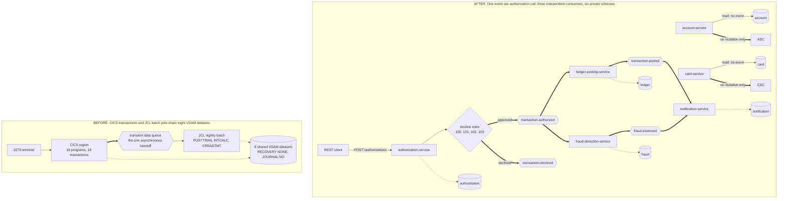
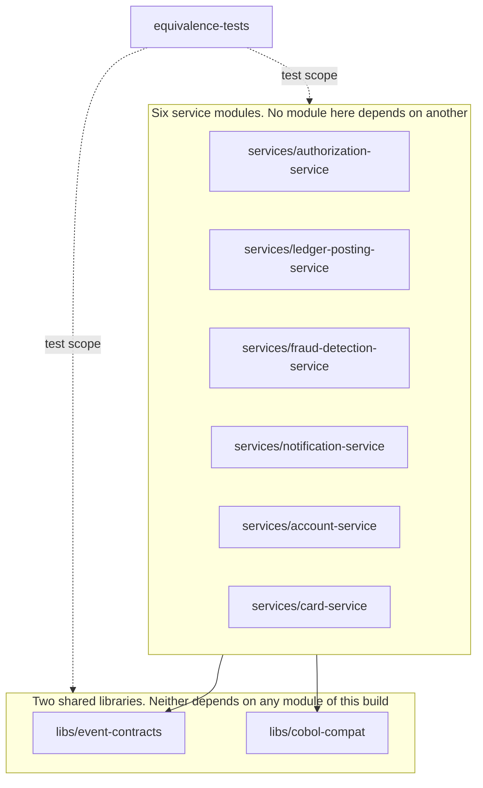

## CardDemo Card Platform

- [CardDemo Card Platform](#carddemo-card-platform)
- [What this directory contains](#what-this-directory-contains)
- [Current checkpoint](#current-checkpoint)
- [Quickstart](#quickstart)
- [Target repository map](#target-repository-map)
- [Architecture before and after](#architecture-before-and-after)
- [Module graph and the no-coupling boundary](#module-graph-and-the-no-coupling-boundary)
- [The six services](#the-six-services)
- [Event contracts](#event-contracts)
- [Equivalence testing and documentation index](#equivalence-testing-and-documentation-index)

<br/>

## What this directory contains

This directory holds six independently deployable services, written in Java 25 on Spring Boot 4.1.0. The services exchange events over Apache Kafka, and each one owns a private PostgreSQL schema that no other service reads. Together they reimplement the documented behaviour of the COBOL application under `app/`, and none of them calls the mainframe at runtime. Nothing under `app/`, `diagrams/`, or `samples/` changes.

This file describes the target platform and marks what is built. Every choice made here, together with the alternatives rejected and the risks accepted, will be recorded in `docs/decision-log.md`.

<br/>

## Current checkpoint

The platform is under construction, and this section is the boundary between what runs today and what is still to come. Everything outside this section describes the target, and each later section marks its own gaps.

Built and verified today:

| Layer | State |
| :--- | :--- |
| Build | Nine Maven modules build and test offline. `mvn -o clean verify` passes, and the enforcer keeps every service module free of a dependency on another service |
| Event contracts | Nine JSON Schema documents, five immutable event records in the shared library and two more declared by the account and card services, the shared envelope, and the serializer and deserializer that validate a payload against its document on publish and on consume |
| COBOL compatibility | Truncating fixed-point arithmetic, tolerant numeric parsing, date validation, card masking, and the three reference-data sets from `app/cpy/CSLKPCDY.cpy` |
| Persistence | Flyway migrations and seed data per service, plus the Jakarta Persistence entities the migrations validate against |
| Validation | The account-service edit library, seventeen validators translated from `app/cbl/COACTUPC.cbl` paragraphs 1205 through 1280 |
| Rendering | The notification service's plain-text and HTML renderers, from `app/cbl/CBSTM03A.CBL` lines 86 to 159 |
| Infrastructure | `docker-compose.yml` starts PostgreSQL 18.4 and Apache Kafka 4.2.1, creates six event topics and the one shared dead-letter topic, and the Kubernetes manifests mirror that stack |

Not built yet, and therefore not runnable:

| Missing piece | Consequence for a reader |
| :--- | :--- |
| Only two services answer a request | The authorization endpoint and the notification history carry a controller and a handler each. The four other services declare their route rules and their configuration and no controller, so every other endpoint in this file describes the target |
| No `@KafkaListener` anywhere | No service consumes an event yet, so the fan-out cannot be observed on a console consumer |
| No posting arithmetic and no risk rules | The four decline rules exist. `RiskRule` is an interface with no implementation, and no class applies the posting arithmetic of `app/cbl/CBTRN02C.cbl:L424-L579` |
| An outbox relay in one service only | The authorization service writes and publishes an outbox row. The account and card services hold the `outbox_event` table, the entity and the repository, and nothing writes a row |
| No `docs/` or `presentation/` directory, and no service `README.md` files | Every `docs/...` path named in this file is a forward reference, not a live document |
| Equivalence suite covers fixtures, seeds, identifiers and field validation | The posting, authorization, bill-payment, interest and decimal comparisons are pending, and no result document exists |

<br/>

## Quickstart

Install these versions. The build pins the first two, and the container tooling carries a floor version:

1. OpenJDK 25, from Adoptium
2. Apache Maven 3.9.16
3. Docker Engine 24.0 or newer
4. The Compose plugin v2.24 or newer, invoked as `docker compose`. The legacy `docker-compose` script does not read the inline `configs` content this stack ships

The stack pulls two images, `postgres:18.4` and `apache/kafka:4.2.1`, and builds one image per service.

Nothing in this repository is a working credential, so the copy of `.env.example` needs
seventeen values generated into it before anything starts. The database, the broker and
every service each refuse to start on a placeholder, which is why this is a step rather
than a suggestion.

```shell
cp .env.example .env

# Fourteen passwords. The tr strips the three characters the broker refuses, because it
# builds a login entry around the value and a quote, a backslash or whitespace would end
# that entry early.
for v in POSTGRES_PASSWORD \
         AUTHORIZATION_DB_PASSWORD LEDGER_DB_PASSWORD FRAUD_DB_PASSWORD \
         NOTIFICATION_DB_PASSWORD ACCOUNT_DB_PASSWORD CARD_DB_PASSWORD \
         KAFKA_ADMIN_PASSWORD \
         AUTHORIZATION_KAFKA_PASSWORD LEDGER_KAFKA_PASSWORD FRAUD_KAFKA_PASSWORD \
         NOTIFICATION_KAFKA_PASSWORD ACCOUNT_KAFKA_PASSWORD CARD_KAFKA_PASSWORD; do
  sed -i "s|^$v=.*|$v=$(openssl rand -base64 24 | tr -d '/+=')|" .env
done
```

The three request identities carry password *hashes* rather than passwords, so they are
generated differently. `.env.example` carries the `jshell` one-liner beside
`ADMIN_PASSWORD_HASH`; run it once per identity, choose a password you will type into
`curl`, and paste each result whole with its `{bcrypt}` prefix. A value without the prefix
stops start-up rather than letting a service run answering 401 to every request.

Then build and start:

```shell
mvn -f pom.xml verify
docker compose up -d --build
```

`POST /authorizations` is the one synchronous entry point on the platform. The authorization
service answers on host port 8081, and every route requires an identity.

The card number is read out of the seeded fixture rather than written here. The seed comes
from `app/data/ASCII/cardxref.txt`, whose first sixteen bytes are the card number, and a
number this document embedded instead would be a number a reader copies somewhere it does
not belong.

```shell
CARD_NUMBER=$(sed -n '1s/^\(.\{16\}\).*/\1/p' ../app/data/ASCII/cardxref.txt)

curl -sS -X POST http://localhost:8081/authorizations \
  -u "admin001:the password you chose for ADMIN_PASSWORD_HASH" \
  -H 'Content-Type: application/json' \
  -d "{\"cardNumber\":\"$CARD_NUMBER\",
       \"transactionTypeCode\":\"01\",
       \"transactionCategoryCode\":\"0001\",
       \"amount\":\"+00000100.00\",
       \"merchantId\":\"000012345\",
       \"originTimestamp\":\"2026-01-15 10:30:00.000000\"}"
```

One call is to publish one event that three services read. No listener is authored yet, so
the topic below carries the event and nothing consumes it. The broker authenticates every
client, so a console consumer presents an identity too. The file named below is the one the
broker wrote for its own tooling at start-up, and it holds the administrator identity:

```shell
docker compose exec kafka /opt/kafka/bin/kafka-console-consumer.sh \
  --bootstrap-server kafka:29092 --command-config /tmp/kafka-admin.properties \
  --from-beginning \
  --include 'transaction.authorized|transaction.posted|fraud.assessed'
```

One pitfall belongs here because it fails in silence. Every module descriptor declares `<java.version>25</java.version>`. The Spring Boot parent defaults that property, and the compiler release, to 17. A module that omits the override compiles at release 17 with no warning and no failure, so keep the property when you add a module.

Two extension points carry the design:

- Adding a consumer needs no change to the producer. Subscribe to the topic and join a new consumer group. Check the event identifier, write your side effects and the marker row in one local transaction, then acknowledge.
- Adding a decline rule means adding one class that implements `DeclineRule`. The COBOL marks that seam itself, with the comment `* ADD MORE VALIDATIONS HERE` at `app/cbl/CBTRN02C.cbl:L377`.

Setup detail, domain context, five measured pitfalls, and the longer extension guide are to live in `docs/onboarding.md`. Work found during the migration and left for later is to be listed in `docs/suggested-next-tasks.md`. Neither document exists yet.

<br/>

## Credentials, authentication and transport

Every route on every service requires an identity. `/actuator/health` is the single
exception, because a container health check and a Kubernetes probe carry no credential.

| Identity | Role | What it reaches |
| :--- | :--- | :--- |
| `admin001` | `ADMIN` | Every business route, and no management endpoint |
| `user0001` | `USER` | Only the accounts, customers and cards its `USER_SCOPES` name |
| `monitor01` | `MONITORING` | `/actuator/metrics` and the Prometheus scrape, and no business route |

`ADMIN` and `USER` are the two outcomes of the signon fork at
`app/cbl/COSGN00C.cbl:L232-L236`. `MONITORING` is additive. The scheme is HTTP Basic, the
chain is default-deny, and an anonymous caller receives 401 while an identity holding the
wrong role receives 403. Neither response repeats an identifier or a route from the
request.

One deliberate deviation from the source belongs here. `app/cbl/COSGN00C.cbl:L223` compares
a stored password against a supplied one directly, in plain text. This platform stores an
encoded hash instead and refuses a value that arrives without its `{bcrypt}` prefix, so the
comparison the source performs is not reproduced.
`docs/decision-log.md` is to record the deviation.

**No credential exists in this repository.** Seventeen values are placeholders carrying the
literal `REPLACE` marker, and three separate layers refuse them: `docker-compose.yml` stops
the stack when a credential is unset, the database and broker provisioning programs refuse a
value still carrying the marker, and each service checks its own database password, broker
credential and identity hashes as its context refreshes, before it binds a port. A service
that started on a placeholder would answer every request with 401 and read as misconfigured
rather than as insecure, which is the failure those refusals replace.

Credentials are per service, not per platform:

- **Six database logins**, one per service, each owning its own schema. `PUBLIC` holds
  nothing on any database or on the public schema, so a compromised service holds a password
  that opens one schema and reaches no other service's card, customer, balance or fraud data
  even by name.
- **Seven broker identities**, one administrator and one per service. The broker refuses any
  operation no access control entry allows, and the entries a service holds are exactly the
  topics and the consumer group its own configuration names. A compromised service can
  neither read a stream it does not consume nor join another service's group and take its
  partitions.
- **Three request identities**, shared by all six services. That one is deliberate:
  `app/csd/CARDDEMO.CSD` defines one `USRSEC` dataset the whole region reads.

Transport differs between the two deployment paths, and the difference is the network rather
than the protocol. This stack runs on one Docker bridge on one machine and publishes every
port on the loopback address, so nothing here carries traffic a third party can read. A
cluster pod network is a path shared with every other workload on it.

| | `docker-compose.yml` | `deploy/k8s` |
| :--- | :--- | :--- |
| Database | `sslmode=require`, self-signed certificate the container generates | `sslmode=verify-full` against a mounted authority |
| Broker | `SASL_PLAINTEXT`, loopback-published port | `SASL_SSL` with a mounted keystore |
| Service ports | plain HTTP, switches present and off | HTTPS on both ports, keystore mounted |

`KAFKA_SECURITY_PROTOCOL` and `SERVER_SSL_ENABLED` are the two values that change between
them. Switching either on without supplying material stops start-up naming the empty
setting, which is the intended outcome rather than a defect.

<br/>

## Repository map

The tree below is the target layout. `docs/` and `presentation/` do not exist yet, and no service carries a `README.md` yet; every other path is present.

| Path under `card-platform/` | What it holds |
| :--- | :--- |
| `pom.xml` | Maven aggregator. Nine modules, language level 25, enforced module boundaries |
| `README.md` | This file. The map of the platform |
| `docker-compose.yml` | The demo stack. One broker, one database instance, six services |
| `.env.example` | Every environment variable, each with a working demo default |
| `docs/` | Decision log, traceability matrix, architecture, data model, onboarding, flagged rules |
| `presentation/` | Executive summary as one self-contained HTML file |
| `libs/event-contracts/` | Event types, the shared envelope, JSON Schema documents, validating serialization |
| `libs/cobol-compat/` | Fixed-point arithmetic, tolerant numeric parsing, date validation, masking, reference data |
| `services/authorization-service/` | The one synchronous entry point. Applies the four decline rules |
| `services/ledger-posting-service/` | Balance and category balance maintenance, one event at a time |
| `services/fraud-detection-service/` | Risk scoring. A new capability with no COBOL ancestor |
| `services/notification-service/` | Cardholder alerting over a read model keyed by card and transaction |
| `services/account-service/` | Account and customer read and update, plus billing cycle close |
| `services/card-service/` | Card list, card detail and card update |
| `equivalence-tests/` | Fixture loader, copybook parser, and the equivalence suite |
| `deploy/k8s/` | Namespace, broker, database, and one Deployment and Service per service |

Every service module is to have the same shape: `pom.xml`, `Dockerfile`, `README.md`, `src/main/java`, `src/main/resources/application.yml`, `src/main/resources/db/migration`, and `src/test/java`. Each module carries all of those except the `README.md`, and only the notification service carries an `openapi.yaml` so far.

<br/>

## Architecture before and after

Figure 1 puts the two states side by side. On the left, Customer Information Control System (CICS) transactions and Job Control Language (JCL) batch jobs share eight Virtual Storage Access Method (VSAM) datasets. `app/csd/CARDDEMO.CSD` marks all eight `RECOVERY(NONE)` and `JOURNAL(NO)`. On the right, one authorization call publishes one event, three services react to it without calling one another, and six private schemas replace the eight shared datasets. The right side is the target: the [Current checkpoint](#current-checkpoint) section lists which parts of it run today.

**Figure 1 — CardDemo Before and After: Eight Shared VSAM Datasets Become Six Private Schemas, and a Nightly Batch Window Becomes One Event per Call**



Legend for Figure 1:

- Plain arrow: a synchronous Representational State Transfer (REST) call, terminal input and output, or in-process control flow.
- Thick arrow: an asynchronous publish or consume, so the two sides run independently.
- Dotted arrow: direct access to stored data.
- Diamond: the decline-rule chain, which short-circuits on the first failure. Its four reason codes come from `app/cbl/CBTRN02C.cbl:L380-L420`.
- Hexagon: a queue on the left, a Kafka topic on the right. Every Kafka message carries the account identifier as its key.
- Cylinder: stored data. On the left, one dataset group serves every program. On the right, each schema belongs to exactly one service.
- One call publishes exactly one event: to `transaction.authorized` on an approval, or to `transaction.declined` on a decline. A decline is expected business traffic, and `app/cbl/CBTRN02C.cbl:L229-L230` treats it that way by setting return code 4 rather than failing the run. No consumer subscribes to the decline topic in the demo, and no decline reaches a dead-letter topic.
- The supporting services publish on a mutation and publish nothing on a read, which is why `account.state-changed` and `card.updated` carry a label and the read edges do not.
- No arrow joins `ledger-posting-service`, `fraud-detection-service` and `notification-service`. The absence is the requirement, not an omission. No arrow joins the authorization service to the account or card service either: it reads its own replica tables instead.

Figure 1 carries the before-state counts the Agent Action Plan fixes: 19 programs and 19 transactions. The shipped `app/csd/CARDDEMO.CSD` defines 18 of each, and `docs/decision-log.md` is to record that discrepancy as a flagged item.

Figure 1 is the only rendering of the two states this directory currently carries.

<br/>

## Module graph and the no-coupling boundary

Nine Maven modules build in one pass, and the dependency direction runs one way. Figure 2 draws it. The two libraries depend on nothing inside this build. Each service depends on both libraries and on no other service. The equivalence suite depends on everything, in test scope alone.

**Figure 2 — Maven Module Graph: the Build Boundary That Makes Inter-Service Coupling a Compilation Failure**



Legend for Figure 2:

- Solid arrow: a compile dependency. The module at the tail cannot build without the module at the head.
- Dotted arrow labelled test scope: a dependency the equivalence suite uses in tests only. No service ships it.
- Box: a group of modules. The six service modules share one box, and no arrow runs between any two of them.

A developer who writes an import from the ledger service into the fraud service gets a compilation failure. `maven-enforcer-plugin` reports the banned dependency as a named build error. The boundary carries a requirement stated at the outset: "Fraud detection, ledger posting, and notification services must not call each other or block the authorization response path."

`equivalence-tests` is a module of the aggregator, so the equivalence suite runs on every build.

<br/>

## The six services

> **This is an isolated demo, not a deployment.** Every surface below is unauthenticated. No module declares Spring Security, OAuth or JSON Web Token support, so any caller that reaches a port reaches the data behind it, including account, customer, card and alert-history data. The data is synthetic: it comes from the fixtures under `app/data/`, and no real cardholder appears in it. `docker-compose.yml` binds every published port to `127.0.0.1`, and the Kubernetes Services are `ClusterIP`, so the stack answers only from the machine or cluster it runs on. Do not expose a port, and do not load real cardholder data. Authentication and authorization are separate work, tracked as a security task rather than assumed here.

The synchronous surfaces in the table below are the target. None answers yet; see [Current checkpoint](#current-checkpoint).

| Service | Role | Synchronous surface | Events produced | Events consumed | COBOL provenance |
| :--- | :--- | :--- | :--- | :--- | :--- |
| `authorization-service` | The only synchronous entry point, and the sole writer of the authorization decision. Applies four decline rules | `POST /authorizations`, port 8081 | `TransactionAuthorized`, `TransactionDeclined` | none | `app/cbl/CBTRN02C.cbl` decline rules, `app/cbl/COTRN02C.cbl` request contract, `app/cbl/COSGN00C.cbl` signon |
| `ledger-posting-service` | Reproduces the batch posting arithmetic once per event | balance queries, port 8082 | `TransactionPosted` | `TransactionAuthorized` | `app/cbl/CBTRN02C.cbl`, `app/jcl/POSTTRAN.jcl` |
| `fraud-detection-service` | Scores risk. Never sits in the authorization response path | assessment queries, port 8083 | `FraudFlagged`, `FraudCleared` | `TransactionAuthorized` | none, a new capability with zero COBOL provenance |
| `notification-service` | Alerts a cardholder over a read model keyed by card and transaction | notification history, port 8084 | none | `TransactionPosted`, `FraudFlagged` | `app/cbl/CBSTM03A.CBL` lines 86 to 159, `app/cpy/COSTM01.CPY`, `app/jcl/CREASTMT.JCL` |
| `account-service` | Account and customer read and update, plus `POST /accounts/{id}/cycle-close` | account and customer endpoints, port 8085 | `AccountStateChanged` | none | `app/cbl/COACTVWC.cbl`, `app/cbl/COACTUPC.cbl`, `app/cbl/CBACT04C.cbl` lines 353 to 354 |
| `card-service` | Card list, card detail and card update | card endpoints, port 8086 | `CardUpdated` | none | `app/cbl/COCRDLIC.cbl`, `app/cbl/COCRDSLC.cbl`, `app/cbl/COCRDUPC.cbl` |

Six facts about that table are worth stating plainly:

- Two services are to consume `transaction.authorized` directly: ledger posting and fraud detection. Each joins a consumer group of its own, so each receives every event.
- The notification service is to consume `TransactionPosted` and `FraudFlagged`, which the other two publish. Three services therefore react to one authorization call, and none of the three calls another.
- The `fraud.assessed` topic carries `FraudCleared` as well as `FraudFlagged`, and a listener routes on the envelope `eventType`. The notification service counts a cleared assessment and raises no alert on one.
- The account and card services publish only when a record changes. A read publishes nothing.
- `fraud-detection-service` has no COBOL ancestor. No fraud module exists under `app/`, and a search for one returned nothing, so every rule in that service is new.
- `authorization-service` has no single source program either. `COPAUA0C` and transaction `CP00`, both named in the original brief, exist nowhere under `app/`. Its decision logic is synthesised from the three programs named above, and `docs/traceability-matrix.md` is to declare the synthesis.

<br/>

## Event contracts

Five event types travel between the services: `TransactionAuthorized`, `TransactionDeclined`, `TransactionPosted`, `FraudFlagged` and `FraudCleared`. The account and card services add `AccountStateChanged` and `CardUpdated`, and every dead-letter topic carries `DeadLetterEnvelope`. Each payload has a JavaScript Object Notation (JSON) Schema document, Draft 2020-12, under `libs/event-contracts/src/main/resources/schemas/`. Every payload is validated against its document twice, on publish and again on consume, and both ends read one shared table of documents. Which class does the publish-side check depends on how a service publishes: the four services whose producer serializes an event object use `JsonSchemaValidatingSerializer`, and the account and card services validate as they write the outbox row, through `toValidatedJson`, then check the stored text again in `KafkaEventPublisher` before it reaches the broker. The consume side is `JsonSchemaValidatingDeserializer` in every case. A malformed event therefore reaches neither a topic nor a consumer, and no path publishes without a check.

Every document closes its top-level property set and declares a `maxProperties` ceiling, so a producer cannot carry a field no schema describes — an unmasked card number among them — inside a known event type. A later version adds a value inside the optional `extensions` object instead, which is bounded to sixteen short string members, so a consumer already validating against version 1 keeps working. Both ends also refuse a record wider than 8192 bytes, the same width as the `payload` column of every `outbox_event` table.

Every event carries the same envelope:

| Field | What it holds |
| :--- | :--- |
| `eventId` | Identifier of this event. A consumer checks it, then writes its side effects and the marker row in one local transaction, and acknowledges only after that transaction commits, so a duplicate delivery changes nothing |
| `eventType` | Name of the event type. A listener reading a shared topic routes on it |
| `schemaVersion` | Contract version, matching the `-v1` suffix of the schema document |
| `occurredAt` | Moment the producer wrote the event, in Coordinated Universal Time |
| `aggregateId` | The eleven-digit account identifier, and the Kafka message key |

Three conventions carry weight. Changing any one of them breaks correctness, and `docs/decision-log.md` is to carry the reasoning behind each:

- **`aggregateId` is always the account identifier and always the Kafka message key.** Kafka keeps order within a partition and nowhere else. The ledger must not reorder the balance updates of one account.
- **A payload `accountId` never disagrees with `aggregateId`.** Three documents declare both fields, and each record rejects a differing pair. Draft 2020-12 has no keyword comparing one property against another, so the check lives in the record and in a test.
- **Money travels as a decimal string, never as a JSON number.** Most parsers turn a JSON number into a double, which returns binary floating point to a fixed-point system. Each schema constrains an amount with the pattern `^-?\d{1,9}\.\d{2}$`.

Adding a property to a schema is safe. Removing one, or tightening one, breaks a consumer that already reads the topic. `SchemaBackwardCompatibilityTest` in [libs/event-contracts/](libs/event-contracts/) freezes a bounded set of invariants and fails the build when one changes:

- the exact required set and required count of each document;
- the five envelope properties, their order, and the constraints they share;
- the open property set, and the relative order of the eight top-level keywords;
- the two money patterns, the two fixed-width timestamp forms, the four decline code and text pairs, and the three rule identifiers;
- the masking pattern, and the absence of a card secret or a status flag;
- the property set each Java record puts on the wire, compared both ways against the document.

The suite is not a general schema-diff tool. It compares no document against an earlier revision, so a narrowing outside that list passes. `EventSchemaContractTest` beside it checks the same documents from the instance side, validating well-formed and malformed payloads against them.

<br/>

## Equivalence testing and documentation index

The equivalence suite reads the nine fixed-width fixtures under `app/data/ASCII/` and compares behaviour against results derived from the documented COBOL rules. The mainframe is never called, so every comparison runs from data checked into this repository. The suite lives in [equivalence-tests/](equivalence-tests/), and Failsafe runs every `*EquivalenceTest` class at `integration-test`, failing the build at `verify`.

What the suite covers today:

| Piece | State |
| :--- | :--- |
| `CardDemoFixtureLoader` | Loads any of the nine fixtures. Width-tolerant, because `cardxref.txt` carries 36-byte records where its copybook declares 50 |
| `CopybookRecordParser` | Parses a record by fixed offset, driven by the same scale constants the production code uses |
| `fixture-coverage.csv` | 188 rows recording the fixture inventory the loader and parser are held against |
| `ValidationEquivalenceTest` | Compares field validation, including the verbatim message texts and the 300-to-850 credit-score range |
| `FixtureCoverageEquivalenceTest` | Rederives every census row from `app/data/` so the inventory above cannot drift from the files |
| `CardSeedEquivalenceTest` | Compares the seeded card rows against `app/data/ASCII/carddata.txt` |
| `IdentifierFidelityEquivalenceTest` | Holds every identifier at its source width, so a leading zero survives the round trip |
| `EquivalenceSuiteExecutionConfigurationTest` | Holds the Surefire exclude and the Failsafe include in place, so an equivalence class cannot run twice or not at all |

Five comparisons are pending, and this file claims them nowhere else. They are the posting comparison over the 300 records of `dailytran.txt`, the four decline reasons, the bill-payment divergence, the interest rate rules, and decimal truncation. The `docs/equivalence-results.md` result document is pending too, so no comparison result is published yet.

One rule matters more than the rest: **all monetary arithmetic truncates toward zero and never rounds.** The `ROUNDED` phrase appears zero times in the 28 programs under `app/cbl`. Every `BigDecimal` operation therefore pins `RoundingMode.DOWN`. `CobolDecimal` in [libs/cobol-compat/](libs/cobol-compat/) is the single place that decision is made, and no helper there accepts a rounding mode. A changed cent is a parity failure, and `docs/decision-log.md` is to record the rounding modes considered and rejected.

The table below is the documentation set this platform is to carry. Every `docs/` and `presentation/` entry is a forward reference: neither directory exists yet, so no link is live. The two entries marked present are.

| Document | What it covers | State |
| :--- | :--- | :--- |
| `docs/onboarding.md` | Clean machine to a running platform: setup, domain context, pitfalls, how to extend | planned |
| `docs/suggested-next-tasks.md` | Improvements found during the migration that fell outside scope | planned |
| `docs/decision-log.md` | Every non-trivial decision, with alternatives, reasons and risks | planned |
| `docs/traceability-matrix.md` | Each COBOL program and copybook mapped to a target or to a stated exclusion | planned |
| `docs/architecture-before-after.md` | The paired before and after views at full size | planned |
| `docs/event-flow.md` | The publish and consume path of every event | planned |
| `docs/data-model.md` | Copybook field to PostgreSQL column, service by service | planned |
| `docs/business-rule-flags.md` | The 26 COBOL rules flagged as ambiguous, undocumented or inconsistent, with citations | planned |
| `docs/equivalence-results.md` | Fixture by fixture comparison results | planned |
| `docs/prose-validation.md` | Writing review of every document authored here | planned |
| `presentation/executive-summary.html` | Executive summary, one self-contained HTML file | planned |
| [deploy/k8s/](deploy/k8s/) | Manifests that run the same stack on Kubernetes | present |
| [.env.example](.env.example) | Every environment variable, each with a working demo default | present |

<br/>
