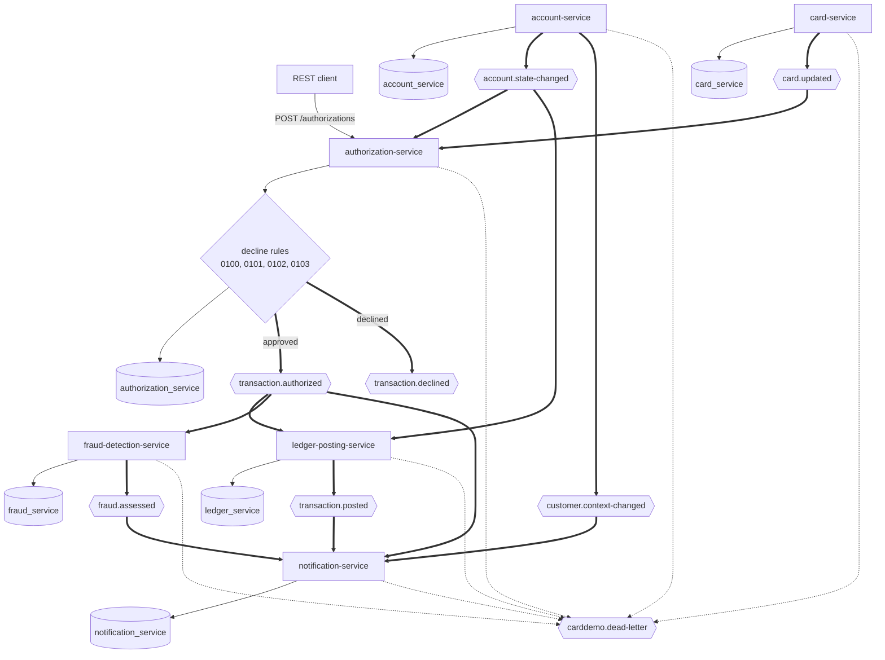
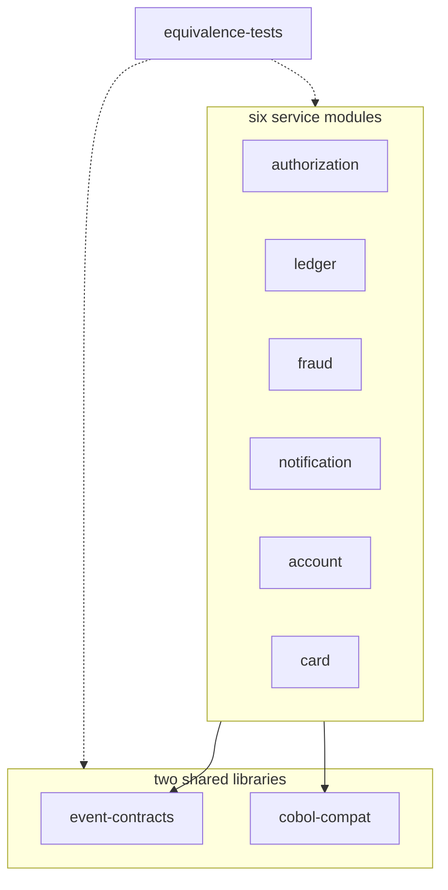

## CardDemo Card Platform

- [Overview](#overview)
- [Delivered capability](#delivered-capability)
- [Quickstart](#quickstart)
- [Security and transport](#security-and-transport)
- [Repository map](#repository-map)
- [Runtime architecture](#runtime-architecture)
- [Module boundary](#module-boundary)
- [Services and APIs](#services-and-apis)
- [Events and consumer groups](#events-and-consumer-groups)
- [Equivalence](#equivalence)
- [Documentation](#documentation)

<br/>

## Overview

This directory contains six independently deployable Java 25 services on Spring Boot 4.1.0. Kafka carries service events, and one PostgreSQL instance hosts six private databases and schemas.

The platform forward-engineers documented CardDemo behavior without calling the mainframe at runtime. Files under `app/`, `diagrams/`, and `samples/` remain reference inputs and are not modified.

The architecture has one synchronous authorization entry point. Ledger posting, fraud detection, and notification processing run asynchronously without direct service calls between consumers.

<br/>

## Delivered capability

The Maven aggregator contains nine child modules and builds ten reactor projects, including the parent. The full source, contract, integration, and equivalence lifecycle runs through `mvn verify`.

| Capability | Delivered implementation |
| :--- | :--- |
| Authorization | Four source-derived decline rules, one response, and exactly one authorization event per call |
| Posting | Transaction, category-balance, account-balance, account-state replica, feed-reject, outbox, and duplicate-delivery handling |
| Fraud | Three net-new risk rules, persisted assessments, and flagged or cleared events |
| Notification | Authorized-transaction, posted-transaction, fraud, and customer-context consumers, private read models, two renderers, alert-attempt metadata, and history API |
| Account | Account and customer reads, coordinated update, source-compatible conflict check, cycle close, and state-change publication |
| Card | Seven-row cursor browse, card detail, ordered update, state-change publication, and cross-reference divergence metering |
| Contracts | Thirteen JSON Schema Draft 2020-12 documents, validating serialization, validating deserialization, and compatibility tests |
| Persistence | Flyway-owned schemas, fixture-backed seeds, Jakarta Persistence validation, outboxes, and processed-event guards |
| Operations | Structured JSON logs, health and metrics endpoints, terminal dead-letter routes for spent records and abandoned outbox rows, Docker Compose, and Kubernetes manifests |
| Equivalence | Posting, authorization, bill payment, interest rules, validation, identifier, fixture, card-seed, and decimal comparisons |

Nine listeners are present:

- authorization consumes `AccountStateChanged` under `authorization-account-state`, keeping `account_credit_snapshot` current;
- authorization consumes `CardUpdated` under `authorization-card-updated`, keeping `card_xref` current;
- ledger consumes authorized transactions under `ledger-posting` and posts them;
- ledger consumes `AccountStateChanged` under `ledger-account-state`, which bootstraps and refreshes `account_balance_projection`;
- fraud consumes authorized transactions under `fraud-detection`;
- notification consumes authorized transactions under `notification-authorized`;
- notification consumes posted transactions under `notification-posted`;
- notification consumes fraud assessments under `notification-fraud`;
- notification consumes `CustomerContextChanged` under `notification-customer` to keep renderer context current.

Ledger, fraud, and notification are therefore three independent consumers of the one authorization event, each reading it under its own group.

Each listener claims an event identifier before applying effects. It acknowledges only after its local transaction commits. A listener never reverses a decision another service reached: a record it cannot apply fails the consumer, leaves the offset uncommitted, and reaches a dead-letter topic.

<br/>

## Quickstart

Use the tested versions below:

| Tool | Version |
| :--- | :--- |
| Eclipse Temurin OpenJDK | 25.0.4+7 |
| Apache Maven | 3.9.16 |
| Docker Engine | 29.7.0 |
| Docker Compose | 5.3.1 |
| Kafka image | `apache/kafka:4.2.1` |
| PostgreSQL image | `postgres:18.4` |

Start from the repository root:

```bash
cd card-platform
cp .env.example .env
```

The copied file contains 17 `REPLACE` markers. Generate fourteen local passwords and three `{bcrypt}` identity hashes before starting the stack.

[Onboarding](docs/onboarding.md) provides tested, copyable commands for every credential. It also explains the domain, ports, pitfalls, and extension paths.

Build, verify, and start:

```bash
mvn -B clean verify
docker compose up -d --build
docker compose ps
```

Every Dockerfile copies its packaged archive from `target/`. The Maven command must finish before the image build.

Check all health endpoints:

```bash
for port in 9081 9082 9083 9084 9085 9086; do
  curl -fsS "http://localhost:${port}/actuator/health"
  echo
done
```

The authorization example and Kafka console command are in [Onboarding](docs/onboarding.md). The authorization response uses HTTP 200 for both approval and source-equivalent decline.

`approved` distinguishes the two outcomes. An approval reaches ledger, fraud, and notification independently, and each of the three reads it under its own consumer group.

<br/>

## Security and transport

Every business route requires HTTP Basic authentication. The security chains deny unmatched routes by default.

| Identity | Role | Access |
| :--- | :--- | :--- |
| `admin001` | `ADMIN` | Every business route |
| `user0001` | `USER` | Resources named by `USER_SCOPES` |
| `monitor01` | `MONITORING` | Metrics and Prometheus endpoints only |

Anonymous access is limited to `/actuator/health` on each management port. Business identities do not receive monitoring access.

Passwords are encoded before they enter configuration. The services reject identity values without a supported encoding prefix.

A card is named on every external surface by its card token, never by its number. The token is a keyed hash: `HMAC-SHA-256` over the full number under `CARD_TOKEN_SECRET`, prefixed by `CARD_TOKEN_VERSION`, rendered as 64 lower-case hexadecimal characters. Both values are required and have no fallback, so a service refuses to start without them. Three consequences matter operationally: the `SCOPE_CARD_` authority in `USER_SCOPES` names a token and not a number; the `card_token` column that `services/card-service/.../V2__seed.sql` loads is derived under the shipped demo key; and rotating either value invalidates both at once. [Onboarding](docs/onboarding.md) gives the rotation procedure.

The Compose stack binds every published port to `127.0.0.1`. It uses separate database and Kafka credentials for each service.

| Transport | Compose | Kubernetes |
| :--- | :--- | :--- |
| Database | `sslmode=require` | `sslmode=verify-full` |
| Kafka | `SASL_PLAINTEXT` on the private bridge | `SASL_SSL` |
| Service ports | HTTP on loopback | HTTPS with mounted key material |

The demonstration uses synthetic repository fixtures. Do not expose the Compose ports or load real cardholder data.

<br/>

## Repository map

| Path | Contents |
| :--- | :--- |
| `pom.xml` | Aggregator, Java 25 setting, plugin management, and nine child modules |
| `docker-compose.yml` | Kafka, PostgreSQL, six service containers, health checks, and topic creation |
| `.env.example` | Supported runtime overrides and credential placeholders |
| `libs/event-contracts/` | Event records, envelope, schemas, wire bounds, serializers, and compatibility tests |
| `libs/cobol-compat/` | Fixed-point arithmetic, parsing, date validation, masking, and source reference data |
| `services/authorization-service/` | Synchronous authorization and account-state projection |
| `services/ledger-posting-service/` | Posting arithmetic and balance projection |
| `services/fraud-detection-service/` | Net-new risk assessment |
| `services/notification-service/` | Card-keyed transaction model and alert rendering |
| `services/account-service/` | Account, customer, validation, and cycle-close operations |
| `services/card-service/` | Card browse, detail, update, and replica diagnostics |
| `equivalence-tests/` | Cross-module contracts and source-rule comparisons |
| `docs/` | Decisions, traceability, architecture, data model, onboarding, flags, results, prose validation, and next tasks |
| `deploy/k8s/` | Namespace, Kafka, PostgreSQL, configuration, secrets template, Deployments, and Services |

Each service contains:

- `pom.xml` and `Dockerfile`;
- a service-level `README.md`;
- `api/`, `domain/`, `entity/`, `repository/`, `messaging/`, `outbox/`, and `config/` packages as needed;
- `application.yml`, `openapi.yaml`, and Flyway migrations;
- direct unit, persistence, contract, and integration tests.

The platform has no application front end, service mesh, cache, schema-registry container, or runtime mainframe connector.

<br/>

## Runtime architecture

Figure 1 shows the delivered request, event, and projection paths.

**Figure 1 — Delivered Card Platform: One Authorization Decision and Independent Event Consumers**



Legend for Figure 1:

- Plain arrows are synchronous request or private database work.
- Thick arrows are Kafka publish or consume paths.
- Dotted arrows are terminal dead-letter routes.
- The diamond is the source-derived decision chain.
- Cylinders are schemas read by one service only.
- No consumer calls another consumer.
- Three thick arrows leave `transaction.authorized`, one for each independent consumer.

The source and target are compared in [Architecture, Before and After](docs/architecture-before-after.md). Every event path appears in [Event Flow](docs/event-flow.md).

The measured CICS definition contains 8 files, 17 mapsets, 18 programs, and 18 transactions. The broader source directory contains 28 COBOL programs.

<br/>

## Module boundary

Figure 2 shows the compile dependency direction.

**Figure 2 — Maven Boundary: Shared Libraries Below Services and Equivalence Tests Above**



Legend for Figure 2:

- Solid arrows are compile dependencies.
- Dotted arrows are test-scope dependencies.
- No arrow runs between service modules.

Each service depends on both shared libraries and no other service. A forbidden inter-service Java import fails compilation and the Maven enforcer reports it.

The equivalence module depends on every module for tests only. It is last in the reactor.

<br/>

## Services and APIs

| Service and guide | Business port | Management port | Delivered operations |
| :--- | ---: | ---: | :--- |
| [authorization-service](services/authorization-service/README.md) | 8081 | 9081 | `POST /authorizations` |
| [ledger-posting-service](services/ledger-posting-service/README.md) | 8082 | 9082 | `GET /balances/{accountId}` |
| [fraud-detection-service](services/fraud-detection-service/README.md) | 8083 | 9083 | `GET /fraud-assessments`, `GET /fraud-assessments/{transactionId}` |
| [notification-service](services/notification-service/README.md) | 8084 | 9084 | `GET /notifications/{cardToken}` |
| [account-service](services/account-service/README.md) | 8085 | 9085 | `GET /accounts/{accountId}`, `PUT /accounts/{accountId}`, `POST /accounts/{accountId}/cycle-close`, `GET /customers/{customerId}` |
| [card-service](services/card-service/README.md) | 8086 | 9086 | `GET /cards`, `POST /cards/detail`, `PUT /cards` |

All business ports map to container port 8080. All management ports map to container port 9080.

Kafka is `kafka:29092` inside Compose and `localhost:9092` from the host. PostgreSQL is `postgres:5432` inside Compose and `localhost:5432` from the host.

| Service | Database | Schema |
| :--- | :--- | :--- |
| authorization | `carddemo_authorization` | `authorization_service` |
| ledger | `carddemo_ledger` | `ledger_service` |
| fraud | `carddemo_fraud` | `fraud_service` |
| notification | `carddemo_notification` | `notification_service` |
| account | `carddemo_account` | `account_service` |
| card | `carddemo_card` | `card_service` |

Flyway creates every schema. Hibernate uses `ddl-auto: validate` and never generates tables.

<br/>

## Events and consumer groups

Seven business topics, five source-specific dead-letter topics, and one shared fallback are created explicitly. The five are `transaction.authorized.DLT`, `account.state-changed.DLT`, `transaction.posted.DLT`, `fraud.assessed.DLT`, and `customer.context-changed.DLT`. `card.updated` needs none: its only consumer routes a spent record to the shared fallback as a governed envelope instead.

| Topic | Event types | Producers | Consumers and groups |
| :--- | :--- | :--- | :--- |
| `transaction.authorized` | `TransactionAuthorized` | authorization | ledger `ledger-posting`; fraud `fraud-detection`; notification `notification-authorized` |
| `transaction.declined` | `TransactionDeclined` | authorization; ledger on a feed-validation reject | no runtime consumer |
| `transaction.posted` | `TransactionPosted` | ledger | notification `notification-posted` |
| `fraud.assessed` | `FraudFlagged`, `FraudCleared` | fraud | notification `notification-fraud` |
| `account.state-changed` | `AccountStateChanged` | account | authorization `authorization-account-state`; ledger `ledger-account-state` |
| `customer.context-changed` | `CustomerContextChanged` | account | notification `notification-customer` |
| `card.updated` | `CardUpdated` | card | authorization `authorization-card-updated` |
| `<source>.DLT` | 134-character fixed-width abend diagnostic from `app/cpy/CSMSG02Y.cpy` | listener error handlers on ledger, fraud, and notification | operator inspection and replay |
| `carddemo.dead-letter` | `DeadLetterEnvelope` | authorization listener error handlers; outbox relays on authorization, ledger, account, and card when a row is abandoned; every service when a source topic cannot be resolved | operator inspection and replay |

Every governed event carries `eventId`, `eventType`, `schemaVersion`, `occurredAt`, and an aggregate key. Money travels as a decimal string.

The account identifier is the normal Kafka key and ordering unit. An unresolved-card decline uses the transaction key because no account identifier exists.

Thirteen schema documents cover eight business event types, four additive version upgrades, and the dead-letter envelope. Publish and consume paths validate against the registered document.

`TransactionPosted` version 2 adds the statement provenance required by notification. Version 1 remains constructible and testable, but notification refuses it as insufficient.

<br/>

## Equivalence

The suite compares Java behavior with documented source rules and checked-in fixtures. It never calls a mainframe.

Run the complete equivalence lifecycle from this directory:

```bash
mvn -o -B -pl equivalence-tests -am verify
```

`mvn test` does not execute `*EquivalenceTest.java`. Failsafe runs those classes during `verify`.

The delivered suite includes:

- posting over all 300 daily transaction records;
- decline reasons 0100 through 0103 and the narrowed-precision boundary;
- online bill-payment behavior;
- interest-rate resolution without migrating interest processing;
- account and card validation;
- truncation toward zero;
- fixture census, identifier fidelity, and card seed checks.

The published run reports 182 Failsafe equivalence tests and 253 unit or contract tests, with zero failures. See [Equivalence Results](docs/equivalence-results.md).

Interest is verified but not migrated. `BillingCycleService` reproduces only the two accumulator resets at `app/cbl/CBACT04C.cbl:L353-L354`.

<br/>

## Documentation

| Document | Purpose |
| :--- | :--- |
| [Onboarding](docs/onboarding.md) | Clean-machine setup, domain context, pitfalls, and extension guidance |
| [Suggested Next Tasks](docs/suggested-next-tasks.md) | Follow-up work with locations and verification criteria |
| [Decision Log](docs/decision-log.md) | Alternatives, reasons, accepted risks, and declared deviations |
| [Traceability Matrix](docs/traceability-matrix.md) | Bidirectional source-to-target classification |
| [Business Rule Flags](docs/business-rule-flags.md) | Thirty-two entries covering the specification's twenty-six ambiguous, inconsistent, or undocumented source rules, plus one declared departure |
| [Architecture, Before and After](docs/architecture-before-after.md) | Paired Mermaid migration views |
| [Event Flow](docs/event-flow.md) | Topics, groups, outboxes, projections, and idempotency |
| [Data Model](docs/data-model.md) | Service-owned tables and copybook-to-column provenance |
| [Equivalence Results](docs/equivalence-results.md) | Fixture-by-fixture parity evidence and declared gaps |
| [Prose Validation](docs/prose-validation.md) | Rule 5 verdicts and per-document scorecards |

Each service also has a local guide linked from [Services and APIs](#services-and-apis). The root `README.md` retains the separate mainframe installation path.

Use [Suggested Next Tasks](docs/suggested-next-tasks.md) for unresolved business decisions. Do not silently correct a flagged source behavior in production code.

<br/>