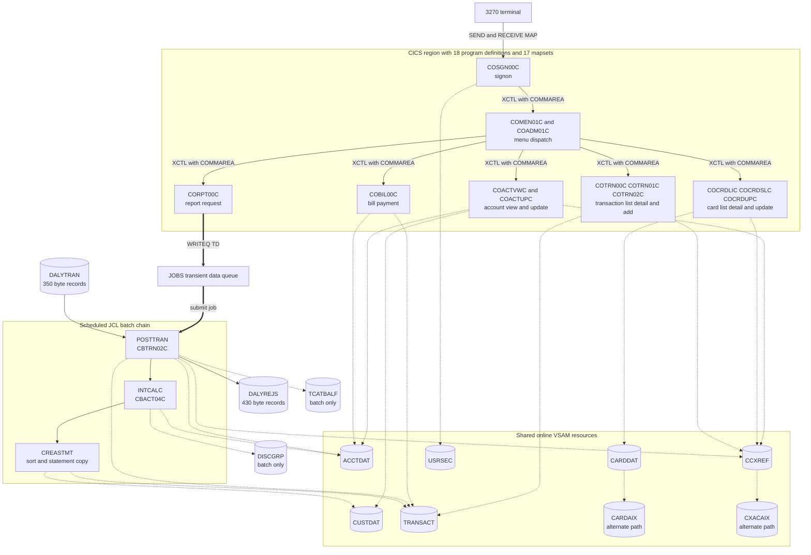
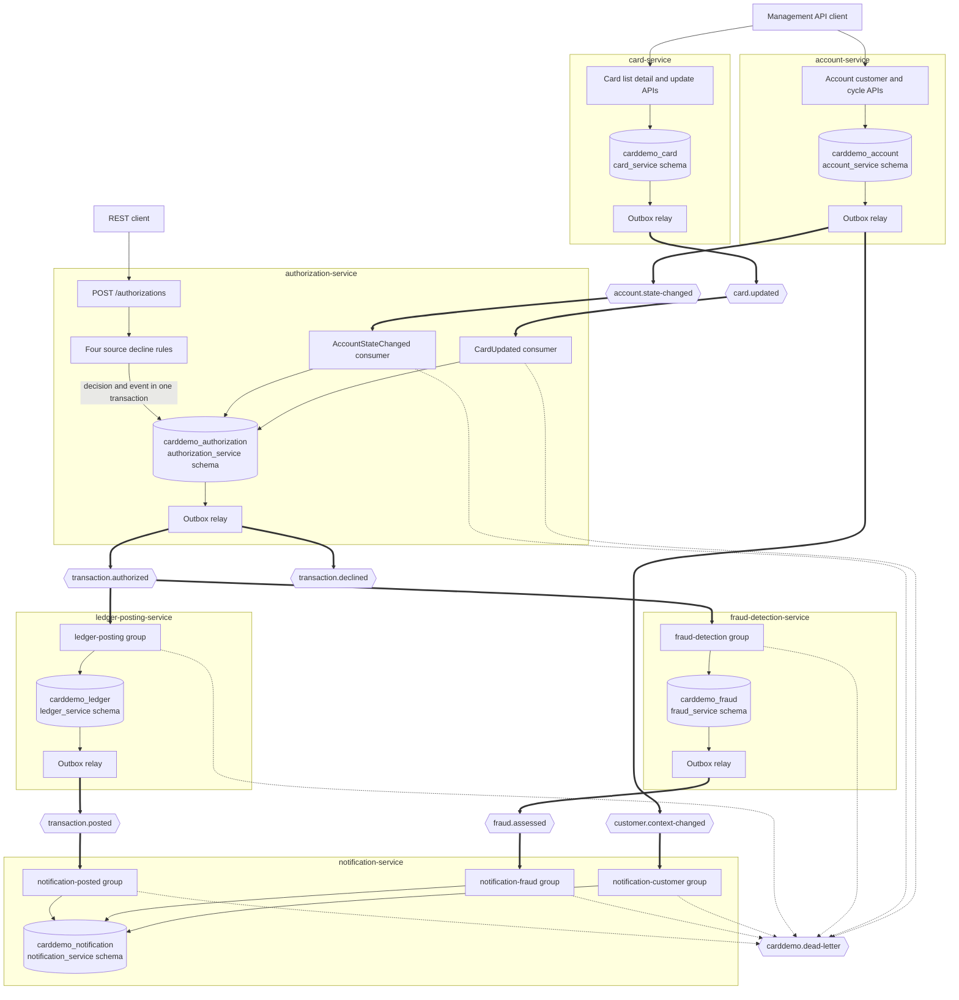

# Architecture, Before and After

Rule 2 requires both states for a migration. The legacy view is authored fresh in Mermaid from the CICS resource definitions and Job Control Language jobs. The target view reflects the delivered services, topics, consumers, and private stores. Design rationale lives in the [decision log](decision-log.md).

## Before: CICS online transactions and scheduled batch over shared VSAM

**Figure 1 — CardDemo current state with CICS programs, shared VSAM paths, and a scheduled batch chain**

Figure 1 shows the shared-state shape that the migration removes. The online region uses six base datasets and two alternate-index paths, while batch adds two more files.

The measured resource inventory is 8 files, 17 mapsets, 18 programs, 18 transactions.

**Legend**

- A plain solid arrow is a synchronous terminal or program handoff.
- A thick arrow is the source’s single asynchronous path through the `JOBS` transient data queue.
- A dotted arrow is direct file access.
- A cylinder is persistent data. `CARDAIX` and `CXACAIX` are paths, not base clusters.
- Every CICS file definition has `JOURNAL(NO)` and `RECOVERY(NONE)`.

### Measured CICS inventory

| Resource kind | Measured count | Evidence |
| --- | ---: | --- |
| File definitions | 8 | `app/csd/CARDDEMO.CSD:L1-L99` |
| Base datasets | 6 | `ACCTDAT`, `CARDDAT`, `CCXREF`, `CUSTDAT`, `TRANSACT`, `USRSEC` |
| Alternate-index paths | 2 | `CARDAIX` at line 13 and `CXACAIX` at line 63 |
| Mapsets | 17 | `app/csd/CARDDEMO.CSD:L100-L172` |
| Programs | 18 | `app/csd/CARDDEMO.CSD:L173-L305` |
| Transactions | 18 | `app/csd/CARDDEMO.CSD:L306-L488` |
| `JOURNAL(NO)` settings | 8 | One per file definition |
| `RECOVERY(NONE)` settings | 8 | One per file definition |

`TCATBALF` and `DISCGRP` do not appear in the CICS file definitions. They are batch-only allocations at `app/jcl/POSTTRAN.jcl:L41-L42` and `app/jcl/INTCALC.jcl:L35-L36`.

### Shared file reachability

| Resource | Main readers and writers |
| --- | --- |
| `ACCTDAT` | Account view and update, bill payment, posting, and interest |
| `CARDDAT` | Card list, detail, update, and the print-only transaction batch reader |
| `CCXREF` | Account, card, and transaction paths |
| `CUSTDAT` | Account view and update, customer reporting, and statements |
| `TRANSACT` | Transaction list, detail, add, bill payment, posting, and statements |
| `USRSEC` | Signon and excluded user-management programs |
| `CARDAIX` | Alternate card access by account identifier |
| `CXACAIX` | Alternate cross-reference access by account identifier |

### Posting job allocations

| Allocation | Locator | Consequence |
| --- | --- | --- |
| Posted transaction file | `app/jcl/POSTTRAN.jcl:L28-L29` | Stores accepted transactions |
| Daily transaction feed | `app/jcl/POSTTRAN.jcl:L30-L31` | Sequential batch input |
| Cross-reference file | `app/jcl/POSTTRAN.jcl:L32-L33` | Resolves card to account |
| Reject Generation Data Group | `app/jcl/POSTTRAN.jcl:L34-L38` | Fixed 430-byte rejected records |
| Account file | `app/jcl/POSTTRAN.jcl:L39-L40` | Balance and cycle updates |
| Category-balance file | `app/jcl/POSTTRAN.jcl:L41-L42` | Per-account category totals |

The card file is absent from both the job allocations and `CBTRN02C`’s six `SELECT` statements. [Business-rule flag 3](business-rule-flags.md#business-rule-flags) records the resulting missing card-status check.

The batch order is explicit. `app/jcl/POSTTRAN.jcl:L23` runs `CBTRN02C`; `app/jcl/INTCALC.jcl:L22` runs `CBACT04C`; `app/jcl/CREASTMT.JCL:L44` starts the sort that builds the statement copy.

## After: one authorization event, independent consumers, and private stores

**Figure 2 — Delivered target state with outbox publication, independent consumers, and service-owned databases**

Figure 2 follows one authorization call and also shows supporting state-change events. Authorization reads private projections and makes no synchronous service call.

**Legend**

- A plain arrow is a synchronous in-process or REST step.
- A thick arrow is asynchronous Kafka publication or consumption.
- A dotted arrow is terminal dead-letter routing after consumer failure.
- A hexagon is a Kafka topic. Seven topics carry business events. Source-specific dead-letter topics and one shared fallback carry terminal failures.
- A cylinder is a private PostgreSQL database and service schema.
- The three downstream consumers have no direct edge between them. The Maven module graph enforces that absence.
- `transaction.declined` has no demo consumer. `card.updated` refreshes authorization's local cross-reference observation without changing the source-equivalent decision rules.

### Topic and consumer-group inventory

| Topic | Event types | Producer | Consumer groups |
| --- | --- | --- | --- |
| `transaction.authorized` | `TransactionAuthorized` | authorization-service | `ledger-posting`, `fraud-detection` |
| `transaction.declined` | `TransactionDeclined` versions 1 and 2 | authorization-service and ledger reject path | None in the demo |
| `transaction.posted` | `TransactionPosted` versions 1 and 2 | ledger-posting-service | `notification-posted` |
| `fraud.assessed` | `FraudFlagged`, `FraudCleared` | fraud-detection-service | `notification-fraud` |
| `account.state-changed` | `AccountStateChanged` | account-service | `authorization-account-state` |
| `customer.context-changed` | `CustomerContextChanged` | account-service | `notification-customer` |
| `card.updated` | `CardUpdated` versions 1 and 2 | card-service | `authorization-card-updated` |
| `<source>.DLT` | `DeadLetterEnvelope` | Every listener error handler | Human inspection and replay tooling |
| `carddemo.dead-letter` | `DeadLetterEnvelope` | Error handlers without source metadata | Human inspection and replay tooling |

Seven consumer groups serve four listening services. Authorization needs two groups for its replicas, and notification needs three groups for its independent inputs.

The account identifier is the Kafka key whenever the account is known. Reason-0100 declines use the sanctioned 16-character transaction key because no account was resolved.

### Private store ownership

| Service | Database and schema | Owned tables |
| --- | --- | --- |
| authorization | `carddemo_authorization`, `authorization_service` | `card_xref`, `account_credit_snapshot`, `unresolved_card_attempt`, `outbox_event`, `processed_event` |
| ledger posting | `carddemo_ledger`, `ledger_service` | `transaction`, `transaction_category_balance`, `account_balance_projection`, `transaction_type`, `transaction_category`, `rejected_transaction`, `outbox_event`, `processed_event` |
| fraud detection | `carddemo_fraud`, `fraud_service` | `fraud_assessment`, `velocity_window`, `outbox_event`, `processed_event` |
| notification | `carddemo_notification`, `notification_service` | `statement_transaction`, `cardholder_context`, `notification_log`, `processed_event` |
| account | `carddemo_account`, `account_service` | `account`, `customer`, `disclosure_group`, three validation-reference tables, `outbox_event`, `processed_event` |
| card | `carddemo_card`, `card_service` | `card`, `card_xref`, `outbox_event`, `processed_event` |

Field-level provenance and key derivation live in the [data model](data-model.md).

## Component-by-component correspondence

| Legacy construct | Evidence in source | Target construct |
| --- | --- | --- |
| CICS transaction identifier | 18 definitions in `app/csd/CARDDEMO.CSD` | REST resource and HTTP method, or a documented exclusion |
| Basic Mapping Support mapset | 17 definitions in the CSD and `app/bms/` | JSON request and response body; no application user interface |
| `EXEC CICS XCTL` with a Communication Area | `app/cbl/COMEN01C.cbl:L152-L155` | Stateless route or in-process service call |
| Pseudo-conversational return with Communication Area | `app/cbl/COSGN00C.cbl` | Stateless request; identity arrives on each call |
| VSAM keyed dataset and alternate-index path | `app/jcl/XREFFILE.jcl:L43-L44` and `L74` | PostgreSQL table and secondary index in a private schema |
| COBOL copybook record | `app/cpy/` | Jakarta Persistence entity, Flyway migration, event field, or documented omission |
| JCL step naming a program | `app/jcl/POSTTRAN.jcl:L23` | Kafka listener method |
| Sequential daily transaction file | `app/jcl/POSTTRAN.jcl:L30-L31` | `transaction.authorized` event stream |
| Generation Data Group reject file | `app/jcl/POSTTRAN.jcl:L34-L38` | Rejected-transaction row, declined event, and dead-letter route |
| `WRITEQ TD` to `JOBS` | `app/cbl/CORPT00C.cbl:L517-L519` | Transactional outbox row and relay |
| Generic input and output subroutine | `app/cbl/CBSTM03B.CBL:L99-L127` | Repository interface per aggregate |
| Called date-validation program | `app/cbl/COTRN02C.cbl:L389-L414` | Shared `CobolDateValidator` |
| Return codes and abend paragraph | `app/cbl/CBTRN02C.cbl:L230` and `L707-L711` | HTTP outcomes, retries, and dead-letter metadata |
| Full-record comparison before rewrite | `app/cbl/COACTUPC.cbl:L4109-L4193` | Field-level compare-and-swap |
| Menu dispatch with role byte | `app/cpy/COMEN02Y.cpy:L88-L92` | REST routes and the effective signon-time role fork |

`app/cbl/CBSTM03B.CBL:L99-L114` carries dataset, operation, return code, key, key length, and a field area. Keyed read becomes find-by-identifier, sequential read becomes iteration, write becomes insert, and rewrite becomes update. Framework-managed connection lifecycle replaces the source open and close operations.

## What changed structurally

### Shared datasets became private stores

Figure 1 centers many programs around shared files. Figure 2 places every database inside one service boundary and uses events for copied state.

### One asynchronous handoff became the general mechanism

The `WRITEQ TD` call at `app/cbl/CORPT00C.cbl:L517-L519` becomes the pattern for all cross-service state movement. Producers write outbox rows, and relays publish them later.

### A clock trigger became an event trigger

Posting no longer waits for the scheduled chain. The ledger begins when it consumes the authorization event.

### Recovery became transactional

All eight CICS definitions disable journaling and recovery. The target commits each business effect with its outbox or processed-event row in one local transaction.

## Legacy diagram artifacts

The six files under `diagrams/` remain legacy reference inputs. This work neither converts nor edits them; the diagrams above are authored fresh in Mermaid.