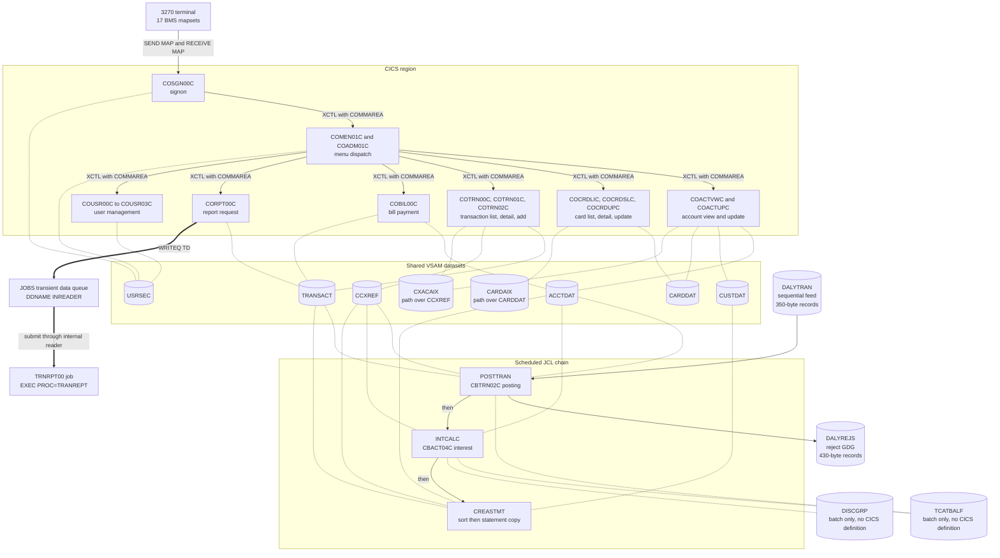
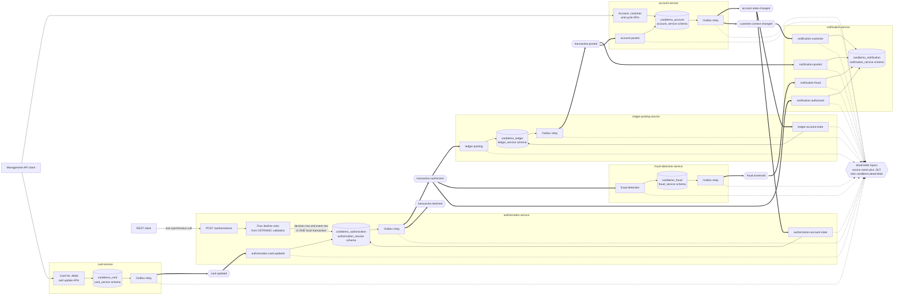

# Architecture, Before and After

This document pairs the source architecture with the delivered one so both states are visible in a single comparison. Rule 2 requires both states for a migration, and a target-only view would not satisfy it. Both views are authored fresh in Mermaid from the Customer Information Control System (CICS) definitions, the Job Control Language (JCL) jobs, and the delivered services. Nothing under `diagrams/` was converted, and design rationale lives in the [decision log](decision-log.md).

## Before: CICS online transactions and scheduled batch over shared VSAM

Figure 1 shows the coupling this migration removes: every Virtual Storage Access Method (VSAM) dataset in the middle band is reached by more than one program. The scheduled chain reaches the same datasets the online region does. The measured resource inventory is 8 files, 17 mapsets, 18 programs, 18 transactions.

**Figure 1 — CardDemo current state: synchronous CICS transactions and scheduled batch over shared VSAM datasets**

**Legend**

- A subgraph boundary encloses one runtime container: the CICS region, the eight shared datasets, or the scheduled batch chain.
- A plain solid arrow is a synchronous handoff, either terminal input and output over a Basic Mapping Support (BMS) mapset or `EXEC CICS XCTL` passing the Communication Area at `app/cbl/COMEN01C.cbl:L152-L155`.
- A dotted line is direct file access from inside a program. It carries no arrowhead because these programs both read and rewrite the dataset. Read the middle band as the centre of the diagram: several different programs reach every dataset in it.
- A thick arrow is the only asynchronous path in the source. `app/cbl/CORPT00C.cbl:L517-L519` writes to a Transient Data Queue defined at `app/csd/CARDDEMO.CSD:L499-L502`, whose `DDNAME(INREADER)` submits a job. **The job it submits is the report job, not the posting job.** `app/cbl/CORPT00C.cbl:L84` builds the job card `//TRNRPT00 JOB 'TRAN REPORT'` and `:L94` builds the single step `//STEP10 EXEC PROC=TRANREPT`. Nothing in the source submits `POSTTRAN`; the nightly chain is scheduled rather than triggered.
- **The statement job reaches four datasets, not two.** `app/jcl/CREASTMT.JCL:L79-L86` runs `CBSTM03A` with `TRNXFILE`, `XREFFILE`, `ACCTFILE` and `CUSTFILE` allocated, and `app/cbl/CBSTM03B.CBL:L31`, `:L37`, `:L43` and `:L49` declare one file for each. The statement program reaches all four through that one called subroutine. Its transaction input is the sorted copy the earlier steps build, not `TRANSACT` directly.
- An arrow labelled "then" is a scheduling dependency between jobs, expressed in the nightly window rather than in code.
- A cylinder is persistent data. `CARDAIX` and `CXACAIX` are alternate-index paths rather than base clusters, and `TCATBALF` and `DISCGRP` sit outside the shared band because no CICS definition covers them.
- Every one of the eight file definitions carries `JOURNAL(NO)` and `RECOVERY(NONE)`. That attribute is why the target adds a transactional outbox.

### Measured CICS inventory

Counts come from `app/csd/CARDDEMO.CSD`, not from prose about it.

| Resource kind | Count | Evidence |
| --- | ---: | --- |
| File definitions | 8 | `app/csd/CARDDEMO.CSD:L1-L99` |
| Base clusters among them | 6 | `ACCTDAT`, `CARDDAT`, `CCXREF`, `CUSTDAT`, `TRANSACT`, `USRSEC` |
| Alternate-index paths among them | 2 | `CARDAIX` at `app/csd/CARDDEMO.CSD:L13` and `CXACAIX` at `:L63` |
| Mapset definitions | 17 | `app/csd/CARDDEMO.CSD:L100-L172` |
| Program definitions | 18 | `app/csd/CARDDEMO.CSD:L173-L305` |
| Transaction definitions | 18 | `app/csd/CARDDEMO.CSD:L306-L488` |
| `JOURNAL(NO)` settings | 8 | One per file definition, first at `app/csd/CARDDEMO.CSD:L7` |
| `RECOVERY(NONE)` settings | 8 | One per file definition, first at `app/csd/CARDDEMO.CSD:L9` |

Two precision points sit behind those counts. `TCATBALF` and `DISCGRP` hold no CICS definition at all: batch allocates them at `app/jcl/POSTTRAN.jcl:L41-L42` and `app/jcl/INTCALC.jcl:L35-L36`. And 18 program definitions cover only 17 source members, because `app/csd/CARDDEMO.CSD:L211` defines `COCRDSEC` and `app/csd/CARDDEMO.CSD:L388-L390` points transaction `CDV1` at it, with no member behind either. Register item 17 in [business-rule flags](business-rule-flags.md#register-coverage) carries that finding.

### Shared file reachability

No definition belongs to one program. Online reach is measured from the CICS dataset name each program names in a file request. Batch reach is measured from the JCL allocations binding a program to a dataset.

| Definition | CSD line | Kind | Online programs | Batch programs |
| --- | --- | --- | --- | --- |
| `ACCTDAT` | L1 | Base cluster | `COACTUPC`, `COACTVWC`, `COBIL00C`, `COTRN02C` | `CBACT01C`, `CBACT04C`, `CBSTM03A`, `CBTRN02C` |
| `CARDAIX` | L13 | Path over `CARDDAT` | `COACTUPC`, `COACTVWC`, `COCRDLIC`, `COCRDSLC`, `COCRDUPC` | none |
| `CARDDAT` | L25 | Base cluster | `COACTUPC`, `COACTVWC`, `COCRDLIC`, `COCRDSLC`, `COCRDUPC` | `CBACT02C` |
| `CCXREF` | L37 | Base cluster | `COTRN02C` | `CBACT03C`, `CBACT04C`, `CBSTM03A`, `CBTRN02C`, `CBTRN03C` |
| `CUSTDAT` | L50 | Base cluster | `COACTUPC`, `COACTVWC` | `CBCUS01C`, `CBSTM03A` |
| `CXACAIX` | L63 | Path over `CCXREF` | `COACTUPC`, `COACTVWC`, `COBIL00C`, `COTRN02C` | `CBACT04C` |
| `TRANSACT` | L76 | Base cluster | `COBIL00C`, `CORPT00C`, `COTRN00C`, `COTRN01C`, `COTRN02C` | `CBSTM03A`, `CBTRN02C`, `CBTRN03C` |
| `USRSEC` | L88 | Base cluster | `COADM01C`, `COMEN01C`, `COSGN00C`, `COUSR00C`, `COUSR01C`, `COUSR02C`, `COUSR03C` | none |

`USRSEC` carries the widest reach at seven programs. `CCXREF` shows the pattern most sharply: one online program and five batch programs share the same records with no owner between them.

### Posting job allocations

The posting job binds six datasets. The dataset it does not bind matters more.

| Allocation | Locator | Role in posting |
| --- | --- | --- |
| Posted transaction file | `app/jcl/POSTTRAN.jcl:L28-L29` | Receives each accepted transaction |
| Daily transaction feed | `app/jcl/POSTTRAN.jcl:L30-L31` | Sequential input, read record by record |
| Cross-reference file | `app/jcl/POSTTRAN.jcl:L32-L33` | Resolves a card number to an account |
| Reject Generation Data Group | `app/jcl/POSTTRAN.jcl:L34-L38` | Fixed 430-byte records, `LRECL` set at `:L36` |
| Account file | `app/jcl/POSTTRAN.jcl:L39-L40` | Balance and billing-cycle updates |
| Category-balance file | `app/jcl/POSTTRAN.jcl:L41-L42` | Per-account category totals |

**The card file is absent, and two independent proofs say so.** The job allocates no card dataset in the table above. The program agrees: `app/cbl/CBTRN02C.cbl` opens six files through `SELECT` statements at `:L29`, `:L34`, `:L40`, `:L46`, `:L51` and `:L57`, and none is the card file. A card status therefore cannot be read on the posting path, which is register item 3 in [business-rule flags](business-rule-flags.md#register-coverage).

The chain order is explicit in the jobs. `app/jcl/POSTTRAN.jcl:L23` runs the posting program, and `app/jcl/INTCALC.jcl:L22` runs interest with a date passed as a literal parameter. `app/jcl/CREASTMT.JCL:L44` starts the sort whose key at `:L53` builds the statement copy that `:L56` loads.

## After: one authorization event, three independent consumers, and private stores

Figure 2 traces one Representational State Transfer (REST) authorization call to its three independent consumers, then shows the supporting events that keep each private copy current. No service calls another service synchronously. Authorization answers from projections it owns and refreshes them by consuming events, so the only synchronous edges in the figure run from a client into one service.

**Figure 2 — Delivered target state: one authorization event, three independent consumers, and one private store per service**

**Legend**

- A subgraph boundary encloses one deployable service together with the database only that service reaches.
- `authorization-service` is the sole writer of the authorization decision. No other subgraph writes a decision row, and no consumer calls back into it.
- A plain arrow is a synchronous step. Only the two client edges enter from outside; every other plain arrow is in-process.
- A thick arrow is an asynchronous Kafka publish or consume, and every thick arrow is a decoupling point.
- A dotted arrow is dead-letter routing, taken by a spent consumer record or by an outbox row a relay abandoned. All five relays take it: each publishes a governed `DeadLetterEnvelope` naming the row it gave up on.
- A hexagon is a Kafka topic. Seven carry business events. A refused record travels to its source topic plus the `.DLT` suffix, and the shared `carddemo.dead-letter` catches the rest.
- A cylinder is a private PostgreSQL database and schema created by Flyway. No cylinder is shared, which is the structural difference from Figure 1.
- Three thick arrows leave `transaction.authorized`, one for each independent consumer group. That fan-out is the point of the target state.
- The three downstream consumers have **no direct edge between them**. That absence is the requirement made visible. The Maven module graph enforces it, because no service module declares another as a dependency. A forbidden import fails the build instead of a review.
- The outbox row committed beside the decision, the processed-event marker inside each consumer transaction, and the dead-letter route are all **additive**. The source has none of the three. See [event contracts and messaging](decision-log.md#event-contracts-and-messaging).
- `transaction.declined` is consumed by the ledger under group `ledger-reject`, which writes one reject row per decline and publishes nothing. `card.updated` refreshes an authorization observation and changes no decision rule, and `account.state-changed` feeds two replicas under two groups.

### Topic and consumer-group inventory

Fourteen topics are created explicitly: seven business topics, six source-specific dead-letter topics, and one shared fallback. `card.updated` needs no `.DLT` twin, because its only consumer routes a spent record to the shared fallback instead. Both provisioning programs create the same fourteen, and `BrokerTopicProvisioningContractTest` fails the build if either creates a topic it does not authorize or authorizes one it does not create.

| Topic | Event types | Producer | Consumer groups |
| --- | --- | --- | --- |
| `transaction.authorized` | `TransactionAuthorized` | authorization | `ledger-posting`, `fraud-detection`, `notification-authorized` |
| `transaction.declined` | `TransactionDeclined` | authorization, and ledger on a feed-validation reject | `ledger-reject` |
| `transaction.posted` | `TransactionPosted` | ledger posting | `notification-posted`, `account-posted` |
| `fraud.assessed` | `FraudFlagged` and `FraudCleared` on one topic | fraud detection | `notification-fraud` |
| `account.state-changed` | `AccountStateChanged` | account | `authorization-account-state`, `ledger-account-state` |
| `customer.context-changed` | `CustomerContextChanged` | account | `notification-customer` |
| `card.updated` | `CardUpdated` | card | `authorization-card-updated` |
| `<source>.DLT`, six of them | Fixed-width abend diagnostic derived from `app/cpy/CSMSG02Y.cpy:L21` | Listener error handlers on ledger, fraud and notification. Ledger has three listeners, fraud one and notification four | Operator inspection and replay |
| `carddemo.dead-letter` | `DeadLetterEnvelope` | The authorization and account listener error handlers, and **all five** outbox relays on an abandoned row: authorization, ledger, fraud, account and card | Operator inspection and replay |

Eleven consumer groups run across five listening services, one per listener. Authorization takes two for its replicas. Ledger takes three: one for the authorization stream, one for the declines it records, and one for its balance replica. Fraud takes one, notification four for four independent inputs, and account one for the posted amount it applies. Card registers no listener.

Delivery guarantees, acknowledgement, and the duplicate check belong to [event flow](event-flow.md) and are not repeated here.

The account identifier is the Kafka message key whenever an account is known. Kafka orders records only within a partition, and the ledger's balance updates for one account must stay in order.

### Private store ownership

Each service owns one database, one schema, and the tables below. Column types, keys, and copybook provenance live in the [data model](data-model.md).

| Service | Database and schema | Owned tables |
| --- | --- | --- |
| authorization | `carddemo_authorization`, `authorization_service` | `card_xref`, `account_credit_snapshot`, `authorization_decision`, `replica_gap`, `outbox_event`, `processed_event` |
| ledger posting | `carddemo_ledger`, `ledger_service` | `transaction`, `transaction_category_balance`, `account_balance_projection`, `transaction_type`, `transaction_category`, `rejected_transaction`, `outbox_event`, `processed_event` |
| fraud detection | `carddemo_fraud`, `fraud_service` | `fraud_assessment`, `velocity_window`, `outbox_event`, `processed_event` |
| notification | `carddemo_notification`, `notification_service` | `statement_transaction`, `statement_card_total`, `cardholder_context`, `notification_log`, `processed_event` |
| account | `carddemo_account`, `account_service` | `account`, `customer`, `disclosure_group`, `account_customer_link`, `us_phone_area_code`, `us_state_code`, `us_state_zip_prefix`, `outbox_event`, `processed_event` |
| card | `carddemo_card`, `card_service` | `card`, `card_xref`, `card_token_rotation`, `card_token_rotation_mapping`, `outbox_event`, `processed_event` |

Three services hold a copy of the cross-reference relationship, which is the deliberate replacement for one `CCXREF` dataset shared by six programs in Figure 1. Two of the three are keyed on the card, because authorization and card both answer questions asked about a card. The account copy is keyed on the account and holds no card number, because its one query asks which customer an account belongs to. A card number replicated into a schema that reads no card would be a Primary Account Number with no reader. **The three copies do not share a lifecycle, and calling them all event-current would overstate two of them.**

| Copy | How it is loaded | What keeps it current | Who reads it |
| --- | --- | --- | --- |
| authorization `card_xref` | `V1` schema, `V2` seed | `CardUpdatedConsumer` on `authorization-card-updated`, which refreshes the observation metadata only. It never remaps a card to a different account | The decline rules, on every authorization call |
| account `account_customer_link` | `V7` migration, which seeds the pairs and drops the card-keyed `V4` replica | Nothing. No event refreshes it | `AccountUpdateService`, which reads one row under a lock to confirm the submitted account and customer are the stored pair |
| card `card_xref` | `V1` schema, `V2` seed | `CardCrossReferenceReconciler`, on every card update that commits. This service registers no listener, so a card it never updates is never compared | `CardUpdateService`, inside the transaction that writes the card row and its outbox row |

Two consequences are worth stating plainly. The card copy is corrected only on the path this service owns: an update that commits reconciles that card's replica row against the card row holding the mapping. The outcome lands on `carddemo.card.xref.agreed`, `carddemo.card.xref.corrected` or `carddemo.card.xref.missing`, and a card nobody updates is never compared. The authorization copy is never re-pointed at all, because a `CardUpdated` event carries a masked card number and cannot name a row keyed on sixteen characters. [The decision log](decision-log.md) records both, and [next tasks](suggested-next-tasks.md) carries the divergence that remains.

## Component-by-component correspondence

Each row states one mapping between Figure 1 and Figure 2, and none argues for it. The [decision log](decision-log.md) holds the reasoning, including the rejection of a facade that would route traffic to the mainframe.

| Legacy construct | Evidence in source | Target construct |
| --- | --- | --- |
| CICS transaction identifier | 18 definitions at `app/csd/CARDDEMO.CSD:L306-L488` | REST resource and HTTP method on the owning service, or a documented exclusion |
| Basic Mapping Support mapset driving a 3270 screen | 17 definitions at `app/csd/CARDDEMO.CSD:L100-L172`, sources under `app/bms/` | JSON request and response body. No application user interface is generated |
| `EXEC CICS XCTL` with a Communication Area | `app/cbl/COMEN01C.cbl:L152-L155` | Stateless route or in-process call. The Communication Area becomes a request payload |
| Pseudo-conversational return carrying the Communication Area | `app/cbl/COSGN00C.cbl:L98-L101` | Stateless request and response. Identity arrives on every call, and no conversation state is kept |
| VSAM keyed dataset plus alternate-index path | `app/jcl/XREFFILE.jcl:L43-L44` and `:L74` | PostgreSQL table plus secondary index, inside one private schema |
| Common Business Oriented Language (COBOL) copybook record layout | Copybooks under `app/cpy/` | Jakarta Persistence entity, Flyway migration, and event field, or a recorded omission |
| JCL job step naming a program | `app/jcl/POSTTRAN.jcl:L23` | Kafka listener method, triggered by an event rather than by a clock |
| Sequential daily-transaction flat file | `app/jcl/POSTTRAN.jcl:L30-L31` | The `transaction.authorized` topic. The file becomes a stream |
| Generation Data Group reject dataset | `app/jcl/POSTTRAN.jcl:L34-L38` | A `rejected_transaction` row holding the 350-character refused record whole, plus a `TransactionDeclined` event. Both are business outcomes, as the source reject is: `app/cbl/CBTRN02C.cbl:L230` answers a reject with return code 4, not an abend. The dead-letter topics are **not** this row's equivalent |

| `WRITEQ TD` naming the `JOBS` queue | `app/cbl/CORPT00C.cbl:L517-L519`, queue defined at `app/csd/CARDDEMO.CSD:L499-L502` | Transactional outbox row, relayed to a Kafka publish |
| Called input and output subroutine with an operation-code parameter area | `app/cbl/CBSTM03B.CBL:L99-L114` and `:L118-L127` | Repository interface per aggregate |
| `CALL 'CSUTLDTC'` date validation | `app/cbl/COTRN02C.cbl:L389-L414` | Shared date validator that keeps the message-2513 tolerance |
| `RETURN-CODE` values plus the abend paragraph | `app/cbl/CBTRN02C.cbl:L230` and `:L707-L711` | Typed outcomes: an HTTP status, a consumer retry, or dead-letter routing |
| Full-record field comparison before `REWRITE` | `app/cbl/COACTUPC.cbl:L4109-L4193` | Field-level compare-and-swap in the account service |
| Menu-driven dispatch with a role byte | `app/cpy/COMEN02Y.cpy:L88-L92` | REST routes, with role handling reduced to the signon-time fork the source implements |

One row deserves its detail, because it is the clearest ancestor in the source. The parameter area at `app/cbl/CBSTM03B.CBL:L99-L114` carries a dataset name and an operation code, with condition names for open, close, read, keyed read, write and rewrite. The same area carries a return code, a key, a key length, and a 1000-byte field area. The dispatch at `:L118-L127` sends that one area across four datasets.

The operation codes then map cleanly onto a repository interface. Keyed read becomes find by identifier, sequential read becomes iteration, write becomes insert, and rewrite becomes update. Open and close are dropped, because connection lifecycle is the framework's concern.

One target construct has no row above, because it has no legacy construct to sit beside. **The dead-letter topics are additive reliability, not the migration of anything.** The source's answer to a record it cannot process is the abend paragraph at `app/cbl/CBTRN02C.cbl:L707-L711`. It displays a message, moves 999 into an abend code, and ends the job. There is no cleanup, and no record of the individual message.

The platform instead exhausts its retries, routes the one message aside with enough metadata to diagnose and replay it, and leaves the listener consuming. Reading a dead-letter topic as the successor to the reject dataset conflates two different things. A reject is a decision the business asked for. A dead-lettered message is a failure the platform survived.

## What changed structurally

Four properties changed. Each names the feature in Figure 1 and Figure 2 that shows it.

### Shared datasets became private stores

Figure 1 puts eight file definitions at its centre, each reached by several programs across the online region and the nightly chain. Figure 2 puts every database inside one service boundary, and no arrow crosses from one service to another service's store. Where two services need the same record, the second holds its own copy.

Two mechanisms keep those copies usable, and they are not interchangeable. An event refreshes a copy whose fields an event carries, which covers `account_credit_snapshot`, `account_balance_projection` and `cardholder_context`. A seed supplies a copy no event can carry, which is the case for all three cross-reference copies, because no event carries a full card number. The table under [private store ownership](#private-store-ownership) states which mechanism holds each copy.

### One asynchronous handoff became the general mechanism

The source does something asynchronous exactly once, at `app/cbl/CORPT00C.cbl:L517-L519`. In Figure 1 that is the single thick arrow. In Figure 2 every thick arrow works the same way: a producer writes a row, and a relay publishes it afterwards. Read side by side, the two figures show one queue write generalised into the way every service talks to every other.

### A clock trigger became an event trigger

Posting no longer waits for the nightly window drawn in Figure 1. The ledger starts when it consumes the authorization event, which removes the window rather than shortening it. No target for latency or throughput is claimed here, because the requirements set none.

### Recovery went from disabled to transactional

All eight file definitions carry `RECOVERY(NONE)` and `JOURNAL(NO)`, and the posting program runs three writes unconditionally with no rollback at `app/cbl/CBTRN02C.cbl:L440-L442`. The target commits each business effect with its outbox row or its processed-event marker in one local transaction. Both the atomicity and the duplicate check are **additive**, and both are recorded under [event contracts and messaging](decision-log.md#event-contracts-and-messaging).

## Legacy diagram artifacts

The six files under `diagrams/` are legacy inputs to understanding, and this work neither converts nor edits them. Rule 2 binds the documentation this engagement authors, so both figures above are authored fresh in Mermaid from the resource definitions, the job steps, and the delivered services.
