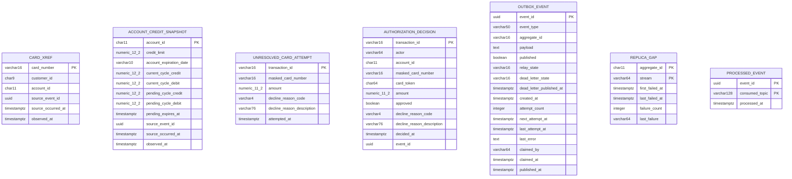
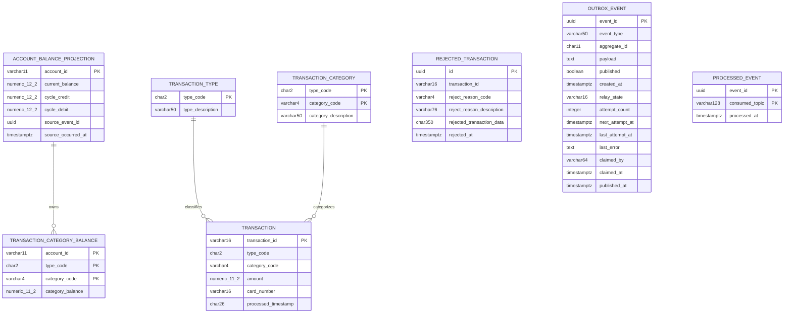
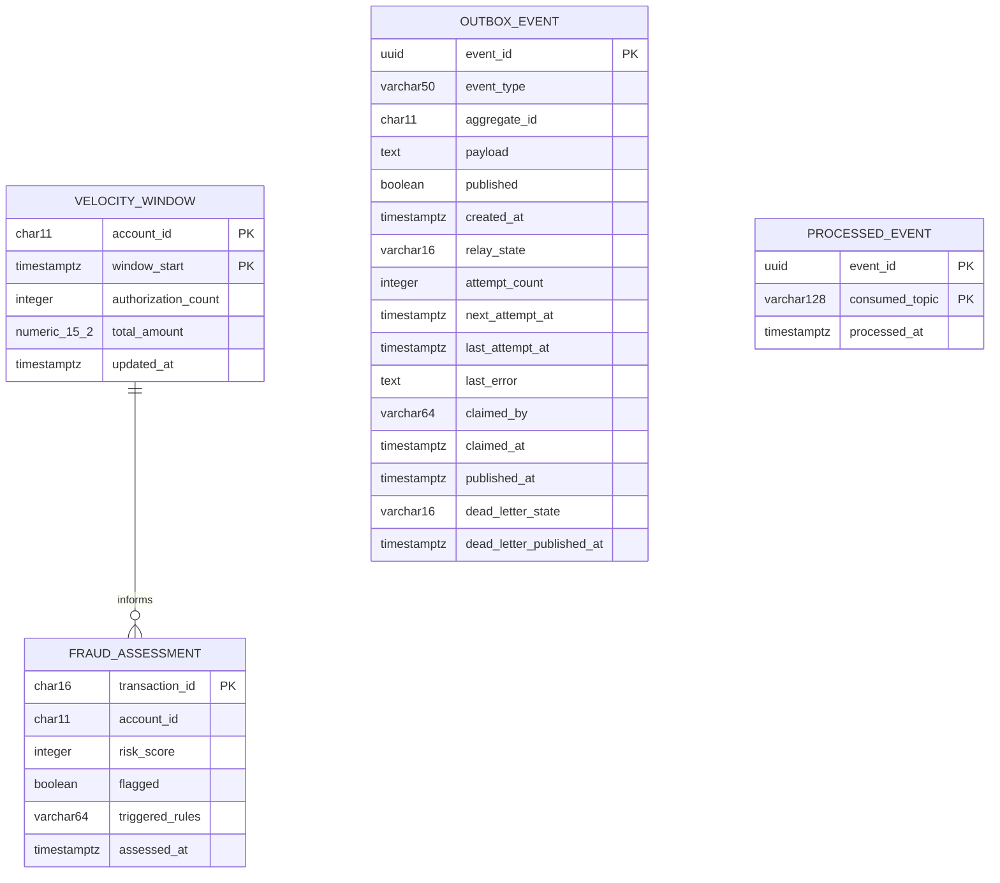
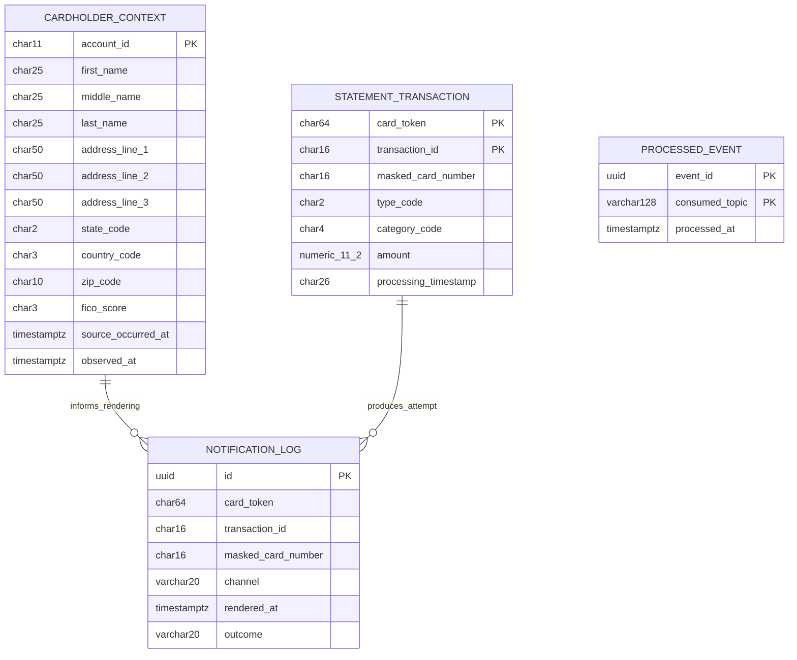
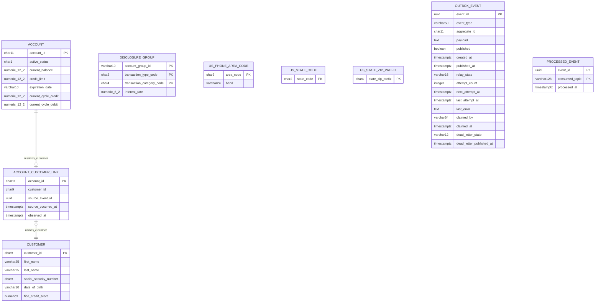
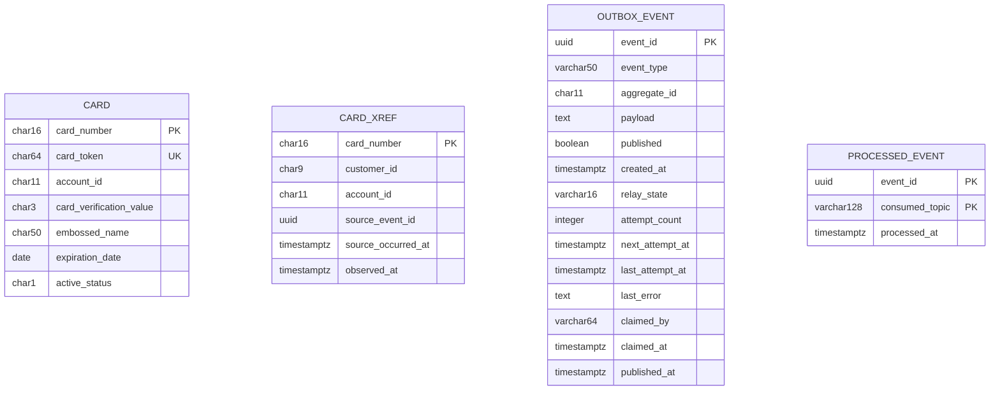

# Data Model

Every column below names the copybook field and dataset key it came from, with one entity-relationship view per service. Each service owns a private PostgreSQL database and schema, and no service reads another service’s tables. Column widths and scales derive from source Picture clauses and dataset keys. The paired before-and-after system views live in [Architecture, Before and After](architecture-before-after.md); this document is the target-state model and carries the source side in every mapping table. Why a column has the type it has lives in the [decision log](decision-log.md).

## Derivation rules

| Source Picture clause | PostgreSQL type | Rule |
| --- | --- | --- |
| `PIC 9(n)` with at most 18 digits | `NUMERIC(n,0)`, `BIGINT`, or fixed-width text | Identifiers remain text when leading zeros are significant |
| `PIC X(n)` | `VARCHAR(n)` or `CHAR(n)` | Use `CHAR` where fixed-width padding is part of the stored contract. Under either type the stored value occupies the whole field, because the source moves a screen field into a fixed-width field and rewrites the record: `app/cbl/COACTUPC.cbl:L4010-L4059` and `:L4086` for the customer record, `:L3962-L4002` and `:L4066` for the account record |
| `PIC S9(10)V99` | `NUMERIC(12,2)` | Ten integer digits plus sign and two fractional digits |
| `PIC S9(09)V99` | `NUMERIC(11,2)` | Nine integer digits plus sign and two fractional digits |
| `PIC S9(04)V99` | `NUMERIC(6,2)` | Disclosure-group interest rate |

Primary keys derive from the corresponding IDCAMS `KEYS` parameter, so a fixture row loads and compares without an identifier translation layer. Transaction-identifier generation is the single exception. `app/cbl/COTRN02C.cbl:L444` browses the transaction file backwards from high values and `app/cbl/COTRN02C.cbl:L449` adds one; `app/cbl/COBIL00C.cbl:L212` and `app/cbl/COBIL00C.cbl:L217` do the same. A `transaction_id_seq` sequence in the authorization schema replaces that read-modify-write race, recorded as [business-rule flag 15](business-rule-flags.md).

Trailing filler fields are dropped rather than modeled. The [traceability matrix](traceability-matrix.md) records every omitted filler and navigation field.

### Two date treatments

Card expiry uses `DATE`. `app/cbl/COCRDUPC.cbl:L115-L121` decomposes its ten characters into year, month, and day.

Account expiry remains `VARCHAR(10)`. `app/cbl/CBTRN02C.cbl:L414` compares it lexically with the first ten characters of a 26-character timestamp.

Both source values use year-month-day order, so lexical and calendar ordering normally agree. Converting account expiry to `DATE` would still change malformed or boundary input behavior.

## Service schemas

### Authorization database

**Figure 1 — Authorization credit and cross-reference projections with outcome infrastructure**

Figure 1 shows all seven tables of the schema: the two source-derived projections, the unresolved-card record, the decision record, the replica-gap register, and the two additive messaging tables.

**Legend**

- Entity boxes are tables in `carddemo_authorization.authorization_service`. All seven are shown.
- **The diagram draws no relationship, because the schema declares none.** `V1` through `V14`, the whole of this schema's migration history, contain zero `REFERENCES` clauses, so there is no foreign key anywhere in this schema. A decision resolves a card in two independent repository calls: read `card_xref` by card number, then read `account_credit_snapshot` by the `account_id` that row returned. Nothing in the database joins the two or constrains one to the other, and a missing second row is reject reason 0101 rather than an integrity error.
- `CARD_XREF` and `ACCOUNT_CREDIT_SNAPSHOT` derive from source layouts and hold event freshness metadata.
- `AUTHORIZATION_DECISION`, `UNRESOLVED_CARD_ATTEMPT`, `REPLICA_GAP`, `OUTBOX_EVENT`, and `PROCESSED_EVENT` are additive.
- `REPLICA_GAP`, added by `V12__replica_gap.sql`, holds one row per account per replica stream whose record this service could not apply. `domain/AuthorizationService` refuses a decision that would read either replica row of an account named here, and the two replica listeners delete the row when a later record for that account applies. No time window expires it.
- `AUTHORIZATION_DECISION.actor` is `VARCHAR(64)`, widened from `VARCHAR(8)` by `V7__cycle_exposure_reservation.sql`, which redefined `ck_authorization_decision_actor` to match.
- `PROCESSED_EVENT` carries a two-column primary key. `V6` replaced the single-column key so the same event identifier consumed from two topics records two markers.

#### `card_xref`

| Copybook field | Picture clause and locator | Target column | Type | Note |
| --- | --- | --- | --- | --- |
| `XREF-CARD-NUM` | `PIC X(16)`, `app/cpy/CVACT03Y.cpy:L5` | `card_number` | `VARCHAR(16)` | Primary key from `app/jcl/XREFFILE.jcl:L43` |
| `XREF-CUST-ID` | `PIC 9(09)`, line 6 | `customer_id` | `CHAR(9)` | Leading zeros retained |
| `XREF-ACCT-ID` | `PIC 9(11)`, line 7 | `account_id` | `CHAR(11)` | Secondary index from `app/jcl/XREFFILE.jcl:L74` |
| `FILLER` | `PIC X(14)`, line 8 | — | — | Dropped |
| No source field | — | `source_event_id`, `source_occurred_at`, `observed_at` | UUID and timestamps | Additive projection provenance |

The populated fields total 36 bytes, matching `app/data/ASCII/cardxref.txt`. The declared 50-byte layout includes the omitted 14-byte filler. [Business-rule flag 25](business-rule-flags.md) records the width disagreement between the two shipped data sets.

#### `account_credit_snapshot`

| Copybook field | Picture clause and locator | Target column | Type |
| --- | --- | --- | --- |
| `ACCT-ID` | `PIC 9(11)`, `app/cpy/CVACT01Y.cpy:L5` | `account_id` | `CHAR(11)` |
| `ACCT-CREDIT-LIMIT` | `PIC S9(10)V99`, line 8 | `credit_limit` | `NUMERIC(12,2)` |
| `ACCT-EXPIRAION-DATE` | `PIC X(10)`, line 11 | `account_expiration_date` | `VARCHAR(10)` |
| `ACCT-CURR-CYC-CREDIT` | `PIC S9(10)V99`, line 13 | `current_cycle_credit` | `NUMERIC(12,2)` |
| `ACCT-CURR-CYC-DEBIT` | `PIC S9(10)V99`, line 14 | `current_cycle_debit` | `NUMERIC(12,2)` |
| No source field | — | `pending_cycle_credit`, `pending_cycle_debit`, `pending_expires_at` | `NUMERIC(12,2)` twice and a timestamp |
| No source field | — | `source_event_id`, `source_occurred_at`, `observed_at` | UUID and timestamps |

`AccountStateChanged` refreshes every source-derived column. The event marker and projection update commit together.

Reason code 102 reads the two accumulator columns. They reach this table along three asynchronous hops. The ledger posts and publishes `TransactionPosted`; the account service adds the amount to the record it owns and publishes `AccountStateChanged`; this projection applies it. No hop is a synchronous call.

#### `authorization_decision`

Migration `V5` adds the table. It is the row a caller's decision leaves behind. It commits in the same local transaction as the outbox row. A published decision can therefore always be attributed, and a rolled-back decision leaves neither row.

| Column | Type | Provenance |
| --- | --- | --- |
| `transaction_id` | `VARCHAR(16)` | `TRAN-ID PIC X(16)`, `app/cpy/CVTRA05Y.cpy:L5`. Primary key |
| `actor` | `VARCHAR(64)` | The authenticated request identity. `V7` widened it from the `SEC-USR-ID PIC X(08)` bound at `app/cpy/CSUSR01Y.cpy:L18`, because two identities sharing one recorded actor make the row unusable |
| `account_id` | `CHAR(11)` | `XREF-ACCT-ID PIC 9(11)`, `app/cpy/CVACT03Y.cpy:L7`. Null when no cross-reference row resolved |
| `masked_card_number` | `VARCHAR(16)` | Additive. No source masking exists |
| `card_token` | `CHAR(64)` | Additive. Keyed hash, never a source field |
| `amount` | `NUMERIC(11,2)` | `TRAN-AMT PIC S9(09)V99`, `app/cpy/CVTRA05Y.cpy:L10` |
| `approved` | `BOOLEAN` | Additive. The source records an outcome as a reject reason or nothing at all |
| `decline_reason_code` | `VARCHAR(4)` | The four-digit reason of `app/cbl/CBTRN02C.cbl:L380-L420`. Null on approval |
| `decline_reason_description` | `VARCHAR(76)` | The 76-character description width of the reject trailer at `app/cbl/CBTRN02C.cbl:L446-L465` |
| `decided_at` | `TIMESTAMP(6) WITH TIME ZONE` | Additive |
| `event_id` | `UUID` | Additive. Nullable at the column since migration V13 and required of every new row by `ck_authorization_decision_event` since migration V15, which is `NOT VALID` so rows written while reason 0100 published nothing stay the record they are. Ties the row to the event the call published: an account-keyed one where an account resolved, and a transaction-keyed `transaction-declined-v2` one for reason 0100 |

Nine named constraints hold the shape the columns alone cannot. `pk_authorization_decision` keys the table on the transaction. `ck_authorization_decision_outcome` is the important one. An approved row must carry neither reason column, and a declined row must carry both. No row can claim an outcome it does not explain. `ck_authorization_decision_approved_account` requires an account on every approval, because an approval without a resolved account is not reachable. `ck_authorization_decision_actor` bounds the actor to one to sixty-four printable characters, the width `V7` widened it to, `ck_authorization_decision_account_digits` to eleven digits, and `ck_authorization_decision_reason_digits` to four. `ck_authorization_decision_card_token` requires 64 lower-case hexadecimal characters, and `ck_authorization_decision_masked_card` accepts only the two forms masking produces: twelve asterisks and four digits, or sixteen asterisks when no digits are known. The ninth is `ck_authorization_decision_event`, which holds `event_id` and `account_id` present or absent together, so the one decided outcome that publishes nothing is the one row that names neither.

One index serves the one question the table is actually asked. `ix_authorization_decision_decided_at` answers a time window, which is what the bounded retention delete reads. Two composites once stood beside it — `ix_authorization_decision_account_decided` on `(account_id, decided_at DESC)` for one account's recent decisions, and `ix_authorization_decision_actor` on `(actor, decided_at DESC)` for one operator's — and `V18__authorization_decision_index_pruning.sql` drops both. They were written for questions no code asked: the four repository read methods that would have used them had no production caller, so every authorization on the hot write path maintained two index entries nothing ever read. Both questions remain worth answering, and the answer is an endpoint with a bound on it rather than an index waiting for one; `suggested-next-tasks.md` carries the task, and the index belongs in the same change as the query that reads it.

The three columns with no source field close the gap those hops open. `app/cbl/CBTRN02C.cbl` rewrote the account at `:L545-L560` before it validated the next record, so `:L403-L405` always read every earlier approval. Here an approval reserves its own amount in the two reservation columns, inside the same transaction as the decision and under a write lock on the row. Reason code 102 adds the reserved figures to the authoritative ones before it computes. The statement that applies `AccountStateChanged` releases the reservation by the advance the event reports, and `pending_expires_at` releases one whose event never arrives. The two `CHECK` constraints hold the source sign convention: a reserved credit is never negative and a reserved debit is never positive.

#### Outcome infrastructure

| Table | Provenance | Key point |
| --- | --- | --- |
| `unresolved_card_attempt` | Reason 0100 path in `CBTRN02C` plus additive capture | Keyed on the transaction identifier because no account was resolved. It commits with the `authorization_decision` row and the `outbox_event` row of the same call, so the durable record and the published `transaction-declined-v2` event agree or neither exists |
| `authorization_decision` | Additive audit state; no source program records who asked | `actor` is `VARCHAR(64)` and holds the whole authenticated principal, because `SEC-USR-ID PIC X(08)` bounds a signon identity and not an HTTP principal |
| `outbox_event` | Additive; source ancestor is `CORPT00C:L517-L519` | Every row carries one of the two keys migration V4 permits: the 11-digit account key on every event that resolved an account, and the 16-character transaction key on the `transaction-declined-v2` event of reason 0100, which resolved none. Migration V15 records why. Migration V8 adds `dead_letter_state` and `dead_letter_published_at` |
| `processed_event` | Additive | Guards `AccountStateChanged` application |

`dead_letter_state` and `dead_letter_published_at` are the durable half of giving up on a row. A row that spends its attempts reaches `ABANDONED`, and the claim query never returns an abandoned row. The pass that gave up on it would otherwise be the last pass that ever saw it. A diagnostic dispatched at that moment and not awaited makes an unreachable broker indistinguishable from a healthy one. Abandoning the row writes `REQUIRED` in the same transaction, a partial index on `last_attempt_at` holds only the owed rows, and `PUBLISHED` plus a timestamp is written only once the broker has acknowledged the diagnostic. Three `CHECK` constraints pair the two columns: the state is one of the three names, a timestamp appears only with `PUBLISHED`, and `PUBLISHED` never appears without one.

A diagnostic for a row whose `aggregate_id` holds the 16-character transaction key travels under `00000000000` rather than that key, because `schemas/dead-letter-v1.json` accepts eleven digits. The row is still named exactly by `failedEventId`, and `outbox_event.aggregate_id` still holds the transaction identifier for anyone reading the row. No producer writes that key form now, so this substitution applies only to a row stored before that decision.

### Ledger database

**Figure 2 — Ledger posting state, reference lookups, rejects, and messaging infrastructure**

Figure 2 shows the posting tables and the composite category-balance key. `account_balance_projection` has two writers: the posting path adds a delta the ledger owns, and `messaging/AccountStateChangedConsumer` replaces the three value columns from the account service's own snapshot.

**Legend**

- Entity boxes are tables in `carddemo_ledger.ledger_service`.
- Composite `PK` markers form one primary key.
- Relationship lines describe domain keys; migrations do not add cross-table foreign keys.
- `OUTBOX_EVENT` and `PROCESSED_EVENT` are additive messaging tables. `PROCESSED_EVENT` is keyed on `event_id` together with `consumed_topic`, which keeps the authorized-transaction and account-state listeners from claiming each other's markers.
- `source_event_id` and `source_occurred_at` on `ACCOUNT_BALANCE_PROJECTION` record which account change the row last replicated, and the second is the ordering value that makes a redelivery harmless.

#### `transaction`

| Copybook field | Picture clause and locator | Target column | Type |
| --- | --- | --- | --- |
| `TRAN-ID` | `PIC X(16)`, `app/cpy/CVTRA05Y.cpy:L5` | `transaction_id` | `VARCHAR(16)` |
| `TRAN-TYPE-CD` | `PIC X(02)`, line 6 | `type_code` | `CHAR(2)` |
| `TRAN-CAT-CD` | `PIC 9(04)`, line 7 | `category_code` | `VARCHAR(4)` |
| `TRAN-SOURCE` | `PIC X(10)`, line 8 | `source` | `VARCHAR(10)` |
| `TRAN-DESC` | `PIC X(100)`, line 9 | `description` | `VARCHAR(100)` |
| `TRAN-AMT` | `PIC S9(09)V99`, line 10 | `amount` | `NUMERIC(11,2)` |
| `TRAN-MERCHANT-ID` | `PIC 9(09)`, line 11 | `merchant_id` | `VARCHAR(9)` |
| `TRAN-MERCHANT-NAME` | `PIC X(50)`, line 12 | `merchant_name` | `VARCHAR(50)` |
| `TRAN-MERCHANT-CITY` | `PIC X(50)`, line 13 | `merchant_city` | `VARCHAR(50)` |
| `TRAN-MERCHANT-ZIP` | `PIC X(10)`, line 14 | `merchant_zip` | `VARCHAR(10)` |
| `TRAN-CARD-NUM` | `PIC X(16)`, line 15 | `card_number` | `VARCHAR(16)` |
| `TRAN-ORIG-TS` | `PIC X(26)`, line 16 | `origin_timestamp` | `CHAR(26)` |
| `TRAN-PROC-TS` | `PIC X(26)`, line 17 | `processed_timestamp` | `CHAR(26)` |
| `FILLER` | `PIC X(20)`, line 18 | — | — |

The target stores a masked card value rather than the full source card field.

`app/cpy/CVTRA06Y.cpy` declares the inbound daily feed. Its thirteen fields, picture clauses and 20-byte filler match the posted layout under a `DALYTRAN-` prefix, and `app/cpy/CVTRA06Y.cpy:L10` holds `DALYTRAN-AMT PIC S9(09)V99`. That byte-for-byte identity is why the feed layout maps onto the inbound event instead of a second table.

#### Balance and lookup tables

| Source layout | Fields | Target table and key |
| --- | --- | --- |
| `app/cpy/CVTRA01Y.cpy:L5-L9` | Account 11, type 2, category 4, balance `S9(09)V99` | `transaction_category_balance`; composite key `(account_id, type_code, category_code)` |
| `app/cpy/CVACT01Y.cpy:L5`, `L7`, `L13-L14` | Account, current balance, cycle credit, cycle debit | `account_balance_projection`; account primary key |
| No source field | Provenance of the last replicated account change | `account_balance_projection.source_event_id` and `source_occurred_at`, added by `V3__account_state_replica.sql`; both `NULL` on a seeded row, and a `CHECK` holds the pair together |
| `app/cpy/CVTRA03Y.cpy:L5-L6` | Type and 50-character description | `transaction_type`; 7 seeded rows |
| `app/cpy/CVTRA04Y.cpy:L6-L8` | Type, category, and description | `transaction_category`; 18 seeded rows |

**What `transaction_category_balance.balance` does with a sum wider than its source field**. `TRAN-CAT-BAL PIC S9(09)V99` at `app/cpy/CVTRA01Y.cpy:L9` holds nine integer digits. Neither `ADD` that stores into it, `app/cbl/CBTRN02C.cbl:L508` and `:L527`, carries an `ON SIZE ERROR` phrase, so the source keeps the low-order nine digits and the sign and continues. Two authorized amounts inside `DALYTRAN-AMT PIC S9(09)V99` can sum past that width, so this is reachable rather than theoretical. The column is `NUMERIC(11,2)`, which is wider than the field: it answered SQLSTATE 22003 and rolled the posting back until the store was reproduced, which sent an approved authorization to the dead-letter topic with no balance moved. `repository/TransactionCategoryBalanceRepository` now performs the store through `MOD` by ten raised to the field's integer digits, so the stored value is the value the COBOL field would hold. `V7__category_balance_ceiling.sql` records that ceiling rather than raising it, because widening the column would hold figures the source field cannot. The same treatment applies to the three `PIC S9(10)V99` account figures through `CobolDecimal.truncateToPictureField`. [Business-rule flag 66](business-rule-flags.md) carries the finding and the reasoning.

#### `rejected_transaction`

`app/cbl/CBTRN02C.cbl:L176-L183` defines 350 bytes of transaction data plus an 80-byte reason trailer. `app/jcl/POSTTRAN.jcl:L36` confirms `LRECL=430`.

| Source element | Target column | Note |
| --- | --- | --- |
| `REJECT-TRAN-DATA PIC X(350)` at `app/cbl/CBTRN02C.cbl:L177` | `rejected_transaction_data` | The arriving `DALYTRAN-RECORD` verbatim, in `app/cpy/CVTRA06Y.cpy:L5-L18` field order, trailing spaces included. The card number at offsets 263 through 278 arrives masked, and `ck_rejected_transaction_masked_card_number` refuses a digit in the first twelve of those positions |
| Daily transaction identifier inside that block | `transaction_id` | Repeats the 16-character identifier as a queryable column |
| Failure reason and description | `reject_reason_code`, `reject_reason_description` | Four and 76 characters, from `app/cbl/CBTRN02C.cbl:L181-L182` |
| No source field | `id`, `rejected_at` | Additive row key and observation time |

The thirteen fields inside the 350-character block get no column of their own. `transaction` already models the same layout field by field for an accepted transaction, and the [decision log](decision-log.md) records why the refused copy stays whole.

### Fraud database

**Figure 3 — Net-new fraud assessment and velocity state**

Figure 3 is entirely additive as business capability, while account and amount widths reuse source contracts.

**Legend**

- Entity boxes are tables in `carddemo_fraud.fraud_service`. - No Common Business Oriented Language (COBOL)
program defines fraud scoring, verdicts, or velocity windows. - Transaction and account widths come from
`CVTRA05Y.cpy` and `CVACT03Y.cpy`, and so does the two-digit amount scale. `velocity_window.total_amount`
carries its own width, because it accumulates. - `OUTBOX_EVENT` and `PROCESSED_EVENT` provide additive
messaging guarantees. - The two `dead_letter_` columns are the durable half of giving up on a row, added by
`V5__outbox_dead_letter_state.sql`. They matter more here than in any sibling service, for the reason the
rest of the legend gives. No COBOL program computes a risk score, so a lost assessment has no batch job to
re-run and no reject dataset holding what was missed.

| Table | Columns | Provenance |
| --- | --- | --- |
| `fraud_assessment` | Transaction, account, score, verdict, triggered rules, assessment time | Net new; transaction width from `CVTRA05Y:L5`, account width from `CVACT03Y:L7` |
| `velocity_window` | Account, window start, count, total amount, update time | Net new; amount **scale** from `CVTRA05Y:L10`. `window_start` is an event time truncated to one hour, so a row spans one whole hour. `total_amount` is `NUMERIC(15,2)`: it accumulates every magnitude in the bucket, so `V3__velocity_total_headroom.sql` gave it accumulator width rather than the width of one amount. Two maximum-magnitude authorizations reach `1999999999.98`, which the original `NUMERIC(11,2)` refused |
| `outbox_event` | Event envelope, payload, relay state, dead-letter obligation | Additive. `V5__outbox_dead_letter_state.sql` adds `dead_letter_state` and `dead_letter_published_at` |
| `processed_event` | Event identifier, processing time, source topic | Additive |

`dead_letter_state` and `dead_letter_published_at` carry the same contract here as on the authorization outbox, and they were added for the same reason. `ABANDONED` records that the relay stopped attempting a row, not that anyone was told. The claim query returns `PENDING` rows only, so the pass that abandoned the row was the last pass to look at it. Abandoning the row writes `REQUIRED` in the same transaction, so neither fact can commit without the other. A partial index on `last_attempt_at` holds only the owed rows, and is empty while the relay is healthy. `PUBLISHED` plus a timestamp is written only once the broker has acknowledged the diagnostic. Three `CHECK` constraints pair the two columns, and a fourth condition inside the third restricts a non-default state to an `ABANDONED` row.

An abandoned row is never marked published. That distinction is the whole reason the state is a separate column rather than a reuse of `published`. A reader has to be able to tell an event that reached its consumers from one this service gave up on and merely reported.

A row reaches `ABANDONED` by either of two routes, and both are recorded the same way. One is a row whose ten attempts ran out. The other is a row whose failure is permanent: a payload the schema document refuses, or one no record type reads. `OutboxEventEntity.abandon` closes it outright rather than after ten identical refusals, because the tenth refusal would reach a conclusion the first already reached. That method writes the terminal state and the `REQUIRED` obligation in one write, before any diagnostic is attempted, so a broker that refuses the diagnostic leaves the obligation standing and a later pass offers it again.

All four growing tables of this schema are swept on one hourly schedule, in bounded ordered batches of at most five hundred rows, each repeated until it comes back short or a thirty-second per-table ceiling stops it. `velocity_window` is the table that needed this: nothing reads a bucket once its span elapses, so every authorization otherwise left a row behind for ever. Its horizon comes from `FRAUD_VELOCITY_RETENTION_DAYS` and must exceed `carddemo.fraud.risk.velocity-window-minutes`, because a shorter horizon would delete the bucket a live authorization is counting into, and the service refuses to start when it does not. `fraud_assessment` is swept on the same schedule under `FRAUD_ASSESSMENT_RETENTION_DAYS`, the horizon its own `COMMENT ON TABLE` declares.

### Notification database

**Figure 4 — Notification read model, cardholder context, attempts, and duplicate guard**

Figure 4 shows two private read models and an attempt log serving four listeners.

**Legend**

- Entity boxes are tables in `carddemo_notification.notification_service`.
- `STATEMENT_TRANSACTION` derives from the re-keyed statement layout, replacing the source Primary Account Number (PAN) key with a keyed card token. The token is a stable pseudonym: it links every row of one card without holding the number, and it stays sensitive, because a holder of the key can recompute it for any candidate number.
- `CARDHOLDER_CONTEXT` is private, is seeded with fifty rows from `app/data/ASCII/custdata.txt` by `V2__seed.sql`, and is refreshed by `CustomerContextChanged`.
- Relationship lines are domain associations rather than declared foreign keys.

#### `statement_transaction`

| Copybook field | Picture clause and locator | Target column | Type |
| --- | --- | --- | --- |
| `TRNX-CARD-NUM` | `PIC X(16)`, `app/cpy/COSTM01.CPY:L22` | `card_token`, `masked_card_number` | `CHAR(64)`, `CHAR(16)` |
| `TRNX-ID` | `PIC X(16)`, line 23 | `transaction_id` | `CHAR(16)` |
| `TRNX-TYPE-CD` | `PIC X(02)`, line 25 | `type_code` | `CHAR(2)` |
| `TRNX-CAT-CD` | `PIC 9(04)`, line 26 | `category_code` | `CHAR(4)` |
| `TRNX-SOURCE` | `PIC X(10)`, line 27 | `source` | `CHAR(10)` |
| `TRNX-DESC` | `PIC X(100)`, line 28 | `description` | `CHAR(100)` |
| `TRNX-AMT` | `PIC S9(09)V99`, line 29 | `amount` | `NUMERIC(11,2)` |
| Merchant fields | Lines 30-33 | Matching merchant columns | Fixed-width text |
| `TRNX-ORIG-TS` | `PIC X(26)`, line 34 | `origin_timestamp` | `CHAR(26)` |
| `TRNX-PROC-TS` | `PIC X(26)`, line 35 | `processing_timestamp` | `CHAR(26)` |
| `FILLER` | `PIC X(20)`, line 36 | — | — |

The source composite key is 32 bytes. `app/jcl/CREASTMT.JCL:L30` defines `KEYS(32 0)`, and line 53 sorts by card number then transaction identifier. The target key is 80 characters: a 64-character card token plus the 16-character transaction identifier. The token is a keyed `HMAC-SHA-256` over the full card number under `CARD_TOKEN_SECRET`, so it cannot be recomputed from a card number alone. The masked card number is display data and never a key.

#### `cardholder_context`

| Source | Target columns | Note |
| --- | --- | --- |
| `app/cpy/CVACT03Y.cpy:L7` | `account_id` | Event and projection key |
| `app/cpy/CVCUS01Y.cpy:L6-L14` | Name and address columns | Ten renderer context fields use the projection |
| `app/cpy/CVCUS01Y.cpy:L22` | `fico_score` | Three-character display value |
| No source field | `source_occurred_at`, `observed_at` | Additive last-writer-wins provenance |

`V2__seed.sql` bootstraps the table with one row per fixture account, resolved from customer to account through `XREF-CUST-ID` and `XREF-ACCT-ID`. Each seeded row carries the Unix epoch in both timestamp columns. That instant precedes anything a producer can report, so the first real event always supersedes it and a bootstrap row reads as maximally stale. `CustomerContextChangedConsumer` then refreshes the table, applying no event older than the row's `source_occurred_at`. Without the seed a first alert for an account whose customer record never changed would render with no name, no address, and no credit score.

#### Attempt and marker tables

| Table | Shape | Rule |
| --- | --- | --- |
| `notification_log` | UUID, card token, masked card, transaction, channel, render time, outcome | Stores metadata only, never a rendered body. `outcome` carries `RENDERED_NOT_SENT` and `ck_notification_log_outcome` permits no other value: nothing on this platform sends a cardholder alert, so a row records what was rendered and never a delivery. Two of the three rendered alerts reach this table. A fraud alert reaches none, because `FraudFlagged` carries neither the card token nor the masked card number the two `CHECK` constraints below require. Neither can be derived from an event that names only a transaction, an account, a score and the rules that fired |
| `processed_event` | Event identifier, process time, consumed topic | Guards all four notification listener groups; `consumed_topic` keeps one event identifier claimable once per group |

### Account database

**Figure 5 — Account, customer, disclosure, validation, and state-change infrastructure**

Figure 5 shows the nine tables this schema holds after every migration. It intentionally shows no relationship between `ACCOUNT` and `CUSTOMER`: the account copybook contains no customer identifier, so the pair is held by `ACCOUNT_CUSTOMER_LINK` rather than by a column on either table. The figure carries no `CARD_XREF`, because `V7__account_customer_link.sql` drops the replica `V4__card_cross_reference_replica.sql` had created.

**Legend**

- Entity boxes are tables in `carddemo_account.account_service`.
- No direct account-to-customer relationship exists because `CVACT01Y.cpy` carries no customer identifier.
- `ACCOUNT_CUSTOMER_LINK` supplies the missing pair inside this schema, and the two relationships drawn through it are lookup paths rather than declared foreign keys. It holds no card number: the source cross-reference is keyed on `XREF-CARD-NUM`, and no query in this service reads a card, so replicating the card number here would store a Primary Account Number no reader needs. The authorization and card services keep card-keyed replicas because both answer questions asked about a card.
- `OUTBOX_EVENT` publishes account state changes; `PROCESSED_EVENT` guards duplicate delivery of the posted-transaction events this service consumes.
- `ACCOUNT` has two writers, and they write different columns for different reasons. A request writes the submitted values after the field-level comparison passes. `messaging/TransactionPostedConsumer` writes only `current_balance` and one of the two accumulators, adding the amount a `TransactionPosted` event carries. Both queue one outbox row, so both reach the authorization credit snapshot by the same path.
- `dead_letter_state`, added by `V5__outbox_dead_letter_state.sql`, is the durable record of whether an abandoned row still owes a dead-letter diagnostic. It holds `NOT_REQUIRED`, `REQUIRED`, or `PUBLISHED`, and only a broker acknowledgement moves it to the last value.
- `dead_letter_published_at`, added by the same migration, is when that acknowledgement arrived. `ck_outbox_event_dead_letter_published_at` holds the two together: the timestamp is present exactly when the state reads `PUBLISHED`, and absent otherwise, so a row cannot claim a published diagnostic it cannot date or carry a date for a diagnostic it never published.
- `ix_outbox_event_dead_letter_required` indexes `last_attempt_at` over the rows whose state reads `REQUIRED`, which is the query the sweep issues.

#### `account`

| Copybook field | Picture clause and locator | Target column | Type |
| --- | --- | --- | --- |
| `ACCT-ID` | `PIC 9(11)`, `app/cpy/CVACT01Y.cpy:L5` | `account_id` | `CHAR(11)` |
| `ACCT-ACTIVE-STATUS` | `PIC X(01)`, line 6 | `active_status` | `CHAR(1)` |
| `ACCT-CURR-BAL` | `PIC S9(10)V99`, line 7 | `current_balance` | `NUMERIC(12,2)` |
| `ACCT-CREDIT-LIMIT` | `PIC S9(10)V99`, line 8 | `credit_limit` | `NUMERIC(12,2)` |
| `ACCT-CASH-CREDIT-LIMIT` | `PIC S9(10)V99`, line 9 | `cash_credit_limit` | `NUMERIC(12,2)` |
| `ACCT-OPEN-DATE` | `PIC X(10)`, line 10 | `open_date` | `VARCHAR(10)` |
| `ACCT-EXPIRAION-DATE` | `PIC X(10)`, line 11 | `expiration_date` | `VARCHAR(10)` |
| `ACCT-REISSUE-DATE` | `PIC X(10)`, line 12 | `reissue_date` | `VARCHAR(10)` |
| `ACCT-CURR-CYC-CREDIT` | `PIC S9(10)V99`, line 13 | `current_cycle_credit` | `NUMERIC(12,2)` |
| `ACCT-CURR-CYC-DEBIT` | `PIC S9(10)V99`, line 14 | `current_cycle_debit` | `NUMERIC(12,2)` |
| `ACCT-ADDR-ZIP` | `PIC X(10)`, line 15 | `address_zip` | `VARCHAR(10)` |
| `ACCT-GROUP-ID` | `PIC X(10)`, line 16 | `group_id` | `VARCHAR(10)` |
| `FILLER` | `PIC X(178)`, line 17 | — | — |

The active-status column exists, but source posting never tests it. [Business-rule flag 4](business-rule-flags.md) records that deliberate non-addition.

Three of these columns move without a request behind them. `app/cbl/CBTRN02C.cbl:L547` adds the transaction amount to `current_balance`, and `:L549-L551` adds the same amount to `current_cycle_credit` when it is not negative and to `current_cycle_debit` when it is. The source did that inside the posting program because `ACCTDAT` was one dataset; here the amount arrives as a `TransactionPosted` event and `messaging/TransactionPostedConsumer` applies it. The accumulators are cleared by `POST /accounts/{id}/cycle-close`, which reproduces `app/cbl/CBACT04C.cbl:L353-L354`, so one operation accumulates and the other resets and both write this table.

#### `account_customer_link`

Two of the three source cross-reference fields map here, and the third is deliberately absent.

| Copybook field | Picture clause and locator | Target column | Type | Note |
| --- | --- | --- | --- | --- |
| `XREF-ACCT-ID` | `PIC 9(11)`, `app/cpy/CVACT03Y.cpy:L7` | `account_id` | `CHAR(11)` | Primary key, because it is the value the update path supplies |
| `XREF-CUST-ID` | `PIC 9(09)`, `app/cpy/CVACT03Y.cpy:L6` | `customer_id` | `CHAR(9)` | The value the update path derives, so a caller cannot pair an account with a customer row it does not own |
| `XREF-CARD-NUM` | `PIC X(16)`, `app/cpy/CVACT03Y.cpy:L5` | — | — | Dropped. It was the source primary key and no query here reads a card |
| No source field | Additive | `source_event_id`, `source_occurred_at`, `observed_at` | `UUID`, `TIMESTAMP(6) WITH TIME ZONE` | Freshness metadata, null on a row this schema's migration seeded |

`app/jcl/XREFFILE.jcl:L72-L77` defines a non-unique alternate index on the account, so one account reaches every card it holds. Every card of one account names one customer, so collapsing those records onto the account loses no relationship and removes the ordering the previous card-keyed query needed. `V7__account_customer_link.sql` creates and seeds this table and drops the `card_xref` replica `V4__card_cross_reference_replica.sql` had created. That replica is the reason this section exists and the reason no `CARD_XREF` appears in Figure 5: the account service reads no card, so a card-keyed copy stored a Primary Account Number no query here needed.

**How the update path uses it.** `AccountUpdateService` reads this row by account identifier through `AccountCustomerLinkRepository.findByAccountId`, under a pessimistic read lock held for the update transaction. It accepts the submitted account and customer only when the row names the same pair the caller fetched, and refuses the update otherwise. The account is the primary key here, so one read returns one row and the ordering the card-keyed replica needed is gone. The source resolves a customer the same way, reading the cross-reference record at `app/cbl/COACTVWC.cbl:L739` before keying the customer file at `:L708`.

One index and four named constraints hold it. `ix_account_customer_link_observed_at` serves freshness inspection. `pk_account_customer_link` keys the table on the account, `ck_account_customer_link_account_id_digits` and `ck_account_customer_link_customer_id_digits` hold the widths of `XREF-ACCT-ID` and `XREF-CUST-ID`, and `ck_account_customer_link_source_pairing` requires the two provenance columns to be set or unset together.

#### `customer`

`app/cpy/CVCUS01Y.cpy` supplies 18 business fields, not 19.

| Source field group | Locators | Target columns | Types |
| --- | --- | --- | --- |
| Identifier | Line 5 | `customer_id` | `CHAR(9)` |
| First, middle, and last names | Lines 6-8 | `first_name`, `middle_name`, `last_name` | `VARCHAR(25)` |
| Three address lines | Lines 9-11 | `address_line_1`, `address_line_2`, `address_city` | `VARCHAR(50)` |
| State, country, ZIP | Lines 12-14 | `address_state_code`, `address_country_code`, `address_zip` | `CHAR(2)`, `CHAR(3)`, `VARCHAR(10)` |
| Two phone numbers | Lines 15-16 | `phone_number_1`, `phone_number_2` | `VARCHAR(15)` |
| Social Security Number | Line 17 | `social_security_number` | `CHAR(9)` |
| Government identifier | Line 18 | `government_issued_id` | `VARCHAR(20)` |
| Date of birth | Line 19 | `date_of_birth` | `VARCHAR(10)` |
| Electronic funds transfer account | Line 20 | `eft_account_id` | `VARCHAR(10)` |
| Primary-card indicator | Line 21 | `primary_card_holder_indicator` | `CHAR(1)` |
| FICO score | Line 22 | `fico_credit_score` | `NUMERIC(3,0)` |
| Filler | Line 23 | — | Dropped 168 bytes |

`CVCUS01Y.cpy` is canonical over `CUSTREC.cpy`; [business-rule flag 12](business-rule-flags.md) records the one-name fork.

#### Disclosure and validation references

`disclosure_group` comes from `app/cpy/CVTRA02Y.cpy`, record length 50.

| Copybook field | Picture clause and locator | Target column | Type |
| --- | --- | --- | --- |
| `DIS-ACCT-GROUP-ID` | `PIC X(10)`, `app/cpy/CVTRA02Y.cpy:L6` | `account_group_id` | `VARCHAR(10)` |
| `DIS-TRAN-TYPE-CD` | `PIC X(02)`, line 7 | `transaction_type_code` | `CHAR(2)` |
| `DIS-TRAN-CAT-CD` | `PIC 9(04)`, line 8 | `transaction_category_code` | `CHAR(4)` |
| `DIS-INT-RATE` | `PIC S9(04)V99`, line 9 | `interest_rate` | `NUMERIC(6,2)` |
| `FILLER` | `PIC X(28)`, line 10 | — | — |

The first three columns form the composite primary key, in the order `DIS-GROUP-KEY` declares them at `app/cpy/CVTRA02Y.cpy:L5-L8`. The table is retained for the interest equivalence test.

The three validation lists seed one table each. The source literal count and the target row count differ for area codes, so the table separates them.

| Source | Target | Literals in the copybook | Distinct values seeded |
| --- | --- | ---: | ---: |
| `CSLKPCDY.cpy` area codes | `us_phone_area_code` | 980 | **490** |
| `CSLKPCDY.cpy` state codes | `us_state_code` | 56 | 56 |
| `CSLKPCDY.cpy` state-ZIP combinations | `us_state_zip_prefix` | 240 | 240 |

**The area-code figures differ, and the difference is not a discrepancy.** The copybook declares the same 490 codes twice, under three condition names on one three-character field. All 490 appear under `VALID-PHONE-AREA-CODE` at `app/cpy/CSLKPCDY.cpy:L30`. The same codes then appear split: 410 under `VALID-GENERAL-PURP-CODE` at `:L521`, and the remaining 80 under `VALID-EASY-RECOG-AREA-CODE` at `:L931`. The two subsets are disjoint and their union is exactly the first list. `us_phone_area_code` therefore holds 490 rows, each carrying the band it belongs to: 410 `GENERAL_PURPOSE` and 80 `EASILY_RECOGNISABLE`.

The band column is not decoration. The source edit at `app/cbl/COACTUPC.cbl:L2297-L2298` tests `VALID-GENERAL-PURP-CODE` alone, so 80 declared-valid codes are refused by the only path that validates one, and the validator reproduces that. [Business-rule flag 39](business-rule-flags.md) records the consequence for the shipped customer fixture.

The three lists total 1,276 literals across the measured 1,318-line copybook, and 786 distinct values.

### Card database

**Figure 6 — Card aggregate, seeded cross-reference copy, and mutation outbox**

Figure 6 shows the card record and the seeded cross-reference copy beside it. The two carry no relationship line, because no delivered path in this service reads one against the other.

**Legend**

- Entity boxes are tables in `carddemo_card.card_service`.
- `CARD_XREF` is a private replica, not a shared table.
- **The diagram draws no relationship, because nothing in this service relates the two tables at runtime**. The schema declares no foreign key, and no production code reads `CARD_XREF` at all. The entity and repository exist, and only tests call them. Two tables that are never read together have no relationship to draw.
- `OUTBOX_EVENT` publishes `CardUpdated`; `PROCESSED_EVENT` is reserved consumer infrastructure, unused because this service registers no listener.
- `card_token` is derived, not stored from a source field. `V2__seed.sql` loads fifty literals computed under the build-scope key in `pom.xml`, and `CardTokenReconciler` re-derives every row under the deployment's own `CARD_TOKEN_SECRET` when the service starts, so no stored token belongs to a key this repository publishes.

#### `card`

| Copybook field | Picture clause and locator | Target column | Type | Note |
| --- | --- | --- | --- | --- |
| `CARD-NUM` | `PIC X(16)`, `app/cpy/CVACT02Y.cpy:L5` | `card_number` | `CHAR(16)` | Primary key |
| No source field | Keyed `HMAC-SHA-256` of `CARD-NUM` under `CARD_TOKEN_SECRET` | `card_token` | `CHAR(64)` | Additive. Unique, constrained to 64 lower-case hexadecimal characters, and the only card identifier any external surface accepts |
| `CARD-ACCT-ID` | `PIC 9(11)`, line 6 | `account_id` | `CHAR(11)` | Indexed, leading zeros retained |
| `CARD-CVV-CD` | `PIC 9(03)`, line 7 | `card_verification_value` | `CHAR(3)` | Never serialized |
| `CARD-EMBOSSED-NAME` | `PIC X(50)`, line 8 | `embossed_name` | `CHAR(50)` | Updated by card service |
| `CARD-EXPIRAION-DATE` | `PIC X(10)`, line 9 | `expiration_date` | `DATE` | Source spelling corrected |
| `CARD-ACTIVE-STATUS` | `PIC X(01)`, line 10 | `active_status` | `CHAR(1)` | Posting never reads it; [business-rule flag 3](business-rule-flags.md) |
| `FILLER` | `PIC X(59)`, line 11 | — | — | Dropped |

#### `card_xref`

The three source fields map exactly as they do in authorization, and the same three additive provenance columns are present.

**This replica is seeded and then left alone.** `V1__schema.sql` creates it and `V2__seed.sql` loads the fifty fixture rows from `app/data/ASCII/cardxref.txt`. Nothing else touches it: the card service registers no Kafka listener, so no event refreshes it, and no class under `src/main/java` reads `CardCrossReferenceRepository`, so no request path queries it. `source_event_id` and `source_occurred_at` stay null and `observed_at` keeps its seed default, because the columns that record an event observation are only written when an event is observed.

Two consequences follow, and both matter for what a reader should expect. Card update cannot repair a missing cross-reference row, because the card record carries no customer identifier to repair it with. And this service measures no divergence between the replica and the authoritative copy: nothing compares them, nothing counts a difference, and no meter reports one. [The decision log](decision-log.md) records leaving that divergence undetected as a deliberate choice rather than an oversight. The account service is where a cross-reference row is actually read on a write path.

## Key derivations from dataset definitions

| Dataset job | Source parameter | Locator | Target key or index |
| --- | --- | --- | --- |
| `ACCTFILE.jcl` | `KEYS(11 0)` and `RECORDSIZE(300 300)` | Lines 40-41 | Account primary key and row width |
| `CARDFILE.jcl` | `KEYS(16 0)` and `RECORDSIZE(150 150)` | Lines 54-55 | Card primary key and row width |
| `CARDFILE.jcl` alternate index | `KEYS(11 16)` | Line 85 | Card account index |
| `CUSTFILE.jcl` | `KEYS(9 0)` and `RECORDSIZE(500 500)` | Lines 50-51 | Customer primary key and row width |
| `XREFFILE.jcl` | `KEYS(16 0)` and `RECORDSIZE(50 50)` | Lines 43-44 | Card-number primary key and declared row width |
| `XREFFILE.jcl` alternate index | `KEYS(11,25)` | Line 74 | Account secondary index |
| `TRANFILE.jcl` | `KEYS(16 0)` and `RECORDSIZE(350 350)` | Lines 53-54 | Transaction primary key and row width |
| `TCATBALF.jcl` | `KEYS(17 0)` | Line 40 | Account, type, category composite key |
| `DISCGRP.jcl` | `KEYS(16 0)` and `RECORDSIZE(50 50)` | Lines 40-41 | Group, type, category composite key; 10 plus 2 plus 4 characters make the 16-byte key |
| `TRANTYPE.jcl` | `KEYS(2 0)` | Line 40 | Transaction-type key |
| `TRANCATG.jcl` | `KEYS(6 0)` | Line 40 | Type and category key |
| `CREASTMT.JCL` | `KEYS(32 0)` and card-then-transaction sort | Lines 30 and 53 | Notification statement composite key |

`app/csd/CARDDEMO.CSD` carries eight `DEFINE FILE` entries, and two of them are alternate-index paths rather than base clusters: `CARDAIX` at `app/csd/CARDDEMO.CSD:L13` and `CXACAIX` at `app/csd/CARDDEMO.CSD:L63`. The Customer Information Control System (CICS) region therefore sees six base datasets plus two paths. `TCATBALF` and `DISCGRP` are absent from that file because they are batch-only, allocated by `app/jcl/POSTTRAN.jcl:L41-L42` and `app/jcl/INTCALC.jcl:L35-L36`.

## Dropped fields and recorded renames

| Source construct | Target handling |
| --- | --- |
| Account filler, 178 bytes | Dropped |
| Customer filler, 168 bytes | Dropped |
| Transaction filler, 20 bytes | Dropped |
| Cross-reference filler, 14 bytes | Dropped |
| Category-balance filler, 22 bytes | Dropped |
| Card filler, 59 bytes | Dropped |
| Disclosure-group filler, 28 bytes | Dropped |
| Statement read-model filler, 20 bytes | Dropped |
| Communication Area navigation fields | Dropped with the terminal presentation |
| No source construct | `card.card_token` added, because the source named a card by its full number on a screen only a signed-on terminal user could reach |
| `ACCT-EXPIRAION-DATE` | Renamed to `expiration_date`, stored as `VARCHAR(10)` |
| `CARD-EXPIRAION-DATE` | Renamed to `expiration_date`, stored as `DATE` |

The [traceability matrix](traceability-matrix.md) records each omission above, so dropping a field costs no coverage.

## Operational DDL appendix

The figures above name tables and columns, which is what a reader needs to follow the data. What an operator needs is the rest of the schema: the indexes a query plan can use and the named constraints that refuse a bad row. Both are enumerated here in full, one table per service, so no index and no named constraint is left to be discovered by reading a migration.

**How these tables were produced, so a reader can reproduce them**. Every migration under `services/*/src/main/resources/db/migration/` was applied to an empty `postgres:18.4` database in version order, one schema per service. The tables below were then read out of `pg_indexes` and `pg_constraint`. That is the whole method, and it is why the appendix reflects `ALTER`, `DROP` and `RENAME`. An index on a table a later migration drops is absent here, and a constraint a later migration redefines appears once, in its final form. The totals are **48 indexes and 132 named constraints**.

Three consequences of reading the catalog rather than the statements are worth naming, because each is a place a hand-kept appendix drifts. The migrations contain 48 `CREATE INDEX` statements and the database holds 46 indexes: `V7__account_customer_link.sql` drops the account service's `card_xref` replica, and the two indexes on it go with the table. Notification's `V5__rendered_not_delivered.sql` renames `ix_notification_log_attempted_at` to `ix_notification_log_rendered_at`, so the appendix lists the new name once rather than both. And a plain `grep -c 'CONSTRAINT '` over the same files reports more than 131, because it also counts the `DROP CONSTRAINT` and `COMMENT ON CONSTRAINT` lines that reference a constraint rather than declaring one.

Eight primary keys are declared inline without a `CONSTRAINT` clause, so PostgreSQL generates the name. They are listed under their own schema below rather than left out, because an operator reading a constraint violation needs to recognise a generated name too. Three services replaced the generated `processed_event_pkey` with the named `pk_processed_event` on `(event_id, consumed_topic)`: `V6` in the authorization service, and the matching migrations in the ledger and notification services. That is why the generated name appears in a migration and not in this appendix.

The Migration column names the migration that put the object into its final form, which for a redefined constraint is the migration that redefined it rather than the one that first declared it.

### Authorization schema — 11 indexes, 36 named constraints

| Index | Table | Columns | Unique | Partial predicate | Migration |
| --- | --- | --- | --- | --- | --- |
| `ix_account_credit_snapshot_observed_at` | `account_credit_snapshot` | `observed_at` | No | — | `V1__schema.sql` |
| `ix_authorization_decision_decided_at` | `authorization_decision` | `decided_at` | No | — | `V5__authorization_decision.sql` |
| `idx_card_xref_account_id` | `card_xref` | `account_id, card_number` | No | — | `V1__schema.sql` |
| `ix_card_xref_observed_at` | `card_xref` | `observed_at` | No | — | `V1__schema.sql` |
| `ix_outbox_event_claimable` | `outbox_event` | `relay_state, next_attempt_at` | No | — | `V1__schema.sql` |
| `ix_outbox_event_dead_letter_required` | `outbox_event` | `last_attempt_at` | No | `dead_letter_state = 'REQUIRED'` | `V8__outbox_dead_letter_state.sql` |
| `ix_outbox_event_pending` | `outbox_event` | `created_at, event_id` | No | `published = false` | `V1__schema.sql` |
| `ix_outbox_event_published_at` | `outbox_event` | `published_at` | No | `published = true` | `V1__schema.sql` |
| `ix_processed_event_processed_at` | `processed_event` | `processed_at` | No | — | `V1__schema.sql` |
| `idx_unresolved_card_attempt_attempted_at` | `unresolved_card_attempt` | `attempted_at` | No | — | `V3__unresolved_card_attempt.sql` |
| `ix_outbox_event_aggregate_head` | `outbox_event` | `aggregate_id, created_at, event_id` | No | `WHERE relay_state IN ('PENDING', 'CLAIMED')` | `V17__outbox_aggregate_head_index.sql` |

| Named constraint | Table | Kind | Migration |
| --- | --- | --- | --- |
| `ck_account_credit_snapshot_account_id_digits` | `account_credit_snapshot` | Check | `V1__schema.sql` |
| `ck_account_credit_snapshot_pending_credit_sign` | `account_credit_snapshot` | Check | `V7__cycle_exposure_reservation.sql` |
| `ck_account_credit_snapshot_pending_debit_sign` | `account_credit_snapshot` | Check | `V7__cycle_exposure_reservation.sql` |
| `ck_account_credit_snapshot_source_pairing` | `account_credit_snapshot` | Check | `V1__schema.sql` |
| `ck_authorization_decision_account_digits` | `authorization_decision` | Check | `V5__authorization_decision.sql` |
| `ck_authorization_decision_actor` | `authorization_decision` | Check | `V7__cycle_exposure_reservation.sql` |
| `ck_authorization_decision_approved_account` | `authorization_decision` | Check | `V5__authorization_decision.sql` |
| `ck_authorization_decision_card_token` | `authorization_decision` | Check | `V5__authorization_decision.sql` |
| `ck_authorization_decision_event` | `authorization_decision` | Check | `V13__decision_without_event.sql` |
| `ck_authorization_decision_masked_card` | `authorization_decision` | Check | `V5__authorization_decision.sql` |
| `ck_authorization_decision_outcome` | `authorization_decision` | Check | `V5__authorization_decision.sql` |
| `ck_authorization_decision_reason_digits` | `authorization_decision` | Check | `V5__authorization_decision.sql` |
| `pk_authorization_decision` | `authorization_decision` | Primary Key | `V5__authorization_decision.sql` |
| `ck_card_xref_account_id_digits` | `card_xref` | Check | `V1__schema.sql` |
| `ck_card_xref_customer_id_digits` | `card_xref` | Check | `V1__schema.sql` |
| `ck_card_xref_source_pairing` | `card_xref` | Check | `V1__schema.sql` |
| `ck_outbox_event_aggregate_id` | `outbox_event` | Check | `V4__outbox_transaction_key.sql` |
| `ck_outbox_event_aggregate_key` | `outbox_event` | Check | `V1__schema.sql` |
| `ck_outbox_event_attempt_count` | `outbox_event` | Check | `V1__schema.sql` |
| `ck_outbox_event_claim_pairing` | `outbox_event` | Check | `V1__schema.sql` |
| `ck_outbox_event_dead_letter_pairing` | `outbox_event` | Check | `V8__outbox_dead_letter_state.sql` |
| `ck_outbox_event_dead_letter_published_at` | `outbox_event` | Check | `V8__outbox_dead_letter_state.sql` |
| `ck_outbox_event_dead_letter_state` | `outbox_event` | Check | `V8__outbox_dead_letter_state.sql` |
| `ck_outbox_event_payload_bytes` | `outbox_event` | Check | `V1__schema.sql` |
| `ck_outbox_event_publication` | `outbox_event` | Check | `V1__schema.sql` |
| `ck_outbox_event_published_agrees` | `outbox_event` | Check | `V1__schema.sql` |
| `ck_outbox_event_published_at` | `outbox_event` | Check | `V1__schema.sql` |
| `ck_outbox_event_relay_state` | `outbox_event` | Check | `V1__schema.sql` |
| `pk_outbox_event` | `outbox_event` | Primary Key | `V1__schema.sql` |
| `ck_processed_event_consumed_topic` | `processed_event` | Check | `V6__processed_event_topic_key.sql` |
| `pk_processed_event` | `processed_event` | Primary Key | `V6__processed_event_topic_key.sql` |
| `ck_replica_gap_aggregate_id` | `replica_gap` | Check | `V12__replica_gap.sql` |
| `ck_replica_gap_failure_count` | `replica_gap` | Check | `V12__replica_gap.sql` |
| `ck_replica_gap_order` | `replica_gap` | Check | `V12__replica_gap.sql` |
| `ck_replica_gap_stream` | `replica_gap` | Check | `V12__replica_gap.sql` |
| `pk_replica_gap` | `replica_gap` | Primary Key | `V12__replica_gap.sql` |

Generated primary-key names in this schema, declared inline without a `CONSTRAINT` clause: `account_credit_snapshot_pkey`, `card_xref_pkey`, `unresolved_card_attempt_pkey`.

### Ledger posting schema — 8 indexes, 18 named constraints

| Index | Table | Columns | Unique | Partial predicate | Migration |
| --- | --- | --- | --- | --- | --- |
| `ix_outbox_event_claimable` | `outbox_event` | `relay_state, next_attempt_at` | No | — | `V1__schema.sql` |
| `ix_outbox_event_pending` | `outbox_event` | `created_at, event_id` | No | `published = false` | `V1__schema.sql` |
| `ix_outbox_event_published_at` | `outbox_event` | `published_at` | No | `published = true` | `V1__schema.sql` |
| `ix_processed_event_processed_at` | `processed_event` | `processed_at` | No | — | `V1__schema.sql` |
| `idx_rejected_transaction_transaction_id` | `rejected_transaction` | `transaction_id` | No | — | `V1__schema.sql` |
| `ix_rejected_transaction_rejected_at` | `rejected_transaction` | `rejected_at` | No | — | `V1__schema.sql` |
| `ix_outbox_event_aggregate_head` | `outbox_event` | `aggregate_id, created_at, event_id` | No | `WHERE relay_state IN ('PENDING', 'CLAIMED')` | `V9__outbox_aggregate_head_index.sql` |
| `idx_transaction_processed_timestamp` | `transaction` | `processed_timestamp` | No | — | `V1__schema.sql` |

| Named constraint | Table | Kind | Migration |
| --- | --- | --- | --- |
| `ck_account_balance_projection_provenance` | `account_balance_projection` | Check | `V3__account_state_replica.sql` |
| `pk_account_balance_projection` | `account_balance_projection` | Primary Key | `V1__schema.sql` |
| `ck_outbox_event_attempt_count` | `outbox_event` | Check | `V1__schema.sql` |
| `ck_outbox_event_claim_pairing` | `outbox_event` | Check | `V1__schema.sql` |
| `ck_outbox_event_payload_bytes` | `outbox_event` | Check | `V1__schema.sql` |
| `ck_outbox_event_publication` | `outbox_event` | Check | `V1__schema.sql` |
| `ck_outbox_event_published_agrees` | `outbox_event` | Check | `V1__schema.sql` |
| `ck_outbox_event_published_at` | `outbox_event` | Check | `V1__schema.sql` |
| `ck_outbox_event_relay_state` | `outbox_event` | Check | `V1__schema.sql` |
| `pk_outbox_event` | `outbox_event` | Primary Key | `V1__schema.sql` |
| `ck_processed_event_consumed_topic` | `processed_event` | Check | `V5__processed_event_topic_key.sql` |
| `pk_processed_event` | `processed_event` | Primary Key | `V5__processed_event_topic_key.sql` |
| `ck_rejected_transaction_masked_card_number` | `rejected_transaction` | Check | `V1__schema.sql` |
| `pk_rejected_transaction` | `rejected_transaction` | Primary Key | `V1__schema.sql` |
| `pk_transaction` | `transaction` | Primary Key | `V1__schema.sql` |
| `pk_transaction_category` | `transaction_category` | Primary Key | `V1__schema.sql` |
| `pk_transaction_category_balance` | `transaction_category_balance` | Primary Key | `V1__schema.sql` |
| `pk_transaction_type` | `transaction_type` | Primary Key | `V1__schema.sql` |

| Unnamed primary key | Table | Columns | Migration |
| --- | --- | --- | --- |
| Generated by PostgreSQL | `transaction_category_balance` | `account_id, type_code, category_code` | `V1__…sql` |

### Fraud detection schema — 9 indexes, 21 named constraints

| Index | Table | Columns | Unique | Partial predicate | Migration |
| --- | --- | --- | --- | --- | --- |
| `ix_fraud_assessment_account_cursor` | `fraud_assessment` | `account_id, assessed_at DESC, transaction_id DESC` | No | — | `V9__fraud_assessment_account_cursor_index.sql` |
| `ix_outbox_event_pending` | `outbox_event` | `created_at, event_id` | No | `WHERE published = FALSE` | `V1__schema.sql` |
| `ix_outbox_event_claimable` | `outbox_event` | `relay_state, next_attempt_at` | No | — | `V1__schema.sql` |
| `ix_outbox_event_published_at` | `outbox_event` | `published_at` | No | `WHERE published = TRUE` | `V1__schema.sql` |
| `ix_fraud_assessment_assessed_at` | `fraud_assessment` | `assessed_at` | No | — | `V1__schema.sql` |
| `ix_outbox_event_dead_letter_required` | `outbox_event` | `last_attempt_at` | No | `dead_letter_state = 'REQUIRED'` | `V5__outbox_dead_letter_state.sql` |
| `ix_processed_event_processed_at` | `processed_event` | `processed_at` | No | — | `V1__schema.sql` |
| `ix_outbox_event_aggregate_head` | `outbox_event` | `aggregate_id, created_at, event_id` | No | `WHERE relay_state IN ('PENDING', 'CLAIMED')` | `V8__outbox_aggregate_head_index.sql` |
| `ix_velocity_window_start` | `velocity_window` | `window_start` | No | — | `V1__schema.sql` |

| Named constraint | Table | Kind | Migration |
| --- | --- | --- | --- |
| `ck_fraud_assessment_account_id` | `fraud_assessment` | Check | `V1__schema.sql` |
| `ck_fraud_assessment_risk_score` | `fraud_assessment` | Check | `V1__schema.sql` |
| `ck_fraud_assessment_triggered_rules` | `fraud_assessment` | Check | `V1__schema.sql` |
| `ck_fraud_assessment_unique_rules` | `fraud_assessment` | Check | `V1__schema.sql` |
| `ck_fraud_assessment_verdict` | `fraud_assessment` | Check | `V1__schema.sql` |
| `pk_fraud_assessment` | `fraud_assessment` | Primary Key | `V1__schema.sql` |
| `ck_outbox_event_attempt_count` | `outbox_event` | Check | `V1__schema.sql` |
| `ck_outbox_event_claim_pairing` | `outbox_event` | Check | `V1__schema.sql` |
| `ck_outbox_event_dead_letter_pairing` | `outbox_event` | Check | `V5__outbox_dead_letter_state.sql` |
| `ck_outbox_event_dead_letter_published_at` | `outbox_event` | Check | `V5__outbox_dead_letter_state.sql` |
| `ck_outbox_event_dead_letter_state` | `outbox_event` | Check | `V5__outbox_dead_letter_state.sql` |
| `ck_outbox_event_payload_bytes` | `outbox_event` | Check | `V1__schema.sql` |
| `ck_outbox_event_publication` | `outbox_event` | Check | `V1__schema.sql` |
| `ck_outbox_event_published_agrees` | `outbox_event` | Check | `V1__schema.sql` |
| `ck_outbox_event_published_at` | `outbox_event` | Check | `V1__schema.sql` |
| `ck_outbox_event_relay_state` | `outbox_event` | Check | `V1__schema.sql` |
| `pk_outbox_event` | `outbox_event` | Primary Key | `V1__schema.sql` |
| `ck_processed_event_consumed_topic` | `processed_event` | Check | `V4__processed_event_topic_key.sql` |
| `pk_processed_event` | `processed_event` | Primary Key | `V4__processed_event_topic_key.sql` |
| `ck_velocity_window_total_nonnegative` | `velocity_window` | Check | `V1__schema.sql` |
| `pk_velocity_window` | `velocity_window` | Primary Key | `V1__schema.sql` |

### Notification schema — 5 indexes, 14 named constraints

| Index | Table | Columns | Unique | Partial predicate | Migration |
| --- | --- | --- | --- | --- | --- |
| `ix_cardholder_context_observed_at` | `cardholder_context` | `observed_at` | No | — | `V1__schema.sql` |
| `ix_notification_log_card_token` | `notification_log` | `card_token, rendered_at DESC` | No | — | `V1__schema.sql` |
| `ix_notification_log_rendered_at` | `notification_log` | `rendered_at` | No | — | `V5__rendered_not_delivered.sql` |
| `ix_processed_event_processed_at` | `processed_event` | `processed_at` | No | — | `V1__schema.sql` |
| `ix_statement_transaction_processing_timestamp` | `statement_transaction` | `processing_timestamp` | No | — | `V1__schema.sql` |

| Named constraint | Table | Kind | Migration |
| --- | --- | --- | --- |
| `ck_cardholder_context_account_digits` | `cardholder_context` | Check | `V1__schema.sql` |
| `ck_cardholder_context_fico_digits` | `cardholder_context` | Check | `V1__schema.sql` |
| `pk_cardholder_context` | `cardholder_context` | Primary Key | `V1__schema.sql` |
| `ck_notification_log_card_number` | `notification_log` | Check | `V1__schema.sql` |
| `ck_notification_log_card_token` | `notification_log` | Check | `V1__schema.sql` |
| `ck_notification_log_outcome` | `notification_log` | Check | `V5__rendered_not_delivered.sql` |
| `pk_notification_log` | `notification_log` | Primary Key | `V1__schema.sql` |
| `ck_processed_event_consumed_topic` | `processed_event` | Check | `V3__processed_event_topic_key.sql` |
| `pk_processed_event` | `processed_event` | Primary Key | `V3__processed_event_topic_key.sql` |
| `ck_statement_transaction_card_token` | `statement_transaction` | Check | `V1__schema.sql` |
| `ck_statement_transaction_category_digits` | `statement_transaction` | Check | `V1__schema.sql` |
| `ck_statement_transaction_masked_card_number` | `statement_transaction` | Check | `V1__schema.sql` |
| `ck_statement_transaction_merchant_digits` | `statement_transaction` | Check | `V1__schema.sql` |
| `pk_statement_transaction` | `statement_transaction` | Primary Key | `V1__schema.sql` |

### Account schema — 7 indexes, 23 named constraints

| Index | Table | Columns | Unique | Partial predicate | Migration |
| --- | --- | --- | --- | --- | --- |
| `ix_account_customer_link_observed_at` | `account_customer_link` | `observed_at` | No | — | `V7__account_customer_link.sql` |
| `ix_outbox_event_claimable` | `outbox_event` | `relay_state, next_attempt_at` | No | — | `V1__schema.sql` |
| `ix_outbox_event_dead_letter_required` | `outbox_event` | `last_attempt_at` | No | `dead_letter_state = 'REQUIRED'` | `V5__outbox_dead_letter_state.sql` |
| `ix_outbox_event_pending` | `outbox_event` | `created_at, event_id` | No | `published = false` | `V1__schema.sql` |
| `ix_outbox_event_published_at` | `outbox_event` | `published_at` | No | `published = true` | `V1__schema.sql` |
| `ix_processed_event_processed_at` | `processed_event` | `processed_at` | No | — | `V1__schema.sql` |
| `ix_outbox_event_aggregate_head` | `outbox_event` | `aggregate_id, created_at, event_id` | No | `WHERE relay_state IN ('PENDING', 'CLAIMED')` | `V10__outbox_aggregate_head_index.sql` |

| Named constraint | Table | Kind | Migration |
| --- | --- | --- | --- |
| `ck_account_account_id_digits` | `account` | Check | `V1__schema.sql` |
| `ck_account_customer_link_account_id_digits` | `account_customer_link` | Check | `V7__account_customer_link.sql` |
| `ck_account_customer_link_customer_id_digits` | `account_customer_link` | Check | `V7__account_customer_link.sql` |
| `ck_account_customer_link_source_pairing` | `account_customer_link` | Check | `V7__account_customer_link.sql` |
| `pk_account_customer_link` | `account_customer_link` | Primary Key | `V7__account_customer_link.sql` |
| `ck_customer_customer_id_digits` | `customer` | Check | `V1__schema.sql` |
| `ck_customer_ssn_digits` | `customer` | Check | `V1__schema.sql` |
| `ck_disclosure_group_category_digits` | `disclosure_group` | Check | `V1__schema.sql` |
| `pk_disclosure_group` | `disclosure_group` | Primary Key | `V1__schema.sql` |
| `ck_outbox_event_aggregate_id_digits` | `outbox_event` | Check | `V1__schema.sql` |
| `ck_outbox_event_attempt_count` | `outbox_event` | Check | `V1__schema.sql` |
| `ck_outbox_event_claim_pairing` | `outbox_event` | Check | `V1__schema.sql` |
| `ck_outbox_event_dead_letter_pairing` | `outbox_event` | Check | `V5__outbox_dead_letter_state.sql` |
| `ck_outbox_event_dead_letter_published_at` | `outbox_event` | Check | `V5__outbox_dead_letter_state.sql` |
| `ck_outbox_event_dead_letter_state` | `outbox_event` | Check | `V5__outbox_dead_letter_state.sql` |
| `ck_outbox_event_payload_bytes` | `outbox_event` | Check | `V1__schema.sql` |
| `ck_outbox_event_publication` | `outbox_event` | Check | `V1__schema.sql` |
| `ck_outbox_event_published_agrees` | `outbox_event` | Check | `V1__schema.sql` |
| `ck_outbox_event_published_at` | `outbox_event` | Check | `V1__schema.sql` |
| `ck_outbox_event_relay_state` | `outbox_event` | Check | `V1__schema.sql` |
| `pk_outbox_event` | `outbox_event` | Primary Key | `V1__schema.sql` |
| `ck_processed_event_consumed_topic` | `processed_event` | Check | `V6__processed_event_topic_key.sql` |
| `pk_processed_event` | `processed_event` | Primary Key | `V6__processed_event_topic_key.sql` |

Generated primary-key names in this schema, declared inline without a `CONSTRAINT` clause: `account_pkey`, `customer_pkey`, `us_phone_area_code_pkey`, `us_state_code_pkey`, `us_state_zip_prefix_pkey`.

### Card schema — 8 indexes, 20 named constraints

| Index | Table | Columns | Unique | Partial predicate | Migration |
| --- | --- | --- | --- | --- | --- |
| `idx_card_account_id` | `card` | `account_id, card_number` | No | — | `V1__schema.sql` |
| `idx_card_xref_account_id` | `card_xref` | `account_id` | No | — | `V1__schema.sql` |
| `ix_card_xref_observed_at` | `card_xref` | `observed_at` | No | — | `V1__schema.sql` |
| `ix_outbox_event_claimable` | `outbox_event` | `relay_state, next_attempt_at` | No | — | `V1__schema.sql` |
| `ix_outbox_event_pending` | `outbox_event` | `created_at, event_id` | No | `published = false` | `V1__schema.sql` |
| `ix_outbox_event_published_at` | `outbox_event` | `published_at` | No | `published = true` | `V1__schema.sql` |
| `ix_processed_event_processed_at` | `processed_event` | `processed_at` | No | — | `V1__schema.sql` |
| `ix_outbox_event_aggregate_head` | `outbox_event` | `aggregate_id, created_at, event_id` | No | `WHERE relay_state IN ('PENDING', 'CLAIMED')` | `V7__outbox_aggregate_head_index.sql` |

| Named constraint | Table | Kind | Migration |
| --- | --- | --- | --- |
| `ck_card_account_id_digits` | `card` | Check | `V1__schema.sql` |
| `ck_card_active_status` | `card` | Check | `V5__xref_reconciliation_and_status_domain.sql` |
| `ck_card_card_token_hex` | `card` | Check | `V1__schema.sql` |
| `ck_card_verification_value_digits` | `card` | Check | `V1__schema.sql` |
| `pk_card` | `card` | Primary Key | `V1__schema.sql` |
| `uq_card_card_token` | `card` | Unique | `V1__schema.sql` |
| `ck_card_xref_account_id_digits` | `card_xref` | Check | `V1__schema.sql` |
| `ck_card_xref_customer_id_digits` | `card_xref` | Check | `V1__schema.sql` |
| `ck_card_xref_source_pairing` | `card_xref` | Check | `V1__schema.sql` |
| `pk_card_xref` | `card_xref` | Primary Key | `V1__schema.sql` |
| `ck_outbox_event_attempt_count` | `outbox_event` | Check | `V1__schema.sql` |
| `ck_outbox_event_claim_pairing` | `outbox_event` | Check | `V1__schema.sql` |
| `ck_outbox_event_payload_bytes` | `outbox_event` | Check | `V1__schema.sql` |
| `ck_outbox_event_publication` | `outbox_event` | Check | `V1__schema.sql` |
| `ck_outbox_event_published_agrees` | `outbox_event` | Check | `V1__schema.sql` |
| `ck_outbox_event_published_at` | `outbox_event` | Check | `V1__schema.sql` |
| `ck_outbox_event_relay_state` | `outbox_event` | Check | `V1__schema.sql` |
| `pk_outbox_event` | `outbox_event` | Primary Key | `V1__schema.sql` |
| `ck_processed_event_consumed_topic` | `processed_event` | Check | `V3__processed_event_topic_key.sql` |
| `pk_processed_event` | `processed_event` | Primary Key | `V3__processed_event_topic_key.sql` |

### DDL closure arithmetic

Read from the catalog after every migration was applied, so this table is the measurement rather than a summary of one.

| Service | Indexes | Named constraints | Generated primary-key names |
| --- | ---: | ---: | ---: |
| Authorization | 11 | 36 | 3 |
| Ledger posting | 8 | 18 | 0 |
| Fraud detection | 9 | 21 | 0 |
| Notification | 5 | 14 | 0 |
| Account | 7 | 23 | 5 |
| Card | 8 | 20 | 0 |
| **Total** | **48** | **132** | **8** |

## Reference data

The account service seeds 490 distinct telephone area codes, 56 state codes, and 240 state-ZIP prefixes from `CSLKPCDY.cpy`. The copybook spells the area codes out 980 times. It declares the same 490 values once as one list, and again as two disjoint bands of 410 and 80. The table holds one row per distinct code, with its band. The source file has 1,318 measured lines.

Ledger seeds seven transaction types from `CVTRA03Y.cpy` and 18 transaction categories from `CVTRA04Y.cpy`. Local seed copies avoid a shared table or another network service.

The legacy drawing at `diagrams/CARDDEMO-DataModel.drawio` was used only as a relationship cross-check. It remains unchanged.