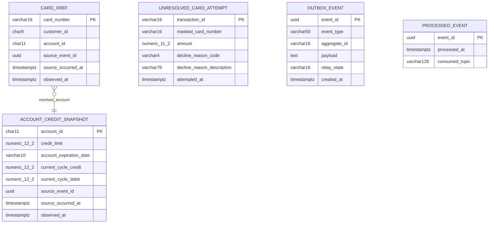
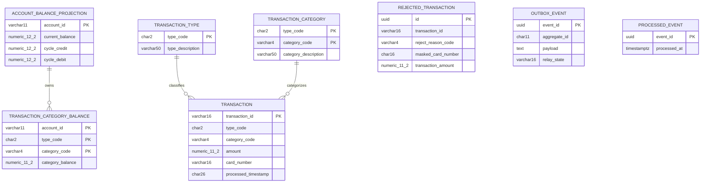
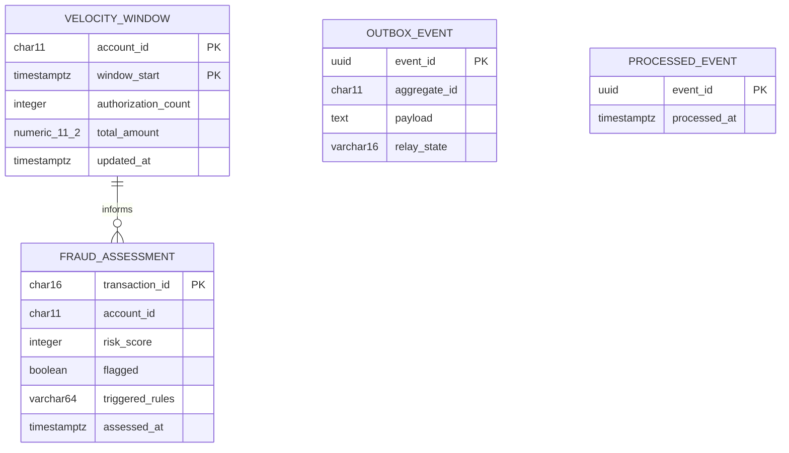
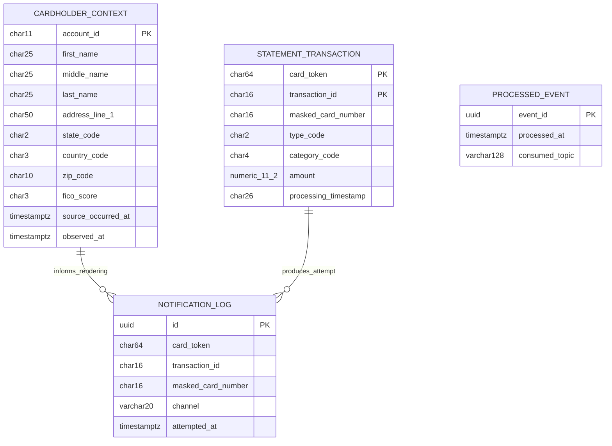
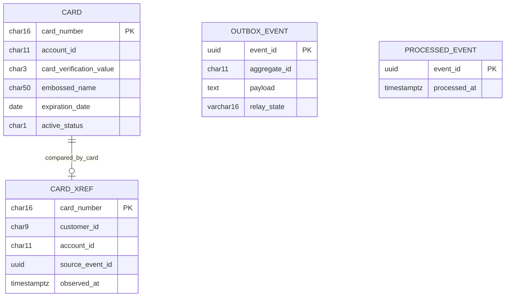

# Data Model

Each service owns a private PostgreSQL database and schema. No service reads another service’s tables. Column widths and scales derive from source Picture clauses and dataset keys. Paired system views live in [Architecture, Before and After](architecture-before-after.md), while storage rationale lives in the [decision log](decision-log.md).

## Derivation rules

| Source Picture clause | PostgreSQL type | Rule |
| --- | --- | --- |
| `PIC 9(n)` with at most 18 digits | `NUMERIC(n,0)`, `BIGINT`, or fixed-width text | Identifiers remain text when leading zeros are significant |
| `PIC X(n)` | `VARCHAR(n)` or `CHAR(n)` | Use `CHAR` where fixed-width padding is part of the stored contract |
| `PIC S9(10)V99` | `NUMERIC(12,2)` | Ten integer digits plus sign and two fractional digits |
| `PIC S9(09)V99` | `NUMERIC(11,2)` | Nine integer digits plus sign and two fractional digits |
| `PIC S9(04)V99` | `NUMERIC(6,2)` | Disclosure-group interest rate |

Primary keys derive from the corresponding IDCAMS `KEYS` parameter. The transaction-identifier sequence is the single exception because both source browse-and-increment paths race.

Trailing filler fields are dropped rather than modeled. The [traceability matrix](traceability-matrix.md) records every omitted filler and navigation field.

### Two date treatments

Card expiry uses `DATE`. `app/cbl/COCRDUPC.cbl:L115-L121` decomposes its ten characters into year, month, and day.

Account expiry remains `VARCHAR(10)`. `app/cbl/CBTRN02C.cbl:L414` compares it lexically with the first ten characters of a 26-character timestamp.

Both source values use year-month-day order, so lexical and calendar ordering normally agree. Converting account expiry to `DATE` would still change malformed or boundary input behavior.

## Service schemas

### Authorization database

**Figure 1 — Authorization credit and cross-reference projections with outcome infrastructure**

Figure 1 shows the two source-derived projections, the unresolved-card record, and the two additive messaging tables.

**Legend**

- Entity boxes are tables in `carddemo_authorization.authorization_service`.
- The relationship is a lookup relationship on `account_id`; the migration does not declare a foreign key.
- `CARD_XREF` and `ACCOUNT_CREDIT_SNAPSHOT` derive from source layouts and hold event freshness metadata.
- `UNRESOLVED_CARD_ATTEMPT`, `OUTBOX_EVENT`, and `PROCESSED_EVENT` are additive.

#### `card_xref`

| Copybook field | Picture clause and locator | Target column | Type | Note |
| --- | --- | --- | --- | --- |
| `XREF-CARD-NUM` | `PIC X(16)`, `app/cpy/CVACT03Y.cpy:L5` | `card_number` | `VARCHAR(16)` | Primary key from `app/jcl/XREFFILE.jcl:L43` |
| `XREF-CUST-ID` | `PIC 9(09)`, line 6 | `customer_id` | `CHAR(9)` | Leading zeros retained |
| `XREF-ACCT-ID` | `PIC 9(11)`, line 7 | `account_id` | `CHAR(11)` | Secondary index from `app/jcl/XREFFILE.jcl:L74` |
| `FILLER` | `PIC X(14)`, line 8 | — | — | Dropped |
| No source field | — | `source_event_id`, `source_occurred_at`, `observed_at` | UUID and timestamps | Additive projection provenance |

The populated fields total 36 bytes, matching `app/data/ASCII/cardxref.txt`. The declared 50-byte layout includes the omitted 14-byte filler.

#### `account_credit_snapshot`

| Copybook field | Picture clause and locator | Target column | Type |
| --- | --- | --- | --- |
| `ACCT-ID` | `PIC 9(11)`, `app/cpy/CVACT01Y.cpy:L5` | `account_id` | `CHAR(11)` |
| `ACCT-CREDIT-LIMIT` | `PIC S9(10)V99`, line 8 | `credit_limit` | `NUMERIC(12,2)` |
| `ACCT-EXPIRAION-DATE` | `PIC X(10)`, line 11 | `account_expiration_date` | `VARCHAR(10)` |
| `ACCT-CURR-CYC-CREDIT` | `PIC S9(10)V99`, line 13 | `current_cycle_credit` | `NUMERIC(12,2)` |
| `ACCT-CURR-CYC-DEBIT` | `PIC S9(10)V99`, line 14 | `current_cycle_debit` | `NUMERIC(12,2)` |
| No source field | — | `source_event_id`, `source_occurred_at`, `observed_at` | UUID and timestamps |

`AccountStateChanged` refreshes every source-derived column. The event marker and projection update commit together.

#### Outcome infrastructure

| Table | Provenance | Key point |
| --- | --- | --- |
| `unresolved_card_attempt` | Reason 0100 path in `CBTRN02C` plus additive capture | Uses transaction identifier because no account was resolved |
| `outbox_event` | Additive; source ancestor is `CORPT00C:L517-L519` | Migration V4 permits either an 11-digit account key or a 16-character transaction key |
| `processed_event` | Additive | Guards `AccountStateChanged` application |

### Ledger database

**Figure 2 — Ledger posting state, reference lookups, rejects, and messaging infrastructure**

Figure 2 shows the posting tables and the composite category-balance key.

**Legend**

- Entity boxes are tables in `carddemo_ledger.ledger_service`.
- Composite `PK` markers form one primary key.
- Relationship lines describe domain keys; migrations do not add cross-table foreign keys.
- `OUTBOX_EVENT` and `PROCESSED_EVENT` are additive messaging tables.

#### `transaction`

| Copybook field | Picture clause and locator | Target column | Type |
| --- | --- | --- | --- |
| `TRAN-ID` | `PIC X(16)`, `app/cpy/CVTRA05Y.cpy:L5` | `transaction_id` | `VARCHAR(16)` |
| `TRAN-TYPE-CD` | `PIC X(02)`, line 6 | `type_code` | `CHAR(2)` |
| `TRAN-CAT-CD` | `PIC 9(04)`, line 7 | `category_code` | `VARCHAR(4)` |
| `TRAN-SOURCE` | `PIC X(10)`, line 8 | `source` | `VARCHAR(10)` |
| `TRAN-DESC` | `PIC X(100)`, line 9 | `description` | `VARCHAR(100)` |
| `TRAN-AMT` | `PIC S9(09)V99`, line 10 | `amount` | `NUMERIC(11,2)` |
| `TRAN-MERCHANT-ID` | `PIC 9(09)`, line 11 | `merchant_id` | `VARCHAR(9)` |
| `TRAN-MERCHANT-NAME` | `PIC X(50)`, line 12 | `merchant_name` | `VARCHAR(50)` |
| `TRAN-MERCHANT-CITY` | `PIC X(50)`, line 13 | `merchant_city` | `VARCHAR(50)` |
| `TRAN-MERCHANT-ZIP` | `PIC X(10)`, line 14 | `merchant_zip` | `VARCHAR(10)` |
| `TRAN-CARD-NUM` | `PIC X(16)`, line 15 | `card_number` | `VARCHAR(16)` |
| `TRAN-ORIG-TS` | `PIC X(26)`, line 16 | `origin_timestamp` | `CHAR(26)` |
| `TRAN-PROC-TS` | `PIC X(26)`, line 17 | `processed_timestamp` | `CHAR(26)` |
| `FILLER` | `PIC X(20)`, line 18 | — | — |

The target stores a masked card value rather than the full source card field.

#### Balance and lookup tables

| Source layout | Fields | Target table and key |
| --- | --- | --- |
| `app/cpy/CVTRA01Y.cpy:L5-L9` | Account 11, type 2, category 4, balance `S9(09)V99` | `transaction_category_balance`; composite key `(account_id, type_code, category_code)` |
| `app/cpy/CVACT01Y.cpy:L5`, `L7`, `L13-L14` | Account, current balance, cycle credit, cycle debit | `account_balance_projection`; account primary key |
| `app/cpy/CVTRA03Y.cpy:L5-L6` | Type and 50-character description | `transaction_type`; 7 seeded rows |
| `app/cpy/CVTRA04Y.cpy:L6-L8` | Type, category, and description | `transaction_category`; 18 seeded rows |

#### `rejected_transaction`

`app/cbl/CBTRN02C.cbl:L176-L183` defines 350 bytes of transaction data plus an 80-byte reason trailer. `app/jcl/POSTTRAN.jcl:L36` confirms `LRECL=430`.

| Source element | Target column | Note |
| --- | --- | --- |
| Daily transaction identifier | `transaction_id` | Preserves the 16-character identifier |
| Failure reason and description | `reject_reason_code`, `reject_reason_description` | Four and 76 characters |
| Full card field | `masked_card_number` | Deliberately masked |
| Amount, type, category, merchant, origin time | Corresponding diagnostic columns | Minimum fields needed to explain or replay a refusal |
| No source field | `id`, `rejected_at` | Additive row key and observation time |

### Fraud database

**Figure 3 — Net-new fraud assessment and velocity state**

Figure 3 is entirely additive as business capability, while account and amount widths reuse source contracts.

**Legend**

- Entity boxes are tables in `carddemo_fraud.fraud_service`.
- No COBOL program defines fraud scoring, verdicts, or velocity windows.
- Transaction, account, and amount widths come from `CVTRA05Y.cpy` and `CVACT03Y.cpy`.
- `OUTBOX_EVENT` and `PROCESSED_EVENT` provide additive messaging guarantees.

| Table | Columns | Provenance |
| --- | --- | --- |
| `fraud_assessment` | Transaction, account, score, verdict, triggered rules, assessment time | Net new; transaction width from `CVTRA05Y:L5`, account width from `CVACT03Y:L7` |
| `velocity_window` | Account, window start, count, total amount, update time | Net new; amount precision from `CVTRA05Y:L10` |
| `outbox_event` | Event envelope, payload, relay state | Additive |
| `processed_event` | Event identifier, processing time, source topic | Additive |

### Notification database

**Figure 4 — Notification read model, cardholder context, attempts, and duplicate guard**

Figure 4 shows two private read models and an attempt log serving three listeners.

**Legend**

- Entity boxes are tables in `carddemo_notification.notification_service`.
- `STATEMENT_TRANSACTION` derives from the re-keyed statement layout, replacing the source PAN key with an irreversible card token.
- `CARDHOLDER_CONTEXT` is private, starts empty, and is refreshed by `CustomerContextChanged`.
- Relationship lines are domain associations rather than declared foreign keys.

#### `statement_transaction`

| Copybook field | Picture clause and locator | Target column | Type |
| --- | --- | --- | --- |
| `TRNX-CARD-NUM` | `PIC X(16)`, `app/cpy/COSTM01.CPY:L22` | `card_token`, `masked_card_number` | `CHAR(64)`, `CHAR(16)` |
| `TRNX-ID` | `PIC X(16)`, line 23 | `transaction_id` | `CHAR(16)` |
| `TRNX-TYPE-CD` | `PIC X(02)`, line 25 | `type_code` | `CHAR(2)` |
| `TRNX-CAT-CD` | `PIC 9(04)`, line 26 | `category_code` | `CHAR(4)` |
| `TRNX-SOURCE` | `PIC X(10)`, line 27 | `source` | `CHAR(10)` |
| `TRNX-DESC` | `PIC X(100)`, line 28 | `description` | `CHAR(100)` |
| `TRNX-AMT` | `PIC S9(09)V99`, line 29 | `amount` | `NUMERIC(11,2)` |
| Merchant fields | Lines 30-33 | Matching merchant columns | Fixed-width text |
| `TRNX-ORIG-TS` | `PIC X(26)`, line 34 | `origin_timestamp` | `CHAR(26)` |
| `TRNX-PROC-TS` | `PIC X(26)`, line 35 | `processing_timestamp` | `CHAR(26)` |
| `FILLER` | `PIC X(20)`, line 36 | — | — |

The source composite key is 32 bytes. `app/jcl/CREASTMT.JCL:L30` defines `KEYS(32 0)`, and line 53 sorts by card number then transaction identifier. The target key is 80 characters: a 64-character SHA-256 card token plus the 16-character transaction identifier. The masked card number is display data and never a key.

#### `cardholder_context`

| Source | Target columns | Note |
| --- | --- | --- |
| `app/cpy/CVACT03Y.cpy:L7` | `account_id` | Event and projection key |
| `app/cpy/CVCUS01Y.cpy:L6-L14` | Name and address columns | Ten renderer context fields use the projection |
| `app/cpy/CVCUS01Y.cpy:L22` | `fico_score` | Three-character display value |
| No source field | `source_occurred_at`, `observed_at` | Additive last-writer-wins provenance |

`CustomerContextChangedConsumer` populates the table. It applies no event older than the row's `source_occurred_at`.

#### Attempt and marker tables

| Table | Shape | Rule |
| --- | --- | --- |
| `notification_log` | UUID, card token, masked card, transaction, channel, attempt time | Stores metadata only, never a rendered body |
| `processed_event` | Event identifier, process time, consumed topic | Guards all three notification listener groups |

### Account database

**Figure 5 — Account, customer, disclosure, validation, and state-change infrastructure**

Figure 5 intentionally shows no relationship between `ACCOUNT` and `CUSTOMER`. The account copybook contains no customer identifier.

```mermaid
erDiagram
    ACCOUNT {
        char11 account_id PK
        char1 active_status
        numeric_12_2 current_balance
        numeric_12_2 credit_limit
        varchar10 expiration_date
        numeric_12_2 current_cycle_credit
        numeric_12_2 current_cycle_debit
    }
    CUSTOMER {
        char9 customer_id PK
        varchar25 first_name
        varchar25 last_name
        char9 social_security_number
        varchar10 date_of_birth
        numeric3 fico_credit_score
    }
    DISCLOSURE_GROUP {
        varchar10 account_group_id PK
        char2 transaction_type_code PK
        char4 transaction_category_code PK
        numeric_6_2 interest_rate
    }
    US_PHONE_AREA_CODE {
        char3 area_code PK
        varchar24 band
    }
    US_STATE_CODE {
        char2 state_code PK
    }
    US_STATE_ZIP_PREFIX {
        char4 state_zip_prefix PK
    }
    OUTBOX_EVENT {
        uuid event_id PK
        char11 aggregate_id
        text payload
        varchar16 relay_state
    }
    PROCESSED_EVENT {
        uuid event_id PK
        timestamptz processed_at
    }
```

**Legend**

- Entity boxes are tables in `carddemo_account.account_service`.
- No direct account-to-customer relationship exists because `CVACT01Y.cpy` carries no customer identifier.
- Customer resolution uses private cross-reference data in authorization and card services, not a cross-database foreign key.
- `OUTBOX_EVENT` publishes account state changes; `PROCESSED_EVENT` is additive infrastructure.

#### `account`

| Copybook field | Picture clause and locator | Target column | Type |
| --- | --- | --- | --- |
| `ACCT-ID` | `PIC 9(11)`, `app/cpy/CVACT01Y.cpy:L5` | `account_id` | `CHAR(11)` |
| `ACCT-ACTIVE-STATUS` | `PIC X(01)`, line 6 | `active_status` | `CHAR(1)` |
| `ACCT-CURR-BAL` | `PIC S9(10)V99`, line 7 | `current_balance` | `NUMERIC(12,2)` |
| `ACCT-CREDIT-LIMIT` | `PIC S9(10)V99`, line 8 | `credit_limit` | `NUMERIC(12,2)` |
| `ACCT-CASH-CREDIT-LIMIT` | `PIC S9(10)V99`, line 9 | `cash_credit_limit` | `NUMERIC(12,2)` |
| `ACCT-OPEN-DATE` | `PIC X(10)`, line 10 | `open_date` | `VARCHAR(10)` |
| `ACCT-EXPIRAION-DATE` | `PIC X(10)`, line 11 | `expiration_date` | `VARCHAR(10)` |
| `ACCT-REISSUE-DATE` | `PIC X(10)`, line 12 | `reissue_date` | `VARCHAR(10)` |
| `ACCT-CURR-CYC-CREDIT` | `PIC S9(10)V99`, line 13 | `current_cycle_credit` | `NUMERIC(12,2)` |
| `ACCT-CURR-CYC-DEBIT` | `PIC S9(10)V99`, line 14 | `current_cycle_debit` | `NUMERIC(12,2)` |
| `ACCT-ADDR-ZIP` | `PIC X(10)`, line 15 | `address_zip` | `VARCHAR(10)` |
| `ACCT-GROUP-ID` | `PIC X(10)`, line 16 | `group_id` | `VARCHAR(10)` |
| `FILLER` | `PIC X(178)`, line 17 | — | — |

The active-status column exists, but source posting never tests it. [Business-rule flag 4](business-rule-flags.md) records that deliberate non-addition.

#### `customer`

`app/cpy/CVCUS01Y.cpy` supplies 18 business fields, not 19.

| Source field group | Locators | Target columns | Types |
| --- | --- | --- | --- |
| Identifier | Line 5 | `customer_id` | `CHAR(9)` |
| First, middle, and last names | Lines 6-8 | `first_name`, `middle_name`, `last_name` | `VARCHAR(25)` |
| Three address lines | Lines 9-11 | `address_line_1`, `address_line_2`, `address_city` | `VARCHAR(50)` |
| State, country, ZIP | Lines 12-14 | `address_state_code`, `address_country_code`, `address_zip` | `CHAR(2)`, `CHAR(3)`, `VARCHAR(10)` |
| Two phone numbers | Lines 15-16 | `phone_number_1`, `phone_number_2` | `VARCHAR(15)` |
| Social Security Number | Line 17 | `social_security_number` | `CHAR(9)` |
| Government identifier | Line 18 | `government_issued_id` | `VARCHAR(20)` |
| Date of birth | Line 19 | `date_of_birth` | `VARCHAR(10)` |
| Electronic funds transfer account | Line 20 | `eft_account_id` | `VARCHAR(10)` |
| Primary-card indicator | Line 21 | `primary_card_holder_indicator` | `CHAR(1)` |
| FICO score | Line 22 | `fico_credit_score` | `NUMERIC(3,0)` |
| Filler | Line 23 | — | Dropped 168 bytes |

`CVCUS01Y.cpy` is canonical over `CUSTREC.cpy`; [business-rule flag 12](business-rule-flags.md) records the one-name fork.

#### Disclosure and validation references

| Source | Target | Key or count |
| --- | --- | --- |
| `app/cpy/CVTRA02Y.cpy:L6-L9` | `disclosure_group` | Group, type, category composite key; `NUMERIC(6,2)` rate |
| `CSLKPCDY.cpy` area codes | `us_phone_area_code` | 980 codes |
| `CSLKPCDY.cpy` state codes | `us_state_code` | 56 codes |
| `CSLKPCDY.cpy` state-ZIP combinations | `us_state_zip_prefix` | 240 combinations |

The three lists total 1,276 literals across the measured 1,318-line copybook.

### Card database

**Figure 6 — Card aggregate, private cross-reference replica, and mutation outbox**

Figure 6 shows the card record and its private cross-reference copy.

**Legend**

- Entity boxes are tables in `carddemo_card.card_service`.
- `CARD_XREF` is a private replica, not a shared table.
- The relationship supports consistency comparison and is not a declared foreign key.
- `OUTBOX_EVENT` publishes `CardUpdated`; `PROCESSED_EVENT` is reserved consumer infrastructure.

#### `card`

| Copybook field | Picture clause and locator | Target column | Type | Note |
| --- | --- | --- | --- | --- |
| `CARD-NUM` | `PIC X(16)`, `app/cpy/CVACT02Y.cpy:L5` | `card_number` | `CHAR(16)` | Primary key |
| `CARD-ACCT-ID` | `PIC 9(11)`, line 6 | `account_id` | `CHAR(11)` | Indexed, leading zeros retained |
| `CARD-CVV-CD` | `PIC 9(03)`, line 7 | `card_verification_value` | `CHAR(3)` | Never serialized |
| `CARD-EMBOSSED-NAME` | `PIC X(50)`, line 8 | `embossed_name` | `CHAR(50)` | Updated by card service |
| `CARD-EXPIRAION-DATE` | `PIC X(10)`, line 9 | `expiration_date` | `DATE` | Source spelling corrected |
| `CARD-ACTIVE-STATUS` | `PIC X(01)`, line 10 | `active_status` | `CHAR(1)` | Posting never reads it |
| `FILLER` | `PIC X(59)`, line 11 | — | — | Dropped |

#### `card_xref`

The three source fields map exactly as they do in authorization. Three additive freshness columns record the last event observation.

Card update cannot repair a missing cross-reference row because the card record has no customer identifier. The service counts and logs divergence without changing the source-equivalent update outcome.

## Key derivations from dataset definitions

| Dataset job | Source parameter | Locator | Target key or index |
| --- | --- | --- | --- |
| `ACCTFILE.jcl` | `KEYS(11 0)` and `RECORDSIZE(300 300)` | Lines 40-41 | Account primary key and row width |
| `CARDFILE.jcl` | `KEYS(16 0)` and `RECORDSIZE(150 150)` | Lines 54-55 | Card primary key and row width |
| `CARDFILE.jcl` alternate index | `KEYS(11 16)` | Line 85 | Card account index |
| `CUSTFILE.jcl` | Customer key and 500-byte record | Dataset definition | Customer primary key and row width |
| `XREFFILE.jcl` | `KEYS(16 0)` and `RECORDSIZE(50 50)` | Lines 43-44 | Card-number primary key and declared row width |
| `XREFFILE.jcl` alternate index | `KEYS(11,25)` | Line 74 | Account secondary index |
| `TRANFILE.jcl` | `KEYS(16 0)` and `RECORDSIZE(350 350)` | Lines 53-54 | Transaction primary key and row width |
| `TCATBALF.jcl` | `KEYS(17 0)` | Line 40 | Account, type, category composite key |
| `DISCGRP.jcl` | Composite disclosure key | Dataset definition | Group, type, category composite key |
| `TRANTYPE.jcl` | `KEYS(2 0)` | Line 40 | Transaction-type key |
| `TRANCATG.jcl` | `KEYS(6 0)` | Line 40 | Type and category key |
| `CREASTMT.JCL` | `KEYS(32 0)` and card-then-transaction sort | Lines 30 and 53 | Notification statement composite key |

`CARDAIX` and `CXACAIX` are alternate-index paths in the CICS resource file. `TCATBALF` and `DISCGRP` are batch-only and absent from that file.

## Dropped fields and recorded renames

| Source construct | Target handling |
| --- | --- |
| Account filler, 178 bytes | Dropped |
| Customer filler, 168 bytes | Dropped |
| Transaction filler, 20 bytes | Dropped |
| Cross-reference filler, 14 bytes | Dropped |
| Category-balance filler, 22 bytes | Dropped |
| Card filler, 59 bytes | Dropped |
| Communication Area navigation fields | Dropped with the terminal presentation |
| `ACCT-EXPIRAION-DATE` | Renamed to `expiration_date`, stored as `VARCHAR(10)` |
| `CARD-EXPIRAION-DATE` | Renamed to `expiration_date`, stored as `DATE` |

## Reference data

The account service seeds 980 telephone area codes, 56 state codes, and 240 state-ZIP prefixes from `CSLKPCDY.cpy`. The source file has 1,318 measured lines.

Ledger seeds seven transaction types from `CVTRA03Y.cpy` and 18 transaction categories from `CVTRA04Y.cpy`. Local seed copies avoid a shared table or another network service.

The legacy drawing at `diagrams/CARDDEMO-DataModel.drawio` was used only as a relationship cross-check. It remains unchanged.