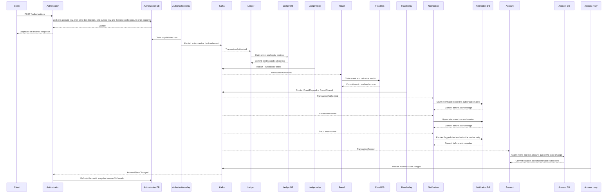
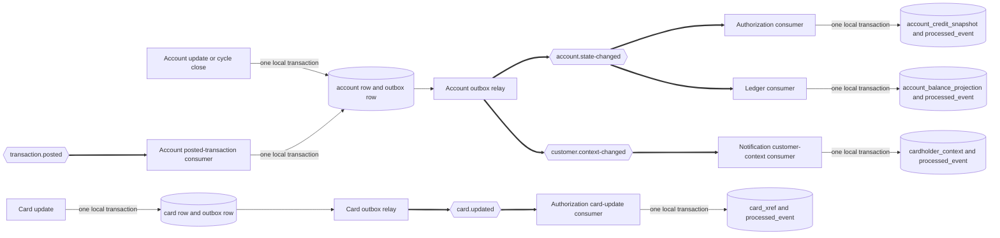
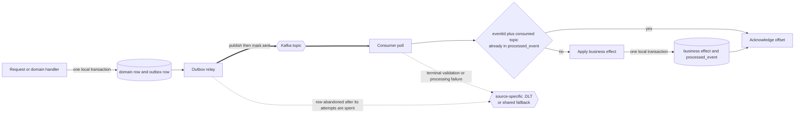

# Event Flow

This document follows every published event from commit through consumption. Every authorization request that reaches a decision persists one decision and publishes exactly one outcome event. Three of the four outcomes are keyed on the eleven-digit account they apply to.

The section on [the envelope](#the-envelope) says what the fourth is keyed on. A call whose card resolves no account is decided against no account, and its key is the sixteen-character transaction identifier this service minted for it.

Ledger, fraud, and notification react asynchronously, and no downstream service calls another downstream service. Paired legacy and target views live in [Architecture, Before and After](architecture-before-after.md), while rationale lives in the [decision log](decision-log.md).

## The envelope

Every event carries one flat envelope beside its payload. A consumer can route, validate, order, and deduplicate before interpreting business fields. Deduplicating is what keeps consumption idempotent, meaning a repeated event causes no repeated business effect.

| Field | Purpose |
| --- | --- |
| `eventId` | Durable idempotency value each consumer records beside the topic it arrived on, and the two together are the key |
| `eventType` | Routing discriminator and schema selector |
| `schemaVersion` | Contract version used to select the exact JSON Schema document |
| `occurredAt` | Producer timestamp |
| `aggregateId` | Kafka message key, the 11-digit account identifier on every event a producer writes |

The key always comes from something this platform issued or resolved. It never comes from a value a caller supplied. A reason-0100 decline follows a cross-reference read that resolved no account, so it has no eleven-digit subject. The account a caller declared in the request body is not one either: no stored row ties that value to the card presented. Its key is the sixteen-character identifier `transaction_id_seq` issued for the decision, which `schemas/transaction-declined-v2.json` requires.

Two reviews shaped that. A security review found an earlier revision using the declared account. A completeness review then found the refusal that replaced it publishing nothing for a call that must publish one event. `docs/decision-log.md` records both.

Reasons 0101, 0102 and 0103 each publish one event under `transaction-declined-v3`, keyed on the account the cross-reference resolved. Reason 0100 publishes one event under `transaction-declined-v2`, keyed on the transaction identifier. In every case one `authorization_decision` row names the event and both commit in one transaction. `ck_outbox_event_aggregate_id` admits both key widths, and `outbox/OutboxWriter` is what holds each contract to the one width its document declares — the account form for every contract but that one.

## Payload conventions

Money travels as a two-place decimal string, never as a JSON number. A decimal string prevents a client from silently changing fixed-point money into binary floating point.

The account identifier is the Kafka key whenever an account is known. A Kafka partition is an ordered shard of a topic, so one account’s ledger updates stay ordered. Every topic runs three partitions at replication factor one in the demo configuration.

Each consuming service reads those three partitions on three threads, from `spring.kafka.listener.concurrency`. That is a throughput setting and not an ordering one. Kafka assigns a partition to exactly one consumer of a group, so a thread never shares a partition and one account's events are never applied out of order. What the threads remove is the wait one account used to serve on another account's behalf. The relay side works the same way and for the same reason, described under [delivery mechanics](#delivery-mechanics).

Card-number masking is an addition, because no masking exists anywhere in the source. The order matters. The full 16-character card number performs the cross-reference lookup first, exactly as the source does, and masking happens only at the serialization boundary. Masking before that lookup would break every authorization. Events, responses, logs, and notification keys therefore carry only the masked display form or the irreversible 64-character card token.

A card token travels in two events and is stored by three services, and only the card service holds a card number. `TransactionAuthorized` and `TransactionPosted` carry `cardToken`, and the notification read model is keyed on it. A card-token key change therefore renames every card in a store that cannot re-derive its own rows. The card service refuses to rewrite a token it derived unless an operator states the rotation, and each rewrite leaves a mapping row the other stores are re-keyed from. `card-platform/services/card-service/README.md` carries that procedure and its rollback.

The card verification value at `app/cpy/CVACT02Y.cpy:L7` is three numeric digits, and only the card service stores it. No event, no log entry, and no application programming interface response carries it. `CardholderDataExposureTest` asserts that, so the guarantee is tested rather than merely claimed.

An event is bounded at 8,192 bytes, from `EventWireBounds.MAX_EVENT_BYTES`. A payload above that is refused before its outbox row is written, so the whole publish rolls back and nothing reaches a topic.

Four transport ceilings sit above that envelope, each above the one below. A producer request is bounded at 16,384 bytes and a broker record at 32,768. A partition fetch is bounded at 65,536 bytes and a whole fetch at 262,144.

The gaps carry record overhead, compression and batching, so an event inside the envelope always fits and one far outside it is refused twice. `KafkaDeliveryGuaranteeContractTest` reads all five figures out of the shipped files and holds the ladder in order.

## Topics and consumer groups

The delivered runtime creates seven business topics, six source-specific dead-letter topics, and one shared fallback, fourteen names in all. A dead-letter topic holds records that could not complete processing after validation and retry handling. A consumer group is the named set of listener instances that share one subscription.

| Topic | Events carried | Producer | Consumer groups |
| --- | --- | --- | --- |
| `transaction.authorized` | `TransactionAuthorized` | authorization-service | `ledger-posting`, `fraud-detection`, `notification-authorized` |
| `transaction.declined` | `TransactionDeclined` versions 1, 2 and 3 | authorization-service | `ledger-reject` |
| `transaction.posted` | `TransactionPosted` versions 1 and 2 | ledger-posting-service | `account-posted`, `notification-posted` |
| `fraud.assessed` | `FraudFlagged`, `FraudCleared` | fraud-detection-service | `notification-fraud` |
| `account.state-changed` | `AccountStateChanged` | account-service | `authorization-account-state`, `ledger-account-state` |
| `customer.context-changed` | `CustomerContextChanged` | account-service | `notification-customer` |
| `card.updated` | `CardUpdated` version 2 | card-service | `authorization-card-updated` |
| `<source>.DLT` | 134-character fixed-width abend diagnostic | Ledger, fraud, and notification listener error handlers | Human inspection and replay tooling |
| `carddemo.dead-letter` | `DeadLetterEnvelope` | Authorization and account listener error handlers, the five business-event relays on abandonment, and any handler whose source topic cannot be resolved | Human inspection and replay tooling |

The six source-specific dead-letter topics are `transaction.authorized.DLT`, `transaction.declined.DLT`, `account.state-changed.DLT`, `transaction.posted.DLT`, `fraud.assessed.DLT`, and `customer.context-changed.DLT`. Each belongs to a source the ledger, fraud or notification listeners read, because those three append the configured suffix to the source topic. `card.updated` needs none: its one consumer is an authorization listener, and authorization and account both route a spent record to the shared fallback as a governed envelope instead.

Eleven groups serve eleven listeners across five listening services. Authorization takes two for its replicas, `authorization-account-state` and `authorization-card-updated`. Ledger takes **three**: `ledger-posting` for the authorization stream, `ledger-reject` for the declined stream, and `ledger-account-state` for its balance replica. Fraud takes one, notification four for four independent inputs, and account one for the posted amount it applies. The card service registers no listener.

Three of those eleven groups read `transaction.authorized`, which is the fan-out the requirements set a floor on. The group names alone show it: `ledger-posting`, `fraud-detection`, and `notification-authorized` each hold their own offsets. None of the three can slow, block, or starve another.

`FraudFlagged` and `FraudCleared` share `fraud.assessed`. The envelope’s `eventType` distinguishes them before notification applies verdict-specific behavior.

## Business events

### `TransactionAuthorized`

The authorization service publishes `TransactionAuthorized` after an approval commits with its outbox row, a row in the service's own database that holds the event until publication.

| Field | Source or status |
| --- | --- |
| `transactionId` | `TRAN-ID`, `app/cpy/CVTRA05Y.cpy:L5` |
| `accountId` | `XREF-ACCT-ID`, `app/cpy/CVACT03Y.cpy:L7` |
| `transactionTypeCode` | `TRAN-TYPE-CD`, `app/cpy/CVTRA05Y.cpy:L6` |
| `merchantCategoryCode` | `TRAN-CAT-CD`, `app/cpy/CVTRA05Y.cpy:L7` |
| `source` | `TRAN-SOURCE`, `app/cpy/CVTRA05Y.cpy:L8` |
| `description` | `TRAN-DESC`, `app/cpy/CVTRA05Y.cpy:L9` |
| `amount` | `TRAN-AMT`, `app/cpy/CVTRA05Y.cpy:L10` |
| Merchant fields | `app/cpy/CVTRA05Y.cpy:L11-L14` |
| `maskedCardNumber` | Masked form of `TRAN-CARD-NUM`; additive security boundary |
| `authorizedAt` | `TRAN-ORIG-TS`, `app/cpy/CVTRA05Y.cpy:L16` |
| `currency` | Additive constant `USD`; no source transaction field carries currency |

`ledger-posting` applies source posting arithmetic. `fraud-detection` calculates a new risk verdict. `notification-authorized` records the authorization against the card-keyed read model so a cardholder alert exists before posting completes. None of the three blocks the HTTP response, and none of them reads another's output.

### `TransactionDeclined`

A declined request is expected traffic, not an infrastructure error. `app/cbl/CBTRN02C.cbl:L230` sets return code 4 when any batch input is rejected.

| Wire code | Source description | Assignment |
| --- | --- | --- |
| `0100` | `INVALID CARD NUMBER FOUND` | `app/cbl/CBTRN02C.cbl:L385-L387` |
| `0101` | `ACCOUNT RECORD NOT FOUND` | `app/cbl/CBTRN02C.cbl:L397-L399` |
| `0102` | `OVERLIMIT TRANSACTION` | `app/cbl/CBTRN02C.cbl:L410-L412` |
| `0103` | `TRANSACTION RECEIVED AFTER ACCT EXPIRATION` | `app/cbl/CBTRN02C.cbl:L417-L419` |

Version 1 carries the account identifier and the reason, and is retained rather than published. Version 2 was released for reason 0100 alone. It omits the account the read had not resolved and keys on the transaction identifier, and it is the one document that reason travels under.

Version 3 carries version 1's properties plus the nine descriptive values of the daily transaction record. Those sit at the same widths `transaction-posted-v2` uses, so one parser reads both, and reasons 0101, 0102 and 0103 travel under it. Two versions therefore have a producer, one per subject a decision can have.

Version 3 exists because of what the source writes on this path. `2500-WRITE-REJECT-REC` at `app/cbl/CBTRN02C.cbl:L446-L465` writes 430 bytes: `REJECT-TRAN-DATA PIC X(350)`, which is the whole daily record, followed by an 80-byte trailer holding the reason code and its text. A consumer reading only the reason code cannot reproduce those 350 bytes, and the values are not recoverable from any table, because a refused transaction posted nowhere.

`ledger-reject` is the consumer group that turns each published decline into one row of `rejected_transaction`. That row and the marker recording the event commit in one local transaction, so neither can exist without the other. The ledger publishes nothing on this topic, because the authorization service is the sole writer of the decision. A second decline for one refusal would put two differently shaped events for it on a topic the ledger reads.

A decline arriving at version 1 or 2 is acknowledged with no row written. Neither version carries the nine values the 350 bytes need, and inventing them would break equivalence. For version 1 that means a record published before version 3 existed. For version 2 it means every reason-0100 decline.

Those values are absent rather than withheld: they describe a transaction the read rejected, so they exist only on the request. `rejected_transaction` declares no account column either, so the row that is not written could not have named a subject. All 38 reject records the fixture `app/data/ASCII/dailytran.txt` produces carry reason `0102` and travel at version 3, and each earns its row.

Reason 109 at `app/cbl/CBTRN02C.cbl:L556` is not a decline event. The source never checks it, while the target treats the condition as a processing failure; [business-rule flag 9](business-rule-flags.md) records the change.

### `TransactionPosted`

The ledger publishes `TransactionPosted` from its outbox after transaction, category-balance, and account-balance writes commit.

Version 1 contains transaction identifier, account identifier, amount, masked card, new balance, and posting time. Version 2 adds nine descriptive fields required by the notification read model.

| Version 2 detail | Provenance |
| --- | --- |
| `transactionTypeCode` | Authorized event value from `TRAN-TYPE-CD` |
| `merchantCategoryCode` | Authorized event value from `TRAN-CAT-CD` |
| `source` and `description` | Authorized event transaction text |
| Merchant identifier, name, city, and ZIP | Authorized event merchant fields |
| `originTimestamp` | Authorized event origin timestamp |

The new balance is the value after `app/cbl/CBTRN02C.cbl:L547`. Notification inserts no statement row for a version 1 event rather than fabricating the missing columns, and it no longer refuses the delivery either. The record is acknowledged and counted on `carddemo.notification.events.unapplied`. What a version 1 delivery cannot supply is the card token the read model is keyed on, plus nine of its fourteen column values. Neither is recoverable from the masked card number, which has discarded twelve of the sixteen digits the token derivation reads.

The processing timestamp carries two significant fractional digits and four zeros. [Business-rule flag 8](business-rule-flags.md) and the [equivalence results](equivalence-results.md) define the comparison tolerance.

Two groups read this topic, for unrelated reasons. `notification-posted` inserts a statement row. `account-posted` adds the amount to the account record, reproducing `app/cbl/CBTRN02C.cbl:L545-L560`: the balance moves, and the amount reaches `current_cycle_credit` when it is not negative and `current_cycle_debit` when it is.

That second group is what makes the two accumulators move at all. `ACCTDAT` was one dataset in the source, so the posting program at `:L545-L560` and the credit-limit test at `:L403-L413` read and wrote the same record. Here that record is split across three services that may not call one another. This event is the only path from the writer to the copy the account service owns.

Without it the accumulators stayed at their seeded values. The credit-limit rule then tested one amount against the limit instead of cumulative cycle exposure. Meanwhile `GET /accounts/{id}` reported the balance as it stood at deployment, and `GET /balances/{id}` reported the posted one. Neither raised anything.

The account listener applies the amount and never the event's `newBalance`. A balance copied across a service boundary is a value with two owners. An amount applied to a locally held balance keeps one owner, and it stays correct under redelivery because the marker suppresses the repeat. The arithmetic itself never has to be idempotent.

### `FraudFlagged`

`FraudFlagged` is additive in full, because the repository holds no fraud module of any kind: no scoring, no pattern analysis, no velocity checking, and no rules engine. It carries transaction and account identifiers, a score, triggered rule identifiers, and assessment time.

The notification fraud listener renders an alert with its private cardholder projection. It writes no `notification_log` row: that table keys a row by card token and masked card number, and a fraud assessment carries neither. The rendered text is returned to the listener, which discards it, because this service reaches no mail, message, webhook or push gateway.

### `FraudCleared`

`FraudCleared` is also additive in full. It carries transaction and account identifiers plus assessment time.

The notification listener acknowledges a valid cleared event without rendering an alert. The listener accepts `Object` first because the cleared payload is structurally narrower than the flagged payload.

### `AccountStateChanged`

The account service publishes `AccountStateChanged` after any committed change to the account record: an update, a cycle close, or a posted amount applied by the `account-posted` group. An update publishes it only when the account record itself changed — one that raises a credit limit publishes it, one that changes only an address publishes `CustomerContextChanged` instead. The event carries the complete authorization credit snapshot.

A posting is a state change to `ACCTDAT` in the source too, where `app/cbl/CBTRN02C.cbl:L554` rewrites the account record. So the publication rule this service follows, that it publishes only on a state change, holds unchanged.

| Field | Authorization target in `account_credit_snapshot` | Ledger target in `account_balance_projection` |
| --- | --- | --- |
| `accountId` | `account_id` | `account_id` |
| `creditLimit` | `credit_limit` | Not held; the ledger evaluates no limit |
| `currentCycleCredit` | `current_cycle_credit` | `cycle_credit` |
| `currentCycleDebit` | `current_cycle_debit` | `cycle_debit` |
| `expirationDate` | `account_expiration_date` | Not held; the ledger tests no expiry |
| `changeKind` | Explains whether an update or cycle close produced the event | Same |
| Envelope `eventId` and `occurredAt` | `source_event_id`, `source_occurred_at` | `source_event_id`, `source_occurred_at` |

Both groups apply the snapshot monotonically: a change whose `occurredAt` is not after the stored value discards itself rather than moving a cycle balance backwards. Each stores its event marker in the same transaction as the projection write.

The authorization group does one thing more. Its statement releases the exposure that decision reserved, by the advance this event reports on the matching accumulator. It clears the reservation outright when an accumulator moves the other way, which only a cycle close does. That is why an approval taken before this event arrives is counted once rather than twice. The decision reserved it, and this event replaces the reservation with the authoritative figure that now contains it.

Authorization then reads its local projection and calls no account service during a decision. The ledger consumes the same event for a different reason. `V2__seed.sql` loaded a projection row per fixture account, and nothing else told that table when the account service moved the original. So without this consumer, an account opened after deployment had no row at all, and a billing cycle closed at `app/cbl/CBACT04C.cbl:L353-L354` never reached the ledger's copy of the two accumulators.

A posting is a delta the ledger owns, so it advances neither provenance column. Clearing them would let an already-applied change apply twice.

The event a posting produces closes the loop the credit-limit rule depends on. `transaction.posted` carries the amount to the account service, which applies it and publishes the moved accumulators here. The `authorization-account-state` group then writes them into the snapshot reason code 102 reads.

The ledger ignores the value columns of that particular event by design, and `ledger-posting-service` documents why. It applied the same amount itself a moment earlier. Taking the account service's copy would overwrite a correct value with a stale one, behind by every posting the account service has yet to hear about.

The chain therefore has one writer per copy. The ledger writes its own projection from the authorization event. The account service writes its record from the posted event, and the authorization replica takes only what the account service publishes.

### `CustomerContextChanged`

The account service publishes `CustomerContextChanged` when the customer record changes beside an account update, and not when the update left it as it stood. It carries the ten name, address, country, postal-code, and credit-score fields the source statement renderer reads.

The comparison that decides both publications is the one `app/cbl/COACTUPC.cbl:L1684-L1768` draws, applied to each record on its own rather than to the pair. The two rewrites at `:L4066` and `:L4086` run unconditionally, each writing back the values the caller submitted. A record whose submitted values equal its fetched values is therefore rewritten with what it already held, and it has no change to announce. Reaching those rewrites requires the submitted pair to differ from the fetched pair, so every committed write publishes at least one of the two events.

The `notification-customer` group applies the event to `cardholder_context` and stores the duplicate marker in the same local transaction. A producer timestamp prevents an older or replayed event from moving the projection backwards.

### `CardUpdated`

The card service publishes `CardUpdated` after a successful card update, at version 2, which carries account identifier, masked card number, expiry, and active status. Version 1 stays governed and on the classpath as compatibility history. It is the released document a record retained on the topic under it validates against, and it additionally required the embossed cardholder name. That name now stays on the synchronous card surface and reaches no consumer, which is the one non-additive step in this chain and is recorded in `contracts/released-contracts.json` under `nonAdditiveOver`.

The `authorization-card-updated` group uses the account identifier and visible card suffix to refresh the matching local cross-reference observation. It changes no card-to-account field, because the event carries no full card number or customer identifier.

## Authorization transaction flow

**Figure 1 — One authorization call and the asynchronous reactions it starts**

Figure 1 separates the synchronous response from every later consumer action. Ledger, fraud, and notification each read the one authorization event directly and independently. Notification additionally reacts to posted and fraud events rather than calling either producer.

**Legend**

- Solid request arrows before the client response are synchronous.
- Arrows through Kafka are asynchronous and occur after the authorization response.
- Each database response marked `Commit` closes one local transaction.
- A declined authorization publishes only `TransactionDeclined`; no consumer receives an authorized event. The ledger consumes that decline under `ledger-reject` and writes one reject row.
- A card resolving no cross-reference row is decided against no account: one decision row, one event under `transaction-declined-v2`, keyed on the minted transaction identifier.
- Ledger, fraud, notification, and account share no direct call edge.
- Three arrows carry `TransactionAuthorized` out of Kafka, one per independent consumer group.
- Two arrows carry `TransactionPosted` out of Kafka, to notification and to account.
- The last four arrows are the cycle-accumulator chain. They start at a posted amount and end at the snapshot the credit-limit rule reads, so cumulative cycle exposure reaches the next authorization without any consumer calling another service.

## State-change projection flow

**Figure 2 — State changes refreshing authorization and notification projections**

Figure 2 shows the state paths that replace synchronous owner-service lookups. One `account.state-changed` event feeds two independent replicas: authorization's credit snapshot and the ledger's balance projection. Card updates refresh only authorization's observation metadata, and customer-context changes refresh notification's renderer context.

Three things produce `account.state-changed`, not two. An update and a cycle close both arrive through the web surface. A posted amount arrives on `transaction.posted` instead, and it is the one path that runs with no request behind it. Figure 2 draws that third path because the credit-limit rule reads what it writes. Without it the two accumulators in the snapshot never move, and reason code 102 tests one amount against the limit instead of cumulative cycle exposure.

**Legend**

- A cylinder naming two tables means both rows commit in one local transaction.
- Thick arrows cross Kafka.
- `account.state-changed` has two consumer groups, `authorization-account-state` and `ledger-account-state`, so each replica advances on its own offsets.
- `transaction.posted` reaches the account service under `account-posted`, its own group, so the notification service reading the same topic still receives every record.
- The account row has two writers and they write different things. A request writes the submitted values. The posted-transaction consumer adds an amount to the balance and to one of the two accumulators. Both queue one outbox row, so both reach the authorization snapshot by the same path.
- `card.updated` has the `authorization-card-updated` consumer group.
- `customer.context-changed` has the `notification-customer` consumer group.
- Every replica applies a snapshot monotonically against the producer timestamp, so an older or replayed event cannot move a projection backwards.

## Delivery mechanics

The outbox exists so no service has to write its database and the broker in one step. A handler commits the business change and the event row together, and a relay publishes those committed rows afterwards. That single-transaction property is the whole guarantee: a committed change always has an event waiting for it, and an uncommitted one leaves nothing behind.

The outbox, the `processed_event` marker, and the dead-letter route are additions rather than translations. The source detects no duplicates, and it rolls back none of its three posting writes, so the last two have no counterpart in it. Only the outbox has a source ancestor, named at the end of this document.

The demo relay checks every 500 milliseconds and claims at most 100 rows. Producers enable idempotence and require acknowledgements from all broker replicas. Those four values are configuration, not measured limits.

Kafka delivery is at least once. Rebalances, restarts, or a crash after side effects but before offset commit can deliver the same event again.

**Publication is also at least once, and the producer window bounds how often a duplicate occurs.** The database marks a relay row published one time only. `published` and `published_at` move after the broker acknowledges the send. A topic can still carry a second copy of one `eventId`.

A relay tick bounds itself, so a broker that accepts a connection and never answers cannot hold the scheduled thread. A tick that gave up on a send the producer still held left that record to arrive up to two minutes later, while the tick's retry published another copy. All five relays close that window. `max.block.ms` plus `delivery.timeout.ms` stays below `carddemo.outbox.relay.max-duration-ms` in every one of them, and a relay waits out a send it has already issued.

Every relay divides one pass into several transactions, and the division is the guarantee rather than a detail. One transaction claims the due rows and commits; the sends run under no transaction at all; each result is written in a short transaction of its own.

A single transaction spanning the pass held a connection and every row lock of the batch for the sum of its broker waits. It also rolled its own claim back when the process died. That is precisely the case the stranded-claim recovery was written for, and one it could therefore never observe. Four relays worked that way until a performance review; the authorization relay had the division already, and now all five do.

Every claim query returns the due head row of each account, so recording results separately cannot reorder one account's events. One unpublishable row delays its own account rather than the whole table. A row the relay has abandoned releases its account, so a terminal row cannot wedge the stream it was part of. A pass issues the sends of distinct accounts together, up to the producer's own in-flight window of five, and waits for them against the one deadline the pass already had. One account therefore never waits for another to be published, which is the only serialization per-account ordering ever required.

`ix_outbox_event_aggregate_head` is the partial index that claim reads, and each of the five schemas ships it. All five producing services carry the clause, and each proves it against a real database rather than inheriting it by convention.

One duplicate path is not a platform choice. A broker that has already appended a record can lose the acknowledgement. The producer then reports a failure the log does not share, and the next attempt appends a second copy. No producer setting removes that, and `enable.idempotence` does not either, because the two copies come from two `send` calls carrying their own sequence numbers. Both copies carry the same `eventId`, so every consumer's `processed_event` marker suppresses the second one.

Nothing expires a claim. A horizon once deleted one 720 hours after it was written, checked at start-up against twice the broker's own log retention. A security review found that the relationship bounds only how long the broker can redeliver. An archived, restored or deliberately replayed record arrives from further away, and every effect a claim guards outlives that window. A claim and the effect it guards commit in one local transaction in one database, so a consistent backup and a consistent restore carry both or neither.

Each service proves it. A claim stamped two thousand days back still refuses its redelivery, and no store on this platform exposes a way to remove one. The [decision log](decision-log.md) records what was weighed, and [suggested next tasks](suggested-next-tasks.md) carries the work of bounding what a permanent claim costs.

Each consumer claims `processed_event` by the pair `(event_id, consumed_topic)`, performs its work, and commits the marker with the effect. A second delivery of that event on the same topic finds the marker and changes nothing.

The consumed topic is part of the key in all six services, and `V*__processed_event_topic_key.sql` is the migration that put it there. The reason is that each producing service assigns event identifiers independently. One identifier can therefore arrive on two topics carrying two unrelated events. Keyed on the identifier alone, the second event loses the claim to the first and is dropped in silence. A marker written before that migration carries the sentinel `(no topic header)`, which no Kafka topic name can equal.

Auto-commit is disabled. Manual acknowledgement occurs only after the database transaction commits. Without that ordering the duplicate guard is decorative, because an offset committed early lets a crash skip work that never happened.

A record no attempt can apply is the one case that ordering does not cover, and every error handler commits its offset once the diagnostic is published. The listener method threw, so it acknowledged nothing. An uncommitted offset means the next assignment reads the same record, retries it to exhaustion again, and publishes a second diagnostic for one set of coordinates. That repeats indefinitely, because nothing about the record changes between passes.

The acknowledgement mode is `MANUAL_IMMEDIATE` in all five consuming services, and each one refuses to start under any other mode. Only that mode commits the offset at the acknowledgement a listener issues, and only that mode commits the offset of a record the dead-letter route has published. Under `MANUAL` the framework reports the recovered-offset setting as ignored, so a spent record would be dead-lettered again after every restart or rebalance. `spring.kafka.listener.ack-mode` is bindable from the environment, so the requirement is a start-up check rather than a comment.

The demo permits three processing attempts with a one-second backoff. Two terminal routes exist, and which one a failure takes depends on what failed.

### The two dead-letter wire forms

Two wire forms reach a dead-letter topic, and which topic carries which is fixed rather than incidental. `schemas/dead-letter-v1.json` governs the shared fallback topic only, and points here for the other form.

| Form | Topics | Written by | Bytes |
| --- | --- | --- | --- |
| `DeadLetterEnvelope` as JSON | `carddemo.dead-letter` | `authorization-service` and `account-service` listener error handlers, and all five relays on abandonment | The governed document, validated before publication |
| Fixed-width abend diagnostic | `<source>.DLT` | `ledger-posting-service`, `fraud-detection-service` and `notification-service` listener error handlers | Exactly 134 printable ASCII characters |

The fixed-width form concatenates the four fields of `app/cpy/CSMSG02Y.cpy:L21-L29` at their declared widths, space-padded and in source order: `ABEND-CODE PIC X(4)`, `ABEND-CULPRIT PIC X(8)`, `ABEND-REASON PIC X(50)` and `ABEND-MSG PIC X(72)`. Those four widths sum to 134. Every character outside printable ASCII is replaced before padding, so one character is one byte and a component can be shortened without splitting anything. `DeadLetterMetadata.toFixedWidthRecord` in each of those three modules renders it, and `KafkaDeliveryGuaranteeContractTest` holds each module to one form and to that layout.

Tooling reads one parser per topic, not one for the platform. A reader generating a consumer from the JSON Schema gets the shared fallback topic; a reader of a `<source>.DLT` topic reads fixed-width positions.

A spent consumer record takes the listener route, and the five listening services take it in two different forms. Ledger, fraud, and notification send a 134-character fixed-width abend diagnostic to the source topic name plus the `.DLT` suffix, short for dead-letter topic. Each falls back to `carddemo.dead-letter` when the source topic cannot be resolved. Authorization and account each send a governed `DeadLetterEnvelope` to `carddemo.dead-letter` directly.

The account listener is worth naming on its own, because its recovery semantics differ from authorization's. `TransactionPostedConsumer` on group `account-posted` retries a failure under the shared retry policy, then hands the record to a sanitizing recoverer that publishes one `DeadLetterEnvelope` and nothing the record carried. Its error handler sets `commitRecovered(true)`, so the offset advances once the diagnostic is away and the same poison record is not redelivered forever.

All five listening services do that: account, authorization, fraud, ledger and notification. What differs is the destination rather than the offset. Account and authorization publish one `DeadLetterEnvelope` to the shared `carddemo.dead-letter` topic, so a refused record's own bytes never travel. Ledger, fraud and notification address the source topic plus the configured suffix, so one stream carries one source wire shape.

A spent outbox row takes the producer route, and all five relays now take it. Each publishes one governed `DeadLetterEnvelope` naming the row it gave up on. An event no consumer will ever see is therefore a message on the dead-letter topic rather than one more warning line.

The diagnostic is published inside the sweep that abandons the row and waited for. Every row can be named this way, whichever key it carries. A diagnostic declares the account identifier where the row has one and `00000000000` where it does not, a substitution this section explains below.

Neither form republishes the failed payload, the failed key, or any inbound header outside a fixed allowlist. A poison record therefore cannot carry a card number or a card verification value onto a dead-letter topic. Malformed schema input reaches the same sanitized route without unsafe business processing.

An abandoned outbox row takes the relay route. Five relays publish business events: authorization, ledger, fraud, account, and card. Notification has none, because it publishes nothing. Each sends a governed `DeadLetterEnvelope` to `carddemo.dead-letter` once a row is spent. A change that can never be published therefore still leaves a durable diagnostic, naming the row, the event type, the attempt count, and the reason.

Three of the five relays record that diagnostic as an obligation rather than attempting it once: authorization, account and fraud detection. Abandoning a row writes `dead_letter_state = 'REQUIRED'` in the same transaction that abandons it, and the state moves to `PUBLISHED` only once the broker has acknowledged the diagnostic. The ledger and card relays instead publish inside the transaction that abandons the row, so a refusal rolls the abandonment back and the row returns to the claim query unchanged. Both models are recorded in the [decision log](decision-log.md), and extending the durable form to the remaining two is a [next task](suggested-next-tasks.md).

This matters because an abandoned row is terminal, and the claim query never returns it again. A diagnostic dispatched at the moment of abandonment and not awaited leaves an unreachable broker looking exactly like a healthy one. A refused diagnostic is offered again at the head of every later pass, for as long as it takes.

A diagnostic for a row keyed by a transaction identifier travels under the aggregate identifier `00000000000`, because `schemas/dead-letter-v1.json` accepts eleven digits and such a key holds sixteen characters. `failedEventId` still names the row exactly. One producer writes such a row, the reason-0100 decline that `V24__unresolved_card_decline_is_decided.sql` records, and the substitution serves it as well as rows stored under earlier revisions. The same `00000000000` is the key of every diagnostic a deserializer refused, for the same reason: a record that never deserialized names no account.

Each terminal outcome increments a counter distinct from the per-attempt failure counter, so retries and permanently spent work are never summed together.

Kafka transactions do not make a database write atomic with a broker write. The platform still needs an outbox on producers and a marker transaction on consumers.

**Figure 3 — Transactional outbox and idempotent consumer mechanics**

Figure 3 identifies the two local transaction boundaries and the duplicate guard.

**Legend**

- Each cylinder naming two tables represents one local database transaction.
- The diamond is the durable duplicate check that makes redelivery harmless. It is keyed on the event identifier together with the topic the delivery arrived on, which is the primary key of `processed_event`.
- Acknowledgement follows the consumer transaction and never precedes it.
- The dotted arrows are the two terminal dead-letter routes: a spent consumer record, and an abandoned outbox row.

## Failure counters and their discriminators

Every service separates a per-attempt failure count from a per-record or per-row terminal count, so a retry and a permanently spent unit of work are never summed together. The series names and the tag that discriminates each one differ by service, because each service counts what its own pipeline distinguishes. The names are listed here so a query can be written without reading the code.

| Service | Failure series, one increment per failed attempt | Terminal series, one increment per record or row given up on |
|---|---|---|
| notification | `carddemo.notification.failures`, tagged `failure.kind`: `schema_validation`, `deserialization`, `persistence`, `rendering`, `unknown` | `carddemo.notification.records.dead.lettered`, tagged `failure.kind` with the same values |
| ledger | `carddemo.ledger.failures`, tagged `stage`: `deserialize`, `process`, `publish`, `abandon` | `carddemo.ledger.dead.letters`, tagged `outcome`: `published`, `failed`, and `failure.kind`: `schema_validation`, `deserialization`, `processing`, `unknown`. The two dimensions answer different questions: what became of the diagnostic, and what the record failed at |
| fraud | `carddemo.fraud.failures`, tagged `stage`: `deserialize`, `process`, `publish` | `carddemo.fraud.dead.letters`, tagged `outcome`: `published`, `failed` |
| authorization | `carddemo.authorization.failures`, tagged `stage`: `persist`, `publish`, `replica`, `entitlement` — the exact four values `config/ObservabilityConfig` registers, and no other value is produced | `carddemo.authorization.outbox.abandoned` counts a row given up on, and `carddemo.authorization.dead.letters`, tagged `outcome`: `published`, `failed`, counts what became of the diagnostic naming it. `carddemo.authorization.events.consumed`, `carddemo.authorization.duplicates.skipped` and `carddemo.authorization.processing.latency`, each tagged `eventType`, report what arrived on the two replica streams |
| account | `carddemo.account.transaction.failures`, tagged `operation`: `update`, `cycle-close`, `posting`, and `carddemo.account.publish.failed` | `carddemo.account.outbox.abandoned`, with `carddemo.account.dead.letters.published` and `carddemo.account.dead.letters.failed` naming what became of the diagnostic |
| card | `carddemo.card.failures` | `carddemo.card.outbox.abandoned`, with `carddemo.card.dead.letters.failed` counting a diagnostic the broker refused |

`carddemo.account.publish.failed` is a separate counter rather than a value of that tag. It is owned by the relay's publish path alone, and the producer configuration deliberately leaves the send callback out of it, so one refused publish is counted once. A reader who looks for a `publish` operation tag will not find one, and should read this series instead.

Notification tags by what failed, because it validates, persists, and renders. The ledger and fraud tag by the stage that failed, because an operator reasons about their stages separately. Card and account discriminate by series name rather than by tag, because each terminal outcome has one meaning. Every series is registered at start-up and carries a bounded tag set, so a value outside the set falls back rather than creating a series. The [decision log](decision-log.md) records why the three schemes were left as they are, and [suggested next tasks](suggested-next-tasks.md) carries the unification.

## Schema validation

Publishing validates the exact pair of `eventType` and `schemaVersion`, so malformed output never reaches a business topic. Consumption validates before domain code changes a table.

One boundary applies the publish-side check. `PublishGate.checkedJsonOf` writes the payload, measures it, and returns the text every producer then stores. Eight things are measured:

- the argument is a record whose name is a registered event type;
- that type belongs on the topic it is checked against;
- no property of the written document is forbidden;
- no screened value carries a card number, a government identifier or a verification code;
- the document carries no `extensions` object, which only a consumer reads;
- the schema its contract version selects accepts it;
- the bytes fit the platform ceiling, which is the width of the outbox column;
- the version it declares is one a producer may still write.

A refusal arrives inside the caller's transaction, so the business change rolls back with it. Before this gate each writer measured the schema alone. A card number typed into a description therefore committed, reached its topic, and was refused there by the consume side, which approved a transaction that could never post.

The contract library governs eight business event types and the dead-letter envelope across fourteen schema documents. `TransactionAuthorized`, `TransactionPosted` and `CardUpdated` each retain versions 1 and 2, and `TransactionDeclined` retains versions 1, 2 and 3. A producer writes the highest retained version of each of those four, and every lower version stays governed as the document a record already on the topic validates against.

Every schema is a JSON Schema Draft 2020-12 document whose version sits in its filename, as in `transaction-authorized-v2.json`. `SchemaBackwardCompatibilityTest` measures every adjacent pair of versions and fails the build where a later version drops, retypes or narrows a property its predecessor required. A rising version number therefore cannot break a consumer holding the earlier one.

One caution about that numbering. For `TransactionDeclined` the version axis carries two orthogonal facts rather than one. Version 2 is the account-less variant released for reason 0100, and is not a superset of version 1. Version 3 is version 1 plus the nine descriptive values.

Version 2 is retained rather than published, so it is a version a consumer may still receive from the topic and no producer writes. A reader who assumes each version enriches the last will be wrong about version 2, and each document's own `$comment` says which fact it carries.

Compatibility tests enforce additive evolution, and they fail the build rather than warn. An older payload stays valid under the document that first governed it, so a new consumer can be added without breaking an existing one.

### What a consumer does with a version it cannot act on

A schema document that still accepts an older payload is only half of backward compatibility. The other half is what the listener does when one arrives. Every consumer group on this platform sets `auto-offset-reset` to `earliest`, so a group added today reads whatever the topic still retains, including versions published before the group existed.

The rule is that such a delivery is **accounted for and acknowledged, never refused**. A listener that cannot act on a version consumes the record and counts it on a series of its own. It reports it once, naming the version, and commits the offset. It writes nothing, invents nothing, and writes no duplicate-delivery marker, because a marker guards side effects and there are none to guard.

| Consumer | Version it cannot act on | What is missing | What it does |
| --- | --- | --- | --- |
| notification `notification-authorized` | `TransactionAuthorized` v1 | `cardToken`, the key of `notification_log` | Counts `carddemo.notification.events.unapplied`, reports once, acknowledges |
| notification `notification-posted` | `TransactionPosted` v1 | `cardToken` plus nine of fourteen column values | Counts `carddemo.notification.events.unapplied`, reports once, acknowledges |
| ledger `ledger-reject` | `TransactionDeclined` v1 and v2 | the nine descriptive values the 430-byte reject record needs | Acknowledges with no row written |

Refusing was the earlier behaviour on the two notification paths, and it defeated the guarantee this section describes. A governed, schema-valid event spent three delivery attempts and reached the dead-letter topic as though it were poison, on every retained record a new group read. There is deliberately no replay boundary, no offset skip and no migration job: the records are read, accounted for, and passed over.

The cost of a replay is therefore one counter increment and one log line per record. A replay of only older records produces an empty read model with a non-zero unapplied reading — visible rather than hidden.

## The source ancestor

The legacy application ran its screens under CICS, the Customer Information Control System, which is the IBM mainframe transaction monitor that hosted each program. In all of it, one handoff is asynchronous: `EXEC CICS WRITEQ TD` at `app/cbl/CORPT00C.cbl:L517`, followed by `QUEUE ('JOBS')` and `FROM (JCL-RECORD)` at lines 518-519. That statement writes a batch job description to a Transient Data Queue, a mainframe queue the operating system reads on its own, which then submits the job. The program never waits for the result, and the target generalizes that same "write now, process later" shape to every cross-service event.
