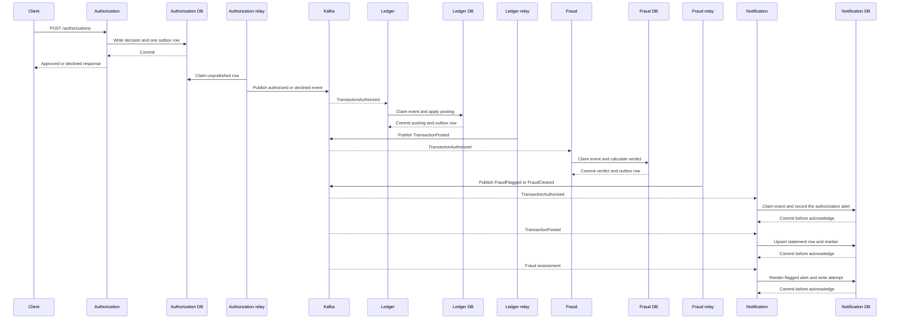
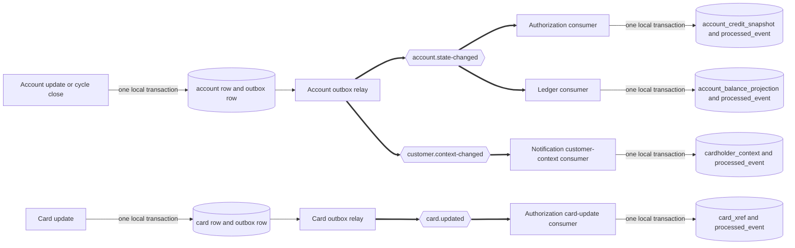
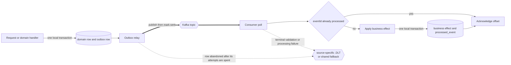

# Event Flow

This document follows every published event from commit through consumption. One authorization call writes exactly one authorization outcome event. Ledger, fraud, and notification react asynchronously, and no downstream service calls another downstream service. Paired legacy and target views live in [Architecture, Before and After](architecture-before-after.md), while rationale lives in the [decision log](decision-log.md).

## The envelope

Every event carries one flat envelope beside its payload. A consumer can route, validate, order, and deduplicate before interpreting business fields.

| Field | Purpose |
| --- | --- |
| `eventId` | Durable idempotency key recorded by each consumer |
| `eventType` | Routing discriminator and schema selector |
| `schemaVersion` | Contract version used to select the exact JSON Schema document |
| `occurredAt` | Producer timestamp |
| `aggregateId` | Kafka message key, normally the 11-digit account identifier |

A reason-0100 decline has no resolved account. Its envelope uses the 16-character transaction identifier as the sanctioned aggregate key.

## Payload conventions

Money travels as a two-place decimal string, never as a JSON number. A decimal string prevents a client from silently changing fixed-point money into binary floating point.

The account identifier is the Kafka key whenever an account is known. A Kafka partition is an ordered shard of a topic, so one account’s ledger updates stay ordered.

Card-number masking and tokenization occur after the authorization decision. The full 16-character card number performs the cross-reference lookup. Events, responses, logs, and notification keys receive only the masked display form or the irreversible 64-character card token.

The card verification value at `app/cpy/CVACT02Y.cpy:L7` is stored only by the card service. No event, log entry, or API response contains it.

## Topics and consumer groups

The delivered runtime creates seven business topics, five source-specific dead-letter topics, and one shared fallback. A dead-letter topic holds records that could not complete processing after validation and retry handling.

| Topic | Events carried | Producer | Consumer groups |
| --- | --- | --- | --- |
| `transaction.authorized` | `TransactionAuthorized` | authorization-service | `ledger-posting`, `fraud-detection`, `notification-authorized` |
| `transaction.declined` | `TransactionDeclined` versions 1 and 2 | authorization-service and the ledger feed-validation reject path | None in the demo |
| `transaction.posted` | `TransactionPosted` versions 1 and 2 | ledger-posting-service | `notification-posted` |
| `fraud.assessed` | `FraudFlagged`, `FraudCleared` | fraud-detection-service | `notification-fraud` |
| `account.state-changed` | `AccountStateChanged` | account-service | `authorization-account-state`, `ledger-account-state` |
| `customer.context-changed` | `CustomerContextChanged` | account-service | `notification-customer` |
| `card.updated` | `CardUpdated` versions 1 and 2 | card-service | `authorization-card-updated` |
| `<source>.DLT` | 134-character fixed-width abend diagnostic | Ledger, fraud, and notification listener error handlers | Human inspection and replay tooling |
| `carddemo.dead-letter` | `DeadLetterEnvelope` | Authorization listener error handlers, the four outbox relays on abandonment, and any handler whose source topic cannot be resolved | Human inspection and replay tooling |

The five source-specific dead-letter topics are `transaction.authorized.DLT`, `account.state-changed.DLT`, `transaction.posted.DLT`, `fraud.assessed.DLT`, and `customer.context-changed.DLT`. `card.updated` needs none, because its one consumer routes a spent record to the shared fallback as a governed envelope.

A consumer group is the named set of listener instances that share one subscription. Nine groups serve four listening services: authorization consumes two replica streams, ledger consumes the authorization stream and one replica stream, fraud consumes the authorization stream, and notification consumes four streams.

Three of those nine groups read `transaction.authorized`. That is the fan-out the requirements set a floor on, and it is visible in the group names alone: `ledger-posting`, `fraud-detection`, and `notification-authorized` each hold their own offsets, so none of the three can slow, block, or starve another.

`FraudFlagged` and `FraudCleared` share `fraud.assessed`. The envelope’s `eventType` distinguishes them before notification applies verdict-specific behavior.

## Business events

### `TransactionAuthorized`

The authorization service publishes `TransactionAuthorized` after an approval commits with its outbox row.

| Field | Source or status |
| --- | --- |
| `transactionId` | `TRAN-ID`, `app/cpy/CVTRA05Y.cpy:L5` |
| `accountId` | `XREF-ACCT-ID`, `app/cpy/CVACT03Y.cpy:L7` |
| `transactionTypeCode` | `TRAN-TYPE-CD`, `app/cpy/CVTRA05Y.cpy:L6` |
| `merchantCategoryCode` | `TRAN-CAT-CD`, `app/cpy/CVTRA05Y.cpy:L7` |
| `source` | `TRAN-SOURCE`, `app/cpy/CVTRA05Y.cpy:L8` |
| `description` | `TRAN-DESC`, `app/cpy/CVTRA05Y.cpy:L9` |
| `amount` | `TRAN-AMT`, `app/cpy/CVTRA05Y.cpy:L10` |
| Merchant fields | `app/cpy/CVTRA05Y.cpy:L11-L14` |
| `maskedCardNumber` | Masked form of `TRAN-CARD-NUM`; additive security boundary |
| `authorizedAt` | `TRAN-ORIG-TS`, `app/cpy/CVTRA05Y.cpy:L16` |
| `currency` | Additive constant `USD`; no source transaction field carries currency |

`ledger-posting` applies source posting arithmetic. `fraud-detection` calculates a new risk verdict. `notification-authorized` records the authorization against the card-keyed read model so a cardholder alert exists before posting completes. None of the three blocks the HTTP response, and none of them reads another's output.

### `TransactionDeclined`

A declined request is expected traffic, not an infrastructure error. `app/cbl/CBTRN02C.cbl:L230` sets return code 4 when any batch input is rejected.

| Wire code | Source description | Assignment |
| --- | --- | --- |
| `0100` | `INVALID CARD NUMBER FOUND` | `app/cbl/CBTRN02C.cbl:L385-L387` |
| `0101` | `ACCOUNT RECORD NOT FOUND` | `app/cbl/CBTRN02C.cbl:L397-L399` |
| `0102` | `OVERLIMIT TRANSACTION` | `app/cbl/CBTRN02C.cbl:L410-L412` |
| `0103` | `TRANSACTION RECEIVED AFTER ACCT EXPIRATION` | `app/cbl/CBTRN02C.cbl:L417-L419` |

Version 1 carries the resolved account identifier. Version 2 represents reason 0100 and omits an account that the platform never resolved.

The topic has no demo consumer. It exists so another consumer can subscribe without changing the authorization producer.

Reason 109 at `app/cbl/CBTRN02C.cbl:L556` is not a decline event. The source never checks it, while the target treats the condition as a processing failure; [business-rule flag 9](business-rule-flags.md) records the change.

### `TransactionPosted`

The ledger publishes `TransactionPosted` from its outbox after transaction, category-balance, and account-balance writes commit.

Version 1 contains transaction identifier, account identifier, amount, masked card, new balance, and posting time. Version 2 adds nine descriptive fields required by the notification read model.

| Version 2 detail | Provenance |
| --- | --- |
| `transactionTypeCode` | Authorized event value from `TRAN-TYPE-CD` |
| `merchantCategoryCode` | Authorized event value from `TRAN-CAT-CD` |
| `source` and `description` | Authorized event transaction text |
| Merchant identifier, name, city, and ZIP | Authorized event merchant fields |
| `originTimestamp` | Authorized event origin timestamp |

The new balance is the value after `app/cbl/CBTRN02C.cbl:L547`. Notification refuses version 1 for statement insertion rather than fabricating the missing columns.

The processing timestamp carries two significant fractional digits and four zeros. [Business-rule flag 8](business-rule-flags.md) and the [equivalence results](equivalence-results.md) define the comparison tolerance.

### `FraudFlagged`

`FraudFlagged` is additive in full because no COBOL fraud module exists. It carries transaction and account identifiers, a score, triggered rule identifiers, and assessment time.

The notification fraud listener renders an alert with its private cardholder projection. It also writes one metadata-only `notification_log` row with masked card, transaction, channel, and attempt time.

### `FraudCleared`

`FraudCleared` is also additive in full. It carries transaction and account identifiers plus assessment time.

The notification listener acknowledges a valid cleared event without rendering an alert. The listener accepts `Object` first because the cleared payload is structurally narrower than the flagged payload.

### `AccountStateChanged`

The account service publishes `AccountStateChanged` only after an account update or cycle close commits. The event carries the complete authorization credit snapshot.

| Field | Authorization target in `account_credit_snapshot` | Ledger target in `account_balance_projection` |
| --- | --- | --- |
| `accountId` | `account_id` | `account_id` |
| `creditLimit` | `credit_limit` | Not held; the ledger evaluates no limit |
| `currentCycleCredit` | `current_cycle_credit` | `cycle_credit` |
| `currentCycleDebit` | `current_cycle_debit` | `cycle_debit` |
| `expirationDate` | `account_expiration_date` | Not held; the ledger tests no expiry |
| `changeKind` | Explains whether an update or cycle close produced the event | Same |
| Envelope `eventId` and `occurredAt` | `source_event_id`, `source_occurred_at` | `source_event_id`, `source_occurred_at` |

Both groups apply the snapshot monotonically: a change whose `occurredAt` is not after the stored value discards itself rather than moving a cycle balance backwards. Each stores its event marker in the same transaction as the projection write.

Authorization then reads its local projection and calls no account service during a decision. The ledger consumes the same event for a different reason: `V2__seed.sql` loaded a projection row per fixture account and nothing else told the table when the account service moved the original, so without this consumer an account opened after deployment had no row at all, and a billing cycle closed at `app/cbl/CBACT04C.cbl:L353-L354` never reached the ledger's copy of the two accumulators. A posting is a delta the ledger owns; it advances neither provenance column, because clearing them would let an already-applied change apply twice.

### `CustomerContextChanged`

The account service publishes `CustomerContextChanged` when the customer record changes beside an account update. It carries the ten name, address, country, postal-code, and credit-score fields the source statement renderer reads.

The `notification-customer` group applies the event to `cardholder_context` and stores the duplicate marker in the same local transaction. A producer timestamp prevents an older or replayed event from moving the projection backwards.

### `CardUpdated`

The card service publishes `CardUpdated` after a successful card update. Version 2 carries account identifier, masked card number, expiry, and active status; it omits the embossed name that version 1 carried.

The `authorization-card-updated` group uses the account identifier and visible card suffix to refresh the matching local cross-reference observation. It changes no card-to-account field, because the event carries no full card number or customer identifier.

## Authorization transaction flow

**Figure 1 — One authorization call and the asynchronous reactions it starts**

Figure 1 separates the synchronous response from every later consumer action. Ledger, fraud, and notification each read the one authorization event directly and independently. Notification additionally reacts to posted and fraud events rather than calling either producer.

**Legend**

- Solid request arrows before the client response are synchronous.
- Arrows through Kafka are asynchronous and occur after the authorization response.
- Each database response marked `Commit` closes one local transaction.
- A declined authorization publishes only `TransactionDeclined`; no consumer receives an authorized event.
- Ledger, fraud, and notification share no direct call edge.
- Three arrows carry `TransactionAuthorized` out of Kafka, one per independent consumer group.

## State-change projection flow

**Figure 2 — State changes refreshing authorization and notification projections**

Figure 2 shows the state paths that replace synchronous owner-service lookups. One `account.state-changed` event feeds two independent replicas: authorization's credit snapshot and the ledger's balance projection. Card updates refresh only authorization's observation metadata, and customer-context changes refresh notification's renderer context.

**Legend**

- A cylinder naming two tables means both rows commit in one local transaction.
- Thick arrows cross Kafka.
- `account.state-changed` has two consumer groups, `authorization-account-state` and `ledger-account-state`, so each replica advances on its own offsets.
- `card.updated` has the `authorization-card-updated` consumer group.
- `customer.context-changed` has the `notification-customer` consumer group.
- Every replica applies a snapshot monotonically against the producer timestamp, so an older or replayed event cannot move a projection backwards.

## Delivery mechanics

An outbox is a database table written with the business change. A relay publishes those committed rows later, avoiding a split database-and-broker write inside request handling.

The demo relay checks every 500 milliseconds and claims at most 100 rows. Producers enable idempotence and require acknowledgements from all broker replicas.

Kafka delivery is at least once. Rebalances, restarts, or a crash after side effects but before offset commit can deliver the same event again.

Idempotency means a repeated event has no repeated business effect. Each consumer checks or claims `processed_event` by `eventId`, performs its work, and commits the marker with the effect.

Auto-commit is disabled. Manual acknowledgement occurs only after the database transaction commits.

The demo permits three processing attempts with a one-second backoff. Two terminal routes exist, and which one a failure takes depends on what failed.

A spent consumer record takes the listener route. Ledger, fraud, and notification send a 134-character fixed-width abend diagnostic to the source topic plus `.DLT`, and fall back to `carddemo.dead-letter` when the source topic cannot be resolved. Authorization sends a governed `DeadLetterEnvelope` to `carddemo.dead-letter` directly. Neither form republishes the failed payload, the failed key, or any inbound header outside a fixed allowlist, so a poison record cannot carry a card number or a card verification value onto a dead-letter topic. Malformed schema input reaches the same sanitized route without unsafe business processing.

An abandoned outbox row takes the relay route. The four relays that publish business events — authorization, ledger, account, and card — send a governed `DeadLetterEnvelope` to `carddemo.dead-letter` once a row is spent, so a change that can never be published still leaves a durable diagnostic naming the row, the event type, the attempt count, and the reason. Each terminal outcome increments a counter distinct from the per-attempt failure counter, so retries and permanently spent work are never summed together.

Kafka transactions do not make a database write atomic with a broker write. The platform still needs an outbox on producers and a marker transaction on consumers.

**Figure 3 — Transactional outbox and idempotent consumer mechanics**

Figure 3 identifies the two local transaction boundaries and the duplicate guard.

**Legend**

- Each cylinder naming two tables represents one local database transaction.
- The diamond is the durable duplicate check that makes redelivery harmless.
- Acknowledgement follows the consumer transaction and never precedes it.
- The dotted arrows are the two terminal dead-letter routes: a spent consumer record, and an abandoned outbox row.

## Failure counters and their discriminators

Every service separates a per-attempt failure count from a per-record or per-row terminal count, so a retry and a permanently spent unit of work are never summed together. The series names and the tag that discriminates each one differ by service, because each service counts what its own pipeline distinguishes. The names are listed here so a query can be written without reading the code.

| Service | Failure series, one increment per failed attempt | Terminal series, one increment per record or row given up on |
|---|---|---|
| notification | `carddemo.notification.failures`, tagged `failure.kind`: `schema_validation`, `deserialization`, `persistence`, `rendering`, `unknown` | `carddemo.notification.records.dead.lettered`, tagged `failure.kind` with the same values |
| ledger | `carddemo.ledger.failures`, tagged `stage`: `deserialize`, `process`, `publish`, `abandon` | `carddemo.ledger.dead.letters`, tagged `outcome`: `published`, `failed` |
| fraud | `carddemo.fraud.failures`, tagged `stage`: `deserialize`, `process`, `publish` | `carddemo.fraud.dead.letters`, tagged `outcome`: `published`, `failed` |
| authorization | `carddemo.authorization.failures`, tagged `stage`: `persist`, `publish`, `replica` | The `replica` stage carries both readings, because a refused projection record is the only record this service dead-letters |
| account | `carddemo.account.transaction.failures`, tagged `operation`: `update`, `cycle-close`, and `carddemo.account.publish.failed` | `carddemo.account.outbox.abandoned`, with `carddemo.account.dead.letters.published` and `carddemo.account.dead.letters.failed` naming what became of the diagnostic |
| card | `carddemo.card.failures` | `carddemo.card.outbox.abandoned`, with `carddemo.card.dead.letters.failed` counting a diagnostic the broker refused |

Notification tags by what failed, because it validates, persists, and renders. The ledger and fraud tag by the stage that failed, because an operator reasons about their stages separately. Card and account discriminate by series name rather than by tag, because each terminal outcome has one meaning. Every series is registered at start-up and carries a bounded tag set, so a value outside the set falls back rather than creating a series. The [decision log](decision-log.md) records why the three schemes were left as they are, and [suggested next tasks](suggested-next-tasks.md) carries the unification.

## Schema validation

Publishing validates the exact pair of `eventType` and `schemaVersion`, so malformed output never reaches a business topic. Consumption validates before domain code changes a table.

The contract library governs eight business event types and the dead-letter envelope across thirteen schema documents. `TransactionAuthorized`, `TransactionDeclined`, `TransactionPosted`, and `CardUpdated` each retain versions 1 and 2.

Compatibility tests enforce additive evolution. An older payload remains valid under the document that originally governed it.

## The source ancestor

The source’s only asynchronous handoff is `EXEC CICS WRITEQ TD` at `app/cbl/CORPT00C.cbl:L517`, followed by `QUEUE ('JOBS')` and `FROM (JCL-RECORD)` at lines 518-519. The target generalizes that “write now, process later” shape to every cross-service event.