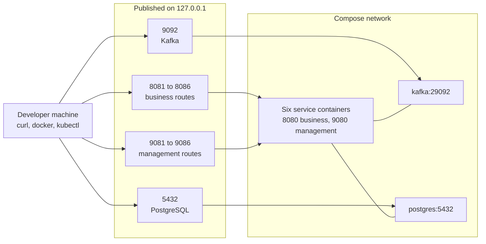

# Onboarding

This guide takes a clean machine to a running, modifiable card platform, and assumes nothing is installed yet. The root [`README.md`](../../README.md) keeps the 324-line z/OS installation path, which is still accurate and is not repeated here. `CONTRIBUTING.md` governs how to contribute, in the same 59 lines, because nothing in this work changed what it says. Every "why" belongs to the [decision log](decision-log.md); this file tells you what to do.

## Setup

### Prerequisites

Install the versions below. The build refuses an older Java and refuses Maven 4, and both container images are pinned by digest as well as by tag.

Two paths run this platform, and each has its own list. Install the Compose set to reach a running
stack on one machine; add the cluster set only to apply the Kubernetes manifests.

**The Compose path, which `scripts/start-demo.sh` preflights before it does anything:**

| Tool | Exact version | Use |
| :--- | :--- | :--- |
| Eclipse Temurin OpenJDK | 25.0.4+7 | Compiles and runs all nine modules at release 25 |
| Apache Maven | 3.9.16 | Builds the reactor. The enforcer refuses Maven 4 |
| Docker Engine | 29.7.0 or later | Runs the demo stack |
| Docker Compose | 5.3.1 or later | Starts the broker, the database, and the six services |
| OpenSSL | 3.5.3 or later | Generates the local passwords and the card-token key |
| curl | 8.14.1 or later | Reads the health endpoints and sends every request in this guide |
| git | 2.51.0 or later | Clones the repository and resolves the ignore rules the scripts rely on |

**The Kubernetes path, on top of the Compose set:**

| Tool | Exact version | Use |
| :--- | :--- | :--- |
| kubectl | 1.31 or later | Applies the eleven manifests, renders `deploy/k8s` and the encryption overlay, and reads Pod status |
| kind, minikube or Docker Desktop | kind 0.24 or later; minikube 1.34 or later | Supplies the cluster and the image store `deploy/k8s/load-images.sh` loads into |

That table is the whole Kubernetes set: **standalone Kustomize is not a prerequisite.** `kubectl` embeds
the Kustomize renderer, which is every `apply -k` and `kubectl kustomize` command in this guide and in
`deploy/k8s/README.md`. What it does not embed is the `edit` subcommand. One procedure would use it: pinning
the six image references by digest. That is written as an edit to `deploy/k8s/kustomization.yaml`
that any text editor makes, and the `kustomize edit set image` one-liner is named beside it as an
optional convenience.

Two rows of the Compose set are exact and the rest are floors, and the difference is not editorial.
The enforcer plugin refuses a build outside `[25,26)` for the language level and `[3.9.16,3.10.0)` for
Maven, so those two versions are requirements. A newer Maven fails the build rather than passing it.
Nothing in this repository constrains the others, so each version given is the one the delivered stack
was exercised on and the floor a later release stands on. Read a floor as "this or newer": the demo
needs Compose to support `--wait` and profiles, and the credential script needs `openssl rand` and
`openssl dgst -hmac`, all of which are long-standing.

`jshell` arrives with the JDK, and the setup script needs it on the path. `scripts/start-demo.sh`
refuses to start when any of `java`, `mvn`, `docker`, `openssl`, `jshell` or `curl` is missing, and
names the tool it could not find. A missing prerequisite stops at the first command rather than at a
failed request later. `deploy/k8s/load-images.sh` does the same for `kubectl` and for the runtime it
detects. Nothing in this guide needs a language runtime beyond the JDK: every response is read with
`curl` and `sed`.

The stack runs two images, `apache/kafka:4.2.1` and `postgres:18.4`. Neither is ever `:latest`, and each carries a digest beside its tag. The broker version matches the Kafka client version the build resolves, which removes one class of demo-day failure. Kafka runs in Kafka Raft mode, so no ZooKeeper container exists.

Spring Boot 4.1.0 supplies the dependency bill of materials, and almost every dependency omits its own version to inherit the managed one.

### Start with one command

From the repository root:

```bash
cd card-platform
scripts/start-demo.sh
```

That is the whole first run. The script packages the reactor, creates `.env` from `.env.example`, and fills all nineteen credentials. It builds the six images, starts eight containers, and reads `/actuator/health` on each of the six management ports. It prompts for nothing, and re-running it changes no credential that already holds a value.

Three things a clean clone cannot skip, which is why `docker compose up -d --build` alone does not work:

- the `{bcrypt}` hash of each identity password is produced by `jshell` reading `spring-security-crypto` out of the local Maven repository, which the packaging step is what populates;
- `docker-compose.yml` reads nineteen credentials that nothing in this repository supplies, because a credential published here would be a credential everyone holds;
- `.env`, where those credentials live, does not exist until it is copied.

The four demo passwords the script generates are written to `card-platform/.demo-credentials`, and git ignores that file. It is owner-only from the moment it exists: the script sets `umask 077`, fills a temporary file created at mode 600, then renames that onto the name above. `.env` keeps only their `{bcrypt}` hashes, and a hash cannot be sent to a service as a password. To choose the passwords yourself, set `CARDDEMO_ADMIN_PASSWORD`, `CARDDEMO_ACQUIRER_PASSWORD`, `CARDDEMO_USER_PASSWORD` or `CARDDEMO_MONITORING_PASSWORD` before running the script.

To prepare `.env` without starting anything, run `scripts/generate-env.sh` on its own. It reads the credential names out of `.env.example`, so adding a credential there extends it with no edit.

Run it again after every `git pull`. It reconciles an existing `.env` rather than replacing it. Every assignment `.env.example` declares and your file does not carry is appended with the example's value, and any credential among them is generated in the same run. No value you already hold is read or rewritten.

Three cases get more than that. An assignment your file carries and the example no longer declares is named in the output and left in place. The script cannot tell a retired setting from one you chose. An assignment holding a key this repository publishes is replaced with a generated one, because two services refuse to start on a published key. An assignment whose value differs from the example's is reported with both values and left as you set it.

That third case is where a start-up refusal after an upgrade usually comes from: a default this platform has tightened still looks like a working value in your file. The run ends by proving your file declares all 136 assignments. A variable Compose needs therefore cannot be silently absent, which is the failure that used to stop `docker compose config` on the first command after an upgrade.

The rest of this section is the same work performed by hand. Read it to understand what the script does, or follow it when you want to set a value yourself.

### Clone to a configured working tree

Run the following commands from the repository root:

```bash
cd card-platform

# install -m 600 rather than cp. This file holds fourteen passwords and the card-token key a
# moment from now, and cp creates it under the umask -- 0644 on a default account, readable
# by every local user. install sets the mode as it creates the file, so there is no window in
# which the credentials are world-readable. scripts/generate-env.sh protects the same file.
install -m 600 .env.example .env

for variable in POSTGRES_PASSWORD \
  AUTHORIZATION_DB_PASSWORD LEDGER_DB_PASSWORD FRAUD_DB_PASSWORD \
  NOTIFICATION_DB_PASSWORD ACCOUNT_DB_PASSWORD CARD_DB_PASSWORD \
  KAFKA_ADMIN_PASSWORD \
  AUTHORIZATION_KAFKA_PASSWORD LEDGER_KAFKA_PASSWORD FRAUD_KAFKA_PASSWORD \
  NOTIFICATION_KAFKA_PASSWORD ACCOUNT_KAFKA_PASSWORD CARD_KAFKA_PASSWORD; do
  sed -i "s|^${variable}=.*|${variable}=$(openssl rand -base64 24 | tr -d '/+=')|" .env
done
```

Populate Maven's local dependency cache before generating the encoded hashes:

```bash
mvn -B -DskipTests package
```

The remaining four credentials are encoded password hashes. Choose four local passwords and keep them in the current shell:

```bash
read -rsp "Admin password: " ADMIN_PASSWORD; echo
read -rsp "Acquirer password: " ACQUIRER_PASSWORD; echo
read -rsp "User password: " USER_PASSWORD; echo
read -rsp "Monitoring password: " MONITORING_PASSWORD; echo

CRYPTO_CP="$(find ~/.m2/repository/org/springframework/security/spring-security-crypto \
  -name 'spring-security-crypto-*.jar' | sort | tail -1):\
$(find ~/.m2/repository/commons-logging/commons-logging \
  -name 'commons-logging-*.jar' | sort | tail -1):\
$(find ~/.m2/repository/org/springframework/spring-core \
  -name 'spring-core-*.jar' | sort | tail -1)"

hash_password() {
  export DEMO_PASSWORD="$1"
  printf 'System.out.println(org.springframework.security.crypto.factory.PasswordEncoderFactories.createDelegatingPasswordEncoder().encode(System.getenv("DEMO_PASSWORD")));\n/exit\n' \
    | jshell --class-path "$CRYPTO_CP" 2>/dev/null \
    | sed -n 's/^jshell> //p' \
    | grep '^{bcrypt}' \
    | head -1
  unset DEMO_PASSWORD
}

sed -i "s|^ADMIN_PASSWORD_HASH=.*|ADMIN_PASSWORD_HASH='$(hash_password "$ADMIN_PASSWORD")'|" .env
sed -i "s|^ACQUIRER_PASSWORD_HASH=.*|ACQUIRER_PASSWORD_HASH='$(hash_password "$ACQUIRER_PASSWORD")'|" .env
sed -i "s|^USER_PASSWORD_HASH=.*|USER_PASSWORD_HASH='$(hash_password "$USER_PASSWORD")'|" .env
sed -i "s|^MONITORING_PASSWORD_HASH=.*|MONITORING_PASSWORD_HASH='$(hash_password "$MONITORING_PASSWORD")'|" .env
```

The single quotes on all four are not optional. A bcrypt value starts `{bcrypt}$2a$10$`, and Compose
expands `$` in an unquoted dotenv value. Written bare, the hash reaches the container truncated to
`{bcrypt}$2a$10`, and every sign-on answers 401 for a reason the value on disk does not show.
`scripts/generate-env.sh` and the pipeline both write these quoted, and the card-token key below is
quoted for the same reason.

If `scripts/start-demo.sh` generated the passwords instead, read them back from the file it wrote:

```bash
ADMIN_PASSWORD="$(sed -n 's/^admin001=//p' .demo-credentials)"
ACQUIRER_PASSWORD="$(sed -n 's/^acquirer1=//p' .demo-credentials)"
```

### The card-token key

`CARD_TOKEN_SECRET` ships as a `REPLACE` marker, so generating it is a required step. A card token is a keyed `HMAC-SHA-256` over the full card number, prefixed by `CARD_TOKEN_VERSION` and rendered as 64 lower-case hexadecimal characters.

The key is what stops a holder of one token recomputing the token of every sixteen-digit card number, so this repository ships no deployable runtime key. It does publish two: the build-scope key `pom.xml` supplies to the test suites, and the bootstrap key the Kubernetes Secret template carries. Both are refused by name at start-up, so neither can become a deployment's key by accident. Only the authorization service and the card service read it, and both refuse to start without it:

```bash
sed -i "s|^CARD_TOKEN_SECRET=.*|CARD_TOKEN_SECRET='$(openssl rand -base64 48 | tr -d '/+=')'|" .env
```

`CARD_TOKEN_VERSION` is not key material and needs no change. It is part of the message the code covers, so raising it rolls every token over under the same key.

Generating the key is all the stack needs. The 50 `card_token` literals in `services/card-service/src/main/resources/db/migration/V2__seed.sql` are derived under the build-scope key in `pom.xml`, and `CardTokenReconciler` re-derives every one of them under your key as the card service starts.

What a change of key does not carry is a token stored elsewhere. Four places hold one: `statement_transaction` and `notification_log` in the notification service, `authorization_decision` in the authorization service, and any `SCOPE_CARD_` authority already inside `USER_SCOPES`.

`USER_SCOPES` therefore ships no `SCOPE_CARD_` authority, which means `admin001` reaches every card route and `user0001` reaches none. To give the ordinary identity one card, derive its token under your key using the module you have already built:

```bash
COBOL_JAR="$(find libs/cobol-compat/target -name 'cobol-compat-*.jar' | head -1)"
export CARD_NUMBER="$(awk 'substr($0,17,11) == "00000000001" { print substr($0,1,16); exit }' \
  ../app/data/ASCII/carddata.txt)"
CARD_TOKEN_SECRET="$(grep '^CARD_TOKEN_SECRET=' .env | cut -d= -f2- | tr -d "'")" \
CARD_TOKEN_VERSION=1 jshell --class-path "$COBOL_JAR" -s - <<'JSHELL'
System.out.println(com.carddemo.cobol.PanMasker.cardToken(System.getenv("CARD_NUMBER")));
/exit
JSHELL
```

Append `SCOPE_CARD_<that value>` to `USER_SCOPES` in `.env`, then restart. A different key gives a different value, which is the whole point of the key.

### Build and start

Run the full verification lifecycle before building images:

```bash
mvn -B clean verify
scripts/check-published-test-counts.sh
docker compose up -d --build --wait --wait-timeout 300
docker compose ps
```

`--wait` holds until every container reports healthy and exits non-zero if one does not. A failed
start stops at this command rather than at the first request you make afterwards. The timeout bounds
the one case `--wait` alone does not: a container that stays in `starting` and is never declared
unhealthy. A cold stack converges in about two minutes, so 300 seconds is a bound rather than a
target, and `scripts/start-demo.sh` passes the same pair.

`mvn test` does not run the equivalence classes. Surefire excludes `**/*EquivalenceTest.java`, and Failsafe runs those nine classes during `verify`. A green `mvn test` therefore says nothing about source parity.

`scripts/check-published-test-counts.sh` is the second line of that command block, and it belongs there rather than in a documentation task. It counts the `testcase` elements of every report the build wrote. It fails when a figure published in [equivalence results](equivalence-results.md) or the [platform guide](../README.md) disagrees, or when a module holding an integration class produced no Failsafe report at all. Run it after adding a test and it tells you which published figure to restate; `--print` shows the measured numbers on their own.

The image build needs nothing from `target/`. Each `services/*/Dockerfile` compiles its own module in a Java Development Kit 25 builder stage, from the `card-platform` context. `docker compose up --build` therefore works on a clean clone once `.env` holds real credentials. `mvn -B clean verify` above is what proves the suite, not what feeds the images.

### Ports, schemas, and topics

| Service | Host business port | Host management port | Container ports |
| :--- | ---: | ---: | :--- |
| authorization-service | 8081 | 9081 | 8080 and 9080 |
| ledger-posting-service | 8082 | 9082 | 8080 and 9080 |
| fraud-detection-service | 8083 | 9083 | 8080 and 9080 |
| notification-service | 8084 | 9084 | 8080 and 9080 |
| account-service | 8085 | 9085 | 8080 and 9080 |
| card-service | 8086 | 9086 | 8080 and 9080 |

Compose publishes every port on `127.0.0.1`, so none of them answers another machine.

Kafka answers at `kafka:29092` inside the Compose network and at `localhost:9092` from this machine. The two addresses are separate listeners, so a host tool aimed at the in-network name is refused, and so is a container aimed at the host name. PostgreSQL answers at `postgres:5432` inside the network and at `127.0.0.1:5432` on the host.

One PostgreSQL container holds six private databases, each with one schema no other service reads:

| Service | Database | Schema |
| :--- | :--- | :--- |
| authorization | `carddemo_authorization` | `authorization_service` |
| ledger | `carddemo_ledger` | `ledger_service` |
| fraud | `carddemo_fraud` | `fraud_service` |
| notification | `carddemo_notification` | `notification_service` |
| account | `carddemo_account` | `account_service` |
| card | `carddemo_card` | `card_service` |

Flyway creates and migrates every schema. Hibernate runs with `ddl-auto: validate` and never generates the model.

Eight topics carry every message the platform sends:

| Topic | Published by | Consumer groups that read it |
| :--- | :--- | :--- |
| `transaction.authorized` | authorization | `ledger-posting`, `fraud-detection`, `notification-authorized` |
| `transaction.declined` | authorization | `ledger-reject` |
| `transaction.posted` | ledger posting | `notification-posted`, `account-posted` |
| `fraud.assessed` | fraud detection | `notification-fraud` |
| `account.state-changed` | account | `authorization-account-state`, `ledger-account-state` |
| `customer.context-changed` | account | `notification-customer` |
| `card.updated` | card | `authorization-card-updated` |
| `carddemo.dead-letter` | every service | nothing; it is read by hand |

Six of the seven business topics also have a `.DLT` companion for a record its own consumer cannot process. `card.updated` has none, because its one consumer routes a spent record to the shared fallback `carddemo.dead-letter` instead. That makes fourteen topics on the broker: seven business, six `.DLT`, and the fallback. [Event Flow](event-flow.md) gives the delivery guarantee behind each row.

Figure 1 shows which address to dial from where, because the answer differs between the host and a container.

**Figure 1 — The Local Demo Stack: Eight Containers, Their Published Host Ports, and Their In-Network Addresses**



Legend for Figure 1:

- Each box in the upper group is a host port Compose publishes, bound to loopback.
- Each box in the lower group is a container address, reachable only from inside the network.
- An arrow shows which address a tool dials to reach which container.
- A line with no arrowhead shows a service using the broker or the database from inside the network.
- Figure 1 maps addresses and nothing else. Both architecture states are in [Architecture, Before and After](architecture-before-after.md).

### Verify the running stack

Health is anonymous on each management port:

```bash
for port in 9081 9082 9083 9084 9085 9086; do
  curl -fsS "http://localhost:${port}/actuator/health"
  echo
done
```

Three management endpoints are exposed: `health`, `metrics`, and `prometheus`. Health is open, and the other two require the monitoring identity, `monitor01` by default.

Logs are structured JavaScript Object Notation (JSON) in logstash format. Every record carries a `service` member naming which of the six services wrote it. A record written while handling a request or a delivery also carries `correlationId`, `causationId`, `eventId`, `eventType` and `transactionId`, each as a top-level member.

Following one authorization across all six services means filtering on `correlationId`: send `X-Correlation-Id` holding one Universally Unique Identifier and that value is used. Send nothing, or anything that is not a rendered identifier, and the service generates one instead. A value such as `qa-corr-plain` is replaced without an error, so read the identifier back off the response header. Each event carries it onward in the `carddemo-correlation-id` Kafka header, and every consumer puts it back on its own records. `causationId` names the immediate parent event, so a chain can be read one hop at a time rather than only as a set.

The root logger and `com.carddemo` both default to INFO, from `LOG_LEVEL` and `LOG_LEVEL_CARDDEMO`. Raise `LOG_LEVEL_CARDDEMO` to DEBUG for one run when you want the per-step detail behind a correlated chain, and lower it afterwards. DEBUG adds volume rather than joinability, which the correlation members already supply at INFO.

One member is deliberately absent. `stack_trace` is withheld in every service. It is the one logstash member that renders an exception message. A framework path exists that would write a rejected payload there, past every rule this platform applies to its own logging. Each service reports its own failures as a type chain with the record coordinates instead.

Business routes require HTTP Basic authentication. The administrator username defaults to `admin001`, and the acquiring workload username to `acquirer1`.

Every state-changing request carries one header beyond the credential: `X-CardDemo-Request`, with any non-blank value. A `POST`, `PUT`, `PATCH` or `DELETE` arriving without it answers 403, and so does one declaring a cross-site `Sec-Fetch-Site` or a foreign `Origin`. HTTP Basic is a credential a browser attaches by itself, so a page on any other site could otherwise submit a form against a business route. An HTML form cannot set a request header, which is what makes one header the control. Reads need nothing, which is why the health loop above carries no header.

`API_CROSS_SITE_HEADER` renames that header. Only its presence is inspected, never its value.

Request volume is bounded as well. Each service admits 600 requests a minute per source address and per identity, of which 120 may change state, and it admits 20 failed authentications and 64 requests in flight. Past any of those it answers 429 with `Retry-After`. `API_RATE_*` raises the ceilings for a load run, and management ports are exempt so a probe is never throttled.

`POST /authorizations` admits `ACQUIRER` and `ADMIN` alone. The acquirer is the identity a point-of-sale network presents. That route names its card in the request body, so no path variable carries an identifier an ownership scope could test. It therefore reaches every card the platform holds, and `user0001` is a cardholder identity that receives 403 there.

### Authorize one transaction and watch the fan-out

Submit `POST /authorizations` with the first card in the checked-in fixture:

```bash
CARD_NUMBER=$(sed -n '1s/^\(.\{16\}\).*/\1/p' ../app/data/ASCII/cardxref.txt)
CAPTURED_AT="$(date -u +'%Y-%m-%d %H:%M:%S').000000"
PROCESSED_AT="$(date -u +'%Y-%m-%d-%H.%M.%S').000000"

curl -sS -X POST http://localhost:8081/authorizations \
  -u "acquirer1:${ACQUIRER_PASSWORD}" \
  -H 'X-CardDemo-Request: onboarding' \
  -H 'Content-Type: application/json' \
  -d "{\"cardNumber\":\"${CARD_NUMBER}\",
       \"transactionTypeCode\":\"01\",
       \"transactionCategoryCode\":\"0001\",
       \"source\":\"POS TERM\",
       \"description\":\"Onboarding purchase\",
       \"amount\":\"+00000504.77\",
       \"merchantId\":\"800000000\",
       \"merchantName\":\"Abshire-Lowe\",
       \"merchantCity\":\"North Enoshaven\",
       \"merchantZip\":\"72112\",
       \"originTimestamp\":\"${CAPTURED_AT}\",
       \"processingTimestamp\":\"${PROCESSED_AT}\"}"
```

The response returns HTTP 200 for an approval and HTTP 422 for a source-equivalent decline. `approved` separates the two outcomes. [Domain context](#domain-context) lists the four reject reasons a decline can carry.

Both timestamps accept the ten-character date `YYYY-MM-DD` and the twenty-six character record form. `app/cbl/COTRN02C.cbl:L389-L423` validates each as a ten-character date, and a ten-character value is widened to the record width before it reaches the event.

No bound relates either value to the clock of the service. Reject reason `0103` at `app/cbl/CBTRN02C.cbl:L414-L420` compares the first ten characters of the capture moment against the account expiry date, and nothing else tests the value.

A date the tolerant policy declines answers 422 with `Orig Date - Not a valid date...` or `Proc Date - Not a valid date...`. A body failing several edits reports the one text the source would have reported first.

Watch the asynchronous path from inside the broker container:

```bash
docker compose exec kafka /opt/kafka/bin/kafka-console-consumer.sh \
  --bootstrap-server kafka:29092 \
  --command-config /tmp/kafka-admin.properties \
  --from-beginning \
  --include 'transaction.authorized|transaction.posted|fraud.assessed'
```

An approval produces `TransactionAuthorized`. Ledger posting and fraud detection consume it independently, under `ledger-posting` and `fraud-detection`. Notification consumes it as well, under `notification-authorized`, so three services react to one event without calling each other or the producer.

The first record of `app/data/ASCII/cardxref.txt` names account `00000000050`, so that is the account the two reads below ask about:

```bash
curl -sS -u "admin001:${ADMIN_PASSWORD}" \
  http://localhost:8082/balances/00000000050
curl -sS -u "admin001:${ADMIN_PASSWORD}" \
  'http://localhost:8083/fraud-assessments?accountId=00000000050'
```

The ledger's balance has moved and the fraud service holds a new assessment. The assessment sits in the `assessments` array of one page, beside a `nextPageExists` that is false while the account holds only this one. A longer history answers a `nextCursor` as well, and returning it in the `X-Fraud-Cursor` header asks for the page after it. Notification keeps its alerts under `GET /notifications/{cardToken}` and pages the same way, and [the card-token key](#the-card-token-key) gives the command that derives the token that route needs.

### Update an account and a customer

`GET /accounts/{accountId}` and `GET /customers/{customerId}` read the pair, and `PUT /accounts/{accountId}` replaces it. The read shape and the write shape differ on purpose. A body assembled by echoing the two reads is therefore refused, one field at a time, with the text the source edit carries. The account read names no customer, because `app/cpy/CVACT01Y.cpy` holds no customer identifier; in the fixture, account `00000000050` pairs with customer `000000050`.

Six differences separate a read from a write, and each answers 422 with one text:

| The read returns | The write requires | Text when the read value is submitted |
| :--- | :--- | :--- |
| `"openDate": "2011-04-22"` | eight digits, `20110422` | `Open Date: Month must be a number between 1 and 12.` |
| `"expirationDate": "2099-12-31"` | `20991231` | `Expiry Date: Month must be a number between 1 and 12.` |
| `"reissueDate": "2023-03-09"` | `20230309` | `Reissue Date: Month must be a number between 1 and 12.` |
| `"dateOfBirth": "1960-12-01"` | `19601201` | `Date of Birth: Month must be a number between 1 and 12.` |
| `"ficoCreditScore": 623` | a value from 300 through 850 | `FICO Score: should be between 300 and 850`, which refuses the 21 seeded rows below 300 |
| no Social Security Number in either read | all three parts together | `SSN: First 3 chars must be supplied.` |

Space padding is not one of the differences. Every edit reads its field at the width the copybook declares, so a name padded to 25 characters and a postal code padded to 10 both pass.

A block that is present has to be complete: nine components of `accountData`, ten of `customerData`, and the three Social Security parts together. A component no edit requires may be omitted and keeps its stored value. That stored value still reaches the edit, so an omitted telephone number whose area code the reference table does not list is refused exactly as a submitted one would be.

The checked-in fixture is read data and it fails the write edits by design, because those edits ran on 3270 screen input and never on stored records. All 50 seeded customers fail at least one, and only two carry a state whose postal prefix is among the 240 combinations `app/cpy/CSLKPCDY.cpy` lists. Account `00000000050` needs the fewest corrections, and this body is accepted:

```bash
curl -sS -X PUT http://localhost:8085/accounts/00000000050 \
  -u "admin001:${ADMIN_PASSWORD}" \
  -H 'X-CardDemo-Request: onboarding' \
  -H 'Content-Type: application/json' \
  -d '{
    "accountData": {
      "activeStatus": "Y",
      "currentBalance": "492.00",
      "creditLimit": "6169.00",
      "cashCreditLimit": "4587.00",
      "openDate": "20110422",
      "expirationDate": "20991231",
      "reissueDate": "20230309",
      "currentCycleCredit": "0.00",
      "currentCycleDebit": "0.00",
      "groupId": ""
    },
    "customerData": {
      "customerId": "000000050",
      "firstName": "Aniya",
      "middleName": "Alba",
      "lastName": "Von",
      "addressLine1": "1588 Nienow Cape",
      "addressLine2": "Suite 187",
      "addressCity": "New Aricchester",
      "addressStateCode": "OR",
      "addressCountryCode": "USA",
      "addressZip": "97201",
      "phoneNumber1": "(325)301-0827",
      "phoneNumber2": "(503)985-9283",
      "socialSecurityPart1": "111",
      "socialSecurityPart2": "11",
      "socialSecurityPart3": "1111",
      "governmentIssuedId": "SPECIMEN-0000000001",
      "dateOfBirth": "19601201",
      "eftAccountId": "0074883577",
      "primaryCardHolderIndicator": "Y",
      "ficoCreditScore": "623"
    }
  }'
```

Four values in it are not the seeded ones. `addressZip` is `97201` rather than `04257`, because `OR97` is the only Oregon prefix in that list, and the seeded pair answers `Invalid zip code for state`. `phoneNumber2` carries area code `503` rather than the seeded `493`, which answers `Phone Number 2: Not valid North America general purpose area code`. The Social Security Number is a specimen, because no read returns the stored one. `expirationDate` is the value the read returned rather than the fixture's, for the reason [pitfall 10](#10-resubmitting-the-fixture-expiry-declines-the-account-you-just-updated) gives.

A write answers 200 with `Changes committed to database` and produces one event per record it changed: `AccountStateChanged` for the account row and `CustomerContextChanged` for the customer row. Run the same body twice and the second call answers 200 with `No change detected with respect to values fetched.` and produces neither. `services/account-service/src/main/resources/openapi.yaml` carries this body as a request example beside a customer-only variant.

Replacing the whole record has one more consequence. `currentBalance` and the two cycle counters are components of the request, so a body carrying the figures the caller was shown writes those figures back. A transaction posted between the read and the write is overwritten. Read the account again before updating it, or send `customerData` alone and leave every account column as stored.

### Run it on a local Kubernetes cluster

`deploy/k8s/` carries the same six services as Deployments, with Kafka, PostgreSQL, a ConfigMap, and a Secret template. One step has to happen before `kubectl apply`, and skipping it is the most common way this deployment fails.

Each service Deployment names `carddemo/<service>:1.0.0-SNAPSHOT` with `imagePullPolicy: Never`. Nothing publishes those images to a registry, so the kubelet never looks for one, and the image has to already be in the cluster node's image store. A cluster that has not been given them reports `ErrImageNeverPull`, which names no cause. Build the images and put them in the cluster with:

```bash
cd card-platform
deploy/k8s/load-images.sh              # runtime read from the current kubectl context
deploy/k8s/load-images.sh kind         # or name it: kind, minikube, docker-desktop
```

The script builds all six images from source, then loads them the way the runtime requires. Each `Dockerfile` compiles its module in a Java Development Kit 25 builder stage, so no archive has to exist on this machine first. That is `kind load docker-image` for kind, `minikube image load` for minikube, and nothing at all for Docker Desktop, whose cluster shares this machine's Docker daemon. It then reads the node's image list back and fails if no `carddemo` image arrived.

`KIND_CLUSTER_NAME` and `MINIKUBE_PROFILE` select a cluster other than the default. `IMAGE_TAG` names the tag to build, and the script refuses one the manifests do not request. `imagePullPolicy: Never` makes the kubelet run the tag `kustomization.yaml` sets or refuse the Pod, so any other tag fails exactly as loading nothing would. The same check catches `kustomization.yaml` drifting from the version in `pom.xml`.

Apply the manifests in the order `deploy/k8s/00-namespace.yaml` documents, which the script prints when it finishes. That order is the namespace, then a filled-in copy of `31-secret.example.yaml` kept **outside** that folder, then `kubectl apply -k deploy/k8s` for everything else. `kustomization.yaml` lists the ten manifests to apply and omits the template, so the third step cannot overwrite the Secrets with the placeholders it publishes. Applying the folder with `kubectl apply -f` instead would overwrite them, and would also fail on `kustomization.yaml` itself, which is not a Kubernetes API object.

After a rebuild, the images change but the Pods do not. Restart the six application Deployments, which the script prints for you. Naming them matters. `rollout restart deployment` with no argument restarts every Deployment in the namespace, which cycles the broker and the database too. That drops every consumer group and every open connection for no reason.

```bash
kubectl -n carddemo rollout restart \
  deployment/authorization-service deployment/ledger-posting-service \
  deployment/fraud-detection-service deployment/notification-service \
  deployment/account-service deployment/card-service
```

The Compose stack and the cluster are alternatives rather than layers, because the transport differs between them. Compose serves HTTP on loopback with `SASL_PLAINTEXT`, and the manifests serve HTTPS with `SASL_SSL` and mounted key material. Compose runs under a stated posture of one operator, one machine, synthetic fixtures, and every published port binds `127.0.0.1` to hold it there. A shared host or a second person on the bridge is outside that posture and wants the cluster. [The platform README](../README.md) carries the comparison.

## Domain context

A card authorization asks whether one transaction may proceed. Authorization resolves the card to an account through the cross-reference record, then applies four rules taken from the source. An approval publishes `TransactionAuthorized` and a decline publishes `TransactionDeclined`. Three services consume the approval independently, and none of them calls another or calls back into authorization.

A reject reason is the code the source assigns when one of those rules refuses a transaction. The batch program moves the code into a four-digit field and copies its text beside the record it rejected. The target carries the same four codes and the same texts, and there is no fifth:

| Code | Source description | Locator |
| :--- | :--- | :--- |
| `0100` | `INVALID CARD NUMBER FOUND` | `app/cbl/CBTRN02C.cbl:L385-L387` |
| `0101` | `ACCOUNT RECORD NOT FOUND` | `app/cbl/CBTRN02C.cbl:L397-L399` |
| `0102` | `OVERLIMIT TRANSACTION` | `app/cbl/CBTRN02C.cbl:L410-L412` |
| `0103` | `TRANSACTION RECEIVED AFTER ACCT EXPIRATION` | `app/cbl/CBTRN02C.cbl:L417-L419` |

A decline is expected business traffic rather than an error. The source sets return code 4 when any input was rejected, at `app/cbl/CBTRN02C.cbl:L229-L230`, and then reports a normal end of job.

Each account carries a current balance and two cycle accumulators, cycle credit and cycle debit. The credit rule reads the two accumulators and not the balance. It computes cycle credit minus cycle debit plus the transaction amount at `app/cbl/CBTRN02C.cbl:L403-L405`, then tests that figure against the credit limit at `app/cbl/CBTRN02C.cbl:L407`. [Pitfall 5](#5-cycle-counters-need-an-explicit-reset-owner) follows from those two counters, so read it before demonstrating the limit.

Card-to-customer resolution runs through the cross-reference record and through nothing else. `app/cpy/CVACT01Y.cpy` declares no customer identifier, so the target creates no account-to-customer foreign key. [Data Model](data-model.md) gives the shape of each service's tables.

The source platform ran online transactions under Customer Information Control System (CICS), driven from a 3270 terminal. Batch work ran as Job Control Language (JCL) jobs on a nightly schedule. Both read eight shared Virtual Storage Access Method (VSAM) datasets. [Architecture, Before and After](architecture-before-after.md) shows both states.

Equivalence means reproducing the behaviour of that source, including the defects it carries. Every reproduced defect is recorded rather than quietly fixed. The [business-rule register](business-rule-flags.md) lists each one with a source locator, and [Equivalence Results](equivalence-results.md) reports the fixture comparisons.

## How the platform is laid out

The aggregator builds nine modules in this order:

| Module | Purpose |
| :--- | :--- |
| `libs/event-contracts` | Event records, envelope, schemas, and validating serialization |
| `libs/cobol-compat` | Fixed-point arithmetic, parsing, date rules, masking, and reference data |
| `services/authorization-service` | Synchronous authorization and account projection consumption |
| `services/ledger-posting-service` | Posting arithmetic, plus a balance projection the account service's own changes refresh |
| `services/fraud-detection-service` | Net-new risk assessment |
| `services/notification-service` | Statement read model and alerts, over four independent listeners |
| `services/account-service` | Account, customer, and cycle-close operations |
| `services/card-service` | Card list, detail, and update |
| `equivalence-tests` | Cross-service contract and source-parity tests |

The two libraries depend on no internal module. Each service depends on both libraries and on no other service. The equivalence module depends on every module, at test scope only.

That direction is enforced rather than agreed. A service-to-service Java import fails compilation, and the Maven enforcer names the forbidden dependency instead of leaving a reader with an unresolved symbol. Runtime state crosses a service boundary through a published event and a private projection, never through a call.

Look under these paths when changing a service:

| Path | Contents |
| :--- | :--- |
| `api/` | Controllers and request or response records |
| `domain/` and `domain/rules/` | Orchestration and rule objects |
| `messaging/` | Consumers, publishers, and dead-letter metadata |
| `outbox/` | Outbox writer and relay |
| `entity/` and `repository/` | Private persistence model |
| `config/` | Security, Kafka, and observability wiring |
| `src/main/resources/db/migration/` | Flyway schema and seed migrations |
| `src/main/resources/openapi.yaml` | Hand-written API description |

Several things a reader might look for are absent by decision, and the enforcer refuses most of them as dependencies. There is no boilerplate generator and no object-mapping library, and no API documentation generator, because every service carries a hand-written `openapi.yaml`. There is no cache and no key-value store, because the fraud velocity window is a PostgreSQL table. The stack runs no schema registry, no ZooKeeper, no broker or database administration container, no metrics dashboard, no tracing backend, and no service mesh. There is no COBOL compiler, no mainframe connector, and no application front-end, and the [decision log](decision-log.md) carries a row for each absence.

### Walk one service in five minutes

Read a service in the order a request moves through it. The path is the same in all six, so the second service takes less time than the first.

| Step | Where to look | What it tells you |
| :--- | :--- | :--- |
| 1 | `README.md` | What the service owns, its source provenance, and the events it reads and writes |
| 2 | `src/main/resources/openapi.yaml` | Every route, status and body, without opening a controller |
| 3 | `api/` | Request validation, and the answer each refusal carries |
| 4 | `domain/` | The behaviour, and the COBOL paragraph each part reproduces |
| 5 | `messaging/` | Which topic arrives, and what a listener does before it acknowledges |
| 6 | `outbox/` | How a state change and its event commit together |
| 7 | `src/main/resources/db/migration/V1__schema.sql` | The private schema, with a source locator on each column |

Leave `config/` for a second pass. Seven of its classes are the same seven in every service: `SecurityConfig`, `CrossSiteRequestFilter`, `RequestRateCeilingFilter`, `CorrelationContextFilter`, `SafeProducerListener`, `ReadinessHealthConfig` and `StreamNameReport`. They carry wiring rather than domain behaviour, and the [decision log](decision-log.md) records why they stay one copy per service.

Start with `services/ledger-posting-service` for the COBOL comparison, and with `services/fraud-detection-service` for the extension story. The first reproduces the batch posting arithmetic of `app/cbl/CBTRN02C.cbl`. The second has no source ancestor at all.

## How to extend

### Add an independent consumer

Create a Maven service module and depend on the two shared libraries. Subscribe with a new consumer group, add a `processed_event` table, and commit the marker with the business effect.

Three declarations sit outside Java and are easy to forget. Name the topic and the group in the service's `application.yml`. Add a `grant_consumer` line for the new principal, topic, and group in the `create_acls` function of `docker-compose.yml`, and the matching entry in `deploy/k8s/10-kafka.yaml`. Without those two the broker refuses the subscription, and the service starts but never receives an event. Add the `<topic>.DLT` name to `create_topics` if the consumer routes spent records to its own dead-letter topic rather than to the shared fallback.

No producer changes are required. Fraud detection proves the path, because it has no source ancestor and consumes an event that already existed. Notification proves it a second time: it was added as the third independent reader of `transaction.authorized` under `notification-authorized`, and neither the producer nor the other two consumers changed.

### Add a decline rule

Add a class implementing `DeclineRule` under the authorization service's `domain/rules/`, annotated `@Order` with a value that keeps the source sequence. The delivered four are `@Order(10)`, `(20)`, `(30)` and `(40)`. `domain/AuthorizationChainCompositionTest` asserts both the order and the segment each rule belongs to, so the annotation is a requirement rather than a convention.

The class is the first edit and not the only one. A reject code is a governed part of the wire contract, and several tests hold the set of codes closed on purpose. The enum, both declined schemas, the OpenAPI document, the equivalence coverage and those tests all change with it. [How to extend the authorization service](../services/authorization-service/README.md#how-to-extend) lists every file, in the order the build asks for them, and it counts seventeen. Run `mvn -B -ntp verify` from `card-platform/` after the first edit and work down the failures.

The source marks the seam itself. `ADD MORE VALIDATIONS HERE` sits at `app/cbl/CBTRN02C.cbl:L377`, inside the validation paragraph that begins at `app/cbl/CBTRN02C.cbl:L370`. The original author marked the extension point, and the target honours it by making extension mean adding a class.

### Preserve two guarantees

- A new consumer owns its idempotency. Check `processed_event` before acting, write the marker inside the transaction that carries the business effect, and acknowledge only after that commit.
- A schema change stays additive. One that would break an existing consumer fails `SchemaBackwardCompatibilityTest` rather than failing in production.

Kafka publication sits behind a publisher port, so a managed event service could take its place. No other seam is abstracted, because each service is meant to stay readable in a short walkthrough.

## Common pitfalls

Every pitfall below was measured during the build. Each one gives the symptom you will see, the cause with its locator, and the fix.

### 1. Java defaults silently to release 17

**Symptom:** nothing at all. No error and no warning, and a confusing runtime or tooling problem surfaces later. That silence is why this one leads the list.

**Cause:** the framework parent defaults the language level and the compiler release to 17. `<maven.compiler.release>25</maven.compiler.release>` is the property this build compiles from, and every module descriptor declares it beside `<java.version>25</java.version>`. A module that lowers or drops it compiles without a warning at a lower class-file version, major version 61 for release 17, while the build still succeeds.

**Fix:** declare the property in every module descriptor. Two guards catch a module that does not. The aggregator's enforcer requires the property to resolve to 25 in every module. The compile stage of `.github/workflows/ci.yml` then reads the release of every class file the reactor wrote, and fails on any value other than major version 69, which is release 25.

`<java.version>` alone changes nothing here. No plugin resolves it, because `card-platform/pom.xml` imports the Spring Boot bill of materials rather than inheriting the Spring Boot parent.

### 2. Money truncates toward zero

**Symptom:** figures that look right and are wrong by a cent, with no test failing unless a test was written to catch it.

**Cause:** `ROUNDED` appears zero times across all 28 programs under `app/cbl/`, so every arithmetic store truncates toward zero. Half-up is the reflexive Java choice, and it breaks equivalence.

**Fix:** send every monetary computation through `CobolDecimal` in `libs/cobol-compat`, which pins `RoundingMode.DOWN`. Never construct a rounding mode locally. `DecimalTruncationEquivalenceTest` asserts both that truncation gives the expected value and that half-up gives a different one, so a later simplification fails the build.

### 3. Processing timestamps have two significant fractional digits

**Symptom:** a byte-for-byte timestamp comparison fails on every record, for a reason unrelated to the logic under test.

**Cause:** `app/cbl/CBTRN02C.cbl:L159` declares the field as `PIC X(26)`. The redefinition beginning at `app/cbl/CBTRN02C.cbl:L160` ends with a two-digit fractional field at `app/cbl/CBTRN02C.cbl:L173` and a four-character remainder at `app/cbl/CBTRN02C.cbl:L174`. The routine that fills it moves a hundredths value at `app/cbl/CBTRN02C.cbl:L700`, then hard-codes four zero characters at `app/cbl/CBTRN02C.cbl:L701`. `app/cbl/CBTRN02C.cbl:L438` moves the result into the transaction record, so a fresh Java timestamp differs in the last four digits of every row.

**Fix:** normalize processing timestamps to hundredths and four trailing zeros before comparing, or compare under an explicit documented tolerance. The [equivalence results](equivalence-results.md) document the tolerance.

### 4. Fixture widths differ

**Symptom:** a loader that assumes the width a copybook declares fails on real fixture data.

**Cause:** `app/data/ASCII/cardxref.txt` contains 36-byte records, while `app/cpy/CVACT03Y.cpy` declares 50. The text fixture omits the 14-byte trailing filler, leaving 16 + 9 + 11 = 36 bytes of card number, customer identifier, and account identifier.

**Fix:** use the width-tolerant fixture loader, and treat the EBCDIC twin as the width authority where the two disagree, because it carries the full declared width. The text set also has no security-user fixture although the binary set does, which is why signon fixtures are constructed rather than loaded.

### 5. Cycle counters need an explicit reset owner

**Symptom:** the demo works, then stops approving anything. This is the pitfall most likely to be reported as a broken demonstration, which is exactly why it is written down.

**Cause:** authorization reads the two cycle counters that posting grows, at `app/cbl/CBTRN02C.cbl:L403-L407`, and those counters only ever grow. The only source code that zeroes them is `MOVE 0 TO ACCT-CURR-CYC-CREDIT` at `app/cbl/CBACT04C.cbl:L353` and `MOVE 0 TO ACCT-CURR-CYC-DEBIT` at `app/cbl/CBACT04C.cbl:L354`. Both sit inside the interest program, which stays outside the migrated runtime, so available credit shrinks until every transaction declines.

**Fix:** call `POST /accounts/{accountId}/cycle-close` on the account service:

```bash
curl -sS -X POST http://localhost:8085/accounts/00000000050/cycle-close \
  -u "admin001:${ADMIN_PASSWORD}" \
  -H 'X-CardDemo-Request: onboarding' \
  -H 'Content-Type: application/json'
```

It answers 200 carrying both accumulators at zero. The route reproduces those two statements and nothing else, and it calculates no interest. It declares a media type although it reads no body, so a call omitting `Content-Type` answers 415 rather than 200. The endpoint exists because the credit rule reads counters that only an out-of-scope program resets, so the target needed a reset owner of its own.

Three services hold part of one `ACCTDAT` record, so the counters move along a chain rather than in one place. The ledger posts and publishes `TransactionPosted`, the account service adds the amount to its own copy and publishes `AccountStateChanged`, and authorization writes that into the snapshot reason code 102 reads. Every link is asynchronous, so a second authorization issued immediately after the first can still read the older snapshot. Space repeated calls out when demonstrating the limit, or read `carddemo.account.posting.applied` on the account service's metrics endpoint to see the amount land first.

### 6. Rotating the card-token key invalidates checked-in values

**Symptom:** a card detail request answers 403 for a card the caller does own, and a stored alert no longer matches its card.

**Cause:** a card token is a keyed hash, so it is a function of `CARD_TOKEN_SECRET` and `CARD_TOKEN_VERSION` as much as of the card number. The 50 seeded `card_token` literals look after themselves, because `CardTokenReconciler` re-derives them under the configured key each time the card service starts. Two things do not. Any `SCOPE_CARD_` authority in `USER_SCOPES` names a token derived under the previous key, and so does every token a read model already stored.

**Fix:** derive the authority again under the new key. [The card-token key](#the-card-token-key) gives the command, and the failure is quiet on the authority, so check it first.

### 7. The first start needs the network, even though the build does not

**Symptom:** `docker compose up` fails on a host with no route to a registry, while `mvn -o … compile` succeeds on the same host.

**Cause:** the build has no undocumented network dependency once `~/.m2` is warm. Starting the stack does have one. `docker-compose.yml` pins `postgres:18.4` and `apache/kafka:4.2.1` by digest as well as by tag, and a digest is what Docker resolves. A machine holding only the `18.4` **tag**, which its registry may have moved since, still pulls.

**Fix:** pull both images once and every later start is local:

```bash
docker compose pull postgres kafka
```

The six service images are never pulled. Each is built locally as `carddemo/<service>:1.0.0-SNAPSHOT`, the Maven project version, which is the tag `deploy/k8s` names with `imagePullPolicy: Never` and the tag the container stage of `.github/workflows/ci.yml` builds. That tag is mutable, and `deploy/k8s/README.md` says so and gives the procedure for pinning the six by digest instead. `Never` is why a pull can never substitute other bytes for them on a cluster. This project publishes no image, so `carddemo/<service>` is a registry name it does not own.

### 8. A replica needs an event before it holds a row

**Symptom:** a consumer retries instead of completing, for an account the fixture never seeded.

**Cause:** authorization's credit snapshot, the ledger's balance projection, notification's cardholder context, and card's cross-reference copy are all replicas of data another service owns. Each is seeded from a repository fixture so the first request is correct, and each is then refreshed only when its owner publishes a change. An account created after deployment therefore holds no replica row until its first `AccountStateChanged` arrives.

**Fix:** let the retry happen, because a consumer that cannot find a required row fails rather than inventing a blank one. Do not read a missing replica row as a decision either. The ledger deliberately does not decline a transaction whose projection row is absent, because that would reverse an approval another service already made.

### 9. A contended write gives up after three seconds instead of waiting

**Symptom:** an update answers 409 rather than blocking, while ordinary concurrent writes settle and answer `Record changed by some one else. Please review`.

**Cause:** the account and card updates read the row they rewrite under a lock, and PostgreSQL waits for a held row indefinitely. `carddemo.write.lock-wait-ms` bounds that wait, reading `WRITE_LOCK_WAIT_MS` and defaulting to three seconds. Hold a row with `BEGIN; SELECT ... FOR UPDATE;` inside the database container, which is where the `psql` client lives, and the next update of that row meets the bound. `docs/data-model.md` carries the one-line form that runs a statement there. The refusal is the outcome the source composes for a read that does not come back held, and it was unreachable while the wait had no end.

**Fix:** treat a 409 lock refusal as a genuine holder rather than a defect. The bound is applied per update transaction with `set_config('lock_timeout', ?, true)`, so it never bounds a schema migration or the outbox relay sweep. If you meet one in a demonstration, something is holding the row.

### 10. Resubmitting the fixture expiry declines the account you just updated

**Symptom:** every authorization on one account answers 422 with `0103 TRANSACTION RECEIVED AFTER ACCT EXPIRATION` right after a successful account update.

**Cause:** both deployment paths are demo profiles, so both apply `classpath:db/demo` in the account service and in the authorization service. That overlay extends all 50 account expiries to 2099-12-31, so a live request is not declined by reason code 103 before anything else happens. Compose reads `AUTHORIZATION_FLYWAY_LOCATIONS` and `ACCOUNT_FLYWAY_LOCATIONS` from `.env`, and Kubernetes reads the two keys of the same name from `deploy/k8s/30-configmap.yaml`. `GET /accounts/{accountId}` therefore returns `2099-12-31`, while `app/data/ASCII/acctdata.txt` and the request example in `services/account-service/src/main/resources/openapi.yaml` both carry the fixture value `20230309`.

Submit that fixture value and the extension is gone. The account service writes it and publishes `AccountStateChanged` carrying it. The authorization service applies that to the credit snapshot reason code 103 reads, and every later authorization on that account is declined. Nothing failed: one write moved the expiry into the past, and the rule read what the write left.

**Fix:** send back the expiry the read returned, in the eight-character write form. That is `20991231` on a demo stack, and the fixture value on a run whose output is compared against the fixture. A second write is the repair, and the next authorization is approved again.

Setting both location keys to `classpath:db/migration` is the base-profile opt-out on either path. They carry the overlay together or not at all, which is why the two copies of that expiry agree until a request changes one of them. [Update an account and a customer](#update-an-account-and-a-customer) gives a body that keeps them in step.

### 11. A local Kubernetes cluster cannot pull the six service images

**Symptom:** every service Pod reports `ErrImageNeverPull`, and that status names no cause.

**Cause:** the six Deployments carry `imagePullPolicy: Never`, and no registry holds `carddemo/<service>:1.0.0-SNAPSHOT`. The images exist on the machine, and the cluster simply cannot see them. Compose does not have this problem, because it builds the images into the same daemon it runs them from.

**Fix:** run `deploy/k8s/load-images.sh` before the first `kubectl apply`, and again after any rebuild, followed by `kubectl -n carddemo rollout restart` naming the six application Deployments. [Run it on a local Kubernetes cluster](#run-it-on-a-local-kubernetes-cluster) gives the whole sequence.

### 12. A state-changing call without `X-CardDemo-Request` answers 403

**Symptom:** a `POST` or `PUT` copied from an older note answers 403 with a fixed problem document naming no route, which reads exactly like a role refusal.

**Cause:** every service refuses a `POST`, `PUT`, `PATCH` or `DELETE` that carries no such header. It also refuses one declaring a `Sec-Fetch-Site` other than `same-origin` or `same-site`, and one naming an `Origin` other than the service it reached. Reads are unaffected.

**Fix:** add `-H 'X-CardDemo-Request: 1'` and the call works. A deployment terminating Transport Layer Security at a proxy also has to activate the `trusted-proxy` profile. Without it each service compares `Origin` against the address the proxy dialled rather than the one the browser used, and bounds the proxy's address rather than the caller's. Both filters count inside one process, so several replicas bound each replica rather than the service as a whole.

### 13. An older demo volume fails Flyway validation after pulling this revision

**Symptom:** a service that started fine yesterday now exits at start-up, and the log names a Flyway checksum mismatch for a migration version it had already applied.

**Cause:** the comment headers of twenty-four migrations were reduced to mechanics and source locators, so this log rather than an executable file carries every decision behind them. A COBOL line range that named no line of the file it cited was later corrected in card `V5` the same way. Flyway computes a migration's checksum over the whole file, comments included, and `spring.flyway.validate-on-migrate` is `true` in all six services, so a database holding the earlier files refuses the newer ones. No statement changed: nothing about a table, a column, a constraint, an index or a row is different.

**Fix:** discard the demo database and let the stack rebuild it, `docker compose down -v` followed by `docker compose up -d --build --wait`. A database whose rows matter instead needs `flyway repair` against each service schema, which rewrites the stored checksums and leaves the data alone. A repaired database still holds the comment text an applied migration executed, which is why card `V8` restates the one constraint comment whose locator was wrong. A fresh clone and every test run are unaffected, because each creates an empty database and applies the whole history in one pass.

### 14. Changing the partition count does not change how many threads read it

**Symptom:** `KAFKA_TOPIC_PARTITIONS` is raised to six, every topic is created with six partitions, and consumer lag still clears at the rate three partitions used to clear it. Or the opposite: it is lowered to one, and each service starts three consumers where two of them are assigned nothing and take part in every rebalance.

**Cause:** two settings, on purpose. `KAFKA_TOPIC_PARTITIONS` is read by the container that creates the topics. `spring.kafka.listener.concurrency` is read by each service and ships as `3`, the same number, from `SPRING_KAFKA_LISTENER_CONCURRENCY`.

Neither derives from the other, because each service's connection pool is sized against the thread count. The notification service reads four topics, so three threads each is twelve listener threads, and `spring.datasource.hikari.maximum-pool-size` is eighteen for exactly that reason. A concurrency that followed the broker would raise the thread count of every service without raising any pool. The first symptom of that is a delivery failing on a three-second wait for a connection.

**Fix:** change both, and check the pool of any service you raise. Set `SPRING_KAFKA_LISTENER_CONCURRENCY` to the new partition count, then `SPRING_DATASOURCE_HIKARI_MAXIMUM_POOL_SIZE` to that count times the number of topics the service reads, plus its scheduled tasks, plus a margin for request handling. `RetentionSweepContractTest.everyScheduledTaskHasASchedulerThreadOfItsOwn` and `KafkaDeliveryGuaranteeContractTest.ConsumerThroughput` fail the build if the concurrency and the shipped partition count come apart, or if a service schedules more tasks than its scheduler has threads. Ordering is safe in both directions and needs no thought. Kafka assigns one partition to exactly one consumer of a group, and the account identifier is the message key of every event this platform publishes.

### 15. Discarding the database volume discards every duplicate-delivery claim with it

**Symptom:** after `docker compose down -v`, resetting a consumer group to the earliest offset applies every record again, and the balances move a second time.

**Cause:** a claim lives in the same database as the effect it guards, one row of `processed_event` per event and topic. The `-v` flag removes the `postgres-data` volume, so the claims and the balances they guarded go together. A replay onto the rebuilt database is applying each record for the first time, which is what it looks like and what it is.

**Fix:** nothing, in that case. In every other case, back up and restore the database as a whole rather than table by table. A claim and the effect it guards commit in one local transaction, so a consistent snapshot carries both or neither. Nothing expires a claim, so no window can retire one while its effect stands, however long ago the claim was written. `docker compose down` without `-v` keeps the volume and keeps every claim.

### 16. Changing the card-token key stops the card service rather than re-deriving

**Symptom:** `CARD_TOKEN_SECRET` is replaced, the stack is restarted, and the card service exits during start-up with a message naming a row ordinal, `CARD_TOKEN_ROTATION_ENABLED` and this repository's card-service README. Nothing else in the stack complains.

**Cause:** the refusal is deliberate, and it is the answer to a security review finding. A card token is a keyed code over a card number, so a key change gives every card a new name. Four places hold that name and only `card` holds a card number. They are `statement_transaction.card_token` and `notification_log.card_token` in the notification service, `authorization_decision.card_token` in the authorization service, and any `SCOPE_CARD` authority granted in `USER_SCOPES`. Re-deriving `card.card_token` alone used to leave all four naming a card nobody could reach, with no mapping back.

**Fix:** follow `services/card-service/README.md`, section *Rotating the card-token key*. In outline: set `CARD_TOKEN_PREVIOUS_SECRET` to the key the stored rows were taken under, set `CARD_TOKEN_ROTATION_ENABLED=true`, and restart the card service alone. It re-keys `card`, writes one audit row and one mapping row per moved card, and the README's three statements apply that mapping to the other two schemas. Reissue any `SCOPE_CARD` authority from the same mapping. To undo the change instead, put the previous key back as `CARD_TOKEN_SECRET` and restart: a stored row that already matches is left alone, so nothing is rewritten.

### 17. A Kubernetes claim bound without the encryption overlay cannot be encrypted afterwards

**Symptom:** the base manifests are applied, the stack runs, and a later attempt to set `storageClassName` on either claim is rejected or silently ignored. The volume holding fifty card numbers, fifty card verification values and the only table describing an identifiable person stays on whatever class the cluster gave it.

**Cause:** a `PersistentVolumeClaim` names its storage class once. The field is immutable after the claim is bound, which is a Kubernetes rule rather than a platform one. The base names no class deliberately, so the documented demonstration binds on kind, minikube and Docker Desktop with no edit. Both claims carry `carddemo.io/requires-encryption-at-rest` to say that a real deployment has to do better.

**Fix:** decide before the first apply. Provide a `StorageClass` whose provisioner encrypts, name it in `deploy/overlays/encrypted-storage/kustomization.yaml`, and run `kubectl apply -k card-platform/deploy/overlays/encrypted-storage` instead of applying the base. On a cluster that already bound the claims, the claims have to be deleted, which deletes the data. `deploy/k8s/README.md`, under *Encryption at rest*, carries that sequence, the key-ownership question and the backup obligation a volume does not cover.

### 18. Putting a proxy in front of a service silently changes two controls

**Symptom:** an Ingress or a load balancer is added, and every caller in the world begins sharing one rate-limit quota. A first-party state-changing call starts answering 403 for no reason a caller can see.

**Cause:** both controls read the connection rather than a header, deliberately. `config/RequestRateCeilingFilter` keys its ceilings on the address the container resolved, and `config/CrossSiteRequestFilter` compares `Origin` against the host the request arrived on. Behind a terminating proxy both of those become the proxy. Every shipped `application.yml` states `forward-headers-strategy: none`, so nothing rewrites them by default, and a caller reaching a container directly therefore cannot claim an address it does not have.

**Fix:** activate the profile each service ships for it. Add `trusted-proxy` to `SPRING_PROFILES_ACTIVE` and set `TRUSTED_PROXY_ADDRESSES` to an expression matching the addresses your proxy sends from. The variable carries no default on purpose: an activated profile with no value stops start-up naming the variable, which is better than one that quietly trusts nothing.

The profile uses Tomcat's `native` strategy rather than the framework's. The framework strategy honours the headers on every request whoever sent them, which is the spoofable arrangement this avoids. The valve rewrites only for a request whose immediate peer matches the expression, so the trust is conditional. Your proxy still has to overwrite `X-Forwarded-For`, `X-Forwarded-Proto` and `X-Forwarded-Host` rather than append to them, and drop `Forwarded`. A proxy that appends leaves a client-supplied address in the position the valve reads, and no setting here can detect that.

### 19. Running the secret scanner locally reports findings the pipeline never sees

**Symptom:** `gitleaks dir .` reports 13 findings on a clean checkout, and the same scan in `.github/workflows/ci.yml` passes.

**Cause:** every one of the 13 sits in `card-platform/.env`, which `.gitignore` excludes and no checkout of this repository ever contains. `gitleaks dir` reads the files on disk rather than the files git tracks, so a local run reads the generated passwords of your own demonstration stack. The history is the other half of the same surprise: scanned with no configuration it reports 151 findings across every ref, and 113 of them survive `card-platform/.gitleaks.toml`. Those 113 sit on commits this branch cannot reach and are recorded by fingerprint in `card-platform/.gitleaks-baseline.json`.

**Fix:** scan the way the pipeline does. `gitleaks dir . --config card-platform/.gitleaks.toml` is the working-tree gate every event runs, and it is clean once `.env` is out of the way. For the history, add `--baseline-path card-platform/.gitleaks-baseline.json` to a `gitleaks git .` run, which is what the weekly scheduled scan does. A push and a pull request read only the commit range under review, so a local range scan is `--log-opts "$(git merge-base origin/main HEAD)..HEAD"`.

### 20. Editing the deck's inline module opens it as a blank page

**Symptom:** `presentation/executive-summary.html` opens completely blank. The console carries one refusal naming `script-src` and a SHA-384 digest, and nothing else.

**Cause:** the deck states a Content Security Policy in its head, and the policy admits the deck's own inline module by the digest of that module's exact text. No `unsafe-inline` keyword stands behind it, deliberately, so the digest is the only thing that admits the script. Any edit to the module changes its bytes and the stated digest stops matching. The blank page comes from the stylesheet and not from the refusal. `reveal.css` loads and collapses the stage to nothing until the script marks a slide present, and the script never runs.

**Fix:** recompute the digest and restate it in the policy. Read the exact text between `<script type="module">` and its closing tag, take its SHA-384, base64 encode it, and write it into `script-src` as `'sha384-<value>'`. `PresentationAndProseContractTest` recomputes the same value from the shipped text on every build and fails when the two disagree, so a forgotten update stops the build rather than the talk. Editing the head comment, the stylesheet or a slide is safe: the digest covers the module alone.

### 21. Adding one file makes the traceability matrix fail the build

**Symptom:** `DocumentationContractTest` fails naming paths that are "delivered and carry no backward row", or naming a published statement it says has to read a different number. Nothing in the message is a file you edited.

**Cause:** Rule 1 requires `docs/traceability-matrix.md` to read backward from every delivered path, and the test holds that closure exactly. It derives the count from the rows themselves, compares it against `git ls-files --cached --others --exclude-standard card-platform .github README.md`, and then requires eleven published figures to agree with what it measured. Six of those state the count and five state the citation split. One new file breaks all eleven at once.

**Fix:** add the row first, in the group table its path belongs to, with a provenance cell naming the source members the file itself cites or opening `None cited`. Then add one to that group's tally and to the total in the closure table. Then restate the eleven figures: the failure message quotes the exact string each one has to contain, so run the module test and work down what it names. A path the command cannot see fails a second test instead, which lists every repository entry that is neither delivered nor recorded as outside the set.

### 22. The whitespace check reports every added line of the root guide

**Symptom:** `git diff --check` names 85 added lines in `README.md` as trailing whitespace and exits 2. None of those lines looks wrong in an editor.

**Cause:** the root guide ends its lines with a carriage return and a line feed, and it did so before this engagement. `git diff --check` reads that carriage return as trailing whitespace unless it is told otherwise. The guide cannot be converted, because `RuleThreeDocumentationContractTest` holds its legacy bytes against a hash. A root `.gitattributes` once declared the policy per path, and it was withdrawn. The AAP admits writes to `card-platform/`, that guide and `.github/`, and a root file is in none of them.

**Fix:** run `git -c core.whitespace=cr-at-eol diff --check`, which is the invocation this repository documents. It covers every file at once rather than a path list, so it needs no maintenance as files arrive. Against the review baseline it exits 0, so any hit it reports is a real defect rather than known noise. `everyCarriageReturnTerminatedFileIsCheckedUnderADocumentedInvocation` fails the build if this guide or `docs/decision-log.md` stops carrying the whole command.

## Where to go next

`suggested-next-tasks.md` is the first stop for a second contributor. It carries 72 tasks in 22 groups, each with the evidence that raised it and the criterion that would close it. The groups begin with correctness decisions only a human should make, then the validations this migration deliberately did not add. The rest cover interest and cycle ownership, projection lifecycle, security migration, source hygiene, and test depth.

- [Suggested Next Tasks](suggested-next-tasks.md) — the 72 follow-up tasks, with verification criteria
- [Platform README](../README.md) — repository map and short quickstart
- [Architecture, Before and After](architecture-before-after.md) — both migration states, at full size
- [Event Flow](event-flow.md) — every topic, group, and delivery guarantee
- [Data Model](data-model.md) — service-owned tables and the source fields behind them
- [Business Rule Flags](business-rule-flags.md) — the 66-item register of source findings left for human review. Identifiers 1 to 26 are the subset the specification fixes; 27 upward were appended as they were found
- [Equivalence Results](equivalence-results.md) — fixture-by-fixture parity evidence
- [Decision Log](decision-log.md) — alternatives, reasons, and accepted risks
- [Traceability Matrix](traceability-matrix.md) — complete forward and backward mapping

The root [`README.md`](../../README.md) still holds the z/OS installation path for the original application, and that path is unchanged. `CONTRIBUTING.md` still governs issues, pull requests, conduct, security reporting, and licensing, and this work changed none of it.
