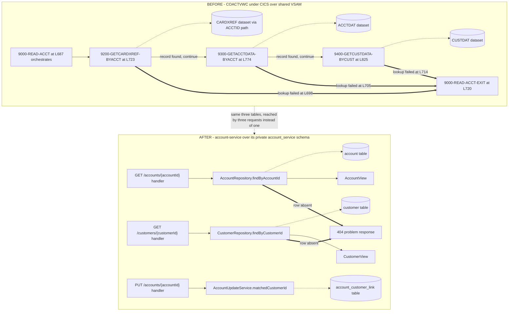

## Account Service

- [Purpose](#purpose)
- [Source provenance](#source-provenance)
- [Endpoints](#endpoints)
- [Events](#events)
- [Domain context](#domain-context)
- [Behaviour reproduced exactly](#behaviour-reproduced-exactly)
- [Architecture](#architecture)
- [Domain and data ownership](#domain-and-data-ownership)
- [Pitfalls](#pitfalls)
- [How to extend](#how-to-extend)
- [Local run and tests](#local-run-and-tests)
- [Related documentation](#related-documentation)
- [Deliberate non-additions](#deliberate-non-additions)

<br/>

## Purpose

`account-service` is a supporting query service. It serves account and customer reads, applies the
account update validation library, and exposes the billing-cycle close operation that authorization
depends on. The Maven module is `account-service` and the Java package root is `com.carddemo.account`.

It publishes only when a state change occurs, which is the boundary the requirements set for account
and card management: they act as *"supporting services queried by the above, not as event producers
unless a state change occurs."* An account update publishes. A cycle close publishes. An account read
and a customer read publish nothing.

It reads one topic. `transaction.posted` carries an amount the ledger has already posted, and
`messaging/TransactionPostedConsumer` adds that amount to the account record here, reproducing
`app/cbl/CBTRN02C.cbl:L545-L560`. A posting is a state change to the same record — `:L560` rewrites it
— so the publication rule above holds unchanged: the applied amount produces one
`AccountStateChanged`.

That listener is what makes the balance this service reports the posted one, and what makes the two
billing-cycle accumulators move at all. `ACCTDAT` was one dataset with one writer in the source; here
the record is split across three services that may not call one another. Before the listener existed
the accumulators stayed at their seeded values, so reason code 102 tested a single amount against the
credit limit instead of cumulative cycle exposure. `GET /accounts/{id}` then answered with the balance
as it stood at deployment while the ledger's `GET /balances/{id}` answered with the posted one. Neither
raised anything.

Every rule here is reimplemented from documented Common Business Oriented Language (COBOL) behaviour, and nothing in this module reaches a
mainframe. The constraint is stated in full in the requirements: *"Do not modify or require changes to
the original COBOL source as a prerequisite — the new services should consume the behavior (documented
via the tech spec / reverse-engineering output) of the COBOL programs listed above, not call into the
mainframe at runtime."*

<br/>

## Source provenance

Every row carries the file and line the behaviour was read from.

| Contribution | Source | Verified locators |
| :--- | :--- | :--- |
| Three-hop account resolution and the account view field set | `app/cbl/COACTVWC.cbl` | `9000-READ-ACCT.` L687, exit L720; `9200-GETCARDXREF-BYACCT.` L723; `9300-GETACCTDATA-BYACCT.` L774; `9400-GETCUSTDATA-BYCUST.` L825 |
| The validation library, the tolerant-parse gate, field-level compare-and-swap | `app/cbl/COACTUPC.cbl` | Fifteen paragraph starts L1681 to L2536, listed under [Behaviour reproduced exactly](#behaviour-reproduced-exactly); gate L2201; compare block L4109-L4191 |
| The two cycle-counter zeroing statements, and nothing else | `app/cbl/CBACT04C.cbl` | `1050-UPDATE-ACCOUNT.` L350; `MOVE 0 TO ACCT-CURR-CYC-CREDIT` L353; `MOVE 0 TO ACCT-CURR-CYC-DEBIT` L354; the rewrite L356 |
| Telephone, state and state-with-zip reference data | `app/cpy/CSLKPCDY.cpy` | `WS-US-PHONE-AREA-CODE-TO-EDIT` L24; `US-STATE-CODE-TO-EDIT` L1012; `US-STATE-ZIPCODE-TO-EDIT` L1071 |
| Account record layout | `app/cpy/CVACT01Y.cpy` | Twelve fields L5 to L16; 178-byte filler L17 |
| Customer record layout, adopted as canonical | `app/cpy/CVCUS01Y.cpy` | Eighteen fields L5 to L22; 168-byte filler L23 |
| Disclosure group layout | `app/cpy/CVTRA02Y.cpy` | Composite key L5 to L8; `DIS-INT-RATE` L9; 28-byte filler L10 |
| Primary keys and record sizes | `app/jcl/ACCTFILE.jcl`, `app/jcl/CUSTFILE.jcl`, `app/jcl/DISCGRP.jcl` | `KEYS(11 0)` L40 and `RECORDSIZE(300 300)` L41; `KEYS(9 0)` L50 and `RECORDSIZE(500 500)` L51; `KEYS(16 0)` L40 and `RECORDSIZE(50 50)` L41 |

One hazard to know before you search the source tree. Four members break the lower-case extension
convention the rest of the application follows: `app/cbl/CBSTM03A.CBL`, `app/cbl/CBSTM03B.CBL`,
`app/cpy/COSTM01.CPY` and `app/jcl/CREASTMT.JCL`. A glob written for lower-case extensions drops all
four without reporting anything, and two of them matter here. Match on `CB*.*` or name the members.

The complete field-to-column mapping lives in
[the traceability matrix](../../docs/traceability-matrix.md).

<br/>

## Endpoints

Four routes, and only two of them publish.

| Method and path | Source | Who may call it | Publishes |
| :--- | :--- | :--- | :--- |
| `GET /accounts/{accountId}` | `app/cbl/COACTVWC.cbl` | The account owner or an administrator | Nothing |
| `PUT /accounts/{accountId}` | `app/cbl/COACTUPC.cbl` | An administrator | One event per record the update changed: `AccountStateChanged` with change kind `ACCOUNT_UPDATED` when an account column changed, and `CustomerContextChanged` when a customer column did |
| `GET /customers/{customerId}` | `app/cbl/COACTVWC.cbl` | The customer owner or an administrator | Nothing |
| `POST /accounts/{accountId}/cycle-close` | `app/cbl/CBACT04C.cbl:L353-L354` | An administrator | `AccountStateChanged` with change kind `BILLING_CYCLE_CLOSED` |

Ownership is an authority of the form `SCOPE_ACCOUNT_<eleven digits>` or
`SCOPE_CUSTOMER_<nine digits>`, written with leading zeros exactly as the column holds them. The two
administrator-only routes derive from the signon role fork the source implements.

Both state-changing routes require `Content-Type: application/json`, and `POST .../cycle-close`
requires it even though it reads no body. That is the cross-site request forgery control. A browser
sends GET, HEAD and POST cross-origin with no preflight, carrying whatever credential it holds for the
target origin. HTTP Basic is such a credential once a browser has it, and Spring Security's own
reference notes that Basic-authenticated applications remain vulnerable. The three content types
available to that request are `application/x-www-form-urlencoded`, `multipart/form-data` and
`text/plain`; `application/json` is not among them, so a forged call must preflight and this service
answers no preflight. `SecurityConfig` refuses those three content types on any state-changing method
ahead of every route rule, so a route added later that forgets to name its media type is covered by
default. A request naming one of them reads 403; a request naming none reads 415.

That control matters most on `cycle-close`, because the finding it closes is a financial one. The
route zeroes both cycle accumulators, and those accumulators are exactly what the credit-limit rule
tests, so a forged call clears the caller's own overlimit condition.

No other service calls these routes. The authorization service used to read them synchronously and no
longer does: it keeps its own `account_credit_snapshot` projection current from the
`AccountStateChanged` events this module publishes, and holds no HTTP client at all. The two read
routes remain because an operator and the demo need them, not because a service depends on them.

Traffic still runs one way, and the module graph is what enforces it: this module declares no
dependency on another service module and holds no HTTP client. It does register one Kafka listener —
`TransactionPostedConsumer`, on `transaction.posted` — and the broker grants match, giving this
service producer rights on three topics and consumer rights on one.

The listener reproduces `app/cbl/CBTRN02C.cbl:L549-L551`: the amount is added to the current
balance, then to `current_cycle_credit` when it is not negative and to `current_cycle_debit`
when it is. Without it the two accumulators the credit-limit rule reads would never move, and
the cycle-close operation below would have nothing to reset.

The hand-written interface description is [openapi.yaml](src/main/resources/openapi.yaml). No
documentation generator is on the classpath.

A request body is held to that description. `RequestJsonStrictnessConfig` refuses a body carrying a property no request schema
declares, and refuses a property declared as text that arrives as a JavaScript Object Notation (JSON) number or a boolean. Both
answer `400`. The second is how the money rule is enforced rather than merely documented. Every amount travels as a decimal
string, and a reader left at its defaults would bind a JSON number through a binary floating-point type on the way to that
string.

### Two controls in front of every route

`config/CrossSiteRequestFilter` guards state change. A `PUT /accounts/{accountId}` and a `POST /accounts/{accountId}/cycle-close` must carry `X-CardDemo-Request` with any non-blank value, must not declare a `Sec-Fetch-Site` other than `same-origin` or `same-site`, and must not carry an `Origin` naming anything but this service. HTTP Basic is a credential a browser attaches by itself, so without this check a page on any other site could submit a form against a route above and the browser would authenticate it. An HTML form cannot set a request header at all, which is what makes one header the control. A refusal answers 403 with the same problem document every other refusal of this service answers and counts `carddemo.account.requests.cross.site.refused`. `GET`, `HEAD`, `OPTIONS` and `TRACE` pass untouched, so the container health check and every read need nothing.

`config/RequestRateCeilingFilter` bounds volume. It runs one place ahead of the security chain, because a refusal has to cost less than the attempt it refuses and an attempt that reached the chain would already have paid for a bcrypt verification.

| Ceiling | Default | Counted by |
| :--- | ---: | :--- |
| Failed authentications | 20 per 60s | Source address, and only when the request carried a credential and was answered 401 |
| Requests | 600 per 60s | Source address |
| Requests | 600 per 60s | The username the credential names, read as a counter key and never verified or logged |
| State-changing requests | 120 per 60s | Source address |
| Requests in flight | 64 | The whole instance |

A refusal answers 429 with `Retry-After` and counts `carddemo.account.requests.throttled`, tagged with the stage that refused: `authentication`, `source`, `identity`, `write` or `concurrency`. The five ceilings read `API_RATE_WINDOW_SECONDS`, `API_RATE_REQUESTS_PER_WINDOW`, `API_RATE_WRITE_REQUESTS_PER_WINDOW`, `API_RATE_AUTHENTICATION_FAILURES_PER_WINDOW` and `API_RATE_CONCURRENT_REQUESTS` from [`.env.example`](../../.env.example). The management base path is exempt, because a throttled probe reads as a failed container.

Both filters count in this process, so several replicas bound each replica rather than the service as a whole, and the source address is the one the container resolves rather than a forwarding header a caller could write. A deployment behind a proxy activates the `trusted-proxy` profile, which trusts those headers from the proxy's own addresses alone. Both residual limits are recorded in [suggested next tasks](../../docs/suggested-next-tasks.md), and the reasoning behind the two controls is in the [Decision Log](../../docs/decision-log.md).

## Events

Publication goes through a transactional outbox. `OutboxWriter` runs with mandatory propagation, so it
joins the transaction its caller already opened and starts none of its own. The domain rows and the
event row commit together or not at all. `OutboxRelay` publishes afterwards in a separate transaction,
on a 500 millisecond fixed delay in batches of 100. Nothing publishes from inside request handling.

Both events travel on the shared `EventEnvelope` from `com.carddemo.events`, whose fields are
`eventId`, `eventType`, `schemaVersion`, `occurredAt` and `aggregateId`.

`aggregateId` is always the eleven-digit account identifier, and always the Kafka message key. Kafka
orders messages within one partition only, so keying on the account is what keeps two updates to the
same account in order. The `outbox_event.aggregate_id` column is `CHAR(11)`, so a leading zero survives
and `00000000050` and `50` never become two different keys.

Money travels as a decimal string in every event payload, never as a JSON number. Each monetary field
in `schemas/account-state-changed-v1.json` is typed `string` and constrained to a pattern fixing two
decimal places. A JSON number would deserialize into a double in most parsers, which puts binary
floating point back into a system whose arithmetic is fixed-point.

| Topic | Direction | Default name | Variable that overrides it |
| :--- | :--- | :--- | :--- |
| Account state change | Published | `account.state-changed` | `TOPIC_ACCOUNT_STATE_CHANGED` |
| Customer context change | Published | `customer.context-changed` | `TOPIC_CUSTOMER_CONTEXT_CHANGED` |
| Posted transaction | Consumed | `transaction.posted` | `TOPIC_TRANSACTION_POSTED` |
| Dead-letter topic | Published | `carddemo.dead-letter` | `TOPIC_DEAD_LETTER` |

All four variables are documented in `card-platform/.env.example`, and `docker-compose.yml` creates
every topic at broker start. Broker auto-creation is switched off, so a topic no one created is a
topic no one can publish to. A row the relay cannot publish after its retries are spent goes to the
dead-letter topic with its diagnostic metadata.

The consumed topic needs a group as well as a name. The listener joins `account-posted`, overridden by
`GROUP_ACCOUNT_POSTED`, and it is this service's own: the notification service reads the same topic
under `notification-posted`, so both receive every record. Two services in one group would split the
partitions between them, and each would apply roughly half the postings without raising anything.

A delivery this service cannot apply is retried under `CONSUMER_MAX_RETRY_ATTEMPTS` and
`CONSUMER_RETRY_BACKOFF_MS`, then routed to the shared dead-letter topic as a governed
`DeadLetterEnvelope`. Nothing the refused record carried travels with it: not its key, not its value,
not one of its headers. A payload a schema control rejected is the payload most likely to hold a card
number in the wrong field.

<br/>

## Domain context

Read this before the code. Four ideas explain most of what the module does.

### What a billing cycle is

A card account gathers charges and payments over a period, and two running counters track that period:
`ACCT-CURR-CYC-CREDIT` at `app/cpy/CVACT01Y.cpy:L13` and `ACCT-CURR-CYC-DEBIT` at
`app/cpy/CVACT01Y.cpy:L14`, both `PIC S9(10)V99`. Closing the cycle sets both counters to zero and
starts the next period. In the source, that happens inside the interest program at
`app/cbl/CBACT04C.cbl:L353-L354`.

The account record carries two different notions of balance with no documented relationship between
them: `ACCT-CURR-BAL` at `app/cpy/CVACT01Y.cpy:L7`, and the two cycle counters above. The finding is
recorded in [the business rule flags](../../docs/business-rule-flags.md).

### Why the cycle-close endpoint lives here

The authorization service's credit-limit rule reads the two counters this operation zeroes.
`app/cbl/CBTRN02C.cbl` computes `ACCT-CURR-CYC-CREDIT - ACCT-CURR-CYC-DEBIT + DALYTRAN-AMT` across
L403 to L405, then tests the result against `ACCT-CREDIT-LIMIT` at L407.

`POST /accounts/{accountId}/cycle-close` reproduces L353 and L354 and nothing else. It runs no interest
computation. The `ADD WS-TOTAL-INT TO ACCT-CURR-BAL` at `app/cbl/CBACT04C.cbl:L352` is not reproduced,
because interest calculation stays a scheduled batch process and is not migrated. The route is an
operational endpoint, not an entry point into the event model for interest processing.

The other half of the same pair is why the posted-transaction listener lives here. Zeroing the counters
matters only if something moves them, and `app/cbl/CBTRN02C.cbl:L549-L551` is what moves them: the
amount is added to `ACCT-CURR-CYC-CREDIT` when it is not negative and to `ACCT-CURR-CYC-DEBIT` when it
is. One operation resets, the other accumulates, and both write the record this service owns.

### Why account resolves to customer through the cross-reference

There is no account-to-customer foreign key. `app/cpy/CVACT01Y.cpy` holds twelve fields and a
178-byte filler, and none of the twelve is a customer identifier. Resolution therefore runs in three
hops: account, then cross-reference, then customer. Figure 1 below shows those hops in both the source
and the target.

The middle hop is held here as `account_customer_link`, which carries the `XREF-ACCT-ID` and
`XREF-CUST-ID` pair of `app/cpy/CVACT03Y.cpy:L6-L7` and **no card number**. That is the whole of what
this service asks the cross-reference: which customer does this account belong to. An earlier
migration replicated the source record whole, so it stored all fifty full card numbers as its primary
key. A Primary Account Number sitting in a schema whose every query reads an account is a disclosure
surface with no reader. A security review recorded it and
[`docs/decision-log.md`](../../docs/decision-log.md) carries the decision. The authorization and card
services still hold card-keyed replicas, because both answer questions asked about a card.

### The two divergent customer copybooks

Two copies of the customer layout exist. `app/cpy/CVCUS01Y.cpy` is the canonical one and
`app/cpy/CUSTREC.cpy` is the fork, reached by a single `COPY CUSTREC.` at
`app/cbl/CBSTM03A.CBL:L55`. Six programs bind the canonical copy, including both account programs:
`CBCUS01C.cbl`, `CBTRN01C.cbl`, `COACTUPC.cbl`, `COACTVWC.cbl`, `COCRDSLC.cbl` and `COCRDUPC.cbl`.

The two files differ in exactly one field name: `CUST-DOB-YYYY-MM-DD` in the canonical copy against
`CUST-DOB-YYYYMMDD` in the fork. Every picture clause and the 168-byte filler are identical, and the
fork is indented with literal tab characters. The version stamps sit one second apart, at `23:15:59`
and `23:16:00` on 2022-07-19. The fork is documented, not merged.

<br/>

## Behaviour reproduced exactly

This section is what stops a later change from breaking parity. Every line below was read from the
source.

### The validation library

`app/cbl/COACTUPC.cbl` holds fifteen edit paragraphs. The target carries one validator class per
paragraph.

| Paragraph | Line | Role |
| :--- | :--- | :--- |
| `1205-COMPARE-OLD-NEW` | L1681 | Change detection entry |
| `1210-EDIT-ACCOUNT` | L1783 | Account identifier |
| `1215-EDIT-MANDATORY` | L1824 | Required field |
| `1220-EDIT-YESNO` | L1856 | Flag field |
| `1225-EDIT-ALPHA-REQD` | L1898 | Alphabetic required |
| `1230-EDIT-ALPHANUM-REQD` | L1955 | Alphanumeric required |
| `1235-EDIT-ALPHA-OPT` | L2012 | Alphabetic optional |
| `1240-EDIT-ALPHANUM-OPT` | L2061 | Alphanumeric optional |
| `1245-EDIT-NUM-REQD` | L2109 | Numeric required |
| `1250-EDIT-SIGNED-9V2` | L2180 | Signed decimal |
| `1260-EDIT-US-PHONE-NUM` | L2225 | Area code |
| `1265-EDIT-US-SSN` | L2431 | Social security number |
| `1270-EDIT-US-STATE-CD` | L2493 | State code |
| `1275-EDIT-FICO-SCORE` | L2514 | Credit score range |
| `1280-EDIT-US-STATE-ZIP-CD` | L2536 | State with zip prefix |

### The tolerant-parse gate

The gate sits at `app/cbl/COACTUPC.cbl:L2201`:

```cobol
IF FUNCTION TEST-NUMVAL-C(WS-EDIT-SIGNED-NUMBER-9V2-X) = 0
```

The currency-aware conversion accepts currency symbols and thousands separators, so it is not
equivalent to `new BigDecimal(String)`. Every amount routes through `NumvalParser`, which reproduces
both the tolerance and the gate. On failure the source builds its message by string concatenation: the
trimmed field name, then the literal at L2209.

### Verbatim message literals

The equivalence suite asserts on these character for character.

| Message | Locator |
| :--- | :--- |
| `' is not valid'` | `app/cbl/COACTUPC.cbl:L2209` |
| `': should be between 300 and 850'` | `app/cbl/COACTUPC.cbl:L2523` |
| `': is not a valid state code'` | `app/cbl/COACTUPC.cbl:L2503` |
| `'Invalid zip code for state'` | `app/cbl/COACTUPC.cbl:L2550` |
| `'Record changed by some one else. Please review'` | `app/cbl/COACTUPC.cbl:L522` |

Three of those four edit messages are prefixed by the trimmed field name. `'Invalid zip code for
state'` is not, and that asymmetry is in the source.

The credit-score range comes from the condition name beginning at `app/cbl/COACTUPC.cbl:L848`. FICO
here is a consumer credit score, and the source spells its bound `THROUGH`, not `THRU`, across L848 and
L849:

```cobol
88 FICO-RANGE-IS-VALID             VALUES 300
                                   THROUGH 850.
```

### Field-level compare-and-swap

`9700-CHECK-CHANGE-IN-REC.` opens at `app/cbl/COACTUPC.cbl:L4109` and its body ends at L4191.
`ConcurrentChangeDetector` re-reads both records and compares the same field set the source compares.
The mechanism is a faithful translation rather than a modernisation, and it uses no version column.

The account condition compares ten fields at L4115 to L4140. Six are compared as supplied:
`ACCT-ACTIVE-STATUS`, `ACCT-CURR-BAL`, `ACCT-CREDIT-LIMIT`, `ACCT-CASH-CREDIT-LIMIT`,
`ACCT-CURR-CYC-CREDIT` and `ACCT-CURR-CYC-DEBIT`. Three are dates, each sliced into `(1:4)`, `(6:2)`
and `(9:2)` for open date, expiry date and reissue date. The tenth is `ACCT-GROUP-ID`, with
`FUNCTION LOWER-CASE` applied to both sides at L4139 and L4140.

The customer condition compares seventeen fields at L4152 to L4186. It folds first, middle and last
name, address lines 1 through 3, state code, country code and the government-issued identifier through
`FUNCTION UPPER-CASE`. It compares address zip, both telephone numbers, the social security number, the
electronic funds transfer account identifier, the primary card holder indicator and the credit score
without folding.

The date-of-birth comparison uses mismatched offsets, and that is not a transcription error. At L4174
to L4179 the source tests `(1:4)` against `(1:4)`, then `CUST-DOB-YYYY-MM-DD(6:2)` against
`ACUP-OLD-CUST-DOB-YYYY-MM-DD(5:2)`, then `(9:2)` against `(7:2)`, because the saved copy carries no
separators. The asymmetry is one of the flagged findings recorded for this module.

A mismatch yields `Record changed by some one else. Please review`.

One further detail belongs to the write path. In the Customer Information Control System (CICS), the
statement `EXEC CICS SYNCPOINT ROLLBACK` at `app/cbl/COACTUPC.cbl:L4100` is the only rollback anywhere
in the source programs. The source rewrites two files in one unit of work, at L4066 and L4086; the
target replaces that pair with one database transaction.

### The lock wait is bounded, so the lock refusal is reachable

The compare-and-swap above needs the row held while it compares, so each of the two records is read
under a lock. PostgreSQL waits for a held row indefinitely, which meant a writer holding a row kept
this route's request open for as long as it held it. The refusal the source composes could never be
answered through contention. `app/cbl/COACTUPC.cbl:L3907`–`L3915` sets that condition whenever a
`READ UPDATE` comes back with anything other than `DFHRESP(NORMAL)`, and a wait that never ends comes
back with nothing at all.

`carddemo.write.lock-wait-ms` bounds it, defaulting to three seconds and reading `WRITE_LOCK_WAIT_MS`.
`AccountRepository.applyLockWaitBound` applies it with `set_config('lock_timeout', ?, true)`, whose
third argument makes it transaction-local, so it bounds this update and never a schema migration or
the outbox relay sweep. A bind parameter is used because PostgreSQL admits no placeholder in a `SET`
statement.

A row this route cannot take answers `409` carrying `Could not lock account record for update` or
`Could not lock customer record for update`, whichever read gave up. The outcome records the update
latency and counts as neither a validation refusal nor a failure, because contention is the caller's
circumstance rather than this service's defect. Ordinary concurrent writes are untouched: they settle
in milliseconds and still answer `Record changed by some one else. Please review`, which the bound sits
three orders of magnitude above.

### Fixed-point arithmetic

Every monetary computation pins `RoundingMode.DOWN` through `CobolDecimal` from
`com.carddemo.cobol`. The `ROUNDED` phrase appears zero times across all twenty-eight programs in the
source application, so every arithmetic store there truncates toward zero. `HALF_UP` is the reflexive
Java choice and it breaks equivalence without any visible symptom.

<br/>

## Architecture

Figure 1 shows account resolution in both states, and the two sides are not the same shape. Above, a
CICS program reads three Virtual Storage Access Method (VSAM) datasets one after another and gives up
at whichever hop fails, because the terminal filled one screen from all three. Below, the three hops
are separated by request instead of chained inside one: `GET /accounts/{accountId}` reads the account
row alone, `GET /customers/{customerId}` reads the customer row alone, and neither touches the
relationship table. A caller wanting both makes two calls.

The cross-reference hop survives the migration, and it survives on the write path. The account record
still holds no customer identifier, so `PUT /accounts/{accountId}` uses `account_customer_link`
internally to confirm that the account and customer the body names are the same pair the source screen
bound together. `AccountUpdateService` reads the one row that table holds for the account and compares
its customer identifier against both the proposed and the fetched value. That is the only production
reader of the relationship table in this schema. `V7__account_customer_link.sql` replaced the
card-number-keyed `card_xref` replica with that table, so no card number reaches this schema and there
is no lowest card number left to choose between.

**Figure 1 — Account Resolution Before and After: One Chained Three-Hop Screen Read Becomes Two Direct Reads Plus a Cross-Reference Check on the Write Path**



Legend for Figure 1:

- A plain rectangle is a unit of code: a COBOL paragraph on the before side, a handler, repository or
response type on the after side. - A cylinder is stored data. On the before side each cylinder is a
shared VSAM dataset that other programs also open. On the after side each cylinder is one table inside
this service's private schema, which no other service reads. - A thin solid arrow is control passing
from one step to the next. - A dotted arrow is a read of stored data. - A thick arrow is the
short-circuit path taken when a hop finds nothing, labelled with the source line that branches on the
before side. - The dotted arrow between the two subgraphs marks the correspondence, and the
correspondence is partial by design. The same three tables are reached, but the chaining is gone. One
screen read became two independent reads plus one write-path check, so a caller pays only for the hop
it asked for and a customer read no longer depends on an account row existing.

The platform-wide paired views live in
[the before-and-after architecture document](../../docs/architecture-before-after.md), and the
per-service entity diagrams live in [the data model](../../docs/data-model.md).

<br/>

## Domain and data ownership

The schema is `account_service`, inside this service's own database `carddemo_account`. No other
service reads it. The rule comes from the requirements: *"each service owns its own datastore (no
shared database across services)."*

`V1__schema.sql` creates eight tables.

| Table | Holds |
| :--- | :--- |
| `account` | Account master, including both cycle accumulators |
| `customer` | Canonical customer master |
| `disclosure_group` | Group identifier and interest rate |
| `us_phone_area_code` | Telephone area codes with the band each one belongs to |
| `us_state_code` | State and territory codes |
| `us_state_zip_prefix` | Valid state-with-zip-prefix combinations |
| `outbox_event` | Event rows awaiting and after publication |
| `processed_event` | Idempotency markers, one per delivery the posted-transaction listener claimed |

`V7__account_customer_link.sql` adds a ninth table, `account_customer_link`, holding 50 rows: one
account with the customer it belongs to, and no card number. It is read to resolve an account to its
customer and is never written by a request. It replaces the card-number-keyed `card_xref` replica that
`V4__card_cross_reference_replica.sql` created, which V7 drops.

**Where a subject request starts.** `customer` is the only row on this platform holding a name, so
every export and every erasure begins with a lookup here. `account_customer_link` is the hop from a
customer identifier to every account, because the account record carries no customer identifier at
all.

The procedure is in [docs/data-model.md](../../docs/data-model.md), under *Subject data: purpose,
retention, export and erasure*. It names all twenty-three stores a request reaches, the order the erasure runs in, and what
a retained broker record and a backup mean for a completed request. No endpoint, event or scheduled
task on this platform erases or exports a subject: the procedure is an operator's, and
`V12__subject_request_procedure.sql` points the three catalogue comments at it.

### Migrations

Twelve migrations run here, and four of them exist in no other module. A thirteenth file ships and
is not applied by default.

| Migration | Responsibility |
| :--- | :--- |
| `V1__schema.sql` | The eight tables above, with their constraints and indexes |
| `V2__seed.sql` | 50 accounts, 50 customers and 51 disclosure groups, matching the three fixtures record for record |
| `V3__reference_data.sql` | The validation reference data, unique to this module |
| `V4__card_cross_reference_replica.sql` | The private cross-reference copy, superseded by `V7` and dropped there. An applied migration is not edited, so it stays as it ran |
| `V5__outbox_dead_letter_state.sql` | `outbox_event.dead_letter_state`, recording whether an abandoned row still owes a diagnostic |
| `V6__processed_event_topic_key.sql` | `processed_event.topic`, so one marker identifies a delivery of one topic rather than an event identifier alone |
| `V7__account_customer_link.sql` | `account_customer_link`, replacing the `card_xref` replica with the account-to-customer pair and no card number, unique to this module |
| `V8__subject_request_posture.sql` | One column comment, re-issued. `V1` said an erasure request cleared `customer.social_security_number` with the rest of the row, and no export or erasure workflow exists anywhere on this platform to send one. It declares no table, column, index or row, and it is a migration rather than an edit to `V1` because `V1` has run |
| `V9__outbox_correlation.sql` | `outbox_event.correlation_id` and `outbox_event.causation_id`, the two identifiers the relay attaches to the record it publishes, so a state change names the request or the posted event behind it |
| `V10__outbox_aggregate_head_index.sql` | Adds `ix_outbox_event_aggregate_head`, the partial index the relay's aggregate-head claim reads. That claim answers with the due head row of each account, so two events of one account are never in flight at once and every consumer of the account's partition reads them in the order this service wrote them. Without the index the correlated check re-read an account's backlog for every candidate row |
| `V11__processed_event_claims_are_permanent.sql` | Withdraws the retention horizon of `processed_event` and drops `ix_processed_event_processed_at` with it. The 720-hour horizon bounded how long the broker could redeliver a record and said nothing about how long the balance and the two cycle accumulators a claim guards stand, so a record archived, restored or deliberately replayed after it was new to the guard and applied twice. Nothing removes a claim now, and nothing bounds the table's growth either — the partitioning work a deployment measuring real volumes would want is in `card-platform/docs/suggested-next-tasks.md` |
| `V12__subject_request_procedure.sql` | Points the `customer`, `account_customer_link` and `customer.social_security_number` comments at the subject-request procedure `card-platform/docs/data-model.md` now carries, under "Subject data: purpose, retention, export and erasure". `V7` and `V8` had replaced comments promising an erasure route with ones stating that none existed. A documented operator procedure now exists, and this schema is where a request starts: `customer` is the only row on the platform holding a name, and `account_customer_link` is the hop to every account, because the account record carries no customer identifier. No endpoint, event or scheduled task erases or exports a subject, and the comments say so. Declares no table, column, index or row |

`src/main/resources/db/demo/V900__demo_expiry_extension.sql` is the tenth, and it lives in
`db/demo` rather than `db/migration` so a plain start never applies it. It lifts every seeded account
expiry to `2099-12-31`, because the latest expiry in `app/data/ASCII/acctdata.txt` is 2025-12-28 and
reason 0103 at `app/cbl/CBTRN02C.cbl:L414-L420` would otherwise decline every live call carrying
today's date. It runs only when `spring.flyway.locations` names `classpath:db/demo` beside
`classpath:db/migration`, which both deployment paths do through `ACCOUNT_FLYWAY_LOCATIONS` —
`card-platform/docker-compose.yml` and `card-platform/deploy/k8s/30-configmap.yaml`, the latter read by
`44-account-service.yaml` — and nothing else does. Both are demo profiles, and setting that key to
`classpath:db/migration` on either path is the base-profile opt-out. The authorization service ships the matching overlay
under `AUTHORIZATION_FLYWAY_LOCATIONS`, and both have to be enabled together: `AccountStateChanged`
carries the expiry, so extending one copy and not the other would write the 2025 value back over the
extended one. `mvn verify` therefore measures the untouched fixture and the demonstration gets the
extension.

`V3__reference_data.sql` loads the 1,276 literals of `app/cpy/CSLKPCDY.cpy` as 786 rows: 490 telephone
area codes, 56 state codes and 240 state-with-zip-prefix combinations. The copybook spreads its 980
telephone literals across three condition names, and the 490 distinct codes each carry the band they
came from. [Pitfalls](#pitfalls) records what the band preserves.

### Column types worth knowing

`open_date`, `expiration_date` and `reissue_date` are each `VARCHAR(10)`, not `DATE`. The authorization
service compares account expiry as raw text against the first ten characters of a 26-character
timestamp, at `app/cbl/CBTRN02C.cbl:L414`:

```cobol
IF ACCT-EXPIRAION-DATE >= DALYTRAN-ORIG-TS (1:10)
```

Open date and reissue date get the same treatment because the compare-and-swap slices them as text.
`customer.date_of_birth` is `VARCHAR(10)` for the same reason.

The source misspells the account expiry field as `ACCT-EXPIRAION-DATE` at `app/cpy/CVACT01Y.cpy:L11`.
Target column and field names use the correct spelling, and the rename is recorded in the traceability
matrix, because no behaviour depends on the identifier text.

`disclosure_group` is retained for the interest equivalence test even though interest is not migrated.
Its composite key is `DIS-ACCT-GROUP-ID` `X(10)`, `DIS-TRAN-TYPE-CD` `X(02)` and `DIS-TRAN-CAT-CD`
`9(04)`, which is the sixteen characters `KEYS(16 0)` declares at `app/jcl/DISCGRP.jcl:L40`.

### Deliberate omissions

The traceability matrix records each of these as dropped rather than mapped:

- The 178-byte account filler at `app/cpy/CVACT01Y.cpy:L17`.
- The 168-byte customer filler at `app/cpy/CVCUS01Y.cpy:L23`.
- The 28-byte disclosure-group filler at `app/cpy/CVTRA02Y.cpy:L10`.
- The Communication Area navigation fields from `app/cpy/COCOM01Y.cpy`, which sequenced 3270 screens
  that no longer exist.
- The expiry-field rename described above.

<br/>

## Pitfalls

Five traps, each one measured during the build rather than imagined.

### 1. Skip the cycle close and the demonstration looks broken

Call `POST /accounts/{accountId}/cycle-close` between runs. Without it the two cycle accumulators never
reset, available credit shrinks with every authorization, and eventually every transaction declines.
The credit-limit rule reads exactly those two counters at `app/cbl/CBTRN02C.cbl:L403-L405` and tests
the result at L407. The only source code that zeroes them sits at `app/cbl/CBACT04C.cbl:L353-L354`,
inside a program the requirements placed out of scope.

The symptom looks like a broken demonstration and is not. It is the source's own arithmetic running
without the batch job that used to reset it.

### 2. The area-code check tests one band, not all 980

`app/cpy/CSLKPCDY.cpy` declares three condition names over the same `PIC XXX` item:
`88 VALID-PHONE-AREA-CODE` at L30 covering 490 literals, `88 VALID-GENERAL-PURP-CODE` at L521 covering
410, and `88 VALID-EASY-RECOG-AREA-CODE` at L931 covering 80. The three lists sum to 980 literals.
Measured against each other, the 490-literal list is exactly the union of the other two, and those two
share no code.

`1260-EDIT-US-PHONE-NUM` at `app/cbl/COACTUPC.cbl:L2225` moves the area code into
`WS-US-PHONE-AREA-CODE-TO-EDIT` and then tests `VALID-GENERAL-PURP-CODE` alone, at L2298. So exactly 80
area codes sit in the broad list and are still rejected by the source. Validate against all 490 and the
service accepts telephone numbers the source refuses. `us_phone_area_code` carries a band column on
every row, and `UsPhoneNumberValidator` tests the general-purpose band alone.

### 3. Fixture money fields carry an overpunched sign

A plain `new BigDecimal(substring)` throws on every monetary field in the fixtures. In
`app/data/ASCII/acctdata.txt` the first record holds `ACCT-CURR-BAL` as `00000001940{`, where the
trailing `{` is digit 0 carrying a positive sign. Under the implied `V99` that reads 0000000194.00.

| Trailing byte | Means |
| :--- | :--- |
| `{` | Digit 0, positive |
| `A` through `I` | Digits 1 through 9, positive |
| `}` | Digit 0, negative |
| `J` through `R` | Digits 1 through 9, negative |

An `S9(10)V99` field occupies 12 bytes in the fixture and an `S9(09)V99` field occupies 11.
`acctdata.txt` holds 50 records of exactly 300 bytes at these one-based offsets:

| Field | Offsets |
| :--- | :--- |
| `ACCT-ID` | 1 to 11 |
| `ACCT-ACTIVE-STATUS` | 12 |
| `ACCT-CURR-BAL` | 13 to 24 |
| `ACCT-CREDIT-LIMIT` | 25 to 36 |
| `ACCT-CASH-CREDIT-LIMIT` | 37 to 48 |
| `ACCT-OPEN-DATE` | 49 to 58 |
| `ACCT-EXPIRAION-DATE` | 59 to 68 |
| `ACCT-REISSUE-DATE` | 69 to 78 |
| `ACCT-CURR-CYC-CREDIT` | 79 to 90 |
| `ACCT-CURR-CYC-DEBIT` | 91 to 102 |
| `ACCT-ADDR-ZIP` | 103 to 112 |
| `ACCT-GROUP-ID` | 113 to 122 |
| `FILLER` | 123 to 300 |

The two companion fixtures: `custdata.txt` holds 50 records of 500 bytes and `discgrp.txt` holds 51
records of 50 bytes.

One measured detail worth carrying forward: `ACCT-GROUP-ID` is blank in all 50 records of
`acctdata.txt`, so the disclosure-group lookup misses for every account and the source default applies.

### 4. Declare the language level in every module descriptor

Every module needs `<java.version>25</java.version>`. The framework parent defaults both the language
level and the compiler release to 17. A module that omits the override compiles cleanly at release 17,
with no warning and no failure. The failure mode is silence, which is what makes it expensive. Check the
class-file major version: it must be 69, not 61.

### 5. Truncate, never round

All monetary arithmetic truncates toward zero. The `ROUNDED` phrase appears zero times across all
twenty-eight source programs, so nothing there rounds. Every `BigDecimal` operation pins
`RoundingMode.DOWN` through `CobolDecimal`. Switch to `HALF_UP` and the output still looks right while
being wrong by a cent.

### 6. A state-changing call needs one extra header

A `curl` that worked before this control answers 403 until it adds `-H 'X-CardDemo-Request: 1'`. `config/CrossSiteRequestFilter` requires the header on every `POST`, `PUT`, `PATCH` and `DELETE`, because HTTP Basic is a credential a browser attaches without being asked and an HTML form cannot set a header. Reads need nothing. The name is configurable through `API_CROSS_SITE_HEADER` and it is not a secret: the value is never checked, only its presence.

### 7. A burst answers 429 rather than being served

A load generator, a retry loop, or a test that hammers one address reaches `config/RequestRateCeilingFilter` and answers 429 with `Retry-After`. The blanket ceiling is 600 requests a minute per address and per identity, writes are 120, and 20 failed authentications from one address close the rest of that minute. Raise `API_RATE_*` for a load run rather than removing the filter, and read the `stage` tag on `carddemo.account.requests.throttled` to see which ceiling refused.

The platform-wide pitfall list is in [the onboarding guide](../../docs/onboarding.md).

<br/>

## How to extend

- **Add a validation rule by adding a class.** The validation package holds one class per source edit
  paragraph, so an addition never edits an existing chain. The source marks the seam itself, with the
  comment `* ADD MORE VALIDATIONS HERE` at `app/cbl/CBTRN02C.cbl:L377`.
- **Add a consumer of this service's events without changing this service.** A new module subscribes to
  `account.state-changed` under a consumer group of its own. Nothing here needs to know it exists.
- **Follow the repository operation-code contract.** `app/cbl/CBSTM03B.CBL:L100-L112` centralises all
  input and output behind one parameter area and one operation code. `K` becomes find by identifier, `R`
  becomes stream all, `W` becomes insert and `Z` becomes update. `O` and `C` are dropped, because
  connection lifecycle belongs to the framework.
- **Write new events through the outbox, never from a controller.** The pattern's ancestor is
  `EXEC CICS WRITEQ TD QUEUE('JOBS')` at `app/cbl/CORPT00C.cbl:L517-L518`. The measured case for
  atomicity is sharpest in this module's own source. The account update program rewrites two files in one
  unit of work, at `app/cbl/COACTUPC.cbl:L4066` and L4086, and all eight `DEFINE FILE` blocks in
  `app/csd/CARDDEMO.CSD` carry `RECOVERY(NONE)` and `JOURNAL(NO)`.

Improvements found during the build but left out of scope are listed in
[the suggested next tasks](../../docs/suggested-next-tasks.md).

<br/>

## Local run and tests

### Prerequisites

| Component | Version |
| :--- | :--- |
| Java runtime and compiler | Eclipse Temurin OpenJDK 25.0.4+7 |
| Build tool | Apache Maven 3.9.16 |
| Containers | Docker Engine 29.7.0 or later with Docker Compose 5.3.1 or later |
| Broker image | `apache/kafka:4.2.1` |
| Database image | `postgres:18.4` |

The build runtime and the build tool are exact because the enforcer plugin refuses a build outside `[25,26)` and `[3.9.16,3.10.0)`; a newer Maven fails rather than passes. The image tags are exact because each is pinned by digest as well. Docker Engine and Compose are floors: nothing here constrains them, so the versions given are the ones this was exercised on.

### Runtime facts

| Setting | Value |
| :--- | :--- |
| Container ports | 8080 for the service, 9080 for management |
| Published on the host | 8085 through `ACCOUNT_PORT`, 9085 through `ACCOUNT_MANAGEMENT_PORT` |
| Database and schema | `carddemo_account`, schema `account_service`, on host `postgres` port 5432 |
| Database login | `carddemo_account_svc`, password from `ACCOUNT_DB_PASSWORD` |
| Kafka bootstrap | `kafka:29092`, running in Kafka Raft (KRaft) mode |
| Broker login | `carddemo-account`, password from `ACCOUNT_KAFKA_PASSWORD` |
| Listener concurrency | 3 threads on the posted-transaction topic, one per partition |
| Outbox relay | 500 millisecond fixed delay, batch size 100 |
| Scheduler threads | 2, one for the relay and one for the retention drain |
| Datasource pool | At most 12 connections, 4 kept idle |
| Health check | `/actuator/health` on the management port |
| Actuator endpoints | `health`, `metrics`, `prometheus` |

Neither password carries a default. An unset one stops start-up rather than signing on under a password
this repository publishes. The commands under [Commands](#commands) generate all nineteen values,
including the four encoded hashes the request identities need.

`docker-compose.yml` sets these properties, and each one overrides the shipped default:
`SPRING_DATASOURCE_URL`, `SPRING_DATASOURCE_USERNAME`, `SPRING_DATASOURCE_PASSWORD`,
`SPRING_JPA_PROPERTIES_HIBERNATE_DEFAULT_SCHEMA`, `SPRING_FLYWAY_SCHEMAS`,
`SPRING_FLYWAY_DEFAULT_SCHEMA` and `SPRING_KAFKA_BOOTSTRAP_SERVERS`.

### Commands

Run these from `card-platform/`. Step 1 gives every credential a value. Nothing in it prompts, and the
nineteen `REPLACE` markers of `.env.example` are all set when it finishes.

```bash
# The hash helper inside the script reads spring-security-crypto out of the local Maven
# repository, so this has to have run once on this machine.
mvn -B -ntp -DskipTests package

# install -m 600, never cp: this file holds fourteen passwords and the card-token key a
# moment later, and cp creates it under the umask -- world-readable on a default account.
install -m 600 .env.example .env

# Fill all nineteen REPLACE markers: fourteen passwords, one card-token key and four
# {bcrypt} identity hashes. This one command generates every one of them, keeps each
# plaintext out of the environment, and writes the four demo passwords to
# .demo-credentials with owner-only permissions. Re-running changes nothing already set.
scripts/generate-env.sh

# Prove none is left. The count is read from the file, so it cannot disagree with it.
grep -c '^[A-Za-z_][A-Za-z0-9_]*=.*REPLACE' .env
```

`scripts/generate-env.sh` is the canonical path and reads the credential names out of `.env.example`, so a credential added there needs no edit here. [Onboarding](../../docs/onboarding.md) sets out the same nineteen values by hand, including the `jshell` invocation that encodes each `{bcrypt}` hash and the single quotes Compose needs around one. `mvn package` below builds every module, so every image has an archive to copy.

Step 2 starts the three containers this service needs and waits for each to report healthy, so the
health request cannot race start-up:

```bash
docker compose up -d --build --wait postgres kafka account-service
curl -fsS http://localhost:9085/actuator/health
```

Then one call per route. Every business route needs an identity, so `-u` carries one. Give `-u` the
user name alone and `curl` prompts for the password, which keeps it out of the process environment and
out of the shell history. `.env` holds only the bcrypt hash, so supply the plaintext you chose when you
generated that hash. The two reads accept the ordinary identity because the shipped scopes name record
1 of the account fixture. The update and the cycle close need the administrator identity.

> **Synthetic data only.** Every identifier, name, address and amount below comes from the public
> repository fixtures `app/data/ASCII/acctdata.txt` and `app/data/ASCII/custdata.txt`. None describes a
> real person or account. Never send real personal or account data to this service.

```bash
curl -fsS -u "admin001:$ADMIN_PASSWORD" \
  http://localhost:8085/accounts/00000000001
curl -fsS -u "admin001:$ADMIN_PASSWORD" \
  http://localhost:8085/customers/000000001
curl -fsS -u "$ADMIN_USERNAME:the password you chose" -X POST \
  -H 'X-CardDemo-Request: account-cli' \
  http://localhost:8085/accounts/00000000001/cycle-close
curl -fsS -u "$ADMIN_USERNAME:the password you chose" -X PUT \
  -H 'X-CardDemo-Request: account-cli' \
  -H 'Content-Type: application/json' \
  --data-binary @update.json \
  http://localhost:8085/accounts/00000000001
```

The update takes a body, and the body is written inline here rather than read from a file so the command
can be copied and run as it stands. It is the `wholeScreenSubmit` example of
`src/main/resources/openapi.yaml`, which `api/OpenApiContractTest` holds against the delivered request
type, so it names every component the schema declares and no component it does not. It updates account
`00000000050` and its customer `000000050`, both from the shipped fixtures:

```bash
curl -fsS -u admin001 -X PUT \
  -H 'X-CardDemo-Request: account-cli' \
  -H 'Content-Type: application/json' \
  http://localhost:8085/accounts/00000000050 \
  -d '{
        "accountData": {
          "activeStatus": "Y",
          "currentBalance": "492.00",
          "creditLimit": "6169.00",
          "cashCreditLimit": "4587.00",
          "openDate": "20110422",
          "expirationDate": "20230309",
          "reissueDate": "20230309",
          "currentCycleCredit": "0.00",
          "currentCycleDebit": "0.00",
          "groupId": ""
        },
        "customerData": {
          "customerId": "000000050",
          "firstName": "Aniya",
          "middleName": "Alba",
          "lastName": "Von",
          "addressLine1": "1588 Nienow Cape",
          "addressLine2": "Suite 187",
          "addressCity": "New Aricchester",
          "addressStateCode": "OR",
          "addressCountryCode": "USA",
          "addressZip": "97201",
          "phoneNumber1": "(325)301-0827",
          "phoneNumber2": "(503)985-9283",
          "socialSecurityPart1": "111",
          "socialSecurityPart2": "11",
          "socialSecurityPart3": "1111",
          "governmentIssuedId": "SPECIMEN-0000000001",
          "dateOfBirth": "19601201",
          "eftAccountId": "0074883577",
          "primaryCardHolderIndicator": "Y",
          "ficoCreditScore": "623"
        }
      }'
```

**The body carries proposed values only, not the values first fetched.** That correction matters,
because the earlier description would send a reader looking for fields the schema does not declare.
`AccountUpdateRequest` has exactly two components, `accountData` and `customerData`, and each holds one
proposed value per editable field. The controller reads the baseline itself: `fetchedCopy` re-reads the
stored row inside the same transaction and `ConcurrentChangeDetector` compares that baseline against the
proposed values field by field, reproducing `app/cbl/COACTUPC.cbl:L4109-L4193`. A row another writer
changed in between is answered `409` with the source's own text rather than overwritten.

Two consequences follow from the same design. An **omitted component** is not filled from the stored
row — it reaches the edit that owns the field and is refused there, because a 3270 map field was fixed
width and an operator who cleared a field sent spaces. `groupId` is the single exception and keeps its
stored value, since no source paragraph edits it. An **absent block** — `accountData` or `customerData`
sent as null — answers a copy of the stored row, which is how a caller updates one of the two alone.
`src/main/resources/openapi.yaml` gives the full shape.

### Metrics this service registers

Sixteen meters, fourteen registered by `config/ObservabilityConfig` and two by
`config/OutboxBacklogMetrics`, readable at `/actuator/metrics` and `/actuator/prometheus` on the
management port. Two more are registered by the request filters and described with them:
`carddemo.account.requests.cross.site.refused` and `carddemo.account.requests.throttled`.

| Meter | Tags | What it counts or times |
| :--- | :--- | :--- |
| `carddemo.account.events.consumed` | none | Posted-transaction deliveries this service read |
| `carddemo.account.posting.latency` | none | Wall time of one posted-transaction delivery |
| `carddemo.account.posting.applied` | none | Posted amounts applied to the account record |
| `carddemo.account.posting.duplicates.skipped` | none | Duplicate posted-transaction deliveries the marker suppressed |
| `carddemo.account.update.latency` | none | Wall time of one account update, from request entry to commit |
| `carddemo.account.update.applied` | none | Account updates that committed |
| `carddemo.account.validation.failed` | none | Submitted account or customer fields rejected by validation |
| `carddemo.account.cycle.closed` | none | Billing cycle closes that committed |
| `carddemo.account.outbox.published` | none | Outbox rows published to the broker |
| `carddemo.account.publish.failed` | none | Outbox publish attempts that failed |
| `carddemo.account.outbox.abandoned` | none | Outbox rows given up on after exhausting their attempts |
| `carddemo.account.outbox.due` | Gauge | Outbox rows due for an attempt now, being the backlog not yet published. A gauge rather than a counter, because a backlog is a state and not an event |
| `carddemo.account.outbox.oldest.due.age` | Gauge | Seconds the longest-waiting due outbox row has waited, zero when none is due. It separates a service working through a burst from a stopped relay |
| `carddemo.account.dead.letters.published` | none | Terminal diagnostics the broker acknowledged |
| `carddemo.account.dead.letters.failed` | none | Terminal diagnostic attempts the broker refused |
| `carddemo.account.transaction.failures` | `operation` | Account transactions that rolled back or failed to commit |

Three of those pair up in ways worth knowing before reading a dashboard. `outbox.published` and
`publish.failed` count attempts, so one row that fails twice and then succeeds adds two to the second
and one to the first. `outbox.abandoned` counts rows rather than attempts, and it is the one to alert
on: a row reaching it has stopped being retried. `dead.letters.published` and `dead.letters.failed`
then say whether the diagnostic for that abandoned row reached the broker, so an abandoned row with no
published diagnostic is an event that left no record anywhere. `transaction.failures` is the only
tagged meter here, on `operation`, whose three values are `update`, `cycle-close` and `posting`.

<br/>

### Four settings shared with every other service

- Consumer auto-commit is off, with manual acknowledgement after side effects commit. The
  posted-transaction listener acknowledges after its transaction commits, so no offset commits ahead of
  the write it stands for.
- Producer idempotence is on, with acknowledgement from all replicas.
- `ddl-auto` is `validate`, never `update` and never `create`. Flyway owns schema creation, which is how
  the derived column types and the ten-character date columns survive.
- Actuator exposes health, metrics and Prometheus output, on the management port only.

The platform map and the full quickstart are in [the platform README](../../README.md).

<br/>

## Deliberate non-additions

Each of these is absent on purpose.

- **No interest computation.** Only the two zeroing statements at `app/cbl/CBACT04C.cbl:L353-L354` are
reproduced. - **No account-to-customer foreign key.** The account record carries no customer identifier
field. - **No version column.** Concurrency is field-level compare-and-swap only, reproducing
`app/cbl/COACTUPC.cbl:L4109-L4191` including both case folds and the mismatched date-of-birth offsets. -
**No account-status check on any authorization or posting path.** The field exists at
`app/cpy/CVACT01Y.cpy:L6` and no source program tests it before posting. A closed account still posts. -
**No card number anywhere in this schema.** The card record, its `CARD-CVV-CD` and every card-number
checksum question belong to the card service. `V4__card_cross_reference_replica.sql` did hold a
`card_xref` replica of 50 rows keyed by the full sixteen-digit card number, and
`V7__account_customer_link.sql` drops it. The one reader, `AccountUpdateService`, read that row for its
`customer_id` alone, so the pair is what `account_customer_link` keeps and the card number is what it
does not. No route accepts a card number, none returns one, and no event this service publishes carries
one. - **No behavioural change from the spelling correction.** Only target identifier names change. -
**No code generator or mapping framework.** Java records and explicit mapper classes carry the
translation, and `openapi.yaml` is written by hand. - **No cache, no key-value store, no user interface,
no component library, no content-delivery-network dependency.** - **No COBOL compiler, emulator or
mainframe connector on the classpath.**

The reasoning behind each one is in [the decision log](../../docs/decision-log.md).

<br/>

## Related documentation

- [Platform README](../../README.md)
- [Onboarding](../../docs/onboarding.md)
- [Decision Log](../../docs/decision-log.md)
- [Traceability Matrix](../../docs/traceability-matrix.md)
- [Data Model](../../docs/data-model.md)
- [Business Rule Flags](../../docs/business-rule-flags.md)
- [Equivalence Results](../../docs/equivalence-results.md)
