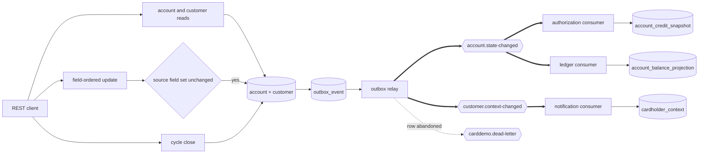
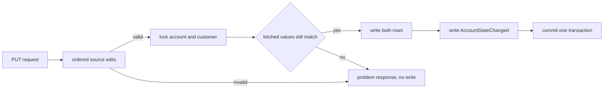

## Account Service

- [Purpose](#purpose)
- [Source provenance](#source-provenance)
- [Endpoints](#endpoints)
- [Events](#events)
- [Domain and data ownership](#domain-and-data-ownership)
- [Pitfalls](#pitfalls)
- [Architecture](#architecture)
- [How to extend](#how-to-extend)
- [Local run and tests](#local-run-and-tests)
- [Related documentation](#related-documentation)

<br/>

## Purpose

`account-service` owns account, customer, disclosure-group, and validation-reference data. It exposes account and customer reads, a coordinated account-plus-customer update, and the narrow billing-cycle close required by authorization. Only mutations publish: an update or a cycle close produces `AccountStateChanged`, and an update that moves a cardholder field also produces `CustomerContextChanged`. Reads publish nothing.

<br/>

## Source provenance

| Contribution | Source |
| :--- | :--- |
| Account and customer view | `app/cbl/COACTVWC.cbl` |
| Ordered field edits and two-record update | `app/cbl/COACTUPC.cbl` |
| Field-level concurrent-change check | `app/cbl/COACTUPC.cbl:L4109-L4191` |
| Cycle accumulator reset only | `app/cbl/CBACT04C.cbl:L350-L356` |
| Account record | `app/cpy/CVACT01Y.cpy:L4-L17` |
| Canonical customer record | `app/cpy/CVCUS01Y.cpy:L4-L23` |
| Disclosure rate record | `app/cpy/CVTRA02Y.cpy:L4-L10` |
| Telephone, state, and state-ZIP lists | `app/cpy/CSLKPCDY.cpy` |

Interest calculation is not migrated. `BillingCycleService` reproduces only the two statements at `app/cbl/CBACT04C.cbl:L353-L354`.

<br/>

## Endpoints

| Method and path | Access | Behavior |
| :--- | :--- | :--- |
| `GET /accounts/{accountId}` | Account owner or `ADMIN` | Read one account |
| `PUT /accounts/{accountId}` | Account owner or `ADMIN` | Validate and update one account-customer pair |
| `POST /accounts/{accountId}/cycle-close` | Account owner or `ADMIN` | Zero both cycle accumulators |
| `GET /customers/{customerId}` | Customer owner or `ADMIN` | Read one customer |

The update request carries both the values first fetched and the proposed values. The service re-reads both rows under locks and applies the source field-level comparison before writing.

The full contract is [OpenAPI](src/main/resources/openapi.yaml). Business traffic uses port 8085 and management traffic uses 9085.

<br/>

## Events

| Producer path | Topic | Event | Condition |
| :--- | :--- | :--- | :--- |
| Account update | `account.state-changed` | `AccountStateChanged` with `ACCOUNT_UPDATED` | Both records changed and committed |
| Cycle close | `account.state-changed` | `AccountStateChanged` with `BILLING_CYCLE_CLOSED` | The account existed and committed |
| Account update | `customer.context-changed` | `CustomerContextChanged` | The update changed a cardholder field the statement renderer reads |
| Outbox relay failure | `carddemo.dead-letter` | `DeadLetterEnvelope` | Publish retries were exhausted |

An unchanged update produces no event. A missing account on cycle close produces no event. The account row, customer row when applicable, and event row commit atomically before the relay publishes.

Both events validate against their governed schema inside the transaction that writes them, so an event this service could never publish is refused while its own transaction can still roll back.

`AccountStateChanged` feeds two independent replicas. The authorization service consumes it under `authorization-account-state` to maintain its private credit snapshot, and the ledger consumes it under `ledger-account-state` to bootstrap and refresh `account_balance_projection`. `CustomerContextChanged` feeds notification's renderer context under `notification-customer`. This service calls none of the three, and none of them calls it: no synchronous account-service call sits on the authorization path.

<br/>

## Domain and data ownership

The private database is `carddemo_account`, with schema `account_service`.

| Table | Role |
| :--- | :--- |
| `account` | Account master and cycle accumulators |
| `customer` | Canonical customer master |
| `disclosure_group` | Group and interest-rate reference |
| `us_phone_area_code` | 490 codes annotated by validation band |
| `us_state_code` | 56 state and territory codes |
| `us_state_zip_prefix` | 240 valid state-plus-prefix combinations |
| `outbox_event` | Durable unpublished and published events |
| `processed_event` | Retention-compatible marker table; the module currently consumes no event |

The migrations have distinct jobs:

| Migration | Responsibility |
| :--- | :--- |
| `V1__schema.sql` | Eight tables, constraints, and indexes |
| `V2__seed.sql` | Account, customer, and disclosure-group fixtures |
| `V3__reference_data.sql` | 786 rows encoding 1,276 copybook literals |
| `V4__card_cross_reference_replica.sql` | The private cross-reference copy this service reads to resolve a customer to an account |
| `V5__outbox_dead_letter_state.sql` | `outbox_event.dead_letter_state`, the durable record of whether an abandoned row still owes a dead-letter diagnostic |

The phone source contains 490 broad-list entries plus 410 general-purpose and 80 easily recognised entries. The table stores one row per distinct code and records its narrower band.

<br/>

## Pitfalls

1. **Close the billing cycle before repeated demonstrations.** Without it, both accumulators keep growing and the authorization input never returns to a new-cycle state.
2. **The cycle close does not calculate interest.** Adding rate arithmetic there would violate the scope boundary.
3. **Dates remain ten-character strings.** Authorization compares account expiry lexically against a timestamp prefix.
4. **Concurrency is field-level, not version-column based.** Ten account fields and seventeen customer fields define the source conflict set.
5. **Date separators are not compared.** The source compares year, month, and day slices only.
6. **The cross-reference here is a private replica, not the owning copy.** `V4__card_cross_reference_replica.sql` holds 50 rows so an account can be resolved to its own customer instead of trusting a caller-supplied pairing. The card service owns the record; this copy is read and never written by a request.
7. **Validation keeps fixed-width semantics.** Case folds, padding, tolerant numeric parsing, and the 300-to-850 credit-score range are intentional.
8. **Java 25 is explicit.** Class-file major version must be 69, not 61.

<br/>

## Architecture

Figure 1 shows the two mutation paths and the asynchronous projection update.

**Figure 1 — Account Mutation and Authorization Snapshot Flow**



Legend for Figure 1:

- Plain arrows are request, comparison, or database work.
- Thick arrows are Kafka publish and consume.
- The dotted arrow is the terminal dead-letter route a spent outbox row takes.
- The diamond is the source-compatible concurrent-change gate.
- Cylinders are private tables in different service schemas.
- Reads stop at the account database and publish nothing.
- One `account.state-changed` event feeds two independent replicas under two consumer groups.

Figure 2 shows the local transaction around a successful account update.

**Figure 2 — Account Update Transaction: Lock, Compare, Validate, and Commit**



Legend for Figure 2:

- Rectangles are in-process stages.
- The diamond is the field-level compare-and-swap.
- Both domain rows and the event row commit together.
- Validation, lock, or comparison failure writes nothing.

The platform-wide event view is in [Event Flow](../../docs/event-flow.md).

<br/>

## How to extend

- Add an account field only after updating the copybook mapping, entity, migration, request, response, edit chain, and concurrent-change set.
- Add a new mutation event through `OutboxWriter`; do not publish from a controller.
- Add reference data through a versioned Flyway migration and a repository-backed validator.
- Keep any future interest migration separate from the current cycle-close operation.

<br/>

## Local run and tests

| Component | Exact value |
| :--- | :--- |
| Build runtime | Eclipse Temurin OpenJDK 25.0.4+7 |
| Build tool | Apache Maven 3.9.16 |
| Broker image | `apache/kafka:4.2.1` |
| Database image | `postgres:18.4` |
| Business port | 8085 |
| Management port | 9085 |
| Database and schema | `carddemo_account.account_service` |
| Published topics | `account.state-changed`, `customer.context-changed`, `carddemo.dead-letter` |
| Consumer groups | None. This service registers no listener |

From `card-platform/`:

```bash
mvn -B -pl services/account-service -am test
mvn -B -pl services/account-service -am package
docker compose up -d --build account-service
curl -fsS http://localhost:9085/actuator/health
```

The Dockerfile copies the packaged archive from `target/`, so build the module before its image.

Direct tests cover all controllers, the OpenAPI contract, update orchestration, cycle close, validation order, field-level concurrency, outbox writes, reference-data migrations, and schema mappings.

<br/>

## Related documentation

- [Platform README](../../README.md)
- [Onboarding](../../docs/onboarding.md)
- [Decision Log](../../docs/decision-log.md)
- [Traceability Matrix](../../docs/traceability-matrix.md)
- [Data Model](../../docs/data-model.md)
- [Business Rule Flags](../../docs/business-rule-flags.md)
- [Equivalence Results](../../docs/equivalence-results.md)