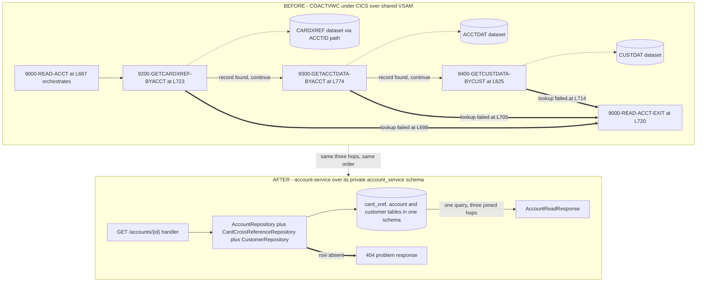

## Account Service

- [Purpose](#purpose)
- [Source provenance](#source-provenance)
- [Endpoints](#endpoints)
- [Events](#events)
- [Domain context](#domain-context)
- [Behaviour reproduced exactly](#behaviour-reproduced-exactly)
- [Architecture](#architecture)
- [Domain and data ownership](#domain-and-data-ownership)
- [Pitfalls](#pitfalls)
- [How to extend](#how-to-extend)
- [Local run and tests](#local-run-and-tests)
- [Related documentation](#related-documentation)
- [Deliberate non-additions](#deliberate-non-additions)

<br/>

## Purpose

`account-service` is a supporting query service. It serves account and customer reads, applies the
account update validation library, and exposes the billing-cycle close operation that authorization
depends on. The Maven module is `account-service` and the Java package root is `com.carddemo.account`.

It publishes only when a state change occurs, which is the boundary the requirements set for account
and card management: they act as *"supporting services queried by the above, not as event producers
unless a state change occurs."* An account update publishes. A cycle close publishes. An account read
and a customer read publish nothing.

It reads one topic. `transaction.posted` carries an amount the ledger has already posted, and
`messaging/TransactionPostedConsumer` adds that amount to the account record here, reproducing
`app/cbl/CBTRN02C.cbl:L545-L560`. A posting is a state change to the same record — `:L560` rewrites it
— so the publication rule above holds unchanged: the applied amount produces one
`AccountStateChanged`.

That listener is what makes the balance this service reports the posted one, and what makes the two
billing-cycle accumulators move at all. `ACCTDAT` was one dataset with one writer in the source; here
the record is split across three services that may not call one another. Before the listener existed
the accumulators stayed at their seeded values, so reason code 102 tested a single amount against the
credit limit instead of cumulative cycle exposure, and `GET /accounts/{id}` answered with the balance
as it stood at deployment while the ledger's `GET /balances/{id}` answered with the posted one. Neither
raised anything.

Every rule here is reimplemented from documented COBOL behaviour, and nothing in this module reaches a
mainframe. The constraint is stated in full in the requirements: *"Do not modify or require changes to
the original COBOL source as a prerequisite — the new services should consume the behavior (documented
via the tech spec / reverse-engineering output) of the COBOL programs listed above, not call into the
mainframe at runtime."*

<br/>

## Source provenance

Every row carries the file and line the behaviour was read from.

| Contribution | Source | Verified locators |
| :--- | :--- | :--- |
| Three-hop account resolution and the account view field set | `app/cbl/COACTVWC.cbl` | `9000-READ-ACCT.` L687, exit L720; `9200-GETCARDXREF-BYACCT.` L723; `9300-GETACCTDATA-BYACCT.` L774; `9400-GETCUSTDATA-BYCUST.` L825 |
| The validation library, the tolerant-parse gate, field-level compare-and-swap | `app/cbl/COACTUPC.cbl` | Fifteen paragraph starts L1681 to L2536, listed under [Behaviour reproduced exactly](#behaviour-reproduced-exactly); gate L2201; compare block L4109-L4191 |
| The two cycle-counter zeroing statements, and nothing else | `app/cbl/CBACT04C.cbl` | `1050-UPDATE-ACCOUNT.` L350; `MOVE 0 TO ACCT-CURR-CYC-CREDIT` L353; `MOVE 0 TO ACCT-CURR-CYC-DEBIT` L354; the rewrite L356 |
| Telephone, state and state-with-zip reference data | `app/cpy/CSLKPCDY.cpy` | `WS-US-PHONE-AREA-CODE-TO-EDIT` L24; `US-STATE-CODE-TO-EDIT` L1012; `US-STATE-ZIPCODE-TO-EDIT` L1071 |
| Account record layout | `app/cpy/CVACT01Y.cpy` | Twelve fields L5 to L16; 178-byte filler L17 |
| Customer record layout, adopted as canonical | `app/cpy/CVCUS01Y.cpy` | Eighteen fields L5 to L22; 168-byte filler L23 |
| Disclosure group layout | `app/cpy/CVTRA02Y.cpy` | Composite key L5 to L8; `DIS-INT-RATE` L9; 28-byte filler L10 |
| Primary keys and record sizes | `app/jcl/ACCTFILE.jcl`, `app/jcl/CUSTFILE.jcl`, `app/jcl/DISCGRP.jcl` | `KEYS(11 0)` L40 and `RECORDSIZE(300 300)` L41; `KEYS(9 0)` L50 and `RECORDSIZE(500 500)` L51; `KEYS(16 0)` L40 and `RECORDSIZE(50 50)` L41 |

One hazard to know before you search the source tree. Four members break the lower-case extension
convention the rest of the application follows: `app/cbl/CBSTM03A.CBL`, `app/cbl/CBSTM03B.CBL`,
`app/cpy/COSTM01.CPY` and `app/jcl/CREASTMT.JCL`. A glob written for lower-case extensions drops all
four without reporting anything, and two of them matter here. Match on `CB*.*` or name the members.

The complete field-to-column mapping lives in
[the traceability matrix](../../docs/traceability-matrix.md).

<br/>

## Endpoints

Four routes, and only two of them publish.

| Method and path | Source | Who may call it | Publishes |
| :--- | :--- | :--- | :--- |
| `GET /accounts/{accountId}` | `app/cbl/COACTVWC.cbl` | The account owner or an administrator | Nothing |
| `PUT /accounts/{accountId}` | `app/cbl/COACTUPC.cbl` | An administrator | One event per record the update changed: `AccountStateChanged` with change kind `ACCOUNT_UPDATED` when an account column changed, and `CustomerContextChanged` when a customer column did |
| `GET /customers/{customerId}` | `app/cbl/COACTVWC.cbl` | The customer owner or an administrator | Nothing |
| `POST /accounts/{accountId}/cycle-close` | `app/cbl/CBACT04C.cbl:L353-L354` | An administrator | `AccountStateChanged` with change kind `BILLING_CYCLE_CLOSED` |

Ownership is an authority of the form `SCOPE_ACCOUNT_<eleven digits>` or
`SCOPE_CUSTOMER_<nine digits>`, written with leading zeros exactly as the column holds them. The two
administrator-only routes derive from the signon role fork the source implements.

The authorization service calls the two read routes synchronously. Traffic runs one way: this module
declares no dependency on another service module, holds no HTTP client, and registers no Kafka
listener. The broker enforces the same shape, granting this service producer rights on three topics
and consumer rights on none.

The hand-written interface description is [openapi.yaml](src/main/resources/openapi.yaml). No
documentation generator is on the classpath.

## Events

Publication goes through a transactional outbox. `OutboxWriter` runs with mandatory propagation, so it
joins the transaction its caller already opened and starts none of its own. The domain rows and the
event row commit together or not at all. `OutboxRelay` publishes afterwards in a separate transaction,
on a 500 millisecond fixed delay in batches of 100. Nothing publishes from inside request handling.

Both events travel on the shared `EventEnvelope` from `com.carddemo.events`, whose fields are
`eventId`, `eventType`, `schemaVersion`, `occurredAt` and `aggregateId`.

`aggregateId` is always the eleven-digit account identifier, and always the Kafka message key. Kafka
orders messages within one partition only, so keying on the account is what keeps two updates to the
same account in order. The `outbox_event.aggregate_id` column is `CHAR(11)`, so a leading zero survives
and `00000000050` and `50` never become two different keys.

Money travels as a decimal string in every event payload, never as a JSON number. Each monetary field
in `schemas/account-state-changed-v1.json` is typed `string` and constrained to a pattern fixing two
decimal places. A JSON number would deserialize into a double in most parsers, which puts binary
floating point back into a system whose arithmetic is fixed-point.

| Topic | Direction | Default name | Variable that overrides it |
| :--- | :--- | :--- | :--- |
| Account state change | Published | `account.state-changed` | `TOPIC_ACCOUNT_STATE_CHANGED` |
| Customer context change | Published | `customer.context-changed` | `TOPIC_CUSTOMER_CONTEXT_CHANGED` |
| Posted transaction | Consumed | `transaction.posted` | `TOPIC_TRANSACTION_POSTED` |
| Dead-letter topic | Published | `carddemo.dead-letter` | `TOPIC_DEAD_LETTER` |

All four variables are documented in `card-platform/.env.example`, and `docker-compose.yml` creates
every topic at broker start. Broker auto-creation is switched off, so a topic no one created is a
topic no one can publish to. A row the relay cannot publish after its retries are spent goes to the
dead-letter topic with its diagnostic metadata.

The consumed topic needs a group as well as a name. The listener joins `account-posted`, overridden by
`GROUP_ACCOUNT_POSTED`, and it is this service's own: the notification service reads the same topic
under `notification-posted`, so both receive every record. Two services in one group would split the
partitions between them, and each would apply roughly half the postings without raising anything.

A delivery this service cannot apply is retried under `CONSUMER_MAX_RETRY_ATTEMPTS` and
`CONSUMER_RETRY_BACKOFF_MS`, then routed to the shared dead-letter topic as a governed
`DeadLetterEnvelope`. Nothing the refused record carried travels with it — not its key, not its value,
not one of its headers — because a payload a schema control rejected is the payload most likely to hold
a card number in the wrong field.

<br/>

## Domain context

Read this before the code. Four ideas explain most of what the module does.

### What a billing cycle is

A card account gathers charges and payments over a period, and two running counters track that period:
`ACCT-CURR-CYC-CREDIT` at `app/cpy/CVACT01Y.cpy:L13` and `ACCT-CURR-CYC-DEBIT` at
`app/cpy/CVACT01Y.cpy:L14`, both `PIC S9(10)V99`. Closing the cycle sets both counters to zero and
starts the next period. In the source, that happens inside the interest program at
`app/cbl/CBACT04C.cbl:L353-L354`.

The account record carries two different notions of balance with no documented relationship between
them: `ACCT-CURR-BAL` at `app/cpy/CVACT01Y.cpy:L7`, and the two cycle counters above. The finding is
recorded in [the business rule flags](../../docs/business-rule-flags.md).

### Why the cycle-close endpoint lives here

The authorization service's credit-limit rule reads the two counters this operation zeroes.
`app/cbl/CBTRN02C.cbl` computes `ACCT-CURR-CYC-CREDIT - ACCT-CURR-CYC-DEBIT + DALYTRAN-AMT` across
L403 to L405, then tests the result against `ACCT-CREDIT-LIMIT` at L407.

`POST /accounts/{accountId}/cycle-close` reproduces L353 and L354 and nothing else. It runs no interest
computation. The `ADD WS-TOTAL-INT TO ACCT-CURR-BAL` at `app/cbl/CBACT04C.cbl:L352` is not reproduced,
because interest calculation stays a scheduled batch process and is not migrated. The route is an
operational endpoint, not an entry point into the event model for interest processing.

The other half of the same pair is why the posted-transaction listener lives here. Zeroing the counters
matters only if something moves them, and `app/cbl/CBTRN02C.cbl:L549-L551` is what moves them: the
amount is added to `ACCT-CURR-CYC-CREDIT` when it is not negative and to `ACCT-CURR-CYC-DEBIT` when it
is. One operation resets, the other accumulates, and both write the record this service owns.

### Why account resolves to customer through the cross-reference

There is no account-to-customer foreign key. `app/cpy/CVACT01Y.cpy` holds twelve fields and a
178-byte filler, and none of the twelve is a customer identifier. Resolution therefore runs in three
hops: account, then cross-reference, then customer. Figure 1 below shows those hops in both the source
and the target.

### The two divergent customer copybooks

Two copies of the customer layout exist. `app/cpy/CVCUS01Y.cpy` is the canonical one and
`app/cpy/CUSTREC.cpy` is the fork, reached by a single `COPY CUSTREC.` at
`app/cbl/CBSTM03A.CBL:L55`. Six programs bind the canonical copy, including both account programs:
`CBCUS01C.cbl`, `CBTRN01C.cbl`, `COACTUPC.cbl`, `COACTVWC.cbl`, `COCRDSLC.cbl` and `COCRDUPC.cbl`.

The two files differ in exactly one field name: `CUST-DOB-YYYY-MM-DD` in the canonical copy against
`CUST-DOB-YYYYMMDD` in the fork. Every picture clause and the 168-byte filler are identical, and the
fork is indented with literal tab characters. The version stamps sit one second apart, at `23:15:59`
and `23:16:00` on 2022-07-19. The fork is documented, not merged.

<br/>

## Behaviour reproduced exactly

This section is what stops a later change from breaking parity. Every line below was read from the
source.

### The validation library

`app/cbl/COACTUPC.cbl` holds fifteen edit paragraphs. The target carries one validator class per
paragraph.

| Paragraph | Line | Role |
| :--- | :--- | :--- |
| `1205-COMPARE-OLD-NEW` | L1681 | Change detection entry |
| `1210-EDIT-ACCOUNT` | L1783 | Account identifier |
| `1215-EDIT-MANDATORY` | L1824 | Required field |
| `1220-EDIT-YESNO` | L1856 | Flag field |
| `1225-EDIT-ALPHA-REQD` | L1898 | Alphabetic required |
| `1230-EDIT-ALPHANUM-REQD` | L1955 | Alphanumeric required |
| `1235-EDIT-ALPHA-OPT` | L2012 | Alphabetic optional |
| `1240-EDIT-ALPHANUM-OPT` | L2061 | Alphanumeric optional |
| `1245-EDIT-NUM-REQD` | L2109 | Numeric required |
| `1250-EDIT-SIGNED-9V2` | L2180 | Signed decimal |
| `1260-EDIT-US-PHONE-NUM` | L2225 | Area code |
| `1265-EDIT-US-SSN` | L2431 | Social security number |
| `1270-EDIT-US-STATE-CD` | L2493 | State code |
| `1275-EDIT-FICO-SCORE` | L2514 | Credit score range |
| `1280-EDIT-US-STATE-ZIP-CD` | L2536 | State with zip prefix |

### The tolerant-parse gate

The gate sits at `app/cbl/COACTUPC.cbl:L2201`:

```cobol
IF FUNCTION TEST-NUMVAL-C(WS-EDIT-SIGNED-NUMBER-9V2-X) = 0
```

The currency-aware conversion accepts currency symbols and thousands separators, so it is not
equivalent to `new BigDecimal(String)`. Every amount routes through `NumvalParser`, which reproduces
both the tolerance and the gate. On failure the source builds its message by string concatenation: the
trimmed field name, then the literal at L2209.

### Verbatim message literals

The equivalence suite asserts on these character for character.

| Message | Locator |
| :--- | :--- |
| `' is not valid'` | `app/cbl/COACTUPC.cbl:L2209` |
| `': should be between 300 and 850'` | `app/cbl/COACTUPC.cbl:L2523` |
| `': is not a valid state code'` | `app/cbl/COACTUPC.cbl:L2503` |
| `'Invalid zip code for state'` | `app/cbl/COACTUPC.cbl:L2550` |
| `'Record changed by some one else. Please review'` | `app/cbl/COACTUPC.cbl:L522` |

Three of those four edit messages are prefixed by the trimmed field name. `'Invalid zip code for
state'` is not, and that asymmetry is in the source.

The credit-score range comes from the condition name beginning at `app/cbl/COACTUPC.cbl:L848`. FICO
here is a consumer credit score, and the source spells its bound `THROUGH`, not `THRU`, across L848 and
L849:

```cobol
88 FICO-RANGE-IS-VALID             VALUES 300
                                   THROUGH 850.
```

### Field-level compare-and-swap

`9700-CHECK-CHANGE-IN-REC.` opens at `app/cbl/COACTUPC.cbl:L4109` and its body ends at L4191.
`ConcurrentChangeDetector` re-reads both records and compares the same field set the source compares.
The mechanism is a faithful translation rather than a modernisation, and it uses no version column.

The account condition compares ten fields at L4115 to L4140. Six are compared as supplied:
`ACCT-ACTIVE-STATUS`, `ACCT-CURR-BAL`, `ACCT-CREDIT-LIMIT`, `ACCT-CASH-CREDIT-LIMIT`,
`ACCT-CURR-CYC-CREDIT` and `ACCT-CURR-CYC-DEBIT`. Three are dates, each sliced into `(1:4)`, `(6:2)`
and `(9:2)` for open date, expiry date and reissue date. The tenth is `ACCT-GROUP-ID`, with
`FUNCTION LOWER-CASE` applied to both sides at L4139 and L4140.

The customer condition compares seventeen fields at L4152 to L4186. It folds first, middle and last
name, address lines 1 through 3, state code, country code and the government-issued identifier through
`FUNCTION UPPER-CASE`. It compares address zip, both telephone numbers, the social security number, the
electronic funds transfer account identifier, the primary card holder indicator and the credit score
without folding.

The date-of-birth comparison uses mismatched offsets, and that is not a transcription error. At L4174
to L4179 the source tests `(1:4)` against `(1:4)`, then `CUST-DOB-YYYY-MM-DD(6:2)` against
`ACUP-OLD-CUST-DOB-YYYY-MM-DD(5:2)`, then `(9:2)` against `(7:2)`, because the saved copy carries no
separators. The asymmetry is one of the flagged findings recorded for this module.

A mismatch yields `Record changed by some one else. Please review`.

One further detail belongs to the write path. In the Customer Information Control System (CICS), the
statement `EXEC CICS SYNCPOINT ROLLBACK` at `app/cbl/COACTUPC.cbl:L4100` is the only rollback anywhere
in the source programs. The source rewrites two files in one unit of work, at L4066 and L4086; the
target replaces that pair with one database transaction.

### The lock wait is bounded, so the lock refusal is reachable

The compare-and-swap above needs the row held while it compares, so each of the two records is read
under a lock. PostgreSQL waits for a held row indefinitely, which meant a writer holding a row kept
this route's request open for as long as it held it, and the refusal the source composes could never
be answered through contention: `app/cbl/COACTUPC.cbl:L3907`–`L3915` sets that condition whenever a
`READ UPDATE` comes back with anything other than `DFHRESP(NORMAL)`, and a wait that never ends comes
back with nothing at all.

`carddemo.write.lock-wait-ms` bounds it, defaulting to three seconds and reading `WRITE_LOCK_WAIT_MS`.
`AccountRepository.applyLockWaitBound` applies it with `set_config('lock_timeout', ?, true)`, whose
third argument makes it transaction-local, so it bounds this update and never a schema migration or
the outbox relay sweep. A bind parameter is used because PostgreSQL admits no placeholder in a `SET`
statement.

A row this route cannot take answers `409` carrying `Could not lock account record for update` or
`Could not lock customer record for update`, whichever read gave up. The outcome records the update
latency and counts as neither a validation refusal nor a failure, because contention is the caller's
circumstance rather than this service's defect. Ordinary concurrent writes are untouched: they settle
in milliseconds and still answer `Record changed by some one else. Please review`, which the bound sits
three orders of magnitude above.

### Fixed-point arithmetic

Every monetary computation pins `RoundingMode.DOWN` through `CobolDecimal` from
`com.carddemo.cobol`. The `ROUNDED` phrase appears zero times across all twenty-eight programs in the
source application, so every arithmetic store there truncates toward zero. `HALF_UP` is the reflexive
Java choice and it breaks equivalence without any visible symptom.

<br/>

## Architecture

Figure 1 shows account resolution in both states. Above, a CICS program reads three Virtual Storage
Access Method (VSAM) datasets one after another, giving up at whichever hop fails. Below, one query
inside this service's private schema does the same work, and the cross-reference hop survives the move
because the account record still holds no customer identifier.

**Figure 1 — Account Resolution Before and After: Three Sequential VSAM Reads Become One Query, and the Cross-Reference Hop Remains Because No Account-to-Customer Key Exists**



Legend for Figure 1:

- A plain rectangle is a unit of code: a COBOL paragraph on the before side, a handler, repository or
  response type on the after side.
- A cylinder is stored data. On the before side each cylinder is a shared VSAM dataset that other
  programs also open. On the after side the single cylinder is three tables inside one schema that no
  other service reads.
- A thin solid arrow is control passing from one step to the next.
- A dotted arrow is a read of stored data.
- A thick arrow is the short-circuit path taken when a hop finds nothing, labelled with the source line
  that branches on the before side.
- The dotted arrow between the two subgraphs marks the correspondence: the hop count and the hop order
  are unchanged by the migration.

The platform-wide paired views live in
[the before-and-after architecture document](../../docs/architecture-before-after.md), and the
per-service entity diagrams live in [the data model](../../docs/data-model.md).

<br/>

## Domain and data ownership

The schema is `account_service`, inside this service's own database `carddemo_account`. No other
service reads it. The rule comes from the requirements: *"each service owns its own datastore (no
shared database across services)."*

`V1__schema.sql` creates eight tables.

| Table | Holds |
| :--- | :--- |
| `account` | Account master, including both cycle accumulators |
| `customer` | Canonical customer master |
| `disclosure_group` | Group identifier and interest rate |
| `us_phone_area_code` | Telephone area codes with the band each one belongs to |
| `us_state_code` | State and territory codes |
| `us_state_zip_prefix` | Valid state-with-zip-prefix combinations |
| `outbox_event` | Event rows awaiting and after publication |
| `processed_event` | Idempotency markers, one per delivery the posted-transaction listener claimed |

`V4__card_cross_reference_replica.sql` adds a ninth table, `card_xref`, holding 50 rows. The card
service owns that record; this copy is read to resolve an account to its customer and is never written
by a request.

### Migrations

Five migrations run here, and two of them exist in no other module.

| Migration | Responsibility |
| :--- | :--- |
| `V1__schema.sql` | The eight tables above, with their constraints and indexes |
| `V2__seed.sql` | 50 accounts, 50 customers and 51 disclosure groups, matching the three fixtures record for record |
| `V3__reference_data.sql` | The validation reference data, unique to this module |
| `V4__card_cross_reference_replica.sql` | The private cross-reference copy |
| `V5__outbox_dead_letter_state.sql` | `outbox_event.dead_letter_state`, recording whether an abandoned row still owes a diagnostic |

`V3__reference_data.sql` loads the 1,276 literals of `app/cpy/CSLKPCDY.cpy` as 786 rows: 490 telephone
area codes, 56 state codes and 240 state-with-zip-prefix combinations. The copybook spreads its 980
telephone literals across three condition names, and the 490 distinct codes each carry the band they
came from. [Pitfalls](#pitfalls) records what the band preserves.

### Column types worth knowing

`open_date`, `expiration_date` and `reissue_date` are each `VARCHAR(10)`, not `DATE`. The authorization
service compares account expiry as raw text against the first ten characters of a 26-character
timestamp, at `app/cbl/CBTRN02C.cbl:L414`:

```cobol
IF ACCT-EXPIRAION-DATE >= DALYTRAN-ORIG-TS (1:10)
```

Open date and reissue date get the same treatment because the compare-and-swap slices them as text.
`customer.date_of_birth` is `VARCHAR(10)` for the same reason.

The source misspells the account expiry field as `ACCT-EXPIRAION-DATE` at `app/cpy/CVACT01Y.cpy:L11`.
Target column and field names use the correct spelling, and the rename is recorded in the traceability
matrix, because no behaviour depends on the identifier text.

`disclosure_group` is retained for the interest equivalence test even though interest is not migrated.
Its composite key is `DIS-ACCT-GROUP-ID` `X(10)`, `DIS-TRAN-TYPE-CD` `X(02)` and `DIS-TRAN-CAT-CD`
`9(04)`, which is the sixteen characters `KEYS(16 0)` declares at `app/jcl/DISCGRP.jcl:L40`.

### Deliberate omissions

The traceability matrix records each of these as dropped rather than mapped:

- The 178-byte account filler at `app/cpy/CVACT01Y.cpy:L17`.
- The 168-byte customer filler at `app/cpy/CVCUS01Y.cpy:L23`.
- The 28-byte disclosure-group filler at `app/cpy/CVTRA02Y.cpy:L10`.
- The Communication Area navigation fields from `app/cpy/COCOM01Y.cpy`, which sequenced 3270 screens
  that no longer exist.
- The expiry-field rename described above.

<br/>

## Pitfalls

Five traps, each one measured during the build rather than imagined.

### 1. Skip the cycle close and the demonstration looks broken

Call `POST /accounts/{accountId}/cycle-close` between runs. Without it the two cycle accumulators never
reset, available credit shrinks with every authorization, and eventually every transaction declines.
The credit-limit rule reads exactly those two counters at `app/cbl/CBTRN02C.cbl:L403-L405` and tests
the result at L407. The only source code that zeroes them sits at `app/cbl/CBACT04C.cbl:L353-L354`,
inside a program the requirements placed out of scope.

The symptom looks like a broken demonstration and is not. It is the source's own arithmetic running
without the batch job that used to reset it.

### 2. The area-code check tests one band, not all 980

`app/cpy/CSLKPCDY.cpy` declares three condition names over the same `PIC XXX` item:
`88 VALID-PHONE-AREA-CODE` at L30 covering 490 literals, `88 VALID-GENERAL-PURP-CODE` at L521 covering
410, and `88 VALID-EASY-RECOG-AREA-CODE` at L931 covering 80. The three lists sum to 980 literals.
Measured against each other, the 490-literal list is exactly the union of the other two, and those two
share no code.

`1260-EDIT-US-PHONE-NUM` at `app/cbl/COACTUPC.cbl:L2225` moves the area code into
`WS-US-PHONE-AREA-CODE-TO-EDIT` and then tests `VALID-GENERAL-PURP-CODE` alone, at L2298. So exactly 80
area codes sit in the broad list and are still rejected by the source. Validate against all 490 and the
service accepts telephone numbers the source refuses. `us_phone_area_code` carries a band column on
every row, and `UsPhoneNumberValidator` tests the general-purpose band alone.

### 3. Fixture money fields carry an overpunched sign

A plain `new BigDecimal(substring)` throws on every monetary field in the fixtures. In
`app/data/ASCII/acctdata.txt` the first record holds `ACCT-CURR-BAL` as `00000001940{`, where the
trailing `{` is digit 0 carrying a positive sign. Under the implied `V99` that reads 0000000194.00.

| Trailing byte | Means |
| :--- | :--- |
| `{` | Digit 0, positive |
| `A` through `I` | Digits 1 through 9, positive |
| `}` | Digit 0, negative |
| `J` through `R` | Digits 1 through 9, negative |

An `S9(10)V99` field occupies 12 bytes in the fixture and an `S9(09)V99` field occupies 11.
`acctdata.txt` holds 50 records of exactly 300 bytes at these one-based offsets:

| Field | Offsets |
| :--- | :--- |
| `ACCT-ID` | 1 to 11 |
| `ACCT-ACTIVE-STATUS` | 12 |
| `ACCT-CURR-BAL` | 13 to 24 |
| `ACCT-CREDIT-LIMIT` | 25 to 36 |
| `ACCT-CASH-CREDIT-LIMIT` | 37 to 48 |
| `ACCT-OPEN-DATE` | 49 to 58 |
| `ACCT-EXPIRAION-DATE` | 59 to 68 |
| `ACCT-REISSUE-DATE` | 69 to 78 |
| `ACCT-CURR-CYC-CREDIT` | 79 to 90 |
| `ACCT-CURR-CYC-DEBIT` | 91 to 102 |
| `ACCT-ADDR-ZIP` | 103 to 112 |
| `ACCT-GROUP-ID` | 113 to 122 |
| `FILLER` | 123 to 300 |

The two companion fixtures: `custdata.txt` holds 50 records of 500 bytes and `discgrp.txt` holds 51
records of 50 bytes.

One measured detail worth carrying forward: `ACCT-GROUP-ID` is blank in all 50 records of
`acctdata.txt`, so the disclosure-group lookup misses for every account and the source default applies.

### 4. Declare the language level in every module descriptor

Every module needs `<java.version>25</java.version>`. The framework parent defaults both the language
level and the compiler release to 17. A module that omits the override compiles cleanly at release 17,
with no warning and no failure. The failure mode is silence, which is what makes it expensive. Check the
class-file major version: it must be 69, not 61.

### 5. Truncate, never round

All monetary arithmetic truncates toward zero. The `ROUNDED` phrase appears zero times across all
twenty-eight source programs, so nothing there rounds. Every `BigDecimal` operation pins
`RoundingMode.DOWN` through `CobolDecimal`. Switch to `HALF_UP` and the output still looks right while
being wrong by a cent.

The platform-wide pitfall list is in [the onboarding guide](../../docs/onboarding.md).

<br/>

## How to extend

- **Add a validation rule by adding a class.** The validation package holds one class per source edit
  paragraph, so an addition never edits an existing chain. The source marks the seam itself, with the
  comment `* ADD MORE VALIDATIONS HERE` at `app/cbl/CBTRN02C.cbl:L377`.
- **Add a consumer of this service's events without changing this service.** A new module subscribes to
  `account.state-changed` under a consumer group of its own. Nothing here needs to know it exists.
- **Follow the repository operation-code contract.** `app/cbl/CBSTM03B.CBL:L100-L112` centralises all
  input and output behind one parameter area and one operation code. `K` becomes find by identifier, `R`
  becomes stream all, `W` becomes insert and `Z` becomes update. `O` and `C` are dropped, because
  connection lifecycle belongs to the framework.
- **Write new events through the outbox, never from a controller.** The pattern's ancestor is
  `EXEC CICS WRITEQ TD QUEUE('JOBS')` at `app/cbl/CORPT00C.cbl:L517-L518`. The measured case for
  atomicity is sharpest in this module's own source. The account update program rewrites two files in one
  unit of work, at `app/cbl/COACTUPC.cbl:L4066` and L4086, and all eight `DEFINE FILE` blocks in
  `app/csd/CARDDEMO.CSD` carry `RECOVERY(NONE)` and `JOURNAL(NO)`.

Improvements found during the build but left out of scope are listed in
[the suggested next tasks](../../docs/suggested-next-tasks.md).

<br/>

## Local run and tests

### Prerequisites

| Component | Version |
| :--- | :--- |
| Java runtime and compiler | Eclipse Temurin OpenJDK 25.0.4+7 |
| Build tool | Apache Maven 3.9.16 |
| Containers | Docker with Compose v2 |
| Broker image | `apache/kafka:4.2.1` |
| Database image | `postgres:18.4` |

### Runtime facts

| Setting | Value |
| :--- | :--- |
| Container ports | 8080 for the service, 9080 for management |
| Published on the host | 8085 through `ACCOUNT_PORT`, 9085 through `ACCOUNT_MANAGEMENT_PORT` |
| Database and schema | `carddemo_account`, schema `account_service`, on host `postgres` port 5432 |
| Database login | `carddemo_account_svc`, password from `ACCOUNT_DB_PASSWORD` |
| Kafka bootstrap | `kafka:29092`, running in Kafka Raft (KRaft) mode |
| Broker login | `carddemo-account`, password from `ACCOUNT_KAFKA_PASSWORD` |
| Outbox relay | 500 millisecond fixed delay, batch size 100 |
| Health check | `/actuator/health` on the management port |
| Actuator endpoints | `health`, `metrics`, `prometheus` |

Neither password carries a default. An unset one stops start-up rather than signing on under a password
this repository publishes. Copy `.env.example` to `.env` and fill in every value it marks, including the
three password hashes the request identities need.

`docker-compose.yml` sets these properties, and each one overrides the shipped default:
`SPRING_DATASOURCE_URL`, `SPRING_DATASOURCE_USERNAME`, `SPRING_DATASOURCE_PASSWORD`,
`SPRING_JPA_PROPERTIES_HIBERNATE_DEFAULT_SCHEMA`, `SPRING_FLYWAY_SCHEMAS`,
`SPRING_FLYWAY_DEFAULT_SCHEMA` and `SPRING_KAFKA_BOOTSTRAP_SERVERS`.

### Commands

Run these from `card-platform/`. The image copies the archive Maven wrote, so package the module before
building it.

```bash
mvn -B -pl services/account-service -am package
docker compose up -d account-service
curl -fsS http://localhost:9085/actuator/health
```

Then one call per route. Every business route needs an identity, so `-u` carries one. The two reads
accept the ordinary identity because the shipped scopes name record 1 of the account fixture. The update
and the cycle close need the administrator identity.

```bash
curl -fsS -u "$USER_USERNAME:the password you chose" \
  http://localhost:8085/accounts/00000000001
curl -fsS -u "$USER_USERNAME:the password you chose" \
  http://localhost:8085/customers/000000001
curl -fsS -u "$ADMIN_USERNAME:the password you chose" -X POST \
  http://localhost:8085/accounts/00000000001/cycle-close
curl -fsS -u "$ADMIN_USERNAME:the password you chose" -X PUT \
  -H 'Content-Type: application/json' \
  --data-binary @update.json \
  http://localhost:8085/accounts/00000000001
```

The update body carries both the values first fetched and the proposed values, because the service
compares them before it writes. `src/main/resources/openapi.yaml` gives the full shape.

### Four settings shared with every other service

- Consumer auto-commit is off, with manual acknowledgement after side effects commit. The
  posted-transaction listener acknowledges after its transaction commits, so no offset commits ahead of
  the write it stands for.
- Producer idempotence is on, with acknowledgement from all replicas.
- `ddl-auto` is `validate`, never `update` and never `create`. Flyway owns schema creation, which is how
  the derived column types and the ten-character date columns survive.
- Actuator exposes health, metrics and Prometheus output, on the management port only.

The platform map and the full quickstart are in [the platform README](../../README.md).

<br/>

## Deliberate non-additions

Each of these is absent on purpose.

- **No interest computation.** Only the two zeroing statements at `app/cbl/CBACT04C.cbl:L353-L354` are
  reproduced.
- **No account-to-customer foreign key.** The account record carries no customer identifier field.
- **No version column.** Concurrency is field-level compare-and-swap only, reproducing
  `app/cbl/COACTUPC.cbl:L4109-L4191` including both case folds and the mismatched date-of-birth offsets.
- **No account-status check on any authorization or posting path.** The field exists at
  `app/cpy/CVACT01Y.cpy:L6` and no source program tests it before posting. A closed account still posts.
- **No card-number checksum validation, and no card data at all.** Cards belong to the card service.
- **No behavioural change from the spelling correction.** Only target identifier names change.
- **No code generator or mapping framework.** Java records and explicit mapper classes carry the
  translation, and `openapi.yaml` is written by hand.
- **No cache, no key-value store, no user interface, no component library, no content-delivery-network
  dependency.**
- **No COBOL compiler, emulator or mainframe connector on the classpath.**

The reasoning behind each one is in [the decision log](../../docs/decision-log.md).

<br/>

## Related documentation

- [Platform README](../../README.md)
- [Onboarding](../../docs/onboarding.md)
- [Decision Log](../../docs/decision-log.md)
- [Traceability Matrix](../../docs/traceability-matrix.md)
- [Data Model](../../docs/data-model.md)
- [Business Rule Flags](../../docs/business-rule-flags.md)
- [Equivalence Results](../../docs/equivalence-results.md)
