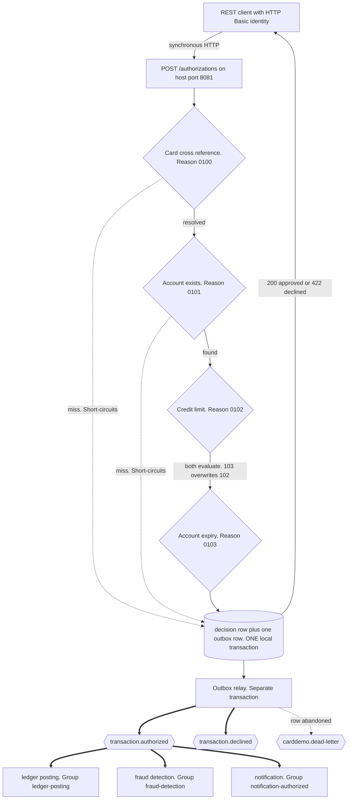
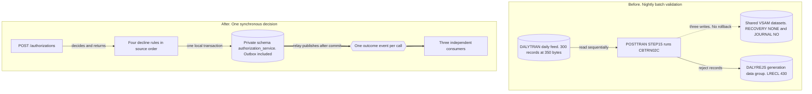

## Authorization Service

- [Purpose](#purpose)
- [Source provenance](#source-provenance)
- [Endpoints](#endpoints)
- [Decision chain](#decision-chain)
- [Events](#events)
- [Domain and data ownership](#domain-and-data-ownership)
- [Domain context](#domain-context)
- [Declared deviations](#declared-deviations)
- [Pitfalls](#pitfalls)
- [Architecture](#architecture)
- [How to extend](#how-to-extend)
- [Local run and tests](#local-run-and-tests)
- [Related documentation](#related-documentation)

<br/>

## Purpose

`authorization-service` owns `POST /authorizations`, the one synchronous Representational State Transfer (REST) endpoint a client calls in this platform. It resolves a card to an account, applies four decline rules in source order, and writes exactly one outcome event per call through a transactional outbox. No other service writes the authorization decision.

Ledger posting, fraud detection, and notification each consume the authorized event under their own consumer group. None of the three calls this service back, and none of them calls another. This service reads no other service during a decision.

<br/>

## Source provenance

The brief named a program and a Customer Information Control System (CICS) transaction that this repository does not contain. Searching for both returns nothing:

```bash
grep -ril "COPAUA0C" app/          # zero files
grep -c "CP00" app/csd/CARDDEMO.CSD  # zero
```

This service is therefore a declared synthesis of three real programs, not a translation of one. The [traceability matrix](../../docs/traceability-matrix.md) records that synthesis and every field omitted along the way.

| Contribution | Source | Locator |
| :--- | :--- | :--- |
| The four decline rules and the abend contract | `app/cbl/CBTRN02C.cbl` | paragraphs `1500-A-LOOKUP-XREF` and `1500-B-LOOKUP-ACCT`, lines 380 to 420 |
| The synchronous request contract and tolerant numeric parsing | `app/cbl/COTRN02C.cbl` | lines 204 and 218, then 383 and 456 |
| Authentication and the administrator fork | `app/cbl/COSGN00C.cbl` | line 223, then lines 230 to 240 |
| Date validation semantics | `app/cbl/CSUTLDTC.cbl` | line 62 |
| The repository interface shape | `app/cbl/CBSTM03B.CBL` | lines 100 to 112 |
| The transactional outbox ancestor | `app/cbl/CORPT00C.cbl` | lines 517 to 518 |

Every rule the source leaves ambiguous, undocumented, or inconsistent is listed in [business rule flags](../../docs/business-rule-flags.md), which carries the specification's twenty-six-item register with citations.

<br/>

## Endpoints

| Method and path | Access | Purpose |
| :--- | :--- | :--- |
| `POST /authorizations` | `ADMIN`, or `USER` holding the matching scope | Decide one transaction and produce one event for it |

Every business route requires HTTP Basic authentication. A request may name the card number, the account identifier, or both. An account-only request resolves its card through the cross-reference, and a request naming neither is refused with the source's own message.

The status codes are the source's own outcome model, restated over HTTP. `app/cbl/CBTRN02C.cbl:L229-L230` counts rejects and ends the batch job with return code 4, so a rejection is expected traffic and not a failure.

| Outcome | Status | Body |
| :--- | ---: | :--- |
| Approved | 200 | `approved` true, naming the account the card resolved to |
| Declined by one of the four rules | 422 | `approved` false, carrying the reject code and its verbatim source text |
| Request field failed validation | 422 | The verbatim text `app/cbl/COTRN02C.cbl` moves into `WS-MESSAGE` for that field |
| Body could not be read | 400 | A fixed phrase naming the class of failure |
| Body larger than the service reads | 413 | Refused before the parser, by the declared ceiling |
| Fault inside the service | 500 | No value read from the request |
| Replica older than the staleness bound | 503 | The one status worth retrying, and deliberately not a decline |

A decline answers 422. No decline answers 500 and none answers 503.

```bash
curl -sS -X POST http://localhost:8081/authorizations \
  -u "admin001:${ADMIN_PASSWORD}" \
  -H 'Content-Type: application/json' \
  -d '{"cardNumber":"0500024453765740","transactionTypeCode":"01",
       "transactionCategoryCode":"0001","source":"POS TERM",
       "description":"Service guide purchase","amount":"+00000504.77",
       "merchantId":"800000000","merchantName":"Abshire-Lowe",
       "merchantCity":"North Enoshaven","merchantZip":"72112",
       "originTimestamp":"2026-08-05 10:30:00.000000",
       "processingTimestamp":"2026-08-05-10.30.00.000000"}'
```

The full contract is the hand-written [OpenAPI description](src/main/resources/openapi.yaml). No documentation generator produces it.

Management traffic answers on a separate port and never on the business port. The exposed endpoints are `health`, `metrics`, and `prometheus`. Only `health` answers without a credential, because a container health check carries none.

| Metric | Meaning |
| :--- | :--- |
| `carddemo.authorization.decisions` | Decisions taken, tagged by outcome |
| `carddemo.authorization.decision.duration` | Time one decision took |
| `carddemo.authorization.events.written` | Events written to the outbox, one per resolved call |
| `carddemo.authorization.failures` | Failures, tagged by stage |

<br/>

## Decision chain

The driver paragraph at `app/cbl/CBTRN02C.cbl:L370-L378` sets the order and the gate:

```cobol
1500-VALIDATE-TRAN.
    PERFORM 1500-A-LOOKUP-XREF.
    IF WS-VALIDATION-FAIL-REASON = 0
       PERFORM 1500-B-LOOKUP-ACCT
    ELSE
       CONTINUE
    END-IF
* ADD MORE VALIDATIONS HERE
    EXIT.
```

Line 377 is exactly `* ADD MORE VALIDATIONS HERE`. The original author marked the extension point there, which is why `DeclineRule` is an interface: a new rule arrives as a new class and the chain is not edited.

| Rule class | Reason | Wire code | Verbatim source description | Locator |
| :--- | ---: | :--- | :--- | :--- |
| `CardCrossReferenceRule` | 100 | `0100` | `INVALID CARD NUMBER FOUND` | `app/cbl/CBTRN02C.cbl:L385-L387` |
| `AccountExistsRule` | 101 | `0101` | `ACCOUNT RECORD NOT FOUND` | `app/cbl/CBTRN02C.cbl:L397-L399` |
| `CreditLimitRule` | 102 | `0102` | `OVERLIMIT TRANSACTION` | `app/cbl/CBTRN02C.cbl:L403-L413` |
| `AccountExpirationRule` | 103 | `0103` | `TRANSACTION RECEIVED AFTER ACCT EXPIRATION` | `app/cbl/CBTRN02C.cbl:L414-L420` |

The wire code carries four digits because `WS-VALIDATION-FAIL-REASON` is `PIC 9(04)` at `app/cbl/CBTRN02C.cbl:L181`. Its description is capped at seventy-six characters by `PIC X(76)` at line 182.

**Two rules short-circuit and two do not, and the difference decides the answer.**

- Reason 100 short-circuits. The gate at line 372 performs the account lookup only while the reason is still zero, so a card that misses reports 100 and never reaches 101, 102, or 103.
- Reason 101 short-circuits as well. Reasons 102 and 103 sit in the `NOT INVALID KEY` limb of the account read, so a missing account skips both.
- **Reasons 102 and 103 do not short-circuit against each other.** Lines 407 to 413 and lines 414 to 420 are two sequential `IF` statements in that same limb, and neither returns. A transaction that is both overlimit and past expiry ends with **103 overwriting 102**. A test covers this, because returning on the first failing rule gives the wrong code.
- Equality approves at both comparisons.

`app/cbl/CBTRN02C.cbl:L403-L405` computes the tested balance, and line 407 compares it:

```cobol
COMPUTE WS-TEMP-BAL = ACCT-CURR-CYC-CREDIT
                    - ACCT-CURR-CYC-DEBIT
                    + DALYTRAN-AMT

IF ACCT-CREDIT-LIMIT >= WS-TEMP-BAL
```

Three findings live in those five lines, and this service reproduces all three:

1. The formula ignores the current balance and reads only the two cycle accumulators.
2. `WS-TEMP-BAL` is `PIC S9(09)V99` at line 187, one integer digit narrower than the two `PIC S9(10)V99` operands at `app/cpy/CVACT01Y.cpy:L13` and `:L14`, and narrower than the `PIC S9(10)V99` credit limit at `:L8`. A cycle balance at or above one billion loses its high-order digit, which turns a decline into an approval.
3. Two commented-out diagnostic statements sit immediately above the comparison, at lines 401 and 402.

Each finding is entered in [business rule flags](../../docs/business-rule-flags.md).

Reason 103 compares raw text. `app/cbl/CBTRN02C.cbl:L414` reads `IF ACCT-EXPIRAION-DATE >= DALYTRAN-ORIG-TS (1:10)`, so the column stays `VARCHAR(10)` and the comparison stays a string comparison over ten characters.

<br/>

## Events

| Direction | Event | Topic | Consumer group |
| :--- | :--- | :--- | :--- |
| Produces | `TransactionAuthorized` | `transaction.authorized` | — |
| Produces | `TransactionDeclined`, versions 1 and 2 | `transaction.declined` | — |
| Consumes | `AccountStateChanged` | `account.state-changed` | `authorization-account-state` |
| Consumes | `CardUpdated` | `card.updated` | `authorization-card-updated` |
| Routes on a spent record | `DeadLetterEnvelope` | `carddemo.dead-letter` | — |

One authorization call produces exactly one outcome event. **This service consumes none of the three fan-out events**, and the two streams it does read only keep its replica tables current. Neither listener sits on the response path.

Ledger posting, fraud detection, and notification read `transaction.authorized` under the groups `ledger-posting`, `fraud-detection`, and `notification-authorized`. This service knows none of them by name or address.

Every governed event carries the shared envelope from `com.carddemo.events.EventEnvelope`.

| Envelope field | Meaning |
| :--- | :--- |
| `eventId` | The idempotency key every consumer records before applying effects |
| `eventType` | The routing discriminator |
| `schemaVersion` | The document version, so a new consumer joins without breaking an old one |
| `occurredAt` | The moment the producer built the event |
| `aggregateId` | The account identifier, and the Kafka message key |

Two conventions carry correctness, and changing either breaks it:

- **The account identifier is the message key**, so every event for one account lands on one partition and stays ordered. The one decline that resolves no account has no account to name, so version 2 of `TransactionDeclined` keys on the sixteen-character transaction identifier instead.
- **Money travels as a decimal string, never as a JavaScript Object Notation (JSON) number.** `TRAN-AMT` is `PIC S9(09)V99` at `app/cpy/CVTRA05Y.cpy:L10`, giving eleven digits at scale two and the column type `NUMERIC(11,2)`. `ACCT-CURR-BAL` is `PIC S9(10)V99` at `app/cpy/CVACT01Y.cpy:L7`, giving `NUMERIC(12,2)`.

The decision row and the outbox row commit in one local transaction. The relay publishes afterwards, in a separate transaction. A record this service can never apply reaches the dead-letter topic after bounded retries. Its diagnostic carries the four fields of `01 ABEND-DATA` at `app/cpy/CSMSG02Y.cpy:L21-L29`, and nothing read from the record itself.

Full publish-and-consume paths for every topic are in [event flow](../../docs/event-flow.md).

<br/>

## Domain and data ownership

The private database is `carddemo_authorization` and the schema is `authorization_service`. No other service reads it. Flyway creates every object and Jakarta Persistence validates the model against it.

| Table | Derivation |
| :--- | :--- |
| `card_xref` | `app/cpy/CVACT03Y.cpy`: `XREF-CARD-NUM PIC X(16)` L5, `XREF-CUST-ID PIC 9(09)` L6, `XREF-ACCT-ID PIC 9(11)` L7. Primary key from `app/jcl/XREFFILE.jcl:L43` `KEYS(16 0)`, record size from `:L44` `RECORDSIZE(50 50)`, and the non-unique secondary index on the account identifier from the alternate index at `:L74` `KEYS(11,25)` with `NONUNIQUEKEY` at `:L75` and `UPGRADE` at `:L76` |
| `account_credit_snapshot` | Read-only projection of `app/cpy/CVACT01Y.cpy`: credit limit L8, expiry L11, cycle credit L13, cycle debit L14. Kept current by `AccountStateChanged` |
| `unresolved_card_attempt` | Reason 100 attempts, which resolve no account to attribute |
| `authorization_decision` | The attribution record of each decision and the identity that asked for it |
| `outbox_event` | Event identifier, type, payload, aggregate identifier, and relay state |
| `processed_event` | Event identifier primary key and processed timestamp, the duplicate guard for both listeners |

The sequence `transaction_id_seq` issues transaction identifiers, starting at 1000000000.

Two omissions are deliberate, and both are listed in the [traceability matrix](../../docs/traceability-matrix.md). The cross-reference `FILLER PIC X(14)` at `app/cpy/CVACT03Y.cpy:L8` is dropped. The Communication Area navigation fields are dropped with the screens they sequenced.

`V2__seed.sql` loads the fifty cross-reference rows from `app/data/ASCII/cardxref.txt`. **That fixture measures 36 characters per record, not the 50 the copybook declares**, because the trailing filler is physically absent. All fifty records measure 36, and the first is `050002445376574000000005000000000050`. The loader tolerates the narrower width.

Column-by-column mapping for every table is in [data model](../../docs/data-model.md).

<br/>

## Domain context

Four terms explain most of the code in this module. A developer who reads a class called `CreditLimitRule` needs them first.

**A card cross-reference** maps one card number to one customer and one account. The original ran on a Virtual Storage Access Method (VSAM) dataset keyed by the sixteen-character card number, with a second index on the account identifier. A card carries no account number of its own, so every authorization starts by resolving the card through this table. That is why reason 100 exists: a card with no cross-reference row cannot name an account to authorize against.

**A decline reason code** is the source's four-digit answer to "why not". The original wrote it into a reject record and counted it, and this service returns it and publishes it. There are exactly four codes and there is no fifth.

**The two cycle accumulators** are running totals of credits and debits inside the current billing cycle, held on the account row. The credit-limit rule reads both and ignores the current balance. Something must zero them at the end of a cycle, and the only source code that does is `app/cbl/CBACT04C.cbl:L353-L354`, which sits in a program this migration does not carry. The account service exposes a cycle-close operation for that reason.

**The outbox** is a table in this service's own schema. The decision row and the event row are written to it in one local transaction, and a relay publishes the event afterwards. The decision and the intent to announce it therefore commit together or not at all. The original had no equivalent: `app/cbl/CBTRN02C.cbl:L440-L442` performs three writes unconditionally with no rollback, and all eight file definitions in `app/csd/CARDDEMO.CSD` carry `RECOVERY(NONE)` and `JOURNAL(NO)`.

The platform-wide briefing, including the Job Control Language (JCL) batch model this replaces, is in [onboarding](../../docs/onboarding.md).

<br/>

## Declared deviations

Every departure from a literal reading of the source is named here, so that no deviation is silent. The reasoning for each one lives in the [decision log](../../docs/decision-log.md), which is the single source of truth for why.

| Deviation | What the source does |
| :--- | :--- |
| The published card number is masked | No masking exists anywhere in the source. The decision runs on the full Primary Account Number (PAN), exactly as the source does, and only the payload is masked |
| Currency is emitted as a constant | No source record carries a currency field |
| Transaction identifiers come from a database sequence | `app/cbl/COTRN02C.cbl:L444-L451` moves `HIGH-VALUES` into the key, reads backwards, and adds one, which is a read-modify-write race |
| Atomicity, idempotency, and observability are additions | The source has none of the three |
| Reason 109 becomes an observable failure | `app/cbl/CBTRN02C.cbl:L556` assigns it inside a failed rewrite and nothing ever inspects it |
| `ACCT-EXPIRAION-DATE` is spelled correctly in target names | The source misspells it at `app/cpy/CVACT01Y.cpy:L11`. No behaviour depends on the identifier text |
| Passwords are stored as encoded hashes | `app/cbl/COSGN00C.cbl:L223` compares a stored and supplied password as plaintext. That comparison is not on the authorization path |
| Account and card state arrives by event | The source read shared datasets directly. This service holds replicas and makes no synchronous call to another service |

Five checks a reader may expect are **deliberately absent**, because adding any one of them would change outcomes and break equivalence:

- **No card-number checksum.** `app/cbl/COCRDUPC.cbl:L194` validates a card number only as sixteen digits.
- **No card-status check.** `app/jcl/POSTTRAN.jcl` STEP15 allocates TRANFILE, DALYTRAN, XREFFILE, DALYREJS, ACCTFILE, and TCATBALF, and no card file at all, so the source posting path never opens one.
- **No account-status check.** The field exists at `app/cpy/CVACT01Y.cpy:L6` and no program tests it before posting, so a closed account still posts.
- **No correction of the precision narrowing.** Reproduced as measured and flagged.
- **No correction of the refund sign convention.** A negative amount is added to the cycle-debit accumulator at `app/cbl/CBTRN02C.cbl:L551`, and line 404 subtracts that accumulator, so a refund raises the tested balance.

Each of the five is entered in [business rule flags](../../docs/business-rule-flags.md) for human review.

<br/>

## Pitfalls

Each of these was measured while building this module, and each bites here.

1. **The language level fails silently.** This module descriptor declares `<java.version>25</java.version>`. The Spring Boot parent defaults the language level and compiler release to 17, and a module that omits the override compiles cleanly with no warning. Class files must carry major version **69**, not 61.
2. **Rounding breaks equivalence silently.** All monetary arithmetic truncates toward zero. `grep -ri "ROUNDED" app/cbl/` returns zero matches across all 28 programs, so every computation goes through `com.carddemo.cobol.CobolDecimal`, which pins `RoundingMode.DOWN`. `HALF_UP` is the reflexive Java choice and it is wrong here.
3. **Reasons 102 and 103 do not short-circuit.** Returning on the first failing rule produces 102 where the source produces 103.
4. **Amounts are not parsed with `new BigDecimal(String)`.** `app/cbl/COTRN02C.cbl:L383` and `:L456` use `FUNCTION NUMVAL-C`, which accepts currency symbols and thousands separators. Route every amount through `com.carddemo.cobol.NumvalParser`.
5. **The date validator accepts one undocumented case.** `app/cbl/COTRN02C.cbl:L397` accepts severity `'0000'`, and line 400 also accepts message number `2513` with no comment explaining it. `com.carddemo.cobol.CobolDateValidator` keeps that tolerance. The condition name at `app/cbl/CSUTLDTC.cbl:L62` is inverted: `88 FC-INVALID-DATE VALUE X'0000000000000000'` is the all-zero token that means success.
6. **`mvn package` runs before `docker compose up`.** The image copies a finished archive with `COPY target/*.jar` and builds nothing inside itself, because the aggregator and both library modules sit outside the build context.
7. **A live demo needs the demo migration, or reason 103 declines everything.** Every one of the fifty seeded accounts expires in 2025, and a caller sending today's date as the origin timestamp sends a later value. `docker-compose.yml` names both `classpath:db/migration` and `classpath:db/demo`, and the second extends every seeded expiry to 2099-12-31. An equivalence run must name `db/migration` alone, because `V2__seed.sql` is the oracle the suite measures against.
8. **Without a cycle close, available credit shrinks until everything declines.** Nothing else zeroes the two accumulators the credit-limit rule reads. Call the cycle-close operation on the account service, described in [onboarding](../../docs/onboarding.md).
9. **A stale replica answers 503, not a decline.** An account update or a cycle close must publish `AccountStateChanged`, or the projection keeps answering with what it last observed. Past `carddemo.replica.max-staleness` this service refuses the call and counts a failure at the replica stage.

<br/>

## Architecture

Figure 1 traces one call from the client to the three consumers. Read it for two things: where the response returns, and where publication happens. The response returns as soon as the local transaction commits, and the relay publishes after that commit and never inside request handling.

**Figure 1 — One Authorization Call, Four Decline Rules, One Event: the Request-to-Publish Path**



Legend for Figure 1:

- **Plain arrow** — a synchronous step, either the client's HTTP call or in-process control flow inside one request.
- **Thick arrow** — an asynchronous Kafka publish or consume, which happens after the response has returned.
- **Dotted arrow** — a short-circuit that skips the remaining rules, or the dead-letter route taken when a row is abandoned.
- **Diamond** — one decline rule, labelled with the wire code it assigns.
- **Cylinder** — a database write. The decision row and the outbox row commit together, and that single transaction is the whole guarantee.
- **Hexagon** — a Kafka topic.
- **The absence of any arrow between the three consumers is the point of the diagram.** None of them calls another, and none calls this service.

Figure 2 places the source path beside the delivered one. The platform-wide pair, at full size, is in [architecture before and after](../../docs/architecture-before-after.md).

**Figure 2 — Before and After for the Authorization Path: a Nightly Batch Validation Becomes a Synchronous Call plus One Event**



Legend for Figure 2:

- **Left subgraph** — the source path. A clock starts the work, a sequential file feeds it, and every dataset is shared with other programs.
- **Right subgraph** — the delivered path. A client request starts the work and the schema is private to this service.
- **Plain arrow** — in-process or synchronous flow. **Thick arrow** — an asynchronous publish or consume, which exists only on the right.
- **Dotted arrow** — direct access to a dataset that other programs also write.
- **Cylinder** — stored data. **Hexagon** — a Kafka topic.
- The three writes on the left run unconditionally with no rollback, and every shared dataset disables recovery and journalling. Both properties are why the right side commits its decision and its event together.

<br/>

## How to extend

- **Add a decline rule.** Add a class implementing `DeclineRule` under `domain/rules/`, keep source order, and add its code and text to `schemas/transaction-declined-v1.json`. Nothing else changes. The seam is not invented: `app/cbl/CBTRN02C.cbl:L377` marks it.
- **Add a consumer of this service's events.** Subscribe a new service to `transaction.authorized` under its own consumer group. **No change to this service is required**, which is the extensibility claim made concrete.
- **Swap the event bus.** Provide another implementation of `messaging/EventPublisherPort`, the platform's single event-bus seam.

Work found while building this module, and left out of scope, is listed in [suggested next tasks](../../docs/suggested-next-tasks.md).

<br/>

## Local run and tests

Every version below is exact. No range, and nothing to choose.

| Component | Value |
| :--- | :--- |
| Build runtime | Eclipse Temurin OpenJDK 25.0.4+7 |
| Build tool | Apache Maven 3.9.16 |
| Container runtime | Docker with Compose v2 |
| Broker image | `apache/kafka:4.2.1` |
| Database image | `postgres:18.4` |
| Service runtime image | `bellsoft/liberica-openjre-debian:25.0.4-9` |
| Business port | 8081 on the host, 8080 in the container |
| Management port | 9081 on the host, 9080 in the container |
| Database | `carddemo_authorization` on host `postgres` port 5432 |
| Schema | `authorization_service` |
| Database login | `carddemo_authorization_svc` |
| Kafka bootstrap | `kafka:29092` inside Compose, `localhost:9092` from the host |
| Health check | `http://localhost:9081/actuator/health` |
| Readiness probe | `/actuator/health/readiness` on the management port |
| Outbox relay | Every 500 ms, batch size 100 |

From `card-platform/`:

```bash
cp .env.example .env      # then set every password and hash it asks for
mvn -B -pl services/authorization-service -am package
docker compose up -d
docker compose ps         # every service reports healthy
curl -fsS http://localhost:9081/actuator/health
```

`.env.example` supplies no usable password default, so start-up stops until each one is set. [Onboarding](../../docs/onboarding.md) generates the bcrypt hashes and holds the full platform walkthrough. Read it once before the first run.

Run this module's tests alone, which builds both libraries first:

```bash
mvn -B -pl services/authorization-service -am test
```

Watch the fan-out with a console consumer on `transaction.authorized` inside the broker container, using the command in [onboarding](../../docs/onboarding.md).

<br/>

## Related documentation

- [Platform README](../../README.md)
- [Onboarding](../../docs/onboarding.md)
- [Decision Log](../../docs/decision-log.md)
- [Traceability Matrix](../../docs/traceability-matrix.md)
- [Business Rule Flags](../../docs/business-rule-flags.md)
- [Architecture Before and After](../../docs/architecture-before-after.md)
- [Event Flow](../../docs/event-flow.md)
- [Data Model](../../docs/data-model.md)
- [Equivalence Results](../../docs/equivalence-results.md)
- [Suggested Next Tasks](../../docs/suggested-next-tasks.md)
