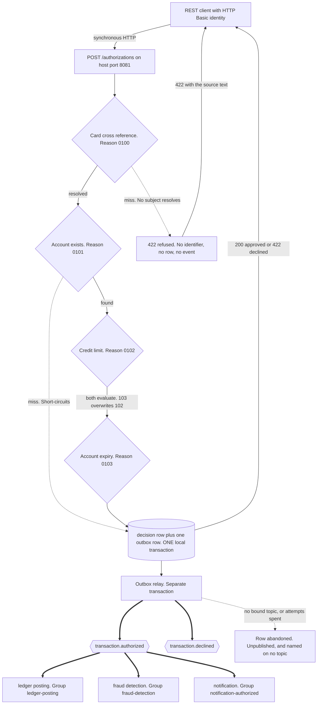
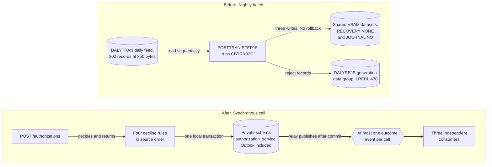

## Authorization Service

- [Purpose](#purpose)
- [Source provenance](#source-provenance)
- [Endpoints](#endpoints)
- [Decision chain](#decision-chain)
- [Replica currency](#replica-currency)
- [Events](#events)
- [Domain and data ownership](#domain-and-data-ownership)
- [Domain context](#domain-context)
- [Declared deviations](#declared-deviations)
- [Pitfalls](#pitfalls)
- [Architecture](#architecture)
- [How to extend](#how-to-extend)
- [Local run and tests](#local-run-and-tests)
- [Related documentation](#related-documentation)

<br/>

## Purpose

`authorization-service` owns `POST /authorizations`, the one synchronous Representational State Transfer (REST) endpoint a client calls in this platform. It resolves a card to an account, applies four decline rules in source order, and writes the outcome event through a transactional outbox. No other service writes the authorization decision.

**Exactly one event per decision, and never more than one.** A request refused before the decision service is entered writes nothing at all. An unauthenticated or unauthorized call, a body the JSON reader cannot bind, and a field the bean constraints reject are answered from the web layer, and the outbox stays untouched.

A request that reaches the rule chain writes one `TransactionAuthorized` on an approval, and one `TransactionDeclined` on every decline. Three of the four reject reasons key on the eleven-digit account the decision applies to. The fourth keys on the transaction identifier this service minted, because it resolved no account.

Reason 0100 fires where the cross-reference read missed, and that read is the only thing that resolves an account. A card resolving no row therefore resolves no account, and the decision names none. `account_id` is null on the row and `accountId` is absent from the event, which travels under `transaction-declined-v2` — the one declined document declaring no such property. Every caller receives the same 422 body carrying reject code `0100` and the text of `app/cbl/CBTRN02C.cbl:L386`, after the entitlement check.

The subject of that decision is the sixteen-character value `transaction_id_seq` issued for it. This service issued it, so it is authoritative, it is deterministic under retry, and it names no cardholder, account or card.

An account named in the request body selects a card on the account branch of `app/cbl/COTRN02C.cbl:L196-L209` and takes no further part. A value a caller supplies never becomes the subject, the aggregate or the message key. `Outcome`, `AuthorizationResponse`, `TransactionDeclined` and `outbox/OutboxWriter` each refuse that pairing. The decline is counted on `carddemo.authorization.decisions` under its own reject code, like the other three.

A security review found an earlier revision naming the declared account. A completeness review then found the refusal that replaced it publishing nothing, for a call that must publish one event. The [decision log](../../docs/decision-log.md) carries both and the alternatives weighed.

Reasons 0101, 0102 and 0103 travel under `schemas/transaction-declined-v3.json`, keyed on the eleven-digit account the cross-reference resolved. Each carries the nine descriptive values `app/cbl/CBTRN02C.cbl:L446-L465` copies into `REJECT-TRAN-DATA`, so the ledger writes the 430-byte reject record. Each is durable twice over in one transaction: a row in `authorization_decision` naming its event, and the outbox row itself. The source writes no reject record on its own synchronous path, returning the screen message at `app/cbl/COTRN02C.cbl:L620-L636`, so the row and the event are what this service adds.

A decision also refuses when this instance cannot show that its two replica tables hold what their owners published. That is a property of the replica *streams* rather than of the age of a row, so a card nobody has updated stays authorizable indefinitely. The [replica currency](#replica-currency) section below is the whole rule.

Ledger posting, fraud detection, and notification each consume the authorized event under their own consumer group. None of the three calls this service back, and none of them calls another. This service reads no other service during a decision.

<br/>

## Source provenance

The brief named a program and a Customer Information Control System (CICS) transaction that this repository does not contain. Searching for both returns nothing. Run these two commands from the repository root, the directory holding `app/` and `card-platform/`:

```bash
grep -ril "COPAUA0C" app/          # zero files
grep -c "CP00" app/csd/CARDDEMO.CSD  # zero
```

This service is therefore a declared synthesis of three real programs, not a translation of one. The [traceability matrix](../../docs/traceability-matrix.md) records that synthesis and every field omitted along the way.

| Contribution | Source | Locator |
| :--- | :--- | :--- |
| The four decline rules and the abend contract | `app/cbl/CBTRN02C.cbl` | paragraphs `1500-A-LOOKUP-XREF` and `1500-B-LOOKUP-ACCT`, lines 380 to 420 |
| The synchronous request contract and tolerant numeric parsing | `app/cbl/COTRN02C.cbl` | lines 204 and 218, then 383 and 456 |
| Authentication and the administrator fork | `app/cbl/COSGN00C.cbl` | line 223, then lines 230 to 240 |
| Date validation semantics | `app/cbl/CSUTLDTC.cbl` | line 62 |
| The repository interface shape | `app/cbl/CBSTM03B.CBL` | lines 100 to 112 |
| The transactional outbox ancestor | `app/cbl/CORPT00C.cbl` | lines 517 to 518 |

Every rule the source leaves ambiguous, undocumented, or inconsistent is listed in [business rule flags](../../docs/business-rule-flags.md), which carries a sixty-six-item register with citations. Identifiers 1 to 26 are the set the specification fixes and 27 upward are appended, so a number always means the same finding.

<br/>

## Endpoints

| Method and path | Access | Purpose |
| :--- | :--- | :--- |
| `POST /authorizations` | `ACQUIRER` or `ADMIN` | Decide one transaction and publish the one event that outcome produces |

Every business route requires HTTP Basic authentication. **Access to this route is decided by role alone.** `config/SecurityConfig.java` matches it with `hasAnyRole(ROLE_ACQUIRER, ROLE_ADMIN)` and installs no ownership manager, so exactly two roles reach it and every other identity is refused with 403 — a cardholder `USER` included.

Every other route in this platform is ownership-scoped; this one is not, and the difference is deliberate. The card is named in the request body rather than in a path, so no path variable carries an identifier an ownership scope could be compared against. That makes the role the whole access decision. A route that reaches every card the platform holds must therefore not be reachable by an identity entitled to one card. Nothing else on this service is reachable at all, because `anyRequest().denyAll()` closes the chain.

A request may name the card number, the account identifier, or both. An account-only request resolves its card through the cross-reference, and a request naming neither is refused with the source's own message. A card that resolves no row is decided rather than refused, under reject code `0100`.

A second gate runs inside the decision, and in this configuration it refuses nobody. `domain/CallerEntitlement` compares the caller against the resolved account immediately after the cross-reference read and before a transaction identifier is allocated. The comparison has to happen there, because an account-only request has no card until that read has run. It admits a caller that `domain/RequestCaller.reachesEverySubject()` answers true for, which is `ROLE_ADMIN` — the fork at `app/cbl/COSGN00C.cbl:L232-L236` — or `ROLE_ACQUIRER`, and those are the only two roles the chain admits.

The gate is therefore a structural guard rather than a live control. It keeps the ownership comparison in place for the day a scoped identity is admitted, and `CallerEntitlementTest` measures the refusal it would then produce. A refused caller would receive the same 403, with no decision row and no event written for it.

`ACQUIRER` is a machine identity a point-of-sale network presents. It owns no account, no customer and no card, and `ACQUIRER_USERNAME` in [`.env.example`](../../.env.example) configures it separately from every cardholder identity.

The reason is the shape of the route. The card travels in the request body, so no identifier in the path can be compared against an ownership scope, and the role is therefore the whole authorization decision. A cardholder identity carrying `USER` is refused with 403 — it holds one account and this route reaches every card the platform holds. `ADMIN` keeps the route because `app/cbl/COSGN00C.cbl:L232-L236` forks an administrator onto every function the region offers.

The status codes are the source's own outcome model, restated over HTTP. `app/cbl/CBTRN02C.cbl:L229-L230` counts rejects and ends the batch job with return code 4, so a rejection is expected traffic and not a failure.

| Outcome | Status | Body |
| :--- | ---: | :--- |
| Approved | 200 | `approved` true, naming the account the card resolved to |
| Declined by one of the four rules | 422 | `approved` false, carrying the reject code and its verbatim source text |
| Request field failed validation | 422 | The verbatim text `app/cbl/COTRN02C.cbl` moves into `WS-MESSAGE` for that field |
| Caller does not reach the resolved subject | 403 | One fixed phrase, naming no account, card, or token |
| Body could not be read | 400 | A fixed phrase naming the class of failure |
| No usable credential | 401 | A problem document, and `WWW-Authenticate: Basic realm="carddemo"` |
| Credential holds no role this route admits | 403 | A problem document naming neither the operation nor the card |
| Body larger than the service reads | 413 | Refused before the parser, by the declared ceiling |
| Fault inside the service | 500 | No value read from the request |
| Replica stream behind, or a change lost for this account | 503 | The one status worth retrying, and deliberately not a decline. See [replica currency](#replica-currency) |

A decline answers 422. No decline answers 500 and none answers 503.

A 403 is not a decline. It carries the phrase the filter chain already writes for a route refusal, so the two read alike, and it names nothing about the subject. Nothing is decided: no transaction identifier is drawn, no decision row is written, and no event is produced. The entitlement check runs before the cross-reference outcome is acted on. A caller with no entitlement therefore receives that 403 whatever card it sent, and learns nothing about which cards exist.
> **Synthetic data only.** `DEMO_SYNTHETIC_CARD_NUMBER` below is row one of the repository fixture `app/data/ASCII/carddata.txt`. It is a made-up number in a public sample dataset and it identifies no real card. Never substitute real cardholder data into this command, or into any other command in this repository: the Compose ports are bound to loopback for a demonstration and this platform carries none of the controls real card data requires.

`.env` holds only the bcrypt hash of each password, so the plaintext comes from
`card-platform/.demo-credentials`, which `scripts/generate-env.sh` writes owner-only and git ignores.
To keep the password out of this shell entirely, give `-u` the user name alone and let `curl` prompt
for it.

```bash
# Run from card-platform/. app/ sits beside it in the repository.
# The administrator identity these calls authenticate as. scripts/generate-env.sh wrote its
# password to .demo-credentials, which git ignores and creates owner-only. Run from card-platform/.
ADMIN_USERNAME="$(sed -n 's/^ADMIN_USERNAME=//p' .env | head -1)"
ADMIN_PASSWORD="$(sed -n "s/^${ADMIN_USERNAME}=//p" .demo-credentials | head -1)"

# The card number is read from the fixture the seed migration loads rather than
# written here. No guide in this repository carries a card number a reader could
# replay: the value below exists for the length of the shell that reads it.
CARD_NUMBER="$(cut -c1-16 ../app/data/ASCII/carddata.txt | sed -n '1p')"
CAPTURED_AT="$(date -u +'%Y-%m-%d %H:%M:%S').000000"
PROCESSED_AT="$(date -u +'%Y-%m-%d-%H.%M.%S').000000"

curl -sS -X POST http://localhost:8081/authorizations \
  -u "${ADMIN_USERNAME}:${ADMIN_PASSWORD}" \
  -H 'X-CardDemo-Request: acquirer-cli' \
  -H 'Content-Type: application/json' \
  -d "{\"cardNumber\":\"${CARD_NUMBER}\",\"transactionTypeCode\":\"01\",
       \"transactionCategoryCode\":\"0001\",\"source\":\"POS TERM\",
       \"description\":\"Service guide purchase\",\"amount\":\"+00000504.77\",
       \"merchantId\":\"800000000\",\"merchantName\":\"Abshire-Lowe\",
       \"merchantCity\":\"North Enoshaven\",\"merchantZip\":\"72112\",
       \"originTimestamp\":\"${CAPTURED_AT}\",
       \"processingTimestamp\":\"${PROCESSED_AT}\"}"
```

`CARD_NUMBER` is read from `app/data/ASCII/carddata.txt`, the fixture `src/main/resources/db/migration/V2__seed.sql` loads, so the command runs from the repository root. Both timestamps accept the ten-character date `YYYY-MM-DD` the source screen field carries, and the twenty-six character record form as well.

`app/cbl/COTRN02C.cbl:L389-L423` validates each as a ten-character date, under the tolerance flagged in [business-rule-flags.md](../../docs/business-rule-flags.md). A ten-character value is widened to the record width before it reaches the event, exactly as `app/cbl/COTRN02C.cbl:L469` widens it. No bound relates either value to the clock of this service. Reject reason `0103` at `app/cbl/CBTRN02C.cbl:L414-L420` compares the first ten characters of the capture moment against the account expiry date, and that comparison is the whole of the test.

The full contract is the hand-written [OpenAPI description](src/main/resources/openapi.yaml). No documentation generator produces it.

Management traffic answers on a separate port and never on the business port. The exposed endpoints are `health`, `metrics`, and `prometheus`. Only `health` answers without a credential, because a container health check carries none.

| Metric | Meaning |
| :--- | :--- |
| `carddemo.authorization.decisions` | Decisions taken, tagged by outcome |
| `carddemo.authorization.decision.duration` | Time one decision took |
| `carddemo.authorization.events.written` | Events written to the outbox, one per resolved call |
| `carddemo.authorization.events.published` | Outbox rows the broker acknowledged, counted after the sweep commits |
| `carddemo.authorization.outbox.abandoned` | Outbox rows given up on after their attempts were spent |
| `carddemo.authorization.outbox.due` | Outbox rows due for an attempt now, being the backlog not yet published. A gauge rather than a counter, because a backlog is a state and not an event |
| `carddemo.authorization.outbox.oldest.due.age` | Seconds the longest-waiting due outbox row has waited, zero when none is due. It separates a service working through a burst from a stopped relay |
| `carddemo.authorization.dead.letters` | Terminal diagnostics naming an abandoned row, tagged `outcome=published` or `outcome=failed` |
| `carddemo.authorization.events.consumed` | Replica deliveries read, tagged `eventType`: `AccountStateChanged`, `CardUpdated` |
| `carddemo.authorization.duplicates.skipped` | Replica deliveries a marker made a repeat of, tagged `eventType` |
| `carddemo.authorization.processing.latency` | Time one replica delivery took, tagged `eventType` |
| `carddemo.authorization.failures` | Failures, tagged by stage. `config/ObservabilityConfig` registers exactly four values and the code produces no other: `persist`, `publish`, `replica`, `entitlement` |

The three replica series report the two streams that keep `card_xref` and `account_credit_snapshot` current. Each counts a delivery as it arrives rather than once it is applied, so a stream that has stopped arriving reads as a count that stopped rising. A delivery refused for its payload or given up on is counted here as well as on the failure series.

### Two controls in front of every route

`config/CrossSiteRequestFilter` guards state change. `POST /authorizations` must carry `X-CardDemo-Request` with any non-blank value, must not declare a `Sec-Fetch-Site` other than `same-origin` or `same-site`, and must not carry an `Origin` naming anything but this service. HTTP Basic is a credential a browser attaches by itself. Without this check a page on any other site could submit a form against a route above, and the browser would authenticate it. An HTML form cannot set a request header at all, which is what makes one header the control.

A refusal answers 403 with the same problem document every other refusal of this service answers and counts `carddemo.authorization.requests.cross.site.refused`. `GET`, `HEAD`, `OPTIONS` and `TRACE` pass untouched, so the container health check and every read need nothing.

`config/RequestRateCeilingFilter` bounds volume. It runs one place ahead of the security chain, because a refusal has to cost less than the attempt it refuses. An attempt that reached the chain would already have paid for a bcrypt verification.

| Ceiling | Default | Counted by |
| :--- | ---: | :--- |
| Failed authentications | 20 per 60s | Source address, and only when the request carried a credential and was answered 401 |
| Requests | 600 per 60s | Source address |
| Requests | 600 per 60s | The username the credential names, read as a counter key and never verified or logged |
| State-changing requests | 120 per 60s | Source address |
| Requests in flight | 64 | The whole instance |

A refusal answers 429 with `Retry-After` and counts `carddemo.authorization.requests.throttled`, tagged with the stage that refused: `authentication`, `source`, `identity`, `write` or `concurrency`. The five ceilings read `API_RATE_WINDOW_SECONDS`, `API_RATE_REQUESTS_PER_WINDOW`, `API_RATE_WRITE_REQUESTS_PER_WINDOW`, `API_RATE_AUTHENTICATION_FAILURES_PER_WINDOW` and `API_RATE_CONCURRENT_REQUESTS` from [`.env.example`](../../.env.example). The management base path is exempt, because a throttled probe reads as a failed container.

Both filters count in this process, so several replicas bound each replica rather than the service as a whole. The source address is the one the container resolves, rather than a forwarding header a caller could write. A deployment behind a proxy activates the `trusted-proxy` profile, which trusts those headers from the proxy's own addresses alone. Both residual limits are recorded in [suggested next tasks](../../docs/suggested-next-tasks.md), and the reasoning behind the two controls is in the [Decision Log](../../docs/decision-log.md).

<br/>

## Decision chain

The driver paragraph at `app/cbl/CBTRN02C.cbl:L370-L378` sets the order and the gate:

```cobol
1500-VALIDATE-TRAN.
    PERFORM 1500-A-LOOKUP-XREF.
    IF WS-VALIDATION-FAIL-REASON = 0
       PERFORM 1500-B-LOOKUP-ACCT
    ELSE
       CONTINUE
    END-IF
* ADD MORE VALIDATIONS HERE
    EXIT.
```

Line 377 is exactly `* ADD MORE VALIDATIONS HERE`. The original author marked the extension point there, which is why `DeclineRule` is an interface: a new rule arrives as a new class and the chain is not edited.

| Rule class | Reason | Wire code | Verbatim source description | Locator |
| :--- | ---: | :--- | :--- | :--- |
| `CardCrossReferenceRule` | 100 | `0100` | `INVALID CARD NUMBER FOUND` | `app/cbl/CBTRN02C.cbl:L385-L387` |
| `AccountExistsRule` | 101 | `0101` | `ACCOUNT RECORD NOT FOUND` | `app/cbl/CBTRN02C.cbl:L397-L399` |
| `CreditLimitRule` | 102 | `0102` | `OVERLIMIT TRANSACTION` | `app/cbl/CBTRN02C.cbl:L403-L413` |
| `AccountExpirationRule` | 103 | `0103` | `TRANSACTION RECEIVED AFTER ACCT EXPIRATION` | `app/cbl/CBTRN02C.cbl:L414-L420` |

The wire code carries four digits because `WS-VALIDATION-FAIL-REASON` is `PIC 9(04)` at `app/cbl/CBTRN02C.cbl:L181`. Its description is capped at seventy-six characters by `PIC X(76)` at line 182.

**Two rules short-circuit and two do not, and the difference decides the answer.**

- Reason 100 short-circuits. The gate at line 372 performs the account lookup only while the reason is still zero, so a card that misses reports 100 and never reaches 101, 102, or 103. It resolves no account either, so its decision names none and its event keys on the minted transaction identifier.
- Reason 101 short-circuits as well. Reasons 102 and 103 sit in the `NOT INVALID KEY` limb of the account read, so a missing account skips both.
- **Reasons 102 and 103 do not short-circuit against each other.** Lines 407 to 413 and lines 414 to 420 are two sequential `IF` statements in that same limb, and neither returns. A transaction that is both overlimit and past expiry ends with **103 overwriting 102**. A test covers this, because returning on the first failing rule gives the wrong code.
- Equality approves at both comparisons.

`app/cbl/CBTRN02C.cbl:L403-L405` computes the tested balance, and line 407 compares it:

```cobol
COMPUTE WS-TEMP-BAL = ACCT-CURR-CYC-CREDIT
                    - ACCT-CURR-CYC-DEBIT
                    + DALYTRAN-AMT

IF ACCT-CREDIT-LIMIT >= WS-TEMP-BAL
```

Three findings live in those five lines, and this service reproduces all three:

1. The formula ignores the current balance and reads only the two cycle accumulators.
2. `WS-TEMP-BAL` is `PIC S9(09)V99` at line 187, one integer digit narrower than the two `PIC S9(10)V99` operands at `app/cpy/CVACT01Y.cpy:L13` and `:L14`, and narrower than the `PIC S9(10)V99` credit limit at `:L8`. A cycle balance at or above one billion loses its high-order digit, which turns a decline into an approval.
3. Two commented-out diagnostic statements sit immediately above the comparison, at lines 401 and 402.

Each finding is entered in [business rule flags](../../docs/business-rule-flags.md).

**The two accumulators the rule reads carry this service's own approvals as well**. `app/cbl/CBTRN02C.cbl` posts each record before it validates the next, because `2000-POST-TRANSACTION` at `:L424-L444` runs inside the read loop. `2700-UPDATE-ACCOUNT` at `:L545-L560` has already rewritten the account by the time line 403 reads it again. Two transactions of 60.00 against a limit of 100.00 therefore approve once and decline once.

Here the account service owns those accumulators and reports them back four asynchronous hops later. An approval therefore reserves its own amount on the snapshot row in the same transaction as the decision, under a row lock bounded by `carddemo.decision.lock-wait-ms`. The rule adds the reserved figures to the authoritative ones before it computes, and `carddemo.decision.reservation-ttl` releases a reservation whose posting never arrives. The sign convention is the source's: `:L549` and `:L551` route a negative amount to the debit accumulator, so a refund still tightens the next authorization.

Reason 103 compares raw text. `app/cbl/CBTRN02C.cbl:L414` reads `IF ACCT-EXPIRAION-DATE >= DALYTRAN-ORIG-TS (1:10)`, so the column stays `VARCHAR(10)` and the comparison stays a string comparison over ten characters.

<br/>

## Replica currency

The source read the cross-reference and account datasets themselves, at `app/cbl/CBTRN02C.cbl:L382` and `:L395`. This service reads `card_xref` and `account_credit_snapshot`, which are replicas the account and card services own. It therefore has to answer a question the source never had: is what this copy holds what the owner published?

**The question is about the stream, and never about the age of a row**. Both owners publish on a state change and on nothing else. The observation stamp of a card nobody has touched therefore recedes for ever, while the copy stays exactly correct.

An earlier version of this service measured row age against a one-day ceiling, and a day after seeding every ordinary authorization refused. That was the quiet case rather than the failing one, and no amount of correct operation cleared it. Consumer lag says the opposite thing about the same situation: a caught-up consumer of an idle topic reports no backlog, so a card nobody has updated stays authorizable indefinitely.

Two things are read before every decision, and both have to be satisfied.

| What is read | Where it comes from | What refuses |
| :--- | :--- | :--- |
| The replica streams are caught up | `messaging/KafkaReplicaSynchronization`, from the two listener containers this process already runs | A topic no listener subscribes to; a container that is not running; a running container the group has assigned no partition; a measured `records-lag-max` over `carddemo.replica.lag-ceiling` |
| No change was delivered to this account and lost | `domain/ReplicaGapLog` over the `replica_gap` table, created by `V12__replica_gap.sql` | One open row for the account this decision names |

The second reading exists because the first cannot see everything. A record that was delivered and could not be applied has its offset advanced once its diagnostic is away. The backlog then returns to zero while one account's copy is missing a change.

The listener writes a `replica_gap` row for that account in a transaction of its own, which survives the rollback of the failing delivery. It clears that row inside the transaction that finally applies a change for that account. A record whose key names no account is logged and attributed to none, because attributing it to a sentinel would refuse every account for one malformed record.

`carddemo.replica.lag-ceiling` is `REPLICA_LAG_CEILING` and defaults to `0`: no record may be waiting. Raise it only where a known steady backlog is acceptable, and understand what it admits. A ceiling of *n* says a decision may read a copy that is *n* records behind its owner.

A refusal answers 503 and counts a failure at the replica stage. It is deliberately not a decline: nothing is decided, no transaction identifier is drawn, and no row and no event is written. `/actuator/health/readiness` includes the same verdict under `replica`, reporting the reason, the observed lag and the number of open gaps. An orchestrator therefore removes the instance rather than letting it serve refusals.

A consumer that has an assignment and has completed no fetch publishes no lag sample at all. That is read as a stream with nothing waiting on it rather than as an unknown. Refusing until a first sample arrived would reproduce the defect above in a form that never recovered, because an idle topic never produces one.

<br/>

## Events

| Direction | Event | Topic | Consumer group |
| :--- | :--- | :--- | :--- |
| Produces | `TransactionAuthorized` | `transaction.authorized` | — |
| Produces | `TransactionDeclined`, versions 2 and 3 | `transaction.declined` | `ledger-reject` |
| Consumes | `AccountStateChanged` | `account.state-changed` | `authorization-account-state` |
| Consumes | `CardUpdated` | `card.updated` | `authorization-card-updated` |
| Routes on a spent record | `DeadLetterEnvelope` | `carddemo.dead-letter` | — |

A decided authorization call publishes exactly one outcome event, keyed on the account it applies to. **This service consumes none of the three fan-out events**, and the two streams it does read only maintain its replica tables. `AccountStateChanged` replaces every value column of `account_credit_snapshot`. `CardUpdated` refreshes the observation columns of `card_xref` and no mapping value, because it carries a masked card number while that table is keyed on the full sixteen characters. Neither listener sits on the response path.

Ledger posting, fraud detection, and notification read `transaction.authorized` under the groups `ledger-posting`, `fraud-detection`, and `notification-authorized`. Ledger posting also reads `transaction.declined` under `ledger-reject`, where it writes the 430-byte reject row of `app/cbl/CBTRN02C.cbl:L446`–`L465`. This service knows none of those consumers by name or address.

A decline that resolved an account travels at contract version 3, which carries version 1's properties plus the nine descriptive values of the transaction the caller sent. It carries them because the consumer that owns the reject row has to reproduce `REJECT-TRAN-DATA PIC X(350)`, the whole daily record. A refused transaction exists in no table it could read those values from. Every one of the nine comes off the request this call refused, never from a lookup. Version 1 remains governed so an event published under it stays readable, and version 2 is still what a decline resolving no account travels under.

Every governed event carries the shared envelope from `com.carddemo.events.EventEnvelope`.

| Envelope field | Meaning |
| :--- | :--- |
| `eventId` | The idempotency value every consumer records before applying effects, beside the topic the delivery arrived on |
| `eventType` | The routing discriminator |
| `schemaVersion` | The document version, so a new consumer joins without breaking an old one |
| `occurredAt` | The moment the producer built the event |
| `aggregateId` | The account identifier, and the Kafka message key |

Two conventions carry correctness, and changing either breaks it:

- **The account identifier is the message key** on every event this service writes, so every event for one account lands on one partition and stays ordered. Version 2 of `TransactionDeclined` keyed a reason-0100 decline on the sixteen-character transaction identifier. It is retained so a record already on the topic stays readable, and no producer writes it or any other reason-0100 decline.
- **Money travels as a decimal string, never as a JavaScript Object Notation (JSON) number.** `TRAN-AMT` is `PIC S9(09)V99` at `app/cpy/CVTRA05Y.cpy:L10`, giving eleven digits at scale two and the column type `NUMERIC(11,2)`. `ACCT-CURR-BAL` is `PIC S9(10)V99` at `app/cpy/CVACT01Y.cpy:L7`, giving `NUMERIC(12,2)`.

The decision row and the outbox row commit in one local transaction. The relay publishes afterwards, and one relay pass is three kinds of transaction rather than one. There is a claim transaction that commits before any send, no transaction at all while the sends are outstanding, and one short transaction per result.

That division is why a claim survives the process death it was written for. It is also why a hundred rows waiting on a broker no longer hold a connection and a hundred row locks. Every send is awaited against one monotonic deadline shared by the pass, from `carddemo.outbox.relay.max-duration-ms`, and the producer window resolves one send well inside it.

The claim query returns the due head row of each account, never two rows of one account. Recording each result separately would otherwise let an older row fail while a newer row of the same account succeeded. The account identifier is the message key, so the retry would reach the topic out of order. The same restriction stops one unpublishable row blocking the table: a refusal pauses that account for the pass and leaves every other account eligible.

One pass claims repeatedly rather than once. Each cycle takes the head an account has after the previous head is published, so a burst on one account drains inside one pass. `carddemo.outbox.relay.batch-size` still bounds the pass rather than a cycle. A pass that reaches its deadline releases the rows it claimed and never attempted. The account behind such a row then waits for a retry backoff rather than for the claim lease.

A record this service can never apply reaches the dead-letter topic after bounded retries, and its offset is committed once the diagnostic is published. The record is therefore named once rather than on every later assignment. A row this service can never publish is abandoned and records a durable obligation to name itself, in the same transaction that abandons it. The obligation clears only against a broker acknowledgement, because an abandoned row is terminal and no later claim would ever return to it.

Either diagnostic carries the four fields of `01 ABEND-DATA` at `app/cpy/CSMSG02Y.cpy:L21-L29`, and nothing read from the record itself. A diagnostic whose row is keyed by a transaction identifier travels under the aggregate identifier `00000000000`, since `schemas/dead-letter-v1.json` accepts eleven digits, and `failedEventId` still names the row exactly.

Full publish-and-consume paths for every topic are in [event flow](../../docs/event-flow.md).

<br/>

## Domain and data ownership

The private database is `carddemo_authorization` and the schema is `authorization_service`. No other service reads it. Flyway creates every object and Jakarta Persistence validates the model against it.

| Table | Derivation |
| :--- | :--- |
| `card_xref` | `app/cpy/CVACT03Y.cpy`: `XREF-CARD-NUM PIC X(16)` L5, `XREF-CUST-ID PIC 9(09)` L6, `XREF-ACCT-ID PIC 9(11)` L7. Primary key from `app/jcl/XREFFILE.jcl:L43` `KEYS(16 0)`, record size from `:L44` `RECORDSIZE(50 50)`, and the non-unique secondary index on the account identifier from the alternate index at `:L74` `KEYS(11,25)` with `NONUNIQUEKEY` at `:L75` and `UPGRADE` at `:L76` |
| `account_credit_snapshot` | Projection of `app/cpy/CVACT01Y.cpy`: credit limit L8, expiry L11, cycle credit L13, cycle debit L14, kept current by `AccountStateChanged`. Three further columns are this service's own: `pending_cycle_credit`, `pending_cycle_debit`, and `pending_expires_at` hold the exposure of approvals whose posting has not been reported back yet |
| `authorization_decision` | The attribution record of each decision and the identity that asked for it |
| `outbox_event` | Event identifier, type, payload, aggregate identifier, relay state, and the dead-letter obligation an abandoned row carries |
| `processed_event` | Event identifier primary key and processed timestamp, the duplicate guard for both listeners |

The sequence `transaction_id_seq` issues transaction identifiers, starting at 1000000000.

Two omissions are deliberate, and both are listed in the [traceability matrix](../../docs/traceability-matrix.md). The cross-reference `FILLER PIC X(14)` at `app/cpy/CVACT03Y.cpy:L8` is dropped. The Communication Area navigation fields are dropped with the screens they sequenced.

`V2__seed.sql` loads the fifty cross-reference rows from `app/data/ASCII/cardxref.txt`. **That fixture measures 36 characters per record, not the 50 the copybook declares**, because the trailing filler is physically absent. All fifty records measure 36: sixteen characters of card number, then nine of customer identifier, then eleven of account identifier. Read record one with `sed -n '1p' app/data/ASCII/cardxref.txt` rather than from this guide, which carries no card number. The loader tolerates the narrower width.

Column-by-column mapping for every table is in [data model](../../docs/data-model.md).

<br/>

## Domain context

Four terms explain most of the code in this module. A developer who reads a class called `CreditLimitRule` needs them first.

**A card cross-reference** maps one card number to one customer and one account. The original ran on a Virtual Storage Access Method (VSAM) dataset keyed by the sixteen-character card number, with a second index on the account identifier. The card record does carry an account identifier of its own, `CARD-ACCT-ID PIC 9(11)` at `app/cpy/CVACT02Y.cpy:L6`, and the posting program still does not read it.

`app/cbl/CBTRN02C.cbl:L29-L64` opens six files and the card file is not among them, and `app/jcl/POSTTRAN.jcl` allocates the same six datasets. With the card file unopened, the cross-reference is the only account the program can reach, so every authorization here starts by resolving the card through this table. That is why reason 100 exists: a card with no cross-reference row cannot name an account to authorize against.

**A decline reason code** is the source's four-digit answer to "why not". The original wrote it into a reject record and counted it, and this service returns it and publishes it. There are exactly four codes and there is no fifth.

**The two cycle accumulators** are running totals of credits and debits inside the current billing cycle, held on the account row. The credit-limit rule reads both and ignores the current balance. Something must zero them at the end of a cycle, and the only source code that does is `app/cbl/CBACT04C.cbl:L353-L354`, which sits in a program this migration does not carry. The account service exposes a cycle-close operation for that reason.

**The outbox** is a table in this service's own schema. The decision row, the event row, and the reserved exposure of an approval are written in one local transaction, and a relay publishes the event afterwards. The decision and the intent to announce it therefore commit together or not at all. The original had no equivalent: `app/cbl/CBTRN02C.cbl:L440-L442` performs three writes unconditionally with no rollback, and all eight file definitions in `app/csd/CARDDEMO.CSD` carry `RECOVERY(NONE)` and `JOURNAL(NO)`.

The platform-wide briefing, including the Job Control Language (JCL) batch model this replaces, is in [onboarding](../../docs/onboarding.md).

<br/>

## Declared deviations

Every departure from a literal reading of the source is named here, so that no deviation is silent. The reasoning for each one lives in the [decision log](../../docs/decision-log.md), which is the single source of truth for why.

| Deviation | What the source does |
| :--- | :--- |
| The published card number is masked | No masking exists anywhere in the source. The decision runs on the full Primary Account Number (PAN), exactly as the source does, and only the payload is masked |
| Currency is emitted as a constant | No source record carries a currency field |
| Transaction identifiers come from a database sequence | `app/cbl/COTRN02C.cbl:L444-L451` moves `HIGH-VALUES` into the key, reads backwards, and adds one, which is a read-modify-write race |
| Atomicity, idempotency, and observability are additions | The source has none of the three |
| Reason 109 becomes an observable failure | `app/cbl/CBTRN02C.cbl:L556` assigns it inside a failed rewrite and nothing ever inspects it |
| `ACCT-EXPIRAION-DATE` is spelled correctly in target names | The source misspells it at `app/cpy/CVACT01Y.cpy:L11`. No behaviour depends on the identifier text |
| Passwords are stored as encoded hashes | `app/cbl/COSGN00C.cbl:L223` compares a stored and supplied password as plaintext. That comparison is not on the authorization path |
| Account and card state arrives by event | The source read shared datasets directly. This service holds replicas and makes no synchronous call to another service |
| An approval reserves its exposure, under a lock and an expiry | `app/cbl/CBTRN02C.cbl` rewrote the account in-line, so the next record read accumulators that already carried the approval. Reserving restores that timing across an asynchronous boundary; the row lock and the expiry are additions |
| The caller is compared against the resolved subject | No source program compares a caller against a subject. `app/cbl/COSGN00C.cbl:L232-L236` forks on the role byte only, because a signed-on terminal reached only its own screens |
| The recorded actor is the whole authenticated principal | `app/cpy/CSUSR01Y.cpy:L18` declares `SEC-USR-ID PIC X(08)` for a signon identity. This column records an HTTP principal, which no source field bounds, so it is sixty-four characters wide and is never shortened |

Five checks a reader may expect are **deliberately absent**, because adding any one of them would change outcomes and break equivalence:

- **No card-number checksum.** `app/cbl/COCRDUPC.cbl:L194` validates a card number only as sixteen digits.
- **No card-status check.** `app/jcl/POSTTRAN.jcl` STEP15 allocates TRANFILE, DALYTRAN, XREFFILE, DALYREJS, ACCTFILE, and TCATBALF, and no card file at all, so the source posting path never opens one.
- **No account-status check.** The field exists at `app/cpy/CVACT01Y.cpy:L6` and no program tests it before posting, so a closed account still posts.
- **No correction of the precision narrowing.** Reproduced as measured and flagged.
- **No correction of the refund sign convention.** A negative amount is added to the cycle-debit accumulator at `app/cbl/CBTRN02C.cbl:L551`, and line 404 subtracts that accumulator, so a refund raises the tested balance.

Each of the five is entered in [business rule flags](../../docs/business-rule-flags.md) for human review.

<br/>

## Pitfalls

Each of these was measured while building this module, and each bites here.

1. **The language level fails silently.** This module descriptor declares `<java.version>25</java.version>`. The Spring Boot parent defaults the language level and compiler release to 17, and a module that omits the override compiles cleanly with no warning. Class files must carry major version **69**, not 61.
2. **Rounding breaks equivalence silently.** All monetary arithmetic truncates toward zero. `grep -ri "ROUNDED" app/cbl/` returns zero matches across all 28 programs, so every computation goes through `com.carddemo.cobol.CobolDecimal`, which pins `RoundingMode.DOWN`. `HALF_UP` is the reflexive Java choice and it is wrong here.
3. **The card-token key is required and this repository ships no deployable runtime key**. `CARD_TOKEN_SECRET` is a `REPLACE` placeholder in `card-platform/.env.example` and in `deploy/k8s/31-secret.example.yaml`. This service refuses to start while it is absent, blank, still a placeholder, shorter than 32 characters, or equal to either card-token key this repository has published. Generate one with `openssl rand -base64 48 | tr -d '/+='`. This service and the card service are the only two that derive a token, so the Kubernetes Secret carrying the key is pulled by those two Deployments alone.
4. **Reasons 102 and 103 do not short-circuit.** Returning on the first failing rule produces 102 where the source produces 103.
5. **Amounts are not parsed with `new BigDecimal(String)`.** `app/cbl/COTRN02C.cbl:L383` and `:L456` use `FUNCTION NUMVAL-C`, which accepts currency symbols and thousands separators. Route every amount through `com.carddemo.cobol.NumvalParser`.
6. **The date validator accepts one undocumented case.** `app/cbl/COTRN02C.cbl:L397` accepts severity `'0000'`, and line 400 also accepts message number `2513` with no comment explaining it. `com.carddemo.cobol.CobolDateValidator` keeps that tolerance. The condition name at `app/cbl/CSUTLDTC.cbl:L62` is inverted: `88 FC-INVALID-DATE VALUE X'0000000000000000'` is the all-zero token that means success.
7. **The image build context is `card-platform`, not this module.** The `Dockerfile` compiles this module in a Java Development Kit 25 builder stage. It therefore needs the aggregator descriptor and both library modules in its context, and reads nothing from `target/`. Building with this directory as the context fails to resolve the parent.
8. **A live demo needs the demo migration, or reason 103 declines everything.** The fifty seeded account expiries run from 2023-01-06 to 2025-12-28, so a caller sending any later date as the origin timestamp sends a value the rule declines. `docker-compose.yml` names both `classpath:db/migration` and `classpath:db/demo`, and so does `deploy/k8s/30-configmap.yaml`, and the second location extends every seeded expiry to 2099-12-31. An equivalence run must name `db/migration` alone, because `V2__seed.sql` is the oracle the suite measures against.
9. **Without a cycle close, available credit shrinks until everything declines.** Nothing else zeroes the two accumulators the credit-limit rule reads. Call the cycle-close operation on the account service, described in [onboarding](../../docs/onboarding.md).
10. **An unusable replica answers 503, not a decline.** The rule is about the replica streams and not about the age of a row, so an untouched card stays authorizable indefinitely. What refuses is a listener that is stopped or unassigned, a measured backlog over `carddemo.replica.lag-ceiling`, or an open `replica_gap` row for the account this call names. Start the broker and the two replica listeners before authorizing, and read `/actuator/health/readiness` under `replica` when a call answers 503. [Replica currency](#replica-currency) is the whole rule.
11. **One account is decided one decision at a time.** Each decision reads its account row under a write lock so that the exposure it reserves cannot be lost, and `carddemo.decision.lock-wait-ms` bounds the wait. A second concurrent call against the same account answers 503 rather than waiting, which is the same refusal a contended row already answers elsewhere on the platform.
12. **A reservation whose posting never lands releases itself.** `carddemo.decision.reservation-ttl` defaults to fifteen minutes. Longer than that, an approval sitting in the dead-letter topic stops holding credit, so a demo does not silently drift toward declining everything. Shorter than the time posting really takes, two calls inside one window could together exceed the limit.
13. **A state-changing call needs one extra header.** A `curl` that worked before this control answers 403 until it adds `-H 'X-CardDemo-Request: 1'`. `config/CrossSiteRequestFilter` requires the header on every `POST`, `PUT`, `PATCH` and `DELETE`, because HTTP Basic is a credential a browser attaches unasked and a form cannot set a header. Reads need nothing. The name is configurable through `API_CROSS_SITE_HEADER` and it is not a secret: the value is never checked, only its presence.
14. **A burst answers 429 rather than being served.** A load generator, a retry loop, or a test that hammers one address reaches `config/RequestRateCeilingFilter` and answers 429 with `Retry-After`. The blanket ceiling is 600 requests a minute per address and per identity, writes are 120, and 20 failed authentications from one address close the rest of that minute. Raise `API_RATE_*` for a load run rather than removing the filter, and read the `stage` tag on `carddemo.authorization.requests.throttled` to see which ceiling refused.

<br/>

## Architecture

Figure 1 traces one call from the client to the three consumers. Read it for two things: where the response returns, and where publication happens. The response returns as soon as the local transaction commits, and the relay publishes after that commit and never inside request handling.

**Figure 1 — One Authorization Call, Four Decline Rules, One Event: the Request-to-Publish Path**



Legend for Figure 1:

- **Plain arrow** — a synchronous step, either the client's HTTP call or in-process control flow inside one request.
- **Thick arrow** — an asynchronous Kafka publish or consume, which happens after the response has returned.
- **Dotted arrow** — a short-circuit that skips the remaining rules, or the terminal state of an outbox row this relay gave up on. The card rule's short-circuit reaches a refusal rather than a decision, because no subject resolved.
- **Diamond** — one decline rule, labelled with the wire code it assigns.
- **Cylinder** — a database write. The decision row and the outbox row commit together, and that single transaction is the whole guarantee.
- **Hexagon** — a Kafka topic.
- **The absence of any arrow between the three consumers is the point of the diagram.** None of them calls another, and none calls this service.
- **`carddemo.dead-letter` is absent from this figure on purpose.** This relay publishes no diagnostic for a row it gave up on, so no edge reaches that topic from the request-to-publish path drawn here.

One gap belongs beside the figure rather than inside it. Two conditions end an outbox row here without a publication: an event type with no bound topic, and ten spent delivery attempts, which moves the row to `ABANDONED`. Each records an attempt and writes a warning, and neither names the row on any topic. The relays of the ledger, fraud, account and card services do publish a governed `DeadLetterEnvelope` for an abandoned row, and this one does not.

The listener side of this service is a separate path and does reach the shared topic. A replica record it cannot apply routes to `carddemo.dead-letter` as a governed envelope, which [event flow](../../docs/event-flow.md) lists beside the routes of the other four listening services. [Suggested next tasks](../../docs/suggested-next-tasks.md) carries the decision about closing the relay gap.

Figure 2 places the source path beside the delivered one. The platform-wide pair, at full size, is in [architecture before and after](../../docs/architecture-before-after.md).

**Figure 2 — Before and After for the Authorization Path: a Nightly Batch Validation Becomes a Synchronous Call plus One Event**



Legend for Figure 2:

- **Upper subgraph** — the source path. A clock starts the work, a sequential file feeds it, and every dataset is shared with other programs.
- **Lower subgraph** — the delivered path. A client request starts the work and the schema is private to this service. An invisible link holds it below the source path, so the figure reads top to bottom.
- **Plain arrow** — in-process or synchronous flow. **Thick arrow** — an asynchronous publish or consume, which exists only in the lower subgraph.
- **Dotted arrow** — direct access to a dataset that other programs also write.
- **Cylinder** — stored data. **Hexagon** — a Kafka topic.
- The three writes in the upper subgraph run unconditionally with no rollback, and every shared dataset disables recovery and journalling. Both properties are why the lower subgraph commits its decision and its event together.

<br/>

## How to extend

- **Add a decline rule.** The seam is not invented: `app/cbl/CBTRN02C.cbl:L377` marks it. It is not a one-file change either, because the reason code is a governed part of the wire contract that several tests hold closed. **Seventeen files change to reach a green build**: fourteen carrying the code and the contract, and three documents the build holds to them. The count was measured rather than estimated, by adding a fifth reason to a disposable copy and running `mvn -B -ntp verify` until it passed.

  **In this module — seven files, in the order the build asks for them.**
  1. Add a class implementing `DeclineRule` under `domain/rules/`, annotated `@Order` with a value that keeps the source sequence. The delivered four are `@Order(10)`, `(20)`, `(30)` and `(40)`, and `domain/AuthorizationChainCompositionTest` asserts both the order and the segment each rule belongs to. The annotation is a requirement, not a convention.
  2. Add the code and its text to the two `AuthorizationResponse` enumerations of `src/main/resources/openapi.yaml`, and add the matching branch to `DeclinedAuthorization` beside it. `api/OpenApiContractTest` compares both enumerations against `DeclineReason` and fails on either alone. It does not read the branch list, so that half is a duty rather than a gate. A document missing the branch describes a 422 body without naming its code.
  3. Raise the closed-set count in `api/AuthorizationControllerTest`, `domain/AuthorizationChainCompositionTest` and `messaging/EventSerializationTest`. Each asserts the number of codes the source assigns, which is the guard that makes an accidental fifth code fail rather than ship.
  4. Add the reason to the factory-coverage list of `api/AuthorizationResponseTest`. A reason that resolves an account is built by `AuthorizationResponse.decline`; one that resolves none needs its own factory beside `declineUnresolvedCard`, which is a change to `api/AuthorizationResponse.java` as well.
  5. Raise the expected series count of `ObservabilityConfig.DECISIONS_COUNTER` in `config/MeterDeclarationTest`. The binder pre-registers one series per reason from the enum, so the meter needs no edit and the expected count does.

  **In `libs/event-contracts` — six files.**
  6. Add the code and its verbatim source text to `src/main/java/com/carddemo/events/DeclineReason.java`. That enum, not a local resource, is the registry every service reads.
  7. Extend the `declineReasonCode` and `declineReasonDescription` enumerations, and add the matching `oneOf` pair, in **both** `src/main/resources/schemas/transaction-declined-v1.json` and `src/main/resources/schemas/transaction-declined-v3.json`. Version 3 is the contract this service publishes for a decline that resolved an account, and version 1 is the ancestor it must stay compatible with. Widening one and not the other fails `SchemaBackwardCompatibilityTest.everyVersionAcceptsWhatItsPredecessorRequires`, because a version admitting fewer values than its predecessor breaks a consumer as surely as a removal does.
  8. Leave `transaction-declined-v2.json` alone unless the new rule can fire before an account is resolved. That document fixes both fields to the single `const` value `0100`, because a reason-0100 decline names no account and is keyed by transaction instead. `domain/AuthorizationService` refuses a chain that declines without resolving an account under any other code, so extending version 2 is a deliberate act rather than an accident.
  9. Add the value to `src/test/java/com/carddemo/events/SchemaBackwardCompatibilityTest.java`, which fails the build on a change an existing consumer could not read. Widening an enumeration is compatible; narrowing one is not.
  10. Extend the two switch expressions of `src/test/java/com/carddemo/events/EventRoundTripTest.java` that map a reason to its code and to its text. Both are exhaustive over the enum, so this one is a compilation failure rather than a test failure.
  11. Add the pair to the decline map of `src/test/java/com/carddemo/events/EventSchemaContractTest.java`, which proves each code pairs only with its own text.

  **In `services/ledger-posting-service` — one file.**
  12. Raise the two closed-set assertions in `services/ledger-posting-service/src/test/java/com/carddemo/ledger/domain/RejectRecorderTest.java`. The reject recorder reads the code off the event, so that module's production path needs no edit.

  **Three documents the build holds to the code.**
  13. Give the new class a backward row in the `## Backward: every target path` table of [the traceability matrix](../../docs/traceability-matrix.md). The provenance cell must name the members the file's own comments cite, or open `None cited` when it cites none, because `DocumentationContractTest` recomputes every cell from disk. Then raise the closure arithmetic the same section publishes: its group row, its total, and each sentence stating the delivered-path count. Rule 1 asks for one row per delivered path, so a new file with no row and stale arithmetic fails three assertions at once.
  14. Restate the affected rows of the per-module count table in [equivalence results](../../docs/equivalence-results.md) once the suite is green, along with the reactor total and the sentence that repeats it. A class parameterized over the enum gains cases: the ledger module gained three in the measured walk. `DocumentationContractTest.thePublishedTestCountsAreTheOnesThisBuildMeasured` compares the published figures against this build's own reports, and `scripts/check-published-test-counts.sh` is the oracle to run afterwards.
  15. Re-publish, in [the prose report](../../docs/prose-validation.md), the digest and measurement of every scored document the work above changed — this guide included. `PresentationAndProseContractTest` binds each scored document to its own bytes, so an edited document with a stale digest fails the build.

  **Coverage, once the rule can be exercised against the fixture.**
  16. Add a row to `equivalence-tests/src/test/resources/expected/dailytran-authorization-decisions-model-a.csv` if the new rule can fire against the shipped fixture, and a constructed case to `AuthorizationDecisionEquivalenceTest` if it cannot. Neither is a build gate. Both are what keeps the parity evidence covering the whole delivered chain.
- **Add a consumer of this service's events.** Subscribe a new service to `transaction.authorized` under its own consumer group. **No change to this service is required**, which is the extensibility claim made concrete.
- **Swap the event bus.** Provide another implementation of `messaging/EventPublisherPort`, the platform's single event-bus seam.

Work found while building this module, and left out of scope, is listed in [suggested next tasks](../../docs/suggested-next-tasks.md).

<br/>

## Local run and tests

Every version below is exact. No range, and nothing to choose.

| Component | Value |
| :--- | :--- |
| Build runtime | Eclipse Temurin OpenJDK 25.0.4+7 |
| Build tool | Apache Maven 3.9.16 |
| Container runtime | Docker Engine 29.7.0 or later with Docker Compose 5.3.1 or later |
| Broker image | `apache/kafka:4.2.1` |
| Database image | `postgres:18.4` |
| Service runtime image | `bellsoft/liberica-openjre-debian:25.0.4-9` |
| Business port | 8081 on the host, 8080 in the container |
| Management port | 9081 on the host, 9080 in the container |
| Database | `carddemo_authorization` on host `postgres` port 5432 |
| Schema | `authorization_service` |
| Database login | `carddemo_authorization_svc` |
| Kafka bootstrap | `kafka:29092` inside Compose, `localhost:9092` from the host |
| Health check | `http://localhost:9081/actuator/health` |
| Readiness probe | `/actuator/health/readiness` on the management port |
| Listener concurrency | 3 threads for each replica stream, one per partition |
| Outbox relay | Every 500 ms, batch size 100, one pass bounded at 5000 ms |
| Scheduler threads | 2, one for the relay and one for the retention sweep |
| Datasource pool | At most 16 connections, 4 kept idle |

The build runtime and the build tool are exact because the enforcer plugin refuses a build outside `[25,26)` and `[3.9.16,3.10.0)`; a newer Maven fails rather than passes. The image tags are exact because each is pinned by digest as well. Docker Engine and Compose are floors: nothing here constrains them, so the versions given are the ones this was exercised on.

From `card-platform/`. Step 1 generates every credential the stack refuses to start without: fourteen passwords, one card-token key and four encoded identity hashes, nineteen `REPLACE` markers in all. Nothing here prompts.

```bash
# The hash helper inside the script reads spring-security-crypto out of the local Maven
# repository, so this has to have run once on this machine.
mvn -B -ntp -DskipTests package

# install -m 600, never cp: this file holds fourteen passwords and the card-token key a
# moment later, and cp creates it under the umask -- world-readable on a default account.
install -m 600 .env.example .env

# Fill all nineteen REPLACE markers: fourteen passwords, one card-token key and four
# {bcrypt} identity hashes. This one command generates every one of them, keeps each
# plaintext out of the environment, and writes the four demo passwords to
# .demo-credentials with owner-only permissions. Re-running changes nothing already set.
scripts/generate-env.sh

# Prove none is left. The count is read from the file, so it cannot disagree with it.
grep -c '^[A-Za-z_][A-Za-z0-9_]*=.*REPLACE' .env
```

`scripts/generate-env.sh` is the canonical path and reads the credential names out of `.env.example`, so a credential added there needs no edit here. [Onboarding](../../docs/onboarding.md) sets out the same nineteen values by hand, including the `jshell` invocation that encodes each `{bcrypt}` hash and the single quotes Compose needs around one.

The image build reads nothing that `mvn package` produced; it compiles this module in its own builder stage. Start the three containers this service needs, and nothing else:

```bash
docker compose up -d --build --wait postgres kafka authorization-service
curl -fsS http://localhost:9081/actuator/health
```

`.env.example` carries 19 `REPLACE` markers: fourteen passwords, one card-token key and four `{bcrypt}` identity hashes. Compose reads them with `${VAR:?}` and refuses to start while any is unset. All nineteen therefore have to hold a value before the first `docker compose up`, not only the three this service uses, which is what `scripts/generate-env.sh` in step 1 is for. [Onboarding](../../docs/onboarding.md) holds the full platform walkthrough. Read it once before the first run.

Flyway owns this schema. Twenty-four migrations run on every start, in this order:

| Migration | What it creates |
| :--- | :--- |
| `V1__schema.sql` | `card_xref`, `account_credit_snapshot`, `outbox_event`, `processed_event` |
| `V2__seed.sql` | The 50 cross-reference rows and 50 credit snapshots from `app/data/ASCII/cardxref.txt` and `app/data/ASCII/acctdata.txt` |
| `V3__unresolved_card_attempt.sql` | `unresolved_card_attempt`, the record of an attempt whose card resolved no account. Withdrawn by `V20`; `authorization_decision` records that call now, and `V24` states so |
| `V4__outbox_transaction_key.sql` | The widening of `outbox_event.aggregate_id` to sixteen characters, and the check admitting either an eleven-digit account key or a sixteen-character transaction key. `V15` records which contract writes the second form |
| `V5__authorization_decision.sql` | `authorization_decision`, one row per decision, with its actor and outcome constraints |
| `V6__processed_event_topic_key.sql` | The topic component of the duplicate-delivery marker key |
| `V7__cycle_exposure_reservation.sql` | The two reserved-exposure columns of `account_credit_snapshot` and its expiry, so an approval is visible to the next decision, plus the widening of `authorization_decision.actor` to `VARCHAR(64)` |
| `V8__outbox_dead_letter_state.sql` | The dead-letter obligation of an abandoned outbox row, its published stamp, three checks and the partial index the relay reads its owed diagnostics from |
| `V9__declared_processing_timestamp.sql` | `authorization_decision.declared_processing_timestamp`, the processing moment a caller declares, which `app/cbl/COTRN02C.cbl:L470` moves into `TRAN-PROC-TS` |
| `V10__declared_retention_matches_the_sweep.sql` | The catalogue comments of `authorization_decision` and `unresolved_card_attempt`, restated to name the window `domain/RetentionSweep` actually applies |
| `V11__subject_request_posture.sql` | The `card_xref` comment, corrected to drop a claim that an erasure request propagates into this replica |
| `V12__replica_gap.sql` | `replica_gap`, one row per account whose replica change could not be applied, which `domain/ReplicaGapLog` writes and `domain/AuthorizationService` reads before every decision |
| `V13__decision_without_event.sql` | `authorization_decision.event_id` made nullable while an unresolved-card decline was unpublished. Superseded by `V15` |
| `V14__unresolved_decline_is_unpublished.sql` | The `outbox_event.aggregate_id` and `unresolved_card_attempt` comments, restated while an unresolved-card decline was unpublished. Superseded by `V15` |
| `V15__unresolved_decline_is_published.sql` | `ck_authorization_decision_event` replaced by `CHECK (event_id IS NOT NULL)` as `NOT VALID`, so every decided call from here on names the one event it published while the rows a database wrote under the withdrawn contract stay the audit record they are. The column keeps its nullability, because `NOT NULL` admits no such scoping. Five catalogue comments restated: the event column, the outbox key, the attempt table, and the two reservation accumulators |
| `V16__outbox_correlation.sql` | `outbox_event.correlation_id` and `outbox_event.causation_id`, the two identifiers the relay attaches to the record it publishes so a reader can follow one authorization into the services that consume its event |
| `V17__outbox_aggregate_head_index.sql` | Adds `ix_outbox_event_aggregate_head`, the partial index the relay's aggregate-head claim reads. That claim answers with the due head row of each account, so two events of one account are never in flight at once and every consumer of the account's partition reads them in the order this service wrote them. Without the index the correlated check re-read an account's backlog for every candidate row |
| `V18__authorization_decision_index_pruning.sql` | Drops `ix_authorization_decision_account_decided` and `ix_authorization_decision_actor`. Neither index had a reader: the four decision-read methods that would have used them had no production caller, so every authorization paid to maintain two index entries nothing ever read. `ix_authorization_decision_decided_at` stays, because the bounded retention delete reads it. An operator query over this table is a real requirement and is recorded in `card-platform/docs/suggested-next-tasks.md`; the index it needs belongs with the endpoint that reads it |
| `V19__unresolved_decline_names_its_account.sql` | Added `unresolved_card_attempt.account_id` and its index, so the audit row of an unresolved-card decline named the same account its event did. Nullable with a `NOT VALID` check, because a row written while that outcome resolved no subject held none. Four catalogue comments restated: the outbox key, the attempt column, the attempt table and the decision event column. Superseded by `V20`, which withdrew both the column and the table |
| `V20__unresolved_card_attempt_withdrawn.sql` | Drops `unresolved_card_attempt` and its two indexes, because every column of it duplicated a column of `authorization_decision` and its `account_id` column held the account a caller declared. A security review found that any entitled caller could pair an unknown card with any account and leave a durable row and a published decline against it. Its catalogue comments describe the refusal that answer introduced, and `V24` restates them: the refusal was itself withdrawn |
| `V21__processed_event_claims_are_permanent.sql` | Withdraws the retention horizon of `processed_event` and drops `ix_processed_event_processed_at` with it. The 720-hour horizon bounded how long the broker could redeliver a record and said nothing about how long the effects a claim guards stand: a decision row is kept for audit and the two replica tables are kept for as long as the service runs. A record archived, restored or deliberately replayed after the horizon was new to the guard and applied twice. Nothing removes a claim now, and nothing bounds the table's growth either — the partitioning work a deployment measuring real volumes would want is in `card-platform/docs/suggested-next-tasks.md` |
| `V22__authorization_decision_card_token_version.sql` | Records the card-token version `authorization_decision.card_token` was taken under, with a default of `1` because that is the only version this platform has published. This table holds no card number and cannot re-derive its own rows, so the version is what makes a token a rotation has not reached identifiable. The card service holds the previous-to-current mapping the column is re-keyed from; its README carries the statement. |
| `V23__subject_request_procedure.sql` | Points the `card_xref` comment at the subject-request procedure `card-platform/docs/data-model.md` now carries, under "Subject data: purpose, retention, export and erasure". `V11` had replaced a comment promising an erasure route with one stating that none existed, which was true then and is no longer the whole truth: a documented operator procedure reaches every store a request touches, this replica among them. No endpoint, event or scheduled task erases or exports a subject, and the comment says so. Declares no table, column, index or row |
| `V24__unresolved_card_decline_is_decided.sql` | Restates the `authorization_decision`, `authorization_decision.account_id` and `outbox_event.aggregate_id` comments to the position where a card resolving no cross-reference row is **decided** rather than refused: one decision row with `account_id` null, one outbox row under `transaction-declined-v2` keyed on the minted transaction identifier, both in one transaction. A completeness review found the refusal `V20` describes producing no event for a call AAP transformation rule T4 gives exactly one. Nothing is altered, because nothing needs to be — `account_id` is already nullable, `ck_authorization_decision_approved_account` binds an approval alone, and `ck_outbox_event_aggregate_id` already admits both key widths. Declares no table, column, index or row |

A twenty-fifth file, `src/main/resources/db/demo/V900__demo_expiry_extension.sql`, is **not** applied by default. It lifts every seeded account expiry to `2099-12-31` so a live call dated after the fixture's latest expiry of 2025-12-28 is not declined with reason 0103. It runs only when `spring.flyway.locations` names `classpath:db/demo` alongside `classpath:db/migration`, which both deployment paths do and nothing else does. Those paths are `card-platform/docker-compose.yml` through `AUTHORIZATION_FLYWAY_LOCATIONS`, and `card-platform/deploy/k8s/30-configmap.yaml` through the key of the same name, read by `40-authorization-service.yaml`.

Both paths are demo profiles by design, and both expose the same opt-out — set that key to `classpath:db/migration`, together with `ACCOUNT_FLYWAY_LOCATIONS`, for a fixture-faithful run. This module's own `application.yml` ships `${SPRING_FLYWAY_LOCATIONS:classpath:db/migration}`, so `mvn verify` measures the untouched fixture and the demonstration gets the extension.

Run this module's tests alone, which builds both libraries first:

```bash
mvn -B -pl services/authorization-service -am verify
```

`verify` rather than `test`, because Surefire and Failsafe each run a different half. Surefire runs the unit and contract classes; Failsafe runs `ReplicaRefreshToDecisionIT`, `NativeStatementIT`, `AuthorizationRouteSecurityIT` and `PoisonRecordRecoveryIT`, which its default `**/*IT.java` pattern matches and Surefire's does not. Those four start PostgreSQL and Kafka through Testcontainers, so Docker has to be reachable; `mvn ... test` finishes without them and reports nothing missing.

Authorize one transaction. Both timestamps are generated so that the call reads as one made now. Nothing bounds the capture moment against the clock of this service, and reject code 0103 at `app/cbl/CBTRN02C.cbl:L414-L420` is the whole of the test applied to it:

```bash
# From card-platform/, as this section's steps are. app/ sits beside it in the repository.
# The administrator identity these calls authenticate as. scripts/generate-env.sh wrote its
# password to .demo-credentials, which git ignores and creates owner-only. Run from card-platform/.
ADMIN_USERNAME="$(sed -n 's/^ADMIN_USERNAME=//p' .env | head -1)"
ADMIN_PASSWORD="$(sed -n "s/^${ADMIN_USERNAME}=//p" .demo-credentials | head -1)"

CARD_NUMBER=$(sed -n '1s/^\(.\{16\}\).*/\1/p' ../app/data/ASCII/cardxref.txt)
CAPTURED_AT="$(date -u +'%Y-%m-%d %H:%M:%S').000000"
PROCESSED_AT="$(date -u +'%Y-%m-%d-%H.%M.%S').000000"

curl -sS -u "${ADMIN_USERNAME}:${ADMIN_PASSWORD}" -X POST \
  -H 'X-CardDemo-Request: authorization-cli' \
  -H 'Content-Type: application/json' \
  -d "{\"cardNumber\":\"${CARD_NUMBER}\",
       \"transactionTypeCode\":\"01\",
       \"transactionCategoryCode\":\"0001\",
       \"source\":\"POS TERM\",
       \"description\":\"Service guide purchase\",
       \"amount\":\"+00000504.77\",
       \"merchantId\":\"800000000\",
       \"merchantName\":\"Abshire-Lowe\",
       \"merchantCity\":\"North Enoshaven\",
       \"merchantZip\":\"72112\",
       \"originTimestamp\":\"${CAPTURED_AT}\",
       \"processingTimestamp\":\"${PROCESSED_AT}\"}" \
  http://localhost:8081/authorizations
```

That answers HTTP 200 with `"approved":true` on the shipped Compose settings, which add `classpath:db/demo` to this service's Flyway locations. `V900__demo_expiry_extension.sql` extends the fixture expiries, which run from 2023-01-06 to 2025-12-28, to 2099-12-31. Without it reason 0103 declines a request whose capture date is later than the expiry it names.

Read the one event that call published, bounded so the command returns:

```bash
docker compose exec kafka /opt/kafka/bin/kafka-console-consumer.sh \
  --bootstrap-server kafka:29092 \
  --command-config /tmp/kafka-admin.properties \
  --topic transaction.authorized --from-beginning --max-messages 1
```

Start `ledger-posting-service`, `fraud-detection-service` and `notification-service` as well to watch all three consume it. [Platform README](../../README.md) has that walkthrough, and [Onboarding](../../docs/onboarding.md) covers machine setup, ports, pitfalls and extension paths.

<br/>

## Related documentation

- [Platform README](../../README.md)
- [Onboarding](../../docs/onboarding.md)
- [Decision Log](../../docs/decision-log.md)
- [Traceability Matrix](../../docs/traceability-matrix.md)
- [Business Rule Flags](../../docs/business-rule-flags.md)
- [Architecture Before and After](../../docs/architecture-before-after.md)
- [Event Flow](../../docs/event-flow.md)
- [Data Model](../../docs/data-model.md)
- [Equivalence Results](../../docs/equivalence-results.md)
- [Suggested Next Tasks](../../docs/suggested-next-tasks.md)
