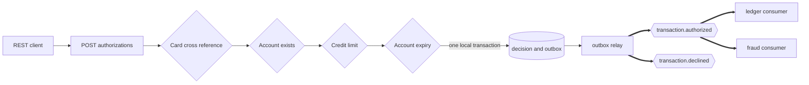
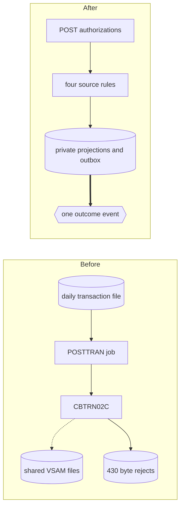

## Authorization Service

- [Purpose](#purpose)
- [Source provenance](#source-provenance)
- [Endpoints](#endpoints)
- [Events](#events)
- [Domain and data ownership](#domain-and-data-ownership)
- [Pitfalls](#pitfalls)
- [Architecture](#architecture)
- [How to extend](#how-to-extend)
- [Local run and tests](#local-run-and-tests)
- [Related documentation](#related-documentation)

<br/>

## Purpose

`authorization-service` owns `POST /authorizations` and the authorization decision. It resolves a card or account, applies four source rules, and writes exactly one outcome event per call. It consumes account state changes and card updates to keep its two private replicas current. It calls no other service during a decision.

<br/>

## Source provenance

The brief named `COPAUA0C` and transaction `CP00`, but neither exists under `app/`. The service is a declared synthesis of three real programs.

| Contribution | Source |
| :--- | :--- |
| Four decline rules and source ordering | `app/cbl/CBTRN02C.cbl:L370-L422` |
| Request fields and tolerant parsing | `app/cbl/COTRN02C.cbl` |
| Signon identity and role fork | `app/cbl/COSGN00C.cbl:L223-L240` |
| Date-validation semantics | `app/cbl/CSUTLDTC.cbl:L62` |
| Repository interface shape | `app/cbl/CBSTM03B.CBL:L99-L127` |
| Asynchronous handoff ancestor | `app/cbl/CORPT00C.cbl:L517-L519` |

The [traceability matrix](../../docs/traceability-matrix.md) records the synthesis and every omission.

<br/>

## Endpoints

| Method and path | Access | Result |
| :--- | :--- | :--- |
| `POST /authorizations` | `USER` or `ADMIN` | HTTP 200 with `approved=true` or `approved=false` |

Both business outcomes return 200. A body that cannot be read returns 400, invalid request values return 422, and infrastructure faults return 500.

A request may name the card number, the account identifier, or both, which is what `app/cbl/COTRN02C.cbl:L196-L209` accepts. An account-only request resolves to its card through the cross-reference. A request carrying both must agree, and one carrying neither is refused with the source's own message.

The full contract is [OpenAPI](src/main/resources/openapi.yaml). Business traffic uses host port 8081; management traffic uses host port 9081.

<br/>

## Events

| Direction | Event | Topic | Group |
| :--- | :--- | :--- | :--- |
| Produces | `TransactionAuthorized` | `transaction.authorized` | — |
| Produces | `TransactionDeclined` versions 1 and 2 | `transaction.declined` | — |
| Consumes | `AccountStateChanged` | `account.state-changed` | `authorization-account-state` |
| Consumes | `CardUpdated` | `card.updated` | `authorization-card-updated` |
| Listener failure route | `DeadLetterEnvelope` | `carddemo.dead-letter` | — |
| Relay abandonment route | `DeadLetterEnvelope` | `carddemo.dead-letter` | — |

An unresolved card uses the 16-character transaction identifier as its Kafka key. Every resolved outcome uses the 11-digit account identifier.

The decision and outbox row commit in one local transaction. The relay publishes only after that commit.

Three services consume `TransactionAuthorized` — ledger, fraud, and notification — each under its own group. This service knows none of them. It publishes one event per call and returns.

A record this service can never apply reaches the dead-letter topic after bounded retries, and nothing the record carried travels with it. The diagnostic is a governed envelope with the four fields of `01 ABEND-DATA` at `app/cpy/CSMSG02Y.cpy:L21-L29`, the message key is the record's own topic, partition, and offset, and only an allowlist of headers survives. The reason is specific: a replica record can hold a credit limit or a pair of cycle balances, and a dead-letter topic has a different audience from the stream it came from.

<br/>

## Domain and data ownership

The rule chain follows the source’s two-stage structure. Reasons 100 and 101 short-circuit at `app/cbl/CBTRN02C.cbl:L372-L373`; reasons 102 and 103 both evaluate.

| Rule | Wire code | Source text |
| :--- | :--- | :--- |
| `CardCrossReferenceRule` | `0100` | `INVALID CARD NUMBER FOUND` |
| `AccountExistsRule` | `0101` | `ACCOUNT RECORD NOT FOUND` |
| `CreditLimitRule` | `0102` | `OVERLIMIT TRANSACTION` |
| `AccountExpirationRule` | `0103` | `TRANSACTION RECEIVED AFTER ACCT EXPIRATION` |

Reason 103 overwrites reason 102 when both checks fail. Equality approves at both comparisons.

The private database is `carddemo_authorization`, with schema `authorization_service`.

| Table | Role |
| :--- | :--- |
| `card_xref` | Card-to-customer-to-account projection seeded from the checked-in fixture |
| `account_credit_snapshot` | Credit limit, cycle counters, expiry, and source-event freshness |
| `unresolved_card_attempt` | Reason-0100 attempts with no resolved account |
| `outbox_event` | Governed outcome events awaiting publication |
| `processed_event` | Duplicate guard for account-state changes |

Account state arrives asynchronously. The service has no account or card HTTP client.

<br/>

## Pitfalls

1. **Reasons 102 and 103 do not short-circuit.** Returning after reason 102 changes a source result when expiry also fails.
2. **Amount parsing is tolerant.** Use `NumvalParser`; `FUNCTION NUMVAL-C` at `app/cbl/COTRN02C.cbl:L383` accepts input that `new BigDecimal(String)` rejects.
3. **The credit calculation narrows precision.** `WS-TEMP-BAL` is narrower than its operands, and the target reproduces that result.
4. **Reason 0100 has no account key.** Use the sanctioned transaction-keyed version 2 event rather than inventing an account identifier.
5. **Projection freshness matters.** An account update or cycle close must publish `AccountStateChanged`, or later decisions read stale counters.
6. **Java 25 is explicit.** Class files must have major version 69; omitting `<java.version>25</java.version>` can compile silently at 61.

Platform-wide pitfalls live in [Onboarding](../../docs/onboarding.md).

<br/>

## Architecture

Figure 1 shows the synchronous request ending before any downstream service acts.

**Figure 1 — Authorization Request, Rule Chain, Local Commit, and Asynchronous Fan-Out**



Legend for Figure 1:

- Plain arrows are synchronous or in-process steps.
- Thick arrows are Kafka publication or consumption after the response transaction.
- Diamonds are source decision points.
- The cylinder contains the decision row and one outbox row in the same transaction.

Figure 2 places the service-scoped source and target paths beside each other. The platform-wide pair is in [Architecture, Before and After](../../docs/architecture-before-after.md).

**Figure 2 — Authorization Path Before and After: Batch Validation Becomes One Synchronous Decision and One Event**



Legend for Figure 2:

- The left side is scheduled batch over shared files.
- The right side is a synchronous decision over private projections.
- Dotted access is shared-file access; the thick arrow is an event publish.

<br/>

## How to extend

- Add a decline rule by implementing `DeclineRule` under `domain/rules/`. Preserve source order and add schema plus equivalence coverage.
- Add a consumer by joining a new group on `transaction.authorized`; no authorization code changes.
- Replace Kafka by implementing `EventPublisherPort`, the platform’s single event-bus seam.

Follow-up work remains in [Suggested Next Tasks](../../docs/suggested-next-tasks.md).

<br/>

## Local run and tests

| Component | Exact value |
| :--- | :--- |
| Build runtime | Eclipse Temurin OpenJDK 25.0.4+7 |
| Build tool | Apache Maven 3.9.16 |
| Broker image | `apache/kafka:4.2.1` |
| Database image | `postgres:18.4` |
| Business port | 8081 |
| Management port | 9081 |
| Database and schema | `carddemo_authorization.authorization_service` |
| Kafka bootstrap inside Compose | `kafka:29092` |
| Consumer groups | `authorization-account-state`, `authorization-card-updated` |
| Migrations | `V1__schema.sql`, `V2__seed.sql`, `V3__unresolved_card_attempt.sql`, `V4__outbox_transaction_key.sql`, `V5__authorization_decision.sql` |

From `card-platform/`:

```bash
mvn -B -pl services/authorization-service -am test
mvn -B -pl services/authorization-service -am package
docker compose up -d --build authorization-service
curl -fsS http://localhost:9081/actuator/health
```

Every business request needs HTTP Basic authentication. Use the generated `admin001` password from [Onboarding](../../docs/onboarding.md).

Direct tests cover all five outcomes, one-event-per-call, transaction-keyed declines, account-state projection ordering, duplicate delivery, and outbox routing.

<br/>

## Related documentation

- [Platform README](../../README.md)
- [Onboarding](../../docs/onboarding.md)
- [Decision Log](../../docs/decision-log.md)
- [Event Flow](../../docs/event-flow.md)
- [Data Model](../../docs/data-model.md)
- [Business Rule Flags](../../docs/business-rule-flags.md)
- [Equivalence Results](../../docs/equivalence-results.md)