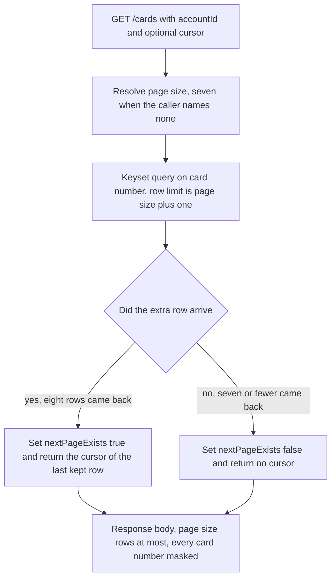

## Card Service

`card-service` serves the card list, the card detail read, and the card update. Its behaviour comes from three CardDemo online programs, their record layouts, and the dataset definitions that keyed them.

- [Purpose](#purpose)
- [Source provenance](#source-provenance)
- [Endpoints](#endpoints)
- [Events published](#events-published)
- [Domain and data ownership](#domain-and-data-ownership)
- [Paging](#paging)
- [Architecture](#architecture)
- [Pitfalls](#pitfalls)
- [Deliberate non-additions](#deliberate-non-additions)
- [Validation messages](#validation-messages)
- [Local run and tests](#local-run-and-tests)
- [How to extend](#how-to-extend)
- [Related documentation](#related-documentation)

<br/>

## Purpose

This module answers three operations over Representational State Transfer (REST): list cards, read one card, and update one card. It publishes one event when a card changes, and it consumes none. The list and the detail read publish nothing. The platform requirement fixes that qualifier: account and card services act *"as supporting services queried by the above, not as event producers unless a state change occurs."*

Three Customer Information Control System (CICS) transactions collapse into this one module. The Basic Mapping Support (BMS) screens that drove them are out of scope, so no user interface is generated. The Java package root is `com.carddemo.card` and the Maven artifactId is `card-service`.

This service reads and writes one private database and reaches no other service's data. It never calls the mainframe.

<br/>

## Source provenance

Three CICS transactions become three endpoints. Each row below names the transaction, the mapset that drew its screen, the program behind it, and the line range that defines it in the CICS System Definition file.

| CICS transaction | BMS mapset | Common Business Oriented Language (COBOL) program | Source function | CSD locator |
| :--- | :--- | :--- | :--- | :--- |
| `CCLI` | `COCRDLI` | `COCRDLIC` | Credit Card List | `app/csd/CARDDEMO.CSD:L357-L358` |
| `CCDL` | `COCRDSL` | `COCRDSLC` | Credit Card View | `app/csd/CARDDEMO.CSD:L347-L348` |
| `CCUP` | `COCRDUP` | `COCRDUPC` | Credit Card Update | `app/csd/CARDDEMO.CSD:L367-L369` |

The root [CardDemo README](../../../README.md) lists the same three transactions in its Application Inventory table at lines 219 to 221.

What each source file contributes:

| Contribution | Source and locator |
| :--- | :--- |
| Paginated browse with a page size of seven, and a lookahead that derives the next-page flag | `app/cbl/COCRDLIC.cbl` — `WS-MAX-SCREEN-LINES PIC S9(4) COMP VALUE 7` at **L177-L178**; screen arrays `OCCURS 7 TIMES` at **L76** and **L86**; page-full test at **L1191**; lookahead read at **L1197-L1205**; flag set at **L1210-L1211** and cleared at **L1216** |
| Optional account and card filters | `app/cbl/COCRDLIC.cbl` — `9500-FILTER-RECORDS` at **L1382-L1409** |
| Card detail retrieval | `app/cbl/COCRDSLC.cbl` — keyed read at **L742-L750**; alternate-index read on the account identifier at **L783-L791** |
| Update validation, the message texts, and the expiry decomposition | `app/cbl/COCRDUPC.cbl` — message literals at **L190-L202**; expiry decomposition at **L115-L121**; field-level change check at **L1498-L1521** |
| Card record layout | `app/cpy/CVACT02Y.cpy` — six fields at L5-L10, 59-byte `FILLER` at L11 |
| Card cross-reference layout | `app/cpy/CVACT03Y.cpy` — three fields at L5-L7, 14-byte `FILLER` at L8 |
| Primary key, record size, secondary index | `app/jcl/CARDFILE.jcl:L54` `KEYS(16 0)`, `:L55` `RECORDSIZE(150 150)`, `:L85-L87` `KEYS(11 16) NONUNIQUEKEY UPGRADE` |
| Cross-reference key and index | `app/jcl/XREFFILE.jcl:L43` `KEYS(16 0)`, `:L74-L76` `KEYS(11,25) NONUNIQUEKEY UPGRADE` |
| Seed rows | `app/data/ASCII/carddata.txt` 50 records at 150 characters; `app/data/ASCII/cardxref.txt` 50 records at 36 characters |

Three further points about what did not carry across.

The BMS screen definitions under `app/bms/` and the symbolic map copybooks under `app/cpy-bms/` are out of scope. The whole presentation layer is excluded, so nothing in this module maps a screen field to a response field.

The screen-navigation fields of `app/cpy/CVCRD01Y.cpy` are **dropped, not mapped**: `CCARD-NEXT-PROG` at L21, `CCARD-NEXT-MAPSET` at L23, and `CCARD-NEXT-MAP` at L24. They sequenced screens, and there are no screens. Each omission is recorded in the [Traceability Matrix](../../docs/traceability-matrix.md). Only the card field definitions of that copybook, at L34-L42, inform the data-transfer objects.

No file under `app/` is modified by this work. The binding constraint reads: *"Do not modify or require changes to the original COBOL source as a prerequisite — the new services should consume the behavior (documented via the tech spec / reverse-engineering output) of the COBOL programs listed above, not call into the mainframe at runtime."* The programs above are read as documentation. No runtime path reaches the mainframe, and no mainframe connector sits on the classpath.

<br/>

## Endpoints

| Method and path | Source program | Notes |
| :--- | :--- | :--- |
| `GET /cards` | `app/cbl/COCRDLIC.cbl` | Paginated list. **Default page size seven**, and a caller may name any size from 1 through 100. A required `accountId` query parameter and an optional `direction` of `forward` or `backward` reproduce the filter at `app/cbl/COCRDLIC.cbl:L1382-L1409` and the forward and backward browse paragraphs. Keyset pagination on the card number. The response carries a next-page flag derived by a lookahead, plus the cursor for the next request |
| `GET /cards/{cardToken}` | `app/cbl/COCRDSLC.cbl` | Card detail, reproducing transaction `CCDL` at `app/csd/CARDDEMO.CSD:L347-L348`. The path carries that card's 64-character token, which `column card_token` holds under a unique constraint, so it reaches at most one row exactly as the card number `app/cbl/COCRDSLC.cbl:L740` moves into the read does. The read keys on one card value alone: the account move above it at `:L739` is commented out, so no account accompanies the card and no relationship between the two is tested. The masked number in the response is read from the row, never derived from the path |
| `PUT /cards/{cardToken}` | `app/cbl/COCRDUPC.cbl` | Update, reproducing transaction `CCUP` at `app/csd/CARDDEMO.CSD:L367-L369`. The path names the row by its token and the body carries the five values `CCUP-NEW-CARDDATA` holds at `app/cbl/COCRDUPC.cbl:L307-L313`. `api/CardController` resolves the token to the row and hands the number the row holds to `domain/CardUpdateService`, so the source rule at `app/cbl/COCRDUPC.cbl:L193-L194` runs on a stored number. A committed change writes one `CardUpdated` row to the outbox in the same local transaction |

Seven is a default and not a hard limit. A request that names no size receives seven rows, which is what `WS-MAX-SCREEN-LINES` gave the 3270 screen.

No request to this service carries a card number. The value that names a card on every route is its token: 64 lower-case hexadecimal characters, `HMAC-SHA-256` over the full number under `CARD_TOKEN_SECRET` prefixed by `CARD_TOKEN_VERSION`, which `PanMasker.cardToken` derives and column `card_token` holds under a unique constraint. Inside the service the domain still works on the full sixteen digits, exactly as the source keys its reads: the token resolves to one row and the number is read from it. Masking happens at the serialization boundary, so every response, event payload and log line carries the masked form. The list cursor is a token for the same reason, so no continuation key carries a digit of a card number either.

The `direction` parameter replaces a program function key. `app/cbl/COCRDLIC.cbl:L486-L497` pages down on `CCARD-AID-PFK08` and performs the forward browse, and `:L501-L512` pages up on `CCARD-AID-PFK07` and performs the backward browse. The parameter selects between the same two paragraphs.

The hand-written interface description is [openapi.yaml](src/main/resources/openapi.yaml). No documentation generator produces it, so the file is edited by hand when a contract changes.

The two routes that name one card carry that card's token in their path and never its number. Each still addresses exactly one card, which is what each source transaction addresses. The reason the token stands there is that a path is written to four places outside this application. They are a container access log, a reverse proxy log, a distributed trace as the span name, and a browser history held by the client. None of the four is reachable by this application's redaction, so masking a number in a response body while putting it in the request line would minimise nothing. A token is a keyed pseudonym, not a reversible encoding of the number. It is stable, so the same card always yields the same token and a reader can link two log lines to the same card. It is not a one-way secret either, because a holder of `CARD_TOKEN_SECRET` can recompute the token of any candidate number. So a reader of any of those four logs learns which card was touched only by holding the key, the token itself stays sensitive, and rotating the key retires every token derived under the old one. [Decision log](../../docs/decision-log.md) records the choice.

A request body is read strictly. `config/RequestJsonStrictnessConfig` refuses a body naming a property this contract does not declare, and refuses a property declared as text that arrives as a JSON number or a JSON boolean. Both answer `400`. Left at its defaults the reader bound a misspelled property to nothing and then refused it as absent, and read `7` for an `expiryMonth` of `07`.

### Two controls in front of every route

`config/CrossSiteRequestFilter` guards state change. A `PUT /cards/{cardToken}` must carry `X-CardDemo-Request` with any non-blank value, must not declare a `Sec-Fetch-Site` other than `same-origin` or `same-site`, and must not carry an `Origin` naming anything but this service. HTTP Basic is a credential a browser attaches by itself, so without this check a page on any other site could submit a form against a route above and the browser would authenticate it. An HTML form cannot set a request header at all, which is what makes one header the control. A refusal answers 403 with the same problem document every other refusal of this service answers and counts `carddemo.card.requests.cross.site.refused`. `GET`, `HEAD`, `OPTIONS` and `TRACE` pass untouched, so the container health check and every read need nothing.

`config/RequestRateCeilingFilter` bounds volume. It runs one place ahead of the security chain, because a refusal has to cost less than the attempt it refuses and an attempt that reached the chain would already have paid for a bcrypt verification.

| Ceiling | Default | Counted by |
| :--- | ---: | :--- |
| Failed authentications | 20 per 60s | Source address, and only when the request carried a credential and was answered 401 |
| Requests | 600 per 60s | Source address |
| Requests | 600 per 60s | The username the credential names, read as a counter key and never verified or logged |
| State-changing requests | 120 per 60s | Source address |
| Requests in flight | 64 | The whole instance |

A refusal answers 429 with `Retry-After` and counts `carddemo.card.requests.throttled`, tagged with the stage that refused: `authentication`, `source`, `identity`, `write` or `concurrency`. The five ceilings read `API_RATE_WINDOW_SECONDS`, `API_RATE_REQUESTS_PER_WINDOW`, `API_RATE_WRITE_REQUESTS_PER_WINDOW`, `API_RATE_AUTHENTICATION_FAILURES_PER_WINDOW` and `API_RATE_CONCURRENT_REQUESTS` from [`.env.example`](../../.env.example). The management base path is exempt, because a throttled probe reads as a failed container.

Both filters count in this process, so several replicas bound each replica rather than the service as a whole, and the source address is the one the container resolves rather than a forwarding header a caller could write. A deployment behind a proxy sets `SERVER_FORWARD_HEADERS_STRATEGY=framework` so the container resolves the client address and the client-facing host. Both residual limits are recorded in [suggested next tasks](../../docs/suggested-next-tasks.md), and the reasoning behind the two controls is in the [Decision Log](../../docs/decision-log.md).

<br/>

## Events published

One event, published on a mutation only. Nothing is consumed here.

| Trigger | Topic | Event | Contract |
| :--- | :--- | :--- | :--- |
| A card update that changed a row and committed | `card.updated` | `CardUpdated` | `card-updated-v1.json` in `event-contracts` |
| An outbox row this service gave up on | `carddemo.dead-letter` | `DeadLetterEnvelope` | Four diagnostic fields, no payload value |

`CardUpdated` carries the shared envelope of `com.carddemo.events.EventEnvelope`: `eventId`, `eventType`, `schemaVersion`, `occurredAt`, and `aggregateId`. Four card fields follow: the masked card number, the account identifier, the expiration date, and the active status.

The account identifier is always `aggregateId`, and always the Kafka message key, even for a card event. Kafka orders records within a partition and not across partitions, so keying on the account keeps every event touching one account on one partition and in publish order. The authorization service consumes `card.updated` under the group `authorization-card-updated`. What that consumer can do with the event is narrower than it sounds, and the platform holds three differently-lived copies of the cross-reference, so each is stated on its own:

- **The authorization copy is refreshed, but only in its observation column.** `CardUpdated` carries a *masked* card number, because no full number travels on a topic here, and `card_xref` is keyed by the full sixteen characters. The message therefore cannot name a key: it can neither create a row nor move a card's mapping to another account. `CardUpdatedConsumer` refreshes the observation timestamp on the matching rows of the account the event names and writes no mapping field.
- **The account copy is seeded and then left alone.** `V4__card_cross_reference_replica.sql` loads 50 rows and no listener updates them. `AccountUpdateService` reads them for `customer_id`.
- **This module's own copy is seeded and then reconciled on the path this service owns.** `V2__seed.sql` loads 50 rows into `card_xref` here. `CardCrossReferenceReconciler` reads the row of every card an update commits and measures its `account_id` against `CARD-ACCT-ID PIC 9(11)` at `app/cpy/CVACT02Y.cpy:L6`, the authoritative mapping. It runs inside the same transaction that saves the card row and writes the outbox row, so the replica moves with the card or not at all. Three outcomes, three meters: `carddemo.card.xref.agreed` counts a row already in step and moves its observation time, `carddemo.card.xref.corrected` counts a diverged row brought into step, and `carddemo.card.xref.missing` counts a card number holding no row. No row is created for that last case — `XREF-CUST-ID PIC 9(09)` at `app/cpy/CVACT03Y.cpy:L6` is mandatory and the card record carries no customer identifier. A card nobody updates is never compared, and that residual is carried in [suggested next tasks](../../docs/suggested-next-tasks.md).

That consumer reaches nothing in this module, and this module reaches nothing in it.

Money travels as a decimal string in every event payload on this platform, never as a JSON number. Most parsers read a JSON number into a double, which returns binary floating point to a system whose correctness rests on fixed-point arithmetic. `CardUpdated` carries no monetary field, so the rule constrains no field here today and governs any amount added later.

The card row and the outbox row commit in **one local transaction**. `OutboxRelay` sweeps afterwards in a separate transaction, publishes, then marks the row sent. Request handling never publishes, so an unreachable broker delays an event and never fails an update. A publish precedes its mark, so delivery is at least once and every consumer absorbs a repeat. `carddemo.card.update.applied` is taken after that transaction commits, through a transaction synchronization rather than at the foot of the update method, so a rewrite the database later rolls back never counts as an applied update.

Two measured facts stand behind that outbox. All eight `DEFINE FILE` blocks of `app/csd/CARDDEMO.CSD` carry `RECOVERY(NONE)` and `JOURNAL(NO)`, eight occurrences of each, so the source had no transactional recovery to inherit. The source holds exactly one asynchronous handoff, `EXEC CICS WRITEQ TD QUEUE('JOBS')` at `app/cbl/CORPT00C.cbl:L517-L518`, where a write and a later pickup are two units of work, as they are here.

The dead-letter topic is `carddemo.dead-letter`, shared across the platform. A row reaches it only after its delivery attempts are spent. What the envelope omits and what it keeps are both worth stating exactly. It **omits** the card number, the card verification value, the failed payload, the exception message and the stack trace. It **keeps** `aggregateId`, which is the account identifier and the message key, together with `sourceTopic`, `sourcePartition`, `sourceOffset`, `attemptCount` and the four `01 ABEND-DATA` components — every one of them required by `schemas/dead-letter-v1.json`. An operator therefore learns which account and which record failed without the diagnostic disclosing a card.

<br/>

## Domain and data ownership

A card record holds six fields. They are the sixteen-digit card number, the eleven-digit account identifier, a three-digit card verification value, a fifty-character embossed name, a ten-character expiry date, and a one-character active status. A card belongs to exactly one account, and the account identifier on the card row ties the two together.

The card cross-reference maps a card number to a customer identifier and an account identifier. It is the join the source uses when it starts from a card and needs the customer behind it. The card record itself carries no customer identifier, so the cross-reference is the only path from a card to a customer.

The private schema is `card_service`, inside this service's own database `carddemo_card`. No table below is shared with another service.

| Table | Derivation |
| :--- | :--- |
| `card` | `app/cpy/CVACT02Y.cpy` L5-L10: `CARD-NUM X(16)`, `CARD-ACCT-ID 9(11)`, `CARD-CVV-CD 9(03)`, `CARD-EMBOSSED-NAME X(50)`, `CARD-EXPIRAION-DATE X(10)`, `CARD-ACTIVE-STATUS X(01)`. The 59-byte `FILLER` at L11 is dropped. Primary key from `app/jcl/CARDFILE.jcl:L54`; non-unique secondary index on `account_id` from `:L85-L87` |
| `card_xref` copy | `app/cpy/CVACT03Y.cpy` L5-L7: `XREF-CARD-NUM X(16)`, `XREF-CUST-ID 9(09)`, `XREF-ACCT-ID 9(11)`. The 14-byte `FILLER` at L8 is dropped. **Seeded from the fixture and reconciled on update**: this module registers no listener, and `CardCrossReferenceReconciler` reads and corrects the row of every card an update commits |
| `outbox_event`, `processed_event` | New abstractions, with no source ancestor |

`card.card_token` is additive and derived rather than stored from a source field. `CardEntity` applies `PanMasker.cardToken` in its constructor to every row this service writes, and `CardTokenReconciler` brings a row loaded by the seed onto the configured key at start-up. There is no setter for the column: a row this service builds is correct by construction, and a row it did not build is corrected by a statement.

No table is shared. The authorization service owns its own `card_xref` and this module owns a second copy. The source sets the precedent: `app/jcl/CREASTMT.JCL` materialises a second, differently keyed copy of the transaction file rather than sharing an index.

`CARD-EXPIRAION-DATE` is misspelled in the source at `app/cpy/CVACT02Y.cpy:L9`. The target column and field names use the correct spelling. No behaviour reads the identifier text, and the rename is recorded in the [Traceability Matrix](../../docs/traceability-matrix.md) along with the two dropped `FILLER` fields and the dropped screen-navigation fields.

The card verification value needs one rule stated plainly. `CARD-CVV-CD` is `PIC 9(03)` at `app/cpy/CVACT02Y.cpy:L7` and the source stores it in the clear. The `card_verification_value` column exists here because the record defines it. **The value is never serialized into any event, any log, or any Application Programming Interface response.** A test asserts its absence rather than a comment promising it.

<br/>

## Paging

Page size seven comes from `WS-MAX-SCREEN-LINES PIC S9(4) COMP VALUE 7` at `app/cbl/COCRDLIC.cbl:L177-L178`, with the two screen arrays declared `OCCURS 7 TIMES` at L76 and L86. The page-full test is `IF WS-SCRN-COUNTER = WS-MAX-SCREEN-LINES` at L1191.

The next-page flag is derived, not counted. When the page fills, the program issues one more `EXEC CICS READNEXT` at L1197-L1205. A read that returns a record sets the next-page-exists condition at L1210-L1211. A read that hits end-of-file sets next-page-not-exists at L1216 and moves the text `NO MORE RECORDS TO SHOW` at L1219.

<br/>

## Architecture

Figure 1 shows how this module reproduces the derived flag: it fetches eight rows, returns seven, and sets the flag from whether the eighth arrived. A `COUNT(*)` query answers a different question and costs a second round trip.

**Figure 1 — Card List Lookahead Paging: Fetching Eight Rows to Return Seven and Derive the Next-Page Flag**



Legend for Figure 1:

- Rectangles are steps inside `CardQueryService` and `CardController`. `REQ` is the request entry, `SIZE` and `QUERY` are read-side work, and `BODY` is the response the caller receives.
- The diamond is the one decision, and it is the whole mechanism: the flag reports what the extra row did, not what a count returned.
- The `yes` branch discards the extra row, keeps the page, and hands back a cursor. The `no` branch keeps every row it received and hands back no cursor.
- The figure reproduces `9000-READ-FORWARD` at `app/cbl/COCRDLIC.cbl:L1191-L1216`. The backward browse walks the same shape in the other direction.

The source browse opens with `EXEC CICS STARTBR` and greater-than-or-equal positioning on the card number at L1273-L1280, then reads next or reads previous. Keyset pagination on `card_number` is the faithful translation. Offset pagination renumbers pages when rows are inserted, so a caller walking pages would see a row twice or miss one.

One citation in the plan needs correcting, and Rule 1 treats a silent deviation as a defect. The plan cites `app/cbl/COCRDLIC.cbl:L1284-L1286` for the lookahead and L1287 for the flag. Those four lines sit inside `9100-READ-BACKWARDS`, where they preset the counter and then set next-page-exists unconditionally before a `READPREV`. The derived flag is at L1191-L1216 inside `9000-READ-FORWARD`, and the correction is recorded in the [Traceability Matrix](../../docs/traceability-matrix.md).

<br/>

## Pitfalls

**The cross-reference fixture holds 36 bytes per record, not the declared 50.** `app/cpy/CVACT03Y.cpy` declares a 50-byte record, and `app/data/ASCII/cardxref.txt` measures exactly 36 characters on every one of its 50 lines. The 36 are 16 plus 9 plus 11, with the 14-byte `FILLER` absent, so record one reads sixteen characters of card number, then `000000050`, then `00000000050`. Read the card number with `cut -c1-16 app/data/ASCII/cardxref.txt | sed -n '1p'`; this guide carries none. A loader that assumes the declared width fails on this data. `app/data/ASCII/carddata.txt` behaves differently: 50 records at exactly 150 characters, matching its copybook.

**Two fields with the same picture clause take two different column types.** Both `CARD-EXPIRAION-DATE` and the account expiry field are `PIC X(10)` in the source. The card column is `DATE` because this module only decomposes or displays it. `app/cbl/COCRDUPC.cbl:L115-L121` slices the field into a four-character year, a two-character month, and a two-character day, and `:L1505-L1507` compares those same slices. The account column stays `VARCHAR(10)`, because the authorization service compares it as raw text against a timestamp prefix. The difference changes behaviour at the boundaries, and both column types are recorded in the [Traceability Matrix](../../docs/traceability-matrix.md).

**The Java language level fails silently.** Every module descriptor must declare `<java.version>25</java.version>`. The Spring Boot parent defaults the language level and the compiler release to 17. A module that omits the override compiles cleanly at release 17, with no warning and no failure. Check the class-file major version: it must read 69, not 61.

**A contended update gives up rather than waiting, and the two 409 outcomes mean different things.** `carddemo.write.lock-wait-ms` bounds the locked read at three seconds by default, reading `WRITE_LOCK_WAIT_MS`. `CardRepository.applyLockWaitBound` applies it with `set_config('lock_timeout', ?, true)`, whose third argument makes it transaction-local, so it bounds this update and never a schema migration or the outbox relay sweep. Without the bound PostgreSQL waits for a held row indefinitely, and `Could not lock record for update` was unreachable through contention. The source sets that condition when a `READ UPDATE` returns anything other than a normal response, and a wait that never ends returns nothing. `LOCK_NOT_ACQUIRED` therefore means the row never came back held; `UPDATE_FAILED_AFTER_LOCK` means it did and the rewrite that followed failed. One is the caller's circumstance and the other is this service's, which is why they carry different statuses. Ordinary concurrent writes settle in milliseconds and still answer `Record changed by some one else. Please review`. Only two faults answer 409, because `applyUpdate` catches `PessimisticLockingFailureException` and `QueryTimeoutException` and nothing wider. Every other database fault is this deployment's circumstance rather than the caller's, so it reaches the generic handler and answers 500. Worth knowing while testing: PostgreSQL requires the `UPDATE` privilege to issue `SELECT ... FOR NO KEY UPDATE`, so revoking `UPDATE` answers 500, and a 409 there would have offered a retry for a grant no retry can repair.

**One sweep of the outbox finishes inside the interval that started it**. `carddemo.outbox.relay.max-duration-ms` bounds a whole pass at five seconds by default, reading `OUTBOX_RELAY_MAX_DURATION_MS`. The producer budget is set so one send cannot outlast it. `max.block.ms` of two seconds plus `delivery.timeout.ms` of two seconds is four, and `delivery.timeout.ms` is at least `linger.ms` of zero plus `request.timeout.ms` of two seconds. `EventPublisherPort.publish` hands back a `CompletionStage`, so the relay watches a send under its own remaining deadline and drops the watch when that deadline lapses. Dropping a watch does not abort a send already on the wire, which is why the producer's window is the shorter of the two. The broker gives up before the relay stops watching, so a lapsed pass leaves nothing in flight that could land after the row is swept again. `CardPropertiesTest.oneSendResolvesInsideTheSweepThatIssuedIt` fails the build if either inequality is broken.

**Retention deletes in batches and drains them.** `RetentionSweep` removes at most 500 rows per statement, oldest first, and repeats until a batch comes back short or a thirty-second ceiling for that table passes. A backlog therefore clears rather than shrinking by one batch an hour. Each batch is its own transaction, and a failure on one table still sweeps the other.

**The card verification value must never leave this service.** The column is persisted because the card record defines it. A test asserts its absence from every event, log line, and response. Do not add it to a response body because a caller asks for it.

**The card-token key is required and this repository ships no deployable runtime key**. `CARD_TOKEN_SECRET` is a `REPLACE` placeholder in `card-platform/.env.example` and in `deploy/k8s/31-secret.example.yaml`. This service refuses to start while it is absent, blank, still a placeholder, shorter than 32 characters, or equal to either card-token key this repository has published. Generate one with `openssl rand -base64 48 | tr -d '/+='`. Only this service and the authorization service read it, so the Kubernetes Secret that carries it is pulled by those two Deployments alone.

**The fifty seeded card tokens are a bootstrap, not a live identity**. `V2__seed.sql` carries a literal token on each of its fifty rows, derived under the build-scope key in `card-platform/pom.xml`. That is what lets a test compare a checked-in literal against the derivation. `CardTokenReconciler` re-derives every row under the configured key before this service accepts traffic, in pages of 500 and capped at 200,000 rows, and rewrites nothing on a later start. Raising `CARD_TOKEN_VERSION` and restarting applies a rollover the same way. A token something else already stored — a `statement_transaction` row, an `authorization_decision` row, a granted `SCOPE_CARD` authority — does not move with it.

**A state-changing call needs one extra header.** A `curl` that worked before this control answers 403 until it adds `-H 'X-CardDemo-Request: 1'`. `config/CrossSiteRequestFilter` requires the header on every `POST`, `PUT`, `PATCH` and `DELETE`, because HTTP Basic is a credential a browser attaches without being asked and an HTML form cannot set a header. Reads need nothing. The name is configurable through `API_CROSS_SITE_HEADER` and it is not a secret: the value is never checked, only its presence.

**A burst answers 429 rather than being served.** A load generator, a retry loop, or a test that hammers one address reaches `config/RequestRateCeilingFilter` and answers 429 with `Retry-After`. The blanket ceiling is 600 requests a minute per address and per identity, writes are 120, and 20 failed authentications from one address close the rest of that minute. Raise `API_RATE_*` for a load run rather than removing the filter, and read the `stage` tag on `carddemo.card.requests.throttled` to see which ceiling refused.

<br/>

## Deliberate non-additions

A competent engineer would reasonably add each item below. Each one must stay out, because adding it changes an outcome the equivalence suite pins.

- **No Luhn check and no checksum.** `app/cbl/COCRDUPC.cbl:L194` declares the only card-number rule the source has, and `:L784` applies it as `IF CC-CARD-NUM IS NOT NUMERIC`. Sixteen numeric digits is the whole test.
- **No card-status check exported into the authorization path.** `CARD-ACTIVE-STATUS` is stored and returned here, and the posting path never reads it. `app/jcl/POSTTRAN.jcl` STEP15 allocates TRANFILE, DALYTRAN, XREFFILE, DALYREJS, ACCTFILE, and TCATBALF across its 45 lines, and no CARDFILE. The authorization service must not consult the status.
- **No version column.** The update path reproduces the field-level comparison at `app/cbl/COCRDUPC.cbl:L1498-L1521`. That paragraph folds the embossed name to upper case at L1499-L1501, then compares five values, and answers `Record changed by some one else. Please review` when one differs. A version column detects a different set of conflicts.
- **No user interface.** The BMS screens have no target equivalent, and none is generated.
- **No boilerplate generator, no object-mapping framework, and no documentation generator.** Java records and explicit mapper classes carry the field mapping, and `openapi.yaml` is written by hand.
- **No cache and no key-value store.** This module holds its state in its own PostgreSQL schema.
- **No component library, no styling framework, and no content-delivery-network dependency.**
- **No COBOL compiler, emulator, or mainframe connector on the classpath.**

<br/>

## Validation messages

The equivalence suite asserts on these texts character for character, so they are reproduced exactly as the source declares them. The right-hand column reports whether a `SET` site exists for the condition name in `app/cbl/COCRDLIC.cbl`, `app/cbl/COCRDSLC.cbl`, or `app/cbl/COCRDUPC.cbl`, measured across all three.

| Locator | Verbatim text | Reachable in the source |
| :--- | :--- | :--- |
| `app/cbl/COCRDUPC.cbl:L190` and `:L192` | `Account number must be a non zero 11 digit number` | No `SET` site. The account filter edit at `:L740` writes its own text from `:L745` instead |
| `app/cbl/COCRDUPC.cbl:L194` | `Card number if supplied must be a 16 digit number` | No `SET` site. The card filter edit at `:L784` writes its own text from `:L789` instead |
| `app/cbl/COCRDUPC.cbl:L196` | `Card Active Status must be Y or N` | Set at `:L856` and `:L869` |
| `app/cbl/COCRDUPC.cbl:L198` | `Card expiry month must be between 1 and 12` | Set at `:L889` and `:L904` |
| `app/cbl/COCRDUPC.cbl:L200` | `Invalid card expiry year` | Set at `:L922` and `:L940` |
| `app/cbl/COCRDUPC.cbl:L202` | `Did not find this account in cards database` | Set once, at `app/cbl/COCRDSLC.cbl:L799` |

`CardValidationMessages` holds all six. The three with no `SET` site keep a `NEVER_EMITTED_` prefix, so a reader can tell a declared text from a text a caller can receive.

Three concrete ranges sit behind those messages, measured at `app/cbl/COCRDUPC.cbl:L92-L99`. The month is valid for `1 THRU 12` at L95. The year is valid for `1950 THRU 2099` at L99. The active status accepts exactly `Y` or `N`, from `88 FLG-YES-NO-VALID VALUES 'Y', 'N'.` at L91.

Six further texts belong to paths this module serves, and each is reproduced with the same discipline. They are `Did not find cards for this search condition`, `Could not lock record for update`, `Record changed by some one else. Please review`, `Update of record failed`, `Card name can only contain alphabets and spaces`, and `No change detected with respect to values fetched.` The trailing full stop on that last text is in the source, at `app/cbl/COCRDUPC.cbl:L188`.

<br/>

## Local run and tests

Every version below is an exact release. Nothing here is a range or a minimum.

| Component | Exact value |
| :--- | :--- |
| Build runtime | **OpenJDK 25**, Eclipse Temurin 25.0.4+7 |
| Container runtime image | **`bellsoft/liberica-openjre-debian:25.0.4-9`** |
| Build tool | **Apache Maven 3.9.16** |
| Broker image | **`apache/kafka:4.2.1`**, Kafka Raft mode, no ZooKeeper |
| Database image | **`postgres:18.4`** |
| Docker Engine and Compose | 29.7.0 or later with 5.3.1 or later |
| Business port | **8086** on the host, from `CARD_PORT`; the container listens on **8080** |
| Management port | **9086** on the host, from `CARD_MANAGEMENT_PORT`; the container listens on **9080** |
| Database and schema | **`carddemo_card`**, schema **`card_service`**, login `carddemo_card_svc` |
| Kafka bootstrap | **`kafka:29092`** inside Compose, `localhost:9092` from the host |
| Topics published | `card.updated`, `carddemo.dead-letter` |
| Listeners registered | None |
| Listener concurrency | **3**, declared for a listener added later rather than for one running now |
| Scheduler threads | **2**, one for the relay and one for the retention sweep |
| Datasource pool | at most **10** connections, **4** kept idle |

The build runtime and the build tool are exact because the enforcer plugin refuses a build outside `[25,26)` and `[3.9.16,3.10.0)`; a newer Maven fails rather than passes. The four image tags are exact because each is pinned by digest as well. Docker Engine and Compose are floors: nothing here constrains them, so the versions given are the ones this was exercised on.

Run it from `card-platform/`. The first block gives every credential a value, including
`CARD_DB_PASSWORD` and `CARD_KAFKA_PASSWORD`. None has a default, and nothing below prompts.

```bash
# The hash helper inside the script reads spring-security-crypto out of the local Maven
# repository, so this has to have run once on this machine.
mvn -B -ntp -DskipTests package

# install -m 600, never cp: this file holds every stack credential a moment later, and cp
# creates it under the umask -- world-readable on a default account.
install -m 600 .env.example .env
# Fill in all 19 REPLACE markers: fourteen passwords, one card-token key and four
# {bcrypt} identity hashes. Compose reads every one with ${VAR:?} and refuses to start
# while any is unset, so the three this service uses are not enough on their own. One
# command generates every one and keeps each plaintext out of the environment.
scripts/generate-env.sh
mvn -B -pl services/card-service -am package
docker compose up -d --build --wait postgres kafka card-service
curl -fsS http://localhost:9086/actuator/health
```

Each Dockerfile compiles its own module in a Java Development Kit 25 builder stage from the
`card-platform` context, so the image build reads nothing the `mvn package` above produced. That
command is what fills the local repository `scripts/generate-env.sh` reads to hash the identity
passwords.

One call per endpoint, against the host port. Each example uses the administrator identity, which passes every ownership check by role. An ordinary identity needs a matching `SCOPE_ACCOUNT_` or `SCOPE_CARD_` entry in `USER_SCOPES`. Give `-u` the user name alone and `curl` prompts for the password, keeping it out of the process environment and the shell history; `.env` holds only the bcrypt hash, so supply the plaintext you chose when you generated that hash.

> **Synthetic data only.** `CARD_NUMBER` below is read out of the public repository fixture
> `app/data/ASCII/carddata.txt`, which holds made-up numbers and identifies no real card. This guide
> carries no card number of its own, so nothing here can be replayed. The number is read only to
> derive the token the routes name, and is discarded on the next line. Never substitute a real card
> number into these commands: the demonstration binds its ports to the loopback address and carries
> none of the controls real card data requires.

```bash
# The card number is read from the fixture V2__seed.sql loads rather than written
# here. No guide in this repository carries a card number a reader could replay:
# the value below exists for the length of the shell that reads it. Run from the
# repository root, where app/ is.
CARD_NUMBER="$(cut -c1-16 app/data/ASCII/carddata.txt | sed -n '1p')"

# Derive that card's token. This is the same keyed code PanMasker.cardToken takes:
# HMAC-SHA-256 over the label, the configured version and the number, under
# CARD_TOKEN_SECRET. CardTokenReconciler derived the stored value the same way as
# this service started, so the two agree. The number is not needed past this point.
CARD_TOKEN_SECRET="$(grep '^CARD_TOKEN_SECRET=' card-platform/.env | cut -d= -f2- | tr -d "'\"")"
CARD_TOKEN_VERSION="$(grep '^CARD_TOKEN_VERSION=' card-platform/.env | cut -d= -f2- | tr -d "'\"")"
CARD_TOKEN="$(printf 'CardDemo/card-token/v%s:%s' "$CARD_TOKEN_VERSION" "$CARD_NUMBER" \
  | openssl dgst -sha256 -hmac "$CARD_TOKEN_SECRET" -r | cut -d' ' -f1)"
unset CARD_NUMBER CARD_TOKEN_SECRET

# List the first page for one account. Seven rows unless pageSize names another.
curl -fsS -u admin001 \
  "http://localhost:8086/cards?accountId=00000000050"

# Read one card. The path carries that card's token and no digit of its number.
curl -fsS -u "$ADMIN_USERNAME:the password you chose" \
  "http://localhost:8086/cards/${CARD_TOKEN}"

# Update one card. A committed change publishes one CardUpdated event. The header is what
# config/CrossSiteRequestFilter requires of every state-changing call.
curl -fsS -u "$ADMIN_USERNAME:the password you chose" -X PUT \
  -H 'X-CardDemo-Request: card-cli' \
  -H 'Content-Type: application/json' \
  -d '{"embossedName":"ANIYA VON","expiryYear":"2031","expiryMonth":"03","expiryDay":"09","activeStatus":"Y"}' \
  "http://localhost:8086/cards/${CARD_TOKEN}"
```

**The update example moves the expiry forward to 2031-03-09, and the choice needs explaining.** The
service applies the source's rule and nothing more: `app/cbl/COCRDUPC.cbl:L1260`ff tests only that the
year falls in `88 VALID-YEAR VALUES 1950 THRU 2099` and that the month and day name a real calendar
date. **No future-date check exists, in the source or here**, so a past expiry is accepted and stored.
That matters when reading the seed data: all 50 expiries in
`src/main/resources/db/migration/V2__seed.sql` fall between 2023-01-06 and 2025-12-28 and are
therefore already past, and the service still lists, returns and updates every one of those cards. A
future date is used above only so the example does not read as though it were setting a card live
today. Nothing in the authorization path consults a card expiry either — reason 0103 at
`app/cbl/CBTRN02C.cbl:L414-L420` compares the **account** expiry, and the posting program never opens
the card file at all.

The Compose file sets these properties, and each one is overridable: `SPRING_DATASOURCE_URL`, `SPRING_DATASOURCE_USERNAME`, `SPRING_DATASOURCE_PASSWORD`, `SPRING_JPA_PROPERTIES_HIBERNATE_DEFAULT_SCHEMA`, `SPRING_FLYWAY_SCHEMAS`, and `SPRING_KAFKA_BOOTSTRAP_SERVERS`.

Flyway owns schema creation and runs eight migrations on every start, in this order:

| Migration | What it does |
| :--- | :--- |
| `V1__schema.sql` | Creates `card`, `card_xref`, `outbox_event` and `processed_event`, with their indexes and named constraints. Keys come from `KEYS(16 0)` at `app/jcl/CARDFILE.jcl` and `app/jcl/XREFFILE.jcl` |
| `V2__seed.sql` | Loads 50 cards from `app/data/ASCII/carddata.txt` and 50 cross-reference rows from `app/data/ASCII/cardxref.txt`, each card row carrying its `card_token` derived under the shipped demo key |
| `V3__processed_event_topic_key.sql` | Makes the consumed topic part of the duplicate-delivery marker's identity, keeping the marker table's shape uniform with the other five services even though this module consumes nothing |
| `V4__subject_request_posture.sql` | Corrects the `card_xref` comment, which described an erasure workflow this platform does not implement |
| `V5__xref_reconciliation_and_status_domain.sql` | Adds `ck_card_active_status`, the `Y`/`N` check `CARD-ACTIVE-STATUS PIC X(01)` at `app/cpy/CVACT02Y.cpy:L10` always implied, and restates the `card_xref` comment: the replica is reconciled by `CardCrossReferenceReconciler` on the update path, not by an event |
| `V6__outbox_correlation.sql` | Adds `outbox_event.correlation_id` and `outbox_event.causation_id`, so the card update the relay publishes names the request behind it |
| `V7__outbox_aggregate_head_index.sql` | Adds `ix_outbox_event_aggregate_head`, the partial index the relay's aggregate-head claim reads. That claim answers with the due head row of each account, so two events of one account are never in flight at once and every consumer of the account's partition reads them in the order this service wrote them. Without the index the correlated check re-read an account's backlog for every candidate row |
| `V8__card_status_locator.sql` | Restates the `ck_card_active_status` comment with the locator the status test actually occupies, `app/cbl/COCRDUPC.cbl:L861-L871`. `V5` cited a range past the end of that file, and a database that applied `V5` and then had its checksums repaired still holds the earlier text |

This module ships no `db/demo` overlay — the demo expiry extension exists only for the account and authorization schemas, because reason 0103 reads an account expiry and nothing reads a card expiry.

Hibernate runs with `ddl-auto: validate`, never `update` and never `create`, so the `DATE` expiry column and the non-unique index on `account_id` survive every restart. A mapping that disagrees with the migration stops start-up instead of quietly altering a table.

<br/>

## Metrics this service registers

Thirteen meters, eleven registered by `config/ObservabilityConfig` and two by
`config/OutboxBacklogMetrics`, readable at `/actuator/metrics` and `/actuator/prometheus` on the
management port. None carries a tag, so each is one series. Two more are registered by the
request filters and described with them: `carddemo.card.requests.cross.site.refused` and
`carddemo.card.requests.throttled`.

| Meter | What it counts or times |
| :--- | :--- |
| `carddemo.card.update.applied` | Card updates that committed |
| `carddemo.card.update.conflicts` | Card updates refused after a concurrent change |
| `carddemo.card.update.latency` | Wall time of one card update, from request entry to commit |
| `carddemo.card.events.published` | Card events published to the broker |
| `carddemo.card.publish.latency` | Wall time of one publish attempt made by the outbox relay |
| `carddemo.card.failures` | Card work that failed on infrastructure |
| `carddemo.card.outbox.abandoned` | Outbox rows given up on after exhausting their attempts |
| `carddemo.card.outbox.due` | Outbox rows due for an attempt now, being the backlog not yet published. A gauge rather than a counter, because a backlog is a state and not an event |
| `carddemo.card.outbox.oldest.due.age` | Seconds the longest-waiting due outbox row has waited, zero when none is due. It separates a service working through a burst from a stopped relay |
| `carddemo.card.dead.letters.failed` | Terminal diagnostic attempts the broker refused |
| `carddemo.card.xref.agreed` | Cross-reference replica rows an update found already in step |
| `carddemo.card.xref.corrected` | Cross-reference replica rows an update found diverged and corrected |
| `carddemo.card.xref.missing` | Card numbers an update found holding no cross-reference replica row |

`update.applied` is taken after the transaction commits and `update.conflicts` on the refusal, so the
two never both move for one request. A 409 answering a lock the database would not give moves
`update.conflicts`; a fault that is neither a lock nor a timeout answers 500 and moves `failures`
instead, which is what keeps a broken grant out of the conflict series.

<br/>

## How to extend

- Add a validation rule by adding the constraint and its message text, keeping the edit order the source uses. The first failing edit owns the answer, so position decides which of several texts a caller reads.
- Add a consumer of `card.updated` in its own service. Nothing in this module changes, which is the point of publishing through a topic.
- Follow the repository contract when adding a data operation. `app/cbl/CBSTM03B.CBL:L100-L112` declares one parameter area with an operation code. The codes map directly: `K` keyed read becomes find by identifier, `R` becomes stream all, `W` becomes insert, and `Z` becomes update. The `O` open and `C` close codes are dropped, because connection lifecycle belongs to the framework.

<br/>

## Related documentation

Read these rather than a restatement here. Rationale for every choice lives in the decision log, not in this file.

- [Platform README](../../README.md) — the mono-repo map and the module graph
- [Onboarding](../../docs/onboarding.md) — clean machine to running platform
- [Suggested Next Tasks](../../docs/suggested-next-tasks.md) — improvements found and left out of scope
- [Decision Log](../../docs/decision-log.md) — every decision, its alternatives, and its risks
- [Business Rule Flags](../../docs/business-rule-flags.md) — the flagged COBOL findings
- [Traceability Matrix](../../docs/traceability-matrix.md) — source-to-target mapping and every deliberate omission
- [Architecture Before and After](../../docs/architecture-before-after.md) — the platform in both states
- [Data Model](../../docs/data-model.md) — the per-service entity relationships
- [Event Flow](../../docs/event-flow.md) — the platform publish and consume paths
- [Equivalence Results](../../docs/equivalence-results.md) — fixture-by-fixture comparison results
