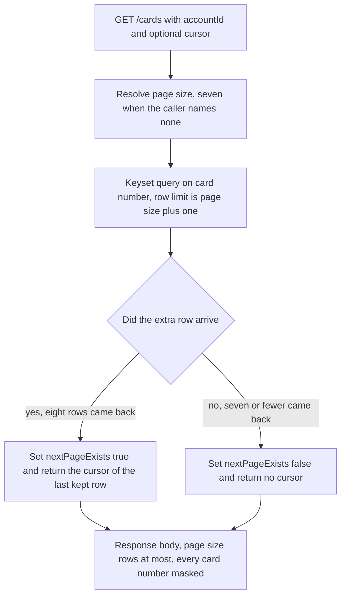

## Card Service

`card-service` serves the card list, the card detail read, and the card update. Its behaviour comes from three CardDemo online programs, their record layouts, and the dataset definitions that keyed them.

- [Purpose](#purpose)
- [Source provenance](#source-provenance)
- [Endpoints](#endpoints)
- [Events published](#events-published)
- [Domain and data ownership](#domain-and-data-ownership)
- [Paging](#paging)
- [Architecture](#architecture)
- [Pitfalls](#pitfalls)
- [Deliberate non-additions](#deliberate-non-additions)
- [Validation messages](#validation-messages)
- [Local run and tests](#local-run-and-tests)
- [How to extend](#how-to-extend)
- [Related documentation](#related-documentation)

<br/>

## Purpose

This module answers three operations over Representational State Transfer (REST): list cards, read one card, and update one card. It publishes one event when a card changes, and it consumes none. The list and the detail read publish nothing. The platform requirement fixes that qualifier: account and card services act *"as supporting services queried by the above, not as event producers unless a state change occurs."*

Three Customer Information Control System (CICS) transactions collapse into this one module. The Basic Mapping Support (BMS) screens that drove them are out of scope, so no user interface is generated. The Java package root is `com.carddemo.card` and the Maven artifactId is `card-service`.

This service reads and writes one private database and reaches no other service's data. It never calls the mainframe.

<br/>

## Source provenance

Three CICS transactions become three endpoints. Each row below names the transaction, the mapset that drew its screen, the program behind it, and the line range that defines it in the CICS System Definition file.

| CICS transaction | BMS mapset | COBOL program | Source function | CSD locator |
| :--- | :--- | :--- | :--- | :--- |
| `CCLI` | `COCRDLI` | `COCRDLIC` | Credit Card List | `app/csd/CARDDEMO.CSD:L357-L358` |
| `CCDL` | `COCRDSL` | `COCRDSLC` | Credit Card View | `app/csd/CARDDEMO.CSD:L347-L348` |
| `CCUP` | `COCRDUP` | `COCRDUPC` | Credit Card Update | `app/csd/CARDDEMO.CSD:L367-L369` |

The root [CardDemo README](../../../README.md) lists the same three transactions in its Application Inventory table at lines 219 to 221.

What each source file contributes:

| Contribution | Source and locator |
| :--- | :--- |
| Paginated browse with a page size of seven, and a lookahead that derives the next-page flag | `app/cbl/COCRDLIC.cbl` — `WS-MAX-SCREEN-LINES PIC S9(4) COMP VALUE 7` at **L177-L178**; screen arrays `OCCURS 7 TIMES` at **L76** and **L86**; page-full test at **L1191**; lookahead read at **L1197-L1205**; flag set at **L1210-L1211** and cleared at **L1216** |
| Optional account and card filters | `app/cbl/COCRDLIC.cbl` — `9500-FILTER-RECORDS` at **L1382-L1409** |
| Card detail retrieval | `app/cbl/COCRDSLC.cbl` — keyed read at **L742-L750**; alternate-index read on the account identifier at **L783-L791** |
| Update validation, the message texts, and the expiry decomposition | `app/cbl/COCRDUPC.cbl` — message literals at **L190-L202**; expiry decomposition at **L115-L121**; field-level change check at **L1498-L1521** |
| Card record layout | `app/cpy/CVACT02Y.cpy` — six fields at L5-L10, 59-byte `FILLER` at L11 |
| Card cross-reference layout | `app/cpy/CVACT03Y.cpy` — three fields at L5-L7, 14-byte `FILLER` at L8 |
| Primary key, record size, secondary index | `app/jcl/CARDFILE.jcl:L54` `KEYS(16 0)`, `:L55` `RECORDSIZE(150 150)`, `:L85-L87` `KEYS(11 16) NONUNIQUEKEY UPGRADE` |
| Cross-reference key and index | `app/jcl/XREFFILE.jcl:L43` `KEYS(16 0)`, `:L74-L76` `KEYS(11,25) NONUNIQUEKEY UPGRADE` |
| Seed rows | `app/data/ASCII/carddata.txt` 50 records at 150 characters; `app/data/ASCII/cardxref.txt` 50 records at 36 characters |

Three further points about what did not carry across.

The BMS screen definitions under `app/bms/` and the symbolic map copybooks under `app/cpy-bms/` are out of scope. The whole presentation layer is excluded, so nothing in this module maps a screen field to a response field.

The screen-navigation fields of `app/cpy/CVCRD01Y.cpy` are **dropped, not mapped**: `CCARD-NEXT-PROG` at L21, `CCARD-NEXT-MAPSET` at L23, and `CCARD-NEXT-MAP` at L24. They sequenced screens, and there are no screens. Each omission is recorded in the [Traceability Matrix](../../docs/traceability-matrix.md). Only the card field definitions of that copybook, at L34-L42, inform the data-transfer objects.

No file under `app/` is modified by this work. The binding constraint reads: *"Do not modify or require changes to the original COBOL source as a prerequisite — the new services should consume the behavior (documented via the tech spec / reverse-engineering output) of the COBOL programs listed above, not call into the mainframe at runtime."* The programs above are read as documentation. No runtime path reaches the mainframe, and no mainframe connector sits on the classpath.

<br/>

## Endpoints

| Method and path | Source program | Notes |
| :--- | :--- | :--- |
| `GET /cards` | `app/cbl/COCRDLIC.cbl` | Paginated list. **Default page size seven**, and a caller may name any size from 1 through 100. A required `accountId` query parameter and an optional `direction` of `forward` or `backward` reproduce the filter at `app/cbl/COCRDLIC.cbl:L1382-L1409` and the forward and backward browse paragraphs. Keyset pagination on the card number. The response carries a next-page flag derived by a lookahead, plus the cursor for the next request |
| `POST /cards/detail` | `app/cbl/COCRDSLC.cbl` | Card detail. The body carries the account identifier and the full sixteen-character card number, and the read keys on the card number alone, as `app/cbl/COCRDSLC.cbl:L740` does |
| `PUT /cards` | `app/cbl/COCRDUPC.cbl` | Update. A committed change writes one `CardUpdated` row to the outbox in the same local transaction |

Seven is a default and not a hard limit. A request that names no size receives seven rows, which is what `WS-MAX-SCREEN-LINES` gave the 3270 screen.

The card number that names a card is the full sixteen digits, exactly as the source keys its reads. Masking happens at the serialization boundary: every response, event payload, and log line carries the masked form, and the domain works on the full value. The list cursor is a card token rather than a card number, so no continuation key carries a digit of a card number.

The `direction` parameter replaces a program function key. `app/cbl/COCRDLIC.cbl:L486-L497` pages down on `CCARD-AID-PFK08` and performs the forward browse, and `:L501-L512` pages up on `CCARD-AID-PFK07` and performs the backward browse. The parameter selects between the same two paragraphs.

The hand-written interface description is [openapi.yaml](src/main/resources/openapi.yaml). No documentation generator produces it, so the file is edited by hand when a contract changes.

The plan's file-by-file table sketched these three operations as `GET /cards/{cardNumber}` and `PUT /cards/{cardNumber}`. The delivered shapes are the three above, they match the [platform README](../../README.md) service table, and the change is recorded in the [Decision Log](../../docs/decision-log.md).

<br/>

## Events published

One event, published on a mutation only. Nothing is consumed here.

| Trigger | Topic | Event | Contract |
| :--- | :--- | :--- | :--- |
| A card update that changed a row and committed | `card.updated` | `CardUpdated` | `card-updated-v2.json` in `event-contracts` |
| An outbox row this service gave up on | `carddemo.dead-letter` | `DeadLetterEnvelope` | Four diagnostic fields, no payload value |

`CardUpdated` carries the shared envelope of `com.carddemo.events.EventEnvelope`: `eventId`, `eventType`, `schemaVersion`, `occurredAt`, and `aggregateId`. Four card fields follow: the masked card number, the account identifier, the expiration date, and the active status.

The account identifier is always `aggregateId`, and always the Kafka message key, even for a card event. Kafka orders records within a partition and not across partitions, so keying on the account keeps every event touching one account on one partition and in publish order. The authorization service consumes `card.updated` under the group `authorization-card-updated` to keep its own cross-reference copy current. That consumer reaches nothing in this module, and this module reaches nothing in it.

Money travels as a decimal string in every event payload on this platform, never as a JSON number. Most parsers read a JSON number into a double, which returns binary floating point to a system whose correctness rests on fixed-point arithmetic. `CardUpdated` carries no monetary field, so the rule constrains no field here today and governs any amount added later.

The card row and the outbox row commit in **one local transaction**. `OutboxRelay` sweeps afterwards in a separate transaction, publishes, then marks the row sent. Request handling never publishes, so an unreachable broker delays an event and never fails an update. A publish precedes its mark, so delivery is at least once and every consumer absorbs a repeat.

Two measured facts stand behind that outbox. All eight `DEFINE FILE` blocks of `app/csd/CARDDEMO.CSD` carry `RECOVERY(NONE)` and `JOURNAL(NO)`, eight occurrences of each, so the source had no transactional recovery to inherit. The source holds exactly one asynchronous handoff, `EXEC CICS WRITEQ TD QUEUE('JOBS')` at `app/cbl/CORPT00C.cbl:L517-L518`, where a write and a later pickup are two units of work, as they are here.

The dead-letter topic is `carddemo.dead-letter`, shared across the platform. A row reaches it only after its delivery attempts are spent, and the envelope it carries names the row without repeating any card number or account identifier.

<br/>

## Domain and data ownership

A card record holds six fields. They are the sixteen-digit card number, the eleven-digit account identifier, a three-digit card verification value, a fifty-character embossed name, a ten-character expiry date, and a one-character active status. A card belongs to exactly one account, and the account identifier on the card row ties the two together.

The card cross-reference maps a card number to a customer identifier and an account identifier. It is the join the source uses when it starts from a card and needs the customer behind it. The card record itself carries no customer identifier, so the cross-reference is the only path from a card to a customer.

The private schema is `card_service`, inside this service's own database `carddemo_card`. No table below is shared with another service.

| Table | Derivation |
| :--- | :--- |
| `card` | `app/cpy/CVACT02Y.cpy` L5-L10: `CARD-NUM X(16)`, `CARD-ACCT-ID 9(11)`, `CARD-CVV-CD 9(03)`, `CARD-EMBOSSED-NAME X(50)`, `CARD-EXPIRAION-DATE X(10)`, `CARD-ACTIVE-STATUS X(01)`. The 59-byte `FILLER` at L11 is dropped. Primary key from `app/jcl/CARDFILE.jcl:L54`; non-unique secondary index on `account_id` from `:L85-L87` |
| `card_xref` replica | `app/cpy/CVACT03Y.cpy` L5-L7: `XREF-CARD-NUM X(16)`, `XREF-CUST-ID 9(09)`, `XREF-ACCT-ID 9(11)`. The 14-byte `FILLER` at L8 is dropped. A **service-local replica kept current by events** |
| `outbox_event`, `processed_event` | New abstractions, with no source ancestor |

No table is shared. The authorization service owns its own `card_xref` and this module owns a second copy. The source sets the precedent: `app/jcl/CREASTMT.JCL` materialises a second, differently keyed copy of the transaction file rather than sharing an index.

`CARD-EXPIRAION-DATE` is misspelled in the source at `app/cpy/CVACT02Y.cpy:L9`. The target column and field names use the correct spelling. No behaviour reads the identifier text, and the rename is recorded in the [Traceability Matrix](../../docs/traceability-matrix.md) along with the two dropped `FILLER` fields and the dropped screen-navigation fields.

The card verification value needs one rule stated plainly. `CARD-CVV-CD` is `PIC 9(03)` at `app/cpy/CVACT02Y.cpy:L7` and the source stores it in the clear. The `card_verification_value` column exists here because the record defines it. **The value is never serialized into any event, any log, or any Application Programming Interface response.** A test asserts its absence rather than a comment promising it.

<br/>

## Paging

Page size seven comes from `WS-MAX-SCREEN-LINES PIC S9(4) COMP VALUE 7` at `app/cbl/COCRDLIC.cbl:L177-L178`, with the two screen arrays declared `OCCURS 7 TIMES` at L76 and L86. The page-full test is `IF WS-SCRN-COUNTER = WS-MAX-SCREEN-LINES` at L1191.

The next-page flag is derived, not counted. When the page fills, the program issues one more `EXEC CICS READNEXT` at L1197-L1205. A read that returns a record sets the next-page-exists condition at L1210-L1211. A read that hits end-of-file sets next-page-not-exists at L1216 and moves the text `NO MORE RECORDS TO SHOW` at L1219.

<br/>

## Architecture

Figure 1 shows how this module reproduces the derived flag: it fetches eight rows, returns seven, and sets the flag from whether the eighth arrived. A `COUNT(*)` query answers a different question and costs a second round trip.

**Figure 1 — Card List Lookahead Paging: Fetching Eight Rows to Return Seven and Derive the Next-Page Flag**



Legend for Figure 1:

- Rectangles are steps inside `CardQueryService` and `CardController`. `REQ` is the request entry, `SIZE` and `QUERY` are read-side work, and `BODY` is the response the caller receives.
- The diamond is the one decision, and it is the whole mechanism: the flag reports what the extra row did, not what a count returned.
- The `yes` branch discards the extra row, keeps the page, and hands back a cursor. The `no` branch keeps every row it received and hands back no cursor.
- The figure reproduces `9000-READ-FORWARD` at `app/cbl/COCRDLIC.cbl:L1191-L1216`. The backward browse walks the same shape in the other direction.

The source browse opens with `EXEC CICS STARTBR` and greater-than-or-equal positioning on the card number at L1273-L1280, then reads next or reads previous. Keyset pagination on `card_number` is the faithful translation. Offset pagination renumbers pages when rows are inserted, so a caller walking pages would see a row twice or miss one.

One citation in the plan needs correcting, and Rule 1 treats a silent deviation as a defect. The plan cites `app/cbl/COCRDLIC.cbl:L1284-L1286` for the lookahead and L1287 for the flag. Those four lines sit inside `9100-READ-BACKWARDS`, where they preset the counter and then set next-page-exists unconditionally before a `READPREV`. The derived flag is at L1191-L1216 inside `9000-READ-FORWARD`, and the correction is recorded in the [Traceability Matrix](../../docs/traceability-matrix.md).

<br/>

## Pitfalls

**The cross-reference fixture holds 36 bytes per record, not the declared 50.** `app/cpy/CVACT03Y.cpy` declares a 50-byte record, and `app/data/ASCII/cardxref.txt` measures exactly 36 characters on every one of its 50 lines. The 36 are 16 plus 9 plus 11, with the 14-byte `FILLER` absent, so record one reads `0500024453765740`, then `000000050`, then `00000000050`. A loader that assumes the declared width fails on this data. `app/data/ASCII/carddata.txt` behaves differently: 50 records at exactly 150 characters, matching its copybook.

**Two fields with the same picture clause take two different column types.** Both `CARD-EXPIRAION-DATE` and the account expiry field are `PIC X(10)` in the source, and the card column is `DATE` because this module only decomposes or displays it. `app/cbl/COCRDUPC.cbl:L115-L121` slices the field into a four-character year, a two-character month, and a two-character day, and `:L1505-L1507` compares those same slices. The account column stays `VARCHAR(10)`, because the authorization service compares it as raw text against a timestamp prefix. The difference changes behaviour at the boundaries, and both column types are recorded in the [Traceability Matrix](../../docs/traceability-matrix.md).

**The Java language level fails silently.** Every module descriptor must declare `<java.version>25</java.version>`. The Spring Boot parent defaults the language level and the compiler release to 17. A module that omits the override compiles cleanly at release 17, with no warning and no failure. Check the class-file major version: it must read 69, not 61.

**A contended update gives up rather than waiting, and the two 409 outcomes mean different things.** `carddemo.write.lock-wait-ms` bounds the locked read at three seconds by default, reading `WRITE_LOCK_WAIT_MS`. `CardRepository.applyLockWaitBound` applies it with `set_config('lock_timeout', ?, true)`, whose third argument makes it transaction-local, so it bounds this update and never a schema migration or the outbox relay sweep. Without the bound PostgreSQL waits for a held row indefinitely and `Could not lock record for update` was unreachable through contention, because the source sets that condition when a `READ UPDATE` returns anything other than a normal response and a wait that never ends returns nothing. `LOCK_NOT_ACQUIRED` therefore means the row never came back held; `UPDATE_FAILED_AFTER_LOCK` means it did and the rewrite that followed failed. One is the caller's circumstance and the other is this service's, which is why they carry different statuses. Ordinary concurrent writes settle in milliseconds and still answer `Record changed by some one else. Please review`. Worth knowing while testing: PostgreSQL requires the `UPDATE` privilege to issue `SELECT ... FOR NO KEY UPDATE`, so revoking `UPDATE` produces `LOCK_NOT_ACQUIRED` and not the rewrite failure.

**The card verification value must never leave this service.** The column is persisted because the card record defines it. A test asserts its absence from every event, log line, and response. Do not add it to a response body because a caller asks for it.

<br/>

## Deliberate non-additions

A competent engineer would reasonably add each item below. Each one must stay out, because adding it changes an outcome the equivalence suite pins.

- **No Luhn check and no checksum.** `app/cbl/COCRDUPC.cbl:L194` declares the only card-number rule the source has, and `:L784` applies it as `IF CC-CARD-NUM IS NOT NUMERIC`. Sixteen numeric digits is the whole test.
- **No card-status check exported into the authorization path.** `CARD-ACTIVE-STATUS` is stored and returned here, and the posting path never reads it. `app/jcl/POSTTRAN.jcl` STEP15 allocates TRANFILE, DALYTRAN, XREFFILE, DALYREJS, ACCTFILE, and TCATBALF across its 45 lines, and no CARDFILE. The authorization service must not consult the status.
- **No version column.** The update path reproduces the field-level comparison at `app/cbl/COCRDUPC.cbl:L1498-L1521`, which folds the embossed name to upper case at L1499-L1501 and then compares five values, and answers `Record changed by some one else. Please review` when one differs. A version column detects a different set of conflicts.
- **No user interface.** The BMS screens have no target equivalent, and none is generated.
- **No boilerplate generator, no object-mapping framework, and no documentation generator.** Java records and explicit mapper classes carry the field mapping, and `openapi.yaml` is written by hand.
- **No cache and no key-value store.** This module holds its state in its own PostgreSQL schema.
- **No component library, no styling framework, and no content-delivery-network dependency.**
- **No COBOL compiler, emulator, or mainframe connector on the classpath.**

<br/>

## Validation messages

The equivalence suite asserts on these texts character for character, so they are reproduced exactly as the source declares them. The right-hand column reports whether a `SET` site exists for the condition name in `app/cbl/COCRDLIC.cbl`, `app/cbl/COCRDSLC.cbl`, or `app/cbl/COCRDUPC.cbl`, measured across all three.

| Locator | Verbatim text | Reachable in the source |
| :--- | :--- | :--- |
| `app/cbl/COCRDUPC.cbl:L190` and `:L192` | `Account number must be a non zero 11 digit number` | No `SET` site. The account filter edit at `:L740` writes its own text from `:L745` instead |
| `app/cbl/COCRDUPC.cbl:L194` | `Card number if supplied must be a 16 digit number` | No `SET` site. The card filter edit at `:L784` writes its own text from `:L789` instead |
| `app/cbl/COCRDUPC.cbl:L196` | `Card Active Status must be Y or N` | Set at `:L856` and `:L869` |
| `app/cbl/COCRDUPC.cbl:L198` | `Card expiry month must be between 1 and 12` | Set at `:L889` and `:L904` |
| `app/cbl/COCRDUPC.cbl:L200` | `Invalid card expiry year` | Set at `:L922` and `:L940` |
| `app/cbl/COCRDUPC.cbl:L202` | `Did not find this account in cards database` | Set once, at `app/cbl/COCRDSLC.cbl:L799` |

`CardValidationMessages` holds all six. The three with no `SET` site keep a `NEVER_EMITTED_` prefix, so a reader can tell a declared text from a text a caller can receive.

Three concrete ranges sit behind those messages, measured at `app/cbl/COCRDUPC.cbl:L92-L99`. The month is valid for `1 THRU 12` at L95. The year is valid for `1950 THRU 2099` at L99. The active status accepts exactly `Y` or `N`, from `88 FLG-YES-NO-VALID VALUES 'Y', 'N'.` at L91.

Six further texts belong to paths this module serves, and each is reproduced with the same discipline. They are `Did not find cards for this search condition`, `Could not lock record for update`, `Record changed by some one else. Please review`, `Update of record failed`, `Card name can only contain alphabets and spaces`, and `No change detected with respect to values fetched.` The trailing full stop on that last text is in the source, at `app/cbl/COCRDUPC.cbl:L188`.

<br/>

## Local run and tests

Every version below is an exact release. Nothing here is a range or a minimum.

| Component | Exact value |
| :--- | :--- |
| Build runtime | **OpenJDK 25**, Eclipse Temurin 25.0.4+7 |
| Container runtime image | **`bellsoft/liberica-openjre-debian:25.0.4-9`** |
| Build tool | **Apache Maven 3.9.16** |
| Broker image | **`apache/kafka:4.2.1`**, Kafka Raft mode, no ZooKeeper |
| Database image | **`postgres:18.4`** |
| Business port | **8086** on the host, from `CARD_PORT`; the container listens on **8080** |
| Management port | **9086** on the host, from `CARD_MANAGEMENT_PORT`; the container listens on **9080** |
| Database and schema | **`carddemo_card`**, schema **`card_service`**, login `carddemo_card_svc` |
| Kafka bootstrap | **`kafka:29092`** inside Compose, `localhost:9092` from the host |
| Topics published | `card.updated`, `carddemo.dead-letter` |
| Listeners registered | None |

Run it from `card-platform/`:

```bash
cp .env.example .env
# Fill in CARD_DB_PASSWORD, CARD_KAFKA_PASSWORD and the three password hashes. None has a default.
mvn -B -pl services/card-service -am package
docker compose up -d --build card-service
curl -fsS http://localhost:9086/actuator/health
```

The Dockerfile copies the packaged archive out of `target/`, so package the module before building its image.

One call per endpoint, against the host port. Each example uses the administrator identity, which passes every ownership check by role. An ordinary identity needs a matching `SCOPE_ACCOUNT_` or `SCOPE_CARD_` entry in `USER_SCOPES`. Only the bcrypt hash of each password lives in `.env`, so supply the password you chose when you generated that hash. The values below are seed record one of `app/data/ASCII/carddata.txt`.

```bash
# List the first page for one account. Seven rows unless pageSize names another.
curl -fsS -u "$ADMIN_USERNAME:the password you chose" \
  "http://localhost:8086/cards?accountId=00000000050"

# Read one card. The body carries the account identifier and the full card number.
curl -fsS -u "$ADMIN_USERNAME:the password you chose" \
  -H 'Content-Type: application/json' \
  -d '{"accountId":"00000000050","cardNumber":"0500024453765740"}' \
  "http://localhost:8086/cards/detail"

# Update one card. A committed change publishes one CardUpdated event.
curl -fsS -u "$ADMIN_USERNAME:the password you chose" -X PUT \
  -H 'Content-Type: application/json' \
  -d '{"cardNumber":"0500024453765740","embossedName":"ANIYA VON","expiryYear":"2026","expiryMonth":"03","expiryDay":"09","activeStatus":"Y"}' \
  "http://localhost:8086/cards"
```

The Compose file sets these properties, and each one is overridable: `SPRING_DATASOURCE_URL`, `SPRING_DATASOURCE_USERNAME`, `SPRING_DATASOURCE_PASSWORD`, `SPRING_JPA_PROPERTIES_HIBERNATE_DEFAULT_SCHEMA`, `SPRING_FLYWAY_SCHEMAS`, and `SPRING_KAFKA_BOOTSTRAP_SERVERS`.

Flyway owns schema creation. Hibernate runs with `ddl-auto: validate`, never `update` and never `create`, so the `DATE` expiry column and the non-unique index on `account_id` survive every restart. A mapping that disagrees with the migration stops start-up instead of quietly altering a table.

<br/>

## How to extend

- Add a validation rule by adding the constraint and its message text, keeping the edit order the source uses. The first failing edit owns the answer, so position decides which of several texts a caller reads.
- Add a consumer of `card.updated` in its own service. Nothing in this module changes, which is the point of publishing through a topic.
- Follow the repository contract when adding a data operation. `app/cbl/CBSTM03B.CBL:L100-L112` declares one parameter area with an operation code. The codes map directly: `K` keyed read becomes find by identifier, `R` becomes stream all, `W` becomes insert, and `Z` becomes update. The `O` open and `C` close codes are dropped, because connection lifecycle belongs to the framework.

<br/>

## Related documentation

Read these rather than a restatement here. Rationale for every choice lives in the decision log, not in this file.

- [Platform README](../../README.md) — the mono-repo map and the module graph
- [Onboarding](../../docs/onboarding.md) — clean machine to running platform
- [Suggested Next Tasks](../../docs/suggested-next-tasks.md) — improvements found and left out of scope
- [Decision Log](../../docs/decision-log.md) — every decision, its alternatives, and its risks
- [Business Rule Flags](../../docs/business-rule-flags.md) — the flagged COBOL findings
- [Traceability Matrix](../../docs/traceability-matrix.md) — source-to-target mapping and every deliberate omission
- [Architecture Before and After](../../docs/architecture-before-after.md) — the platform in both states
- [Data Model](../../docs/data-model.md) — the per-service entity relationships
- [Event Flow](../../docs/event-flow.md) — the platform publish and consume paths
- [Equivalence Results](../../docs/equivalence-results.md) — fixture-by-fixture comparison results
