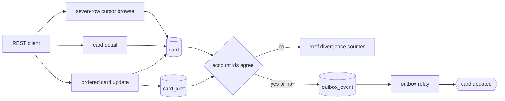

## Card Service

- [Purpose](#purpose)
- [Source provenance](#source-provenance)
- [Endpoints](#endpoints)
- [Events](#events)
- [Domain and data ownership](#domain-and-data-ownership)
- [Pitfalls](#pitfalls)
- [Architecture](#architecture)
- [How to extend](#how-to-extend)
- [Local run and tests](#local-run-and-tests)
- [Related documentation](#related-documentation)

<br/>

## Purpose

`card-service` lists, reads, and updates cards. It preserves the source browse order, validation order, and update outcomes. Only a committed update produces `CardUpdated`; list, detail, missing-row, validation, conflict, and no-change outcomes publish nothing.

<br/>

## Source provenance

| Contribution | Source |
| :--- | :--- |
| Seven-row forward and backward browse | `app/cbl/COCRDLIC.cbl` |
| Detail search and lookup | `app/cbl/COCRDSLC.cbl` |
| Ordered update edits and messages | `app/cbl/COCRDUPC.cbl` |
| Card record | `app/cpy/CVACT02Y.cpy:L4-L11` |
| Cross-reference replica | `app/cpy/CVACT03Y.cpy:L4-L8` |
| Card and alternate-index keys | `app/jcl/CARDFILE.jcl:L54-L85` |
| Cross-reference key and account index | `app/jcl/XREFFILE.jcl:L43-L76` |

The source update path does not read the cross-reference file. The target therefore reports divergence without changing the update outcome.

<br/>

## Endpoints

| Method and path | Access | Behavior |
| :--- | :--- | :--- |
| `GET /cards` | Account owner or `ADMIN` | Cursor-page cards for one account |
| `POST /cards/detail` | Card owner or `ADMIN` | Read one card by full number in the body |
| `PUT /cards` | `ADMIN` | Validate, lock, compare, and update one card |

The list defaults to seven rows and accepts sizes from 1 through 100. It reads one extra row to derive `nextPageExists`; it does not run a count query.

Visible card fields are masked. The list cursor is the irreversible 64-character card token and travels in the response body and `X-Card-Cursor` header, never exposing the full continuation key.

The full contract is [OpenAPI](src/main/resources/openapi.yaml). Business traffic uses port 8086 and management traffic uses 9086.

<br/>

## Events

| Producer path | Topic | Event | Condition |
| :--- | :--- | :--- | :--- |
| Card update | `card.updated` | `CardUpdated` | The locked card changed and committed |

`CardUpdated` version 2 carries the masked card number, account identifier, expiration date, and active status. Version 2 deliberately omits the embossed name. The account identifier is also the Kafka key.

The card row and outbox row commit together. `OutboxRelay` publishes later and marks the row. The card verification value never enters an event, response, or log.

<br/>

## Domain and data ownership

The private database is `carddemo_card`, with schema `card_service`.

| Table | Role |
| :--- | :--- |
| `card` | Card master, including the non-exported verification value |
| `card_xref` | Seeded card-to-customer-to-account replica |
| `outbox_event` | Durable `CardUpdated` publication |
| `processed_event` | Retention-compatible marker table; the module currently consumes no event |

`V2__seed.sql` loads 50 card rows and 50 cross-reference rows. The source text fixture carries only the 36 populated cross-reference bytes; its copybook and dataset declare 50 bytes.

Before a committed update, the service compares `card.account_id` with `card_xref.account_id`. Missing or different data increments `carddemo.card.xref.divergence` and writes a diagnostic. It does not block or repair the update.

<br/>

## Pitfalls

1. **The default page is seven rows plus one lookahead.** Returning eight rows or using a count query changes the source browse.
2. **The cross-reference text fixture is 36 bytes.** The copybook and VSAM definition remain 50 bytes because of 14 bytes of filler.
3. **Card and account expiry use different database types.** Card expiry is `DATE`; account expiry stays `VARCHAR(10)` for lexical authorization comparison.
4. **The card detail account identifier is edited but not used as the lookup key.** The source keys the read on the card number alone.
5. **A no-change update returns 200 and writes nothing.** Do not emit `CardUpdated` for it.
6. **Replica divergence is diagnostic only.** Blocking the write would add a source rule, while repairing it requires a customer identifier this record lacks.
7. **The cursor is a 64-character irreversible card token.** Never replace it with the full card key or the non-unique masked display value.
8. **No Luhn or authorization card-status check is present.** Adding either changes source-equivalent outcomes.
9. **Java 25 is explicit.** Class-file major version must be 69, not 61.

<br/>

## Architecture

Figure 1 shows the read paths, update transaction, divergence diagnostic, and asynchronous publish.

**Figure 1 — Card Read, Update, and CardUpdated Flow**



Legend for Figure 1:

- Plain arrows are request, read, write, or diagnostic work.
- The diamond compares the two local account identifiers.
- Cylinders are private card-service tables.
- The thick arrow is the Kafka publication.
- The comparison never changes the source-compatible update outcome.

The platform-wide consumer paths are in [Event Flow](../../docs/event-flow.md).

<br/>

## How to extend

- Add a card field through the copybook mapping, entity, migration, request, response, event schema, and direct tests.
- Add a state-changing operation through the outbox; reads must remain silent.
- Assign a cross-reference owner before adding repair logic. This service cannot synthesize a missing customer identifier.
- Preserve the ordered edit chain when adding validation, because the first source message controls the response.

<br/>

## Local run and tests

| Component | Exact value |
| :--- | :--- |
| Build runtime | Eclipse Temurin OpenJDK 25.0.4+7 |
| Build tool | Apache Maven 3.9.16 |
| Broker image | `apache/kafka:4.2.1` |
| Database image | `postgres:18.4` |
| Business port | 8086 |
| Management port | 9086 |
| Database and schema | `carddemo_card.card_service` |
| Published topic | `card.updated` |

From `card-platform/`:

```bash
mvn -B -pl services/card-service -am test
mvn -B -pl services/card-service -am package
docker compose up -d --build card-service
curl -fsS http://localhost:9086/actuator/health
```

The Dockerfile copies the packaged archive from `target/`, so build the module before its image.

Direct tests cover forward and backward paging, lookahead, detail ownership, all update outcomes, source-ordered validation, calendar-date validation, locking, divergence metering, outbox writes, OpenAPI, security wiring, and schema mappings.

<br/>

## Related documentation

- [Platform README](../../README.md)
- [Onboarding](../../docs/onboarding.md)
- [Decision Log](../../docs/decision-log.md)
- [Traceability Matrix](../../docs/traceability-matrix.md)
- [Data Model](../../docs/data-model.md)
- [Business Rule Flags](../../docs/business-rule-flags.md)
- [Equivalence Results](../../docs/equivalence-results.md)