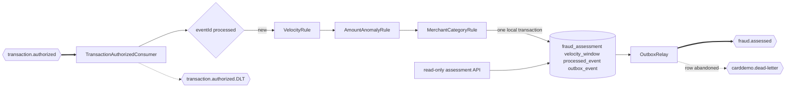

## Fraud Detection Service

- [Purpose](#purpose)
- [Source provenance](#source-provenance)
- [Endpoints](#endpoints)
- [Events](#events)
- [Domain and data ownership](#domain-and-data-ownership)
- [Pitfalls](#pitfalls)
- [Architecture](#architecture)
- [How to extend](#how-to-extend)
- [Local run and tests](#local-run-and-tests)
- [Related documentation](#related-documentation)

<br/>

## Purpose

`fraud-detection-service` consumes authorized transactions, scores risk, and publishes a flagged or cleared verdict. It never runs in the synchronous authorization response path. Its query endpoints are read-only and require `ADMIN`. The service calls no other service.

<br/>

## Source provenance

This service is net new and has no COBOL fraud ancestor. Searches across all 28 programs find no fraud scoring, velocity check, anomaly rule, or rules engine.

`app/cbl/CBTRN02C.cbl:L377` influences only the rule-object shape through its `ADD MORE VALIDATIONS HERE` seam. No source fraud logic, arithmetic, or message text is carried forward.

The [traceability matrix](../../docs/traceability-matrix.md) records the net-new classification without inventing lineage.

<br/>

## Endpoints

| Method and path | Access | Response |
| :--- | :--- | :--- |
| `GET /fraud-assessments?accountId=...` | `ADMIN` | Assessments for one account |
| `GET /fraud-assessments/{transactionId}` | `ADMIN` | One assessment or 404 |

The full contract is [OpenAPI](src/main/resources/openapi.yaml). Business traffic uses port 8083 and management traffic uses 9083.

<br/>

## Events

| Direction | Event | Topic | Group |
| :--- | :--- | :--- | :--- |
| Consumes | `TransactionAuthorized` | `transaction.authorized` | `fraud-detection` |
| Produces | `FraudFlagged` | `fraud.assessed` | — |
| Produces | `FraudCleared` | `fraud.assessed` | — |
| Listener failure route | 134-character fixed-width abend diagnostic | `transaction.authorized.DLT`, falling back to `carddemo.dead-letter` | — |
| Relay abandonment route | `DeadLetterEnvelope` | `carddemo.dead-letter` | — |

The two verdict events share one topic and are distinguished by `eventType`. The account identifier is the Kafka key, preserving per-account velocity order.

The assessment and outbox row commit together. Publication happens later through `OutboxRelay`.

This service is the clearest demonstration of the platform's extensibility claim: it has no COBOL ancestor, it consumes an event the authorization service already published, and adding it required no change to that service or to the other two consumers of the same event.

| Meter | Kind | What moves it |
| :--- | :--- | :--- |
| `carddemo.fraud.events.consumed` | Counter | One delivery accepted for processing |
| `carddemo.fraud.assessments.produced` | Counter | One verdict, tagged `outcome=flagged` or `outcome=cleared` |
| `carddemo.fraud.failures` | Counter | One failed attempt, tagged by stage |
| `carddemo.fraud.dead.letters` | Counter | One spent record, tagged `outcome=published` or `outcome=failed` |
| `carddemo.fraud.processing.latency` | Timer | Consumer duration to commit |

`failures` counts attempts and `dead.letters` counts records, so summing the two is never meaningful. A fourth `stage` value would have overlapped `deserialize`, because a record spent at deserialization is also a terminal record.

<br/>

## Domain and data ownership

Three independent rules contribute to the score:

| Rule | Signal |
| :--- | :--- |
| `VelocityRule` | Count and total amount inside the configured account window |
| `AmountAnomalyRule` | Transaction amount relative to the configured threshold |
| `MerchantCategoryRule` | Configured higher-risk merchant categories |

The service clamps the aggregate score to its contract range and records triggered rule identifiers in evaluation order.

The private database is `carddemo_fraud`, with schema `fraud_service`.

| Table | Role |
| :--- | :--- |
| `fraud_assessment` | One verdict per transaction |
| `velocity_window` | Per-account rolling counters in PostgreSQL |
| `outbox_event` | Flagged or cleared events awaiting publication |
| `processed_event` | Duplicate-delivery guard |

The velocity window is a relational table behind a repository boundary, not a cache. No other service reads it.

<br/>

## Pitfalls

1. **A duplicate must not increment velocity twice.** The marker and assessment changes commit in the same transaction.
2. **Both verdict types share `fraud.assessed`.** Consumers must inspect `eventType`.
3. **Money remains fixed point.** Amount comparisons use decimal values and the platform truncation rule.
4. **The full card number is unavailable.** Events carry only the masked form, and no rule may depend on hidden digits.
5. **`cobol-compat` is not a Spring module.** Construct its helpers or expose beans from this service’s `config` package.
6. **Java 25 is explicit.** Class-file major version must be 69, not 61.

<br/>

## Architecture

Figure 1 shows event intake, duplicate protection, rule evaluation, persistence, and publication.

**Figure 1 — Fraud Assessment Flow: One Authorized Event, Three Rules, and One Governed Verdict**



Legend for Figure 1:

- Thick arrows are Kafka consumption or publication.
- Plain arrows are in-process evaluation or reads.
- The diamond is the idempotency check.
- The cylinder contains private fraud tables.
- Dotted arrows are the two terminal routes: a spent consumed record to the source topic plus `.DLT`, and an abandoned outbox row to the shared topic.

The platform-wide paired views live in [Architecture, Before and After](../../docs/architecture-before-after.md).

<br/>

## How to extend

- Add a risk rule by implementing `RiskRule` and registering the class in the evaluation chain.
- Add a consumer of `fraud.assessed` under a new group; no fraud producer changes.
- Keep any replacement velocity store behind `VelocityWindowRepository`.

No risk rule may introduce a validation absent from authorization. [Suggested Next Tasks](../../docs/suggested-next-tasks.md) records owner decisions that would change outcomes.

<br/>

## Local run and tests

| Component | Exact value |
| :--- | :--- |
| Build runtime | Eclipse Temurin OpenJDK 25.0.4+7 |
| Build tool | Apache Maven 3.9.16 |
| Broker image | `apache/kafka:4.2.1` |
| Database image | `postgres:18.4` |
| Business port | 8083 |
| Management port | 9083 |
| Database and schema | `carddemo_fraud.fraud_service` |
| Consumer group | `fraud-detection` |

From `card-platform/`:

```bash
mvn -B -pl services/fraud-detection-service -am test
mvn -B -pl services/fraud-detection-service -am package
docker compose up -d --build fraud-detection-service
curl -fsS http://localhost:9083/actuator/health
```

The Dockerfile copies the module archive from `target/`, so Maven must run first.

Direct tests cover all-rule scoring, score clamping, velocity updates, flagged and cleared publication, duplicates, acknowledgement order, failures, and the OpenAPI contract.

<br/>

## Related documentation

- [Platform README](../../README.md)
- [Onboarding](../../docs/onboarding.md)
- [Decision Log](../../docs/decision-log.md)
- [Traceability Matrix](../../docs/traceability-matrix.md)
- [Event Flow](../../docs/event-flow.md)
- [Data Model](../../docs/data-model.md)
- [Equivalence Results](../../docs/equivalence-results.md)