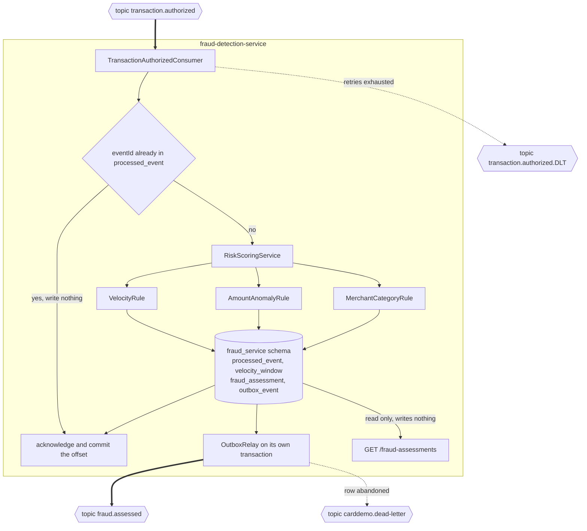
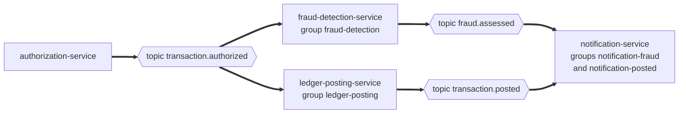

## Fraud Detection Service

`fraud-detection-service` reads one authorized transaction from Apache Kafka, scores it against every risk rule, and publishes one verdict: `FraudFlagged` or `FraudCleared`. It exposes two read-only query routes over the assessments it stored, and it calls no other service. It sits outside the synchronous authorization response path, so nothing it does can slow an authorization or fail one. It is also the only module on this platform with no COBOL ancestor.

- [Purpose](#purpose)
- [Source provenance](#source-provenance)
- [Architecture](#architecture)
- [Endpoints](#endpoints)
- [Events consumed and produced](#events-consumed-and-produced)
- [Observability](#observability)
- [Risk rules](#risk-rules)
- [Domain and data ownership](#domain-and-data-ownership)
- [Background](#background)
- [Pitfalls](#pitfalls)
- [How to extend](#how-to-extend)
- [Local run and tests](#local-run-and-tests)
- [Deliberate non-additions](#deliberate-non-additions)
- [Related documentation](#related-documentation)

<br/>

## Purpose

`fraud-detection-service` consumes authorized transactions, scores risk, and publishes a flagged or cleared verdict. It never runs in the synchronous authorization response path. Its query endpoints are read-only and require `ADMIN`. The service calls no other service.

<br/>

## Source provenance

This service has no COBOL (Common Business Oriented Language) ancestor. It is net new, and the evidence is a count rather than a claim. Searching all 28 programs under `app/cbl/` for fraud, velocity, risk, scoring, and Luhn returns zero files. No rules engine, no pattern analysis, and no velocity checking exists anywhere in the repository.

The original brief described this service as replacing "the optional fraud module". No such module exists, so there is no lineage to record, and none is invented here.

One source construct is borrowed, and only its shape. `app/cbl/CBTRN02C.cbl:L377` carries the comment `* ADD MORE VALIDATIONS HERE`, marking where the original author expected the validation chain to grow. The risk chain follows that shape so it reads like the authorization service's decline chain. No source logic, no arithmetic, and no message text crosses over.

Adding this service changed nothing in the authorization service, because it subscribes to an event authorization already published. The [Traceability Matrix](../../docs/traceability-matrix.md) records the net-new classification.

<br/>

## Architecture

Figure 1 traces one event from the topic to the published verdict. It shows the duplicate-delivery guard, the three rule classes, the single local transaction that stores the assessment and the outbox row together, and the relay that publishes afterwards.

**Figure 1 — Fraud Detection Service: Event Intake, Idempotency Guard, Risk Rule Chain, and Outbox Publication**



Legend for Figure 1:

- Thick arrow: an asynchronous Kafka consume or publish, and therefore a decoupling point.
- Plain arrow: in-process control flow, a database write, or a database read.
- Dotted arrow: dead-letter routing. There are two, and they are not the same route: a consumed record spent after its retries goes to the source topic's `.DLT`, and an outbox row the relay abandons goes to the shared `carddemo.dead-letter` topic.
- Hexagon: a Kafka topic, always outside the boundary. Cylinder: the private `fraud_service` schema, whose four tables commit inside one local transaction. Diamond: the duplicate-delivery check, where a repeat delivery leaves by the branch that writes nothing. Labelled box: the service boundary, inside which no other service's datastore appears.

Figure 2 shows what is absent. This service and the ledger service read `transaction.authorized` directly, each under a consumer group of its own, and the notification service reads the two topics they publish. No arrow joins any two of the three consumers, and none returns to the authorization service. That absence is the architectural claim, and nothing in this service may create such an arrow.

**Figure 2 — Consumer Independence: Three Consumers of One Authorization Event With No Edge Between Them**



Legend for Figure 2:

- Hexagon: a Kafka topic. Box: one service, labelled with the consumer group it reads under. Thick arrow: an asynchronous publish or consume, which every edge here is.
- No arrow between two service boxes, in either direction. Services meet at a topic and nowhere else.

For the platform before-and-after pair, read [Architecture, Before and After](../../docs/architecture-before-after.md). The two figures above cover one service and claim nothing about the platform as a whole.

<br/>

## Endpoints

Two routes answer. Both read, neither writes, and both require the `ADMIN` role over HTTP Basic authentication.

| Method and path | Returns |
| :--- | :--- |
| `GET /fraud-assessments/{transactionId}` | One stored assessment, or `404` when the table holds none |
| `GET /fraud-assessments?accountId=...` | That account's assessments, newest first, over bounded `page` and `size` parameters |

These routes serve a demonstration and support queries. Neither sits on any authorization path or any posting path. A caller that asks for an unsupported `sort` order receives `400` rather than a differently ordered page and no word about it.

The management port answers `/actuator` and exposes `health,metrics,prometheus`. Health is open so a container probe can read it, and the metrics and Prometheus routes require the `MONITORING` role. The full request and response contract is [openapi.yaml](src/main/resources/openapi.yaml), and that file is hand-written: the aggregator build bans every documentation-generation library, so no generated description can drift from the code.

<br/>

## Events consumed and produced

| Direction | Event | Topic | Consumer group |
| :--- | :--- | :--- | :--- |
| Consumes | `TransactionAuthorized` | `transaction.authorized` | `fraud-detection` |
| Publishes | `FraudFlagged` | `fraud.assessed` | not applicable |
| Publishes | `FraudCleared` | `fraud.assessed` | not applicable |
| Routes a spent record | 134-character fixed-width abend diagnostic | `transaction.authorized.DLT`, falling back to `carddemo.dead-letter` | not applicable |
| Routes an abandoned outbox row | `DeadLetterEnvelope` | `carddemo.dead-letter` | not applicable |

A consumer group of its own is what makes this reader independent of the ledger service, which reads the same topic under `ledger-posting`. Both see every event, and neither blocks the other.

Two event types share one topic, and a reader routes on the envelope's `eventType` field without parsing the payload. Exactly one verdict leaves per event read. A score that reaches the configured flag threshold publishes as `FraudFlagged`. Any score below it publishes as `FraudCleared`, with every rule that objected still recorded on the assessment row.

The account identifier is always the envelope's `aggregateId` and always the Kafka message key. Every event for one account therefore lands on one partition and stays in order, which is what velocity counting depends on. Money travels as a decimal string in every payload, never as a JSON (JavaScript Object Notation) number, and every amount this service compares runs through `CobolDecimal`, which truncates toward zero.

A failure is retried three times, one second apart. A message that still fails routes to its source topic's dead-letter topic, and `carddemo.dead-letter` catches a failure carrying no source topic. A payload that fails schema validation never reaches the listener and takes that route with no retry at all.

<br/>

## Observability

Five meters carry this service, and their names come from what the source counted rather than from invention.

| Meter | Kind | What moves it |
| :--- | :--- | :--- |
| `carddemo.fraud.events.consumed` | Counter | One delivery accepted for processing |
| `carddemo.fraud.assessments.produced` | Counter | One verdict, tagged `outcome=flagged` or `outcome=cleared` |
| `carddemo.fraud.failures` | Counter | One failed attempt, tagged by stage |
| `carddemo.fraud.dead.letters` | Counter | One spent record, tagged `outcome=published` or `outcome=failed` |
| `carddemo.fraud.processing.latency` | Timer | Consumer duration to commit |

`failures` counts attempts and `dead.letters` counts records, so summing the two is never meaningful. A fourth `stage` value would have overlapped `deserialize`, because a record spent at deserialization is also a terminal record.

<br/>

## Risk rules

Three independent rules contribute to one score.

| Rule | Signal |
| :--- | :--- |
| `VelocityRule` | Count and total amount magnitude in the account's recent history. A stored window row spans one hour, and the rule reads from the bucket the configured width reaches back into, so the span it evaluates covers that width and at most one hour more |
| `AmountAnomalyRule` | Transaction amount relative to the configured threshold |
| `MerchantCategoryRule` | Configured higher-risk merchant categories |

The service clamps the aggregate score to its contract range and records triggered rule identifiers in evaluation order.

<br/>

## Domain and data ownership

The private database is `carddemo_fraud`, and the schema inside it is `fraud_service`.

| Table | Contents |
| :--- | :--- |
| `fraud_assessment` | One verdict per transaction: transaction and account identifiers, risk score, triggered rule identifiers, assessment time |
| `velocity_window` | The per-account, per-hour counters `VelocityRule` reads: an authorization count and an accumulated amount magnitude. A PostgreSQL table, not a cache, reached through `VelocityWindowRepository` |
| `processed_event` | Event identifier as primary key, with the time the marker was written |
| `outbox_event` | The verdict event, stored in the same local transaction as the assessment and published later |

No other service reads this schema, and this service reads no other schema. The login it connects with owns `carddemo_fraud` and can reach none of the other five databases.

Flyway owns schema creation. The entity model is validated against the migrated schema and never generates it, so the column types derived from the source copybooks survive. Why the velocity window is a relational table rather than a cache sits in the [Decision Log](../../docs/decision-log.md). That log carries the reasoning behind every choice this document merely states.

<br/>

## Background

A card authorization asks whether one transaction may proceed. A card number first resolves to an account through a cross-reference record. The account is then checked against four rules taken from the source batch program, and the transaction is approved or declined with a reason code. On the mainframe that work ran as CICS (Customer Information Control System) online transactions and scheduled Job Control Language jobs over shared VSAM (Virtual Storage Access Method) datasets.

This service sits after the decision, never inside it. The authorization service applies its rules, commits, and answers its caller over REST (Representational State Transfer). Only then does the published event reach this service, which scores it and records a verdict. The event carries the card number already masked, so no PAN (Primary Account Number) reaches this service at all. The broker is Apache Kafka in KRaft (Kafka Raft) mode, which runs without ZooKeeper.

For the fuller domain background, including the four decline codes and their source locators, read [Onboarding](../../docs/onboarding.md).

<br/>

## Pitfalls

**The silent Java 17 default.** This module declares `<java.version>25</java.version>` and `<maven.compiler.release>25</maven.compiler.release>`. The Spring Boot parent defaults both to 17, so a module that drops the override compiles at release 17 with no warning and no failure. The check that proves the level is the class-file major version, which must read 69 and not 61. This pitfall comes first because its failure mode is silence.

**Truncate, never round half-up.** Every amount comparison here runs through `CobolDecimal`, which pins `RoundingMode.DOWN`. The `ROUNDED` phrase appears zero times across all 28 programs under `app/cbl/`, so truncation toward zero is the platform rule. That rule holds here too, even though no COBOL program is this module's ancestor, so no later reader finds two rounding conventions in one codebase.

**A duplicate delivery must not count a velocity entry twice.** Kafka delivers at least once, and a redelivery follows a consumer group rebalance, a restart mid-batch, or a crash after the side effects and before the offset commit. The listener claims a `processed_event` marker before it scores anything, and that claim commits in the same transaction as the assessment and the velocity update. Guard and effect therefore stand or fall together.

**Never publish from the listener.** The assessment row and the outbox row commit in one local transaction, and `OutboxRelay` publishes afterwards on a transaction of its own. A send from inside the listener could leave a published event with no committed assessment behind it. What drives that relay is `@EnableScheduling` on `FraudApplication`: without the annotation the service starts, reports healthy, stores assessments, and publishes nothing at all.

**The card number and the card verification value never reach a log or a payload here.** The consumed event carries the masked form only. No rule may depend on a digit the mask hides, because this service never sees one.

**`cobol-compat` is not a Spring module.** Its classes carry no framework annotation and no Spring or Jakarta dependency, so the container supplies no bean from it. Call its helpers directly, or expose one from this module's own `config` package.

<br/>

## How to extend

Adding a risk rule means adding a class. `RiskRule` declares two methods: `evaluate`, which returns a `Contribution` carrying whether the rule triggered and how many points it contributed, and `ruleId`, which names it. `RiskScoringService` receives every rule the container supplies and refuses two rules that report one identifier, so nothing existing is edited. The shape matches the authorization service's decline chain, so a reader who has seen one recognises the other.

Adding a consumer of `fraud.assessed` needs no change to this service. Subscribe under a new consumer group and read. The platform is built for that extension.

Follow-up work found while building this service, including the owner decisions that would change outcomes, is recorded in [Suggested Next Tasks](../../docs/suggested-next-tasks.md).

<br/>

## Local run and tests

| Component | Pinned value |
| :--- | :--- |
| Build runtime | OpenJDK 25, Eclipse Temurin 25.0.4+7 |
| Build tool | Apache Maven 3.9.16 |
| Container runtime | `bellsoft/liberica-openjre-debian:25.0.4-9` |
| Infrastructure images | `apache/kafka:4.2.1` in KRaft mode, and `postgres:18.4` |
| Host ports | 8083 onto container port 8080, and 9083 onto container port 9080 |
| Database and schema | `carddemo_fraud`, schema `fraud_service`, login `carddemo_fraud_svc` |
| Broker address | `kafka:29092` inside the compose network, `localhost:9092` from the host |
| Consumer group | `fraud-detection` |

Copy `.env.example` to `.env` first, then replace every value it marks `REPLACE` with a generated one. This service reads `FRAUD_DB_PASSWORD` and `FRAUD_KAFKA_PASSWORD`, and neither carries a default. The stack refuses to start on a placeholder or on an unset value, so a published password never reaches a running service.

Build this module alone, then start it. The `-am` flag builds the two libraries it depends on first. The image build has a prerequisite: the archive under `target/` arrives from `mvn -f card-platform/pom.xml package`, which runs ahead of this image build. Starting the container without packaging first leaves the `COPY target/*.jar` step nothing to copy.

```bash
cd card-platform
mvn -B -pl services/fraud-detection-service -am test
mvn -B -pl services/fraud-detection-service -am package
docker compose up -d --build fraud-detection-service
curl -fsS http://localhost:9083/actuator/health
```

Watch the fan-out. One authorization call produces one event, and the verdict appears on `fraud.assessed` a moment later without the caller having waited for it:

```bash
docker compose exec kafka /opt/kafka/bin/kafka-console-consumer.sh \
  --bootstrap-server kafka:29092 \
  --command-config /tmp/kafka-admin.properties \
  --topic fraud.assessed
```

The platform-wide setup path, from a clean machine to a running stack, lives in [Onboarding](../../docs/onboarding.md) and the [Platform README](../../README.md). Neither is repeated here.

<br/>

## Deliberate non-additions

Each item below is something a reader of a fraud service reasonably expects to find, and each is absent on purpose. The source has no equivalent, and adding one would change outcomes this platform is required to reproduce.

**No Luhn or checksum validation.** The source validates a card number as sixteen numeric digits and nothing more, at `app/cbl/COCRDUPC.cbl:L194`. A risk rule here may score a pattern; it may not introduce a validation the platform does not have.

**No card-status check and no account-status check.** The source posting path never opens the card file: `app/jcl/POSTTRAN.jcl` STEP15 allocates TRANFILE, DALYTRAN, XREFFILE, DALYREJS, ACCTFILE, and TCATBALF, and no CARDFILE.

**No cache and no key-value store.** The velocity window is a PostgreSQL table reached through `VelocityWindowRepository`, and this service runs no cache of any kind.

**No dependency on another service module, and no HTTP client pointing at one.** The aggregator's `maven-enforcer-plugin` carries a `bannedDependencies` rule naming all six service artifacts, so a forbidden import fails the build with a message that names the rule rather than an unresolved symbol.

Two structures here have no source equivalent either, and both close a measured gap. All eight `DEFINE FILE` blocks in `app/csd/CARDDEMO.CSD` carry both `RECOVERY(NONE)` and `JOURNAL(NO)`, eight occurrences of each, so there is no transactional recovery to inherit. `outbox_event` and `processed_event` supply it. Their one ancestor construct is the transient data queue write at `app/cbl/CORPT00C.cbl:L517-L518`, the single asynchronous handoff in the whole repository. Every finding behind these entries is catalogued in [Business Rule Flags](../../docs/business-rule-flags.md).

<br/>

## Related documentation

- [Event Flow](../../docs/event-flow.md) — the publish and consume path of every event on the platform
- [Data Model](../../docs/data-model.md) — copybook field to database column, per service
- [Platform README](../../README.md) — the mono-repo map, the module graph, and the quickstart
