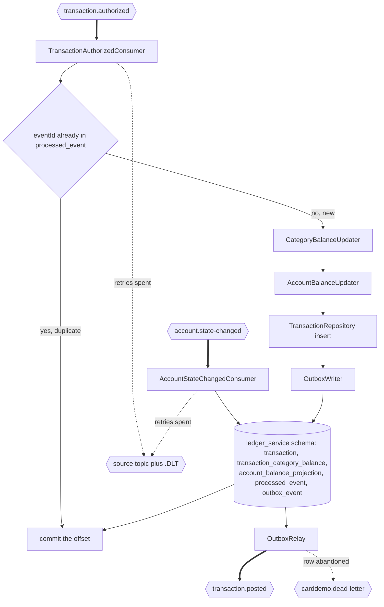

## Ledger Posting Service

- [Purpose](#purpose)
- [Source provenance](#source-provenance)
- [Endpoints](#endpoints)
- [Events](#events)
- [Domain context](#domain-context)
  - [What posting means](#what-posting-means)
  - [What the original job did](#what-the-original-job-did)
  - [The four reject reasons](#the-four-reject-reasons)
  - [Reason 109 behaves differently here](#reason-109-behaves-differently-here)
  - [The refund sign convention is reproduced](#the-refund-sign-convention-is-reproduced)
- [Domain and data ownership](#domain-and-data-ownership)
- [Pitfalls](#pitfalls)
- [Architecture](#architecture)
- [How to extend](#how-to-extend)
- [Local run and tests](#local-run-and-tests)
- [Deliberate non-additions](#deliberate-non-additions)
- [Related documentation](#related-documentation)

<br/>

## Purpose

`ledger-posting-service` consumes the `TransactionAuthorized` event and applies the posting arithmetic of `app/cbl/CBTRN02C.cbl` once per event instead of once per nightly file. It upserts the category balance, moves the account balance and one billing-cycle accumulator, stores the transaction, and publishes `TransactionPosted`. It serves one read-only balance query, calls no other service, and owns a private PostgreSQL schema no other service reads.

The service reimplements documented COBOL behaviour and never calls the mainframe. `app/cbl/CBTRN02C.cbl` is the only program in this repository where validation, authorization and balance mutation sit together, which makes this module the one most directly comparable to the original batch job.

<br/>

## Source provenance

| Target | Source | Lines |
| :--- | :--- | :--- |
| `messaging/TransactionAuthorizedConsumer.java` | `app/jcl/POSTTRAN.jcl` | `L23` `//STEP15 EXEC PGM=CBTRN02C`. The job step becomes a listener method and the sequential file read becomes a topic subscription |
| `domain/PostingService.java` | `app/cbl/CBTRN02C.cbl` | `L424`–`L444` paragraph `2000-POST-TRANSACTION`. `L425`–`L436` copy twelve feed fields, `L437` performs `Z-GET-DB2-FORMAT-TIMESTAMP`, `L438` stores it in `TRAN-PROC-TS`, and `L440`–`L442` run three updates in a fixed order |
| `domain/CategoryBalanceUpdater.java` | `app/cbl/CBTRN02C.cbl` | `L467`–`L542`. `2700-UPDATE-TCATBAL` at `L467`, `2700-A-CREATE-TCATBAL-REC` at `L503` adding at `L508`, `2700-B-UPDATE-TCATBAL-REC` at `L526` adding at `L527` |
| `domain/AccountBalanceUpdater.java` | `app/cbl/CBTRN02C.cbl` | `L545`–`L560` paragraph `2800-UPDATE-ACCOUNT-REC`. `L547` adds to the balance and `L548`–`L552` pick one accumulator on the sign of the amount |
| `domain/RejectRecorder.java` | `app/cbl/CBTRN02C.cbl` | `L446`–`L465` paragraph `2500-WRITE-REJECT-REC` |
| Transaction insert in `repository/TransactionRepository.java` | `app/cbl/CBTRN02C.cbl` | `L562`–`L579` paragraph `2900-WRITE-TRANSACTION-FILE` |
| `entity/TransactionEntity.java` | `app/cpy/CVTRA05Y.cpy` | `L5`–`L17`, thirteen fields |
| `entity/TransactionCategoryBalanceEntity.java` | `app/cpy/CVTRA01Y.cpy` | `L5`–`L9`, the three-part key plus the balance |
| `entity/AccountBalanceProjectionEntity.java` | `app/cpy/CVACT01Y.cpy` | `L7` `ACCT-CURR-BAL`, `L13` `ACCT-CURR-CYC-CREDIT`, `L14` `ACCT-CURR-CYC-DEBIT` |
| `entity/RejectedTransactionEntity.java` | `app/cbl/CBTRN02C.cbl` | `L177`–`L182`. `REJECT-TRAN-DATA PIC X(350)` and `VALIDATION-TRAILER PIC X(80)`, whose trailer carries `WS-VALIDATION-FAIL-REASON PIC 9(04)` at `L181` and `WS-VALIDATION-FAIL-REASON-DESC PIC X(76)` at `L182` |
| `api/BalanceQueryController.java` | `app/cbl/COACTVWC.cbl` | `L468`–`L490`, the account-view field selection. Shape reference only |
| `repository/` interfaces | `app/cbl/CBSTM03B.CBL` | `L100`–`L112`, the operation-code parameter area |
| `outbox/OutboxWriter.java`, `outbox/OutboxRelay.java` | `app/cbl/CORPT00C.cbl` | `L517`–`L518` `EXEC CICS WRITEQ TD QUEUE('JOBS')`, the one asynchronous handoff in the source |
| `entity/OutboxEventEntity.java`, `entity/ProcessedEventEntity.java` | none | New abstractions with no COBOL ancestor |

Two trailing `FILLER` fields are dropped rather than modelled: 20 bytes at `app/cpy/CVTRA05Y.cpy:L18` and 22 bytes at `app/cpy/CVTRA01Y.cpy:L10`. Both are deliberate omissions recorded in the [traceability matrix](../../docs/traceability-matrix.md).

The 430-byte reject width is corroborated outside the program: `app/jcl/POSTTRAN.jcl:L36` allocates `DALYREJS` with `DCB=(RECFM=F,LRECL=430,BLKSIZE=0)`, which is the 350-byte record plus the 80-byte trailer.

<br/>

## Endpoints

| Method and path | Authorization | Response |
| :--- | :--- | :--- |
| `GET /balances/{accountId}` | Basic authentication carrying `SCOPE_ACCOUNT_<accountId>`, which `ROLE_ADMIN` also satisfies | `200` with four values, or `404` when the table holds no such account |

The response carries the account identifier, the current balance, the cycle credit accumulator and the cycle debit accumulator. `app/cbl/COACTVWC.cbl:L468`–`L490` fills ten account fields on the view screen, but this service owns only the balance and the two accumulators, so the answer exposes that subset and nothing else. Each amount is a decimal string with two places.

Every other answer is a problem document, the same four members `config/SecurityConfig` writes for a security refusal, under `application/problem+json`. `api/LedgerApiExceptionHandler` shapes three of them and the security configuration the other two.

| Status | When | Detail |
| :--- | :--- | :--- |
| `400` | The path value missed the eleven-digit shape `ACCT-ID PIC 9(11)` declares | `Account identifier must be eleven digits.` |
| `401` | The request carried no usable credential. The response also carries `WWW-Authenticate` | `This request carried no usable credential.` |
| `403` | The caller authenticated but does not hold this account | `This identity may not use this operation.` |
| `503` | The projection table could not be reached, so the read was never attempted | `The balance store is unavailable. Retry shortly.` |
| `500` | A fault inside this service | `The balance could not be read.` |

No member of that document echoes anything the caller sent — no rejected value, no resolved path, no query string and no header. The framework default body this replaced carried the resolved path, so a caller naming an account identifier read that identifier back and copied it into its own log. That body also answered `500` for a datastore that was merely away, which invites no retry and names no dependency; the `503` arm above names a connection that cannot be opened, a transaction that cannot be begun and a statement that ran out of time, and nothing wider. A broken query is a fault of this service and answers `500`, where a retry would only repeat it.

```bash
curl -fsS -u user0001:"$USER_PASSWORD" http://localhost:8082/balances/00000000001
```

The interface description of record is the hand-written [openapi.yaml](src/main/resources/openapi.yaml). No documentation generator produces it.

This service calls no other service. It holds no web client, and every route the security configuration does not name is refused.

<br/>

## Events

| Direction | Event | Topic | Consumer group |
| :--- | :--- | :--- | :--- |
| Consumes | `TransactionAuthorized` | `transaction.authorized` | `ledger-posting` |
| Consumes | `AccountStateChanged` | `account.state-changed` | `ledger-account-state` |
| Produces | `TransactionPosted` | `transaction.posted` | — |
| Produces | `TransactionDeclined` | `transaction.declined` | — |
| Listener failure route | the record as bytes | the source topic plus `.DLT` | — |
| Relay failure route | `DeadLetterEnvelope` | `carddemo.dead-letter` | — |

Four facts govern every payload this service reads or writes.

**The consumer group is its own.** `ledger-posting` is what makes this listener independent of the fraud listener reading the same topic. Each group receives its own copy of every event, so neither service waits for the other and neither can starve it.

**The account identifier is always `aggregateId` and always the Kafka message key.** Kafka orders records within a partition and not across partitions, and the balance updates for one account must not be reordered. The identifier is `XREF-ACCT-ID PIC 9(11)` at `app/cpy/CVACT03Y.cpy:L7`, the same value `2700-UPDATE-TCATBAL` moves into the category key at `app/cbl/CBTRN02C.cbl:L469`. `domain/PostingService` refuses a record whose key does not equal the payload identifier.

**Money travels as a decimal string, never as a JSON number.** Most parsers turn a JSON number into a double, which puts binary floating point back into a system whose correctness rests on fixed-point arithmetic.

**`TransactionPosted` leaves through the outbox, never from inside the listener.** The three posting rows, the duplicate-delivery marker and the outbox row commit in one local transaction. `outbox/OutboxRelay` publishes afterwards on its own schedule, claiming up to 100 rows every 500 ms.

`AccountStateChanged` is consumed for a different reason. `account_balance_projection` holds a copy of three fields of the account record the account service owns, so the second listener keeps that copy current when the owner changes it. The consumer applies each snapshot against `source_occurred_at`, so a redelivery arriving behind a newer change discards itself. A posting is a delta this service owns and advances neither provenance column.

The two failure routes carry two different forms on purpose. A spent consumer record goes to its own source topic plus `.DLT` as raw bytes, because a value that failed may never have parsed. An abandoned outbox row goes to `carddemo.dead-letter` as a governed envelope, because its event type is known.

| Meter | Kind | What moves it |
| :--- | :--- | :--- |
| `carddemo.ledger.events.consumed` | Counter | One delivery accepted for processing |
| `carddemo.ledger.transactions.processed` | Counter | One posting or one reject, tagged by outcome |
| `carddemo.ledger.failures` | Counter | One failed attempt, tagged by stage |
| `carddemo.ledger.dead.letters` | Counter | One spent record, tagged `outcome=published` or `outcome=failed` |
| `carddemo.ledger.processing.latency` | Timer | Listener duration to commit |

`failures` counts attempts and `dead.letters` counts records, so summing the two double-counts.

<br/>

## Domain context

### What posting means

A card transaction that has been authorized still has to be recorded. Posting is that recording. The transaction becomes a stored row, the account balance moves by the amount, and the running total for that account's type and category moves with it. Nothing here decides whether the transaction was allowed. The authorization service already made that decision.

### What the original job did

`app/cbl/CBTRN02C.cbl` ran as a scheduled batch job over a sequential daily file, submitted by the Job Control Language (JCL) member `app/jcl/POSTTRAN.jcl`. It read the feed record by record under Virtual Storage Access Method (VSAM) keyed access, while the screens that captured transactions ran as Customer Information Control System (CICS) online programs.

This service replaces the job, not the screens. Its surface is Representational State Transfer (REST) over JSON, its runtime is the Java Development Kit (JDK), and persistence goes through the Jakarta Persistence API (JPA).

Rejections were ordinary traffic in that job, not errors. `L229` reads `IF WS-REJECT-COUNT > 0` and `L230` reads `MOVE 4 TO RETURN-CODE`, so a run with rejects ended at 4 and never abended. The declined-transaction counter takes its name from `WS-REJECT-COUNT`, which lets a live demonstration show the same number the batch job would have reported.

### The four reject reasons

The codes and their text come from `app/cbl/CBTRN02C.cbl` lines 385 to 420. The authorization service applies them; this service records a reject it is handed and stores the reason on the row.

| Code | Text, verbatim from the source | Condition | Lines |
| :--- | :--- | :--- | :--- |
| 100 | `INVALID CARD NUMBER FOUND` | The cross-reference read on the card number returns an invalid key | `L385`–`L387` |
| 101 | `ACCOUNT RECORD NOT FOUND` | The account read on the identifier from the cross-reference returns an invalid key | `L397`–`L399` |
| 102 | `OVERLIMIT TRANSACTION` | The credit limit is below cycle credit minus cycle debit plus the amount | `L403`–`L413` |
| 103 | `TRANSACTION RECEIVED AFTER ACCT EXPIRATION` | The account expiry field sorts below the first ten characters of the origin timestamp | `L414`–`L420` |

### Reason 109 behaves differently here

`app/cbl/CBTRN02C.cbl:L556`–`L558` moves 109 with the text `ACCOUNT RECORD NOT FOUND` when the account rewrite hits an invalid key, and nothing in the source ever inspects it. The value is set and dropped.

Here the same condition is a real failure. The listener does not acknowledge, the offset stays uncommitted, Kafka redelivers up to three times with a 1000 ms backoff, and a record that still fails reaches the dead-letter topic. It never becomes a reject. The change is deliberate and the [decision log](../../docs/decision-log.md) records it.

### The refund sign convention is reproduced

`app/cbl/CBTRN02C.cbl:L551` adds a negative amount to the cycle debit accumulator, which makes that accumulator more negative. The credit-limit formula at `L403`–`L405` subtracts the same accumulator, so a refund raises the tested balance and tightens the next authorization rather than loosening it.

This service reproduces that arithmetic exactly. The finding is catalogued in [business rule flags](../../docs/business-rule-flags.md).

<br/>

## Domain and data ownership

The three updates run in the order `L440`–`L442` fixes, and the order is part of the behaviour:

1. Upsert the category balance.
2. Add to the account balance, then to one cycle accumulator on the sign of the amount.
3. Insert the transaction.

All three writes, the outbox row and the duplicate-delivery marker commit in one local transaction. A second delivery of the same `eventId` performs no second posting.

The private database is `carddemo_ledger` and the schema is `ledger_service`. The service logs in as `carddemo_ledger_svc`, which can connect to no other database.

| Table | Derivation |
| :--- | :--- |
| `transaction` | `app/cpy/CVTRA05Y.cpy` `L5`–`L17`. Primary key from `app/jcl/TRANFILE.jcl:L53` `KEYS(16 0)` and record size from `:L54` `RECORDSIZE(350 350)`. A non-unique index on the processed timestamp comes from the alternate index at `:L82`–`:L87`, `KEYS(26 304)`, restated standalone at `app/jcl/TRANIDX.jcl:L25`–`L30` |
| `transaction_category_balance` | `app/cpy/CVTRA01Y.cpy` `L5`–`L9`. `app/jcl/TCATBALF.jcl:L40` `KEYS(17 0)` confirms the 11 + 2 + 4 composite and `:L41` gives `RECORDSIZE(50 50)` |
| `account_balance_projection` | `app/cpy/CVACT01Y.cpy` `L7`, `L13`, `L14`, plus the provenance of the account change it last replicated |
| `rejected_transaction` | The validation trailer at `app/cbl/CBTRN02C.cbl:L446`–`L465`, with the card number masked |
| `transaction_type` | Seven rows seeded from `app/data/ASCII/trantype.txt` |
| `transaction_category` | Eighteen rows seeded from `app/data/ASCII/trancatg.txt` |
| `outbox_event` | New abstraction. Posted and declined events awaiting publication |
| `processed_event` | New abstraction. The duplicate-delivery guard |

Flyway seeds fifty category balances from `app/data/ASCII/tcatbal.txt` and fifty projection rows alongside the two lookups. Both lookups live inside this schema. Neither is exposed as a shared table, and neither becomes a seventh service.

<br/>

## Pitfalls

Each pitfall below was measured in the source or the fixtures, and each one costs a debugging session if it is met by surprise.

**1. Two 26-character timestamp formats coexist, and they are not interchangeable.** `Z-GET-DB2-FORMAT-TIMESTAMP` at `app/cbl/CBTRN02C.cbl:L692` fills the redefinition declared at `L160`–`L174`. Line `L701` moves `'0000'` into the trailing remainder, `L702` moves `'-'` into three separator fields, and `L703` moves `'.'` into three more.

`TRAN-PROC-TS` therefore reads `YYYY-MM-DD-HH.MM.SS.ff0000`: a hyphen between the day and the hour, dots inside the time, two significant fractional digits, then four hard-coded zeros. The inbound `DALYTRAN-ORIG-TS` uses a different text form. Record 1 of `app/data/ASCII/dailytran.txt` carries `2022-06-10 19:27:53.000000` at one-based offsets 279 to 304, with a space separator and colons. Both fields are `PIC X(26)`.

`CobolDecimal.formatProcessingTimestamp` writes the hyphen-and-dot form. No test may compare a processing timestamp byte for byte without truncating to hundredths first, or it fails on every record for a reason unrelated to the logic under test. One incidental detail helps when reading the source: the separator fields are named `DB2-STREEP-1`, `-2` and `-3` in Dutch while every neighbouring field is English.

**2. Fixture money is zoned decimal with the sign overpunched into the last byte.** `app/data/ASCII/acctdata.txt` carries `ACCT-CURR-BAL` as `00000001940{`, where `{` means the final digit is 0 and the value is positive, giving 0000000194.00. `app/data/ASCII/dailytran.txt` carries the amount as `0000005047G`, where `G` means the final digit is 7 and the value is positive, giving 000000504.77.

| Trailing byte | Meaning |
| :--- | :--- |
| `{` | final digit 0, positive |
| `A` through `I` | final digit 1 through 9, positive |
| `}` | final digit 0, negative |
| `J` through `R` | final digit 1 through 9, negative |

Passing such a field straight to `new BigDecimal(String)` throws on every monetary value. A `PIC S9(10)V99` field occupies 12 bytes in the fixture and a `PIC S9(09)V99` field occupies 11. `app/data/ASCII/dailytran.txt` holds 300 records of 350 bytes at these one-based offsets:

| Field | Offsets | Field | Offsets |
| :--- | :--- | :--- | :--- |
| identifier | 1–16 | merchant identifier | 144–152 |
| type code | 17–18 | merchant name | 153–202 |
| category code | 19–22 | merchant city | 203–252 |
| source | 23–32 | merchant postal code | 253–262 |
| description | 33–132 | card number | 263–278 |
| amount | 133–143 | origin timestamp | 279–304 |
| | | processing timestamp | 305–330, blank in the feed |
| | | trailing filler | 331–350 |

**3. A missing language-level override compiles at the wrong level in silence.** `pom.xml` declares `<java.version>25</java.version>`. The Spring Boot parent defaults both the language level and the compiler release to 17. A module that omits the override compiles to release 17 with no warning and no failure. Confirm the class-file major version is 69 rather than 61:

```bash
javap -verbose -cp target/classes com.carddemo.ledger.domain.PostingService | grep major
```

`javap` ships with the same JDK that built the module, so the check needs nothing extra installed. Read the class from `target/classes` and not from the packaged archive, because `spring-boot-maven-plugin` moves application classes under `BOOT-INF/classes/` inside the jar.

**4. Money truncates toward zero and never rounds.** The `ROUNDED` phrase appears zero times across all 28 programs in `app/cbl`, so every arithmetic store in the source truncates. Every `BigDecimal` operation here goes through `CobolDecimal` in `libs/cobol-compat`, which pins `RoundingMode.DOWN`. `HALF_UP` is the reflexive Java choice and it breaks equivalence without failing anything visibly.

The money-moving sites are few enough to list: `app/cbl/CBTRN02C.cbl:L403`–`L405`, `:L508`, `:L527` and `:L547`–`L551`, plus `app/cbl/COBIL00C.cbl:L234` in the online payment path.

**5. Nothing here resets the cycle accumulators, and a demonstration will look broken if nobody does.** This service adds to `cycle_credit` or `cycle_debit` on every posting. The only source code that zeroes them is `app/cbl/CBACT04C.cbl:L353`–`L354`, inside the interest program, which is not migrated.

The account service carries the replacement: `POST /accounts/{id}/cycle-close`. Skip it and the accumulators grow, the credit-limit rule sees an ever-larger tested balance, and available credit shrinks until every transaction declines. [Onboarding](../../docs/onboarding.md) gives the command.

**6. A first category balance is not an error.** `app/cbl/CBTRN02C.cbl:L481` reads `IF TCATBALF-STATUS = '00' OR '23'`, accepting both the normal status and the record-not-found status, because a missing category balance means create it. `domain/CategoryBalanceUpdater` keeps that branch. Treating a missing row as a failure turns every first posting for an account, type and category into a dead-letter record.

<br/>

## Architecture

Figure 1 traces one authorized event through the listener transaction and out again through the relay. The paired before-and-after views for the whole migration are in [Architecture, Before and After](../../docs/architecture-before-after.md) and are not repeated here.

**Figure 1 — Ledger Posting Data Flow: One Authorized Event, Three Ordered Writes, One Posted Event Published From the Outbox**



Legend for Figure 1:

- Hexagons are Kafka topics. Thick arrows are a Kafka consume or publish, which is where at-least-once delivery makes duplication possible.
- Rectangles are components in this service. Plain arrows are in-process control flow.
- The diamond is the duplicate-delivery guard. A duplicate skips every write and commits the offset, which is what makes redelivery harmless.
- The cylinder is the private schema. Every row it names commits in a single local transaction, and no other service reads it.
- Dotted arrows are the two terminal routes, taken only after retries are spent or a row is abandoned.
- No arrow leaves this service toward another service, because none exists.

<br/>

## How to extend

- **Adding a consumer of `TransactionPosted` changes nothing here.** A new service subscribes to `transaction.posted` under its own group and starts receiving events. The notification service already does exactly that.
- **Adding a posting step means adding a component**, then placing it explicitly in the ordered chain in `domain/PostingService`. The source marks the seam itself with `* ADD MORE VALIDATIONS HERE` at `app/cbl/CBTRN02C.cbl:L377`, which is why the updaters stay separate classes instead of one method.
- **Repository methods follow the source operation-code contract** at `app/cbl/CBSTM03B.CBL:L100`–`L112`: `K` becomes find by identifier, `R` becomes stream all, `W` becomes insert and `Z` becomes update. `O` and `C` are dropped, because the framework owns the connection lifecycle.
- **Swapping the event bus touches one interface.** The event publisher port is the only abstracted seam in the service.

[Suggested next tasks](../../docs/suggested-next-tasks.md) lists work found during this build and deliberately left out of scope.

<br/>

## Local run and tests

Use these versions. They are the tested set, not a floor.

| Component | Exact value |
| :--- | :--- |
| Build runtime | Eclipse Temurin OpenJDK 25.0.4+7 |
| Build tool | Apache Maven 3.9.16 |
| Broker image | `apache/kafka:4.2.1` |
| Database image | `postgres:18.4` |
| Runtime image | `bellsoft/liberica-openjre-debian:25.0.4-9` |
| Business port | host 8082, container 8080 |
| Management port | host 9082, container 9080 |
| Database and schema | `carddemo_ledger`, schema `ledger_service` |
| Database login | `carddemo_ledger_svc` |
| Broker identity | `carddemo-ledger` over `SASL_PLAINTEXT` with `PLAIN` |
| Consumer groups | `ledger-posting`, `ledger-account-state` |
| Listener retries | 3 attempts, 1000 ms backoff |
| Outbox relay | every 500 ms, up to 100 rows, claim timeout `PT2M` |
| Migrations | `V1__schema.sql`, `V2__seed.sql`, `V3__account_state_replica.sql` |

Run the four steps in this order. The Dockerfile copies the packaged archive out of `target/`, and the compose build context is this module directory alone. It reaches neither the parent POM nor the two shared libraries, so Maven has to finish first.

1. Prepare configuration from `card-platform/`:

   ```bash
   cp .env.example .env
   ```

   The copy contains 17 `REPLACE` markers: fourteen passwords and three `{bcrypt}` identity hashes. Compose reads them with `${VAR:?}` and refuses to start while any is unset, so fill them in now. [Onboarding](../../docs/onboarding.md) carries copyable commands that generate every one.

2. Build the shared libraries and this module:

   ```bash
   mvn -B -pl services/ledger-posting-service -am package
   ```

3. Start the dependencies and the service:

   ```bash
   docker compose up -d --build postgres kafka ledger-posting-service
   curl -fsS http://localhost:9082/actuator/health
   ```

   Health, metrics and the Prometheus scrape answer on 9082, not on 8082. Health is open; the other two require the monitoring identity.

4. Query a balance on the business port:

   ```bash
   curl -fsS -u user0001:"$USER_PASSWORD" http://localhost:8082/balances/00000000001
   ```

To watch the fan-out, read both topics from the host listener on `localhost:9092` with a console consumer while an authorization runs. `transaction.authorized` shows what arrived and `transaction.posted` shows what this service published.

Run the module's own tests with:

```bash
mvn -B -pl services/ledger-posting-service -am test
```

They cover the posting arithmetic, the category-balance create and update branches, the reject path across all four reason codes, outbox routing and the meters. One duplicate-delivery case proves that a second delivery of the same `eventId` moves no balance.

That case earns its own test because the source has no duplicate detection at all. A replayed feed drives `2900-WRITE-TRANSACTION-FILE` at `app/cbl/CBTRN02C.cbl:L562` into a duplicate-key condition, then straight into `9999-ABEND-PROGRAM` at `L707`–`L711`.

Record-by-record equivalence is not repeated here. The [equivalence tests](../../equivalence-tests/) module drives all 300 records of `app/data/ASCII/dailytran.txt` through this service during `mvn verify` and compares final balances, category balances and reject reasons one record at a time. Findings are in [equivalence results](../../docs/equivalence-results.md).

<br/>

## Deliberate non-additions

Each item below is something a careful engineer would reasonably add. Adding any of them changes outcomes and breaks equivalence, so none is present.

- **No card-status check.** `app/jcl/POSTTRAN.jcl` allocates `STEPLIB`, `SYSPRINT`, `SYSOUT`, `TRANFILE`, `DALYTRAN`, `XREFFILE`, `DALYREJS`, `ACCTFILE` and `TCATBALF` across its 45 lines, and no `CARDFILE`. The posting program never opens the card file, so it cannot read the active-status flag.
- **No account-status check.** `ACCT-ACTIVE-STATUS` exists at `app/cpy/CVACT01Y.cpy:L6` and no program tests it before posting. A closed account still posts.
- **No card-number checksum validation.** The source validates a card number as sixteen numeric digits and nothing more.
- **No correction of the refund sign convention.** Reproduced as the source has it and flagged for review.
- **No boilerplate generator, no object-mapping framework, no documentation generator.** Java records and explicit mapper code only, with `openapi.yaml` written by hand.
- **No cache and no key-value store.** The projection and the guard are tables in this service's own schema.
- **No user interface, no component library, no styling framework and no content-delivery-network dependency.** The only surface is REST over JSON.
- **No COBOL compiler, emulator or mainframe connector on the classpath.** Nothing here reaches the mainframe at runtime.

<br/>

## Related documentation

- [Platform README](../../README.md) maps all six services, the module graph and the event conventions.
- [Onboarding](../../docs/onboarding.md) takes a clean machine to a running platform.
- [Architecture, Before and After](../../docs/architecture-before-after.md) holds the paired migration views.
- [Event Flow](../../docs/event-flow.md) traces every event from publication to each consumer.
- [Data Model](../../docs/data-model.md) maps copybook fields to columns for every schema.
- [Decision Log](../../docs/decision-log.md) records why each choice was made.
- [Traceability Matrix](../../docs/traceability-matrix.md) maps every source construct to a target or a stated exclusion.
- [Business Rule Flags](../../docs/business-rule-flags.md) records every ambiguous, undocumented or inconsistent source rule.
- [Suggested Next Tasks](../../docs/suggested-next-tasks.md) lists out-of-scope work worth doing.
- [Equivalence Results](../../docs/equivalence-results.md) reports the fixture-by-fixture comparison.
