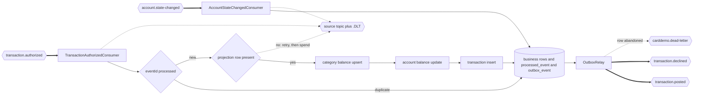

## Ledger Posting Service

- [Purpose](#purpose)
- [Source provenance](#source-provenance)
- [Endpoints](#endpoints)
- [Events](#events)
- [Domain and data ownership](#domain-and-data-ownership)
- [Pitfalls](#pitfalls)
- [Architecture](#architecture)
- [How to extend](#how-to-extend)
- [Local run and tests](#local-run-and-tests)
- [Related documentation](#related-documentation)

<br/>

## Purpose

`ledger-posting-service` consumes `TransactionAuthorized` and applies the source posting arithmetic once per event. It updates category and account projections, stores the transaction, and publishes `TransactionPosted`. It also consumes `AccountStateChanged`, which is what keeps its account projection current with the service that owns the record. A transaction it cannot post is a failure and never a reject: it retries and reaches the dead-letter topic, because rejecting it would reverse a decision this service does not own. The service calls no other service.

<br/>

## Source provenance

| Target component | Source |
| :--- | :--- |
| Consumer trigger | `app/jcl/POSTTRAN.jcl:L23` |
| Posting orchestration | `app/cbl/CBTRN02C.cbl:L424-L444` |
| Category-balance create and update | `app/cbl/CBTRN02C.cbl:L467-L542` |
| Account balance and cycle updates | `app/cbl/CBTRN02C.cbl:L545-L560` |
| Reject record | `app/cbl/CBTRN02C.cbl:L446-L465` |
| Transaction insert and duplicate-key failure | `app/cbl/CBTRN02C.cbl:L562-L579` |
| Transaction layout | `app/cpy/CVTRA05Y.cpy:L5-L18` |
| Category-balance layout | `app/cpy/CVTRA01Y.cpy:L5-L10` |
| Account projection fields | `app/cpy/CVACT01Y.cpy:L5`, `L7`, `L13-L14` |

The 430-byte reject width is corroborated by `app/jcl/POSTTRAN.jcl:L36`. Deliberately dropped filler fields remain listed in the [traceability matrix](../../docs/traceability-matrix.md).

<br/>

## Endpoints

| Method and path | Access | Response |
| :--- | :--- | :--- |
| `GET /balances/{accountId}` | Scoped `USER` or `ADMIN` | Account identifier, current balance, cycle credit, cycle debit |

The full contract is [OpenAPI](src/main/resources/openapi.yaml). Business traffic uses port 8082 and management traffic uses 9082.

<br/>

## Events

| Direction | Event | Topic | Group |
| :--- | :--- | :--- | :--- |
| Consumes | `TransactionAuthorized` | `transaction.authorized` | `ledger-posting` |
| Consumes | `AccountStateChanged` | `account.state-changed` | `ledger-account-state` |
| Produces | `TransactionPosted` version 2 | `transaction.posted` | — |
| Produces | `TransactionDeclined` | `transaction.declined` | — |
| Listener failure route | 134-character fixed-width abend diagnostic | `<source>.DLT`, falling back to `carddemo.dead-letter` | — |
| Relay abandonment route | `DeadLetterEnvelope` | `carddemo.dead-letter` | — |

Version 2 of `TransactionPosted` carries every statement field notification needs. The ledger propagates those values from the authorized event rather than rebuilding them.

`AccountStateChanged` is consumed for a different reason from posting. `V2__seed.sql` loaded one projection row per fixture account and nothing told the table when the account service moved the original, so an account opened after deployment had no row, and a cycle close at `app/cbl/CBACT04C.cbl:L353-L354` never reached this service's copy of the two accumulators. The consumer applies the snapshot monotonically against `source_occurred_at`, so a redelivery arriving behind a newer change discards itself. A posting is a delta this service owns and advances neither provenance column.

The account identifier is the Kafka key. Per-account posting order therefore follows partition order.

The listener and relay routes are two different destinations carrying two different forms, and the difference is deliberate. A spent consumer record goes to its own source topic plus `.DLT` as bytes, because the value that failed may never have parsed. An abandoned outbox row goes to the shared topic as a governed envelope, because its event type is known. A contract test holds each recoverer's destination together with the serializer bound to it, so a mismatch fails the build rather than the broker.

| Meter | Kind | What moves it |
| :--- | :--- | :--- |
| `carddemo.ledger.events.consumed` | Counter | One delivery accepted for processing |
| `carddemo.ledger.transactions.processed` | Counter | One posting or one reject, tagged by outcome |
| `carddemo.ledger.failures` | Counter | One failed attempt, tagged by stage; `stage=abandon` marks a spent outbox row |
| `carddemo.ledger.dead.letters` | Counter | One spent consumed record, tagged `outcome=published` or `outcome=failed` |
| `carddemo.ledger.processing.latency` | Timer | Consumer duration to commit |

`failures` counts attempts and `dead.letters` counts records, so the two are never summed. A fourth `stage` value on `failures` would have overlapped `deserialize`, because a record spent at deserialization is also a terminal record. `stage=abandon` is safe on that series only because an outbox row is never a consumed record.

<br/>

## Domain and data ownership

Source order is fixed:

1. Upsert the category balance.
2. Update the account balance and one cycle accumulator.
3. Insert the transaction.

All three writes and the outbox row commit in one local transaction. A second delivery of the same `eventId` performs no second posting.

The private database is `carddemo_ledger`, with schema `ledger_service`.

| Table | Role |
| :--- | :--- |
| `transaction` | Posted transaction record |
| `transaction_category_balance` | Account, type, and category running total |
| `account_balance_projection` | Balance plus cycle accumulators, with the provenance of the account change it last replicated |
| `transaction_type` | Seven seeded type rows |
| `transaction_category` | Eighteen seeded category rows |
| `rejected_transaction` | Diagnostic refusal data with a masked card |
| `outbox_event` | Posted or declined events awaiting publication |
| `processed_event` | Duplicate-delivery guard |

The category key is 11 + 2 + 4 characters, matching `app/jcl/TCATBALF.jcl:L40`.

<br/>

## Pitfalls

1. **Two timestamp formats coexist.** Feed origin time uses spaces and colons; processing time uses `YYYY-MM-DD-HH.MM.SS.ff0000`.
2. **Fixture money uses zoned decimal.** The final byte carries the last digit and sign, so plain decimal construction fails.
3. **Money truncates toward zero.** Use `CobolDecimal` and never half-up rounding.
4. **A first category row is not an error.** File status `23` means create the row, matching `app/cbl/CBTRN02C.cbl:L481`.
5. **Duplicate delivery must be harmless.** The source would reach its duplicate-key abend; the target marker prevents a second effect.
6. **Cycle close happens elsewhere.** Account service must reset the counters that ledger grows.
7. **A missing projection row is not a reject.** It fails the consumer, leaves the offset uncommitted, and reaches the dead-letter topic. Rejecting it would publish a decline for a transaction the authorization service already approved, which reverses a decision this service does not own. `domain/RejectRecorder` accepts a `FeedTransaction` and nothing else for exactly that reason: the type, not a comment, is what makes the mistake unrepresentable.
7. **Java 25 is explicit.** Class-file major version must be 69, not 61.

The [equivalence results](../../docs/equivalence-results.md) record the observed posting totals and timestamp normalization.

<br/>

## Architecture

Figure 1 shows the consumer transaction and the later outbox publication.

**Figure 1 — Ledger Posting Data Flow: One Authorized Event, Ordered Writes, and One Published Outcome**



Legend for Figure 1:

- Thick arrows are Kafka consume or publish operations.
- Plain arrows are in-process posting steps.
- The first diamond is the duplicate guard; the second is the projection-row check.
- The cylinder names rows committed in one local transaction.
- Dotted arrows are the two terminal routes: a spent consumed record to its own source topic plus `.DLT`, and an abandoned outbox row to the shared topic.
- A missing projection row takes the dead-letter route and never the decline route. `transaction.declined` is reachable only from the feed-validation reject path, which no delivered entry point supplies.

The platform-wide migration views are in [Architecture, Before and After](../../docs/architecture-before-after.md).

<br/>

## How to extend

- Add a new posting step as a separate domain component and place it explicitly in the transaction order.
- Add a consumer of `TransactionPosted` with a new group; no ledger code changes.
- Keep repository methods aligned with the source operation-code contract in `app/cbl/CBSTM03B.CBL:L99-L127`.

See [Suggested Next Tasks](../../docs/suggested-next-tasks.md) for behavior changes requiring owner approval.

<br/>

## Local run and tests

| Component | Exact value |
| :--- | :--- |
| Build runtime | Eclipse Temurin OpenJDK 25.0.4+7 |
| Build tool | Apache Maven 3.9.16 |
| Broker image | `apache/kafka:4.2.1` |
| Database image | `postgres:18.4` |
| Business port | 8082 |
| Management port | 9082 |
| Database and schema | `carddemo_ledger.ledger_service` |
| Consumer groups | `ledger-posting`, `ledger-account-state` |
| Migrations | `V1__schema.sql`, `V2__seed.sql`, `V3__account_state_replica.sql` |

From `card-platform/`:

```bash
mvn -B -pl services/ledger-posting-service -am test
mvn -B -pl services/ledger-posting-service -am package
docker compose up -d --build ledger-posting-service
curl -fsS http://localhost:9082/actuator/health
```

The Dockerfile copies the prebuilt archive from `target/`, so Maven must run before the image build.

Module tests cover posting order, create and update category branches, rejects, duplicate delivery, outbox routing, and metrics. The equivalence module drives all 300 daily transactions during `mvn verify`.

<br/>

## Related documentation

- [Platform README](../../README.md)
- [Onboarding](../../docs/onboarding.md)
- [Decision Log](../../docs/decision-log.md)
- [Event Flow](../../docs/event-flow.md)
- [Data Model](../../docs/data-model.md)
- [Business Rule Flags](../../docs/business-rule-flags.md)
- [Equivalence Results](../../docs/equivalence-results.md)