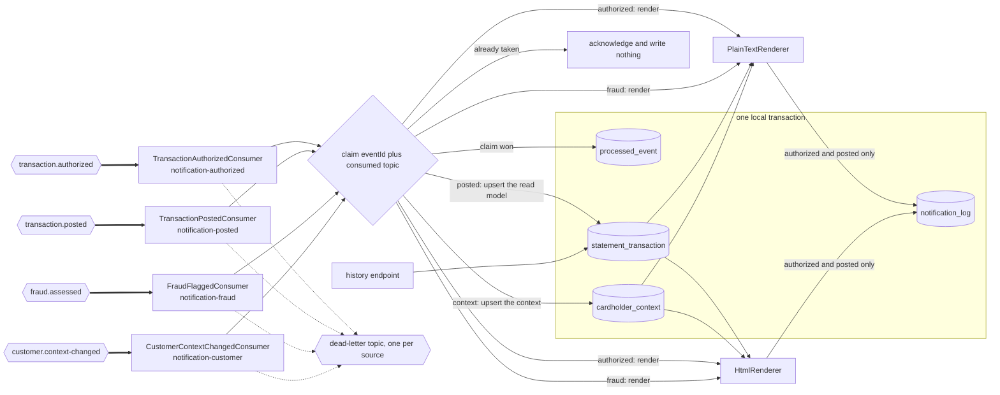

## Notification Service

- [Purpose](#purpose)
- [Source provenance](#source-provenance)
- [Domain context](#domain-context)
- [Events consumed](#events-consumed)
- [Architecture](#architecture)
- [Endpoints](#endpoints)
- [Domain and data ownership](#domain-and-data-ownership)
- [Renderers](#renderers)
- [Patterns](#patterns)
- [Pitfalls](#pitfalls)
- [Local run and tests](#local-run-and-tests)
- [How to extend](#how-to-extend)
- [Deliberate non-additions](#deliberate-non-additions)
- [Related documentation](#related-documentation)

<br/>

## Purpose

`notification-service` turns platform events into cardholder alerts. Four listeners feed its private tables, among them a transaction read model keyed by card. Two renderers build each alert, one in plain text and one in HyperText Markup Language (HTML), and one read-only endpoint returns the history held for a card. The module publishes no business event and calls no other service.

The module replaces only the customer-facing tail of statement generation. Full statement generation stays a scheduled batch process, which the requirements ask for directly: *"retain as scheduled/batch processes for now; do not force these into the event model."*

Java package root `com.carddemo.notification`. Maven artifact `notification-service`.

<br/>

## Source provenance

Every locator below was read in the source before it was written here.

| Contribution | Source | Verified locator |
| :--- | :--- | :--- |
| Text and markup rendering, plus per-card totalling | `app/cbl/CBSTM03A.CBL` | `01 STATEMENT-LINES.` at line 85; the text layout `ST-LINE0` through `ST-LINE15` spans lines 86–146; `01 HTML-LINES.` at line 148, with the markup carried as condition names on `HTML-FIXED-LN PIC X(100)` at line 149 |
| Running total, reset per card | `app/cbl/CBSTM03A.CBL` | `WS-TOTAL-AMT PIC S9(9)V99 VALUE 0` at line 65, declared under `01 COMP3-VARIABLES COMP-3.` at line 64; `MOVE ZERO TO WS-TOTAL-AMT` at line 325; `ADD TRNX-AMT TO WS-TOTAL-AMT` at line 429; moved through an edited field at lines 433 and 434 |
| The card-keyed read model layout | `app/cpy/COSTM01.CPY` | `01 TRNX-RECORD.` at line 20; `05 TRNX-KEY.` at line 21 holding `TRNX-CARD-NUM PIC X(16)` at line 22 and `TRNX-ID PIC X(16)` at line 23; `05 TRNX-REST.` at line 24 covering lines 25 through 35; a 20-byte `FILLER` at line 36 |
| The composite key, derived from the sort that builds the read model | `app/jcl/CREASTMT.JCL` | `KEYS(32 0)` at line 30; `RECORDSIZE(350 350)` at line 32; `EXEC PGM=SORT` at line 44; `SORT FIELDS=(263,16,CH,A,1,16,CH,A)` at line 53; `OUTREC FIELDS=(1:263,16,17:1,262,279:279,50)` at line 54; the copy into the keyed dataset at lines 56–61; the renderer step at line 79 |
| The repository interface shape | `app/cbl/CBSTM03B.CBL` | `01 LK-M03B-AREA.` at line 100 with the operation codes at lines 103–108; the four-dataset dispatch at lines 118–127 |
| The dead-letter metadata shape | `app/cpy/CSMSG02Y.cpy` | `01 ABEND-DATA.` at line 21: `ABEND-CODE PIC X(4)` line 22, `ABEND-CULPRIT PIC X(8)` line 24, `ABEND-REASON PIC X(50)` line 26, `ABEND-MSG PIC X(72)` line 28 |

The source names the re-keying itself. Line 42 of `app/jcl/CREASTMT.JCL` reads `CREATE COPY OF TRANSACT FILE WITH CARD NUMBER AND TRAN ID AS KEY`.

One provenance note matters to anyone tracing customer fields. `app/cbl/CBSTM03A.CBL` carries `COPY CUSTREC.` at line 55, so the statement program binds the `CUSTREC` fork of the customer layout, and it is the only program in `app/cbl/` that does. Six programs bind `CVCUS01Y` instead — `CBCUS01C`, `CBTRN01C`, `COACTUPC`, `COACTVWC`, `COCRDSLC` and `COCRDUPC` — which is why the account service adopts `CVCUS01Y` as canonical. This module therefore takes customer data only from events, and assumes nothing about the account service's field naming. The fork itself is recorded in [business rule flags](../../docs/business-rule-flags.md).

<br/>

## Domain context

A cardholder statement lists the transactions posted against one card over a period. Alongside the list it carries the account balance, the cardholder's name and address, a credit score, and a total of the listed amounts.

The shape changed. The original job runs as batch work under Job Control Language (JCL) over Virtual Storage Access Method (VSAM) datasets. It renders one statement per card, walking the card cross-reference file. This module renders one alert per event, and keeps a per-card read model so a history query stays a single indexed read. Nothing here waits for a nightly window.

<br/>

## Events consumed

| Consumer | Topic | Consumer group | What it does |
| :--- | :--- | :--- | :--- |
| `TransactionAuthorizedConsumer` | `transaction.authorized` | `notification-authorized` | Renders an alert over the one transaction the event carries |
| `TransactionPostedConsumer` | `transaction.posted` | `notification-posted` | Upserts the statement row, then renders an alert over the card's rows |
| `FraudFlaggedConsumer` | `fraud.assessed` | `notification-fraud` | Renders a flagged alert and stores no row, and acknowledges a cleared assessment |
| `CustomerContextChangedConsumer` | `customer.context-changed` | `notification-customer` | Refreshes the account-keyed name, address and credit-score context |

Four listeners hold four groups. Reading `transaction.authorized` under a group of its own is what makes this module an independent consumer of the authorization event, beside the ledger and the fraud detector.

`FraudFlagged` and `FraudCleared` share the `fraud.assessed` topic. The deserializer selects the record type from the envelope `eventType` field, so `FraudFlaggedConsumer` receives a typed object and routes on it. A listener written as though every message were a `FraudFlagged` mishandles half its traffic.

### A contract version this service cannot act on

Both of this module's tables are keyed on the card token, and only schema version 2 of `TransactionAuthorized` and `TransactionPosted` carries one. A delivery at version 1 is therefore **consumed, counted on `carddemo.notification.events.unapplied`, reported once at `WARN` naming the version, and acknowledged**. It writes no read-model row, renders no alert, and writes no duplicate-delivery marker, because a marker guards side effects and there are none to guard.

Nothing is invented in its place. The card token is a digest over the whole card number. The masked number a version 1 event does carry has already discarded twelve of the sixteen digits that derivation reads, and two cards sharing their last four digits mask to one value. A key derived from the masked form, the account identifier or the transaction identifier would name a card that no card resolves to. A history query would then answer with a row belonging to nobody, and for `TransactionPosted` nine of the fourteen columns would be blank as well.

Refusing it was the previous behaviour and it was worse. A version 1 event is governed and valid against its own schema document, and the deserializer accepts it; throwing in the listener spent three delivery attempts and put a valid event on the dead-letter topic as though it were poison. Every consumer group here starts at the earliest offset, because `auto-offset-reset` is `earliest`. A group added to a topic that still retains version 1 records met that route on every one of them, so the backward compatibility this platform's versioning exists to provide did not hold in practice. There is deliberately **no replay boundary and no offset skip**: the records are read, accounted for, and passed over.

What a replay of a version 1 record therefore costs is one counter increment and one log line per record, and what it does not cost is a dead-letter record, a retry cycle or a stalled group. What it also does not do is produce an alert: a cardholder history built only from version 1 records is empty, and that is visible in the counter rather than hidden.

Two keys are in play, and they differ deliberately. The Kafka message key is the account identifier, which keeps one account's events in one partition and in order. The read model key is the card token plus the transaction identifier, and it comes from the sort at `app/jcl/CREASTMT.JCL:L53`.

**This module publishes no event. Events produced: none.** It writes only sanitized dead-letter records. The dead-letter base name is `carddemo.dead-letter` and the suffix is `.DLT`, so each source topic routes to its own dead-letter topic and the four wire shapes stay separate. A listener makes three delivery attempts, 1000 ms apart, before a record routes there.

<br/>

## Architecture

Figure 1 shows the four topics reaching four consumer groups, the duplicate claim they all pass through, the private tables behind them, and which of the four ends in a rendered alert. The four arrive for two different purposes. `transaction.posted` and `customer.context-changed` maintain state: the first upserts a row of the card-keyed read model, the second upserts the cardholder context. `transaction.authorized` and `fraud.assessed` maintain nothing — each reads the context and renders an alert. A posted transaction does both: it upserts its row and then renders the balance alert. No arrow leaves the module carrying a business event, and no arrow reaches another service. Those two absences are the design. The paired platform-wide before-and-after views are in [architecture, before and after](../../docs/architecture-before-after.md).

**Two of the three rendered alerts leave a row in `notification_log`, and the fraud alert leaves none**. `NotificationService.renderAuthorizationAlert` and `renderPostedTransactionAlert` each call `recordRendered`. That writes one row carrying the card token, the masked card number, the transaction identifier and `outcome = RENDERED_NOT_SENT`. `renderFraudAlert` does not: `FraudFlagged` carries no card token and no masked card number, `notification_log` requires both, and neither can be recovered from an event that names only a transaction, an account, a score and the rules that fired. That alert is therefore rendered from the cardholder context and the assessment, counted on `carddemo.notification.notifications.rendered`, logged, and returned to a consumer that discards the string. It reaches no table and no cardholder.

Read that together with the limitation the whole table carries: no row anywhere in `notification_log` is evidence that a cardholder was told anything, because this service reaches no mail, message, webhook or push gateway. For a fraud flag there is not even a row. [Deliver the rendered cardholder alert](../../docs/suggested-next-tasks.md) carries the work that would change either fact.

**Figure 1 — Notification Service Data Flow: Four Topics, Four Consumer Groups, One Card-Keyed Read Model**


Legend for Figure 1:

- Hexagon: a Kafka topic.
- Thick arrow: an asynchronous consume from a topic. Every thick arrow is a decoupling point.
- Plain arrow: an in-process call, a read, or a write inside this module.
- Diamond: the duplicate claim against `processed_event`, whose primary key is the event identifier together with the topic the delivery arrived on.
- Cylinder: a table in this module's private schema.
- Box labelled *one local transaction*: the marker and the domain rows commit together or not at all.
- The two arrows into `notification_log` are labelled because they do not carry every alert. A fraud alert is rendered and returned to a consumer that discards it, and `FraudFlagged` carries neither of the two card identifiers that table requires.
- Dotted arrow: the dead-letter route, taken only after the three delivery attempts are spent.
- A label on an arrow out of the diamond names the consumer that takes it, so the two state-maintaining paths and the two rendering paths can be told apart. Only a posted transaction takes both a table arrow and a renderer arrow.
- No arrow carries an event out of the module, and none reaches another service.

<br/>

## Endpoints

One endpoint, served by `NotificationHistoryController`.

| Method and path | Query parameter | Returns |
| :--- | :--- | :--- |
| `GET /notifications/{cardToken}` | `pageSize` (1&ndash;200, default 25); cursor in the `X-Notification-Cursor` header | One bounded page of the card's transactions in ascending transaction-identifier order, with the count and the total of the card's whole history |

`cardToken` is the value column `statement_transaction.card_token` already holds: 64 lower-case hexadecimal characters `PanMasker.cardToken` derives from the whole card number under the deployment key. The route reads by it directly and derives nothing, so no digit of `TRNX-CARD-NUM PIC X(16)` at `app/cpy/COSTM01.CPY` line 22 reaches a request line. The response body holds `cardNumber` masked, `transactionCount`, `totalAmount`, a `transactions` array, `nextPageExists` and, where a further page exists, `nextCursor`. Each array item carries twelve fields, one for every field of the layout at `app/cpy/COSTM01.CPY` except the card number, which the envelope names once, and the dropped filler.

**The count and the total cover the whole card; the array carries one page.** `app/cbl/CBSTM03A.CBL` reads every row of one card between two key breaks and line 429 totals all of them, so a count or a total over one page would describe a statement the source never produced. Both are read as one aggregate over the primary-key prefix `card_token`, which costs the same at any history length, and `NotificationService.totalOfCard` turns that aggregate into the value the source would have accumulated.

**The entries are paged, and the walk is a keyset cursor rather than an offset.** A card's history grows by one entry per posted transaction until retention removes entries, so a response carrying all of them made the query work, the heap and the response size a function of how long a cardholder had been transacting. The route once passed `Limit.unlimited()` and totalled in memory. Send `pageSize` for a different page size and the `nextCursor` a response hands back in the `X-Notification-Cursor` header for the next page, until `nextPageExists` reads false. Both the page finder and the aggregate walk the primary key `(card_token, transaction_id)`, so no page costs more because of where in a history it sits, and no offset means no page is reachable by reading and discarding the entries before it. `NotificationRenderer.MAXIMUM_STATEMENT_ROWS` bounds one rendered alert and is also the largest page this route serves.

```bash
curl -su admin001:"$ADMIN_PASSWORD" \
  -D- "http://localhost:8084/notifications/$CARD_TOKEN?pageSize=25"
# then, while nextPageExists reads true:
curl -su admin001:"$ADMIN_PASSWORD" \
  -H "X-Notification-Cursor: $NEXT_CURSOR" \
  "http://localhost:8084/notifications/$CARD_TOKEN?pageSize=25"
```

**The full card number reaches no request, no rendered alert, no log and no response**. The path carries a token, and the masked number in the body is read from column `masked_card_number` of the first row rather than derived from the path. `PanMasker` keeps the last four digits and rewrites the other twelve when that column is written.

**A token holding no row answers 404.** The masked number is a stored value here, so a history with no row has none to name and cannot answer the 200 body this route declares. The text is "No statement history is held for that card" and it names no card. A token is a keyed pseudonym rather than a card number, and a caller must already hold one to ask, so the answer distinguishes a card this service has posted nothing for from one it has, and nothing else. An identity holding no matching `SCOPE_CARD_` authority reads 403 first and never reaches either answer.

The hand-written contract, including the 400, 401, 403, 404, 429 and 500 outcomes and the HTTP basic identity the route requires, is in [openapi.yaml](src/main/resources/openapi.yaml). One call against the compose stack, deriving the token from the fixture number and discarding the number:

```bash
# Run from the repository root, where app/ and card-platform/ are.
CARD_NUMBER="$(cut -c1-16 app/data/ASCII/carddata.txt | sed -n '1p')"
CARD_TOKEN_SECRET="$(grep '^CARD_TOKEN_SECRET=' card-platform/.env | cut -d= -f2- | tr -d "'\"")"
CARD_TOKEN="$(printf 'CardDemo/card-token/v1:%s' "$CARD_NUMBER" \
  | openssl dgst -sha256 -hmac "$CARD_TOKEN_SECRET" -r | cut -d' ' -f1)"
unset CARD_NUMBER CARD_TOKEN_SECRET

curl -fsS -u "$ADMIN_USERNAME:the password you chose" \
  "http://localhost:8084/notifications/$CARD_TOKEN"
```

That command takes the same keyed code `PanMasker.cardToken` takes, so it reproduces the value this service stored. `CARD_TOKEN_VERSION` is `1` in `.env.example`; a deployment that raised it substitutes its own number in the label above.

The administrator identity reaches every card. An ordinary identity reaches one only through a `SCOPE_CARD_` authority naming that card's token, and `.env.example` ships no such authority. A token is derived under the key each deployment generates for itself, so an authority written down here would name a card under a key no deployment holds. [Onboarding](../../docs/onboarding.md) gives the command that derives one under your own key.

### Two controls in front of every route

`config/CrossSiteRequestFilter` guards state change: a `POST`, `PUT`, `PATCH` or `DELETE` must carry `X-CardDemo-Request`, must not declare a cross-site `Sec-Fetch-Site`, and must not carry a foreign `Origin`. This service answers two reads and nothing else, so no state-changing route exists here to forge today. That is the reason the filter is here rather than a reason it is not. The read-only shape becomes an enforced property instead of a fact a reader has to go and check, and the first write added inherits the control rather than needing someone to remember it. A refusal answers 403 and counts `carddemo.notification.requests.cross.site.refused`. `GET`, `HEAD`, `OPTIONS` and `TRACE` pass untouched, which is why no path is exempted: the liveness probe and the metrics scrape are reads.

`config/RequestRateCeilingFilter` bounds volume. It runs one place ahead of the security chain, because a refusal has to cost less than the attempt it refuses and an attempt that reached the chain would already have paid for a bcrypt verification.

| Ceiling | Default | Counted by |
| :--- | ---: | :--- |
| Failed authentications | 20 per 60s | Source address, and only when the request carried a credential and was answered 401 |
| Requests | 600 per 60s | Source address |
| Requests | 600 per 60s | The username the credential names, read as a counter key and never verified or logged |
| State-changing requests | 120 per 60s | Source address |
| Requests in flight | 64 | The whole instance |

A refusal answers 429 with `Retry-After` and counts `carddemo.notification.requests.throttled`, tagged with the stage that refused: `authentication`, `source`, `identity`, `write` or `concurrency`. The five ceilings read `API_RATE_WINDOW_SECONDS`, `API_RATE_REQUESTS_PER_WINDOW`, `API_RATE_WRITE_REQUESTS_PER_WINDOW`, `API_RATE_AUTHENTICATION_FAILURES_PER_WINDOW` and `API_RATE_CONCURRENT_REQUESTS` from [`.env.example`](../../.env.example). The management base path is exempt, because a throttled probe reads as a failed container.

Both filters count in this process, so several replicas bound each replica rather than the service as a whole, and the source address is the one the container resolves rather than a forwarding header a caller could write. A deployment behind a proxy sets `SERVER_FORWARD_HEADERS_STRATEGY=framework` so the container resolves the client address and the client-facing host. Both residual limits are recorded in [suggested next tasks](../../docs/suggested-next-tasks.md), and the reasoning behind the two controls is in the [Decision Log](../../docs/decision-log.md).

<br/>

## Domain and data ownership

Four tables in the private schema `notification_service`, inside the database `carddemo_notification`.

| Table | Derivation |
| :--- | :--- |
| `statement_transaction` | `app/cpy/COSTM01.CPY` lines 20–36. **Composite primary key `(card_token, transaction_id)`**, derived from `KEYS(32 0)` at `app/jcl/CREASTMT.JCL` line 30. The 20-byte `FILLER` at `COSTM01.CPY` line 36 is dropped |
| `cardholder_context` | Account-keyed name, address and credit score, kept current by `CustomerContextChanged` |
| `notification_log` | New abstraction: one record per alert this service **rendered and did not send**. Every row carries `outcome = RENDERED_NOT_SENT`, and `ck_notification_log_outcome` permits no other value, so no row here is evidence that a cardholder was told anything |
| `processed_event` | Composite primary key of event identifier and consumed topic, plus the processed timestamp |

The key derivation is arithmetic, not preference. `KEYS(32 0)` names a 32-byte key at offset zero, which is exactly `TRNX-CARD-NUM` at 16 bytes plus `TRNX-ID` at 16 bytes, the group `05 TRNX-KEY.` at `COSTM01.CPY` line 21. The sort at line 53 orders on the card number at offset 263 for sixteen bytes, then on the transaction identifier at offset 1 for sixteen bytes. Offset 263 is where `TRAN-CARD-NUM` sits in the 350-byte transaction record of `app/cpy/CVTRA05Y.cpy`, so the sort key follows the record layout.

`V1__schema.sql` therefore takes its key from `CREASTMT.JCL` line 30 rather than from the transaction file's own key. One substitution applies. The stored key column holds a card token, not the source's full Primary Account Number (PAN). The masked number beside it is display data, and no key or index reads it. The [traceability matrix](../../docs/traceability-matrix.md) records the re-keying, the dropped 20-byte filler, and the key's derivation from a sort step rather than a record layout.

`V2__seed.sql` seeds `cardholder_context` alone, one row per fixture account, each stamped at the Unix epoch so the first real `CustomerContextChanged` supersedes it. No fixture seeds `statement_transaction`: the read model is built by consuming events. `V3__processed_event_topic_key.sql` completes the set, making the consumed topic part of the duplicate-delivery marker's identity so the four listener groups sharing that table can each claim the same event identifier once. Seven migrations run on every start. The three above come first, in that order, and `V4__marker_retention_margin.sql`, `V5__rendered_not_delivered.sql`, `V6__subject_request_posture.sql` and `V7__statement_read_bounds.sql` follow, each described below. There is no eighth.

`V3__processed_event_topic_key.sql` widens the duplicate-delivery key from the event identifier alone to `(event_id, consumed_topic)`. Four listeners read four topics, and two of those topics can carry the same event identifier, so a single-column key let whichever listener claimed first silence the others. The key names the topic because the claim is per delivery path and not per event.

`V4__marker_retention_margin.sql` states the margin the marker window keeps over the broker window, so a marker cannot be purged while a redelivery of its event is still possible.

`V5__rendered_not_delivered.sql` renames `attempted_at` to `rendered_at`, adds the `outcome` column with the check that admits `RENDERED_NOT_SENT` alone, and restates the table comment. This service reaches no mail, message, webhook or push gateway, so a row was never evidence that a cardholder was told anything, and the earlier wording claimed a transport that has never existed.

`V6__subject_request_posture.sql` corrects the `cardholder_context` comment, which described an export and erasure workflow nothing on this platform implements.

`V7__statement_read_bounds.sql` records the read bounds of `statement_transaction` on its primary-key constraint, superseding the `V1__schema.sql` line comment that claimed every read of the table names a limit. Two reads exist and they differ: `GET /notifications/{cardNumber}` scans the key forward with `Limit.unlimited()` and returns every row of the card, which is what `app/cbl/CBSTM03A.CBL:L429` did between two key breaks; one rendered alert scans it backward under `NotificationRenderer.MAXIMUM_STATEMENT_ROWS`, an additive ceiling of 200 that bounds the alert alone. It changes no column, index, constraint or row.

Three tables of the four are bounded, and `domain/RetentionSweep` is what bounds them. It runs on `carddemo.history.sweep-interval-ms` and sweeps `processed_event`, `statement_transaction` and `notification_log` in that order, each against its own configured horizon: `carddemo.processed-event.marker-retention-hours`, `carddemo.history.statement-retention-days` and `carddemo.history.log-retention-days`. Each delete takes a row ceiling and the sweep repeats it in a transaction per batch until the table is clear or the table's wall-clock ceiling is reached, so no one statement locks a whole table and no backlog outlives the pass that found it. `cardholder_context` is the fourth and is deliberately unbounded: a row lives as long as the customer relationship, and no window expires it. `observed_at` is the ordering guard rather than a purge key — `messaging/CustomerContextChangedConsumer` refuses an event older than the row it would overwrite — and `V6__subject_request_posture.sql` removed the earlier claim that it served an erasure request, because no export or erasure workflow exists on this platform, here or upstream. The horizons are a demo baseline, and [suggested next tasks](../../docs/suggested-next-tasks.md) carries the task of replacing them with the periods a deployment's jurisdiction requires.

No table here is shared with another service, and this module reaches no other schema. Flyway owns every table, and Jakarta Persistence (JPA) runs with `ddl-auto: validate`, so a mapping that disagrees with the migrated schema stops start-up.

<br/>

## Renderers

`PlainTextRenderer` reproduces the 80-column text layout at `app/cbl/CBSTM03A.CBL` lines 86–146. Its parts, in the order they are written:

1. The opening banner: 31 asterisks, `START OF STATEMENT`, then 31 more asterisks.
2. The name line, then three address lines.
3. A rule of 80 hyphens.
4. A centred `Basic Details` banner.
5. The `Account ID`, `Current Balance` and `FICO Score` label lines.
6. A centred `TRANSACTION SUMMARY` banner, whose source literal pads to 20 characters with one trailing space.
7. The column header, then one detail line per transaction, then the total line.
8. The closing banner: 32 asterisks, `END OF STATEMENT`, then 32 more asterisks.

Two edit patterns put the sign after the digits. `ST-CURR-BAL` is `PIC 9(9).99-` at line 113, and both `ST-TRANAMT` at line 137 and `ST-TOTAL-TRAMT` at line 142 are `PIC Z(9).99-`, where the `Z` form suppresses leading zeros. Reproduce that formatting exactly; do not substitute a locale formatter.

`HtmlRenderer` reproduces the markup declared as condition names on `HTML-FIXED-LN PIC X(100)` from `app/cbl/CBSTM03A.CBL` line 149 onward. Those tag literals are content strings taken from the source. No styling framework and no component library takes part in producing them.

The running total resets per card, not per platform, following `MOVE ZERO TO WS-TOTAL-AMT` at line 325. `WS-TOTAL-AMT` is `PIC S9(9)V99`, so the total carries eleven digits at a scale of two. Every addition runs through `CobolDecimal`, which truncates toward zero.

Truncation is the platform-wide rule, and the evidence is a count. The `ROUNDED` phrase appears **zero** times across all 28 programs in `app/cbl`, so every arithmetic store in the source truncates. `RoundingMode.HALF_UP` is the reflexive Java choice and it is wrong here.

One rendering detail looks like a defect and is not. `TRNX-DESC` is `PIC X(100)` at `app/cpy/COSTM01.CPY` line 28, while the detail line's `ST-TRANDT` is `PIC X(49)` at line 135. The `MOVE` on line 677, inside `6000-WRITE-TRANS` at `app/cbl/CBSTM03A.CBL` line 675, therefore drops the tail of a long description. Both renderers reproduce that truncation.

<br/>

## Patterns

**Idempotent consumer, applied four times.** Each listener claims the envelope event identifier together with the topic the delivery arrived on. It inserts one `processed_event` row that does nothing on conflict, so two deliveries racing on one event cannot both proceed. The topic is part of that key because four producers assign identifiers independently, and `V3__processed_event_topic_key.sql` is the migration that widened it. This module found the defect the narrow key carried: keyed on the identifier alone, a posted transaction and a fraud assessment sharing an identifier would leave one of the two listeners writing nothing. The claim runs inside the transaction that carries the side effects, and the listener acknowledges only after that transaction commits. Kafka delivers at least once, and a redelivery follows a group rebalance, a restart mid-batch, or a crash after the writes but before the offset commit. The concrete consequence: a duplicate `TransactionPosted` must not add its amount to the per-card total twice.

**No outbox.** A module that publishes nothing needs none, and none is declared. Do not add one speculatively.

**Repository interfaces** follow the operation-code contract at `app/cbl/CBSTM03B.CBL` lines 100–112. `K`, a keyed read, becomes find by identifier; `R` becomes stream all; `W` becomes insert; `Z` becomes update. The `O` open and `C` close codes are dropped, because the framework owns connection lifecycle. That subroutine dispatches across `TRNXFILE`, `XREFFILE`, `CUSTFILE` and `ACCTFILE` at lines 118–127, and `TRNXFILE` is this module's read model.

**Money travels as a decimal string in every event payload, never as a JavaScript Object Notation (JSON) number.** Most parsers turn a JSON number into a double. That puts binary floating point back into a fixed-point system.

<br/>

## Pitfalls

1. **The language level fails silently.** `pom.xml` must declare `<java.version>25</java.version>`, because the Spring Boot parent defaults the language level and the compiler release to 17. A module that omits the override compiles cleanly at release 17 with no warning, so check the class-file major version is 69 rather than 61.
2. **Truncate, never round.** Every total runs through `CobolDecimal` with `RoundingMode.DOWN`. The `ROUNDED` phrase appears zero times across all 28 programs in `app/cbl`.
3. **The total resets per card.** `MOVE ZERO TO WS-TOTAL-AMT` at `app/cbl/CBSTM03A.CBL` line 325 runs once per card. A running platform-wide total is wrong.
4. **The trailing-sign edits are not a locale format.** `PIC 9(9).99-` and `PIC Z(9).99-` place the sign after the digits. A locale formatter puts it in front and pads differently.
5. **`fraud.assessed` carries two event types.** Route on the envelope `eventType` field. A consumer that assumes every message is a `FraudFlagged` mishandles `FraudCleared`.
6. **The two keys differ on purpose.** The Kafka message key is the account identifier; the read model key is the card token plus the transaction identifier. Confusing them breaks either partition ordering or the primary key.
7. **The wildcard hazard.** `app/cbl/CBSTM03A.CBL`, `app/cbl/CBSTM03B.CBL`, `app/cpy/COSTM01.CPY` and `app/jcl/CREASTMT.JCL` all break the lower-case extension convention, and a glob over lower-case extensions silently drops three of this module's four primary sources. Name source files explicitly, with their exact case.
8. **A state-changing call needs one extra header.** This service answers reads, so nothing a caller can reach today is affected. A state-changing route added later is refused from any client that does not send `X-CardDemo-Request`, because `config/CrossSiteRequestFilter` guards the method rather than a list of routes. Add the header to the client at the same time as the route.
9. **A burst answers 429 rather than being served.** A load generator, a retry loop, or a test that hammers one address reaches `config/RequestRateCeilingFilter` and answers 429 with `Retry-After`. The blanket ceiling is 600 requests a minute per address and per identity, writes are 120, and 20 failed authentications from one address close the rest of that minute. Raise `API_RATE_*` for a load run rather than removing the filter, and read the `stage` tag on `carddemo.notification.requests.throttled` to see which ceiling refused.

10. **A version 1 replay produces no alert and no row, and says so in a counter.** Both tables here are keyed on the card token, which only schema version 2 carries. A version 1 delivery is consumed, counted on `carddemo.notification.events.unapplied`, reported once and acknowledged. A group replaying a topic that retains version 1 records therefore finishes with an empty history and a non-zero `events.unapplied` reading, which is the thing to check before concluding the listener is broken. [A contract version this service cannot act on](#a-contract-version-this-service-cannot-act-on) states why nothing is invented in its place.

Platform-wide pitfalls are in [onboarding](../../docs/onboarding.md) and are not repeated here.

<br/>

## Local run and tests

Prerequisites, pinned exactly:

1. OpenJDK 25, Eclipse Temurin build 25.0.4+7.
2. Apache Maven 3.9.16.
3. Docker Engine 29.7.0 or later with Docker Compose 5.3.1 or later. Those two are floors: nothing here constrains them, so the versions given are the ones this was exercised on. The two above are exact, because the enforcer plugin refuses a build outside `[25,26)` and `[3.9.16,3.10.0)`.
4. Container images `apache/kafka:4.2.1` and `postgres:18.4`, both pinned by digest in `docker-compose.yml`.

The runtime contract:

| Setting | Value |
| :--- | :--- |
| Container port | 8080, published on host port 8084 as `NOTIFICATION_PORT` |
| Management port | 9080, published on host port 9084 as `NOTIFICATION_MANAGEMENT_PORT` |
| Database and schema | `carddemo_notification`, schema `notification_service` |
| Database login | `carddemo_notification_svc`, password from `NOTIFICATION_DB_PASSWORD` with no default |
| Kafka bootstrap | `kafka:29092` inside the compose network, `localhost:9092` from the host, in KRaft (Kafka Raft) mode |
| Broker identity | `carddemo-notification`, password from `NOTIFICATION_KAFKA_PASSWORD` with no default |
| Listener concurrency | 3 threads for each of the four topics, one per partition |
| Scheduler threads | 1, the framework default, and this service schedules one task |
| Datasource pool | at most 18 connections, 4 kept idle |
| Health check target | `http://localhost:9084/actuator/health` from the host |
| Actuator endpoints | `health`, `metrics`, `prometheus` |

Seven meters are registered by `config/ObservabilityConfig`, and two more by the request filters, described with them: `carddemo.notification.requests.cross.site.refused` and `carddemo.notification.requests.throttled`. Each carries the common `service` tag, and the tagged ones are pre-registered across every tag value at start-up, so a value reads zero rather than being absent before its first occurrence. A dashboard that has to wait for a failure before the failure series exists cannot show that there have been none.

| Metric | Tag | Meaning |
| :--- | :--- | :--- |
| `carddemo.notification.events.consumed` | `event.type` | Events this service consumed, one per event |
| `carddemo.notification.processing.latency` | `event.type` | Time one listener spent handling one event |
| `carddemo.notification.notifications.rendered` | `format` | Cardholder alerts rendered, tagged `text`, `html` or `unknown` |
| `carddemo.notification.duplicates.skipped` | none | Events a listener skipped because `processed_event` already held the claim |
| `carddemo.notification.events.unapplied` | `event.type` | Events consumed, recognised and deliberately not applied, one per delivery |
| `carddemo.notification.failures` | `failure.kind` | Failed delivery attempts, one per attempt |
| `carddemo.notification.records.dead.lettered` | `failure.kind` | Records whose delivery attempts ran out, one per record |

`events.unapplied` is the series that separates a delivery this service chose to do nothing for from one that failed. It moves for exactly one case today: a contract version predating the card token both of these tables are keyed on, described under [events consumed](#events-consumed). It is not a failure, because nothing failed; it is not a dead letter, because the record is acknowledged; and it is not a duplicate, because the event was never applied before. Without it, a consumed count rising with no alert rendered and no failure recorded was ambiguous.

The next two are a pair and are not interchangeable. `failures` counts attempts, so one record that fails three times adds three; `records.dead.lettered` counts records, so the same record adds one when its attempts run out. Reading either as the other overstates or understates the incident by the retry count. Both tag on `failure.kind`, whose values are `schema_validation`, `deserialization`, `persistence`, `rendering` and `unknown`, and `event.type` takes the five event types this module consumes plus `unknown`.

The compose file sets these six properties, and each one overrides the shipped default: `SPRING_DATASOURCE_URL`, `SPRING_DATASOURCE_USERNAME`, `SPRING_DATASOURCE_PASSWORD`, `SPRING_JPA_PROPERTIES_HIBERNATE_DEFAULT_SCHEMA`, `SPRING_FLYWAY_SCHEMAS` and `SPRING_KAFKA_BOOTSTRAP_SERVERS`.

Run it from the `card-platform` directory. Every `Dockerfile` compiles its own module in a builder stage from that directory, so no image build waits on a host archive. The packaging step is here to fill the local repository the credential hashes are derived from. Nothing below prompts, and nothing below runs unbounded.

Step 1 gives all nineteen credentials a value. `.env` is ignored by git, and `.env.example` documents every variable.

```bash
# The hash helper inside the script reads spring-security-crypto out of the local Maven
# repository, so this has to have run once on this machine.
mvn -B -ntp -DskipTests package

# install -m 600, never cp: this file holds fourteen passwords and the card-token key a
# moment later, and cp creates it under the umask -- world-readable on a default account.
install -m 600 .env.example .env

# Fill all nineteen REPLACE markers: fourteen passwords, one card-token key and four
# {bcrypt} identity hashes. This one command generates every one of them, keeps each
# plaintext out of the environment, and writes the four demo passwords to
# .demo-credentials with owner-only permissions. Re-running changes nothing already set.
scripts/generate-env.sh

# Prove none is left. The count is read from the file, so it cannot disagree with it.
grep -c '^[A-Za-z_][A-Za-z0-9_]*=.*REPLACE' .env
```

`scripts/generate-env.sh` is the canonical path and reads the credential names out of `.env.example`, so a credential added there needs no edit here. [Onboarding](../../docs/onboarding.md) sets out the same nineteen values by hand, including the `jshell` invocation that encodes each `{bcrypt}` hash and the single quotes Compose needs around one. `mvn package` below builds every module, so every image has an archive to copy.

Step 2 builds this module with the two libraries it depends on and runs its tests:

```bash
mvn -B -pl services/notification-service -am verify
```

Step 3 starts the five containers needed to see both of this module's consumers act, and waits for each to report healthy:

```bash
docker compose up -d --build --wait postgres kafka authorization-service ledger-posting-service \
  notification-service
curl -fsS http://localhost:9084/actuator/health
```

The ledger is in that list because the two consumers here read two different events. `notification-authorized` reads `transaction.authorized` and writes a `notification_log` row, which one authorization is enough to produce. `notification-posted` reads `transaction.posted`, which only the ledger publishes, and that is the consumer that fills the `statement_transaction` read model the history route reads. Start the four containers alone and the alert is rendered while the history route answers 404.

Step 4 submits one authorization:

```bash
# From card-platform/, as steps 1 to 3 are. app/ sits beside it in the repository.
CARD_NUMBER=$(sed -n '1s/^\(.\{16\}\).*/\1/p' ../app/data/ASCII/cardxref.txt)
CAPTURED_AT="$(date -u +'%Y-%m-%d %H:%M:%S').000000"
PROCESSED_AT="$(date -u +'%Y-%m-%d-%H.%M.%S').000000"

curl -sS -u "admin001:$ADMIN_PASSWORD" -X POST \
  -H 'X-CardDemo-Request: notification-guide' \
  -H 'Content-Type: application/json' \
  -d "{\"cardNumber\":\"${CARD_NUMBER}\",
       \"transactionTypeCode\":\"01\",
       \"transactionCategoryCode\":\"0001\",
       \"source\":\"POS TERM\",
       \"description\":\"Notification guide purchase\",
       \"amount\":\"+00000504.77\",
       \"merchantId\":\"800000000\",
       \"merchantName\":\"Abshire-Lowe\",
       \"merchantCity\":\"North Enoshaven\",
       \"merchantZip\":\"72112\",
       \"originTimestamp\":\"${CAPTURED_AT}\",
       \"processingTimestamp\":\"${PROCESSED_AT}\"}" \
  http://localhost:8081/authorizations
```

Step 5 reads what this module did with that event. The history route names the card by its token, which is what every route naming one card accepts. Derive the token rather than writing one down: a token belongs to one `CARD_TOKEN_SECRET`, so a literal here would name a card under a key no other deployment holds.

```bash
CARD_TOKEN="$(printf 'CardDemo/card-token/v1:%s' "$CARD_NUMBER" \
  | openssl dgst -sha256 -hmac "$(grep '^CARD_TOKEN_SECRET=' .env | cut -d= -f2- \
      | tr -d "'\"")" -r | cut -d' ' -f1)"
unset CARD_NUMBER

curl -fsS -u "admin001:$ADMIN_PASSWORD" "http://localhost:8084/notifications/$CARD_TOKEN"
```

That command takes the same keyed code `PanMasker.cardToken` takes, over the label, the configured version and the number, so it reproduces the token this module stored. It answers one transaction, a masked card number read from that row, and the per-card total. Read the bounded log for the same delivery rather than following the log forever:

```bash
docker compose logs --no-log-prefix --tail 40 notification-service
```

Set `CLONE_INDEX`, `POSTGRES_PORT` and `KAFKA_PORT` when another copy of the stack already runs on the same machine.

<br/>

## How to extend

- Adding a consumer of an event this module already receives needs no change to any producer: give the listener its own consumer group and the same claim-inside-the-transaction rule.
- Adding a rendered format means adding a class beside `PlainTextRenderer` and `HtmlRenderer` that implements `NotificationRenderer`.

The steps above are complete on their own. [Onboarding](../../docs/onboarding.md) adds the platform-wide walkthrough, domain background and pitfalls, and follow-up work is listed in [suggested next tasks](../../docs/suggested-next-tasks.md).

<br/>

## Deliberate non-additions

Each item below is absent on purpose. Adding one back changes behaviour, widens scope, or breaks a guarantee this module claims.

- No full statement generation.
- No query against the ledger, account or card service.
- No outbox and no published business event.
- No cache or key-value store.
- No electronic mail gateway, no short-message gateway, no webhook caller and no push gateway. Nothing on this platform sends a rendered alert anywhere, which is why every `notification_log` row carries `outcome = RENDERED_NOT_SENT`. [Deliver the rendered cardholder alert](../../docs/suggested-next-tasks.md) is the task that would add one.
- No user interface, component library or styling framework.
- No documentation generator; the contract in `openapi.yaml` is hand-written.
- No boilerplate generator and no object-mapping framework.
- No Common Business Oriented Language (COBOL) compiler, emulator or mainframe connector.

<br/>

## Related documentation

- [Platform README](../../README.md)
- [Decision log](../../docs/decision-log.md), the single home for why each choice was made
- [Event flow](../../docs/event-flow.md)
- [Data model](../../docs/data-model.md)
- [Equivalence results](../../docs/equivalence-results.md)
