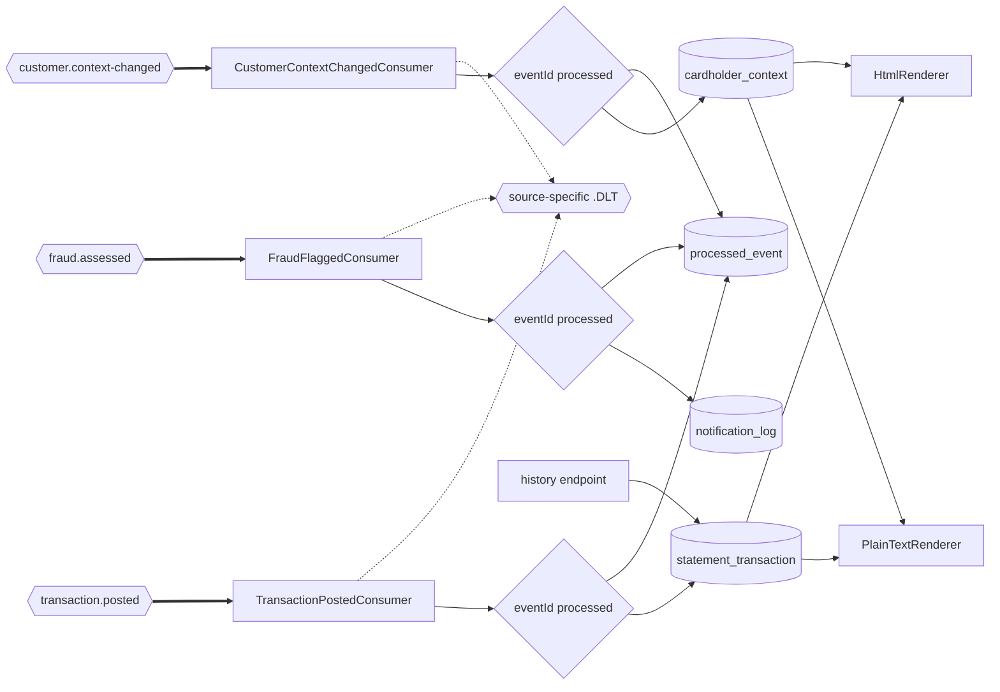

## Notification Service

- [Purpose](#purpose)
- [Source provenance](#source-provenance)
- [Endpoints](#endpoints)
- [Events](#events)
- [Domain and data ownership](#domain-and-data-ownership)
- [Pitfalls](#pitfalls)
- [Architecture](#architecture)
- [How to extend](#how-to-extend)
- [Local run and tests](#local-run-and-tests)
- [Related documentation](#related-documentation)

<br/>

## Purpose

`notification-service` consumes posted transactions, fraud assessments, and customer-context changes. It maintains a token-keyed transaction model and an account-keyed cardholder context, then renders plain-text or HTML alerts. It publishes no business event and calls no other service. Full statement generation remains outside the migrated runtime.

<br/>

## Source provenance

| Contribution | Source |
| :--- | :--- |
| Text and HTML content structure | `app/cbl/CBSTM03A.CBL:L85-L159` |
| Per-card total | `app/cbl/CBSTM03A.CBL:L325`, `L429-L434` |
| Card-plus-transaction record | `app/cpy/COSTM01.CPY:L20-L36` |
| 32-byte composite key and sort | `app/jcl/CREASTMT.JCL:L30-L54` |
| Repository operation shape | `app/cbl/CBSTM03B.CBL:L99-L127` |
| Dead-letter metadata fields | `app/cpy/CSMSG02Y.cpy:L21-L28` |

The source job explicitly creates a copy “WITH CARD NUMBER AND TRAN ID AS KEY” at `app/jcl/CREASTMT.JCL:L42`. The [traceability matrix](../../docs/traceability-matrix.md) records the re-keying and dropped 20-byte filler.

<br/>

## Endpoints

| Method and path | Access | Response |
| :--- | :--- | :--- |
| `GET /notifications/{cardToken}` | Card owner or `ADMIN` | Ordered history, count, and per-card total |

The path accepts the 64 lower-case hexadecimal characters produced by `PanMasker.cardToken`. The response carries that token as identity and the masked card number as display data. No full card number enters a route, response, log, or notification table.

Rows return in ascending transaction-identifier order. The response has a 200-row ceiling rather than paging and carries `Cache-Control: no-store`.

An empty history returns 200. The route deliberately has no 404 outcome, so it does not disclose whether a masked card exists.

The full contract is [OpenAPI](src/main/resources/openapi.yaml). Business traffic uses port 8084 and management traffic uses 9084.

<br/>

## Events

| Consumer | Topic | Group | Behavior |
| :--- | :--- | :--- | :--- |
| `TransactionPostedConsumer` | `transaction.posted` | `notification-posted` | Upsert statement row, refresh masked card correlation, render alert |
| `FraudFlaggedConsumer` | `fraud.assessed` | `notification-fraud` | Render flagged alert or acknowledge a cleared assessment |
| `CustomerContextChangedConsumer` | `customer.context-changed` | `notification-customer` | Refresh account-keyed name, address, and credit-score context |
| Shared error handler | `<source>.DLT` | — | Route terminal failures without mixing source wire shapes |

`FraudFlagged` and `FraudCleared` share `fraud.assessed`. The listener receives a validated object and distinguishes the two governed record types before acting.

The Kafka key is the account identifier. The statement primary key is card token plus transaction identifier; the token safely replaces the source sort key's full card number, while the masked card number remains display data.

<br/>

## Domain and data ownership

A statement lists transactions for one card and totals their amounts. This service renders one alert per event while retaining the card-keyed history needed for queries.

The private database is `carddemo_notification`, with schema `notification_service`.

| Table | Role |
| :--- | :--- |
| `statement_transaction` | Thirteen authoritative transaction fields from `TransactionPosted` version 2 |
| `cardholder_context` | Account-keyed name, address, and credit-score context from `CustomerContextChanged` |
| `notification_log` | Metadata-only alert attempt |
| `processed_event` | Duplicate guard for all three consumer groups |

`cardholder_context` starts empty and applies customer-context events with last-writer-wins ordering on the producer timestamp. A transaction row stores a 64-character card token for identity and the masked card number only for display.

`PlainTextRenderer` reproduces the fixed-width source lines. `HtmlRenderer` reproduces source markup content without adding a front-end framework.

<br/>

## Pitfalls

1. **`TransactionPosted` version 1 is insufficient.** The consumer rejects it rather than padding nine descriptive fields.
2. **`fraud.assessed` carries two event types.** A listener typed only as `FraudFlagged` can fail before application discrimination.
3. **The Kafka key and database key differ.** Account order belongs on Kafka; card token plus transaction identity belongs in the read model.
4. **Totals reset per card.** A platform-wide running total is wrong.
5. **History uses a 200-row ceiling, not offset paging.** Inserting a transaction must not shift a page the caller already read.
6. **Empty and unknown histories both return 200.** Adding 404 would disclose card existence.
7. **Descriptions narrow to 49 characters.** Both source renderers lose the tail rather than wrapping it.
8. **Source money edits use a trailing sign.** Do not replace `PIC 9(9).99-` or `PIC Z(9).99-` with a locale formatter.
9. **Statement code binds the divergent `CUSTREC` copybook.** The target projection uses the adopted canonical customer layout and records the fork.
10. **The source files use upper-case extensions.** Name `CBSTM03A.CBL`, `CBSTM03B.CBL`, `COSTM01.CPY`, and `CREASTMT.JCL` explicitly.
11. **Java 25 is explicit.** Class-file major version must be 69, not 61.

<br/>

## Architecture

Figure 1 shows three independent consumers writing one private notification model.

**Figure 1 — Notification Data Flow: Three Topics, Three Consumer Groups, and One Private Model**



Legend for Figure 1:

- Thick arrows are Kafka consumption.
- Plain arrows are in-process reads, writes, or rendering.
- Diamonds are duplicate checks.
- Cylinders are private notification tables.
- Dotted arrows are terminal dead-letter routing.
- No outbound business event or service call leaves the module.

The platform-wide paired views are in [Architecture, Before and After](../../docs/architecture-before-after.md).

<br/>

## How to extend

- Add a renderer by implementing `NotificationRenderer` beside the plain-text and HTML classes.
- Add another consumer with its own group and the same processed-event transaction rule.
- Extend `CustomerContextChanged` additively when a renderer needs another governed cardholder field.

See [Suggested Next Tasks](../../docs/suggested-next-tasks.md) for follow-up work.

<br/>

## Local run and tests

| Component | Exact value |
| :--- | :--- |
| Build runtime | Eclipse Temurin OpenJDK 25.0.4+7 |
| Build tool | Apache Maven 3.9.16 |
| Broker image | `apache/kafka:4.2.1` |
| Database image | `postgres:18.4` |
| Business port | 8084 |
| Management port | 9084 |
| Database and schema | `carddemo_notification.notification_service` |
| Consumer groups | `notification-posted`, `notification-fraud`, `notification-customer` |

From `card-platform/`:

```bash
mvn -B -pl services/notification-service -am test
mvn -B -pl services/notification-service -am package
docker compose up -d --build notification-service
curl -fsS http://localhost:9084/actuator/health
```

The Dockerfile copies the packaged archive from `target/`, so build the module before its image.

Direct tests cover all three consumers, duplicate and failure paths, all statement columns, cardholder context, renderer output, attempt metadata, schema migration, and the history API.

<br/>

## Related documentation

- [Platform README](../../README.md)
- [Onboarding](../../docs/onboarding.md)
- [Decision Log](../../docs/decision-log.md)
- [Event Flow](../../docs/event-flow.md)
- [Data Model](../../docs/data-model.md)
- [Business Rule Flags](../../docs/business-rule-flags.md)
- [Equivalence Results](../../docs/equivalence-results.md)