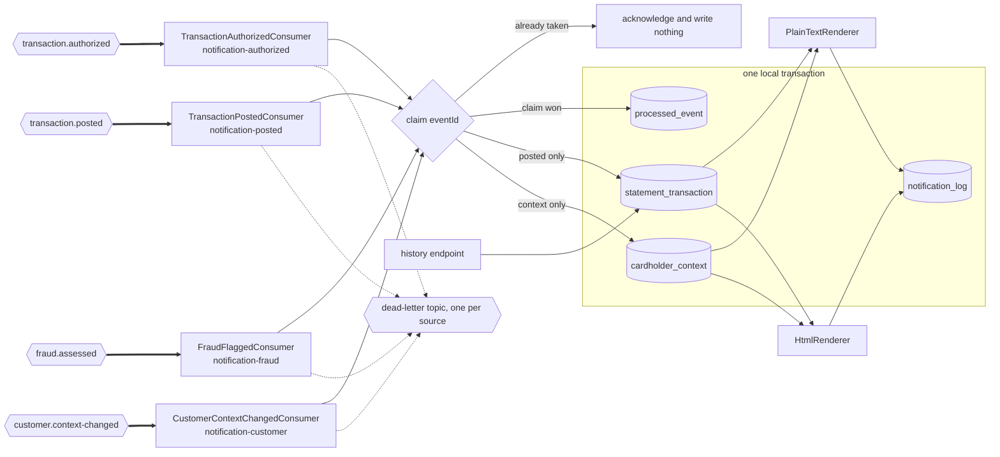

## Notification Service

- [Purpose](#purpose)
- [Source provenance](#source-provenance)
- [Domain context](#domain-context)
- [Events consumed](#events-consumed)
- [Architecture](#architecture)
- [Endpoints](#endpoints)
- [Domain and data ownership](#domain-and-data-ownership)
- [Renderers](#renderers)
- [Patterns](#patterns)
- [Pitfalls](#pitfalls)
- [Local run and tests](#local-run-and-tests)
- [How to extend](#how-to-extend)
- [Deliberate non-additions](#deliberate-non-additions)
- [Related documentation](#related-documentation)

<br/>

## Purpose

`notification-service` turns platform events into cardholder alerts. Four listeners feed its private tables, among them a transaction read model keyed by card. Two renderers build each alert, one in plain text and one in HyperText Markup Language (HTML), and one read-only endpoint returns the history held for a card. The module publishes no business event and calls no other service.

The module replaces only the customer-facing tail of statement generation. Full statement generation stays a scheduled batch process, which the requirements ask for directly: *"retain as scheduled/batch processes for now; do not force these into the event model."*

Java package root `com.carddemo.notification`. Maven artifact `notification-service`.

<br/>

## Source provenance

Every locator below was read in the source before it was written here.

| Contribution | Source | Verified locator |
| :--- | :--- | :--- |
| Text and markup rendering, plus per-card totalling | `app/cbl/CBSTM03A.CBL` | `01 STATEMENT-LINES.` at line 85; the text layout `ST-LINE0` through `ST-LINE15` spans lines 86–146; `01 HTML-LINES.` at line 148, with the markup carried as condition names on `HTML-FIXED-LN PIC X(100)` at line 149 |
| Running total, reset per card | `app/cbl/CBSTM03A.CBL` | `WS-TOTAL-AMT PIC S9(9)V99 VALUE 0` at line 65, declared under `01 COMP3-VARIABLES COMP-3.` at line 64; `MOVE ZERO TO WS-TOTAL-AMT` at line 325; `ADD TRNX-AMT TO WS-TOTAL-AMT` at line 429; moved through an edited field at lines 433 and 434 |
| The card-keyed read model layout | `app/cpy/COSTM01.CPY` | `01 TRNX-RECORD.` at line 20; `05 TRNX-KEY.` at line 21 holding `TRNX-CARD-NUM PIC X(16)` at line 22 and `TRNX-ID PIC X(16)` at line 23; `05 TRNX-REST.` at line 24 covering lines 25 through 35; a 20-byte `FILLER` at line 36 |
| The composite key, derived from the sort that builds the read model | `app/jcl/CREASTMT.JCL` | `KEYS(32 0)` at line 30; `RECORDSIZE(350 350)` at line 32; `EXEC PGM=SORT` at line 44; `SORT FIELDS=(263,16,CH,A,1,16,CH,A)` at line 53; `OUTREC FIELDS=(1:263,16,17:1,262,279:279,50)` at line 54; the copy into the keyed dataset at lines 56–61; the renderer step at line 79 |
| The repository interface shape | `app/cbl/CBSTM03B.CBL` | `01 LK-M03B-AREA.` at line 100 with the operation codes at lines 103–108; the four-dataset dispatch at lines 118–127 |
| The dead-letter metadata shape | `app/cpy/CSMSG02Y.cpy` | `01 ABEND-DATA.` at line 21: `ABEND-CODE PIC X(4)` line 22, `ABEND-CULPRIT PIC X(8)` line 24, `ABEND-REASON PIC X(50)` line 26, `ABEND-MSG PIC X(72)` line 28 |

The source names the re-keying itself. Line 42 of `app/jcl/CREASTMT.JCL` reads `CREATE COPY OF TRANSACT FILE WITH CARD NUMBER AND TRAN ID AS KEY`.

One provenance note matters to anyone tracing customer fields. `app/cbl/CBSTM03A.CBL` carries `COPY CUSTREC.` at line 55, so the statement program binds the `CUSTREC` fork of the customer layout. Four other programs bind `CVCUS01Y` instead, and the account service adopts `CVCUS01Y` as canonical. This module therefore takes customer data only from events, and assumes nothing about the account service's field naming. The fork itself is recorded in [business rule flags](../../docs/business-rule-flags.md).

<br/>

## Domain context

A cardholder statement lists the transactions posted against one card over a period. Alongside the list it carries the account balance, the cardholder's name and address, a credit score, and a total of the listed amounts.

The shape changed. The original job runs as batch work under Job Control Language (JCL) over Virtual Storage Access Method (VSAM) datasets. It renders one statement per card, walking the card cross-reference file. This module renders one alert per event, and keeps a per-card read model so a history query stays a single indexed read. Nothing here waits for a nightly window.

<br/>

## Events consumed

| Consumer | Topic | Consumer group | What it does |
| :--- | :--- | :--- | :--- |
| `TransactionAuthorizedConsumer` | `transaction.authorized` | `notification-authorized` | Renders an alert over the one transaction the event carries |
| `TransactionPostedConsumer` | `transaction.posted` | `notification-posted` | Upserts the statement row, then renders an alert over the card's rows |
| `FraudFlaggedConsumer` | `fraud.assessed` | `notification-fraud` | Renders a flagged alert, and acknowledges a cleared assessment |
| `CustomerContextChangedConsumer` | `customer.context-changed` | `notification-customer` | Refreshes the account-keyed name, address and credit-score context |

Four listeners hold four groups. Reading `transaction.authorized` under a group of its own is what makes this module an independent consumer of the authorization event, beside the ledger and the fraud detector.

`FraudFlagged` and `FraudCleared` share the `fraud.assessed` topic. The deserializer selects the record type from the envelope `eventType` field, so `FraudFlaggedConsumer` receives a typed object and routes on it. A listener written as though every message were a `FraudFlagged` mishandles half its traffic.

Two keys are in play, and they differ deliberately. The Kafka message key is the account identifier, which keeps one account's events in one partition and in order. The read model key is the card token plus the transaction identifier, and it comes from the sort at `app/jcl/CREASTMT.JCL:L53`.

**This module publishes no event. Events produced: none.** It writes only sanitized dead-letter records. The dead-letter base name is `carddemo.dead-letter` and the suffix is `.DLT`, so each source topic routes to its own dead-letter topic and the four wire shapes stay separate. A listener makes three delivery attempts, 1000 ms apart, before a record routes there.

<br/>

## Architecture

Figure 1 shows the four topics reaching four consumer groups, the duplicate claim they all pass through, and the private tables behind them. No arrow leaves the module carrying a business event, and no arrow reaches another service. Those two absences are the design. The paired platform-wide before-and-after views are in [architecture, before and after](../../docs/architecture-before-after.md).

**Figure 1 — Notification Service Data Flow: Four Topics, Four Consumer Groups, One Card-Keyed Read Model**


Legend for Figure 1:

- Hexagon: a Kafka topic.
- Thick arrow: an asynchronous consume from a topic. Every thick arrow is a decoupling point.
- Plain arrow: an in-process call, a read, or a write inside this module.
- Diamond: the duplicate claim against `processed_event`.
- Cylinder: a table in this module's private schema.
- Box labelled *one local transaction*: the marker and the domain rows commit together or not at all.
- Dotted arrow: the dead-letter route, taken only after the three delivery attempts are spent.
- No arrow carries an event out of the module, and none reaches another service.

<br/>

## Endpoints

One endpoint, served by `NotificationHistoryController`.

| Method and path | Query parameter | Returns |
| :--- | :--- | :--- |
| `GET /notifications/{cardToken}` | `pageSize`, optional, at least 1 | The card's transactions in ascending transaction-identifier order, with a count and a total |

`cardToken` is 64 lower-case hexadecimal characters. `pageSize` defaults to 50 and is capped at 200, which is the same ceiling a rendered alert carries. The response body holds `cardToken`, `cardNumber`, `transactionCount`, `totalAmount` and a `transactions` array. Each array item carries thirteen fields, one for every field of the layout at `app/cpy/COSTM01.CPY` except the dropped filler.

**The full card number never reaches a rendered alert, a log, or a response.** Masking runs through `PanMasker`, which keeps the last four digits and rewrites the other twelve. A response with no rows carries no card number at all. An empty history answers 200, and the route defines no 404 outcome, so a caller learns nothing about which cards exist.

The hand-written contract, including the 400, 401 and 403 outcomes and the HTTP basic identity the route requires, is in [openapi.yaml](src/main/resources/openapi.yaml). One call against the compose stack, with a card token you already hold:

```bash
curl -fsS -u user0001:"$USER_PASSWORD" \
  "http://localhost:8084/notifications/$CARD_TOKEN?pageSize=25"
```

<br/>

## Domain and data ownership

Four tables in the private schema `notification_service`, inside the database `carddemo_notification`.

| Table | Derivation |
| :--- | :--- |
| `statement_transaction` | `app/cpy/COSTM01.CPY` lines 20–36. **Composite primary key `(card_token, transaction_id)`**, derived from `KEYS(32 0)` at `app/jcl/CREASTMT.JCL` line 30. The 20-byte `FILLER` at `COSTM01.CPY` line 36 is dropped |
| `cardholder_context` | Account-keyed name, address and credit score, kept current by `CustomerContextChanged` |
| `notification_log` | New abstraction: one delivery attempt record per rendered alert |
| `processed_event` | Event identifier primary key, processed timestamp, and the topic the delivery arrived on |

The key derivation is arithmetic, not preference. `KEYS(32 0)` names a 32-byte key at offset zero, which is exactly `TRNX-CARD-NUM` at 16 bytes plus `TRNX-ID` at 16 bytes, the group `05 TRNX-KEY.` at `COSTM01.CPY` line 21. The sort at line 53 orders on the card number at offset 263 for sixteen bytes, then on the transaction identifier at offset 1 for sixteen bytes. Offset 263 is where `TRAN-CARD-NUM` sits in the 350-byte transaction record of `app/cpy/CVTRA05Y.cpy`, so the sort key follows the record layout.

`V1__schema.sql` therefore takes its key from `CREASTMT.JCL` line 30 rather than from the transaction file's own key. One substitution applies. The stored key column holds a card token, not the source's full Primary Account Number (PAN). The masked number beside it is display data, and no key or index reads it. The [traceability matrix](../../docs/traceability-matrix.md) records the re-keying, the dropped 20-byte filler, and the key's derivation from a sort step rather than a record layout.

`V2__seed.sql` seeds `cardholder_context` alone, one row per fixture account, each stamped at the Unix epoch so the first real `CustomerContextChanged` supersedes it. No fixture seeds `statement_transaction`: the read model is built by consuming events.

No table here is shared with another service, and this module reaches no other schema. Flyway owns every table, and Jakarta Persistence (JPA) runs with `ddl-auto: validate`, so a mapping that disagrees with the migrated schema stops start-up.

<br/>

## Renderers

`PlainTextRenderer` reproduces the 80-column text layout at `app/cbl/CBSTM03A.CBL` lines 86–146. Its parts, in the order they are written:

1. The opening banner: 31 asterisks, `START OF STATEMENT`, then 31 more asterisks.
2. The name line, then three address lines.
3. A rule of 80 hyphens.
4. A centred `Basic Details` banner.
5. The `Account ID`, `Current Balance` and `FICO Score` label lines.
6. A centred `TRANSACTION SUMMARY` banner, whose source literal pads to 20 characters with one trailing space.
7. The column header, then one detail line per transaction, then the total line.
8. The closing banner: 32 asterisks, `END OF STATEMENT`, then 32 more asterisks.

Two edit patterns put the sign after the digits. `ST-CURR-BAL` is `PIC 9(9).99-` at line 113, and both `ST-TRANAMT` at line 137 and `ST-TOTAL-TRAMT` at line 142 are `PIC Z(9).99-`, where the `Z` form suppresses leading zeros. Reproduce that formatting exactly; do not substitute a locale formatter.

`HtmlRenderer` reproduces the markup declared as condition names on `HTML-FIXED-LN PIC X(100)` from `app/cbl/CBSTM03A.CBL` line 149 onward. Those tag literals are content strings taken from the source. No styling framework and no component library takes part in producing them.

The running total resets per card, not per platform, following `MOVE ZERO TO WS-TOTAL-AMT` at line 325. `WS-TOTAL-AMT` is `PIC S9(9)V99`, so the total carries eleven digits at a scale of two. Every addition runs through `CobolDecimal`, which truncates toward zero.

Truncation is the platform-wide rule, and the evidence is a count. The `ROUNDED` phrase appears **zero** times across all 28 programs in `app/cbl`, so every arithmetic store in the source truncates. `RoundingMode.HALF_UP` is the reflexive Java choice and it is wrong here.

One rendering detail looks like a defect and is not. `TRNX-DESC` is `PIC X(100)` at `app/cpy/COSTM01.CPY` line 28, while the detail line's `ST-TRANDT` is `PIC X(49)` at line 135. The `MOVE` on line 677, inside `6000-WRITE-TRANS` at `app/cbl/CBSTM03A.CBL` line 675, therefore drops the tail of a long description. Both renderers reproduce that truncation.

<br/>

## Patterns

**Idempotent consumer, applied four times.** Each listener claims the envelope event identifier in `processed_event` with a single insert that does nothing on conflict, so two deliveries racing on one event cannot both proceed. The claim runs inside the transaction that carries the side effects, and the listener acknowledges only after that transaction commits. Kafka delivers at least once, and a redelivery follows a group rebalance, a restart mid-batch, or a crash after the writes but before the offset commit. The concrete consequence: a duplicate `TransactionPosted` must not add its amount to the per-card total twice.

**No outbox.** A module that publishes nothing needs none, and none is declared. Do not add one speculatively.

**Repository interfaces** follow the operation-code contract at `app/cbl/CBSTM03B.CBL` lines 100–112. `K`, a keyed read, becomes find by identifier; `R` becomes stream all; `W` becomes insert; `Z` becomes update. The `O` open and `C` close codes are dropped, because the framework owns connection lifecycle. That subroutine dispatches across `TRNXFILE`, `XREFFILE`, `CUSTFILE` and `ACCTFILE` at lines 118–127, and `TRNXFILE` is this module's read model.

**Money travels as a decimal string in every event payload, never as a JavaScript Object Notation (JSON) number.** Most parsers turn a JSON number into a double, which puts binary floating point back into a fixed-point system.

<br/>

## Pitfalls

1. **The language level fails silently.** `pom.xml` must declare `<java.version>25</java.version>`, because the Spring Boot parent defaults the language level and the compiler release to 17. A module that omits the override compiles cleanly at release 17 with no warning, so check the class-file major version is 69 rather than 61.
2. **Truncate, never round.** Every total runs through `CobolDecimal` with `RoundingMode.DOWN`. The `ROUNDED` phrase appears zero times across all 28 programs in `app/cbl`.
3. **The total resets per card.** `MOVE ZERO TO WS-TOTAL-AMT` at `app/cbl/CBSTM03A.CBL` line 325 runs once per card. A running platform-wide total is wrong.
4. **The trailing-sign edits are not a locale format.** `PIC 9(9).99-` and `PIC Z(9).99-` place the sign after the digits. A locale formatter puts it in front and pads differently.
5. **`fraud.assessed` carries two event types.** Route on the envelope `eventType` field. A consumer that assumes every message is a `FraudFlagged` mishandles `FraudCleared`.
6. **The two keys differ on purpose.** The Kafka message key is the account identifier; the read model key is the card token plus the transaction identifier. Confusing them breaks either partition ordering or the primary key.
7. **The wildcard hazard.** `app/cbl/CBSTM03A.CBL`, `app/cbl/CBSTM03B.CBL`, `app/cpy/COSTM01.CPY` and `app/jcl/CREASTMT.JCL` all break the lower-case extension convention, and a glob over lower-case extensions silently drops three of this module's four primary sources. Name source files explicitly, with their exact case.

Platform-wide pitfalls are in [onboarding](../../docs/onboarding.md) and are not repeated here.

<br/>

## Local run and tests

Prerequisites, pinned exactly:

1. OpenJDK 25, Eclipse Temurin build 25.0.4+7.
2. Apache Maven 3.9.16.
3. Docker with Compose v2.
4. Container images `apache/kafka:4.2.1` and `postgres:18.4`, both pinned by digest in `docker-compose.yml`.

The runtime contract:

| Setting | Value |
| :--- | :--- |
| Container port | 8080, published on host port 8084 as `NOTIFICATION_PORT` |
| Management port | 9080, published on host port 9084 as `NOTIFICATION_MANAGEMENT_PORT` |
| Database and schema | `carddemo_notification`, schema `notification_service` |
| Database login | `carddemo_notification_svc`, password from `NOTIFICATION_DB_PASSWORD` with no default |
| Kafka bootstrap | `kafka:29092` inside the compose network, `localhost:9092` from the host, in KRaft (Kafka Raft) mode |
| Broker identity | `carddemo-notification`, password from `NOTIFICATION_KAFKA_PASSWORD` with no default |
| Health check target | `http://localhost:9084/actuator/health` from the host |
| Actuator endpoints | `health`, `metrics`, `prometheus` |
| Metrics | `carddemo.notification.events.consumed`, `carddemo.notification.processing.latency`, `carddemo.notification.failures` |

The compose file sets these six properties, and each one overrides the shipped default: `SPRING_DATASOURCE_URL`, `SPRING_DATASOURCE_USERNAME`, `SPRING_DATASOURCE_PASSWORD`, `SPRING_JPA_PROPERTIES_HIBERNATE_DEFAULT_SCHEMA`, `SPRING_FLYWAY_SCHEMAS` and `SPRING_KAFKA_BOOTSTRAP_SERVERS`.

Run it from the `card-platform` directory. The `Dockerfile` copies the packaged Java archive (JAR) out of `target/`, so step 2 must finish before step 3.

```bash
# 1. Give every password a value. .env is ignored by git; .env.example documents each variable.
cp .env.example .env && "${EDITOR:-vi}" .env

# 2. Build this module and the two libraries it depends on, then run its tests.
mvn -B -pl services/notification-service -am verify

# 3. Start the stack and build this service's image from the archive step 2 produced.
docker compose up -d --build notification-service

# 4. Confirm the service is ready.
curl -fsS http://localhost:9084/actuator/health

# 5. Watch an alert being driven by a real event.
docker compose logs -f notification-service
```

Set `CLONE_INDEX`, `POSTGRES_PORT` and `KAFKA_PORT` when another copy of the stack already runs on the same machine.

<br/>

## How to extend

- Adding a consumer of an event this module already receives needs no change to any producer: give the listener its own consumer group and the same claim-inside-the-transaction rule.
- Adding a rendered format means adding a class beside `PlainTextRenderer` and `HtmlRenderer` that implements `NotificationRenderer`.

Setup depth lives in [onboarding](../../docs/onboarding.md), and follow-up work is listed in [suggested next tasks](../../docs/suggested-next-tasks.md).

<br/>

## Deliberate non-additions

Each item below is absent on purpose. Adding one back changes behaviour, widens scope, or breaks a guarantee this module claims.

- No full statement generation.
- No query against the ledger, account or card service.
- No outbox and no published business event.
- No cache or key-value store.
- No electronic mail or short-message gateway.
- No user interface, component library or styling framework.
- No documentation generator; the contract in `openapi.yaml` is hand-written.
- No boilerplate generator and no object-mapping framework.
- No COBOL compiler, emulator or mainframe connector.

<br/>

## Related documentation

- [Platform README](../../README.md)
- [Decision log](../../docs/decision-log.md), the single home for why each choice was made
- [Event flow](../../docs/event-flow.md)
- [Data model](../../docs/data-model.md)
- [Equivalence results](../../docs/equivalence-results.md)
