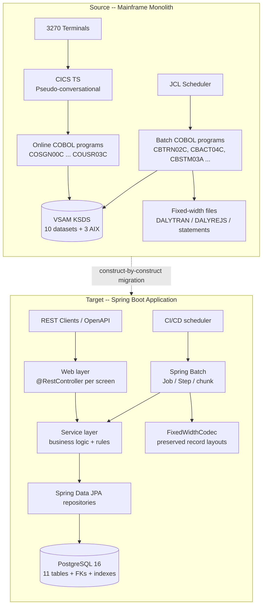
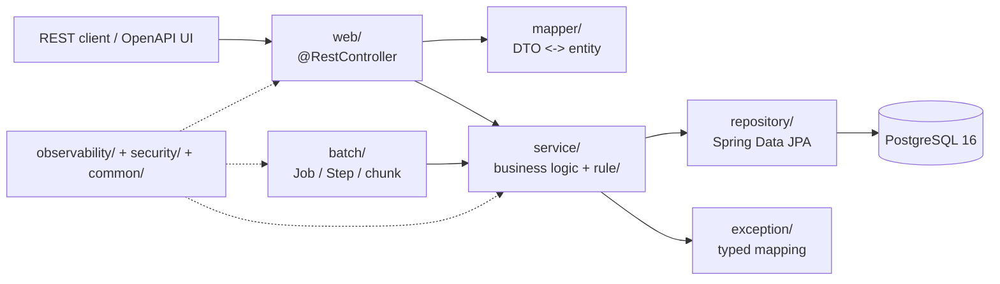

# CardDemo Target Architecture

This document describes the **target architecture** of the Java/Spring Boot re-platforming of the
AWS CardDemo mainframe credit-card management system. CardDemo is an AWS-published mainframe
modernization sample originally implemented in COBOL, CICS, VSAM, and JCL; this migration
re-expresses it as a layered **Spring Boot 3.5.16 modular monolith on Java 25 (LTS)** while
preserving **100% of the existing business behavior and introducing no new business features**.

The migration is performed **construct-by-construct** — each COBOL program, copybook, BMS map, and
JCL job is faithfully reconstructed as an idiomatic Java/Spring equivalent (not an automated
line-for-line transpilation), and every observable contract (screen field, PF-key path, batch reject
code, file record layout, return code, and monetary computation) is preserved exactly, save for a
small set of intentional, documented divergences recorded in the decision log (most notably the
interest rounding standardized on `HALF_UP`, D31). The original COBOL source is retained **read-only
under `legacy/`** (formerly `app/`) for reference; it is never modified.

This file is the authoritative **architectural map** of the migration. It describes the *what* and
*how* of the target design. The *why* behind each non-trivial decision lives in
[`./decision-log.md`](./decision-log.md), and the exhaustive per-paragraph source-to-target mapping
lives in [`./traceability-matrix.md`](./traceability-matrix.md); this document deliberately avoids
duplicating that content to prevent drift.

## Migration Thesis

The re-platforming is a tech-stack migration across three axes simultaneously — **language**
(COBOL → Java), **platform** (CICS/LE/JCL → Spring Boot / Spring Batch), and **data store**
(VSAM KSDS → PostgreSQL relational). Concretely, the transformation follows these rules:

- **CICS online transaction monitor → Spring MVC web layer.** Each pseudo-conversational online
  program becomes a `@RestController`; the 3270 screens are re-expressed as REST request/response
  DTOs preserving field names, lengths, types, edit rules, and PF-key semantics — **not** rendered
  as a new web UI (no feature expansion).
- **JCL batch scheduler → Spring Batch.** Each batch job becomes a Spring Batch `Job`/`Step`;
  job scheduling moves to the CI/CD workflow (`.github/workflows/ci.yml`).
- **VSAM KSDS indexed files → PostgreSQL 16 via Spring Data JPA.** Record-at-a-time indexed file
  access becomes set-based relational access through JPA entities and Spring Data repositories.
- **COBOL program/paragraph control flow → a layered service model.** Paragraphs and sections
  become cohesive service/component methods that preserve control flow and evaluation order.
- **Language Environment (LE) runtime services → the JVM and `java.time`.** LE date intrinsics
  (e.g. `CEEDAYS`) become `java.time`; LE abends become controlled Java exceptions / batch failures.
- **Every monetary computation uses exact `BigDecimal` arithmetic.** All decimal/monetary values use
  `java.math.BigDecimal` at **scale 2** with **`RoundingMode.HALF_UP`**; `double`/`float` are
  **prohibited** for decimal values. The `HALF_UP` standard (AAP §0.4.2) diverges from the legacy
  interest `COMPUTE`, which truncates — an intentional, documented divergence (D31).

Foundational constraints that shape every layer of the target:

- **Runtime & build:** Java 25 (LTS), Spring Boot 3.5.16 (the final stable 3.x line, supporting Java
  17–25), Maven 3.9+ via the `./mvnw` wrapper, `jar` packaging, root package `com.aws.carddemo`.
- **Jakarta namespace only** (`jakarta.*`) — never `javax.*` (Spring Boot 3.x).
- **No hardcoded credentials** — every secret and connection string resolves from environment
  variables; all documented commands use env-var placeholders (e.g. `${DB_URL}`, `${DB_USERNAME}`,
  `${DB_PASSWORD}`).
- **Constructor dependency injection only** (no field `@Autowired`); **no wildcard imports**.
- **No feature expansion** — scope is frozen to the existing COBOL capability. External MQ
  integration is a roadmap item only and is **out of scope** (it is not implemented).

## Source-to-Target Architecture Mapping

The source system is a mainframe monolith with two execution surfaces — a CICS online surface and a
JCL batch surface — sharing a single VSAM data tier. The target is a single Spring Boot application
with a web surface and a Spring Batch surface sharing a PostgreSQL data tier through a common service
layer. The diagram below contrasts the two.



### Construct Transformation Rules

The following mapping contract is applied uniformly across all 28 COBOL programs. Each COBOL /
mainframe construct maps to a specific Java / Spring construct under an explicit preservation rule.

| COBOL / Mainframe Construct | Target Java / Spring Construct | Preservation Rule |
|-----------------------------|--------------------------------|-------------------|
| DATA DIVISION record (copybook) | POJO / JPA entity / DTO | Decimal fields → `BigDecimal`; no floating point |
| PARAGRAPH / SECTION | Service or component method | Preserve control flow and evaluation order |
| COPY / REPLACE | Shared DTO / shared class | One shared type imported across consumers |
| FILE SECTION (VSAM) | Spring Data repository / file-I/O service | Record layouts and key semantics preserved |
| SORT / MERGE | Java sort (`Comparator`) / sorted query | Identical key ordering |
| CALL (static/dynamic) | Method invocation / injected Spring bean | Data-passing semantics preserved |
| JCL job | Spring Batch Job/Step + CI/CD | Step ordering, dependencies, return codes |
| FILE STATUS / CICS RESP | Mapped, typed exception | Caller-visible outcomes preserved |
| CICS COMMAREA + XCTL | Flow/session context + controller navigation | Screen-entry and navigation behavior preserved |
| COMP-3 packed decimal | `BigDecimal` scale 2 + `RoundingMode` | Bit-exact rounding parity |

## Layered Runtime and Package Structure

At runtime the application is organized into clean layers. A REST client (or the OpenAPI UI) calls
the web layer; controllers delegate to the service layer through hand-written mappers; services
apply business rules and access data through Spring Data JPA repositories over PostgreSQL. The batch
surface reuses the same service layer. Exception translation, observability, security, and shared
utilities are cross-cutting concerns that feed into the web, service, and batch layers.



### Package-by-Layer Organization

All classes reside under the root package `com.aws.carddemo` in a **package-by-layer** arrangement
that mirrors the cohesion of the COBOL monolith while introducing clean layer boundaries. Each
package has a single, well-defined responsibility:

- **`config`** — Spring configuration classes: `DataSourceConfig`, `BatchConfig`, `OpenApiConfig`,
  `ObservabilityConfig`, `SecurityConfig`, `JacksonConfig`. Wires beans and framework integration.
- **`domain`** — JPA entities derived from copybook record layouts: `Customer`, `Account`, `Card`,
  `CardXref`, `Transaction`, `UserSecurity`, `TransactionType`, `TransactionCategory`,
  `DisclosureGroup`, `TransactionCategoryBalance`, `DailyTransaction`.
- **`domain.type`** — the `Money` value object: a `BigDecimal`-backed type at scale 2 with
  `RoundingMode.HALF_UP` that centralizes all monetary arithmetic.
- **`repository`** — one Spring Data JPA repository per entity; abstracts all data access and
  replaces COBOL VSAM file I/O and CICS file control. Browse patterns become paged/sorted queries.
- **`dto`** — request/response DTOs, one pair per BMS screen, derived from the BMS symbolic
  copybooks; preserve field names, lengths, PIC-derived types, and edit rules.
- **`mapper`** — hand-written entity ↔ DTO mappers; explicit field-by-field mapping keeps
  field-level traceability visible.
- **`web`** — one `@RestController` per online program (**17 controllers**); the REST surface that
  replaces the CICS online transactions.
- **`service`** — business logic extracted from COBOL paragraphs/sections into cohesive services,
  preserving evaluation order.
- **`service.rule`** — discrete validation rule components (Strategy pattern); each COBOL
  edit/validation paragraph becomes one rule component.
- **`batch`** — Spring Batch job configurations, with `reader`/`processor`/`writer` subpackages
  holding chunk-oriented components that preserve the fixed-width record contracts.
- **`exception`** — the typed exception model: `FileStatusException` hierarchy, `RejectCode` enum,
  `GlobalExceptionHandler`, and `CicsRespMapper`.
- **`observability`** — `CorrelationIdFilter` and tracing configuration for structured logging and
  distributed tracing.
- **`security`** — a `UserDetailsService` over the `user_security` table and role mapping.
- **`common.util`** — shared utilities: `DateUtils`, `IdGenerator`, and `FixedWidthCodec`.

A **multi-module Maven build was considered** but a **single-module modular monolith** was chosen so
that each deliverable stays small and independently reviewable; the rationale is recorded in
[`./decision-log.md`](./decision-log.md).

### Target Project Structure (trimmed)

```
carddemo-java/
├── pom.xml
├── mvnw  /  mvnw.cmd  /  .mvn/
├── Dockerfile
├── docker-compose.yml            # PostgreSQL 16 + Prometheus + Tempo + Grafana (local observability)
├── .github/workflows/ci.yml      # build + test + JaCoCo + OWASP dependency-check (JCL scheduling equivalent)
├── src/main/java/com/aws/carddemo/
│   ├── CardDemoApplication.java
│   ├── config/                   # DataSourceConfig, BatchConfig, OpenApiConfig, ObservabilityConfig, SecurityConfig, JacksonConfig
│   ├── domain/                   # JPA entities (Customer, Account, Card, CardXref, Transaction, ...)
│   │   └── type/                 # Money value object (BigDecimal, scale 2)
│   ├── repository/               # Spring Data JPA repositories (one per entity)
│   ├── dto/                      # request/response DTOs (one pair per BMS screen)
│   ├── mapper/                   # hand-written entity <-> DTO mappers
│   ├── web/                      # @RestController per online program (17 controllers)
│   ├── service/                  # business logic services (per program/paragraph set)
│   │   └── rule/                 # validation rule components (COBOL edit paragraphs)
│   ├── batch/                    # Spring Batch job configs
│   │   ├── reader/  processor/  writer/   # chunk-oriented components, fixed-width layouts
│   ├── exception/                # FileStatusException hierarchy, RejectCode enum, GlobalExceptionHandler, CicsRespMapper
│   ├── observability/            # CorrelationIdFilter, tracing config
│   ├── security/                 # UserDetailsService over user_security, role mapping
│   └── common/util/              # DateUtils, IdGenerator, FixedWidthCodec
├── src/main/resources/
│   ├── application.yml  /  application-local.yml
│   ├── logback-spring.xml
│   ├── db/migration/             # Flyway: V1__schema.sql, V2__reference_data.sql (planned), ...
│   ├── db/seed/                  # seed CSVs derived from legacy/data/ASCII
│   └── static/openapi/
├── src/test/java/com/aws/carddemo/   # unit + integration (Testcontainers PostgreSQL)
├── src/test/resources/
├── docs/
│   ├── architecture.md           # (this document)
│   ├── decision-log.md
│   ├── traceability-matrix.md
│   ├── onboarding/               # getting-started.md, domain-context.md, extending.md, pitfalls.md
│   └── observability/grafana-dashboard.json
├── blitzy-deck/
│   └── executive-summary.html    # self-contained reveal.js deck (theme inlined)
└── legacy/                        # entire relocated COBOL source (former app/**)
```

## Data Tier: VSAM KSDS to PostgreSQL 16

This is the single most consequential structural transformation in the migration: the storage
paradigm changes from **record-at-a-time indexed VSAM files** to **set-based relational access**,
while preserving every field's name, type, length, and semantics. The mapping rules are mechanical
and uniform:

- Each VSAM KSDS dataset → a PostgreSQL **table**.
- Each dataset's unique key → the table's **primary key** (single or compound).
- Each VSAM **alternate index (AIX)** → an ordinary **B-tree index**.
- Each relationship previously enforced only in application code **whose parent key is genuinely
  unique** → a real **foreign-key constraint**. One relationship that *cannot* be expressed as a
  single-column foreign key — `account.group_id` → `disclosure_group` — is instead modeled as a plain
  grouping attribute (see [Alternate Indexes and Referential Integrity](#alternate-indexes-and-referential-integrity)
  and decision **D8**).
- Each `COMP-3` packed-decimal (monetary) field → a `DECIMAL(x,2)` column, mapped to `BigDecimal`.

The schema is created by **Flyway** migrations: `V1__schema.sql` builds the eleven tables (ten core
plus one staging), their five indexes (three AIX-derived plus two supporting), and the foreign-key
constraints; the planned `V2__reference_data.sql` (reference data is currently loaded from
`db/seed/**`) loads the reference data (types, categories, disclosure groups). Seed rows are derived from the **fixed-width, headerless** ASCII files
under `legacy/data/ASCII/**` (formerly `app/data/ASCII`) — parsed by **fixed column positions** per the
governing copybook, not as CSV/delimited — and materialized as seed CSVs under
`src/main/resources/db/seed/`. Each file's record width equals its copybook record length
(`custdata` 500, `acctdata` 300, `carddata` 150, `cardxref` 36-visible/50-with-filler, `dailytran` 350,
`discgrp` 50, `tcatbal` 50, `trancatg` 60, `trantype` 60), with space-padded alphanumeric and
zero-padded numeric fields; there is no `usrsec.txt`, so `user_security` seeds from the EBCDIC `USRSEC`
dataset.

### Dataset-to-Table Mapping

| VSAM Dataset | PostgreSQL Table | Primary Key | Indexes / Foreign Keys | Source Copybook |
|--------------|------------------|-------------|------------------------|-----------------|
| CUSTDATA.VSAM.KSDS | `customer` | `cust_id` | — | `legacy/cpy/CVCUS01Y.cpy` |
| ACCTDATA.VSAM.KSDS | `account` | `acct_id` | `group_id` = grouping attribute (**no FK** — `disclosure_group` PK is composite; see note) | `legacy/cpy/CVACT01Y.cpy` |
| CARDDATA.VSAM.KSDS | `card` | `card_num` | index `acct_id` (=CARDDATA.VSAM.AIX); FK `acct_id` | `legacy/cpy/CVACT02Y.cpy` |
| CARDXREF.VSAM.KSDS | `card_xref` | `xref_card_num` | index `acct_id` (=CARDXREF.VSAM.AIX); FK `cust_id`, `acct_id` | `legacy/cpy/CVACT03Y.cpy` |
| TRANSACT.VSAM.KSDS | `transaction` | `tran_id` | index `proc_ts` (=TRANSACT.VSAM.AIX, `AXRKP=304`); FK `card_num`, `type_cd`, composite (`type_cd`,`cat_cd`)→`transaction_category` | `legacy/cpy/CVTRA05Y.cpy` |
| USRSEC.VSAM.KSDS | `user_security` | `sec_usr_id` | — | `legacy/cpy/CSUSR01Y.cpy` |
| TRANTYPE (reference) | `transaction_type` | `type_cd` | — | `legacy/cpy/CVTRA03Y.cpy` |
| TRANCATG (reference) | `transaction_category` | (`type_cd`,`cat_cd`) | — | `legacy/cpy/CVTRA04Y.cpy` |
| DISCGRP (reference) | `disclosure_group` | (`group_id`,`type_cd`,`cat_cd`) | `int_rate DECIMAL(6,2)` | `legacy/cpy/CVTRA02Y.cpy` |
| TCATBALF (reference) | `tran_cat_balance` | (`acct_id`,`type_cd`,`cat_cd`) | `bal DECIMAL(11,2)` | `legacy/cpy/CVTRA01Y.cpy` |
| DALYTRAN (staging) | `daily_transaction` | staging key | — | `legacy/cpy/CVTRA06Y.cpy` |

### Alternate Indexes and Referential Integrity

The **three alternate indexes** become ordinary B-tree indexes that formalize the browse patterns
they previously supported: **card → account** lookups (`card.acct_id`), **cross-reference → account**
lookups (`card_xref.acct_id`), and **chronological transaction retrieval** (`transaction.proc_ts`).
The chronological index is keyed on the **processing** timestamp, not the origination timestamp: the
transaction record (`CVTRA05Y`) carries two 26-character timestamps — `TRAN-ORIG-TS` at offset 278 and
`TRAN-PROC-TS` at offset 304 — and the VSAM catalog (`legacy/catlg/LISTCAT.txt`) shows
`TRANSACT.VSAM.AIX` with `KEYLEN=26` at `AXRKP=304`, i.e. `TRAN-PROC-TS` → the `proc_ts` column. All
"list transactions" queries therefore order by `proc_ts`.

Because the relationships between customers, accounts, cards, cross-references, and transactions were
previously enforced only in application logic, expressing them as **real foreign-key constraints** —
**where the parent key is genuinely unique** — is a **documented improvement rather than a behavior
change**; see [`./decision-log.md`](./decision-log.md).

**One relationship is deliberately *not* a foreign key.** `account.group_id` cannot reference
`disclosure_group`, because `disclosure_group` has a **composite** primary key
(`group_id`, `type_cd`, `cat_cd`) and a group id **alone is not unique**. Rather than invent a
synthetic single-column parent the legacy never had, `account.group_id` is kept as a **plain grouping
attribute**, and the applicable disclosure/interest row is resolved with a composite
`(group_id, type_cd, cat_cd)` lookup at the application layer — exactly the access path the COBOL
interest program (`CBACT04C`) used against the `DISCGRP` file. This source-faithful deviation is
recorded in decision **D8** of [`./decision-log.md`](./decision-log.md). Consequently the
`transaction → transaction_category` reference is likewise a **composite** foreign key
(`type_cd`, `cat_cd`), matching `transaction_category`'s compound primary key.

### Concurrency: Read-Update-Rewrite

The COBOL online flow performs a READ-UPDATE-REWRITE cycle on account and category-balance records.
In the target, a JPA **`@Version` optimistic-locking column** reproduces the last-writer integrity of
that cycle within a `@Transactional` boundary. This locking behavior is introduced as an intentional
integrity improvement and is documented as such in [`./decision-log.md`](./decision-log.md) so it is
not mistaken for a behavioral regression.

## Online Layer: CICS to REST

Each of the **17 online BMS screens** maps to a triple: a `@RestController` (from the online COBOL
program), a **request/response DTO pair** (from the BMS symbolic copybook), and a **service** that
holds the program's business paragraphs. The controllers, their CICS transaction IDs, and their
source programs are:

| Transaction | Source Program | Controller |
|-------------|----------------|------------|
| CC00 | `legacy/cbl/COSGN00C.cbl` | `SignonController` |
| CM00 | `legacy/cbl/COMEN01C.cbl` | `MainMenuController` |
| CA00 | `legacy/cbl/COADM01C.cbl` | `AdminMenuController` |
| CAVW | `legacy/cbl/COACTVWC.cbl` | `AccountViewController` |
| CAUP | `legacy/cbl/COACTUPC.cbl` | `AccountUpdateController` |
| CCLI | `legacy/cbl/COCRDLIC.cbl` | `CardListController` |
| CCDL | `legacy/cbl/COCRDSLC.cbl` | `CardViewController` |
| CCUP | `legacy/cbl/COCRDUPC.cbl` | `CardUpdateController` |
| CT00 | `legacy/cbl/COTRN00C.cbl` | `TransactionListController` |
| CT01 | `legacy/cbl/COTRN01C.cbl` | `TransactionViewController` |
| CT02 | `legacy/cbl/COTRN02C.cbl` | `TransactionAddController` |
| CR00 | `legacy/cbl/CORPT00C.cbl` | `TransactionReportController` |
| CB00 | `legacy/cbl/COBIL00C.cbl` | `BillPaymentController` |
| CU00 | `legacy/cbl/COUSR00C.cbl` | `UserListController` |
| CU01 | `legacy/cbl/COUSR01C.cbl` | `UserAddController` |
| CU02 | `legacy/cbl/COUSR02C.cbl` | `UserUpdateController` |
| CU03 | `legacy/cbl/COUSR03C.cbl` | `UserDeleteController` |

The full paragraph-level mapping for each program is maintained in
[`./traceability-matrix.md`](./traceability-matrix.md).

### Pseudo-Conversational Translation

The CICS pseudo-conversational model has no direct HTTP analog, so it is translated to explicit
server-side flow state without changing screen-entry behavior. In the source, each online program
terminates with `EXEC CICS RETURN TRANSID(...) COMMAREA(...)`, receives its map with
`EXEC CICS RECEIVE`, sends with `EXEC CICS SEND`, and transfers control with `EXEC CICS XCTL`; all
state is carried in the `CARDDEMO-COMMAREA` (from `legacy/cpy/COCOM01Y.cpy`), which holds the
from/to transaction and program navigation context plus user identity and type. The target maps this
as follows:

- **`CARDDEMO-COMMAREA` → explicit server-side flow/session context.** The navigation context
  (from/to transaction and program) becomes flow state the controllers manage explicitly.
- **`XCTL` → controller navigation.** A transfer of control becomes a controller returning the next
  screen's DTO together with a logical view id.
- **`RETURN TRANSID` re-entry → a stateless POST per screen submit.** Each screen submission is an
  independent request.
- **`CDEMO-PGM-CONTEXT` first-time-vs-re-entry flag → an explicit model field.** The enter (`0`)
  versus re-enter (`1`) toggle is modeled explicitly in every controller/service so screen
  initialization behavior is preserved.
- **PF-key semantics → explicit action fields/enums.** `PF3` = back, `PF7`/`PF8` = page, `Enter` =
  submit (per `legacy/cpy/CSSTRPFY.cpy`) become explicit action fields — never a rendered terminal.

### Field Contracts, Validation, and Authentication

Each request/response DTO **preserves the field names, maximum lengths, PIC-derived types, and edit
rules** of its BMS map. Input validation is applied through Bean Validation together with discrete
rule components under `service/rule/` (Strategy pattern), where **each COBOL edit/validation
paragraph becomes one rule component** — dropping a field-level edit or a PF-key path would be a
behavior regression, so each is tracked one-to-one in the traceability matrix.

**Authentication parity** is preserved through a Spring Security `UserDetailsService` over the
`user_security` table: the user-type condition names from `legacy/cpy/COCOM01Y.cpy` map role
**`A` = Admin** and **`U` = User** to `ADMIN`/`USER` authorities. Credentials are externalized (no
hardcoded secrets); password hashing is introduced as a documented security improvement (see
[`./decision-log.md`](./decision-log.md)) and the card CVV is never logged or returned in full.

## Batch Layer: JCL to Spring Batch

Each JCL-triggered batch program becomes a Spring Batch **`Job`** composed of one or more
**chunk-oriented `Step`s**, each built from an `ItemReader`, `ItemProcessor`, and `ItemWriter` that
reproduce sequential processing with restartability. The orchestration semantics map as follows:

- **Job-to-job DD dependencies → step/flow ordering** within (or across) jobs.
- **SORT / MERGE utilities → a Java `Comparator` or an `ORDER BY` query** with identical key ordering.
- **GDG-based backups → a scheduled database-backup step.**
- **Job scheduling → the CI/CD workflow** (`.github/workflows/ci.yml`) — there is no in-application
  cron scheduler.

### Job Mapping

| Spring Batch Job | Source Program(s) | JCL Trigger |
|------------------|-------------------|-------------|
| `DailyTransactionValidateJob` | CBTRN01C | (daily validate) |
| `DailyTransactionPostingJob` | CBTRN02C | `POSTTRAN.jcl` |
| `InterestCalculationJob` | CBACT04C | `INTCALC.jcl` |
| `StatementGenerationJob` | CBSTM03A.CBL + CBSTM03B.CBL | `CREASTMT.JCL` (uppercase; the only uppercase `.JCL`) |
| `TransactionReportJob` | CBTRN03C | `TRANREPT.prc` |
| `AccountMasterPrintJob` | CBACT01C | (master print) |
| `CardMasterPrintJob` | CBACT02C | (master print) |
| `XrefPrintJob` | CBACT03C | (master print) |
| `CustomerMasterPrintJob` | CBCUS01C | (master print) |
| `TransactionCombineJob` | COMBTRAN (SORT) | `COMBTRAN` |
| `TransactionBackupJob` | TRANBKP (IDCAMS REPRO) | `TRANBKP` |

### Preserved-Computation Anchors

Two computations in the batch layer carry the highest parity risk and are reproduced with exact
`BigDecimal` arithmetic (the interest rounding is standardized on `HALF_UP` per AAP §0.4.2 — an
intentional, documented divergence from the legacy truncation, D31); both are asserted by golden-file
tests and tracked in [`./traceability-matrix.md`](./traceability-matrix.md), with rationale in
[`./decision-log.md`](./decision-log.md).

1. **Interest calculation** — the `1300-COMPUTE-INTEREST` paragraph of `legacy/cbl/CBACT04C.cbl`
   computes `WS-MONTHLY-INT = (TRAN-CAT-BAL * DIS-INT-RATE) / 1200`. This is reproduced with
   `BigDecimal` at scale 2 and `RoundingMode.HALF_UP`:

   ```java
   monthlyInterest = tranCatBal.multiply(intRate)
                               .divide(BigDecimal.valueOf(1200), 2, RoundingMode.HALF_UP);
   ```

2. **Posting reject codes** — the four-stage validation in `legacy/cbl/CBTRN02C.cbl` writes a reason
   code to the reject file. The target uses a `RejectCode` enum `{100, 101, 102, 103}` and a
   `PostingService` that reproduces the **exact validation order** and short-circuit behavior, because
   reordering the validations would change which code a record receives:

   | Reject Code | Trigger Condition |
   |-------------|-------------------|
   | 100 | Cross-reference / card number not found |
   | 101 | Account not found |
   | 102 | Over credit limit (`ACCT-CREDIT-LIMIT >= WS-TEMP-BAL` fails) |
   | 103 | Transaction received after account expiration |

Valid records are posted to the `transaction` table and update balances; invalid records are written
to the reject file with a running count, and the reject writer preserves the fixed-width record
layout (see [External File Contracts](#external-file-contracts)).

## Design Patterns, Cross-Cutting Concerns, and Exception Model

### Design Patterns

The target applies a small, consistent set of patterns across all layers:

- **Repository pattern** — Spring Data JPA repositories abstract all data access, replacing COBOL
  VSAM file I/O and CICS file control.
- **Service layer** — business logic extracted from COBOL paragraphs/sections into cohesive services
  that preserve evaluation order.
- **Constructor dependency injection** — replaces static/dynamic `CALL` linkage; no field injection.
- **DTO + hand-written mapper** — BMS symbolic copybooks become request/response DTOs; explicit
  mappers keep field-level traceability visible (the hand-written-vs-MapStruct choice is recorded in
  [`./decision-log.md`](./decision-log.md)).
- **Chunk-oriented Spring Batch** — `ItemReader`/`ItemProcessor`/`ItemWriter` reproduce sequential
  batch processing with restartability.
- **Strategy for validation rules** — each COBOL edit/validation paragraph becomes a discrete rule
  component under `service/rule/`.
- **Exception translation** — COBOL `FILE STATUS` / CICS `RESP` / reject codes map to a typed
  exception hierarchy surfaced as HTTP status codes (online) or batch return codes (0/4/8).
- **Money value object** — a `BigDecimal`-backed type at scale 2 with `RoundingMode.HALF_UP`
  centralizes monetary arithmetic.
- **Optimistic locking** — a JPA `@Version` column reproduces the integrity of the COBOL
  READ-UPDATE-REWRITE cycle.

### Exception Model

Caller-visible outcomes are preserved through a typed exception hierarchy. COBOL programs inspect
`FILE STATUS` codes (`'00'` success, `'22'` duplicate, `'23'` not-found, `'10'` end-of-file) and
CICS `RESP`/`RESP2` values; the target maps these as follows:

- A **`FileStatusException`** hierarchy models the file-status outcomes.
- A **`RejectCode`** enum models the batch posting reject reasons `{100, 101, 102, 103}`.
- A **`CicsRespMapper`** translates CICS `RESP`/`RESP2` outcomes.
- A **`GlobalExceptionHandler`** maps these to **HTTP status codes** on the online surface and to
  **batch return codes `0`/`4`/`8`** on the batch surface, preserving the caller-visible outcome in
  each context.

### Cross-Cutting Concerns

**Observability** (`observability/` + `config/ObservabilityConfig`). The application is **designed to
ship** with structured **Logback** logs carrying **correlation IDs** injected by a
`CorrelationIdFilter`, **distributed tracing** via **Micrometer + OpenTelemetry** exported over
**OTLP** to Tempo, **Prometheus** metrics exposed through Spring Boot Actuator at
`/actuator/prometheus`, and **health/readiness** checks at `/actuator/health` and
`/actuator/health/readiness`. A Grafana dashboard **template** at
[`./observability/grafana-dashboard.json`](./observability/grafana-dashboard.json) is provided for the
Docker Compose observability stack. **Delivery status:** the observability configuration and the
dashboard template are present, and the application **runs against the local Docker Compose stack
today** — the Actuator health/readiness and Prometheus endpoints respond locally, and Logback emits
correlation IDs on every request and batch execution. Exhaustive validation of the full signal pipeline
(end-to-end correlation-id propagation, traces landing in Tempo, and Grafana dashboard rendering) is
owned by the observability workstream and tracked as a next task. See
[`./onboarding/getting-started.md`](./onboarding/getting-started.md) and
[`./decision-log.md`](./decision-log.md) (decision **D23**) for the detail.

**Security** (`security/` + `config/SecurityConfig`). A `UserDetailsService` over the `user_security`
table authenticates users and maps role **`A` → ADMIN** and **`U` → USER**. All credentials are
externalized via environment variables — there are **no hardcoded secrets**. The card **CVV is never
logged or returned in full**, and passwords are never logged; **password hashing** is introduced as a
documented security improvement (see [`./decision-log.md`](./decision-log.md)).

**Shared utilities** (`common.util`). `DateUtils` re-expresses the LE date intrinsics (e.g.
`CEEDAYS`) and copybook date helpers as `java.time`; `IdGenerator` reproduces the `TRAN-ID`
increment-from-max parity used by transaction add; `FixedWidthCodec` reads and writes the external
fixed-width file contracts.

### External File Contracts

The real external contracts are **fixed-width record layouts** — the daily-transaction input, the
reject output, and the statement/report outputs. These are preserved via the `FixedWidthCodec`
together with Spring Batch `FlatFileItemReader`/`FlatFileItemWriter`, holding exact column positions
and lengths. Native PostgreSQL storage replaces the legacy on-disk EBCDIC/`COMP-3` encoding, but the
external file **layout** is preserved so downstream file exchange is byte/semantically identical.
(External MQ integration remains a roadmap item and is **not** implemented.)

## Technology Stack

| Concern | Technology | Notes |
|---------|------------|-------|
| Language / runtime | Java 25 (LTS) | General availability September 2025 |
| Framework | Spring Boot 3.5.16 | Final stable 3.x line; supports Java 17–25 |
| Web | `spring-boot-starter-web` | REST controllers (online CICS programs) |
| Persistence | `spring-boot-starter-data-jpa` + PostgreSQL 16 | Repositories over PostgreSQL (VSAM file access) |
| Batch | `spring-boot-starter-batch` | Batch jobs (JCL/batch programs) |
| Security | `spring-boot-starter-security` | Authentication (USRSEC / role model) |
| Validation | `spring-boot-starter-validation` | Bean Validation (COBOL edit paragraphs) |
| Schema migration | Flyway (`flyway-core` + `flyway-database-postgresql`) | `V1__schema.sql`, `V2__reference_data.sql` (planned), ... |
| API docs | springdoc-openapi 2.8.17 | OpenAPI 3 / Swagger UI (targets Spring Boot 3.x) |
| Metrics / health | `spring-boot-starter-actuator` + Micrometer Prometheus registry | `/actuator/prometheus`, health/readiness |
| Tracing | Micrometer tracing bridge (OTel) + OTLP exporter | Distributed tracing over OTLP |
| Logging | Logback | Structured logs with correlation IDs |
| Build | Apache Maven 3.9+ via `./mvnw` wrapper | `jar` packaging |
| Testing | `spring-boot-starter-test` (JUnit 5, Mockito, AssertJ) + Testcontainers (PostgreSQL) | Unit + integration tests |
| Coverage gate | JaCoCo | ≥80% line-coverage gate |
| Security scan | OWASP `dependency-check-maven` 12.2.2 | `failBuildOnCVSS` enforces zero critical/high CVEs |

All monetary values use `java.math.BigDecimal` at scale 2 with `RoundingMode.HALF_UP`; `double` and
`float` are prohibited for decimal values. Only the Jakarta namespace (`jakarta.*`) is used; wildcard
imports are not permitted.

## Build and Run

All configuration — including the datasource URL, username, and password — resolves from environment
variables; **no credentials are hardcoded**. The commands below use env-var placeholders.

> **Checkpoint status.** This section describes the build-and-run flow, and it is **runnable now** on
> the provisioned toolchain: the repository contains the application modules (`src/**`), the
> `mvnw`/`mvnw.cmd` wrapper, `docker-compose.yml`, the `Dockerfile`, and the CI workflow, in addition to
> the build manifest (`pom.xml`) and this documentation. The commands below (`./mvnw …`,
> `docker compose up`, `spring-boot:run`, `java -jar …`) execute **end-to-end today**;
> [`./onboarding/getting-started.md`](./onboarding/getting-started.md) walks through each step and labels
> what is verifiable at each stage.

Build, test, and verify (zero-warning compile under Java 25, unit + Testcontainers integration tests,
JaCoCo ≥80% gate, and the OWASP dependency-check scan):

```bash
./mvnw -B clean verify
```

Bring up the local infrastructure (PostgreSQL 16 plus the Prometheus + Tempo + Grafana observability
stack):

```bash
docker compose up -d
```

Run the application (either via the Maven plugin or the built jar), supplying configuration through
environment variables:

```bash
export SPRING_DATASOURCE_URL="${DB_URL}"
export SPRING_DATASOURCE_USERNAME="${DB_USERNAME}"
export SPRING_DATASOURCE_PASSWORD="${DB_PASSWORD}"

# Option A: Maven plugin
./mvnw spring-boot:run

# Option B: built artifact
java -jar target/carddemo-1.0.0.jar
```

See [`./onboarding/getting-started.md`](./onboarding/getting-started.md) for the full
clean-machine-to-running-application walkthrough.

## Configuration precedence

Runtime configuration is resolved by Spring Boot with the following precedence (**highest wins**) — a
value set at a higher layer overrides the same key from every lower layer:

1. **Command-line arguments** — e.g. `--server.port=8080`, `--spring.batch.job.name=<job>`,
   `--spring.profiles.active=local`.
2. **OS environment variables** — e.g. `SPRING_PROFILES_ACTIVE`, `DB_URL`, `DB_USERNAME`, `DB_PASSWORD`,
   `SPRING_DATASOURCE_*`. This is how every credential and connection value enters the application; **no
   secrets are hardcoded** (see [decision **D6**](./decision-log.md)).
3. **Profile-specific YAML** — `application-local.yml` when the `local` profile is active; it layers
   local-development datasource defaults, verbose Actuator exposure, and 100%-sampled tracing on top of
   the base file.
4. **Base `application.yml`** — the profile-independent defaults applied when nothing above overrides
   them.

The **active profile** is selected by `SPRING_PROFILES_ACTIVE` (or `--spring.profiles.active`). The
`local` profile additionally activates the `LocalSeedDataLoader`, which idempotently loads the
`db/seed/*.csv` demo data (skipping any already-populated table) and **never runs under the `test` or
default profiles**. Flyway migrations under `db/migration` run on startup regardless of the active
profile.

## Related Documents

- [`./decision-log.md`](./decision-log.md) — rationale for every non-trivial decision and every
  deviation from a literal translation (foreign keys, optimistic locking, Maven selection, Spring
  Boot 3.5.16 lifecycle, hand-written mappers, security hardening).
- [`./traceability-matrix.md`](./traceability-matrix.md) — bidirectional source-construct → target
  mapping covering 100% of COBOL paragraphs.
- [`./onboarding/getting-started.md`](./onboarding/getting-started.md) — setup and run instructions.
- [`./onboarding/domain-context.md`](./onboarding/domain-context.md) — business/domain background.
- [`./onboarding/extending.md`](./onboarding/extending.md) — how to extend the application.
- [`./onboarding/pitfalls.md`](./onboarding/pitfalls.md) — common pitfalls to avoid.
- [`./observability/grafana-dashboard.json`](./observability/grafana-dashboard.json) — Grafana
  dashboard template.
- [`../README.md`](../README.md) — project overview, domain context, and Java build/run entry point.
