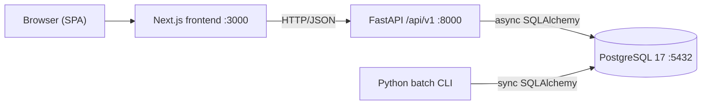

# CardDemo Architecture

CardDemo is a credit-card management application being modernized from a legacy
IBM z/OS mainframe stack — COBOL online and batch programs, CICS transaction
management, VSAM KSDS storage, BMS 3270 green-screen maps, and JCL/PROC job
orchestration — onto a modern three-tier web stack plus a Python batch CLI. The
modernization **preserves every business rule, validation edit, and numeric
computation exactly** as the legacy system performs them today (the Minimal
Change Clause): one COBOL program maps to one Python module cluster, and one BMS
map maps to one frontend component, so lineage from mainframe origin to modern
implementation stays traceable end to end.

This document is the deepest architectural reference in the repository. It
complements — and does not repeat — the setup and build steps in the root
[`../README.md`](../README.md); read that first to run the stack, then read this
for the architecture behind it.

> **Legacy reference.** The legacy implementation remains in
> [`../app/`](../app) **unchanged** as the source of truth for behavior parity.
> The modernization never modifies the `app/` tree (COBOL, copybooks, BMS, JCL,
> PROC, CTL, catalog, and data); it is the golden-master reference the modern
> outputs are reconciled against. The [`../diagrams/`](../diagrams) and
> [`../samples/`](../samples) directories are likewise legacy reference material.

## Table of Contents

- [1. High-Level Architecture](#1-high-level-architecture)
- [2. Technology Stack](#2-technology-stack)
- [3. Backend Architecture](#3-backend-architecture)
- [4. Frontend Architecture](#4-frontend-architecture)
- [5. Batch Architecture](#5-batch-architecture)
- [6. Authentication and Session Model](#6-authentication-and-session-model)
- [7. Migration Mapping](#7-migration-mapping)
- [8. Design Patterns](#8-design-patterns)
- [9. Cross-Cutting Correctness Rules](#9-cross-cutting-correctness-rules)
- [10. Configuration](#10-configuration)
- [11. Related Documentation](#11-related-documentation)

## 1. High-Level Architecture

The modern system has four parts: a **Next.js frontend**, a **FastAPI backend**,
a **PostgreSQL database**, and a **Python batch CLI**. The first three form the
online three-tier web stack; the batch CLI is a separate synchronous process
that acts on the same PostgreSQL database to run the ported job chain.



**Runtime request path.** The browser renders the Next.js single-page
application served on port `3000`. UI code calls the axios client in
[`../frontend/src/lib/apiClient.ts`](../frontend/src/lib/apiClient.ts), whose
base URL is `${NEXT_PUBLIC_API_URL}/api/v1` (the client appends the `/api/v1`
prefix to the backend origin). A request reaches the FastAPI backend on port
`8000`, where a versioned router validates the payload and delegates to a
**service**; the service applies the ported business rules and calls a
**repository**; the repository uses async SQLAlchemy to read and write
**PostgreSQL 17** on port `5432`. The batch CLI bypasses the web tier entirely:
it opens its own synchronous database session and operates directly on the same
tables.

## 2. Technology Stack

The stack and its pinned versions come from the dependency inventory. Treat the
versions below as authoritative; do not alter them without a corresponding
manifest change in [`../backend/requirements.txt`](../backend/requirements.txt),
[`../backend/pyproject.toml`](../backend/pyproject.toml), and
[`../frontend/package.json`](../frontend/package.json).

| Tier | Technology | Version | Purpose |
| :--- | :--------- | :------ | :------ |
| Backend | Python | 3.13 | Backend and batch runtime |
| Backend | FastAPI | 0.136.1 | Async REST framework (OpenAPI 3.1) |
| Backend | Uvicorn (`uvicorn[standard]`) | 0.34.0 | ASGI server (uvloop + httptools) |
| Backend | Pydantic | 2.10.4 | Request/response validation (DTOs) |
| Backend | pydantic-settings | 2.x | Typed environment configuration |
| Backend | SQLAlchemy | 2.0.36 | ORM models + async engine |
| Backend | Alembic | 1.14 | Versioned schema migrations |
| Backend | asyncpg | 0.30.x | Async PostgreSQL driver (app engine) |
| Backend | psycopg2-binary | 2.9.x | Sync PostgreSQL driver (Alembic + batch) |
| Backend | passlib[bcrypt] | current | Password hashing (plaintext → hash) |
| Backend | PyJWT | current | JWT tokens (COMMAREA identity replacement) |
| Backend | python-multipart | current | Login form parsing |
| Backend | reportlab + Jinja2 | current | PDF/HTML statements and reports (CSV via stdlib `csv`) |
| Backend | pytest + pytest-asyncio + httpx | current | Unit, integration, and golden-master tests |
| Batch | Python | 3.13 | Batch CLI runtime |
| Batch | Typer (on `click`) | 0.27.x | Batch CLI entrypoint (`python -m batch.cli`) |
| Batch | SQLAlchemy + psycopg2 | 2.0.36 / 2.9.x | Synchronous batch engine (reuses the backend `app` package) |
| Frontend | Node.js | 20+ LTS | Frontend runtime |
| Frontend | Next.js | 16.2.11 | React framework, App Router |
| Frontend | React + React DOM | 19.2.7 | UI runtime |
| Frontend | @mui/material | 9.2.0 | Material UI component library |
| Frontend | @mui/material-nextjs | 9.1.1 | MUI SSR integration for the App Router |
| Frontend | @mui/icons-material | 9.2.0 | MUI icon set |
| Frontend | @emotion/react + @emotion/styled | 11.x | MUI styling engine (peer dependencies) |
| Frontend | axios | 1.x | HTTP client (`src/lib/apiClient.ts`) |
| Frontend | TypeScript | 5.x | Static typing |
| Database | PostgreSQL | 17 | Relational datastore (VSAM replacement) |
| Tooling | Docker + Compose | current | `db`/`backend`/`frontend`; net `carddemo-net`; vol `carddemo_pgdata` |

## 3. Backend Architecture

The backend follows the community-standard layered FastAPI pattern. Requests
flow strictly downward through the layers, and each layer has one job:

```text
api/v1 routers  ->  services  ->  repositories  ->  models / schemas  ->  core
   (HTTP)          (business)      (data access)     (ORM + DTOs)     (infra)
```

Endpoints stay **thin**: a router validates input, calls exactly one service
method, and shapes the response. Business logic lives in the **service** layer
(one service per feature area, each porting the related online program(s)), and
all database access lives in the **repository** layer (one repository per former
VSAM file), so the datastore can change without touching business rules.

**Composition root.** The application is assembled by the `create_application()`
factory in [`../backend/app/main.py`](../backend/app/main.py). The factory reads
environment-driven settings, attaches an async `lifespan` context manager,
configures CORS middleware, mounts the v1 routers under
`settings.API_V1_PREFIX` (`/api/v1`), registers domain-exception handlers
(including a request-validation handler that redacts sensitive submitted values
such as passwords from 422 responses), installs a PAN-masking log filter so full
card numbers never reach the access log, and adds two health probes: a
dependency-free `/health` **liveness** probe (the process is up) and a
`/health/ready` **readiness** probe that runs a trivial `SELECT 1` and returns
200 only when PostgreSQL is reachable (503 otherwise) so orchestrators can gate
dependent services on a genuinely ready backend. The `lifespan` does minimal
startup work
(the async engine connects lazily and the schema is owned by Alembic, never
created at boot) and calls `engine.dispose()` on shutdown to release the
connection pool cleanly. The module exports a single ASGI object, `app`, built
once at import.

Run the API with the ASGI server (`--no-server-header` suppresses uvicorn's
`server` banner; `SecurityHeadersMiddleware` supplies the response security
headers, including a controlled `Server` value):

```bash
uvicorn app.main:app --host 0.0.0.0 --port 8000 --no-server-header
```

Interactive OpenAPI/Swagger docs are served at
`http://localhost:8000/docs`.

The backend package is organized as follows:

```text
backend/app/
├── main.py            # create_application() factory + lifespan; exports `app`
├── core/              # config, security, exceptions, dependencies
├── db/                # session (async engine + sessionmaker), base (declarative Base)
├── models/            # SQLAlchemy ORM (one file per table)
├── schemas/           # Pydantic request/response DTOs
├── repositories/      # data access (one per former VSAM file)
├── services/          # business logic (one per legacy online program)
├── api/v1/            # routers: auth, menu, accounts, cards, transactions, reports, billpay, users
└── utils/             # date_utils, decimal_utils, validators
```

The v1 API is grouped into **eight router groups**, each mounted under
`/api/v1`:

- `auth` — sign-on and session/token issuance (← `COSGN00C`).
- `menu` — regular-user and admin menu options (← `COMEN01C`, `COADM01C`).
- `accounts` — account view and update (← `COACTVWC`, `COACTUPC`).
- `cards` — card list, view, and update (← `COCRDLIC`, `COCRDSLC`, `COCRDUPC`).
- `transactions` — transaction list, view, and add (← `COTRN00C`–`COTRN02C`).
- `reports` — transaction reports (← `CORPT00C`).
- `billpay` — bill payment (← `COBIL00C`).
- `users` — admin-only user administration (← `COUSR00C`–`COUSR03C`).

For the full endpoint contract — paths, methods, request/response shapes, and
status codes — see [`./api-reference.md`](./api-reference.md).

## 4. Frontend Architecture

The frontend is a Next.js **App Router** application under
[`../frontend/src`](../frontend/src). The root layout
[`../frontend/src/app/layout.tsx`](../frontend/src/app/layout.tsx) wraps the tree
in MUI's `AppRouterCacheProvider` and a `ThemeProvider` fed by
[`../frontend/src/app/theme.ts`](../frontend/src/app/theme.ts), and each route
provides one `page.tsx`.

There are **17 page components in strict 1:1 correspondence with the 17 legacy
BMS maps** (Minimal Change Clause: one map → one component). The UI is
**redesigned per Material Design 3** through Material UI — it is explicitly
**not** a pixel-for-pixel reproduction of the 80×24 3270 terminal screens.
Field names, lengths, and attributes are taken from the BMS symbolic-map
copybooks so the forms preserve the legacy validation behavior.

The frontend is organized as follows:

- `src/app/` — the root `layout.tsx`, the MUI `theme.ts`, and one `page.tsx`
  per route (17 pages).
- `src/components/` — shared building blocks: `AppShell`, `DataTable`,
  `FormField`, `ConfirmDialog`, and `ErrorAlert`.
- `src/lib/` — `apiClient.ts` (the axios instance with an auth interceptor) and
  `auth.ts` (client-side auth helpers).
- `src/types/` — TypeScript interfaces derived from the backend schemas.

The per-route → BMS-map correspondence is recorded in each page component's
header comment (which names its originating BMS map and COBOL program); the
high-level artifact mapping is summarized in
[§7 Migration Mapping](#7-migration-mapping) below.

## 5. Batch Architecture

The batch chain is a Python CLI package invoked as `python -m batch.cli`, built
with **Typer**. It exposes two sub-apps plus two top-level orchestration
commands:

- `job` — individual jobs, 1:1 with the legacy `CB*` batch programs (for
  example, `post-transactions` ← `CBTRN02C`, `interest-calc` ← `CBACT04C`,
  `statement-gen` ← `CBSTM03A`/`CBSTM03B`).
- `load` — data loaders, 1:1 with the legacy IDCAMS load jobs (for example,
  `accounts`, `cards`, `customers`, `xref`, `transactions`, and `init-users`).
- `run-all` — runs the full batch chain in the legacy order.
- `seed-all` — seeds all tables in a foreign-key-safe order.

Run individual jobs or the full chain, for example:

```bash
python -m batch.cli seed-all
python -m batch.cli job interest-calc
python -m batch.cli run-all
```

The batch package uses a **synchronous** SQLAlchemy engine defined in
[`../batch/db.py`](../batch/db.py) (psycopg2, reading `SYNC_DATABASE_URL`),
distinct from the backend's async engine, because the batch chain runs as a
plain synchronous process. Each job receives an open `Session` and runs inside a
caller-owned transaction (the job itself performs no `commit`/`rollback`). The
batch code reuses the backend `app` package for ORM models and shared utilities.
Re-run behavior is per-job and is designed to be idempotent: loaders upsert,
posting skips transactions already marked `POSTED`, and `interest-calc` keys its
generated interest transaction on the accounting month, so a same-month re-run
does not re-accrue interest. Consult the per-job detail below for each job's
exact re-run semantics.

For the exact chain order and per-job semantics, see
[`./batch.md`](./batch.md).

## 6. Authentication and Session Model

The legacy design propagated identity and role in the CICS `CARDDEMO-COMMAREA`
(copybook `COCOM01Y`) on every program call. The modern stack has no COMMAREA to
pass; it replaces that propagation with **stateless, server-side auth** enforced
by FastAPI dependency injection. Protected endpoints declare
`Depends(get_current_user)`, and admin-only endpoints additionally declare
`Depends(require_admin)`.

**Session baseline, JWT alternative.** Session-based authentication is the
confirmed baseline; JWT is an accepted equivalent alternative. Select the
strategy with the `AUTH_MODE` environment variable (default `session`; set `jwt`
to switch). Admin-only screens and endpoints are gated to `user_type='A'` on
**both** the client and the server — the client hides them for a regular user,
and the server rejects them regardless of what the client sends.

**Password storage.** Passwords are **hashed** with bcrypt. The legacy
plaintext `SEC-USR-PWD` field is never reproduced. The seed accounts `ADMIN001`
and `USER0001` (password `PASSWORD`) are **non-production, seed-only** accounts;
their passwords are stored hashed at rest, and they must never be treated as
real credentials or hardcoded anywhere.

## 7. Migration Mapping

Each legacy artifact class maps to a specific modern construct under the Minimal
Change Clause. This table captures the high-level mapping; the file-by-file
detail is recorded in each modern module's header comment, which names its
originating COBOL program, copybook, or BMS map.

| Legacy (mainframe) | Modern (target) | Notes |
| :----------------- | :-------------- | :---- |
| CICS online programs `CO*C` (17) | FastAPI router + service + repository cluster | 1 program → 1 module cluster |
| BMS mapsets `CO*` (17) | Next.js/MUI page components | 1 map → 1 component |
| Batch COBOL `CBACT*`/`CBCUS01C`/`CBTRN*`/`CBSTM03A`–`B` (10) | Python `batch/jobs/*.py` | 1 program → 1 job |
| Copybooks `app/cpy/*.cpy` (28) | SQLAlchemy models + Pydantic schemas / shared DTOs | Record layouts → ORM + DTO |
| VSAM KSDS + sequential datasets | PostgreSQL tables + Alembic migrations | Record layout → DDL; AIX → index |
| CICS COMMAREA (`COCOM01Y`) | Session / JWT claims via `Depends(...)` | Stateless identity + role |
| JCL + PROC chain | Python CLI + `batch/orchestration/batch_chain.py` | Preserves the legacy job order |
| Date utility `CSUTLDTC` | `app/utils/date_utils.py` | Wraps LE date services → Python date validation |

**Out of scope.** The following legacy add-ons have no target equivalent and are
not ported: the Credit Card Authorizations add-on (IMS/DB2/MQ), DB2 transaction-
type management, MQ account extracts, and mainframe infrastructure (RACF
security, the CICS CSD/RDO definitions, and CICS region configuration). Only the
business logic and data these surround are preserved.

## 8. Design Patterns

The backend applies a small, consistent set of patterns:

- **Repository pattern** — one repository per former VSAM file
  (`ACCTDAT` → `account_repo`, `CARDDAT` → `card_repo`, and so on). VSAM
  `READ`/`STARTBR`/`READNEXT`/`REWRITE` verbs become SQLAlchemy
  `select`/`insert`/`update`.
- **Service layer** — one service per feature area, each porting the related
  online program(s) (for example `account_service` ← `COACTVWC` + `COACTUPC`),
  holding the ported business rules (posting reject codes, available-credit and
  interest formulas) from the original PROCEDURE DIVISION logic.
- **Dependency injection** — `get_db` supplies an async session, and
  `get_current_user` / `require_admin` supply the authenticated identity and the
  admin gate.
- **Application factory + async lifespan** — `create_application()` builds the
  app; the `lifespan` owns engine startup and teardown.
- **DTO / Pydantic validation** — request and response schemas mirror the
  copybook field lengths and numeric ranges, porting the BMS and PROCEDURE
  DIVISION edits into schema validators.
- **Unit of work / per-request transaction** — one session per request owns the
  read/modify/write cycle. `account_service` reproduces the `COACTUPC`
  READ-UPDATE → REWRITE cycle with a `SELECT ... FOR UPDATE` row lock plus a
  before-image comparison; `card_service` reproduces `COCRDUPC` optimistically
  with a re-read and before-image comparison (the card repository has no locking
  read). No persisted `version`/`updated_at` column is added (AAP §0.7.4).
- **Factory pattern** — a report-type factory (monthly/yearly/custom) and a
  statement-format factory (CSV/PDF).
- **Typed configuration** — `pydantic-settings` loads all values from the
  environment, so nothing sensitive is hardcoded.

## 9. Cross-Cutting Correctness Rules

These rules hold across every tier and are non-negotiable for parity with the
legacy system:

- **Exact decimals.** All monetary and rate math uses PostgreSQL `NUMERIC` with
  Python `Decimal`, **never floating point**, because floating-point rounding is
  a regulatory failure in currency calculations. See
  [`./data-model.md`](./data-model.md) for the precision and scale of each field,
  and [`./batch.md`](./batch.md) for the interest-calculation truncation
  semantics.
- **Referential integrity.** Relationships implicit in the VSAM cross-reference
  file (`CARDXREF`) become explicit PostgreSQL foreign-key constraints.
- **Concurrency control.** CICS/VSAM record-level locking is reproduced per
  resource. `account_service` serializes concurrent account updates with a
  `SELECT ... FOR UPDATE` row lock plus a before-image comparison (the `COACTUPC`
  9700 check); `card_service` uses an optimistic re-read and before-image
  comparison for `COCRDUPC`. No persisted `version`/`updated_at` token is stored
  (AAP §0.7.4 permits the pessimistic lock), so client-staleness detection relies
  on the client echoing the before-image it fetched.
- **Golden-master parity.** Golden-master parity — modern outputs reconciling
  field-for-field against the legacy output for the
  [`../app/data`](../app/data) sample — is the migration's correctness goal,
  verified by the golden-master test suite as that suite is completed.

## 10. Configuration

All configuration is environment-based via `pydantic-settings` in
[`../backend/app/core/config.py`](../backend/app/core/config.py); nothing is
hardcoded. Copy the templates and edit the copies — never commit real secrets:

```bash
cp backend/.env.example backend/.env
cp frontend/.env.local.example frontend/.env.local
```

The key backend environment variables are listed below **by name**. The values
shown are the non-sensitive local-development defaults from the templates; treat
`SECRET_KEY` as a real secret and generate your own.

| Variable | Role | Local-dev default |
| :------- | :--- | :---------------- |
| `PROJECT_NAME` | FastAPI / OpenAPI title | `CardDemo` |
| `API_V1_PREFIX` | Mount prefix for the v1 routers | `/api/v1` |
| `ENVIRONMENT` | Deployment environment name | `development` |
| `DEBUG` | Debug behavior toggle (off by default) | `false` |
| `DATABASE_URL` | Async engine URL (asyncpg) — the app engine | *(asyncpg URL)* |
| `SYNC_DATABASE_URL` | Sync engine URL (psycopg2) — Alembic + batch loaders | *(psycopg2 URL)* |
| `SECRET_KEY` | Signing key for sessions/JWTs (**required**, ≥ 32 chars) | *(none — generate it)* |
| `AUTH_MODE` | Auth strategy: `session` baseline or `jwt` alternative | `session` |
| `ALGORITHM` | JWT signing algorithm | `HS256` |
| `ACCESS_TOKEN_EXPIRE_MINUTES` | Session/token lifetime in minutes | `60` |
| `SESSION_COOKIE_NAME` | Server-side session cookie name | `carddemo_session` |
| `BCRYPT_ROUNDS` | bcrypt work factor (cost) | `12` |
| `LOGIN_MAX_ATTEMPTS` | Failed sign-ons per (user id, client IP) before lockout | `5` |
| `LOGIN_LOCKOUT_SECONDS` | Lockout window after `LOGIN_MAX_ATTEMPTS` failures | `900` |
| `BACKEND_CORS_ORIGINS` | Allowed CORS origins (includes the frontend origin) | `http://localhost:3000` |

Generate a strong signing key for `SECRET_KEY` with:

```bash
openssl rand -hex 32
```

The frontend reads a single public variable, `NEXT_PUBLIC_API_URL` (default
`http://localhost:8000`); the axios client appends `/api/v1` to it. Under Docker
Compose the backend reaches PostgreSQL through the compose service host `db`,
while the browser reaches the backend at `localhost:8000` — so the frontend's
API origin points at `localhost`, not at the internal `backend` service name.

## 11. Related Documentation

- [`./api-reference.md`](./api-reference.md) — REST endpoint contract.
- [`./data-model.md`](./data-model.md) — tables, keys, and numeric precision.
- [`./batch.md`](./batch.md) — batch chain order and per-job detail.
- [`../README.md`](../README.md) — project setup, quick start, and build steps.

The [`../diagrams/`](../diagrams) and [`../samples/`](../samples) directories
hold **legacy reference material** — mainframe flow/screen images and compile/
runtime samples — and are not part of the modern build.
