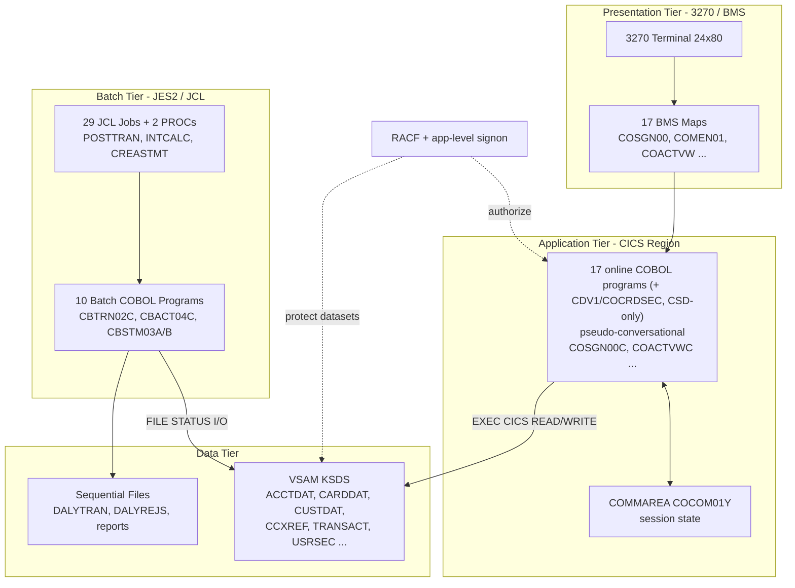
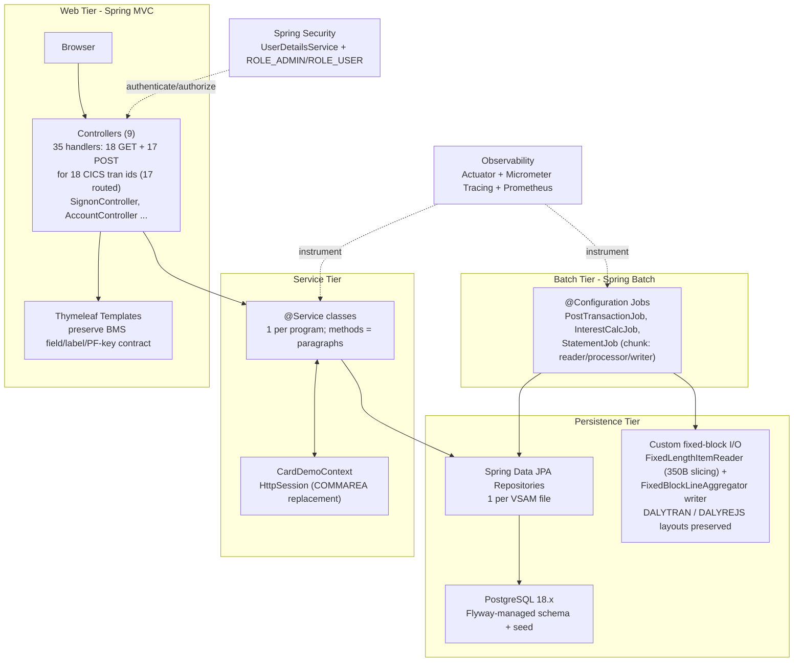

# CardDemo Architecture — Before (z/OS Mainframe) and After (Java / Spring Boot)

> **Visual Architecture Documentation** deliverable for the AWS CardDemo COBOL → Java 25 / Spring Boot 3.5.16 migration.
>
> Per the Visual Architecture Documentation rule, this document shows **both** the migration's **before** (current z/OS mainframe) and **after** (target Java / Spring Boot) architecture states — never the target state alone. Each diagram has a **descriptive title** and an explicit **legend**, is drawn with **Mermaid** (`graph TD`) so it renders directly on GitHub, and is **referenced by name** from the [root `README.md`](../../README.md) and [`../onboarding.md`](../onboarding.md).
>
> This is a **same-repository** migration: the original COBOL/CICS/JCL/BMS sources are retained read-only under `legacy/`, while the new Java artifacts live under `src/main/java/com/aws/carddemo/**`. Every component named below is traceable to its counterpart in [`../traceability-matrix.md`](../traceability-matrix.md); the design rationale is recorded in [`../decision-log.md`](../decision-log.md).

## Contents

- [Diagram 1 — Before: AWS CardDemo z/OS Mainframe Architecture (Current State)](#diagram-1--before-aws-carddemo-zos-mainframe-architecture-current-state)
- [Diagram 2 — After: Java 25 + Spring Boot Layered Architecture (Target State)](#diagram-2--after-java-25--spring-boot-layered-architecture-target-state)
- [Before → After mapping](#before--after-mapping)
- [Scope note — no feature expansion](#scope-note--no-feature-expansion)
- [Related documentation](#related-documentation)

---

## Diagram 1 — Before: AWS CardDemo z/OS Mainframe Architecture (Current State)

The current system is the classic three-tier z/OS design: a **3270 / BMS** presentation tier, a **CICS / COBOL** application tier of pseudo-conversational online programs that carry state in the `COCOM01Y` COMMAREA, a **JES2 / JCL** batch tier driving batch COBOL, and a **VSAM / sequential** data tier — with **RACF** and application-level signon providing security.

**Legend — Diagram 1.** Solid arrows = runtime data / control flow; dashed arrows = security / authorization. **Tiers:** Presentation (3270 terminal + 17 BMS maps), Application (17 online COBOL programs with `.cbl` sources, plus the `CDV1`/`COCRDSEC` card-detail security transaction defined in `CARDDEMO.CSD` only — no COBOL source — for 18 online CICS transaction ids in total, all pseudo-conversational via the `COCOM01Y` COMMAREA), Batch (29 JCL jobs + 2 PROCs driving 10 batch COBOL programs), and Data (VSAM KSDS + sequential files such as `DALYTRAN`/`DALYREJS`).

---

## Diagram 2 — After: Java 25 + Spring Boot Layered Architecture (Target State)

The target is an idiomatic layered Spring Boot application in the **same repository**: a **Spring MVC** web tier (35 request-handler methods — 18 `@GetMapping` render/redirect + 17 `@PostMapping` submit — across 9 controllers covering the 18 CICS transaction ids; 17 have migrated routes and `CDV1`/`COCRDSEC` is intentionally unrouted, plus Thymeleaf views preserving the BMS contract), a **service** tier (one `@Service` per program, methods mirroring COBOL paragraphs, with `CardDemoContext` replacing the COMMAREA), a **Spring Batch** tier (chunk-oriented jobs), and a **persistence** tier (Spring Data JPA repositories over PostgreSQL with Flyway, plus flat-file readers/writers). **Spring Security** and **Observability** are cross-cutting concerns.

**Legend — Diagram 2.** Solid arrows = runtime data / control flow; dashed arrows = cross-cutting concerns (security, observability). **Layers:** Web (Spring MVC + Thymeleaf), Service (business logic + session context), Batch (Spring Batch), and Persistence (Spring Data JPA + PostgreSQL + flat files). Security (Spring Security `UserDetailsService` with `ROLE_ADMIN`/`ROLE_USER`) and Observability (Actuator + Micrometer Tracing + Prometheus) are applied across the layers.

---

## Before → After mapping

Each z/OS tier maps deterministically to a Spring Boot layer. The full construct-by-construct mapping (all 28 programs, 28 copybooks, 17 BMS maps, 29 JCL jobs, etc.) is in [`../traceability-matrix.md`](../traceability-matrix.md).

| Before — z/OS construct | After — Java / Spring Boot | Example |
| :---------------------- | :------------------------- | :------ |
| 3270 terminal + BMS maps (Presentation) | Browser + Spring MVC controllers + Thymeleaf templates (Web) | `COSGN00` map → `COSGN00.html` + `SignonController` |
| Online COBOL programs (CICS application) | `@Service` classes, methods = numbered paragraphs (Service) | `COSGN00C` → `SignonService` |
| `COCOM01Y` COMMAREA (pseudo-conversational state) | `CardDemoContext` held in the `HttpSession` (Service) | `COCOM01Y` → `dto/CardDemoContext` |
| JCL jobs + batch COBOL (JES2 batch) | Spring Batch `@Configuration` jobs (reader/processor/writer) (Batch) | `POSTTRAN` + `CBTRN02C` → `PostTransactionJobConfig` |
| `SORT`/`MERGE` steps | Java `Comparator` / SQL `ORDER BY` (identical key semantics) | `COMBTRAN` `SORT FIELDS=(TRAN-ID,A)` → order by `tranId` |
| VSAM KSDS files (Data) | Spring Data JPA repositories + PostgreSQL tables via Flyway (Persistence) | `ACCTDAT` → `AccountRepository` + `account` table |
| VSAM alternate indexes | Secondary DB indexes + Spring Data derived queries | `CARDAIX` → `findByCardAcctId` |
| Sequential files `DALYTRAN` / `DALYREJS` (Data) | Custom fixed-block components — `FixedLengthItemReader` (undelimited byte-slicing) for input + `FlatFileItemWriter` driven by a custom `FixedBlockLineAggregator` for output — **not** the stock line-delimited `FlatFileItemReader` (byte layout preserved) | `DALYTRAN` (350B) → `FixedLengthItemReader<DailyTransaction>`; `DALYREJS` (430B) → `FixedBlockLineAggregator`-backed writer |
| `FILE STATUS` / CICS `EIBRESP` codes | Typed exception hierarchy + `@ControllerAdvice` / skip-reject policy | `23`/`NOTFND` → `RecordNotFoundException` |
| RACF + application-level signon (Security) | Spring Security `UserDetailsService` + `ROLE_ADMIN`/`ROLE_USER` | `USRSEC` → `CardDemoUserDetailsService` |
| *(operational / non-functional)* | Observability: Actuator health/readiness + Micrometer Tracing + Prometheus metrics | new **non-functional** capability (not a business feature) |

---

## Scope note — no feature expansion

These diagrams depict **only delivered functionality**. Consistent with the migration's *no feature expansion* constraint, the following remain **unimplemented future roadmap** items in the original COBOL and are therefore **not** shown as delivered components: IBM **MQ** / JMS messaging, **Db2**, **IMS**, **FTP/SFTP**, and any **REST/SOAP** web-service API. They are called out here (and in [`../decision-log.md`](../decision-log.md)) purely as roadmap context; introducing any of them would be feature expansion beyond the existing behavior. Observability and documentation are non-functional/operational requirements, not new business features.

---

## Related documentation

- [`../../README.md`](../../README.md) — project overview, build/run, and application inventory.
- [`../onboarding.md`](../onboarding.md) — clean-machine-to-running-app developer guide (references these diagrams by name).
- [`../traceability-matrix.md`](../traceability-matrix.md) — 100%-coverage bidirectional COBOL-construct → Java-artifact mapping.
- [`../decision-log.md`](../decision-log.md) — non-trivial migration decisions, alternatives, and rationale.
