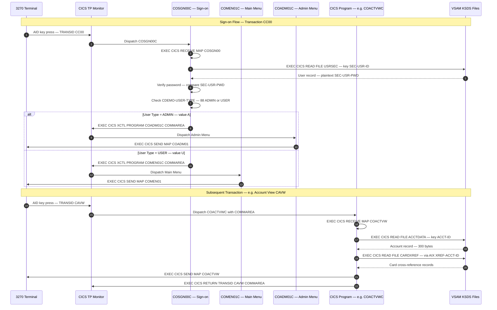
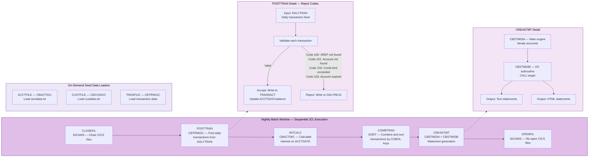
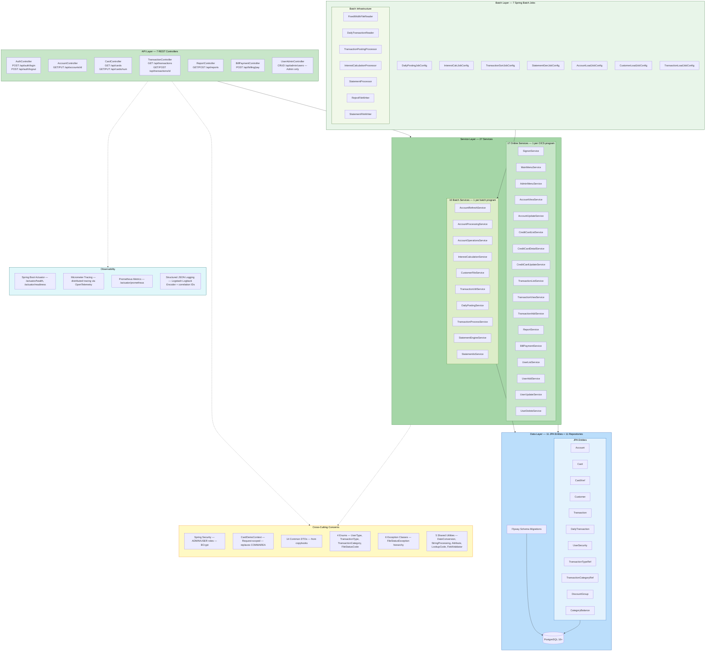
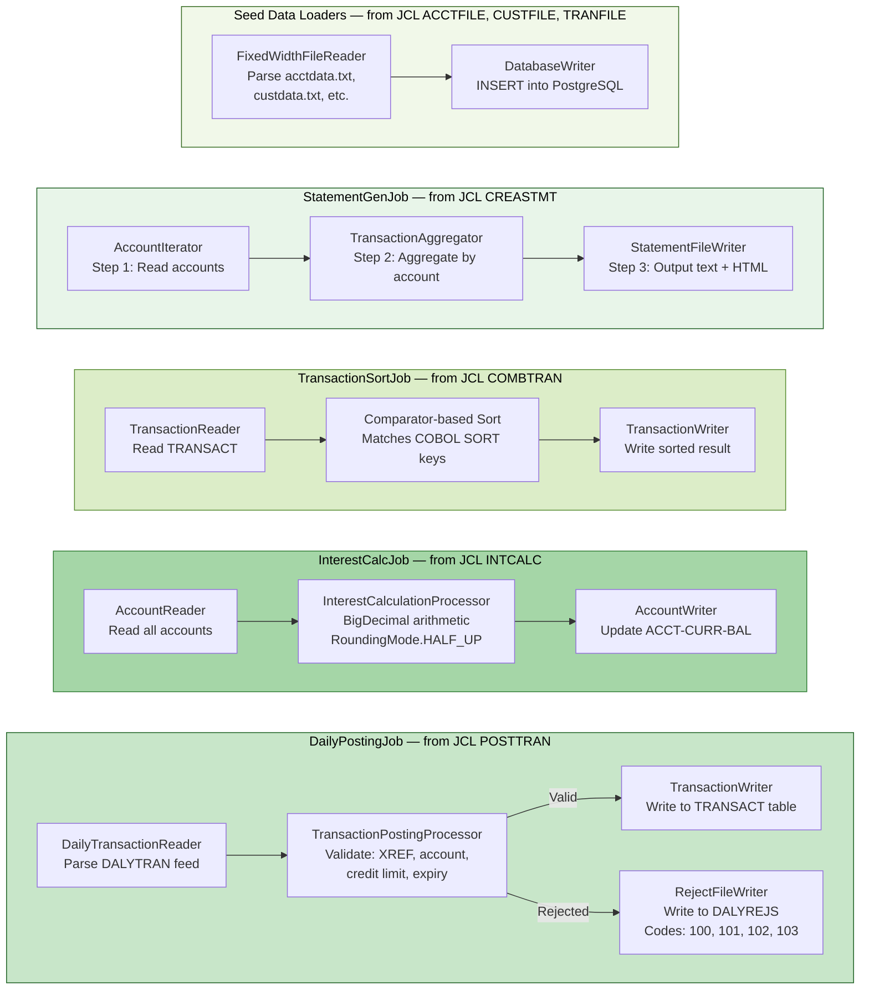
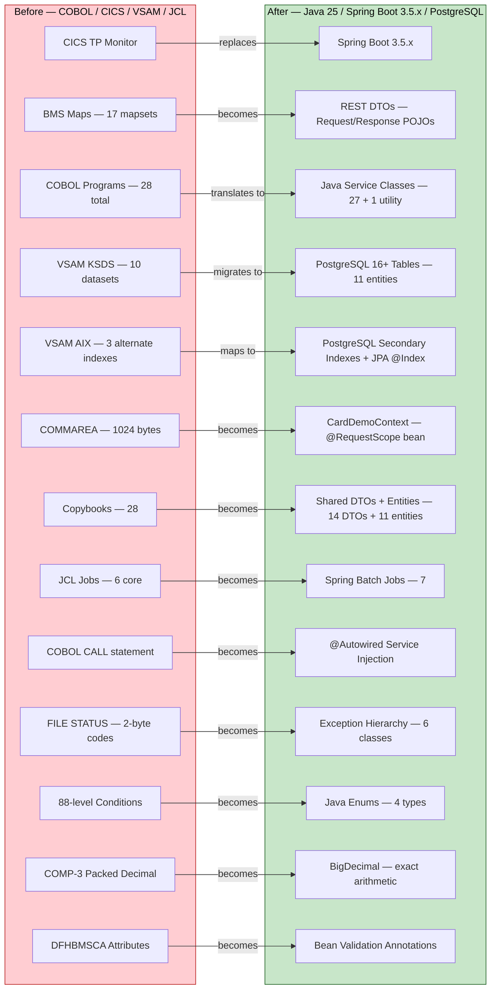
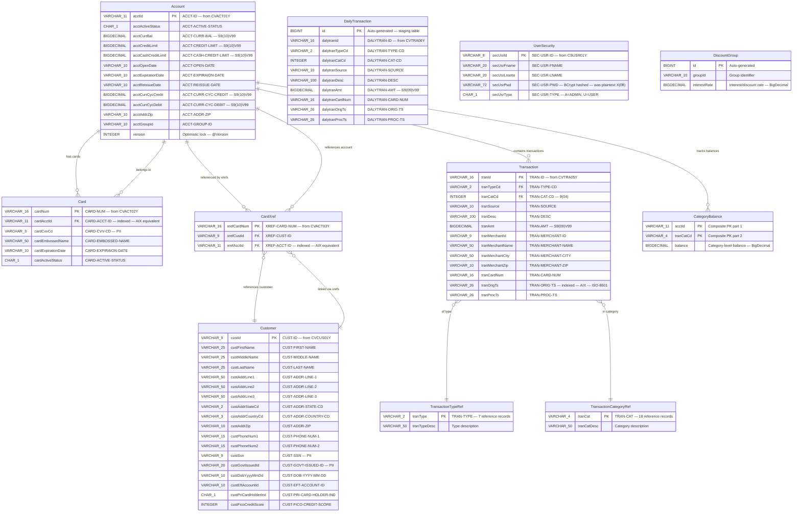
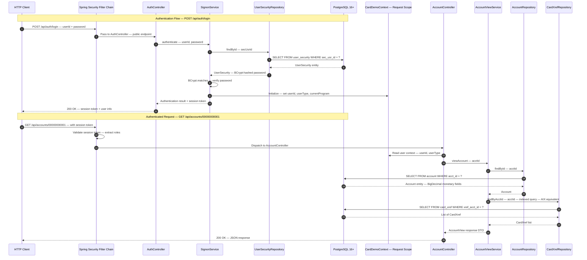

# CardDemo Migration — Architecture Diagrams

> **Before** (COBOL / CICS / VSAM / JCL) → **After** (Java 25 / Spring Boot 3.5.x / PostgreSQL / Spring Batch)

This document provides visual architecture documentation of the AWS CardDemo mainframe
application migration from COBOL/CICS/VSAM to Java 25 + Spring Boot 3.x. All diagrams
use [Mermaid](https://mermaid.js.org/) syntax for native rendering on GitHub and compatible
Markdown viewers. Each diagram includes a descriptive title and is covered by the
[Legend and Notation Guide](#10-legend-and-notation-guide) at the end of this document.

---

## Table of Contents

1. [Before State: Mainframe Architecture Overview](#1-before-state-mainframe-architecture-overview)
2. [Before State: CICS Online Transaction Flow](#2-before-state-cics-online-transaction-flow)
3. [Before State: JCL Batch Processing Sequence](#3-before-state-jcl-batch-processing-sequence)
4. [After State: Java / Spring Boot Architecture Overview](#4-after-state-java--spring-boot-architecture-overview)
5. [After State: Spring Batch Job Flow](#5-after-state-spring-batch-job-flow)
6. [Transformation Mapping](#6-transformation-mapping)
7. [Data Model — Entity Relationship Diagram](#7-data-model--entity-relationship-diagram)
8. [After State: REST API Request Flow](#8-after-state-rest-api-request-flow)
9. [Component Inventory Comparison](#9-component-inventory-comparison)
10. [Legend and Notation Guide](#10-legend-and-notation-guide)

---

## 1. Before State: Mainframe Architecture Overview

The original CardDemo application runs on z/OS with a classic three-tier architecture:
**3270 terminals** (presentation) → **COBOL/CICS programs** (business logic) →
**VSAM KSDS files** (data). This diagram shows every tier, all 28 COBOL programs,
17 BMS maps, 10 VSAM datasets, 3 alternate indexes, and the JCL batch pipeline.

```mermaid
graph TB
    %% ── Presentation Tier ──────────────────────────────────────────
    subgraph PRES["Presentation Tier — 3270 / BMS"]
        direction TB
        TERM["3270 Terminals"]

        subgraph BMS_MAPS["17 BMS Map Sources"]
            COSGN00_M["COSGN00 — Sign-on"]
            COMEN01_M["COMEN01 — Main Menu"]
            COADM01_M["COADM01 — Admin Menu"]
            COACTVW_M["COACTVW — Acct View"]
            COACTUP_M["COACTUP — Acct Update"]
            COCRDLI_M["COCRDLI — Card List"]
            COCRDSL_M["COCRDSL — Card Detail"]
            COCRDUP_M["COCRDUP — Card Update"]
            COTRN00_M["COTRN00 — Tran List"]
            COTRN01_M["COTRN01 — Tran View"]
            COTRN02_M["COTRN02 — Tran Add"]
            CORPT00_M["CORPT00 — Reports"]
            COBIL00_M["COBIL00 — Bill Pay"]
            COUSR00_M["COUSR00 — User List"]
            COUSR01_M["COUSR01 — User Add"]
            COUSR02_M["COUSR02 — User Update"]
            COUSR03_M["COUSR03 — User Delete"]
        end

        BMS_CPY["17 BMS Copybooks — AI/AO two-view pattern"]
        TERM --> BMS_MAPS
        BMS_MAPS --> BMS_CPY
    end

    %% ── Business Logic Tier ────────────────────────────────────────
    subgraph LOGIC["Business Logic Tier — COBOL / CICS"]
        direction TB
        CICS["CICS Transaction Processor — Pseudo-conversational"]
        COMMAREA["COMMAREA — COCOM01Y — 1024-byte session context"]

        subgraph ONLINE["18 Online CICS Programs"]
            COSGN00C["COSGN00C — Sign-on — CC00"]
            COMEN01C["COMEN01C — Main Menu — CM00"]
            COADM01C["COADM01C — Admin Menu — CA00"]
            COACTVWC["COACTVWC — Acct View — CAVW"]
            COACTUPC["COACTUPC — Acct Update — CAUP"]
            COCRDLIC["COCRDLIC — Card List — CCLI"]
            COCRDSLC["COCRDSLC — Card Detail — CCDL"]
            COCRDUPC["COCRDUPC — Card Update — CCUP"]
            COTRN00C["COTRN00C — Tran List — CT00"]
            COTRN01C["COTRN01C — Tran View — CT01"]
            COTRN02C["COTRN02C — Tran Add — CT02"]
            CORPT00C["CORPT00C — Reports — CR00"]
            COBIL00C["COBIL00C — Bill Pay — CB00"]
            COUSR00C["COUSR00C — User List — CU00"]
            COUSR01C["COUSR01C — User Add — CU01"]
            COUSR02C["COUSR02C — User Update — CU02"]
            COUSR03C["COUSR03C — User Delete — CU03"]
            CSUTLDTC["CSUTLDTC — Shared Date Utility"]
        end

        subgraph BATCH_PGM["10 Batch COBOL Programs"]
            CBACT01C["CBACT01C — Acct Refresh"]
            CBACT02C["CBACT02C — Acct Processing"]
            CBACT03C["CBACT03C — Acct Operations"]
            CBACT04C["CBACT04C — Interest Calc"]
            CBCUS01C["CBCUS01C — Customer File"]
            CBTRN01C["CBTRN01C — Tran Utilities"]
            CBTRN02C["CBTRN02C — Daily Posting"]
            CBTRN03C["CBTRN03C — Tran Processing"]
            CBSTM03A["CBSTM03A — Statement Engine"]
            CBSTM03B["CBSTM03B — Statement I/O"]
        end

        CPY["28 Copybooks — record layouts and shared data structures"]

        CICS --> ONLINE
        ONLINE --> COMMAREA
        ONLINE --> CPY
        BATCH_PGM --> CPY
    end

    %% ── Data Tier ──────────────────────────────────────────────────
    subgraph DATA["Data Tier — VSAM"]
        direction TB
        subgraph VSAM_DS["10 VSAM KSDS Datasets"]
            ACCTDATA["ACCTDATA — 300B — PK ACCT-ID 11B"]
            CARDDATA["CARDDATA — 150B — PK CARD-NUM 16B"]
            CARDXREF["CARDXREF — 50B — PK XREF-CARD-NUM 16B"]
            CUSTDATA["CUSTDATA — 500B — PK CUST-ID 9B"]
            TRANSACT["TRANSACT — 350B — PK TRAN-ID 16B"]
            DALYTRAN["DALYTRAN — 350B — Sequential feed"]
            USRSEC["USRSEC — 80B — PK SEC-USR-ID 8B"]
            TRANTYPE["TRANTYPE — 50B — PK TRAN-TYPE 2B"]
            TRANCATG["TRANCATG — 50B — PK TRAN-CAT 4B"]
            TCATBALF["TCATBALF — 50B — Composite PK"]
        end

        subgraph AIX["3 Alternate Indexes"]
            AIX1["CARDDATA AIX — CARD-ACCT-ID — pos 16, len 11"]
            AIX2["CARDXREF AIX — XREF-ACCT-ID — pos 25, len 11"]
            AIX3["TRANSACT AIX — TRAN-ORIG-TS — pos 304, len 26"]
        end
    end

    %% ── Batch Orchestration ────────────────────────────────────────
    subgraph JCL_ORCH["Batch Orchestration — JCL"]
        direction LR
        CLOSEFIL["CLOSEFIL"] --> POSTTRAN["POSTTRAN"]
        POSTTRAN --> INTCALC["INTCALC"]
        INTCALC --> COMBTRAN["COMBTRAN"]
        COMBTRAN --> CREASTMT["CREASTMT"]
        CREASTMT --> OPENFIL["OPENFIL"]
    end

    %% ── Cross-tier Connections ─────────────────────────────────────
    PRES --> LOGIC
    LOGIC --> DATA
    BATCH_PGM --> VSAM_DS
    JCL_ORCH -.-> BATCH_PGM

    %% ── Styling ────────────────────────────────────────────────────
    style PRES fill:#ffcdd2,stroke:#b71c1c,color:#000
    style LOGIC fill:#ffe0b2,stroke:#e65100,color:#000
    style DATA fill:#bbdefb,stroke:#0d47a1,color:#000
    style JCL_ORCH fill:#e1bee7,stroke:#4a148c,color:#000
    style BMS_MAPS fill:#ffcdd2,stroke:#c62828,color:#000
    style ONLINE fill:#ffe0b2,stroke:#ef6c00,color:#000
    style BATCH_PGM fill:#fff3e0,stroke:#ef6c00,color:#000
    style VSAM_DS fill:#bbdefb,stroke:#1565c0,color:#000
    style AIX fill:#e3f2fd,stroke:#1565c0,color:#000
```

> **Legend — Diagram 1:** Pink = Presentation tier. Orange = Business logic tier.
> Blue = Data tier. Purple = Batch orchestration. Solid arrows = data flow.
> Dashed arrows = control/scheduling flow. Each node label shows program name,
> description, and CICS transaction ID (for online programs).

---

## 2. Before State: CICS Online Transaction Flow

This sequence diagram shows how a user interacts with CardDemo through a 3270 terminal.
The pseudo-conversational CICS model sends a BMS map, returns control to CICS,
then dispatches back to the program when the user presses an AID key. The COMMAREA
(COCOM01Y, 1024 bytes) carries session state between program invocations.

> **Legend — Diagram 2:** Solid arrows = request/dispatch. Dashed arrows = response/data
> return. The COMMAREA (COCOM01Y) travels with every XCTL and RETURN, carrying
> user ID, user type, current program, and navigation context.

---

## 3. Before State: JCL Batch Processing Sequence

The nightly batch window follows a strict six-step JCL sequence. CLOSEFIL shuts
CICS file access, four processing jobs run in order, and OPENFIL re-opens files.
Separate seed-data jobs (ACCTFILE, CUSTFILE, TRANFILE) load initial data on demand.

> **Legend — Diagram 3:** Purple = batch orchestration. Solid arrows = sequential job
> execution order. Dashed arrows = detail expansion. Reject codes 100–103 correspond
> to specific validation failures in CBTRN02C. CBSTM03A CALLs CBSTM03B as a subroutine.

---

## 4. After State: Java / Spring Boot Architecture Overview

The migrated CardDemo application uses Java 25 LTS with Spring Boot 3.5.x in a
layered modular-monolith architecture. Each COBOL program maps to a Java service class.
VSAM datasets become PostgreSQL tables via JPA entities. JCL jobs become Spring Batch jobs.

> **Legend — Diagram 4:** Green = application layers (API, Service, Batch).
> Blue = data layer (entities, PostgreSQL). Yellow = cross-cutting concerns.
> Cyan = observability. Solid arrows = runtime data flow. Dashed arrows = dependency
> references. Every COBOL online program maps 1-to-1 to an online service; every
> batch program maps 1-to-1 to a batch service.

---

## 5. After State: Spring Batch Job Flow

Each JCL batch job is translated to a Spring Batch `Job` with chunk-oriented
`ItemReader` → `ItemProcessor` → `ItemWriter` steps. All monetary calculations
use `BigDecimal` with `RoundingMode.HALF_UP`.

> **Legend — Diagram 5:** Green shades = Spring Batch jobs. Each subgraph represents
> one `Job` bean. Arrows show the chunk-oriented flow: Reader → Processor → Writer.
> The DailyPostingJob has a dual-output path — valid transactions go to TRANSACT,
> rejected ones go to DALYREJS with codes 100 (XREF not found), 101 (account not
> found), 102 (credit limit exceeded), 103 (account expired).

---

## 6. Transformation Mapping

This diagram maps every major COBOL/CICS/VSAM construct to its Java/Spring Boot
equivalent. The left side shows the mainframe components; the right side shows
the modern targets. Counts match the source repository exactly.

> **Legend — Diagram 6:** Red/pink = legacy mainframe constructs. Green = modern
> Java/Spring Boot targets. Each arrow represents a one-to-one or one-to-many
> construct transformation. No features are added — the right side is a strict
> functional equivalent of the left side.

---

## 7. Data Model — Entity Relationship Diagram

All 11 JPA entities are shown with primary keys, key fields, and relationships.
Field names are derived from the original COBOL copybooks. Every monetary field
uses `BigDecimal` (not float/double). PII fields are annotated. Passwords use BCrypt.

> **Legend — Diagram 7:** Each entity maps to a PostgreSQL table. PK = primary key.
> FK = foreign key. Fields marked **PII** (CUST-SSN, CUST-GOVT-ISSUED-ID, CARD-CVV-CD)
> require secure handling. `SEC-USR-PWD` stores BCrypt-hashed passwords (was plaintext
> in COBOL). All `BIGDECIMAL` fields correspond to COBOL `PIC S9(n)V99 COMP-3` packed
> decimal — no floating-point is used. `@Version` enables JPA optimistic locking,
> replacing CICS `READ UPDATE` → `REWRITE` semantics. Indexed FK fields replace
> VSAM Alternate Indexes (AIX).

---

## 8. After State: REST API Request Flow

This sequence diagram shows the Spring Boot request lifecycle, including Spring
Security authentication, the request-scoped `CardDemoContext` (replacing COMMAREA),
and the layered delegation from Controller → Service → Repository → PostgreSQL.

> **Legend — Diagram 8:** Solid arrows = request flow. Dashed arrows = response flow.
> The Spring Security Filter Chain intercepts every request. The `CardDemoContext`
> (request-scoped bean) replaces the 1024-byte COMMAREA, carrying user session state
> through the request lifecycle. Repository queries to PostgreSQL replace VSAM
> `EXEC CICS READ` operations. Indexed queries on `xref_acct_id` replace AIX lookups.

---

## 9. Component Inventory Comparison

This table provides a side-by-side count of every architectural component before
and after the migration. All counts match the source repository and the AAP exactly.

| Category | Before (COBOL / CICS / VSAM) | After (Java 25 / Spring Boot 3.5.x / PostgreSQL) |
|---|---|---|
| **Runtime** | z/OS + CICS TS | JVM 25 LTS + Spring Boot 3.5.x embedded Tomcat |
| **Presentation** | 17 BMS Maps + 17 BMS Copybooks (AI/AO) | 7 REST Controllers + Request/Response DTOs |
| **Business Logic** | 28 COBOL Programs (18 online + 10 batch) | 27 Service Classes (17 online + 10 batch) + 1 Utility |
| **Data Access** | 10 VSAM KSDS Datasets + 3 Alternate Indexes | 11 JPA Entities + 11 Spring Data Repositories |
| **Session Context** | COMMAREA (COCOM01Y) — 1024 bytes | CardDemoContext — `@RequestScope` bean |
| **Batch Processing** | 6 JCL Core Jobs + 10 COBOL batch programs | 7 Spring Batch Jobs + 10 batch service classes |
| **Data Definitions** | 28 COBOL Copybooks | 14 DTOs + 4 Enums + 6 Exception classes |
| **Security** | RACF + plaintext passwords (SEC-USR-PWD) | Spring Security + BCrypt hashed passwords |
| **Database** | VSAM KSDS files on DASD | PostgreSQL 16+ |
| **Schema Management** | IDCAMS DEFINE CLUSTER | Flyway versioned migrations |
| **Observability** | CICS system logs + JCL job logs | Actuator + Micrometer Tracing + Prometheus metrics |
| **Build System** | z/OS Enterprise COBOL compiler + Linkage editor | Maven 3.9.9 + Java 25 compiler (`-Xlint:all -Werror`) |
| **Testing** | Manual 3270 terminal testing | JUnit 5 + Testcontainers (≥80% line coverage) |
| **Dependency Security** | N/A | OWASP dependency-check — zero critical/high CVEs |
| **Shared Utility** | CSUTLDTC (date conversion) — COBOL CALL target | DateConversionUtil — `@Autowired` Spring bean |
| **Monetary Arithmetic** | COMP-3 packed decimal (`PIC S9(n)V99`) | `BigDecimal` with `RoundingMode.HALF_UP` |

### Detailed Program-to-Service Mapping — Online

| # | CICS Trans ID | BMS Map | COBOL Program | Java Service |
|---|---|---|---|---|
| 1 | CC00 | COSGN00 | COSGN00C | SignonService |
| 2 | CM00 | COMEN01 | COMEN01C | MainMenuService |
| 3 | CA00 | COADM01 | COADM01C | AdminMenuService |
| 4 | CAVW | COACTVW | COACTVWC | AccountViewService |
| 5 | CAUP | COACTUP | COACTUPC | AccountUpdateService |
| 6 | CCLI | COCRDLI | COCRDLIC | CreditCardListService |
| 7 | CCDL | COCRDSL | COCRDSLC | CreditCardDetailService |
| 8 | CCUP | COCRDUP | COCRDUPC | CreditCardUpdateService |
| 9 | CT00 | COTRN00 | COTRN00C | TransactionListService |
| 10 | CT01 | COTRN01 | COTRN01C | TransactionViewService |
| 11 | CT02 | COTRN02 | COTRN02C | TransactionAddService |
| 12 | CR00 | CORPT00 | CORPT00C | ReportService |
| 13 | CB00 | COBIL00 | COBIL00C | BillPaymentService |
| 14 | CU00 | COUSR00 | COUSR00C | UserListService |
| 15 | CU01 | COUSR01 | COUSR01C | UserAddService |
| 16 | CU02 | COUSR02 | COUSR02C | UserUpdateService |
| 17 | CU03 | COUSR03 | COUSR03C | UserDeleteService |

> **Note:** CSUTLDTC (shared date utility) is not a standalone service — it becomes
> `DateConversionUtil`, a shared utility class injected via `@Autowired` wherever needed.

### Detailed Program-to-Service Mapping — Batch

| # | JCL Job | COBOL Program | Java Service | Spring Batch Job |
|---|---|---|---|---|
| 1 | ACCTFILE | CBACT01C | AccountRefreshService | AccountLoadJobConfig |
| 2 | — | CBACT02C | AccountProcessingService | — |
| 3 | — | CBACT03C | AccountOperationsService | — |
| 4 | INTCALC | CBACT04C | InterestCalculationService | InterestCalcJobConfig |
| 5 | CUSTFILE | CBCUS01C | CustomerFileService | CustomerLoadJobConfig |
| 6 | TRANFILE | CBTRN01C | TransactionUtilService | TransactionLoadJobConfig |
| 7 | POSTTRAN | CBTRN02C | DailyPostingService | DailyPostingJobConfig |
| 8 | — | CBTRN03C | TransactionProcessService | — |
| 9 | CREASTMT | CBSTM03A | StatementEngineService | StatementGenJobConfig |
| 10 | — | CBSTM03B | StatementIoService | — |
| — | COMBTRAN | (SORT utility) | — | TransactionSortJobConfig |

---

## 10. Legend and Notation Guide

### Color Conventions

| Color | Hex Range | Meaning |
|---|---|---|
| Red / Pink | `#ffcdd2` – `#b71c1c` | Legacy mainframe components (COBOL, CICS, BMS, VSAM) |
| Orange / Amber | `#ffe0b2` – `#e65100` | Business logic tier in before-state diagrams |
| Green | `#c8e6c9` – `#1b5e20` | Modern Java / Spring Boot components (API, Service, Batch) |
| Blue | `#bbdefb` – `#0d47a1` | Data layer (VSAM datasets, PostgreSQL, JPA entities) |
| Purple | `#e1bee7` – `#4a148c` | Batch orchestration (JCL jobs, Spring Batch jobs) |
| Yellow | `#fff9c4` – `#f57f17` | Cross-cutting concerns (Security, Context, DTOs, Enums) |
| Cyan | `#e0f7fa` – `#006064` | Observability (Actuator, Tracing, Metrics, Logging) |

### Shape Conventions

| Shape | Mermaid Syntax | Meaning |
|---|---|---|
| Rectangle | `["label"]` | Service, program, controller, or processing component |
| Cylinder | `[("label")]` | Database (PostgreSQL, VSAM) |
| Rounded rectangle | `("label")` | External actor (terminal, HTTP client) |
| Subgraph | `subgraph` | Logical grouping — tier, layer, or component cluster |

### Arrow Conventions

| Arrow Style | Mermaid Syntax | Meaning |
|---|---|---|
| Solid line | `-->` | Runtime data flow or request/response path |
| Dashed line | `-.->` | Control flow, scheduling, or dependency reference |
| Labeled arrow | `-->\|"label"\|` | Transformation or conditional routing |

### Abbreviations

| Abbreviation | Full Term |
|---|---|
| **AIX** | Alternate Index — VSAM secondary access path |
| **BMS** | Basic Mapping Support — CICS screen definition |
| **CICS** | Customer Information Control System — online transaction processor |
| **COMMAREA** | Communication Area — 1024-byte session context (COCOM01Y) |
| **COMP-3** | Packed decimal — COBOL binary-coded decimal storage |
| **DASD** | Direct Access Storage Device — z/OS disk |
| **DTO** | Data Transfer Object — Java POJO for data transport |
| **FK** | Foreign Key |
| **GDG** | Generation Data Group — VSAM versioned dataset family |
| **IDCAMS** | Access Method Services — VSAM utility program |
| **JCL** | Job Control Language — z/OS batch job definition |
| **JPA** | Jakarta Persistence API — Java ORM standard |
| **KSDS** | Key-Sequenced Data Set — VSAM primary file organization |
| **PII** | Personally Identifiable Information |
| **PK** | Primary Key |
| **RACF** | Resource Access Control Facility — z/OS security |
| **TRANSID** | Transaction Identifier — 4-character CICS transaction code |
| **VSAM** | Virtual Storage Access Method — z/OS file system |
| **XCTL** | Transfer Control — CICS inter-program transfer |

---

*Document generated as part of the CardDemo COBOL-to-Java migration. All diagrams
reflect the source repository structure with zero feature expansion — the Java
application is a strict functional equivalent of the original COBOL application.*
