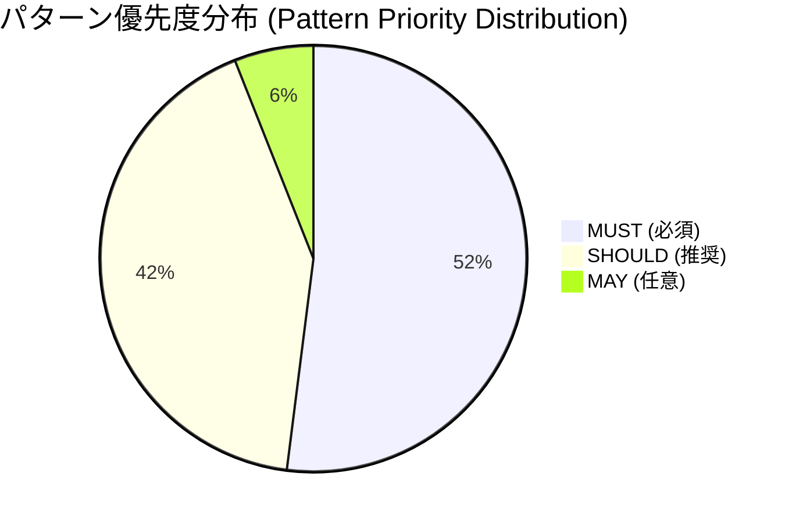
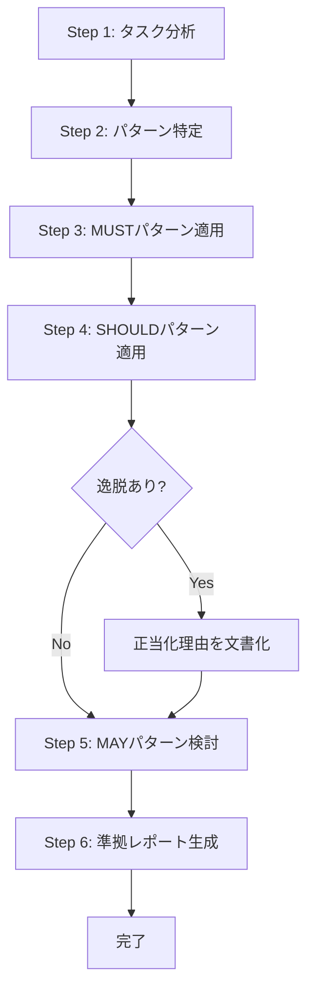
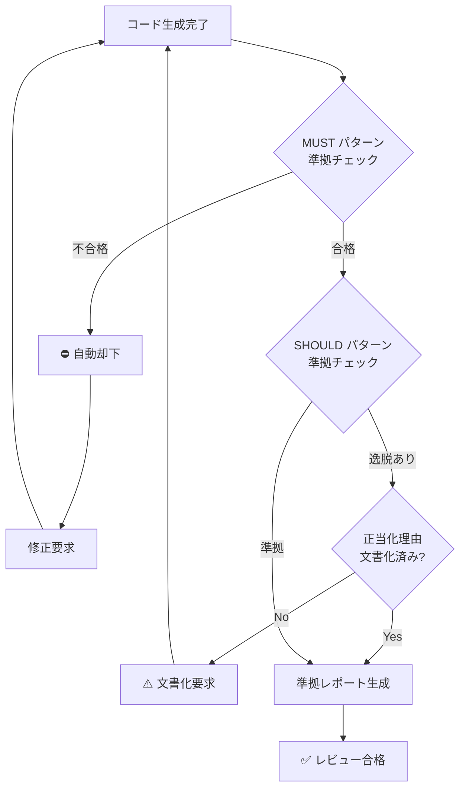

# コードスタイルカタログ (Code Style Catalog)

## CardDemo COBOL/CICS/BMS アプリケーション

---

## 目次 (Table of Contents)

1. [カタログ概要 (Overview)](#カタログ概要-overview)
2. [優先度定義 (Priority Level Definitions)](#優先度定義-priority-level-definitions)
3. [クイックリファレンスマトリックス (Quick Reference Matrix)](#クイックリファレンスマトリックス-quick-reference-matrix)
4. [ナビゲーション (Navigation Index)](#ナビゲーション-navigation-index)
5. [使用方法 (How to Use This Catalog)](#使用方法-how-to-use-this-catalog)
6. [準拠ワークフロー (Compliance Workflow)](#準拠ワークフロー-compliance-workflow)
7. [禁止事項 (Prohibited Patterns)](#禁止事項-prohibited-patterns)
8. [パターンエントリ形式 (Pattern Entry Format)](#パターンエントリ形式-pattern-entry-format)

---

## カタログ概要 (Overview)

### 目的 (Purpose)

本カタログは、CardDemoメインフレームアプリケーションから抽出されたコーディングパターンを文書化し、コード生成時の品質基準として機能します。

This catalog documents and enforces coding patterns extracted from the CardDemo mainframe application codebase. It serves as the **authoritative reference** for all code generation activities and pattern adherence.

### 対象範囲 (Scope)

本カタログは以下のソースファイルから抽出されたパターンを含みます:

| ソースディレクトリ | ファイル数 | 内容 |
|------------------|----------|------|
| `app/cbl/` | 28 | COBOL プログラム (バッチ・CICS) |
| `app/bms/` | 17 | BMS マップソース |
| `app/cpy/` | 28 | 共有コピーブック |
| `app/cpy-bms/` | 17 | BMS コピーブック |
| **合計** | **90** | **ソースファイル** |

### 使用場面 (Usage Context)

- **コード生成**: 新規コード生成時の模範パターン参照
- **コードレビュー**: 生成コードの品質検証基準
- **保守**: 既存コード修正時の一貫性確保
- **オンボーディング**: 新規開発者のパターン学習

---

## 優先度定義 (Priority Level Definitions)

本カタログでは、各パターンに以下の優先度レベルを付与しています:

| 優先度 | 日本語 | 英語 | 強制レベル | 説明 |
|--------|--------|------|------------|------|
| **MUST** | 必須 | Required | 違反は自動却下 | 交渉不可。違反した場合、自動的にレビュー不合格となる |
| **SHOULD** | 推奨 | Recommended | デフォルト適用、逸脱には文書化必要 | デフォルトで適用。逸脱する場合は文書化された正当化理由が必要 |
| **MAY** | 任意 | Optional | 開発者判断 | 開発者の裁量で適用可否を判断 |

### 強制ルール詳細 (Enforcement Rules)

#### MUST (必須) パターン

```plaintext
⛔ MUST違反 = 自動却下
```

- すべての生成コードは該当するMUSTパターンに準拠しなければならない
- MUST違反が検出された場合、コードレビューは自動的に不合格となる
- 例外は認められない

#### SHOULD (推奨) パターン

```plaintext
⚠️ SHOULD逸脱 = 正当化理由の文書化が必要
```

- デフォルトで適用される
- 逸脱する場合は以下が必要:
  - コード内コメントでの正当化理由の明記
  - 準拠レポートでの逸脱項目の記載

#### MAY (任意) パターン

```plaintext
ℹ️ MAY = 開発者判断
```

- 開発者が状況に応じて適用を判断
- 適用有無の文書化は不要

---

## クイックリファレンスマトリックス (Quick Reference Matrix)

各カテゴリにおけるパターン数の概要:

| カテゴリ | MUST | SHOULD | MAY | 合計 | ドキュメント |
|---------|------|--------|-----|------|-------------|
| アーキテクチャ | 7 | 4 | 1 | 12 | [architecture-patterns.md](architecture-patterns.md) |
| 命名規則 | 2 | 3 | 0 | 5 | [naming-conventions.md](naming-conventions.md) |
| エラー処理 | 3 | 4 | 0 | 7 | [error-handling.md](error-handling.md) |
| データベース | 7 | 2 | 0 | 9 | [data-contracts.md](data-contracts.md) |
| API/UI | 4 | 4 | 0 | 8 | [bms-patterns.md](bms-patterns.md) |
| テスト/検証 | 3 | 4 | 2 | 9 | [validation-patterns.md](validation-patterns.md) |
| **合計** | **26** | **21** | **3** | **50** | - |

### パターン分布 (Pattern Distribution)



---

## ナビゲーション (Navigation Index)

### パターンドキュメント

| ドキュメント | 説明 | 主要パターン |
|-------------|------|-------------|
| 📊 [統計サマリー (Statistics Summary)](index.md) | カタログ全体の統計情報 | パターン数、カバレッジ分析 |
| 🏗️ [アーキテクチャパターン (Architecture Patterns)](architecture-patterns.md) | COBOL プログラム構造 | DIVISION構造、段落番号、COPY文 |
| 📝 [命名規則 (Naming Conventions)](naming-conventions.md) | 命名規約 | プログラムID、コピーブック、フィールド |
| ⚠️ [エラー処理 (Error Handling)](error-handling.md) | エラーハンドリング | RESP/RESP2、APPL-RESULT、ABEND |
| 💾 [データ契約 (Data Contracts)](data-contracts.md) | データ構造定義 | レコードレイアウト、COMMAREA |
| 🖥️ [BMSパターン (BMS Patterns)](bms-patterns.md) | 画面定義パターン | DFHMSD、AI/AO、属性・色彩 |
| ✅ [検証パターン (Validation Patterns)](validation-patterns.md) | 入力検証パターン | 88レベル、日付検証 |
| 📋 [準拠レポート (Compliance Reporting)](compliance-reporting.md) | コンプライアンス報告 | レポート形式、チェックリスト |

### クイックアクセス

- **新規CICS プログラム作成**: [architecture-patterns.md](architecture-patterns.md) → [error-handling.md](error-handling.md) → [bms-patterns.md](bms-patterns.md)
- **新規バッチプログラム作成**: [architecture-patterns.md](architecture-patterns.md) → [error-handling.md](error-handling.md) → [data-contracts.md](data-contracts.md)
- **コピーブック作成**: [data-contracts.md](data-contracts.md) → [naming-conventions.md](naming-conventions.md)
- **BMS マップ作成**: [bms-patterns.md](bms-patterns.md) → [naming-conventions.md](naming-conventions.md)

---

## 使用方法 (How to Use This Catalog)

### ステップバイステップガイド



### Step 1: タスク分析 (Analyze Task)

生成するコードの種類を特定します:

| コード種別 | 主要参照ドキュメント |
|-----------|---------------------|
| CICS オンラインプログラム | architecture-patterns.md, error-handling.md, bms-patterns.md |
| バッチプログラム | architecture-patterns.md, error-handling.md, data-contracts.md |
| コピーブック | data-contracts.md, naming-conventions.md |
| BMS マップ | bms-patterns.md, naming-conventions.md |

### Step 2: パターン特定 (Identify Applicable Patterns)

該当するカテゴリのドキュメントを参照し、適用すべきパターンを特定します。

**例: CICS プログラムの場合**

1. `architecture-patterns.md` から:
   - IDENTIFICATION DIVISION 構造 (MUST)
   - PROCEDURE DIVISION 構造 (MUST)
   - 段落番号規則 (SHOULD)

2. `error-handling.md` から:
   - CICS RESP/RESP2 エラーハンドリング (MUST)
   - WS-RETURN-MSG メッセージング (SHOULD)

3. `bms-patterns.md` から:
   - DFHMSD 構造 (MUST)
   - AI/AO 二重ビューパターン (MUST)

### Step 3: MUST パターン適用 (Apply MUST Patterns)

**例外なく** すべての該当 MUST パターンを適用します。

```cobol
      * MUST: IDENTIFICATION DIVISION 構造
       IDENTIFICATION DIVISION.
       PROGRAM-ID.
           NEWPROGC.
       DATE-WRITTEN.
           February 2026.
       DATE-COMPILED.
           Today.
```

### Step 4: SHOULD パターン適用 (Apply SHOULD Patterns)

デフォルトで SHOULD パターンを適用します。逸脱する場合は正当化理由を文書化します。

```cobol
      * SHOULD: 段落番号規則に準拠
      * 0000: 初期化処理
      * 1000-8000: メイン処理
      * 9000: 終了処理
       0000-INITIALIZE.
           ...
       1000-MAIN-PROCESS.
           ...
       9000-TERMINATE.
           ...
```

### Step 5: MAY パターン検討 (Consider MAY Patterns)

開発者の裁量で MAY パターンの適用を判断します。

### Step 6: 準拠レポート生成 (Generate Compliance Report)

[compliance-reporting.md](compliance-reporting.md) の形式に従って準拠レポートを生成します。

---

## 準拠ワークフロー (Compliance Workflow)

### 検証フロー



### 検証ゲート要件 (Validation Gate Requirements)

| ゲート | 条件 | 結果 |
|--------|------|------|
| Gate 1: MUST検証 | すべてのMUSTパターンに準拠 | 不合格 → 自動却下 |
| Gate 2: SHOULD検証 | SHOULDパターンに準拠、または逸脱が正当化されている | 不合格 → 文書化要求 |
| Gate 3: レポート検証 | 準拠レポートが添付されている | 不合格 → レポート要求 |

### 準拠レポート添付要件

すべての生成コードには、以下の形式の準拠レポートを添付する必要があります:

```plaintext
=== カタログ準拠レポート ===
生成ファイル: [パス]
適用ルール数: [N]
MUST準拠: [合格/不合格]
SHOULD準拠: [合格/逸脱あり]
逸脱項目:
  - [ルール名]: [正当化理由]
```

詳細は [compliance-reporting.md](compliance-reporting.md) を参照してください。

---

## 禁止事項 (Prohibited Patterns)

以下の行為は**明示的に禁止**されています:

### ⛔ 禁止事項一覧

| # | 禁止事項 | 説明 |
|---|---------|------|
| 1 | **MUSTルール違反コード生成** | MUST優先度のカタログルールに違反するコードを生成すること |
| 2 | **模範スニペット無視** | カタログに同等の構造が存在する場合に、模範スニペットパターンを無視すること |
| 3 | **新規アーキテクチャ導入** | カタログが確立されたパターンを提供している場合に、新しいアーキテクチャアプローチを作成すること |
| 4 | **無断逸脱** | 明示的な正当化理由なしにカタログ検証基準から逸脱すること |
| 5 | **根拠矛盾** | カタログの根拠文書に矛盾するコードを生成すること |

### 禁止事項の詳細

#### 1. MUSTルール違反コード生成

```cobol
      * ❌ 禁止: RESP/RESP2 を省略した EXEC CICS
       EXEC CICS RECEIVE MAP('MYMAP')
                 MAPSET('MYMAPSET')
                 INTO(MYDATA)
       END-EXEC

      * ✅ 正解: RESP/RESP2 を含む EXEC CICS
       EXEC CICS RECEIVE MAP('MYMAP')
                 MAPSET('MYMAPSET')
                 INTO(MYDATA)
                 RESP(WS-RESP-CD)
                 RESP2(WS-REAS-CD)
       END-EXEC
```

#### 2. 模範スニペット無視

カタログに以下のような模範パターンが存在する場合:

```cobol
      * カタログ模範: 段落番号規則
       0000-INITIALIZE.
       1000-MAIN-PROCESS.
       9000-TERMINATE.
```

以下のような独自の番号体系を使用することは禁止されています:

```cobol
      * ❌ 禁止: 独自の番号体系
       PARA-INIT.
       PARA-MAIN.
       PARA-END.
```

#### 3. 新規アーキテクチャ導入

カタログが APPL-RESULT パターンを提供している場合:

```cobol
      * ✅ カタログパターン: APPL-RESULT
       01  APPL-RESULT             PIC S9(9)   COMP.
           88  APPL-AOK            VALUE 0.
           88  APPL-EOF            VALUE 16.
```

以下のような独自のリターンコード体系を作成することは禁止されています:

```cobol
      * ❌ 禁止: 独自のリターンコード体系
       01  MY-RETURN-CODE          PIC 9(2).
           88  SUCCESS             VALUE 00.
           88  END-FILE            VALUE 99.
```

---

## パターンエントリ形式 (Pattern Entry Format)

各パターンドキュメントでは、以下のYAML形式でパターンを記述しています:

```yaml
パターン名: [識別名]
優先度: MUST | SHOULD | MAY
カテゴリ: [アーキテクチャ | 命名規則 | エラー処理 | データベース | API | テスト]
ファイルパス: [模範実装の場所]
スニペット: |
  [コード例]
検証基準:
  - [チェック項目1]
  - [チェック項目2]
根拠: [このパターンを採用する理由]
```

### フィールド説明

| フィールド | 必須 | 説明 |
|-----------|------|------|
| パターン名 | ✅ | パターンの識別名（日本語） |
| 優先度 | ✅ | MUST / SHOULD / MAY のいずれか |
| カテゴリ | ✅ | パターンの分類カテゴリ |
| ファイルパス | ✅ | 模範実装が存在するソースファイルパス |
| スニペット | ✅ | 模範コード例（最大20行） |
| 検証基準 | ✅ | このパターンへの準拠を検証する基準のリスト |
| 根拠 | ✅ | このパターンを採用する理由の説明 |

### パターンエントリ例

```yaml
パターン名: CICS-RESP-RESP2-エラーハンドリング
優先度: MUST
カテゴリ: エラー処理
ファイルパス: app/cbl/COACTUPC.cbl:1040-1046
スニペット: |
  EXEC CICS RECEIVE MAP(LIT-THISMAP)
            MAPSET(LIT-THISMAPSET)
            INTO(CACTUPAI)
            RESP(WS-RESP-CD)
            RESP2(WS-REAS-CD)
  END-EXEC
検証基準:
  - すべてのEXEC CICSコマンドにRESPパラメータを含めること
  - RESPとRESP2の両方を常に取得すること
  - RESPコードをWS-RESP-CDに格納すること
根拠: CICS APIエラーを確実に捕捉し、適切なエラー処理を可能にするため
```

---

## 関連リソース (Related Resources)

### CardDemo アプリケーション

- **リポジトリ**: [README.md](../../README.md)
- **データモデル**: [diagrams/CARDDEMO-DataModel.drawio](../../diagrams/CARDDEMO-DataModel.drawio)

### 外部参照

- [Enterprise COBOL for z/OS](https://www.ibm.com/docs/en/cobol-zos)
- [CICS Transaction Server](https://www.ibm.com/docs/en/cics-ts)
- [BMS Macro Reference](https://www.ibm.com/docs/en/cics-ts/latest?topic=maps-bms-macros)

---

## 変更履歴 (Change History)

| バージョン | 日付 | 変更内容 |
|-----------|------|---------|
| 1.0 | 2026-02 | 初版作成 |

---

<!-- Ver: CodeStyleCatalog_v1.0 -->
