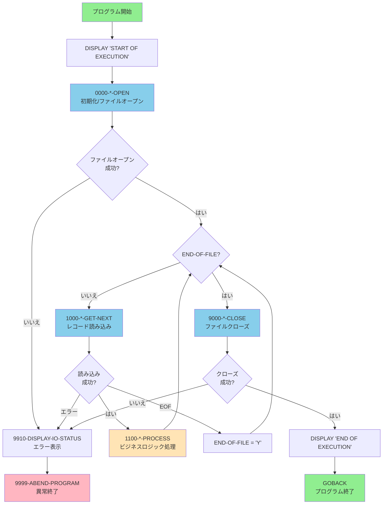
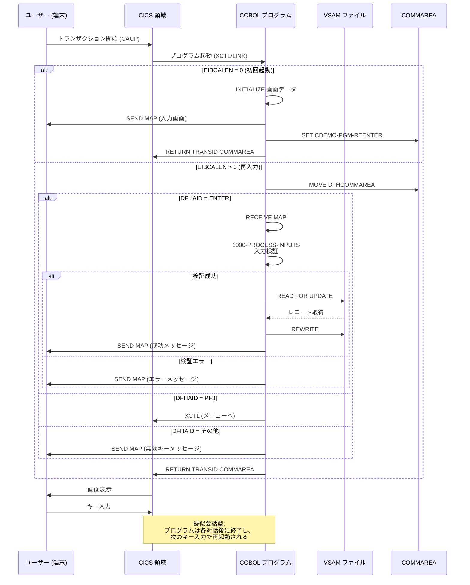

# アーキテクチャパターン (Architecture Patterns)

## CardDemo COBOL/CICS アプリケーション コードスタイルカタログ

本文書は、CardDemo メインフレームアプリケーションにおける COBOL プログラムのアーキテクチャパターンを定義します。すべてのコード生成は、本カタログのパターンに従う必要があります。

---

## 目次

- [必須パターン (MUST)](#必須パターン-must)
  - [IDENTIFICATION DIVISION構造](#identification-division構造)
  - [ENVIRONMENT DIVISION構造](#environment-division構造)
  - [DATA DIVISION組織](#data-division組織)
  - [PROCEDURE DIVISION構造](#procedure-division構造)
  - [Apache-2.0ライセンスヘッダー](#apache-20ライセンスヘッダー)
  - [バージョンタグコメント](#バージョンタグコメント)
  - [COPY文使用](#copy文使用)
- [推奨パターン (SHOULD)](#推奨パターン-should)
  - [段落番号規則](#段落番号規則)
  - [コメントブロック形式](#コメントブロック形式)
  - [セクション組織](#セクション組織)
  - [一貫したインデント](#一貫したインデント)
- [任意パターン (MAY)](#任意パターン-may)
  - [PERFORM...THRU構造](#performthru構造)
- [プログラム実行フロー図](#プログラム実行フロー図)
- [CICSトランザクションフロー図](#cicsトランザクションフロー図)

---

## 必須パターン (MUST)

以下のパターンは**必須**です。違反は自動却下となります。

---

### IDENTIFICATION DIVISION構造

```yaml
パターン名: IDENTIFICATION DIVISION構造
優先度: MUST
カテゴリ: アーキテクチャ
ファイルパス: app/cbl/COACTUPC.cbl:21-27
スニペット: |
   IDENTIFICATION DIVISION.
   PROGRAM-ID.
       COACTUPC.
   DATE-WRITTEN.
       July 2022.
   DATE-COMPILED.
       Today.
検証基準:
  - PROGRAM-ID はファイル名（拡張子除く）と一致すること
  - DATE-WRITTEN を含めること（作成時期を記述）
  - DATE-COMPILED を含めること（コンパイラが自動設定）
根拠: z/OS コンパイルのための標準プログラム識別。プログラム名の一貫性とコンパイル追跡を保証する。
```

**バッチプログラム例 (CBACT01C):**

```cobol
 IDENTIFICATION DIVISION.
 PROGRAM-ID.    CBACT01C.
 AUTHOR.        AWS.
```

**Source:** `app/cbl/CBACT01C.cbl:22-24`

---

### ENVIRONMENT DIVISION構造

```yaml
パターン名: ENVIRONMENT DIVISION構造
優先度: MUST
カテゴリ: アーキテクチャ
ファイルパス: app/cbl/CBACT01C.cbl:26-33
スニペット: |
   ENVIRONMENT DIVISION.
   INPUT-OUTPUT SECTION.
   FILE-CONTROL.
       SELECT ACCTFILE-FILE ASSIGN TO ACCTFILE
              ORGANIZATION IS INDEXED
              ACCESS MODE  IS SEQUENTIAL
              RECORD KEY   IS FD-ACCT-ID
              FILE STATUS  IS ACCTFILE-STATUS.
検証基準:
  - ファイルを使用するプログラムは必ず FILE-CONTROL を含めること
  - SELECT 文には ORGANIZATION（INDEXED/SEQUENTIAL/RELATIVE）を指定すること
  - SELECT 文には ACCESS MODE（SEQUENTIAL/RANDOM/DYNAMIC）を指定すること
  - SELECT 文には RECORD KEY を指定すること（INDEXED の場合）
  - SELECT 文には FILE STATUS を必ず指定すること
根拠: VSAM ファイル処理のための適切な構成。ファイルステータス監視によりエラー検出を確実にする。
```

**CICS プログラム例（ファイルなし）:**

```cobol
 ENVIRONMENT DIVISION.
 INPUT-OUTPUT SECTION.
```

**Source:** `app/cbl/COACTUPC.cbl:29-31`

**複数ファイル例 (CBSTM03B):**

```cobol
 ENVIRONMENT DIVISION.
 INPUT-OUTPUT SECTION.
 FILE-CONTROL.
     SELECT TRNX-FILE ASSIGN TO TRNXFILE
            ORGANIZATION IS INDEXED
            ACCESS MODE  IS SEQUENTIAL
            RECORD KEY   IS FD-TRNXS-ID
            FILE STATUS  IS TRNXFILE-STATUS.

     SELECT XREF-FILE ASSIGN TO   XREFFILE
            ORGANIZATION IS INDEXED
            ACCESS MODE  IS SEQUENTIAL
            RECORD KEY   IS FD-XREF-CARD-NUM
            FILE STATUS  IS XREFFILE-STATUS.
```

**Source:** `app/cbl/CBSTM03B.CBL:28-41`

---

### DATA DIVISION組織

```yaml
パターン名: DATA DIVISION組織
優先度: MUST
カテゴリ: アーキテクチャ
ファイルパス: app/cbl/CBACT01C.cbl:35-68
スニペット: |
   DATA DIVISION.
   FILE SECTION.
   FD  ACCTFILE-FILE.
   01  FD-ACCTFILE-REC.
       05 FD-ACCT-ID                        PIC 9(11).
       05 FD-ACCT-DATA                      PIC X(289).

   WORKING-STORAGE SECTION.

  *****************************************************************
   COPY CVACT01Y.
   01  ACCTFILE-STATUS.
       05  ACCTFILE-STAT1      PIC X.
       05  ACCTFILE-STAT2      PIC X.
検証基準:
  - DATA DIVISION は必ず含めること
  - FILE SECTION は WORKING-STORAGE SECTION の前に配置すること（ファイルを使用する場合）
  - FD（ファイル記述）は SELECT 文と対応すること
  - WORKING-STORAGE SECTION で共通データ定義に COPY を使用すること
  - FILE STATUS 用の 2 バイト変数を定義すること
根拠: 標準 COBOL データ構成。セクション順序はコンパイラ要件であり、COPY 使用でコード再利用を促進する。
```

**CICS プログラムの DATA DIVISION:**

```cobol
 DATA DIVISION.

 WORKING-STORAGE SECTION.
 01  WS-MISC-STORAGE.
******************************************************************
* General CICS related
******************************************************************
    05 WS-CICS-PROCESSNG-VARS.
       07 WS-RESP-CD                          PIC S9(09) COMP
                                              VALUE ZEROS.
       07 WS-REAS-CD                          PIC S9(09) COMP
                                              VALUE ZEROS.
```

**Source:** `app/cbl/COACTUPC.cbl:32-43`

---

### PROCEDURE DIVISION構造

```yaml
パターン名: PROCEDURE DIVISION構造
優先度: MUST
カテゴリ: アーキテクチャ
ファイルパス: app/cbl/CBACT01C.cbl:70-87
スニペット: |
   PROCEDURE DIVISION.
       DISPLAY 'START OF EXECUTION OF PROGRAM CBACT01C'.
       PERFORM 0000-ACCTFILE-OPEN.

       PERFORM UNTIL END-OF-FILE = 'Y'
           IF  END-OF-FILE = 'N'
               PERFORM 1000-ACCTFILE-GET-NEXT
               IF  END-OF-FILE = 'N'
                   DISPLAY ACCOUNT-RECORD
               END-IF
           END-IF
       END-PERFORM.

       PERFORM 9000-ACCTFILE-CLOSE.

       DISPLAY 'END OF EXECUTION OF PROGRAM CBACT01C'.

       GOBACK.
検証基準:
  - メインプロシージャは番号付き段落を PERFORM で呼び出すこと
  - バッチプログラムは GOBACK で終了すること
  - CICS プログラムは EXEC CICS RETURN で終了すること
  - 開始・終了時に DISPLAY でログ出力すること（バッチプログラム）
根拠: 構造化された段落呼び出しによる明確なプログラムフロー。GOBACK は呼び出し元プログラムまたは z/OS への適切な制御復帰を保証する。
```

**CICS プログラムの PROCEDURE DIVISION:**

```cobol
 PROCEDURE DIVISION.
 MAIN-PARA.

     SET ERR-FLG-OFF TO TRUE

     MOVE SPACES TO WS-MESSAGE
                    ERRMSGO OF COSGN0AO

     IF EIBCALEN = 0
         MOVE LOW-VALUES TO COSGN0AO
         MOVE -1       TO USERIDL OF COSGN0AI
         PERFORM SEND-SIGNON-SCREEN
     ELSE
         EVALUATE EIBAID
             WHEN DFHENTER
                 PERFORM PROCESS-ENTER-KEY
             WHEN DFHPF3
                 MOVE CCDA-MSG-THANK-YOU        TO WS-MESSAGE
                 PERFORM SEND-PLAIN-TEXT
             WHEN OTHER
                 MOVE 'Y'                       TO WS-ERR-FLG
                 MOVE CCDA-MSG-INVALID-KEY      TO WS-MESSAGE
                 PERFORM SEND-SIGNON-SCREEN
         END-EVALUATE
     END-IF.

     EXEC CICS RETURN
               TRANSID (WS-TRANID)
               COMMAREA (CARDDEMO-COMMAREA)
     END-EXEC.
```

**Source:** `app/cbl/COSGN00C.cbl:72-100`

**サブルーチンの PROCEDURE DIVISION USING:**

```cobol
 LINKAGE SECTION.
 01  LK-M03B-AREA.
     05  LK-M03B-DD          PIC X(08).
     05  LK-M03B-OPER        PIC X(01).
       88  M03B-OPEN       VALUE 'O'.
       88  M03B-CLOSE      VALUE 'C'.
       88  M03B-READ       VALUE 'R'.
     05  LK-M03B-RC          PIC X(02).
     05  LK-M03B-KEY         PIC X(25).
     05  LK-M03B-FLDT        PIC X(1000).

 PROCEDURE DIVISION USING LK-M03B-AREA.

 0000-START.
     EVALUATE LK-M03B-DD
       WHEN 'TRNXFILE'
         PERFORM 1000-TRNXFILE-PROC THRU 1999-EXIT
       WHEN OTHER
         GO TO 9999-GOBACK.

 9999-GOBACK.
     GOBACK.
```

**Source:** `app/cbl/CBSTM03B.CBL:99-131`

---

### Apache-2.0ライセンスヘッダー

```yaml
パターン名: Apache-2.0ライセンスヘッダー
優先度: MUST
カテゴリ: アーキテクチャ
ファイルパス: app/cbl/COACTUPC.cbl:6-20
スニペット: |
  * Copyright Amazon.com, Inc. or its affiliates.
  * All Rights Reserved.
  *
  * Licensed under the Apache License, Version 2.0 (the "License").
  * You may not use this file except in compliance with the License.
  * You may obtain a copy of the License at
  *
  *    http://www.apache.org/licenses/LICENSE-2.0
  *
  * Unless required by applicable law or agreed to in writing,
  * software distributed under the License is distributed on an
  * "AS IS" BASIS, WITHOUT WARRANTIES OR CONDITIONS OF ANY KIND,
  * either express or implied. See the License for the specific
  * language governing permissions and limitations under the License
  ******************************************************************
検証基準:
  - Amazon 著作権表示を含めること
  - 完全な Apache-2.0 ライセンステキストを含めること
  - ライセンス URL (http://www.apache.org/licenses/LICENSE-2.0) を含めること
  - ファイルの先頭（コメントブロック直後）に配置すること
根拠: 法的コンプライアンスとオープンソース帰属表示。すべてのソースファイルで一貫したライセンス声明を維持する。
```

**Source:** `app/cbl/COACTUPC.cbl:6-20`

---

### バージョンタグコメント

```yaml
パターン名: バージョンタグコメント
優先度: MUST
カテゴリ: アーキテクチャ
ファイルパス: app/cbl/CBACT01C.cbl:192
スニペット: |
  *
  * Ver: CardDemo_v1.0-15-g27d6c6f-68 Date: 2022-07-19 23:12:31 CDT
  *
検証基準:
  - 形式: Ver: [バージョン識別子] Date: [タイムスタンプ]
  - ファイル末尾に配置すること
  - バージョン識別子にはタグ名、コミットハッシュを含めること
  - 日付にはタイムゾーンを含めること
根拠: バージョン追跡と変更管理。ソースファイルの特定バージョンを識別可能にし、デバッグとリリース管理を支援する。
```

**Source:** `app/cbl/CBACT01C.cbl:192`

---

### COPY文使用

```yaml
パターン名: COPY文使用
優先度: MUST
カテゴリ: アーキテクチャ
ファイルパス: app/cbl/CBACT01C.cbl:45
スニペット: |
   COPY CVACT01Y.
検証基準:
  - すべての共有データ定義に COPY を使用すること
  - コピーブック名のみを参照すること（パス不要）
  - 同一レコードレイアウトを複数プログラムで使用する場合は必ずコピーブック化すること
  - IBM 提供コピーブック (DFHBMSCA, DFHAID) を適切に使用すること
根拠: コード再利用とインターフェース一貫性。単一のソースから定義を展開することで、データ構造の変更を一元管理できる。
```

**一般的なコピーブック使用例:**

```cobol
*IBM SUPPLIED COPYBOOKS
 COPY DFHBMSCA.
 COPY DFHAID.

*COMMON COPYBOOKS
*Screen Titles
 COPY COTTL01Y.

*Account Update Screen Layout
 COPY COACTUP.

*Current Date
 COPY CSDAT01Y.

*Common Messages
 COPY CSMSG01Y.

*Abend Variables
 COPY CSMSG02Y.

*Signed on user data
 COPY CSUSR01Y.

*Dataset layouts
*ACCT RECORD LAYOUT
 COPY CVACT01Y.

*Application Commmarea Copybook
 COPY COCOM01Y.
```

**Source:** `app/cbl/COACTUPC.cbl:614-650`

---

## 推奨パターン (SHOULD)

以下のパターンは**推奨**です。デフォルトで適用し、逸脱には文書化された正当な理由が必要です。

---

### 段落番号規則

```yaml
パターン名: 段落番号規則
優先度: SHOULD
カテゴリ: アーキテクチャ
ファイルパス: app/cbl/CBACT01C.cbl:70-189
スニペット: |
  * 段落構造:
  * 0000-*: 初期化/オープン処理
  * 1000-8000: メイン処理段落
  * 9000-*: クローズ/終了処理
  * 9910-*: 表示/診断ルーチン
  * 9999-*: 異常終了処理
検証基準:
  - 0000 番台: 初期化、ファイルオープン処理
  - 1000-8000 番台: ビジネスロジック、メイン処理
  - 9000 番台: ファイルクローズ、終了処理
  - 9910: I/O ステータス表示専用
  - 9999: 異常終了 (ABEND) 処理専用
  - 段落名は番号の後に説明的な名前を付けること（例: 0000-ACCTFILE-OPEN）
根拠: 一貫したナビゲーションと保守性の向上。番号体系により、プログラムの論理フローを即座に把握できる。
```

**実装例:**

```cobol
 PROCEDURE DIVISION.
     DISPLAY 'START OF EXECUTION OF PROGRAM CBACT01C'.
     PERFORM 0000-ACCTFILE-OPEN.

     PERFORM UNTIL END-OF-FILE = 'Y'
         PERFORM 1000-ACCTFILE-GET-NEXT
     END-PERFORM.

     PERFORM 9000-ACCTFILE-CLOSE.
     GOBACK.

*****************************************************************
* I/O ROUTINES TO ACCESS A KSDS, VSAM DATA SET...
*****************************************************************
 1000-ACCTFILE-GET-NEXT.
     READ ACCTFILE-FILE INTO ACCOUNT-RECORD.
     IF  ACCTFILE-STATUS = '00'
         MOVE 0 TO APPL-RESULT
         PERFORM 1100-DISPLAY-ACCT-RECORD
     ELSE
         ...
     END-IF
     EXIT.
*---------------------------------------------------------------*
 1100-DISPLAY-ACCT-RECORD.
     DISPLAY 'ACCT-ID                 :'   ACCT-ID
     ...
     EXIT.
*---------------------------------------------------------------*
 0000-ACCTFILE-OPEN.
     MOVE 8 TO APPL-RESULT.
     OPEN INPUT ACCTFILE-FILE
     IF  ACCTFILE-STATUS = '00'
         MOVE 0 TO APPL-RESULT
     ELSE
         MOVE 12 TO APPL-RESULT
     END-IF
     ...
     EXIT.
*---------------------------------------------------------------*
 9000-ACCTFILE-CLOSE.
     ADD 8 TO ZERO GIVING APPL-RESULT.
     CLOSE ACCTFILE-FILE
     ...
     EXIT.

 9999-ABEND-PROGRAM.
     DISPLAY 'ABENDING PROGRAM'
     MOVE 0 TO TIMING
     MOVE 999 TO ABCODE
     CALL 'CEE3ABD'.

*****************************************************************
 9910-DISPLAY-IO-STATUS.
     IF  IO-STATUS NOT NUMERIC
     OR  IO-STAT1 = '9'
         MOVE IO-STAT1 TO IO-STATUS-04(1:1)
         ...
     END-IF
     EXIT.
```

**Source:** `app/cbl/CBACT01C.cbl:70-189`

---

### コメントブロック形式

```yaml
パターン名: コメントブロック形式
優先度: SHOULD
カテゴリ: アーキテクチャ
ファイルパス: app/cbl/COACTUPC.cbl:1-5
スニペット: |
  **************************************** *************************
  * Program:     COACTUPC.CBL                                     *
  * Layer:       Business logic                                   *
  * Function:    Accept and process ACCOUNT UPDATE                *
  ******************************************************************
検証基準:
  - アスタリスク (*) で囲まれたボックス形式を使用すること
  - Program: プログラムファイル名を含めること
  - Layer: アプリケーション層（Business logic, Presentation, Data access 等）を記述すること
  - Function: プログラムの機能を簡潔に記述すること
  - ファイルの最初に配置すること（ライセンスヘッダーの前）
根拠: 明確なプログラム文書化。ファイルを開いた際に即座に目的を理解できる。
```

**バッチプログラム例:**

```cobol
******************************************************************
* Program     : CBACT01C.CBL
* Application : CardDemo
* Type        : BATCH COBOL Program
* Function    : Read and print account data file.
******************************************************************
```

**Source:** `app/cbl/CBACT01C.cbl:1-6`

---

### セクション組織

```yaml
パターン名: セクション組織
優先度: SHOULD
カテゴリ: アーキテクチャ
ファイルパス: app/cbl/COACTUPC.cbl:36-38
スニペット: |
  ******************************************************************
  * General CICS related
  ******************************************************************
     05 WS-CICS-PROCESSNG-VARS.
        07 WS-RESP-CD                          PIC S9(09) COMP
                                               VALUE ZEROS.
検証基準:
  - 関連する変数やデータをセクションごとにグループ化すること
  - セクション区切りにはアスタリスク行を使用すること
  - 各セクションには目的を説明するコメントを含めること
  - 論理的なグループ分け: CICS 関連、入力編集、リテラル/定数、コピーブック参照
根拠: コード組織と可読性の向上。関連するデータ定義を容易に見つけられる。
```

**セクショングループの例:**

```cobol
******************************************************************
*      Input edits
******************************************************************
*  Generic Input Edits
   05  WS-GENERIC-EDITS.
     10 WS-EDIT-VARIABLE-NAME                PIC X(25).
     ...

******************************************************************
*      Literals and Constants
******************************************************************
 01 WS-LITERALS.
    05 LIT-THISPGM                           PIC X(8)
                                             VALUE 'COACTUPC'.
    ...

******************************************************************
*Other common working storage Variables
******************************************************************
 COPY CVCRD01Y.
```

**Source:** `app/cbl/COACTUPC.cbl:48-602`

---

### 一貫したインデント

```yaml
パターン名: 一貫したインデント
優先度: SHOULD
カテゴリ: アーキテクチャ
ファイルパス: 全プログラム
スニペット: |
  * 列 1-6  : 行番号（オプション）
  * 列 7    : インジケータ領域（* でコメント、- で継続）
  * 列 8-11 : A 領域（DIVISION、SECTION、段落名、01/77 レベル）
  * 列 12-72: B 領域（文、02-49 レベルのデータ項目）
  * 列 73-80: 識別領域（オプション）
検証基準:
  - DIVISION, SECTION, 段落名は A 領域（列 8-11）から開始すること
  - 文（MOVE, PERFORM 等）は B 領域（列 12 以降）から開始すること
  - 継続行は列 12 以降からの適切なインデントを維持すること
  - レベル番号に応じた一貫したインデントを使用すること
根拠: COBOL コンパイラ要件と可読性。正しい領域の使用はコンパイルに必須であり、一貫したインデントはコードの理解を助ける。
```

**インデント例:**

```cobol
       IDENTIFICATION DIVISION.                      <- 列 8 から開始
       PROGRAM-ID.    CBACT01C.                      <- 列 8 から開始
                                                      
       DATA DIVISION.                                <- 列 8 から開始
       WORKING-STORAGE SECTION.                      <- 列 8 から開始
       01  ACCTFILE-STATUS.                          <- 01 レベルは列 8
           05  ACCTFILE-STAT1      PIC X.            <- 05 レベルはインデント
           05  ACCTFILE-STAT2      PIC X.            <- 一貫したインデント
                                                      
       PROCEDURE DIVISION.                           <- 列 8 から開始
           DISPLAY 'START'.                          <- 文は列 12 から
           PERFORM 0000-ACCTFILE-OPEN.               <- 文は列 12 から
           IF  ACCTFILE-STATUS = '00'                <- IF 文
               MOVE 0 TO APPL-RESULT                 <- 条件内の文はさらにインデント
           END-IF                                    <- END-IF は IF と揃える
           EXIT.                                     <- 段落終了
```

**Source:** `app/cbl/CBACT01C.cbl:22-116`

---

## 任意パターン (MAY)

以下のパターンは**任意**です。開発者の判断で適用します。

---

### PERFORM...THRU構造

```yaml
パターン名: PERFORM...THRU構造
優先度: MAY
カテゴリ: アーキテクチャ
ファイルパス: app/cpy/CSUTLDPY.cpy:7-9
スニペット: |
  * ***  PERFORM EDIT-DATE-CCYYMMDD
  *         THRU EDIT-DATE-CCYYMMDD-EXIT
  *         to validate CCYYMMDD dates
検証基準:
  - 終了段落には -EXIT サフィックスを使用すること
  - 明確なスコープ境界を維持すること
  - 複雑な処理ロジックで複数段落にまたがる場合に使用すること
  - EXIT 段落には EXIT 文のみを含めること
根拠: 複雑な操作に対する明示的な段落範囲の指定。複数の関連段落をグループ化し、一貫した終了点を提供する。
```

**実装例:**

```cobol
 EDIT-DATE-CCYYMMDD.
     SET WS-EDIT-DATE-IS-INVALID   TO TRUE
     .

******************************************************************
*Check for valid year and century
******************************************************************
 EDIT-YEAR-CCYY.
     SET FLG-YEAR-NOT-OK             TO TRUE

     IF WS-EDIT-DATE-CCYY            EQUAL LOW-VALUES
     OR WS-EDIT-DATE-CCYY            EQUAL SPACES
        SET INPUT-ERROR              TO TRUE
        SET  FLG-YEAR-BLANK          TO TRUE
        IF WS-RETURN-MSG-OFF
           STRING
             FUNCTION TRIM(WS-EDIT-VARIABLE-NAME)
             ' : Year must be supplied.'
             DELIMITED BY SIZE
             INTO WS-RETURN-MSG
        END-IF
*       Intentional violation of structured programming norms
        GO TO EDIT-YEAR-CCYY-EXIT
     ELSE
        CONTINUE
     END-IF
     ...
 EDIT-YEAR-CCYY-EXIT.
     EXIT.

 EDIT-DATE-CCYYMMDD-EXIT.
     EXIT.
```

**Source:** `app/cpy/CSUTLDPY.cpy:18-42`

**サブルーチンでの PERFORM...THRU:**

```cobol
 0000-START.

     EVALUATE LK-M03B-DD
       WHEN 'TRNXFILE'
         PERFORM 1000-TRNXFILE-PROC THRU 1999-EXIT
       WHEN 'XREFFILE'
         PERFORM 2000-XREFFILE-PROC THRU 2999-EXIT
       WHEN 'CUSTFILE'
         PERFORM 3000-CUSTFILE-PROC THRU 3999-EXIT
       WHEN 'ACCTFILE'
         PERFORM 4000-ACCTFILE-PROC THRU 4999-EXIT
       WHEN OTHER
         GO TO 9999-GOBACK.
```

**Source:** `app/cbl/CBSTM03B.CBL:116-128`

---

## プログラム実行フロー図

以下の図は、バッチ COBOL プログラムの典型的な実行フローを示します。



---

## CICSトランザクションフロー図

以下の図は、CICS 疑似会話型プログラムのトランザクションフローを示します。



---

## 関連ドキュメント

- [命名規則 (Naming Conventions)](naming-conventions.md) - プログラム ID とフィールド命名パターン
- [エラー処理 (Error Handling)](error-handling.md) - RESP/RESP2 とエラー処理パターン
- [データ契約 (Data Contracts)](data-contracts.md) - コピーブック構造とレコードレイアウト
- [BMSパターン (BMS Patterns)](bms-patterns.md) - 画面定義と AI/AO パターン
- [検証パターン (Validation Patterns)](validation-patterns.md) - 入力検証と 88 レベルパターン
- [準拠レポート (Compliance Reporting)](compliance-reporting.md) - コンプライアンスレポート形式

---

## パターンサマリー

| パターン名 | 優先度 | カテゴリ | 主要ソースファイル |
|-----------|--------|----------|-------------------|
| IDENTIFICATION DIVISION構造 | MUST | アーキテクチャ | COACTUPC.cbl |
| ENVIRONMENT DIVISION構造 | MUST | アーキテクチャ | CBACT01C.cbl |
| DATA DIVISION組織 | MUST | アーキテクチャ | CBACT01C.cbl |
| PROCEDURE DIVISION構造 | MUST | アーキテクチャ | CBACT01C.cbl |
| Apache-2.0ライセンスヘッダー | MUST | アーキテクチャ | COACTUPC.cbl |
| バージョンタグコメント | MUST | アーキテクチャ | CBACT01C.cbl |
| COPY文使用 | MUST | アーキテクチャ | CBACT01C.cbl |
| 段落番号規則 | SHOULD | アーキテクチャ | CBACT01C.cbl |
| コメントブロック形式 | SHOULD | アーキテクチャ | COACTUPC.cbl |
| セクション組織 | SHOULD | アーキテクチャ | COACTUPC.cbl |
| 一貫したインデント | SHOULD | アーキテクチャ | 全プログラム |
| PERFORM...THRU構造 | MAY | アーキテクチャ | CSUTLDPY.cpy |

---

<!-- Ver: CodeStyleCatalog_v1.0 Date: 2024 -->
